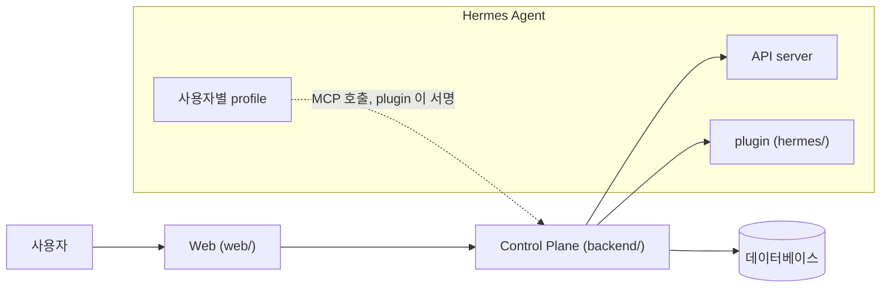

# fos-assistant

[English](README.md) | 한국어

모델에도 어떤 제품에도 종속되지 않고, 쓰는 사람 자신의 것인 개인 AI 비서다.
Nous Research 의 [Hermes Agent](https://github.com/NousResearch/hermes-agent) 위에 얹는 self-hosted Control Plane 과 웹이고, 범용 커넥터와 자기 에이전트를 연결해 자기만의 agentic workflow 를 만든다.
기억에는 사람이 승인한 것만 남는다.
같은 목적을 가진 사람들은 그룹(예: 가족)으로 함께 쓰고, 에이전트는 각자 갖는다.

제품 이름은 아직 정하지 않았다. 지금은 `fos-assistant` 라고 부른다.

## 만드는 까닭

특정 모델이나 제품에 종속되지 않고, 자유로운 개인 누구나 자기 비서를 갖게 되기를 바란다.
그러려고 여러 범용 커넥터를 연결해 자기만의 agentic workflow 를 만들 수 있게 하는 것이 목표다.

- **모델에 종속되지 않는다.** 대화는 빠르게, 균형, 깊게 가운데 한 단계를 고르고, 그 단계가 실제로 어느 모델인지는 Control Plane 의 데이터베이스가 정책으로 갖는다. 런타임도 떨어져 있다. 에이전트를 돌리는 것은 Hermes Agent 이고, 이 저장소는 누가 무엇을 쓸 수 있는지 정하고 화면을 만들고 쓴 것을 기록한다.
- **제품에 종속되지 않는다.** 커넥터는 plugin 의 `connector.json` 이 선언하고, Control Plane 은 범용 흐름만 갖는다. Control Plane 은 커넥터 뒤에 있는 서비스의 이름과 주소를 모른다. 커넥터를 더할 때는 plugin 에 `connector.json` 을 두고 Hermes 대시보드의 커넥터 목록에 한 줄을 더하며, Control Plane 과 웹은 고치지 않는다([ADR-043](docs/adr/ADR-043-커넥터는-plugin-의-connector-json-으로-선언하고-control-plane-은-범용-흐름만-갖는다.md)).
- **자기 것이다.** 에이전트가 쓰는 도구와 기억, 대화가 쓰는 모델을 그 사람이 정한다.
- **이 비서가 사용자에 대한 장기 지식의 기준 원본이다.** 에이전트와 외부 서비스는 허용된 범위만 읽는다. 서비스 토큰은 읽기 전용이고, 민감 항목의 본문은 암호화해 저장한다.

범용 커넥터는 이 저장소의 `hermes/connectors/` 에 두고 여기서 유지보수한다([ADR-059](docs/adr/ADR-059-범용-커넥터는-이-저장소의-hermes-connectors-에-두고-저장소가-유지보수한다.md)).
첫 커넥터는 Gmail 이다. 메일을 찾고 읽는 것은 묻지 않고 하고, 초안 만들기와 보내기와 답장과 라벨 바꾸기는 승인한 뒤에만 한다. 메일을 휴지통으로 옮기거나 지우지 않는다.
한 집이나 한 조직만 쓰는 서비스의 커넥터는 그 서비스의 저장소에 둔다. 지금 붙어 있는 가계부가 그렇다.
범용 커넥터를 늘리는 것은 진행하고 있는 방향이고, 이미 끝난 일이 아니다.

## 지키는 원칙

1. **자기 것이다.** 에이전트의 도구와 기억, 대화의 모델을 그 사람이 정한다.
2. **섞이지 않는다.** 남의 기억과 credential 이 자기 실행에 들어오지 않는다.
3. **지휘한다.** 하나가 끝나기를 기다리지 않고 여러 에이전트에 나눠 돌리고 합친다. 무엇을 나눌지는 에이전트가 정하고, 누가 무엇을 볼 수 있는지는 Control Plane 이 정한다.
4. **남는다.** 한 번 알아낸 것을 다음 대화가 다시 묻지 않는다.

네 원칙을 받치는 것이 하나 더 있다. **사람이 늘어도 같은 방식으로 는다.**
한 사람을 더하는 일은 관리자의 판단 하나로 끝나고, 그 사람 때문에 다른 사람이 느려지거나 남의 것을 보게 되지 않는다.

## 하는 일

- **커넥터와 승인.** 외부 서비스의 개인 토큰을 등록하면 그 서비스 전용 에이전트를 쓴다. 그 서비스에 쓰는 호출은 사용자가 승인한 뒤에, 승인한 인자 그대로 한 번만 실행된다.
- **위임.** 요청 하나를 여러 에이전트에 나눠 돌린다. 맡긴 실행도 요청자의 권한으로만 돈다.
- **에이전트 만들기와 공개.** 화면에서 에이전트를 만들고 성격을 쓰고 도구를 고른다. 그룹에 공개하면 다른 사용자도 그 에이전트와 대화하고, 각자의 기억과 대화는 서로 보이지 않는다.
- **스킬과 `/커맨드`.** 에이전트에 스킬을 올리고, 입력창에 `/` 를 쳐서 스킬을 바로 부른다.
- **모델 단계.** 대화마다 빠르게, 균형, 깊게를 고르고, 고급에서 모델을 직접 고른다.
- **승인 기반 Memory.** 에이전트는 기억을 제안만 한다. 사람이 받아들이기 전에는 대화에 실리지 않는다. 항목은 collection 에 속하고, 에이전트는 허용된 collection 만 받는다. 항목을 고치거나 지워도 그 전의 값이 남는다.
- **실행 나무와 비용 환산.** 실패한 실행까지 모두 기록한다. 실행 하나를 열면 그 안에서 부른 도구와 자식 실행이 나무로 보인다. 구독제로 돌린 실행도 API 가격으로 환산해 보여, 관리자가 설정별 비용을 견준다.
- **사진과 HTML 결과물.** 사진을 올려 에이전트에게 보이고, 에이전트가 만든 HTML 페이지를 옆 패널에서 본다. 그 페이지의 스크립트는 돌지 않는다.
- **다른 서비스의 읽기 전용 접근.** 사용자에 묶인 서비스 토큰으로 다른 서비스가 그 사용자의 문서만 읽는다.

collection 을 고치는 화면, 앞선 판을 읽는 화면, 문서를 사람이 직접 쓰는 화면은 계획이고 아직 만들지 않았다.
전체 범위와 항목별 확인 방법은 [`docs/prd.md`](docs/prd.md) 에 있다.

## 하지 않는 일

- **Hermes core 를 고치지 않는다.** profile, API server, plugin hook 이라는 공식 확장 지점만 쓴다.
- **사람이 보지 않은 것을 기억에 남기지 않는다.** Hermes 내장 memory 도구를 에이전트에 주지 않는다. 기억에 닿는 길은 Control Plane 하나다.
- **비밀값을 데이터베이스에 넣지 않는다.** AI credential 과 커넥터 토큰은 Hermes profile 안에만 있고, 서비스 토큰은 해시로만 저장한다.
- **누구나 가입하는 서비스가 아니다.** 그룹에 사람을 더하는 것은 관리자가 한다.
- **에이전트가 만든 페이지의 스크립트를 돌리지 않는다.**
- **운영 절차를 갖지 않는다.** 배포와 환경마다 다른 값은 운영하는 쪽이 갖는다.

## 구조



| 층 | 맡는 일 |
| --- | --- |
| Hermes Agent | 에이전트 실행, 도구 호출, subagent, session |
| Control Plane (`backend/`) | 사용자, 에이전트 접근 권한, Memory 접근 권한, 모델 라우팅, 사용량 집계 |
| Web (`web/`) | 대화, 실행 상태, Memory 확인, 사용량 확인 |
| Hermes 쪽 코드 (`hermes/`) | 자기 Hermes 에 설치하는 plugin 과 profile 틀 |

실행할 profile 은 언제나 요청자의 바인딩에서 꺼낸다.
요청 본문이 profile 을 정하지 못한다.

## 상태

초기 단계의 프로젝트다.
한 가족이 실제로 쓰고 있고, 배포된 곳은 아직 그 하나다.

- 공개 API 와 데이터베이스 스키마는 예고 없이 바뀔 수 있다.
- 결정만 기록하고 아직 구현하지 않은 것이 있다. [ADR 색인](docs/adr/INDEX.md)이 그것을 표시한다.
- 단계별 self-hosting 안내서는 아직 없다.
- 로드맵은 [이슈 #97](https://github.com/jon890/fos-assistant/issues/97) 에서 관리한다.

## 시작하기

### 요구 버전

| 도구 | 버전 |
| --- | --- |
| Java | 21 |
| Node.js | 22.18 이상 |
| pnpm | 10 |
| Python | 3.13 (Hermes plugin 검사에 쓴다) |
| Hermes Agent | v2026.9.24 에서 확인했다 |

### 서버 없이 전체 흐름 보기

`test/e2e` 가 Hermes Runs API 대역을 같은 프로세스에 띄우므로 Hermes 를 설치하지 않아도 된다.
backend 는 이 검사가 직접 띄우므로 Java 는 있어야 한다.

```bash
node test/e2e/run.ts
```

로그인 토큰 발급부터 에이전트 등록, 대화 한 번, 사용량 기록과 비용 환산까지 한 번에 돌린다.
시나리오는 `test/e2e/scenarios/` 에 하나씩 나뉘어 있다.

### Hermes 설치 묶음 만들기

`hermes/bundle.sh` 가 plugin 과 profile 틀을 담은 설치 묶음을 만든다.

```bash
hermes/bundle.sh --out <디렉터리> --mcp-url <Control Plane MCP 주소>
```

묶음의 모양과 설치할 때 받는 값은 [`hermes/README.md`](hermes/README.md) 에 있다.
환경 변수와 기술 스택은 [`docs/self-hosting.md`](docs/self-hosting.md) 에 있다.

## 기여

이슈와 PR 은 영어와 한국어를 모두 받는다.
내부 문서(`docs/`, `AGENTS.md`, 커밋 메시지)는 한국어로 쓴다. 이 글이 가리키는 문서도 한국어다.
이 프로젝트가 Hermes 를 어떻게 쓰는지는 [`docs/hermes/README.md`](docs/hermes/README.md) 에 있다.

- [`AGENTS.md`](AGENTS.md) 에 저장소의 규칙이 있다. 공개 저장소에 적으면 안 되는 것도 거기 있다.
- [`docs/README.md`](docs/README.md) 는 문서 전체의 색인이다.
- [`docs/adr/INDEX.md`](docs/adr/INDEX.md) 는 되돌리기 어려운 결정의 목록이다.
- `scripts/check-local.sh` 는 CI 가 돌리는 검사를 모두 돌린다. PR 을 열기 전에 돌린다.

### 커넥터 기여

범용 커넥터는 `hermes/connectors/<id>/` 디렉터리 하나다. 커넥터를 더하는 PR 은 아래를 갖춘다.

- `schema: 2` 인 `connector.json`. MCP 서버가 내는 도구를 모두 선언하고, 도구마다 위험도와 그 까닭을 커넥터 문서에 적는다.
- 쓰는 호출은 승인을 받는다. 데이터를 계정 밖의 사람에게 보내는 도구는 `"grant": false` 도 선언해 호출마다 사람이 승인한다. 지우는 도구는 열지 않는다.
- 비밀값은 `fields` 에 선언한 환경 변수로만 받고, 동작하는 가장 작은 OAuth scope 나 권한을 쓴다.
- MCP 서버는 Python 으로 쓰고 `mcp` SDK 밖의 의존성을 두지 않는다. 검사는 그 서비스를 흉내 낸 로컬 대역으로 돌고 실제 서비스에 닿지 않는다.
- `docs/connectors/` 아래의 설정 안내 문서와 `.github/CODEOWNERS` 의 소유자 한 줄.

`hermes/tests/test_connectors_contract.py` 가 `hermes/connectors/` 아래 디렉터리를 모두 찾아 계약을 본다. 새 커넥터는 더하는 순간 검사 대상이 된다.
자세한 안내는 [`docs/connector-authoring.md`](docs/connector-authoring.md) 에 있고, 따라 할 본보기는 [`hermes/connectors/gmail/`](hermes/connectors/gmail) 이다.

## 라이선스

[Apache License 2.0](LICENSE)
