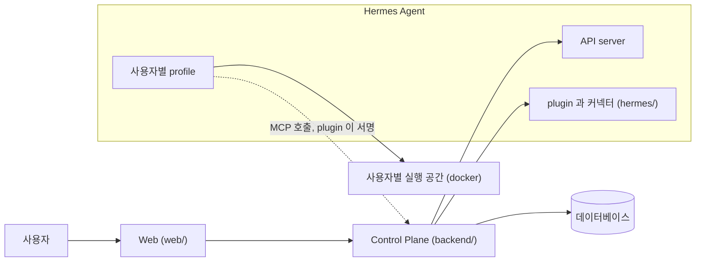

# fos-assistant

[English](README.md) | 한국어

모델에도 어떤 제품에도 종속되지 않고, 쓰는 사람 자신의 것인 개인 AI 비서다.
Nous Research 의 [Hermes Agent](https://github.com/NousResearch/hermes-agent) 위에 얹는 self-hosted Control Plane 과 웹이고, 범용 커넥터와 자기 에이전트를 연결해 자기만의 agentic workflow 를 만든다.
기억에는 사용자가 직접 말하거나 쓰거나 받아들인 것만 남는다.
에이전트는 묻기 전에 먼저 살펴보고 제안할 수 있지만, 무엇까지 할지는 모델이 아니라 Control Plane 의 규칙이 정한다.
같은 목적을 가진 사람들은 그룹(예: 가족)으로 함께 쓰고, 에이전트는 각자 갖는다.

제품 이름은 아직 정하지 않았다. 지금은 `fos-assistant` 라고 부른다.

## 한눈에 보기

아래 화면에 보이는 값은 모두 지어낸 데모 데이터다.
브라우저 검사와 같은 로컬 구성에서 스크립트가 찍었고, 실제 운영 화면은 찍지 않았다.

**대화를 시작한다.** 자기 에이전트 하나와 단계(빠르게, 균형, 깊게)를 고르고, 글을 쓰거나 추천 질문을 누른다.


**일하는 과정을 본다.** 답을 만드는 동안 도구 호출과 도우미 에이전트가 한 줄씩 보인다.


**쓰기 전에 승인한다.** 외부 서비스에 쓰는 커넥터 호출은 보낼 내용을 그대로 보이는 카드에서 승인을 기다린다.


**무엇을 기억할지 정한다.** 바깥 글을 읽지 않은 대화에서 직접 말한 사실은 에이전트가 바로 기억하고, 답 아래에서 고치거나 되돌릴 수 있다. 그 밖에 에이전트가 남기는 기억은 제안으로 남고, 사용자가 받아들인 뒤에야 다음 대화에 쓰인다.


<details>
<summary>화면 더 보기: 실행 트리, 문서, 에이전트 설정, 사용량과 비용</summary>

**실행 트리.** 끝난 답을 열면 그 답이 한 일을 옆 패널에서 차례로 본다.


**문서와 collection.** 긴 글은 collection 에 속한 문서로 둔다. 민감 문서는 암호화해 저장한다.


**에이전트 설정.** 에이전트의 성격을 쓰고 도구를 켜고 끈다.


**사용량과 비용.** 관리자는 에이전트별 실행 수를 보고, 구독제로 돌린 실행은 API 가격으로 환산한 금액으로 본다.


</details>

다시 찍으려면 `web/` 에서 `pnpm screenshots` 를 돌린다. 스크립트는 `test/screenshots/tour.shots.ts` 다.
지금 화면(`/now`), 연결 화면, 예약 작업 화면은 아직 이 둘러보기에 찍지 않았다.

## 만드는 까닭

특정 모델이나 제품에 종속되지 않고, 자유로운 개인 누구나 자기 비서를 갖게 되기를 바란다.
그러려고 여러 범용 커넥터를 연결해 자기만의 agentic workflow 를 만들 수 있게 하는 것이 목표다.

- **모델에 종속되지 않는다.** 대화는 빠르게, 균형, 깊게 가운데 한 단계를 고르고, 그 단계가 실제로 어느 모델인지는 Control Plane 의 데이터베이스가 정책으로 갖는다. 런타임도 떨어져 있다. 에이전트를 돌리는 것은 Hermes Agent 이고, 이 저장소는 누가 무엇을 쓸 수 있는지 정하고 화면을 만들고 쓴 것을 기록한다.
- **제품에 종속되지 않는다.** 커넥터는 plugin 의 `connector.json` 이 선언하고, Control Plane 은 범용 흐름만 갖는다. Control Plane 은 커넥터 뒤에 있는 서비스의 이름과 주소를 모른다. 커넥터를 더할 때는 plugin 에 `connector.json` 을 두고 Hermes 대시보드의 커넥터 목록에 한 줄을 더하며, Control Plane 과 웹은 고치지 않는다([ADR-043](backend/docs/adr/ADR-043-커넥터는-plugin-의-connector-json-으로-선언하고-control-plane-은-범용-흐름만-갖는다.md)).
- **자기 것이다.** 에이전트가 쓰는 도구와 기억, 대화가 쓰는 모델을 그 사람이 정한다.
- **이 비서가 사용자에 대한 장기 지식의 기준 원본이다.** 에이전트와 외부 서비스는 허용된 범위만 읽는다. 서비스 토큰은 읽기 전용이고, 민감 항목의 본문은 암호화해 저장한다.

범용 커넥터는 이 저장소의 `hermes/connectors/` 에 두고 여기서 유지보수한다([ADR-064](hermes/docs/adr/ADR-064-범용-커넥터는-이-저장소의-hermes-connectors-에-두고-저장소가-유지보수한다.md)).
첫 커넥터는 Gmail 이다. 메일과 필터를 찾고 읽는 것은 묻지 않고 하고, 초안 만들기와 보내기와 답장, 라벨 관리와 필터 변경은 승인한 뒤에만 한다. 메일을 휴지통으로 옮기거나 지우지 않는다.
두 번째는 네이버 블로그다. 「내 브라우저」 에 로그인해 둔 네이버 계정으로, 승인한 글을 대화에 올린 사진과 함께 네이버 블로그에 임시저장한다. 발행하지 않는다.
세 번째는 토스증권이다. 자기 계좌의 보유 종목과 시세, 주문 가능 현금, 주문 내역을 읽는다. 주문하지 않는다. 연결 하나는 실행 공간이 있는 에이전트 하나에만 붙는다.
한 집이나 한 조직만 쓰는 서비스의 커넥터는 그 서비스의 저장소에 둔다. 지금 붙어 있는 가계부가 그렇다.
범용 커넥터를 늘리는 것은 진행하고 있는 방향이고, 이미 끝난 일이 아니다.

## 다른 선택지와 다른 점

비슷한 일을 하는 도구가 이미 있고, 그 가운데 여럿은 이 프로젝트보다 훨씬 성숙했다.
아래 표는 각 도구가 무엇인지를 되도록 그 도구의 공식 문서에 적힌 대로 옮기고, 이 프로젝트가 다르게 하는 것을 적는다.

| 선택지 | 무엇인지 | 이 프로젝트가 다른 점 |
| --- | --- | --- |
| ChatGPT, Claude 같은 호스팅 비서 앱 | 모델을 만든 회사가 운영하고 설치할 것이 없다. 예를 들어 Claude 는 [대화하는 동안 기억을 저장](<https://support.claude.com/en/articles/11817273-using-claude-s-chat-search-and-memory-to-build-on-previous-context>)하고, 사용자는 설정에서 그 기억을 읽고 고치고 지운다. | 자기 서버에서 돈다. 단계가 어느 모델인지는 자기 데이터베이스의 정책 행이 정한다. 에이전트가 바로 기억하는 것은 사용자가 대화에서 직접 말한 사실뿐이고, 나머지는 사람이 받아들이기 전에는 쓰이지 않는다. |
| [Open WebUI](https://docs.openwebui.com/), [LibreChat](https://www.librechat.ai/docs) 같은 자체 호스팅 채팅 화면 | Open WebUI 는 스스로를 Ollama 와 OpenAI 호환 API 를 지원하는 self-hosted AI platform 이라고 소개한다. LibreChat 은 agent 와 MCP, custom endpoint 를 갖춘 self-hosted web application 이다. | 이 프로젝트는 모델 API 를 직접 부르지 않고 에이전트 런타임 위에 얹는다. 거기에 사람마다 격리된 Hermes profile, 어느 에이전트가 어느 기억을 받는지 정하는 collection, 커넥터 쓰기의 승인 단계, 에이전트 사이의 위임과 실행 트리, 사용량을 API 가격으로 환산하는 원장을 더한다. |
| [Hermes Agent](https://hermes-agent.nousresearch.com/docs/) 를 혼자 쓰는 경우 | CLI 나 메시징 gateway 로 쓰는 자율 에이전트이고, 자체 persistent memory 와 skill 과 subagent 를 갖는다. | 여러 사람이 함께 쓰는 웹 화면을 더한다. 실행할 profile 은 요청자의 바인딩에서 꺼낸다. 기억은 Control Plane 만 거치고, Hermes 내장 memory 도구는 에이전트에 주지 않는다. 외부 서비스는 읽기 전용 서비스 토큰으로 읽고, 민감 항목은 암호화한다. 커넥터는 범용 구조 하나를 따른다([ADR-043](backend/docs/adr/ADR-043-커넥터는-plugin-의-connector-json-으로-선언하고-control-plane-은-범용-흐름만-갖는다.md)). |

### 맞는 사람과 맞지 않는 사람

이런 사람에게 맞는다.

- 자기 서버를 운영하고, 가족이나 작은 그룹이 비서 하나를 함께 쓰되 에이전트와 기억은 각자 갖기를 바라는 사람
- 쓰는 제품은 그대로 두고 대화 뒤의 모델만 바꾸고 싶은 사람
- 되풀이되는 일을 에이전트와 커넥터에 맡기되, 외부에 쓰는 일은 사람이 승인하고 기억은 사람이 말하거나 받아들인 것만 남기를 바라는 사람

이런 사람에게는 아직 맞지 않는다.

- 설치 없이 바로 쓰고 싶은 사람
- 누구나 가입하는 서비스를 찾는 사람
- Hermes Agent 를 직접 설치하고 운영하기 어려운 사람. 단계별 self-hosting 안내서가 아직 없고 API 와 스키마도 바뀔 수 있다. [상태](#상태) 절을 본다.

## 지키는 원칙

1. **자기 것이다.** 에이전트의 도구와 기억, 대화의 모델을 그 사람이 정한다.
2. **섞이지 않는다.** 남의 기억과 credential 이 자기 실행에 들어오지 않는다.
3. **지휘한다.** 하나가 끝나기를 기다리지 않고 여러 에이전트에 나눠 돌리고 합친다. 무엇을 나눌지는 에이전트가 정하고, 누가 무엇을 볼 수 있는지는 Control Plane 이 정한다.
4. **남는다.** 한 번 알아낸 것을 다음 대화가 다시 묻지 않는다.

네 원칙을 받치는 것이 하나 더 있다. **사람이 늘어도 같은 방식으로 는다.**
한 사람을 더하는 일은 관리자의 판단 하나로 끝나고, 그 사람 때문에 다른 사람이 느려지거나 남의 것을 보게 되지 않는다.

## 하는 일

### 대화와 에이전트

- **에이전트 만들기와 공개.** 화면에서 에이전트를 만들고 성격을 쓰고 도구를 고른다. 그룹에 공개하면 다른 사용자도 그 에이전트와 대화하고, 각자의 기억과 대화는 서로 보이지 않는다([`backend/docs/flow.md`](backend/docs/flow.md)).
- **스킬과 `/커맨드`.** 에이전트에 스킬을 올리고, 입력창에 `/` 를 쳐서 스킬을 바로 부른다([`backend/docs/flow.md`](backend/docs/flow.md)).
- **모델 단계.** 대화마다 빠르게, 균형, 깊게를 고르고, 고급에서 모델을 직접 고른다([`backend/docs/flow.md`](backend/docs/flow.md)).
- **위임.** 요청 하나를 여러 에이전트에 나눠 돌린다. 맡긴 실행도 요청자의 권한으로만 돌고, 결과가 오면 Control Plane 이 부모 대화의 다음 turn 을 열어 전한다([`backend/docs/flow.md`](backend/docs/flow.md)).
- **사진과 HTML 결과물.** 사진을 올려 에이전트에게 보이고, 에이전트가 만든 HTML 페이지를 옆 패널에서 본다. 그 페이지의 스크립트는 돌지 않는다. 사진은 사용자별로 저장한다([`backend/docs/flow.md`](backend/docs/flow.md), [`backend/docs/flow.md`](backend/docs/flow.md)).
- **실행 트리와 비용 환산.** 실패한 실행까지 모두 기록한다. 실행 하나를 열면 그 안에서 부른 도구와 자식 실행이 트리로 보인다. 구독제로 돌린 실행도 API 가격으로 환산해 보여, 관리자가 설정별 비용을 견준다([`web/docs/flow.md`](web/docs/flow.md), [ADR-004](backend/docs/adr/ADR-004-구독제에서도-api-가격으로-환산해-보인다.md)).

### 커넥터와 승인

- **한 번 연결하고 여러 에이전트에 붙인다.** 커넥터는 에이전트에게 외부 서비스의 도구를 쥐어 주어 그 에이전트의 역할을 넓힌다. 연결 화면에서 계정을 한 번 연결하고 그 연결을 내 비공개 에이전트에 붙이면, 그 에이전트가 서비스의 도구를 직접 부른다([`docs/connectors.md`](docs/connectors.md), [ADR-083](docs/adr/ADR-083-커넥터는-사용자가-한-번-연결하고-자기-에이전트에-여럿-붙여-그-에이전트가-도구를-직접-부른다.md)).
- **붙이면 재시작 없이 반영된다.** 처음 붙인 커넥터는 공유 gateway 를 재시작하지 않고 잠시 뒤의 실행부터 쓰인다. 그동안 다른 사용자의 대화가 끊기지 않는다([ADR-20261007 / connector-live-reload](docs/adr/ADR-20261007-connector-live-reload.md)).
- **연결 화면의 커넥터 카드.** 커넥터마다 아이콘과 소개 링크, 도구 요약을 카드로 보인다. 아이콘은 plugin 안의 파일만 쓰고 외부 주소를 부르지 않는다([ADR-20261008 / connector-card](docs/adr/ADR-20261008-connector-card.md), [`docs/connectors.md`](docs/connectors.md)).
- **쓰기는 승인 카드에서.** 외부 서비스에 쓰는 호출은 보낼 내용을 그대로 보이는 카드에서 기다리고, 사용자가 승인한 뒤에 승인한 인자 그대로 한 번만 실행된다. 상시 허락을 줄 수 있는 도구는 사용자가 허락한 기간 동안 카드 없이 실행되고, 외부로 내보내는 도구는 상시 허락을 막아 둔다. 같은 도구의 승인은 묶어 보이고, 승인 요청과 만료는 어느 화면에서든 알림으로 온다([`backend/docs/flow.md`](backend/docs/flow.md), [`backend/docs/flow.md`](backend/docs/flow.md)).

### 먼저 살펴보기와 지금 화면

- **먼저 살펴보기.** 사용자가 묻지 않아도 에이전트가 사용자의 맥락을 보고 제안이나 질문을 내거나 침묵한다. 사용자는 살펴보기를 단추로 시작하거나, 매일 깨우기를 켜서 정한 시각에 돌린다. 매일 깨우기는 기본 꺼짐이다. 관리자가 쓰기 도구를 허용하지 않은 에이전트의 살펴보기는 읽기만 하고, 그 경계는 Control Plane 이 강제한다([`backend/docs/flow.md`](backend/docs/flow.md)).
- **문맥 조립.** Memory, 맡긴 일의 결과, 승인한 커넥터 호출의 결과, 실행 상태, 할 일에서 모은 문맥을 항목마다 출처와 권한과 신선도를 지닌 묶음으로 조립한다([`backend/docs/flow.md`](backend/docs/flow.md)).
- **문제 후보.** 살펴보기 결과에서 이 사용자가 풀 가치가 있는 문제를 후보로 받고, Control Plane 이 근거와 중복을 결정적으로 검사한다([ADR-093](backend/docs/adr/ADR-093-문제-찾기는-살펴보기-결과의-문제-후보로-받고-control-plane-이-근거와-중복을-결정적으로-검사한다.md)).
- **지금 화면(`/now`).** 실패한 실행, 승인과 받아들이기를 기다리는 것과 기한이 다가온 할 일, 맡긴 일, 이어서 할 대화, 살펴보기 보고를 정해진 카드에 모은다. 사용자가 묻지 않았는데 먼저 알리는 것(먼저 알리기)은 기본값이 알리지 않음이고, Control Plane 기록에서 정한 신호만 화면에 올린다. 항목마다 숨기거나 미룰 수 있다([`web/docs/prd.md`](web/docs/prd.md), [`backend/docs/flow.md`](backend/docs/flow.md)).
- **할 일.** 에이전트가 사용자가 해야 하거나 끝나기를 기다리는 일을 제안하고, 사람이 받아들인 것만 챙긴다([`backend/docs/flow.md`](backend/docs/flow.md)).
- **예약 작업.** 정한 시각에 사용자의 권한으로 에이전트를 돌린다. 그 실행이 외부에 쓰려 하면 승인 카드와 알림이 생긴다([`backend/docs/flow.md`](backend/docs/flow.md)).

가치 평가, 행동 정책, 판단 피드백도 만들었다.
가치 평가는 문제 후보를 축마다 근거를 남겨 견주고([`backend/docs/flow.md`](backend/docs/flow.md)), 행동 정책은 모델을 부르지 않는 규칙으로 무시, 보이기, 승인, 실행을 정한다([`backend/docs/flow.md`](backend/docs/flow.md)).
판단 피드백은 제안에 대한 사용자 반응과 실행 결과를 사건으로 남긴다([`backend/docs/flow.md`](backend/docs/flow.md)).
판단 피드백은 살펴보기 보고, 할 일, Memory 제안, 승인 줄이 생길 때 이미 기록된다.
가치 평가와 행동 정책은 살펴보기와 매일 깨우기가 아직 자동으로 부르지 않는다. 지금은 관리자가 관리자 영역의 에이전트 상세에서 살펴보기 한 건에 대해 돌려 읽는다([`web/docs/prd.md`](web/docs/prd.md)). 이 둘을 실제 사용에 잇는 일은 진행 중이다.

### Memory

- **말한 것은 바로, 나머지는 제안으로.** 사용자가 이번 메시지에서 직접 말한 오래 쓰일 사실은 에이전트가 바로 기억하고, 그 답 아래에 「기억했어요」 와 고치기, 되돌리기가 보인다. 사용자가 직접 말한 사실은 모델이 본문을 다듬어도 바로 저장한다. 부정이 메시지와 본문 가운데 한쪽에만 있거나 글이 민감해 보이면 제안으로 남는다. 바깥 글을 읽었거나 사람이 보내지 않은 실행(맡긴 일의 결과, 예약 작업)이 섞인 대화에서 나온 것과 민감 항목은 늘 제안으로 남고 사람이 받아들여야 쓰인다([ADR-20261007 / memory-remember](docs/adr/ADR-20261007-memory-remember.md), [ADR-20261008 / memory-remember-guard](docs/adr/ADR-20261008-memory-remember-guard.md), [`backend/docs/flow.md`](backend/docs/flow.md)).
- **collection 과 민감 항목.** 항목은 collection 에 속하고, 에이전트는 허용된 collection 만 받고, 관리자가 관리자 영역의 에이전트 상세에서 그 허용을 고친다. 민감 항목의 본문은 암호화해 저장한다. 항목을 고치거나 지워도 그 전의 값이 남는다([ADR-053](backend/docs/adr/ADR-053-에이전트는-허용된-collection-의-memory-만-받는다.md), [ADR-055](backend/docs/adr/ADR-055-민감-memory-본문은-저장할-때-암호화하고-key-는-환경-변수로-받는다.md)).
- **다른 서비스의 읽기 전용 접근.** 사용자에 묶인 서비스 토큰으로 다른 서비스가 그 사용자의 문서만 읽는다([ADR-056](backend/docs/adr/ADR-056-다른-서비스는-사용자에-묶인-서비스-토큰으로-문서를-읽기만-한다.md)).

collection 목록을 고치는 화면과 항목의 앞선 판을 읽는 화면처럼 Memory 의 일부 화면은 아직 만들지 않았다. 지금 목록은 [`docs/code-architecture.md`](docs/code-architecture.md) 의 「Memory 에서 아직 만들지 않은 것」 에 있다.

### 실행 공간

- **사용자별 docker 실행 공간.** 셸, 파일, 코드 실행 도구는 운영 정책에 등록한 profile 에서 docker 실행 공간에서 돈다. 컨테이너는 profile 마다 하나이고, 작업 디렉터리는 사용자마다 따로 붙는다. 그 안에서는 다른 사용자의 파일과 다른 profile 의 비밀값, Hermes 설정에 닿지 않는다. 운영자가 읽기 전용으로 붙인 경로만 예외다. 정책에 등록하지 않은 profile 은 이 격리를 받지 않으며, 적용 범위는 profile 단위로 넓혀 간다([ADR-086](docs/adr/ADR-086-셸과-파일-도구는-사용자별-docker-실행-공간에서만-돈다.md), [`hermes/docs/hermes-contract.md`](hermes/docs/hermes-contract.md)).
- **계산은 스크립트가 한다.** 커넥터가 기간 전체의 목록을 그 에이전트의 실행 공간에 읽기 전용 파일로 내고 경로만 돌려주면, 합계와 통계는 모델이 어림하지 않고 스크립트가 계산한다. 이 기능을 쓰려면 그 커넥터가 파일 출력을 선언하고, 그 profile 이 출력 경로를 둔 실행 공간 정책에 등록돼 있고, 그 에이전트에 코드 실행 도구가 켜져 있어야 한다. 이 저장소의 Gmail 과 네이버 블로그 커넥터는 파일 출력을 선언하지 않는다([ADR-20261008 / connector-output-files](hermes/docs/adr/ADR-20261008-connector-output-files.md)).
- **사용자별 브라우저(진행 중).** 사용자마다 브라우저 하나를 Control Plane 이 관리하고, 웹의 「내 브라우저」 화면에서 사용자가 직접 서비스에 로그인한다. 커넥터는 그 브라우저에 Control Plane 의 중계로만 닿는다. 코드는 들어가 있지만 기본 설정은 꺼짐이고, 아직 진행 중이다([ADR-20261007 / user-browser](docs/adr/ADR-20261007-user-browser.md), [`backend/docs/flow.md`](backend/docs/flow.md)).

전체 범위와 항목별 확인 방법은 [`docs/prd.md`](docs/prd.md) 에 있다.

## 하지 않는 일

- **Hermes core 를 고치지 않는다.** profile, API server, plugin hook 이라는 공식 확장 지점만 쓴다.
- **사용자가 말하지 않은 것을 바로 기억하지 않는다.** 바로 저장하는 것은 사람이 보낸 대화에서 사용자가 직접 말한 사실뿐이고, 나머지는 사람이 받아들여야 쓰인다. Hermes 내장 memory 도구를 에이전트에 주지 않는다. 기억에 닿는 길은 Control Plane 하나다.
- **모델의 판단만으로 행동 범위를 넓히지 않는다.** 무엇까지 할지는 Control Plane 의 결정적 규칙이 정하고, 그 규칙이 스스로 시작하는 것은 읽기 전용 살펴보기뿐이다. 커넥터의 쓰기 호출은 승인 카드나 사용자가 준 상시 허락을 거친다([ADR-20261007 / autonomy-policy](backend/docs/adr/ADR-20261007-autonomy-policy.md)).
- **비밀값을 데이터베이스에 넣지 않는다.** AI credential 과 커넥터 토큰은 Hermes 쪽에 두고, 서비스 토큰은 해시로만 저장한다. 브라우저의 로그인 세션도 데이터베이스에 넣지 않는다. profile 을 나눴다고 AI 계정이 갈리지는 않는다. OAuth 로그인은 여러 profile 이 함께 쓸 수 있다. 무엇이 갈리고 무엇을 함께 쓰는지는 [`hermes/docs/hermes-contract.md`](hermes/docs/hermes-contract.md) 의 「OAuth credential 은 여기서 빠진다」 에 있다.
- **누구나 가입하는 서비스가 아니다.** 그룹에 사람을 더하는 것은 관리자가 한다.
- **에이전트가 만든 페이지의 스크립트를 돌리지 않는다.**
- **운영 절차를 갖지 않는다.** 배포와 환경마다 다른 값은 운영하는 쪽이 갖는다.

## 구조



| 층 | 맡는 일 |
| --- | --- |
| Hermes Agent | 에이전트 실행, 도구 호출, subagent, session |
| Control Plane (`backend/`) | 사용자, 에이전트 접근 권한, Memory 접근 권한, 모델 라우팅, 커넥터 승인, 예약 작업과 먼저 살펴보기, 알림, 사용량 집계 |
| Web (`web/`) | 대화, 실행 상태, 승인 카드, 연결, 지금 화면, Memory 확인, 사용량 확인 |
| Hermes 쪽 코드 (`hermes/`) | 자기 Hermes 에 설치하는 plugin 과 profile 틀, 범용 커넥터 |
| 사용자별 실행 공간 | 셸, 파일, 코드 실행 도구를 돌린다. 운영 정책에 등록한 profile 에만 적용한다 |

실행할 profile 은 언제나 요청자의 바인딩에서 꺼낸다.
요청 본문이 profile 을 정하지 못한다.

## 상태

초기 단계의 프로젝트다.
한 가족이 실제로 쓰고 있고, 배포된 곳은 아직 그 하나다.

- 공개 API 와 데이터베이스 스키마는 예고 없이 바뀔 수 있다.
- 결정만 기록하고 아직 구현하지 않은 것이 있다. [ADR 색인](docs/adr/INDEX.md)이 그것을 표시한다.
- 진행 중인 것은 사용자별 브라우저, 먼저 살펴보기의 가치 평가와 행동 정책을 실제 사용에 잇는 일, 실행 공간을 더 많은 profile 에 적용하는 일이다.
- 단계별 self-hosting 안내서는 아직 없다.
- 로드맵은 [이슈 #219](https://github.com/jon890/fos-assistant/issues/219) 에서 관리한다.

## 시작하기

### 요구 버전

| 도구 | 버전 |
| --- | --- |
| Java | 21 |
| Node.js | 22.18 이상 |
| pnpm | 10 |
| Python | 3.13 (Hermes plugin 검사에 쓴다) |
| Hermes Agent | v2026.9.24 에서 확인했다 |

### 서버 없이 전체 흐름 보기

`test/e2e` 가 Hermes Runs API 대역을 같은 프로세스에 띄우므로 Hermes 를 설치하지 않아도 된다.
backend 는 이 검사가 직접 띄우므로 Java 는 있어야 한다.

```bash
node test/e2e/run.ts
```

로그인 토큰 발급부터 에이전트 등록, 대화 한 번, 사용량 기록과 비용 환산까지 한 번에 돌린다.
시나리오는 `test/e2e/scenarios/` 에 하나씩 나뉘어 있다.

### Hermes 설치 묶음 만들기

`hermes/bundle.sh` 가 plugin 과 profile 틀을 담은 설치 묶음을 만든다.

```bash
hermes/bundle.sh --out <디렉터리> --mcp-url <Control Plane MCP 주소>
```

묶음의 모양과 설치할 때 받는 값은 [`hermes/README.md`](hermes/README.md) 에 있다.
환경 변수와 기술 스택은 [`docs/self-hosting.md`](docs/self-hosting.md) 에 있다.

## 기여

이슈와 PR 은 영어와 한국어를 모두 받는다.
내부 문서(`docs/`, `AGENTS.md`, 커밋 메시지)는 한국어로 쓴다. 이 글이 가리키는 문서도 한국어다.
이 프로젝트가 Hermes 를 어떻게 쓰는지는 [`hermes/docs/hermes-contract.md`](hermes/docs/hermes-contract.md) 에 있다.

- [`AGENTS.md`](AGENTS.md) 에 저장소의 규칙이 있다. 공개 저장소에 적으면 안 되는 것도 거기 있다.
- [`docs/README.md`](docs/README.md) 는 문서 전체의 색인이다.
- [`docs/adr/INDEX.md`](docs/adr/INDEX.md) 는 되돌리기 어려운 결정의 목록이다.
- `scripts/check-local.sh` 는 push 전에 고친 화면의 브라우저 spec 을 인자로 주어 돌린다. 인자가 없으면 브라우저 검사 전체를 돌린다. 머지는 지금 main 과 합친 상태에서 실행한 PR CI 의 필수 검사 통과로 판정한다. CI 가 돌지 못하면 로컬에서 전체 검사를 돌린다. 자세한 것은 [`AGENTS.md`](AGENTS.md) 의 「확인」 절에 있다.

### 커넥터 기여

범용 커넥터는 `hermes/connectors/<id>/` 디렉터리 하나다. 커넥터를 더하는 PR 은 아래를 갖춘다.

- `schema: 2` 인 `connector.json`. MCP 서버가 내는 도구를 모두 선언하고, 도구마다 위험도와 그 까닭을 커넥터 문서에 적는다.
- 쓰는 호출은 승인을 받는다. 데이터를 계정 밖의 사람에게 보내는 도구는 `"grant": false` 도 선언해 호출마다 사람이 승인한다. 지우는 도구는 열지 않는다.
- 비밀값은 `fields` 에 선언한 환경 변수로만 받고, 동작하는 가장 작은 OAuth scope 나 권한을 쓴다.
- MCP 서버는 TypeScript 로 쓰고 의존성까지 Bun 용 JavaScript 파일 하나로 묶어 커밋한다. 전용 시험은 소스 옆에 두고 실제 서비스를 흉내 낸 로컬 대역으로 돌린다.
- `hermes/connectors/<id>/README.md` 의 설정 안내와 `.github/CODEOWNERS` 의 소유자 한 줄.

`hermes/tests/test_connectors_contract.py` 가 `hermes/connectors/` 아래 디렉터리를 모두 찾아 계약을 본다. 새 커넥터는 더하는 순간 검사 대상이 된다.
자세한 안내는 [`hermes/connectors/README.md`](hermes/connectors/README.md) 에 있고, 따라 할 본보기는 [`hermes/connectors/gmail/`](hermes/connectors/gmail) 이다.

## 라이선스

[Apache License 2.0](LICENSE)
