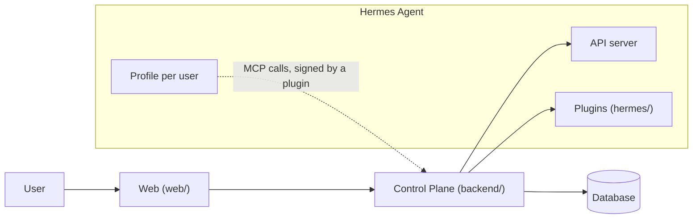

# fos-assistant

English | [한국어](README.ko.md)

A personal AI assistant that belongs to the person using it, not to a model vendor or to any one product.
It is a self-hosted Control Plane and web app on top of [Hermes Agent](https://github.com/NousResearch/hermes-agent) by Nous Research, where you connect general-purpose connectors and your own agents into an agentic workflow of your own, backed by a memory that only keeps what a person has approved.
People who share a purpose, a family for example, use it together as a group, each with their own agents.

The product name is not final. For now it is called `fos-assistant`.

## Why this exists

We want any individual to be free to have an assistant of their own, without depending on a particular model or product.
To get there, the goal is to let you connect general-purpose connectors into an agentic workflow that is yours.

- **Independent of the model.** A conversation picks a tier (fast, balanced, or deep), and the Control Plane database holds the policy that maps a tier to an actual model. The runtime is separate too: Hermes Agent runs the agents, and this repository decides who may use what, provides the web UI, and records what was used.
- **Independent of any product.** A connector is declared by a plugin's `connector.json`, and the Control Plane only has the generic flow. It does not know the name or the address of the service behind a connector, so adding one means writing a plugin with a `connector.json` and listing it in the Hermes dashboard's connector list, not changing this repository ([ADR-043](docs/adr/ADR-043-커넥터는-plugin-의-connector-json-으로-선언하고-control-plane-은-범용-흐름만-갖는다.md)).
- **Yours.** You decide which tools and memory an agent has and which model a conversation uses.
- **It is the source of truth for long-term knowledge about you.** Agents and outside services read only the part they are allowed to. Service tokens are read-only, and the body of a sensitive entry is encrypted at rest.

One connector is attached today, a household account book. It lives in its own repository, and this one ships only a demo connector used by tests.
Growing the set of general-purpose connectors is where the work is headed. It is not done yet.

## Principles

1. **Yours.** The person owns the agent's tools, memory, and model choice.
2. **Not mixed.** Someone else's memory and credentials never enter your run.
3. **Orchestrated.** Work is split across several agents and merged, rather than queued behind a single one. The agent decides what to split. The Control Plane decides who can see what.
4. **It remembers.** What was learned once is not asked again in the next conversation.

And one more that holds the others together: **it grows by adding people the same way every time.**
Adding a user is a single decision by an administrator, and it must not slow anyone else down or expose anything to them.

## What it does

- **Connectors with approval.** Register a personal token for an outside service and use an agent dedicated to it. A call that writes to that service runs only after you approve it, once, with exactly the arguments you approved.
- **Delegation.** One request can fan out to several agents, and the child runs still execute with the requester's permissions only.
- **Agents you build and share.** Create an agent from the web UI, write its persona, and choose its tools. Publish it to your group and others can talk to it, while each person's memory and conversations stay private.
- **Skills and `/commands`.** Upload skills to an agent and call one directly by typing `/` in the composer.
- **Model tiers.** Pick fast, balanced, or deep per conversation, or choose a model directly under advanced options.
- **Approval-based Memory.** An agent can only propose a memory. Nothing reaches a conversation until a person accepts it. Entries belong to collections, and each agent receives only the collections it is allowed to. Earlier revisions are kept when an entry is edited or deleted.
- **Run tree and cost.** Every run is recorded, including the ones that fail. Open a run to see its tool calls and child runs as a tree. Runs made on a subscription are also shown converted to API prices, so an administrator can compare settings.
- **Photos and HTML results.** Attach photos for an agent to read, and open the HTML pages an agent produces in a side panel. Scripts in those pages do not run.
- **Read-only access for other services.** A service token bound to a user lets another service read that user's documents and nothing else.

Screens for editing collections, viewing earlier revisions, and writing documents by hand are planned and not built yet.
The full scope, with how each item is verified, is in [`docs/prd.md`](docs/prd.md).

## What it does not do

- **It does not modify Hermes core.** Only the official extension points are used: profiles, the API server, and plugin hooks.
- **It does not remember what no person has seen.** Hermes' built-in memory tool is not given to agents. The Control Plane is the only path to memory.
- **It does not store secrets in the database.** AI credentials and connector tokens live only in Hermes profiles, and service tokens are stored only as hashes.
- **It is not an open sign-up service.** An administrator adds people to a group.
- **It does not run scripts in agent-made pages.**
- **It does not carry operating procedures.** Deployment and host-specific values belong to whoever runs it.

## Architecture



| Layer | Responsibility |
| --- | --- |
| Hermes Agent | Agent execution, tool calls, subagents, sessions |
| Control Plane (`backend/`) | Users, agent access, Memory access, model routing, usage accounting |
| Web (`web/`) | Conversations, run status, Memory review, usage |
| Hermes add-ons (`hermes/`) | The plugins and profile template installed into your Hermes |

The profile a run uses is always taken from the requester's binding.
The request body cannot choose it.

## Status

This is an early-stage project.
One family actually uses it, and that is the only deployment so far.

- The public API and the database schema can still change without notice.
- Some decisions are recorded but not implemented yet. The [ADR index](docs/adr/INDEX.md) marks them.
- There is no step-by-step self-hosting guide yet.
- The roadmap is tracked in [issue #97](https://github.com/jon890/fos-assistant/issues/97).

## Getting started

### Requirements

| Tool | Version |
| --- | --- |
| Java | 21 |
| Node.js | 22.18 or later |
| pnpm | 10 |
| Python | 3.13 (for the Hermes plugin tests) |
| Hermes Agent | checked against v2026.9.24 |

### See the whole flow without a server

`test/e2e` starts a stand-in for the Hermes Runs API in the same process, so no Hermes installation is needed.
It boots the backend itself, so Java is still required.

```bash
node test/e2e/run.ts
```

It goes from issuing a login token to registering an agent, holding a conversation, and recording usage and cost.
The scenarios live one per file under `test/e2e/scenarios/`.

### Build the Hermes install bundle

`hermes/bundle.sh` builds an install bundle with the plugins and the profile template.

```bash
hermes/bundle.sh --out <directory> --mcp-url <Control Plane MCP URL>
```

[`hermes/README.md`](hermes/README.md) describes the bundle and the values it needs at install time.
Environment variables and the tech stack are in [`docs/self-hosting.md`](docs/self-hosting.md).

## Contributing

Issues and pull requests are welcome in English or Korean.
The internal documents (`docs/`, `AGENTS.md`, commit messages) are written in Korean, so the documents linked from this page are in Korean too.
How this project uses Hermes is described in [`docs/hermes/README.md`](docs/hermes/README.md).

- [`AGENTS.md`](AGENTS.md) has the rules of the repository, including what must never be written into a public repository.
- [`docs/README.md`](docs/README.md) is the index of all documents.
- [`docs/adr/INDEX.md`](docs/adr/INDEX.md) lists the decisions that are hard to reverse.
- `scripts/check-local.sh` runs every check that CI runs. Run it before opening a pull request.

## License

[Apache License 2.0](LICENSE)
