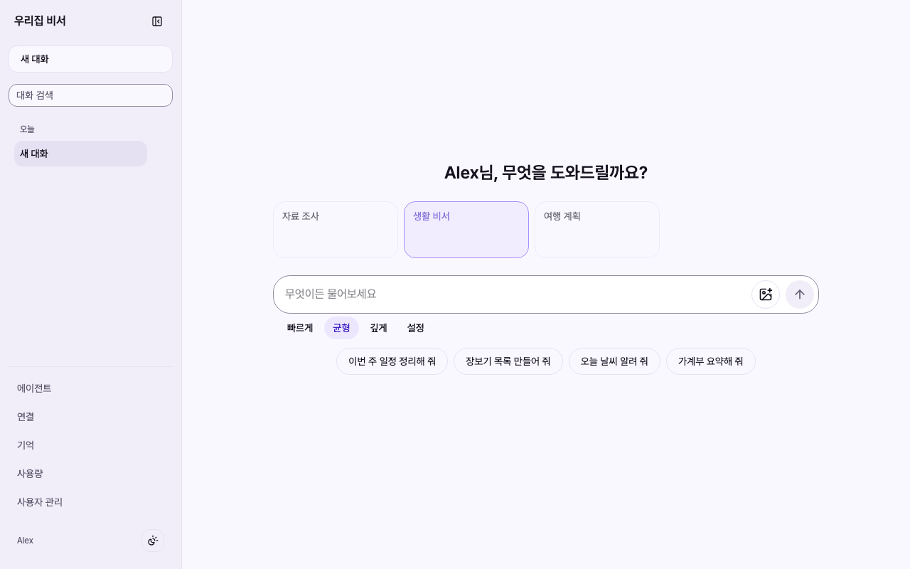
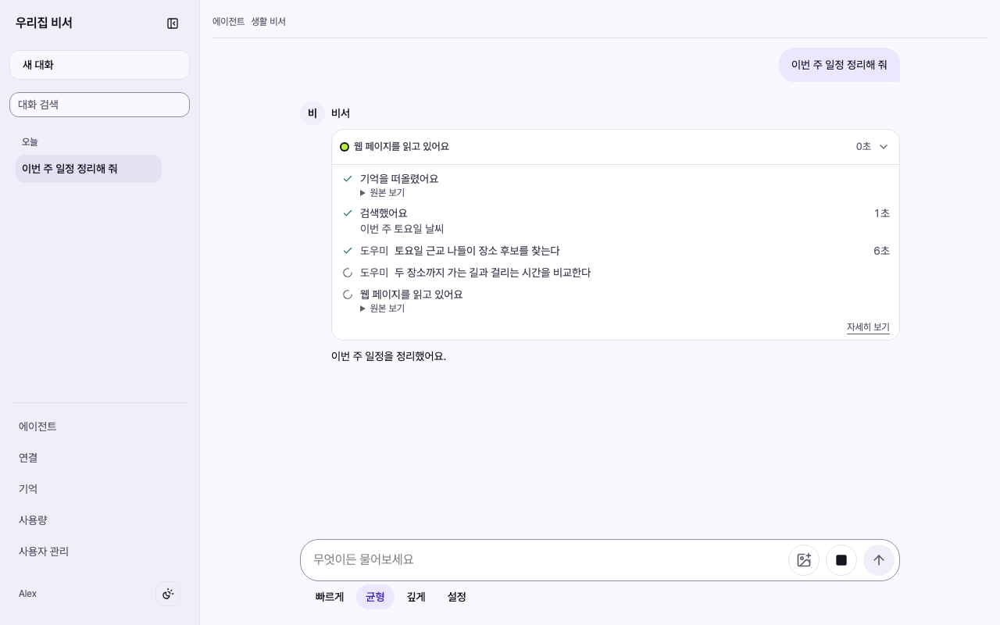
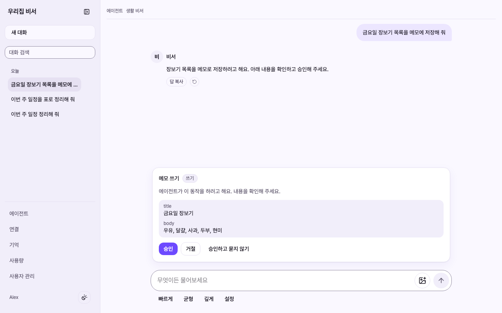
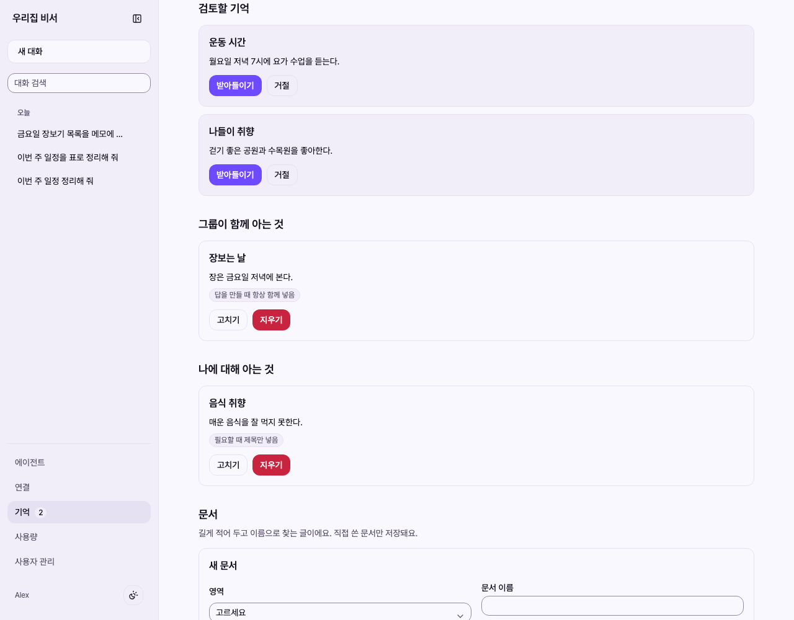
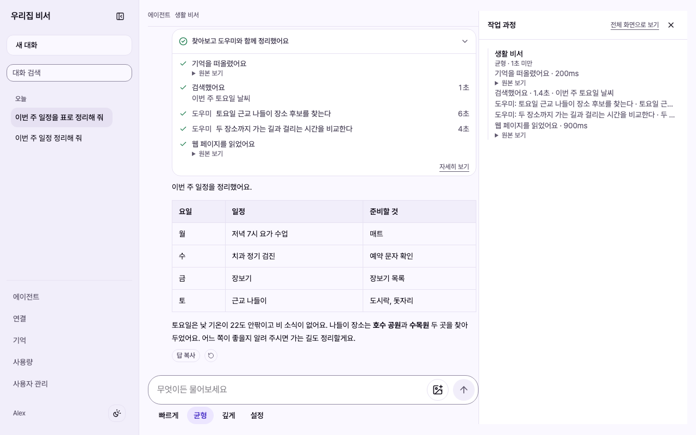
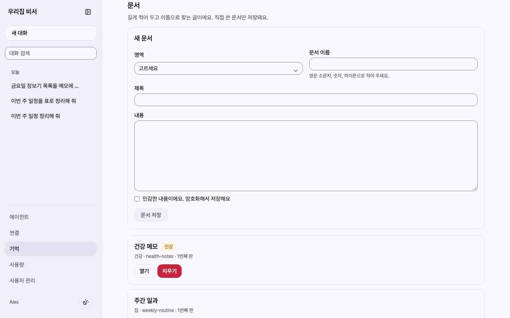
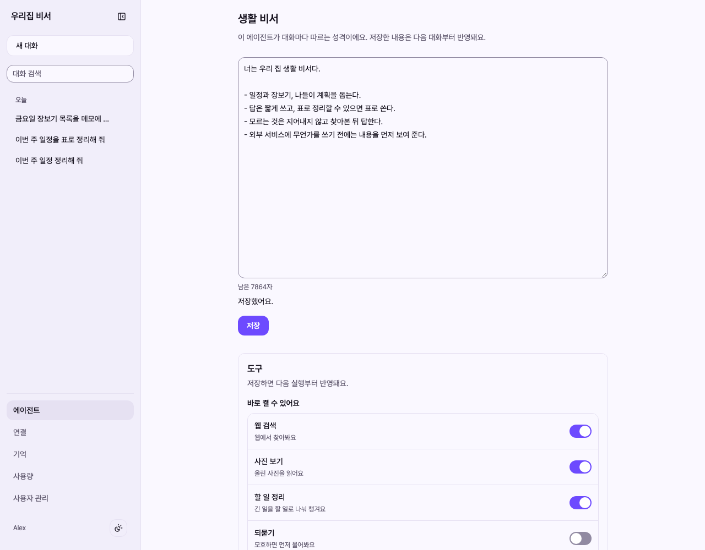
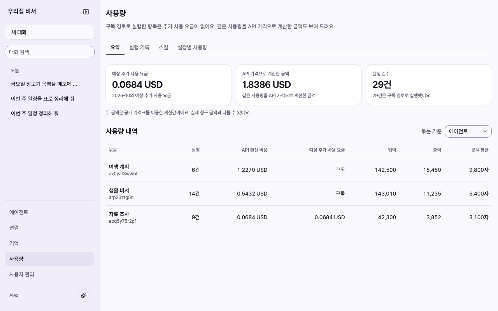
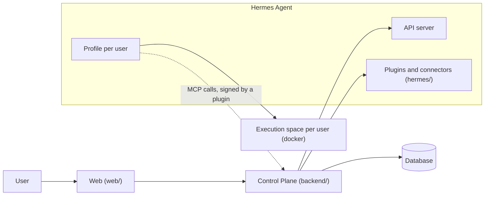

# fos-assistant

English | [한국어](README.ko.md)

A personal AI assistant that belongs to the person using it, not to a model vendor or to any one product.
It is a self-hosted Control Plane and web app on top of [Hermes Agent](https://github.com/NousResearch/hermes-agent) by Nous Research, where you connect general-purpose connectors and your own agents into an agentic workflow of your own, backed by a memory that only keeps what you said, wrote, or accepted yourself.
Agents can look ahead and make suggestions before you ask, but how far they may act is decided by Control Plane rules, not by the model.
People who share a purpose, a family for example, use it together as a group, each with their own agents.

The product name is not final. For now it is called `fos-assistant`.

## A quick tour

The screens are in Korean, the only UI language for now.
Everything shown is made-up demo data: the pictures are taken by a script against the same local stack the browser tests use, never from a real deployment.

**Start a conversation.** Pick one of your agents, pick a tier (fast, balanced, or deep), and type or tap a suggested question.



**Watch the work.** While an answer is being made, each tool call and each helper agent gets a line of its own.



**Approve before anything is written.** A connector call that writes to an outside service waits on a card that shows exactly what will be sent.



**Decide what is remembered.** A fact you state yourself in a conversation that has not read outside text is remembered right away, and you can edit or undo it under the answer. Any other memory an agent leaves stays a proposal and is used in later conversations only after you accept it.



<details>
<summary>More screens: run tree, documents, agent settings, usage and cost</summary>

**Run tree.** Open a finished answer to see what it did, step by step, in a side panel.



**Documents and collections.** Longer notes live in collections. A sensitive document is encrypted at rest.



**Agent settings.** Write the agent's persona and switch its tools on and off.



**Usage and cost.** An administrator sees runs per agent, with subscription runs converted to API prices.



</details>

To take the pictures again, run `pnpm screenshots` in `web/`. The script is `test/screenshots/tour.shots.ts`.
The Now screen (`/now`), the connections screen, and the scheduled tasks screen are not in this tour yet.

## Why this exists

We want any individual to be free to have an assistant of their own, without depending on a particular model or product.
To get there, the goal is to let you connect general-purpose connectors into an agentic workflow that is yours.

- **Independent of the model.** A conversation picks a tier (fast, balanced, or deep), and the Control Plane database holds the policy that maps a tier to an actual model. The runtime is separate too: Hermes Agent runs the agents, and this repository decides who may use what, provides the web UI, and records what was used.
- **Independent of any product.** A connector is declared by a plugin's `connector.json`, and the Control Plane only has the generic flow. It does not know the name or the address of the service behind a connector, so adding one means writing a plugin with a `connector.json` and listing it in the Hermes dashboard's connector list, not changing the Control Plane or the web app ([ADR-043](docs/adr/ADR-043-커넥터는-plugin-의-connector-json-으로-선언하고-control-plane-은-범용-흐름만-갖는다.md)).
- **Yours.** You decide which tools and memory an agent has and which model a conversation uses.
- **It is the source of truth for long-term knowledge about you.** Agents and outside services read only the part they are allowed to. Service tokens are read-only, and the body of a sensitive entry is encrypted at rest.

General-purpose connectors live in this repository under `hermes/connectors/` and are maintained here ([ADR-064](docs/adr/ADR-064-범용-커넥터는-이-저장소의-hermes-connectors-에-두고-저장소가-유지보수한다.md)).
The first one is Gmail: it searches and reads your mail and filters without asking, and creates drafts, sends, replies, manages labels and changes filters only after you approve. It never moves mail to the trash or deletes it.
The second is Naver Blog: it attaches to a Chrome you have signed in to and, after you approve, saves a post with your chat photos as a Naver Blog draft. It never publishes.
A connector for a service that only one household or organization uses, such as the household account book attached today, stays in its own repository.
Growing the set of general-purpose connectors is where the work is headed. It is not done yet.

## How it compares

Other tools do some of this already, and several are far more mature.
The table says what each one is, in its own documentation's words where possible, and what this project does differently.

| Option | What it is | What is different here |
| --- | --- | --- |
| Hosted assistant apps, such as ChatGPT or Claude | Run by the model vendor, with nothing to install. Claude, for example, [saves memory as you chat](<https://support.claude.com/en/articles/11817273-using-claude-s-chat-search-and-memory-to-build-on-previous-context>) and lets you read, edit, and delete it in settings. | It runs on your own server. Which model a tier means is a policy row in your database. The only memory an agent keeps right away is a fact you stated yourself in a conversation. Everything else is used only after a person accepts it. |
| Self-hosted chat UIs, such as [Open WebUI](https://docs.openwebui.com/) or [LibreChat](https://www.librechat.ai/docs) | Open WebUI calls itself "a self-hosted AI platform" with "support for Ollama and OpenAI-compatible APIs". LibreChat is "a self-hosted web application" with agents, MCP, and custom endpoints. | This project does not call model APIs itself. It sits on an agent runtime and adds one isolated Hermes profile per person, collections that decide which agent receives which memory, an approval step for connector writes, delegation between agents with a run tree, and a ledger that converts usage to API prices. |
| [Hermes Agent](https://hermes-agent.nousresearch.com/docs/) on its own | An autonomous agent you reach from the CLI or a messaging gateway, with its own persistent memory, skills, and subagents. | It adds a web app for a group of people. The profile a run uses comes from the requester's binding. Memory goes through the Control Plane only, and Hermes' built-in memory tool is not given to agents. Outside services read through read-only service tokens, and sensitive entries are encrypted. Connectors follow one generic structure ([ADR-043](docs/adr/ADR-043-커넥터는-plugin-의-connector-json-으로-선언하고-control-plane-은-범용-흐름만-갖는다.md)). |

### Who it is for

It fits you if:

- you run your own server and want a family or another small group to share one assistant, each person with their own agents and memory,
- you want to change the model behind a conversation without changing the product you use,
- you want agents and connectors to do recurring work, with a person approving what gets written outside and memory keeping only what a person said or accepted.

It does not fit you yet if:

- you want something that works without installing anything,
- you want a service anyone can sign up for,
- you are not ready to set up and operate Hermes Agent yourself. There is no step-by-step self-hosting guide yet, and the API and schema can still change. See [Status](#status).

## Principles

1. **Yours.** The person owns the agent's tools, memory, and model choice.
2. **Not mixed.** Someone else's memory and credentials never enter your run.
3. **Orchestrated.** Work is split across several agents and merged, rather than queued behind a single one. The agent decides what to split. The Control Plane decides who can see what.
4. **It remembers.** What was learned once is not asked again in the next conversation.

And one more that holds the others together: **it grows by adding people the same way every time.**
Adding a user is a single decision by an administrator, and it must not slow anyone else down or expose anything to them.

## What it does

### Conversations and agents

- **Agents you build and share.** Create an agent from the web UI, write its persona, and choose its tools. Publish it to your group and others can talk to it, while each person's memory and conversations stay private ([`docs/backend/agent.md`](docs/backend/agent.md)).
- **Skills and `/commands`.** Upload skills to an agent and call one directly by typing `/` in the composer ([`docs/backend/skill.md`](docs/backend/skill.md)).
- **Model tiers.** Pick fast, balanced, or deep per conversation, or choose a model directly under advanced options ([`docs/model-tiers.md`](docs/model-tiers.md)).
- **Delegation.** One request can fan out to several agents. The child runs execute with the requester's permissions only, and when a result arrives the Control Plane opens the next turn of the parent conversation to deliver it ([`docs/backend/agent-delegation.md`](docs/backend/agent-delegation.md)).
- **Photos and HTML results.** Attach photos for an agent to read, and open the HTML pages an agent produces in a side panel. Scripts in those pages do not run. Photos are stored per user ([`docs/backend/attachment.md`](docs/backend/attachment.md), [`docs/backend/artifact.md`](docs/backend/artifact.md)).
- **Run tree and cost.** Every run is recorded, including the ones that fail. Open a run to see its tool calls and child runs as a tree. Runs made on a subscription are also shown converted to API prices, so an administrator can compare settings ([`docs/frontend/activity.md`](docs/frontend/activity.md), [ADR-004](docs/adr/ADR-004-구독제에서도-api-가격으로-환산해-보인다.md)).

### Connectors and approval

- **Connect once, attach to several agents.** A connector hands an agent the tools of an outside service and widens what that agent can do. Connect your account once on the connections screen, then attach that connection to any of your private agents, and the agent calls the service's tools directly ([`docs/connectors.md`](docs/connectors.md), [ADR-083](docs/adr/ADR-083-커넥터는-사용자가-한-번-연결하고-자기-에이전트에-여럿-붙여-그-에이전트가-도구를-직접-부른다.md)).
- **Attaching needs no restart.** A newly attached connector is picked up by runs shortly afterwards, without restarting the shared gateway, so nobody else's conversation is cut off in the meantime ([ADR-20261007 / connector-live-reload](docs/adr/ADR-20261007-connector-live-reload.md)).
- **Connector cards.** The connections screen shows each connector as a card with its icon, an about link, and a summary of its tools. Icons come only from files inside the plugin, and no outside address is fetched ([ADR-20261008 / connector-card](docs/adr/ADR-20261008-connector-card.md), [`docs/connectors.md`](docs/connectors.md)).
- **Writes wait on an approval card.** A call that writes to an outside service waits on a card that shows exactly what will be sent, and runs only after you approve it, once, with exactly the arguments you approved. A tool that allows a standing grant runs without a card while the grant you gave lasts, and tools that send data out have standing grants closed. Approvals for the same tool are grouped, and approval requests and expiries reach you as notifications on any screen ([`docs/backend/connector-tool-policy.md`](docs/backend/connector-tool-policy.md), [`docs/backend/notification.md`](docs/backend/notification.md)).

### Proactive checks and the Now screen

- **Proactive checks.** Without being asked, an agent looks at your context and makes a suggestion, asks a question, or stays silent. You start a check with a button, or turn on a daily wake-up that runs it at a time you choose. The daily wake-up is off by default. Unless an administrator allows write tools for the agent, a check only reads, and the Control Plane enforces that boundary ([`docs/backend/proactive-check.md`](docs/backend/proactive-check.md)).
- **Context assembly.** Context gathered from Memory, delegated results, results of approved connector calls, run state, and follow-ups is assembled into a bundle where every item carries its source, permissions, and freshness ([`docs/backend/context-bundle.md`](docs/backend/context-bundle.md)).
- **Problem candidates.** A check's result can name problems worth solving for this user as candidates, and the Control Plane checks their evidence and duplicates deterministically ([ADR-093](docs/adr/ADR-093-문제-찾기는-살펴보기-결과의-문제-후보로-받고-control-plane-이-근거와-중복을-결정적으로-검사한다.md)).
- **The Now screen (`/now`).** Failed runs, things waiting for your approval or acceptance and follow-ups coming due, delegated work, conversations to continue, and check reports are collected into a fixed set of cards. For proactive notices, things shown without being asked, the default is not to notify, and only signals defined from Control Plane records reach the screen. Each item can be hidden or snoozed ([`docs/frontend/now.md`](docs/frontend/now.md), [`docs/backend/attention.md`](docs/backend/attention.md)).
- **Follow-ups.** An agent proposes things you need to do or are waiting on, and only the ones a person accepts are tracked ([`docs/backend/follow-up.md`](docs/backend/follow-up.md)).
- **Scheduled tasks.** An agent runs at a set time with your permissions. If that run tries to write to an outside service, an approval card and a notification appear ([`docs/backend/task.md`](docs/backend/task.md)).

Value evaluation, an autonomy policy, and decision feedback are built as well.
Value evaluation compares problem candidates axis by axis and keeps the evidence for each ([`docs/backend/value-evaluation.md`](docs/backend/value-evaluation.md)), and the autonomy policy decides, by rules that never call a model, whether to ignore, surface, ask for approval, or execute ([`docs/backend/autonomy-policy.md`](docs/backend/autonomy-policy.md)).
Decision feedback records how a user reacted to a suggestion and how the run ended ([`docs/backend/decision-feedback.md`](docs/backend/decision-feedback.md)).
Decision feedback is already recorded when a check report, a follow-up, a Memory proposal, or an approval request is created.
Checks and the daily wake-up do not call value evaluation or the autonomy policy automatically yet. For now an administrator runs and reads them for one check from the agent detail in the admin area ([`docs/frontend/structure.md`](docs/frontend/structure.md)). Wiring those two into real use is in progress.

### Memory

- **What you say is kept at once, the rest is proposed.** A lasting fact you state yourself in your latest message is remembered by the agent right away, and the answer shows "remembered" with edit and undo. The quoted evidence must appear in that message as written. Anything from a conversation that read outside text or that includes a run no person sent (a delegated result or a scheduled task), and every sensitive entry, stays a proposal and is used only after a person accepts it ([ADR-20261007 / memory-remember](docs/adr/ADR-20261007-memory-remember.md), [`docs/backend/memory.md`](docs/backend/memory.md)).
- **Collections and sensitive entries.** Entries belong to collections, and each agent receives only the collections it is allowed to. An admin changes that allowance on the agent page in the admin area. The body of a sensitive entry is encrypted at rest. Earlier revisions are kept when an entry is edited or deleted ([ADR-053](docs/adr/ADR-053-에이전트는-허용된-collection-의-memory-만-받는다.md), [ADR-055](docs/adr/ADR-055-민감-memory-본문은-저장할-때-암호화하고-key-는-환경-변수로-받는다.md)).
- **Read-only access for other services.** A service token bound to a user lets another service read that user's documents and nothing else ([ADR-056](docs/adr/ADR-056-다른-서비스는-사용자에-묶인-서비스-토큰으로-문서를-읽기만-한다.md)).

Some Memory screens, such as editing the collection list and viewing earlier revisions of an entry, are not built yet. The current list is in [`docs/code-architecture.md`](docs/code-architecture.md).

### Execution spaces

- **An execution space per user, in docker.** For profiles registered in the operator's policy, the shell, file, and code execution tools run in an execution space in docker. There is one container per profile, and each user gets a separate working directory. Inside it, other users' files, other profiles' secrets, and the Hermes settings are out of reach. The only exception is paths the operator mounts read-only. Profiles not registered in the policy do not get this isolation, and coverage is extended one profile at a time ([ADR-086](docs/adr/ADR-086-셸과-파일-도구는-사용자별-docker-실행-공간에서만-돈다.md), [`docs/hermes/sandbox.md`](docs/hermes/sandbox.md)).
- **Scripts do the arithmetic.** When a connector writes the full list for a period as a read-only file in that agent's execution space and returns only the path, totals and statistics are computed by a script instead of being estimated by the model. This needs a connector that declares file output, a profile registered in an execution space policy that sets an output path, and an agent with the code execution tool on. The Gmail and Naver Blog connectors in this repository do not declare file output ([ADR-20261008 / connector-output-files](docs/adr/ADR-20261008-connector-output-files.md)).
- **A browser per user (in progress).** The Control Plane manages one browser per user, and the user signs in to services directly on the web app's "My browser" screen. Connectors reach that browser only through the Control Plane's relay. The code is in, but it is off by default and still in progress ([ADR-20261007 / user-browser](docs/adr/ADR-20261007-user-browser.md), [`docs/backend/user-browser.md`](docs/backend/user-browser.md)).

The full scope, with how each item is verified, is in [`docs/prd.md`](docs/prd.md).

## What it does not do

- **It does not modify Hermes core.** Only the official extension points are used: profiles, the API server, and plugin hooks.
- **It does not remember right away what you did not say.** The only thing stored at once is a fact you stated yourself in a conversation a person sent. Everything else is used only after a person accepts it. Hermes' built-in memory tool is not given to agents. The Control Plane is the only path to memory.
- **It does not widen what it does on a model's judgment alone.** Deterministic Control Plane rules decide how far to go, and the only thing those rules start on their own is a read-only check. A connector write call goes through an approval card or a standing grant you gave ([ADR-20261007 / autonomy-policy](docs/adr/ADR-20261007-autonomy-policy.md)).
- **It does not store secrets in the database.** AI credentials and connector tokens stay on the Hermes side, and service tokens are stored only as hashes. Browser login sessions are not stored in the database either. Separate profiles do not by themselves mean separate AI accounts: an OAuth login can be shared across profiles. How credentials are separated or shared is in [`docs/hermes/README.md`](docs/hermes/README.md).
- **It is not an open sign-up service.** An administrator adds people to a group.
- **It does not run scripts in agent-made pages.**
- **It does not carry operating procedures.** Deployment and host-specific values belong to whoever runs it.

## Architecture



| Layer | Responsibility |
| --- | --- |
| Hermes Agent | Agent execution, tool calls, subagents, sessions |
| Control Plane (`backend/`) | Users, agent access, Memory access, model routing, connector approvals, scheduled tasks and proactive checks, notifications, usage accounting |
| Web (`web/`) | Conversations, run status, approval cards, connections, the Now screen, Memory review, usage |
| Hermes add-ons (`hermes/`) | The plugins and profile template installed into your Hermes, and the general-purpose connectors |
| Execution space per user | Runs the shell, file, and code execution tools. Applies only to profiles registered in the operator's policy |

The profile a run uses is always taken from the requester's binding.
The request body cannot choose it.

## Status

This is an early-stage project.
One family actually uses it, and that is the only deployment so far.

- The public API and the database schema can still change without notice.
- Some decisions are recorded but not implemented yet. The [ADR index](docs/adr/INDEX.md) marks them.
- In progress: the per-user browser, wiring value evaluation and the autonomy policy of proactive checks into real use, and applying execution spaces to more profiles.
- There is no step-by-step self-hosting guide yet.
- The roadmap is tracked in [issue #219](https://github.com/jon890/fos-assistant/issues/219).

## Getting started

### Requirements

| Tool | Version |
| --- | --- |
| Java | 21 |
| Node.js | 22.18 or later |
| pnpm | 10 |
| Python | 3.13 (for the Hermes plugin tests) |
| Hermes Agent | checked against v2026.9.24 |

### See the whole flow without a server

`test/e2e` starts a stand-in for the Hermes Runs API in the same process, so no Hermes installation is needed.
It boots the backend itself, so Java is still required.

```bash
node test/e2e/run.ts
```

It goes from issuing a login token to registering an agent, holding a conversation, and recording usage and cost.
The scenarios live one per file under `test/e2e/scenarios/`.

### Build the Hermes install bundle

`hermes/bundle.sh` builds an install bundle with the plugins and the profile template.

```bash
hermes/bundle.sh --out <directory> --mcp-url <Control Plane MCP URL>
```

[`hermes/README.md`](hermes/README.md) describes the bundle and the values it needs at install time.
Environment variables and the tech stack are in [`docs/self-hosting.md`](docs/self-hosting.md).

## Contributing

Issues and pull requests are welcome in English or Korean.
The internal documents (`docs/`, `AGENTS.md`, commit messages) are written in Korean, so the documents linked from this page are in Korean too.
How this project uses Hermes is described in [`docs/hermes/README.md`](docs/hermes/README.md).

- [`AGENTS.md`](AGENTS.md) has the rules of the repository, including what must never be written into a public repository.
- [`docs/README.md`](docs/README.md) is the index of all documents.
- [`docs/adr/INDEX.md`](docs/adr/INDEX.md) lists the decisions that are hard to reverse.
- Run `scripts/check-local.sh` before pushing, passing the browser specs for the screens you changed; with no arguments it runs the whole browser suite. Merge decisions use the required PR CI checks run against the current main merged with the PR. If CI cannot run, run the full local checks. See the 「확인」 section of [`AGENTS.md`](AGENTS.md).

### Contributing a connector

A general-purpose connector is one directory, `hermes/connectors/<id>/`. A pull request that adds one needs the following.

- A `connector.json` with `schema: 2` that declares every tool the MCP server exposes, each with a risk and a reason for it in the connector's document.
- Calls that write require approval. Tools that send data to people outside the account also declare `"grant": false`, so each call is approved by a person. Tools that delete are not exposed.
- Secrets come in only through environment variables declared in `fields`, and the smallest OAuth scope or permission that works.
- An MCP server in TypeScript, bundled with its dependencies into one committed JavaScript file for Bun. Connector tests live alongside the source and use a local fake of the service.
- A setup guide under `docs/connectors/` and an owner line in `.github/CODEOWNERS`.

`hermes/tests/test_connectors_contract.py` checks the contract for every directory under `hermes/connectors/`, so a new connector is checked as soon as it is added.
The full guide is [`docs/connector-authoring.md`](docs/connector-authoring.md) (Korean), and [`hermes/connectors/gmail/`](hermes/connectors/gmail) is the reference to copy from.

## License

[Apache License 2.0](LICENSE)
