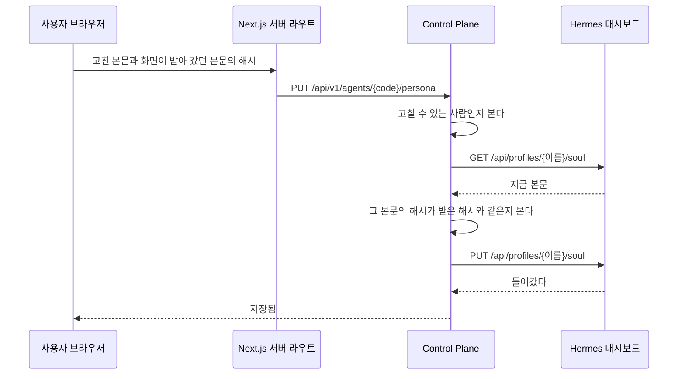
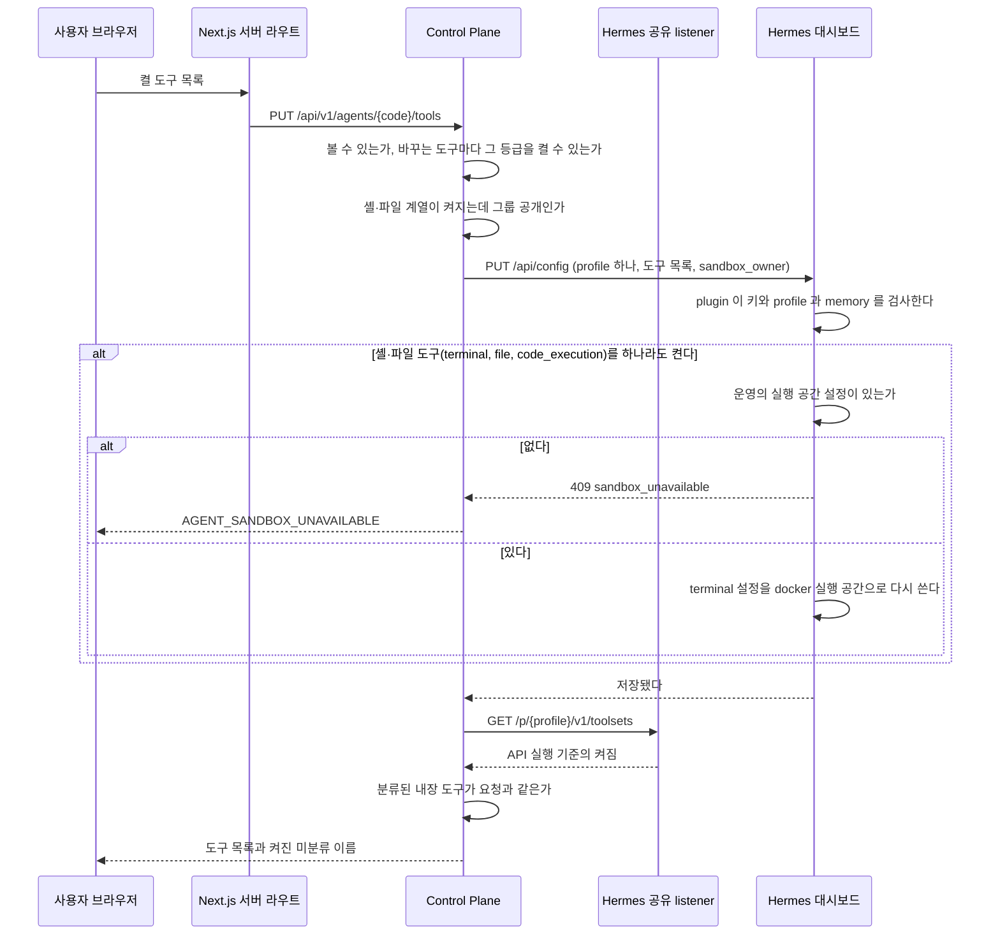

# 에이전트

에이전트의 페르소나와 추천 질문, 에이전트가 쓰는 도구의 등급 판정, 사용자가 에이전트를 만들고 공개하고 지우는 규칙을 갖는다.
페르소나 본문과 도구 목록은 Hermes profile 이 갖고, 이 파일은 Control Plane 이 그것을 읽고 쓰는 경로와 권한을 적는다.

## 페르소나

에이전트의 성격이다. 본문은 그 profile 의 `SOUL.md` 가 갖고 이 저장소는 화면만 준다.
근거는 [`adr/ADR-019-페르소나는-hermes-가-갖고-control-plane-은-화면만-준다.md`](../adr/ADR-019-페르소나는-hermes-가-갖고-control-plane-은-화면만-준다.md) 에 있다.

- **본문을 데이터베이스에 두지 않는다.** 읽을 때도 쓸 때도 Hermes 대시보드를 부른다.
- 정본이 하나라 어긋날 것이 없다. 반영 상태도 다시 반영하는 경로도 두지 않는다.
- 쓰기 직전에 한 번 더 읽어, 화면이 받아 간 본문과 같을 때만 쓴다.
  화면이 돌려보내는 것은 본문이 아니라 그 해시다. 8000자를 되보내지 않기 위해서다.
  다르면 그 사이 다른 사람이 고친 것이고 거절한다.
- **앞뒤 공백을 떼고 저장한다.** 떼고 나서 비면 거절한다. 빈 `SOUL.md` 를 쓰면 성격이 지워진다.
- 본문 상한은 8000자다. 매 실행의 고정 프롬프트에 들어가므로 길이가 곧 비용이다.

### 누가 고칠 수 있나

| 무엇 | 누구 |
| --- | --- |
| 읽기 | 그 에이전트를 쓸 수 있는 사람. 목록에 보이는 것과 같은 기준이다 |
| 쓰기 | 그 에이전트의 주인, 그리고 `ADMIN` |

**주인은 공개해도 주인이다.** 그룹에 공개한 에이전트도 만든 사람이 계속 고친다.
주인이 비어 있는 에이전트(이 규칙 전에 운영에서 등록한 그룹 공개 에이전트)는 `ADMIN` 만 고친다.
근거는 [ADR-033](../adr/ADR-033-사용자가-에이전트를-만들고-공개해도-만든-사람이-관리한다.md) 에 있다.

판정은 `AgentService.isEditableBy` 하나다. 성격, 도구, 스킬, 공개 범위, 지우기가 모두 이것을 부른다.

**볼 수 없는 에이전트는 없는 에이전트와 같은 응답을 준다.**
`code` 를 훑어 남의 에이전트가 있는지 알아낼 수 없게 한다.

### 경로

| 경로 | 하는 일 |
| --- | --- |
| `GET /api/v1/agents/{code}/persona` | 지금 본문과 그 해시와 고칠 수 있는지와 본문 상한 |
| `PUT /api/v1/agents/{code}/persona` | 본문을 쓴다. 화면이 받아 간 본문의 해시를 함께 받는다 |

**해시를 함께 받는 이유는 두 사람이 같은 에이전트를 고칠 수 있기 때문이다.**
`SOUL.md` 에는 판 번호가 없어서 값으로 달라진 것을 알 수 없다.
쓰기 직전에 다시 읽어 그 해시와 다르면 거절하고, 화면이 새 본문을 다시 읽는다.

### 추천 질문

코드는 `chat` 패키지에 있다. 대화와 메시지를 읽고 실행을 적기 때문이다(ADR-068). 주소는 `/api/v1/agents/{code}/starters` 그대로다.
새 대화 화면에 보이는 추천 질문 넷까지다. 사람이 적지 않고 모델이 만든다.
근거는 [ADR-036](../adr/ADR-036-추천-질문은-사용자의-대화-이력으로-모델이-만들고-메모리에만-둔다.md) 에 있다.

- **`(사용자, 에이전트)` 마다 다르다.** 그 사용자의 최근 대화 첫 질문들을 모델이 요약한다. 이력이 없으면 그 에이전트의 성격과 켜진 도구와 스킬 이름으로 할 수 있는 일을 만든다
- **backend 메모리에만 둔다.** 재시작하면 비고 다시 만든다
- **만드는 때는 둘이다.** 추천이 없을 때 새 대화 화면이 읽으면 만들기를 시작한다. 있으면 그 사용자가 그 에이전트와 대화를 마쳤을 때 만든 지 `assistant.starters.refresh-after`(기본 24시간)보다 오래됐으면 다시 만든다
- 같은 키의 만들기는 하나만 돈다. 실패하면 이전 추천을 그대로 둔다. 실패하면 `assistant.starters.retry-after-failure`(기본 10분) 동안 그 키를 다시 만들지 않는다
- 만들기는 그 에이전트의 profile 로 Hermes 실행 하나를 돌리고 실행 줄에 남긴다. turn 을 마치는 흐름을 기다리게 하지 않고 따로 돈다

| 경로 | 하는 일 |
| --- | --- |
| `GET /api/v1/agents/{code}/starters` | `{ "prompts": [...], "status": "READY" \| "GENERATING" \| "NONE" }`. `GENERATING` 이면 화면이 2초 간격으로 세 번까지 다시 읽는다 |

한 줄 소개와 사람이 적던 추천 질문, 그것을 쓰던 `PUT` 경로와 에이전트 목록 응답의 `tagline`, `starterPrompts` 는 없앴다.

### 어느 클래스가 무엇을 하나

| 무엇 | 어디 |
| --- | --- |
| 누가 고칠 수 있는지 판정하고 부르는 순서를 정한다 | `agent/application` |
| `GET` 과 `PUT /api/profiles/{이름}/soul` 호출 | `hermes` |

**`agent` 가 순서를 알고 `hermes` 는 부르는 방법만 안다.**
사람을 더할 때 `people` 과 `hermes` 를 나눈 것과 같은 규칙이다.

## 에이전트 도구

에이전트가 쓸 toolset 이다. 목록은 그 profile 설정의 `platform_toolsets.api_server` 가 갖고, 이 저장소는 등급 판정과 화면을 준다.
데이터베이스에 사본을 두지 않는다. 근거는 [`adr/ADR-029-에이전트-도구는-control-plane-이-등급으로-판정하고-hermes-설정-api-로-쓴다.md`](../adr/ADR-029-에이전트-도구는-control-plane-이-등급으로-판정하고-hermes-설정-api-로-쓴다.md) 에 있다.

- 등급 표는 코드 한 곳(`agent/domain/AgentToolPolicy`)이 갖는다. 표와 이유는 ADR-029 의 「도구 등급」 이다
- 설정을 쓸 때 대시보드 plugin 은 허용 목록 밖의 이름을 거절한다. Hermes 를 올릴 때 `fos-home-infra` 의 기능 검사는 모든 profile 의 켜진 목록을 허용 목록과 대조한다. 실행마다 검사하지 않는다
- 쓸 때는 `platform_toolsets.api_server` 만 켤 toolset 과 Control Plane MCP `fos-assistant` 로 통째로 쓴다. `agent.disabled_toolsets` 는 모든 platform 에 적용되므로 보내지 않고 기존 값을 둔다
- 쓴 뒤 공유 listener 의 `GET /p/{profile}/v1/toolsets` 로 내장 도구를 다시 읽는다. 이 경로에는 MCP 서버 이름이 없으므로 Control Plane MCP 는 비교하지 않는다. 요청한 내장 도구가 빠지거나 분류된 도구가 예상과 다르면 적용 실패다. 추가로 켜진 미분류 도구는 적용 실패로 세지 않고 `unclassifiedEnabled` 로 알린다
- profile 의 공통 비활성화 목록이 막아 켜지지 않은 toolset 은 `AGENT_TOOLS_NOT_APPLIED` 응답의 `missingToolsets` 로 알린다. 화면은 `GET` 으로 현재 목록을 다시 읽는다
- 이름과 설명은 대시보드 `GET /api/tools/toolsets` 에서 읽는다. 그 응답의 `enabled` 는 CLI 기준이라 쓰지 않는다
- Hermes 가 쓰기 없이 미분류 toolset 을 켤 수 있다. 도구 응답의 `unclassifiedEnabled` 는 listener 에서 켜진 미분류 이름이고, 화면은 관리자에게 알리라는 경고를 보인다
- 그룹 공개에서 막는 toolset 은 `terminal`, `file`, `code_execution`, `browser`, `computer_use`, `session_search` 여섯이다. 이 문서는 이 여섯을 「셸·파일 계열」 이라 부른다. 셸·파일 계열이 켜진 에이전트는 `PRIVATE` 만 된다. `GROUP` 생성과 수정, 도구 변경 모두에서 최종 listener 주소의 현재 목록을 본다. 꺼진 에이전트의 공개 범위 변경은 검사하지 않고 켤 때 검사한다. 읽지 못하면 변경하지 않는다
- 도구를 쓸 때마다(스킬 게시가 `skills` 를 함께 켤 때 포함) 본문에 `sandbox_owner` 를 함께 보낸다. 에이전트 주인이 있으면 `u<사용자 번호>`, 없으면 `a<에이전트 번호>` 다. 대시보드 plugin 은 `terminal`, `file`, `code_execution` 가운데 하나라도 켜는 저장에서 그 값으로 사용자 실행 공간을 정하고 profile 의 `terminal:` 설정을 다시 쓴다. 실행 공간이 운영에 설정돼 있지 않으면 plugin 이 거절하고 Control Plane 은 `AGENT_SANDBOX_UNAVAILABLE` 로 알린다. 근거는 [ADR-084](../adr/ADR-084-셸과-파일-도구는-사용자별-docker-실행-공간에서만-돈다.md) 다
- 도구 변경과 에이전트 접근 범위 변경은 같은 에이전트 행의 쓰기 잠금을 잡고 검사한다. 이미 잠겨 있으면 `AGENT_BUSY` 로 곧바로 알린다

| 경로 | 누가 | 무엇 |
| --- | --- | --- |
| `GET /api/v1/agents/{code}/tools` | 그 에이전트의 주인 또는 `ADMIN` | 응답 `{ "toolsets": [...], "unclassifiedEnabled": [...] }`. `toolsets` 는 등급 표에 있는 이름, 설명, 등급, 켜짐과 요청자의 변경 가능 여부다 |
| `PUT /api/v1/agents/{code}/tools` | 주인은 주인 등급, `ADMIN` 은 전부 | 본문 `{ "enabled": ["web", "vision"] }`. 켤 toolset 전체다. 바꿀 수 없는 등급은 지금 값과 같아야 한다. 응답은 `GET` 과 같은 모양이다 |
| `GET`, `PUT /api/v1/admin/agents/{code}/tools` | `ADMIN` | 위와 같은 모양. 다른 사람의 비공개 에이전트는 이 경로로만 다룬다 |

## 에이전트 만들기와 지우기

모든 사용자가 화면에서 자기 에이전트를 만든다. 근거는 [ADR-033](../adr/ADR-033-사용자가-에이전트를-만들고-공개해도-만든-사람이-관리한다.md) 에 있다.

| 경로 | 하는 일 | 거절 |
| --- | --- | --- |
| `POST /api/v1/agents` | `{ "name", "visibility"? }` 로 만든다. 공개 범위 기본값은 `PRIVATE`. 201 과 에이전트를 돌려준다 | `VALIDATION_FAILED`, 상한이면 409 `AGENT_LIMIT_REACHED`, profile 을 만들지 못하면 `HERMES_PROVISION_FAILED` |
| `PATCH /api/v1/agents/{code}/visibility` | `{ "visibility" }`. 주인과 `ADMIN` 이 승인 없이 바꾼다 | `FORBIDDEN`, 읽을 수 없거나 지웠으면 `AGENT_NOT_FOUND`, 다른 요청이 그 에이전트를 고치는 중이면 `AGENT_BUSY`, `visibility` 가 비었으면 `VALIDATION_FAILED`, 켜진 에이전트를 그룹 공개로 바꿀 때 셸·파일 toolset 이 켜져 있으면 `AGENT_TOOLS_REQUIRE_PRIVATE`. 꺼진 에이전트는 켤 때 관리자 수정이 검사한다 |
| `DELETE /api/v1/agents/{code}` | 지운다. 204 | `FORBIDDEN`, 읽을 수 없거나 지웠으면 `AGENT_NOT_FOUND`, 고치는 중이면 `AGENT_BUSY`, profile 을 거두지 못하면 그 Hermes 오류 |

공개 범위를 바꿔도 주인은 그대로다.
주인이 비어 있는 옛 그룹 공개 에이전트를 `ADMIN` 이 `PRIVATE` 로 바꾸면 그 `ADMIN` 이 주인이 된다.

**만들기는 한 요청 안에서 끝낸다.** 차례는 아래와 같고, 중간에 실패하면 만든 것을 역순으로 거둔다(`people.application.HermesProfileProvisioner` 와 같은 규칙).
대시보드 plugin 이 받는 요청과 응답은 [`hermes/README.md`](../../hermes/README.md) 의 「dashboard-profile-api 가 여는 것」 표가, 그 경로를 지날 때의 Hermes 동작은 [`hermes/profiles.md`](../hermes/profiles.md) 의 「Control Plane 이 부르는 대시보드 plugin 경로」 가 갖는다.

1. 주인의 `app_user` 행을 잠그고 그 사용자의 지우지 않은 에이전트 수가 `assistant.agents.max-per-user`(기본 5)보다 적은지 본다. `ADMIN` 은 세지 않는다
2. `code` 와 profile 이름을 만든다. 둘 다 사용자가 넣은 이름과 무관한 무작위 값이다
3. `POST /api/profiles` 로 profile 을 `no_skills` 로 만든다. plugin 이 이 안에서 안전한 기본 도구, Control Plane MCP 등록, 서명 plugin, 관리 표식을 붙인다
4. 그 profile 에 묶인 MCP 토큰을 발급해 `PUT /api/env` 로 `MCP_FOS_ASSISTANT_API_KEY` 에 넣는다([ADR-032](../adr/ADR-032-mcp-토큰은-profile-을-증명하고-실제-사용자는-부모-실행에서-정한다.md))
5. `API_SERVER_MODEL_NAME` 과 `API_SERVER_KEY` 를 넣고 key 파일을 쓴다
6. 그 key 로 도구 목록을 읽는다. 셸·파일 등급이 켜져 있으면 plugin 틀이 적용되지 않은 것으로 보고 거두고 `HERMES_PROVISION_FAILED`. 도구 목록에는 MCP 서버 이름이 없어 MCP 등록은 3 이 성공한 것으로 믿는다
7. 에이전트 행을 `profile_managed = true` 로 저장한다

거둘 때는 토큰을 먼저 폐기한다. 토큰 발급과 폐기는 잠금을 쥔 트랜잭션과 떼어 곧바로 커밋한다.
profile 을 만드는 도중의 실패는 key 파일, profile 순으로 모두 시도해 거둔다.
만든 뒤의 실패와 지우기는 profile, key 파일 순으로 거두고, 하나라도 실패하면 거기서 멈춘다.
profile 을 거두지 못하면 에이전트를 지우지 않고 그 오류를 올린다.
새 profile 은 재시작 없이 공유 listener 에서 답한다. MCP 도구는 첫 연결까지 1~2분 걸릴 수 있다.
새 profile 은 그룹 공용 credential 로 돈다([ADR-002](../adr/ADR-002-profile은-나누고-ai-계정은-가족이-함께-쓴다.md)).

**지우기는 에이전트 행을 지우지 않는다.** `deleted_at` 을 적고 끈다.
`profile_managed` 가 참이면 MCP 토큰을 먼저 폐기하고, `DELETE /api/profiles/<이름>` 과 key 파일, 올린 스킬 디렉터리를 지운다. 거짓이면 profile 을 남긴다.
지운 에이전트의 대화는 읽기만 된다. 새 turn 과 다시 생성은 `AGENT_NOT_FOUND` 다.

**대화나 실행이 가리키는 에이전트 행이 아예 없어도 지운 에이전트와 같게 다룬다.**
`conversation.agent_id` 와 `agent_execution.agent_id` 에 FK 가 없어 행이 사라진 대화와 실행이 남을 수 있다.
운영에서 그런 대화 하나 때문에 대화 목록 전체가 `AGENT_NOT_FOUND` 로 실패한 적이 있다.

| 경로의 모양 | 에이전트 행이 없을 때 |
| --- | --- |
| 여러 줄을 내는 목록 (대화 목록, 내 실행 기록, 실행 트리) | 그 줄을 빼지 않고 `agentCode`, `agentName` 을 null 로 낸다. 나머지 줄은 그대로 나온다 |
| 한 대화를 바꾸고 그 줄을 돌려주는 경로 (이름 바꾸기, 모델 고르기) | 바꾸고, 돌려주는 줄의 `agentCode`, `agentName` 이 null 이다 |
| 한 대화에 보내거나 다시 생성한다 | `AGENT_NOT_FOUND`. 지운 에이전트의 대화에 보낼 때와 같다 |
| 사용자가 turn 을 중지하며 도는 자식 run 을 함께 멈춘다 | 에이전트를 찾지 못한 자식은 로그를 남기고 건너뛴다. 루트 turn 의 중지는 계속한다 |
| `agent_stop` 이 서버가 다시 떠 끊긴 위임 실행을 멈춘다 | Hermes 에 보낼 주소가 없어 로그만 남기고 `stop_requested` 없이 `RUNNING` 으로 답한다. 멈추지 못했다는 뜻이다 |

대화 화면과 실행 기록은 null 이름을 「지운 에이전트」 로 그린다. 사이드바의 대화 목록은 에이전트 이름을 그리지 않는다.
에이전트가 없는 대화를 열면 모델 고르기와 사진 단추를 끈다. 다른 에이전트의 모델과 스킬이 보이지 않게 하려는 것이다.
실행 트리는 에이전트가 없는 노드를 `실행 #번호` 로 그린다.
대화 목록과 실행 기록은 에이전트를 줄마다 읽지 않고 한 번에 읽는다(`AgentService.byIds`).
실행 트리는 노드마다 읽는다. 깊이와 노드 수에 상한이 있어 한 번에 읽는 이득이 작다.
내가 부른 스킬 합계(`SkillUsageQuery.byUser`)는 에이전트를 찾지 못한 묶음을 뺀다.
사용량 요약의 에이전트별 합계는 에이전트 표를 `left join` 해 행이 없는 실행을 에이전트 번호로 묶어 보인다.

| 무엇 | 어디 |
| --- | --- |
| 만들기, 공개 범위, 지우기의 순서 | `agent/application/AgentLifecycleService` |
| profile 을 만들고 거두기 | `agent/application/ProfileProvisioning` port 로 부른다. 구현은 `people/application/HermesProfileProvisioner` 다 |
| 허용 목록이 쥔 profile 이름인지 확인 | `agent/application/ReservedProfileNames` port 로 묻는다. 구현은 `people/application/AllowedPersonProfileNames` 다 |
| 올린 스킬이 있는지 확인하고 지울 때 스킬 디렉터리 지우기 | `agent/application/ProfileSkillFiles` port 로 부른다. 구현은 `skill/application/ProfileSkillFilesAdapter` 다 |
| 에이전트에 적는 흐름 이름 확인 | `agent/application/KnownFlows` port 로 묻는다. 구현은 `chat/application/FlowRegistry` 다 |
| 대시보드 호출 | `hermes` |

## 페르소나를 고칠 때

경로와 권한은 위 「페르소나」 가 갖는다.

**저장한 것이 곧 다음 실행에 쓰인다.** Hermes 가 실행할 때 그 파일을 읽는다.

### 페르소나 수정이 갈리는 지점

| 무엇 | 어떻게 되나 |
| --- | --- |
| 고칠 권한이 없다 | 본문을 읽기만 한다. 저장 단추가 없고 경로도 거절한다 |
| 볼 권한이 없다 | 그 에이전트가 목록에 없다. 본문 경로도 없는 에이전트와 같은 응답을 준다 |
| 앞뒤에 공백이 붙어 있다 | 떼고 저장한다. 쓴 것과 저장된 것이 다를 수 있다 |
| 본문이 비어 있다 | 거절한다. 빈 `SOUL.md` 를 쓰면 성격이 지워진다 |
| 본문이 상한을 넘는다 | 거절한다. 화면이 저장 전에 남은 글자 수를 보인다 |
| 그 사이 다른 사람이 고쳤다 | 거절한다. 화면이 새 본문을 다시 읽어 보인다 |
| 읽는 데 실패했다 | 화면이 열리지 않는다. 그 까닭을 보인다 |
| 다시 읽기는 됐는데 쓰기에 실패했다 | 앞 본문이 그대로 남는다. 화면이 실패를 보이고 다시 누를 수 있게 둔다 |
| 대시보드가 멈춰 있다 | 성격 화면만 열리지 않는다. 대화는 그대로 돈다 |

## 에이전트 도구를 고를 때

등급 판정과 경로는 위 「에이전트 도구」 가 갖는다.

**저장한 것은 다음 실행부터 쓰인다.** 재시작이 필요 없다. 이미 돌고 있는 실행은 시작할 때의 도구를 쓴다.

### 도구 변경이 갈리는 지점

| 무엇 | 어떻게 되나 |
| --- | --- |
| 주인이 관리자 등급을 바꾸려 한다 | 거절한다. 화면은 그 도구를 누를 수 없게 두고 관리자만 켤 수 있다고 보인다 |
| 관리자 등급을 켠다 | 확인 창을 거친다. 허락은 이때 한 번이다 |
| 그룹 공개 에이전트에 셸·파일 계열을 켠다 | 거절한다. 먼저 `PRIVATE` 로 바꿔야 한다 |
| 셸·파일 계열이 켜진 profile 로 그룹 공개 에이전트를 만들거나 고친다 | 거절한다. 최종 listener 주소의 도구를 먼저 끈다 |
| 그룹의 다른 사용자가 도구를 보거나 바꾸려 한다 | 거절한다. 에이전트 주인 또는 `ADMIN` 만 보고 바꾼다 |
| 도구 변경과 공개 범위 변경이 동시에 들어온다 | 에이전트 행을 잠그고 차례로 검사한다. 이미 잠겨 있으면 `AGENT_BUSY` 로 곧바로 알린다 |
| 등급 표에 없는 이름이 온다 | 거절한다 |
| Hermes 가 쓰기 없이 미분류 도구를 켰다 | 도구 조회가 그 이름을 따로 알리고 화면은 관리자에게 알리라고 경고한다. Hermes 를 올릴 때 `fos-home-infra` 가 모든 profile 의 켜진 목록을 검사한다 |
| `memory` 를 켜거나 Control Plane MCP(`fos-assistant`) 를 빼려 한다 | Control Plane 과 plugin 이 모두 거절한다 |
| 요청한 도구가 빠지거나 분류된 도구가 예상과 다르다 | `AGENT_TOOLS_NOT_APPLIED` 로 켜지지 않은 이름을 알린다. 화면은 도구 목록을 다시 읽고, profile 설정에서 막힌 도구는 관리자에게 알리라고 안내한다. 미분류 도구만 더 켜진 것은 성공 응답의 `unclassifiedEnabled` 로 따로 알린다 |
| `terminal`, `file`, `code_execution` 을 켜는데 운영의 실행 공간 설정이 없다 | 409 `AGENT_SANDBOX_UNAVAILABLE`. 아무것도 바뀌지 않는다. 화면은 「격리된 실행 공간이 준비되지 않아 이 도구를 켤 수 없어요」 를 보인다 |
| 셸·파일 도구가 이미 켜진 profile 의 다른 도구를 바꾼다 | 켜진 셸·파일 도구가 저장 목록에 함께 있으므로 위와 같이 실행 공간을 다시 쓰거나 거절한다 |
| 대시보드나 listener 가 멈춰 있다 | 도구 절만 열리지 않는다. 대화는 그대로 돈다 |

## 에이전트를 만들 때

사용자가 에이전트 목록의 「새 에이전트」 에서 이름을 넣는다.
만드는 차례와 실패했을 때 거두는 순서는 위 「에이전트 만들기와 지우기」 의 일곱 단계가 갖는다.
201 을 받으면 화면은 그 에이전트의 상세로 간다.

### 에이전트 만들기가 갈리는 지점

| 무엇 | 어떻게 되나 |
| --- | --- |
| 이미 상한만큼 만들었다 | 409 `AGENT_LIMIT_REACHED`. 대화상자에 「에이전트는 5개까지 만들 수 있어요」 |
| 같은 사용자가 두 번 누른다 | 주인 행 잠금으로 차례로 센다. 상한을 넘는 쪽이 거절된다 |
| 중간에 Hermes 가 실패한다 | 만든 것을 역순으로 거두고 `HERMES_PROVISION_FAILED`. 거두기까지 실패하면 원래 오류를 올리고 로그를 남긴다 |
| 만든 직후 첫 대화에서 MCP 도구가 아직 없다 | 새 profile 의 MCP 연결은 1~2분 안에 붙는다. 그동안 Memory 읽기와 결과물 쓰기가 없는 채로 답한다 |
| 이름이 비었거나 너무 길다 | `VALIDATION_FAILED` |
| 그룹에 공개한다 | 주인이 승인 없이 한다. 켜진 에이전트에 셸·파일 도구가 켜져 있으면 `AGENT_TOOLS_REQUIRE_PRIVATE`. 꺼진 에이전트는 켤 때 관리자 수정이 검사한다 |
| 지운다 | 확인 창을 거친다. 에이전트는 목록에서 빠지고 대화는 읽기만 된다. Control Plane 이 만든 profile 만 profile 까지 지운다 |
| 지운 에이전트의 대화에 보낸다 | `AGENT_NOT_FOUND` |
| 대화가 가리키는 에이전트 행이 아예 없다 | 지운 에이전트의 대화와 같다. 목록에 남고, 대화 화면에서 「지운 에이전트」 로 보이며 읽기만 된다. 목록은 그 대화 때문에 실패하지 않는다 |
