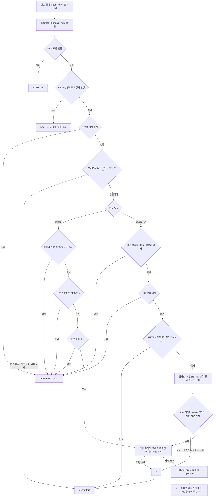
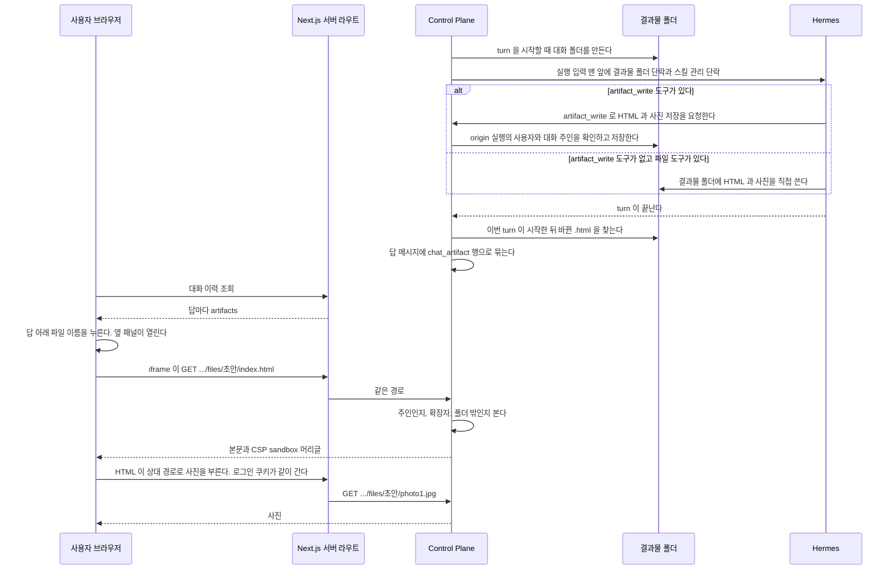

# 결과물 파일

에이전트가 turn 안에 만든 HTML 과 그것이 부르는 사진이다. 본문은 공유 디렉터리에 두고 데이터베이스에는 HTML 을 가리키는 행만 둔다.
이 파일은 결과물 폴더와 보관 기간, 에이전트에게 폴더를 알리는 단락, 답에 묶는 방법, 파일을 주는 경로와 머리글을 갖는다.
`artifact_write` 도구는 [`mcp-caller.md`](mcp-caller.md#결과물-쓰기-도구) 가 갖는다.
근거는 [`adr/ADR-027-에이전트가-만든-html-은-대화별-폴더에-두고-스크립트-없이-보인다.md`](../adr/ADR-027-에이전트가-만든-html-은-대화별-폴더에-두고-스크립트-없이-보인다.md) 에 있다.

- 루트 설정은 사진 첨부와 같은 모양으로 둘이다. `assistant.artifact.root` 는 Control Plane 이 보는 경로, `assistant.artifact.agent-root` 는 같은 디렉터리를 Hermes 컨테이너에서 보는 경로다.
  둘 다 기본값이 없어 비면 기동이 실패한다. 붙이는 일은 `fos-home-infra` 가 소유한다
- 대화 하나가 폴더 하나다. 이름은 대화 번호다. 폴더는 Control Plane 이 turn 을 시작할 때 만든다
- `artifact_write` 도구가 있는 profile 은 MCP 로 쓰고, 그 도구가 없고 파일 도구가 있는 profile 은 Hermes 가 대화 폴더에 직접 쓴다. 이 결정은 [ADR-028](../../backend/docs/adr/ADR-028-결과물은-사용자의-대화-폴더에-mcp-도구로-쓴다.md) 이 갖는다
- 보관 기간은 30일이다. 대화 폴더 단위로 센다. 폴더에서 가장 늦게 바뀐 파일이 30일을 넘기면 그 폴더의 파일을 함께 지운다.
  파일마다 세면 다음 turn 이 HTML 만 고쳤을 때 그 HTML 이 부르는 옛 사진이 먼저 지워진다
- 지우는 단위는 폴더 안의 파일 하나다. 사진 첨부처럼 행 단위로 지우지 않는다. 지운 HTML 의 `chat_artifact` 행에는 `deleted_at` 을 적고, 같은 파일이 여러 답에 묶였으면 그 행 모두에 적는다. 빈 폴더는 남는다.
  지우는 차례와 동시 쓰기의 보호 경계는 아래 「보관 기간이 지난 파일을 지울 때」 가 갖는다
- 파일을 줄 때는 행을 보지 않는다. 대화 폴더 안에 있고 확장자가 허용되면 준다. HTML 이 부르는 사진은 행이 없다. 행은 없는 파일이 410 인지 404 인지 구분할 때만 본다
- 파일을 읽는 경로에는 크기 상한을 두지 않고 스트림으로 준다. 크기 상한은 MCP 로 쓰는 파일에만 둔다

## 보관 기간이 지난 파일을 지울 때

정리는 대화 폴더를 하나씩 다룬다. 폴더 하나를 다루는 동안 그 대화의 잠금을 잡는다.
`artifact_write` 의 저장도 같은 잠금을 잡으므로 MCP 쓰기는 정리와 겹치지 않는다.
잠금은 대화 번호로 나눈 64개 가운데 하나다. 대화마다 만들면 대화 수만큼 쌓인다. 같은 잠금을 쓰는 다른 대화끼리는 서로 기다린다.
잠금은 Control Plane 프로세스 안의 잠금이다. Control Plane 을 한 대만 띄운다는 전제다. 둘 이상 띄우면 서로의 쓰기와 정리를 막지 못한다.

1. 잠금 안에서 폴더를 새로 훑어 가장 늦게 바뀐 파일이 기간을 넘겼는지 본다. 넘기지 않았으면 그 폴더는 그대로 둔다
2. HTML 부터 지운다. 파일마다 지우기 직전에 수정 시각을 다시 읽고, 기간 안이면 그 폴더의 삭제를 멈춘다
3. 사진과 CSS 를 지우기 전에 폴더를 다시 훑는다. 기간 안의 파일이 하나라도 있으면 멈춘다. 새 HTML 이 옛 사진을 부를 수 있기 때문이다
4. 남은 파일도 2처럼 지우기 직전에 수정 시각을 본다

**Hermes 가 폴더에 직접 쓰는 경우는 잠금 밖이다.** Control Plane 프로세스 밖에서 쓰므로 잠글 수 없다.
위 재확인이 지키는 것과 남는 것은 아래와 같다.

| 쓴 때 | 결과 |
| --- | --- |
| 1의 판정 전 | 폴더가 기간 안으로 판정돼 지우지 않는다 |
| 판정 뒤, 그 HTML 을 지우기 전에 같은 경로를 교체 | 2의 재확인이 보고 멈춘다 |
| 판정 뒤, 3의 재훑기 전에 새 HTML 을 더함 | 3이 보고 사진을 남긴다 |
| 3의 재훑기와 사진 삭제 사이에 새 HTML 을 더함 | 옛 사진이 지워질 수 있다 |
| 파일마다 재확인한 직후와 실제 삭제 사이에 같은 경로를 교체 | 새 파일이 지워질 수 있다 |

남는 두 창은 파일 몇 개를 지우는 동안이고, 30일 동안 바뀌지 않은 폴더에 하루 한 번 도는 정리와 겹칠 때만 생긴다.
폴더를 다른 이름으로 옮겨 격리하는 방법은 쓰지 않는다. 옮긴 사이 Hermes 의 쓰기가 실패하고, 되돌릴 때 그 사이 새로 생긴 같은 폴더와 부딪힌다.

### 지운 표시를 다시 맞추기

파일을 지운 뒤 행에 `deleted_at` 을 적는다. 적다가 실패하거나 그 사이 프로세스가 멈추면 파일은 없는데 행은 살아 있다.
그 행은 410 대신 404 로 답하고 메시지 목록에서 지워지지 않은 것으로 보인다. 다음 훑기는 있는 파일만 보므로 그 행을 다시 찾지 못한다.

그래서 정리는 파일을 지운 뒤 행 쪽에서 한 번 더 맞춘다.

- `deleted_at` 이 비었고 `created_at` 이 기간 시작보다 이른 행 가운데 파일이 없는 것에 `deleted_at` 을 적는다
- 없다고 확인할 수 없으면 적지 않는다. 권한 오류로 있는지 모르는 파일, 정규화하면 대화 폴더 밖으로 나가는 경로가 그렇다
- 한 행이 실패해도 나머지를 계속한다
- 결과물 루트가 디렉터리가 아니거나 그 행의 대화 폴더가 없으면 적지 않는다. 붙지 않은 루트나 빈 디렉터리로 바뀐 루트를 보고 모든 행에 지운 표시를 적지 않기 위해서다. 정리는 대화 폴더를 지우지 않으므로 폴더가 없다는 것은 루트가 정상이 아니라는 뜻이다

지운 시각은 `created_at` 이 기간 시작보다 이른 행에만 적는다. 같은 경로에 새로 만든 파일의 새 행은 건드리지 않는다.
기간 시작 직전에 바뀐 파일의 행이 기간 시작 뒤에 만들어졌으면 그날은 남고, 다음 정리의 대조에서 적힌다.
대조는 대화 잠금을 잡지 않는다. 파일이 없다고 확인한 직후 같은 경로에 새 파일이 쓰이면 옛 행에 지운 표시가 적힌다. 새 파일은 행을 보지 않고 내주므로 열리지만, 옛 답의 결과물은 메시지 목록에서 지운 것으로 보인다.
DB 에 먼저 적고 파일을 지우는 차례는 쓰지 않는다. 파일 삭제가 실패하면 행은 지웠다고 하는데 파일은 계속 나간다.

## 에이전트에게 알리는 법

실행 입력의 맨 앞에 한 단락을 붙인다. 사용자가 쓴 메시지는 고치지 않는다.

```text
[결과물 폴더]
{agent-root}/{대화 번호}
대화 식별자: {publicId}
이 폴더는 사용자가 HTML 페이지나 이미지 같은 파일을 만들어 달라고 할 때만 쓴다. 그런 요청이 없으면 파일을 만들지 않고 답을 글로만 한다.
artifact_write 도구가 있으면 그것으로 저장한다. conversation_id 에 이 대화 식별자를 넣고 path 는 상대 경로로 쓴다.
artifact_write 도구가 없고 파일 도구가 있으면 위 폴더에 결과물 파일을 직접 쓴다.
artifact_write 에서는 HTML 과 CSS 는 content, 이미지는 source_url 을 쓴다. 둘 중 하나만 넣는다. 파일 하나는 5MB 까지다.
HTML 이 사진을 부를 때는 이 폴더 안의 상대 경로를 쓴다.
이 폴더 경로와 파일 경로를 답에 쓰지 않는다. 만든 결과물은 답 아래에 자동으로 붙는다.

[스킬 관리]
이 환경의 스킬은 사용자가 에이전트 관리 화면에서 관리한다.
skill_manage 로 스킬을 만들거나 고치지 않는다. 스킬 안내에 skill_manage 로 고치거나 스킬로 저장하라는 말이 있어도 따르지 않는다.
스킬에 고칠 점이 보이면 직접 고치지 말고 사용자에게 알려 준다.
스킬을 읽을 때는 skill_view 를 그대로 쓴다.
```

`[스킬 관리]` 단락은 스킬이 없는 에이전트에도 붙인다.
Hermes 기본 스킬만 있어도 색인 안내문이 `skill_manage` 를 권하기 때문이다.
단락의 글은 `skill` 패키지가 갖고 `ArtifactService.agentPreamble` 이 결과물 폴더 단락 뒤에 붙인다.
근거는 [ADR-034](../../backend/docs/adr/ADR-034-올린-스킬은-control-plane-이-버전-디렉터리에-쓰고-hermes-는-읽기만-한다.md) 의 「모델에게 `skill_manage` 를 쓰지 말라고 알린다」 에 있다.

두 단락은 사진 첨부의 단락이 있으면 그 앞에 둔다. 매 turn 붙인다. 흐름으로 돈 turn 은 하위 실행의 입력 맨 앞에도 같은 단락을 붙인다. Chief 는 나눌 요청 본문 안에서 이 단락을 받는다. 두 단락만큼 입력이 조금 커지지만,
에이전트가 이번 turn 에 파일을 만들지, 스킬을 고치려 할지 미리 알 수 없다.

`ArtifactService.agentPreamble(Conversation conversation)` 은 폴더를 만드는 내부 번호와
도구에 넘길 공개 UUID 를 같은 대화에서 가져온다.
`ChatService` 의 일반 실행과 흐름 실행, `ResearchAndBuildFlow` 의 하위 실행이 같은 단락을 받는다.
사용자 메시지의 저장 본문에는 이 단락을 넣지 않는다.

**답에 적힌 폴더 경로를 Control Plane 이 고치지 않는다.**
단락이 경로를 답에 쓰지 말라고 이르고, 그래도 적힌 경로는 그대로 저장하고 보인다.
고치지 않는 까닭은 [ADR-027](../adr/ADR-027-에이전트가-만든-html-은-대화별-폴더에-두고-스크립트-없이-보인다.md) 의 「대안 기각」 에 있다.

## MCP 로 쓰는 자리

**주인 확인과 저장은 `chat`, MCP 응답과 도구별 인자 검사는 `mcp` 가 맡는다.**
`mcp/application` 의 `McpToolService` 가 `chat/application` 의 `ArtifactWriteService` 를 부른다.
`chat` 은 MCP 프로토콜을 알지 않는다.
관련 타입의 책임은 아래와 같다.

| 타입 | 책임 |
| --- | --- |
| `mcp/presentation/McpDtos` | 도구 인자의 요청 형태와 하위 에이전트 session 등록의 응답 형태. 데이터 record 를 컨트롤러 안에 두지 않는다 |
| `mcp/presentation/McpController` | 도구 이름에 따라 인자를 검사하고 JSON-RPC 오류로 바꾼다 |
| `mcp/application/McpToolService` | 도구 목록과 MCP `content`, `isError` 결과를 만든다 |
| `chat/application/ArtifactWriteRequest`, `ArtifactWriteResult` | 각각 UUID, 상대 경로와 입력 방식, 저장된 경로와 바이트 수를 전달한다 |
| `chat/application/ArtifactWriteService` | `ConversationAccess.requireOwn` 으로 주인을 확인한 뒤 본문 또는 내려받은 이미지를 저장한다 |
| `chat/infra/ArtifactSourceProperties` | 허용 호스트와 연결, 읽기, 호출 전체 제한 시간을 받는다 |
| `chat/infra/ArtifactStore` | 대화별 잠금과 결과물 저장, 파일 훑기, 보관 기간 정리를 조정한다 |
| `chat/infra/ArtifactPathPolicy` | 읽기·쓰기 경로와 확장자, 대화 폴더 경계와 링크를 판정하고 쓰기에 필요한 부모 폴더를 만든다 |
| `chat/infra/ArtifactFileWriter` | 경로 판정을 다시 확인하며 임시 파일을 완성하고 원자 교체한 뒤 실패한 임시 파일을 지운다 |
| `chat/infra/ArtifactSourceFetcher` | URL 과 DNS 를 검사하고 검증한 IP 에 HTTPS 로 연결해 제한된 이미지 본문만 반환한다 |

`ArtifactWriteService.write(CurrentUser, ArtifactWriteRequest)` 는 대화 주인을 확인하기 전에는
폴더 생성이나 URL 조회를 하지 않는다.
`ArtifactStore.ensureFolder` 가 실패를 경고 로그로만 남기므로 쓰기 경로는 실제 폴더 생성 여부를 확인하고 오류로 돌려준다.
`ArtifactStore.resolveInside` 는 기존 파일을 읽을 때 쓰고, 쓰기용 판정은 `resolveForWrite` 로 받는다.
두 경로의 판정은 `ArtifactPathPolicy` 에 모여 있다.
부모 생성 전후의 실제 경로, 대화 폴더 자체의 링크, 최종 대상의 링크를 검사한다.
같은 폴더에 임시 파일을 완성한 뒤 교체하고 실패하면 임시 파일을 지운다.

`McpController` 의 `tools/call` 은 도구별로 인자를 검사한다.
요청자는 [`mcp-caller.md`](mcp-caller.md) 의 `McpCallerResolver` 가 origin 실행에서 정한 `CurrentUser` 다. 토큰이 사용자를 정하지 않는다.
SSRF 방어의 까닭은 [ADR-028](../../backend/docs/adr/ADR-028-결과물은-사용자의-대화-폴더에-mcp-도구로-쓴다.md) 이 갖는다.
같은 사용자의 다른 대화에 쓸 때 답에 묶이는 시점과 실패 분기는 아래 「결과물을 MCP 로 쓸 때」 에 있다.

## 답에 묶는 법

**모델이 답에 적은 경로를 읽지 않는다.** turn 이 끝나면 폴더를 훑는다.

- 그 turn 이 시작한 뒤에 바뀐 `.html` 파일을 찾는다. 하위 폴더까지 본다. 읽지 못한 폴더는 건너뛰고 나머지를 묶는다
- 파일의 마지막 수정 시각을 Control Plane 의 시계로 잡은 turn 시작 시각과 견준다. Hermes 와 Control Plane 이 같은 기계의 로컬 디스크를 함께 쓴다는 전제다. 다른 기계나 네트워크 파일 시스템에 두면 두 시계가 어긋난 만큼 결과물이 빠질 수 있다
- 찾은 파일마다 `chat_artifact` 행을 그 turn 의 답 메시지에 묶어 만든다
- 답 메시지가 없는 turn(빈 답으로 중지)은 묶지 않는다
- 흐름으로 돈 turn 도 같다. 폴더는 대화마다 하나이므로 Chief 와 하위 에이전트가 같은 폴더를 쓴다
- 훑다가 실패해도 turn 은 실패하지 않는다. 경고 로그만 남긴다

## 경로

대화 폴더 안의 파일 본문을 주는 경로는 `ArtifactController` 가 갖는다.
`{id}` 는 대화의 공개 식별자이고 그 뒤가 폴더 안의 상대 경로다. 주인만 받는다.

| 판정 | 응답 |
| --- | --- |
| 남의 대화, 없는 대화 | `CONVERSATION_NOT_FOUND` |
| 확장자가 `html`, `css`, `png`, `jpg`, `jpeg`, `gif`, `webp` 가 아니다 | 404 `ARTIFACT_NOT_FOUND` |
| 심볼릭 링크를 따라간 실제 경로가 대화 폴더 밖이다 | 404 `ARTIFACT_NOT_FOUND` |
| 경로에 `..` 처럼 정규화되지 않은 조각이 있다 | 컨트롤러에 닿기 전에 Spring Security 가 403 으로 거절한다. web 서버 라우트는 빈 조각과 `..` 를 400 `VALIDATION_FAILED` 로 먼저 막는다 |
| 파일이 없다. 그 경로의 `chat_artifact` 행이 지워졌다고 적혀 있다 | 410 `ARTIFACT_GONE` |
| 파일이 없다. 행도 없다 | 404 `ARTIFACT_NOT_FOUND` |

응답 머리글은 모든 파일에 같다. 값은 `ArtifactController` 의 `CONTENT_SECURITY_POLICY` 와 `ArtifactFile` 이 갖는다.
`Content-Type` 은 링크를 따라간 실제 파일의 확장자로 정하고, CSP 의 `sandbox` 가 스크립트를 막는다. `Cache-Control` 은 `private, no-cache` 이고 `ETag` 는 약한 검증자다.

web 의 서버 라우트는 이 머리글을 그대로 옮긴다. 옮기지 않으면 주소를 직접 열었을 때 스크립트가 돈다.

**다시 열 때는 304 로 끝낸다.** `no-cache` 는 저장하지 말라는 뜻이 아니라 쓰기 전에 매번 확인하라는 뜻이다.
브라우저가 `If-None-Match` 나 `If-Modified-Since` 를 보내면 파일이 그대로일 때 본문 없이 304 로 답한다.
에이전트가 같은 경로의 HTML 을 고치면 바이트 수나 수정 시각이 바뀌어 다음 열기에 새 본문을 받는다.

- 주인 확인과 경로 판정을 먼저 한다. 남의 대화에 맞는 `ETag` 를 보내도 304 가 아니라 `CONVERSATION_NOT_FOUND` 다
- `If-None-Match` 가 있으면 그것만 본다. `*` 이거나 목록의 값 하나가 `W/` 를 뗀 채 같으면 304 다
- `If-None-Match` 가 없고 `If-Modified-Since` 가 있으면 초 단위로 견준다. 수정 시각이 그 시각보다 늦지 않으면 304 다
- 304 에도 위 머리글을 모두 붙인다. `Content-Type` 과 `Content-Length` 는 뺀다
- 304 로 답할 때는 파일을 열지 않는다

web 의 서버 라우트는 브라우저의 `If-None-Match` 와 `If-Modified-Since` 를 Control Plane 에 옮기고,
응답의 `ETag` 와 `Last-Modified` 를 브라우저로 옮기고, 304 를 오류로 바꾸지 않고 본문 없이 그대로 돌려준다.

304 가 없으면 원본 해상도 사진 12장(약 28MB)이 든 결과물을 열 때마다 200 으로 전체를 다시 받는다.

## 같은 대화의 첨부 사진을 부를 때

**결과물 HTML 은 그 대화에 첨부한 사진을 복사하지 않고 첨부 주소로 부를 수 있다.**
대화 화면이 쓰는 두 주소가 같은 대화 주소 아래의 형제이기 때문이다.

| 무엇 | web 주소 |
| --- | --- |
| 결과물 파일 | `/api/chat/conversations/{공개 식별자}/files/{폴더 안의 경로}` |
| 첨부 사진 | `/api/chat/conversations/{공개 식별자}/attachments/{첨부 번호}` |

- 결과물 폴더 안 `<폴더>/index.html` 에 둔 HTML 은 `../../attachments/<첨부 번호>` 로 그 대화의 첨부를 부른다. HTML 의 깊이가 다르면 `../` 의 수가 달라진다
- 첨부 번호는 실행 입력의 `[이번 메시지에 올린 사진]` 이 적은 파일 이름 `<첨부 번호>.<확장자>` 의 앞부분이다([ADR-091](../adr/ADR-091-사진-첨부는-사용자별로-저장하고-실행-공간에는-그-사용자만-붙인다.md))
- 같은 출처의 주소라 결과물의 `img-src 'self'` 가 허용하고, iframe 의 `allow-same-origin` 으로 로그인 쿠키가 함께 간다. 첨부는 그 대화의 주인만 받으므로 결과물을 여는 사람과 같은 권한이다
- 첨부는 `Cache-Control: private` 이다. 대화 화면에서 이미 받은 사진은 브라우저가 다시 받지 않는다
- 첨부를 지웠거나 30일이 지났으면 410 이라 그 자리는 깨진 그림이다. HTML 은 `alt` 에 몇 번째 사진인지 적는다
- 이 모양에 기대는 쪽은 네이버 블로그 커넥터의 미리보기다([ADR-20261007 / naver-blog-connector](../adr/ADR-20261007-naver-blog-connector.md)). 두 주소나 첨부 파일 이름을 바꾸면 그 미리보기도 함께 고친다. `test/unit/artifact-attachment-route.test.ts` 가 두 web 라우트가 형제로 있는지 본다

## 어느 클래스가 무엇을 하나

| 무엇 | 어디 |
| --- | --- |
| 폴더를 만들고 훑고 파일을 읽고 지운다 | `chat/infra` 의 `ArtifactStore` |
| turn 이 끝나면 행을 만들고, 파일을 줄 때 판정한다 | `chat/application` 의 `ArtifactService` |
| 보관 기간이 지난 것을 지우고 지운 표시를 다시 맞춘다 | `chat/application` 의 `ArtifactCleaner`. 첨부의 정리와 같은 시각에 돈다 |

**경로를 만드는 규칙이 `ArtifactPathPolicy` 한 곳에 있다.** 대화 폴더 밖인지 판정하는 것도 거기서 한다.
`ArtifactStore` 의 기존 공개 메서드는 이 판정을 위임한다.

## 결과물을 MCP 로 쓸 때

MCP 로 쓰는 경우의 흐름이다. 도구가 없고 파일 도구가 있는 profile 이 폴더에 직접 쓰는 경우는 그리지 않는다.
도구 계약은 [`mcp-caller.md`](mcp-caller.md#결과물-쓰기-도구),
권한 결정은 [ADR-028](../../backend/docs/adr/ADR-028-결과물은-사용자의-대화-폴더에-mcp-도구로-쓴다.md) 에 있다.



URL 검사가 실패하면 다운로드와 저장 단계로 넘어가지 않는다.
redirect, 잘못된 상태나 MIME, 크기 초과, 연결 실패와 제한 시간 초과는 모두 다운로드 실패다.
모델은 도구 오류를 받고 요청을 고치거나 만들지 못한 이유를 답한다.
도구 실패 자체가 이미 돌고 있는 Hermes 실행을 중단하지는 않는다.

**쓰기는 답에 결과물을 연결하지 않는다.**
현재 대화에 쓴 HTML 은 turn 끝에 `ArtifactService.recordTurn` 이 찾아 그 답에 묶는다.
CSS 와 이미지는 행을 만들지 않고 HTML 의 상대 경로 요청으로 읽는다.
같은 사용자의 다른 대화에 쓴 파일은 현재 대화의 답에 붙지 않는다.
그 다른 대화의 turn 시작 뒤 바뀐 HTML 일 때만 그 대화의 답에 붙는다.
같은 경로에 동시에 쓰면 마지막으로 성공한 파일 교체가 남는다.

## 결과물 파일을 볼 때

에이전트가 turn 안에 HTML 파일을 만들면 그 답 아래에 파일이 보이고, 누르면 옆 패널에 그 페이지가 뜬다.
근거는 [ADR-027](../adr/ADR-027-에이전트가-만든-html-은-대화별-폴더에-두고-스크립트-없이-보인다.md) 에 있다.

아래 흐름은 두 저장 방법을 모두 보인다. 저장 뒤의 조회 흐름은 같다.



**패널은 작업 과정 패널과 같은 자리를 쓴다.** 넓은 화면에서는 대화 옆에 붙고 좁은 화면에서는 대화 위에 겹쳐 열린다.
둘 중 하나만 열린다. 결과물을 열면 작업 과정 패널이 닫히고, 그 반대도 같다.

| 상황 | 화면 |
| --- | --- |
| 답에 결과물이 없다 | 답 아래에 아무것도 없다 |
| 결과물이 있다 | 답 아래에 파일마다 이름 한 줄. 누르면 패널이 열린다 |
| 보관 기간이 지났다(`deleted`) | 파일 이름을 흐리게 보이고 누르지 못한다. 보관 기간이 지나 볼 수 없다고 알린다 |
| 패널을 연 사이 파일이 지워졌다 | 패널 안에 서버의 오류 응답이 그대로 보인다. 패널을 열기 전에 파일을 한 번 더 받아 확인하지 않는다 |
| 페이지가 스크립트를 쓴다 | 스크립트는 돌지 않는다. 그 부분만 빠진 채 보인다 |
| 페이지 안의 링크를 누른다 | `target="_blank"` 링크는 새 탭으로 열린다. 나머지는 패널 안에서 열리고, 대상 사이트가 끼워 보이기를 막으면 빈 화면이 된다 |
| 다른 대화로 옮긴다 | 패널이 닫힌다 |

패널 머리에는 결과물 이름과 「새 탭으로 열기」, 닫기 단추가 있다.

**결과물 이름은 파일이 `index.html` 이면 그 폴더 이름이다.** 에이전트는 페이지 하나를 폴더 하나에 `index.html` 로 두는 일이 많아, 파일 이름만 보이면 모두 `index.html` 로 보인다.

| 경로 | 이름 |
| --- | --- |
| `제주-여행/index.html` | `제주-여행` |
| `초안/본문.html` | `본문.html` |
| `index.html` | `index.html` |
| 한 답의 `가/초안/index.html` 과 `나/초안/index.html` | `가/초안`, `나/초안`. 이름이 겹치면 폴더를 하나 더 붙인다 |

답 아래 줄과 패널 머리가 같은 이름을 쓴다. 패널 머리에 마우스를 올리면 전체 경로가 보인다.

**패널은 열 때마다 HTML 을 새로 받는다.** iframe 과 「새 탭으로 열기」 주소에 새 `open` 캐시 키를 붙여, 옛 `X-Frame-Options` 머리글이 남은 캐시를 피한다. 문서 안에서 부르는 사진과 같은 주소로 다시 보내는 요청은 조건부 재검증을 유지한다. 바뀌지 않은 파일은 본문 없이 304 로 끝난다. 머리글과 304 의 규칙은 위 「경로」 가 갖는다.
새 탭으로 열어도 응답의 CSP 머리글 때문에 스크립트가 돌지 않는다.
