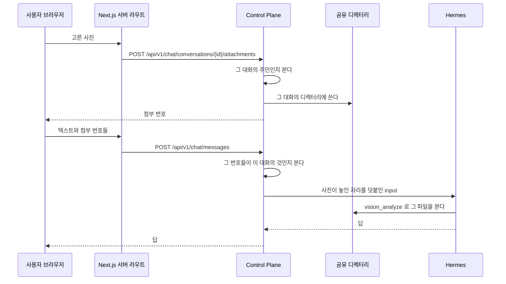

# 사진 첨부

대화에 올린 사진이다. 본문은 공유 디렉터리에 두고 데이터베이스에는 그것을 가리키는 행만 둔다.
이 파일은 사진을 두는 자리와 상한, 올리고 읽고 지우는 경로, 에이전트에게 사진의 자리를 알리는 방법을 갖는다.
파일 전달의 근거는 [ADR-020](../../backend/docs/adr/ADR-020-사진은-공유-디렉터리에-두고-에이전트가-파일로-읽는다.md), 사용자별 저장과 실행 공간 mount 는 [ADR-091](../adr/ADR-091-사진-첨부는-사용자별로-저장하고-실행-공간에는-그-사용자만-붙인다.md) 에 있다.

- **디렉터리 루트를 코드에 박지 않는다.** 설정으로 받는다. 붙이는 일은 `fos-home-infra` 가 소유한다.
- 루트 설정은 둘이다. `root` 는 Control Plane 이 쓰는 경로이고 `agent-root` 는 같은 디렉터리를 Hermes 컨테이너에서 보는 경로다.
  실행 입력에는 `agent-root` 를 적는다. 둘 다 기본값이 없어 하나라도 비면 기동을 멈춘다.
- 저장 경로는 `{root}/users/{사용자 디렉터리 키}/{대화 번호}/{첨부 번호}.{확장자}` 다.
  사용자 디렉터리 키는 `u<사용자 번호>` 의 UTF-8 SHA-256 소문자 64자리다. 첨부 행의 올린 사용자를 따른다.
- 실행 공간에 사용자 폴더 하나만 읽기 전용으로 붙이는 규칙, Control Plane 이 Hermes 를 부르기 전에 사용자 폴더를 만드는 호출과 그 실패 처리는 [ADR-091](../adr/ADR-091-사진-첨부는-사용자별로-저장하고-실행-공간에는-그-사용자만-붙인다.md) 이 갖는다. 폴더를 만드는 일은 `hermes/SandboxAttachmentDirectory` 가 맡는다.
- 파일 이름은 `{첨부 번호}.{확장자}` 다. 올릴 때의 이름을 파일 이름으로 쓰지 않는다.
- **행을 지우지 않는다.** 파일을 지우고 `deleted_at` 을 적는다.
- 받는 형식은 `image/jpeg`, `image/png`, `image/gif`, `image/webp` 넷이다. HEIC 는 받지 않는다.
- multipart 상한과 Tomcat 의 `max-swallow-size` 를 서비스 상한보다 크게 두는 까닭은 `application.yml` 의 주석이 갖는다.
- 상한은 한 번 보낼 때 30장, 한 장 10MB 다. 장수는 아직 메시지에 묶이지 않은 첨부만 센다. 보관 기간은 30일이다.
  10장 33MB 실측을 비례로 계산하면 30장은 약 100MB 이고, 모든 사진이 한 장 상한이면 최대 300MiB 가 저장될 수 있다.

## 누가 볼 수 있나

그 대화의 주인만이다. 첨부에 직접 닿는 경로를 두지 않고 대화를 통해서만 닿는다.
**남의 대화의 첨부는 없는 것과 같은 응답을 준다.**

실행 공간의 격리와, 사진 첨부를 주인이 있는 `PRIVATE` 에이전트만 받고 요청자와 주인이 다르면 거절하는 규칙은 [ADR-091](../adr/ADR-091-사진-첨부는-사용자별로-저장하고-실행-공간에는-그-사용자만-붙인다.md) 이 갖는다.

## 파일을 읽고 지울 때

저장과 읽기, 사용자 삭제와 만료 정리는 사용자별 경로만 다룬다. 파일이 없으면 410 으로 답하며 다른 경로에서 복구하지 않는다.
기동할 때 첨부 파일을 복사하거나 비교하지 않는다. 파일 이름은 첨부 번호와 허용 MIME 의 확장자가 정하고,
루트 아래 경로에 심볼릭 링크가 있으면 저장과 읽기, 삭제를 거절한다. 같은 프로세스의 파일 작업은 직렬화한다.

사용자별 경로로의 이전과 옛 사본 정리는 끝났다. 이전 이력과 옛 저장 형식을 쓰는 버전으로 되돌릴 때의 제한은
[ADR-091](../adr/ADR-091-사진-첨부는-사용자별로-저장하고-실행-공간에는-그-사용자만-붙인다.md)의 「기존 사진 이전 이력과 되돌리기」가 갖는다.
실제 운영 절차는 `fos-home-infra` 가 맡는다.

## 경로

경로는 `AttachmentController` 가 갖는다. 사진 본문을 읽을 때 파일이 지워졌으면 410 이다.
보내기(`POST /api/v1/chat/messages`)가 첨부 번호 목록을 함께 받는다.

새 대화에서 첫 사진을 올리려면 대화의 공개 식별자가 먼저 있어야 한다.
`POST /api/v1/chat/conversations` 가 제목이 빈 대화를 만들고, 제목은 첫 메시지가 정한다.

## 에이전트에게 알리는 법

**사용자가 쓴 메시지를 고치지 않는다.** `chat_message.content` 는 그대로 둔다.
Hermes 에 보내는 `input` 에만 사진이 놓인 자리와 파일 이름을 덧붙인다.

지난 대화를 다시 읽을 때 사람이 쓴 것과 우리가 덧붙인 것이 섞이지 않게 한다.

실행 입력에는 사진이 놓인 디렉터리와 디스크 이름을 사용자가 쓴 글 앞에 붙이고,
`read_file` 대신 `vision_analyze` 로 보라는 안내 문장을 함께 적는다.

사진마다 그 대화에서 몇 번째 사진인지도 붙이고, 사용자에게는 그 순번으로 가리키라고 적는다.
디스크 이름은 첨부 번호라 대화를 넘어 커진다.
에이전트가 `19.jpg` 를 「사진 19」 로 적으면 사진이 열한 장인 대화에서 사용자가 어느 것인지 찾지 못한다.
순번은 메시지에 묶인 첨부를 메시지 순서로, 한 메시지 안에서는 사용자가 고른 순서로 센 것이라 화면의 순서와 같다.
그 순서는 `chat_attachment.position` 이 갖는다([`backend/docs/data-schema.md`](../../backend/docs/data-schema.md) 의 「chat_attachment」).

## 어느 클래스가 무엇을 하나

| 무엇 | 어디 |
| --- | --- |
| 첨부를 받고 판정하고 행을 만든다 | `chat/application` |
| 파일을 디스크에 두고 읽고 지운다 | `chat/infra` |
| 보관 기간이 지난 것을 지운다 | `chat/application` 의 일정 실행 |

**파일을 다루는 것이 한 곳이다.** 경로를 만드는 규칙이 흩어지면 지우는 쪽이 놓친다.

## 사진을 올려 보낼 때

사진은 파일로 두고 에이전트가 도구로 읽는다. 대화 본문에 싣지 않는다.

**사진을 고르면 그 자리에서 올라간다.** 보내기를 누를 때 한꺼번에 올리지 않는다.
서른 장을 보내는 순간에 올리면 그동안 화면이 멈춘다.

**올리는 것만으로 실행이 돌지 않는다.** 보내기를 눌러야 에이전트가 움직인다.
사진만 올라가면 무엇을 하라는지 알 길이 없다.

### 갈리는 지점

| 무엇 | 어떻게 되나 |
| --- | --- |
| 남의 대화에 올린다 | 거절한다. 없는 대화와 같은 응답을 준다 |
| 받지 않는 형식 | 거절한다. jpeg, png, gif, webp 넷만 받는다. HEIC 도 거절된다. 무엇을 받는지 화면이 미리 알린다 |
| 한 장이 상한을 넘는다 | 그 장만 거절한다. 나머지는 올라간다 |
| 장수가 상한을 넘는다 | 넘는 것을 고르지 못하게 화면이 막는다. 서버도 아직 보내지 않은 첨부가 30장이면 다음 것을 거절한다 |
| 사진 업로드가 고른 순서와 다르게 끝난다 | 화면은 고른 순간 자리를 만들고, 그 자리 순서로 첨부 번호를 보낸다. 서버는 그 순서를 `position` 으로 저장한다 |
| 사진을 받는다고 선언하지 않은 옛 커넥터 에이전트 | 보낼 때 거절한다. 화면은 사진 단추를 두지 않는다. 연결을 붙인 일반 에이전트는 붙인 커넥터와 상관없이 일반 에이전트와 같다 |
| 흐름이 붙은 에이전트 | 보낼 때 거절한다. 빈 대화는 만들 수 있다(모델을 먼저 고를 때). 흐름의 입력에는 사진 자리를 덧붙이지 않는다. 화면은 사진 단추를 두지 않는다 |
| 올렸는데 보내지 않았다 | 그 첨부는 메시지에 묶이지 않은 채 남고 보관 기간이 지나면 지워진다 |
| 남의 첨부 번호를 보낸다 | 거절한다. 그 대화의 것이 아니면 메시지가 나가지 않는다 |
| 보관 기간이 지났다 | 파일이 지워지고 화면이 보관 기간이 지나 볼 수 없다고 알린다 |
| 사용자가 먼저 지운다 | 같은 상태가 된다. 지난 대화에 자리는 남는다 |
| 디렉터리에 쓰지 못한다 | 올리기가 실패한다. 화면이 까닭을 보이고 다시 고를 수 있게 둔다 |
