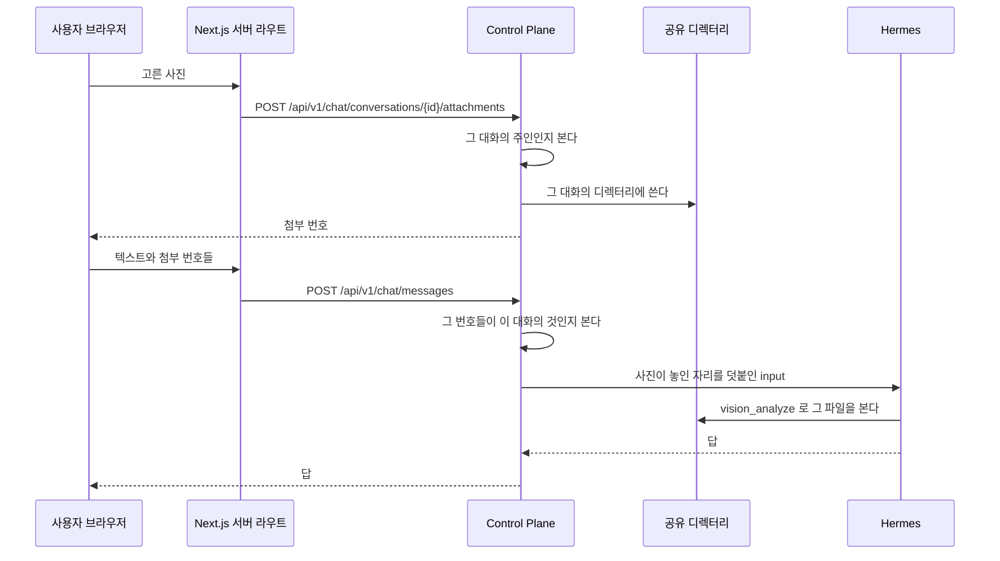

# 사진 첨부

대화에 올린 사진이다. 본문은 공유 디렉터리에 두고 데이터베이스에는 그것을 가리키는 행만 둔다.
이 파일은 사진을 두는 자리와 상한, 올리고 읽고 지우는 경로, 에이전트에게 사진의 자리를 알리는 방법을 갖는다.
파일 전달의 근거는 [ADR-020](../adr/ADR-020-사진은-공유-디렉터리에-두고-에이전트가-파일로-읽는다.md), 사용자별 저장과 실행 공간 mount 는 [ADR-091](../adr/ADR-091-사진-첨부는-사용자별로-저장하고-실행-공간에는-그-사용자만-붙인다.md) 에 있다.

- **디렉터리 루트를 코드에 박지 않는다.** 설정으로 받는다. 붙이는 일은 `fos-home-infra` 가 소유한다.
- 루트 설정은 둘이다. `root` 는 Control Plane 이 쓰는 경로이고 `agent-root` 는 같은 디렉터리를 Hermes 컨테이너에서 보는 경로다.
  실행 입력에는 `agent-root` 를 적는다. 둘 다 기본값이 없어 하나라도 비면 기동을 멈춘다.
- 저장 경로는 `{root}/users/{사용자 디렉터리 키}/{대화 번호}/{첨부 번호}.{확장자}` 다.
  사용자 디렉터리 키는 `u<사용자 번호>` 의 UTF-8 SHA-256 소문자 64자리다. 첨부 행의 올린 사용자를 따른다.
- 실행 공간에는 신뢰한 `sandbox_owner` 에 대응하는 사용자 폴더 하나만 읽기 전용으로 붙인다.
  `agent-root` 는 Hermes 정책의 `attachment_agent_root` 와 같아야 한다. 전체 첨부 루트를 공통 mount 에 넣지 않는다.
- **사용자 폴더는 Control Plane 이 만든다.** 업로드와 복사 때 말고도, 실행 공간 설정을 쓰는 세 Hermes 호출
  (도구 저장 `writeApiServer`, 옛 커넥터를 켜는 `putConnector`, 도구 목록을 함께 쓰는 스킬 게시 `publish`)을 보내기 전에
  `{root}/users/{SHA-256(sandbox_owner)}` 를 만든다. 사진을 올린 적 없는 주인도 실행 공간을 쓰기 때문이다.
  `root` 는 미리 있어야 하고, Hermes 정책의 두 첨부 루트와 같은 디렉터리여야 한다.
  Hermes 는 첨부 루트를 읽기 전용으로 보므로 만들지 못하고 존재와 링크 없음만 확인한다.
  이 일은 `hermes/SandboxAttachmentDirectory` 가 맡는다. 루트, `users`, 사용자 폴더 가운데 링크가 있거나
  실제 경로가 루트 아래 그 폴더와 다르면 보내지 않고 `AGENT_SANDBOX_UNAVAILABLE` 409 로 멈춘다.
  커넥터를 에이전트에 붙이는 바인딩 설치(`bindConnector`)도 보내기 전에 같은 폴더를 만들지만, 최선 노력이다.
  만들지 못해도 경고 로그만 남기고 설치 요청을 보낸다. 사용자 첨부를 읽는다고 선언한 커넥터면
  대시보드가 그 폴더를 확인하지 못해 409 로 거절하고, 선언하지 않은 커넥터는 첨부 루트 문제로 막히지 않는다
  ([ADR-20261007 / connector-owner-attachments](../adr/ADR-20261007-connector-owner-attachments.md)).
- 파일 이름은 `{첨부 번호}.{확장자}` 다. 올릴 때의 이름을 파일 이름으로 쓰지 않는다.
- **행을 지우지 않는다.** 파일을 지우고 `deleted_at` 을 적는다.
- 받는 형식은 `image/jpeg`, `image/png`, `image/gif`, `image/webp` 넷이다. HEIC 는 받지 않는다.
- multipart 상한은 한 장 11MB, 요청 12MB 다. 서비스 상한 10MB 를 조금 넘는 것은 `VALIDATION_FAILED` 로 거절한다.
  Tomcat 의 `max-swallow-size` 를 16MB 로 둔다. 요청 상한을 넘은 본문이 기본값 2MB 보다 크면
  Tomcat 이 400 을 쓴 뒤 연결을 끊어 클라이언트가 응답을 받지 못하기 때문이다. 16MB 를 넘으면 여전히 끊긴다.
- 상한은 한 번 보낼 때 30장, 한 장 10MB 다. 장수는 아직 메시지에 묶이지 않은 첨부만 센다. 보관 기간은 30일이다.
  10장 33MB 실측을 비례로 계산하면 30장은 약 100MB 이고, 모든 사진이 한 장 상한이면 최대 300MiB 가 저장될 수 있다.

## 누가 볼 수 있나

그 대화의 주인만이다. 첨부에 직접 닿는 경로를 두지 않고 대화를 통해서만 닿는다.
**남의 대화의 첨부는 없는 것과 같은 응답을 준다.**

격리된 profile 의 셸과 파일·vision 도구에는 실행 공간 주인의 첨부 폴더만 보인다.
디렉터리 키를 알아도 다른 사용자 폴더가 mount 되지 않는다. local profile 은 이 격리의 적용 대상이 아니다.
`vision`, `image_gen`, `video_gen` 만 켜도 Docker 설정을 적용하고 그룹 공개를 거절한다.
정책 미등록 profile 에서는 세 도구 저장을 거절한다. 사진 첨부는 주인이 있는 `PRIVATE` 에이전트만 받는다.
첨부가 있는 실행은 요청자와 에이전트 주인이 같은지도 검사한다. 연결용 에이전트 설치도 같은 주인 키를 전달한다.

## 기존 파일을 읽고 옮길 때

기동할 때 `AttachmentBackfill` 이 삭제하지 않은 첨부를 256행씩 읽어 옛 대화 폴더의 파일을 사용자 폴더에 복사한다.
읽기와 Hermes 입력 생성도 같은 복사를 수행한다. 새 경로를 먼저 완성한 뒤에만 파일을 읽거나 그 경로를 알린다.
옛 원본은 첫 배포에서 남긴다. 이전 기간의 신규 업로드도 양쪽 경로에 쓰고, 사용자 삭제와 만료 정리는 양쪽 사본을 함께 지운다.
복사 실패나 다른 내용의 중복 파일은 준비 완료를 막는다. DB 행을 바꾸지 않으며 다음 기동에서 재시도한다.

이전 기간에는 새로 올린 파일의 옛 사본도 있어 이전 버전으로 되돌려도 기존 화면이 사진을 읽는다.
되돌리는 동안은 첨부 업로드를 중지한다. 기존 사진의 vision 접근은 이전 plugin 정책에서 사용자별 하위 폴더를
그 profile 의 `agent-root` 에 붙여 경로를 맞춘 뒤 유지한다. 전체 루트는 붙이지 않는다.
다음 배포가 안정되고 이전 버전으로 되돌릴 필요가 없어진 뒤 `ASSISTANT_ATTACHMENT_LEGACY_WRITE_ENABLED=false` 로 양쪽 저장을 끈다.
옛 사본은 새 사본 확인과 백업 뒤 별도 작업으로 정리한다. 사용자 폴더는 남긴다.
파일 복사와 되돌리기는 Flyway 로 실행하지 않는다. 실제 운영 절차와 옛 사본 정리는 `fos-home-infra` 가 맡는다.

## 경로

| 경로 | 하는 일 |
| --- | --- |
| `POST /api/v1/chat/conversations/{id}/attachments` | 사진을 올린다. 첨부 번호를 돌려준다 |
| `GET /api/v1/chat/conversations/{id}/attachments/{attachmentId}` | 그 사진의 본문. 지워졌으면 410 |
| `DELETE /api/v1/chat/conversations/{id}/attachments/{attachmentId}` | 먼저 지운다 |

`POST /api/v1/chat/messages` 가 첨부 번호 목록을 함께 받는다.

새 대화에서 첫 사진을 올리려면 대화의 공개 식별자가 먼저 있어야 한다.
`POST /api/v1/chat/conversations` 가 제목이 빈 대화를 만들고, 제목은 첫 메시지가 정한다.

## 에이전트에게 알리는 법

**사용자가 쓴 메시지를 고치지 않는다.** `chat_message.content` 는 그대로 둔다.
Hermes 에 보내는 `input` 에만 사진이 놓인 자리와 파일 이름을 덧붙인다.

지난 대화를 다시 읽을 때 사람이 쓴 것과 우리가 덧붙인 것이 섞이지 않게 한다.

실행 입력에는 사진이 놓인 디렉터리와 디스크 이름을 사용자가 쓴 글 앞에 붙이고,
`read_file` 대신 `vision_analyze` 로 보라는 안내 문장을 함께 적는다.

사진마다 그 대화에서 몇 번째 사진인지도 붙이고, 사용자에게는 그 순번으로 가리키라고 적는다.
디스크 이름은 첨부 번호라 대화를 넘어 커진다.
에이전트가 `19.jpg` 를 「사진 19」 로 적으면 사진이 열한 장인 대화에서 사용자가 어느 것인지 찾지 못한다.
순번은 메시지에 묶인 첨부를 메시지 순서로, 한 메시지 안에서는 사용자가 고른 순서로 센 것이라 화면의 순서와 같다.
그 순서는 `chat_attachment.position` 에 0부터 저장한다. 지운 사진도 순번 자리를 차지한다.
과거 행은 첨부 번호 순으로 `position` 을 채운다.

## 어느 클래스가 무엇을 하나

| 무엇 | 어디 |
| --- | --- |
| 첨부를 받고 판정하고 행을 만든다 | `chat/application` |
| 파일을 디스크에 두고 복사하고 지운다 | `chat/infra` |
| 기동할 때 옛 파일을 사용자 폴더에 복사한다 | `chat/application` 의 `AttachmentBackfill` |
| 보관 기간이 지난 것을 지운다 | `chat/application` 의 일정 실행 |

**파일을 다루는 것이 한 곳이다.** 경로를 만드는 규칙이 흩어지면 지우는 쪽이 놓친다.

## 사진을 올려 보낼 때

사진은 파일로 두고 에이전트가 도구로 읽는다. 대화 본문에 싣지 않는다.

**사진을 고르면 그 자리에서 올라간다.** 보내기를 누를 때 한꺼번에 올리지 않는다.
서른 장을 보내는 순간에 올리면 그동안 화면이 멈춘다.

**올리는 것만으로 실행이 돌지 않는다.** 보내기를 눌러야 에이전트가 움직인다.
사진만 올라가면 무엇을 하라는지 알 길이 없다.

### 갈리는 지점

| 무엇 | 어떻게 되나 |
| --- | --- |
| 남의 대화에 올린다 | 거절한다. 없는 대화와 같은 응답을 준다 |
| 받지 않는 형식 | 거절한다. jpeg, png, gif, webp 넷만 받는다. HEIC 도 거절된다. 무엇을 받는지 화면이 미리 알린다 |
| 한 장이 상한을 넘는다 | 그 장만 거절한다. 나머지는 올라간다 |
| 장수가 상한을 넘는다 | 넘는 것을 고르지 못하게 화면이 막는다. 서버도 아직 보내지 않은 첨부가 30장이면 다음 것을 거절한다 |
| 사진 업로드가 고른 순서와 다르게 끝난다 | 화면은 고른 순간 자리를 만들고, 그 자리 순서로 첨부 번호를 보낸다. 서버는 그 순서를 `position` 으로 저장한다 |
| 사진을 받는다고 선언하지 않은 옛 커넥터 에이전트 | 보낼 때 거절한다. 화면은 사진 단추를 두지 않는다. 연결을 붙인 일반 에이전트는 붙인 커넥터와 상관없이 일반 에이전트와 같다 |
| 흐름이 붙은 에이전트 | 보낼 때 거절한다. 빈 대화는 만들 수 있다(모델을 먼저 고를 때). 흐름의 입력에는 사진 자리를 덧붙이지 않는다. 화면은 사진 단추를 두지 않는다 |
| 올렸는데 보내지 않았다 | 그 첨부는 메시지에 묶이지 않은 채 남고 보관 기간이 지나면 지워진다 |
| 남의 첨부 번호를 보낸다 | 거절한다. 그 대화의 것이 아니면 메시지가 나가지 않는다 |
| 보관 기간이 지났다 | 파일이 지워지고 화면이 보관 기간이 지나 볼 수 없다고 알린다 |
| 사용자가 먼저 지운다 | 같은 상태가 된다. 지난 대화에 자리는 남는다 |
| 디렉터리에 쓰지 못한다 | 올리기가 실패한다. 화면이 까닭을 보이고 다시 고를 수 있게 둔다 |
