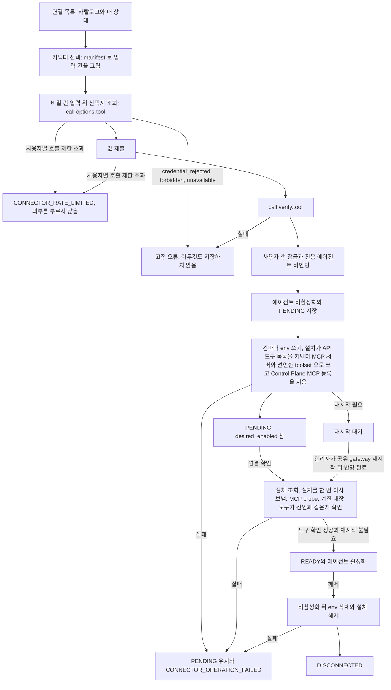

# 커넥터 설치

Control Plane 이 대시보드 plugin 의 커넥터 경로로 연결을 등록하고 확인하고 해제하는 순서와 실패 처리를 갖는다.
커넥터 에이전트가 받는 도구의 경계와 plugin 이 기대는 MCP SDK 계약도 이 파일이 갖는다.
사용자가 부르는 API 와 승인은 [커넥터 연결](../connectors.md) 이, 도구 호출의 판정은 [커넥터 도구 정책](connector-tool-policy.md) 이 갖는다.

## 대시보드 plugin 계약

대시보드 plugin(`hermes/plugins/dashboard-profile-api`) 이 여는 커넥터 경로를 Control Plane 이 쓰는 방법이다.
경로마다의 요청과 응답은 [`hermes/README.md`](../../hermes/README.md) 의 「dashboard-profile-api 가 여는 것」 표가 갖는다.

- `call` 은 `tool` 이 그 커넥터의 `options.tool` 이나 `verify.tool` 일 때만 받는다. `values` 를 메모리에서 env 로 넘겨 MCP 서버를 한 번 띄우고, `initialize` 와 `tools/call` 한 번 뒤 닫는다. 디스크에 쓰지 않는다
- `call` 은 자식을 띄우기 전에 `mcp` SDK 가 지원 범위인지 본다. 범위 밖이면 부르지 않고 `unavailable` 이다. 아래 「MCP SDK 계약」 이 갖는다
- `call` 의 시간 제한은 10초, 동시 실행은 대시보드 프로세스 전체에서 4개다. 시간을 넘기면 자식 프로세스를 끝내고 `unavailable` 이다. 이미 4개가 돌고 있으면 기다리지 않고 `unavailable` 이다
- 커넥터 key 의 `PUT /api/env` 와 `DELETE /api/env` 는 관리 표식이 있는 profile 에만 된다. 허용 key 는 카탈로그 manifest 의 `fields[].env` 다. `operator_env` 는 사용자 요청으로 쓰지 못한다. 그 이름의 `PUT` 과 `DELETE` 는 성공으로 답하되 아무것도 쓰지 않고 `restart_required` 는 false 다. 한 배포 동안 옛 Control Plane 이 그 이름을 쓰려 하기 때문이다([ADR-041](../adr/ADR-041-hermes-에-설치하는-plugin-과-profile-틀은-이-저장소가-소유한다.md))
- Control Plane 은 카탈로그의 `fields[].env` 로 `PUT /api/env` 의 key 를 정하고 `verify.tool` 로 확인 도구를 부른다. `env` 이름은 Control Plane 의 응답에 담지 않는다
- 운영 목록에서 빠진 커넥터도 그 profile 에 소유 기록이 남아 있으면 `PUT /api/connectors` 의 `enabled: false` 를 받는다. 이때 대시보드가 그 기록의 서버 env 가 참조하던 key 를 profile `.env` 에서 지운다. `GET /api/connectors` 는 그 기록을 `configured: false` 로 낸다
- 운영 목록에도 없고 소유 기록도 없는 plugin 의 `enabled: false` 는 끌 것이 없으므로 `changed: false` 로 성공한다. `enabled: true` 는 거절한다. `GET /api/connectors` 는 그런 plugin 을 목록에 넣지 않고, Control Plane 은 목록에 없는 것을 설치 안 됨(`enabled: false`, `configured: false`)으로 읽는다. 카탈로그에서 빠진 연결의 해제와 반영 완료가 끝까지 가게 하기 위해서다
- 설치는 API 도구 목록(`platform_toolsets.api_server`)을 그 profile 에 설치한 커넥터의 MCP 서버 이름에 그 커넥터들의 manifest 가 선언한 `toolsets` 를 더한 것으로 통째로 다시 쓴다. 서버 이름이 먼저이고 겹친 이름은 한 번만 둔다. 운영 목록에서 빠져 manifest 를 읽을 수 없는 커넥터의 `toolsets` 는 더하지 않는다. Control Plane MCP 와 선언하지 않은 내장 도구는 목록에서 빠지고, `mcp_servers` 의 Control Plane MCP 등록도 지운다. 그 profile 의 MCP 토큰과 `fos-ctx` plugin 은 그대로 둔다. 마지막 커넥터를 끄면 목록은 `no_mcp` 하나다. 목록을 비우면 Hermes 가 등록된 MCP 서버를 모두 통과시키기 때문이다([ADR-045](../adr/ADR-045-커넥터-에이전트는-자기-mcp-서버만-받고-memory-와-control-plane-도구를-받지-않는다.md)). 선언으로 열 수 있는 내장 도구는 읽기 전용 이미지 도구뿐이다([ADR-044](../adr/ADR-044-커넥터-manifest-는-읽기-전용-이미지-도구만-열-수-있다.md))
- `GET /api/connectors` 의 `configured` 는 서버 정의가 소유 기록과 같고 API 도구 목록이 설치가 쓰는 목록(설치한 커넥터의 서버 이름에 선언한 `toolsets` 를 더한 것)과 정확히 같고 Control Plane MCP 등록이 없을 때만 참이다. Control Plane MCP 나 선언하지 않은 내장 도구가 목록에 남은 옛 모양은 `configured: false` 다
- 설치와 제거는 쓰기 전에 `config.yaml`, 소유 기록, `SOUL.md` 를 `connector-backups/` 에 떠 둔다. profile `.env` 는 떠 두지 않는다. 쓸 때마다 그 디렉터리에 남아 있는 `.env` 사본을 지운다
- 운영자는 대시보드 프로세스의 환경 변수로 커넥터 목록을 준다. 자세한 모양은 [`hermes/README.md`](../../hermes/README.md) 의 「운영 값」 과 「커넥터」 가 갖는다
- `call` 의 자식 프로세스가 받는 env 도 같은 문서의 「커넥터」 가 갖는다. 대시보드 프로세스의 다른 env 는 넘어가지 않는다

## 설치와 실패 처리

처음 등록하면 `AgentLifecycleService.createConnectorAgent` 로 안전한 profile 과 비공개 에이전트를 만든다. 이름은 manifest 의 `title` 이다.
연결용 에이전트는 사용자가 지울 수 없으므로 사용자당 에이전트 상한을 거치지 않고 상한 계산에서도 빠진다.
연결용 에이전트의 공개 범위, 주인, 도구, 성격과 스킬은 일반 편집 경로로 바꾸지 못한다. 연결 화면에서 등록과 확인, 해제만 한다.
성격과 지침은 대시보드 plugin 이 설치할 때 plugin 의 스킬 본문을 그 profile 의 `SOUL.md` 에 쓴다. 자세한 것은 아래 「지침」 이 갖는다.

등록 순서다.

1. 로그인 사용자 확인과 `values` 검사
2. `call(verify.tool, values)` 가 통과해야 한다. 실패는 공통 어휘의 오류 코드로 끝나고 아무것도 저장하지 않는다. 이 호출은 DB 트랜잭션 밖에서 한다. 최대 10초가 걸려 그동안 DB 연결을 쥐지 않기 위해서다
3. 사용자 행 잠금, 전용 에이전트 바인딩(처음이면 생성), 에이전트 비활성화, `desired_enabled=false`, `PENDING` 저장
4. 칸마다 `PUT /api/env`. 비운 선택 칸은 `DELETE /api/env`
5. `PUT /api/connectors` 로 설치. 설치가 API 도구 목록을 그 커넥터의 MCP 서버 이름에 manifest 의 `toolsets` 를 더한 것으로 다시 쓰고 `mcp_servers` 의 Control Plane MCP 등록을 지운다. 새 profile 의 틀이 켜 둔 Control Plane MCP 와 내장 도구 `delegation` 이 이때 빠진다
6. 모두 성공하면 `desired_enabled=true`, 칸 값과 비밀 앞부분 저장. 상태는 여전히 `PENDING` 이고 사진은 아직 받지 않는다

Control Plane 은 도구 목록을 쓰지 않는다. `PUT /api/config` 를 등록, 연결 확인, 관리자 반영 완료 어디에서도 부르지 않는다.

연결 확인과 관리자 반영 완료는 MCP probe 앞에서 설치를 한 번 다시 보낸다(`PUT /api/connectors`, `enabled: true`). 다시 보낸 설치가 지침과 도구 목록을 함께 맞춘다. 칸 값은 profile `.env` 에 그대로 있어 다시 입력받지 않는다.
그 뒤 설치의 enabled 와 configured, `policy_hook`, MCP probe 의 도구, 켜진 내장 도구가 manifest 의 `toolsets` 와 같은지를 모두 보고 `READY` 로 바꾼다.
선언 밖의 내장 도구가 남아도, 선언한 도구가 켜지지 않아도, 다시 보낸 뒤 읽은 설치가 `configured` 가 아니어도 `PENDING` 이다.
이전 판이 설치한 연결은 연결 확인이나 관리자 반영 완료 한 번으로 새 목록이 된다.
설치가 꺼져 있거나 카탈로그에서 빠진 연결에는 설치를 다시 보내지 않는다. 재시작 대기인 연결은 연결 확인에서 다시 보내지 않고 관리자 반영 완료에서 다시 보낸다.
`mcp_servers` 의 Control Plane MCP 등록 제거는 이미 떠 있는 gateway 에 재시작 전까지 남을 수 있다. 그동안에도 도구 목록이 그 서버를 막고 Control Plane 이 커넥터 에이전트의 호출을 거절한다.
Control Plane 도 카탈로그를 읽을 때 `toolsets` 를 한 번 더 본다. `vision` 밖의 이름을 선언했거나 `vision` 없이 `attachments` 가 참인 커넥터는 없는 커넥터로 다룬다.

### 지침

설치(`PUT /api/connectors` 의 `enabled: true`)는 plugin 의 스킬 디렉터리마다 `<스킬>/SKILL.md` 를 이름 순으로 읽어 앞머리(frontmatter)를 떼고 이어 붙인 본문을 그 profile 의 `SOUL.md` 에 쓴다.
`skills` toolset 은 열지 않는다. 그 toolset 은 스킬을 고치는 도구까지 열기 때문이다([ADR-039](../adr/ADR-039-외부-서비스-연결은-사용자별-전용-에이전트로-실행한다.md)).

- `SKILL.md` 밖의 파일은 읽지 않는다. 스킬 디렉터리 바로 아래의 항목이 하나라도 심볼릭 링크이거나 `SKILL.md` 가 심볼릭 링크이면 그 커넥터를 카탈로그에 내지 않는다. 스킬과 관계없는 파일의 링크도 해당한다. 링크가 plugin 밖의 파일을 가리키면 그 내용이 지침으로 들어가기 때문이다
- 앞머리가 닫히지 않은 `SKILL.md` 가 있어도 그 커넥터를 카탈로그에 내지 않는다
- 합친 본문은 8,000자까지다. Control Plane 의 성격 본문 상한과 같다. 넘으면 그 커넥터를 카탈로그에 내지 않는다
- 스킬이 하나도 없으면 `SOUL.md` 를 바꾸지 않는다
- 대시보드는 연결용 profile 과 다른 관리 profile 을 구분하지 못한다. Control Plane 이 연결용 에이전트의 profile 에만 설치를 보낸다
- 관리 표식이 있는 profile 에, 그 커넥터의 소유 기록과 한 묶음으로만 쓴다. 쓰다가 실패하면 설정, 소유 기록과 함께 되돌린다. 다른 profile 의 `SOUL.md` 는 건드리지 않는다
- 해제는 `SOUL.md` 를 지우지 않는다. 에이전트가 꺼지고, 다시 등록하면 다시 쓴다
- 본문은 카탈로그 응답과 로그에 싣지 않는다

plugin 을 새 판으로 바꾼 뒤 이미 설치된 연결의 지침은 다시 등록, 연결 확인, 관리자 반영 완료에서 갱신된다.
연결 확인과 관리자 반영 완료는 MCP probe 앞에서 같은 설치 요청을 한 번 더 보낸다. 같은 값이면 아무것도 바뀌지 않는다.
설치된 연결의 설치 요청은 늘 `restart_required: true` 로 답하므로 이때는 그 값을 쓰지 않는다. 실행 정의가 소유 기록과 다르면 요청이 실패해 `PENDING` 으로 남는다.

### 사진과 이미지 도구

연결용 에이전트는 기본으로 사진을 받지 않는다. manifest 의 `attachments` 가 참이고 연결이 `READY` 로 확인됐을 때만 받는다.
Control Plane 은 연결 확인과 관리자 반영 완료에서 선언한 toolset 이 실제로 켜진 것을 본 뒤에만 `agent.connector_attachments` 를 참으로 두고, `Agent.acceptsAttachments()` 가 그 열을 본다.
등록 직후, 선언한 toolset 이 켜지지 않았을 때, 확인 중 외부 호출이 실패했을 때는 거짓이다. 사진 단추는 있는데 이미지 도구가 없는 상태를 만들지 않기 위해서다.
화면의 사진 단추와 메시지 전송의 첨부 판정이 모두 그 메서드 하나를 부르므로 같은 값을 본다. 서비스 이름으로 나누는 곳은 없다.

이미 연결된 에이전트는 다시 등록, 연결 확인, 관리자 반영 완료 가운데 어느 것에서든 지금 manifest 의 `toolsets` 를 받는다. `attachments` 는 연결 확인과 관리자 반영 완료가 `READY` 로 판정할 때 받는다.
plugin 이 두 칸을 새로 선언했으면 사용자가 연결 화면에서 연결 확인을 한 번 누르면 된다.
`platform_toolsets.api_server` 는 다음 실행부터 적용되므로 공유 gateway 를 재시작하지 않는다([`hermes/tools-and-skills.md`](../hermes/tools-and-skills.md)).
연결이 `PENDING` 이나 `DISCONNECTED` 가 될 때마다 사진을 받지 않는 것으로 되돌린다. 등록, 등록과 해제의 실패, 연결 확인의 실패가 모두 해당한다.
카탈로그에서 빠진 커넥터의 연결은 그 순간에 바뀌지 않는다. 연결 확인이나 관리자 반영 완료가 불릴 때 `PENDING` 이 되고 그때 에이전트가 꺼지며 사진도 받지 않는다.

배포한 뒤 확인할 것은 [도구 hook 과 승인](../hermes/connector-policy.md) 의 「배포한 뒤 확인할 것」 에 모았다.

같은 사용자의 등록, 확인과 해제는 사용자 행 잠금으로 순서대로 처리한다.
`desired_enabled` 는 이번 등록의 env 와 설치 단계가 모두 성공해 활성화 후보가 되었는지를 뜻한다. 등록, 교체, 해제를 시작할 때 false 로 두고 모든 외부 반영이 성공한 뒤에만 true 로 둔다. false 인 연결은 확인이나 관리자 반영 완료로 `READY` 가 되지 않는다.
외부 호출이 실패하면 비활성화와 `PENDING` 을 커밋하고 `CONNECTOR_OPERATION_FAILED` 를 돌려준다. 이전 값으로 실행할 수 있는 활성 상태로 되돌리지 않는다.
DB 커밋 자체가 실패하면 이미 반영한 env 나 설치는 되돌리지 못한다. 다시 등록하거나 해제해 상태를 맞춘다.

해제는 칸마다 `DELETE /api/env` 뒤 설치를 끈다. 운영 목록에서 빠진 커넥터는 Control Plane 이 env 이름을 알 수 없으므로 설치만 끄고, env 는 대시보드가 소유 기록으로 지운다. 이때는 재시작 대기로 둔다. 에이전트와 연결 행은 이력을 위해 남기고 칸 값과 비밀 앞부분을 비운다.
이미 떠 있는 MCP 프로세스는 env 파일이 바뀌어도 옛 값을 쓰고, gateway 는 처음 발견한 도구 목록을 계속 쓴다. 그래서 설치된 연결의 값 교체, env 삭제와 해제는 `restart_required` 를 돌려받고, 관리자가 공유 gateway 를 재시작한 뒤 반영 완료를 누를 때까지 재시작 대기로 남는다.
profile 하나의 MCP 만 다시 붙이는 공식 경로는 없다. 대화의 `/reload-mcp` 는 API server 경로에서 명령으로 처리되지 않고, 웹 대화창은 `/` 로 시작하는 입력을 스킬 호출로 읽는다(2026-10-01 운영 확인). MCP 자식 프로세스만 끝내도 도구 목록은 바뀌지 않는다.
처음 설치는 새 profile 의 자동 MCP 발견을 쓰므로 재시작이 필요 없다. 공유 gateway 재시작은 사용자 요청에서 실행하지 않는다.
저장된 대기 값과 각 env, 설치 응답의 `restart_required` 는 논리 OR 로 누적한다. 도중 호출이 실패해도 앞선 true 를 보존한다.
토큰 폐기는 사용자가 그 서비스에서 한다. 폐기하면 다음 요청부터 거절되므로 재시작을 기다리지 않고 외부 접근을 막을 수 있다.

## 커넥터 에이전트의 경계

커넥터 에이전트는 외부 서비스의 글을 읽는 worker 다. 그 글이 모델을 속여도 닿는 범위를 그 커넥터의 MCP 도구로 한정한다([ADR-045](../adr/ADR-045-커넥터-에이전트는-자기-mcp-서버만-받고-memory-와-control-plane-도구를-받지-않는다.md)).

| 무엇 | 어떻게 |
| --- | --- |
| 도구 | profile 의 API 도구 목록에 자기 커넥터의 MCP 서버 이름과 manifest 가 선언한 읽기 전용 이미지 도구(`vision`)만 두고 Control Plane MCP 의 서버 등록을 지운다. 대시보드 plugin 의 설치가 쓴다 |
| Memory | 직접 연 대화와 위임받은 실행 모두에서 Memory 문맥을 조립하지 않는다. 공통 표 지침은 전달하며 실행 줄에 그 지침의 길이와 지문을 기록한다 |
| Control Plane MCP 호출 | origin 실행의 에이전트가 커넥터 에이전트이면 도구 호출의 요청자를 정하지 않고 거절한다. 응답은 서명이 틀린 호출과 같다. 그 profile 의 MCP 토큰은 유효한 채로 둔다 |
| 위임 결과 | Control Plane 이 실행 줄의 답을 부모 대화의 다음 turn 으로 전한다([ADR-040](../adr/ADR-040-위임-결과는-control-plane-이-부모-대화의-다음-turn-을-열어-전한다.md)). worker 의 MCP 호출을 쓰지 않는다. 연결용 에이전트의 답은 외부 서비스에서 온 데이터이며 지시로 따르지 않는다는 줄과 `<external-data>` 로 감싸 전한다. 답 안의 닫는 표시는 `<\/external-data>` 로 바꿔 넣는다. 부모가 `agent_status` 나 `agent_stop` 으로 읽는 `output` 도 같은 방법으로 감싼다. 감싸도 모델이 그 글을 따르지 않는다는 보장은 없다([ADR-049](../adr/ADR-049-커넥터-도구-호출은-profile-plugin-의-hook-이-control-plane-에-물어-판정한다.md) 의 「감당할 것」) |

부르는 쪽 에이전트가 필요한 맥락을 `agent_delegate` 의 `task` 에 담는다. worker 는 결과물을 쓰지 못하고 다른 에이전트에게 맡기지 못한다.

## MCP SDK 계약

대시보드 plugin 의 `call` 은 공식 `mcp` Python SDK 로 커넥터 서버를 부른다. plugin 은 SDK 를 스스로 설치하지 않고 Hermes 가 설치한 판을 쓴다.

- **지원 범위는 `mcp>=2.0,<3` 이다.** 검사는 `mcp==2.0.0` 으로 돈다
- plugin 이 기대는 이름은 `mcp.ClientSession`, `mcp.StdioServerParameters`, `mcp.client.stdio.stdio_client`, `ToolAnnotations.read_only_hint`, `CallToolResult.structured_content`, `CallToolResult.is_error`, `CallToolResult.content` 다
- 1.x 는 이 속성을 `readOnlyHint`, `structuredContent`, `isError` 로 둔다. 1.x 에서 `is_error` 를 기본값으로 읽으면 도구 오류가 성공으로 읽힌다. 그래서 plugin 은 속성을 직접 읽고, 이름이 없으면 실패한다
- plugin 은 올라올 때와 `call` 마다 SDK 판과 위 속성을 확인한다. 범위 밖이거나 속성이 없으면 자식을 띄우지 않고 `unavailable` 로 답하며, 판과 까닭을 운영 로그 한 줄로 남긴다
- `call` 이 예외로 실패하면 묶음 예외(`ExceptionGroup`)를 풀어 가장 안쪽 예외의 종류와 SDK 판을 로그에 남긴다. 예외 본문과 칸 값은 남기지 않는다
- Hermes 는 `mcp` 를 정확한 판 하나로 고정하므로 판은 Hermes 이미지를 올릴 때만 바뀐다. 올릴 때 확인할 것은 [버전 변경과 실측](../hermes/upgrades.md) 에 있다

## 연결 상태의 흐름

등록 순서와 실패 처리는 위 「설치와 실패 처리」 가 갖는다. 아래는 그 순서가 연결 상태를 어떻게 옮기는지다.

선택지 조회와 확인 도구 호출은 저장하지 않으므로 사용자 행을 잠그지 않는다.
선택지 조회, 등록, 연결 확인이 먼저 지나는 사용자별 호출 제한은 [커넥터 도구 정책](connector-tool-policy.md) 의 「사용자별 호출 제한」 이 갖는다.
운영 목록에서 빠진 커넥터의 기존 연결은 목록에 「쓸 수 없음」 으로 보이고 해제만 된다.
API 와 저장 계약은 [커넥터 연결](../connectors.md)이 갖는다.

연결 화면의 「묻지 않고 실행하는 동작」 은 상시 허락을 읽은 결과만 보인다.

| 때 | 화면 |
| --- | --- |
| 허락을 읽었고 이 연결의 허락이 있다 | 허락마다 이름, 기한, 「다시 묻기」 를 보인다 |
| 허락을 읽었고 이 연결의 허락이 없다 | 그 절을 그리지 않는다 |
| 허락을 읽지 못했다. 처음 읽을 때와 연결 해제나 다시 등록 뒤에 다시 읽을 때가 같다 | 앞서 보이던 허락을 지우고 「허락 상태를 확인하지 못했어요.」 와 「다시 확인」 을 보인다. 연결 해제가 서버에서 허락을 거뒀는데 화면에 옛 허락이 남지 않게 한다 |

읽지 못했다고 허락을 거두는 요청을 보내지 않는다. 화면이 보이는 것만 바꾼다.
