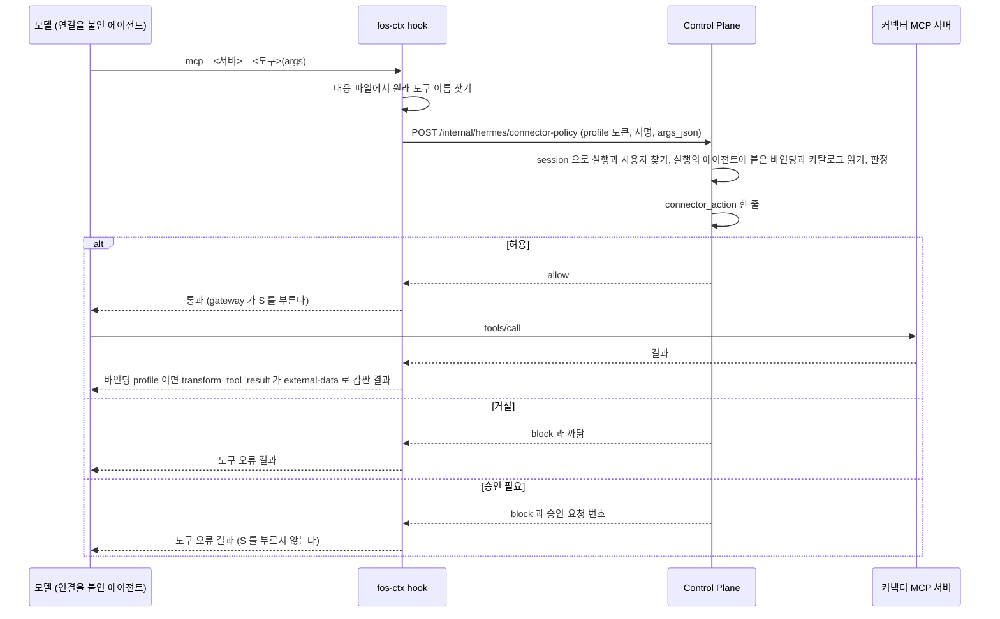
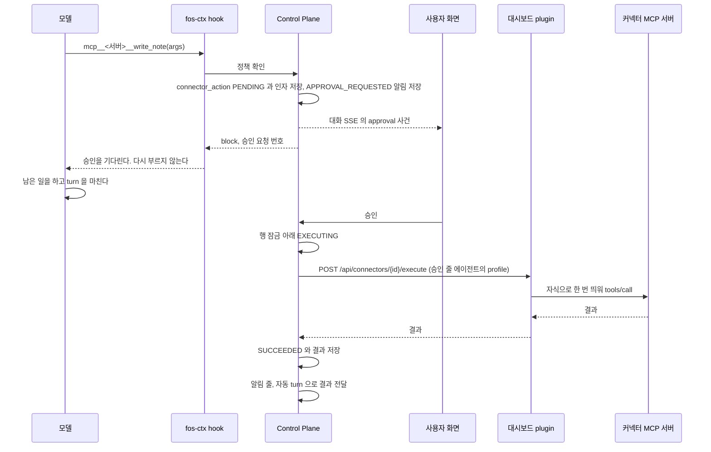

# 커넥터 도구 정책

커넥터의 도구마다 선언하는 위험도와 승인 방식, 도구 호출을 판정하는 경로와 그 순서를 갖는다.
판정이 승인 필요인 호출이 실행되기까지의 흐름과 사용자별 호출 제한도 이 파일이 갖는다.
승인 줄의 상태와 API 는 [커넥터 연결](../connectors.md) 의 「승인」 이, 설치는 [커넥터 설치](connector-install.md) 가 갖는다.

## 도구 정책

`schema: 2` 는 그 MCP 서버의 도구마다 위험도와 승인 방식을 선언한다([ADR-049](../../backend/docs/adr/ADR-049-커넥터-도구-호출은-profile-plugin-의-hook-이-control-plane-에-물어-판정한다.md)).

```json
{
  "schema": 2,
  "id": "demo-notes",
  "tools": {
    "list_scopes": { "risk": "READ" },
    "write_note":  { "risk": "WRITE", "title": "메모 쓰기" },
    "purge_notes": { "risk": "DESTRUCTIVE", "title": "메모 모두 지우기" }
  },
  "default_tool_policy": "deny"
}
```

| 칸 | 뜻 |
| --- | --- |
| `tools.<이름>` | 키는 MCP 서버의 원래 도구 이름이다. `^[A-Za-z0-9_.-]{1,128}$` |
| `tools.<이름>.risk` | `READ`, `SENSITIVE`, `WRITE`, `DESTRUCTIVE`, `FINANCIAL` 가운데 하나. 필수 |
| `tools.<이름>.approval` | `none`, `required`, `always`. 없으면 그 위험도의 기본값 |
| `tools.<이름>.title` | 승인 카드와 알림 줄에 보일 사람 말. 80자까지. 없으면 승인 카드와 알림 줄은 `이름 없는 동작` 으로 보인다 |
| `tools.<이름>.grant` | boolean. 거짓이면 그 도구에 상시 허락을 줄 수 없고 호출마다 승인을 받는다. 없으면 참이다. `approval` 이 `required` 인 도구에만 선언한다([ADR-065](../adr/ADR-065-외부로-나가는-도구는-상시-허락을-닫는-선언을-둔다.md)) |
| `tools.<이름>.outbound` | boolean. 참이면 그 도구가 데이터를 계정 밖의 사람에게 보낸다는 선언이다. 참인 도구는 `approval` 이 `required` 이고 `grant` 가 거짓이어야 한다. 아니면 그 커넥터를 카탈로그에 내지 않는다. 없으면 거짓이다 |
| `tools.<이름>.identifiers` | 인자 이름의 배열. 거기 적은 맨 위 인자의 값은 승인 카드가 길이와 모양으로 가리지 않는다. 없으면 빈 배열이다. `approval` 이 `required` 인 도구에만 선언한다([ADR-089](../adr/ADR-089-커넥터는-식별자-인자를-선언하고-승인-카드는-그-값을-길이로-가리지-않는다.md)) |
| `default_tool_policy` | `tools` 에 없는 도구의 처리. `deny` 만 받는다. 없으면 `deny` 다 |

| 위험도 | 뜻 | 기본 `approval` | 하한 |
| --- | --- | --- | --- |
| `READ` | 외부 상태를 바꾸지 않는 조회 | `none` | 없다 |
| `SENSITIVE` | 상태는 바꾸지 않지만 결과가 민감하거나 데이터를 제3자에게 보이게 한다 | `required` | `required` |
| `WRITE` | 되돌릴 수 있는 쓰기 | `required` | `required` |
| `DESTRUCTIVE` | 되돌리기 어려운 쓰기 | `always` | `always` |
| `FINANCIAL` | 돈이 움직인다 | `always` | `always` |

| `approval` | 뜻 |
| --- | --- |
| `none` | 승인 없이 바로 실행한다. 판정 줄은 남긴다 |
| `required` | 호출마다 승인을 받는다. 사용자가 상시 허락을 주면 그 기간에는 바로 실행한다 |
| `always` | 호출마다 승인을 받는다. 상시 허락을 만들 수 없다 |

엄격한 순서는 `none`, `required`, `always` 다.
승인을 받는 호출은 막고 승인 줄로 저장한다. 주인이 승인하면 저장한 인자로 한 번 실행한다. [커넥터 연결](../connectors.md) 의 「승인」 이 갖는다.

- `approval` 이 하한보다 느슨하면 그 커넥터를 카탈로그에 내지 않는다. `WRITE` 에 `none` 을 선언하지 못한다
- `grant` 가 boolean 이 아니거나, `approval` 이 `required` 가 아닌 도구에 `grant` 를 선언했으면 그 커넥터를 카탈로그에 내지 않는다
- 카탈로그 응답의 `grant` 는 기본값을 채운 값이다. `approval` 이 `required` 이고 선언이 닫지 않았을 때만 참이다. Control Plane 은 이 칸이 없으면 `approval` 이 `required` 인 도구를 참으로 읽고, boolean 이 아닌 값은 거짓으로 읽는다. 옛 대시보드 plugin 은 이 칸을 내지 않는다
- `"grant": false` 인 도구는 모델에게 보인다. 설치가 `tools.exclude` 에 넣는 것은 `approval: always` 인 도구뿐이다
- 데이터를 계정 밖의 사람에게 보내는 도구는 `"grant": false` 로 선언한다. 메일 보내기와 게시와 공유가 그 예다
- `identifiers` 가 문자열 배열이 아니거나, 이름이 `^[A-Za-z_][A-Za-z0-9_]{0,30}$` 가 아니거나, 같은 이름이 두 번 있거나, 비밀 키로 읽히는 이름(`token`, `secret`, `password`, `privatekey` 로 끝나는 이름 등)이 있거나, `approval` 이 `required` 가 아닌 도구에 선언했으면 그 커넥터를 카탈로그에 내지 않는다
- 카탈로그 응답의 `identifiers` 는 기본값을 채운 값이다. Control Plane 은 이 칸이 없거나 문자열 배열이 아니면 빈 목록으로 읽고, `approval` 이 `required` 가 아닌 도구의 값은 버린다. 어떤 값이 가림에서 빠지는지는 [커넥터 연결](../connectors.md) 의 「승인」 이 갖는다
- `verify.tool` 과 `options.tool` 은 `tools` 에 있고 `risk: READ`, `approval: none` 이어야 한다. 아니면 카탈로그에 내지 않는다
- `schema: 2` 인데 `tools` 가 없거나 비었으면 카탈로그에 내지 않는다
- MCP 서버 이름을 등록 규칙으로 바꾸고 소문자로 맞춘 값이 Control Plane MCP 의 것과 같으면 카탈로그에 내지 않는다. `fos_assistant` 와 `FOS-Assistant` 가 그 예다. 그 커넥터의 도구가 Control Plane 도구와 같은 이름으로 읽힐 수 있기 때문이다. hook 도 대응 파일의 서버를 Control Plane MCP 의 접두사보다 먼저 봐서, 그런 서버가 대응 파일에 들어와도 판정을 건너뛰지 않는다
- 등록 이름이 겹치는 도구가 둘 이상이면 카탈로그에 내지 않는다. 등록 이름은 아래 「이름 대응」 이 정한다
- 서버 이름으로 계산한 등록 이름의 앞부분(`mcp__<서버>__`)이 40자를 넘으면 카탈로그에 내지 않는다. 서버 이름은 33자까지다. 앞부분이 길면 등록 이름을 64자로 줄일 때 Control Plane 의 접두사 검사가 그 서버의 긴 도구를 선언 없는 도구로 읽는다
- `DESTRUCTIVE` 와 `FINANCIAL` 은 선언할 수 있지만 호출은 늘 거절한다. 그 도구는 모델에게 보이지 않는다
- `approval: always` 인 도구는 설치가 서버 정의의 `tools.exclude` 에 넣어 모델에게 보이지 않게 한다
- Control Plane 도 카탈로그를 읽을 때 하한을 한 번 더 본다. 하한보다 느슨한 커넥터는 없는 커넥터로 다룬다
- 위험도는 plugin 을 만든 사람의 판단이다. Control Plane 은 그 판단이 맞는지 확인하지 못한다. 운영자가 고른 plugin 만 목록에 오른다는 전제에 기댄다

`schema: 1` 은 `tools` 를 선언하지 않는다. `verify.tool` 과 `options.tool` 은 `READ` 와 `none` 으로, 그 밖의 도구는 모두 `WRITE` 와 `required` 로 읽는다.
조회 도구도 승인 대상이 되므로 `schema: 2` 로 올리는 것이 그 plugin 의 할 일이다.
**`schema: 1` 커넥터에서 확인 도구와 선택지 도구 밖의 도구는 모두 막히고 승인 줄이 된다.** 조회 도구도 마찬가지다.
승인하기 전에는 실행되지 않는다. 승인 없이 조회를 쓰려면 그 plugin 이 `schema: 2` 로 올려 조회 도구를 `READ` 로 선언해야 한다.

### 이름 대응

Hermes 는 MCP 도구를 `mcp__<서버>__<도구>` 로 등록하면서 글자를 바꾸고 긴 이름을 줄인다([`hermes/docs/hermes-contract.md`](../../hermes/docs/hermes-contract.md)).
등록 이름에서 원래 이름을 되찾을 수 없으므로, 설치(`PUT /api/connectors` 의 `enabled: true`)가 대응을 그 profile 의 `.fos-connector-tools.json` 에 적는다.

```json
{
  "v": 1,
  "servers": {
    "demo": {
      "connector": "demo-notes",
      "prefix": "mcp__demo__",
      "tools": { "mcp__demo__list_scopes": "list_scopes", "mcp__demo__write_note": "write_note" }
    }
  }
}
```

- `prefix` 는 서버 이름으로 계산한 등록 이름의 앞부분이다. hook 은 이 값으로 그 호출이 어느 커넥터 서버의 것인지만 안다. 원래 도구 이름은 `tools` 에서만 찾는다
- `tools` 는 manifest 가 선언한 도구다. `schema: 1` 은 `verify.tool` 과 `options.tool` 만 든다
- 설정, 소유 기록과 한 묶음으로 쓰고 실패하면 함께 되돌린다. 옛 설치를 해제하면 그 서버의 항목을 뺀다. 바인딩 떼기는 아래 표처럼 빈 `tools` 로 남긴다
- 이 파일이 있는 profile 에서 `fos-ctx` hook 이 커넥터 도구 호출을 묻는다

`isolated` 칸이 그 profile 의 설치 방식을 적는다([ADR-083](../adr/ADR-083-커넥터는-사용자가-한-번-연결하고-자기-에이전트에-여럿-붙여-그-에이전트가-도구를-직접-부른다.md)).
`v` 는 `1` 그대로다. 칸이 없으면 참으로 읽으므로 옛 파일은 바꾸지 않아도 된다. 칸이 있는데 boolean 이 아니면 hook 은 파일을 읽지 못한 것으로 본다.

| `isolated` | 쓰는 설치 | `servers` 에 싣는 것 |
| --- | --- | --- |
| 없음(`true` 와 같다) | 옛 설치. 커넥터마다 만든 전용 profile 이다 | 운영 목록에 있고 manifest 를 읽을 수 있는 커넥터의 서버 |
| `false` | 바인딩 설치. 일반 에이전트의 profile 에 커넥터를 붙인 것이다 | 소유 기록의 모든 서버. manifest 를 읽지 못한 서버는 `tools` 를 빈 객체로 싣는다. 뗀 서버 기록의 서버도 빈 `tools` 로 싣는다 |

두 방식은 대응에 없는 도구를 다르게 다룬다.

| 호출 | 옛 설치 profile | 바인딩 profile |
| --- | --- | --- |
| 대응의 서버와 맞는 도구 | 묻는다 | 묻는다 |
| 대응의 어느 서버와도 맞지 않는 `mcp__` 도구 | 막는다. 그 profile 에는 커넥터 서버만 있다 | 건드리지 않는다. Control Plane MCP 와 운영자가 넣은 다른 MCP 서버의 도구다 |
| `execute_code` | 막는다 | 건드리지 않는다. 그 안에서 부른 커넥터 도구는 session 이 없어 막힌다 |
| 커넥터 도구의 결과 | 바꾸지 않는다. Control Plane 이 위임 결과를 감싼다 | hook 이 `<external-data>` 로 감싼다. 그 에이전트의 위임 결과도 Control Plane 이 감싼다 |

**바인딩 profile 에서 대응에 실리지 않은 커넥터 서버는 판정 없이 나간다.**
그래서 바인딩 설치와 떼기는 manifest 를 읽지 못했거나 소유 기록의 서버 이름이나 실행 정의가 지금 manifest 와 다른 서버도 소유 기록의 이름으로 빈 `tools` 와 함께 싣는다. Control Plane 은 그 서버의 도구를 선언 없는 도구로 막는다.

**떼기는 뗀 서버를 대응에서 빼지 않는다.**
떼기 전에 시작한 실행은 그 서버를 쥔 채 돌고, 대응에서 서버가 빠지면 그 실행의 호출이 판정 없이 나가기 때문이다.
떼기는 서버 이름을 소유 기록 곁의 뗀 서버 기록 `.fos-connector-detached.json` 에 `{커넥터 id: 서버 이름}` 으로 남기고, 대응에 그 서버를 빈 `tools` 로 싣는다.
그 실행의 호출은 hook 이 묻고, Control Plane 은 그 에이전트에 그 서버를 붙인 연결이 없어 막는다.
같은 커넥터를 같은 서버 이름으로 다시 붙이면 그 기록에서 지운다. 그 사이 서버 이름이 바뀌었으면 옛 이름의 기록은 남긴다.
같은 서버 이름을 지금 붙은 커넥터가 쓰면 붙은 쪽의 도구를 싣는다.
기록에는 만료가 없다. gateway 를 재시작한 뒤에는 떼기 전에 시작한 실행이 남지 않으므로 운영자가 지워도 된다.
운영자가 뗀 서버와 같은 이름의 MCP 서버를 직접 등록하려면 먼저 그 기록에서 항목을 지운다. 남겨 두면 그 서버의 도구가 모두 판정에서 막힌다.
마지막 바인딩을 떼도 대응 파일은 뗀 서버를 싣고 남는다. 뗀 서버 기록만 남은 profile 도 바인딩 profile 이라 옛 설치를 받지 않는다.
실행 공간을 적용하지 않은 profile 에서는 터미널이나 파일 도구가 이 파일을 고칠 수 있다. 실행 공간을 적용한 profile 의 컨테이너에는 이 파일이 없다([ADR-086](../adr/ADR-086-셸과-파일-도구는-사용자별-docker-실행-공간에서만-돈다.md)). 이 위험은 ADR-083 의 「감당할 것」 에 있다.

### 도구 호출 판정

대응 파일이 있는 profile 의 `fos-ctx` hook 은 커넥터 MCP 도구 호출마다 Control Plane 에 묻는다.
hook 이 어느 호출을 묻고 어느 호출을 묻지 않고 막는지는 [`hermes/README.md`](../../hermes/plugins/fos-ctx/README.md) 의 「커넥터 도구 호출을 묻는다」 가 갖는다.

**`POST /internal/hermes/connector-policy`**

인증은 그 profile 의 MCP 토큰이다(`Authorization: Bearer`).

| 요청 칸 | 값 |
| --- | --- |
| `v` | `1` |
| `root_session_id`, `session_id`, `tool_call_id` | `_fos_ctx` 와 같은 뜻이다([`hermes/plugins/fos-ctx/README.md`](../../hermes/plugins/fos-ctx/README.md)) |
| `hermes_tool` | hook 이 받은 등록 이름 |
| `tool` | 대응 파일에서 찾은 원래 도구 이름. 없으면 `null` |
| `args_json` | 도구 인자를 hook 이 직렬화한 JSON 글. 키를 정렬하고 공백을 넣지 않는다 |
| `sig` | 아래 서명의 소문자 16진수 |

서명은 `_fos_ctx` 와 같은 key 의 HMAC-SHA256 이다.
서명할 글은 `v1-connector-policy`, `hermes_tool`, `root_session_id`, `session_id`, `tool_call_id`, `args_json` 의 UTF-8 바이트를 SHA-256 한 소문자 16진수를 이 순서로 줄바꿈 하나로 이은 것이다.
인자를 글로 보내고 그 글을 서명하므로 Python 과 Java 의 JSON 직렬화가 달라도 검증이 맞는다.

| 응답 칸 | 값 |
| --- | --- |
| `decision` | `allow` 나 `block` |
| `message` | `block` 일 때 모델에게 보일 글. 비지 않는다 |
| `action_id` | 승인 요청 번호. 승인 요청을 만들었을 때만 있다. 그 밖에는 `null` 이다 |

토큰이나 서명이 틀리면 403 이고 hook 은 막는다.
`args_json` 이 UTF-8 로 64KB 를 넘거나 JSON object 가 아닐 때, `root_session_id`, `session_id`, `tool_call_id`, `hermes_tool` 이 128자를 넘을 때도 서명이 틀린 요청처럼 403 이고 줄을 남기지 않는다.

Control Plane 의 판정 순서다.

1. 토큰으로 profile 을 알고 서명을 확인한다
2. session 으로 origin 실행과 사용자와 대화를 찾는다. `_fos_ctx` 와 같은 방법이다. 찾지 못하면 막고 줄을 남기지 않는다
3. 그 실행의 에이전트에 붙은 바인딩을 읽고, 바인딩마다 그 커넥터의 manifest 를 카탈로그에서 읽는다. 카탈로그는 60초 동안 메모리에 둔다. 읽기 실패는 5초 동안 기억하고, 그동안은 대시보드를 다시 부르지 않는다
4. 바인딩 가운데 `hermes_tool` 이 그 서버의 접두사(`mcp__<서버>__`)로 시작하는 것을 고른다([ADR-083](../adr/ADR-083-커넥터는-사용자가-한-번-연결하고-자기-에이전트에-여럿-붙여-그-에이전트가-도구를-직접-부른다.md)). 서버 이름은 manifest 를 읽었으면 그 `mcp_server` 이고, 읽지 못했으면 바인딩에 적어 둔 `mcp_server` 다. 맞는 바인딩이 없거나 둘 이상이면 막고 줄을 남기지 않는다. 대시보드가 한 profile 에서 서버 이름이 겹치지 않게 막으므로 맞는 것은 하나다
5. 그 연결의 주인이 실행의 사용자와 다르거나, 그 바인딩의 에이전트 profile 이 토큰의 profile 과 다르면 막고 줄을 남기지 않는다
6. 판정에 넘기는 연결 상태를 정한다. 연결과 그 바인딩이 모두 `READY` 일 때만 `READY` 이고 아니면 `PENDING` 이다. 값이 확인됐어도 공유 gateway 가 그 profile 의 MCP 서버를 아직 보지 못했으면 쓸 수 없기 때문이다
7. 아래 표로 판정하고 `connector_action` 에 한 줄을 남긴다. 줄의 `agent_id` 는 판정한 실행의 에이전트다. 승인하면 그 에이전트에 붙은 바인딩의 profile 에서 실행한다

manifest 를 읽지 못해 바인딩의 서버 이름으로 고른 호출은 아래 표의 첫 줄로 `POLICY_UNAVAILABLE` 이 된다.

| 조건(위에서부터) | 판정 | `deny_reason` |
| --- | --- | --- |
| 카탈로그를 읽지 못했다 | 거절 | `POLICY_UNAVAILABLE` |
| 카탈로그에 그 커넥터가 없다 | 거절 | `POLICY_UNAVAILABLE` |
| 연결이나 그 바인딩이 `READY` 가 아니다 | 거절 | `NOT_READY` |
| `hermes_tool` 이 그 커넥터의 `mcp_server` 로 만든 접두사(`mcp__<서버>__`)로 시작하지 않는다 | 거절 | `UNDECLARED` |
| `schema: 2` 인데 `tool` 이 없거나 `tools` 에 없다 | 거절 | `UNDECLARED` |
| 위험도가 `DESTRUCTIVE` 나 `FINANCIAL` 이다 | 거절 | `RISK_NOT_OPEN` |
| 먼저 살펴보기 트리 안의 호출이고, 위험도가 `READ` 이면서 승인 방식이 `none` 인 도구가 아니다 | 거절 | `READ_ONLY_RUN` |
| `args_json` 이 16KB 를 넘는다 | 거절 | `ARGS_TOO_LARGE` |
| 쓰기 도구를 허용한 먼저 살펴보기 트리 안의 호출이고, 위험도가 `READ` 이면서 승인 방식이 `none` 인 도구가 아니다 | 승인 필요(상시 허락을 보지 않는다). 사람이 승인하면 실행 직전 재판정은 살펴보기가 아닌 판정으로 한다 | |
| `approval` 이 `none` 이다 | 허용 | |
| `approval` 이 `required` 이고 선언이 상시 허락을 닫지 않았고 유효한 상시 허락이 있다 | 허용 | |
| 그 밖 | 승인 필요 | |

- `allow` 로 답하는 것은 판정이 허용일 때뿐이다. 거절과 승인 필요는 `block` 이다
- 승인 필요인 호출은 막고 `connector_action` 에 `decision: NEEDS_APPROVAL`, `passed: false`, `status: PENDING` 으로 남긴다. `args_json` 에 인자 원문을 저장한다. 모델에게는 승인 요청 번호를 담은 글을 주고, 사용자의 승인을 기다리고 있으니 같은 도구를 다시 부르지 말라고 말한다. 승인 줄이 그 뒤에 지나는 상태는 [커넥터 연결](../connectors.md) 의 「승인」 이 갖는다
- 상시 허락은 그 사용자가 그 커넥터의 그 도구에 준 것 가운데 거두지 않았고 기간이 남은 것이다. 선언이 `"grant": false` 인 도구는 남은 허락이 있어도 보지 않는다. 그 줄은 1분마다 도는 정리(`ConnectorActionExpirer`)가 거둔다. `approval` 이 `required` 가 아니게 바뀐 도구의 줄도 같다. 읽은 카탈로그에서 허락을 줄 수 없는 선언을 찾은 줄만 거두고, 카탈로그를 읽지 못한 커넥터와 선언에 없는 도구의 줄은 두고 본다. 거둔 줄은 선언이 다시 열려도 효력이 돌아오지 않는다. 원래 도구 이름을 확인하지 못한 호출은 허락이 없는 것으로 판정한다
- 먼저 살펴보기 트리인지는 origin 실행으로 `ProactiveCheckGuard.isCheckTree` 가 정한다. 그 트리에서는 위험도가 `READ` 이고 승인 방식이 `none` 인 도구만 허용한다. 상시 허락이 있어도 나머지를 거절하고 승인 줄을 만들지 않는다. `READ` 라도 manifest 가 승인을 요구하면 거절한다. 사람이 보지 않는 실행에서 승인 요청이 쌓이지 않게 하기 위해서다([ADR-080](../adr/ADR-080-먼저-살펴보기는-점검-대화의-turn-하나로-돌고-읽기-경계를-control-plane-이-강제한다.md))
- 판정은 Hermes 와 DB 를 모르는 함수 하나가 한다. 모델의 인자와 서버의 `readOnlyHint` 는 판정에 들어가지 않는다
- Control Plane 은 hook 이 보낸 `tool` 을 그대로 믿지 않는다. 카탈로그의 `mcp_server` 와 `tool` 로 등록 이름을 다시 계산해 `hermes_tool` 과 다르면 `tool` 이 없는 호출로 읽는다. `tool` 이 도구 이름 형식(`^[A-Za-z0-9_.-]{1,128}$`)이 아닌 요청은 서명이 틀린 요청처럼 403 으로 거절한다
- `NOT_READY` 가운데 연결은 `READY` 인데 바인딩이 아직 반영되지 않았고 반영 예정이 남은 호출은 모델에게 다른 글을 준다. 대개 몇 분 안에 저절로 반영되니 잠시 뒤 다시 시도하라는 글이다. 붙인 직후에는 공유 gateway 의 MCP 설정 맞추기와 Control Plane 의 반영 예정 확인을 기다려야 하기 때문이다([ADR-20261007 / connector-live-reload](../adr/ADR-20261007-connector-live-reload.md))
- 그 바인딩이 재시작 대기이면 저절로 풀리지 않으므로 관리자의 반영을 기다리라는 글을 준다. 재시작 대기는 관리자 반영 완료가 있어야 풀린다
- 재시작 대기도 아니고 반영 예정도 없는 바인딩은 연결 화면에서 연결을 확인하라는 일반 글을 준다. 반영 예정 확인이 한 번 실패했거나 정책 hook 이 꺼진 경우라 저절로 풀리지 않는다
- 허용한 호출이 다시 왔을 때 그 줄의 에이전트에 그 연결이 지금도 붙어 있고 연결과 바인딩이 모두 `READY` 가 아니면 처음의 허용을 돌려주지 않고 막는다. 해제하거나 뗀 연결에 앞의 허용이 나가지 않게 한다
- 같은 호출이 다시 오면 처음 판정을 그대로 돌려준다. 같은 호출인지는 profile, 루트 session, session, `tool_call_id` 로 만든 `dedupe_key` 로 안다
- `dedupe_key` 가 같아도 `hermes_tool` 이나 `args_json` 의 해시가 처음 줄과 다르면 처음 판정을 돌려주지 않고 막는다. 새 줄은 남기지 않는다. 한 session 에서 같은 `tool_call_id` 가 되풀이될 때 앞의 허용이 다른 도구나 다른 인자에 나가지 않게 한다
- `schema: 1` 에서 `tool` 이 없는 호출은 `WRITE` 와 `required` 로 판정해 승인 필요로 막고 `tool_name` 을 비운 채 `hermes_tool` 만 남긴다. 다른 서버의 등록 이름은 `schema: 1` 에서도 `UNDECLARED` 로 거절하고 `tool_name` 을 비운다

### hook 이 켜져 있는지

`GET /api/connectors?profile=<p>` 는 `policy_hook` 을 함께 낸다. 아래가 모두 맞을 때만 참이다.

- 그 profile 설정의 `plugins.enabled` 에 `fos-ctx` 가 있고 `plugins.disabled` 에 없다
- `plugins.entries.fos-ctx.allow_tool_override` 가 `false` 다
- 그 profile 의 `plugins/fos-ctx/` 파일이 대시보드 묶음의 것과 바이트까지 같다
- `.fos-connector-tools.json` 이 지금 소유 기록과 뗀 서버 기록, manifest 로 계산한 것과 같다

설치는 그 profile 의 `fos-ctx` 를 묶음의 판으로 바꾼다. 파일이 바뀌었으면 `plugin_updated: true` 로 답한다. 떠 있는 gateway 가 옛 코드를 쥐고 있을 수 있기 때문이다.
옛 설치에서는 선택 칸의 `PUT /api/env` 와 `DELETE /api/env` 도 설치를 다시 쓰고 `fos-ctx` 를 묶음의 판으로 맞춘다. 옛 설치된 커넥터의 env 응답은 늘 `restart_required` 가 참이라 이 경우도 재시작 대기가 된다.
Control Plane 은 `plugin_updated` 가 참인 바인딩을 재시작 대기로 둔다. 관리자가 공유 gateway 를 재시작하고 반영 완료를 누르면 풀린다. 옛 설치의 `restart_required` 는 늘 참이라 옛 커넥터 에이전트의 바인딩에는 이 신호로 쓰지 못한다. 바인딩 설치는 이미 있던 서버의 정의나 값이 바뀌었거나, 뗀 서버 기록에 남은 이름을 다시 붙이면 `restart_required` 가 참이다. 뗀 기록에 없는 새 이름, 스킬, 이름 대응만 바뀌면 `reload_pending` 이다([커넥터 설치](connector-install.md) 의 「바인딩 설치」).
서버 정의의 `tools.exclude` 가 manifest 로 계산한 것과 다르면 그 커넥터 항목만 `configured` 가 거짓이다. `policy_hook` 은 이 비교를 하지 않는다([ADR-20261009 / connector-install-drift](../adr/ADR-20261009-connector-install-drift.md)).
커넥터 하나의 manifest 가 바뀌어도 같은 profile 에 붙은 다른 커넥터는 판정을 통과한다. 소유 기록과 지금 manifest 의 같음 판정은 `tools` 를 보지 않는다. 옛 기록을 가진 연결이 끊기지 않고, 다시 보낸 설치가 덮어쓴다.
어긋난 서버의 `approval: always` 도구는 공유 gateway 를 재시작하기 전까지 모델에 등록된 채일 수 있다. 그 호출도 hook 이 묻고, 그 바인딩은 `READY` 가 아니어서 Control Plane 이 막는다.
`policy_hook` 이 거짓이면 대시보드가 어느 조건에서 거짓인지 조건 이름만 경고 로그에 남긴다. profile 이름, 경로, 파일 내용은 남기지 않는다.
연결 확인과 관리자 반영 완료는 설치를 다시 보낸 뒤에 `policy_hook` 을 읽는다. 옛 판의 `fos-ctx` 를 가진 바인딩은 연결 확인 한 번으로 새 판이 되고 재시작 대기가 된다.
Control Plane 은 `policy_hook` 이 참이 아니면 그 바인딩을 `READY` 로 두지 않는다. 옛 대시보드 plugin 은 이 칸을 내지 않고, 없는 칸은 거짓으로 읽는다.
이 확인은 확인한 시점의 파일만 본다. 그 뒤 누가 설정을 바꾸면 다음 연결 확인 때 안다.

### 선언하지 않은 도구

연결 확인과 관리자 반영 완료는 MCP probe 가 낸 도구 이름에서 `schema: 2` manifest 의 `tools` 에 없는 것을 센다.
그 수를 `connector_connection.undeclared_tools` 에 적고 연결 상태와 관리자 목록에 `undeclaredTools` 로 낸다.
선언하지 않은 도구가 있어도 바인딩은 `READY` 가 된다. 그 도구의 호출만 거절된다. `schema: 1` 은 세지 않는다.

## 사용자별 호출 제한

선택지 조회(`options`), 등록(`POST /api/v1/connections/{id}`), 연결 확인(`check`)은 MCP 서버를 자식 프로세스로 띄운다.
연결이 없는 사용자도 임의 값으로 부를 수 있어 사용자마다 제한한다.

| 제한 | 기본값 | 설정 |
| --- | --- | --- |
| 한 사용자의 동시 호출 | 1 | `assistant.connector.max-concurrent-calls` |
| 한 사용자의 60초 동안 호출 | 10 | `assistant.connector.calls-per-minute` |

- 넘으면 기다리지 않고 `CONNECTOR_RATE_LIMITED`(429) 로 거절한다. 거절한 요청은 외부를 부르지 않고 횟수에 넣지 않는다
- 횟수는 받아들인 호출의 시작 시각으로 센다. 60초가 지난 시각은 버린다
- 해제, 읽기, 카탈로그, 관리자 경로는 제한하지 않는다. 해제는 언제나 되어야 한다
- 상태는 JVM 메모리에 둔다. **Control Plane 이 한 대라는 전제다.** 여러 대로 늘리면 사용자마다 대수만큼 더 받는다. 재시작하면 횟수가 비워진다
- 일반 에이전트 실행의 한도와 별개다. 대시보드 plugin 의 전역 동시 4개도 그대로다

## 커넥터 도구를 부를 때

연결을 붙인 에이전트의 모델이 커넥터 MCP 도구를 부르면 그 profile 의 `fos-ctx` hook 이 Control Plane 에 묻는다. 남아 있는 옛 커넥터 에이전트도 같다.
근거는 [ADR-049](../../backend/docs/adr/ADR-049-커넥터-도구-호출은-profile-plugin-의-hook-이-control-plane-에-물어-판정한다.md) 이고, 요청과 응답과 판정 순서는 위 「도구 호출 판정」 이 갖는다.



### 도구 호출이 갈리는 지점

거절 사유마다의 조건은 위 「도구 호출 판정」 의 표가 갖는다. 아래는 그 표에 없는 경우다.

| 상황 | 처리 |
| --- | --- |
| Control Plane 이 3초 안에 답하지 않는다 | hook 이 막는다. 요청이 뒤늦게 닿아도 `dedupe_key` 로 줄이 하나다 |
| 실행을 찾지 못한다(중지한 실행, 등록 안 된 자식 session) | 막고 줄을 남기지 않는다 |
| 동시에 같은 `dedupe_key` 로 둘이 온다 | 유니크 제약에 걸린 쪽이 먼저 저장된 줄을 다시 읽어 돌려준다 |
| profile 의 `fos-ctx` 가 꺼졌거나 옛 판이다 | 호출은 판정 없이 나간다. 연결 확인이 `policy_hook` 을 보고 그 바인딩을 `PENDING` 으로 둔다 |

## 승인이 필요한 호출

판정이 「승인 필요」 인 호출의 흐름이다. 근거는 [ADR-050](../../backend/docs/adr/ADR-050-커넥터-쓰기는-control-plane-이-승인-줄을-저장하고-승인한-인자로-한-번만-실행한다.md) 이다.
승인과 거절은 그 요청이 나온 대화의 승인 카드에서 한다.
새 승인 줄이 생기면 `APPROVAL_REQUESTED` 알림이 함께 생겨, 사용자가 다른 화면에 있어도 그 대화로 올 수 있다([`notification.md`](notification.md)).



### 승인이 갈리는 지점

| 상황 | 처리 |
| --- | --- |
| 같은 승인을 두 번 누른다 | 둘째는 `CONNECTOR_ACTION_NOT_PENDING` 이다. 실행은 한 번이다 |
| 실행 요청이 시간 안에 답하지 않는다 | `UNKNOWN`. 다시 실행하지 않고 「실행했는지 알 수 없어요」 를 보인다 |
| 실행을 보낸 뒤 서버가 다시 뜬다 | 기동 정리가 `EXECUTING` 을 `UNKNOWN` 으로 바꾸고 대화에 전한다 |
| 사용자가 거절한다 | `REJECTED`. 알림 줄만 남긴다 |
| 24시간 안에 답이 없다 | `EXPIRED`. 대화의 알림 줄을 남기고 `APPROVAL_EXPIRED` 알림을 만든다([`notification.md`](notification.md)) |
| 승인할 때 연결이나 그 줄의 에이전트에 붙은 바인딩이 `READY` 가 아니거나, 그 에이전트에서 연결을 뗐다 | 실행하지 않고 `REJECTED` 로 둔다. 승인 요청은 오류가 아니라 그 끝난 줄을 받는다 |
| 승인한 호출이 실행되는 동안 그 연결을 해제하거나 값을 다시 등록하거나 그 에이전트에서 뗀다 | `CONNECTOR_ACTION_EXECUTING` 으로 거절한다. 실행이 끝난 뒤 다시 한다 |
| 승인을 기다리는 동안 그 에이전트에서 연결을 뗀다 | 그 에이전트가 판정한 `PENDING` 을 `REJECTED`(`connection_changed`)로 끝낸다. 같은 연결을 붙인 다른 에이전트의 줄과 상시 허락은 그대로다 |
| 그 대화의 turn 이 도는 중에 결과가 온다 | 결과를 쌓아 두고 turn 이 끝난 뒤 전한다. 위임 결과와 같다 |
| 사용자가 turn 을 중지한다 | `PENDING` 은 남는다. 카드에서 따로 거절한다 |
| 위임 자식이 승인 요청을 만들었다 | 자식 실행의 대화는 부모 대화다. 승인 카드가 부모 대화에 뜬다 |
| 같은 실행이 같은 도구를 같은 인자로 다시 부른다 | 새 줄을 만들지 않고 앞선 `PENDING` 의 번호를 돌려준다 |
| 대화가 없는 실행이 만든 요청 | 승인 카드가 뜰 곳이 없다. 만료된다 |
| 승인 줄이 하나도 없다 | 카드 자리를 그리지 않는다 |
| 끝난 요청의 알림 줄을 저장하는 순간 사용자가 그 대화에 보낸다 | 알림 줄을 저장하는 트랜잭션 하나 동안 그 대화의 turn 잠금을 잡는다. 그 사이의 보내기는 `CONVERSATION_BUSY` 를 받고, 글만 보낸 것이면 화면이 대기 메시지로 다시 넣어 잠금이 풀리는 자리에서 간다. 실행은 열리지 않으므로 도는 turn 표시에 실행 번호가 없다 |

### 화면

| 때 | 화면 |
| --- | --- |
| `approval` 사건을 받거나 대화를 연다 | 승인 줄을 다시 읽어 `PENDING` 인 줄마다 입력창 위에 카드를 보인다. 카드는 제목, 위험도, 인자의 키와 값, 「승인」, 「거절」 을 갖는다. 상시 허락을 줄 수 있는 도구(`grantAllowed`)에는 「승인하고 묻지 않기」 가 더 있다 |
| 승인이나 거절을 누른다 | 응답으로 받은 줄이 끝난 상태면 카드가 사라진다. 결과와 실행하지 않은 까닭은 대화의 알림 줄과 이어지는 답으로 보인다 |
| 승인한 줄이 `EXECUTING` 이다 | 단추 없이 「실행하는 중이에요」 를 보인다 |
| `PENDING` 인 줄의 `hiddenArgs` 가 참이다 | 「승인」 과 「승인하고 묻지 않기」 를 그리지 않고 「가려진 내용이 있어 승인할 수 없어요. 에이전트에게 그 부분을 빼거나 다시 쓰게 해 주세요.」 를 보인다. 「거절」 은 남긴다 |
| 줄이 `UNKNOWN` 이다 | 단추 없이 「실행했는지 알 수 없어요」 를 보인다. 「닫기」 는 그 화면에서만 카드를 숨기고 줄의 상태를 바꾸지 않는다 |
| 이미 처리된 줄을 누른다 | 「이미 처리된 요청이에요.」 를 보이고 승인 줄을 다시 읽는다 |

연결 화면의 도구 목록은 도구마다 호출할 때 일어나는 일을 한 줄로 보인다. 승인이 없으면 「바로 실행해요」, 승인을 받고 상시 허락을 줄 수 있으면 「실행 전에 물어봐요」, 상시 허락을 닫았으면 「실행할 때마다 물어봐요」, 막힌 도구는 「아직 쓸 수 없어요」 다.

상시 허락을 줄 수 없는 줄(`grantAllowed` 가 거짓)의 카드는 인자를 높이 제한 없이 모두 펼쳐 보인다. 스크롤 영역 아래로 밀린 인자를 읽지 않고 승인하지 않게 한다. 상시 허락을 줄 수 있는 줄은 인자 영역을 정해 둔 높이로 두고 스크롤한다.
화면은 인자를 스스로 가리지 않는다. 가림은 Control Plane 이 응답에서 한 번만 한다. 두 곳의 규칙이 다르면 화면만 가린 값이 승인될 수 있다.

카드는 메시지 사이가 아니라 입력창 위에 모아 둔다. 승인 줄에는 메시지 번호가 없어, 이력을 다시 읽을 때 메시지 사이의 자리를 정할 근거가 없다.
끝난 줄은 카드로 보이지 않는다. 결과는 알림 줄과 이어지는 답으로 이미 대화에 있다.
