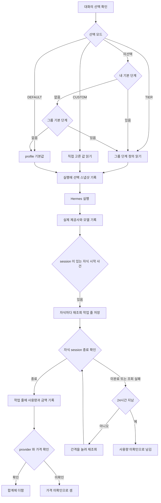

# 대화와 실행 사건

`chat` 패키지가 갖는 대화와 메시지의 경로, 대화의 모델 선택, 화면으로 보내는 사건을 갖는다.
Hermes 사건을 `execution_event` 로 옮겨 적는 규칙과 실행 트리를 잇는 방법, 도구 내용을 가리는 규칙도 이 파일이 갖는다.

## 대화

`chat` 패키지가 대화와 메시지를 갖는다.
한 번의 대화가 지나는 길은 [`backend/packages.md`](packages.md) 의 「한 번의 대화가 지나는 길」 절이 갖는다.
화면 흐름은 [`frontend/shell.md`](../frontend/shell.md), [`frontend/chat.md`](../frontend/chat.md), [`frontend/activity.md`](../frontend/activity.md) 가 나눠 갖는다.

### 경로

| 경로 | 하는 일 |
| --- | --- |
| `GET /api/v1/chat/conversations?cursor=&limit=` | 내 대화 목록의 한 쪽. `{ "items": [...], "nextCursor": "..." }`. 지운 대화는 빠진다. 정렬은 `updatedAt desc, id desc`, `limit` 기본 30 상한 100. `nextCursor` 는 뜻을 알 수 없는 문자열이고 다음 쪽의 `cursor` 로 그대로 넘긴다. 마지막 쪽이면 null 이다. 읽을 수 없는 `cursor` 는 `VALIDATION_FAILED` 다 |
| `GET /api/v1/chat/conversations/{id}` | 대화 한 줄. 첫 쪽에 없는 오래된 대화를 열 때 모델 칸과 에이전트 칸이 쓴다 |
| `PATCH /api/v1/chat/conversations/{id}` | 이름을 바꾼다. 본문 `{ "title": "..." }`. 바뀐 대화 한 줄을 돌려준다 |
| `PUT /api/v1/chat/conversations/{id}/model` | 대화의 모델과 effort 를 바꾼다. 본문 `{ "provider", "model", "reasoningEffort" }`. 셋 다 null 이면 기본값으로 되돌린다. effort 는 `ModelChoice` 가 받는 값(`none`, `low` 부터 `max`)이어야 하고, `none` 은 그 모델의 `disable` 이 `SUPPORTED` 일 때만 받는다. 모델을 비웠으면 에이전트 기본 모델로 판정한다. 아니면 `VALIDATION_FAILED` 다. `none` 일 때만 대화의 에이전트와 그 목록을 읽으므로 목록을 읽지 못하면 `HERMES_UNAVAILABLE`, 에이전트를 쓸 수 없으면 그 오류가 난다. 다른 effort 의 저장은 에이전트 상태와 무관하다. 판정은 저장할 때만 한다. 저장한 뒤 에이전트 기본 모델이나 Hermes 의 지원 값이 바뀌어도 실행은 저장된 `none` 을 그대로 보내고, 실행 때 목록을 읽지 않는다. 바뀐 대화 한 줄을 돌려준다 |
| `GET /api/v1/chat/model-options?agentCode=` | 그 에이전트의 profile 로 고를 수 있는 모델. 요청자가 쓸 수 있는 에이전트만 받는다 |
| `DELETE /api/v1/chat/conversations/{id}` | 목록에서 숨긴다. 204 |
| `GET /api/v1/chat/conversations/{id}/messages` | 메시지 목록. 이전 판도 모두 온다 |
| `POST /api/v1/chat/messages` | 한 번에 받는다 |
| `POST /api/v1/chat/messages/stream` | 사건으로 받는다 |
| `POST /api/v1/chat/conversations/{id}/regenerate/stream` | 마지막 답을 다시 만든다. 본문이 없다 |
| `POST /api/v1/chat/conversations/{id}/deliveries/{deliveryId}/retry/stream` | 실패하거나 중지한 결과 전달 묶음을 저장된 결과만으로 다시 전달한다. 본문이 없다. 판정은 [`agent-delegation.md`](agent-delegation.md) 의 「다시 전달이 갈리는 지점」 이 갖는다 |
| `POST /api/v1/chat/executions/{id}/stop` | 돌고 있는 실행을 멈춘다. 202 와 `{ "status": "stopping" }` |
| `GET /api/v1/chat/conversations/{id}/events` | 대화 단위 SSE. 끝나지 않는다. 요청한 연결이 없는 turn(위임 결과로 열린 자동 turn, 대기 메시지로 연 turn)의 사건과 `system`, `user`, `pending` 사건을 싣는다. 연결 직후 `: connected` 주석 줄을 보내 사건이 없어도 응답 헤더가 바로 나가고, 20초마다 `: ping` 을 보낸다 |
| `GET /api/v1/chat/conversations/{id}/pending` | 대기 줄. `{ "held", "items": [{ "id", "text", "createdAt" }] }`. 없으면 `held` 가 false 이고 `items` 가 빈 목록이다 |
| `POST /api/v1/chat/conversations/{id}/pending` | 대기 메시지를 더한다. 본문 `{ "text": "..." }`. 201 과 대기 줄을 돌려준다. 도는 turn 이 없으면 곧바로 보낸다 |
| `DELETE /api/v1/chat/conversations/{id}/pending/{pendingId}` | 대기 메시지 하나를 취소한다. 204. 이미 보내졌거나 없으면 `PENDING_MESSAGE_NOT_FOUND` |
| `POST /api/v1/chat/conversations/{id}/pending/send` | 멈춰 둔 대기 줄을 풀어 보낸다. 본문이 없다. 202 와 대기 줄을 돌려준다 |
| `GET /api/v1/chat/conversations/{id}/running` | 이 대화에 지금 도는 turn. `{ "running", "executionId", "startedAt" }`. 돌지 않으면 `running` 이 false 이고 나머지는 null |
| `GET /api/v1/chat/conversations/by-number/{number}` | 옛 주소 `/c/{번호}` 를 넘겨 주려고 번호로 대화를 찾는다. `{ "id": "<공개 식별자>" }` |

지운 대화와 남의 대화는 모든 경로에서 `CONVERSATION_NOT_FOUND` 다. 둘을 가리지 않는다.

### 대화의 모델 선택

대화 한 줄(`ConversationView`)은 `provider`, `model`, `reasoningEffort` 를 싣는다. 고르지 않았으면 셋 다 null 이다.
`purpose`(`CHAT`, `CHECK`)도 싣는다. 화면이 점검 대화를 알아보는 데 쓴다([`proactive-check.md`](proactive-check.md)).

`GET /api/v1/chat/model-options` 의 응답이다.

| 칸 | 뜻 |
| --- | --- |
| `defaultProvider`, `defaultModel` | 고르지 않았을 때 도는 값. 에이전트 기본 모델이 있으면 그 값이고 없으면 그 profile 의 값이다. Hermes 가 주지 않으면 null |
| `defaultReasoningEffort` | 에이전트 기본 effort. 정하지 않았으면 null |
| `defaultFromAgent` | 기본 모델을 에이전트 기본값이 정했으면 참 |
| `defaultAvailable` | 기본 모델이 `providers[]` 에 있으면 참. 그룹이 숨겼거나 목록에서 빠졌으면 거짓이고, 화면이 다른 모델을 고르라고 알린다 |
| `providers[]` | `{ "provider", "name", "models": [...], "reasoning": {...} }`. Hermes 가 `authenticated` 를 참으로 준 provider 만 남기고, 그룹이 숨긴 provider 와 모델을 뺀다. 기본 provider 가 맨 앞에 오고, 모델은 Hermes 가 준 차례 그대로다 |
| `providers[].reasoning` | 모델 이름을 열쇠로 한 표. 값은 `{ "support", "disable" }` 이고 각각 `SUPPORTED`, `UNSUPPORTED`, `UNKNOWN` 이다. 모든 모델이 표에 있다 |
| `reasoning.<모델>.support` | Hermes 의 `capabilities.<모델>.reasoning` 이 참이면 `SUPPORTED`, 거짓이면 `UNSUPPORTED`, 칸이 없으면 `UNKNOWN` 이다. 우리가 없는 값을 채우지 않는다. 화면은 `UNSUPPORTED` 인 모델에서 effort 를 고르지 못하게 하고, `UNKNOWN` 인 모델은 고르게 두되 지원 미확인으로 알린다 |
| `reasoning.<모델>.disable` | reasoning 끄기(`none`)를 받는가. Hermes 의 `can_disable_reasoning` 이 참이면 `SUPPORTED`, 거짓이면 `UNSUPPORTED`, 칸이 없으면 `UNKNOWN` 이다. `SUPPORTED` 이고 `support` 가 `UNSUPPORTED` 가 아닌 모델에서만 `none` 을 고를 수 있다 |
| `providers[].reasoningCapable` | 옛 web 호환용이다. 모델 이름을 열쇠로 한 참거짓 표이고, `support` 가 `UNSUPPORTED` 가 아니면 참이다. backend 와 web 이 같은 순간에 배포된다고 확인하지 못해 이번 배포에서 남기고 다음 배포에서 지운다. 새 화면은 `reasoning` 을 읽는다 |
| `reasoningEfforts` | `["low", "medium", "high", "xhigh", "max"]`. 고정이다. `none` 은 여기 없고 모델마다 `disable` 이 정한다. `minimal` 은 지원을 확인할 신호가 없어 어디에도 없다 |

`hermes/HermesModelClient` 가 `GET {profile}/api/model/options` 를 부르고, `chat/application/ModelOptionsService` 가 profile 마다 10분 들고 있는다.
10분이 지나 다시 읽다 Hermes 가 답하지 못하면 들고 있던 옛 목록을 돌려준다. 그 profile 의 목록을 한 번도 읽지 못했으면 `HERMES_UNAVAILABLE` 이다.

web 은 입력창 아래의 `chat/model-picker.tsx` 로 고른다.
목록은 창을 열 때만 서버 라우트 `GET /api/chat/model-options` 로 읽는다. 그래서 창을 열기 전 단추는 대화에 적힌 값만 보인다.
고른 값은 `PUT /api/chat/conversations/{id}/model` 로 저장하고, 그 응답의 대화 한 줄로 대화 목록의 그 줄만 바꾼다(`conversations-provider` 의 `replace`).
**저장보다 먼저 나간 목록 다시 읽기의 응답은 버린다.** 새 대화에서 고르면 빈 대화를 만들며 목록을 다시 읽는 요청과 저장이 함께 나가, 늦게 온 목록이 저장한 값을 덮을 수 있기 때문이다.
`replace` 는 한 줄만 바꾸므로, 버린 응답이 있으면 목록을 한 번 더 읽어 다른 줄의 제목과 순서를 맞춘다.
기존 대화는 목록에 그 줄이 오기 전까지 단추를 막는다(`Composer` 의 `modelChoiceUnknown`). 적힌 모델을 모르는 채 저장하면 그 모델을 지우기 때문이다.
목록을 저장하지 않는 까닭은
[ADR-030](../adr/ADR-030-모델과-effort-는-대화가-고르고-기본값은-hermes-profile-이-갖는다.md) 에 있다.
기본 모델과 숨김을 DB 에 두는 까닭은
[ADR-054](../adr/ADR-054-에이전트-기본-모델과-모델-숨김은-control-plane-db-가-갖는다.md) 에 있다.

실행을 보낼 때 `chat/application/ModelTierService` 가 대화의 선택, 단계, 에이전트 기본 모델 차례로 세 값을 정하고 `model/domain/ModelChoice` 에 담는다.
모델이 비어 있으면 `/v1/runs` 에 `provider`, `model` 을 빼고,
effort 가 비어 있으면 `model_options` 를 뺀다. 비어 있음(미지정)과 `none`(reasoning 끔)은 다른 의도라, `none` 은 `model_options.reasoning.effort` 에 그대로 싣는다. 정한 모델이 숨긴 모델이면 제출하지 않고 `MODEL_HIDDEN` 으로 실패시킨다.
모델이 비어 있고 그룹에 숨김이 있으면 `ModelOptionsService.profileDefaultOf` 가 들고 있는 목록에서 읽은 profile 의 기본 모델로 같은 판정을 한다.
Memory 제안은 원래 실행이 해석한 값을 받아 쓰고 `ExecutionRecorder.startInheriting` 으로 원래 실행의 단계와 effort 출처를 이어받는다.
추천 질문은 대화가 없어 `ModelTierService.detachedChoice` 가 준 에이전트 기본 모델을 싣고 `ExecutionRecorder.startDetached` 가 그 값을 실행 줄에 적는다. 같은 값을 `ModelTierService.requireRunnable` 이 숨김과 견준다.
보내기, 다시 생성, 흐름의 하위 실행이 모두 같은 해석을 쓴다.

**대화 경로의 `{id}` 는 대화의 공개 식별자(UUID)다.** 대화 표의 번호가 아니다.
응답에서 대화를 가리키는 칸도 모두 공개 식별자다. 대화 목록의 `id`, 보내기 응답과 사건의 `conversationId`,
실행 목록의 `conversationId` 가 여기 해당한다. 보내기 요청의 `conversationId` 도 공개 식별자를 받는다.
메시지, 첨부, 실행의 번호는 그대로 숫자다.

컨트롤러가 `ConversationAccess.requireOwnId(user, publicId)` 로 주인을 확인하며 번호로 바꾸고,
`application` 안쪽은 지금처럼 번호를 쓴다. 사건과 응답에 싣는 공개 식별자는 `Conversation.publicId()` 에서 읽는다.
UUID 모양이 아닌 `{id}` 는 400 `VALIDATION_FAILED` 다. [`packages.md`](packages.md) 의 형식 오류 규칙이 모든 경로에 걸린다.

`by-number` 경로는 옛 링크가 쓰이지 않게 되면 지운다.
근거는 [ADR-025](../adr/ADR-025-대화는-주소에-공개-식별자를-쓰고-번호는-안에만-둔다.md)에 있다.

**turn 이 끝날 때 대화를 통째로 다시 저장하지 않는다.**
요청 시작에 읽은 `Conversation` 을 끝에서 통째로 저장하면, 그 사이에 사용자가 이름을 바꾸거나 지웠을 때
옛 값으로 덮여 지운 대화가 되살아난다.
turn 이 바꾸는 칸은 `hermes_session_id` 와 `updated_at` 뿐이므로 그 둘만 고치는 질의로 쓴다.
새 대화의 첫 turn 은 시작할 때 `hermes_session_id` 와 `hermes_root_session_id` 를 비어 있을 때만 채우는 질의로 쓴다. 이 질의는 `updated_at` 을 바꾸지 않는다. 바꾸면 실패한 turn 도 대화를 목록 맨 위로 올린다.
남의 실행과 없는 실행은 `EXECUTION_NOT_FOUND` 다.

### 메시지 한 줄

`GET .../messages` 가 주는 한 줄의 칸 가운데 뜻을 따로 적어 둘 것이다.

| 칸 | 뜻 |
| --- | --- |
| `status` | 답을 만든 실행의 상태. `SUCCEEDED`, `FAILED`, `CANCELLED`, `RUNNING` 중 하나. 사용자 메시지는 null |
| `replacesMessageId` | 이 메시지가 새 판으로 대신하는 이전 메시지. 없으면 null |
| `activity` | 작업 과정의 요약. `{ toolCount, subagentCount, durationMs }`. 사건이 없는 답과 사용자 메시지는 null |
| `artifacts` | 그 답의 turn 이 만든 결과물 파일. [`artifact.md`](artifact.md) 의 「메시지 한 줄의 `artifacts`」 절이 모양을 갖는다 |
| `delivery` | `SYSTEM` 줄이 결과 전달 묶음의 마지막 시도가 저장한 마지막 알림 줄일 때만 `{ id, status }` 이고, 아니면 null 이다. 오류 코드는 싣지 않는다. 화면은 [`../frontend/chat.md`](../frontend/chat.md) 의 「결과 다시 전달」 이 갖는다 |

`activity` 는 답을 만든 실행과 그 아래 자식 실행의 `execution_event` 를 모두 센다.
예전에 provider 가 막혀 다음 모델로 넘어간 turn 은 막힌 시도가 따로 실행 줄을 갖는다. 요약은 답을 만든 실행만 세고 막힌 시도의 사건은 넣지 않는다. 지금은 Control Plane 이 provider 를 넘기지 않아 새 turn 에는 이런 줄이 생기지 않는다.

| 칸 | 세는 것 |
| --- | --- |
| `toolCount` | `TOOL_STARTED` 수와 `TOOL_COMPLETED` 수 가운데 큰 값. 한쪽이 빠져 와도 줄지 않게 한다 |
| `subagentCount` | `SUBAGENT_STARTED` 사건 수와 자식 실행 수를 더한 값. Memory 제안 실행은 세지 않는다 |
| `durationMs` | 루트가 시작한 때부터 트리에서 가장 늦게 끝난 실행이 끝난 때까지. 흐름은 Chief 가 끝난 뒤에도 돈다 |

흐름으로 돈 답은 하위 에이전트 사건 없이 자식 실행만 남는다. 자식 실행을 더하지 않으면 요약이 0 이 되고 블록이 사라진다.
한 하위 에이전트가 사건과 자식 실행 둘 다 남기면 두 번 센다.
그 겹침은 [`frontend/activity.md`](../frontend/activity.md) 의 「실행 하나를 다시 볼 때」 절에서 트리가 이미 받아들인 것과 같다.
대화 하나를 열 때 질의가 답 수만큼 늘지 않도록, 실행 번호 목록으로 한 번에 센다.

### 화면으로 보내는 사건

스트리밍 경로가 보내는 `ChatEvent` 의 `type` 이다.
화면은 이 값만 안다. Hermes 의 원래 사건 이름을 읽지 않는다.

| `type` | 언제 | 싣는 칸 |
| --- | --- | --- |
| `started` | 실행 줄을 만든 직후 | `conversationId`, `executionId` |
| `delta` | 답 조각 | `text` |
| `tool` | 도구가 시작되거나 끝났다 | `toolName`, `detail`, `phase`, `durationMs`, `failed`. `detail` 은 아래 「도구 `detail` 을 싣는 대상」 을 따른다 |
| `subagent` | 하위 에이전트가 시작되거나 끝났다 | `subagentId`, `goal`, `model`, `phase`, `inputTokens`, `outputTokens`, `durationMs`, `failed` |
| `step` | 흐름의 단계가 시작되거나 끝났다 | `stepName`, `stepState` |
| `reset` | 지금까지 흘린 조각을 지우라. provider 를 넘기던 때만 보냈고 지금은 보내지 않는다. 화면은 아직 받는 쪽을 갖고 있다 | |
| `done` | 끝나서 저장했다 | `conversationId`, `messageId`, `executionId` |
| `stopped` | 중지로 끝나서 저장했다 | `conversationId`, `messageId`, `executionId`. 남긴 답이 없으면 `messageId` 가 null |
| `error` | 실패했다 | `code`, `message` |
| `system` | 알림 줄을 저장했다. 대화 단위 SSE 로 간다. 결과 다시 전달의 요청 SSE 에서는 다시 전달 알림 줄을 `started` 앞에 한 번 보낸다 | `conversationId`, `messageId`, `text` |
| `user` | 대기 메시지를 합쳐 사용자 메시지로 저장했다. 대화 단위 SSE 로만 간다 | `conversationId`, `messageId`, `text` |
| `pending` | 대기 줄이 바뀌었다. 화면이 대기 줄을 다시 읽는다. 대화 단위 SSE 로만 간다 | `conversationId` |
| `approval` | 그 대화의 승인 줄이 생겼거나 상태가 바뀌었다. 화면이 승인 줄을 다시 읽는다. 줄의 내용은 싣지 않는다. 대화 단위 SSE 로만 간다 | `conversationId`, `detail`(승인 요청 번호) |

`phase` 는 `started` 와 `completed` 둘이다.
`subagent` 의 칸은 Hermes 가 실어 보낼 때만 찬다. `goal` 이 비어 오면 Hermes 의 `preview` 를 그 자리에 싣는다.

**`started` 는 흐름으로 도는 turn 에서도 루트 실행의 번호를 싣는다.**
중지는 루트 번호로 보내고 Control Plane 이 그 아래를 찾아 멈춘다.
화면은 마지막으로 받은 `started` 의 번호를 쓴다.

#### 도구 `detail` 을 싣는 대상

**도구의 명령 원문은 `ADMIN` 역할에게만 보낸다.** 근거는 [ADR-038](../adr/ADR-038-도구의-명령-원문은-관리자에게만-보내고-사용자에게는-사람-말로-보인다.md) 에 있다.
저장은 그대로 하고 응답을 만들 때 뺀다.

| 받는 사람 | 도구 | `detail` |
| --- | --- | --- |
| `ADMIN` 역할 | 모든 도구 | 저장된 값 |
| `MEMBER` 역할 | `web_search`, `vision_analyze` | 저장된 값 |
| `MEMBER` 역할 | 그 밖의 도구 | `null` |

두 경로가 같은 판정을 쓴다. `usage/application` 의 `ToolDetailPolicy` 가 판정을 갖는다.

| 경로 | 판정하는 자리 |
| --- | --- |
| 대화 스트림의 `tool` 사건 | `ChatController` 가 `ChatService` 에 넘기는 사건 소비자 |
| `GET /api/v1/usage/executions/{id}/tree` 의 `TOOL_STARTED`, `TOOL_COMPLETED` 사건 | `ExecutionTreeService` 가 `ExecutionEventView` 를 만들 때 |

도구 사건이 아닌 사건의 `detail` 가운데 하위 에이전트의 목표와 실패 코드는 모두에게 싣는다. 목표는 아래 「도구 내용 가리기」 의 규칙으로 가린 값이다.
넘어간 모델 이름은 아래 절의 규칙을 따른다.

#### 실행 기록의 페이징

`GET /api/v1/usage/executions?limit=`는 기존 배열 응답과 번호 역순을 유지한다. 오래된 기록까지 읽는 화면은 `GET /api/v1/usage/executions/page?limit=&cursor=`를 쓴다.

새 응답은 `{ "items": [...], "nextCursor": "..." }`다. 첫 쪽은 `cursor`를 생략한다. 다음 쪽은 `nextCursor`를 그대로 넘기며, 마지막 쪽이면 `null`이다. `limit` 기본값은 50이고 1~200으로 제한한다. 읽을 수 없는 커서는 `VALIDATION_FAILED`다.

로그인한 사용자의 루트 실행만 `startedAt desc, id desc`로 읽는다. 같은 시작 시각의 실행도 번호로 구분해 빠짐없이 읽는다. 커서에 사용자 식별자가 없으며, 다른 사용자의 커서를 받아도 요청자의 실행만 조회한다. 실행 한 줄의 내부 값은 아래 역할별 규칙을 그대로 따른다. 자식 여부와 스킬 이름, 대화 공개 식별자는 해당 쪽의 실행에만 일괄로 붙인다.

다음 쪽 유무는 한 줄을 더 읽어서 판단한다. 전체 건수는 매 조회마다 전체 루트를 세는 비용을 피하려고 응답에 넣지 않는다. 여러 사용자를 모아 보는 별도 실행 목록 API는 없다.

#### 역할에 따라 응답에서 빼는 값

**화면이 `MEMBER` 역할 사용자에게 그리지 않는 내부 값은 Control Plane 도 보내지 않는다.**
화면에서만 가리면 브라우저의 개발자 도구로 자기 실행의 금액과 모델과 토큰이 보인다.
근거는 [ADR-063](../adr/ADR-063-관리자-전용-표시와-동작은-관리자-영역에만-두고-일반-경로의-응답은-서버가-역할에-따라-줄인다.md) 에 있다.

`ADMIN` 역할에게는 아래 응답이 그대로 간다. `MEMBER` 역할에게는 「빼는 값」 이 `null` 로 간다.

| 응답 | 빼는 값 |
| --- | --- |
| `GET /api/v1/usage/executions` 의 실행 한 줄 | `agentCode`, `provider`, `model`, `reasoningEffort`, `costMode`, `runtimeFingerprint`, `instructionsHash`, `costCurrency`, `pricingVersion`, `inputTokens`, `cachedInputTokens`, `outputTokens`, `totalTokens`, `contextChars`, `contextOmittedItems`, `estimatedCostMicros`, `actualCostMicros` |
| `GET /api/v1/usage/monthly-cost` | `currency`, `estimatedCostMicros`, `actualCostMicros`, `pricedExecutions`, `unpricedExecutions`, `subscriptionExecutions`, `pricedSubagents`, `pendingSubagents`, `unconfirmedSubagents`, `unpricedSubagents`. 실행 건수 `totalExecutions` 는 모두에게 싣는다 |
| `GET /api/v1/usage/breakdown` | 응답 전체. `MEMBER` 역할이 부르면 `FORBIDDEN` 이다 |
| `GET /api/v1/usage/skills` 의 한 줄 | `agentCode` |
| `GET /api/v1/usage/executions/{id}/tree` 의 실행 노드 | `agentCode`, `provider`, `model`, `reasoningEffort`, `reasoningEffortSource`, `inputTokens`, `cachedInputTokens`, `outputTokens`, `totalTokens`, `estimatedCostMicros`, `requestReceivedAt`, `submittedAt`, `firstDeltaAt`, `finishedAt`, `contextSources` |
| 같은 응답의 사건 | `model`, `inputTokens`, `outputTokens`. `PROVIDER_SWITCHED` 사건은 사건째 뺀다 |
| `GET /api/v1/chat/conversations/{id}/messages` 의 메시지 | `switchedTo` |
| 대화 스트림과 대화 단위 SSE 의 `subagent` 사건 | `model`, `inputTokens`, `outputTokens` |
| 같은 흐름의 `switched` 사건 | 사건째 보내지 않는다 |
| `GET /api/v1/chat/model-tiers` 의 단계 한 줄 | `provider`, `model`, `reasoningEffort` |

**빼지 않는 값과 그 까닭.**

| 값 | 까닭 |
| --- | --- |
| 실행 한 줄의 `errorCode`, `RUN_FAILED` 사건의 `detail`, SSE `error` 사건의 `code` | 화면이 코드를 사람 말 문구로 바꾸는 데 쓴다. 빼면 모든 실패가 같은 문구가 되고, 화면의 분기가 깨진다. 코드 원문은 화면이 `MEMBER` 역할에게 그리지 않는다 |
| `latencyMs`, `modelTier`, `skillNames` | `MEMBER` 역할에게 보이는 값이다 |
| `subagentName` | 목표가 비었을 때 도우미 줄의 이름으로 쓴다 |
| `GET /api/v1/chat/model-options` 와 대화 응답의 `provider`, `model`, `reasoningEffort` | `MEMBER` 역할도 쓰는 고급 모델 선택의 입력이다. 숨김 목록을 적용한 것만 간다 |
| 에이전트 목록의 `code`, 대화의 `agentCode` | 주소와 요청 본문에 쓰는 열쇠다 |

판정은 한 자리에 둔다. 응답 DTO 를 만드는 쪽이 요청자의 역할을 받아 `ADMIN` 이 아니면 위 값을 비운다.
도구 `detail` 의 판정(`ToolDetailPolicy`)과 같은 자리에서 함께 적용한다.
판정은 도구 이름 전체로 한다. `mcp__{서버}__web_search` 처럼 다른 MCP 서버가 같은 이름을 붙인 도구는 공개하지 않는다.

## 실행 사건

### 답에서 확인할 수 있는 원문 열람

메시지 이력의 비서 답은 `sourceReads`를 받는다. Control Plane이 답에 연결된 실행과 그 아래의 같은 사용자 자손 실행에 저장된 사건으로 만든다.
조상 실행, 형제 실행과 다른 사용자의 실행은 포함하지 않는다.
답 본문에 있는 링크나 모델의 설명은 근거로 쓰지 않는다. 기존 답도 같은 사건으로 계산하며 새로운 저장 모델은 만들지 않는다.

| 칸 | 뜻 |
| --- | --- |
| `completedCount` | 이름이 정확히 `web_extract`이고 `TOOL_COMPLETED`, `failed=false`인 사건 수. 페이지 수가 아니라 도구 호출 수다 |
| `urls` | 위 완료 사건의 완결된 결과 JSON에서 내용이 있고 오류가 없는 항목의 HTTP(S) 주소. 같은 주소는 한 번만 싣는다 |
| `requestedUrls` | 결과를 확인할 수 없는 성공 완료 호출에서, 같은 실행의 시작 사건과 명확히 짝지어진 첫 요청 주소. 페이지별 성공을 뜻하지 않는다 |
| `unresolvedCount` | 성공 완료 사건 가운데 결과 형식이나 가림, 절단 때문에 결과 주소를 확인하지 못한 사건 수. 요청 주소를 남긴 호출도 포함한다 |
| `observationComplete` | 답에 연결된 실행과 그 아래의 같은 사용자 자손 실행이 모두 `OBSERVED`인지. 아니면 기록에 없는 열람을 판정할 수 없다 |

검색, 시작 사건, 실패하거나 성공 여부가 없는 완료 사건, 이름이 비슷한 MCP 도구는 열람으로 세지 않는다.
결과에서 확인한 URL과 호출 성공만 확인한 요청 URL을 구분한다. 여러 URL을 받은 호출에서 항목별 오류도 제외한다.
Hermes v0.21.5의 결과는 `results` 배열이며 항목의 `url`, `content`, `error`로 판정한다. 완료 사건의 실패 값만으로 각 페이지의 성공을 판정하지 않는다.
근거는 [upstream 결과 정리](https://github.com/NousResearch/hermes-agent/blob/v2026.9.24/tools/web_tools_truncate.py#L153-L193)와 [완료 사건](https://github.com/NousResearch/hermes-agent/blob/v2026.9.24/gateway/platforms/api_server_runs.py#L91-L108)이다.
URL의 인증 정보, query와 fragment는 공개하지 않는다. 가려지거나 잘린 주소, 내부 주소는 싣지 않는다.
DNS 조회 없이 host가 있는 HTTP(S) URL만 받는다. 한 단어 host, localhost와 `.localhost`/`.local`/`.internal`, IP 리터럴은 제외한다. 주소를 정리한 뒤 path를 보존해 중복 제거한다.
도구 내용 가리기와 요청자의 대화 소유자 확인을 거친 뒤 만든 요약은 사용자 역할과 관계없이 같은 값이다.
사용자 메시지와 알림 줄은 `sourceReads`가 null이다.
실행 번호가 없거나 해당 실행을 찾지 못한 비서 답은 빈 주소와 0건, `observationComplete=false`를 받는다.

긴 원문 결과는 500자 preview에서 잘리고, JSON을 읽지 못하면 가리기 과정에서 통째로 `[가림]`이 될 수 있다.
그때는 관측 상태가 `OBSERVED`인 실행의 시작과 성공 완료 사건이 하나씩 명확히 짝일 때만 `requestedUrls`를 만든다.
같은 실행에서 같은 도구의 시작이 겹쳤거나 시작이 없으면 짝을 추측하지 않는다. 실패·성공 미상 완료에는 요청 주소도 싣지 않는다.
시작 preview는 전체 `urls` 배열이 아니라 첫 URL 하나다. 가림이나 말줄임표가 있거나 안전한 URL이 아니면 제외한다.
완결된 결과가 페이지별 성공이나 실패를 보여 주면 결과를 우선하고 요청 주소로 바꾸지 않는다. 같은 주소가 `urls`에도 있으면 `requestedUrls`에서 뺀다.
배열 안의 구조가 손상됐거나 필요한 URL이 없고 가려져 결과를 하나도 판정할 수 없을 때도 요청 주소를 쓸 수 있다.
판정 가능한 결과와 미확인 항목이 섞이면 결과를 우선하며 미확인 항목은 `unresolvedCount`로 안내한다.
SSE에는 호출을 짝지을 ID가 없다. 근거는 [시작 preview](https://github.com/NousResearch/hermes-agent/blob/v2026.9.24/agent/display.py#L429-L435)와 [Runs SSE](https://github.com/NousResearch/hermes-agent/blob/v2026.9.24/gateway/platforms/api_server_runs.py#L83-L118)이다.

Hermes 가 스트림으로 보내는 사건을 우리 이름으로 옮겨 `execution_event` 에 적는다.
화면은 우리 이름만 읽고 Hermes 의 원래 이름을 알지 않는다.

- 옮겨 적는 자리가 한 곳이다. Hermes 가 이름을 바꾸면 그 한 곳만 고친다.
- 받은 payload 를 통째로 넣지 않고 필요한 칸만 고른다.
  도구가 읽어 온 문서 전체가 사건에 실려 오는 것을 그대로 저장하지 않기 위해서다.
- 모르는 사건은 버리고 버렸다는 사실만 로그로 남긴다.

화면에 흘리는 것과 사건을 저장하는 것이 같은 스트림을 두 가지로 쓴다.
저장하는 답은 스트림이 아니라 실행 결과에서 가져온다.

**한 번에 받는 경로(`POST /api/v1/chat/messages`)도 같은 스트림을 열어 도구와 하위 에이전트 사건을 저장한다**([ADR-090](../adr/ADR-090-한-번에-받는-경로도-hermes-사건-스트림을-열어-도구-사건을-남긴다.md)).
흘릴 곳이 없으므로 저장만 하고, 답 조각 시각(`first_delta_at`)은 적지 않아 첫 반응 시간 통계에 들지 않는다.
스트림을 읽지 못하면 경고만 남기고 답과 실행의 시작과 끝은 그대로 남는다.
붙은 커넥터 서버의 도구도 두 경로에서 같다. 도구 이름, 걸린 시간, 실패 여부가 남고 내용은 가려진다.
한 번에 받는 경로는 스트림을 기다리는 시간에도 `hermes.run-timeout` 상한을 둔다. 넘으면 스트림을 닫고 결과 조회로 넘어간다.
흐름(`Flow`)의 단계 실행은 이 스트림을 열지 않아 도구 사건이 남지 않는다.

근거는 [`adr/ADR-013-실행-사건은-우리-모델로-정규화해-저장한다.md`](../adr/ADR-013-실행-사건은-우리-모델로-정규화해-저장한다.md) 에 있다.

### 실행의 시작과 끝은 Hermes 사건을 기다리지 않는다

`RUN_STARTED` 와 `RUN_COMPLETED` 와 `RUN_FAILED` 는 Control Plane 이 직접 적는다.
Hermes 도 `run.completed` 를 보내지만 그것을 옮겨 적지 않는다.

- 사건 스트림을 읽지 못한 실행에도 실행의 시작과 끝이 남아야 한다.
  옮겨 적는 쪽에만 두면 그 경로가 비고, 양쪽에 두면 스트리밍 경로만 두 줄이 된다.
- 우리가 적는 쪽이 `errorCode` 를 알고 있어 담을 것이 더 많다.

옮겨 적는 것은 도구와 하위 에이전트 사건뿐이다.

**사건 저장이 실패해도 중계와 대화는 그대로 이어진다.**
사건은 관측용이고 그것 때문에 답이 끊기면 안 된다.
옮기지 못한 사건과 저장에 실패한 사건은 순서를 소비하지 않아, 번호가 1부터 빈틈없이 이어진다.

### 트리는 메모리에서 잇는다

실행 하나를 그 사건과 자식 실행까지 묶어 낼 때 데이터베이스에서 재귀로 만들지 않는다.
`root_execution_id` 로 한 번에 읽어 메모리에서 잇는다.
한 실행의 자식 수가 많아질 일이 없고, 재귀 질의는 읽기 어렵다.

어느 실행 번호를 주든 그 실행이 속한 트리의 루트부터 낸다.
화면이 자식 실행에서 들어와도 전체를 보게 하기 위해서다.

**순환이 생길 수 있는 자리가 둘이고 대응이 다르다.**
잘못 적힌 `parent_execution_id` 하나로 응답이 끝나지 않을 수 있다.

| 어디 | 무엇을 하나 | 어디에 알리나 |
| --- | --- | --- |
| 루트를 찾아 올라가는 길 | 여덟 번에서 멈추고 마지막으로 닿은 실행을 루트로 삼는다 | 트리의 `truncated` |
| 자식을 붙여 내려가는 길 | 이미 붙인 실행을 다시 붙이지 않고 여덟째 깊이에서 멈춘다 | 그 노드의 `truncated` |

**`truncated` 가 두 곳에 있고 뜻이 다르다.**
트리의 것은 「이 트리 어딘가를 잘랐다」 이고 노드의 것은 「이 노드 아래를 잘랐다」 이다.
화면이 줄을 그리는 근거는 노드의 값이다. 트리의 값은 잘린 자리를 가리키지 않는다.

루트에서 닿지 않는 실행은 트리에 넣지 않고 로그로 남긴다. 데이터가 어긋난 것이다.
상한에서 일부러 자른 가지는 그 로그에서 뺀다. 원인이 달라서다.

남의 실행은 없는 것과 같은 오류로 응답한다.
루트를 찾아 올라간 뒤에도 주인을 다시 확인한다.

## 모델 단계와 자식 기록

`chat`이 그룹 단계 정의, 사용자와 그룹 기본값, 대화의 선택, 그룹의 모델 숨김을 소유한다.
에이전트 기본 모델의 값은 `agent` 표에 있고, 그 검증과 해석은 `chat` 이 한다.
실행을 시작할 때 선택을 해석하고 `usage`에 선택 스냅샷을 넘긴다.
`usage`는 부모 종료 뒤 자식 session의 최종 사용량을 별도 작업으로 조회해 원장 줄에 적고 합계에 더한다.
`hermes`는 session 조회와 최소한의 profile 기본값 조회를 소유한다.
선택과 재조회 조건, 실패 처리 계약은 [모델 단계와 실행 기록](../model-tiers.md)이 정한다.

## 도구 내용 가리기

`tool.` 사건의 `preview`, `detail`, `result` 중 처음 있는 값을 설명으로 읽는다.
문자열과 JSON 객체, 배열을 모두 받는다.
`HermesRunEventStream`은 이 값을 가린 뒤 `RunEvent.detail`에 넣는다.
SSE와 실행 기록은 같은 가린 값을 쓰며, 대화의 작업 과정도 이 실행 기록을 조회한다.
관리자도 가리기 전 원문을 받지 않는다.
근거는 [ADR-047](../adr/ADR-047-도구-내용은-비밀값과-UUID를-가린-뒤-중계하고-저장한다.md)에 있다.

| 대상 | 처리 |
| --- | --- |
| JSON 비밀 키 | 중첩 객체와 배열에서도 값 전체를 `[가림]`으로 바꾼다. 키의 대소문자, `_`, `-` 차이는 무시한다 |
| 비밀 키 이름 | `token`, `secret`, `password`, `passwd`, `api_key`, `apikey`, `authorization`, `cookie`, `credential`, `credentials`, `private_key`, `access_key`, `client_secret`과 `token`, `secret`, `password`, `privatekey`로 끝나는 키 |
| 일반 문장의 비밀 할당 | `key=value`와 `key: value`에서 위 비밀 키의 값을 가린다. 따옴표 안의 공백도 값에 포함한다 |
| 인증 헤더 | 일반 문장의 `Authorization`과 `Cookie`는 인증 방식과 세미콜론으로 나뉜 값도 포함해 줄 끝까지 가린다 |
| 토큰 모양 | `Bearer` 인증값, `alg`를 가진 JSON 헤더와 base64url 세 구간으로 된 JWT, `sk-`, `ghp_`, `gho_`, `ghu_`, `ghs_`, `ghr_`, `github_pat_`, `xox`로 시작해 `-`로 끝나는 계열 접두의 값을 가린다 |
| 긴 인코딩 모양 | 32자 이상의 hex와 base64/base64url 덩어리를 가린다 |
| UUID | 표준 8-4-4-4-12 형태를 `[항목 N]`으로 바꾼다. 같은 실행 스트림 안에서 같은 UUID의 대소문자를 통일해 시작과 완료 사건에 같은 번호를 쓴다. 번호표는 스트림이 끝나면 버린다 |
| 커넥터 도구 | 옛 커넥터 에이전트(`connectorManaged`가 참)의 실행은 모든 도구의 내용 전체를 `[연결 도구 내용 가림]`으로 바꾼다. 다른 에이전트의 실행은 그 에이전트에 붙은 커넥터 서버의 도구(등록 이름이 `mcp__<서버>__` 로 시작하는 것)만 그렇게 바꾼다([ADR-083](../adr/ADR-083-커넥터는-사용자가-한-번-연결하고-자기-에이전트에-여럿-붙여-그-에이전트가-도구를-직접-부른다.md)). 외부 서비스의 글과 짧은 manifest 비밀값을 노출하지 않는다 |
| 커넥터 호출 뒤 일반 도구 | 실행 트리에서 커넥터 도구를 한 번이라도 호출한 뒤에는 `[도구 내용 가림: N자]`만 남긴다. `N`은 Hermes 사건에서 받은 내용의 Java 문자열 길이이며, 본문 앞 500자도 남기지 않는다. 도구 이름은 별도 칸에 남는다(#319) |
| 길이와 손상 | 가린 뒤 500자를 넘으면 끝에 `…`를 붙여 자른다. 입력이 65,536자를 넘으면 전체를 가린다. JSON으로 시작하지만 파싱할 수 없는 설명도 전체를 가린다 |

원문을 저장하거나 파싱 오류의 원문과 예외를 로그에 남기지 않는다.
가리기는 되돌릴 수 없고, 원문이 필요하면 Hermes에서 조사한다.
도구 이름, 성공 여부, 걸린 시간은 유지한다.
커넥터 호출 전 일반 도구와 커넥터 호출이 없는 트리는 금액, 날짜, 짧은 식별자와 일반 문장도 위 규칙에 걸리지 않으면 유지한다.
커넥터 호출 여부는 루트, 자식, 형제를 포함한 실행 트리 전체에서 확인한다.
연결 없는 에이전트도 같은 트리에서 커넥터를 부른 실행의 본문을 위임받을 수 있으므로 호출 뒤에는 같은 규칙을 쓴다.
허용 응답 전에 저장하는 커넥터 정책 기록의 `created_at`과 Hermes 사건의 `timestamp`를 비교하고, 같은 스트림에서 관측한 커넥터 도구 사건도 호출로 센다.
시각이 없는 사건은 받은 시각으로 확인한다. 정책 기록에는 거절과 승인 대기 호출도 포함한다.
호출 이력 조회가 실패하면 내용을 가린다. 가림이 시작되면 그 스트림이 끝날 때까지 유지한다.
하위 에이전트 사건(`subagent.start`, `subagent.complete`)의 목표와 그 자리를 채우는 `preview` 도 같은 규칙으로 가린다. 대화 SSE 의 `subagent` 사건, 실행 기록의 `detail`, 목표로 만든 하위 에이전트 이름이 모두 가린 값을 받는다.
커넥터 호출 뒤에는 목표도 길이만 남긴다. 호출 전에는 비밀 모양과 UUID를 가리고 500자로 자른다.
이미 저장된 사건은 다시 가리지 않는다. 대화의 이전 turn에서 읽은 본문까지 추적하는 규칙은 아니다.
답 본문은 이 계약의 대상이 아니다.

`skill_view` 도구의 `tool.started` 사건은 가리기 전에 `preview` 에서 스킬 이름을 따로 꺼낸다.
32자를 넘는 스킬 이름은 토큰 모양이라 도구 내용에서 가려지기 때문이다.
꺼낸 이름은 Hermes 스킬 이름 규칙에 맞을 때만 스킬 사용 기록으로 넘기고, 도구 내용에는 싣지 않는다.
이름이 `...` 로 끝나면 길이 상한에서 잘린 것으로 보고 넘기지 않는다([도구와 스킬](../hermes/skills.md)).
옛 커넥터 에이전트의 실행과 커넥터 호출 뒤에는 꺼내지 않는다. 그 밖의 실행에서는 꺼낸다.

이 계약 전에 저장된 `TOOL_STARTED`, `TOOL_COMPLETED` 의 `detail` 도 같은 규칙으로 가린 값이다(`V41__RedactToolDetails`). 가리기 전 원문은 남아 있지 않다.
