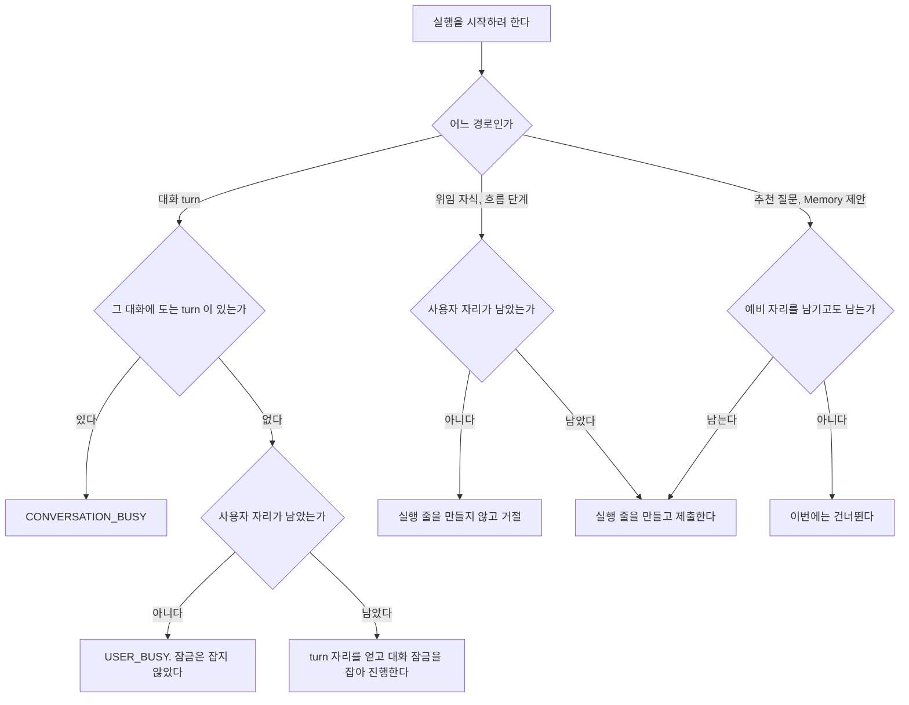

# 사용자 실행 한도

한 사용자가 Hermes 에 동시에 맡길 수 있는 실행의 수를 정한다.
무엇을 세는지, 기존 한도와 어떻게 겹치는지, 한도에 닿으면 무엇을 돌려주는지가 여기 있다.
결정과 버린 대안은 [ADR-069](../adr/ADR-069-사용자-전체-실행-한도는-turn-자리와-실행-줄을-사용자-잠금-하나에서-센다.md) 에 있다.

## 세는 실행

Control Plane 이 Hermes 에 실행을 맡기는 길은 `HermesRunsClient.submit`(`POST /v1/runs`) 하나다.
그 메서드를 부르는 곳은 `ChatService`, `AgentRunner`, `MemoryProposer`, `StarterSuggestionService` 넷이고 다른 진입점은 모두 이 넷을 거친다.

| 진입점 | 지나는 길 | 자리의 종류 |
| --- | --- | --- |
| 보내기(`POST /api/v1/chat/messages`, `.../messages/stream`) | `ChatService.send`, `stream` 에서 `runTurn` | turn 자리 |
| 다시 생성(`.../regenerate/stream`) | `ChatService.regenerate` | turn 자리 |
| 결과 다시 전달(`.../deliveries/{deliveryId}/retry/stream`) | `ChatService.retryDelivery` 에서 `runTurn` | turn 자리 |
| 스킬 커맨드 | 보내기와 같은 `runTurn` | turn 자리 |
| 대기 메시지 turn | `NextTurnDispatcher.tryPending` 에서 `ChatService.runPendingMessages` | turn 자리 |
| 위임 결과와 커넥터 결과의 자동 turn | `DelegationWakeService.tryWake` 에서 `ChatService.runDelegationResults` | turn 자리 |
| 흐름의 Chief | `ChatService.runFlow` 에서 `ResearchAndBuildFlow`, `AgentRunner.run` | turn 자리 |
| 흐름의 Researcher, Engineer, Synthesizer | `ChildExecutionRunner.run` 에서 `AgentRunner.run` | 실행 줄 |
| `agent_delegate` 로 맡긴 자식 | `AgentDelegationService.delegate` 에서 `ChildExecutionRunner.delegate`, `AgentRunner.run` | 실행 줄 |
| Memory 제안 | `ChatService.finish` 에서 `MemoryProposer.proposeFrom` | 실행 줄, 백그라운드 |
| 추천 질문 | `StarterSuggestionService.generate`. 추천 읽기와 turn 완료 뒤 갱신이 띄운다 | 실행 줄, 백그라운드 |
| 기동 정리가 다시 잡은 대화 turn 과 흐름 turn | `RestartReconciler` | turn 자리. 한도를 보지 않고 얻는다 |

Hermes 를 부르지만 실행을 시작하지 않는 것은 세지 않는다.
커넥터 도구 호출(`/api/connectors/...`), 실행 조회, 중지, 사용량 재조회가 그렇다.

### 세지 못하는 실행

| 실행 | 까닭 |
| --- | --- |
| Hermes native 하위 에이전트(`delegate_task`) | Hermes 가 스스로 띄운다. Control Plane 은 사건과 사용량 원장으로만 본다([ADR-062](../adr/ADR-062-native-하위-에이전트-사용량은-재조회-작업-줄을-원장으로-넓혀-합계에-더한다.md)) |
| Hermes cron | Control Plane 을 거치지 않는다 |
| Hermes 대시보드나 CLI 에서 직접 연 실행 | Control Plane 을 거치지 않는다 |

**이 한도는 Hermes 에 동시에 맡기는 실행 수의 상한이다.**
OS 격리나 CPU, 메모리, 비용의 상한을 보장하지 않는다.
실행 하나가 쓰는 메모리는 도구와 대화 길이에 따라 크게 달라진다([`hermes/concurrency.md`](../hermes/concurrency.md) 의 「스레드를 늘리는 비용」).

## 한도끼리의 관계

| 한도 | 단위 | 값 | 닿으면 | 세는 곳 |
| --- | --- | --- | --- | --- |
| 대화 잠금 | 대화 하나 | turn 1개 | `CONVERSATION_BUSY`. 화면은 글만 보낸 경우 대기 메시지로 넣는다 | `TurnCancellation` 메모리 |
| 루트당 위임 | 실행 트리 하나 | `assistant.delegation.max-concurrent-children`, 기본 4 | `TOO_MANY_CHILDREN` | `RUNNING` 이고 `delegation_key` 가 있는 실행 줄 |
| 서버 전체 위임 | Control Plane 프로세스 | `assistant.delegation.max-active`, 기본 16 | `BUSY` | `AgentDelegationService` 의 semaphore |
| **사용자 실행** | 사용자 한 명 | `assistant.user-execution.max-running`, 기본 4 | turn 은 `USER_BUSY`, 위임은 `BUSY`, 백그라운드는 건너뛴다 | `UserExecutionLimiter` 가 아래 「세는 방법」 으로 |
| Hermes listener | 공유 listener 하나 | `gateway.api_server.max_concurrent_runs`, 기본 10 | Hermes 가 429. Control Plane 은 `HERMES_BUSY` 로 적는다 | Hermes |

**사용자 한도는 그 아래 한도들보다 작게 둔다.**
한 사용자가 서버 전체 위임 자리나 Hermes listener 자리를 모두 가져가지 못하게 하기 위해서다.
기본값 4 는 listener 기본 10 의 절반보다 작고 서버 전체 위임 16 보다 작다.
사용자 한도는 자리를 더 주지 않는다. 다른 한도가 먼저 닿으면 그 한도의 응답이 나간다.

판정 순서는 아래와 같다.

| 경로 | 순서 |
| --- | --- |
| 대화 turn | 대화 잠금, 사용자 한도 |
| `agent_delegate` | 깊이, 에이전트, 같은 호출, 루트당 위임, 서버 전체 위임, 사용자 한도 |
| 흐름 단계 | 사용자 한도 |
| 백그라운드 | 기능이 켜졌는지, 사용자 한도(예비 자리 포함) |

## 세는 방법

`usage.application.UserExecutionLimiter` 가 사용자 한 명이 쥔 자리를 아래 셋의 합으로 센다.

| 자리 | 얻을 때 | 돌려줄 때 |
| --- | --- | --- |
| turn 자리 | `TurnCancellation.open` 이 대화 잠금을 잡기 직전. 잠금을 잡지 못하면 곧바로 돌려준다 | `TurnCancellation.close` 가 잠금을 풀 때. 한 번만 돌려준다 |
| 실행 줄 | `ExecutionRecorder` 가 `RUNNING` 줄을 만들 때 | 그 줄이 `SUCCEEDED`, `FAILED`, `CANCELLED` 로 적힐 때. 따로 돌려주지 않는다 |
| 원격 종료 확인 자리 | 실행 줄을 먼저 끝냈는데 Hermes 의 run 이 끝났는지 모를 때 | 실행 조회가 끝났다거나 404 라고 답할 때, 또는 상한 시간이 지났을 때 |

실행 줄은 `RUNNING` 이고 대화 turn 의 루트 줄이 아닌 것만 센다.
대화 turn 의 루트 줄은 `parent_execution_id` 가 비고 `conversation_id` 가 있는 줄이다. 그 turn 은 turn 자리로 이미 세었다.
흐름의 Chief 도 대화 turn 의 루트 줄이다. 그래서 Chief 가 끝난 뒤 자식이 시작하기 전에도 그 turn 은 자리 하나를 쥔다.
추천 질문 줄은 대화가 없어 루트 줄이어도 센다.

**판정과 자리 만들기는 사용자 잠금 하나 안에서 한다.**
turn 자리를 얻을 때와 실행 줄을 만들 때 모두 같은 잠금을 잡고, 셋을 더해 판정하고, 통과하면 그 안에서 자리를 만든다.
두 경로가 각자 세고 각자 만들면 합이 한도를 넘는다.
실행 줄의 저장은 그 잠금 안에서 커밋까지 끝난다. 부르는 쪽(`ChatService.runTurn`, `AgentRunner.run`, `MemoryProposer`, `StarterSuggestionService`)은 트랜잭션을 열지 않는다.
트랜잭션 안에서 부르면 잠금을 푼 뒤에 커밋되어 다른 스레드가 그 줄을 세지 못한다. `UserExecutionLimiter` 는 그 경우 예외를 던진다.

**대화 turn 의 루트 줄은 사용자 한도를 다시 보지 않는다.** turn 자리가 이미 그 turn 을 세었다.
나머지 실행 줄은 줄을 만들기 전에 판정한다.

| 실행 줄 | 통과 조건 |
| --- | --- |
| 흐름 단계, 위임 자식 | 쥔 자리가 `max-running` 보다 작다 |
| 추천 질문, Memory 제안 | 줄을 만든 뒤에도 `background-reserve` 만큼 자리가 남는다 |

### 원격 종료 확인

아래 경우에는 실행 줄을 끝낸 뒤에도 Hermes 에서 그 run 이 돌 수 있다.

| 경우 | 자리 |
| --- | --- |
| `awaitCompletion` 이 시간 초과(`HERMES_RUN_TIMEOUT`)나 조회 실패로 끝났다 | `ChatService`, `AgentRunner`, `MemoryProposer`, `StarterSuggestionService` |
| 제출은 됐는데 run 번호나 시작 사건을 적지 못해 실패로 끝냈다 | `AgentRunner`. 이미 중지를 보냈으므로 다시 보내지 않는다 |
| 기동 정리가 상한을 넘겨 중지를 보내고 `FAILED` 로 적었다 | `RestartReconciler`. 이미 중지를 보냈으므로 다시 보내지 않는다 |

**실행 줄의 상태 계약은 바꾸지 않는다.** 줄은 지금처럼 `FAILED` 로 적고, 그 run 의 자리를 원격 종료 확인 자리로 쥔다.
`UserExecutionLimiter.holdUntilRemoteEnds` 가 가상 스레드 하나에서, 아직 중지를 보내지 않은 run 이면 Hermes 에 중지를 한 번 보내고 `lookupRun` 으로 묻는다.

| 실행 조회의 답 | 하는 일 |
| --- | --- |
| 끝났다 | 자리를 돌려준다. 실행 줄은 다시 적지 않는다 |
| 404 | 자리를 돌려준다 |
| 아직 돈다, 닿지 못했다 | `hermes.poll-interval` 뒤 다시 묻는다. 닿지 못하면 5초까지 간격을 늘린다 |
| `assistant.user-execution.remote-end-max-wait` 를 넘었다 | 실행 번호와 run 번호를 담아 경고 로그를 남기고 자리를 돌려준다 |

제출 응답을 받지 못해 run 번호가 없는 실행은 물을 수 없어 이 자리로 세지 않는다. Hermes 가 그 제출을 받아 돌리고 있어도 Control Plane 은 알 수 없다.
대화 turn 에서 제출은 됐는데 run 번호를 적다 `ApiException` 이 아닌 예외가 나면 그 run 도 세지 못한다. 드문 경로라 한계로 둔다.

**Control Plane 이 다시 뜨면 이 자리는 사라진다.** 그 실행 줄은 이미 끝나 있어 기동 정리도 다시 보지 않는다.
그 run 이 Hermes 에서 끝날 때까지 그 사용자의 한도가 그만큼 덜 센다.

### 기동 정리와의 관계

기동 정리([`turn-control.md`](turn-control.md) 의 「기동할 때 남은 실행 정리」)가 다시 붙는 실행도 한도에 든다.

| 기동 정리가 다루는 실행 | 세는 방법 |
| --- | --- |
| 대화 turn 과 흐름 turn | 대화 잠금을 잡을 때 turn 자리를 한도와 무관하게 얻는다. 이미 Hermes 에서 돌고 있어 거절할 수 없다 |
| 위임 자식, 흐름 단계, 백그라운드 | `RUNNING` 실행 줄로 센다 |

그래서 다시 뜬 직후에는 사용자가 한도를 넘은 채일 수 있다. 그동안 새 turn 과 새 자식은 거절된다.

**실패를 적지 못해 `RUNNING` 으로 남은 줄은 다시 뜰 때까지 자리를 쥔다.**
실행 줄을 끝내는 기록 자체가 예외로 끝나면, 프로세스가 살아 있는 동안 그 줄을 다시 정하는 경로가 없다. 기동 정리가 그 줄을 정할 때 자리도 돌아온다.
자리를 덜 세는 쪽보다 더 세는 쪽을 골랐다. 오래된 `RUNNING` 줄을 세지 않는 상한은 두지 않는다.

## 한도에 닿을 때



| 경로 | 한도에 닿으면 | 사용자가 보는 것 |
| --- | --- | --- |
| 보내기 | 질문을 저장하기 전에 409 `USER_BUSY`. 스트림이면 `started` 전에 `error` 사건이다. 새 대화로 보낸 것이면 대화도 남기지 않는다. 새 대화를 저장하기 전에 자리를 한 번 보고, 그 사이 자리가 차서 잠금을 열 때 거절되면 방금 만든 빈 대화를 지운다. 지우다 실패하면 경고 로그만 남고 빈 대화가 목록에 남는다 | 쓴 글이 입력창에 돌아오고, 진행 중인 작업이 끝난 뒤 다시 보내라는 안내가 보인다. 대기 메시지로 넣지 않는다 |
| 다시 생성 | `started` 전에 `USER_BUSY` | 같은 안내가 보인다 |
| 대기 메시지 turn | 대기 행을 지우지 않고 그 대화의 대기 줄을 멈춘 뒤 대화 단위 SSE 로 `USER_BUSY` 를 보낸다 | 멈춘 대기 줄과 안내가 보인다. 사용자가 「보내기」 로 다시 보낸다 |
| 위임 결과 자동 turn | 결과를 전했다고 적지 않는다. `FAILURE_BACKOFF`(30초) 뒤 그 대화의 실패 시각을 지우고 다시 시도한다. 연속 거절이 10번을 넘으면 5분 간격으로 늦춘다. 한 대화에 걸린 예약은 하나뿐이다 | 결과는 자리가 난 뒤의 turn 에 전해진다 |
| 결과 다시 전달 | `started` 전에 `USER_BUSY`. 전달 묶음은 `FAILED` 나 `STOPPED` 그대로 남고 다시 시도를 예약하지 않는다 | 같은 안내가 보이고 「결과 다시 전달」 이 그대로 남는다 |
| 흐름 단계 | 그 단계의 실행 줄을 만들지 않는다. 루트 줄을 `USER_BUSY` 로 실패로 적고 turn 은 `USER_BUSY` 로 끝난다 | 같은 안내가 보인다 |
| `agent_delegate` | 실행 줄을 만들지 않고 `BUSY` 도구 결과를 돌려준다 | 모델이 직접 하거나, 앞의 작업이 끝난 뒤 다시 맡기거나, 실패를 알린다 |
| 추천 질문 | 실행 줄을 만들지 않는다. 실패 시각도 적지 않아 다음 읽기에서 다시 시도한다 | 추천이 이번에는 바뀌지 않는다 |
| Memory 제안 | 실행 줄을 만들지 않는다 | 제안이 생기지 않는다 |

**한도로 미룬 자동 turn 은 전달 실패가 아니다.** 미룬 자동 turn 은 대화 잠금을 잡기 전에 거절돼 알림 줄도 전달 묶음도 남기지 않는다. 결과는 전하지 않은 채 남아 위의 재시도가 전한다.
전달 묶음의 `FAILED` 는 잠금을 잡고 알림 줄을 저장한 뒤의 실패다. 그 묶음은 자동으로 다시 시도하지 않고 사용자가 다시 전달한다([`agent-delegation.md`](agent-delegation.md) 의 「결과 전달이 끝나지 않았을 때」).

**부모는 자식 자리를 기다리지 않는다.**
위임 자식과 흐름 단계는 자리가 없으면 곧바로 거절된다. 부모가 자리를 쥔 채 자식을 기다리는 교착이 없다.

**한도는 사용자마다 따로다.** 한 사용자가 한도에 닿아도 다른 사용자의 판정은 바뀌지 않는다.
여러 사용자가 함께 붐벼 Hermes listener 한도에 먼저 닿으면 그때는 `HERMES_BUSY` 다. 사용자 한도가 그 자리를 사용자마다 나눠 갖게 한다.

## 설정

| 설정 | 기본값 | 검사 |
| --- | --- | --- |
| `assistant.user-execution.max-running` | 4 | 1 이상. 아니면 기동하지 않는다 |
| `assistant.user-execution.background-reserve` | 1 | 0 이상이고 `max-running` 보다 작다 |
| `assistant.user-execution.remote-end-max-wait` | 비우면 `hermes.run-timeout` | 비우지 않으면 0 보다 크다 |

`max-running` 이 1 이고 `background-reserve` 가 0 이면 백그라운드 실행이 사용자 turn 과 같은 자리를 다툰다.
`background-reserve` 를 `max-running` 보다 1 작게 두면 백그라운드 실행은 그 사용자가 쥔 자리가 없을 때만 돈다.
Memory 제안은 turn 자리를 쥔 채 돌므로 그때는 돌지 않는다.

### 기본값의 근거

- 한 turn 이 동시에 쓰는 자리는 보통 1개다. 흐름 turn 은 turn 자리 하나에 나란히 도는 두 단계를 더해 3개다. 위임 자식이 붙으면 그만큼 더한다.
- 4 이면 흐름 turn 하나와 추천 질문이 함께 돌거나, 대화 셋을 동시에 돌리고 자식 하나를 맡길 수 있다.
- 가족 넷이 동시에 한도까지 써도 16 으로, 서버 전체 위임 한도와 같다. Hermes listener 기본 10 에는 사용자 셋이 한도까지 쓰면 닿는다. 그때는 Hermes 의 429 가 나간다.

측정은 아래 「측정」 이 갖는다.

## 측정

가짜 Hermes 로 합성 사용자와 합성 작업을 돌려 측정한다. 실제 대화 본문과 credential 은 쓰지 않는다.
`test/e2e/scenarios/user-execution-limit.ts` 가 측정을 돌리고 결과를 출력한다.

이 측정은 한도를 지키는지, 거절이 기다리지 않고 나가는지, 한도에 따라 처리량과 응답 시간이 어떻게 바뀌는지를 보인다. 기본값이 적절한지는 위 「기본값의 근거」 가 판단한다.
운영 Hermes 의 메모리 최댓값은 이 측정이 다루지 않는다.

### 측정 조건

- 측정일은 2026-10-03 이다.
- 합성 사용자 둘이다. 사용자 A 가 한도보다 2 개 많은 새 대화를 한꺼번에 보내고, 같은 순간 사용자 B 가 하나를 보낸다. e2e 의 `aunt` 와 `kid` 다.
- 가짜 Hermes 가 새 실행을 1.5초 동안 `running` 으로 붙잡은 뒤 끝낸다. 이 지연은 정한 값이다.
- 한도는 환경 변수 `ASSISTANT_USER_EXECUTION_MAX_RUNNING` 으로 바꿔 Control Plane 을 다시 띄우며 2, 4(기본값), 6 으로 측정했다.
- 동시 최댓값은 가짜 Hermes 가 제출부터 완료까지를 도는 중으로 세어 적은 값이다.

### 측정 결과

| 한도 | 보낸 수 | 받아들여진 수 | 거절 수 | A 의 동시 최댓값 | 전체 동시 최댓값 | 받아들여진 응답 시간 최소 / 중앙값 / 최대 | 거절 응답 시간 최대 |
| --- | --- | --- | --- | --- | --- | --- | --- |
| 2 | 4 | 2 | 2 | 2 | 3 | 2267 / 2267 / 2267 ms | 66 ms |
| 4 | 6 | 4 | 2 | 4 | 5 | 2153 / 2157 / 2162 ms | 20 ms |
| 6 | 8 | 6 | 2 | 6 | 7 | 2289 / 2289 / 2290 ms | 77 ms |

- 받아들여진 수는 모든 한도에서 한도와 같고, 넘친 요청은 모두 409 `USER_BUSY` 로 거절됐다. 거절된 요청은 대화를 만들지 않았다.
- A 의 동시 최댓값이 한도를 넘지 않았고, B 의 요청은 모두 받아들여졌다. 전체 동시 최댓값이 A 의 값보다 1 큰 것이 B 의 실행이다.
- 거절은 실행이 끝나기를 기다리지 않고 나갔다. 거절 응답은 최대 77 ms 로, 받아들여진 응답의 3.5% 이하다.
- 받아들여진 응답 시간은 한도와 관계없이 지연 1.5초에 Control Plane 의 처리 시간 0.6초 안팎을 더한 값이다. 한도를 올려도 받아들여진 요청이 서로 느려지지 않았다.
- 모두 끝난 뒤 하나를 더 보내면 받아들여졌다. 거절과 완료 뒤에 자리가 새지 않았다.
- 가짜 Hermes 는 동시 실행이 늘어도 느려지지 않는다. 한도를 올릴 때 실제 Hermes 의 응답 시간이 어떻게 변하는지는 이 측정이 보이지 않는다.

측정은 아래로 다시 돌린다.

```bash
# cwd: 저장소 root
E2E_MEASURE_USER_LIMITS=2,6 node test/e2e/run.ts
```

## 서버 한 대 전제

turn 자리, 원격 종료 확인 자리, 사용자 잠금이 모두 프로세스 메모리에 있다.
Control Plane 이 한 대라서 그것으로 된다. 대화 잠금([`turn-control.md`](turn-control.md))과 위임의 루트 잠금([`agent-delegation.md`](agent-delegation.md))도 같은 전제다.
여러 대로 늘리면 셋을 데이터베이스 잠금이나 공유 저장소로 옮겨야 한다. 실행 줄의 수는 지금도 데이터베이스에서 세지만, 세고 만드는 것을 묶는 잠금이 프로세스 안에 있다.
