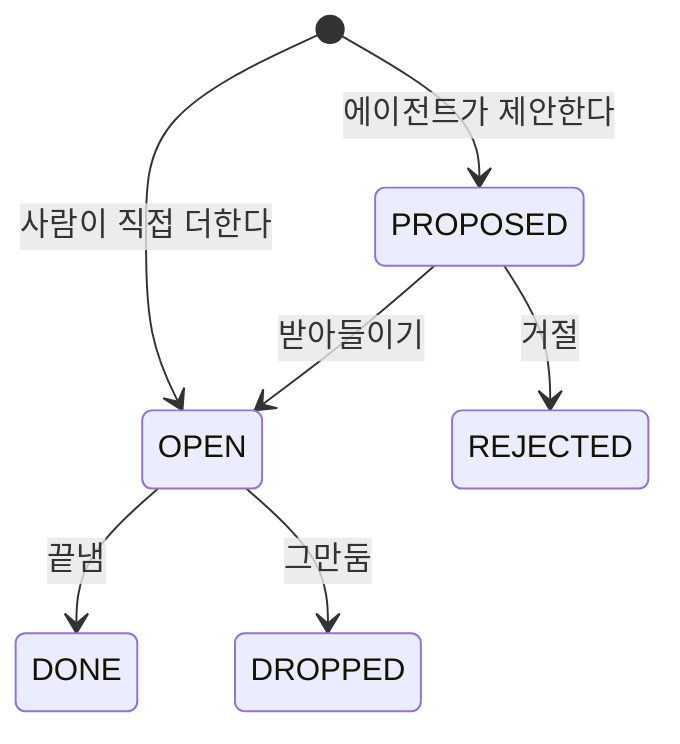

# 할 일

에이전트가 제안하고 사람이 받아들인 할 일의 상태, MCP 도구, 제안 억제 규칙, API 를 갖는다.
할 일이 무엇이고 무엇과 다른지와 결정은 [ADR-073](../adr/ADR-073-할-일은-에이전트가-제안하고-사람이-받아들인-것만-챙긴다.md) 에 있다.

## 상태

전이는 모두 사람이 한다. 상태의 뜻은 `FollowUpStatus` 가 갖는다.
`PROPOSED` 와 `OPEN` 은 제목, 기한, 기다리는 중을 고칠 수 있다. 끝난 세 상태는 고치지 못한다.
허용하지 않는 전이는 409 다.

## 제안 도구

Control Plane MCP 서버가 `follow_up_propose` 를 둔다.
먼저 살펴보기 트리에서도 이 도구를 받는다([ADR-085](../adr/ADR-085-매일-깨우기는-예약-작업을-다시-쓰고-다섯-칸-보고를-지금-화면에-올린다.md)).
관리자의 쓰기 도구 허용 설정과 관계없이 `PROPOSED` 만 만들고, 사람이 받아들여야 `OPEN` 이 된다.
판정 자리는 [`mcp-caller.md`](mcp-caller.md) 의 「Control Plane MCP」 가 갖는다.
도구 정의와 `tools/list` 의 순서는 `McpToolService.tools` 가, `due_at` 을 읽는 형식은 `FollowUpDueAt` 이, 결과 글과 `isError` 는 `McpToolService.proposeFollowUp` 이 갖는다.

- **주인과 대화는 호출의 origin 실행에서 정한다.** `McpCallerResolver` 가 찾은 origin 실행의 `user_id` 가 주인이고 `conversation_id` 가 대화다. 인자로 받지 않는다
- 대화가 없는 실행(추천 질문 같은 것)에서 부르면 거절한다
- 옛 커넥터 에이전트는 Control Plane MCP 도구를 받지 못한다. 지금 `McpCallerResolver` 의 거절이 그대로 막는다(ADR-045). 연결을 붙인 일반 에이전트는 이 도구를 부를 수 있다
- **fos-ctx 가 이 도구를 서명 필수로 안다.** `hermes/plugins/fos-ctx/hooks.py` 의 `REQUIRED_TOOLS` 에 넣는다
- **실행 사건에 이 도구의 인자와 결과를 남기지 않는다.** `HermesRunEventStream` 이 시작 사건(`tool.started` 의 `preview`)과 끝 사건의 `detail` 을 비운다. 인자에 할 일 제목이 실려, 남기면 관리자가 실행 기록에서 남의 할 일 제목을 읽는다
- 값이 틀린 인자에는 `isError` 와 무엇이 틀렸는지 한 줄로 답한다. 모델이 고쳐 다시 부를 수 있게 하려는 것이다

## 제안 억제

기간과 상한의 값은 `FollowUpService` 의 상수가 갖는다.

| 규칙 | 판정 |
| --- | --- |
| 같은 사용자의 `PROPOSED` 나 `OPEN` 에 같은 `title_key` 가 있다 | 새 줄을 만들지 않는다 |
| 같은 대화에서 `REJECTED_COOLDOWN` 안에 `REJECTED` 된 같은 `title_key` 가 있다 | 거절한다 |
| 같은 대화의 `PROPOSED` 가 `MAX_OPEN_PROPOSALS_PER_CONVERSATION` 에 닿았다 | 거절한다. 점검 대화는 `CHECK_PROPOSAL_WINDOW` 안에 만든 제안만 센다 |
| 한 실행이 `MAX_PROPOSALS_PER_EXECUTION` 만큼 이미 제안했다 | 거절한다 |

「한 실행」 은 호출의 origin 실행이다. 그 실행이 부른 하위 에이전트의 호출도 그 실행의 수에 함께 센다.
두 상한은 세는 것과 저장하는 것 사이에 잠금을 두지 않는다. 같은 대화에서 나란히 제안하면 상한을 한두 개 넘을 수 있다.
같은 제목은 아래 유일 제약이 하나만 남긴다.

점검 대화에서 `CHECK_PROPOSAL_WINDOW` 를 넘게 처리하지 않은 제안은 상한에서만 뺀다.
제안 줄은 그대로이며 「지금 볼 것」 의 「내 차례」 에서 받아들이거나 거절한다.
보통 대화는 만든 시각과 관계없이 모든 열린 제안을 센다. 같은 제목과 거절 이력의 억제는 점검 대화에도 그대로 적용한다.

`title_key` 를 만드는 정규화는 `FollowUpService` 가 갖는다.
같은 제안이 동시에 두 번 오면 `(user_id, title_key, open_marker)` 유일 제약이 하나만 남긴다([`backend/docs/data-schema.md`](../../backend/docs/data-schema.md) 의 「follow_up」).

## API

경로와 요청, 응답 칸은 `FollowUpController` 와 `FollowUpDtos` 가 갖는다.
웹 JWT 로 부르고 주인만 읽고 쓴다. 남의 할 일과 없는 할 일은 같은 404 로 답한다.

- **직접 더할 때 같은 `title_key` 의 열린 줄이 있으면 새 줄을 만들지 않는다.** 그 줄이 `PROPOSED` 면 사람이 받아들인 것으로 보고 `OPEN` 으로 바꿔 돌려주고, `OPEN` 이면 그대로 돌려준다
- 직접 더할 때 고른 대화는 요청자의 지우지 않은 대화여야 한다. 아니면 404 다
- 고칠 때 본문에 없는 칸은 그대로 둔다. 기한만 `null` 로 보내 지울 수 있다
- 바꾼 제목의 `title_key` 가 같은 사용자의 다른 열린 할 일과 같으면 409 다
- 제목은 앞뒤 공백을 지운 길이로 센다. 기한은 MCP 도구와 같은 연도 범위만 받는다

## 지키는 것

- **제목을 로그, 실행 사건, 알림 줄에 남기지 않는다.** 로그에는 사용자 번호, 할 일 번호, 실행 번호, 결과만 남긴다
- 제목은 모델이 쓴 글일 수 있다. 화면은 평문으로 그린다(ADR-009)
- 할 일을 대화의 `instructions` 에 싣지 않는다([`context-bundle.md`](context-bundle.md))
- 할 일에서 Hermes 실행이나 커넥터 호출을 시작하지 않는다
