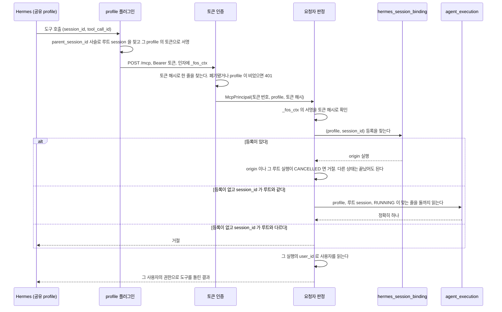
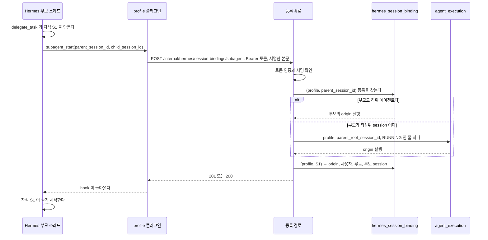

# MCP 요청자

Control Plane MCP 의 토큰은 profile 만 증명하고, 사용자가 걸린 도구의 요청자는 서명한 `_fos_ctx` 로 찾은 **origin 실행**의 사용자다.
origin 실행은 하위 에이전트 session 이면 만들 때 등록한 실행이고, 최상위 session 이면 그 루트 session 으로 도는 실행이다.
토큰이 요청자를 정하지 못하는 까닭은 GROUP 에이전트에서 여러 사용자가 같은 profile 을 쓰기 때문이다. 요청 본문에 사용자 번호를 넣어도 사용자를 바꿀 수 없다.
이 파일은 요청자를 정하는 클래스와 흐름, 하위 에이전트 session 등록, Control Plane MCP 서버와 결과물 쓰기 도구의 계약을 갖는다.
결정은 [ADR-032](../adr/ADR-032-mcp-토큰은-profile-을-증명하고-실제-사용자는-부모-실행에서-정한다.md) 와 [ADR-037](../adr/ADR-037-hermes-하위-에이전트-session-의-주인은-만들-때-등록한-줄로-정한다.md) 에 있다.

## 어느 클래스가 무엇을 하나

| 자리 | 하는 일 |
| --- | --- |
| `mcp.presentation.AgentTokenAuthenticationFilter` | `/mcp` 와 `/internal/hermes/session-bindings/subagent` 요청의 토큰을 인증해 `McpPrincipal` 을 인증 주체로 둔다. `CurrentUser` 를 두지 않는다. 서명 검증에 쓸 토큰 해시를 요청 속성으로도 넘긴다 |
| `mcp.application.AgentTokenService` | 발급, 목록, 폐기, 인증. 인증은 있고, 폐기되지 않았고, profile 이 묶인 토큰만 통과시킨다. 사용자는 토큰에서 읽지 않는다 |
| `mcp.application.McpPrincipal` | 인증 결과. 토큰 번호, profile, 토큰 해시. profile 은 늘 있다 |
| `mcp.application.McpCallerResolver` | `_fos_ctx` 서명 확인, origin 실행 찾기, 그 실행의 사용자 읽기를 차례로 한다. 모든 MCP 도구가 이 한 메서드 `resolve` 를 지난다. 실패는 모두 `MCP_CALL_CONTEXT_INVALID` 다 |
| `mcp.application.McpCaller` | 판정 결과. 요청자 `user`, origin 실행 `originExecution`, 확인한 `context`. 셋은 늘 있고 생성자가 빈 값을 거절한다. origin 실행은 끝난 실행일 수 있지만 그 실행이나 루트 실행이 `CANCELLED` 인 것은 아니다 |
| `mcp.application.McpCallContext` | `_fos_ctx` 를 읽고 서명을 확인한다. 모델이 준 다른 인자는 보지 않는다 |
| `mcp.application.SubagentRegistration` | 등록 본문을 읽고 서명을 확인한다. 서명할 글의 첫 줄이 `v1-subagent` 다 |
| `mcp.presentation.SubagentSessionController` | `POST /internal/hermes/session-bindings/subagent`. 인증 주체가 `McpPrincipal` 인지 보고 등록을 부른다 |
| `orchestration.application.SessionOwnerResolver` | profile, 서명한 루트 session, 그 호출의 session 으로 origin 실행을 정한다. 등록을 먼저 보고, 없으면 session 이 루트와 같을 때만 `DelegationParentResolver` 를 부른다. 등록의 origin 실행이나 그 루트 실행이 `CANCELLED` 면 거절한다 |
| `orchestration.application.DelegationParentResolver` | profile 과 서명한 루트 session 으로 도는 실행 하나를 찾는다. 최상위 session 의 판정과 최상위 자식의 등록이 쓴다. 사용자로 먼저 거르지 않는다. 없거나 둘 이상이거나 profile 이 다르면 같은 실패 |
| `orchestration.application.SubagentSessionRegistrar` | 등록 하나를 적는다. 부모를 풀고, 같은 origin 의 재등록은 그대로 두고, 다른 origin 은 거절한다 |
| `orchestration.domain.HermesSessionBinding`, `orchestration.infra.HermesSessionBindingRepository` | 하위 에이전트 session 등록 줄과 그 저장소 |

`McpController` 는 `params.name` 이 문자열이고 `params.arguments` 가 객체인지 본 뒤 `McpCallerResolver` 를 부른다. 도구별 인자 검사는 그 뒤에 하고, 그 `McpCaller` 로 `McpToolService` 를 부른다.
판정이 실패하면 `McpToolService.invalidContext()` 의 같은 도구 결과를 돌려준다.

등록 경로는 MCP 도구가 아니다. `tools/list` 에 나오지 않고 `McpController` 를 지나지 않는다.
`ControlPlaneJwtFilter` 는 이 경로를 `/mcp` 처럼 건너뛴다. 사용자 JWT 로 부르면 `AgentTokenAuthenticationFilter` 가 토큰으로 인증하지 못해 401 이다. 컨트롤러의 `McpPrincipal` 확인은 그 뒤의 방어 검사다.

## 토큰 관리 경로

관리자만 부른다.

| 경로 | 하는 일 |
| --- | --- |
| `POST /api/v1/admin/agent-tokens` | 본문 `{ "profileName", "label" }`. profile 에 묶인 새 토큰을 발급하고 원문을 한 번만 돌려준다. 사용자로 발급하는 길은 없다 |
| `GET /api/v1/admin/agent-tokens` | 목록. 한 줄에 `id`, `profileName`, `label`, 발급과 마지막 사용과 폐기 시각 |
| `DELETE /api/v1/admin/agent-tokens/{id}` | 폐기한다. 행은 남는다 |

profile 이름은 `HermesProfileName` 의 규칙을 따른다. 그 profile 에 에이전트가 있는지는 보지 않는다. profile 을 먼저 만들고 에이전트를 나중에 붙이는 순서가 있어서다.

## 실행 줄에 적는 session

Hermes 에 보낼 session 과 실행 줄에 적을 session 은 뜻이 다르다. 둘을 `chat.domain.RunSession` 하나로 넘긴다.
문자열 둘을 나란히 받으면 순서를 바꿔도 컴파일되기 때문이다.

| 만드는 자리 | `runtimeSessionId`(보낼 session) | `correlationSessionId`(실행 줄에 적을 session) |
| --- | --- | --- |
| `ConversationSessions.ensure` 가 대화 turn 에 | 대화의 `hermes_session_id` | 대화의 `hermes_root_session_id`, 비었으면 보낼 session |
| `RunSession.fresh()` 가 흐름의 하위 실행과 `agent_delegate` 의 위임 자식에 | 제출하기 전에 새로 정한 `fos-<uuid>`. 부모의 session 을 잇지 않는다 | 같은 값 |

`ChatService` 와 `ResearchAndBuildFlow` 의 Chief 는 `ensure` 의 값을, `ChildExecutionRunner` 는 `fresh()` 의 값을 `AgentRunner.run` 에 넘긴다.
Memory 제안은 session 을 적지 않는다. 그래서 그 실행 안에서는 사용자가 걸린 도구를 쓸 수 없다.

## MCP 호출의 요청자를 정할 때

`memory_read`, `artifact_write`, `agent_list`, `agent_delegate`, `agent_status`, `agent_stop`, `follow_up_propose` 가 모두 이 길을 지난다.



같은 profile 에서 두 사용자의 실행이 함께 돌아도 섞이지 않는다.
대화마다 루트 session 이 다르고, 호출마다 자기 루트 session 에 서명이 붙기 때문이다.

```text
공유 profile
  실행 #100  user=A  루트 session=fos-A → 서명한 루트 fos-A 의 호출은 A 로 돈다
  실행 #101  user=B  루트 session=fos-B → 서명한 루트 fos-B 의 호출은 B 로 돈다
```

토큰이 어느 사용자로 발급됐었는지는 결과를 바꾸지 않는다.

### 요청자 판정이 갈리는 지점

| 경우 | 결과 |
| --- | --- |
| 토큰이 없거나, 모르는 토큰이거나, 폐기됐다 | HTTP 401 |
| profile 이 빈 토큰이다 | HTTP 401. 옛 토큰을 사용자로 돌리던 경로는 지웠다([ADR-032](../adr/ADR-032-mcp-토큰은-profile-을-증명하고-실제-사용자는-부모-실행에서-정한다.md) 의 「옛 토큰에서 옮겨 가는 길」) |
| `_fos_ctx` 가 없거나 모양이 틀렸거나 서명이 맞지 않는다 | 거절한다 |
| 서명이 맞고 그 호출의 session 에 하위 에이전트 등록이 있다 | 등록의 origin 실행의 사용자로 돈다. origin 실행이 `SUCCEEDED` 나 `FAILED` 로 끝났어도, 같은 대화의 다음 turn 이 돌고 있어도 같다 |
| 등록이 있는데 origin 실행이나 그 실행 트리의 루트 실행이 `CANCELLED` 다 | 거절한다. 사용자가 turn 이나 흐름을 중지해도 Hermes 하위 에이전트는 계속 돌 수 있어서다. 흐름을 멈출 때 이미 끝난 자식 실행에서 만든 하위 에이전트도 루트가 중지돼 거절된다. Control Plane MCP 도구만 막고, 하위 에이전트의 Hermes 자체 도구와 run 은 멈추지 못한다([ADR-037](../adr/ADR-037-hermes-하위-에이전트-session-의-주인은-만들-때-등록한-줄로-정한다.md)) |
| 등록의 루트 session 이 서명한 루트와 다르다 | 거절한다 |
| 등록이 없고 그 호출의 session 이 루트와 다르다 | 거절한다. 등록이 빠진 하위 에이전트와 `compression.in_place: false` 로 교체된 최상위 session 이 여기 온다. 둘을 나눌 수 없어 추측하지 않는다([ADR-037](../adr/ADR-037-hermes-하위-에이전트-session-의-주인은-만들-때-등록한-줄로-정한다.md)) |
| 등록이 없고 session 이 루트와 같지만 그 루트 session 으로 도는 실행이 없다 | 거절한다. 끝난 실행, Memory 제안 실행, Control Plane 이 시작하지 않은 run(Hermes cron, 다른 채팅 플랫폼 gateway)이 여기 온다. 요청자를 알 수 없어서다 |
| 그 루트 session 으로 도는 실행이 다른 profile 의 것이다 | 거절한다 |
| 도는 실행이 둘 이상이다 | 거절한다. 가장 최근 것을 고르지 않는다 |

거절은 모두 **같은 도구 결과** 하나로 보인다. `isError: true` 와 「호출 맥락을 확인할 수 없습니다. 새 대화에서 다시 시도해 주세요.」 다.
서명이 틀린 것과 남의 profile 이 도는 것을 밖에서 나누지 못하게 해, 다른 사용자가 지금 실행 중인지 훑어 알아내지 못하게 한다.
이유는 서버 로그에만 남는다. 루트 session 으로 도는 실행이 없을 때는 옛 대화의 압축 교체일 수 있다는 표시(`DELEGATION_CONTEXT_UNAVAILABLE`)를 함께 남긴다. 등록이 없는 하위 에이전트 session 이면 `SUBAGENT_SESSION_UNREGISTERED` 를, 등록의 origin 실행이나 그 루트가 중지됐으면 `ORIGIN_CANCELLED` 를 남긴다.

**실행 줄에 session 을 적는 실행만 요청자가 될 수 있다.** 어느 실행이 어떤 session 을 적는지는 위 「실행 줄에 적는 session」 이 갖는다.

### 하위 에이전트 session 을 등록할 때

Hermes 의 하위 에이전트는 부모 run 보다 오래 살 수 있다. 그래서 만들어지는 순간 주인을 적는다.
계약은 [`hermes/fos-ctx.md`](../hermes/fos-ctx.md#하위-에이전트-session-등록-계약), 결정은 [ADR-037](../adr/ADR-037-hermes-하위-에이전트-session-의-주인은-만들-때-등록한-줄로-정한다.md) 에 있다.



부모 run 이 먼저 끝나도 S1 의 등록은 남는다.

```text
FOS 실행 #100 user=A profile=chief session=R    ← 끝났다
 └ S1 등록: (chief, S1) → #100, A
     └ S2 등록: (chief, S2) → #100, A          ← S1 이 만든 자식도 #100 을 잇는다
FOS 실행 #105 같은 대화의 다음 turn          ← 돌아도 S1 은 #100 에 남는다
```

다른 에이전트에게 맡긴 FOS 실행 안에서 만든 하위 에이전트는 그 FOS 실행을 origin 으로 갖는다. 그 FOS 실행이 제 session 으로 돌기 때문이다.

| 경우 | 결과 |
| --- | --- |
| 같은 `(profile, child_session_id)` 가 같은 부모와 루트로 다시 온다 | `200` 으로 답한다. 부모를 다시 풀지 않아, 그사이 부모 run 이 끝났어도 같다. 줄은 하나다 |
| 같은 `(profile, child_session_id)` 가 다른 origin 으로 온다 | `409` 로 거절하고 덮어쓰지 않는다 |
| 부모 session 에 등록이 없고 루트로 도는 실행도 없다 | `403` 으로 거절한다 |
| 서명이 틀리거나 토큰의 profile 이 부모의 profile 과 다르다 | `403` 으로 거절한다. 다른 profile 의 등록과 실행은 보이지 않는다 |
| `child_session_id` 가 루트 session 이거나, 그 profile 의 실행 줄이 쓰는 session 이거나, 대화가 적어 둔 session 이다 | `403` 으로 거절한다. 최상위 session 에 등록이 생기면 뒤 turn 이 앞 turn 에 묶인다. 압축 교체된 최상위 session 은 대화에만 남아 있어 대화도 본다 |
| session 값이 128자를 넘는다 | `403` 으로 거절한다. 저장 칸의 길이다 |
| 플러그인이 등록하지 못했다 | Hermes 는 hook 예외를 삼키고 자식을 돌린다. 그 자식의 호출은 위 판정에서 거절된다 |
| 부모 등록의 origin 실행이나 그 루트가 이미 `CANCELLED` 다 | 등록은 받는다. 그 자식의 MCP 호출이 위 판정에서 거절된다 |
| Control Plane 이 다시 떴다 | 등록은 데이터베이스에 있어 그대로 쓴다 |
| 부모 turn 이 끝난 뒤 하위 에이전트가 결과물을 썼다 | 파일은 대화 폴더에 남지만 어느 답에도 묶이지 않는다. 답에 묶는 것은 turn 이 끝날 때 폴더를 훑는 방식이다 |

## Control Plane MCP

제목만 `instructions` 에 실린 Memory 본문, 결과물 쓰기, 다른 에이전트에게 맡기기를 Control Plane 의 MCP 서버 하나가 맡는다.

| 항목 | 계약 |
| --- | --- |
| 서버 이름 | `fos-assistant` |
| Hermes 가 보이는 도구 이름 | `mcp__fos_assistant__<도구>`. 예: `mcp__fos_assistant__artifact_write`, `mcp__fos_assistant__memory_read` (v0.21.5, 2026-09-29 운영에서 확인) |
| 경로 | `/mcp` |
| 프로토콜 | Streamable HTTP `2025-03-26` |
| 인증 | profile마다 다른 Bearer 토큰. 토큰은 그 profile 을 증명할 뿐 사용자를 정하지 않는다 |
| 도구 | `memory_read`, `artifact_write`, `agent_list`, `agent_delegate`, `agent_status`, `agent_stop`, `follow_up_propose` |
| 요청자 | 모든 도구가 위 「MCP 호출의 요청자를 정할 때」 의 판정을 지난다. 서명하는 쪽의 계약은 [`../hermes/fos-ctx.md`](../hermes/fos-ctx.md#부모-실행을-잇는-방법) 에 있다 |

**먼저 살펴보기 트리에서는 `memory_read`, `agent_list`, `agent_delegate`, `agent_status`, `agent_stop` 만 받는다.**
요청자를 정한 뒤 `ProactiveCheckGuard.isCheckTree` 가 참이면 나머지 도구는 「먼저 살펴보기에서는 쓸 수 없는 도구입니다.」 오류 결과(`isError: true`)다. 지금은 `artifact_write` 와 `follow_up_propose` 가 여기 걸린다.
새 도구를 더하면 살펴보기에서 받을지 함께 정한다([`proactive-check.md`](proactive-check.md) 의 「읽기 경계」).

도구마다의 인자와 결과는 아래가 갖는다.

| 도구 | 계약을 갖는 곳 |
| --- | --- |
| `memory_read` | [`memory.md`](memory.md) 의 「Memory 본문을 읽는 길」 |
| `artifact_write` | 아래 「결과물 쓰기 도구」 |
| `agent_list`, `agent_delegate`, `agent_status`, `agent_stop` | [`agent-delegation.md`](agent-delegation.md) 의 「도구 계약」 |
| `follow_up_propose` | [`follow-up.md`](follow-up.md) 의 「제안 도구」 |

**Hermes 는 MCP 도구 이름 앞에 서버 이름을 붙인다.** 처음에는 Memory 만 담아 서버 이름이 `fos-assistant-memory` 였다.
결과물 쓰기가 같은 서버에 들어오면서 `mcp__fos_assistant_memory__artifact_write` 처럼 Memory 와 무관한 도구에 Memory 가 붙어 2026-09-29 에 `fos-assistant` 로 바꿨다.
Control Plane 이 여는 도구는 모두 이 서버 하나에 둔다.

**서버 이름을 바꿀 때는 등록 이름과 허용 목록을 한 번에 바꾼다.**
`platform_toolsets.api_server` 의 MCP 이름은 허용 목록이다. 목록에 등록되지 않은 이름만 남으면 Hermes 는 허용 목록이 없는 것으로 보고 전역 MCP 서버를 모두 켠다. 근거는 [v0.21.5 `hermes_cli/tools_config.py`](https://github.com/NousResearch/hermes-agent/blob/v2026.9.24/hermes_cli/tools_config.py) 의 `_get_platform_tools` 다.
그래서 대시보드 plugin 이 옛 이름과 새 이름을 함께 받는 동안 등록과 목록을 바꾸고, backend 가 새 이름을 쓰게 한 뒤 옛 이름을 막는다.
MCP 서버를 등록하는 설정 틀은 이 저장소의 `hermes/profile-template/` 가 갖는다. 토큰 값을 넣고 실제 연결을 확인하는 일은 비공개 저장소 `fos-home-infra` 가 맡는다.

### API server 에서 MCP 도구를 여는 범위

`platform_toolsets.api_server` 의 `no_mcp` 는 API server 로 들어온 실행에서 MCP 도구를 통째로 막는다.
`no_mcp` 대신 서버 이름을 허용 목록으로 적으면 그 서버의 도구만 모델에 전달하고 나머지는 막는다.

도구가 없던 profile 에 MCP 서버를 처음 열면 Hermes 가 `tool_search`, `tool_describe`, `tool_call` 중계를 함께 싣는다.
도구 정의가 약 59 토큰이어도 중계 때문에 입력이 약 1,800 토큰 늘 수 있다.
이미 이 중계를 쓰는 profile 은 MCP 서버를 더해도 서버의 도구 정의만큼만 늘어난다.

### 입력 비용은 API 콜 수가 정한다

실행의 입력 토큰은 provider 에 보낸 모든 API 콜의 입력을 더한 값이다.
추가 API 콜 하나는 그 시점의 전체 프롬프트 하나만큼 들기 때문에 대화가 길수록 도구 호출도 비싸진다.

도구를 부르지 않는 턴은 API 콜이 한 번이고, `memory_read` 를 부른 턴은 두 번이나 세 번이었다.
한 턴에서 항목을 한 개 읽든 세 개를 병렬로 읽든 API 콜 수는 같았다.
항목 수보다 도구를 부르는 턴 수가 입력 비용을 정한다.

Memory 색인 한 줄은 약 12 토큰이고, 항상 층(`retrieval` 이 `ALWAYS`)의 본문은 한 글자당 약 0.49 토큰이다.
항상 층은 API 콜 수를 늘리지 않는다.

#### 도구와 항상 층을 고르는 기준

항목이 필요한 실행 하나만 비교하면 항상 층(`ALWAYS`)이 도구보다 싸다.
항상 층은 API 콜을 늘리지 않지만, 도구는 현재 문맥 전체를 담은 API 콜을 한 번이나 두 번 더 만들기 때문이다.

항목이 필요 없는 실행에도 본문을 싣는 비용까지 포함하면 사용 빈도가 손익분기를 정한다.
아래 값보다 본문이 길면 도구가 유리하다.

| 항목이 필요한 비율 | 새 대화 | 이어진 대화 |
| --- | --- | --- |
| 2회에 1회 | 8,000자 한도 안에서는 해당하지 않음 | 8,000자 한도 안에서는 해당하지 않음 |
| 4회에 1회 | 약 7,600자 | 8,000자 한도 안에서는 해당하지 않음 |
| 10회에 1회 | 약 3,000자 | 약 4,100자 |
| 50회에 1회 | 약 600자 | 약 800자 |

이 값은 측정한 프롬프트 크기와 API 콜 수를 기준으로 한 판단값이다.
profile 의 도구 구성이나 대화 길이가 달라지면 손익분기도 달라진다.

## 결과물 쓰기 도구

`artifact_write` 는 일반 파일 도구가 없는 profile 에 결과물 저장만 연다.
`fos-assistant` 서버가 등록된 profile 에서만 보인다. 다른 도구와 같은 서버에 있어 Hermes 서버 등록과 허용 목록을 따로 두지 않는다.
실행 입력은 이 도구가 있으면 MCP 로 저장하고, 도구가 없고 파일 도구가 있으면 대화 폴더에 직접 쓰도록 안내한다.
결정은 [ADR-028](../adr/ADR-028-결과물은-사용자의-대화-폴더에-mcp-도구로-쓴다.md) 에 있다.

| 인자 | 계약 |
| --- | --- |
| `conversation_id` | 필수 UUID 문자열. `Conversation.publicId` 를 가리킨다. 내부 번호를 받지 않는다 |
| `path` | 필수 상대 경로. 대화 폴더 밖을 가리키지 않는다 |
| `content` | 선택 문자열. UTF-8 로 저장한다. `html`, `css` 만 받는다 |
| `source_url` | 선택 HTTPS URL. `png`, `jpg`, `jpeg`, `gif`, `webp` 만 받는다 |

`content` 와 `source_url` 은 정확히 하나만 있어야 한다.
`content` 는 빈 문자열도 파일 본문으로 인정한다. `source_url` 은 빈 값을 받지 않는다.
선택 인자에 `null` 을 넣거나 두 방식의 확장자를 섞으면 인자 오류다.
base64 인자와 정의하지 않은 인자는 거절한다.
`path` 는 빈 값, 절대 경로, 역슬래시, NUL, 빈 경로 조각과 `.` 또는 `..` 조각을 거절한다.
확장자의 대소문자는 가리지 않는다.
공통 상한은 **5MB(5 × 1024 × 1024 바이트)** 이고 본문은 문자 수 대신 UTF-8 바이트 수로 센다.
경로는 기존 `chat_artifact.path` 에 맞춰 500자까지 받는다.

origin 실행의 사용자로 `ConversationAccess.requireOwn(CurrentUser, UUID)` 를 호출한다.
확인 전에는 폴더 생성과 URL 조회를 하지 않는다.
없는 대화, 지운 대화, 다른 사용자의 대화는 같은 `isError: true` 결과로 숨긴다.
같은 사용자의 다른 대화는 허용한다.
도구 입력에 사용자 번호나 profile 을 넣어 요청자를 바꿀 수 없다.
실행을 가리키는 값은 모델이 주는 인자가 아니라 플러그인이 서명한 `_fos_ctx` 로만 온다. 그 까닭은 [도구 호출에는 실행을 가리키는 값이 없다](../hermes/fos-ctx.md#도구-호출에는-실행을-가리키는-값이-없다) 절이 갖는다.

성공은 기존 MCP 결과의 `content[0].text` 에 JSON 문자열을 담아 반환한다.
그 JSON 은 `{"path":"test/index.html","byteSize":123}` 모양이며 `isError` 는 `false` 다.
호스트 경로와 내부 대화 번호는 반환하지 않는다.
잘못된 인자는 JSON-RPC `-32602`, 모르는 도구는 `-32601` 로 답한다.
인자 오류의 `error.data` 에는 확장자, 경로 형식, 크기 초과처럼 정해 둔 이유만 담고 입력 경로나 URL query 는 넣지 않는다.
주인 확인 실패, 파일 저장 실패, URL 방어와 다운로드 실패는 `isError: true` 로 답한다.
URL 의 query, 응답 본문, 파일시스템 경로를 오류나 로그에 노출하지 않는다.

같은 경로를 덮어쓸 때도 임시 파일을 완성한 뒤 교체한다.
상한 초과나 다운로드 실패는 임시 파일을 지우고 기존 파일을 보존한다.
HTML 을 답에 묶는 일은 쓰기 도구가 하지 않는다. 묶는 시점은 [`artifact.md`](artifact.md#결과물을-mcp-로-쓸-때) 가 갖는다.

### 주소 방식과 SSRF 방어

| 항목 | 계약 |
| --- | --- |
| URL | `https` 만. userinfo, fragment, IP 리터럴을 거절한다. 포트는 생략하거나 HTTPS 표준 포트만 받는다 |
| 호스트 설정 | `assistant.artifact.source.allowed-hosts`. 소문자 ASCII 호스트의 정확한 일치만 허용한다. wildcard 와 접미사 일치를 쓰지 않는다 |
| 기본 허용 목록 | 빈 목록. 설정 전에는 모든 `source_url` 을 거절하고 `content` 는 허용한다 |
| DNS | A 와 AAAA 결과를 모두 검사한다. 사설, loopback, link-local, unspecified, multicast, IPv6 ULA 와 IPv4 를 담은 IPv6 의 비공개 주소를 거절한다 |
| 연결 | 검사한 IP 로 연결한다. 재시도도 검사한 주소만 쓰며 TLS 인증서, SNI 와 HTTP Host 는 원래 호스트를 쓴다 |
| HTTP | redirect 를 따라가지 않고 200 응답만 받는다. 서버의 인증 헤더와 쿠키를 보내지 않는다 |
| 형식 | `png` 는 `image/png`, `jpg` 와 `jpeg` 는 `image/jpeg`, `gif` 는 `image/gif`, `webp` 는 `image/webp`. MIME 의 매개변수는 제외하고 비교한다 |
| 크기 | `Content-Length` 가 상한보다 크면 읽기 전에 거절한다. 길이가 있으면 선언된 바이트만 읽고 조기 EOF 를 거절한다. 길이가 없으면 chunked 또는 연결 종료까지 읽되 5MB 를 넘는 순간 거절한다 |
| 제한 시간 | 연결 5초, 읽기 10초, DNS 를 포함한 호출 전체 30초. 느린 본문이 읽기 제한만 피해도 전체 제한으로 끝낸다 |

DNS 검사 뒤 원래 호스트 URL 을 일반 HTTP 클라이언트로 다시 부르는 구현은 쓰지 않는다.
클라이언트가 이름을 다시 풀면 검사한 IP 와 연결한 IP 가 달라질 수 있다.
연결 시점에도 IP 를 고정하고 원래 호스트 인증을 유지해야 한다.

Hermes v0.21.0 의 태그는 `v2026.8.31` 이다.
[해당 버전의 이미지 생성 소스](https://github.com/NousResearch/hermes-agent/blob/v2026.8.31/tools/image_generation_tool.py) 는
FAL 응답의 첫 이미지 URL 을 `success`, `image` 결과로 돌려준다.
소스는 출력 호스트를 고정하지 않는다.
[FAL 공식 응답 예시](https://fal.ai/models/fal-ai/flux/dev/api#output) 의 `images[].url` 은 빈 값이다.
이 근거로는 실제 출력 호스트를 확정할 수 없어 허용 목록의 기본값을 비워 둔다.
운영 호스트 확인과 설정은 `fos-home-infra` 에서 맡는다.

[같은 버전의 파일 안전 소스](https://github.com/NousResearch/hermes-agent/blob/v2026.8.31/agent/file_safety.py) 의
`get_safe_write_roots()` 는 `HERMES_WRITE_SAFE_ROOT` 를 프로세스 환경에서 읽는다.
이 값은 profile 별 쓰기 권한을 정하지 못한다.
읽기 거절 규칙도 결과물 폴더만 읽게 하는 경계가 아니다.
