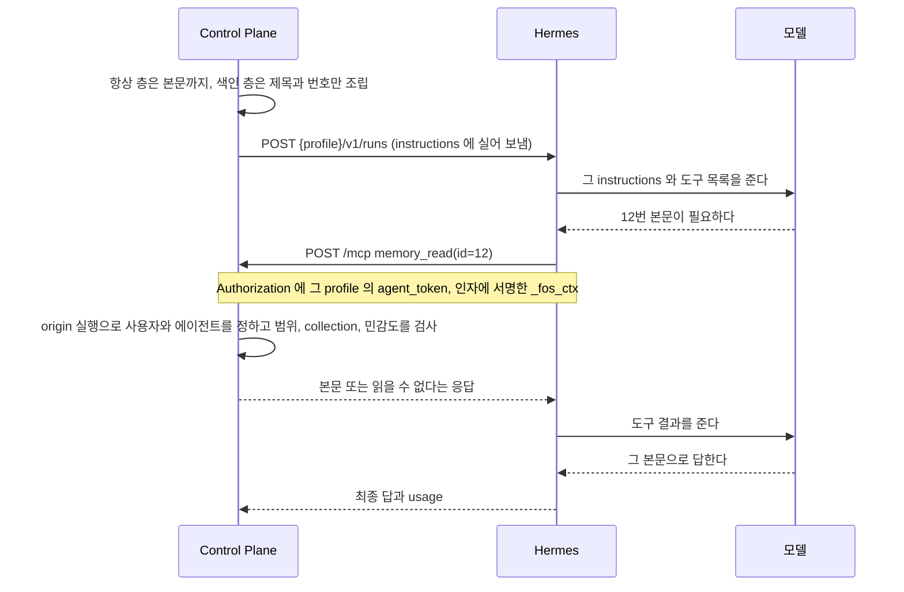
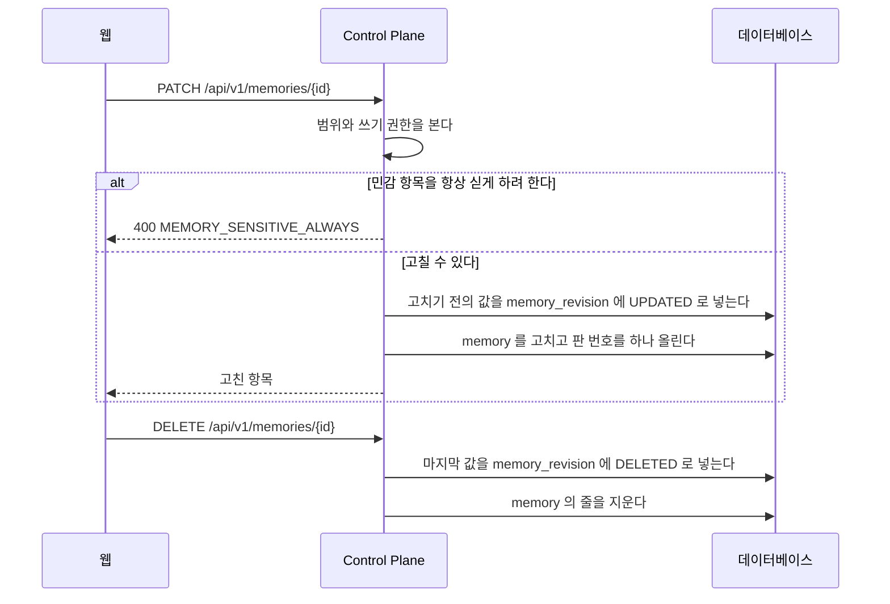

# Memory

## Memory

Memory 는 에이전트가 실행할 때 `instructions` 로 받는 사실이다.
단일 소스는 Control Plane 데이터베이스이고, Hermes 의 내장 memory 는 쓰지 않는다.

- 범위는 `USER` 와 `GROUP` 둘뿐이고 등록할 때 반드시 명시한다.
- 에이전트가 제안하면 `PROPOSED` 로 들어오고, 사람이 받아들여야 `ACCEPTED` 가 된다.
  주입되는 것은 `ACCEPTED` 뿐이다.
- 항목은 collection 하나에 속한다. 지금 화면과 제안이 만드는 항목은 모두 `core` 다.
- `ContextAssembler.assemble(user, agentId)` 가 요청자의 `USER` 항목과 요청자가 속한 그룹의 `GROUP` 항목 가운데 그 에이전트가 받는 collection 의 항목만 골라 조립한다.
  다른 사용자의 개인 항목과 받지 않는 collection 의 항목은 고르는 단계에서 빠진다.
- `retrieval` 이 `ALWAYS` 면 본문을 싣고, `SEARCH` 면 제목과 번호만 색인에 싣는다. `ARCHIVE` 와 종류가 `SOURCE` 인 항목은 싣지 않는다.
- `SENSITIVE` 항목은 `ALWAYS` 로 저장하지 못한다. `MemoryService` 가 `MEMORY_SENSITIVE_ALWAYS` 로 거절한다.
- 색인의 본문은 `memory_read` MCP 도구로 읽는다.
  요청자는 장기 토큰이 아니라 서명한 `_fos_ctx` 로 찾은 origin 실행의 사용자다(「MCP 요청자」). 요청 본문은 사용자를 바꾸지 못한다.
  collection 과 민감도는 그 origin 실행의 에이전트로 판정한다.
  Control Plane 은 접근할 수 없는 항목과 없는 항목을 같은 응답으로 숨긴다. 받지 않는 collection 의 항목과 허용받지 않은 민감 항목도 같은 응답이다.
- 본문이나 `retrieval` 이나 `sensitivity` 를 고치면 고치기 전의 값을 `memory_revision` 에 남기고 판 번호를 올린다. 지울 때도 마지막 값을 남긴다.
- 공통 답변 지침과 Memory를 합친 글자 수를 실행의 `context_chars`에 남긴다.
  `instructions_hash`도 이 문자열을 대상으로 하며, turn 전용 지시는 제외한다.
  Memory가 없어도 공통 지침의 길이와 지문이 남으므로 Memory 주입 여부는 지문만으로 판단하지 않는다.
- 항목 하나가 남은 자리에 들어가지 않으면 그 항목만 빼고 다음 항목을 계속 담는다.
  넘친 항목을 잘라서 싣지는 않는다. 잘린 사실은 틀린 사실이 될 수 있다.
- 색인 층에 쓸 자리를 먼저 떼어 두고 항상 층을 담는다.
  몫은 `assistant.context.index-budget-ratio` 가 정하고 기본값은 4 다.
  색인이 빠지면 `memory_read` 로 읽을 번호도 사라져 에이전트가 나머지 Memory 에 닿을 길이 없어진다.
- 빠진 항목 수를 실행의 `context_omitted_items` 에 남기고, `/memory` 목록의 그 항목에 표시를 단다.
  대화 화면에는 끼우지 않는다.

### 에이전트의 실행에 보이는 항목

판정은 세 조건이다. 하나라도 지나지 못한 항목은 그 실행에 없는 항목이다.

| 조건 | 무엇을 본다 | 어디서 정한다 |
| --- | --- | --- |
| 범위 | `USER` 는 주인, `GROUP` 은 같은 그룹 | `memory.scope`, `owner_user_id`, `group_id` |
| collection | 그 에이전트가 받는 collection 인가 | `agent_memory_collection` 의 줄 |
| 민감도 | `SENSITIVE` 면 그 collection 의 `allow_sensitive` 가 참인가 | `agent_memory_collection.allow_sensitive` |

- 줄이 하나도 없는 에이전트, 찾지 못한 에이전트, 에이전트가 없는 실행, 커넥터 에이전트는 아무것도 받지 않는다.
- 에이전트를 처음 저장하면 `AgentRepository` 의 저장이 `AgentCreated` 사건을 내고, `AgentMemoryCollectionService` 가 그것을 받아 `core` 한 줄을 넣는다.
  에이전트를 만드는 경로가 셋(첫 로그인, 사용자가 만들기, 관리자 등록)이라 경로마다 넣지 않고 이 사건 하나로 넣는다. 커넥터 에이전트에는 넣지 않는다.
- 위임받은 에이전트는 자기 허용으로 판정한다. 부르는 쪽의 허용을 물려받지 않는다.
- `ContextAssembler` 는 에이전트를 번호로 받는다. `context` 패키지가 `agent` 를 쓰면 패키지 순환이 하나 늘기 때문이다. 번호로 에이전트를 읽는 것은 이미 `agent` 를 쓰는 `memory` 가 한다.
- `/memory` 목록의 빠짐 표시는 에이전트를 모르는 채 판정한다. `ContextAssembler.assembleForOwner` 가 collection 을 거르지 않고 조립한 결과를 쓴다.

| 클래스 | 하는 일 |
| --- | --- |
| `memory.application.MemoryService` | 읽기와 쓰기, 판 기록, 세 조건의 판정. `accessOf(agentId)` 가 그 에이전트의 `MemoryAccess` 를 낸다 |
| `memory.application.model.MemoryAccess` | 한 실행이 받는 collection 과 민감 허용 |
| `memory.infra.MemoryQueries` | 볼 수 있는 항목과 실행에 실을 항목을 고르는 조건. 모두 읽어 온 뒤 거르지 않고 데이터베이스가 고른다. 검색을 붙일 때도 이 조건 뒤에 붙인다 |
| `memory.application.MemoryCollectionService` | 그룹의 collection 목록. 줄이 없는 그룹이면 기본 일곱 개를 넣는다 |
| `agent.application.AgentMemoryCollectionService` | 에이전트가 받는 collection 읽기, 새 에이전트에 `core` 넣기 |

근거는 [`adr/ADR-052-memory-는-collection-종류-꺼내는-방식-민감도-판-출처를-가진다.md`](../adr/ADR-052-memory-는-collection-종류-꺼내는-방식-민감도-판-출처를-가진다.md) 와
[`adr/ADR-053-에이전트는-허용된-collection-의-memory-만-받는다.md`](../adr/ADR-053-에이전트는-허용된-collection-의-memory-만-받는다.md) 에 있다.

## Memory 본문을 읽는 길

대화 한 번에 Memory 가 실리는데 전부 싣지 않는다.
본문까지 싣는 항상 층(`retrieval` 이 `ALWAYS`)과 제목만 싣는 색인 층(`SEARCH`)으로 나눈다.
보관한 항목(`ARCHIVE`)과 출처 원문(`SOURCE`)은 어느 층에도 싣지 않는다.
두 층 모두 그 에이전트가 받는 collection 의 항목만 담는다.

색인에 실린 항목의 본문이 필요해지면 에이전트가 도구로 읽는다.
**그때 요청이 Hermes 에서 Control Plane 으로 거꾸로 온다.**

**요청 본문에는 항목 번호만 있고 사용자가 없다.**
사용자는 「MCP 호출의 요청자를 정할 때」 의 길로 origin 실행에서 정한다.
모델이 만든 JSON 에 사용자를 넣게 하면 모델이 남의 Memory 를 읽을 수 있다.

볼 수 없는 항목과 없는 항목은 **같은 응답**으로 답한다.
다르게 답하면 그 항목이 있다는 사실 자체가 새어 나간다.

### 갈리는 지점

| 무엇이 | 어떻게 되는가 |
| --- | --- |
| 남의 개인 항목, 다른 그룹의 항목, 없는 번호 | 읽을 수 없다는 같은 응답이다 |
| origin 실행의 에이전트가 받지 않는 collection 의 항목 | 같은 응답이다. 색인에도 없던 번호다 |
| `SENSITIVE` 항목이고 그 collection 에서 민감 항목을 허용받지 않았다 | 같은 응답이다 |
| 승인 전인 항목, 항상 층에 이미 실린 항목, 보관한 항목, 출처 원문 | 같은 응답이다 |
| origin 실행에 에이전트가 없거나 그 에이전트를 찾지 못한다 | 같은 응답이다. 받는 collection 이 없다 |
| origin 실행의 에이전트가 커넥터 에이전트다 | 요청자 판정에서 먼저 거절한다. 호출 맥락을 확인할 수 없다는 응답이다([ADR-045](../adr/ADR-045-커넥터-에이전트는-자기-mcp-서버만-받고-memory-와-control-plane-도구를-받지-않는다.md)) |
| 위임받아 도는 에이전트가 읽는다 | 그 에이전트의 허용으로 판정한다. 부르는 쪽의 허용을 물려받지 않는다 |

근거는 [ADR-053](../adr/ADR-053-에이전트는-허용된-collection-의-memory-만-받는다.md) 에 있다.

### Memory 를 고치고 지울 때

판을 남기는 것과 항목을 고치는 것은 한 트랜잭션이다. 한쪽만 남지 않는다.
거절한 수정은 판을 남기지 않는다.
지금 화면은 민감도를 보내지 않으므로 민감 항목이 생기지 않는다. 그 거절은 민감 항목을 다루는 경로가 생길 때부터 화면에 보인다.
지금 화면의 수정이 항상 싣는 설정을 끄면 색인으로 간다. 이미 보관한 항목은 보관한 채로 둔다.

### 이 왕복은 비싸다

Hermes 는 도구를 부른 턴의 API 콜을 한 번에서 두 번이나 세 번으로 늘린다.
추가 API 콜 하나는 그 시점의 전체 프롬프트 하나만큼 들기 때문에 긴 대화일수록 도구 호출이 비싸다.
한 턴에서 항목을 한 개 읽든 세 개를 읽든 API 콜 수는 같고, 색인 한 줄은 약 12 토큰이다.
자세한 Hermes 동작은 [`backend/mcp-caller.md`](mcp-caller.md#입력-비용은-api-콜-수가-정한다)에 둔다.

### 도구와 항상 층을 고르는 기준

항목이 필요한 실행 하나만 비교하면 항상 층(`ALWAYS`)이 도구보다 싸다.
항상 층의 본문은 한 글자당 약 0.49 토큰이고 API 콜을 늘리지 않지만,
도구는 현재 문맥 전체를 담은 API 콜을 한 번이나 두 번 더 만들기 때문이다.

항목이 필요 없는 실행에도 본문을 싣는 비용까지 포함하면 사용 빈도가 손익분기를 정한다.
아래 값보다 본문이 길면 도구가 유리하다.

| 항목이 필요한 비율 | 새 대화 | 이어진 대화 |
| --- | --- | --- |
| 2회에 1회 | 8,000자 한도 안에서는 해당하지 않음 | 8,000자 한도 안에서는 해당하지 않음 |
| 4회에 1회 | 약 7,600자 | 8,000자 한도 안에서는 해당하지 않음 |
| 10회에 1회 | 약 3,000자 | 약 4,100자 |
| 50회에 1회 | 약 600자 | 약 800자 |

이 값은 측정한 프롬프트 크기와 API 콜 수를 기준으로 한 판단값이다.
profile 의 도구 구성이나 대화 길이가 달라지면 손익분기도 달라진다.

### 항상 층의 항목이 문맥 한도를 넘을 때

Control Plane 은 조립한 Memory 문맥을 8,000자로 제한한다.
커넥터 에이전트(`connectorManaged`)의 실행은 Memory 문맥을 조립하지 않는다. 근거는 [ADR-045](../adr/ADR-045-커넥터-에이전트는-자기-mcp-서버만-받고-memory-와-control-plane-도구를-받지-않는다.md) 와 [커넥터 연결](connector-install.md) 에 있다.
항상 층을 담기 전에 색인 층의 자리를 떼어 두므로 긴 본문이 색인을 밀어내지 못한다.
항목 하나가 남은 자리에 들어가지 않으면 그 항목만 빼고 다음 항목과 색인을 계속 담는다.
넘친 본문은 일부만 잘라 싣지 않는다.

Control Plane 은 빠진 항목 수를 실행 기록에 남기고 Memory 목록에서 해당 항목에 표시한다.
대화 화면에는 이 표시를 넣지 않는다.
한 항목의 본문을 8,000자 가까이 키우지 않고 큰 본문은 색인 층에 둔다.
