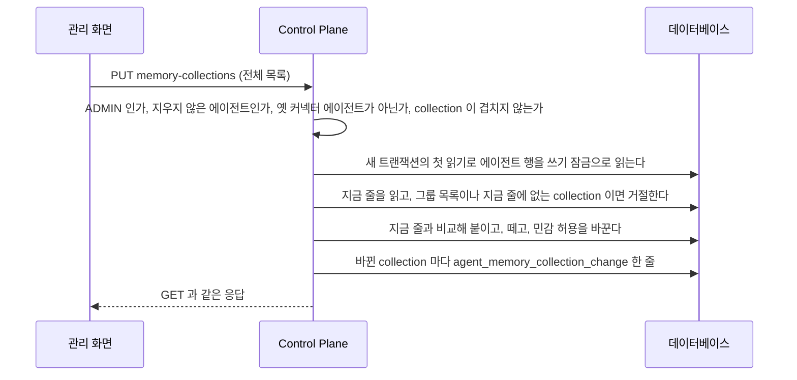
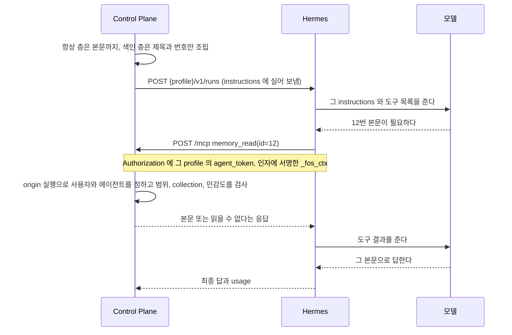
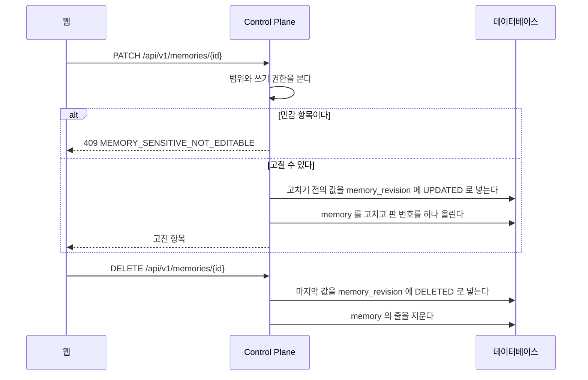
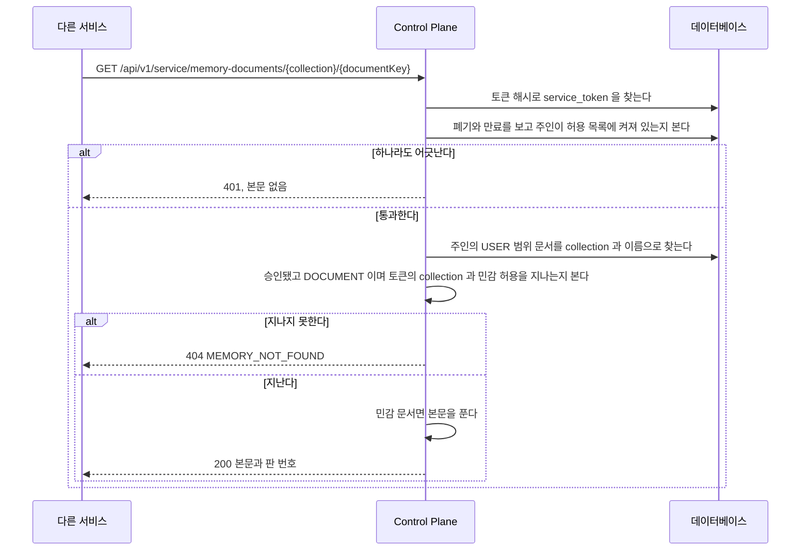

# Memory

Memory 는 에이전트가 실행할 때 `instructions` 로 받는 사실이다.
단일 소스는 Control Plane 데이터베이스이고, Hermes 의 내장 memory 는 쓰지 않는다.
이 파일은 Memory 의 범위와 승인, 실행에 실을 항목을 고르고 조립하는 규칙, 색인의 본문을 `memory_read` 로 읽는 길, 에이전트가 `memory_remember` 로 기억을 남기는 길, 답마다 참고한 기억을 보이는 길을 갖는다.

## 범위와 조립

- 범위는 `USER` 와 `GROUP` 둘뿐이고 등록할 때 반드시 명시한다.
- 에이전트가 제안하면 `PROPOSED` 로 들어오고, 사람이 받아들여야 `ACCEPTED` 가 된다.
  예외는 사람이 보낸 대화 turn 에서 사용자가 직접 말한 사실이다. 그 말을 승인으로 보고 바로 `ACCEPTED` 로 저장한다(아래 「에이전트가 기억을 남기는 길」).
  주입되는 것은 `ACCEPTED` 뿐이다.
- 항목은 collection 하나에 속한다. 지금 화면과 대화 뒤 자동 제안이 만드는 항목은 모두 `core` 다. `memory_remember` 는 그 에이전트가 받는 collection 을 고를 수 있고 기본값은 `core` 다.
- `ContextAssembler.assemble(user, agentId)` 가 요청자의 `USER` 항목과 요청자가 속한 그룹의 `GROUP` 항목 가운데 그 에이전트가 받는 collection 의 항목만 골라 조립한다.
  다른 사용자의 개인 항목과 받지 않는 collection 의 항목은 고르는 단계에서 빠진다.
- 본문까지 싣는 항상 층과 제목만 싣는 색인 층으로 나눈다. `retrieval` 이 `ALWAYS` 면 항상 층에 본문을 싣고, `SEARCH` 면 제목과 번호만 색인에 싣는다. `ARCHIVE` 와 종류가 `SOURCE` 인 항목은 어느 층에도 싣지 않는다.
  예외로 `SEARCH` 가운데 짧은 개인 항목은 두 층 사이의 개인 사실 구역에 본문까지 싣는다(아래 「개인 사실 구역」).
- `SENSITIVE` 항목은 `ALWAYS` 로 저장하지 못한다. `MemoryService` 가 `MEMORY_SENSITIVE_ALWAYS` 로 거절한다.
- 색인의 본문은 `memory_read` MCP 도구로 읽는다. 본문을 내 주면 그 실행의 `execution_context_source` 에 `MEMORY_READ` 줄을 덧붙인다(아래 「본문을 읽으면 남는 기록」).
  요청자는 장기 토큰이 아니라 서명한 `_fos_ctx` 로 찾은 origin 실행의 사용자다([`mcp-caller.md`](mcp-caller.md)). 요청 본문은 사용자를 바꾸지 못한다.
  collection 과 민감도는 그 origin 실행의 에이전트로 판정한다.
  Control Plane 은 접근할 수 없는 항목과 없는 항목을 같은 응답으로 숨긴다. 받지 않는 collection 의 항목과 허용받지 않은 민감 항목도 같은 응답이다.
- 민감 항목의 본문은 `memory.content` 와 `memory_revision.content` 에 암호문으로 저장한다. `content_key_id` 가 key 를 적는다.
- 본문을 밖으로 내는 자리는 `MemoryService.contentOf` 를 거친다. Memory 목록은 민감 본문을 싣지 않는다.
  `ContextAssembler` 는 본문을 풀지 않으므로 암호문인 줄을 항상 층에서 건너뛴다. 민감 항목은 `ALWAYS` 가 되지 못하므로 정상 경로에서는 그런 줄이 없다.
- Memory 목록(`GET /api/v1/memories`)은 에이전트가 남긴 줄에 남긴 에이전트를 함께 낸다. `proposedByExecutionId` 의 실행에서 에이전트를 찾는다.
  `sourceAgentName` 은 요청자가 그 에이전트를 읽을 수 있을 때만 싣고, 지운 에이전트는 이름 없이 `sourceAgentDeleted` 를 참으로 낸다.
  볼 수 없는 비공개 에이전트의 이름이 목록으로 새지 않게 하려는 것이다. 판정은 `MemorySources` 가 갖고, 한 항목만 돌려주는 응답은 두 칸을 비운다.
- 민감 항목은 `PATCH /api/v1/memories/{id}` 로 고치지 못한다. 목록이 본문을 싣지 않아 그 요청이 본문을 읽지 않은 채 덮어쓰기 때문이다. `MEMORY_SENSITIVE_NOT_EDITABLE` 로 거절한다.
- 일반 항목을 민감 항목으로 바꾸면 물러나는 판과 그 항목에 평문으로 남은 앞선 판을 같은 트랜잭션에서 함께 암호화한다.
- key 가 없으면 민감 항목의 저장과 수정, 암호화한 줄의 읽기를 `MEMORY_ENCRYPTION_UNAVAILABLE` 로 거절한다. 평문으로 내려 저장하지 않는다.
- 기동할 때 `MemoryContentBackfill` 이 평문으로 남은 민감 줄을 암호화한다. 줄마다 쓰기 잠금으로 다시 읽어 그 줄의 트랜잭션에서 고친다. 실패해도 기동은 잇고 예외 클래스 이름만 로그에 남긴다.
- 문서(`DOCUMENT`)는 사용자가 직접 쓰고 고친다. 곧 `ACCEPTED` 이고 꺼내는 방식은 `SEARCH` 다.
  Memory 목록(`GET /api/v1/memories`)은 종류가 `MEMORY` 인 줄만 내고, `PATCH /api/v1/memories/{id}` 와 승인과 거절은 문서에 `MEMORY_NOT_FOUND` 로 답한다.
  문서는 `/api/v1/memory-documents` 가 따로 다룬다. 고칠 때 화면이 읽은 판 번호를 함께 보내고, 지금 판과 다르면 `MEMORY_REVISION_CONFLICT` 로 거절한다([ADR-057](../adr/ADR-057-문서는-사람이-화면에서-직접-쓰고-고친다.md)).
- 기존 개인 지식에서 들인 항목의 `source_type=brain`, `source_ref`, `source_date` 는 출처 기록으로 보존한다. 퇴역과 이관 도구 제거의 결정은 [ADR-058](../adr/ADR-058-기존-개인-지식-저장소는-주인이-검토한-묶음을-화면에서-올려-들여온다.md) 이 갖는다.
- 서비스 토큰은 만료가 필수이고(1일에서 365일), 주인이 허용 목록에 켜져 있을 때만 통한다.
  인증마다 `shared.auth.UserAccessPolicy` 로 묻고 `people.application.AllowedUserAccessPolicy` 가 로그인 판정과 같은 답을 낸다.
  발급도 같은 질문을 먼저 한다. 꺼진 사용자는 살아 있는 웹 세션으로도 새 토큰을 받지 못한다. 그 요청은 발급에 닿기 전에 필터에서 401 `ACCESS_REVOKED` 로 막힌다(ADR-059). 허용 목록에 줄이 없는 사용자는 발급에서 403 `FORBIDDEN` 이다.
  관리자가 사용자를 끄면 `people.application.PersonAccessService` 가 끄는 저장과 같은 트랜잭션 안에서 `shared.auth.UserAccessRevoked` 를 내고, `ServiceTokenService` 가 그 사용자의 토큰을 모두 폐기한다.
  폐기가 실패하면 끄기도 롤백된다. 사용자는 정규화한 메일 주소로 찾는다.
  `memory` 가 `people` 을 import 하지 않게 하려고 두 타입을 `shared.auth` 에 둔다.
- 다른 서비스는 서비스 토큰으로 `GET /api/v1/service/memory-documents/{collection}/{documentKey}` 를 부른다.
  요청자는 토큰이 묶인 사용자이고, 판정은 「에이전트의 실행에 보이는 항목」 의 세 조건과 같다. collection 과 민감 허용은 `service_token_collection` 이 정한다.
  이 경로의 인증은 `memory.presentation.ServiceTokenInterceptor` 가 한다. `SecurityConfig` 는 그 경로를 `permitAll` 로 열고 `ControlPlaneJwtFilter` 는 건너뛴다. `shared` 가 `memory` 를 쓰지 않게 하기 위해서다.
- 본문이나 `retrieval` 이나 `sensitivity` 를 고치면 고치기 전의 값을 `memory_revision` 에 남기고 판 번호를 올린다. 지울 때도 마지막 값을 남긴다.
- 공통 답변 지침과 Memory를 합친 글자 수를 실행의 `context_chars`에 남긴다.
  `instructions_hash`도 이 문자열을 대상으로 하며, turn 전용 지시는 제외한다.
  Memory가 없어도 공통 지침의 길이와 지문이 남으므로 Memory 주입 여부는 지문만으로 판단하지 않는다.
- 조립한 Memory 문맥은 8,000자로 제한한다. 개인 사실 구역도 이 안에 든다. 항목 하나가 남은 자리에 들어가지 않으면 그 항목만 빼고 다음 항목과 색인을 계속 담는다.
  넘친 항목을 잘라서 싣지는 않는다. 잘린 사실은 틀린 사실이 될 수 있다.
  그래서 한 항목의 본문을 8,000자 가까이 키우지 않고 큰 본문은 색인 층에 둔다.
- 색인 층에 쓸 자리를 먼저 떼어 두고 항상 층을 담는다. 긴 본문이 색인을 밀어내지 못한다.
  몫은 `assistant.context.index-budget-ratio` 가 정하고 기본값은 4 다.
  색인이 빠지면 `memory_read` 로 읽을 번호도 사라져 에이전트가 나머지 Memory 에 닿을 길이 없어진다.
- 빠진 항목 수를 실행의 `context_omitted_items` 에 남기고, `/memory` 목록의 그 항목에 표시를 단다.
  대화 화면에는 끼우지 않는다.
  개인 사실 구역에 자리가 없어 색인으로 내려간 항목은 빠진 항목이 아니다. 색인에서도 빠졌을 때만 센다.

### 개인 사실 구역

짧은 개인 사실을 본문까지 매 실행에 싣는 구역이다. 모델이 `memory_read` 를 부르지 않아도 이름과 관계와 선호를 안다.
근거는 [ADR-20261008 / memory-facts](../adr/ADR-20261008-memory-facts.md) 에 있다.

| 무엇 | 규칙 |
| --- | --- |
| 후보 | 색인 층에 오를 항목(`MemoryService.indexedFor`) 가운데 범위 `USER`, 종류 `MEMORY`, 민감도 `NORMAL`, 본문 200자 이하. 암호문인 줄은 넣지 않는다 |
| 예산 | `assistant.context.facts-max-chars`, 기본값 2,000자. 0 이면 구역을 끈다. 머리 줄과 구분 줄까지 센다 |
| 본문 길이 상한 | `assistant.context.facts-item-max-chars`, 기본값 200자 |
| 담는 순서 | 색인 몫은 지금처럼 개인 사실 후보를 빼기 전의 색인 대상 전체로 계산해 먼저 떼어 둔다. 그 뒤 항상 층을 담고, 개인 사실 구역은 항상 층과 같은 자리(상한에서 색인 몫을 뺀 자리)의 남은 부분과 예산 가운데 작은 쪽 안에서 고른다. 마지막으로 색인 층을 담는다 |
| 넘칠 때 | `updated_at` 이 최근인 것부터, 같으면 번호가 큰 것부터 고른다. 들어가지 않는 항목은 건너뛰고 다음 항목을 본다. 고르기는 한 번만 한다 |
| 글로 옮길 때 | 고른 항목을 번호 순으로 늘어놓는다. 고른 집합이 같으면 글이 같아 지시문 지문이 바뀌지 않는다 |
| 줄의 모양 | `- [번호] 제목: 본문`. 제목과 본문의 줄바꿈은 공백 하나로 바꿔 한 줄로 싣는다. 색인 줄의 제목도 같다. 모델이 정한 제목이 지시문에 머리 줄을 끼우지 못하게 하려는 것이다. 자르지 않는다. 바뀐 사실을 번호로 고치라는 안내는 `memory_remember` 를 받는 실행의 「# 기억」 지침이 갖는다 |
| 색인 몫과의 관계 | 고른 항목은 색인에서 빠지므로 색인은 떼어 둔 몫보다 짧아질 뿐 길어지지 않는다. 그래서 색인 전체가 몫(상한의 1/4) 안에 들면 개인 사실 구역이 색인을 밀어내지 못한다. 색인이 몫보다 길면 지금은 넘친 색인 줄이 항상 층이 남긴 빈자리를 쓰지만, 이제는 개인 사실 구역이 그 자리를 먼저 쓴다. 항상 층이 자리를 다 쓰면 구역이 비고 후보는 모두 색인에 남는다 |
| 색인과의 관계 | 개인 사실 구역에 실린 항목은 색인에서 뺀다. 고르지 못한 후보는 색인에 제목으로 남고 `OMITTED` 가 아니다 |
| `memory_read` | 실린 항목도 `retrieval` 이 `SEARCH` 라 읽힌다 |
| 문맥 묶음 | 실린 항목은 `source=MEMORY_FACTS`, `bodyMode=INLINE` 이다. 색인으로 내려간 후보는 `MEMORY_INDEX` 다 |

```text
# 지금 묻는 사람에 대해 기억한 것

아래는 이 사람에 대해 기억한 짧은 사실이다. 필요하면 번호로 memory_read 를 불러 다시 읽는다.

- [12] 딸 이름: 홍지수
- [15] 음식 선호: 매운 음식을 못 먹는다
```

`assembleForOwner` 도 같은 규칙으로 조립한다. 그래서 `/memory` 목록의 빠짐 표시는 개인 사실 구역과 색인에서 모두 빠진 항목에만 붙는다.

### 에이전트의 실행에 보이는 항목

판정은 세 조건이다. 하나라도 지나지 못한 항목은 그 실행에 없는 항목이다.

| 조건 | 무엇을 본다 | 어디서 정한다 |
| --- | --- | --- |
| 범위 | `USER` 는 주인, `GROUP` 은 같은 그룹 | `memory.scope`, `owner_user_id`, `group_id` |
| collection | 그 에이전트가 받는 collection 인가 | `agent_memory_collection` 의 줄 |
| 민감도 | `SENSITIVE` 면 그 collection 의 `allow_sensitive` 가 참인가 | `agent_memory_collection.allow_sensitive` |

- 줄이 하나도 없는 에이전트, 찾지 못한 에이전트, 에이전트가 없는 실행, 옛 커넥터 에이전트는 아무것도 받지 않는다. 옛 커넥터 에이전트의 실행은 Memory 문맥을 조립하지 않는다([ADR-045](../adr/ADR-045-커넥터-에이전트는-자기-mcp-서버만-받고-memory-와-control-plane-도구를-받지-않는다.md)). 연결을 붙인 일반 에이전트는 이 규칙대로 자기 collection 을 받는다.
- 에이전트를 처음 저장하면 `AgentRepository` 의 저장이 `AgentCreated` 사건을 내고, `AgentMemoryCollectionService` 가 그것을 받아 `core` 한 줄을 넣는다.
  에이전트를 만드는 경로가 셋(첫 로그인, 사용자가 만들기, 관리자 등록)이라 경로마다 넣지 않고 이 사건 하나로 넣는다. 옛 커넥터 에이전트에는 넣지 않는다.
- 위임받은 에이전트는 자기 허용으로 판정한다. 부르는 쪽의 허용을 물려받지 않는다.
- `ContextAssembler` 는 에이전트를 번호로 받는다. `context` 패키지가 `agent` 를 쓰면 패키지 순환이 하나 늘기 때문이다. 번호로 에이전트를 읽는 것은 이미 `agent` 를 쓰는 `memory` 가 한다.
- `/memory` 목록의 빠짐 표시는 에이전트를 모르는 채 판정한다. `MemoryController` 는 `memory.application.OmittedMemories` port 로 실리지 않는 Memory 의 번호를 받는다.
  `ContextAssembler` 가 그 port 를 구현하고, `assembleForOwner` 로 collection 을 거르지 않고 조립한 결과를 돌려준다. `memory` 는 `context` 를 import 하지 않는다.

| 클래스 | 하는 일 |
| --- | --- |
| `memory.application.MemoryService` | 읽기와 쓰기, 판 기록, 세 조건의 판정. `accessOf(agentId)` 가 그 에이전트의 `MemoryAccess` 를 낸다 |
| `memory.application.MemoryContentCipher` | 민감 본문 하나를 AES-256-GCM 으로 암호화하고 푼다. key 가 없으면 암호화를 거절한다 |
| `memory.application.MemoryContentBackfill` | 기동할 때 평문으로 남은 민감 줄을 찾는다. 실패해도 기동을 막지 않는다 |
| `memory.application.MemoryContentSealer` | 줄 하나를 쓰기 잠금으로 다시 읽어 암호화한다. 줄마다 트랜잭션 하나다 |
| `memory.application.model.MemoryAccess` | 한 실행이 받는 collection 과 민감 허용 |
| `memory.infra.MemoryQueries` | 볼 수 있는 항목과 실행에 실을 항목을 고르는 조건. 모두 읽어 온 뒤 거르지 않고 데이터베이스가 고른다. 검색을 붙일 때도 이 조건 뒤에 붙인다 |
| `memory.application.MemoryCollectionService` | 그룹의 collection 목록. 줄이 없는 그룹이면 기본 일곱 개를 넣는다 |
| `memory.application.ServiceTokenService` | 서비스 토큰의 발급과 폐기, 원문으로 요청자 증명, 사용자를 끈 사건을 받아 토큰 폐기 |
| `memory.presentation.ServiceTokenInterceptor` | `/api/v1/service/**` 의 인증. 증명한 요청자를 요청 속성에 둔다 |
| `memory.presentation.MemoryDocumentController` | 사용자가 문서를 만들고 읽고 고치는 API 와 collection 목록 |
| `memory.presentation.MemoryDocumentServiceController` | 서비스 토큰으로 문서 하나를 읽는 API |
| `agent.application.AgentMemoryCollectionService` | 에이전트가 받는 collection 읽기, 새 에이전트에 `core` 넣기, 관리자가 고른 목록으로 바꾸고 변경 기록 남기기 |
| `memory.application.AgentMemorySettingService` | 관리 화면이 보는 collection 목록과 빠진 항목 수, 최근 변경을 모으고 고른 collection 을 검사한다 |
| `memory.presentation.AgentMemorySettingController` | `/api/v1/admin/agents/{code}/memory-collections` |

근거는 [`adr/ADR-052-memory-는-collection-종류-꺼내는-방식-민감도-판-출처를-가진다.md`](../adr/ADR-052-memory-는-collection-종류-꺼내는-방식-민감도-판-출처를-가진다.md) 와
[`adr/ADR-053-에이전트는-허용된-collection-의-memory-만-받는다.md`](../adr/ADR-053-에이전트는-허용된-collection-의-memory-만-받는다.md) 와
[`adr/ADR-055-민감-memory-본문은-저장할-때-암호화하고-key-는-환경-변수로-받는다.md`](../adr/ADR-055-민감-memory-본문은-저장할-때-암호화하고-key-는-환경-변수로-받는다.md) 와
[`adr/ADR-056-다른-서비스는-사용자에-묶인-서비스-토큰으로-문서를-읽기만-한다.md`](../adr/ADR-056-다른-서비스는-사용자에-묶인-서비스-토큰으로-문서를-읽기만-한다.md) 와
[`adr/ADR-057-문서는-사람이-화면에서-직접-쓰고-고친다.md`](../adr/ADR-057-문서는-사람이-화면에서-직접-쓰고-고친다.md) 와
[`adr/ADR-058-기존-개인-지식-저장소는-주인이-검토한-묶음을-화면에서-올려-들여온다.md`](../adr/ADR-058-기존-개인-지식-저장소는-주인이-검토한-묶음을-화면에서-올려-들여온다.md) 에 있다.

### 관리자가 에이전트의 collection 을 바꿀 때

`ADMIN` 이 관리자 영역의 에이전트 상세에서 받는 collection 과 민감 허용을 바꾼다. 화면은 아래 관리자 API 를 부른다. 자동으로 붙이지 않는다.
화면의 상태와 문구는 [`frontend/structure.md`](../frontend/structure.md) 의 「기억 영역 절」 이 갖는다.
근거는 [ADR-20261008 / agent-memory-grants-admin](../adr/ADR-20261008-agent-memory-grants-admin.md) 에 있다.

| 경로 | 누가 | 무엇 |
| --- | --- | --- |
| `GET /api/v1/admin/agents/{code}/memory-collections` | `ADMIN` | 아래 응답 |
| `PUT /api/v1/admin/agents/{code}/memory-collections` | `ADMIN` | 본문 `{ "collections": [{ "collection": "career", "allowSensitive": true }] }`. 받을 collection 전체다. 빈 목록이면 모두 뗀다. 응답은 `GET` 과 같다 |

```json
{
  "countedFor": "OWNER",
  "ownerName": "사용자A",
  "collections": [
    { "key": "core", "displayName": "기본", "listed": true, "granted": true, "allowSensitive": false, "entryCount": 12, "sensitiveEntryCount": 0 },
    { "key": "career", "displayName": "커리어", "listed": true, "granted": false, "allowSensitive": false, "entryCount": 3, "sensitiveEntryCount": 1 }
  ],
  "changes": [
    { "collection": "career", "changeType": "GRANTED", "allowSensitive": true, "changedByName": "관리자A", "changedAt": "2026-10-08T05:00:00Z" }
  ]
}
```

| 칸 | 뜻 |
| --- | --- |
| `countedFor` | 수를 센 대상. `OWNER` 는 주인의 `USER` 항목과 주인 그룹의 `GROUP` 항목, `GROUP` 은 주인이 없어 관리자 그룹의 `GROUP` 항목만 |
| `ownerName` | 주인의 표시 이름. 주인이 없으면 null |
| `collections` | 그룹의 collection 목록 순서로 낸다. 받는 줄이 있지만 목록에 없는 collection 은 key 순서로 뒤에 붙이고 `listed` 가 거짓, `displayName` 이 key 다 |
| `entryCount` | 그 collection 에서 실릴 수 있는 항목 수. `ACCEPTED` 이고 `SOURCE` 와 `ARCHIVE` 가 아니다. 민감 항목도 센다 |
| `sensitiveEntryCount` | 그 가운데 `SENSITIVE` 인 수 |
| `changes` | `agent_memory_collection_change` 의 최근 10줄. 새것부터 |



| 갈리는 지점 | 응답 |
| --- | --- |
| `ADMIN` 이 아니다 | `FORBIDDEN` |
| 없거나 지운 에이전트다 | `AGENT_NOT_FOUND` |
| 옛 커넥터 에이전트다 | `FORBIDDEN`. 줄이 있어도 받지 않으므로 바꾸지 않는다 |
| 그룹 목록에도 지금 받는 줄에도 없는 collection, 같은 collection 이 둘, 64개 넘는 목록 | `VALIDATION_FAILED` |
| 바뀐 것이 없다 | 아무것도 쓰지 않고 지금 값을 낸다 |
| 두 관리자가 동시에 저장한다 | 잠금을 기다려 하나씩 돈다. 나중 저장이 이기고 기록은 둘 다 남는다. 잠금 읽기가 트랜잭션의 첫 읽기라 나중 저장은 앞 저장이 커밋한 줄을 보고 비교한다 |

바꾼 값은 다음 실행의 조립과 `memory_read` 판정부터 쓰인다. 저장하는 쪽이 따로 비울 캐시가 없다.

## Memory 본문을 읽는 길

대화 한 번에 Memory 를 전부 싣지 않는다. 층을 나누는 규칙은 위 「범위와 조립」 이 갖는다.

색인에 실린 항목의 본문이 필요해지면 에이전트가 도구로 읽는다.
**그때 요청이 Hermes 에서 Control Plane 으로 거꾸로 온다.**



**요청 본문에는 항목 번호만 있고 사용자가 없다.**
사용자는 [`mcp-caller.md`](mcp-caller.md#mcp-호출의-요청자를-정할-때) 의 「MCP 호출의 요청자를 정할 때」 의 길로 origin 실행에서 정한다.
모델이 만든 JSON 에 사용자를 넣게 하면 모델이 남의 Memory 를 읽을 수 있다.

볼 수 없는 항목과 없는 항목은 **같은 응답**으로 답한다.
다르게 답하면 그 항목이 있다는 사실 자체가 새어 나간다.

### 본문을 읽으면 남는 기록

`memory_read` 가 본문을 내 주면 Control Plane 이 그 호출의 origin 실행의 `execution_context_source` 마지막 줄 뒤에 `source=MEMORY_READ`, `source_ref=memory:<번호>`, `body_mode=INLINE`, `freshness=UNKNOWN` 줄을 하나 덧붙인다.
읽지 못한 호출은 남기지 않는다. 답마다 참고한 기억이 이 줄을 읽는다.

- 실행 사건(`execution_event`)에서 번호를 읽지 않는 까닭은 Hermes 의 `tool.started` 사건이 이 도구의 인자를 싣지 않기 때문이다. 그 사건의 `preview` 는 주요 인자 하나뿐이고 `id` 는 그 목록에 없다([`../hermes/runs-api.md`](../hermes/runs-api.md) 의 「붙은 커넥터 서버의 도구 사건」).
- 저장은 새 트랜잭션에서 하고 실패해도 도구 결과를 바꾸지 않는다. 같은 실행의 읽기가 겹쳐 순서 번호가 부딪치면 한 번 다시 읽어 시도하고, 그래도 실패하면 실행 번호만 경고 로그로 남긴다. 관측용 기록이기 때문이다.
- 이 줄은 조립 결과가 아니라 실행 뒤의 기록이다. `context_chars` 와 `instructions_hash`, `context_omitted_items` 에 들지 않는다.

### 본문 읽기가 갈리는 지점

| 무엇이 | 어떻게 되는가 |
| --- | --- |
| 남의 개인 항목, 다른 그룹의 항목, 없는 번호 | 읽을 수 없다는 같은 응답이다 |
| origin 실행의 에이전트가 받지 않는 collection 의 항목 | 같은 응답이다. 색인에도 없던 번호다 |
| `SENSITIVE` 항목이고 그 collection 에서 민감 항목을 허용받지 않았다 | 같은 응답이다 |
| 승인 전인 항목, 항상 층에 이미 실린 항목, 보관한 항목, 출처 원문 | 같은 응답이다 |
| origin 실행에 에이전트가 없거나 그 에이전트를 찾지 못한다 | 같은 응답이다. 받는 collection 이 없다 |
| origin 실행의 에이전트가 옛 커넥터 에이전트다 | 요청자 판정에서 먼저 거절한다. 호출 맥락을 확인할 수 없다는 응답이다([ADR-045](../adr/ADR-045-커넥터-에이전트는-자기-mcp-서버만-받고-memory-와-control-plane-도구를-받지-않는다.md)) |
| 위임받아 도는 에이전트가 읽는다 | 그 에이전트의 허용으로 판정한다. 부르는 쪽의 허용을 물려받지 않는다 |

근거는 [ADR-053](../adr/ADR-053-에이전트는-허용된-collection-의-memory-만-받는다.md) 에 있다.

### Memory 를 고치고 지울 때



판을 남기는 것과 항목을 고치는 것은 한 트랜잭션이다. 한쪽만 남지 않는다.
거절한 수정은 판을 남기지 않는다.
`MEMORY_SENSITIVE_ALWAYS` 는 민감 항목을 항상 싣게 만들거나 바꾸려 할 때의 거절이다. 이 경로는 민감도를 바꾸지 못하므로 여기서는 나오지 않는다.
민감 항목은 이 경로로 고치지 못한다. 목록이 민감 본문을 싣지 않아 화면이 본문을 읽지 않은 채 덮어쓰게 되기 때문이다([ADR-055](../adr/ADR-055-민감-memory-본문은-저장할-때-암호화하고-key-는-환경-변수로-받는다.md)).
민감도를 일반에서 민감으로 바꾸는 수정은 물러나는 판과 앞선 평문 판을 같은 트랜잭션에서 암호화한다. key 가 없으면 아무것도 바뀌지 않는다.
지금 화면의 수정이 항상 싣는 설정을 끄면 색인으로 간다. 이미 보관한 항목은 보관한 채로 둔다.

### 다른 서비스가 문서를 읽을 때



토큰이 없거나 `Origin` 머리말이 있는 요청은 데이터베이스를 읽기 전에 거절한다.

#### 서비스 읽기가 갈리는 지점

| 응답 | 언제 |
| --- | --- |
| 200 `{collection, documentKey, title, content, revision, updatedAt}` | 읽을 수 있다. `content` 는 평문이고 `revision` 은 지금 값의 판 번호다. `Cache-Control: no-store` 를 붙이고 `X-Service-Token-Expires-At` 머리말에 만료 시각을 적는다 |
| 401, 본문 없음 | 토큰이 없다, 틀렸다, 폐기됐다, 만료됐다, 주인이 허용 목록에서 꺼졌다. 다섯을 구분하지 않는다 |
| 403, 본문 없음 | `Origin` 머리말이 있다. 브라우저에서 부르는 길이 아니다 |
| 404 `MEMORY_NOT_FOUND` | 그 이름의 문서가 없다, 토큰이 그 collection 을 받지 않는다, 민감 문서인데 그 collection 의 민감 허용이 없다, 승인 전이다, `DOCUMENT` 가 아니다. 모두 같은 응답이다 |
| 409 `MEMORY_ENCRYPTION_UNAVAILABLE` | 읽을 수 있는 민감 문서인데 그 key 가 없다([ADR-055](../adr/ADR-055-민감-memory-본문은-저장할-때-암호화하고-key-는-환경-변수로-받는다.md)) |

관리자가 허용 목록에서 사용자를 끄면 그 사람의 서비스 토큰을 모두 폐기한다. 다시 켜도 되살아나지 않는다([ADR-056](../adr/ADR-056-다른-서비스는-사용자에-묶인-서비스-토큰으로-문서를-읽기만-한다.md)).
이 경로는 서비스 토큰으로 쓰지 못한다. 다른 사용자의 문서와 `GROUP` 문서도 읽지 못한다.
토큰의 원문과 해시, 문서의 본문은 로그에 남기지 않는다. 로그에는 사용자 번호, 토큰 번호, collection, 문서 이름, 판 번호만 적는다.

### 이 왕복은 비싸다

도구로 본문을 읽은 턴은 Hermes 가 API 콜을 한 번에서 두 번이나 세 번으로 늘려 입력 비용이 커진다.
측정값과, 항상 층과 도구 가운데 어느 쪽이 싼지의 손익분기는 [`mcp-caller.md`](mcp-caller.md#입력-비용은-api-콜-수가-정한다) 의 「입력 비용은 API 콜 수가 정한다」 가 갖는다.

## 에이전트가 기억을 남기는 길

에이전트는 Control Plane MCP 도구 `memory_remember` 로 사람에 관한 오래 쓰일 사실을 남긴다.
바로 저장(`ACCEPTED`)할지 제안(`PROPOSED`)으로 둘지는 Control Plane 이 실행의 출처로 정한다.
결정과 프롬프트 주입을 막는 근거는 [ADR-20261007 / memory-remember](../adr/ADR-20261007-memory-remember.md) 에 있다.
`evidence` 를 판정에서 빼고 부정이 뒤집힌 글과 민감해 보이는 글과 오래된 대화를 제안으로 내리는 근거는 [ADR-20261008 / memory-remember-guard](../adr/ADR-20261008-memory-remember-guard.md) 에 있다.

### 도구 계약

`tools/list` 에서 Control Plane 도구 가운데 마지막이다.

| 입력 | 타입 | 뜻 |
| --- | --- | --- |
| `title` | 문자열, 1자부터 200자 | 항목 제목. 다음 실행의 개인 사실 구역이나 색인에 실린다. 앞뒤 공백을 지운다 |
| `content` | 문자열, 1자부터 2000자 | 본문. 앞뒤 공백을 지운다. 사용자의 말을 다듬어 써도 된다. 부정은 그대로 살린다 |
| `evidence` | 문자열, 선택, 500자까지 | 판정에 쓰지 않는다. 앞선 도구 정의로 부르는 모델이 인자 오류를 받지 않게 받기만 한다 |
| `memory_id` | 정수, 선택 | 같은 사실을 고칠 기존 항목 번호. 지시문의 개인 사실 구역이나 색인에 있는 번호다 |
| `collection` | 문자열, 선택 | 둘 collection. 없으면 `core`. 그 에이전트가 받는 collection 이어야 한다 |
| `sensitive` | 참거짓, 선택 | 민감한 내용이면 참. 참이면 늘 제안이고 본문은 암호문으로 저장한다 |

- 사용자와 범위를 인자로 받지 않는다. 주인은 origin 실행의 사용자이고 범위는 늘 `USER` 다
- 「사용자가 요청했다」 같은 인자는 없다. 바로 저장 판정은 아래 조건으로만 한다
- 선택 인자의 `null` 은 없는 것으로 본다. 모르는 키와 타입이 틀린 인자는 JSON-RPC `-32602` 다
- 꺼내는 방식은 `SEARCH` 로 고정한다. 항상 싣기는 사람이 `/memory` 에서 켠다. 본문이 짧으면 다음 실행부터 개인 사실 구역에 본문까지 실린다([ADR-20261008 / memory-facts](../adr/ADR-20261008-memory-facts.md))
- 먼저 살펴보기 트리에서는 받지 않는다. 옛 커넥터 에이전트의 실행은 요청자 판정에서 먼저 거절한다([ADR-045](../adr/ADR-045-커넥터-에이전트는-자기-mcp-서버만-받고-memory-와-control-plane-도구를-받지-않는다.md))
- **fos-ctx 가 이 도구를 서명 필수로 안다.**
- **실행 사건에 이 도구의 인자와 결과를 남기지 않는다.** `HermesRunEventStream` 이 시작 사건과 끝 사건의 `detail` 을 비운다. 인자에 사람에 관한 사실이 실린다

### 바로 저장 판정

일곱 조건을 모두 만족하면 바로 저장하고, 하나라도 어긋나면 제안으로 내린다. 거절하지 않는다.
모델이 준 `evidence` 와 `sensitive=false` 는 바로 저장의 근거가 되지 못한다. 본문이 질문 원문과 글자 그대로 같을 필요는 없다.
4 와 5 는 지금 실행 하나가 아니라 대화 전체를 본다. Hermes session 이 앞 turn 의 도구 결과와 맡긴 일의 결과를 이력으로 이어 가므로, 앞 turn 에서 읽은 바깥 글이 뒤 turn 의 짧은 대답(「응 그래」)을 근거로 저장을 시킬 수 있다.

| 순서 | 조건 | 어디서 본다 |
| --- | --- | --- |
| 1 | origin 실행이 루트 실행이다(`parent_execution_id` 가 없다) | `agent_execution` |
| 2 | 그 실행이 사람이 보낸 turn 이다. 새 질문과 다시 생성만 해당한다 | `execution_question` 의 줄과 그 줄이 가리키는 그 사용자의 `USER` 메시지 |
| 3 | 아래 「부정 표지」 가 질문 원문과 본문에 함께 있거나 함께 없다 | `chat_message.content`, 인자 `content` |
| 4 | 그 대화의 어느 실행에도 아래 「안쪽 도구」 밖의 `TOOL_STARTED` 사건이나 `SUBAGENT_STARTED` 사건이 없다 | `execution_event` 와 `agent_execution.conversation_id` |
| 5 | 그 대화에 사람의 질문 없이 Hermes 로 보낸 루트 실행이 없다. 맡긴 일의 결과를 전하는 turn 과 예약 작업 turn, `execution_question` 이 생기기 전의 실행, 질문 줄을 남기지 못한 실행이 여기 걸린다 | `agent_execution` 과 `execution_question` |
| 6 | 민감하지 않다 | 인자 `sensitive` |
| 7 | 제목과 본문에 아래 「민감해 보이는 글」 이 없다 | 인자 `title`, `content` |

1 부터 5 는 `McpMemoryRemember` 가, 6 과 7 은 `MemoryCaptureService` 가 본다.

안쪽 도구는 바깥 글을 읽지 않는다고 보는 도구다. `mcp__fos_assistant__` 의 `memory_read`, `memory_remember`, `follow_up_propose`, `agent_list`, `agent_delegate`, `artifact_write` 와 Hermes 의 `todo`, `tool_search`, `tool_describe` 다. `tool_search` 와 `tool_describe` 는 도구 정의만 읽는다. 실행을 중계하는 `tool_call` 은 이 목록에 넣지 않는다.
`agent_status` 와 `agent_stop` 은 맡긴 실행의 답을 돌려주므로 넣지 않는다. `skill_view` 도 넣지 않는다. 같은 toolset 의 `skill_manage` 가 다른 대화에서 읽은 글을 스킬에 써 둘 수 있다.

#### 부정 표지

질문 원문과 본문을 NFC 로 맞추고 연속 공백을 하나로 줄인 뒤 아래 가운데 하나라도 있는지 본다. 한쪽에만 있으면 뜻이 뒤집혔을 수 있어 제안으로 내린다.
문장을 나누지 않고 글 전체를 본다. 질문의 다른 문장에 있는 부정도 센다.

| 표지 | 찾는 모양 |
| --- | --- |
| 않 | 글 어디든 |
| 없 | 글 어디든 |
| 아니 | 글 어디든. 활용형 「아냐」, 「아닌」, 「아님」, 「아닙」 도 본다 |
| 못 | 낱말의 처음이나 「지」 바로 뒤(「못 먹어」, 「먹지못해」) |
| 안 | 낱말로 떨어진 「안」, 낱말 처음의 「안」 바로 뒤에 몇몇 동사가 붙은 것(「안먹어」, 「안해」, 「안돼」). 「안경」, 「안녕」 은 보지 않는다 |

정확한 모양은 `mcp.application.NegationMarkers` 가 갖는다.

#### 민감해 보이는 글

제목과 본문의 공백을 빼고 아래를 찾는다. 하나라도 있으면 모델이 `sensitive` 를 거짓으로 주었어도 제안으로 내린다.
민감도는 모델이 준 값 그대로 저장해 사람이 제안 카드에서 본문을 읽고 정한다.

| 갈래 | 예 |
| --- | --- |
| 건강 | 병원, 진단, 질환, 수술, 복용, 우울, 임신, 알레르기 |
| 금융 | 계좌, 통장, 카드번호, 비밀번호, 대출, 연봉, 재산, 주식, 보험 |
| 신원과 신념 | 주민번호, 여권, 종교, 정당, 성적 지향, 국적, 전과 |
| 숫자와 주소 | 숫자가 여섯 개 이상 이어진 열(사이의 공백과 하이픈 허용), 메일 주소. 생일과 기념일이 걸리지 않게 `1990-03-05` 같은 날짜 모양은 숫자열에서 뺀다 |

낱말 목록 전체는 `memory.application.MemorySensitiveHints` 가 갖는다. 잘못 걸려도 제안 카드가 될 뿐이다.

한 실행 3개 상한과 같은 글의 중복 확인은 잠그지 않는다. 한 실행이 도구를 나란히 부르면 상한을 넘거나 도구 오류가 날 수 있다. 할 일 제안과 같은 수준으로 둔다.

이 판정 뒤에 공통으로 본다.

- 한 실행이 남긴 기록이 이미 3개면 저장하지 않는다
- `collection` 이 그 에이전트가 받는 collection 이 아니면 저장하지 않는다
- 같은 사용자의 같은 제목과 본문(`proposal_dedup_key`)이 있으면 새 줄을 만들지 않는다. 그 줄이 제안이고 지금이 바로 저장 조건(7 까지)이면 받아들인다
- `memory_id` 를 주면 바로 저장 조건(7 까지)일 때만 그 항목의 본문을 고친다. 요청자의 `USER` 범위 `MEMORY` 항목이고 `ACCEPTED` 이고 민감하지 않고 그 에이전트가 받는 collection 이어야 한다. 제목과 꺼내는 방식은 그대로다

### 결과

결과는 MCP 도구 결과 `{ "content": [{ "type": "text", "text": "<아래 글>" }], "isError": <참거짓> }` 하나다.

| 결과 | `isError` | 글 |
| --- | --- | --- |
| 바로 저장 | 거짓 | 「기억했다. 사용자 화면에 「기억했어요」 와 되돌리기가 보인다. 답에서 무엇을 기억했는지 짧게 알린다.」 |
| 기존 항목을 고쳤다 | 거짓 | 「기존 기억을 고쳤다. 이전 값은 이력에 남았다. 답에서 무엇을 바꿨는지 짧게 알린다.」 |
| 제안 | 거짓 | 「제안으로 남겼다. 사용자가 받아들여야 기억한다. 답에서 아직 승인 전이라는 것을 알린다.」 |
| 같은 내용이 저장돼 있다 | 거짓 | 「이미 같은 내용을 기억하고 있다. 새로 남기지 않았다.」 |
| 같은 제안이 있다 | 거짓 | 「같은 제안이 이미 있다. 사용자가 받아들이기를 기다린다.」 |
| 사용자가 거절한 내용이다 | 참 | 「사용자가 이 내용을 거절했다. 다시 남기지 않는다.」 |
| 한 실행의 상한 | 참 | 「이번 답에서 이미 3개를 남겼다. 더 남기지 않는다.」 |
| 받지 않는 collection | 참 | 「이 에이전트가 쓸 수 없는 collection 이다. collection 없이 다시 부른다.」 |
| 고칠 항목이 없다 | 참 | 「고칠 기억을 찾지 못했다. memory_id 없이 새로 남긴다.」 |
| 바로 저장 조건이 아닌 고치기 | 참 | 「지금은 기존 기억을 고칠 수 없다. 사용자에게 바꿀지 묻는다.」 |
| 민감 본문을 암호화할 key 가 없다 | 참 | 「민감한 내용을 저장할 수 없다.」 |
| 그 에이전트가 받는 collection 이 없다 | 참 | 「이 에이전트는 기억을 남길 수 없다.」 |
| 값 오류 | 참 | `title`, `content`, `evidence`, `collection` 의 길이나 모양이 틀렸다는 한 줄 |

### 지침

Control Plane MCP 도구를 받는 실행의 공통 답변 지침 뒤에 「# 기억」 절을 싣는다. 글은 `ContextAssembler.MEMORY_INSTRUCTIONS` 가 갖는다.
옛 커넥터 에이전트와 먼저 살펴보기 turn 은 싣지 않는다.

### 대화에 보이는 것

기록 한 줄이 `memory_capture` 에 남는다. 대화는 그 기록을 만든 실행의 답 아래에 그린다.
맡겨서 도는 실행이 남긴 제안은 그 대화에 그 실행의 답 줄이 없어 `/memory` 의 제안 목록에서만 보인다.

| 기록 | 화면 | 누르면 |
| --- | --- | --- |
| `CREATED`, 항목이 `ACCEPTED` | 「기억했어요: 제목」 과 그 아래 본문 전문(민감 항목은 본문 대신 안내), [고치기] [되돌리기] | 고치기는 `PATCH /api/v1/memories/{id}`, 되돌리기는 새 항목을 지우고 기존 제안을 받아들였으면 제안 상태로 돌린다. 그 뒤에 고쳤으면 409 `MEMORY_REVISION_CONFLICT` 다 |
| `UPDATED`, 항목이 `ACCEPTED` | 「기억을 고쳤어요: 제목」 과 그 아래 본문 전문(민감 항목은 본문 대신 안내), [고치기] [되돌리기] | 되돌리기는 고치기 전의 판으로 돌린다. 그 뒤에 다시 바뀌었으면 409 `MEMORY_REVISION_CONFLICT` 다 |
| `PROPOSED`, 항목이 `PROPOSED` | 제안 카드 [받아들이기] [고쳐서 받아들이기] [거절] | `/accept`, `PATCH` 뒤 `/accept`, `/reject`. `/memory` 의 제안 목록에도 보인다 |

| 경로 | 하는 일 |
| --- | --- |
| `GET /api/v1/chat/conversations/{conversationId}/memory-captures` | 요청자가 그 대화에서 남긴 기록과 항목의 지금 값을 만든 순으로 낸다. 되돌린 기록과 항목이 없어진 기록은 뺀다. 민감 항목은 본문을 싣지 않는다. 남의 대화는 다른 대화 경로와 같은 404 다 |
| `POST /api/v1/memory-captures/{id}/undo` | 기록 하나를 되돌린다. 남의 기록이나 없는 기록은 404 `MEMORY_NOT_FOUND`, 제안 기록은 409 `MEMORY_REVISION_CONFLICT` 다. 이미 되돌린 기록은 그대로 둔다 |

응답 칸은 `id`, `memoryId`, `executionId`, `kind`, `status`, `title`, `content`, `sensitive`, `alwaysInject`, `createdAt` 이다.
제목과 본문은 모델이 쓴 글이다. 화면은 평문으로만 그린다(ADR-009). 로그에는 사용자, 항목, 실행, 기록 번호와 결과만 남긴다.

| 클래스 | 하는 일 |
| --- | --- |
| `mcp.application.McpMemoryRemember` | 도구 정의, 인자 값 검사, 바로 저장 판정의 1부터 5 |
| `mcp.application.NegationMarkers` | 글에 부정 표지가 있는지 판정 |
| `memory.application.MemorySensitiveHints` | 제목과 본문에 민감해 보이는 낱말과 숫자열이 있는지 판정 |
| `memory.application.MemoryCaptureService` | 민감도, collection, 상한, 중복, 고치기 대상 판정과 저장, 대화의 기록 목록, 되돌리기 |
| `chat.application.TurnQuestions` | 실행에 이어 둔 질문 원문 읽기, 질문 없이 보낸 루트 실행이 있는지 보기 |
| `chat.presentation.MemoryCaptureController` | 대화의 기록 목록과 되돌리기 API |

## 답마다 참고한 기억

대화의 답 아래에 그 답을 만든 실행이 본문을 받은 기억을 「참고한 기억 N개」 로 접어 보인다.
근거는 [ADR-20261008 / memory-facts](../adr/ADR-20261008-memory-facts.md) 에 있고, 화면은 [`frontend/chat.md`](../frontend/chat.md) 의 「참고한 기억」 이 갖는다.

| 재료 | 어디서 | 넣는 것 |
| --- | --- | --- |
| 실행에 실은 항목 | `execution_context_source` | `source` 가 `MEMORY_ALWAYS` 나 `MEMORY_FACTS` 이고 `body_mode` 가 `INLINE` 인 줄. 데이터베이스가 `source` 와 `body_mode` 로 고른다. 제목만 실은 `MEMORY_INDEX` 와 빠진 `OMITTED` 는 넣지 않는다 |
| 실행이 읽은 항목 | `execution_context_source` | `source` 가 `MEMORY_READ` 인 줄. `memory_read` 가 본문을 내 준 때에만 Control Plane 이 그 실행의 마지막 줄 뒤에 덧붙인다(아래 「본문을 읽으면 남는 기록」). 읽지 못한 호출은 남지 않는다. 지금 권한으로 다시 판정해, 그 실행의 에이전트가 지금도 `memory_read` 로 읽을 수 있는 항목(`SEARCH` 이고 출처 원문이 아니며 받는 collection 과 민감 허용을 지나는 것)만 넣는다 |

| 경로 | 하는 일 |
| --- | --- |
| `GET /api/v1/chat/conversations/{conversationId}/memory-uses` | 그 대화의 답 메시지(`chat_message.execution_id` 가 있는 `ASSISTANT` 줄)의 실행마다 위 재료를 모아 낸다. 실행 번호만 읽고 메시지 본문은 읽지 않는다. 남의 대화는 다른 대화 경로와 같은 404 다 |

```json
[
  { "executionId": 301, "memoryId": 12, "title": "딸 이름", "scope": "USER", "via": "FACTS" },
  { "executionId": 301, "memoryId": 40, "title": "우리 집 규칙", "scope": "GROUP", "via": "ALWAYS" },
  { "executionId": 301, "memoryId": 77, "title": "경력 요약", "scope": "USER", "via": "READ" }
]
```

| 칸 | 뜻 |
| --- | --- |
| `executionId` | 답 메시지의 `executionId` 와 같은 값. 화면이 이 값으로 답에 붙인다 |
| `memoryId`, `title`, `scope` | 항목의 지금 값 |
| `via` | `ALWAYS` 는 항상 층, `FACTS` 는 개인 사실 구역, `READ` 는 `memory_read` 로 읽음 |

- 실행 번호 오름차순으로 내고, 한 실행 안에서는 `execution_context_source` 의 `position` 순서로 둔다. 읽은 항목은 덧붙인 줄이라 실은 항목 뒤에 온다. 같은 항목이 둘 다 있으면 앞의 것 하나만 남긴다.
- 지금 요청자가 읽을 수 있고(`Memory.isReadableBy`) `ACCEPTED` 인 항목만 낸다. 지운 항목, 남의 항목, 되돌려 제안으로 돌아간 항목은 뺀다. 제목은 지금 제목이다.
- 본문은 싣지 않는다. 민감 항목도 제목만 낸다. 제목은 `/memory` 목록에도 평문으로 보이는 값이다.
- Control Plane 이 맡겨서 도는 하위 실행이 읽은 항목은 넣지 않는다. 그 실행의 답 메시지가 대화에 없다. Hermes 안의 하위 에이전트는 부모의 origin 실행을 물려받으므로, 그 하위 에이전트가 읽은 항목은 origin 실행의 답에 「찾아 읽음」 으로 붙는다.
- 항목이 없으면 빈 배열이다.

| 클래스 | 하는 일 |
| --- | --- |
| `chat.application.MemoryUseService` | 대화의 답 실행 번호를 모으고, 실행 기록에서 참조를 받아, 지금 볼 수 있는 항목만 제목과 함께 낸다 |
| `usage.application.ExecutionMemoryRefs` | 실행 번호들의 `execution_context_source` 에서 `MEMORY_ALWAYS`, `MEMORY_FACTS`, `MEMORY_READ` 줄을 골라 Memory 번호와 출처(`MemoryUseVia`), 그 실행의 에이전트 번호를 순서대로 낸다 |
| `usage.application.ExecutionContextSourceWriter.append` | 실행 하나의 마지막 줄 뒤에 한 줄을 덧붙인다. `memory_read` 가 부른다 |
| `memory.application.AcceptedMemoryLookup.acceptedReadableAmong` | 번호들 가운데 요청자가 읽을 수 있는 `ACCEPTED` 항목 |
| `memory.application.MemoryService.readableByTool` | 한 항목이 그 `MemoryAccess` 의 `memory_read` 로 읽히는 항목인지. `bodyFor` 와 같은 조건이다 |
| `chat.presentation.MemoryUseController` | `GET .../memory-uses` |
