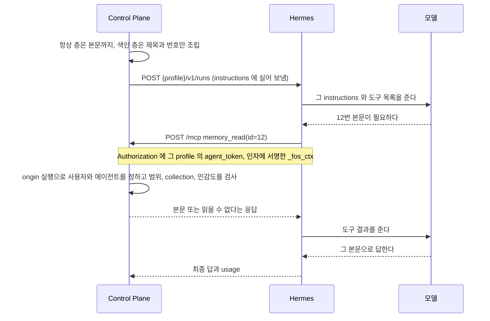
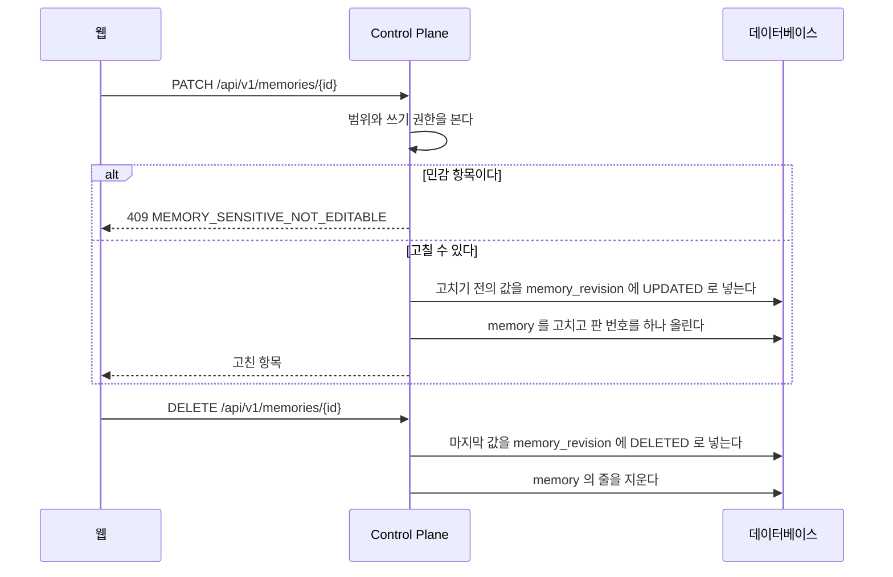
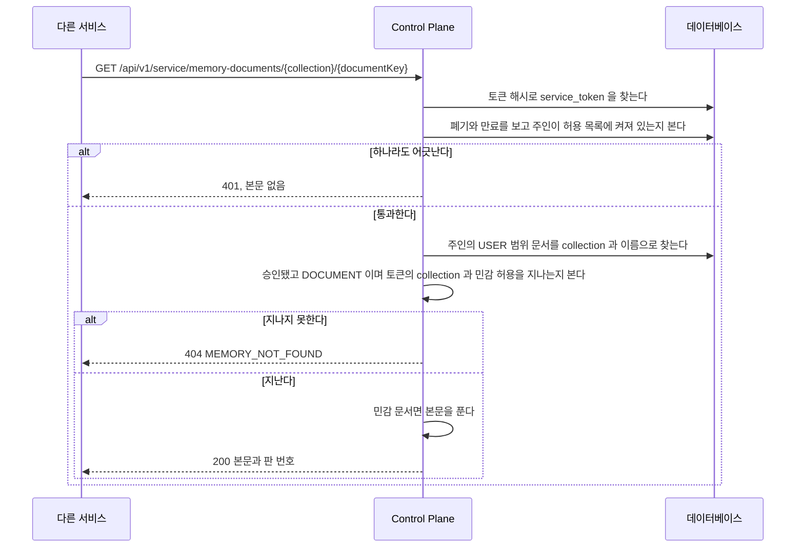

# Memory

Memory 는 에이전트가 실행할 때 `instructions` 로 받는 사실이다.
단일 소스는 Control Plane 데이터베이스이고, Hermes 의 내장 memory 는 쓰지 않는다.
이 파일은 Memory 의 범위와 승인, 실행에 실을 항목을 고르고 조립하는 규칙, 색인의 본문을 `memory_read` 로 읽는 길을 갖는다.

## 범위와 조립

- 범위는 `USER` 와 `GROUP` 둘뿐이고 등록할 때 반드시 명시한다.
- 에이전트가 제안하면 `PROPOSED` 로 들어오고, 사람이 받아들여야 `ACCEPTED` 가 된다.
  주입되는 것은 `ACCEPTED` 뿐이다.
- 항목은 collection 하나에 속한다. 지금 화면과 제안이 만드는 항목은 모두 `core` 다.
- `ContextAssembler.assemble(user, agentId)` 가 요청자의 `USER` 항목과 요청자가 속한 그룹의 `GROUP` 항목 가운데 그 에이전트가 받는 collection 의 항목만 골라 조립한다.
  다른 사용자의 개인 항목과 받지 않는 collection 의 항목은 고르는 단계에서 빠진다.
- 본문까지 싣는 항상 층과 제목만 싣는 색인 층으로 나눈다. `retrieval` 이 `ALWAYS` 면 항상 층에 본문을 싣고, `SEARCH` 면 제목과 번호만 색인에 싣는다. `ARCHIVE` 와 종류가 `SOURCE` 인 항목은 어느 층에도 싣지 않는다.
- `SENSITIVE` 항목은 `ALWAYS` 로 저장하지 못한다. `MemoryService` 가 `MEMORY_SENSITIVE_ALWAYS` 로 거절한다.
- 색인의 본문은 `memory_read` MCP 도구로 읽는다.
  요청자는 장기 토큰이 아니라 서명한 `_fos_ctx` 로 찾은 origin 실행의 사용자다([`mcp-caller.md`](mcp-caller.md)). 요청 본문은 사용자를 바꾸지 못한다.
  collection 과 민감도는 그 origin 실행의 에이전트로 판정한다.
  Control Plane 은 접근할 수 없는 항목과 없는 항목을 같은 응답으로 숨긴다. 받지 않는 collection 의 항목과 허용받지 않은 민감 항목도 같은 응답이다.
- 민감 항목의 본문은 `memory.content` 와 `memory_revision.content` 에 암호문으로 저장한다. `content_key_id` 가 key 를 적는다.
- 본문을 밖으로 내는 자리는 `MemoryService.contentOf` 를 거친다. Memory 목록은 민감 본문을 싣지 않는다.
  `ContextAssembler` 는 본문을 풀지 않으므로 암호문인 줄을 항상 층에서 건너뛴다. 민감 항목은 `ALWAYS` 가 되지 못하므로 정상 경로에서는 그런 줄이 없다.
- 민감 항목은 `PATCH /api/v1/memories/{id}` 로 고치지 못한다. 목록이 본문을 싣지 않아 그 요청이 본문을 읽지 않은 채 덮어쓰기 때문이다. `MEMORY_SENSITIVE_NOT_EDITABLE` 로 거절한다.
- 일반 항목을 민감 항목으로 바꾸면 물러나는 판과 그 항목에 평문으로 남은 앞선 판을 같은 트랜잭션에서 함께 암호화한다.
- key 가 없으면 민감 항목의 저장과 수정, 암호화한 줄의 읽기를 `MEMORY_ENCRYPTION_UNAVAILABLE` 로 거절한다. 평문으로 내려 저장하지 않는다.
- 기동할 때 `MemoryContentBackfill` 이 평문으로 남은 민감 줄을 암호화한다. 줄마다 쓰기 잠금으로 다시 읽어 그 줄의 트랜잭션에서 고친다. 실패해도 기동은 잇고 예외 클래스 이름만 로그에 남긴다.
- 문서(`DOCUMENT`)는 사용자가 직접 쓰고 고친다. 곧 `ACCEPTED` 이고 꺼내는 방식은 `SEARCH` 다.
  Memory 목록(`GET /api/v1/memories`)은 종류가 `MEMORY` 인 줄만 내고, `PATCH /api/v1/memories/{id}` 와 승인과 거절은 문서에 `MEMORY_NOT_FOUND` 로 답한다.
  문서는 `/api/v1/memory-documents` 가 따로 다룬다. 고칠 때 화면이 읽은 판 번호를 함께 보내고, 지금 판과 다르면 `MEMORY_REVISION_CONFLICT` 로 거절한다([ADR-057](../adr/ADR-057-문서는-사람이-화면에서-직접-쓰고-고친다.md)).
- 서비스 토큰은 만료가 필수이고(1일에서 365일), 주인이 허용 목록에 켜져 있을 때만 통한다.
  인증마다 `shared.auth.UserAccessPolicy` 로 묻고 `people.application.AllowedUserAccessPolicy` 가 로그인 판정과 같은 답을 낸다.
  관리자가 사용자를 끄면 `PeopleAdminController` 가 `shared.auth.UserAccessRevoked` 를 내고 `ServiceTokenService` 가 그 사용자의 토큰을 모두 폐기한다.
  `memory` 가 `people` 을 import 하지 않게 하려고 두 타입을 `shared.auth` 에 둔다.
- 다른 서비스는 서비스 토큰으로 `GET /api/v1/service/memory-documents/{collection}/{documentKey}` 를 부른다.
  요청자는 토큰이 묶인 사용자이고, 판정은 「에이전트의 실행에 보이는 항목」 의 세 조건과 같다. collection 과 민감 허용은 `service_token_collection` 이 정한다.
  이 경로의 인증은 `memory.presentation.ServiceTokenInterceptor` 가 한다. `SecurityConfig` 는 그 경로를 `permitAll` 로 열고 `ControlPlaneJwtFilter` 는 건너뛴다. `shared` 가 `memory` 를 쓰지 않게 하기 위해서다.
- 본문이나 `retrieval` 이나 `sensitivity` 를 고치면 고치기 전의 값을 `memory_revision` 에 남기고 판 번호를 올린다. 지울 때도 마지막 값을 남긴다.
- 공통 답변 지침과 Memory를 합친 글자 수를 실행의 `context_chars`에 남긴다.
  `instructions_hash`도 이 문자열을 대상으로 하며, turn 전용 지시는 제외한다.
  Memory가 없어도 공통 지침의 길이와 지문이 남으므로 Memory 주입 여부는 지문만으로 판단하지 않는다.
- 조립한 Memory 문맥은 8,000자로 제한한다. 항목 하나가 남은 자리에 들어가지 않으면 그 항목만 빼고 다음 항목과 색인을 계속 담는다.
  넘친 항목을 잘라서 싣지는 않는다. 잘린 사실은 틀린 사실이 될 수 있다.
  그래서 한 항목의 본문을 8,000자 가까이 키우지 않고 큰 본문은 색인 층에 둔다.
- 색인 층에 쓸 자리를 먼저 떼어 두고 항상 층을 담는다. 긴 본문이 색인을 밀어내지 못한다.
  몫은 `assistant.context.index-budget-ratio` 가 정하고 기본값은 4 다.
  색인이 빠지면 `memory_read` 로 읽을 번호도 사라져 에이전트가 나머지 Memory 에 닿을 길이 없어진다.
- 빠진 항목 수를 실행의 `context_omitted_items` 에 남기고, `/memory` 목록의 그 항목에 표시를 단다.
  대화 화면에는 끼우지 않는다.

### 에이전트의 실행에 보이는 항목

판정은 세 조건이다. 하나라도 지나지 못한 항목은 그 실행에 없는 항목이다.

| 조건 | 무엇을 본다 | 어디서 정한다 |
| --- | --- | --- |
| 범위 | `USER` 는 주인, `GROUP` 은 같은 그룹 | `memory.scope`, `owner_user_id`, `group_id` |
| collection | 그 에이전트가 받는 collection 인가 | `agent_memory_collection` 의 줄 |
| 민감도 | `SENSITIVE` 면 그 collection 의 `allow_sensitive` 가 참인가 | `agent_memory_collection.allow_sensitive` |

- 줄이 하나도 없는 에이전트, 찾지 못한 에이전트, 에이전트가 없는 실행, 커넥터 에이전트는 아무것도 받지 않는다. 커넥터 에이전트의 실행은 Memory 문맥을 조립하지 않는다([ADR-045](../adr/ADR-045-커넥터-에이전트는-자기-mcp-서버만-받고-memory-와-control-plane-도구를-받지-않는다.md)).
- 에이전트를 처음 저장하면 `AgentRepository` 의 저장이 `AgentCreated` 사건을 내고, `AgentMemoryCollectionService` 가 그것을 받아 `core` 한 줄을 넣는다.
  에이전트를 만드는 경로가 셋(첫 로그인, 사용자가 만들기, 관리자 등록)이라 경로마다 넣지 않고 이 사건 하나로 넣는다. 커넥터 에이전트에는 넣지 않는다.
- 위임받은 에이전트는 자기 허용으로 판정한다. 부르는 쪽의 허용을 물려받지 않는다.
- `ContextAssembler` 는 에이전트를 번호로 받는다. `context` 패키지가 `agent` 를 쓰면 패키지 순환이 하나 늘기 때문이다. 번호로 에이전트를 읽는 것은 이미 `agent` 를 쓰는 `memory` 가 한다.
- `/memory` 목록의 빠짐 표시는 에이전트를 모르는 채 판정한다. `ContextAssembler.assembleForOwner` 가 collection 을 거르지 않고 조립한 결과를 쓴다.

| 클래스 | 하는 일 |
| --- | --- |
| `memory.application.MemoryService` | 읽기와 쓰기, 판 기록, 세 조건의 판정. `accessOf(agentId)` 가 그 에이전트의 `MemoryAccess` 를 낸다 |
| `memory.application.MemoryContentCipher` | 민감 본문 하나를 AES-256-GCM 으로 암호화하고 푼다. key 가 없으면 암호화를 거절한다 |
| `memory.application.MemoryContentBackfill` | 기동할 때 평문으로 남은 민감 줄을 찾는다. 실패해도 기동을 막지 않는다 |
| `memory.application.MemoryContentSealer` | 줄 하나를 쓰기 잠금으로 다시 읽어 암호화한다. 줄마다 트랜잭션 하나다 |
| `memory.application.model.MemoryAccess` | 한 실행이 받는 collection 과 민감 허용 |
| `memory.infra.MemoryQueries` | 볼 수 있는 항목과 실행에 실을 항목을 고르는 조건. 모두 읽어 온 뒤 거르지 않고 데이터베이스가 고른다. 검색을 붙일 때도 이 조건 뒤에 붙인다 |
| `memory.application.MemoryCollectionService` | 그룹의 collection 목록. 줄이 없는 그룹이면 기본 일곱 개를 넣는다 |
| `memory.application.ServiceTokenService` | 서비스 토큰의 발급과 폐기, 원문으로 요청자 증명, 사용자를 끈 사건을 받아 토큰 폐기 |
| `memory.presentation.ServiceTokenInterceptor` | `/api/v1/service/**` 의 인증. 증명한 요청자를 요청 속성에 둔다 |
| `memory.presentation.MemoryDocumentController` | 사용자가 문서를 만들고 읽고 고치는 API 와 collection 목록 |
| `memory.presentation.MemoryDocumentServiceController` | 서비스 토큰으로 문서 하나를 읽는 API |
| `agent.application.AgentMemoryCollectionService` | 에이전트가 받는 collection 읽기, 새 에이전트에 `core` 넣기 |

근거는 [`adr/ADR-052-memory-는-collection-종류-꺼내는-방식-민감도-판-출처를-가진다.md`](../adr/ADR-052-memory-는-collection-종류-꺼내는-방식-민감도-판-출처를-가진다.md) 와
[`adr/ADR-053-에이전트는-허용된-collection-의-memory-만-받는다.md`](../adr/ADR-053-에이전트는-허용된-collection-의-memory-만-받는다.md) 와
[`adr/ADR-055-민감-memory-본문은-저장할-때-암호화하고-key-는-환경-변수로-받는다.md`](../adr/ADR-055-민감-memory-본문은-저장할-때-암호화하고-key-는-환경-변수로-받는다.md) 와
[`adr/ADR-056-다른-서비스는-사용자에-묶인-서비스-토큰으로-문서를-읽기만-한다.md`](../adr/ADR-056-다른-서비스는-사용자에-묶인-서비스-토큰으로-문서를-읽기만-한다.md) 와
[`adr/ADR-057-문서는-사람이-화면에서-직접-쓰고-고친다.md`](../adr/ADR-057-문서는-사람이-화면에서-직접-쓰고-고친다.md) 에 있다.

## Memory 본문을 읽는 길

대화 한 번에 Memory 를 전부 싣지 않는다. 층을 나누는 규칙은 위 「범위와 조립」 이 갖는다.

색인에 실린 항목의 본문이 필요해지면 에이전트가 도구로 읽는다.
**그때 요청이 Hermes 에서 Control Plane 으로 거꾸로 온다.**

**요청 본문에는 항목 번호만 있고 사용자가 없다.**
사용자는 [`mcp-caller.md`](mcp-caller.md#mcp-호출의-요청자를-정할-때) 의 「MCP 호출의 요청자를 정할 때」 의 길로 origin 실행에서 정한다.
모델이 만든 JSON 에 사용자를 넣게 하면 모델이 남의 Memory 를 읽을 수 있다.

볼 수 없는 항목과 없는 항목은 **같은 응답**으로 답한다.
다르게 답하면 그 항목이 있다는 사실 자체가 새어 나간다.

### 본문 읽기가 갈리는 지점

| 무엇이 | 어떻게 되는가 |
| --- | --- |
| 남의 개인 항목, 다른 그룹의 항목, 없는 번호 | 읽을 수 없다는 같은 응답이다 |
| origin 실행의 에이전트가 받지 않는 collection 의 항목 | 같은 응답이다. 색인에도 없던 번호다 |
| `SENSITIVE` 항목이고 그 collection 에서 민감 항목을 허용받지 않았다 | 같은 응답이다 |
| 승인 전인 항목, 항상 층에 이미 실린 항목, 보관한 항목, 출처 원문 | 같은 응답이다 |
| origin 실행에 에이전트가 없거나 그 에이전트를 찾지 못한다 | 같은 응답이다. 받는 collection 이 없다 |
| origin 실행의 에이전트가 커넥터 에이전트다 | 요청자 판정에서 먼저 거절한다. 호출 맥락을 확인할 수 없다는 응답이다([ADR-045](../adr/ADR-045-커넥터-에이전트는-자기-mcp-서버만-받고-memory-와-control-plane-도구를-받지-않는다.md)) |
| 위임받아 도는 에이전트가 읽는다 | 그 에이전트의 허용으로 판정한다. 부르는 쪽의 허용을 물려받지 않는다 |

근거는 [ADR-053](../adr/ADR-053-에이전트는-허용된-collection-의-memory-만-받는다.md) 에 있다.

### Memory 를 고치고 지울 때

판을 남기는 것과 항목을 고치는 것은 한 트랜잭션이다. 한쪽만 남지 않는다.
거절한 수정은 판을 남기지 않는다.
`MEMORY_SENSITIVE_ALWAYS` 는 민감 항목을 항상 싣게 만들거나 바꾸려 할 때의 거절이다. 이 경로는 민감도를 바꾸지 못하므로 여기서는 나오지 않는다.
민감 항목은 이 경로로 고치지 못한다. 목록이 민감 본문을 싣지 않아 화면이 본문을 읽지 않은 채 덮어쓰게 되기 때문이다([ADR-055](../adr/ADR-055-민감-memory-본문은-저장할-때-암호화하고-key-는-환경-변수로-받는다.md)).
민감도를 일반에서 민감으로 바꾸는 수정은 물러나는 판과 앞선 평문 판을 같은 트랜잭션에서 암호화한다. key 가 없으면 아무것도 바뀌지 않는다.
지금 화면의 수정이 항상 싣는 설정을 끄면 색인으로 간다. 이미 보관한 항목은 보관한 채로 둔다.

### 다른 서비스가 문서를 읽을 때

토큰이 없거나 `Origin` 머리말이 있는 요청은 데이터베이스를 읽기 전에 거절한다.

#### 서비스 읽기가 갈리는 지점

| 응답 | 언제 |
| --- | --- |
| 200 `{collection, documentKey, title, content, revision, updatedAt}` | 읽을 수 있다. `content` 는 평문이고 `revision` 은 지금 값의 판 번호다. `Cache-Control: no-store` 를 붙이고 `X-Service-Token-Expires-At` 머리말에 만료 시각을 적는다 |
| 401, 본문 없음 | 토큰이 없다, 틀렸다, 폐기됐다, 만료됐다, 주인이 허용 목록에서 꺼졌다. 다섯을 구분하지 않는다 |
| 403, 본문 없음 | `Origin` 머리말이 있다. 브라우저에서 부르는 길이 아니다 |
| 404 `MEMORY_NOT_FOUND` | 그 이름의 문서가 없다, 토큰이 그 collection 을 받지 않는다, 민감 문서인데 그 collection 의 민감 허용이 없다, 승인 전이다, `DOCUMENT` 가 아니다. 모두 같은 응답이다 |
| 409 `MEMORY_ENCRYPTION_UNAVAILABLE` | 읽을 수 있는 민감 문서인데 그 key 가 없다([ADR-055](../adr/ADR-055-민감-memory-본문은-저장할-때-암호화하고-key-는-환경-변수로-받는다.md)) |

관리자가 허용 목록에서 사용자를 끄면 그 사람의 서비스 토큰을 모두 폐기한다. 다시 켜도 되살아나지 않는다([ADR-056](../adr/ADR-056-다른-서비스는-사용자에-묶인-서비스-토큰으로-문서를-읽기만-한다.md)).
이 경로는 서비스 토큰으로 쓰지 못한다. 다른 사용자의 문서와 `GROUP` 문서도 읽지 못한다.
토큰의 원문과 해시, 문서의 본문은 로그에 남기지 않는다. 로그에는 사용자 번호, 토큰 번호, collection, 문서 이름, 판 번호만 적는다.

### 이 왕복은 비싸다

도구로 본문을 읽은 턴은 Hermes 가 API 콜을 한 번에서 두 번이나 세 번으로 늘려 입력 비용이 커진다.
측정값과, 항상 층과 도구 가운데 어느 쪽이 싼지의 손익분기는 [`mcp-caller.md`](mcp-caller.md#입력-비용은-api-콜-수가-정한다) 의 「입력 비용은 API 콜 수가 정한다」 가 갖는다.
