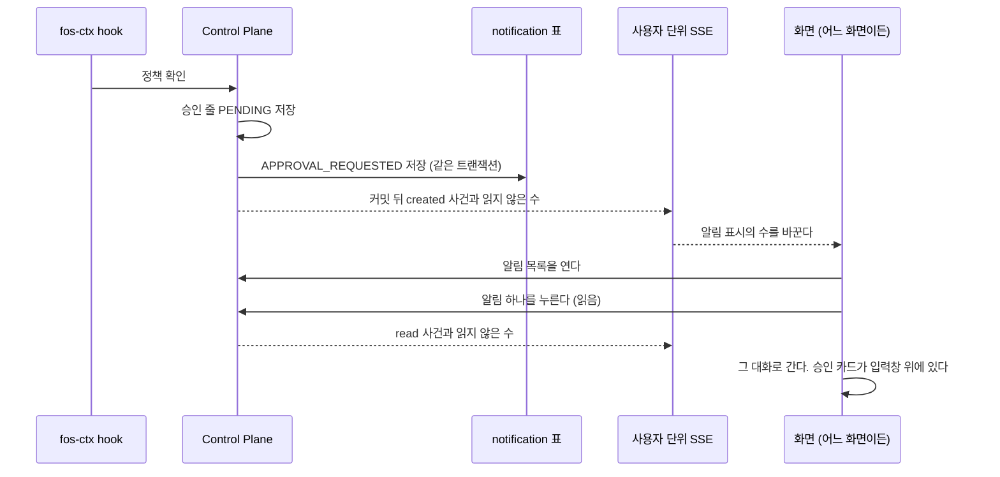

# 알림

사용자에게 대화 밖에서 알리는 일을 갖는다. 무엇을 알리는지, 언제 만드는지, 화면이 어떻게 받는지다.
근거와 서버 한 대 전제는 [ADR-070](../adr/ADR-070-알림은-control-plane-의-notification-표가-원장이고-웹은-사용자-단위-SSE-로-받는다.md) 이 갖는다.
칸은 [`schema/notification.md`](schema/notification.md) 가, 보관 기간과 SSE 간격은 `NotificationProperties` 가 갖는다.

이 문서에서 「알림」 은 `notification` 표의 줄이다. 대화 안에 끼우는 안내 줄(`SYSTEM` 메시지)은 「알림 줄」 이라 부르고 둘을 섞지 않는다.

## 알림 종류

종류의 값은 `NotificationKind` 가, 누르면 갈 곳의 값은 `NotificationTargetType` 이 갖는다. 제목과 본문 글은 그 알림을 만드는 클래스가 갖는다.

| 원인 | 받는 사람 | 누르면 |
| --- | --- | --- |
| 커넥터 호출이 새 승인 줄을 만들었거나, 그 줄이 승인 기한 안에 답을 받지 못해 만료됐다 | 승인 줄의 주인(`connector_action.user_id`) | 그 요청이 나온 대화 |
| 도구 사용 요청이 새로 저장됐다 | 같은 그룹의 차단되지 않은 관리자들 | 관리자 에이전트 상세의 요청 |
| 도구 사용 요청이 승인, 거절, 만료로 끝났다 | 원래 요청자 | 요청자의 결과 화면 |
| 예약 작업의 발화가 끝났다 | 작업 주인 | [`task.md`](task.md) 의 「알림」 이 갖는다 |

승인 알림의 본문은 승인 카드와 대화의 알림 줄이 쓰는 도구 제목과 같다. 도구의 원래 이름은 내부 값이라 쓰지 않는다.
제목과 본문은 칸 길이를 넘으면 잘라 저장한다. 선언의 도구 제목에는 길이 상한이 없다.

**알림을 만들지 않는 경우가 있다.**

- 대화가 없는 실행이 만든 승인 줄과, 대화가 지워졌거나 찾지 못한 승인 줄. 승인 카드가 뜰 곳이 없어 눌러도 갈 곳이 없다
- 같은 실행이 같은 도구를 같은 인자로 다시 불러 앞선 승인 줄을 돌려받을 때. 새 승인 줄이 생길 때만 만든다
- 중복된 도구 사용 요청, 끝난 요청을 다시 결정할 때, 요청자가 취소할 때

**알림과 그 원인은 한 트랜잭션이다.** 승인 줄을 저장하는 트랜잭션, 만료로 바꾸는 트랜잭션, 도구 사용 요청을 저장하거나 결정하는 트랜잭션 안에서 알림을 만든다.
그 트랜잭션이 끝난 뒤에 사용자 단위 SSE 로 알린다. 화면이 사건을 받고 다시 읽을 때 줄이 있어야 한다.

도구 사용 요청의 상태와 권한은 [`agent.md`](agent.md) 의 「도구 사용 요청」 이 갖는다.
아직 만들지 않은 종류는 [`../code-architecture.md`](../code-architecture.md) 의 「아직 만들지 않은 것」 이 갖는다.

## 흐름

### 갈리는 지점

| 상황 | 처리 |
| --- | --- |
| 화면이 하나도 열려 있지 않다 | 사건은 받는 쪽이 없어 버린다. 줄은 남아 다음에 화면을 열면 읽지 않은 수로 보인다 |
| 같은 사용자에게 두 알림이 동시에 커밋된다 | 사건의 읽지 않은 수는 커밋 뒤에 새로 센 값이다. 나중에 커밋된 쪽이 두 줄을 모두 센다. 두 사건이 보내지는 차례는 정해져 있지 않아 먼저 센 작은 수가 늦게 도착할 수 있다. 어긋나면 다음 사건이나 다시 연결할 때 맞는다 |
| 같은 사용자가 창을 여럿 열었다 | 창마다 구독이 하나다. 모든 창이 같은 사건을 받는다. 한 창에서 읽으면 다른 창의 수도 줄어든다 |
| SSE 가 끊겼다 | 화면이 잠시 뒤 읽지 않은 수를 다시 읽고 SSE 를 다시 연다. 연결이 열리면 수를 한 번 더 읽는다. 수를 먼저 읽어야 늦게 온 읽기 응답이 새 사건의 수를 덮어쓰지 않고, 연결이 선 뒤 다시 읽어야 첫 읽기와 연결 사이에 커밋된 알림을 놓치지 않는다. 연결 뒤의 읽기 중에 사건이 오면 그 늦은 응답은 버린다. 끊긴 동안의 사건은 다시 보내지 않는다 |
| 알림 화면을 연 채 SSE 가 끊긴 사이 새 알림이 한 쪽보다 많이 생겼다 | 다시 읽은 첫 쪽을 기존 목록 앞에 합치므로 그 사이의 알림이 목록에 빠질 수 있다. 줄은 남아 있어 화면을 다시 열면 보인다 |
| 알림 저장이 실패한다 | 원인의 저장(승인 줄, 만료)도 되돌린다. 승인 줄은 hook 의 다음 호출에서, 만료는 다음 만료 정리에서 다시 시도된다 |
| 이미 읽은 알림을 다시 읽음으로 표시한다 | 바꾸지 않고 그 줄을 돌려준다. 오류가 아니다 |
| 남의 알림이나 없는 알림을 읽음으로 표시한다 | 같은 404 `NOTIFICATION_NOT_FOUND` 다 |
| 누른 알림의 대화를 지웠다 | 그 대화 화면이 없는 대화를 보이는 방식 그대로다. 알림은 읽음이 된다 |
| 승인 요청 알림을 눌렀는데 이미 승인했거나 만료됐다 | 대화의 승인 카드 자리가 지금 상태를 보인다. 알림은 상태를 따라 바꾸지 않는다 |

## API

로그인한 사용자 자신의 알림만 다룬다. 요청 본문이 받는 사람을 정하지 못한다.
경로와 응답 칸은 `NotificationController` 와 `NotificationDtos` 가, SSE 사건의 종류와 칸은 `NotificationEvent` 가 갖는다.

**사건은 본문을 싣지 않는다.** 다시 읽으라는 신호와 읽지 않은 수만 싣는다.
화면은 사건을 받으면 수를 바꾸고, 목록을 보고 있으면 첫 쪽을 다시 읽는다.

## 화면

| 자리 | 무엇 |
| --- | --- |
| 사이드바 맨 아래 줄, 밝기 단추 옆 | 알림 단추. 읽지 않은 알림이 있으면 수를 배지로 보인다. 99 를 넘으면 「99+」 다. 누르면 `/notifications` 로 간다 |
| 좁은 화면의 머리, 「새 대화」 옆 | 같은 알림 단추 |
| `/notifications` | 알림 목록. 화면이 열린 뒤 브라우저가 첫 쪽을 읽는다. 읽지 않은 줄을 표시하고, 위에 「모두 읽음」 이 있다. 줄을 누르면 읽음으로 표시한 뒤 갈 곳으로 간다. 갈 곳이 없는 줄은 읽음만 표시한다 |
| 알림이 없을 때 | 「아직 알림이 없어요.」 |

관리자 영역의 틀에는 알림 단추를 두지 않는다. 사이드바가 있는 화면에만 둔다.
