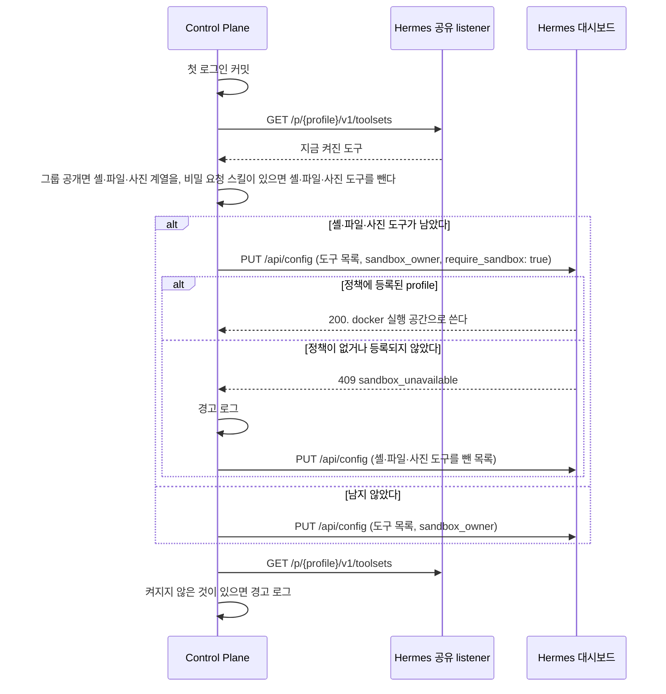
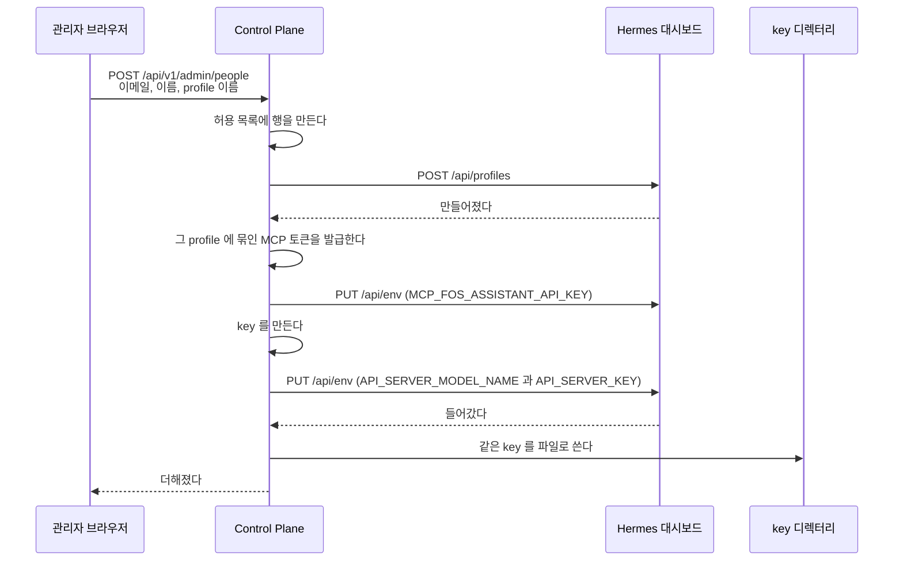
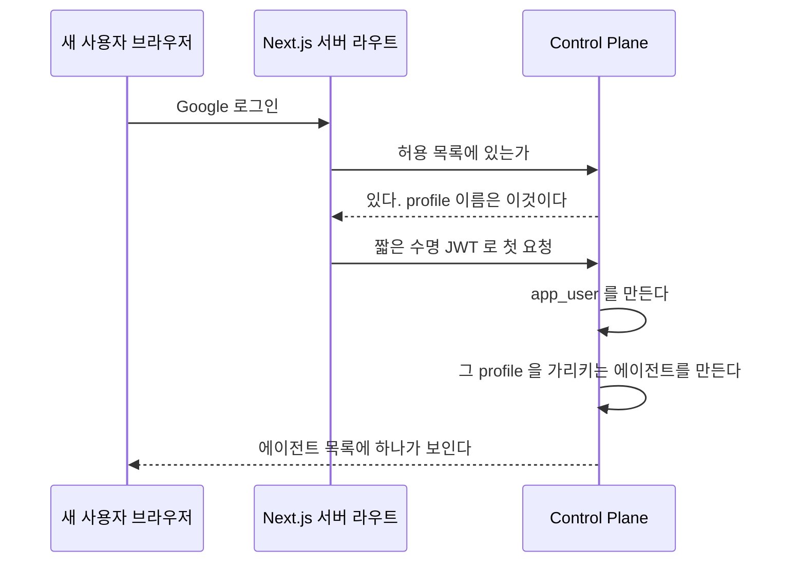
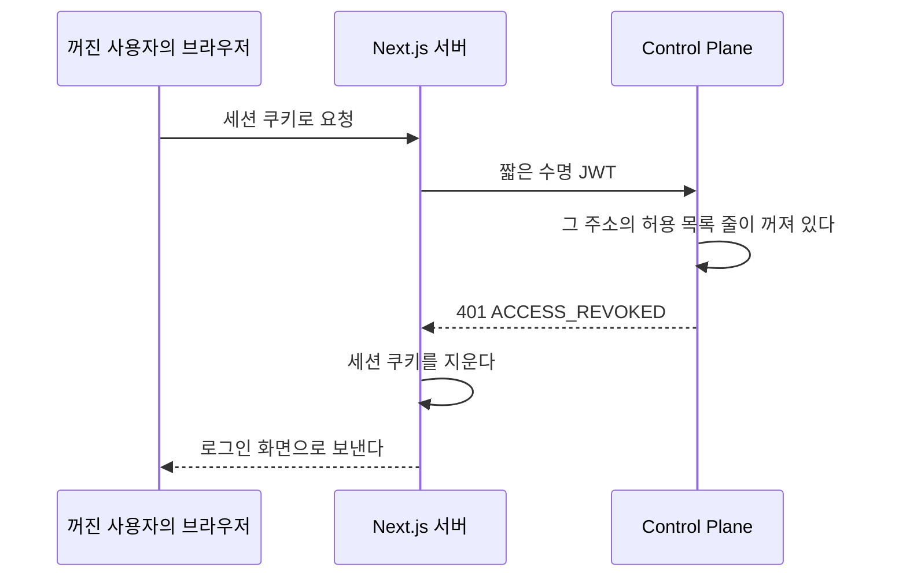

# 사용자를 더할 때

**관리자가 화면에서 한 번 더하면 끝난다.** 홈서버에 들어가지 않는다.
이 파일은 관리자가 사용자를 더할 때 Control Plane 이 Hermes profile 과 key 를 만드는 순서와, 그 사용자가 처음 로그인할 때 일어나는 일을 갖는다.

| 누가 | 무엇을 |
| --- | --- |
| 관리자 | 관리 화면에서 이메일과 이름과 profile 이름을 적는다 |
| Control Plane | 허용 목록에 넣고, Hermes profile 을 만들고, key 와 그 profile 에 묶인 MCP 토큰을 넣는다. 만들기 경로가 에이전트 만들기와 같아 MCP 등록과 서명 plugin 도 함께 붙는다 |
| 그 사람 | 로그인한다. 그때 `app_user` 와 에이전트가 생긴다 |

Google 동의 화면의 테스트 사용자에 주소를 더하는 것만 사람이 따로 한다.
그 화면은 Google 계정 소유자만 고칠 수 있다.

순서와 어긋나는 지점은 아래 「사람을 더할 때」 가 갖는다.
profile 을 사람마다 나누는 근거는
[`adr/ADR-002-profile은-나누고-ai-계정은-가족이-함께-쓴다.md`](../adr/ADR-002-profile은-나누고-ai-계정은-가족이-함께-쓴다.md) 에 있다.
Control Plane 이 Hermes 를 고치는 호출을 하게 된 근거는
[`adr/ADR-018-사람을-더하는-것을-control-plane-이-끝낸다.md`](../adr/ADR-018-사람을-더하는-것을-control-plane-이-끝낸다.md) 에 있다.

## 어느 패키지가 무엇을 하나

| 패키지 | 맡는 것 |
| --- | --- |
| `people` | 허용 목록, 사람을 더하는 흐름 전체의 조립, 첫 로그인에 그 사람의 에이전트 만들기(`FirstAgentCreator`) |
| `hermes` | 대시보드 호출과 key 파일 쓰기 |
| `user` | 첫 로그인에 사용자를 만들고 `FirstSignInListener` 를 같은 트랜잭션에서 부른다 |
| `agent` | 첫 로그인이 쓰는 에이전트 등록 경로 |

**`people` 이 순서를 안다.** 허용 목록에 넣고 profile 을 만들고 key 를 넣는 차례와,
중간에 실패했을 때 되돌리는 역순이 그 패키지 하나에 있다.
`hermes` 는 부르는 방법만 알고 순서를 모른다.
검사: `ArchitectureRules.HERMES_DOES_NOT_DEPEND_ON_PEOPLE`

## 첫 에이전트의 과금 설정

첫 로그인에 만드는 에이전트의 `cost_mode` 와 `credential_scope` 를 설정에서 읽는다.

| 설정 | 기본값 |
| --- | --- |
| `assistant.people.default-cost-mode` | `SUBSCRIPTION` |
| `assistant.people.default-credential-scope` | `SHARED_HOUSEHOLD` |

설정 이름은 `assistant.people.*` 그대로이고, 값을 읽는 `PeopleProperties` 는 `agent.application` 이 갖는다.
`people` 의 `FirstAgentCreator` 와 `agent` 의 `AgentLifecycleService` 가 읽는다.
`agent` 가 `people` 을 import 하지 않게 하려고 `agent` 로 옮겼다(ADR-068).
Hermes 를 부르는 값이 아니라 `hermes` 쪽에 두지 않는다.

두 값이 사람마다 다르지 않은 근거는
[`adr/ADR-002-profile은-나누고-ai-계정은-가족이-함께-쓴다.md`](../adr/ADR-002-profile은-나누고-ai-계정은-가족이-함께-쓴다.md) 에 있다.
profile 은 사용자마다 나누고 AI 계정은 그룹이 함께 쓴다.

에이전트는 실행에 쓸 모델을 갖지 않는다.
첫 로그인에 에이전트를 만들 때도 Hermes 에서 모델을 읽지 않는다.

## 첫 에이전트의 기본 도구

첫 로그인에 만든 에이전트에 `assistant.people.default-toolsets` 의 도구를 켠다.
기본값은 `web`, `terminal`, `file`, `code_execution` 이다. 주인 등급이거나 실행 공간에서만 도는 도구가 아니면 기동하지 않는다.
결정과 감당할 것은 [ADR-20261008 / default-toolsets](../adr/ADR-20261008-default-toolsets.md) 가 갖는다.

`FirstAgentCreator` 가 첫 로그인의 트랜잭션이 커밋된 뒤 백그라운드 작업(`BackgroundTasks`)으로 `agent` 의 `AgentDefaultToolsets` 를 부른다.
첫 요청은 Hermes 호출을 기다리지 않는다.
실행 공간 주인 키 `u<사용자 번호>` 가 이때 처음 생기므로 profile 을 만들 때 켜지 않는다.
로그인이 되돌려지면 부르지 않는다.

| 무엇 | 어떻게 되나 |
| --- | --- |
| 설정이 빈 목록이다 | Hermes 를 부르지 않는다 |
| 기본 도구가 이미 다 켜져 있다 | 쓰지 않는다 |
| profile 이 실행 공간 정책에 없다 | 셸·파일·사진 도구를 빼고 web 만 더한다. 경고 로그를 남긴다. 운영이 정책에 등록한 뒤 관리자가 에이전트 도구 화면에서 켠다 |
| 정책에 없는데 셸 계열이 이미 켜져 있다 | 쓰지 않는다. 그 쓰기가 셸을 local 로 확정하기 때문이다. 경고 로그를 남긴다 |
| Hermes 가 답하지 않거나 다른 오류로 거절한다 | 경고 로그만 남긴다. 로그인은 그대로 끝난다 |
| 옛 plugin 이 `require_sandbox` 를 몰라 400 으로 거절한다 | 같다. 아무 도구도 켜지 않는다. plugin 을 먼저 배포한다 |

켠 도구는 관리자 등급 그대로다. 주인은 셸 계열을 끄지 못하고 관리자가 끈다.

## key 를 두 곳에 같이 쓴다

같은 값을 Hermes 의 `.env` 와 우리 key 디렉터리에 각각 쓴다.
한쪽만 들어가면 실행할 때 401 이 난다.

`HermesProfileKeyStore` 가 key 파일의 읽기, 쓰기, 지우기를 모두 갖는다.
**읽는 규칙과 쓰는 규칙이 같은 파일에 있어야 파일 이름 규칙이 갈리지 않는다.**

## 사람을 더할 때

두 시점에 나뉘어 일어난다.
**관리자가 더할 때 Hermes 쪽이 끝나고, 그 사람이 처음 로그인할 때 우리 쪽이 끝난다.**

한 시점에 몰지 않는 이유는 하나다.
자기 profile 만 쓰는 에이전트는 주인이 있어야 하고,
주인은 그 사람이 로그인하기 전에는 존재하지 않는다.

### 관리자가 더할 때

`clone_from` 을 쓰지 않는다.
그 값을 주면 본뜬 profile 의 `API_SERVER_KEY` 까지 복사되어
key 하나로 두 profile 이 열린다. 실측으로 확인했다.

### 그 사람이 처음 로그인할 때

에이전트는 자기만 보는 것으로 만들고 주인을 그 사람으로 둔다.
`API_SERVER_KEY` 를 파일에서 찾는 규칙은 바뀌지 않는다. profile 이름으로 찾는다.

### 어긋나는 지점

| 무엇 | 어떻게 되나 |
| --- | --- |
| 이미 있는 이메일 | 거절한다. 허용 목록의 이메일은 하나뿐이다 |
| 이미 있는 profile 이름 | 거절한다. 우리 표에서도 Hermes 에서도 본다 |
| profile 은 만들었는데 토큰이나 key 주입이 실패 | **발급한 토큰을 폐기하고 만든 profile 을 지운다.** 아무것도 남기지 않는다 |
| key 파일 쓰기가 실패 | 같다. profile 을 지우고 허용 목록 행도 되돌린다 |
| Hermes 가 응답하지 않는다 | 허용 목록 행을 만든 뒤에 Hermes 를 부르므로 만든 행을 되돌린다. 되돌리기가 실패하면 행이 남고, 원래 오류를 올린 뒤 되돌리기 실패를 로그에 남긴다 |
| 같은 요청이 두 번 온다 | 뒤의 것이 이메일 유니크 제약에 걸려 거절된다 |
| 허용 목록에 없는 사람이 로그인 | 로그인을 거절하고 토큰을 만들지 않는다 |
| 허용 목록에는 있는데 profile 이 없어졌다 | 실행할 때 key 를 찾지 못해 실패한다. 관리자가 다시 더한다 |
| 첫 로그인에 Hermes 가 답하지 않는다 | 첫 로그인은 모델을 읽지 않고 에이전트를 만든다. 기본 도구는 커밋 뒤에 켜고 실패해도 로그만 남기므로 로그인도 에이전트 생성도 막히지 않는다 |

에이전트를 만드는 것은 `app_user` 를 새로 저장하는 그 순간뿐이다.
허용 목록에서 그 사람을 찾지 못해 에이전트 없이 들어온 사람은 관리자가 기존 에이전트 등록 화면에서 만든다.
그 사람의 `app_user` 가 이미 있어 주인을 지정할 수 있다.
**다시 시도하는 것을 요청 경로에 두지 않는다.**
로그인 판정이 매 요청 도는 자리라, 거기서 에이전트가 있는지 다시 보지 않는다.

**되돌리는 순서가 만드는 순서의 역순이다.**
Hermes 쪽을 먼저 지우고 우리 표를 나중에 지운다.
반대로 하면 우리 표에 없는 profile 이 Hermes 에 남는다.

### 관리자가 아닌 사람

사람을 더하는 화면은 `ADMIN` 만 연다.
`MEMBER` 는 그 화면도 그 API 도 보지 못한다.

### 관리자에게 보이는 최근 활동

`GET /api/v1/admin/people`과 사용자 추가·변경 응답은 `lastLoginAt`, `lastConversationAt`을 함께 준다.
두 값은 UTC 시각이며 기록이 없으면 `null`이다. 일반 사용자 API에는 넣지 않는다.
기존 `joined`는 `app_user`의 존재 여부이며 첫 로그인 시각이 아니다.

마지막 로그인은 웹의 NextAuth `events.signIn`에서 세션 쿠키를 준비한 뒤
`POST /api/v1/signin/completed`로 기록한다. 요청 본문은 `{ email }`이다.
이 경로는 로그인 판정과 같은 `purpose: signin`의 서버 간 서명 토큰만 받는다.
켜진 허용 목록의 `last_login_at`을 서버 시계로 갱신하고 사용자는 만들지 않는다.
허용되지 않은 주소는 401 `UNAUTHENTICATED`로 거절한다.
`signin/allowed`의 판정, 일반 요청과 세션 갱신은 이 값을 바꾸지 않는다.
동시에 로그인해도 더 오래된 시각으로 되돌아가지 않는다.
관리자가 사용자를 켜거나 끌 때도 그 사이에 기록한 로그인 시각은 유지한다.
기록 요청이 실패하면 웹은 오류를 로그에 남긴다. Auth.js의 이벤트 오류는 로그인을 막지 않는다.
지난 로그인은 복원하지 않으므로 기존 사용자의 값도 다음 로그인 전까지 비어 있다.

마지막 대화는 `chat_message`에서 그 사용자가 보낸 `USER` 메시지의 `created_at` 최댓값이다.
대화 소유자가 아닌 `sender_user_id`를 기준으로 하며 답변, 알림 줄과 자동 실행은 세지 않는다.
지운 대화에 남아 있는 사용자 메시지도 기록에 포함한다.
`chat`의 읽기 서비스가 사용자 번호들을 한 번의 집계 질의로 묶고, `people`이 정규화한 이메일로 허용 목록에 맞춘다.
사용자마다 질의하지 않으며 메시지 본문은 관리자 응답에 넣지 않는다.

### 사용자를 껐을 때

관리자가 사용자를 끄면 그 사용자의 다음 요청부터 막힌다.
로그인 판정은 로그인할 때 한 번만 돌고 웹 세션은 그 뒤에도 남으므로, Control Plane 이 웹 토큰을 받는 요청마다 다시 확인한다.
근거는 [`adr/ADR-059-꺼진-사용자는-control-plane-이-요청마다-막고-웹이-세션을-끊는다.md`](../adr/ADR-059-꺼진-사용자는-control-plane-이-요청마다-막고-웹이-세션을-끊는다.md) 에 있다.

| 무엇 | 어떻게 되나 |
| --- | --- |
| 줄이 꺼져 있다 | `ControlPlaneJwtFilter` 가 401 과 `ACCESS_REVOKED` 로 답하고 요청을 컨트롤러로 넘기지 않는다. `app_user` 를 찾지도 만들지도 않는다 |
| 줄이 켜져 있다 | 지금과 같다 |
| 줄이 없다 | 막지 않는다. 화면은 줄을 지우지 않고 끄기만 한다. 줄 없이 생긴 사용자는 첫 관리자와 검사용 사용자다 |
| 서명이 틀렸거나 토큰이 없다 | 지금과 같다. 인증 없이 지나가 Spring Security 가 403 으로 답한다 |
| 이미 열린 SSE 응답과 오래 걸리는 요청 | 끝날 때까지 이어진다. 판정은 요청이 시작될 때 한 번만 한다. 이미 시작한 실행도 멈추지 않는다 |
| 다시 켠다 | 다음 요청부터 통과한다. 세션이 지워진 사용자는 다시 로그인한다 |

`ACCESS_REVOKED` 는 이 판정만 내는 코드다.
세션이 없을 때 웹이 만드는 `UNAUTHENTICATED` 와 달라, 웹이 세션을 지울지 이 코드로 판단한다.

`/mcp` 와 `/internal/hermes/` 아래 경로, 서비스 토큰 경로, 로그인 경로 `/api/v1/signin/allowed`와 `/api/v1/signin/completed`는 이 필터를 지나지 않아 이 판정을 받지 않는다. 두 로그인 경로는 `SignInController`에서 전용 서명 토큰을 직접 검사한다.
서비스 토큰은 주인이 켜져 있는지 따로 확인한다([`memory.md`](memory.md)).

### 아무도 없을 때

허용 목록이 비면 아무도 로그인하지 못한다.
**마이그레이션은 표만 만들고 어떤 주소도 넣지 않는다.** 이 저장소는 공개다.
배포할 때 지금 쓰는 주소를 한 번 넣어야 하고, 그 절차는 비공개 저장소가 소유한다.
데이터베이스를 새로 만들거나 그 표를 비우면 들어갈 길이 사라진다.
그때는 데이터베이스에 직접 행을 넣어야 한다.
