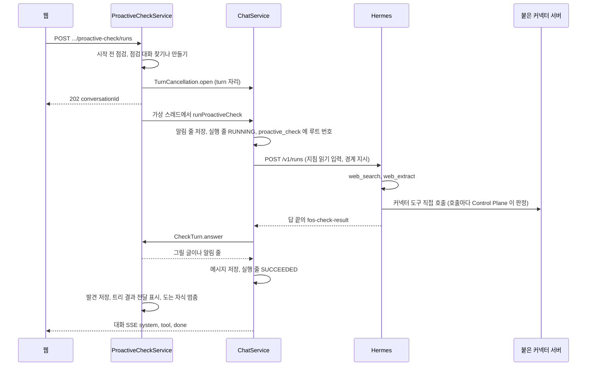

# 먼저 살펴보기

사용자가 묻거나 스킬을 부르지 않아도 에이전트가 사용자의 맥락을 보고 제안이나 질문을 내거나 침묵하는 실행이다.
결정은 [ADR-080](../adr/ADR-080-먼저-살펴보기는-점검-대화의-turn-하나로-돌고-읽기-경계를-control-plane-이-강제한다.md) 과 [ADR-081](../../backend/docs/adr/ADR-081-살펴보기-결과는-답-끝의-구조화-블록으로-받고-control-plane-이-검사해-그린다.md) 에 있다.
저장 모델은 [`schema/proactive.md`](schema/proactive.md) 가 갖는다.

## 용어

| 쓰는 말 | 코드 | 뜻 |
| --- | --- | --- |
| 먼저 살펴보기, 살펴보기 | `proactive_check` | 한 번의 실행. 점검 대화의 turn 하나다 |
| 점검 대화 | `conversation.purpose = CHECK` | 사용자와 에이전트마다 하나를 이어 쓰는 대화. 살펴보기 결과가 여기 남는다 |
| 분야 지침 | 스킬 `proactive-check` | 무엇을 읽고 무엇을 고를지 정하는 그 에이전트의 지침. 분야 패키지가 소유한다 |
| 발견 | `proactive_check_finding` | 결과 블록의 `findings` 하나 |
| 문제 후보 | `proactive_check_problem` | 결과 블록 버전 3의 `problemCandidates` 하나. 발견을 근거로 이 사용자가 풀 가치가 있다고 모델이 본 문제다 |
| 살펴보기 트리 | 루트가 살펴보기 turn 인 실행 트리 | 그 turn 과 그 turn 이 맡긴 자식 실행 |

## 진입점

경로는 `ProactiveCheckController`, `ProactiveScheduleController`, `ProactiveCheckReportController`, `CheckFindingController` 가 갖는다.
`.../proactive-check/loop` 의 조회와 저장은 [매일 루프](proactive-loop.md)의 「사용자 설정」 이 갖는다.

살펴보기 상태 조회와 수동 시작, 일정 켜기는 요청자가 그 에이전트로 대화를 시작할 수 있어야 한다(`AgentService.requireStartable`).
일정 조회와 끄기는 읽기 권한을 확인한다. 보고 열기는 보고 소유권을 확인하며 다른 사용자의 보고는 404 로 답한다.
점검 대화는 요청자의 것만 찾고 만든다. 같은 에이전트를 쓰는 다른 사용자의 점검 대화는 따로다.

상태 조회와 수동 시작은 `ProactiveCheckService` 를, 일정 설정은 `ProactiveScheduleService` 를 부른다.
매일 깨우기는 `ProactiveCheckService.startScheduled` 로 시작하며 `CheckTrigger.SCHEDULED` 를 남긴다.
행동 정책의 자동 실행은 `ProactiveCheckService.startAutonomous` 로 시작하며 `CheckTrigger.AUTONOMY` 를 남긴다. 결과를 사용자에게 바로 알리지 않는다([행동 정책](autonomy-policy.md)의 「자동 실행한 살펴보기의 결과」).
점검 저장과 `task_run.proactive_check_id` 연결은 Hermes 호출 전 같은 짧은 트랜잭션에서 끝낸다. 단추의 시작은 `MANUAL` 이다.

### 매일 깨우기

기본 꺼짐, 일정 저장, 사용자 대화 자리 예비, 놓친 발화, 열지 않은 보고의 건너뛰기, 조용한 시간은 [ADR-085](../adr/ADR-085-매일-깨우기는-예약-작업을-다시-쓰고-다섯-칸-보고를-지금-화면에-올린다.md)가 갖는다.

저장된 일정 조회와 끄기는 Hermes 가용성과 분리한다.
조회 중 Hermes 준비 상태를 확인하지 못하면 저장된 켜짐 여부, 시각, 시간대와 마지막 결과를 그대로 준다.
이때 `schedulingAvailable = false`, `blockers = [READINESS_UNKNOWN]` 이며 실행 가능으로 취급하지 않는다.
끄기 트랜잭션에서는 Hermes 를 호출하지 않고 `PAUSED` 를 커밋한다.
끄기 응답도 준비 조회를 생략하므로 같은 확인 불가 상태를 준다.
화면에서는 확인 불가 사유를 보여 주고 켜기를 막되, 켜져 있는 일정은 끌 수 있다.
다시 켜려면 화면을 새로 열어 준비 상태를 확인한다.
Hermes 가 복구돼도 꺼진 일정은 발화하지 않으며, 이미 대기 중인 발화도 시작 단계에서 작업 상태를 다시 확인한다.

발화 직전에 요청자의 권한, 에이전트 사용 가능 여부, 켜진 도구와 격리 준비를 다시 검사한다.
`terminal`, `file`, `code_execution` 도구가 켜져 있고 `assistant.proactive-check.isolated-execution-enabled` 가 거짓이면 켜기 저장과 발화를 거절한다.
[ADR-086](../adr/ADR-086-셸과-파일-도구는-사용자별-docker-실행-공간에서만-돈다.md)의 사용자별 실행 공간을 운영에서 확인한 뒤에만 이 설정을 켠다.
이미 셸 계열 도구가 켜진 profile 에도 실행 공간 설정을 반영하고 기존 스킬을 점검해야 한다.
이 설정은 전역이다. 일부 profile 만 격리했으면 기본값 `false` 를 유지해 local 에이전트의 깨우기를 열지 않는다.
코드 머지나 실행 공간 환경 값만으로 이 설정을 켜지 않는다. 확인과 설정 변경 절차는 `fos-home-infra` 가 갖는다.
관리자 쓰기 도구 허용만으로 이 제한을 통과하지 못한다.

예약 실행의 정상 `NOTHING_NEW` 는 대화 답과 무소식 알림 줄을 남기지 않는다.
모델이 `FINDINGS` 로 답했어도 검사를 통과한 새 발견이 없고 질문과 출처 장애도 없으면 예약 실행에서는 같은 무소식으로 다룬다.
대화 답과 보고를 남기지 않고, 참고로 내린 발견만 셈을 위해 저장한다. 그래서 이미 알린 발견의 되풀이가 다음 날 깨우기를 `UNREAD_REPORT` 로 막지 않는다.
질문과 출처 장애는 무소식과 구분해 남긴다.

### 시작 응답

| 경우 | 응답 |
| --- | --- |
| 막는 까닭이 있다 | 409 `PROACTIVE_CHECK_UNAVAILABLE`. 까닭 목록은 싣지 않는다. 화면은 `GET .../proactive-check` 를 다시 읽어 아래 「시작 전 점검」 의 까닭을 그린다 |
| 에이전트가 꺼졌다 | `AGENT_DISABLED` |
| `assistant.proactive-check.enabled` 가 거짓이다 | 409 `PROACTIVE_CHECK_UNAVAILABLE`, 까닭 `DISABLED` |

사용자 자리가 없거나 점검 대화가 바쁠 때의 409 는 루트 [`flow.md`](../flow.md) 의 「먼저 살펴보기」 가 그린다.

## 다섯 칸 보고

칸과 상한은 [ADR-085](../adr/ADR-085-매일-깨우기는-예약-작업을-다시-쓰고-다섯-칸-보고를-지금-화면에-올린다.md)와 `CheckResultParser` 가 갖는다.

`report_opened_at` 은 요청자가 자신의 보고를 열 때 채운다.
요청자가 점검 대화의 메시지 목록을 읽거나 그 대화에 질문을 보낼 때도 그 대화에서 열지 않은 자신의 보고를 모두 채운다(`ChatService` 의 `CheckReportReads` port 를 `proactive` 가 구현한다).
다른 사용자의 보고와 다른 대화의 보고는 건드리지 않는다.
대기 행에서 꺼내 보낸 질문은 기록하지 않는다. 앞 turn 이 끝난 뒤에 저장되므로 그 사이 만든 보고를 사용자가 보지 않았을 수 있다.
사용자의 반응은 [판단 피드백](decision-feedback.md) 이 남긴다.

## 시작 전 점검

`ProactiveCheckReadiness` 가 까닭을 차례로 보고 걸린 것을 모두 모은다. 하나라도 있으면 시작하지 않는다. `AGENT_NOT_SUPPORTED` 면 스킬과 toolset 은 보지 않고 Hermes 를 부르지 않는다.

까닭 코드의 뜻은 `CheckBlockerCode` 가, 허용 목록은 `ProactiveCheckReadiness.ALLOWED_TOOLSETS` 가 갖는다.
허용 목록에서 뺀 toolset 의 까닭은 아래다.

| 빠진 toolset | 까닭 |
| --- | --- |
| `delegation` | 내장 `delegate_task` 의 자식은 Control Plane 이 세지도 멈추지도 못한다. 위임은 `agent_delegate` 로만 한다 |
| `clarify` | 사용자가 없는 실행에서 답을 기다린다 |
| `tts` | 파일을 쓴다 |
| 관리자 등급 toolset 전부 | 셸, 파일, 브라우저, 일정, 외부 메시지는 쓰기나 외부 연락이 된다 |
| Control Plane MCP 가 아니고 그 에이전트에 붙지 않은 MCP 서버 | 무엇을 하는지 Control Plane 이 판정하지 못한다 |

그 에이전트에 붙은 커넥터 MCP 서버는 쓰기 허용과 상관없이 받는다([ADR-083](../adr/ADR-083-커넥터는-사용자가-한-번-연결하고-자기-에이전트에-여럿-붙여-그-에이전트가-도구를-직접-부른다.md)). 붙은 서버 이름은 시작 전 점검마다 바인딩에서 읽는다.
관리자가 쓰기 도구를 허용했을 때 넓어지는 목록은 [ADR-082](../adr/ADR-082-먼저-살펴보기의-쓰기-도구는-관리자가-에이전트마다-켜고-커넥터-쓰기는-승인-카드로-보낸다.md)가 갖는다.
켜졌는지는 `agent.proactive_check_writes_allowed` 로 보고, 시작할 때 `proactive_check.writes_allowed` 에 옮겨 적는다. 그 살펴보기의 경계는 옮겨 적은 값이 정한다.

## 점검 대화

- 찾기와 만들기는 사용자와 에이전트마다 JVM 잠금 하나 안에서 한다. 단추를 두 번 눌러도 대화가 둘 생기지 않는다. 서버 한 대 전제다.
- 사용자가 점검 대화에서 직접 묻고 답을 받을 수 있다. 그 turn 은 보통 turn 이고 이 문서의 경계를 받지 않는다.

## 한 번의 살펴보기



### 살펴보기가 읽는 맥락

Memory 문맥, 점검 대화의 session, 최근에 알린 발견과 그 반응, 최근에 받아들인 문제 후보, 변화 신호를 싣는다.
모델이 쓴 글에서 온 발견과 문제 후보는 `<external-data>` 로 감싼다. 다른 대화의 내용은 싣지 않는다.
무엇을 싣는지와 그 까닭은 [ADR-080](../adr/ADR-080-먼저-살펴보기는-점검-대화의-turn-하나로-돌고-읽기-경계를-control-plane-이-강제한다.md), [ADR-093](../../backend/docs/adr/ADR-093-문제-찾기는-살펴보기-결과의-문제-후보로-받고-control-plane-이-근거와-중복을-결정적으로-검사한다.md), [ADR-20261008 / check-finding-reaction](../adr/ADR-20261008-check-finding-reaction.md) 이 갖는다.

### 실행에 싣는 것

`instructions`, `input`, `session_id` 에 무엇을 싣는지는 `ProactiveCheckRun` 이 조립한다. 위 시퀀스의 `POST /v1/runs` 화살표가 그것이다.

### Control Plane 지시

분야 지침과 상관없이 모든 살펴보기에 붙는다. 글은 `ProactiveCheckRun.instructions(writesAllowed, directConnectors)` 가 만든다. 경계 줄은 쓰기 허용이, 연결 줄은 시작할 때 그 에이전트에 붙은 연결이 있었는지가 고른다. 살펴보기 도중에 붙이거나 떼도 지시는 바뀌지 않는다.
붙은 연결이 없으면 연결 줄은 연결한 서비스의 에이전트에 맡기라고 지시한다. 붙기 전의 에이전트와 고치기 전의 분야 지침이 지금처럼 돌게 하기 위해서다.

### 대화에 남는 것

글은 `ProactiveCheckRun` 이 갖는다.

| 때 | 남는 것 |
| --- | --- |
| 시작 | `SYSTEM` 알림 줄 |
| 발견이 있다 | `ASSISTANT` 답. 아래 「그리기」 의 글이고 실행 번호가 붙어 작업 과정이 보인다 |
| `NOTHING_NEW` 이고 발견, 질문, 확인하지 못한 출처가 모두 없다 | `SYSTEM` 무소식 알림 줄 |
| 예약 실행이고 새 발견, 질문, 확인하지 못한 출처가 모두 없다 | 남기지 않는다. 보고도 만들지 않는다. 위의 무소식 줄과 「발견이 있다」 보다 먼저 본다 |
| `NOTHING_NEW` 인데 질문이나 확인하지 못한 출처가 있다 | `ASSISTANT` 답. 질문과 확인하지 못한 출처 절을 그린다 |
| 답이 비었거나, 블록이 없거나 읽지 못했다 | `SYSTEM` 알림 줄. 다시 눌러 달라고 안내한다 |
| 시간 상한이나 도구 호출 상한, 사용자 중지로 멈췄다 | `SYSTEM` 알림 줄. 멈춘 까닭마다 글이 다르다 |
| 실패했다 | `SYSTEM` 알림 줄 |

**답 조각은 화면으로 흘리지 않는다.** 모델의 답은 결과 블록의 JSON 이 섞인 글이라 그대로 보이면 읽을 수 없다.
도구와 하위 에이전트 사건은 보통 turn 처럼 흘려 무엇을 하는지 보인다.
멈춘 살펴보기는 그때까지의 답을 남기지 않는다. 검사하지 않은 글이 대화에 남지 않게 하기 위해서다.

살펴보기 turn 은 Memory 제안과 추천 질문 갱신을 띄우지 않는다. 사용자의 질문이 없는 turn 이다.
`auto_turn_count` 를 바꾸지 않는다. 대화 제목도 채우지 않는다.

## 읽기 경계

| 자리 | 판정하는 클래스 |
| --- | --- |
| 커넥터 도구 판정. 살펴보기 turn 이 직접 부르거나 옛 커넥터 에이전트가 부른 커넥터 도구 | `ConnectorPolicyService.decide` |
| Control Plane MCP | `McpController` |
| 위임 | `AgentDelegationService.delegate`. 그 살펴보기가 이미 끝났는지는 실행 스레드가 실행을 시작하기 전에 한 번 더 본다 |

무엇을 막는지는 [ADR-080](../adr/ADR-080-먼저-살펴보기는-점검-대화의-turn-하나로-돌고-읽기-경계를-control-plane-이-강제한다.md)의 경계 표가, 쓰기 도구를 허용한 살펴보기의 경계는 [ADR-082](../adr/ADR-082-먼저-살펴보기의-쓰기-도구는-관리자가-에이전트마다-켜고-커넥터-쓰기는-승인-카드로-보낸다.md)가 갖는다.

살펴보기 트리인지는 `ProactiveCheckGuard.isCheckTree(AgentExecution)` 가, 쓰기 도구를 허용한 살펴보기인지는 `ProactiveCheckGuard.checkOf` 로 한 번 읽은 그 살펴보기 줄의 `writes_allowed` 가 정한다. 커넥터 판정과 MCP 가 이 줄 하나로 경계를 정한다.
그 실행의 트리 루트(`AgentExecution.treeRootId()`)가 `proactive_check.root_execution_id` 에 있으면 참이다.
살펴보기 turn 이 붙은 커넥터 서버의 도구를 직접 부르면 그 호출의 트리 루트가 살펴보기 turn 자신이고, 옛 커넥터 에이전트의 실행은 위임 자식이라 루트가 살펴보기 turn 이다. 그래서 커넥터 판정은 두 경우를 같은 기준으로 막는다.

## 상한

| 상한 | 강제하는 곳 | 넘으면 |
| --- | --- | --- |
| 시간 `max-duration` | `ProactiveCheckRun` 이 실행 줄이 생길 때 예약한다 | `ChatService.stop` 으로 그 turn 과 자식을 멈춘다. `error_code = CHECK_TIME_LIMIT` |
| 도구 호출 `max-tool-calls` | `ChatService` 가 살펴보기 turn 의 `tool.started` 마다 `CheckTurn.toolStarted` 를 부른다 | 넘는 순간 같은 중지. `error_code = CHECK_TOOL_LIMIT` |
| 위임 `max-delegations` | `AgentDelegationService.delegate` 가 루트 잠금 안에서 그 트리의 위임 자식 수를 센다 | 도구 결과 `CHECK_LIMIT`. 모델은 직접 하거나 그만둔다 |

**상한 중지가 실패하면 멈춘 까닭을 되돌리고 다시 시도한다.** `ChatService.stop` 이 예외로 끝나면(`HERMES_UNAVAILABLE` 따위) 정한 까닭을 비우고 1초 뒤 다시 멈춘다. 도구 상한은 다음 `tool.started` 에서도 다시 시도한다. 시도는 한 살펴보기에 3번까지다.
까닭이 비어 있는 동안 turn 이 예외로 끝나면 상한으로 멈춘 것(`STOPPED`, `CHECK_*_LIMIT`)이 아니라 그 오류 코드의 `FAILED` 로 적는다. 멈추지 못한 turn 을 상한으로 멈췄다고 적지 않기 위해서다.

도구 호출 수는 살펴보기 turn 자신의 `tool.started` 만 센다. 옛 커넥터 에이전트 안의 호출은 그 자식 실행의 몫이고, 위임 수와 `hermes.run-timeout` 이 묶는다.

### 설정

키와 기본값, 검사는 `ProactiveCheckProperties` 가 갖는다. `agent_status` 의 `wait_seconds` 상한은 `DelegationProperties` 가 갖는다.

## 끝날 때

turn 이 어떻게 끝나든 잠금을 풀기 전에 `ProactiveCheckService` 가 아래를 한다.

1. `proactive_check` 의 상태, 결과, 오류 코드, 도구 호출 수, 위임 수, 끝난 시각을 적는다
2. 그 트리의 위임 자식 가운데 결과를 전하지 않은 줄을 모두 전했다고 적는다(`ExecutionDeliveryWriter.markTreeDelivered`). 아직 도는 줄도 적는다
3. `ProactiveCheckEnded(rootExecutionId)` 사건을 낸다. `orchestration` 이 받아 그 트리의 도는 위임 자식을 멈춘다

잠금을 푼 뒤 `ProactiveCheckSettled` 사건을 낸다. [매일 루프](proactive-loop.md)가 받아 매일 깨우기의 문제 후보를 잇는다. 사건 처리의 실패는 살펴보기의 끝을 바꾸지 않는다.

실패해서 끝나면 위 셋에 더해 「살펴보기를 끝내지 못했어요」 알림 줄을 `ConversationNotices` 로 남기고 대화 SSE 로 `error` 를 보낸다.
멈춘 뒤 예외로 끝난 살펴보기는 멈췄다는 알림 줄만 남기고 대화 SSE 로 `error` 대신 `stopped` 를 보낸다. 알림 줄은 한 살펴보기에 하나다.

**전달 표시는 실행 줄의 저장이 덮어쓰지 않는다.** `agent_execution.result_delivered_at` 은 조건부 update 로만 채우고 엔티티 저장에서 빠진다. 이 서버가 돌리는 위임 자식이 끝날 때 처음부터 들고 있던 엔티티를 저장해도 2 의 표시가 남는다.

**서버가 다시 뜨면 남은 살펴보기를 닫는다.**
도중에 서버가 내려가면 `proactive_check` 줄이 `RUNNING` 으로 남는다. 기동할 때 `ProactiveCheckRecovery` 가 그런 줄을 `FAILED`, `error_code = INTERRUPTED` 로 적고, 루트 실행이 있으면 그 트리의 위임 결과를 전했다고 적는다.
기동 정리([`turn-control.md`](turn-control.md) 의 「기동할 때 남은 실행 정리」)보다 먼저 돈다. 그래야 기동 정리가 끝낸 위임 자식이 점검 대화에 읽기 경계 밖의 자동 turn 을 열지 않는다.
대화에는 알림 줄을 남기지 않는다. 상태 조회의 마지막 살펴보기가 「끝내지 못했어요」 로 보인다.
기동 정리가 다시 붙어 끝낸 살펴보기 turn 의 답은 검사하지 않은 글이라 남기지 않고 「살펴보기를 끝내지 못했어요」 알림 줄 하나만 남긴다. 그 turn 이 취소로 끝났으면 답이 비었어도 「살펴보기를 멈췄어요」 알림 줄 하나를 남긴다.
닫은 줄마다 `ProactiveCheckEnded` 를 내 그 트리의 도는 위임 자식을 멈춘다. 기동 때는 이 서버가 돌리는 위임이 없으므로 run 번호가 있는 자식에 Hermes 중지를 보낸다. 다시 붙는 루트 turn 은 멈추지 않으며 `hermes.run-timeout` 까지 돌 수 있다.

**발견은 대화에 답을 남긴 뒤 저장한다.** 답 메시지 저장이 실패하면 발견도 남기지 않는다. 사용자가 보지 못한 발견이 다음 살펴보기에서 「이미 알린 것」 으로 내려가지 않게 하기 위해서다.

**상한으로 멈춘 살펴보기는 대기 메시지를 멈추지 않는다.**
사용자가 살펴보기 동안 점검 대화에 보낸 대기 메시지는 사용자가 멈춘 것이 아니라 Control Plane 이 멈춘 것이라 그대로 다음 turn 으로 보낸다.
사용자가 중지를 눌렀을 때는 보통 turn 과 같이 대기 줄을 멈춘다([`turn-control.md`](turn-control.md)).

## 비용과 효과

살펴보기 한 번의 비용은 `proactive_check.root_execution_id` 로 그 트리의 실행 줄을 합쳐 얻는다.
이 비용과 받아들인 제안의 수를 보이는 관리자 요약은 아직 없다.

## 결과 계약

답 끝에 아래 블록 하나를 둔다. 블록 밖의 글은 버린다. 블록이 여럿이면 마지막 것을 읽는다.

```text
<fos-check-result>
{ ... }
</fos-check-result>
```

| 칸 | 타입 | 상한 | 뜻 |
| --- | --- | --- | --- |
| `version` | 정수 | | 1, 2, 3을 읽는다. 새 스킬은 3을 쓴다. 3은 2에 `problemCandidates` 를 더한 것이다 |
| `outcome` | `FINDINGS`, `NOTHING_NEW` | | 할 말이 있는가 |
| `summary` | 문자열, 선택 | 300자 | 한두 문장 요약 |
| `findings` | 배열 | 5개 | 발견. `NOTHING_NEW` 면 비운다 |
| `questions` | 문자열 배열 | 3개, 각 300자 | 사용자에게 묻고 싶은 것 |
| `followUpCandidates` | 문자열 배열 | 3개, 각 200자 | 할 일 후보 |
| `sourceFailures` | 문자열 배열 | 5개, 각 200자 | 읽지 못한 출처와 까닭 |
| `problemCandidates` | 배열, 버전 3만 | 3개 | 문제 후보. 아래 「문제 후보」 |

`findings` 의 한 칸:

| 칸 | 타입 | 상한 | 뜻 |
| --- | --- | --- | --- |
| `area` | 문자열 | 40자 | 분야 지침이 정한 영역. 커리어는 `study`, `position`, `trend` |
| `topicKey` | 문자열 | 120자 | 분야 지침이 정한, 같은 주제면 늘 같은 키. 예: `study:kafka-exactly-once`. 비면 되풀이 판정을 하지 않는다 |
| `title` | 문자열 | 120자 | 무엇인가 |
| `sourceUrl` | 문자열 | 2000자 | 원문 주소 |
| `checkedAt` | ISO-8601 시각, 시간대 포함 | | 원문을 확인한 시각 |
| `publishedAt` | ISO-8601 날짜나 시각, 선택 | | 원문이 나온 때 |
| `freshness` | `CURRENT`, `CLOSED`, `STALE`, `UNKNOWN` | | 지금도 유효한가 |
| `whyItMatters` | 문자열 | 600자 | 이 사용자에게 중요한 이유 |
| `facts` | 문자열 배열 | 6개, 각 300자 | 원문에서 확인한 사실 |
| `inferences` | 문자열 배열 | 6개, 각 300자 | 추정 |
| `unknowns` | 문자열 배열 | 6개, 각 300자 | 아직 모르는 조건 |
| `next` | `{"type": "ACTION" 또는 "QUESTION", "text": 문자열}` | 300자 | 다음 행동이나 논의할 질문 |
| `changeSinceLast` | 문자열, 선택 | 300자 | 같은 주제를 다시 알릴 때 지난번과 달라진 점. 새 근거, 마감 임박, 적합성 변화 |

상한을 넘는 글은 잘라 읽고, 넘는 배열 원소는 버린다. 블록 전체를 거절하지 않는다.

블록을 읽지 못하면 `outcome = INVALID_RESULT` 와 함께 까닭 하나를 `proactive_check.invalid_reason` 에 적는다. 까닭 값은 `CheckInvalidReason` 이 갖는다.
로그에는 살펴보기 번호, 실행 번호, 까닭, 답의 길이만 남긴다. 답은 개인 맥락을 담을 수 있어 본문을 남기지 않는다. 태그 글자 사이에 낀 보이지 않는 서식 문자를 무시하는 까닭은 `CheckResultParser` 의 Javadoc 이 갖는다.

### 검사

순서와 조건, 시계 차이 허용 폭은 `FindingJudgement` 가 갖는다. 결정은 [ADR-081](../../backend/docs/adr/ADR-081-살펴보기-결과는-답-끝의-구조화-블록으로-받고-control-plane-이-검사해-그린다.md)의 조건 표와 [ADR-20261008 / check-finding-reaction](../adr/ADR-20261008-check-finding-reaction.md) 이 갖는다.

### 그리기

틀과 이스케이프할 글자, 그 까닭은 `CheckAnswerRenderer` 가 갖는다. 「새로 알릴 것」 이 없을 때 그리지 않는 절은 ADR-081 이 정한다.

## 발견 반응

단추와 지금 반응, 404 와 400 분기는 [ADR-20261008 / check-finding-reaction](../adr/ADR-20261008-check-finding-reaction.md)과 루트 [`flow.md`](../flow.md) 의 「발견에 반응할 때」 가 갖는다. 경로와 응답 칸은 `CheckFindingController` 가 갖는다.
점검 대화를 지우면 그 대화의 사건이 함께 지워져 반응도 사라진다.

## 문제 후보

결정은 [ADR-093](../../backend/docs/adr/ADR-093-문제-찾기는-살펴보기-결과의-문제-후보로-받고-control-plane-이-근거와-중복을-결정적으로-검사한다.md) 에 있다.

| 칸 | 타입 | 상한 | 뜻 |
| --- | --- | --- | --- |
| `problemKey` | 문자열 | 120자 | 분야 지침이 정한, 같은 문제면 늘 같은 키. 예: `position:deadline:example-backend`. 앞뒤 공백을 지우고 소문자로 맞춰 견준다 |
| `problem` | 문자열 | 300자 | 무엇이 문제인가. 관찰을 되풀이하지 않고 이 사용자에게 뜻하는 바를 적는다 |
| `relatedGoal` | 문자열 | 200자 | 이 문제가 닿는 사용자의 목표나 맥락. Memory, 분야 문서, 점검 대화에서 사용자가 말한 것 |
| `evidence` | 문자열 배열 | 5개, 각 120자 | 근거가 된 같은 블록 발견의 `topicKey` |
| `proposedAction` | `{"type": "ACTION" 또는 "QUESTION", "text": 문자열}` | 200자 | 다음 행동이나 다음 조사, 또는 사용자에게 물을 것 |
| `confidence` | `LOW`, `MEDIUM`, `HIGH` | | 모델이 이 문제를 얼마나 확신하는가 |
| `expectedBenefit` | 문자열 | 300자 | 해결하면 사용자가 얻을 것의 가설 |
| `sideEffect` | `NONE`, `INTERNAL`, `EXTERNAL` | | 제안 행동이 남길 영향의 힌트. 앱 밖에 쓰거나 연락하면 `EXTERNAL`, 이 앱 안에만 남으면 `INTERNAL` |
| `risk` | 문자열, 선택 | 200자 | 행동의 위험이나 되돌리기 어려운 점 |
| `changeSinceLast` | 문자열, 선택 | 300자 | 같은 문제 키를 다시 낼 때 지난번과 달라진 점 |

### 후보 검사

순서와 조건, 버린 까닭은 [ADR-093](../../backend/docs/adr/ADR-093-문제-찾기는-살펴보기-결과의-문제-후보로-받고-control-plane-이-근거와-중복을-결정적으로-검사한다.md)의 까닭 표와 `ProblemJudgement` 가 갖는다.

### 남기는 것과 그리지 않는 것

단추로 연 살펴보기는 [가치 평가](value-evaluation.md)와 [행동 정책](autonomy-policy.md)을 자동으로 부르지 않는다. 매일 깨우기는 사용자가 켠 에이전트에서만 [매일 루프](proactive-loop.md)가 잇는다.

## 분야 지침이 지킬 것

분야 패키지가 쓰는 `proactive-check` 스킬은 아래를 지킨다. Control Plane 이 지시와 검사로 지키는 것과 겹쳐도 지침에 다시 적는다.

- 매번 무엇을 조사할지 맥락을 보고 고른다. 고를 것이 없으면 조사하지 않고 `NOTHING_NEW` 로 끝낸다
- 저장된 후보는 출발점이다. 후보가 없어도 허용된 웹 조사로 새 근거를 찾는다
- 원문을 열어 확인한 것만 사실로 적고 나머지는 추정이나 아직 모르는 것으로 적는다
- 결과 블록의 모양을 지킨다
- 문제 후보는 사용자의 목표나 맥락과 이어지고 이번 발견이 근거인 것만 낸다. 새 자료가 나왔다는 사실만으로 후보를 만들지 않는다. 없으면 비운다

커리어 분야는 아래를 더한다.

| 영역 | 지킬 것 |
| --- | --- |
| `study` | 공부 자료. 왜 지금 이 사용자에게 필요한지를 Memory 와 커리어 맥락으로 적는다 |
| `position` | 지금 열린 원문 공고와 명시된 요구 조건을 확인한다. 마감이면 `CLOSED`. 모르는 적합 조건은 `unknowns` 에 둔다. 제외 기준이 `hold` 면 추천으로 확정하지 않는다 |
| `trend` | 실제로 달라진 점과 사용자의 일과 학습에 미칠 영향을 적는다. 오래됐으면 `STALE` |

살펴보기 turn 이 직접 부르는 커리어 커넥터(MCP 서버 `career`)의 읽기 도구는 아래 셋이다. 모두 `READ` 이고 승인이 없다.

| 도구 | 쓰는 데 |
| --- | --- |
| `get_context_document` | 경험, 관심, 역할 선호, 지원 상태 네 문서(`career-status`, `learning-interests`, `position-preferences`, `application-state`) |
| `list_study_candidates` | 수집된 학습 후보와 관심사 버전, 최근 주제 키. `empty` 는 웹에 자료가 없다는 뜻이 아니다 |
| `get_position_research_constraints` | 포지션 제외 기준과 회사 선호. 한쪽이라도 읽지 못하면 `hold` 다 |

이력서 원문을 도구 인자나 검색어에 넣지 않는다. 주제 키는 `list_study_candidates` 의 최근 주제 키와 같은 모양을 쓰면 커리어 쪽 기록과도 맞는다.
