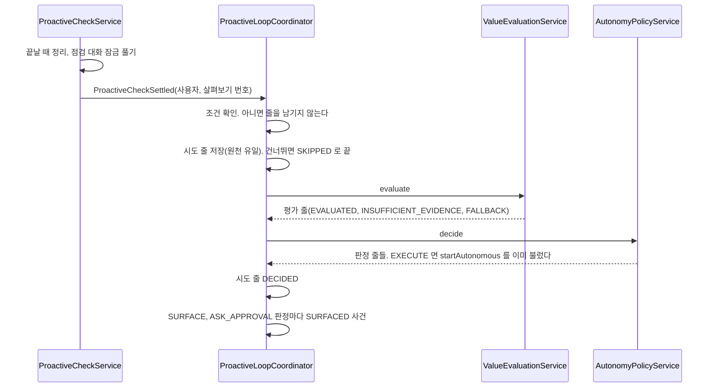

# 매일 루프

매일 깨우기로 돈 살펴보기가 끝나면, 그 살펴보기가 받아들인 문제 후보를 가치 평가와 행동 정책에 한 번 잇는다.
결정은 [ADR-20261008 / daily-loop](../adr/ADR-20261008-daily-loop.md)에 있다.
각 단계의 계약은 [먼저 살펴보기](proactive-check.md), [가치 평가](value-evaluation.md), [행동 정책](autonomy-policy.md), [판단 피드백](decision-feedback.md)이 갖는다.
이 문서는 언제 잇는지와 그 시도의 기록만 갖는다.

## 무엇을 잇는가

| 단계 | 부르는 것 | 이 단계가 갖는 것 |
| --- | --- | --- |
| 관찰과 문제 찾기 | 매일 깨우기의 살펴보기(`CheckTrigger.SCHEDULED`) | 결과 블록 검사, 문제 후보의 `ACCEPTED`, `DROPPED` |
| 가치 판단 | `ValueEvaluationService.evaluate(user, checkId, provider)` | 모델 호출 한 번, `proactive_value_evaluation` 한 줄 |
| 행동 정책 | `AutonomyPolicyService.decide(user, evaluationId)` | 후보마다 판정 한 줄, `EXECUTE` 면 읽기 전용 살펴보기 한 번 |
| 시도 기록 | `ProactiveLoopCoordinator` | `proactive_loop_run` 한 줄 |

단추로 연 살펴보기(`MANUAL`)와 자동 실행이 연 살펴보기(`AUTONOMY`)는 잇지 않는다. 자동 실행의 문제 후보가 다시 자동 실행을 부르지 않게 하기 위해서다.
열지 않은 보고 때문에 모델 없이 건너뛴 깨우기(`UNREAD_REPORT`)는 살펴보기 turn 이 돌지 않아 잇지 않는다.

## 언제 부르는가

`ProactiveCheckService` 가 살펴보기 turn 을 끝내고 점검 대화의 잠금을 푼 뒤 `ProactiveCheckSettled` 사건을 낸다.
`ProactiveLoopCoordinator` 가 그 사건을 같은 백그라운드 스레드에서 받는다. 잠금을 푼 뒤라 자동 실행이 같은 점검 대화의 잠금을 잡을 수 있다.
사건 처리의 실패는 로그만 남기고 살펴보기의 끝을 바꾸지 않는다.

### 줄을 남기지 않고 돌아가는 조건

아래 가운데 하나면 시도 줄 없이 돌아간다. 동의하지 않은 사용자의 살펴보기마다 줄이 쌓이지 않게 하기 위해서다.

- 살펴보기의 시작 계기가 `SCHEDULED` 가 아니다
- 살펴보기 상태가 `SUCCEEDED` 가 아니다
- 설치 설정 `assistant.proactive-loop.enabled` 가 거짓이다
- 그 사용자와 에이전트의 설정 줄이 없거나 꺼져 있다

### 시도 줄을 남기는 순서

한 트랜잭션에서 그 사용자의 설정 줄을 모두 쓰기 잠금으로 읽은 뒤 아래 순서로 정한다. 앞에서 걸리면 뒤를 보지 않는다.

| 순서 | 조건 | 시도 줄 |
| --- | --- | --- |
| 1 | 설정의 `snoozed_until` 이 지금보다 뒤다 | `SKIPPED`, `SNOOZED` |
| 2 | 그 살펴보기의 `ACCEPTED` 문제 후보가 없다 | `SKIPPED`, `NO_CANDIDATE` |
| 3 | 그 사용자의 `SKIPPED` 가 아닌 시도 줄이 최근 20시간 안에 `max-runs-per-day` 개 이상이다 | `SKIPPED`, `DAILY_LIMIT` |
| 4 | 위가 모두 아니다 | `RUNNING` |

`NO_CANDIDATE` 는 모델을 부르지 않으므로 하루 상한에 세지 않는다. 동의한 사용자의 침묵을 조회할 수 있게 줄은 남긴다.
하루 상한을 24시간이 아니라 20시간으로 센다. 시도 줄의 시각은 살펴보기 turn 이 끝난 뒤라 날마다 몇 분씩 다르다. 24시간으로 세면 어제보다 일찍 끝난 오늘 깨우기가 어제 줄에 걸려 빠진다.
잠근 설정 줄 목록에서 그 에이전트의 줄을 다시 보고, 그사이 꺼졌거나 지워졌으면 시도 줄 없이 돌아간다.
원천 살펴보기 칸의 유일 제약에 걸리면 이미 다른 처리가 그 살펴보기를 맡았으므로 아무것도 하지 않는다.

### 평가와 판정

`RUNNING` 줄을 커밋한 뒤 트랜잭션 밖에서 평가와 판정을 부른다. 모델을 기다리는 동안 트랜잭션과 잠금을 쥐지 않는다.
provider 는 `assistant.proactive-loop.provider` 다. 판단 profile 이 없거나 꺼져 있으면 평가는 `FALLBACK / PROVIDER_UNAVAILABLE` 이고 판정은 모두 `IGNORE / EVALUATION_NOT_USABLE` 이다. 그래도 시도는 `DECIDED` 다.

| 결과 | 시도 줄 |
| --- | --- |
| 판정까지 끝났다 | `DECIDED`, 평가 번호 |
| 평가나 판정이 `ApiException` 으로 거절됐다. 점검 대화를 지운 경우가 여기 든다 | `FAILED`, 그 오류 코드. 평가가 끝나 번호를 받았으면 평가 번호. 평가 도중 예외로 끝났으면 비어 있고, 평가 줄은 같은 원천 살펴보기 번호로 찾는다 |
| 그 밖의 예외 | `FAILED`, `INTERNAL_ERROR` |

시도는 다시 부르지 않는다. 같은 원천에서 판정이 두 번 생기지 않게 하기 위해서다.
자동 실행의 시작과 실패는 판정 줄의 `execution_status` 가 갖는다([행동 정책](autonomy-policy.md)의 「자동 실행」).

### 서버가 멈췄을 때

기동할 때 `ProactiveLoopRecovery` 가 `RUNNING` 시도 줄을 `FAILED`, `INTERRUPTED` 로 닫는다. 평가와 판정을 다시 부르지 않는다.
복구한 줄의 평가 번호는 비어 있다. 평가가 시작됐는지는 같은 원천 살펴보기 번호의 `proactive_value_evaluation` 으로 찾는다.
평가 줄의 `RUNNING` 은 가치 평가의 기동 복구가, 판정 줄의 `PENDING` 은 행동 정책의 규칙이 다룬다.
살펴보기가 끝난 뒤 시도 줄을 저장하기 전에 멈추면 그 살펴보기는 잇지 않는다. 다음 깨우기가 새 원천이다.

## 사용자 설정

사용자와 에이전트마다 하나다. 줄이 없으면 꺼짐이다.

| 메서드와 경로 | 하는 일 |
| --- | --- |
| `GET /api/v1/agents/{code}/proactive-check/loop` | `{ available, enabled, snoozedUntil }` 을 준다. `available` 은 설치 설정 `enabled` 다 |
| `PUT /api/v1/agents/{code}/proactive-check/loop` | `{ enabled, snoozedUntil }` 을 저장하고 GET 과 같은 모양을 준다 |

권한은 매일 깨우기 설정과 같다. 조회와 끄기는 `AgentService.requireReadable`, 켜기는 `AgentService.requireStartable` 이다.
설치 설정이 꺼져 있으면 꺼진 줄을 켜는 요청은 409 `PROACTIVE_LOOP_UNAVAILABLE` 이다. 끄기와 쉬기, 이미 켠 줄을 켠 채 두는 요청은 늘 받는다.
`snoozedUntil` 은 비우거나 지금부터 30일 안의 시각이다. 벗어나면 400 `VALIDATION_FAILED` 다. 지난 시각을 보내면 비운 것과 같다.
쉬는 동안의 깨우기는 `SNOOZED` 로 남고 평가하지 않는다. 쉬기가 끝난 뒤 지난 깨우기를 몰아 잇지 않는다.

매일 깨우기 자체를 끄면 살펴보기가 돌지 않으므로 루프도 돌지 않는다. 읽기 전용 자동 실행은 이 설정과 따로 [행동 정책](autonomy-policy.md)의 설치 설정과 사용자 동의가 연다.

## 사용자에게 보이는 것

매일 루프가 낸 `SURFACE` 와 `ASK_APPROVAL` 판정만 지금 화면 「내 차례」 카드의 「먼저 다룰 문제」 항목으로 보인다. 항목과 판정 규칙은 [`attention.md`](attention.md)의 「후보와 trigger」 의 `PROBLEM_SURFACED` 줄, 화면은 [`../frontend/now.md`](../frontend/now.md)가 갖는다.
`IGNORE` 는 아무것도 만들지 않는다. 어떤 판정도 알림(`notification`), 알림 줄, 승인 줄을 만들지 않는다. 항목은 `LATER` 라 건수에 세지 않는다.
관리자 화면이나 판정 API 로 낸 판정은 보이지 않는다. 사용자가 켠 루프가 아니기 때문이다.

판정을 남긴 뒤 `ProactiveLoopCoordinator` 가 `SURFACE`, `ASK_APPROVAL` 판정마다 판단 피드백 `SURFACED` 를 남긴다([판단 피드백](decision-feedback.md)).

| 메서드와 경로 | 하는 일 |
| --- | --- |
| `PUT /api/v1/autonomy-decisions/{id}/reaction` | `{ "reaction": "ACCEPTED" \| "DISMISSED" }` 를 남기고 204 를 준다 |

**「받아들임」 은 반응을 기록할 뿐이다.** 할 일, 승인 줄, 실행을 만들지 않는다. `ASK_APPROVAL` 도 승인이 아니다. 외부에 쓰는 일은 지금처럼 커넥터 도구 승인 경로만 거친다.
요청자의 매일 루프가 낸 `SURFACE`, `ASK_APPROVAL` 판정만 받는다. 남의 판정, 없는 판정, 다른 수준의 판정, 루프 밖의 판정은 404 `AUTONOMY_DECISION_NOT_FOUND`, 모르는 `reaction` 은 400 `VALIDATION_FAILED` 다.
지금 반응은 그 판정의 마지막 사용자 `ACCEPTED`, `DISMISSED` 다. 지금 화면의 숨기기(`ATTENTION_HIDE`)와 미루기는 지금 반응이 아니다. 지금 반응과 같은 단추를 다시 누르면 사건을 더 남기지 않는다.
반응이 있는 판정은 항목에서 빠진다. 점검 대화를 지우면 그 대화의 사건과 함께 항목도 사라진다.

**보일 판정은 아래 순서로 고른다.**

1. 요청자의 `DECIDED` 시도 가운데 `surface-window` 안에 저장한 줄의 평가를 모은다
2. 그 평가의 판정 가운데 평가와 후보마다 가장 먼저 남긴 줄 하나만 루프의 판정으로 본다. 같은 평가를 판정 API 로 다시 판정한 줄은 루프의 판정이 아니다
3. 그 가운데 `SURFACE`, `ASK_APPROVAL` 만 남긴다
4. 같은 문제 키는 가장 늦게 남긴 판정 하나만 남긴다
5. 남은 판정에 지금 반응이 있으면 뺀다. 그래서 새 판정에 「관심 없음」 을 누르면 같은 키의 옛 판정이 대신 나오지 않는다
6. 지운 점검 대화와 찾지 못한 에이전트의 판정을 거른 뒤, 가장 늦은 것부터 `surface-max-items` 개까지만 보인다. 같은 「내 차례」 카드의 할 일과 Memory 제안이 카드 상한 밖으로 밀리지 않게 하기 위해서다. 지금 화면에서 숨기거나 미룬 항목도 이 자리를 쓴다. 그래서 최근 세 문제를 숨기면 그보다 오래된 문제는 숨긴 항목의 상태가 바뀌거나 창이 지날 때까지 보이지 않는다

원천 살펴보기나 후보 줄이 없거나, 문제 글이 비었거나, 에이전트를 찾지 못한 판정은 그 줄만 빼고 나머지를 보인다.
이 목록을 읽다 예외가 나면 이 항목만 비우고 로그를 남긴다. 같은 「내 차례」 카드의 승인 대기, 할 일, Memory 제안을 가리지 않기 위해서다.
반응 API 도 같은 규칙으로 루프의 판정인지 본다. 다시 판정한 줄에 반응하면 404 다.

## 기록과 조회

시도 줄은 `proactive_loop_run`, 설정은 `proactive_loop_setting` 이다. 칸은 [`schema/proactive.md`](schema/proactive.md)가 갖는다.

| 묻는 것 | 읽는 곳 |
| --- | --- |
| 그 깨우기가 이어졌는가, 왜 건너뛰었는가 | 시도 줄의 상태, 건너뛴 까닭, 오류 코드 |
| 판단과 그 provider, 모델 | 시도 줄의 평가 번호로 `proactive_value_evaluation.evidence_json` 의 `provider` |
| 후보마다의 수준과 까닭, 규칙 버전 | 같은 평가의 `proactive_autonomy_decision` |
| 비용 | 원천 살펴보기 트리의 실행 줄, 평가 실행 줄(`agent_id` 와 `conversation_id` 가 빈 줄), 자동 실행한 살펴보기 트리의 실행 줄 |

판단 피드백 export 의 `situation.loop` 이 시도 줄의 번호, 상태, 건너뛴 까닭, 오류 코드, 평가 번호, 시각을 싣는다([판단 피드백](decision-feedback.md)의 「replay 읽기 모델」).
글과 원문은 시도 줄에 두지 않는다. 실제 provider 의 결과와 합성 평가([먼저 살펴보기 루프 평가](proactive-eval.md))의 결과는 평가의 provider 기록으로 구분한다.

## 설정

`assistant.proactive-loop` 설정이다.

| 칸 | 기본값 | 뜻 |
| --- | --- | --- |
| `enabled` | `false` | 설치가 루프를 연다. 꺼져 있으면 사용자 설정과 상관없이 잇지 않는다 |
| `provider` | `hermes` | 평가에 쓸 `DecisionProvider` 이름. 설치된 adapter 여야 한다 |
| `max-runs-per-day` | `1` | 사용자 한 명의 최근 20시간 시도 상한. 1 이상 |
| `surface-window` | `7d` | 이 기간 안의 시도가 낸 판정만 지금 화면에 보인다. 0 보다 크다 |
| `surface-max-items` | `3` | 지금 화면에 보이는 먼저 다룰 문제의 수. 1 이상 |

## 검증

| 무엇 | 어디서 |
| --- | --- |
| 줄을 남기지 않는 조건, 건너뛰는 순서, 원천 유일, 하루 상한, 다시 부르지 않음 | `ProactiveLoopCoordinatorTest`, `ProactiveLoopDisabledTest` |
| provider 실패의 `FALLBACK` 과 모르는 provider 의 `FAILED` | `ProactiveLoopFallbackTest`, `ProactiveLoopUnknownProviderTest` |
| 기동 때 `RUNNING` 닫기 | `ProactiveLoopRecoveryTest` |
| 설정 API 의 권한과 검사 | `ProactiveLoopSettingTest`, `ProactiveLoopSettingDisabledTest` |
| 판정의 `SURFACED`, 고르는 규칙, 반응과 그 거절 | `SurfacedProblemsTest` |
| 지금 화면 항목, 숨기기와 미루기의 사건, 한 줄이 깨져도 카드가 남음 | `SurfacedProblemCandidatesTest` |
| 화면의 항목과 반응, 루프 설정 | `test/browser/now.spec.ts`, `test/browser/proactive-check.spec.ts` |
| 결정적 provider 로 7일 동안 깨우기와 루프를 이어 돌려 중요한 문제의 적중, 중복, 유용한 침묵, 실패, 호출 수를 세는 합성 반복 | `DailyLoopPilotTest`. 결과는 `backend/build/reports/proactive-loop/report.md` |

합성 반복의 모든 값은 합성이다. 실제 사람, 메일, 계정, 금액, 대화 내용을 쓰지 않는다.
