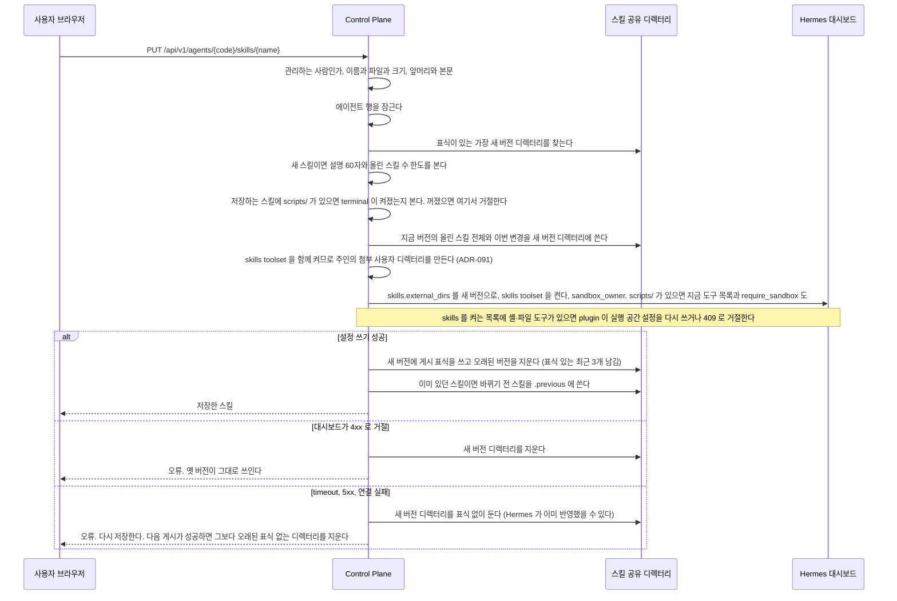
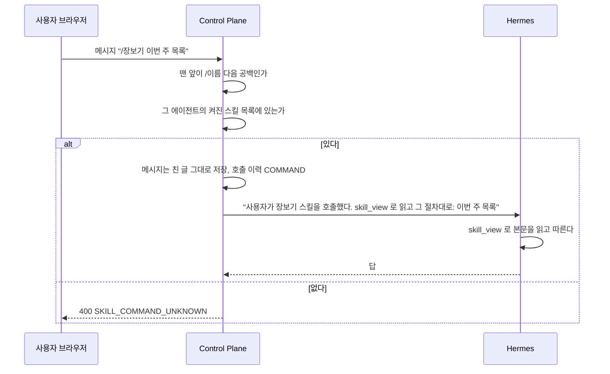

# 스킬

에이전트를 관리하는 사람이 화면에서 스킬을 올리고 고치고 지운다. 승인 절차는 없다.
이 파일은 올린 스킬의 저장과 게시, 입력창의 스킬 커맨드 해석, 호출 이력을 갖는다.
Hermes 가 스킬을 읽는 방식은 [`hermes/skills.md`](../hermes/skills.md) 가 갖는다.
근거는 [ADR-034](../adr/ADR-034-올린-스킬은-control-plane-이-버전-디렉터리에-쓰고-hermes-는-읽기만-한다.md) 에 있다.

**본문은 데이터베이스에 두지 않는다.** Control Plane 이 공유 디렉터리에 쓰고 Hermes 는 읽기만 한다.

```
<ASSISTANT_SKILL_ROOT>/<profile>/<버전>/<스킬>/SKILL.md
                                          FORMS.md 같은 맨 위 .md, .txt
                                          references/…
                                          templates/…
                                          scripts/…
                                          assets/…
<ASSISTANT_SKILL_ROOT>/<profile>/.previous/<스킬>/   이전 버전 하나. Hermes 는 읽지 않는다
```

`scripts/` 아래 파일은 755, 나머지 파일은 644 로 쓴다. 올리는 쪽이 준 실행 비트는 보지 않는다.

- 저장할 때마다 그 profile 의 올린 스킬 전체를 새 버전 디렉터리에 쓰고, 그 profile 의 `skills.external_dirs` 를 `ASSISTANT_SKILL_AGENT_ROOT` 아래 새 버전 경로로 바꾼다. 쓰는 도중에는 옛 버전이 쓰인다
- 설정 쓰기가 4xx 로 거절되면 새 디렉터리를 지운다. timeout 과 5xx 는 Hermes 가 이미 반영했을 수 있어 표식 없이 남기고, 다음 게시가 성공한 뒤 그보다 오래된 표식 없는 디렉터리를 지운다. 실패한 저장의 변경은 어느 쪽이든 반영되지 않으므로 다시 저장한다. 표식 있는 옛 버전은 최근 3개만 남긴다
- 게시에 성공하면 그 버전 디렉터리에 표식 파일 `.published` 를 쓴다. 지금 버전은 표식이 있는 가장 새 디렉터리다
- 같은 에이전트의 저장은 기다리는 에이전트 행 잠금으로 한 번에 하나씩 돈다. 잠금부터 표식 쓰기까지 한 트랜잭션이라 그동안 같은 에이전트의 도구와 공개 범위 변경은 `AGENT_BUSY` 다
- 스킬을 저장하면 그 에이전트의 `skills` toolset 을 함께 켠다. 올린 스킬이 있는 동안은 `skills` 를 끄지 못한다
- 마지막 남은 스킬을 지우면 새 버전을 쓰지 않고 빈 `external_dirs` 를 게시한 뒤 그 profile 의 버전 디렉터리와 이전 버전을 모두 지운다. profile 디렉터리는 비운 채 남긴다. 실행 공간이 그 디렉터리를 붙이고 있어서다(「스크립트와 실행 공간」). 에이전트를 지울 때만 profile 디렉터리까지 지운다. `skills` toolset 은 그대로 둔다

| 제한 | 값 |
| --- | --- |
| 이름 | 소문자, 숫자, `-`. 64자까지. `new` 는 새 스킬 화면 경로라 쓸 수 없다. Hermes 기본 스킬과 같으면 `SKILL_NAME_TAKEN` |
| 파일 | `SKILL.md` 와 아래 경로 규칙에 맞는 UTF-8 글 파일. `SKILL.md` 를 빼고 20개까지 |
| 경로 | 조각을 `/` 로 이은 1~4조각, 200자까지. 조각은 `[A-Za-z0-9][A-Za-z0-9._-]{0,99}` 다. 한 조각이면 `.md` 나 `.txt` 로 끝나는 맨 위 파일이고, 둘 이상이면 첫 조각이 `references`, `templates`, `scripts`, `assets` 가운데 하나다. 대소문자만 다른 두 경로, 파일이면서 다른 경로의 디렉터리인 경로, `SKILL.md` 라는 이름(대소문자 무시)의 다른 파일은 받지 않는다. Hermes 는 외부 디렉터리 아래의 모든 `SKILL.md` 를 스킬로 읽는다 |
| `scripts/` | 「스크립트와 실행 공간」 의 조건을 갖춘 에이전트에만 받는다. 저장하는 그 스킬만 본다 |
| 크기 | 파일마다 10만 자, 합계 1 MiB |
| 앞머리 | `name` 이 스킬 이름과 같다. `description` 은 1024자까지이고, 새 스킬이면 60자까지다. 60자는 앞뒤 공백과 앞뒤 따옴표를 뺀 code point 로, 1024자는 앞뒤를 빼지 않은 code point 로 센다 |
| 앞머리의 비밀 요청 칸 | `required_environment_variables`, `required_credential_files`, `setup.collect_secrets`, `prerequisites.env_vars` 가 없다. Hermes 는 스킬을 읽을 때 이 칸의 이름으로 profile 의 환경 값과 파일을 셸 실행 공간에 넣는다([ADR-086](../adr/ADR-086-셸과-파일-도구는-사용자별-docker-실행-공간에서만-돈다.md)) |
| 본문 | 닫는 `---` 뒤에 공백이 아닌 글이 있어야 한다 |
| 개수 | 에이전트마다 올린 스킬 `assistant.skill.max-per-agent` 개. 기본 30. 새 스킬을 만들 때만 에이전트 행 잠금 안에서 센다. 표식 없는 더 새 버전의 이름도 센다 |

60자와 개수는 Hermes 색인이 설명을 자르지 않고 커지지 않게 하려는 것이다([ADR-034](../adr/ADR-034-올린-스킬은-control-plane-이-버전-디렉터리에-쓰고-hermes-는-읽기만-한다.md) 의 「저장할 수 있는 스킬은 Hermes 가 제대로 고를 수 있는 스킬이다」).
어기면 모두 `VALIDATION_FAILED` 다. 이미 올린 스킬은 설명이 60자를 넘거나 개수가 한도에 닿아도 고칠 수 있다.

| 경로 | 하는 일 |
| --- | --- |
| `GET /api/v1/agents/{code}/skills` | `{ "skills": [{ "name", "description", "source": "UPLOADED", "enabled", "usage"? }], "editable", "skillsToolsetEnabled", "uploadLimit" }`. `usage`(`{count, lastInvokedAt}`)는 관리하는 사람에게만 준다. `uploadLimit` 은 올릴 수 있는 스킬 수의 한도다 |
| `GET /api/v1/agents/{code}/skills/{name}` | 관리하는 사람만. 올린 스킬의 `{ "name", "description", "body", "files": [{ "path", "size", "content" }], "previousSavedAt" }`. `body` 는 앞머리를 포함한 `SKILL.md` 원문이다. `size` 는 UTF-8 바이트이고 `content` 는 참고 파일 원문이다. `previousSavedAt` 은 이전 버전을 남긴 시각이고 없으면 `null` 이다 |
| `PUT /api/v1/agents/{code}/skills/{name}` | `{ "skillMd", "files": [{ "path", "content"? }] }` 로 스킬 하나를 통째로 바꾼다. 없으면 만든다. `content` 를 생략한 파일은 지금 버전의 같은 경로 내용을 그대로 둔다 |
| `DELETE /api/v1/agents/{code}/skills/{name}` | 올린 스킬과 그 이전 버전을 지운다 |
| `POST /api/v1/agents/{code}/skills/{name}/restore-previous` | 관리하는 사람만. 이전 버전과 지금 버전을 맞바꿔 저장한다. 이전 버전이 없으면 `SKILL_NOT_FOUND`. 응답은 `GET` 과 같다 |
| `PUT /api/v1/agents/{code}/skills/{name}/enabled` | 관리하는 사람만. 올린 스킬만 받는다. `{ "enabled" }`. 기본·커넥터 스킬은 `SKILL_NOT_FOUND` 다 |
| `GET /api/v1/admin/agents/{code}/skills` | 관리자만. 읽을 수 있는 에이전트의 올린 스킬과 기본·커넥터 스킬 전체를 준다 |
| `PUT /api/v1/admin/agents/{code}/skills/{name}/enabled` | 관리자만. 기본·커넥터 스킬까지 켜고 끈다 |

일반 경로는 관리자 역할로 요청해도 `UPLOADED` 만 준다. Hermes 번들과 커넥터가 설치한 스킬의 이름·설명은 관리자 영역에서만 보인다.
공개된 에이전트의 올린 스킬 목록은 그 에이전트를 쓸 수 있는 사람도 읽지만, 원문은 주인과 관리자만 읽는다.
숨긴 스킬 이름과 새 스킬 이름이 겹치면 저장은 `SKILL_NAME_TAKEN` 으로 거절하고 화면은 다른 이름을 고르라고 안내한다.

목록은 대시보드 `GET /api/skills?profile=` 에서 읽는다. 켜고 끄기는 지정한 profile 의 모든 platform 에 적용되는 `skills.disabled` 만 쓰고 `skills.platform_disabled.api_server` 는 쓰지 않는다([`hermes/skills.md`](../hermes/skills.md) 의 「스킬 커맨드와 API server」).
출처는 Hermes 가 올린 스킬과 모델이 만든 로컬 스킬을 모두 `agent` 로 주므로 쓰지 않는다. 올린 스킬 이름이 `UPLOADED`, 나머지가 `HERMES` 다.
올린 스킬 이름은 지금 버전과, 지금 버전보다 새로 쓰였지만 표식이 없는 버전에 있는 이름이다. 표식 없는 버전은 게시가 timeout 이나 5xx 로 끝난 것이라 Hermes 가 이미 가리키고 있을 수 있다.
그 이름은 목록에서 올린 스킬로 보이고, 원문 읽기와 같은 이름으로 다시 저장하기와 지우기가 된다. 다시 저장할 때 본문을 생략한 파일은 그 버전의 내용을 쓴다. 지우면 지금 버전을 다시 게시해 Hermes 가 그 버전에서 벗어난다.
지금 버전에 있는데 대시보드 목록에 없는 스킬도 올린 것으로 넣고 켜진 것으로 보인다. 게시 직후 색인 전이거나 Hermes 가 건너뛴 스킬도 화면에서 지울 수 있어야 하기 때문이다.
목록은 그 에이전트를 쓸 수 있는 사람이 본다. 올린 스킬의 원문 읽기, 쓰기, 지우기, 켜고 끄기는 관리하는 사람만 하고, 아니면 `FORBIDDEN` 이다.

## 스킬 커맨드

입력창 맨 앞의 `/<이름>` 을 Control Plane 이 해석한다. 근거는 [ADR-035](../adr/ADR-035-대화창의-스킬-커맨드는-control-plane-이-해석해-hermes-에-넘긴다.md) 에 있다.

- 입력창의 `/` 목록은 일반 스킬 API 를 쓰므로 켜진 업로드 스킬만 보여 준다. 기본·커넥터 스킬은 목록에 보이지 않지만, 이름 규칙에 맞는 켜진 스킬을 직접 입력하면 Control Plane 의 전체 목록으로 확인해 실행한다
- 메시지 내용이 `^/[a-z0-9][a-z0-9-]{0,63}` 다음에 공백이나 끝이 오는 모양일 때만 커맨드다. 새 요청 칸은 없다
- 이름에 `.` 이나 `_` 가 든 Hermes 기본 스킬은 커맨드로 부르지 못하고 글 그대로 보낸다. 입력창의 `/` 목록에도 뜨지 않는다. 호출 이력은 Hermes 이름 규칙을 따르므로 모델이 스스로 읽으면 `MODEL` 로 남는다
- 이름이 그 에이전트의 켜진 스킬 목록에 있으면 Hermes 에 보낼 입력만 사용자가 이 스킬을 호출했으니 `skill_view` 로 읽고 그 절차대로 다음을 하라는 글로 바꾼다. 저장하는 메시지는 사용자가 친 글 그대로다
- 없으면 Hermes 에 보내지 않고 400 `SKILL_COMMAND_UNKNOWN` 다
- 켜진 스킬 목록은 에이전트마다 30초 캐시한다. 스킬 저장, 지우기, 켜고 끄기가 Hermes 에 반영되면 `SkillsChanged` 로 그 에이전트의 캐시를 비운다. `skills` toolset 변경은 캐시를 비우지 않아 30초 뒤에 반영된다
- `skills` toolset 이 꺼진 에이전트는 켜진 스킬이 없는 것으로 보고 커맨드를 `SKILL_COMMAND_UNKNOWN` 으로 거절한다([ADR-035](../adr/ADR-035-대화창의-스킬-커맨드는-control-plane-이-해석해-hermes-에-넘긴다.md) 의 「감당할 것」)
- 이름은 대화를 만들기 전에 확인한다. 거절한 커맨드는 대화도 메시지도 실행도 남기지 않는다. 목록을 읽다 Hermes 가 실패하면 그 오류로 거절하고 캐시에 두지 않는다
- 흐름이 붙은 에이전트에서는 커맨드를 해석하지 않고 글 그대로 보낸다. 입력창도 `/` 목록을 띄우지 않는다

### 이름이 정해진 스킬

`proactive-check` 는 먼저 살펴보기의 분야 지침이다. 에이전트에 이 이름의 스킬이 켜져 있으면 그 에이전트는 살펴보기를 할 수 있다.
살펴보기 turn 은 사용자 커맨드가 아니라 Control Plane 이 이 스킬을 읽으라는 입력을 만들어 보낸다. 호출 이력에는 남기지 않는다. 모델이 `skill_view` 로 읽으면 `MODEL` 로 남는다.
사용자가 `/proactive-check` 로 직접 부르면 보통 스킬 커맨드이고 읽기 경계를 받지 않는다. 계약은 [`proactive-check.md`](proactive-check.md) 가 갖는다.

## 호출 이력

`execution_skill_use` 한 표에 둔다([`backend/schema/execution.md`](schema/execution.md)).

| 출처 | 적는 곳 |
| --- | --- |
| `COMMAND` | 커맨드로 turn 을 시작할 때 `chat` 이 적는다 |
| `MODEL` | 실행 사건에서 `skill_view` 도구 호출을 받을 때 스킬 이름이 실려 있으면 `usage` 가 적는다. 이름은 `hermes` 가 사건을 읽을 때 가리기 전 미리보기에서 꺼내 이름 규칙으로 검증해 사건의 `skillName` 칸에 싣는다. 가린 `detail` 에서는 읽지 않는다(ADR-047). 옛 커넥터 에이전트의 실행은 이름을 싣지 않아 기록되지 않는다. 연결을 붙인 에이전트의 실행은 기록된다. 대화 turn 의 실행만 기록된다. 위임과 흐름의 하위 실행은 Hermes 사건을 옮기지 않아 기록되지 않는다 |

| 경로 | 하는 일 |
| --- | --- |
| `GET /api/v1/usage/skills` | 요청자 자신의 호출만. `[{ "agentCode", "agentName", "skillName", "count", "lastInvokedAt", "lastConversationId" }]` |

관리하는 사람은 스킬 목록의 `usage` 로 합계만 보고, 누가 어느 대화에서 불렀는지는 보지 않는다.

| 무엇 | 어디 |
| --- | --- |
| 권한 판정과 저장 순서 | `skill/application/SkillService` |
| 호출 이력 적기와 읽기 | `skill/application/SkillUseRecorder`, `skill/application/SkillUsageQuery` |
| 버전 디렉터리 쓰기와 지우기 | `skill/infra/SkillStore` |
| 이전 버전 쓰기와 읽기, 지우기 | `skill/infra/PreviousSkillStore` |
| 스킬 이름과 파일 경로 규칙 | `skill/infra/SkillFilePaths` |
| 앞머리와 파일, 크기 입력 검사 | `skill/application/SkillInputRules` |
| `external_dirs` 게시와 대시보드 스킬 목록 | `skill/infra/SkillPublisher`, 호출은 `hermes` |
| 커맨드 판별과 입력 바꾸기 | `chat/application/SkillCommand` |
| 커맨드로 부를 수 있는 이름과 그 캐시 | `skill/application/SkillCommandCatalog`, 비우기는 `SkillsChanged` |

## 스킬을 저장할 때

에이전트를 관리하는 사람이 스킬 편집 페이지에서 저장한다.



**저장한 것은 다음 실행부터 쓰인다.** 재시작이 필요 없다. 도는 실행은 시작할 때의 버전을 읽는다.

### 스킬 저장이 갈리는 지점

| 무엇 | 어떻게 되나 |
| --- | --- |
| 관리하는 사람이 아니다 | `FORBIDDEN`. 화면에는 편집 단추가 없다 |
| Hermes 기본 스킬과 이름이 같다 | `SKILL_NAME_TAKEN` |
| timeout 뒤 같은 이름으로 다시 저장한다 | 표식 없는 버전에 있는 이름은 올린 스킬로 보고 받는다. Hermes 목록에 먼저 떠 있어도 `SKILL_NAME_TAKEN` 이 아니다 |
| 파일 경로가 경로 규칙에 맞지 않거나 상한을 넘는다 | `VALIDATION_FAILED` |
| 저장하는 스킬에 `scripts/` 가 있는데 그 에이전트에 `terminal` 이 꺼져 있다 | `SKILL_SCRIPTS_NEED_SANDBOX`. 버전 디렉터리를 쓰기 전에 거절한다 |
| 저장하는 스킬에 `scripts/` 가 있는데 plugin 이 실행 공간이 없다고 거절한다 | `SKILL_SCRIPTS_NEED_SANDBOX`. 대시보드의 409 `sandbox_unavailable` 이다. 4xx 이므로 새 디렉터리를 지운다 |
| 저장하는 스킬에 `scripts/` 가 있는데 주인의 첨부 디렉터리를 준비하지 못한다 | `AGENT_SANDBOX_UNAVAILABLE` 그대로다. 셸 유무가 원인이 아니라서 바꾸지 않는다. 새 디렉터리를 지운다 |
| 함께 실리는 다른 스킬에 `scripts/` 가 있다 | 보지 않는다. 셸이 꺼진 에이전트도 다른 스킬을 고칠 수 있다 |
| 앞머리 뒤에 본문이 없다 | `VALIDATION_FAILED`. 새 스킬이든 고치는 스킬이든 같다 |
| 앞머리에 비밀 요청 칸이 있다 | `VALIDATION_FAILED`. 새 스킬이든 고치는 스킬이든 같다. 이미 올라간 스킬은 읽기와 목록에서 그대로 보인다 |
| 함께 실리는 기존 스킬에 비밀 요청 칸이 있다 | `VALIDATION_FAILED`. 메시지에 그 스킬 이름이 있다. 저장 검사가 생기기 전에 올린 스킬이 새 버전에 다시 실리지 않게 버전 디렉터리를 쓰기 전에 거절한다. 그 스킬 자체를 고쳐 저장하거나 지우는 것은 된다. 지우기는 이 검사를 하지 않는다 |
| 새 스킬의 설명이 60자를 넘는다 | `VALIDATION_FAILED`. 화면이 저장 전에 먼저 알린다. 이미 올린 스킬을 고칠 때는 보지 않는다 |
| 올린 스킬이 한도(기본 30)에 닿았는데 새 스킬을 만든다 | `VALIDATION_FAILED`. 화면은 스킬을 에이전트마다 그 한도까지 만들 수 있다고 알린다. 이미 올린 스킬을 고치는 것은 된다 |
| 한도 하나 앞에서 두 사람이 새 스킬을 함께 만든다 | 에이전트 행 잠금 안에서 세므로 하나만 저장되고 다른 하나는 `VALIDATION_FAILED` |
| 두 사람이 같은 에이전트에 함께 저장한다 | 에이전트 행 잠금으로 차례로 돈다. 뒤에 저장한 것이 남는다 |
| 올린 스킬이 있는데 `skills` 도구를 끄려 한다 | 거절한다. 스킬을 먼저 지운다 |
| 지운다 | 그 스킬을 뺀 새 버전을 같은 방법으로 게시한다. 호출 이력은 남는다 |
| Hermes 안에서 모델이 올린 스킬을 고치려 한다 | 읽기 전용이라 실패한다. 실행 입력 앞 단락이 `skill_manage` 를 쓰지 말라고 알리고, 서명 plugin 이 `skill_manage` 호출을 막는다 |
| Hermes 를 올려 같은 이름의 번들 스킬이나 로컬 스킬이 생긴다 | 업그레이드와 배포 확인의 이름 충돌 검사가 배포를 멈춘다. 검사는 `fos-home-infra` 가 갖는다 |

## 스크립트와 실행 공간

`scripts/` 가 든 스킬은 스크립트를 사용자별 docker 실행 공간에서 돌릴 수 있는 에이전트에만 올라간다([ADR-086](../adr/ADR-086-셸과-파일-도구는-사용자별-docker-실행-공간에서만-돈다.md)).

| 조건 | 누가 보나 | 어기면 |
| --- | --- | --- |
| 그 에이전트의 API 도구에 `terminal` 이 켜져 있다 | Control Plane 이 저장 전에 본다 | 409 `SKILL_SCRIPTS_NEED_SANDBOX` |
| 그 profile 이 실행 공간 정책에 등록돼 있다 | 대시보드 plugin. 게시를 지금 도구 목록과 `require_sandbox: true` 로 보낸다 | 409 `SKILL_SCRIPTS_NEED_SANDBOX` |
| 실행 공간 정책에 `skill_root` 가 있다 | 대시보드 plugin | 409 `SKILL_SCRIPTS_NEED_SANDBOX` |

plugin 은 셸 설정을 쓸 때 `<skill_root>/<profile>` 을 Hermes 의 스킬 루트 경로 `<FOS_ASSISTANT_SKILL_AGENT_ROOT>/<profile>` 에 읽기 전용으로 붙인다.
버전 디렉터리 하나가 아니라 profile 디렉터리라서 다시 올린 스크립트가 같은 컨테이너에서 다음 호출부터 보인다.
경로가 Hermes 와 같아서 `skill_view` 가 알려 준 스킬 디렉터리로 모델이 스크립트를 그대로 부른다. 정책과 마운트의 모양은 [`hermes/README.md`](../../hermes/README.md) 의 「셸 실행 공간」 이 갖는다.

셸을 나중에 끄거나 profile 이 정책에서 빠져도 올린 스크립트 스킬은 남는다. 셸이 꺼지면 스크립트는 돌지 않는다.

## 이전 버전

- 이미 있는 스킬을 저장하면 게시에 성공한 뒤 바뀌기 전 스킬을 `.previous/<스킬>` 에 통째로 쓴다. 편집기 저장과 되돌리기가 모두 같다
- 임시 디렉터리에 다 쓴 뒤 옮긴다. 쓰다 실패하면 경고 로그만 남기고 저장은 성공으로 둔다. 게시가 이미 끝났기 때문이다
- 남긴 시각은 그 디렉터리의 `.saved-at` 파일에 UTC 밀리초로 쓰고 `previousSavedAt` 으로 보인다. 응답은 이 파일만 읽는다. 읽지 못하면 경고 로그를 남기고 `null` 로 보이며 읽기와 저장은 막지 않는다. 「이전 버전으로」 는 본문까지 읽으므로 그때는 오류다
- 바꿔 쓸 때는 옛 이전 버전을 임시 이름으로 옮긴 뒤 새것을 옮기고 옛것을 지운다. 새것을 옮기지 못하면 옛것을 제자리로 되돌린다. 되돌리기도 실패하거나 두 이동 사이에 프로세스가 멈추면 이전 버전이 없어지고, 옛것은 `.old-` 이름으로 남았다가 다음 쓰기 때 지워진다. 두 이동 사이에 잠금 없는 읽기는 이전 버전이 없다고 볼 수 있다
- 앞선 쓰기가 중단돼 `.previous` 아래 남은 `.old-`, `.tmp-` 항목은 다음 쓰기를 시작할 때 지운다
- 「이전 버전으로」 는 이전 버전을 기존 저장 경로로 저장한다. 이미 있는 스킬이라 새 스킬의 설명 60자와 개수 한도는 보지 않는다. 비밀 요청 칸과 `scripts/` 조건은 본다. 성공하면 바뀌기 전 스킬이 새 이전 버전이다
- 스킬을 지우면 이전 버전도 지운다. 게시가 끝난 뒤라 이 지우기가 실패해도 경고 로그만 남긴다
- `.previous` 가 링크이면 지우지 않고 거절한다. 마지막 스킬을 지울 때는 버전 디렉터리 비우기가 이 거절로 오류가 된다. 그때 Hermes 는 이미 빈 `external_dirs` 를 받았다
- 새 스킬을 만들면 게시가 끝난 뒤 같은 이름의 남은 이전 버전을 지운다. 지운 스킬의 이전 버전이 새 스킬의 것으로 보이지 않게 하려는 것이다

## 스킬 커맨드로 보낼 때

입력창 맨 앞에 `/` 를 치면 스킬 목록이 뜨고, 고르면 `/이름 ` 이 들어간다.
커맨드로 읽는 조건은 위 「스킬 커맨드」 가 갖는다.



사용자 말풍선은 글이 커맨드 모양이면 맨 앞에 `/이름` 칩을 붙인다. 호출 이력이 아니라 저장된 글의 모양으로 정한다. 흐름이 없다고 확인한 에이전트의 대화에만 붙인다. 흐름이 붙었거나, 에이전트 목록에 없어 흐름인지 모르는 대화에는 붙이지 않는다.

### 스킬 커맨드가 갈리는 지점

| 무엇 | 어떻게 되나 |
| --- | --- |
| 목록에 없는 이름이다 | Hermes 에 보내지 않는다. 입력창 아래에 「`/foo` 스킬이 이 에이전트에 없어요」 |
| `/usr/bin` 처럼 이름 뒤가 공백이 아니다 | 커맨드가 아니다. 그대로 보낸다 |
| 에이전트에 스킬이 없거나 `skills` 도구가 꺼져 있다 | 입력창에 `/` 만 친 동안 자동완성에 「이 에이전트에는 스킬이 없어요」. 한 글자라도 더 치면 목록을 닫는다 |
| 스킬이 꺼져 있다 | 목록에서 빠진다. 없는 이름과 같다. Control Plane 은 전역 켜고 끄기만 쓰고 `api_server` 별 끄기는 쓰지 않는다 |
| `/이름` 만 보낸다 | 스킬의 절차를 처음부터 진행하라는 입력을 보낸다 |
| 다시 생성한다 | 같은 커맨드로 다시 보낸다 |
| 다시 생성할 때 그 스킬이 꺼졌거나 지워졌다 | `SKILL_COMMAND_UNKNOWN`. 입력창 위에 오류로 알린다 |
| 모델이 스스로 스킬을 읽는다 | 실행 사건에 스킬 이름이 실려 오면 호출 이력 `MODEL` 로 남는다 |
