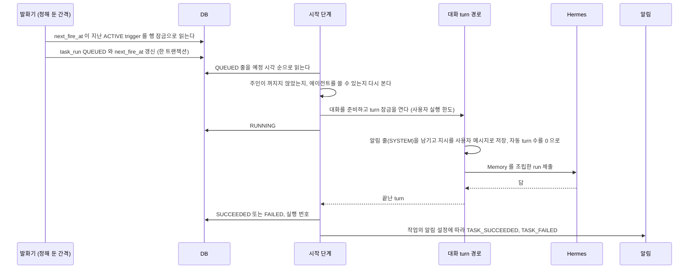

# 예약 작업

정한 시각에 사용자의 권한으로 에이전트를 돌리는 일을 갖는다. 작업을 만들고 고치는 규칙, 발화와 시작, 결과와 알림, 화면이다.
근거는 [ADR-076](../../backend/docs/adr/ADR-076-예약-작업은-control-plane-이-갖고-발화한-실행은-대화-turn-경로로-돈다.md), [ADR-077](../../backend/docs/adr/ADR-077-발화는-trigger-와-예정-시각의-유일-제약으로-한-번만-만들고-놓친-발화는-작업마다-정한다.md), [ADR-078](../adr/ADR-078-예약-작업의-결과는-실행마다-새-대화가-기본이고-목록은-작업으로-묶는다.md), [ADR-079](../../backend/docs/adr/ADR-079-예약-작업은-사용자당-10개-최소-간격-15분-하루-48번으로-제한한다.md) 이다.
Hermes cron 을 대신하며 모델 단계와 「보고할 것 없음」 을 더한 근거는 [ADR-20261008 / cron-to-task](../adr/ADR-20261008-cron-to-task.md) 다.
칸은 [`backend/docs/data-schema.md`](../../backend/docs/data-schema.md) 가 갖는다.

**아래의 일반 예약 작업은 `task.kind = TURN` 이다.**
매일 깨우기는 같은 발화 표를 쓰는 `CHECK` 이고, 사용자당 작업 수 상한과 일반 목록에서 뺀다.
설정과 실행 경계는 [`proactive-check.md`](proactive-check.md)의 「매일 깨우기」가 갖는다.
`CHECK` 는 작업 지시문과 대화 방식 대신 사용자별 점검 대화에서 `ProactiveCheckService.start(SCHEDULED)` 를 부른다.

## 작업

칸과 받는 값, 기본값은 `TaskDtos.TaskRequest` 와 `TaskService` 가 갖는다. 아래는 코드만 읽어서는 알기 어려운 규칙이다.

- 에이전트는 주인이 대화를 시작할 수 있는 에이전트(`AgentService.requireStartable`)여야 하고, 흐름이 붙은 에이전트는 거절한다
- 지시는 발화마다 사용자 메시지로 들어가고, 상한은 대화 메시지 상한과 같다. `/이름` 으로 시작하면 사람이 보낸 메시지처럼 그 에이전트의 스킬 커맨드로 돈다. 그 에이전트에 켜진 스킬이 아니면 그 발화는 `FAILED` 로 닫힌다
- 보관하지 않은 작업 수는 사용자마다 `assistant.task.max-per-user` 로 제한한다

상태는 셋이다.

| 상태 | 뜻 | 바꾸는 것 |
| --- | --- | --- |
| `ACTIVE` | 시각이 오면 발화한다 | 만들기, 다시 켜기 |
| `PAUSED` | 발화하지 않는다. 이미 만든 `QUEUED` 발화는 열지 않고 `SKIPPED`(`PAUSED`)로 닫는다 | 멈추기 |
| `ARCHIVED` | 지운 작업. 목록과 발화에서 빠진다. 대화와 발화 기록은 남는다 | 지우기 |

다시 켜면 `next_fire_at` 을 지금 뒤의 첫 시각으로 다시 계산한다. 멈춘 동안의 시각은 놓친 발화로 세지 않는다.
작업을 고칠 때는 작업 수 상한을 보지 않는다. 시각(종류, cron, `fireAt`, 시간대)이 바뀌었을 때만 시각을 다시 검사하고 `next_fire_at` 을 다시 계산한다. 그래서 이미 발화한 `ONCE` 작업도 이름과 지시를 고칠 수 있다. 에이전트는 고칠 수 있다. 다음 발화부터 새 에이전트로 돈다. `SINGLE` 작업의 에이전트를 바꾸면 다음 발화는 새 대화를 연다. 대화의 에이전트는 바뀌지 않기 때문이다([`backend/docs/data-schema.md`](../../backend/docs/data-schema.md) 의 `conversation`).

### 시각

`CRON` 은 표준 5필드 cron(`분 시 일 월 요일`)이고 `ONCE` 는 그 시간대의 날짜와 시각 하나다. 검사와 오류는 `TaskSchedule` 이 갖는다.
`CRON` 은 지금부터 1년 안의 예정 시각을 펼쳐, 이어지는 두 시각의 간격이 `assistant.task.min-interval` 보다 짧으면 거절한다. 식의 길이 상한은 저장 칸(`task_trigger.cron_expr`)의 길이다.
`ONCE` 는 지금보다 뒤여야 한다.

`CRON` 의 예정 시각은 그 작업의 시간대로 계산한다. Spring `CronExpression` 의 계산을 따른다. 서머타임이 있는 시간대에서 없는 시각은 그날 건너뛰고, 겹친 시각은 두 번 돈다. 두 번의 예정 시각은 서로 다른 순간이라 발화 기록도 두 줄이다.
다음 시각이 없는 cron(예: `0 9 31 2 *`)도 거절한다.
`ONCE` 는 한 번 발화하면 `next_fire_at` 이 비고 작업은 `ACTIVE` 로 남는다. 화면은 「다음 실행 없음」 으로 보인다.

### 모델 단계

작업마다 어느 단계로 돌지 정한다. 화면 이름은 「빠르게」, 「균형」, 「깊게」 이고 단계의 뜻은 [모델 단계와 실행 기록](../model-tiers.md) 이 갖는다.

| 작업의 `model_tier` | 발화가 대화에 하는 일 |
| --- | --- |
| 비어 있다 | 대화의 모델 선택을 건드리지 않는다. 새 대화는 선택이 없어 사용자 기본 단계, 그룹 기본 단계, 에이전트 기본 모델 순서로 돈다 |
| 값이 있다 | 새 대화는 그 단계를 고른 대화(`model_selection_mode = TIER`)로 만든다. 다시 쓰는 대화(`SINGLE`, 잠금을 기다린 줄)는 turn 을 열기 전에 그 단계로 바꾼다 |

`SINGLE` 대화에서 사용자가 고른 모델은 작업에 단계가 있으면 다음 발화가 그 단계로 바꾼다. 단계가 비어 있으면 그대로 둔다.
단계 정의가 비어 있으면 그 단계는 에이전트 기본 모델로 돈다. 작업을 저장할 때 단계 정의를 확인하지 않는다.
그 단계의 모델을 그 에이전트가 제공하지 않거나 그룹이 숨겼으면 대화와 같이 Hermes 에 보내기 전에 거절되고, 발화는 `FAILED`(`FAILED`)로 끝나 `TASK_FAILED` 를 알린다.

## 발화와 시작

발화기와 시작 단계는 같은 예약 작업이 차례로 부른다. `assistant.task.dispatch-cron` 이 정한다.

### 발화

`next_fire_at` 이 지금보다 앞이고 작업이 `ACTIVE` 인 trigger 를 하나씩 처리한다. trigger 마다 트랜잭션 하나에서 그 줄을 행 잠금으로 다시 읽고 처리한다. 한 trigger 의 실패는 그 trigger 만 되돌리고 다른 trigger 의 발화를 막지 않는다.

| 상황 | 처리 |
| --- | --- |
| 예정 시각이 지난 지 `assistant.task.missed-grace` 안이다 | 그 시각으로 `QUEUED` 를 만든다 |
| 그보다 늦었고 놓친 발화가 `RUN_ONCE` 다 | 지금 앞의 예정 시각 가운데 가장 늦은 것 하나로 `QUEUED` 를 만든다 |
| 그보다 늦었고 `SKIP` 이다 | 그 시각으로 `SKIPPED`(`MISSED`)를 하나 남긴다. 알리지 않는다 |
| 그 사용자의 24시간 안 발화가 `assistant.task.max-runs-per-day` 에 닿았다 | `SKIPPED`(`DAILY_LIMIT`)로 남기고 알린다 |
| 같은 `(trigger_id, scheduled_for)` 줄이 이미 있다 | 새로 만들지 않는다. `next_fire_at` 만 옮긴다 |

어느 경우든 같은 트랜잭션에서 `last_fired_at` 을 그 예정 시각으로, `next_fire_at` 을 지금 뒤의 첫 예정 시각으로 옮긴다. `ONCE` 는 비운다.

### 시작

`QUEUED` 줄마다 아래를 차례로 본다.

**건너뛴 `NEW_PER_RUN` 줄이 만든 빈 대화는 지운다.** 대화를 준비한 줄이 아래 어느 까닭으로든 `SKIPPED` 가 되면(시작 직전 멈추기나 지우기가 먼저 커밋된 경우도 포함한다), 그 대화에 메시지가 하나도 없을 때 그 대화를 지우고 줄의 대화 칸을 비운다. 사이드바의 「예약 작업」 묶음에 빈 대화가 쌓이지 않게 하기 위해서다. `SINGLE` 의 대화는 다음 발화가 다시 쓰므로 지우지 않는다.

메시지 저장과 빈 대화 삭제는 먼저 같은 대화 줄을 쓰기 잠금으로 읽고, 트랜잭션이 끝날 때까지 잠금을 유지한다.
메시지 저장이 먼저 끝나면 삭제는 그 메시지를 보고 대화를 남긴다. 삭제가 먼저 끝나면 늦은 메시지 저장은
`CONVERSATION_NOT_FOUND` 로 거절되어 대화 없는 메시지를 남기지 않는다. `ChatMessageRepository` 의 단건·묶음·즉시 반영
저장 경로에 모두 적용한다. 목록에서 숨긴 대화는 물리적으로 남아 있으므로 늦은 실행 결과를 저장할 수 있다.
이 보호는 저장소 API 의 새 쓰기에 적용되며, 이미 남아 있던 고아 행을 지우거나 외래 키를 추가하지 않는다.

| 상황 | 처리 |
| --- | --- |
| 작업이 `PAUSED` 나 `ARCHIVED` 가 됐다 | `SKIPPED`(`PAUSED`). 알리지 않는다 |
| 주인이 허용 목록에서 꺼졌다(ADR-059) | `SKIPPED`(`OWNER_REVOKED`). 알리지 않는다. 볼 사람이 없다 |
| 에이전트를 지웠거나 껐거나 주인이 더는 쓸 수 없거나 흐름이 붙었다 | `SKIPPED`(`AGENT_UNAVAILABLE`)와 알림 |
| 그 줄을 만든 때(`created_at`)에서 `assistant.task.start-timeout` 이 지났다 | `SKIPPED`(`BUSY`)와 알림. 예정 시각이 아니라 만든 때부터 센다. 놓친 발화로 늦게 만든 줄도 그만큼 열 기회를 갖는다 |
| 대화를 준비한다 | `NEW_PER_RUN` 은 그 줄이 대화를 아직 갖지 않았거나, 그 대화가 지워졌거나, 그 대화의 에이전트가 지금 작업의 에이전트와 다르면 새 대화를 만들어 줄에 적는다. 에이전트가 달라 버린 앞 대화는 메시지가 없으면 지운다. `SINGLE` 은 작업의 대화가 있고 지워지지 않았고 에이전트가 같으면 그것을, 아니면 새 대화를 만들어 작업에 적는다. 새 대화의 제목은 작업 이름이고 `task_id` 가 그 작업이다 |
| turn 잠금이 `CONVERSATION_BUSY` 나 `USER_BUSY` 다 | `QUEUED` 로 두고 다음 tick 에 다시 본다. 이미 만든 대화는 줄에 남아 다시 쓴다 |
| 잠금을 얻었다 | 줄과 작업을 차례로 잠그고 다시 읽는다. 작업이 `ACTIVE` 가 아니면 `SKIPPED`(`PAUSED`)로 닫고 잠금을 푼다. `ACTIVE` 면 `RUNNING` 과 `started_at` 을 적고 가상 스레드에서 turn 을 돌린다 |

**멈추기와 지우기는 시작과 작업 줄 잠금으로 순서를 정한다.** 멈추기, 다시 켜기, 지우기, 고치기는 작업 줄을 잠그고 읽는다. 시작 단계는 `RUNNING` 을 적기 직전에 같은 줄을 잠그고 상태를 다시 본다.
그래서 멈추기가 먼저 커밋되면 그 발화는 Hermes 에 보내지 않고 `SKIPPED`(`PAUSED`)로 닫힌다. `RUNNING` 이 먼저 커밋됐으면 그 발화는 끝까지 돈다. 멈추기는 이미 도는 발화를 멈추지 않는다.
잠그는 순서는 늘 `task_run` 다음 `task` 다. 작업 줄을 먼저 잠그고 발화 줄을 잠그는 경로를 두지 않는다. 교착을 막기 위해서다.

turn 은 위임 결과를 전하는 자동 turn 과 같은 모양으로 돈다(`DelegationWakeService.runAutoTurn`). 대화 SSE 로 사건을 내고, 끝나면 잠금을 푼다.
그 turn 은 먼저 「예약 작업 「이름」 을 시작했어요」 알림 줄(`SYSTEM`)을 남기고 지시를 사용자 메시지로 저장하고, 대화의 자동 turn 수를 0 으로 돌린다. 지시 뒤에는 사용자가 화면에 없을 수 있다는 안내를 붙인다.

| turn 이 끝난 모양 | `task_run` | 알림 |
| --- | --- | --- |
| 답을 마쳤다 | `SUCCEEDED`, 루트 실행 번호 | `ALWAYS` 면 `TASK_SUCCEEDED` |
| 답 전체가 `[SILENT]` 다 | `SUCCEEDED`(`NOTHING_TO_REPORT`), 루트 실행 번호. 아래 「보고할 것 없음」 | 없음 |
| 사용자가 중지했다 | `CANCELLED`, 루트 실행 번호 | 없음 |
| 예외로 끝났다 | `FAILED`(`FAILED`) | `NEVER` 가 아니면 `TASK_FAILED` |

쓰기 도구를 불러 승인을 기다리는 turn 도 답을 마치면 `SUCCEEDED` 다. 승인은 [커넥터 도구 정책](connector-tool-policy.md) 의 「승인이 필요한 호출」 그대로 따로 살고, [알림](notification.md) 의 `APPROVAL_REQUESTED` 가 사람을 부른다.

### 보고할 것 없음

새 글이 없는 날처럼 에이전트가 알릴 것이 없다고 판단하면 조용히 끝낸다.
지시문에 「알릴 것이 없으면 다른 글 없이 `[SILENT]` 만 답한다」 를 적는다.

- 판정은 turn 의 마지막 답 글에서 앞뒤 공백을 뗀 값이 정확히 `[SILENT]` 일 때만이다. 대소문자도 같아야 한다. 다른 글이 붙으면 보통 완료다
- 그 발화는 `SUCCEEDED` 이고 `reason` 은 `NOTHING_TO_REPORT` 다. 알림 설정과 관계없이 `TASK_SUCCEEDED` 를 만들지 않는다
- 대화 방식이 `NEW_PER_RUN` 이면 같은 트랜잭션에서 그 대화의 `hidden_at` 을 적는다. 대화 목록에서 빠지고, 작업의 실행 기록에서 눌러 열 수 있다
- `SINGLE` 대화는 숨기지 않는다. 다른 날의 결과가 함께 있기 때문이다
- 사용자가 숨긴 대화에 질문을 보내면 `hidden_at` 을 비워 다시 목록에 보인다
- 사용자가 중지했거나 turn 이 실패한 발화는 답 글이 `[SILENT]` 여도 이 규칙을 쓰지 않는다
- 그 turn 이 맡긴 위임의 결과는 숨긴 대화에 그대로 쌓이고 대화를 다시 목록에 올리지 않는다. 승인 요청은 `APPROVAL_REQUESTED` 알림으로 따로 간다. 알릴 것이 없다고 답하는 turn 은 위임을 남기지 않는다고 보기 때문이다

### 기동할 때

`RUNNING` 으로 남은 `task_run` 은 `FAILED`(`INTERRUPTED`)로 닫고 `NEVER` 가 아니면 `TASK_FAILED` 를 알린다. 다시 돌리지 않는다. 쓰기가 두 번 일어날 수 있다.
발화기는 이 정리가 끝난 뒤에야 돈다. 그 전에 연 줄을 정리가 닫지 않게 하기 위해서다.
그 turn 의 실행 줄은 [대기열과 중지](turn-control.md) 의 「기동할 때 남은 실행 정리」 가 따로 정한다. 답이 대화에 늦게 남을 수 있다.
`QUEUED` 줄은 그대로 두고 다음 tick 이 연다.

## 알림

[알림](notification.md) 의 종류에 `TASK_SUCCEEDED`, `TASK_FAILED`, `TASK_SKIPPED` 셋을 더한다. 받는 사람은 작업 주인이다.
제목과 까닭 한 줄, 누르면 가는 곳은 `TaskNotices` 가 갖는다.
`TASK_FAILED` 는 대화가 있으면 그 대화로, 없으면 그 작업으로 간다. `TASK_SKIPPED` 는 그 작업으로 간다.

알림 설정이 `ON_FAILURE` 면 `TASK_FAILED` 와 `TASK_SKIPPED` 만, `NEVER` 면 아무것도 만들지 않는다. `NOTHING_TO_REPORT` 로 끝난 발화는 `ALWAYS` 여도 알리지 않는다. 알림은 `task_run` 의 상태를 바꾸는 트랜잭션 안에서 만든다.
까닭 한 줄은 화면 문구다. 오류 코드와 내부 원인은 넣지 않는다. 까닭이 없는 `reason` 은 알리지 않는다.

## API

경로와 요청, 응답 모양은 `TaskController` 와 `TaskDtos` 가 갖는다.
로그인한 사용자 자신의 작업만 다룬다. 남의 작업, 없는 작업, 지운 작업은 같은 404 로 답한다.
`modelTier` 를 고칠 때 비우면 작업의 단계를 지운다. `conversationMode`, `missedPolicy`, `notify` 는 비우면 기본값이다.
`fireAt` 은 시간대 없는 날짜와 시각이고 `timeZone` 으로 해석한다. 응답의 `fireAt` 은 저장한 UTC 시각을 그 작업의 시간대로 바꾼 값이다.
실행 목록의 `conversationId` 는 목록에서 숨긴 대화도 그대로 준다. 작업의 실행 기록에서 숨긴 대화를 열 수 있게 하려는 것이다.

## 화면

| 경로 | 화면 |
| --- | --- |
| `/tasks` | 내 예약 작업 목록. 줄마다 이름, 에이전트, 시각을 사람 말로 적은 것, 다음 실행, 상태. 위에 「새 작업」. 없으면 「아직 예약 작업이 없어요.」 |
| `/tasks/new` | 작업 만들기 |
| `/tasks/{id}` | 작업 고치기, 멈추기와 다시 켜기, 지우기, 최근 실행 목록. 실행 줄을 누르면 그 대화로 간다 |

작업 만들기와 고치기에는 「모델 단계」 고르기가 있다. 「기본값」(비움), 「빠르게」, 「균형」, 「깊게」 다.
실행 줄의 까닭이 `NOTHING_TO_REPORT` 면 「알릴 것이 없어 조용히 끝냈어요」 를 보인다.

시각을 고르는 칸은 「매일」, 「매주」(요일), 「매달」(날짜), 「한 번」(날짜), 「직접 입력」(cron) 중 하나와 시각이다. 앞의 넷은 화면이 5필드 cron 이나 `ONCE` 로 바꿔 보낸다. 서버는 cron 만 안다.
에이전트 고르기 목록은 새 대화 화면과 같은 목록(`GET /api/v1/agents`)에서 `runsTasks` 가 거짓인 에이전트를 뺀 것이다. `runsTasks` 는 흐름이 붙지 않은 에이전트에서 참이고, 서버의 `TASK_AGENT_NOT_SUPPORTED` 판정(`KnownFlows.known`)과 같은 값이다. 흐름 이름은 내보내지 않는다. 고치는 작업의 지금 에이전트는 목록에서 빠졌어도 맨 앞에 붙여 고른 값이 사라지지 않게 한다. 그래도 서버가 거절하면 화면은 「이 에이전트로는 예약 작업을 만들 수 없어요.」 를 보인다.
주요 화면 메뉴에 「예약 작업」 을 더한다.

대화 목록은 `taskId` 가 있는 대화를 날짜 묶음에서 빼고, 목록 맨 위의 「예약 작업」 묶음 아래 작업 이름마다 접힌 줄 하나로 모은다. 작업 이름 줄을 누르면 그 작업의 대화가 최근 순으로 펼쳐진다. 지금 연 대화가 작업 대화면 그 작업 줄이 펼쳐진 채 보인다.
검색은 작업 대화의 제목도 거른다. 걸린 대화가 있는 작업 줄은 펼쳐 보인다. 사용자가 앞서 접어 둔 작업 줄도 검색어가 바뀌면 다시 펼친다. 펼친 뒤에는 검색 중에도 눌러 다시 접을 수 있다.

## 설정

키와 기본값은 `application.yml` 의 `assistant.task` 가, 뜻은 `TaskProperties` 의 Javadoc 이 갖는다.

## 다음 단계

아래는 아직 만들지 않았다. 이 문서의 표에 그 자리를 남겨 두지 않았다.

- 실패를 다시 하기와 연속 실패에 따른 일시 정지, 주인 권한을 잃었을 때의 일시 정지
- 작업 범위로 기간을 정해 `required` 도구를 미리 허락하는 것
- 에이전트가 작업을 제안하고 사람이 받아들이는 것. 받아들이기 전에는 발화하지 않는다
- 웹 푸시
- webhook 과 커넥터 사건 trigger. 넣지 않기로 했다. Control Plane 을 바깥에 여는 결정이 먼저다
