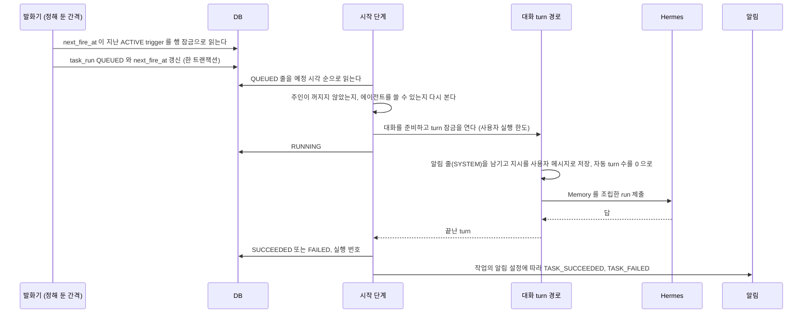

# 예약 작업

정한 시각에 사용자의 권한으로 에이전트를 돌리는 일을 갖는다. 작업을 만들고 고치는 규칙, 발화와 시작, 결과와 알림, 화면이다.
근거는 [ADR-076](../adr/ADR-076-예약-작업은-control-plane-이-갖고-발화한-실행은-대화-turn-경로로-돈다.md), [ADR-077](../adr/ADR-077-발화는-trigger-와-예정-시각의-유일-제약으로-한-번만-만들고-놓친-발화는-작업마다-정한다.md), [ADR-078](../adr/ADR-078-예약-작업의-결과는-실행마다-새-대화가-기본이고-목록은-작업으로-묶는다.md), [ADR-079](../adr/ADR-079-예약-작업은-사용자당-10개-최소-간격-15분-하루-48번으로-제한한다.md) 이다.
칸은 [`schema/task.md`](schema/task.md) 가 갖는다.

예: 「매달 1일 오전 9시에 커리어 커넥터로 지난달 기록을 보고 프로필 변경안을 만들어 줘」.
이 작업은 매달 1일 9시에 새 대화를 열고, 에이전트가 변경안을 쓰려고 커넥터의 쓰기 도구를 부르면 승인 카드와 승인 요청 알림이 생긴다. 사용자가 알림을 눌러 그 대화에서 승인하면 실행된다.

## 작업

| 칸 | 받는 값 | 기본 |
| --- | --- | --- |
| 이름 | 앞뒤 공백을 뗀 1자에서 100자 | |
| 에이전트 | 주인이 대화를 시작할 수 있는 에이전트(`AgentService.requireStartable`). 흐름이 붙은 에이전트는 400 `TASK_AGENT_NOT_SUPPORTED` 로 거절한다 | |
| 지시 | 1자에서 8000자. 대화 메시지 상한과 같다. 발화마다 이 글이 사용자 메시지로 들어간다. `/이름` 으로 시작하면 사람이 보낸 메시지처럼 그 에이전트의 스킬 커맨드로 돈다. 그 에이전트에 켜진 스킬이 아니면 그 발화는 `FAILED` 로 닫힌다 | |
| 시각 | `CRON` 이나 `ONCE`. 아래 「시각」 | |
| 시간대 | IANA 이름 | `assistant.task.default-time-zone`(기본 `Asia/Seoul`) |
| 대화 방식 | `NEW_PER_RUN`, `SINGLE` | `NEW_PER_RUN` |
| 놓친 발화 | `RUN_ONCE`, `SKIP` | `RUN_ONCE` |
| 알림 | `ALWAYS`, `ON_FAILURE`, `NEVER` | `ALWAYS` |

상태는 셋이다.

| 상태 | 뜻 | 바꾸는 것 |
| --- | --- | --- |
| `ACTIVE` | 시각이 오면 발화한다 | 만들기, 다시 켜기 |
| `PAUSED` | 발화하지 않는다. 이미 만든 `QUEUED` 발화는 열지 않고 `SKIPPED`(`PAUSED`)로 닫는다 | 멈추기 |
| `ARCHIVED` | 지운 작업. 목록과 발화에서 빠진다. 대화와 발화 기록은 남는다 | 지우기 |

다시 켜면 `next_fire_at` 을 지금 뒤의 첫 시각으로 다시 계산한다. 멈춘 동안의 시각은 놓친 발화로 세지 않는다.
작업을 고칠 때는 작업 수 상한을 보지 않는다. 시각(종류, cron, `fireAt`, 시간대)이 바뀌었을 때만 시각을 다시 검사하고 `next_fire_at` 을 다시 계산한다. 그래서 이미 발화한 `ONCE` 작업도 이름과 지시를 고칠 수 있다. 에이전트는 고칠 수 있다. 다음 발화부터 새 에이전트로 돈다. `SINGLE` 작업의 에이전트를 바꾸면 다음 발화는 새 대화를 연다. 대화의 에이전트는 바뀌지 않기 때문이다([`schema/chat.md`](schema/chat.md) 의 `conversation`).

### 시각

| 종류 | 값 | 검사 |
| --- | --- | --- |
| `CRON` | 표준 5필드 cron(`분 시 일 월 요일`). 예: 매달 1일 9시는 `0 9 1 * *` | 앞뒤 공백을 뗀 글이 100자를 넘으면 `TASK_SCHEDULE_INVALID`. 저장 칸(`task_trigger.cron_expr`)의 길이다. 필드가 다섯이 아니거나 읽지 못하면 `TASK_SCHEDULE_INVALID`. 지금부터 1년 안의 예정 시각을 펼쳐 이어지는 두 시각의 간격이 `assistant.task.min-interval`(기본 15분)보다 짧으면 `TASK_SCHEDULE_INVALID` |
| `ONCE` | 그 시간대의 날짜와 시각 하나 | 지금보다 뒤가 아니면 `TASK_SCHEDULE_INVALID` |

`CRON` 의 예정 시각은 그 작업의 시간대로 계산한다. Spring `CronExpression` 의 계산을 따른다. 서머타임이 있는 시간대에서 없는 시각은 그날 건너뛰고, 겹친 시각은 두 번 돈다. 두 번의 예정 시각은 서로 다른 순간이라 발화 기록도 두 줄이다.
다음 시각이 없는 cron(예: `0 9 31 2 *`)은 `TASK_SCHEDULE_INVALID` 로 거절한다.
`ONCE` 는 한 번 발화하면 `next_fire_at` 이 비고 작업은 `ACTIVE` 로 남는다. 화면은 「다음 실행 없음」 으로 보인다.

사용자당 보관하지 않은 작업은 `assistant.task.max-per-user`(기본 10)개까지다. 넘으면 `TASK_LIMIT_REACHED` 다.

## 발화와 시작

발화기와 시작 단계는 같은 예약 작업이 차례로 부른다. `assistant.task.dispatch-cron`(기본 30초마다)이 정한다.

### 발화

`next_fire_at` 이 지금보다 앞이고 작업이 `ACTIVE` 인 trigger 를 하나씩 처리한다. trigger 마다 트랜잭션 하나에서 그 줄을 행 잠금으로 다시 읽고 처리한다. 한 trigger 의 실패는 그 trigger 만 되돌리고 다른 trigger 의 발화를 막지 않는다.

| 상황 | 처리 |
| --- | --- |
| 예정 시각이 지난 지 `assistant.task.missed-grace`(기본 2분) 안이다 | 그 시각으로 `QUEUED` 를 만든다 |
| 그보다 늦었고 놓친 발화가 `RUN_ONCE` 다 | 지금 앞의 예정 시각 가운데 가장 늦은 것 하나로 `QUEUED` 를 만든다 |
| 그보다 늦었고 `SKIP` 이다 | 그 시각으로 `SKIPPED`(`MISSED`)를 하나 남긴다. 알리지 않는다 |
| 그 사용자의 24시간 안 발화가 `assistant.task.max-runs-per-day`(기본 48)번에 닿았다 | `SKIPPED`(`DAILY_LIMIT`)로 남기고 알린다 |
| 같은 `(trigger_id, scheduled_for)` 줄이 이미 있다 | 새로 만들지 않는다. `next_fire_at` 만 옮긴다 |

어느 경우든 같은 트랜잭션에서 `last_fired_at` 을 그 예정 시각으로, `next_fire_at` 을 지금 뒤의 첫 예정 시각으로 옮긴다. `ONCE` 는 비운다.

### 시작

`QUEUED` 줄마다 아래를 차례로 본다.

| 상황 | 처리 |
| --- | --- |
| 작업이 `PAUSED` 나 `ARCHIVED` 가 됐다 | `SKIPPED`(`PAUSED`). 알리지 않는다 |
| 주인이 허용 목록에서 꺼졌다(ADR-059) | `SKIPPED`(`OWNER_REVOKED`). 알리지 않는다. 볼 사람이 없다 |
| 에이전트를 지웠거나 껐거나 주인이 더는 쓸 수 없거나 흐름이 붙었다 | `SKIPPED`(`AGENT_UNAVAILABLE`)와 알림 |
| 그 줄을 만든 때(`created_at`)에서 `assistant.task.start-timeout`(기본 10분)이 지났다 | `SKIPPED`(`BUSY`)와 알림. 예정 시각이 아니라 만든 때부터 잰다. 놓친 발화로 늦게 만든 줄도 10분 동안 열 기회를 갖는다 |
| 대화를 준비한다 | `NEW_PER_RUN` 은 그 줄이 대화를 아직 갖지 않았거나 그 대화가 지워졌으면 새 대화를 만들어 줄에 적는다. `SINGLE` 은 작업의 대화가 있고 지워지지 않았고 에이전트가 같으면 그것을, 아니면 새 대화를 만들어 작업에 적는다. 새 대화의 제목은 작업 이름이고 `task_id` 가 그 작업이다 |
| turn 잠금이 `CONVERSATION_BUSY` 나 `USER_BUSY` 다 | `QUEUED` 로 두고 다음 tick 에 다시 본다. 이미 만든 대화는 줄에 남아 다시 쓴다 |
| 잠금을 얻었다 | `RUNNING` 과 `started_at` 을 적고 가상 스레드에서 turn 을 돌린다 |

turn 은 위임 결과를 전하는 자동 turn 과 같은 모양으로 돈다(`DelegationWakeService.runAutoTurn`). 대화 SSE 로 사건을 내고, 끝나면 잠금을 푼다.
그 turn 은 먼저 「예약 작업 「이름」 을 시작했어요」 알림 줄(`SYSTEM`)을 남기고 지시를 사용자 메시지로 저장하고, 대화의 자동 turn 수를 0 으로 돌린다. 지시 뒤에는 사용자가 화면에 없을 수 있다는 안내를 붙인다.

| turn 이 끝난 모양 | `task_run` | 알림 |
| --- | --- | --- |
| 답을 마쳤다 | `SUCCEEDED`, 루트 실행 번호 | `ALWAYS` 면 `TASK_SUCCEEDED` |
| 사용자가 중지했다 | `CANCELLED`, 루트 실행 번호 | 없음 |
| 예외로 끝났다 | `FAILED`(`FAILED`) | `NEVER` 가 아니면 `TASK_FAILED` |

쓰기 도구를 불러 승인을 기다리는 turn 도 답을 마치면 `SUCCEEDED` 다. 승인은 [커넥터 도구 정책](connector-tool-policy.md) 의 「승인이 필요한 호출」 그대로 따로 살고, [알림](notification.md) 의 `APPROVAL_REQUESTED` 가 사람을 부른다.

### 기동할 때

`RUNNING` 으로 남은 `task_run` 은 `FAILED`(`INTERRUPTED`)로 닫고 `NEVER` 가 아니면 `TASK_FAILED` 를 알린다. 다시 돌리지 않는다. 쓰기가 두 번 일어날 수 있다.
발화기는 이 정리가 끝난 뒤에야 돈다. 그 전에 연 줄을 정리가 닫지 않게 하기 위해서다.
그 turn 의 실행 줄은 [대기열과 중지](turn-control.md) 의 「기동할 때 남은 실행 정리」 가 따로 정한다. 답이 대화에 늦게 남을 수 있다.
`QUEUED` 줄은 그대로 두고 다음 tick 이 연다.

## 알림

[알림](notification.md) 의 종류에 셋을 더한다. 받는 사람은 작업 주인이다.

| `kind` | 제목 | 본문 | 누르면 |
| --- | --- | --- | --- |
| `TASK_SUCCEEDED` | 「작업 이름」 실행을 마쳤어요 | 빈 문자열 | 그 대화 |
| `TASK_FAILED` | 「작업 이름」 실행이 실패했어요 | 까닭 한 줄 | 대화가 있으면 그 대화, 없으면 그 작업 |
| `TASK_SKIPPED` | 「작업 이름」 실행을 건너뛰었어요 | 까닭 한 줄 | 그 작업 |

알림 설정이 `ON_FAILURE` 면 `TASK_FAILED` 와 `TASK_SKIPPED` 만, `NEVER` 면 아무것도 만들지 않는다. 알림은 `task_run` 의 상태를 바꾸는 트랜잭션 안에서 만든다.
까닭 한 줄은 화면 문구다. 오류 코드와 내부 원인은 넣지 않는다.

| `reason` | 까닭 한 줄 |
| --- | --- |
| `BUSY` | 다른 대화가 오래 돌고 있어 시작하지 못했어요 |
| `DAILY_LIMIT` | 하루 실행 횟수를 다 썼어요 |
| `AGENT_UNAVAILABLE` | 에이전트를 쓸 수 없어요. 작업의 에이전트를 확인해 주세요 |
| `FAILED` | 실행 중에 문제가 생겼어요 |
| `INTERRUPTED` | 서버가 다시 시작돼 실행이 끊겼어요 |

## API

모두 `/api/v1` 아래이고 로그인한 사용자 자신의 작업만 다룬다. 남의 작업, 없는 작업, 지운 작업은 같은 404 `TASK_NOT_FOUND` 다.

| 메서드 | 경로 | 본문 | 응답 |
| --- | --- | --- | --- |
| GET | `/tasks` | | `List<TaskView>`. 보관하지 않은 작업, 만든 순서의 역순 |
| POST | `/tasks` | `TaskRequest` | `TaskView` |
| GET | `/tasks/{taskId}` | | `TaskView` |
| PUT | `/tasks/{taskId}` | `TaskRequest` | `TaskView` |
| POST | `/tasks/{taskId}/pause` | | `TaskView` |
| POST | `/tasks/{taskId}/resume` | | `TaskView` |
| DELETE | `/tasks/{taskId}` | | 204. 보관한다 |
| GET | `/tasks/{taskId}/runs?limit=` | | `List<TaskRunView>`. 예정 시각의 역순. `limit` 기본 20, 상한 100. 1 에서 100 밖이면 400 `VALIDATION_FAILED` |

`TaskRequest` 는 `title`, `agentCode`, `instruction`, `schedule`, `conversationMode`, `missedPolicy`, `notify` 이다. 뒤의 셋은 비우면 기본값이다.
`schedule` 은 `{ type: "CRON", cron, timeZone }` 이나 `{ type: "ONCE", fireAt, timeZone }` 이다. `fireAt` 은 시간대 없는 날짜와 시각(`2026-11-01T09:00`)이고 `timeZone` 으로 해석한다. `timeZone` 을 비우면 기본 시간대다.

`ScheduleView` 는 요청과 같은 모양이다. `{ type, cron, fireAt, timeZone }` 이고, `fireAt` 은 저장한 UTC 시각을 그 작업의 시간대로 바꾼 시간대 없는 날짜와 시각이다.

`TaskView` 는 `id`, `title`, `agentCode`, `agentName`, `instruction`, `state`, `schedule`, `nextFireAt`, `lastFiredAt`, `conversationMode`, `missedPolicy`, `notify`, `createdAt` 이다.
`TaskRunView` 는 `id`, `scheduledFor`, `status`, `reason`, `conversationId`, `startedAt`, `finishedAt` 이다. `conversationId` 는 대화의 공개 식별자다.

대화 목록(`GET /api/v1/chat/conversations`)의 `ConversationView` 에 `taskId` 와 `taskTitle` 을 더한다. 작업이 만든 대화가 아니면 둘 다 비어 있다. 보관한 작업의 대화도 작업 이름을 보인다.

## 화면

| 경로 | 화면 |
| --- | --- |
| `/tasks` | 내 예약 작업 목록. 줄마다 이름, 에이전트, 시각을 사람 말로 적은 것, 다음 실행, 상태. 위에 「새 작업」. 없으면 「아직 예약 작업이 없어요.」 |
| `/tasks/new` | 작업 만들기 |
| `/tasks/{id}` | 작업 고치기, 멈추기와 다시 켜기, 지우기, 최근 실행 목록. 실행 줄을 누르면 그 대화로 간다 |

시각을 고르는 칸은 「매일」, 「매주」(요일), 「매달」(날짜), 「한 번」(날짜), 「직접 입력」(cron) 중 하나와 시각이다. 앞의 넷은 화면이 5필드 cron 이나 `ONCE` 로 바꿔 보낸다. 서버는 cron 만 안다.
에이전트 고르기 목록은 새 대화 화면과 같은 목록이다. 에이전트 목록 API 가 흐름과 켜짐 여부를 싣지 않아 흐름 에이전트를 목록에서 빼지 못한다. 그런 에이전트를 고르면 서버가 거절하고 화면은 「이 에이전트로는 예약 작업을 만들 수 없어요.」 를 보인다.
주요 화면 메뉴에 「예약 작업」 을 더한다.

대화 목록은 `taskId` 가 있는 대화를 날짜 묶음에서 빼고, 목록 맨 위의 「예약 작업」 묶음 아래 작업 이름마다 접힌 줄 하나로 모은다. 작업 이름 줄을 누르면 그 작업의 대화가 최근 순으로 펼쳐진다. 지금 연 대화가 작업 대화면 그 작업 줄이 펼쳐진 채 보인다.
검색은 작업 대화의 제목도 거른다. 걸린 대화가 있는 작업 줄은 펼쳐 보인다.

## 설정

| 키 | 기본 | 뜻 |
| --- | --- | --- |
| `assistant.task.dispatch-cron` | `*/30 * * * * *` | 발화기와 시작 단계가 도는 때. 검사에서는 `-` 로 끈다 |
| `assistant.task.missed-grace` | `2m` | 이만큼 늦은 예정 시각은 놓친 것으로 보지 않는다 |
| `assistant.task.start-timeout` | `10m` | `QUEUED` 줄이 만들어진 뒤 이만큼 열리지 못하면 `SKIPPED`(`BUSY`) |
| `assistant.task.max-per-user` | `10` | 사용자당 보관하지 않은 작업 수 |
| `assistant.task.min-interval` | `15m` | 반복 시각의 최소 간격 |
| `assistant.task.max-runs-per-day` | `48` | 사용자당 24시간 안의 발화 수 |
| `assistant.task.default-time-zone` | `Asia/Seoul` | 시간대를 비운 작업의 시간대 |

## 다음 단계

아래는 아직 만들지 않았다. 이 문서의 표에 그 자리를 남겨 두지 않았다.

- 실패를 다시 하기와 연속 실패에 따른 일시 정지, 주인 권한을 잃었을 때의 일시 정지
- 작업 범위로 기간을 정해 `required` 도구를 미리 허락하는 것
- 에이전트가 작업을 제안하고 사람이 받아들이는 것. 받아들이기 전에는 발화하지 않는다
- 웹 푸시
- webhook 과 커넥터 사건 trigger. 넣지 않기로 했다
