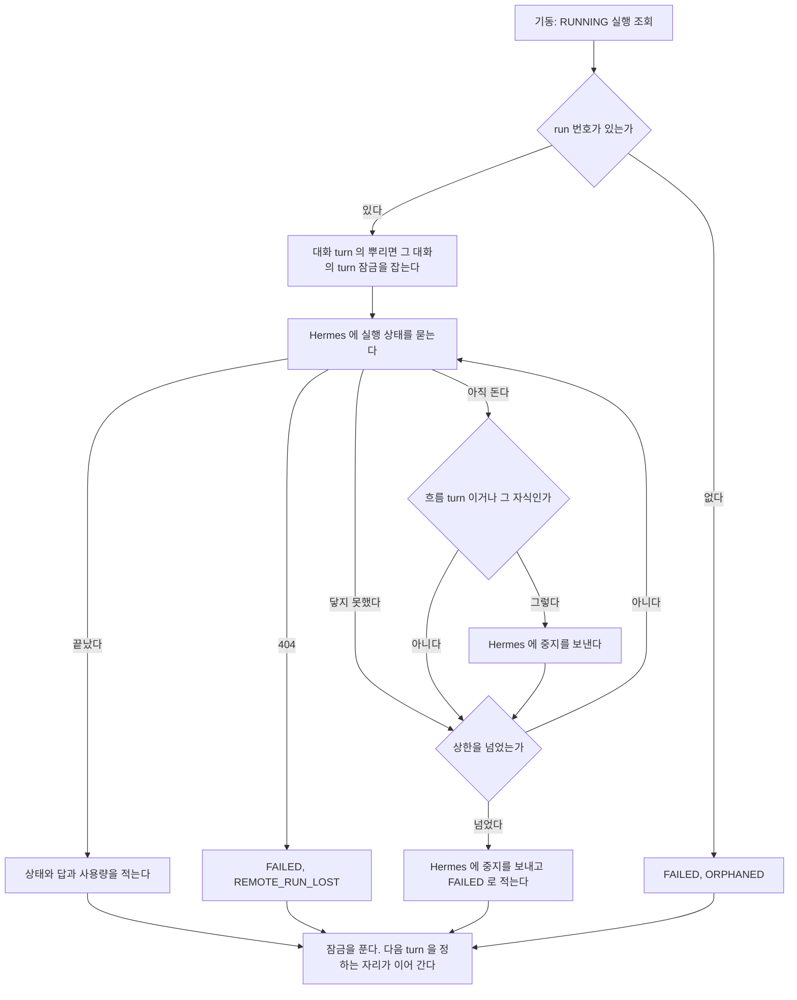
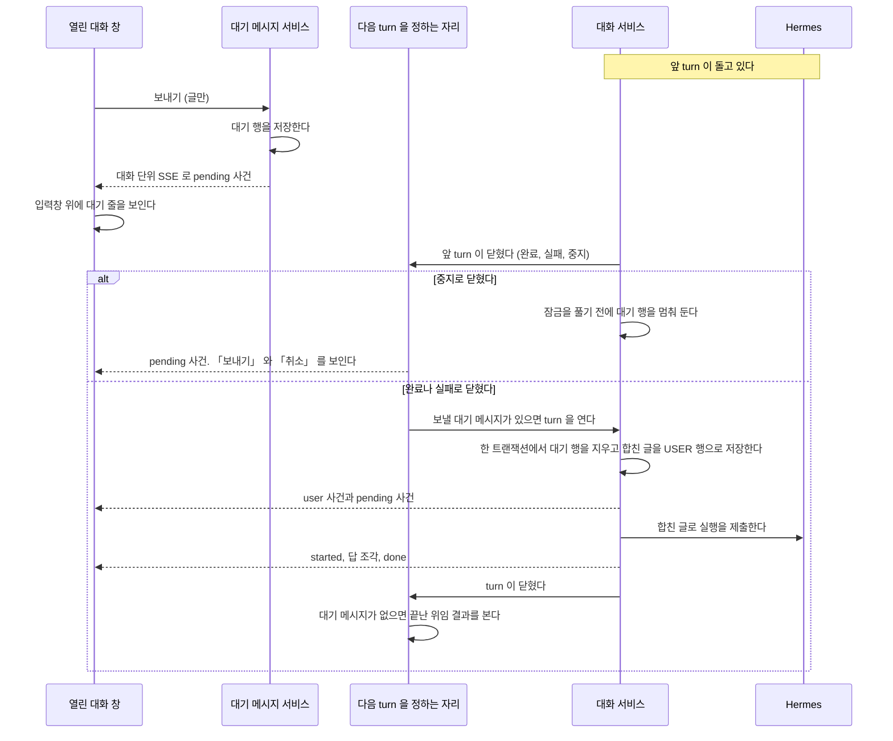
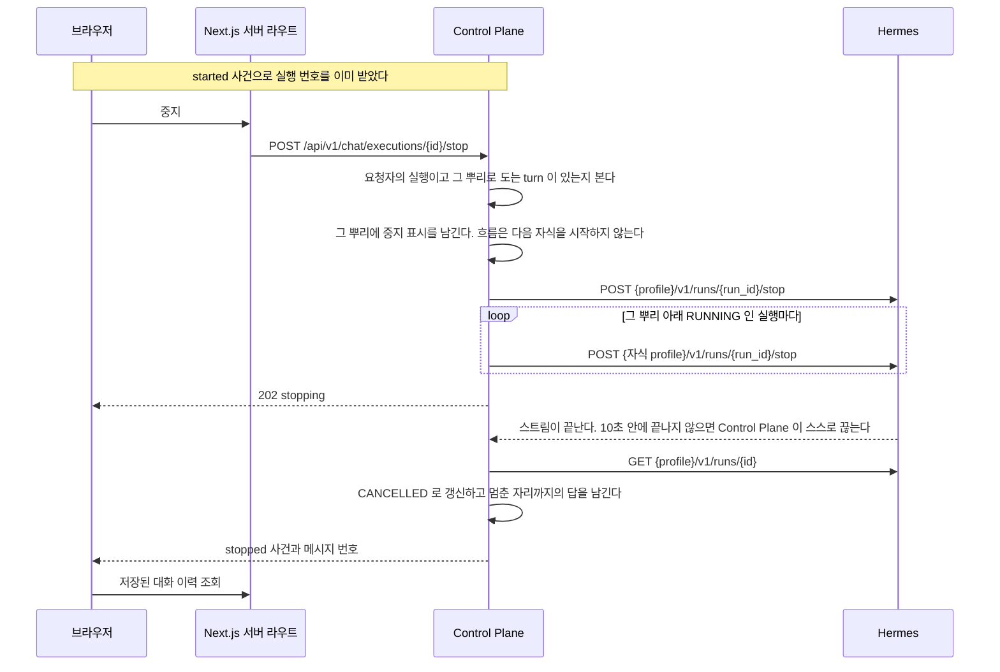

# 대기열과 중지

한 대화에 turn 이 하나만 돌게 하는 규칙을 갖는다.
응답 중에 보낸 메시지를 쌓았다가 다음 turn 으로 보내는 대기열, 도는 turn 의 중지, 기동할 때 남은 실행의 정리가 여기 있다.

## 응답 중 대기열

결정은 [ADR-048](../adr/ADR-048-응답-중에-보낸-메시지는-control-plane-이-쌓아-두고-다음-turn-으로-합쳐-보낸다.md), 흐름은 아래 「응답 중에 보낼 때」 에 있다.

| 자리 | 맡는 것 |
| --- | --- |
| `chat.domain.ChatPendingMessage` | 대기 메시지 한 행. `chat_pending_message` 표다 |
| `chat.infra.ChatPendingMessageRepository` | 대화별 대기 행 읽기, 세기, 지우기, 멈춤 표시 바꾸기. 트랜잭션은 부르는 서비스가 연다 |
| `chat.application.PendingMessageService` | 대기 줄 읽기, 더하기, 취소, 멈춤 풀기. 상한을 보고 `pending` 사건을 낸다. 더하거나 푼 뒤 `NextTurnDispatcher` 를 부른다 |
| `chat.application.PendingQueue` | 서비스가 돌려주는 대기 줄. `held` 와 대기 행 목록 |
| `chat.application.NextTurnDispatcher` | 다음 turn 을 정하는 한 자리. turn 종료, 위임 종료 사건, 기동을 받는다 |
| `chat.application.TurnClosed` | turn 이 닫혔다는 알림. 대화 번호와 중지로 끝났는지를 싣는다 |
| `chat.application.ChatService` | `runPendingMessages` 가 대기 행을 합쳐 `TurnIntent.Fresh` 로 turn 을 돌린다. 대화를 지울 때 대기 행도 지운다 |
| `chat.presentation.PendingMessageController` | [`conversation.md`](conversation.md) 의 「경로」 가 적은 `pending` 경로 넷 |
| 웹 `app/api/chat/conversations/[conversationId]/pending/` | `route.ts`(GET, POST), `[pendingId]/route.ts`(DELETE), `send/route.ts`(POST). Control Plane 으로 그대로 넘긴다 |
| 웹 `lib/pending-route.ts` | 위 서버 라우트 셋이 함께 쓰는 넘기기와 형식 오류 응답. Control Plane 의 상태와 본문을 다시 감싸지 않는다 |
| 웹 `lib/pending-messages.ts` | 브라우저가 위 서버 라우트를 부르는 함수 |
| 웹 `components/chat-panel.tsx` | 보낼 때 보통 보내기와 대기 경로 가운데 하나를 고른다. 답이 도는 중이거나 대기 줄이 멈춰 있으면 대기 경로다. 보통 보내기가 `CONVERSATION_BUSY` 로 거절되면 글만 보낸 경우에 대기 메시지로 다시 넣는다. `user` 사건은 사용자 줄로 그리고, `pending` 사건은 보류하지 않고 곧바로 대기 줄을 다시 읽는다 |
| 웹 `components/chat/use-pending-queue.ts` | 대기 줄 상태. 대화를 열 때와 `pending` 사건을 받을 때 다시 읽는다 |
| 웹 `components/chat/pending-queue.tsx` | 입력창 위의 대기 줄. 취소 단추와, 멈춰 있을 때의 「보내기」 |

**다음 turn 을 정하는 자리는 `NextTurnDispatcher.tryNext` 하나다.**
`TurnCancellation` 의 종료 리스너는 이것 하나만 건다.
대기 메시지와 위임 결과가 리스너를 따로 걸면 같은 순간에 잠금을 다투고 순서가 등록 순서에 달린다.

`tryNext` 는 아래 순서로 본다.

1. 그 대화에 대기 행이 있고 멈춰 둔 행이 하나도 없으면 turn 잠금을 잡고 새 가상 스레드에서 `ChatService.runPendingMessages` 를 돌린다. 잠금을 잡지 못하면 도는 turn 이 닫힐 때 다시 온다.
2. 보낼 대기 행이 없으면 `DelegationWakeService.tryWake` 로 넘긴다.

turn 이 닫힐 때, 위임이 끝났을 때, 서버가 뜰 때, 기동 정리가 잠금을 풀 때 모두 이 자리를 지난다. 그래서 사용자의 말이 위임 결과보다 먼저 간다.

turn 이 중지로 끝나면 `ChatService` 가 취소된 turn 을 돌려주는 자리에서 `TurnCancellation.markStopped` 를 적고 그 대화의 대기 행을 모두 멈춰 둔다.
**잠금을 풀기 전에 멈춘다.** 잠금을 푼 뒤 종료 리스너에서 멈추면 그 사이 다른 스레드의 `tryNext` 가 아직 멈추지 않은 행으로 turn 을 연다.
**사용자가 중지를 확정한 실행은 `RUNNING` 으로 남지 않는다.** 중지가 확정된 turn 이 예외로 끝나면 실행 줄이 아직 끝나지 않았을 때 취소로 적고(이미 `FAILED` 면 그대로 둔다), 그 뒤 잠금을 풀기 전에 대기 행을 멈춘다. 흐름 turn 도 같다.
대기 줄 처리(멈춤, `pending` 알림)의 실패는 경고 로그로만 남고 취소 기록과 잠금 해제를 막지 않는다.
취소 기록을 먼저 남기고 그 뒤에 멈춘다. 멈추다 실패하면 경고 로그만 남기고 그 turn 은 `stopped` 로 끝난다. 실행 줄이 `RUNNING` 으로 남지 않게 하기 위해서다.
닫을 때 `TurnClosed.stopped` 가 참이면 `NextTurnDispatcher` 가 `pending` 사건을 낸다. 그 알림이 실패해도 `tryNext` 는 부른다.

**멈춤은 행마다 `held` 로 DB 에 적는다.** 한 행이라도 멈춰 있으면 그 대화의 대기 줄 전체를 보내지 않는다.
대기 줄이 멈춰 있을 때 더한 행은 멈춘 채로 들어간다.
메모리에만 두면 서버가 다시 뜬 뒤 기동 확인이 사용자가 멈춘 글을 보내 버린다.

대기 행을 지우는 것과 `USER` 행을 저장하는 것은 `ChatService.saveQuestion` 의 같은 트랜잭션이다.
지운 행 수가 읽은 행 수와 다르면 되돌리고 대기 행을 다시 읽어 합친다. 읽은 뒤 취소된 행이 있었다는 뜻이다.
그 트랜잭션 뒤에 `user` 사건과 `pending` 사건을 낸다.

사용자 메시지를 저장하기 전에 실패하면 대기 행이 그대로 남는다.
그대로 닫으면 종료 리스너가 같은 행으로 곧바로 다시 열어 같은 실패를 되풀이한다.
그래서 `NextTurnDispatcher` 가 남은 행을 멈춰 두고 `error` 사건을 낸다.
멈추는 것까지 실패하면 그 대화는 30초 동안 대기 메시지 turn 을 다시 열지 않는다. 실패 시각은 메모리에만 두며 서버가 다시 뜨면 사라진다. 그동안에도 위임 결과는 전한다.

더할 때의 상한 확인과 저장은 대화별 잠금 안에서 한다. 잠금은 메모리에 있고, turn 잠금과 같이 서버 한 대를 전제로 한다.
`POST .../pending` 은 저장한 뒤 언제나 `tryNext` 를 부른다.
turn 이 도는지 먼저 보고 저장할지 정하면, 보는 순간과 저장하는 순간 사이에 turn 이 닫혔을 때 그 글을 보낼 계기가 없다.

대기 메시지 경로는 `assistant.delegation-wake.enabled` 와 무관하게 켜져 있다. 그 설정은 위임 결과 쪽만 끈다.

## 중지

`chat/application` 의 `TurnCancellation` 이 도는 turn 마다 중지 표시를 하나 갖는다. 뿌리 실행 번호가 열쇠다.
`ChatService` 가 turn 을 시작할 때 등록하고 끝날 때 지운다.
실행 줄을 만들면 열쇠를 그 실행 번호로 옮긴다.
중지 경로가 그 표시를 세우고, 흐름은 자식을 시작하기 전과 합치기 전에 그것을 본다.
같은 대화에 도는 turn 이 있는지도 여기서 본다. 보내기와 다시 생성이 `CONVERSATION_BUSY` 를 판정하는 자리다.
화면은 turn 이 도는 동안 보내기 대신 대기 메시지 경로를 쓴다. 위 「응답 중 대기열」 이 갖는다.
같은 Hermes session 에 두 turn 이 겹쳐 들어가면 어느 답이 어느 질문의 것인지 모델도 모른다.

`ChatService` 와 흐름이 서로를 부르지 않게 표시를 따로 둔다.
검사: `ArchitectureRules.ORCHESTRATION_DOES_NOT_CALL_CHAT_SERVICE`

| 규칙 | 까닭 |
| --- | --- |
| 등록과 해제는 `ChatService` 만 한다. 흐름 경로도, 한 번에 받는 경로도 등록한다 | 등록되지 않은 turn 은 중지도 `CONVERSATION_BUSY` 도 받지 못한다 |
| 같은 대화에 도는 turn 이 있는지 보는 것과 등록하는 것을 한 번에 한다 | 둘 사이에 다시 생성 두 개가 함께 들어오면 같은 답을 가리키는 판이 둘 생긴다 |
| Hermes 에 제출한 직후 run 번호를 등록한다. `AgentRunner` 는 제출 뒤 부르는 콜백으로 알린다 | 흐름의 Chief 는 `AgentRunner` 안에서 제출된다. 알리지 않으면 Chief 를 멈출 수 없다 |
| run 을 등록할 때 이미 중지 표시가 서 있으면 그 자리에서 중지를 보낸다 | `started` 뒤 제출 전에 들어온 중지가 사라지지 않게 한다 |
| run 마다 중지를 보냈는지 적는다. 다시 부르면 보내지 못한 run 에만 다시 보낸다 | 보내다 실패한 뒤 다시 눌러도 아무 일이 없으면 안 된다 |
| 중지를 보낸 뒤 스트림이 10초 안에 끝나지 않으면 중계 쪽이 스트림을 닫고 상태 조회로 넘어간다 | 취소된 run 의 스트림이 닫히는지 실제 Hermes 로 확인하지 못했다 |

Hermes 에 중지를 보내는 것은 `hermes` 가, 누구의 무엇을 멈출지 정하는 것은 `chat` 이 한다.
뿌리 아래에서 도는 실행은 `root_execution_id` 로 찾는다.
그 자식의 에이전트 행이 없으면 그 자식은 로그만 남기고 건너뛰고, 뿌리의 중지는 계속한다([`agent.md`](agent.md) 의 「에이전트 만들기와 지우기」 절).
`agent_delegate` 로 맡긴 자식도 run 번호가 붙을 때 `AgentDelegationService` 가 뿌리 turn 의 표시에 그 run 을 붙인다.
turn 이 끝난 뒤에 맡긴 자식은 붙일 표시가 없어 `agent_stop` 으로만 멈춘다.

**중지할 수 있는지를 실행 줄의 상태로 판정하지 않는다.**
흐름으로 도는 turn 은 Chief 가 끝나면 뿌리 줄이 `SUCCEEDED` 가 되고 그 뒤에 자식이 돈다.
줄 상태로 보면 자식이 도는 동안 중지를 거절하게 된다.
그래서 이 프로세스에 등록된 도는 turn 이 그 번호를 뿌리로 갖는지로 본다.
멈춘 turn 의 뿌리 줄은 이미 `SUCCEEDED` 였어도 `CANCELLED` 로 덮어쓴다. 토큰과 비용은 그대로 둔다.

**다른 창이 도는 turn 을 물을 때도 이 표시를 본다.** 실행 줄의 상태로 보지 않는다.
줄 상태로 보면 자식이 도는 동안 「돌지 않는다」고 답하게 된다. 중지 판정과 같은 까닭이다.
`running` 경로는 대화의 표시가 가진 뿌리 실행 번호를 돌려주고, `startedAt` 은 그 실행 줄에서 읽는다.
표시가 있는데 실행 번호가 아직 붙지 않았으면 `running` 은 true 이고 `executionId` 와 `startedAt` 은 null 이다.

**표시는 한 프로세스의 메모리에 있다.** Control Plane 이 하나라서 그것으로 된다.
둘 이상으로 늘리면 이 표시를 데이터베이스로 옮겨야 한다.

## 기동할 때 남은 실행 정리

이전 프로세스가 남긴 `RUNNING` 실행을 Hermes 에 물어 정한다.
결정과 버린 대안은 [ADR-059](../adr/ADR-059-재기동-때-남은-실행은-hermes-에-물어-정하고-도는-실행에는-다시-붙는다.md) 에 있다.
Hermes 의 실행 조회가 무엇을 얼마 동안 답하는지는 [`hermes/runs-api.md`](../hermes/runs-api.md) 의 「실행 조회가 답하는 기간」 이 갖는다.

| 자리 | 맡는 것 |
| --- | --- |
| `chat.application.RestartReconciler` | 기동할 때 남은 실행을 나누고, 대화의 turn 잠금을 잡고, 실행마다 가상 스레드에서 Hermes 에 묻는다 |
| `chat.application.RecoveredRunRecorder` | Hermes 의 답 하나를 실행 줄과 대화에 적는다. 이미 끝난 줄이면 아무것도 하지 않는다 |
| `chat.application.RestartReconcileProperties` | `assistant.restart-reconcile.enabled` 와 `max-wait`. `max-wait` 을 비우면 `hermes.run-timeout` 이다 |
| `hermes.HermesRunsClient.lookupRun` | 실행 하나의 지금 상태를 한 번 읽는다. 끝났다, 돈다, 모른다(404) 가운데 하나다. 닿지 못하면 예외다 |

두 단계로 돈다.

1. **잡기.** 웹 서버가 요청을 받기 전에 돈다. `RUNNING` 줄을 읽고, run 번호가 있는 대화 turn 과 흐름 turn 의 뿌리 줄마다 그 대화의 turn 잠금을 잡는다.
   그 실행 번호와 run 을 표시에 붙인다. Hermes 를 부르지 않고 실행 줄도 고치지 않는다.
2. **묻기.** `ApplicationReadyEvent` 에서 시작한다. `NextTurnDispatcher` 의 기동 뒤 깨우기보다 먼저다.
   run 번호가 없는 줄을 `FAILED`(`ORPHANED`) 로 적고, 나머지는 실행마다 가상 스레드 하나가 Hermes 에 묻고 끝날 때까지 다시 묻는다. 줄을 적은 뒤 잡은 잠금을 푼다.

Control Plane 이 내려갈 때 묻던 스레드는 줄을 적지 않고 끝난다. 줄이 `RUNNING` 으로 남아 다음 기동이 다시 정한다.
`assistant.restart-reconcile.enabled` 를 false 로 두면 기동 때 잡지도 묻지도 않는다. 테스트 profile 이 이렇게 돈다. 운영에서는 끄지 않는다. 끄면 `RUNNING` 줄이 그대로 남는다.

**실행의 종류마다 적는 것이 다르다.**

| 실행 | 판정 | 끝났을 때 적는 것 | 아직 돌 때 |
| --- | --- | --- | --- |
| 대화 turn | 부모가 없고 대화가 있다. 그 에이전트에 흐름이 없다 | 실행 줄, `ASSISTANT` 메시지, 대화의 session. 그 실행이 시작한 뒤 대화 폴더에 생긴 HTML 을 답에 묶는다. 대화 단위 SSE 로 `done`, `stopped`, `error` 가운데 하나를 낸다 | 다시 붙는다. 그 대화의 turn 잠금을 쥔다 |
| 위임 실행 | `delegation_key` 가 있다 | 실행 줄과 `output_text`. `DelegationFinished` 를 낸다 | 다시 붙는다. 잠금은 잡지 않는다 |
| 흐름 turn 과 그 자식 | 뿌리 실행의 에이전트에 흐름이 있다 | 실행 줄. 뿌리는 성공으로 끝났어도 `FAILED`(`ORPHANED`) 로 적고 사용량은 남긴다 | 중지를 보내고 끝난 상태를 기다린다. 뿌리는 그 대화의 turn 잠금을 쥔다 |
| 그 밖의 실행(Memory 제안, 추천 질문) | 위 셋이 아니다 | 실행 줄만 적는다. 답은 쓰지 않는다 | 다시 붙는다. 잠금은 잡지 않는다 |

실행 줄은 보통 turn 과 같은 기록 경로로 적는다. 성공은 `ExecutionRecorder.complete`, 실패는 사용량을 남기는 `ExecutionRecorder.fail`, 취소는 `ExecutionRecorder.cancel` 이다.
위임 답은 보통 위임과 같이 `assistant.delegation.output-max-chars` 까지 자른다.
대화 turn 의 답은 그 대화의 마지막 메시지가 `ASSISTANT` 이면 그 답을 다시 생성한 것으로 적는다. 다시 생성은 질문을 새로 저장하지 않기 때문이다.

### 갈리는 지점

| 경우 | 결과 |
| --- | --- |
| Hermes 에서 성공으로 끝났다 | `SUCCEEDED`. 답과 토큰과 비용을 적는다. 대화 turn 이면 답이 이력에 남는다 |
| Hermes 에서 실패로 끝났다(`failed`, `error`, `interrupted`) | `FAILED`. `error_code` 는 보통 turn 과 같다. 받은 사용량을 남긴다 |
| Hermes 에서 취소로 끝났다 | `CANCELLED`. 멈춘 자리까지의 답과 사용량을 남긴다 |
| 아직 돈다 | `RUNNING` 으로 두고 `hermes.poll-interval` 마다 다시 묻는다 |
| 404 다 | `FAILED`(`REMOTE_RUN_LOST`). Hermes 가 그 run 을 모른다. gateway 가 다시 떴거나 종료 뒤 1시간이 지났다 |
| 닿지 못했다(연결 실패, 5xx, 429) | `RUNNING` 과 잠금을 그대로 두고 다시 묻는다. 간격은 `hermes.poll-interval` 에서 시작해 5초까지 늘린다 |
| 상한을 넘겼다 | Hermes 에 중지를 보내고 `FAILED` 로 적는다. 한 번이라도 답을 받았으면 `RECONCILE_TIMEOUT`, 한 번도 받지 못했으면 `RECONCILE_UNREACHABLE` 이다 |
| run 번호가 없다 | 묻지 않고 `FAILED`(`ORPHANED`). 제출 전이었거나 제출 응답을 받기 전에 끊겼다 |
| 에이전트 행이 없다 | 물을 주소가 없다. `FAILED`(`ORPHANED`) |
| 다시 정하는 동안 그 대화에 글을 보낸다 | 도는 turn 이 있는 대화와 같다. 보통 보내기는 `CONVERSATION_BUSY` 이고 화면은 대기 메시지로 쌓는다. 잠금이 풀리면 `NextTurnDispatcher` 가 보낸다 |
| 다시 정하는 동안 그 대화를 연다 | `running` 경로가 그 실행 번호를 돌려준다. 화면은 「답을 만드는 중」 을 보이고 끝나면 이력을 다시 읽는다. 답 조각은 흐르지 않는다 |
| 다시 붙은 대화 turn 을 사용자가 중지한다 | 보통 중지와 같다. 표시에 붙여 둔 run 에 중지를 보낸다. Hermes 가 취소로 끝내면 `CANCELLED` 로 적고 대기 줄을 멈춘다 |
| 다시 붙은 위임 실행에 `agent_stop` 이 온다 | Hermes 에 중지를 보낸다. 다시 물을 때 취소로 읽혀 `CANCELLED` 로 적힌다 |
| 다시 정하는 중에 Control Plane 이 또 내려간다 | 줄이 `RUNNING` 으로 남아 다음 기동이 처음부터 다시 정한다. 상한도 새로 센다 |
| 적다가 실패했다(일시적인 DB 오류) | 실패로 적지 않고 다시 묻는다. Hermes 가 같은 답을 다시 준다 |
| 같은 실행을 두 번 적으려 한다 | 실행 줄을 잠그고 `RUNNING` 인지 본 뒤에 적는다. 이미 끝난 줄이면 메시지도 사건도 더하지 않는다 |
| 끝난 위임 결과 | 부모 대화에는 `result_delivered_at` 이 빈 줄만 전하므로 다시 떠도 한 번만 간다 |

**다음 turn 을 정하는 자리는 그대로 `NextTurnDispatcher.tryNext` 하나다.**
다시 정하는 쪽은 turn 을 열지 않는다. 잠금을 풀면 닫기 리스너가 `tryNext` 를 부르고, 위임 실행을 적으면 `DelegationFinished` 가 `tryNext` 를 부른다.
기동 뒤 깨우기(`dispatchAfterStartup`)는 잠금이 잡힌 대화를 건너뛰고, 그 잠금이 풀릴 때 다시 온다.

**잡기는 웹 서버보다 먼저 끝난다.** `RestartReconciler` 는 웹 서버를 여는 lifecycle 보다 앞선 phase 의 `SmartLifecycle` 이다.
`ApplicationReadyEvent` 에서 잡으면 웹 서버가 이미 요청을 받고 있어, 그 사이 들어온 보내기가 같은 Hermes session 에 turn 을 하나 더 연다.
Flyway 는 빈을 만들 때 끝나므로 lifecycle 이 시작할 때는 표가 이미 있다.

다시 붙은 실행의 작업 과정에는 끊기기 전의 사건과 끝 사건(`RUN_COMPLETED`, `RUN_FAILED`, `RUN_CANCELLED`)만 남는다. 끝 사건의 순번은 그 실행의 마지막 순번 다음이다.

이 방식은 Control Plane이 한 대만 돈다는 전제를 쓴다.
여러 대로 늘리면 다른 인스턴스가 돌리는 실행에 붙지 않도록 정리 방식을 다시 정해야 한다.

## 응답 중에 보낼 때

turn 이 도는 동안 보낸 글은 Control Plane 이 대기 메시지로 저장한다.
그 turn 이 끝나면 쌓인 것을 합쳐 사용자 메시지 하나로 다음 turn 을 연다.
결정은 [ADR-048](../adr/ADR-048-응답-중에-보낸-메시지는-control-plane-이-쌓아-두고-다음-turn-으로-합쳐-보낸다.md) 에 있다.

다음 turn 을 정하는 순서는 위 「응답 중 대기열」 이 갖는다.

합친 글은 쌓인 순서대로 빈 줄 하나를 사이에 두고 잇는다.
대화에는 `USER` 행 하나만 남는다.
대기 메시지로 연 turn 은 사용자가 보낸 turn 과 같다. `auto_turn_count` 를 0 으로 돌리고, 답은 다시 생성할 수 있다.
요청한 연결이 없으므로 사건은 대화 단위 SSE 로만 간다.

### 갈리는 지점

| 경우 | 결과 |
| --- | --- |
| 도는 turn 이 없고 멈춰 둔 대기 메시지도 없다 | 화면은 대기 경로를 쓰지 않고 보통 보내기로 보낸다 |
| turn 이 도는 동안 보낸다 | 대기 행을 저장하고 `pending` 사건을 낸다. 입력창을 비우고 대기 줄에 그 글을 보인다 |
| 대기 메시지를 저장한 순간 turn 이 이미 닫혔다 | 저장한 뒤 다음 turn 을 정하는 자리를 한 번 부른다. 잠금을 잡으면 그 자리에서 보낸다 |
| 앞 turn 이 완료로 끝났다 | 쌓인 것을 합쳐 바로 보낸다 |
| 앞 turn 이 실패로 끝났다 | 쌓인 것을 합쳐 바로 보낸다 |
| 앞 turn 을 사용자가 중지했다 | 보내지 않고 멈춰 둔다. 대기 줄에 「보내기」 와 「취소」 를 보인다 |
| 중지한 turn 이 오류로 끝났다 | 실행은 취소로 남고 화면은 `error` 를 받는다. 대기 줄은 중지와 같이 멈춰 둔다 |
| 멈춰 둔 대기 줄에서 「보내기」 를 누른다 | 멈춤을 풀고 다음 turn 을 정하는 자리를 부른다. turn 이 돌고 있으면 그 turn 이 끝난 뒤 간다 |
| 대기 줄이 멈춰 있을 때 입력창에서 새 글을 보낸다 | 그 글을 대기 메시지로 더한 뒤 「보내기」 와 같이 푼다. 멈춰 둔 글과 새 글이 순서대로 합쳐져 간다 |
| 대기 줄이 멈춰 있을 때 다른 turn 이 끝났다(다시 생성, 자동 turn) | 멈춘 채로 둔다. 사용자가 풀 때까지 보내지 않는다 |
| 대기 메시지를 취소한다 | 그 행을 지우고 글을 입력창으로 되돌린다. 입력창에 쓰던 글이 있으면 그 뒤에 줄을 바꿔 붙인다 |
| 취소하는 사이에 이미 보내졌다 | `PENDING_MESSAGE_NOT_FOUND`. 입력창에 되돌리지 않는다. 그 글은 이미 사용자 메시지로 저장됐다 |
| 대기 메시지가 5개다. 또는 더하면 합친 길이가 8000자를 넘는다 | `PENDING_QUEUE_FULL`. 저장하지 않고 글을 입력창에 되돌린다 |
| 사진을 붙여 보내려 한다 | 대기 메시지는 글만 받는다. turn 이 도는 동안 사진 첨부는 잠겨 있다 |
| 새 대화의 첫 turn 이 아직 대화 식별자를 받지 못했다 | 보내기를 막는다. `started` 가 식별자를 실어 온 뒤부터 대기 메시지를 받는다 |
| 흐름이 붙은 에이전트의 대화다 | 대기 메시지를 받지 않는다. `CONVERSATION_BUSY` 로 거절한다. 글은 입력창에 남기고 「이 대화는 답이 끝난 뒤 보낼 수 있어요」 를 보인다. 흐름은 질문을 흐름 안에서 저장해 대기 행 삭제와 한 트랜잭션으로 묶을 수 없다 |
| 에이전트가 꺼졌거나 지워졌다 | 대기 메시지를 받지 않는다. 보통 보내기와 같은 `AGENT_DISABLED`, `AGENT_NOT_FOUND` 다 |
| 대기 메시지가 `/이름` 으로 시작한다 | 합친 글을 보통 보내기와 같이 스킬 커맨드로 읽는다 |
| 보내려는데 사용자 메시지를 저장하기 전에 실패했다(꺼진 에이전트, 없는 스킬 커맨드) | 대기 행을 멈춰 두고 `error` 사건과 `pending` 사건을 낸다. 그대로 두면 turn 을 닫을 때마다 같은 실패를 되풀이한다 |
| 사용자 메시지를 저장한 뒤 실행이 실패했다 | 보통 turn 의 실패와 같다. 대기 행은 이미 지워졌고 그 글은 사용자 메시지로 남는다 |
| 대기 메시지로 연 turn 을 중지한다 | 보통 turn 의 중지와 같다. 그 사이 새로 쌓인 대기 메시지는 멈춰 둔다 |
| 보낼 대기 메시지와 끝난 위임 결과가 함께 있다 | 대기 메시지를 먼저 보낸다. 그 turn 이 닫힌 뒤 위임 결과를 전한다 |
| 서버가 다시 뜬다 | 멈춰 두지 않은 대기 메시지가 있는 대화를 차례로 보낸다. 멈춰 둔 것은 그대로 둔다. 기동 정리가 turn 잠금을 쥔 대화는 그 잠금이 풀린 뒤에 보낸다 |
| 대화를 지운다 | 그 대화의 대기 행을 함께 지운다 |
| 다른 창이 같은 대화를 보고 있다 | `pending` 사건을 받으면 대기 줄을 다시 읽는다. 어느 창에서든 취소하고 보낼 수 있다 |
| 대화 단위 SSE 가 끊겼다가 다시 연결된다 | 대기 줄을 다시 읽는다. 끊긴 사이의 `pending` 사건을 놓쳤을 수 있다 |
| 대화 창이 닫혀 있다 | turn 은 그대로 돌고 답은 `chat_message` 에 남는다 |

대화 창은 대화를 열 때와 `pending` 사건을 받을 때 대기 줄을 다시 읽는다.
대기 줄은 저장된 것만 보인다. 화면이 따로 기억하지 않는다.

## 중지할 때

답을 만드는 동안 보내기 단추 옆에 중지 단추 `■` 가 나온다.
중지했을 때 쌓여 있던 대기 메시지는 보내지 않고 멈춰 둔다. 「응답 중에 보낼 때」 절이 갖는다.

멈춘 자리까지의 답을 남기는 근거는
[ADR-021](../adr/ADR-021-중지한-답은-멈춘-자리까지-남긴다.md) 에 있다.

| 상황 | 화면 |
| --- | --- |
| `started` 가 오기 전에 누른다 | 단추가 눌리지 않는다. 실행 번호가 아직 없다 |
| 그 번호로 도는 turn 이 없다 | `EXECUTION_NOT_RUNNING`. 이미 끝난 번호다. 알리지 않고 곧 올 끝 사건을 기다린다 |
| 남의 실행 번호다 | `EXECUTION_NOT_FOUND`. 없는 것과 같은 오류다 |
| Hermes 에 중지를 보내지 못했다 | 중지 단추를 다시 누를 수 있게 되돌리고 오류를 알린다 |
| 멈춘 자리까지 나온 답이 없다 | 답 메시지를 만들지 않는다. 사용자 메시지 아래에 답을 받지 못했다는 안내와 「다시 시도」 |
| 중지한 답 | 답 아래에 「중지됨」 표시. 다시 생성할 수 있다 |

중지 단추를 누른 뒤 `stopped` 가 올 때까지 단추는 잠긴다.
Hermes 에 보내지 못해 오류를 받았을 때만 다시 풀린다.

중지할 수 있는지를 판정하는 기준은 위 「중지」 가 갖는다.
