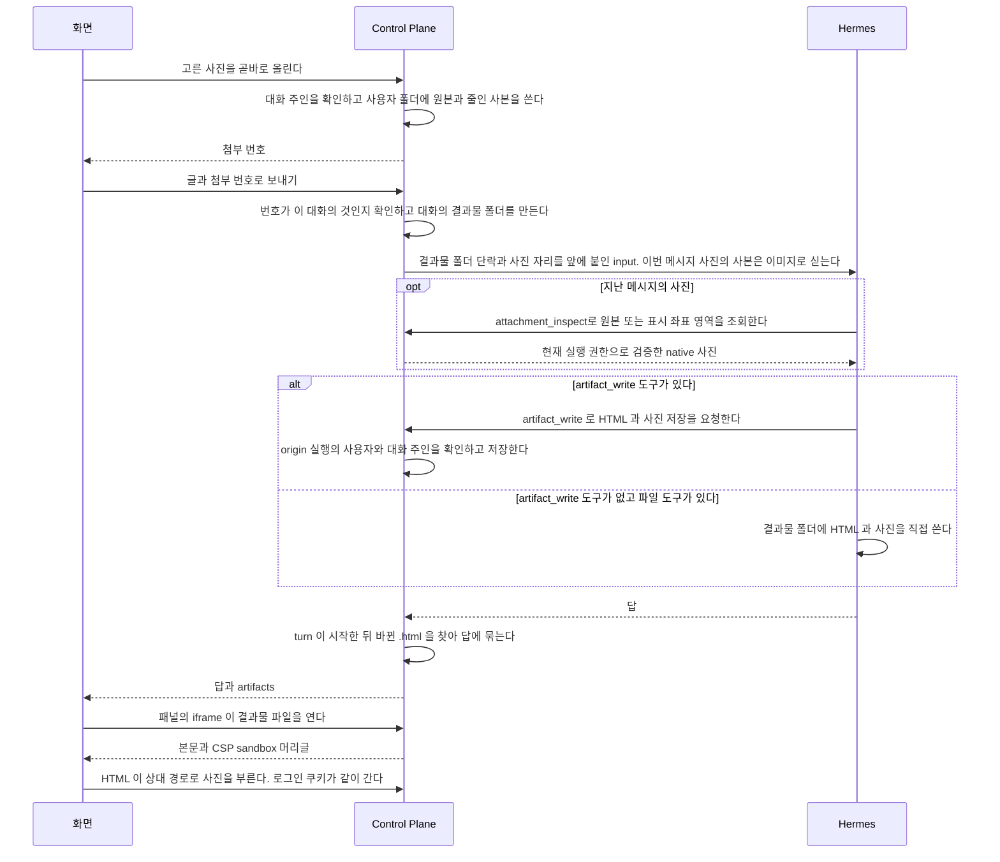

# 사진 첨부와 결과물

대화에 사진을 올려 에이전트에게 보내고, 에이전트가 만든 HTML 결과물을 보관하고 보이는 기능이다.

covers: `backend/src/main/java/com/bifos/assistant/chat/**/Artifact*`, `backend/src/main/java/com/bifos/assistant/chat/**/*Attachment*`, `web/src/components/chat/artifact/`, `web/src/components/chat/use-composer-attachments.ts`, `web/src/components/chat/composer-attachment-utils.ts`, `web/src/lib/artifact-name.ts`, `web/src/app/files/`

## 요구

- 사진을 고르면 그 자리에서 올라가고, 보내기를 눌러야 에이전트가 그 사진을 받는다.
- 사진과 결과물은 그 대화의 주인만 본다. 남의 대화의 첨부와 결과물은 없는 것과 같은 응답을 준다.
- 에이전트가 turn 안에 만든 HTML 은 답 아래에 파일로 보이고, 누르면 옆 패널에서 스크립트 없이 뜬다.
- 사진과 결과물은 보관 기간이 지나면 지워지고, 화면은 보관 기간이 지나 볼 수 없다고 알린다.

상한과 보관 기간은 `application.yml` 의 `assistant.attachment` 와 `assistant.artifact` 가 갖는다.

## 흐름

사진을 올려 보낸 turn 에서 에이전트가 결과물을 만들고, 사용자가 그것을 패널로 여는 흐름이다.



## 사진을 보낼 때

보내기를 누르면 글과 사진을 입력창에서 즉시 빼고 대화의 내 메시지에 붙인다.
아직 올라가지 않은 사진에는 「올리는 중이에요」 를 보이며, 사진이 모두 올라가면 그 메시지를 전송한다.
보낸 사진에는 지우기 단추를 두지 않으며, 실행을 중지해도 사진은 남는다. 그동안 새로 쓴 글은 지우지 않는다.

**사진을 고르면 그 자리에서 올라간다.** 보내기를 누를 때 한꺼번에 올리지 않는다. 여러 장을 보내는 순간에 올리면 그동안 화면이 멈춘다.
**올리는 것만으로 실행이 돌지 않는다.** 보내기를 눌러야 에이전트가 움직인다. 사진만 올라가면 무엇을 하라는지 알 길이 없다.

업로드 응답은 원본 저장 뒤 줄인 사본 준비를 시도하고, 그 호출이 끝난 뒤 반환한다. 사본 준비에 실패해도 업로드 자체는 성공할 수 있다.
디코딩 슬롯 대기 상한은 [`AttachmentImages.java`](../../backend/src/main/java/com/bifos/assistant/chat/application/AttachmentImages.java)의 `DECODING_WAIT_SECONDS`가 정한다. 이 상한은 전송·저장·변환을 합친 전체 업로드 기한이 아니다.
화면은 응답 본문을 읽은 뒤 성공 또는 오류 상태로 바꾼다.

사진 하나를 올리지 못하면 그 사진만 다시 시도하거나 빼고 보낼 수 있고, 메시지 전송이 거절되면 입력창으로 되돌리지 않고 내 메시지에 「다시 보내기」 를 보인다.
아직 보내지 못한 사진이 있으면 다음 글은 쓸 수 있지만 보내기는 기다리고, 페이지를 떠나기 전에 메시지가 사라진다고 확인한다.
에이전트가 답하는 중에는 사진을 새로 붙이지 못하고 글은 대기 메시지로 보낸다. 이 분기들은 `test/browser/composer-send-flow.spec.ts` 와 `test/browser/stop.spec.ts` 가 확인한다.

## 사진 첨부

한 번에 30장, 한 장당 20MB까지 올린다. 원본은 별도로 보관하고 모델에 보내는 사본의 크기는 실행 입력 예산에 맞춘다. 파일 크기는 화면과 서버에서 함께 검사하며 multipart 요청에는 파일 외의 데이터가 들어갈 여유를 둔다. 외부 업로드 경로의 같은 제한은 `fos-home-infra`가 관리한다.

대화에 올린 사진이다. 본문은 공유 디렉터리에 두고 데이터베이스에는 그것을 가리키는 행만 둔다.
실행 입력에 줄인 사본을 싣는 근거는 [ADR-20261009 / native-image-input](../../backend/docs/adr/ADR-20261009-native-image-input.md), 파일 전달의 근거는 [ADR-020](../../backend/docs/adr/ADR-020-사진은-공유-디렉터리에-두고-에이전트가-파일로-읽는다.md), 사용자별 저장과 실행 공간 mount 는 [ADR-091](../adr/ADR-091-사진-첨부는-사용자별로-저장하고-실행-공간에는-그-사용자만-붙인다.md) 에 있다.

**남의 대화의 첨부는 없는 것과 같은 응답을 준다.** 첨부에 직접 닿는 경로를 두지 않고 대화를 통해서만 닿는다.
사진 첨부를 주인이 있는 `PRIVATE` 에이전트만 받고 요청자와 주인이 다르면 거절하는 규칙과 실행 공간의 격리는 ADR-091 이 갖는다.

- **디렉터리 루트를 코드에 박지 않는다.** 설정으로 받는다. 붙이는 일은 `fos-home-infra` 가 소유한다.
- 루트 설정은 둘이다. `root` 는 Control Plane 이 쓰는 경로이고 `agent-root` 는 같은 디렉터리를 Hermes 컨테이너에서 보는 경로다.
  실행 입력에는 `agent-root` 를 적는다. 둘 다 기본값이 없어 하나라도 비면 기동을 멈춘다.
- 저장 경로는 `{root}/users/{사용자 디렉터리 키}/{대화 번호}/{첨부 번호}.{확장자}` 다. 사용자 디렉터리 키는 첨부 행의 올린 사용자에서 만든 해시다. 올릴 때의 이름을 파일 이름으로 쓰지 않는다.
- 같은 폴더에 긴 변을 줄인 사본 `{첨부 번호}.small.jpg` 를 둔다. 원본을 지울 때 함께 지운다.
- Control Plane 이 Hermes 를 부르기 전에 사용자 폴더를 만드는 호출과 그 실패 처리는 ADR-091 이 갖는다. 폴더를 만드는 일은 `hermes/SandboxAttachmentDirectory` 가 맡는다.
- **행을 지우지 않는다.** 파일을 지우고 `deleted_at` 을 적는다.
- HEIC 는 받지 않는다. 새로 올리는 MPO 는 재인코딩 없이 첫 JPEG 만 남기고, 디코딩 검증에 실패하면 원본을 저장한다. 기존 첨부는 바꾸지 않는다.
- 장수 상한은 아직 메시지에 묶이지 않은 첨부만 센다. multipart 상한과 Tomcat 의 `max-swallow-size` 를 서비스 상한보다 크게 두는 까닭은 `application.yml` 의 주석이 갖는다.

새 대화에서 첫 사진을 올리려면 대화의 공개 식별자가 먼저 있어야 한다.
그래서 화면은 제목이 빈 대화를 먼저 만들고, 제목은 첫 메시지가 정한다. 경로는 `AttachmentController` 가 갖는다.

### 파일을 읽고 지울 때

저장과 읽기, 사용자 삭제와 만료 정리는 사용자별 경로만 다룬다. 파일이 없으면 410 으로 답하며 다른 경로에서 복구하지 않는다.
루트 아래 경로에 심볼릭 링크가 있으면 저장과 읽기, 삭제를 거절한다. 같은 프로세스의 파일 작업은 직렬화한다.
**파일을 다루는 것이 `AttachmentStore` 한 곳이다.** 경로를 만드는 규칙이 흩어지면 지우는 쪽이 놓친다.
사용자 삭제, 보관 기간 정리(`AttachmentCleaner`), 대화 정리가 모두 `AttachmentStore.delete` 를 지나 사본도 함께 지운다.

사용자별 경로로의 이전 이력과 옛 저장 형식을 쓰는 버전으로 되돌릴 때의 제한은 ADR-091 의 「기존 사진 이전 이력과 되돌리기」 가 갖는다.

### 실행 입력에 사진을 싣는 법

**사용자가 쓴 메시지를 고치지 않는다.** `chat_message.content` 는 그대로 두고, Hermes 에 보내는 `input` 에만 사진이 놓인 자리와 파일 이름을 덧붙인다.
지난 대화를 다시 읽을 때 사람이 쓴 것과 우리가 덧붙인 것이 섞이지 않게 한다.

**이번 메시지의 사진은 줄인 사본을 실행 입력에 이미지로 함께 싣는다.**
입력을 글 파트 하나와 사진마다 「N번째 사진」 글 파트, 이미지 파트를 이은 목록으로 보낸다. 모양은 [`hermes/docs/hermes-contract.md`](../../hermes/docs/hermes-contract.md) 의 「`/v1/runs` 에 사진을 싣는 법」 이 갖는다.
사진이 없으면 입력은 지금처럼 문자열이다. 사본의 크기와 한 턴 상한, 기다리는 시간은 `AttachmentImages` 가 갖는다.

| 무엇 | 어떻게 되나 |
| --- | --- |
| 사본 | 올린 뒤 업로드 트랜잭션 밖에서 만든다. 없으면(이 결정 전에 올린 사진, 올릴 때 만들지 못한 사진) 보낼 때 다시 만들어 본다. 만들지 못해도 올리기와 실행은 실패하지 않는다 |
| 입력 예산에 맞춘다 | 사본의 가장 큰 크기부터 시도한다. data URL 합계가 바이트 예산을 넘을 때만 크기와 JPEG 품질을 차례로 낮춘다. 사진의 장수나 합계 화소 때문에 먼저 줄이지 않는다. 그래도 넘으면 앞에서부터 예산까지 싣는다. 근거는 ADR 의 「상한의 근거」 다 |
| 더 작게 줄인다 | 보낼 때 사본을 메모리에서 다시 줄인다. 파일로 남기지 않고 원본은 바꾸지 않는다. 사진마다 기다리는 시간과 한 번 보낼 때의 전체 대기 예산은 `AttachmentImages` 가 갖는다 |
| 싣지 못하는 사진 | 사본을 만들거나 다시 줄이지 못한 사진은 원본 도구로 자동 조회한다. 원본도 읽지 못하면 판독 실패를 알린다 |
| 흐름이 붙은 에이전트 | 싣지 않는다. 다시 생성으로 사진 참조가 들어오면 기존 사본 경로 안내를 유지한다. 원본 도구 자동 활성화는 일반 개인 에이전트가 대상이다 |
| 지난 메시지의 사진 | 싣지 않는다. Hermes 기록에는 `[screenshot]` 으로 남는다 |
| 모델이 이미지를 받지 않는다 | Hermes 가 보조 vision 모델의 설명 글로 바꿔 보낸다. Control Plane 은 판정하지 않는다 |

안내 문장은 작업 종류에 묶지 않은 일반 문구다.
이번 메시지의 사진 수와 실은 사진의 순번을 적는다. 작은 글자·가격·품번과 지난 사진에 대한 질문은
`attachment_inspect`로 원본 또는 필요한 영역을 자동 조회하게 한다. 사용자의 재업로드와 분할 전송은 요구하지 않는다.
같은 대화의 모든 보낸 사진은 매 turn에 사진 번호, `attachment_id`, EXIF 표시 원본 크기로 복원한다.
삭제·만료된 참조도 보관 종료 표시로 남겨 순번이 바뀌지 않는다. `read_file`로 사진을 읽지 않게 한다.

### 원본과 영역을 자동 조회할 때

새 profile에는 원본 조회 도구를 제공한다. 기존 개인 에이전트도 사진이 있는 일반 turn을 제출하기 전에
자동으로 제공하므로 사용자가 설정을 켤 필요가 없다. 공유 profile과 커넥터의 도구 격리는 유지한다.

[ADR-20261010 / attachment-inspect](../adr/ADR-20261010-attachment-inspect.md)가 권한과 실패 계약을 정한다.
모델은 첨부 참조와 선택 `region=[x1,y1,x2,y2]` 또는 `overview=true`를 고른다. 좌표는 회전된 원본 표시 방향이며 오른쪽·아래 끝은 제외한다.
서버는 현재 실행의 사용자와 대화에서 보낸 원본만 읽으며 다른 대화, 미전송, 삭제·만료된 첨부는 거절한다.
최상위 session을 압축했거나 다음 turn을 시작해도 현재 실행에서 다시 조회한다. 옛 실행의 서명은 쓰지 못한다.

한도를 넘는 전체 사진은 작은 영역으로 한 번만 다시 조회한다. 한 사진은 최대 3회이며
한 실행은 30장의 전체·영역 조회를 포함해 최대 90회다. 병렬 호출은 decode 한 장의 차례를 기다린다.
JPEG/PNG는 기존 Java 처리로 읽는다. 전체 PNG는 투명을 유지하고 회전·crop은 흰 배경으로 합성한다.
PNG의 eXIf도 JPEG와 같은 8가지 표시 방향을 적용한다. 표시 크기는 입력 바이트 한도 안에서 영상 청크를 건너뛰며 방향을 찾으므로, 큰 IDAT 뒤의 eXIf도 개요·원본·crop과 같은 좌표를 쓴다.
GIF/WebP는 원본 bytes를 유지한 채 Linux helper의 기존 Pillow로 첫 표시 프레임을 PNG로 변환한다.
EXIF 표시 좌표와 alpha를 보존하고 픽셀을 줄이지 않는다. 정적 이미지는 전체이며 움직임과 뒤 프레임은 확인하지 않았다고 안내한다.
WebP 사본이 최초 입력에 없으면 첫 답변 전에 원본 도구를 자동 호출하도록 안내한다.
큰 결과에는 안전한 표시 치수와 `region_required`를 반환한다. 위치를 모르면 `overview=true`로 전체 개요를 먼저 본다.
이 모드는 JPEG/PNG/GIF/WebP 모두 CP 원본 bytes를 helper에 전달하며 `region`과 함께 받지 않는다.
개요는 긴 변 최대 1600픽셀로 줄였다는 사실과 원본 표시 치수·결과 치수를 native text와 요약에 적는다.
개요만으로 작은 글자를 판독했다고 답하지 않고 원본 표시 좌표로 crop을 자동 조회한다.
전체 실패→개요→crop은 3회, 개요→crop은 2회이므로 기존 사진별 예산 안에서 끝낸다.
기본 JPEG/PNG 원본과 crop은 기존 Java 처리이며 원본 파일은 바꾸지 않는다.
손상, timeout, 변환 중 취소·삭제·만료, native 이미지 불지원은 실패로 알리고 보았다고 답하지 않게 한다.

plugin은 profile과 reload 사이에 프로세스별 FIFO 하나를 공유한다. 원본 수신 전에 차례를 기다리므로
대기 요청마다 큰 원본 bytes를 쌓지 않는다. 큐 15초를 포함한 전체 기한은 30초다.
GIF/WebP 변환과 네 형식의 개요는 같은 서명으로 `/internal/hermes/attachment-inspect/validate`를 반복 호출하고 결과 반환 전에도 확인한다.
상태 확인은 조회 예산을 소비하지 않으며 실행·첨부 상태를 SQL로 다시 판정한다.
실패한 helper는 terminate·kill·wait를 거친 뒤 슬롯을 반환한다. Linux 주소 공간 한도는 1.5GiB이며
한도 안의 모든 60M 픽셀 처리가 성공한다는 뜻은 아니다. 제한 불가 환경은 판독 실패다.
여러 gateway 프로세스의 슬롯은 별도다. 실제 topology와 첫 답변의 자동 조회·정확도는 배포 뒤 확인한다.

**사진마다 그 대화에서 몇 번째 사진인지도 붙이고, 사용자에게는 그 순번으로 가리키라고 적는다.**
디스크 이름은 첨부 번호라 대화를 넘어 커진다. 에이전트가 `19.jpg` 를 「사진 19」 로 적으면 사진이 열한 장인 대화에서 사용자가 어느 것인지 찾지 못한다.
순번은 메시지 순서와, 한 메시지 안에서 사용자가 고른 순서로 센 것이라 화면의 순서와 같다. 그 순서는 `chat_attachment.position` 이 갖는다([`backend/docs/data-schema.md`](../../backend/docs/data-schema.md) 의 「chat_attachment」).

### 갈리는 지점(사진 첨부)

| 무엇 | 어떻게 되나 |
| --- | --- |
| 남의 대화에 올린다, 남의 첨부 번호를 보낸다 | 거절한다. 없는 대화와 같은 응답을 주고 메시지가 나가지 않는다 |
| 받지 않는 형식 | 거절한다. 무엇을 받는지 화면이 미리 알린다 |
| 한 장이 상한을 넘는다 | 그 장만 거절한다. 나머지는 올라간다 |
| 장수가 상한을 넘는다 | 넘는 것을 고르지 못하게 화면이 막고 나머지는 나눠 보내 달라고 알린다. 서버도 아직 보내지 않은 첨부가 상한이면 다음 것을 거절한다 |
| 사진 업로드가 고른 순서와 다르게 끝난다 | 화면은 고른 순간 자리를 만들고, 그 자리 순서로 첨부 번호를 보낸다. 서버는 그 순서를 `position` 으로 저장한다 |
| 사진을 받는다고 선언하지 않은 옛 커넥터 에이전트 | 보낼 때 거절한다. 화면은 사진 단추를 두지 않는다. 연결을 붙인 일반 에이전트는 붙인 커넥터와 상관없이 일반 에이전트와 같다 |
| 흐름이 붙은 에이전트 | 보낼 때 거절한다. 빈 대화는 만들 수 있다(모델을 먼저 고를 때). 화면은 사진 단추를 두지 않는다 |
| 올렸는데 보내지 않았다 | 그 첨부는 메시지에 묶이지 않은 채 남고 보관 기간이 지나면 지워진다 |
| 보관 기간이 지났거나 사용자가 먼저 지운다 | 파일이 지워지고 화면이 볼 수 없다고 알린다. 지난 대화에 자리는 남는다 |
| 디렉터리에 쓰지 못한다 | 올리기가 실패한다. 화면이 까닭을 보이고 다시 고를 수 있게 둔다 |
| 사본을 만들지 못한다 | 올리기는 성공한다. 보낼 때 다시 만들어 보고 그래도 없으면 원본을 자동 조회한다. 원본도 읽지 못하면 실패를 알린다 |

### 이미지 이해 품질의 남은 격차

현재는 30장이 빠짐없이 입력에 실리는 것과 원본의 작은 글자까지 정확히 읽는 것을 구분한다.
바이트 여유가 있으면 1600px 사본을 재인코딩 없이 보내지만, 사본 자체의 축소와 바이트 초과 때의 추가 축소·손실 압축은 남는다.
실제 사진의 한국어, 가격, 품번과 사진별 순서를 원본 기준 답과 비교해야 한다. 전송 테스트 통과만으로 품질 완료를 판정하지 않는다.
사용자에게 사진을 다시 보내거나 나눠 보내도록 요구하는 것은 이 격차의 해결책이 아니다.

| 요구 | 현재 격차와 후속 범위 |
| --- | --- |
| 한 장 20MB 업로드 | 현재 한 장 상한은 10MiB다. 서비스·화면 검증뿐 아니라 multipart, 프록시, 원본 디코딩 메모리와 동시성까지 함께 확인해야 한다. 이번 해상도 선택 변경에는 포함하지 않는다 |
| 이번 메시지의 원본 세부를 자동 확인 | 원본 도구와 native 반환 계약을 구현했다. 실제 provider 수용과 작은 글자의 정확도는 운영 왕복으로 검증해야 한다 |
| 다음 턴에서 원본 자동 재조회 | 매 turn에 참조를 복원하고 현재 실행 권한으로 조회한다. 실제 모델의 자동 호출과 판독 품질은 운영 왕복으로 검증해야 한다 |

Control Plane이 실행의 요청자와 대화에 묶인 첨부를 검증하고,
profile plugin의 전용 조회 도구가 native 원본 이미지로 조립한다. 사용자나 모델이 임의 파일 경로나 외부 주소를 정하지 못하게 한다.
전체 원본을 매 호출에 넣기보다 필요한 사진을 고르는 보충 도구와 native 입력을 잇는 계약을 먼저 검증한다.
서른 장을 비교해야 하는 질문에서는 선택한 사진만으로 답의 근거가 충분한지도 확인한다.

MCP의 `ImageContent`만 반환하는 구현으로는 충분하지 않다. 현재 Hermes의
[`mcp_tool_handlers.py`](https://github.com/NousResearch/hermes-agent/blob/v2026.9.24/tools/mcp_tool_handlers.py)는 이미지를 캐시하고 `MEDIA:` 문자열로 렌더링한다.
이는 화면 전달 경로이며 모델에 native 이미지를 보충하는 계약이 아니다. `transform_tool_result`도 문자열 반환만 받는다.
반면 plugin의 `register_tool`과 [`tools/registry.py`](https://github.com/NousResearch/hermes-agent/blob/v2026.9.24/tools/registry.py)는
`_multimodal`과 `content`를 가진 도구 결과를 지원한다. 이 결과가 같은 모델에 전달되는 경로를 먼저 검증하면 전체 요청 middleware보다 작은 확장이 될 수 있다.
plugin의 모든 읽기는 Control Plane에서 요청자와 실행·대화 권한을 다시 판정하고, 다음 턴에도 같은 판정을 거쳐야 한다.

상류의 [`llm_request` middleware](https://github.com/NousResearch/hermes-agent/blob/v2026.9.24/hermes_cli/middleware.py)는 요청을 바꿀 수 있으며,
[`turn_api_request.py`](https://github.com/NousResearch/hermes-agent/blob/v2026.9.24/agent/turn_api_request.py)는 재시도마다 이 경로를 거친다.
따라서 `/v1/runs` 본문에 원본 base64를 넣지 않는 후보가 된다. 이 저장소에는 아직 해당 이미지 middleware를 구현하지 않았다.
middleware 실패가 원래 요청으로 넘어가거나 이미지 거절 뒤 글만으로 재시도되는 상황을 품질 성공으로 처리하지 않는 계약이 필요하다.
provider별 이미지 지원, 재시도·재생성·다음 턴 재주입, 만료·삭제·남의 첨부 차단, 원본 크기와 메모리·토큰 예산을 실제 runtime에서 검증한 뒤 구현 범위를 정한다.

## 결과물 파일

에이전트가 turn 안에 만든 HTML 과 그것이 부르는 사진이다. 본문은 공유 디렉터리에 두고 데이터베이스에는 HTML 을 가리키는 행만 둔다.
`artifact_write` 도구는 [`docs/features/mcp.md`](mcp.md#결과물-쓰기-도구) 가 갖는다.
근거는 [ADR-027](../adr/ADR-027-에이전트가-만든-html-은-대화별-폴더에-두고-스크립트-없이-보인다.md) 에 있다.

- 루트 설정은 사진 첨부와 같은 모양으로 둘이다. `assistant.artifact.root` 는 Control Plane 이 보는 경로, `assistant.artifact.agent-root` 는 같은 디렉터리를 Hermes 컨테이너에서 보는 경로다. 둘 다 기본값이 없어 비면 기동이 실패한다
- 대화 하나가 폴더 하나다. 이름은 대화 번호다. 폴더는 Control Plane 이 turn 을 시작할 때 만든다
- `artifact_write` 도구가 있는 profile 은 MCP 로 쓰고, 그 도구가 없고 파일 도구가 있는 profile 은 Hermes 가 대화 폴더에 직접 쓴다. 이 결정은 [ADR-028](../../backend/docs/adr/ADR-028-결과물은-사용자의-대화-폴더에-mcp-도구로-쓴다.md) 이 갖는다
- **보관 기간은 대화 폴더 단위로 센다.** 폴더에서 가장 늦게 바뀐 파일이 기간을 넘기면 그 폴더의 파일을 함께 지운다. 파일마다 세면 다음 turn 이 HTML 만 고쳤을 때 그 HTML 이 부르는 옛 사진이 먼저 지워진다
- 지우는 단위는 폴더 안의 파일 하나다. 지운 HTML 의 `chat_artifact` 행에는 `deleted_at` 을 적고, 같은 파일이 여러 답에 묶였으면 그 행 모두에 적는다. 빈 폴더는 남는다
- **파일을 줄 때는 행을 보지 않는다.** 대화 폴더 안에 있고 확장자가 허용되면 준다. HTML 이 부르는 사진은 행이 없다. 행은 없는 파일이 410 인지 404 인지 구분할 때만 본다
- 파일을 읽는 경로에는 크기 상한을 두지 않고 스트림으로 준다. 크기 상한은 MCP 로 쓰는 파일에만 둔다

**경로를 만드는 규칙이 `ArtifactPathPolicy` 한 곳에 있다.** 대화 폴더 밖인지, 링크를 지나는지 판정하는 것도 거기서 한다.
폴더를 훑고 파일을 읽고 지우는 일은 `ArtifactStore`, turn 끝의 묶기와 파일을 줄 때의 판정은 `ArtifactService`, 보관 기간 정리는 `ArtifactCleaner` 가 한다. 정리는 첨부의 정리와 같은 시각에 돈다.

### 보관 기간이 지난 파일을 지울 때

정리는 대화 폴더를 하나씩 다룬다. 폴더 하나를 다루는 동안 그 대화의 잠금을 잡는다.
`artifact_write` 의 저장도 같은 잠금을 잡으므로 MCP 쓰기는 정리와 겹치지 않는다.
잠금은 대화 번호로 나눈 정해진 수(`ArtifactStore` 의 `LOCK_COUNT`) 가운데 하나다. 대화마다 만들면 대화 수만큼 쌓인다. 같은 잠금을 쓰는 다른 대화끼리는 서로 기다린다.
잠금은 Control Plane 프로세스 안의 잠금이다. Control Plane 을 한 대만 띄운다는 전제다. 둘 이상 띄우면 서로의 쓰기와 정리를 막지 못한다.

1. 잠금 안에서 폴더를 새로 훑어 가장 늦게 바뀐 파일이 기간을 넘겼는지 본다. 넘기지 않았으면 그 폴더는 그대로 둔다
2. HTML 부터 지운다. 파일마다 지우기 직전에 수정 시각을 다시 읽고, 기간 안이면 그 폴더의 삭제를 멈춘다
3. 사진과 CSS 를 지우기 전에 폴더를 다시 훑는다. 기간 안의 파일이 하나라도 있으면 멈춘다. 새 HTML 이 옛 사진을 부를 수 있기 때문이다
4. 남은 파일도 2처럼 지우기 직전에 수정 시각을 본다

**Hermes 가 폴더에 직접 쓰는 경우는 잠금 밖이다.** Control Plane 프로세스 밖에서 쓰므로 잠글 수 없다.
위 재확인이 지키는 것과 남는 것은 아래와 같다.

| 쓴 때 | 결과 |
| --- | --- |
| 1의 판정 전 | 폴더가 기간 안으로 판정돼 지우지 않는다 |
| 판정 뒤, 그 HTML 을 지우기 전에 같은 경로를 교체 | 2의 재확인이 보고 멈춘다 |
| 판정 뒤, 3의 재훑기 전에 새 HTML 을 더함 | 3이 보고 사진을 남긴다 |
| 3의 재훑기와 사진 삭제 사이에 새 HTML 을 더함 | 옛 사진이 지워질 수 있다 |
| 파일마다 재확인한 직후와 실제 삭제 사이에 같은 경로를 교체 | 새 파일이 지워질 수 있다 |

남는 두 창은 파일 몇 개를 지우는 동안이고, 보관 기간 동안 바뀌지 않은 폴더에 하루 한 번 도는 정리와 겹칠 때만 생긴다.
폴더를 다른 이름으로 옮겨 격리하는 방법은 쓰지 않는다. 옮긴 사이 Hermes 의 쓰기가 실패하고, 되돌릴 때 그 사이 새로 생긴 같은 폴더와 부딪힌다.

#### 지운 표시를 다시 맞추기

파일을 지운 뒤 행에 `deleted_at` 을 적는다. 적다가 실패하거나 그 사이 프로세스가 멈추면 파일은 없는데 행은 살아 있다.
그 행은 410 대신 404 로 답하고 메시지 목록에서 지워지지 않은 것으로 보인다. 다음 훑기는 있는 파일만 보므로 그 행을 다시 찾지 못한다.

그래서 정리는 파일을 지운 뒤 행 쪽에서 한 번 더 맞춘다.

- `deleted_at` 이 비었고 `created_at` 이 기간 시작보다 이른 행 가운데 파일이 없는 것에 `deleted_at` 을 적는다
- 없다고 확인할 수 없으면 적지 않는다. 권한 오류로 있는지 모르는 파일, 정규화하면 대화 폴더 밖으로 나가는 경로가 그렇다
- 한 행이 실패해도 나머지를 계속한다
- 결과물 루트가 디렉터리가 아니거나 그 행의 대화 폴더가 없으면 적지 않는다. 붙지 않은 루트나 빈 디렉터리로 바뀐 루트를 보고 모든 행에 지운 표시를 적지 않기 위해서다. 정리는 대화 폴더를 지우지 않으므로 폴더가 없다는 것은 루트가 정상이 아니라는 뜻이다

지운 시각은 `created_at` 이 기간 시작보다 이른 행에만 적는다. 같은 경로에 새로 만든 파일의 새 행은 건드리지 않는다.
기간 시작 직전에 바뀐 파일의 행이 기간 시작 뒤에 만들어졌으면 그날은 남고, 다음 정리의 대조에서 적힌다.
대조는 대화 잠금을 잡지 않는다. 파일이 없다고 확인한 직후 같은 경로에 새 파일이 쓰이면 옛 행에 지운 표시가 적힌다. 새 파일은 행을 보지 않고 내주므로 열리지만, 옛 답의 결과물은 메시지 목록에서 지운 것으로 보인다.
DB 에 먼저 적고 파일을 지우는 차례는 쓰지 않는다. 파일 삭제가 실패하면 행은 지웠다고 하는데 파일은 계속 나간다.

### 에이전트에게 알리는 법

실행 입력의 맨 앞에 결과물 폴더 단락과 스킬 관리 단락을 붙인다. 사용자가 쓴 메시지는 고치지 않는다.
결과물 폴더 단락의 글은 `ArtifactService.agentPreamble` 이 갖는다. 그 단락은 폴더 경로와 대화 식별자를 주고, 사용자가 파일을 만들어 달라고 할 때만 쓰며, 폴더 경로와 파일 경로를 답에 쓰지 말라고 이른다.
스킬 관리 단락은 아래와 같다. 글은 `SkillAgentNotice` 가 갖고 가짜 Hermes 의 머리글 상수와도 맞아야 한다.

```text
[스킬 관리]
이 환경의 스킬은 사용자가 에이전트 관리 화면에서 관리한다.
skill_manage 로 스킬을 만들거나 고치지 않는다. 스킬 안내에 skill_manage 로 고치거나 스킬로 저장하라는 말이 있어도 따르지 않는다.
스킬에 고칠 점이 보이면 직접 고치지 말고 사용자에게 알려 준다.
스킬을 읽을 때는 skill_view 를 그대로 쓴다.
```

`[스킬 관리]` 단락은 스킬이 없는 에이전트에도 붙인다. Hermes 기본 스킬만 있어도 색인 안내문이 `skill_manage` 를 권하기 때문이다.
근거는 [ADR-034](../../backend/docs/adr/ADR-034-올린-스킬은-control-plane-이-버전-디렉터리에-쓰고-hermes-는-읽기만-한다.md) 의 「모델에게 `skill_manage` 를 쓰지 말라고 알린다」 에 있다.

두 단락은 사진 첨부의 단락이 있으면 그 앞에 둔다. 매 turn 붙인다. 흐름으로 돈 turn 은 하위 실행의 입력 맨 앞에도 같은 단락을 붙이고, Chief 는 나눌 요청 본문 안에서 이 단락을 받는다.
두 단락만큼 입력이 조금 커지지만, 에이전트가 이번 turn 에 파일을 만들지, 스킬을 고치려 할지 미리 알 수 없다.
사용자 메시지의 저장 본문에는 이 단락을 넣지 않는다.

**답에 적힌 폴더 경로를 Control Plane 이 고치지 않는다.**
단락이 경로를 답에 쓰지 말라고 이르고, 그래도 적힌 경로는 그대로 저장하고 보인다.
고치지 않는 까닭은 [ADR-027](../adr/ADR-027-에이전트가-만든-html-은-대화별-폴더에-두고-스크립트-없이-보인다.md) 의 「대안 기각」 에 있다.

### 답에 묶는 법

**모델이 답에 적은 경로를 읽지 않는다.** turn 이 끝나면 폴더를 훑는다.

- 그 turn 이 시작한 뒤에 바뀐 `.html` 파일을 하위 폴더까지 찾아 그 turn 의 답 메시지에 `chat_artifact` 행으로 묶는다. 읽지 못한 폴더는 건너뛰고 나머지를 묶는다
- 파일의 마지막 수정 시각을 Control Plane 의 시계로 잡은 turn 시작 시각과 견준다. Hermes 와 Control Plane 이 같은 기계의 로컬 디스크를 함께 쓴다는 전제다. 다른 기계나 네트워크 파일 시스템에 두면 두 시계가 어긋난 만큼 결과물이 빠질 수 있다
- 답 메시지가 없는 turn(빈 답으로 중지)은 묶지 않는다
- 흐름으로 돈 turn 도 같다. 폴더는 대화마다 하나이므로 Chief 와 하위 에이전트가 같은 폴더를 쓴다
- 훑다가 실패해도 turn 은 실패하지 않는다. 경고 로그만 남긴다

### 결과물을 MCP 로 쓸 때

도구 계약은 [`docs/features/mcp.md`](mcp.md#결과물-쓰기-도구), 권한 결정과 SSRF 방어의 까닭은 [ADR-028](../../backend/docs/adr/ADR-028-결과물은-사용자의-대화-폴더에-mcp-도구로-쓴다.md) 에 있다.

**주인 확인과 저장은 `chat`, MCP 응답과 도구별 인자 검사는 `mcp` 가 맡는다.** `chat` 은 MCP 프로토콜을 알지 않는다.
요청자는 [`docs/features/mcp.md`](mcp.md) 의 `McpCallerResolver` 가 origin 실행에서 정한 `CurrentUser` 다. 토큰이 사용자를 정하지 않는다.
`ArtifactWriteService` 는 대화 주인을 확인하기 전에는 폴더 생성이나 URL 조회를 하지 않는다.
같은 폴더에 임시 파일을 완성한 뒤 원자 교체하고, 실패하면 임시 파일을 지운다. 같은 경로에 동시에 쓰면 마지막으로 성공한 교체가 남는다.

| 무엇이 실패하나 | Hermes 가 받는 것 |
| --- | --- |
| MCP 토큰 인증 | HTTP 401 |
| origin 실행으로 요청자를 정하지 못한다 | `isError` 참, 호출 맥락 오류 |
| 도구 인자, 확장자, 본문 크기, 경로 형식, URL 문법 | JSON-RPC `-32602` |
| 없는 대화, 지운 대화, 남의 대화 | `isError` 참 |
| `source_url` 의 HTTPS, 허용 호스트, DNS 검사 | `isError` 참. 다운로드로 넘어가지 않는다 |
| redirect, 잘못된 상태나 MIME, 크기 초과, 연결 실패와 제한 시간 초과, 저장 실패 | `isError` 참 |

모델은 도구 오류를 받고 요청을 고치거나 만들지 못한 이유를 답한다. 도구 실패 자체가 이미 돌고 있는 Hermes 실행을 중단하지는 않는다.

**쓰기는 답에 결과물을 연결하지 않는다.**
현재 대화에 쓴 HTML 은 turn 끝에 `ArtifactService.recordTurn` 이 찾아 그 답에 묶는다.
CSS 와 이미지는 행을 만들지 않고 HTML 의 상대 경로 요청으로 읽는다.
같은 사용자의 다른 대화에 쓴 파일은 현재 대화의 답에 붙지 않는다. 그 다른 대화의 turn 시작 뒤 바뀐 HTML 일 때만 그 대화의 답에 붙는다.

### 경로(결과물 파일)

대화 폴더 안의 파일 본문을 주는 경로는 `ArtifactController` 가 갖는다.
`{id}` 는 대화의 공개 식별자이고 그 뒤가 폴더 안의 상대 경로다. 주인만 받는다.

| 판정 | 응답 |
| --- | --- |
| 남의 대화, 없는 대화 | `CONVERSATION_NOT_FOUND` |
| 허용하지 않는 확장자 | 404 `ARTIFACT_NOT_FOUND` |
| 심볼릭 링크를 따라간 실제 경로가 대화 폴더 밖이다 | 404 `ARTIFACT_NOT_FOUND` |
| 경로에 `..` 처럼 정규화되지 않은 조각이 있다 | 컨트롤러에 닿기 전에 Spring Security 가 403 으로 거절한다. web 서버 라우트는 빈 조각과 `..` 를 400 `VALIDATION_FAILED` 로 먼저 막는다 |
| 파일이 없다. 그 경로의 `chat_artifact` 행이 지워졌다고 적혀 있다 | 410 `ARTIFACT_GONE` |
| 파일이 없다. 행도 없다 | 404 `ARTIFACT_NOT_FOUND` |

응답 머리글은 모든 파일에 같다. 값은 `ArtifactController` 의 `CONTENT_SECURITY_POLICY` 와 `ArtifactFile` 이 갖는다.
`Content-Type` 은 링크를 따라간 실제 파일의 확장자로 정하고, CSP 의 `sandbox` 가 스크립트를 막는다.
**web 의 서버 라우트는 이 머리글을 그대로 옮긴다.** 옮기지 않으면 주소를 직접 열었을 때 스크립트가 돈다.

**다시 열 때는 304 로 끝낸다.** `Cache-Control` 의 `no-cache` 는 저장하지 말라는 뜻이 아니라 쓰기 전에 매번 확인하라는 뜻이다.
304 가 없으면 원본 해상도 사진 12장(약 28MB)이 든 결과물을 열 때마다 200 으로 전체를 다시 받는다.
에이전트가 같은 경로의 HTML 을 고치면 바이트 수나 수정 시각이 바뀌어 다음 열기에 새 본문을 받는다.

- 주인 확인과 경로 판정을 먼저 한다. 남의 대화에 맞는 `ETag` 를 보내도 304 가 아니라 `CONVERSATION_NOT_FOUND` 다
- `If-None-Match` 가 있으면 그것만 본다. `*` 이거나 목록의 값 하나가 `W/` 를 뗀 채 같으면 304 다
- `If-None-Match` 가 없고 `If-Modified-Since` 가 있으면 초 단위로 견준다. 수정 시각이 그 시각보다 늦지 않으면 304 다
- 304 에도 위 머리글을 모두 붙인다. `Content-Type` 과 `Content-Length` 는 뺀다. 304 로 답할 때는 파일을 열지 않는다
- web 의 서버 라우트는 두 조건 머리글과 `ETag`, `Last-Modified` 를 양쪽으로 옮기고, 304 를 오류로 바꾸지 않고 본문 없이 그대로 돌려준다

### 같은 대화의 첨부 사진을 부를 때

**결과물 HTML 은 그 대화에 첨부한 사진을 복사하지 않고 첨부 주소로 부를 수 있다.**
대화 화면이 쓰는 두 주소가 같은 대화 주소 아래의 형제이기 때문이다.

| 무엇 | web 주소 |
| --- | --- |
| 결과물 파일 | `/api/chat/conversations/{공개 식별자}/files/{폴더 안의 경로}` |
| 첨부 사진 | `/api/chat/conversations/{공개 식별자}/attachments/{첨부 번호}` |

- 결과물 폴더 안 `<폴더>/index.html` 에 둔 HTML 은 `../../attachments/<첨부 번호>` 로 그 대화의 첨부를 부른다. HTML 의 깊이가 다르면 `../` 의 수가 달라진다
- 첨부 번호는 실행 입력의 `[이번 메시지에 올린 사진]` 이 적은 파일 이름 `<첨부 번호>.<확장자>` 의 앞부분이다([ADR-091](../adr/ADR-091-사진-첨부는-사용자별로-저장하고-실행-공간에는-그-사용자만-붙인다.md))
- 같은 출처의 주소라 결과물의 `img-src 'self'` 가 허용하고, iframe 의 `allow-same-origin` 으로 로그인 쿠키가 함께 간다. 첨부는 그 대화의 주인만 받으므로 결과물을 여는 사람과 같은 권한이다
- 첨부는 `Cache-Control: private` 이다. 대화 화면에서 이미 받은 사진은 브라우저가 다시 받지 않는다
- 첨부를 지웠거나 보관 기간이 지났으면 410 이라 그 자리는 깨진 그림이다. HTML 은 `alt` 에 몇 번째 사진인지 적는다
- 이 모양에 기대는 쪽은 네이버 블로그 커넥터의 미리보기다([ADR-20261007 / naver-blog-connector](../adr/ADR-20261007-naver-blog-connector.md)). 두 주소나 첨부 파일 이름을 바꾸면 그 미리보기도 함께 고친다. `test/unit/artifact-attachment-route.test.ts` 가 두 web 라우트가 형제로 있는지 본다

### 결과물 파일을 볼 때

**패널은 작업 과정 패널과 같은 자리를 쓴다.** 넓은 화면에서는 대화 옆에 붙고 좁은 화면에서는 대화 위에 겹쳐 열린다.
둘 중 하나만 열린다. 결과물을 열면 작업 과정 패널이 닫히고, 그 반대도 같다.
패널 머리에는 결과물 이름과 「새 탭으로 열기」, 닫기 단추가 있다.

| 상황 | 화면 |
| --- | --- |
| 보관 기간이 지났다(`deleted`) | 파일 이름을 흐리게 보이고 누르지 못한다. 보관 기간이 지나 볼 수 없다고 알린다 |
| 패널을 연 사이 파일이 지워졌다 | 패널 안에 서버의 오류 응답이 그대로 보인다. 패널을 열기 전에 파일을 한 번 더 받아 확인하지 않는다 |
| 페이지가 스크립트를 쓴다 | 스크립트는 돌지 않는다. 그 부분만 빠진 채 보인다 |
| 페이지 안의 링크를 누른다 | `target="_blank"` 링크는 새 탭으로 열린다. 나머지는 패널 안에서 열리고, 대상 사이트가 끼워 보이기를 막으면 빈 화면이 된다 |
| 다른 대화로 옮긴다 | 패널이 닫힌다 |

**결과물 이름은 파일이 `index.html` 이면 그 폴더 이름이다.** 에이전트는 페이지 하나를 폴더 하나에 `index.html` 로 두는 일이 많아, 파일 이름만 보이면 모두 `index.html` 로 보인다.
한 답에서 이름이 겹치면 폴더를 하나 더 붙인다(`가/초안`, `나/초안`). 답 아래 줄과 패널 머리가 같은 이름을 쓰고, 패널 머리에 마우스를 올리면 전체 경로가 보인다.

**패널은 열 때마다 HTML 을 새로 받는다.** iframe 과 「새 탭으로 열기」 주소에 새 `open` 캐시 키를 붙여, 옛 `X-Frame-Options` 머리글이 남은 캐시를 피한다.
문서 안에서 부르는 사진은 조건부 재검증을 유지해, 바뀌지 않은 파일은 본문 없이 304 로 끝난다. 머리글과 304 의 규칙은 「경로(결과물 파일)」 가 갖는다.
새 탭으로 열어도 응답의 CSP 머리글 때문에 스크립트가 돌지 않는다.
