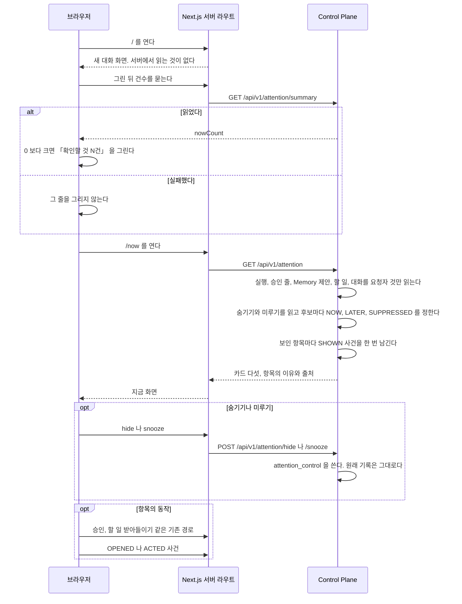
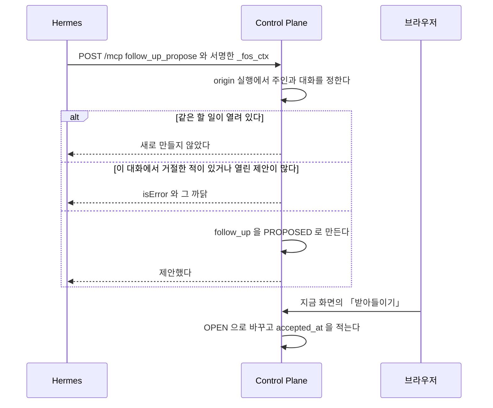
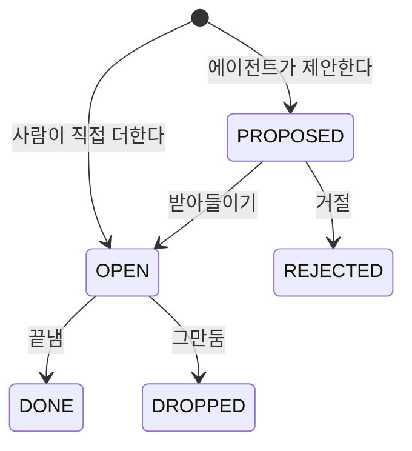
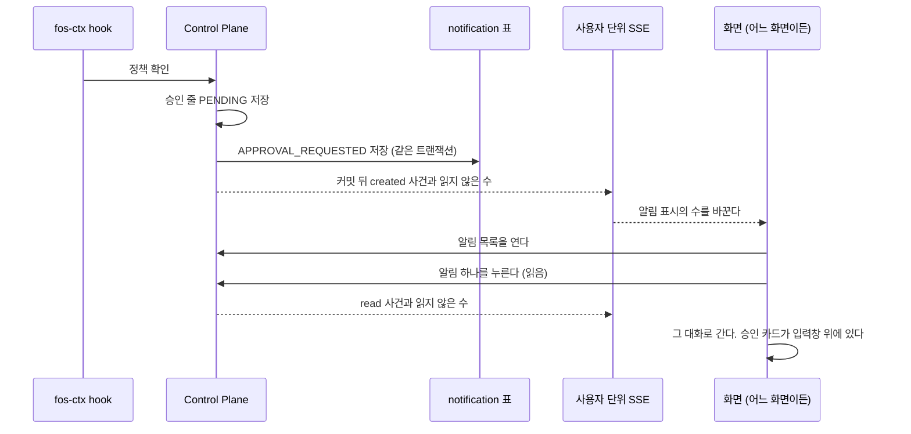

# 지금 화면과 알림, 할 일

사용자가 묻지 않아도 지금 볼 항목을 골라 지금 화면에 보이고, 할 일과 알림을 남기는 기능이다.

## 지금 화면

#161 의 Living View 를 이 저장소에서는 **지금 화면**이라 부른다. 주소, 카드의 배치, 이유 문구, 사용자 제어, 폭별 동작을 갖는다.
결정은 [ADR-074](../../web/docs/adr/ADR-074-지금-화면은-원래-기록을-읽어-만든-view-이고-정해진-카드-넷만-그린다.md), 판정과 API 는 [`docs/features/attention.md`](attention.md) 가 갖는다.

### 주소와 들어오는 길

| 자리 | 보이는 것 |
| --- | --- |
| `/now` | 지금 화면. 서버에서 `GET /api/v1/attention` 을 읽어 그린다. `loading.tsx` 를 둔다 |
| 사이드바 최상단, 「새 대화」 단추 바로 아래 | 「지금 볼 것」 링크. `nowCount` 가 0 보다 크면 그 수를 배지로 붙인다. 주요 화면 메뉴에는 넣지 않는다. 좁은 폭에서는 서랍으로 연 사이드바의 같은 자리다 |
| 새 대화 화면 `/` | 인사 아래 한 줄 「확인할 것 N건」. 누르면 `/now` 로 간다 |

**새 대화 화면의 한 줄은 홈을 그린 뒤에 채운다.** 브라우저가 `GET /api/v1/attention/summary` 를 부르고, 답이 오기 전에는 자리를 비워 둔다.
`nowCount` 가 0 이거나 부르기가 실패하면 그리지 않는다. 홈은 지금처럼 서버에서 읽는 것이 없고 `loading.tsx` 를 두지 않는다.
그 한 줄의 높이는 처음부터 잡아 둔다. 답이 온 뒤 줄이 생겨도 입력창이 밀리지 않게 하려는 것이다.
사이드바 배지도 같은 경로를 읽고, 기억 메뉴의 제안 건수처럼 화면을 옮길 때마다 다시 읽는다.
지금 화면 안의 제어나 할 일 동작이 성공하면 경로가 그대로여도 배지를 다시 읽는다.

**사이드바의 두 수를 헷갈리지 않게 둔다.** 「지금 볼 것」 링크의 수는 아직 남은 일 가운데 지금 볼 것이고, 링크 글자 오른쪽에 붙는다. 배지는 기억 제안 배지와 같은 muted 바탕이고 테두리가 없어 채운 바탕의 알림 배지와 모양이 다르다.
웹 알림(ADR-070)의 읽지 않은 수는 사이드바 맨 아래 밝기 단추 옆 알림 단추에 붙는다. 둘은 서로의 수를 더하거나 빼지 않는다.
「지금 볼 것」 링크의 접근성 이름은 `aria-label` 의 「지금 볼 것 N건」 이고, 0 이면 「지금 볼 것」 이다. 배지 자체는 낭독기에서 숨긴다. 알림 배지는 그쪽 문서가 정한다.

### 카드

| 열쇠 | 제목 | 비었을 때 |
| --- | --- | --- |
| `failures` | 실패 | 「실패한 일이 없어요」 |
| `needs_me` | 내 차례 | 「확인할 것이 없어요」 |
| `delegated` | 맡긴 일 | 「맡긴 일이 없어요」 |
| `continue` | 이어서 하기 | 「최근 대화가 없어요」 |
| `reports` | 보고 | 「새 보고가 없어요」 |

- 카드 순서는 응답의 순서를 그대로 따른다. 순서 규칙은 서버가 갖는다([ADR-074](../../web/docs/adr/ADR-074-지금-화면은-원래-기록을-읽어-만든-view-이고-정해진-카드-넷만-그린다.md) 의 3번)
- 카드 머리에 제목과 그 카드의 `nowCount` 를 둔다. 0 이면 수를 그리지 않는다. 화면이 보이는 항목을 다시 세지 않는다. 사이드바의 수는 카드 `nowCount` 의 합이라 둘이 어긋나지 않는다
- 이 화면에서 `NOW` 항목을 숨기거나 미루면 카드 머리의 수가 그만큼 줄고, 되돌리면 다시 는다. 화면을 다시 읽지 않고 그린다. 숫자 배지는 낭독기에서 숨기고, 옆의 화면에 보이지 않는 글 「지금 볼 것 N건」 이 수를 읽어 준다. 제어는 카드가 항목 열쇠별로 한 곳에 갖고, 다시 읽은 응답에서 빠진 항목의 제어는 버린다
- 빈 카드는 머리와 비었을 때의 한 줄만 그린다. 다섯 카드가 모두 비면 카드 대신 `EmptyState` 하나로 「지금 확인할 것이 없어요」 를 그린다. 설명 문구는 「실패한 일, 내가 확인할 일, 맡긴 일이 생기면 여기에 보여요.」 다
- 다섯 카드가 모두 비어도 그 빈 화면 아래에 「할 일 더하기」 를 둔다. 「내 차례」 카드 끝의 것과 같은 `Dialog` 를 연다
- `status: UNAVAILABLE` 인 카드는 항목 대신 `Notice`(경고)로 「이 카드를 불러오지 못했어요. 잠시 뒤에 다시 열어 주세요」 를 그린다
- `moreCount` 가 있으면 카드 끝에 「N개 더 있어요」 를 그린다. 실패와 맡긴 일은 `/usage?tab=executions` 로 가는 링크이고, 내 차례와 이어서 하기는 링크 없이 글만 그린다. 내 차례는 승인 대기, 기억 제안, 할 일, 먼저 다룰 문제가 섞여 한 화면으로 보낼 곳이 없고, 이어서 하기의 나머지 대화는 사이드바 목록에 있다

부품은 `web/src/components/ui/` 의 `Card`, `CardHeader`, `CardTitle`, `CardAction`, `CardContent`, `Badge`, `EmptyState`, `Notice`, `DropdownMenu`, `Dialog` 를 쓴다.
실행의 상태 문구와 색은 `web/src/lib/execution-status.ts` 를 쓴다.

#### 보고 카드

매일 깨우기나 단추로 연 살펴보기의 보고를 원래 `proactive_check` 기록에서 읽는다.
항목마다 「무엇이 바뀌었나」, 「무엇을 했나」, 「근거」, 「남은 승인」, 「다음에 볼 것」을 그린다.
보고는 `LATER` 이므로 카드와 사이드바의 건수는 늘지 않는다.
실제 남은 승인은 기존 「내 차례」 카드에서 센다.
「보고 열기」를 누르면 요청자의 보고를 열었다고 기록한 뒤 점검 대화로 이동한다.
사이드바에서 점검 대화를 직접 열어도 그 대화의 보고가 열린 것으로 기록돼 다음에 읽을 때 카드가 사라진다.
글은 평문으로, 근거 링크는 서버가 검사한 원문 주소만 그린다.

### 항목 한 줄

| 자리 | 그리는 것 |
| --- | --- |
| 제목 | `title` 을 평문으로. 빈 대화 제목은 「새 대화」 로 그린다. 누르면 그 원래 기록으로 간다(`../backend/attention.md` 의 「카드의 단추와 승인 경계」) |
| 이유 | 아래 「이유 문구」 의 한 줄 |
| 출처 | 에이전트 이름, 할 일이면 「대화에서」(에이전트가 제안했다)나 「직접 더함」(사람이 더했다), 시각. 시각은 응답의 `readAt` 을 기준으로 1분 미만 「방금」, 「N분 전」, 「N시간 전」, 7일 미만 「N일 전」, 그 밖은 「9월 20일」 처럼 적고, `time` 요소의 `title` 로 전체 시각을 보인다 |
| `NOW` 표시 | `Badge` `warning` 으로 「지금」. 색과 글을 함께 쓴다 |
| 동작 | 항목 종류마다 아래 「동작」 |
| 제어 | 항목 오른쪽의 `DropdownMenu`(「이 항목 제어」). 숨기기, 내일 아침으로 미루기, 일주일 뒤로 미루기 |
| 문제 | 먼저 다룰 문제 항목만. 제목이 문제 글이고, 그 아래에 제안한 다음 행동(`problem.action`)을 평문으로 한 줄 그린다. `problem.level` 이 `ASK_APPROVAL` 이면 「직접 처리할 일이에요. 승인 요청이 아니에요.」 를 덧붙인다. 단추 아래에 「받아들임은 기록만 해요. 할 일이나 승인을 만들지 않아요.」 를 작게 보인다 |

할 일의 출처는 `followUp.agentProposed`로 정한다. 에이전트 제안을 받아들인 뒤에도 「대화에서」를 유지한다.
미수락 여부는 `followUp.proposed`이며, 상태별 이유와 단추는 `trigger`로 정한다.

### 이유 문구

| `trigger` | `signals` | 문구 |
| --- | --- | --- |
| `EXECUTION_FAILED` | `NOT_RETRIED` | 답을 만들지 못했고 아직 다시 보내지 않았어요 |
| `EXECUTION_FAILED` | 없음 | 답을 만들지 못했어요 |
| `DELIVERY_FAILED` | `DELIVERY_NOT_DONE` | 결과는 도착했는데 정리한 답을 만들지 못했어요 |
| `DELIVERY_FAILED` | 없음 | 결과를 정리한 답을 만들지 못했어요 |
| `APPROVAL_PENDING` | 없음 | 승인을 기다리고 있어요 |
| `APPROVAL_PENDING` | `EXPIRES_SOON` | 승인을 기다리고 있어요. 곧 만료돼요 |
| `MEMORY_PROPOSED` | 없음 | 에이전트가 기억할 것을 제안했어요 |
| `FOLLOW_UP_PROPOSED` | 없음 | 에이전트가 할 일로 제안했어요 |
| `FOLLOW_UP_OPEN` | `DUE_SOON` | 기한이 다가왔어요 |
| `FOLLOW_UP_OPEN` | `OVERDUE` | 기한이 지났어요 |
| `FOLLOW_UP_OPEN` | `LINKED_UPDATE` | 연결한 대화에 결과가 도착했어요 |
| `FOLLOW_UP_OPEN` | `WAITING` 만 | 기다리는 중이에요 |
| `FOLLOW_UP_OPEN` | 없음 | 챙기고 있는 할 일이에요 |
| `DELEGATION_RUNNING` | `LONG_RUNNING` | 맡긴 일이 오래 걸리고 있어요 |
| `DELEGATION_RUNNING` | 없음 | 맡긴 일이 진행 중이에요 |
| `DELEGATION_FINISHED` | 없음 | 맡긴 일이 끝났어요 |
| `CONVERSATION_RECENT` | 없음 | 최근에 나눈 대화예요 |
| `PROBLEM_SURFACED` | 없음 | 에이전트가 먼저 다룰 문제로 골랐어요 |
| `PROACTIVE_REPORT_TRIGGER` | 없음 | 새 보고가 있어요 |

`signals` 가 여럿이면 표의 위쪽 줄을 쓴다. 표에 없는 조합은 그 `trigger` 의 「없음」 줄을 쓴다.
모든 `trigger` 에 「없음」 줄이 있다. 관리자 지표 표의 종류 열도 이 「없음」 줄의 문구로 `trigger` 를 그린다.
모델이 쓴 글로 이유를 만들지 않는다.

### 동작

| 항목 | 단추 |
| --- | --- |
| 실패한 turn | 「대화 열기」 |
| 결과 전달 실패 | 「대화 열기」. 다시 전달은 그 대화의 알림 줄 아래 「결과 다시 전달」([`docs/features/agent-skill.md`](agent-skill.md) 의 「결과 다시 전달」)이 한다 |
| 승인 대기 | 「대화에서 보기」 |
| Memory 제안 | 「기억에서 보기」 |
| 할 일 제안 | 「받아들이기」, 「거절」, 「고치기」 |
| 열린 할 일 | 「끝냄」, 「그만둠」, 「고치기」 |
| 맡긴 일 | 「작업 과정 보기」 |
| 먼저 다룰 문제 | 「점검 대화에서 보기」, 「받아들임」, 「관심 없음」 |
| 이어서 하기 | 제목을 누르면 대화가 열린다 |

「내 차례」 카드 끝에 「할 일 더하기」 를 둔다. 「고치기」 와 같은 `Dialog` 를 연다. 칸은 제목, 기한(날짜와 시각, 선택), 기다리는 중이다. 기한은 `Asia/Seoul` 의 날짜와 시각으로 넣는다. 「고치기」 에서 기한을 비우면 기한을 지운다.
기한 칸을 날짜와 시각으로 읽을 수 없으면 「기한을 날짜와 시각으로 넣어 주세요.」 를 보이고 저장하지 않는다.

먼저 다룰 문제의 「받아들임」 과 「관심 없음」 은 반응만 남긴다. 성공하면 그 항목이 사라지고 화면을 다시 읽는다. 판정이 이미 없다는 거절(`AUTONOMY_DECISION_NOT_FOUND`)이면 그 코드의 문구를 항목 아래에 보이고 화면을 다시 읽는다. 그 밖의 실패는 항목 아래에 「반응을 남기지 못했어요. 잠시 뒤 다시 눌러 주세요.」 를 보인다.

**항목의 제목이나 단추를 누르면 사건을 남긴다.** 원래 기록으로 가는 것은 `OPENED`, 받아들이기와 끝냄 같은 동작은 `ACTED` 다.
사건을 남기지 못해도 동작은 그대로 한다.

### 사용자 제어

- **숨기기**: 그 항목에 새 변화가 올 때까지 숨긴다. 누르면 그 줄이 「숨겼어요 · 되돌리기」 한 줄로 바뀌고, 화면을 다시 열면 사라진다. 「되돌리기」 는 `POST /api/v1/attention/restore` 다
- **미루기**: 「내일 아침」 은 다음 날 오전 9시(`Asia/Seoul`), 「일주일 뒤」 는 7일 뒤 같은 시각이다. 브라우저가 기한을 계산해 보낸다. 누르면 「미뤘어요 · 되돌리기」 한 줄로 바뀐다
- 제어는 원래 기록을 바꾸지 않는다. 숨긴 승인 대기도 그 대화의 승인 카드에는 그대로 있다
- 제어는 카드마다 따로 걸린다. 실패 카드에서 숨긴 대화가 이어서 하기 카드에 보일 수 있다
- 지금 화면에서 승인을 처리해도 웹 알림의 읽음 상태는 바뀌지 않는다
- 다른 동작으로 화면을 다시 읽으면 「되돌리기」 줄이 사라진다

### 폭별 배치

| 폭 | 배치 |
| --- | --- |
| `md` 이상 | 카드 두 열. 응답 순서대로 왼쪽 위부터 채운다 |
| `md` 미만 | 카드 한 열. 항목의 동작 단추는 줄 아래로 내려 손가락으로 누를 크기를 지킨다 |

### 시나리오

모든 값은 지어낸 것이다.

**넓은 화면.** 어제 저녁 「주간 장보기 목록 정리」 대화의 답이 실패했고, 메일 초안 만들기 승인이 기다리고 있고, 조사 도우미에게 맡긴 일이 40분째 돈다.
사이드바 「지금 볼 것」 에 3 이 붙는다. `/now` 를 열면 실패 카드가 왼쪽 위, 내 차례 카드가 오른쪽 위, 맡긴 일 카드가 그 아래이고, 이어서 하기와 보고 카드가 뒤를 잇는다.
사용자가 승인 대기 줄의 「대화에서 보기」 를 눌러 승인하고 돌아오면 내 차례 카드에서 그 줄이 사라지고 건수가 2 가 된다.

**좁은 화면.** 휴대폰에서 새 대화 화면을 연다. 인사와 에이전트 카드가 먼저 그려지고, 잠시 뒤 「확인할 것 2건」 한 줄이 나타난다.
그 줄을 누르면 `/now` 가 한 열로 열린다. 맨 위는 「장보기 예약 확인」 할 일이고 이유는 「기한이 다가왔어요」 다.
사용자가 제어 메뉴에서 「내일 아침」 으로 미루면 그 줄이 「미뤘어요 · 되돌리기」 로 바뀐다. 다음 날 9시 뒤에 열면 다시 보인다.

**제안을 받아들인다.** 대화 중에 에이전트가 「학교 상담 신청서 내기」 를 할 일로 제안했다.
지금 화면의 내 차례 카드에 「에이전트가 할 일로 제안했어요」 로 보이고 건수에는 세지 않는다.
「고치기」 로 기한을 금요일로 넣고 「받아들이기」 를 누르면 열린 할 일이 된다. 목요일부터 「기한이 다가왔어요」 로 건수에 센다.

## 지금 화면을 열 때

판정 표는 [`docs/features/attention.md`](attention.md), 화면은 [`docs/features/attention.md`](attention.md) 가 갖는다.

source 하나를 읽지 못하면 그 카드만 「불러오지 못했다」 로 내고 나머지 카드는 그린다.
판정은 Hermes 를 부르지 않고, 실행이나 커넥터 호출을 시작하지 않는다.

## 할 일을 제안할 때

계약은 [`docs/features/attention.md`](attention.md) 가 갖는다.

받아들이기 전의 제안은 지금 화면에 보이지만 건수에 세지 않는다.

## 먼저 알리기와 지금 화면의 판정

사용자가 묻지 않았는데 보일 항목의 후보, 억제와 중복 규칙, 사용자 제어, 지표를 갖는다.
결정은 [ADR-072](../adr/ADR-072-먼저-알리기의-기본값은-알리지-않음이고-control-plane-기록에서-정한-신호만-화면-안에-올린다.md) 와 [ADR-074](../../web/docs/adr/ADR-074-지금-화면은-원래-기록을-읽어-만든-view-이고-정해진-카드-넷만-그린다.md) 에 있다.
화면의 배치와 문구는 [`docs/features/attention.md`](attention.md) 가 갖는다.

### 패키지

판정은 최상위 패키지 `attention` 이 맡는다. 층 순서의 자리와 그 까닭은 [`backend/docs/code-architecture.md`](../../backend/docs/code-architecture.md) 가 갖는다.
`attention` 은 읽기만 하고 그 패키지들의 기록을 고치지 않는다. 고치는 동작은 카드의 단추가 각 패키지의 기존 API 로 보낸다.
**`attention` 은 다른 패키지의 `infra` 를 import 하지 않는다.** 원래 기록은 그 패키지의 `application` 에 둔 읽기 메서드로 읽는다. 저장 방식이 바뀌어도 판정을 고치지 않게 하려는 것이다.

### 후보와 trigger

판정 셋(`NOW`, `LATER`, `SUPPRESSED`)의 뜻과 기본값이 `SUPPRESSED` 인 까닭은 ADR-072 가 갖는다. 아래 표의 후보 조건을 채운 기록만 판정을 받는다.

| `trigger` | 카드 | 원래 기록 | 후보 조건 | `NOW` 조건 | 해결된 상태 | `itemKey` | `stateKey` 의 재료 | 확신도 |
| --- | --- | --- | --- | --- | --- | --- | --- | --- |
| `EXECUTION_FAILED` | `failures` | 사용자가 보낸 대화 turn 의 루트 실행. `conversation_id` 가 있고 `parent_execution_id` 가 비어 있다. 자동 turn 의 실패는 `DELIVERY_FAILED` 가 맡는다 | `FAILED` 이고 `finished_at` 이 `failure-window` 안 | 늘 | 같은 대화에 그 뒤 `SUCCEEDED` 루트 실행이 있다. 대화를 지웠다 | `conversation:<대화 공개 식별자>` | 그 대화의 마지막 실패 실행 번호 | `CONTROL_PLANE` |
| `DELIVERY_FAILED` | `failures` | 결과 전달 묶음 `result_delivery`([ADR-075](../adr/ADR-075-결과-전달은-묶음과-시도로-남기고-사용자가-저장된-결과만-다시-전달한다.md)). 사용자는 그 대화의 `user_id` 다 | `FAILED` 이고 `updated_at` 이 `failure-window` 안. `DELIVERING` 은 시도가 도는 중이라 후보가 아니다 | 늘 | `DELIVERED`, `STOPPED`. 대화를 지웠다 | 위와 같은 대화 열쇠. 실패한 turn 과 한 항목으로 합친다 | 묶음 번호와 `attempt_count`. 실패한 turn 과 합치면 그 실행 번호도 함께 | `CONTROL_PLANE` |
| `APPROVAL_PENDING` | `needs_me` | `connector_action` | `PENDING` 이고 `expires_at` 전. 요청자의 지우지 않은 대화에 속한다 | 늘 | 승인, 거절, 만료 | `connector_action:<공개 식별자>` | `status` | `CONTROL_PLANE` |
| `MEMORY_PROPOSED` | `needs_me` | 주인의 `USER` Memory | `PROPOSED` | 아니다 | 받아들임, 거절 | `memory:<번호>` | `revision` | `MODEL_INFERRED` |
| `FOLLOW_UP_PROPOSED` | `needs_me` | `follow_up` | `PROPOSED` | 아니다 | 받아들임, 거절 | `follow_up:<공개 식별자>` | `updated_at` | `MODEL_INFERRED` |
| `FOLLOW_UP_OPEN` | `needs_me` | `follow_up` | `OPEN` | 기한이 `due-soon` 안이거나 지났다. 또는 연결한 대화에 결과가 도착했다 | 끝냄, 그만둠 | `follow_up:<공개 식별자>` | `updated_at`, 기한 구간(없음, `DUE_SOON`, `OVERDUE`), 연결한 대화의 마지막 결과 전달 시각 | `USER_CONFIRMED` |
| `DELEGATION_RUNNING` | `delegated` | 주인의 위임 실행. `delegation_key` 가 있다 | `RUNNING`. 요청자의 지우지 않은 대화에 속한다 | 시작한 지 `long-running-after` 를 넘었다 | 끝남 | `execution:<번호>` | `status` | `CONTROL_PLANE` |
| `DELEGATION_FINISHED` | `delegated` | 주인의 위임 실행 | 끝났고 `finished_at` 이 `delegated-window` 안. 요청자의 지우지 않은 대화에 속한다 | 아니다 | 없다 | `execution:<번호>` | `status` | `CONTROL_PLANE` |
| `CONVERSATION_RECENT` | `continue` | 주인의 대화. `deleted_at` 이 비어 있다 | `updated_at` 순으로 `continue-count` 개 | 아니다 | 없다 | `conversation:<대화 공개 식별자>` | `updated_at` | `CONTROL_PLANE` |
| `PROBLEM_SURFACED` | `needs_me` | 요청자의 [매일 루프](proactive.md) 시도(`DECIDED`)가 만든 평가의 `proactive_autonomy_decision` 가운데 `SURFACE`, `ASK_APPROVAL` 판정 | 시도가 `surface-window` 안에 있고, 원천 점검 대화를 지우지 않았고, 그 판정에 사용자의 「받아들임」 이나 「관심 없음」 이 없다. 같은 문제 키는 가장 최근 판정 하나만, 최근 것부터 `surface-max-items` 개까지 | 아니다 | 받아들임, 관심 없음, 점검 대화 삭제, 창이 지남 | `autonomy_decision:<번호>` | 판정 번호 | `MODEL_INFERRED` |
| `PROACTIVE_REPORT_TRIGGER` | `reports` | 요청자의 `proactive_check` | 검사를 거친 보고가 있고 점검 대화가 지워지지 않았다 | 아니다 | 보고 열람 | `proactive_check:<번호>` | `proactive_check` 번호 | `CONTROL_PLANE` |

**같은 대화에 실패한 turn 과 결과 전달 실패가 함께 있으면 한 항목으로 합친다.**
`trigger` 는 둘 가운데 더 최근 쪽이다. 묶음의 `updated_at` 이 실행의 `finished_at` 보다 뒤면 `DELIVERY_FAILED` 이고, 같거나 앞이면 `EXECUTION_FAILED` 다.
`signals` 는 `NOT_RETRIED` 와 `DELIVERY_NOT_DONE` 을 이 순서로 함께 담고, `sources` 도 `EXECUTION_STATE` 다음에 `RESULT_DELIVERY` 를 담는다.
`at` 은 `trigger` 로 고른 쪽의 시각이다.
`stateKey` 는 `<trigger 이름>|<재료>` 글의 SHA-256 앞 16바이트를 16진수로 쓴 것이다. 앞 글은 실행이 있으면 `EXECUTION_FAILED` 로 고정한다.
그래서 실패한 turn 만이면 `EXECUTION_FAILED|<실행 번호>` 이고, 결과 전달 실패만이면 `DELIVERY_FAILED|<묶음 번호>|<attempt_count>` 이고, 둘 다면 `EXECUTION_FAILED|<실행 번호>|DELIVERY_FAILED|<묶음 번호>|<attempt_count>` 다.
더 최근인 쪽만 바뀌어서는 `stateKey` 가 바뀌지 않아 숨긴 항목이 다시 보이지 않는다.

승인 대기와 맡긴 일은 요청자의 지우지 않은 대화에 속한 것만 후보가 된다.
대화 없이 생긴 승인 대기는 보이지 않는다. 승인 카드가 대화 안에만 있어 「대화에서 보기」 로 갈 곳이 없기 때문이다.

「사용자가 보낸 turn」 은 그 실행의 `started_at` 이전에 그 대화에 저장된 메시지 가운데 `ASSISTANT` 가 아닌 가장 최근 메시지의 `role` 이 `USER` 라는 뜻이다. 다시 생성도 든다. 자동 turn 은 그 메시지가 `SYSTEM` 이라 빠진다. 실패한 turn 에는 답 메시지가 없을 수 있어 실행의 시작 시각으로 질문을 찾는다. 예약 작업의 turn 도 든다. 예약 turn 은 알림 줄 다음에 지시를 `USER` 메시지로 저장하고, 사용자가 맡긴 일이 실패한 것이라 화면에 올린다.

「연결한 대화에 결과가 도착했다」 는 그 대화의 맡긴 일(`agent_execution.result_delivered_at`)이나 승인한 동작(`connector_action.result_delivered_at`)의 결과가 할 일의 `accepted_at` 보다 뒤에 전해졌다는 뜻이다.
`SYSTEM` 메시지로 판정하지 않는다. 자동 turn 한도 안내와 승인 거절이나 만료 알림도 `SYSTEM` 메시지라 결과 도착과 구분하지 못한다.
사용자가 그 대화에서 주고받는 답은 세지 않는다. 대화하는 동안 할 일이 계속 `NOW` 가 되지 않게 하려는 것이다.
숨기면 `stateKey` 가 그 결과 전달 시각과 기한 구간을 담아, 다음 결과가 전해지거나 기한이 다가오거나 지날 때까지 보이지 않는다.
연결한 대화를 지웠으면 그 할 일은 남고 `conversationId` 는 `null` 이며 결과 도착을 보지 않는다.

할 일의 `at` 은 제안이면 `created_at`, 열린 할 일이면 `updated_at` 이다.
연결한 대화의 결과 도착이 그보다 뒤면 그 전달 시각이다.
`signals` 는 `OVERDUE` 나 `DUE_SOON`, `LINKED_UPDATE`, `WAITING` 순이고, `WAITING` 은 제안에도 붙는다.

`MEMORY_PROPOSED` 는 기억 메뉴의 제안 건수에 이미 센다. 지금 화면의 건수에는 세지 않는다.

`DELIVERY_FAILED` 는 결과 전달 묶음의 상태를 읽기만 한다. 그 상태를 저장하고 다시 전달하는 일은 `chat` 의 `ResultDeliveryRecorder` 가 갖는다.

### 억제 신호

아래를 위에서부터 보고 하나라도 맞으면 `SUPPRESSED` 다.

| 순서 | 신호 | 맞는 경우 |
| --- | --- | --- |
| 1 | `HIDDEN` | 사용자가 같은 카드의 같은 `itemKey` 와 같은 `stateKey` 를 숨겼다 |
| 2 | `SNOOZED` | 사용자가 같은 카드의 그 항목을 미룬 기한이 아직 지나지 않았다 |
| 3 | `RESOLVED` | 위 표의 「해결된 상태」 다 |
| 4 | `TOO_OLD` | 후보 조건의 기간을 벗어났다 |
| 5 | `DUPLICATE` | 같은 `itemKey` 가 앞선 카드에 이미 있다. 카드 순서는 `CardKey` 의 선언 순서다 |

`MODEL_INFERRED` 항목은 위에 걸리지 않아도 `NOW` 가 되지 못하고 `LATER` 다.

**원래 기록을 읽지 못한 source 는 추정하지 않는다.** 그 source 의 카드만 `status: UNAVAILABLE` 로 내고 다른 카드는 그대로 낸다.

### 기준값

위 표의 `failure-window` 같은 이름은 `assistant.attention` 설정이다. 기본값은 `application.yml` 과 `AttentionProperties` 가, 뜻은 `AttentionProperties` 의 Javadoc 이 갖는다.
`continue-count` 는 이어서 하기 카드에서 `max-items-per-card` 대신 쓰는 항목 상한이다. 상한을 넘은 항목은 `moreCount` 로 센다.

### 왜 보였는가

항목마다 `why` 칸을 낸다. 칸의 모양은 `AttentionDtos.WhyView` 가 갖고, 아래 두 표는 그 값의 뜻이다.
화면은 이 코드를 정해진 문구로 그린다([`docs/features/attention.md`](attention.md) 의 「이유 문구」).

| `signals` 의 값 | 뜻 |
| --- | --- |
| `NOT_RETRIED` | 실패 뒤 같은 대화에서 다시 돌리지 않았다 |
| `DELIVERY_NOT_DONE` | 결과는 저장됐지만 부모 답을 만들지 못했다 |
| `EXPIRES_SOON` | 승인 기한이 6시간 안이다 |
| `DUE_SOON`, `OVERDUE` | 할 일의 기한이 다가왔다, 지났다 |
| `LINKED_UPDATE` | 할 일에 연결한 대화에 결과가 도착했다 |
| `WAITING` | 할 일이 기다리는 중이다 |
| `LONG_RUNNING` | 맡긴 일이 오래 돌고 있다 |

「출처 이름」 은 `sources[].source` 의 글이다. 아래 표가 전부다.
`EXECUTION_STATE` 와 `FOLLOW_UP` 은 [`docs/features/memory.md`](memory.md) 「참여하는 source」 의 이름이고, 나머지는 판정에만 쓰는 이름이다.

| `source` | `ref` | `asOf` | 쓰는 trigger |
| --- | --- | --- | --- |
| `EXECUTION_STATE` | `execution:<실행 번호>` | 판정 시각(`readAt`) | `EXECUTION_FAILED`, `DELEGATION_RUNNING`, `DELEGATION_FINISHED` |
| `APPROVAL_REQUEST` | `connector_action:<공개 식별자>` | 승인 줄의 `created_at` | `APPROVAL_PENDING` |
| `MEMORY_PROPOSAL` | `memory:<번호>` | Memory 의 `updated_at` | `MEMORY_PROPOSED` |
| `CONVERSATION` | `conversation:<공개 식별자>` | 대화의 `updated_at` | `CONVERSATION_RECENT` |
| `FOLLOW_UP` | `follow_up:<공개 식별자>` | 할 일의 `updated_at` | `FOLLOW_UP_PROPOSED`, `FOLLOW_UP_OPEN` |
| `RESULT_DELIVERY` | `result_delivery:<묶음 번호>` | 묶음의 `updated_at` | `DELIVERY_FAILED` |
| `AUTONOMY_DECISION` | `autonomy_decision:<번호>` | 판정의 `created_at` | `PROBLEM_SURFACED` |
| `PROACTIVE_CHECK` | `proactive_check:<번호>` | 살펴보기의 `finished_at` | `PROACTIVE_REPORT_TRIGGER` |

`sources` 의 `ref` 는 문맥 묶음의 참조와 같은 형식이다([`docs/features/memory.md`](memory.md) 의 「항목의 칸」).
응답에 실행의 오류 코드, 모델, 금액을 싣지 않는 까닭은 [ADR-063](../adr/ADR-063-관리자-전용-표시와-동작은-관리자-영역에만-두고-일반-경로의-응답은-서버가-역할에-따라-줄인다.md) 이 갖는다.

### 카드의 단추와 승인 경계

먼저 알리기는 보이기만 한다. 단추는 이미 있는 경로로 보내고, 사용자가 누를 때만 돈다.

| 항목 | 단추 | 가는 곳 |
| --- | --- | --- |
| 실패한 turn | 대화 열기 | `/chat/{대화 공개 식별자}`. 다시 보낼지는 사람이 대화에서 정한다 |
| 결과 전달 실패 | 대화 열기 | `/chat/{대화 공개 식별자}`. 다시 전달은 그 대화의 알림 줄 아래 「결과 다시 전달」 이 한다. 응답에 묶음 번호를 싣지 않는다 |
| 승인 대기 | 대화에서 보기 | 그 대화의 승인 카드. 승인과 거절은 기존 `POST /api/v1/connector-actions/{actionId}/approve`, `.../reject` 다 |
| Memory 제안 | 기억에서 보기 | `/memory` |
| 할 일 제안 | 받아들이기, 거절, 고치기 | [`docs/features/attention.md`](attention.md) 의 API |
| 열린 할 일 | 끝냄, 그만둠, 고치기 | [`docs/features/attention.md`](attention.md) 의 API |
| 맡긴 일 | 작업 과정 보기 | `/executions/{번호}` |
| 먼저 다룰 문제 | 점검 대화에서 보기, 받아들임, 관심 없음 | `/chat/{점검 대화 공개 식별자}`. 반응은 `PUT /api/v1/autonomy-decisions/{id}/reaction`([매일 루프](proactive.md)의 「사용자에게 보이는 것」). 반응을 기록할 뿐 할 일, 승인 줄, 실행을 만들지 않는다 |
| 이어서 하기 | 제목 링크(단추 없음) | `/chat/{대화 공개 식별자}` |

판정은 Hermes 실행, 커넥터 호출, Memory 쓰기, 할 일 만들기를 시작하지 않는다. 그 경계는 ADR-072 가 갖는다.

### API(먼저 알리기와 지금 화면의 판정)

경로와 본문, 응답 칸은 `AttentionController`, `AttentionAdminController`, `AttentionDtos` 가 갖는다.
모두 웹 JWT 로 부르고 요청자 자기 것만 읽고 쓴다. `GET /api/v1/attention` 만 응답에 실린 `NOW` 와 `LATER` 항목마다 `SHOWN` 사건을 한 번 남기고, `summary` 는 사건을 남기지 않는다.

`itemKey` 에 `:` 와 UUID 가 들어 있어 경로 대신 본문으로 받는다.
**제어는 카드마다 따로 둔다.** 같은 대화가 실패 카드와 이어서 하기 카드에 함께 열쇠로 쓰여도, 한 카드에서 숨긴 것이 다른 카드의 제어를 덮어쓰지 않는다.
`hide`, `snooze`, `restore`, `events` 는 같은 요청을 다시 보내도 같은 성공 응답이다.
**열쇠의 길이를 먼저 본다.** `itemKey` 나 `stateKey` 가 비었거나 칸 길이를 넘으면 후보를 읽기 전에 400 이다. 상한은 `attention_control` 과 `attention_event` 의 칸 길이와 같다.
`hide`, `snooze` 의 `itemKey` 가 지금 요청자의 후보에 없으면 404 다. `events` 는 지금 후보에 있거나, 그 요청자에게 `itemKey` 와 `stateKey` 가 같은 `SHOWN` 사건이 있으면 받는다. 받아들이기와 끝냄처럼 동작이 성공하면 그 항목이 후보에서 빠지므로, 그 뒤에 보내는 `ACTED` 를 잃지 않게 하려는 것이다. 둘 다 아니면 404 다. 남의 항목과 없는 항목을 같은 응답으로 숨긴다. `restore` 는 지운 것이 없어도 성공이다.
카드의 출처를 모두 읽지 못하면 그 카드의 후보가 비어 있어, 그 카드 항목의 `hide` 와 `snooze` 도 404 다.
여러 출처 가운데 일부만 실패해 카드가 `UNAVAILABLE` 이면 읽은 출처의 후보는 받는다.

**숨기기와 미루기를 읽지 못하면 두 `GET` 이 통째로 실패한다.** `attention_control` 을 읽지 못한 채 판정하면 숨긴 항목이 다시 보이기 때문이다. 출처 하나를 읽지 못했을 때 그 카드만 `UNAVAILABLE` 로 내는 것과 다르다.

**건수는 서버가 한 가지로 센다.** 카드의 `nowCount` 는 그 카드에서 `NOW` 인 항목 수이고 상한으로 자르기 전에 센다. 응답 맨 위의 `nowCount` 와 `summary` 의 `nowCount` 는 카드 `nowCount` 의 합이다. 화면은 카드 배지와 사이드바와 홈의 한 줄에 이 값만 쓰고, 보이는 항목을 다시 세지 않는다. 그래서 사이드바의 수는 늘 카드 배지의 합과 같다. 상한 때문에 보이지 않는 `NOW` 항목은 `moreCount` 에 함께 든다. 이어서 하기 카드의 `moreCount` 는 최근 대화 `continue-count` 더하기 `max-items-per-card` 개 안에서 센 수다. 화면은 이 수를 링크 없는 글로만 그린다.

`title` 은 대화 제목이나 할 일 제목이나 승인 줄의 동작 이름이고, 먼저 다룰 문제면 모델이 쓴 문제 글이다. 화면은 평문으로 그린다(ADR-009).
항목 종류에 따라 `execution`, `followUp`, `report`, `actionId`, `problem` 칸을 더 채운다. 화면이 `itemKey` 를 잘라 식별자를 얻지 않게 하려는 것이다.
살펴보기 보고는 `LATER` 이고, 그 보고가 가리키는 승인 대기의 건수는 `APPROVAL_PENDING` 항목에서 센다.

### 저장

표의 칸과 유일 제약, `attention_event` 의 판정 칸을 정하는 차례는 [`backend/docs/data-schema.md`](../../backend/docs/data-schema.md) 가 갖는다.

지표 사건은 같은 줄이 이미 있으면 넣지 않고, 줄마다 따로 커밋해 한 줄의 충돌이 다른 줄이나 제어 줄을 되돌리지 않는다.
원래 기록을 지워도 이 두 표의 줄은 남는다. 열쇠가 가리키는 기록이 없으면 판정 후보가 되지 않아 보이지 않는다.
`attention_event` 는 `event-retention` 이 지난 줄을 하루 한 번 지운다.

### 지표(먼저 알리기와 지금 화면의 판정)

#160 의 알림 피로와 #161 의 UX 지표를 `attention_event` 로 센다.

| 지표 | 계산 |
| --- | --- |
| 숨김 비율 | `HIDDEN` 이 있는 항목 수 ÷ `SHOWN` 항목 수 |
| 미루기 비율 | `SNOOZED` ÷ `SHOWN` |
| 행동 비율 | `OPENED` 나 `ACTED` 가 있는 항목 ÷ `SHOWN` |
| `NOW` 의 헛보임 | `NOW` 로 보였다가 행동 없이 숨긴 항목 ÷ `NOW` 로 보인 항목. false positive 의 대리값이다 |
| 첫 행동까지 시간 | 같은 항목의 첫 `SHOWN` 에서 첫 `OPENED` 나 `ACTED` 까지의 중앙값. #161 의 time-to-first-useful-action 이다 |
| 오래된 항목 비율 | `SHOWN` 때 출처의 신선도가 `STALE` 이던 항목 ÷ `SHOWN` |

`GET /api/v1/admin/attention/metrics` 는 비율을 내지 않고 위 계산의 분자와 분모를 센 수로 낸다.

**항목 하나는 `(사용자, itemKey, stateKey)` 다.** 기간은 지금부터 `days` 일 전 이후에 남긴 사건이다.
기간 안에 `SHOWN` 이 있는 항목만 세고, 그 항목의 `trigger` 는 기간 안의 첫 `SHOWN` 의 것이다.
보인 항목이 없는 `trigger` 는 줄이 없다. 응답 칸은 `AttentionDtos` 가 갖는다.

지금의 후보는 모두 판정할 때 읽은 기록이라 신선도가 늘 `FRESH` 다. 오래된 항목 비율은 결과 source 가 후보에 들어오기 전까지 0 이다.

**아직 재지 않는 것**: 지금 화면을 본 뒤 같은 것을 찾으려고 대화나 검색으로 돌아간 비율이다. 화면 사이의 이동을 기록하는 길이 없다.
첫 반응 시간은 [`docs/features/model-usage.md`](model-usage.md) 의 「첫 반응 시간」 이 갖는다.

## 할 일

에이전트가 제안하고 사람이 받아들인 할 일의 상태, MCP 도구, 제안 억제 규칙, API 를 갖는다.
할 일이 무엇이고 무엇과 다른지와 결정은 [ADR-073](../adr/ADR-073-할-일은-에이전트가-제안하고-사람이-받아들인-것만-챙긴다.md) 에 있다.

### 상태

전이는 모두 사람이 한다. 상태의 뜻은 `FollowUpStatus` 가 갖는다.
`PROPOSED` 와 `OPEN` 은 제목, 기한, 기다리는 중을 고칠 수 있다. 끝난 세 상태는 고치지 못한다.
허용하지 않는 전이는 409 다.

### 제안 도구

Control Plane MCP 서버가 `follow_up_propose` 를 둔다.
먼저 살펴보기 트리에서도 이 도구를 받는다([ADR-085](../adr/ADR-085-매일-깨우기는-예약-작업을-다시-쓰고-다섯-칸-보고를-지금-화면에-올린다.md)).
관리자의 쓰기 도구 허용 설정과 관계없이 `PROPOSED` 만 만들고, 사람이 받아들여야 `OPEN` 이 된다.
판정 자리는 [`docs/features/mcp.md`](mcp.md) 의 「Control Plane MCP」 가 갖는다.
도구 정의와 `tools/list` 의 순서는 `McpToolService.tools` 가, `due_at` 을 읽는 형식은 `FollowUpDueAt` 이, 결과 글과 `isError` 는 `McpToolService.proposeFollowUp` 이 갖는다.

- **주인과 대화는 호출의 origin 실행에서 정한다.** `McpCallerResolver` 가 찾은 origin 실행의 `user_id` 가 주인이고 `conversation_id` 가 대화다. 인자로 받지 않는다
- 대화가 없는 실행(추천 질문 같은 것)에서 부르면 거절한다
- 옛 커넥터 에이전트는 Control Plane MCP 도구를 받지 못한다. 지금 `McpCallerResolver` 의 거절이 그대로 막는다(ADR-045). 연결을 붙인 일반 에이전트는 이 도구를 부를 수 있다
- **fos-ctx 가 이 도구를 서명 필수로 안다.** `hermes/plugins/fos-ctx/hooks.py` 의 `REQUIRED_TOOLS` 에 넣는다
- **실행 사건에 이 도구의 인자와 결과를 남기지 않는다.** `HermesRunEventStream` 이 시작 사건(`tool.started` 의 `preview`)과 끝 사건의 `detail` 을 비운다. 인자에 할 일 제목이 실려, 남기면 관리자가 실행 기록에서 남의 할 일 제목을 읽는다
- 값이 틀린 인자에는 `isError` 와 무엇이 틀렸는지 한 줄로 답한다. 모델이 고쳐 다시 부를 수 있게 하려는 것이다

### 제안 억제

기간과 상한의 값은 `FollowUpService` 의 상수가 갖는다.

| 규칙 | 판정 |
| --- | --- |
| 같은 사용자의 `PROPOSED` 나 `OPEN` 에 같은 `title_key` 가 있다 | 새 줄을 만들지 않는다 |
| 같은 대화에서 `REJECTED_COOLDOWN` 안에 `REJECTED` 된 같은 `title_key` 가 있다 | 거절한다 |
| 같은 대화의 `PROPOSED` 가 `MAX_OPEN_PROPOSALS_PER_CONVERSATION` 에 닿았다 | 거절한다. 점검 대화는 `CHECK_PROPOSAL_WINDOW` 안에 만든 제안만 센다 |
| 한 실행이 `MAX_PROPOSALS_PER_EXECUTION` 만큼 이미 제안했다 | 거절한다 |

「한 실행」 은 호출의 origin 실행이다. 그 실행이 부른 하위 에이전트의 호출도 그 실행의 수에 함께 센다.
두 상한은 세는 것과 저장하는 것 사이에 잠금을 두지 않는다. 같은 대화에서 나란히 제안하면 상한을 한두 개 넘을 수 있다.
같은 제목은 아래 유일 제약이 하나만 남긴다.

점검 대화에서 `CHECK_PROPOSAL_WINDOW` 를 넘게 처리하지 않은 제안은 상한에서만 뺀다.
제안 줄은 그대로이며 「지금 볼 것」 의 「내 차례」 에서 받아들이거나 거절한다.
보통 대화는 만든 시각과 관계없이 모든 열린 제안을 센다. 같은 제목과 거절 이력의 억제는 점검 대화에도 그대로 적용한다.

`title_key` 를 만드는 정규화는 `FollowUpService` 가 갖는다.
같은 제안이 동시에 두 번 오면 `(user_id, title_key, open_marker)` 유일 제약이 하나만 남긴다([`backend/docs/data-schema.md`](../../backend/docs/data-schema.md) 의 「follow_up」).

### API(할 일)

경로와 요청, 응답 칸은 `FollowUpController` 와 `FollowUpDtos` 가 갖는다.
웹 JWT 로 부르고 주인만 읽고 쓴다. 남의 할 일과 없는 할 일은 같은 404 로 답한다.

- **직접 더할 때 같은 `title_key` 의 열린 줄이 있으면 새 줄을 만들지 않는다.** 그 줄이 `PROPOSED` 면 사람이 받아들인 것으로 보고 `OPEN` 으로 바꿔 돌려주고, `OPEN` 이면 그대로 돌려준다
- 직접 더할 때 고른 대화는 요청자의 지우지 않은 대화여야 한다. 아니면 404 다
- 고칠 때 본문에 없는 칸은 그대로 둔다. 기한만 `null` 로 보내 지울 수 있다
- 바꾼 제목의 `title_key` 가 같은 사용자의 다른 열린 할 일과 같으면 409 다
- 제목은 앞뒤 공백을 지운 길이로 센다. 기한은 MCP 도구와 같은 연도 범위만 받는다

### 지키는 것

- **제목을 로그, 실행 사건, 알림 줄에 남기지 않는다.** 로그에는 사용자 번호, 할 일 번호, 실행 번호, 결과만 남긴다
- 제목은 모델이 쓴 글일 수 있다. 화면은 평문으로 그린다(ADR-009)
- 할 일을 대화의 `instructions` 에 싣지 않는다([`docs/features/memory.md`](memory.md))
- 할 일에서 Hermes 실행이나 커넥터 호출을 시작하지 않는다

## 알림

사용자에게 대화 밖에서 알리는 일을 갖는다. 무엇을 알리는지, 언제 만드는지, 화면이 어떻게 받는지다.
근거와 서버 한 대 전제는 [ADR-070](../adr/ADR-070-알림은-control-plane-의-notification-표가-원장이고-웹은-사용자-단위-SSE-로-받는다.md) 이 갖는다.
칸은 [`backend/docs/data-schema.md`](../../backend/docs/data-schema.md) 가, 보관 기간과 SSE 간격은 `NotificationProperties` 가 갖는다.

이 문서에서 「알림」 은 `notification` 표의 줄이다. 대화 안에 끼우는 안내 줄(`SYSTEM` 메시지)은 「알림 줄」 이라 부르고 둘을 섞지 않는다.

### 알림 종류

종류의 값은 `NotificationKind` 가, 누르면 갈 곳의 값은 `NotificationTargetType` 이 갖는다. 제목과 본문 글은 그 알림을 만드는 클래스가 갖는다.

| 원인 | 받는 사람 | 누르면 |
| --- | --- | --- |
| 커넥터 호출이 새 승인 줄을 만들었거나, 그 줄이 승인 기한 안에 답을 받지 못해 만료됐다 | 승인 줄의 주인(`connector_action.user_id`) | 그 요청이 나온 대화 |
| 도구 사용 요청이 새로 저장됐다 | 같은 그룹의 차단되지 않은 관리자들 | 관리자 에이전트 상세의 요청 |
| 도구 사용 요청이 승인, 거절, 만료로 끝났다 | 원래 요청자 | 요청자의 결과 화면 |
| 예약 작업의 발화가 끝났다 | 작업 주인 | [`docs/features/attention.md`](attention.md) 의 「알림」 이 갖는다 |

승인 알림의 본문은 승인 카드와 대화의 알림 줄이 쓰는 도구 제목과 같다. 도구의 원래 이름은 내부 값이라 쓰지 않는다.
제목과 본문은 칸 길이를 넘으면 잘라 저장한다. 선언의 도구 제목에는 길이 상한이 없다.

**알림을 만들지 않는 경우가 있다.**

- 대화가 없는 실행이 만든 승인 줄과, 대화가 지워졌거나 찾지 못한 승인 줄. 승인 카드가 뜰 곳이 없어 눌러도 갈 곳이 없다
- 같은 실행이 같은 도구를 같은 인자로 다시 불러 앞선 승인 줄을 돌려받을 때. 새 승인 줄이 생길 때만 만든다
- 중복된 도구 사용 요청, 끝난 요청을 다시 결정할 때, 요청자가 취소할 때

**알림과 그 원인은 한 트랜잭션이다.** 승인 줄을 저장하는 트랜잭션, 만료로 바꾸는 트랜잭션, 도구 사용 요청을 저장하거나 결정하는 트랜잭션 안에서 알림을 만든다.
그 트랜잭션이 끝난 뒤에 사용자 단위 SSE 로 알린다. 화면이 사건을 받고 다시 읽을 때 줄이 있어야 한다.

도구 사용 요청의 상태와 권한은 [`docs/features/agent-skill.md`](agent-skill.md) 의 「도구 사용 요청」 이 갖는다.
아직 만들지 않은 종류는 [`docs/prd.md`](../prd.md) 의 「아직 만들지 않은 것」 이 갖는다.

### 흐름

#### 갈리는 지점(알림)

| 상황 | 처리 |
| --- | --- |
| 화면이 하나도 열려 있지 않다 | 사건은 받는 쪽이 없어 버린다. 줄은 남아 다음에 화면을 열면 읽지 않은 수로 보인다 |
| 같은 사용자에게 두 알림이 동시에 커밋된다 | 사건의 읽지 않은 수는 커밋 뒤에 새로 센 값이다. 나중에 커밋된 쪽이 두 줄을 모두 센다. 두 사건이 보내지는 차례는 정해져 있지 않아 먼저 센 작은 수가 늦게 도착할 수 있다. 어긋나면 다음 사건이나 다시 연결할 때 맞는다 |
| 같은 사용자가 창을 여럿 열었다 | 창마다 구독이 하나다. 모든 창이 같은 사건을 받는다. 한 창에서 읽으면 다른 창의 수도 줄어든다 |
| SSE 가 끊겼다 | 화면이 잠시 뒤 읽지 않은 수를 다시 읽고 SSE 를 다시 연다. 연결이 열리면 수를 한 번 더 읽는다. 수를 먼저 읽어야 늦게 온 읽기 응답이 새 사건의 수를 덮어쓰지 않고, 연결이 선 뒤 다시 읽어야 첫 읽기와 연결 사이에 커밋된 알림을 놓치지 않는다. 연결 뒤의 읽기 중에 사건이 오면 그 늦은 응답은 버린다. 끊긴 동안의 사건은 다시 보내지 않는다 |
| 알림 화면을 연 채 SSE 가 끊긴 사이 새 알림이 한 쪽보다 많이 생겼다 | 다시 읽은 첫 쪽을 기존 목록 앞에 합치므로 그 사이의 알림이 목록에 빠질 수 있다. 줄은 남아 있어 화면을 다시 열면 보인다 |
| 알림 저장이 실패한다 | 원인의 저장(승인 줄, 만료)도 되돌린다. 승인 줄은 hook 의 다음 호출에서, 만료는 다음 만료 정리에서 다시 시도된다 |
| 이미 읽은 알림을 다시 읽음으로 표시한다 | 바꾸지 않고 그 줄을 돌려준다. 오류가 아니다 |
| 남의 알림이나 없는 알림을 읽음으로 표시한다 | 같은 404 `NOTIFICATION_NOT_FOUND` 다 |
| 누른 알림의 대화를 지웠다 | 그 대화 화면이 없는 대화를 보이는 방식 그대로다. 알림은 읽음이 된다 |
| 승인 요청 알림을 눌렀는데 이미 승인했거나 만료됐다 | 대화의 승인 카드 자리가 지금 상태를 보인다. 알림은 상태를 따라 바꾸지 않는다 |

### API(알림)

로그인한 사용자 자신의 알림만 다룬다. 요청 본문이 받는 사람을 정하지 못한다.
경로와 응답 칸은 `NotificationController` 와 `NotificationDtos` 가, SSE 사건의 종류와 칸은 `NotificationEvent` 가 갖는다.

**사건은 본문을 싣지 않는다.** 다시 읽으라는 신호와 읽지 않은 수만 싣는다.
화면은 사건을 받으면 수를 바꾸고, 목록을 보고 있으면 첫 쪽을 다시 읽는다.

### 화면(알림)

| 자리 | 무엇 |
| --- | --- |
| 사이드바 맨 아래 줄, 밝기 단추 옆 | 알림 단추. 읽지 않은 알림이 있으면 수를 배지로 보인다. 99 를 넘으면 「99+」 다. 누르면 `/notifications` 로 간다 |
| 좁은 화면의 머리, 「새 대화」 옆 | 같은 알림 단추 |
| `/notifications` | 알림 목록. 화면이 열린 뒤 브라우저가 첫 쪽을 읽는다. 읽지 않은 줄을 표시하고, 위에 「모두 읽음」 이 있다. 줄을 누르면 읽음으로 표시한 뒤 갈 곳으로 간다. 갈 곳이 없는 줄은 읽음만 표시한다 |
| 알림이 없을 때 | 「아직 알림이 없어요.」 |

관리자 영역의 틀에는 알림 단추를 두지 않는다. 사이드바가 있는 화면에만 둔다.
