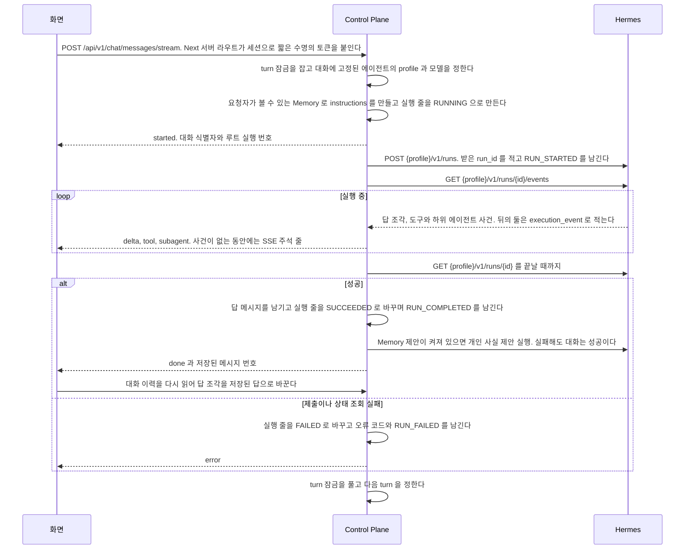

# 대화와 대기열

사용자가 에이전트와 대화를 주고받고, 응답 중에 보낸 메시지를 대기열에 두거나 실행을 멈추는 기능이다.

## 요구

- 사용자는 `/` 에서 에이전트를 골라 대화를 시작한다. 첫 메시지가 대화의 에이전트를 정하고, 그 대화에서 에이전트는 바뀌지 않는다.
- 대화마다 주소 `/chat/{대화 식별자}` 가 있다. 새로 고치거나 다른 탭에서 열어도 저장된 이력으로 이어서 말할 수 있다. `/` 는 지난 대화를 저절로 열지 않는다.
- 답은 흘러나오며 보이고, 도구와 하위 에이전트가 도는 동안에는 작업 과정이 보인다. 화면을 떠나도 실행은 서버에서 끝까지 돌고 저장된다.
- 답이 도는 동안 보낸 글은 대기열에 쌓였다가 다음 turn 으로 합쳐 간다. 도는 turn 은 중지할 수 있다.
- 마지막 답은 다시 생성할 수 있다. 사용자 메시지는 고치지 않는다([ADR-024](../adr/ADR-024-메시지-수정을-없애고-중지한-뒤-다시-보낸다.md)).
- 모든 답은 마크다운 원문을 복사할 수 있고 코드 블록도 따로 복사한다. 좁은 화면에서는 마우스를 올릴 수 없으므로 메시지 동작을 늘 보인다.
- 사이드바 목록은 최근에 고친 순서이고 날짜로 묶는다. 검색은 제목만 거르고 메시지 본문은 찾지 않는다.
- `MEMBER` 역할은 화면이 그리지 않는 내부 값을 응답으로도 받지 않는다. 아래 「역할에 따라 응답에서 빼는 값」 이 그 표다.

## 흐름

스트리밍 경로의 정상 흐름이다. 한 번에 받는 경로(`POST /api/v1/chat/messages`)도 같은 순서로 돌고, 화면으로 사건을 흘리지 않을 뿐이다.



## 대화 목록

예약 작업이 만든 대화는 날짜 묶음에서 빼고 맨 위의 「예약 작업」 묶음에 모은다([`docs/features/schedule.md`](schedule.md)).
날짜 묶음의 기준은 `components/shell/group-by-date.ts` 가 갖는다.
제목이 빈 대화는 「새 대화」 로 보이고 그 이름으로 검색된다. 사진만 올리고 아직 보내지 않은 대화가 그렇다.
점검 대화(`purpose` 가 `CHECK`)는 제목 앞에 「살펴보기」 배지를 붙이고, 묶음과 순서는 일반 대화와 같다.
목록은 쪽 단위로 읽고, 검색은 브라우저에서 거르므로 검색어를 쓰는 동안 아직 읽지 않은 쪽을 모두 읽은 뒤 거른다.
이름 바꾸기에서 빈 이름이나 `Esc`, 저장 실패는 원래 이름으로 되돌린다. 지우기가 실패하면 목록을 그대로 둔다.
돌고 있는 대화도 지울 수 있다. 실행은 서버에서 끝까지 돌고 기록되며, 지운 대화에 보내면 없는 대화와 같은 오류다.

## 기다리는 동안 보이는 것

기다림의 종류마다 다른 것을 보이고, 같은 회전 표시를 돌리지 않는다.
목록과 메시지를 읽는 동안에는 실제 내용과 같은 높이의 뼈대를 둔다. 높이가 다르면 내용이 도착할 때 화면이 튄다.

**기다림 점, 작업 과정 블록, 답 본문은 같은 줄의 같은 자리에 차례로 들어온다.**
기다림 줄이 사라지고 답 줄이 새로 생기면 높이가 튄다.
움직임의 길이와 줄인 움직임 설정은 [ADR-051](../../web/docs/adr/ADR-051-화면-색은-새벽-보라로-바꾸고-강조-색은-누를-것과-고른-것과-초점에만-쓴다.md) 이 정한다.

**화면을 옮길 때 이전 화면을 그대로 두지 않는다.**
화면마다 서버가 데이터를 다 읽은 뒤에 그리므로, 뼈대가 없으면 이전 화면이 멈춘 채 남아 누른 것이 먹혔는지 알 수 없다.
그래서 서버가 데이터를 읽는 화면 경로에 `loading.tsx` 를 두고, 사이드바의 누른 줄에는 이동이 끝날 때까지 회전 표시를 붙인다.

**요청을 보내는 단추를 흐리게만 하지 않는다.**
흐린 단추는 「지금 보내는 중」 과 「지금은 누를 수 없음」 을 구분하지 못한다.
보내는 동안에는 단추 폭을 그대로 두고 회전 표시와 지금 하는 일을 보이며 `aria-busy` 를 켠다.

답이 흘러나오는 동안에는 글자가 늘어나는 것 자체가 진행이라 회전 표시를 따로 두지 않는다.
흐름이 `SLOW_FLOW_MS` 를 넘기면, 화면을 떠나도 실행은 계속 돌고 다시 열면 저장된 답이 보인다고 한 번만 알린다.

## 새 대화 화면

인사 아래에는 지금 볼 것이 있을 때만 「확인할 것 N건」 을 보인다([`docs/features/attention.md`](attention.md) 의 「주소와 들어오는 길」).
주소가 `/?agent=<번호>` 이고 그 에이전트가 목록에 있으면 그 에이전트가 골라져 있다. 에이전트 상세와 연결 화면의 「대화하기」 가 이 주소로 연다.
입력창 맨 앞의 `/` 는 스킬 목록을 띄운다([`docs/features/agent-skill.md`](agent-skill.md) 의 「스킬 커맨드로 보낼 때」).

**사진을 먼저 올리거나 모델을 먼저 고르면 빈 대화를 먼저 만들고, 에이전트 카드와 `@` 가 잠긴다.**
고른 값과 사진을 둘 대화가 있어야 하고, 그 대화의 에이전트는 이미 정해졌기 때문이다.
화면은 메시지가 없는 동안 새 대화 화면 모양을 그대로 쓴다.
사진을 받는 에이전트인지는 `Agent.acceptsAttachments` 가 정한다([`docs/features/attachment.md`](attachment.md)). 받지 않는 에이전트를 고르면 사진 단추가 없다.

**`@` 는 새 대화 화면에서만 뜬다.** 중간에 다른 에이전트를 부르는 것은 에이전트가 정한다.

| 상황 | 화면 |
| --- | --- |
| 쓸 수 있는 에이전트가 없다 | 카드 자리에 안내와 「에이전트 만들기」(`/agents?new=1`)를 보이고 입력창을 잠근다. 사용자는 자기 에이전트를 직접 만들 수 있으므로 관리자에게 미루지 않는다 |
| 에이전트가 하나다 | 카드를 그리지 않고 그 에이전트의 추천 질문만 보인다 |
| 추천을 만드는 중이다 | 그 자리를 비워 두고 `use-starter-suggestions.ts` 가 정한 횟수만큼 다시 읽는다. 그래도 만드는 중이면 비워 둔다 |
| `@` 뒤 글자에 맞는 에이전트가 없다 | 맞는 에이전트가 없다는 한 줄 |

### 추천을 만들 때

추천 질문은 사람이 고치지 않는다. 만드는 때와 규칙은 [`docs/features/agent-skill.md`](agent-skill.md#추천-질문) 가 갖는다.
`GET /api/v1/agents/{code}/starters` 는 캐시에 있으면 `READY` 와 추천을, 없으면 `GENERATING` 과 빈 목록을 곧바로 돌려주고 만들기를 따로 시작한다.
만들기는 그 사용자의 최근 대화 첫 질문들로, 없으면 에이전트의 성격과 도구와 스킬 이름으로 Hermes 실행 하나를 돌린다.

| 무엇 | 어떻게 되나 |
| --- | --- |
| 같은 키로 두 요청이 거의 함께 온다 | 만들기는 하나만 돈다. 둘 다 `GENERATING` 을 받는다 |
| 만들기가 실패하거나 Hermes 가 멈춰 있다 | 이전 추천을 그대로 둔다. 없으면 `NONE` 이고 화면은 자리를 비운다 |
| 재시작했다 | 캐시가 비어 첫 화면이 다시 만든다 |
| 그룹 공개 에이전트다 | 그 사용자의 대화만 읽는다 |
| 그 사용자가 그 에이전트와 대화를 마쳤다 | 추천이 오래됐으면 같은 방법으로 다시 만든다 |

## 대화 한 번

이어지는 요청이 에이전트를 다시 주더라도 대화에 적힌 값을 쓴다.
`hermes_session_id` 가 특정 profile 안의 session 이라, 중간에 에이전트가 바뀌면 그 session 이 가리키는 것이 없어진다.

실행 줄은 Hermes 를 부르기 전에 `RUNNING` 으로 먼저 만든다([ADR-011](../../backend/docs/adr/ADR-011-실행은-시작할-때-기록하고-끝날-때-갱신한다.md)).

저장하는 답과 사용량은 Hermes 실행 상태 조회가 돌려준 최종 `output` 과 `usage` 다.
답 조각은 화면에만 쓰며, 이벤트 연결이 중간에 끝나도 최종 상태를 조회해 메시지와 실행 기록을 남긴다.

**사건이 없는 동안에도 스트림에 바이트를 흘린다.**
모델이 도구 없이 생각만 하는 동안에는 보낼 사건이 없다. 실제 실행에서 사건 사이가 229초 벌어졌고, 앞단 프록시가 약 100초 만에 연결을 끊어 화면이 끊김을 알렸다.
그래서 Control Plane 은 실행이 도는 동안 `assistant.chat.stream-heartbeat` 마다 화면이 건너뛰는 SSE 주석 줄을 보낸다.

**실행의 시작과 끝은 두 경로 모두 남는다.**
`RUN_STARTED` 와 `RUN_COMPLETED` 와 `RUN_FAILED` 는 Hermes 사건을 옮겨 적은 것이 아니라 Control Plane 이 직접 적는다.
그래서 사건 스트림을 읽지 못한 실행에도 시작과 끝이 남는다.
한 번에 받는 경로도 사건 스트림을 열어 도구와 하위 에이전트 사건을 실행 기록에 쌓고, 답 조각 시각(`first_delta_at`)은 적지 않는다([ADR-090](../../backend/docs/adr/ADR-090-한-번에-받는-경로도-hermes-사건-스트림을-열어-도구-사건을-남긴다.md)).

**사건 저장이 실패해도 대화는 성공으로 끝난다.**
사건은 관측용이고 그것 때문에 답이 사라지면 안 된다.
기동 정리가 실패로 적은 실행에도 그 오류 코드를 담은 `RUN_FAILED` 가 남는다.

## 대화 이력

**첫 메시지를 보내고 주소를 바꿀 때 화면을 다시 그리지 않는다.**
경로를 옮기면 대화 화면이 새로 만들어져 흘러오던 답을 잃는다. 그래서 `window.history.replaceState` 로 주소만 바꾼다.
`started` 가 오기 전에 다른 대화로 옮겼으면 늦게 온 `started` 로 주소를 바꾸지 않는다.

**주소만 바꿨으므로 그 뒤 「새 대화」 를 눌러도 화면이 새로 만들어지지 않을 수 있다.**
그래서 `ChatPanel` 은 주소가 `/` 로 **바뀌었는데** 대화 식별자를 들고 있을 때, 「새 대화」 를 눌렀을 때, 받은 대화 식별자가 다른 대화로 바뀌었을 때 대화별 상태를 가진 `ConversationSession` 을 `key` 로 새로 만든다.
상태를 하나씩 되돌리지 않으므로 대화별 상태를 더해도 되돌리는 자리를 따로 고치지 않는다.
대화 식별자가 새로 생긴 것은 여기 들지 않는다. 그때 새로 만들면 흘러오던 답과 올리던 사진을 잃는다.
대화 식별자는 첫 메시지의 `started` 와 첫 사진 전에 만드는 빈 대화([`docs/features/attachment.md`](attachment.md))에서 생기고, 받는 즉시 주소를 `/chat/{id}` 로 바꾼다.
그래서 주소가 `/` 인 채 식별자를 들고 있는 것만 보고 비우면, 사진을 올리는 순간 방금 만든 대화가 지워진다.
없어진 `ConversationSession` 이 받던 스트림은 서버에서 계속 돌지만, 늦게 온 사건은 화면과 주소를 바꾸지 않는다.

### 갈리는 지점

옛 주소 `/c/{번호}` 는 주인이면 `/chat/{id}` 로, 없거나 남의 대화면 `/` 로 넘기고 둘을 구분하지 않는다. UUID 모양이 아닌 식별자도 `/` 로 넘긴다(`test/browser/legacy-conversation-url.spec.ts`).

| 상황 | 화면 |
| --- | --- |
| 대화가 하나도 없다 | 사이드바 목록 자리에 아직 대화가 없다는 한 줄. 시작 화면은 그대로 쓴다 |
| 메시지를 읽지 못했다 | 그 대화만 오류를 보이고 목록은 남긴다 |
| 남의 대화나 지운 대화의 주소다 | 없는 것과 같은 오류다. 대화를 찾을 수 없다는 안내와 새 대화 단추를 보인다 |
| 옛 주소 `/c/{번호}` 의 번호 조회가 없는 대화가 아닌 까닭으로 실패했다 | `/` 로 넘기지 않고 오류 화면을 보인다. 서버 오류를 첫 화면으로 감추지 않는다 |
| 대화 식별자에 대문자가 섞였다 | 소문자 주소로 넘긴다. 사이드바가 주소를 소문자 식별자와 그대로 비교한다 |
| `started` 전에 실패했다 | 쓴 문장을 입력창에 되돌린다. 보내는 순간 입력창을 비우므로 되돌리지 않으면 문장이 사라진다 |
| `started` 뒤에 실패했다 | 질문은 서버에 남았다. 되돌려 다시 보내면 같은 질문이 둘 남으므로 그 메시지 아래에 오류와 「다시 시도」 를 보인다. 「다시 시도」 는 아래 「다시 생성」 과 같은 경로다 |
| 앞의 답이 끝나기 전에 또 보냈다 | 두 번째 글은 대기 메시지로 쌓인다. 다른 탭에서 보내도 같다. 아래 「응답 중에 보낼 때」 |
| 보내는 중에 다른 대화를 고른다 | 고를 수 있다. 앞 실행은 서버에서 계속 돌고 끝나면 저장된다 |

## 에이전트가 물을 때

에이전트가 이어 가려면 사용자가 정하거나 알려 줘야 하는 것이 있으면, 답 끝에 `<ask>` 블록을 둔다.
화면이 그 블록을 선택 카드로 그리고, 고른 답이 「이름표: 고른 답」 을 한 줄씩 적은 평범한 다음 메시지로 나간다([ADR-026](../adr/ADR-026-에이전트가-물을-것은-답-끝의-태그로-두고-화면이-카드로-그린다.md)).
에이전트에게 주는 형식 안내는 `AskFormat` 이, 화면의 해석과 상한은 `web/src/lib/ask.ts` 가 갖는다.

```
<ask>
<question header="식당 이름">어느 식당에 다녀왔어?</question>
<option>행복담</option>
<option description="사진의 간판 글자">행복한 담벼락</option>
</ask>
```

`multiple="true"` 인 질문은 고른 것을 쉼표로 이어 보내고, 선택지가 없는 질문은 직접 입력 칸만 보인다.

**실행은 답을 기다리지 않는다.** 답을 보내는 순간 끝나 있고, 답은 다음 turn 으로 온다.
그래서 기다리는 상태와 시간 제한이 없다. 카드를 무시하고 입력창에 다른 글을 보내도 된다.

형식 안내는 사용자가 직접 답하는 대화 실행에만 붙는다. 흐름의 Chief 와 자식에게는 붙이지 않는다.
실행 기록의 `context_chars` 와 `instructions_hash` 는 공통 답변 지침과 Memory 문맥을 대상으로 하고, 이 형식 안내는 제외한다.

### 질문 카드가 갈리는 지점

| 상황 | 화면 |
| --- | --- |
| 마지막 답의 카드 | 누를 수 있다. 모든 질문에 답해야 「답 보내기」 가 켜진다 |
| 지난 답의 카드 | 누를 수 없다. 바로 다음 메시지가 카드 답 형식이면 고른 답을 보이고, 새로 고침 뒤에도 대화 기록에서 되찾는다. 다른 글이면 무엇을 물었는지만 보인다 |
| 돌고 있는 turn 이 있을 때, 이전 버전을 보고 있을 때 | 누를 수 없다 |
| 보낸 답이 전송에 실패했을 때 | 그 답이 다시 마지막이 되어 카드를 다시 누를 수 있다 |
| 직접 입력을 골라 놓고 비워 둠 | 그 질문은 답하지 않은 것으로 본다 |
| 한 답에 블록이 여럿 | 마지막 카드만 누를 수 있다 |

스트리밍 중에 닫히지 않은 블록은 반쯤 온 태그가 글자로 보이지 않게 그리지 않는다.
모양이 어긋나거나 상한을 넘은 블록은 카드 대신 원문을 코드 블록으로 보이고, 코드 블록 안의 `<ask>` 는 예시로 본다. 이 해석은 `test/unit/ask.test.ts` 가 확인한다.

## 다른 창에서 답하는 중일 때

한 사람이 같은 대화를 두 창에서 열고, 한 창에서 보낸 질문의 답이 아직 오는 중이다.
**답 조각은 다른 창으로 보내지 않는다.** 스트리밍은 보낸 창에만 간다.
다른 창은 `GET /api/v1/chat/conversations/{id}/running` 으로 도는 turn 을 묻고, 기다리는 표시와 실행 트리로 다시 그린 작업 과정만 보인다. 답 본문은 끝난 뒤 이력으로 받는다.
도는 turn 을 이력보다 먼저 물어야 그 사이에 끝난 답을 놓치지 않는다.
조회 주기와 연속 실패 한도는 `use-conversation-observation.ts` 가 갖고, 창이 가려져 있으면 쉰다.

도는 turn 이 없을 때, 다른 창에서 중지할 때, 조회가 이어 실패할 때, 보는 동안 대화가 지워지거나 다른 대화로 옮길 때의 분기는 `test/browser/observe-running.spec.ts` 가 확인한다.
실행 번호가 아직 없으면 기다리는 표시만 보이고 중지 단추는 다음 조회에서 번호를 받을 때까지 눌리지 않는다.

**보낸 창도 스트림이 끊기면 보는 창이 된다.**
`done` 이나 `stopped` 나 `error` 없이 스트림이 끝나면 오류로 끝내지 않고 도는 turn 을 묻는다. 보내기와 다시 생성이 같다.
실제로 끊긴 뒤에도 실행은 13분을 더 돌아 성공했는데 화면은 그동안 실패로 보였다.
turn 이 돌면 보는 창이 되고, 끝나 답이 있으면 오류 없이 답을 보이고, 답도 없으면 끊김 안내를 보인다. 같은 테스트 파일이 확인한다.

| 상황 | 스트림이 끊긴 보낸 창 |
| --- | --- |
| `started` 전에 끊겼고 turn 이 돌지 않는다 | 이력에 새 질문이 저장돼 있으면 글을 되돌리지 않는다. 저장된 질문과 되돌린 글이 함께 있으면 다시 보낼 때 질문이 두 번 저장되기 때문이다. 새 질문이 없을 때만 보낸 글을 입력창에 되돌린다 |
| 새 대화가 대화 번호를 받기 전에 끊겼다 | 물을 대화가 없다. 보낸 글을 입력창에 되돌리고 응답 연결이 끊겼다는 안내를 보인다 |

넘어갈 때 받던 답 조각은 치운다. 저장된 답이 아니고, 남기면 기다리는 표시 대신 멈춘 답처럼 보인다.
같은 창을 새로 고친 것도 보는 창이다. 자기가 보낸 turn 인지 알 수 없어 다른 창에서 답하는 중이라는 안내를 보인다.
다른 창에서도 입력창은 잠기지 않고 보낸 글은 대기 메시지로 쌓인다. 사진 첨부와 다시 생성은 답이 끝날 때까지 잠긴다.

## 다시 생성

다시 생성 단추는 마지막 답 아래에만 있다. 원래 사용자 메시지의 글과 첨부로 새 실행을 돌리고, 새 답이 이전 답을 `replaces_message_id` 로 가리키는 판으로 쌓인다([ADR-022](../adr/ADR-022-다시-생성과-수정은-같은-session-에-판으로-쌓는다.md)).

**사용자 메시지의 글은 고치지 않는다.** 앞의 답을 되풀이하지 말라는 한 줄(`TurnIntent.REGENERATE_INSTRUCTION`)을 `instructions` 끝에 덧붙인다.

**마지막 메시지가 답 없는 사용자 메시지일 때도 다시 생성을 연다.** 화면은 이것을 「다시 시도」 로 보인다.
실패했거나 남긴 답 없이 중지된 turn 이 그렇다. 새 답은 가리킬 이전 답이 없어 `replaces_message_id` 가 비어 있다.

| 상황 | 응답 |
| --- | --- |
| 대상이 마지막 메시지가 아니다 | `MESSAGE_NOT_LATEST`. 화면이 이력을 다시 읽는다 |
| 그 대화에서 도는 실행이 있다 | `CONVERSATION_BUSY`. 끝난 뒤에 다시 누르게 한다 |
| 그 사용자가 동시 실행 한도를 모두 쓰고 있다 | `USER_BUSY`. 진행 중인 작업이 끝난 뒤 다시 누르게 한다([`docs/features/execution.md`](execution.md)) |
| 다시 생성이 실패했다 | 이전 판이 그대로 남는다. 새 판은 생기지 않는다 |

**판은 답 한 줄 단위다.** 예전에 수정으로 생긴 사용자 메시지의 판은 화면이 넘겨 볼 수 있게 두지만 새로 만드는 경로는 없다.

## 대화와 실행 사건

대화 경로의 판정과 사건, 역할에 따라 빼는 값을 갖는다. 경로와 본문은 `ChatController` 와 `PendingMessageController` 가, 칸은 `ChatDtos` 가 갖는다.

### 대화

대화 경로의 `{id}` 와 응답에서 대화를 가리키는 칸은 대화를 만들 때 정하는 공개 식별자(UUID)이고, 대화 표의 번호는 밖으로 나가지 않는다([ADR-025](../adr/ADR-025-대화는-주소에-공개-식별자를-쓰고-번호는-안에만-둔다.md)).
컨트롤러가 `ConversationAccess.requireOwnId(user, publicId)` 로 주인을 확인하며 번호로 바꾸고, `application` 안쪽은 번호를 쓴다.
UUID 모양이 아닌 `{id}` 는 400 `VALIDATION_FAILED` 다([`backend/docs/code-architecture.md`](../../backend/docs/code-architecture.md) 의 형식 오류 규칙).
지운 대화와 남의 대화는 모든 경로에서 `CONVERSATION_NOT_FOUND` 이고, 남의 실행과 없는 실행은 `EXECUTION_NOT_FOUND` 다. 둘을 구분하지 않는다.
대화를 지우면 목록에서 숨기고, 본문은 정리 작업이 곧 지운다([ADR-20261008 / conversation-purge](../../backend/docs/adr/ADR-20261008-conversation-purge.md)).

**turn 이 끝날 때 대화를 통째로 다시 저장하지 않는다.**
요청 시작에 읽은 `Conversation` 을 끝에서 통째로 저장하면, 그 사이에 사용자가 이름을 바꾸거나 지웠을 때 옛 값으로 덮여 지운 대화가 되살아난다.
turn 이 바꾸는 칸은 `hermes_session_id` 와 `updated_at` 뿐이므로 그 둘만 고치는 질의로 쓴다.
새 대화의 첫 turn 은 시작할 때 `hermes_session_id` 와 `hermes_root_session_id` 를 비어 있을 때만 채우고 `updated_at` 은 바꾸지 않는다.
바꾸면 실패한 turn 도 대화를 목록 맨 위로 올린다.

### 대화의 모델 선택

모델과 effort 는 대화가 고르고 기본값은 Hermes profile 이 갖는다([ADR-030](../../backend/docs/adr/ADR-030-모델과-effort-는-대화가-고르고-기본값은-hermes-profile-이-갖는다.md)).
기본 모델과 숨김을 DB 에 두는 까닭은 [ADR-054](../../backend/docs/adr/ADR-054-에이전트-기본-모델과-모델-숨김은-control-plane-db-가-갖는다.md) 에, 실행을 보낼 때 세 값을 정하는 차례는 [`docs/features/model-usage.md`](model-usage.md) 의 「모델 선택」 에 있다.

`ModelOptionsService` 는 `GET {profile}/api/model/options` 의 목록을 profile 마다 `assistant.chat.model-options-ttl` 동안 들고 있는다.
다시 읽다 Hermes 가 답하지 못하면 옛 목록을 돌려주고 다음 다시 읽기를 잠시 미룬다. 미루지 않으면 실행마다 목록 읽기의 timeout 까지 기다린다.
그 profile 의 목록을 한 번도 읽지 못했으면 `HERMES_UNAVAILABLE` 이다.

**effort `none` 은 저장할 때만 판정한다**([ADR-060](../adr/ADR-060-reasoning-effort-의-지원은-확인한-것만-보이고-모르면-미확인으로-둔다.md)).
모델을 비웠으면 에이전트 기본 모델로 판정하므로, `none` 의 저장만 목록 읽기 실패(`HERMES_UNAVAILABLE`)와 쓸 수 없는 에이전트의 오류를 받는다.
저장한 뒤 지원 값이 바뀌어도 실행은 저장된 `none` 을 그대로 보낸다.
Hermes 에 보낼 때 비어 있는 모델과 effort 는 `/v1/runs` 에서 빼고, `none` 은 `model_options.reasoning.effort` 에 싣는다.
정한 모델이 숨긴 모델이면 제출하지 않고 `MODEL_HIDDEN` 으로 실패시킨다. 모델이 비어 있으면 `ModelOptionsService.profileDefaultOf` 로 같은 판정을 한다.

화면은 모델 고르기 창을 열 때만 목록을 읽으므로, 창을 열기 전 단추는 대화에 적힌 값만 보인다.
**저장보다 먼저 나간 목록 다시 읽기의 응답은 버린다.** 새 대화에서 고르면 빈 대화를 만들며 목록을 다시 읽는 요청과 저장이 함께 나가, 늦게 온 목록이 저장한 값을 덮을 수 있기 때문이다.
기존 대화는 목록에 그 줄이 오기 전까지 단추를 막는다(`Composer` 의 `modelChoiceUnknown`). 적힌 모델을 모르는 채 저장하면 그 모델을 지우기 때문이다.

### 메시지 한 줄

`artifacts` 의 규칙은 [`docs/features/attachment.md`](attachment.md) 가, `delivery` 의 화면은 [`docs/features/agent-skill.md`](agent-skill.md) 의 「결과 다시 전달」 이 갖는다.
`activity` 요약은 답을 만든 실행과 그 아래 자식 실행의 `execution_event` 를 실행 번호 목록으로 한 번에 센다. 대화 하나를 열 때 질의가 답 수만큼 늘지 않게 한다.

- `toolCount` 는 시작과 끝 사건 수 가운데 큰 값이다. 한쪽이 빠져 와도 줄지 않게 한다.
- `subagentCount` 는 하위 에이전트 사건 수와 자식 실행 수를 더한다. 흐름으로 돈 답은 사건 없이 자식 실행만 남아, 더하지 않으면 요약이 0 이 되고 블록이 사라진다. 둘 다 남긴 하위 에이전트는 두 번 센다. Memory 제안 실행은 세지 않는다.
- `durationMs` 는 루트가 시작한 때부터 트리에서 가장 늦게 끝난 실행까지다. 흐름은 Chief 가 끝난 뒤에도 돈다.
- 예전에 provider 가 막혀 다음 모델로 넘어간 turn 은 막힌 시도의 사건을 넣지 않는다. 지금은 Control Plane 이 provider 를 넘기지 않아 이런 줄이 새로 생기지 않는다.

### 화면으로 보내는 사건

사건의 종류와 싣는 칸은 `ChatEvent` 의 생성 함수가 갖는다. 화면은 이 값만 알고 Hermes 의 원래 사건 이름을 읽지 않는다.

**`started` 는 흐름으로 도는 turn 에서도 루트 실행의 번호를 싣는다.**
중지는 루트 번호로 보내고 Control Plane 이 그 아래를 찾아 멈춘다. 화면은 마지막으로 받은 `started` 의 번호를 쓴다.

**도구의 명령 원문은 저장은 그대로 하되 `ADMIN` 역할에게만 보낸다**([ADR-038](../adr/ADR-038-도구의-명령-원문은-관리자에게만-보내고-사용자에게는-사람-말로-보인다.md)).
대화 스트림의 `tool` 사건과 실행 트리 경로의 도구 사건이 같은 판정(`ToolDetailPolicy`)을 쓰고, `MEMBER` 역할에게도 공개하는 도구의 목록도 거기 있다.
판정은 도구 이름 전체로 한다. `mcp__{서버}__web_search` 처럼 다른 MCP 서버가 같은 이름을 붙인 도구는 공개하지 않는다.
도구 사건이 아닌 사건의 `detail` 가운데 하위 에이전트의 목표(도구 내용 가리기 규칙으로 가린 값)와 실패 코드는 모두에게 싣는다.

### 실행 기록의 페이징

경로와 커서 모양은 `UsageController` 가 갖는다. 커서에는 사용자 식별자가 없고, 다른 사용자의 커서를 받아도 요청자의 루트 실행만 읽는다.
다음 쪽 유무는 한 줄을 더 읽어 판단하고, 매 조회마다 전체 루트를 세는 비용을 피하려고 전체 건수는 넣지 않는다.

### 역할에 따라 응답에서 빼는 값

**화면이 `MEMBER` 역할 사용자에게 그리지 않는 내부 값은 Control Plane 도 보내지 않는다**([ADR-063](../adr/ADR-063-관리자-전용-표시와-동작은-관리자-영역에만-두고-일반-경로의-응답은-서버가-역할에-따라-줄인다.md)).
판정은 `InternalValuePolicy` 한 자리이고, 응답 DTO 를 만드는 쪽이 `ToolDetailPolicy` 와 같은 자리에서 함께 적용한다.
`ADMIN` 역할에게는 아래 응답이 그대로 가고, `MEMBER` 역할에게는 「빼는 값」 이 `null` 로 간다.

| 응답 | 빼는 값 |
| --- | --- |
| `GET /api/v1/usage/executions` 의 실행 한 줄 | `agentCode`, `provider`, `model`, `reasoningEffort`, `costMode`, `runtimeFingerprint`, `instructionsHash`, `costCurrency`, `pricingVersion`, `inputTokens`, `cachedInputTokens`, `outputTokens`, `totalTokens`, `contextChars`, `contextOmittedItems`, `estimatedCostMicros`, `actualCostMicros` |
| `GET /api/v1/usage/monthly-cost` | `currency`, `estimatedCostMicros`, `actualCostMicros`, `pricedExecutions`, `unpricedExecutions`, `subscriptionExecutions`, `pricedSubagents`, `pendingSubagents`, `unconfirmedSubagents`, `unpricedSubagents`. 실행 건수 `totalExecutions` 는 모두에게 싣는다 |
| `GET /api/v1/usage/breakdown` | 응답 전체. `MEMBER` 역할이 부르면 `FORBIDDEN` 이다 |
| `GET /api/v1/usage/skills` 의 한 줄 | `agentCode` |
| `GET /api/v1/usage/executions/{id}/tree` 의 실행 노드 | `agentCode`, `provider`, `model`, `reasoningEffort`, `reasoningEffortSource`, `inputTokens`, `cachedInputTokens`, `outputTokens`, `totalTokens`, `estimatedCostMicros`, `requestReceivedAt`, `submittedAt`, `firstDeltaAt`, `finishedAt`, `contextSources` |
| 같은 응답의 사건 | `model`, `inputTokens`, `outputTokens`. `PROVIDER_SWITCHED` 사건은 사건째 뺀다 |
| `GET /api/v1/chat/conversations/{id}/messages` 의 메시지 | `switchedTo` |
| 대화 스트림과 대화 단위 SSE 의 `subagent` 사건 | `model`, `inputTokens`, `outputTokens` |
| 같은 흐름의 `switched` 사건 | 사건째 보내지 않는다 |
| `GET /api/v1/chat/model-tiers` 의 단계 한 줄 | `provider`, `model`, `reasoningEffort` |

| 빼지 않는 값 | 까닭 |
| --- | --- |
| 실행 한 줄의 `errorCode`, `RUN_FAILED` 사건의 `detail`, SSE `error` 사건의 `code` | 화면이 코드를 사람 말 문구로 바꾸는 데 쓴다. 빼면 모든 실패가 같은 문구가 되고 화면의 분기가 깨진다. 코드 원문은 화면이 `MEMBER` 역할에게 그리지 않는다 |
| `latencyMs`, `modelTier`, `skillNames` | `MEMBER` 역할에게 보이는 값이다 |
| `subagentName` | 목표가 비었을 때 도우미 줄의 이름으로 쓴다 |
| `GET /api/v1/chat/model-options` 와 대화 응답의 `provider`, `model`, `reasoningEffort` | `MEMBER` 역할도 쓰는 모델 선택의 입력이다. 숨김 목록을 적용한 것만 간다 |
| 에이전트 목록의 `code`, 대화의 `agentCode` | 주소와 요청 본문에 쓰는 열쇠다 |

## 대기열과 중지

한 대화에 turn 이 하나만 돌게 하는 규칙을 갖는다.
같은 Hermes session 에 두 turn 이 겹쳐 들어가면 어느 답이 어느 질문의 것인지 모델도 모른다.

### 응답 중 대기열

turn 이 도는 동안 보낸 글을 Control Plane 이 대기 메시지로 쌓았다가 다음 turn 으로 합쳐 보낸다.
보내는 때와 합치기, 상한, 중지 뒤 멈춰 두기, 재시작은 [ADR-048](../adr/ADR-048-응답-중에-보낸-메시지는-control-plane-이-쌓아-두고-다음-turn-으로-합쳐-보낸다.md) 의 결정 표가 갖는다.

**다음 turn 을 정하는 자리는 `NextTurnDispatcher.tryNext` 하나다.**
`TurnCancellation` 의 종료 리스너는 이것 하나만 건다.
turn 이 닫힐 때, 위임이 끝났을 때, 서버가 뜰 때, 기동 정리가 잠금을 풀 때 모두 이 자리를 지난다.
멈춰 둔 행이 없는 대기 행이 있으면 turn 잠금을 잡고 `ChatService.runPendingMessages` 로 보내고, 없으면 `DelegationWakeService.tryWake` 로 넘긴다. 그래서 사용자의 말이 위임 결과보다 먼저 간다.

**`POST .../pending` 은 저장한 뒤 언제나 `tryNext` 를 부른다.**
turn 이 도는지 먼저 보고 저장할지 정하면, 보는 순간과 저장하는 순간 사이에 turn 이 닫혔을 때 그 글을 보낼 계기가 없다.

**멈춤은 행마다 `held` 로 DB 에 적는다.**
한 행이라도 멈춰 있으면 그 대화의 대기 줄 전체를 보내지 않고, 멈춰 있을 때 더한 행은 멈춘 채로 들어간다.
메모리에만 두면 서버가 다시 뜬 뒤 기동 확인이 사용자가 멈춘 글을 보내 버린다.

**사용자 실행 한도에 닿으면 대기 행을 보내지 않고 멈춘다.**
turn 잠금을 열 때 `USER_BUSY` 가 오면 대기 행을 지우지 않고 대기 줄을 멈춘 뒤 대화 단위 SSE 로 `error` 사건을 낸다.
멈추지 않고 두면 보낼 계기가 없다. 사용자의 다른 대화가 끝나도 이 대화의 `tryNext` 는 불리지 않는다.
위임 결과 자동 turn 이 `USER_BUSY` 를 받으면 결과를 전했다고 적지 않고 `DelegationWakeService.FAILURE_BACKOFF` 뒤 다시 시도한다.
연속 거절이 `MAX_BUSY_RETRIES` 를 넘으면 `LONG_BUSY_RETRY` 간격으로 늦추고, 한 대화에 예약을 하나만 둔다. 한도는 [`docs/features/execution.md`](execution.md) 가 갖는다.

대기 행을 지우는 것과 `USER` 행을 저장하는 것은 `ChatTurnRouting.saveQuestion` 의 같은 트랜잭션이다.
지운 행 수가 읽은 행 수와 다르면 읽은 뒤 취소된 행이 있었다는 뜻이라, 되돌리고 대기 행을 다시 읽어 합친다.

사용자 메시지를 저장하기 전에 실패하면 남은 행을 멈춰 두고 `error` 사건을 낸다.
멈추는 것까지 실패하면 그 대화는 `NextTurnDispatcher.FAILURE_BACKOFF` 동안 대기 메시지 turn 을 다시 열지 않는다. 그동안에도 위임 결과는 전한다.
대기 메시지로 연 turn 은 사용자가 보낸 turn 과 같아 `auto_turn_count` 를 0 으로 돌린다.
대기 메시지 경로는 `assistant.delegation-wake.enabled` 와 무관하게 켜져 있다.

### 응답 중에 보낼 때

화면은 답이 도는 중이거나 대기 줄이 멈춰 있으면 대기 경로로 보낸다(`use-conversation-queue.ts`).
보통 보내기가 `CONVERSATION_BUSY` 로 거절되면 글만 보낸 경우에 대기 메시지로 다시 넣는다.
대화 창은 대화를 열 때, `pending` 사건을 받을 때, 대화 단위 SSE 에 다시 붙은 뒤 대기 줄을 다시 읽는다. 끊긴 사이의 `pending` 사건을 놓쳤을 수 있기 때문이다.
어느 창에서든 취소하고 보낼 수 있다.

| 경우 | 결과 |
| --- | --- |
| 중지한 turn 이 오류로 끝났다 | 실행은 취소로 남고 화면은 `error` 를 받는다. 대기 줄은 중지와 같이 멈춰 둔다 |
| 멈춰 둔 대기 줄에서 「보내기」 를 누른다 | 멈춤을 풀고 `tryNext` 를 부른다. turn 이 돌고 있으면 그 turn 이 끝난 뒤 간다 |
| 대기 줄이 멈춰 있을 때 입력창에서 새 글을 보낸다 | 그 글을 더한 뒤 「보내기」 와 같이 푼다. 멈춰 둔 글과 새 글이 순서대로 합쳐져 간다 |
| 대기 줄이 멈춰 있을 때 다른 turn 이 끝났다(다시 생성, 자동 turn) | 멈춘 채로 둔다. 사용자가 풀 때까지 보내지 않는다 |
| 대기 메시지를 취소한다 | 글을 입력창으로 되돌린다. 쓰던 글이 있으면 그 뒤에 줄을 바꿔 붙인다 |
| 취소하는 사이에 이미 보내졌다 | `PENDING_MESSAGE_NOT_FOUND`. 그 글은 이미 사용자 메시지로 저장됐으므로 입력창에 되돌리지 않는다 |
| 상한을 넘는다(`PendingMessageService`) | `PENDING_QUEUE_FULL`. 저장하지 않고 글을 입력창에 되돌린다 |
| 새 대화의 첫 turn 이 아직 대화 식별자를 받지 못했다 | 보내기를 막는다. `started` 가 식별자를 실어 온 뒤부터 대기 메시지를 받는다 |
| 흐름이 붙은 에이전트의 대화다 | `CONVERSATION_BUSY` 로 거절하고 글은 입력창에 남긴다. 흐름은 질문을 흐름 안에서 저장해 대기 행 삭제와 한 트랜잭션으로 묶을 수 없다 |
| 보낼 대기 메시지와 끝난 위임 결과가 함께 있다 | 대기 메시지를 먼저 보낸다. 그 turn 이 닫힌 뒤 위임 결과를 전한다 |
| 대화를 지운다 | 그 대화의 대기 행을 함께 지운다 |

꺼지거나 지워진 에이전트(`AGENT_DISABLED`, `AGENT_NOT_FOUND`), `/이름` 의 스킬 커맨드 해석, 저장한 뒤의 실행 실패와 중지는 보통 보내기와 같다.

### 중지

`chat/application` 의 `TurnCancellation` 이 도는 turn 마다 루트 실행 번호를 열쇠로 중지 표시를 하나 갖는다.
중지 경로가 그 표시를 세우고, 흐름은 자식을 시작하기 전과 합치기 전에 그것을 본다.
`ChatService` 와 흐름이 서로를 부르지 않게 표시를 따로 둔다. 검사는 `ArchitectureRules.ORCHESTRATION_DOES_NOT_CALL_CHAT_SERVICE` 다.

| 규칙 | 까닭 |
| --- | --- |
| 등록과 해제는 `ChatService` 만 한다. 흐름 경로도, 한 번에 받는 경로도 등록한다 | 등록되지 않은 turn 은 중지도 `CONVERSATION_BUSY` 도 받지 못한다 |
| 같은 대화에 도는 turn 이 있는지 보는 것과 등록하는 것을 한 번에 한다 | 둘 사이에 다시 생성 두 개가 함께 들어오면 같은 답을 가리키는 판이 둘 생긴다 |
| `open` 은 대화에 도는 turn 을 먼저 보고, 그다음 사용자의 turn 자리([`docs/features/execution.md`](execution.md) 의 「세는 방법」)를 얻고, 마지막에 대화 잠금을 잡는다. 자리를 얻다 `USER_BUSY` 가 나면 그 대화에 도는 turn 이 생겼는지 한 번 더 본다 | 같은 대화를 두 요청이 함께 열 때 진 쪽이 `CONVERSATION_BUSY` 를 받아 대기 메시지로 들어가게 한다. 잠금을 잡았다가 되돌리는 순서로 두면 되돌린 잠금이 닫기 리스너를 부르지 않아, 닫힐 때를 기다린 깨우기가 다음 계기까지 미뤄진다 |
| Hermes 에 제출한 직후 run 번호를 등록한다. `AgentRunner` 는 제출 뒤 부르는 콜백으로 알린다 | 흐름의 Chief 는 `AgentRunner` 안에서 제출된다. 알리지 않으면 Chief 를 멈출 수 없다 |
| run 을 등록할 때 이미 중지 표시가 서 있으면 그 자리에서 중지를 보낸다 | `started` 뒤 제출 전에 들어온 중지가 사라지지 않게 한다 |
| run 마다 중지를 보냈는지 적는다. 다시 부르면 보내지 못한 run 에만 다시 보낸다 | 보내다 실패한 뒤 다시 눌러도 아무 일이 없으면 안 된다 |
| 중지를 보낸 뒤 스트림이 `assistant.chat.stop-stream-grace` 안에 끝나지 않으면 Control Plane 이 스트림을 닫고 상태 조회로 넘어간다 | 취소된 run 의 스트림이 닫히는지 실제 Hermes 로 확인하지 못했다 |

중지는 루트와 `root_execution_id` 로 찾은 그 아래 실행마다 `POST {profile}/v1/runs/{run_id}/stop` 을 보낸다.
자식의 에이전트 행이 없으면 로그만 남기고 건너뛰며 루트의 중지는 계속한다([`docs/features/agent-skill.md`](agent-skill.md) 의 「에이전트 만들기와 지우기」).
`agent_delegate` 로 맡긴 자식도 run 번호가 붙을 때 `AgentDelegationService` 가 루트 turn 의 표시에 붙인다.
turn 이 끝난 뒤에 맡긴 자식은 붙일 표시가 없어 `agent_stop` 으로만 멈춘다.

**중지할 수 있는지를 실행 줄의 상태로 판정하지 않는다.**
흐름으로 도는 turn 은 Chief 가 끝나면 루트 줄이 `SUCCEEDED` 가 되고 그 뒤에 자식이 돈다. 줄 상태로 보면 자식이 도는 동안 중지를 거절하게 된다.
그래서 이 프로세스에 등록된 도는 turn 이 그 번호를 루트로 갖는지로 본다.
멈춘 turn 의 루트 줄은 이미 `SUCCEEDED` 였어도 `CANCELLED` 로 덮어쓰고, 토큰과 비용은 그대로 둔다.
멈춘 자리까지의 답은 남긴다([ADR-021](../../backend/docs/adr/ADR-021-중지한-답은-멈춘-자리까지-남긴다.md)).

**다른 창이 도는 turn 을 물을 때도 이 표시를 본다.** 줄 상태로 보면 자식이 도는 동안 「돌지 않는다」 고 답하게 된다.
`running` 경로는 표시가 가진 루트 실행 번호와 그 실행 줄의 `startedAt` 을 돌려준다.
번호가 아직 붙지 않았으면 `running` 은 true 이고 `executionId` 와 `startedAt` 은 null 이다.

**잠금을 풀기 전에 대기 행을 멈춘다.**
turn 이 중지로 끝나면 `ChatTurnStopper` 가 `TurnCancellation.markStopped` 를 적고 그 대화의 대기 행을 모두 멈춘다.
잠금을 푼 뒤 종료 리스너에서 멈추면 그 사이 다른 스레드의 `tryNext` 가 아직 멈추지 않은 행으로 turn 을 연다.
**사용자가 중지를 확정한 실행은 `RUNNING` 으로 남지 않는다.**
중지가 확정된 turn 이 예외로 끝나면 실행 줄이 아직 끝나지 않았을 때 취소로 적고(이미 `FAILED` 면 그대로 둔다), 그 뒤 대기 행을 멈춘다. 흐름 turn 도 같다.
멈춤이나 `pending` 알림이 실패해도 경고 로그만 남기고 그 turn 은 `stopped` 로 끝나며, 잠금 해제와 `tryNext` 를 막지 않는다.

**표시는 한 프로세스의 메모리에 있다.** Control Plane 이 하나라서 그것으로 된다. 둘 이상으로 늘리면 이 표시를 데이터베이스로 옮겨야 한다.

#### 중지가 갈리는 지점

중지 단추 `■` 는 답을 만드는 동안 보내기 단추 옆에 나오고, 누른 뒤 `stopped` 가 올 때까지 잠긴다.

| 상황 | 화면 |
| --- | --- |
| `started` 가 오기 전에 누른다 | 단추가 눌리지 않는다. 실행 번호가 아직 없다 |
| 그 번호로 도는 turn 이 없다 | `EXECUTION_NOT_RUNNING`. 이미 끝난 번호다. 알리지 않고 곧 올 끝 사건을 기다린다 |
| 남의 실행 번호다 | `EXECUTION_NOT_FOUND`. 없는 것과 같은 오류다 |
| Hermes 에 중지를 보내지 못했다 | 중지 단추를 다시 누를 수 있게 풀고 오류를 알린다 |
| 멈춘 자리까지 나온 답이 없다 | 답 메시지를 만들지 않는다. 사용자 메시지 아래에 답을 받지 못했다는 안내와 「다시 시도」 |
| 중지한 답 | 답 아래에 「중지됨」 표시. 다시 생성할 수 있다 |

### 기동할 때 남은 실행 정리

이전 프로세스가 남긴 `RUNNING` 실행을 Hermes 에 물어 정하고, 도는 실행에는 다시 붙는다.
Hermes 의 답마다 적는 상태와 `error_code`, 흐름 turn 에 붙지 않는 까닭, 기다리는 상한, 서버 한 대 전제는 [ADR-061](../../backend/docs/adr/ADR-061-재기동-때-남은-실행은-hermes-에-물어-정하고-도는-실행에는-다시-붙는다.md) 이 갖는다.
Hermes 의 실행 조회가 무엇을 얼마 동안 답하는지는 [`hermes/docs/hermes-contract.md`](../../hermes/docs/hermes-contract.md) 의 「실행 조회가 답하는 기간」 이 갖는다.
`RUNNING` 으로 남은 예약 발화(`task_run`)는 다시 돌리지 않고 닫는다([`docs/features/schedule.md`](schedule.md) 의 「기동할 때」).
`RestartReconciler` 가 정하고 `RecoveredRunRecorder` 가 적는다. 켜고 끄는 값과 기다리는 상한은 `RestartReconcileProperties` 가 갖는다.

**다른 복구가 먼저 돈다.** 가치 평가 복구와 매일 루프 복구([`docs/features/proactive.md`](proactive.md) 의 「서버가 멈췄을 때」)가 가장 앞 phase 에서, `ProactiveCheckRecovery` 가 `RestartReconciler.PHASE - 1` 에서 돈다.
시스템 판단의 에이전트 없는 실행 줄과 남은 살펴보기를 이 정리가 잡기 전에 닫기 위해서다. 그래야 이 정리가 끝낸 위임 자식이 점검 대화에 자동 turn 을 열지 않는다.
평가 복구의 한 줄이나 목록 조회가 실패해도 다른 복구와 서버 기동을 이어 간다.

그 뒤 `RestartReconciler` 가 두 단계로 돈다.

1. **잡기.** 웹 서버가 요청을 받기 전에, run 번호가 있는 대화 turn 의 루트 줄과 흐름 turn 의 줄마다 그 대화의 turn 잠금을 잡고 실행 번호와 run 을 표시에 붙인다. 이미 Hermes 에서 도는 실행이라 이 잠금은 사용자 실행 한도를 보지 않는다.
2. **묻기.** `ApplicationReadyEvent` 에서 `NextTurnDispatcher` 의 기동 뒤 깨우기보다 먼저 시작한다. 실행마다 가상 스레드 하나가 Hermes 에 끝날 때까지 묻고, 줄을 적은 뒤 잡은 잠금을 푼다.

`ApplicationReadyEvent` 에서 잡으면 그 사이 들어온 보내기가 같은 Hermes session 에 turn 을 하나 더 열므로, 잡기는 웹 서버를 여는 lifecycle 보다 앞선 phase 의 `SmartLifecycle` 에서 한다.
잡기가 실패해도 기동은 이어 가고, 묻기 단계가 기동하기 전에 시작한 줄만 다시 잡는다. 웹 서버가 열린 뒤 새로 시작한 turn 의 줄을 건드리지 않기 위해서다.
`assistant.restart-reconcile.enabled` 를 false 로 두면 잡지도 묻지도 않는다. 테스트 profile 이 이렇게 돌고, 운영에서 끄면 `RUNNING` 줄이 그대로 남는다.

| 실행 | 판정 | 끝났을 때 적는 것 | 아직 돌 때 |
| --- | --- | --- | --- |
| 대화 turn | 부모가 없고 대화가 있다. 그 에이전트에 흐름이 없다 | 실행 줄, `ASSISTANT` 메시지, 대화의 session. `RecoveredAnswerGuard` 가 답 대신 알림 줄을 정하면 그 줄만 남긴다. 먼저 살펴보기 turn 이 그렇다([`docs/features/proactive.md`](proactive.md) 의 「끝날 때」). 그 실행이 시작한 뒤 대화 폴더에 생긴 HTML 을 답에 묶는다. 대화 단위 SSE 로 `done`, `stopped`, `error` 가운데 하나를 낸다 | 다시 붙는다. 그 대화의 turn 잠금을 쥔다 |
| 위임 실행 | `delegation_key` 가 있다 | 실행 줄과 `output_text` 와 끝 사건. `DelegationFinished` 를 낸다 | 다시 붙는다. 잠금은 잡지 않는다 |
| 흐름 turn 과 그 자식 | 루트 실행의 에이전트에 흐름이 있다 | 실행 줄과 끝 사건. 루트는 성공으로 끝났어도 `FAILED`(`ORPHANED`) 로 적고 사용량은 남긴다. 루트가 끝나면 대화 단위 SSE 로 `error` 나 `stopped` 를 낸다. 자식만 돌던 turn 은 잠금을 풀 때 한 번 낸다 | 중지를 보내고 끝난 상태를 기다린다. 그 대화의 turn 잠금을 쥔다. 루트 줄이 이미 끝나고 자식만 도는 때에도 쥔다 |
| 그 밖의 실행(Memory 제안, 추천 질문) | 위 셋이 아니다 | 실행 줄과 끝 사건만 적는다. 답은 쓰지 않는다 | 다시 붙는다. 잠금은 잡지 않는다 |

위임 답은 보통 위임과 같이 `assistant.delegation.output-max-chars` 까지 자른다.
대화 turn 의 답은 그 대화의 마지막 메시지가 `ASSISTANT` 이면 그 답을 다시 생성한 것으로 적는다. 다시 생성은 질문을 새로 저장하지 않기 때문이다.
끝 사건, 결과물 묶기, 알림은 실행 줄을 적은 트랜잭션이 끝난 뒤에 한 번 한다. 그 사이에 프로세스가 죽으면 다시 하지 않는다.

다시 정하는 쪽은 turn 을 열지 않는다. 잠금을 풀면 닫기 리스너가, 위임 실행을 적으면 `DelegationFinished` 가 `tryNext` 를 부른다.
기동 뒤 깨우기(`dispatchAfterStartup`)는 잠금이 잡힌 대화를 건너뛰고, 그 잠금이 풀릴 때 다시 온다.

#### 기동 정리가 갈리는 지점

Hermes 가 끝났다고 답할 때, 404, 닿지 못할 때, 상한을 넘길 때, run 번호가 없을 때는 ADR-061 의 결정 표가 갖는다.
에이전트 행이 없는 줄(`ORPHANED`), 다시 붙은 turn 의 사용자 중지, 정하는 중에 또 내려감(줄을 적지 않고 다음 기동이 다시 정한다), 적다가 실패함(실패로 적지 않고 다시 묻는다), 같은 줄을 두 번 적으려 함, 정하는 동안 쌓인 대기 메시지(잠금이 풀린 뒤 간다)는 `RestartReconcilerTest` 가 확인한다.

| 경우 | 결과 |
| --- | --- |
| Hermes 에서 취소로 끝났다 | `CANCELLED`. 멈춘 자리까지의 답과 사용량을 남긴다. 먼저 살펴보기 turn 이면 답 대신 「살펴보기를 멈췄어요」 알림 줄 하나만 남는다 |
| 잡을 때 다른 turn 이 이미 그 대화의 잠금을 쥐고 있다 | 경고 로그를 남기고 잠금 없이 정한다. 그 turn 이 닫힐 때 다음 turn 이 정해진다 |
| 다시 정하는 동안 그 대화를 연다 | `running` 경로가 그 실행 번호를 돌려준다. 화면은 답을 만드는 중으로 보이고 끝나면 이력을 다시 읽는다. 답 조각은 흐르지 않는다 |
| 다시 붙은 위임 실행에 `agent_stop` 이 온다 | Hermes 에 중지를 보낸다. 다시 물을 때 취소로 읽혀 `CANCELLED` 로 적힌다 |
| 끝난 위임 결과 | 부모 대화에는 `result_delivered_at` 이 빈 줄만 전하므로 다시 떠도 한 번만 간다 |
| 정한 줄이 결과를 전하던 자동 turn 이나 다시 전달 turn 의 부모 실행 줄이다 | 실행 줄을 적는 트랜잭션에서 그 전달 시도도 닫는다. `SUCCEEDED` 는 `SUCCEEDED`, `FAILED` 는 실행 줄의 `error_code` 를 적은 `FAILED`, `CANCELLED` 는 `STOPPED` 다([`docs/features/agent-skill.md`](agent-skill.md) 의 「결과 전달이 끝나지 않았을 때」) |
| 알림 줄만 저장하고 부모 실행 줄이 생기기 전에 내려간 전달 시도 | 실행 줄이 없어 이 정리의 대상이 아니다. `ResultDeliveryRecovery` 가 기동할 때 `FAILED`(`INTERRUPTED`)로 닫고 사용자가 다시 전달한다 |
