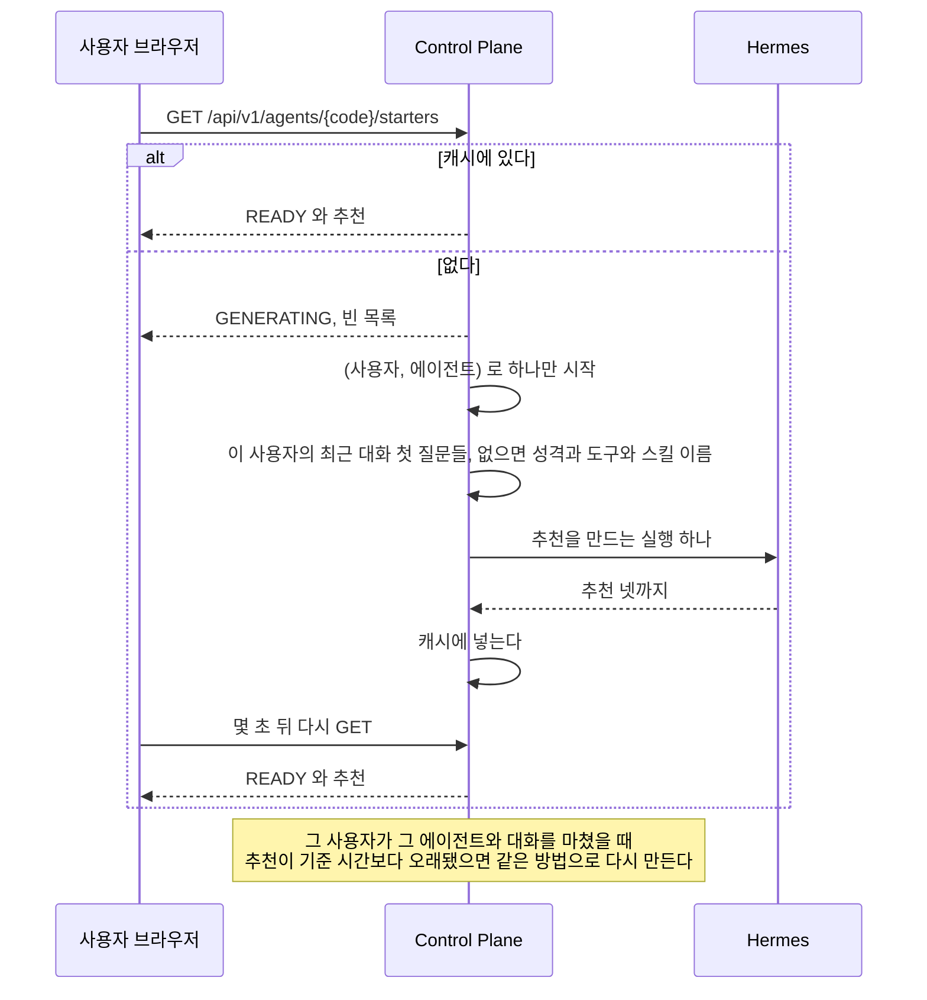
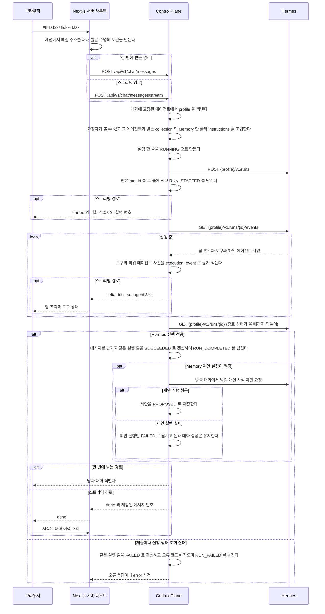
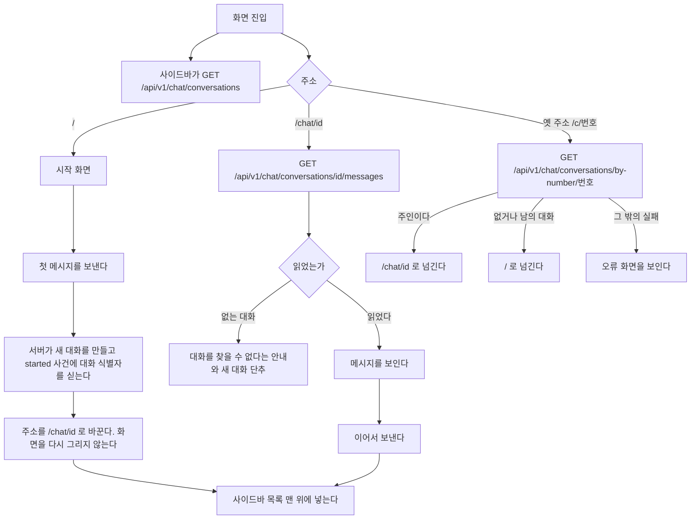
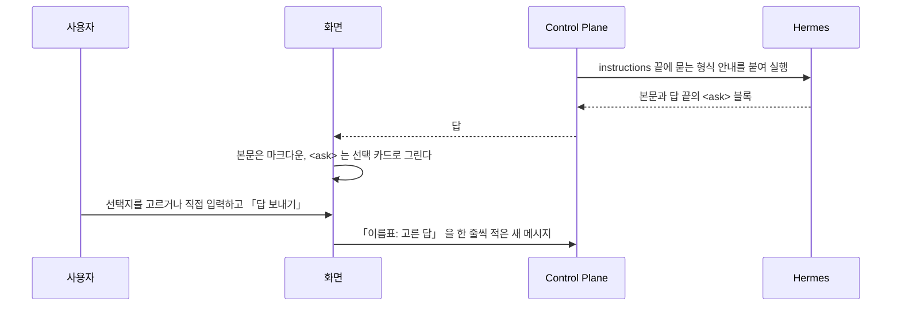
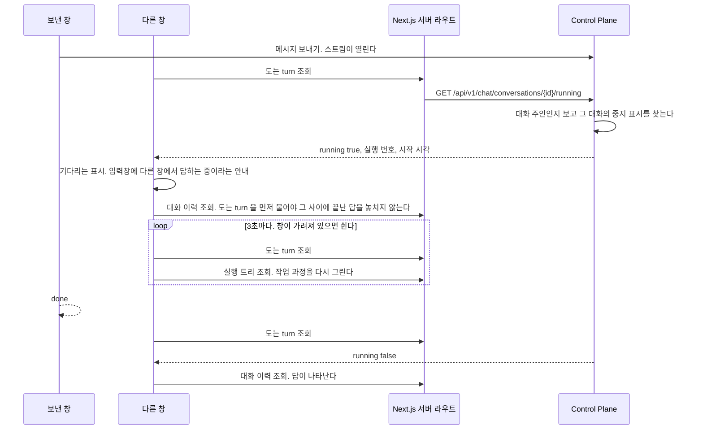
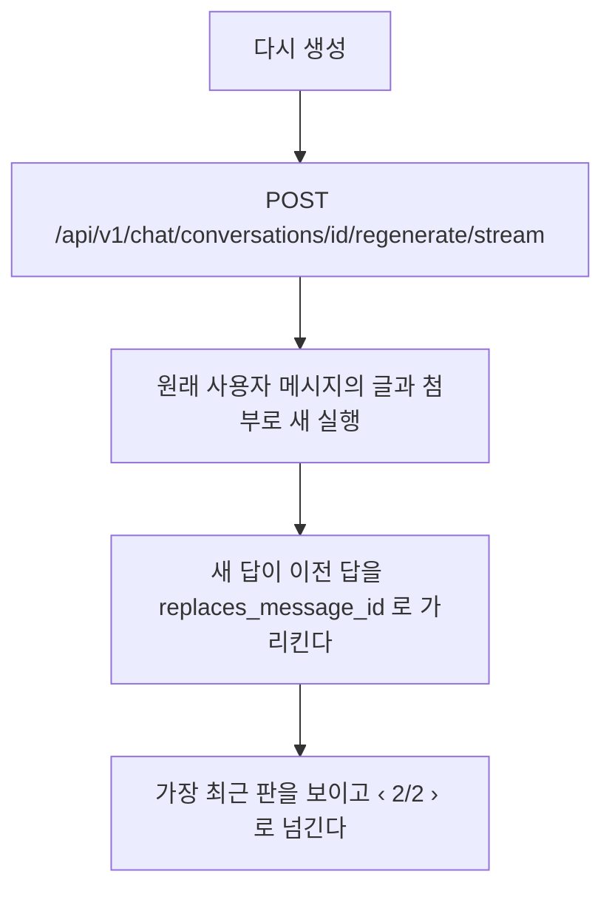
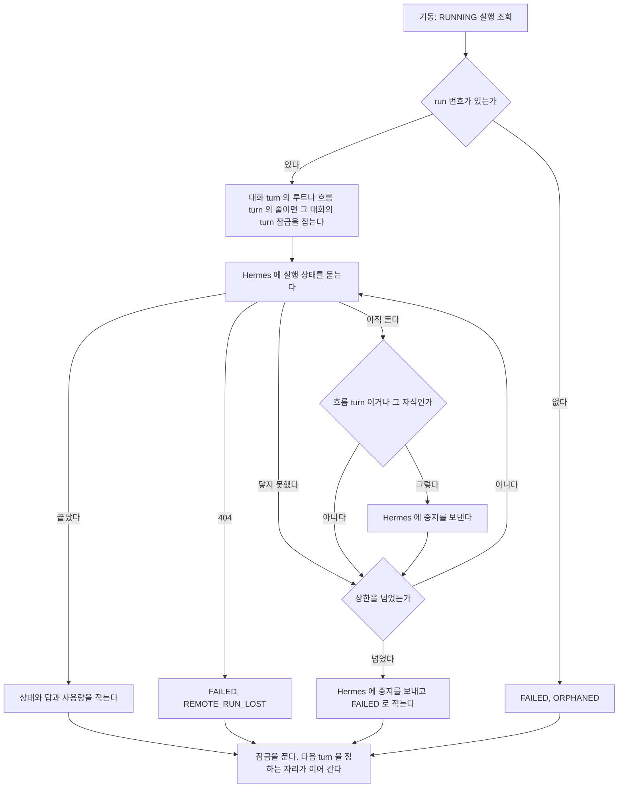
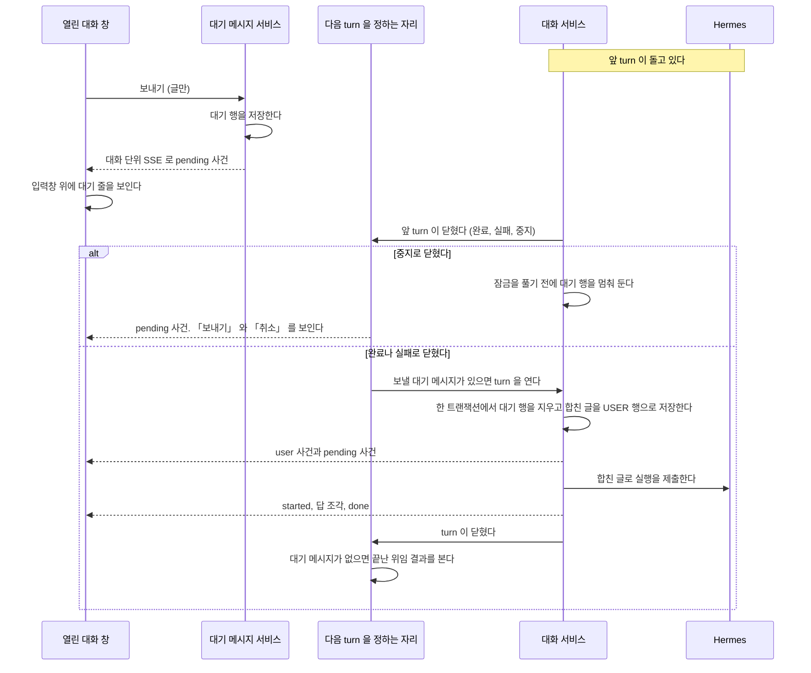
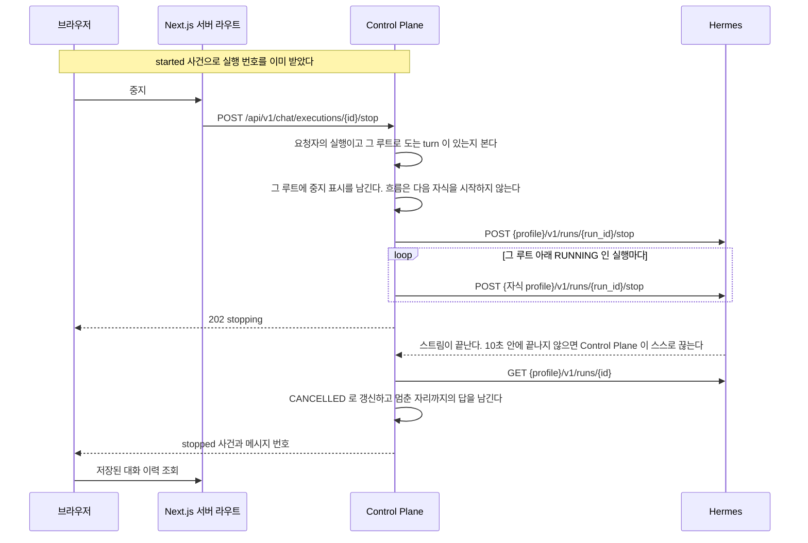

# 대화와 대기열

사용자가 에이전트와 대화를 주고받고, 응답 중에 보낸 메시지를 대기열에 두거나 실행을 멈추는 기능이다.

## 대화 목록

사이드바의 목록은 최근에 고친 순서이고 날짜로 묶는다.
예약 작업이 만든 대화는 날짜 묶음에서 빼고 맨 위의 「예약 작업」 묶음 아래 작업 이름마다 접힌 줄로 모은다. 자세한 것은 [`docs/features/schedule.md`](schedule.md) 의 「화면(예약 작업)」 이다.

| 묶음 | 기준 |
| --- | --- |
| 오늘 | `updatedAt` 이 브라우저 시간으로 오늘 |
| 어제 | 어제 |
| 지난 7일 | 그보다 앞이고 7일 안 |
| 지난 30일 | 그보다 앞이고 30일 안 |
| 그 이전 | 나머지 |

제목이 빈 대화는 「새 대화」 로 보인다. 사진만 올리고 아직 보내지 않은 대화가 그렇다.

점검 대화(`purpose` 가 `CHECK`)는 제목 앞에 작은 「살펴보기」 배지를 붙여 일반 대화와 구분한다. 묶음과 순서는 일반 대화와 같다.

목록은 한 쪽(30개)을 읽고, 끝에 닿으면 다음 쪽을 읽는다.

검색은 제목을 브라우저에서 거른다. 아직 읽지 않은 쪽이 있으면 검색어를 쓰는 동안 남은 쪽을 쪽당 100개씩 모두 읽어 온 뒤 거른다.
빈 제목은 「새 대화」 로 보고 거른다. 메시지 본문은 찾지 않는다.

한 줄에 마우스를 올리면 메뉴 단추가 보인다. 좁은 화면에서는 늘 보인다. 메뉴는 이름 바꾸기와 지우기다.

```mermaid
flowchart TD
    A[이름 바꾸기] --> B[그 줄이 입력칸이 된다]
    B --> C{Enter 또는 바깥을 누름}
    C -- 빈 이름 --> D[원래 이름으로 되돌린다]
    C -- 이름 있음 --> E[PATCH /api/v1/chat/conversations/id]
    E -- 실패 --> D2[원래 이름으로 되돌리고 오류를 알린다]
    B -- Esc --> D
    F[지우기] --> G[확인 창]
    G -- 취소 --> H[아무것도 하지 않는다]
    G -- 지운다 --> I[DELETE /api/v1/chat/conversations/id]
    I -- 성공 --> J{지금 열린 대화인가}
    J -- 그렇다 --> K[/ 로 간다]
    J -- 아니다 --> L[목록에서 뺀다]
    I -- 실패 --> M[목록을 그대로 두고 오류를 알린다]
```

돌고 있는 대화도 지울 수 있다. 실행은 서버에서 끝까지 돌고 기록된다.
지운 대화에는 더 보낼 수 없다. 보내면 없는 대화와 같은 오류다.

## 기다리는 동안 보이는 것

기다림의 종류마다 다른 것을 보인다. 같은 회전 표시를 돌리지 않는다.

| 기다리는 것 | 보이는 것 |
| --- | --- |
| 대화 목록을 처음 읽는다 | 목록 자리에 뼈대 세 줄 |
| 고른 대화의 메시지를 읽는다 | 메시지 자리에 뼈대 두 줄 |
| 첫 사건을 기다린다 | 비서 이름 아래 답이 들어올 자리에 점 세 개가 차례로 밝아진다 |
| 도구나 하위 에이전트가 돈다 | 같은 자리의 작업 과정 블록이 지금 도는 것 한 줄과 흐른 시간을 보인다 |
| 답이 흘러나온다 | 글자가 그대로 쌓인다. 작업 과정 블록은 접힌 채 답 위에 남는다 |
| 다른 화면으로 옮긴다 | 누르는 즉시 그 화면 모양의 뼈대가 본문 자리를 채운다. 사이드바의 누른 줄 끝에 작은 회전 표시가 붙는다. 들어오는 본문은 200ms 동안 8px 오르며 나타난다. 대화 화면끼리 오갈 때는 움직이지 않는다 |
| 단추로 요청을 보냈다 | 그 단추 안에 회전 표시와 「저장 중」 처럼 지금 하는 일을 적는다. 단추 폭은 그대로다 |

뼈대는 실제 내용과 같은 높이로 둔다.
높이가 다르면 내용이 도착할 때 화면이 튄다.

**기다림 점, 작업 과정 블록, 답 본문은 같은 줄의 같은 자리에 차례로 들어온다.**
비서 얼굴과 이름이 먼저 자리를 잡고, 그 아래 칸의 내용만 바뀐다. 기다림 줄이 사라지고 답 줄이 새로 생기면 높이가 튄다.
움직임의 길이와 줄인 움직임 설정은 [ADR-051](../../web/docs/adr/ADR-051-화면-색은-새벽-보라로-바꾸고-강조-색은-누를-것과-고른-것과-초점에만-쓴다.md) 이 정한다.

**화면을 옮길 때 이전 화면을 그대로 두지 않는다.**
화면마다 서버가 데이터를 다 읽은 뒤에 그리므로, 뼈대가 없으면 읽는 동안 이전 화면이 멈춘 채 남는다.
그러면 누른 것이 먹혔는지 알 수 없다. 그래서 서버가 데이터를 읽는 화면 경로에 `loading.tsx` 를 둔다.
사이드바의 표시는 Next 의 `useLinkStatus` 가 그 링크의 이동이 끝나지 않았다고 알려 주는 동안만 보인다.

**요청을 보내는 단추를 흐리게만 하지 않는다.**
흐린 단추는 「지금 보내는 중」 과 「지금은 누를 수 없음」 을 가리지 못한다.
보내는 동안에는 회전 표시와 지금 하는 일을 보이고 `aria-busy` 를 켠다. 두 번 누르지 못하게 잠그는 것은 그대로다.

답이 흘러나오는 동안에는 회전 표시를 따로 두지 않는다.
글자가 늘어나는 것 자체가 진행이고, 그 옆에 회전 표시를 함께 두면 둘 중 무엇을 봐야 할지 모른다.

흐름이 2분을 넘기면 한 번만 알린다.
이 화면을 떠나도 실행은 계속 돌고, 다시 열면 저장된 답이 보인다는 것이다.

## 새 대화 화면

`/` 에서 보이는 것이다. 입력창이 화면 가운데에 있고 첫 메시지를 보내면 아래로 내려간다.

```
            {이름}님, 무엇을 도와줄까요

   ┌ 가계부 비서 ┐ ┌ 여행 비서 ┐ ┌ 코딩 비서 ┐
   └────────────┘ └──────────┘ └──────────┘

   ┌───────────────────────────────────┐
   │ @ 로 에이전트를 부른다            ↑ │
   └───────────────────────────────────┘
   [기본 ⌄]
      [이번 달 지출 정리해 줘] [다음 주 식단 짜 줘]
```

| 무엇 | 동작 |
| --- | --- |
| 인사 아래 「확인할 것 N건」 | 지금 볼 것이 있으면 그 수를 한 줄로 보인다. 누르면 `/now` 로 간다. 0 건이거나 읽지 못하면 그리지 않는다. [`docs/features/attention.md`](attention.md) 의 「주소와 들어오는 길」 |
| 에이전트 카드 | 누르면 그 에이전트를 고른다. 처음에는 목록의 첫 에이전트가 골라져 있다. 주소가 `/?agent=<번호>` 이고 그 에이전트가 목록에 있으면 그 에이전트가 골라져 있다. 에이전트 상세의 「대화하기」 와 연결 화면의 「<에이전트>와 대화하기」 가 이 주소로 연다 |
| 추천 질문 | 고른 에이전트에서 이 사용자가 자주 하는 일. 모델이 만든다. 누르면 그 글로 바로 보낸다 |
| 입력창의 `/` | 맨 앞에 치면 고른 에이전트의 스킬 목록이 뜬다. [`docs/features/agent-skill.md`](agent-skill.md) 의 「스킬 커맨드로 보낼 때」 |
| 입력창의 `@` | 에이전트 목록이 뜨고 이름으로 거른다. 고르면 그 에이전트를 고르고 `@이름` 은 입력창에서 빠진다 |
| 첫 메시지 | 보내면 그 에이전트로 대화가 시작되고 에이전트는 그 대화에서 바뀌지 않는다 |
| 입력창 아래 모델 단추 | 누르면 모델과 effort 를 고르는 창이 뜬다. 처음에는 「기본」 이고, 고르면 빈 대화를 먼저 만들어 거기에 저장한다 |

**사진을 먼저 올려 빈 대화가 생기면 에이전트 카드와 `@` 가 잠긴다.** 그 대화의 에이전트가 이미 정해졌다.
모델을 먼저 고를 때도 같다. 고른 값을 저장할 대화가 있어야 해서 빈 대화를 먼저 만든다.
화면은 메시지가 없는 동안 새 대화 화면 모양을 그대로 쓴다.
흐름이 붙은 에이전트는 사진을 받지 않는다. 그 에이전트를 고르면 사진 단추가 없다.
옛 커넥터 에이전트는 그 커넥터의 `connector.json` 이 `attachments` 를 참으로 선언했을 때만 받는다([`docs/prd.md`](../prd.md)). 연결을 붙인 일반 에이전트는 붙인 커넥터와 상관없이 다른 일반 에이전트와 같다.

**`@` 는 새 대화 화면에서만 뜬다.**
대화의 에이전트는 첫 메시지가 정하고 바뀌지 않는다. 중간에 다른 에이전트를 부르는 것은 에이전트가 정한다.

| 상황 | 화면 |
| --- | --- |
| 쓸 수 있는 에이전트가 없다 | 카드 자리에 「아직 쓸 수 있는 에이전트가 없어요. 에이전트를 만들면 바로 대화할 수 있어요.」 와 「에이전트 만들기」 를 보인다. 사용자는 자기 에이전트를 직접 만들 수 있으므로 관리자에게 미루지 않는다. 「에이전트 만들기」 는 `/agents?new=1` 로 가 「새 에이전트」 창을 연다. 입력창을 잠근다 |
| 에이전트가 하나다 | 카드를 그리지 않는다. 그 에이전트의 추천 질문만 |
| 추천을 만드는 중이다 | 그 자리를 비워 두고 2초 간격으로 세 번까지 다시 읽는다. 그래도 만드는 중이면 비워 둔다 |
| 추천을 만들지 못했다 | 그 자리를 비운다 |
| `@` 뒤 글자에 맞는 에이전트가 없다 | 목록에 맞는 에이전트가 없다는 한 줄 |

추천 질문은 사람이 고치지 않는다. 만드는 때와 규칙은 [`docs/features/agent-skill.md`](agent-skill.md#추천-질문) 가 갖는다.

### 추천을 만들 때



| 무엇 | 어떻게 되나 |
| --- | --- |
| 같은 키로 두 요청이 거의 함께 온다 | 만들기는 하나만 돈다. 둘 다 `GENERATING` 을 받는다 |
| 만들기가 실패하거나 Hermes 가 멈춰 있다 | 이전 추천을 그대로 둔다. 없으면 `NONE` 이고 화면은 자리를 비운다 |
| 재시작했다 | 캐시가 비어 첫 화면이 다시 만든다 |
| 그룹 공개 에이전트다 | 그 사용자의 대화만 읽는다 |

## 메시지 동작

| 어디 | 동작 |
| --- | --- |
| 모든 답 | 복사. 마크다운 원문을 복사한다 |
| 마지막 답 | 위에 더해 다시 생성 |
| 코드 블록 | 오른쪽 위의 복사 |

넓은 화면에서는 마지막 답의 동작을 늘 보이고 나머지는 마우스를 올리거나 초점이 갈 때 보인다.
좁은 화면에서는 늘 보인다. 마우스를 올릴 수 없기 때문이다.
복사하면 단추가 잠깐 「복사됨」 으로 바뀐다. 복사하지 못하면 복사하지 못했다는 문구로 바뀐다.

## 대화 한 번



대화가 없으면 새로 만들고 첫 메시지가 에이전트를 정한다.
이어지는 요청이 에이전트를 다시 주더라도 대화에 적힌 값을 쓴다.
`hermes_session_id` 가 특정 profile 안의 session 이라, 중간에 에이전트가 바뀌면 그 session 이 가리키는 것이 없어진다.

실행 줄은 Hermes 를 부르기 전에 `RUNNING` 으로 먼저 만들어진다.
그래서 오래 도는 실행도 사용량 화면에서 보이고, 서버가 중간에 죽어도 그 실행이 기록에 남는다.

두 경로 모두 Hermes 실행 상태 조회가 돌려준 최종 `output` 과 `usage` 를 저장한다.
스트리밍 경로의 답 조각은 화면에만 쓰며, 이벤트 연결이 중간에 끝나도 최종 상태를 조회해 메시지와 실행 기록을 남긴다.
브라우저는 `done` 을 받으면 대화 이력을 다시 읽고 화면의 답 조각을 저장된 답으로 바꾼다.

**사건이 없는 동안에도 스트림에 바이트를 흘린다.**
모델이 도구 없이 생각만 하는 동안에는 보낼 사건이 없다.
실제 실행에서 사건 사이가 229초 벌어졌고, 앞단 프록시가 약 100초 만에 연결을 끊어 화면이 끊김을 알렸다.
Control Plane 은 실행이 도는 동안 `assistant.chat.stream-heartbeat`(기본 20초)마다 SSE 주석 줄 `:ping` 을 보낸다.
주석 줄은 사건이 아니라 web 의 파서가 건너뛰므로 화면에는 아무것도 바뀌지 않는다.

**실행의 시작과 끝은 두 경로 모두 남는다.**
`RUN_STARTED` 와 `RUN_COMPLETED` 와 `RUN_FAILED` 는 Hermes 사건을 옮겨 적은 것이 아니라
Control Plane 이 직접 적는 것이다.
그래서 사건 스트림을 읽지 못한 실행에도 실행의 시작과 끝이 남는다.
도구와 하위 에이전트 사건은 두 경로 모두 사건 스트림에서 옮겨 적는다. 한 번에 받는 경로는 화면으로 흘리지 않고 실행 기록에만 쌓으며, 답 조각 시각(`first_delta_at`)은 적지 않는다([ADR-090](../../backend/docs/adr/ADR-090-한-번에-받는-경로도-hermes-사건-스트림을-열어-도구-사건을-남긴다.md)).

**사건 저장이 실패해도 대화는 성공으로 끝난다.**
사건은 관측용이고 그것 때문에 답이 사라지면 안 된다.
기동할 때 남은 실행을 정리하는 경로도 끝 사건을 남긴다. 실패로 적은 실행에는 그 오류 코드를 담은 `RUN_FAILED` 가 남는다.

## 대화 이력

브라우저를 새로 고쳐도 이어서 말할 수 있어야 한다.
대화와 메시지는 데이터베이스에 남아 있으므로 화면이 그것을 읽는다.

**대화마다 주소가 있다.** `/chat/{대화 식별자}` 다.
대화 식별자는 대화를 만들 때 정하는 UUID 다. 대화 표의 번호는 주소에 나오지 않는다.
`/` 는 새 대화를 시작하는 화면이고 지난 대화를 저절로 열지 않는다.
주소를 즐겨찾기하거나 다른 탭에 열 수 있게 하기 위해서다.



첫 메시지를 보내고 주소를 바꿀 때 화면을 다시 그리지 않는다.
경로를 옮기면 대화 화면이 새로 만들어져 흘러오던 답을 잃는다.
`window.history.replaceState` 로 주소만 바꾼다.

**주소만 바꿨으므로 그 뒤 「새 대화」 를 눌러도 화면이 새로 만들어지지 않을 수 있다.**
그래서 대화 화면은 주소가 `/` 인데 대화 식별자를 들고 있으면 스스로 상태를 비운다.
`started` 가 오기 전에 다른 대화로 옮겼으면 늦게 온 `started` 로 주소를 바꾸지 않는다.

**상태를 비우는 것은 대화별 상태를 가진 부품을 새로 만드는 것이다.**
대화 화면은 두 겹이다.

| 부품 | 갖는 것 | 언제 새로 만들어지나 |
| --- | --- | --- |
| `components/chat-panel.tsx` 의 `ChatPanel` | 에이전트 목록, 새 대화에서 고른 에이전트, 지금 대화의 식별자, 대화 상태를 몇 번째로 만들었는지 | 경로가 바뀔 때. Next.js 가 새로 만든다 |
| `components/chat/conversation-session.tsx` 의 `ConversationSession` | 메시지, 보내는 중인 turn, 작업 과정, 옆 패널, 오류 문구, 쓰던 글, 입력창과 올린 사진, 대기 줄, 대화 단위 SSE 연결 | `ChatPanel` 이 `key` 를 올릴 때 |

`ChatPanel` 은 아래 셋에서만 `key` 를 올린다.

- 주소가 `/` 로 바뀌었고 대화 식별자를 들고 있다
- 「새 대화」 를 눌렀다
- 받은 대화 식별자가 다른 대화로 바뀌었다

대화 식별자가 새로 생긴 것은 여기 들지 않는다. 그때 새로 만들면 흘러오던 답과 올리던 사진을 잃는다.
상태를 하나씩 되돌리지 않고 부품을 새로 만들므로, 대화별 상태를 더해도 되돌리는 자리를 따로 고치지 않는다.
없어진 `ConversationSession` 이 받던 스트림은 서버에서 계속 돌지만, 늦게 온 사건은 화면과 주소를 바꾸지 않는다.

**대화 식별자는 두 자리에서 생긴다.** 첫 메시지의 `started` 와, 새 대화에서 첫 사진을 올리기 전에 만드는 빈 대화다.
빈 대화의 규칙은 [`docs/features/attachment.md`](attachment.md) 의 「경로(사진 첨부)」 절이 갖는다.
두 자리 모두 식별자를 받는 즉시 주소를 `/chat/{id}` 로 바꾼다.
그래서 상태를 비우는 것은 주소가 `/` 로 **바뀌었을 때**나 「새 대화」 를 눌렀을 때뿐이다.
주소가 `/` 인 채 식별자를 들고 있는 것만 보고 비우면, 사진을 올리는 순간 방금 만든 대화가 지워진다.

### 갈리는 지점

| 상황 | 화면 |
| --- | --- |
| 대화가 하나도 없다 | 사이드바 목록 자리에 아직 대화가 없다는 한 줄. 시작 화면은 그대로 쓴다 |
| 메시지를 읽지 못했다 | 그 대화만 오류를 보이고 목록은 남긴다 |
| 남의 대화나 지운 대화의 주소다 | 없는 것과 같은 오류다. 대화를 찾을 수 없다는 안내와 새 대화 단추를 보인다 |
| 옛 주소 `/c/{번호}` 로 들어왔다 | 주인이면 `/chat/{id}` 로 넘긴다. 없거나 남의 대화면 `/` 로 넘긴다. 둘을 가리지 않는다 |
| 옛 주소의 번호 조회가 없는 대화가 아닌 까닭으로 실패했다 | `/` 로 넘기지 않고 오류 화면을 보인다. 서버 오류를 첫 화면으로 덮지 않는다 |
| 대화 식별자가 UUID 모양이 아니다 | `/` 로 넘긴다 |
| 대화 식별자에 대문자가 섞였다 | 소문자 주소 `/chat/{id}` 로 넘긴다. 사이드바가 주소를 소문자 식별자와 그대로 비교한다 |
| 보내는 중이다 | 보내기 단추 옆에 중지 단추가 나온다. 보내기는 그대로 눌린다. [`docs/features/chat.md`](chat.md) 의 「응답 중에 보낼 때」 절이 갖는다 |
| `started` 전에 실패했다 | 쓴 문장을 입력창에 되돌려 다시 보낼 수 있게 한다. 서버에 아무것도 남지 않았다 |
| `started` 뒤에 실패했다 | 사용자 메시지는 서버에 남았다. 입력창에 되돌리지 않고 그 메시지 아래에 오류와 「다시 시도」 를 보인다 |
| 앞의 답이 끝나기 전에 또 보냈다 | 두 번째 글은 대기 메시지로 쌓인다. 다른 탭에서 보내도 같다. [`docs/features/chat.md`](chat.md) 의 「응답 중에 보낼 때」 절이 갖는다 |
| 보내는 중에 다른 대화를 고른다 | 고를 수 있다. 앞 실행은 서버에서 계속 돌고 끝나면 저장된다 |

실패한 요청의 문장을 되돌리는 것이 중요하다.
보내는 순간 입력창을 비우므로, 되돌리지 않으면 사용자가 쓴 문장이 사라진다.
**다만 `started` 가 온 뒤라면 되돌리지 않는다.** 서버에 이미 저장된 질문이라, 되돌려 다시 보내면 같은 질문이 둘 남는다.
「다시 시도」 는 다시 생성과 같은 경로다. [`docs/features/chat.md`](chat.md) 의 「다시 생성」 절이 갖는다.

## 에이전트가 물을 때

에이전트가 이어 가려면 사용자가 정하거나 알려 줘야 하는 것이 있으면, 답 끝에 `<ask>` 블록을 둔다.
화면이 그 블록을 선택 카드로 그리고, 고른 답이 평범한 다음 메시지로 나간다.
근거는 [ADR-026](../adr/ADR-026-에이전트가-물을-것은-답-끝의-태그로-두고-화면이-카드로-그린다.md) 에 있다.



형식은 한 줄에 태그 하나다.

```
<ask>
<question header="식당 이름">어느 식당에 다녀왔어?</question>
<option>행복담</option>
<option description="사진의 간판 글자">행복한 담벼락</option>
</ask>
```

**실행은 답을 기다리지 않는다.** 답을 보내는 순간 끝나 있고, 답은 다음 turn 으로 온다.
그래서 기다리는 상태와 시간 제한이 없다. 카드를 무시하고 입력창에 다른 글을 보내도 된다.

형식 안내는 사용자가 직접 답하는 대화 실행에만 붙는다. 흐름의 Chief 와 자식에게는 붙이지 않는다.
실행 기록의 `context_chars`와 `instructions_hash`는 공통 답변 지침과 Memory 문맥을 대상으로 한다.
Memory가 없어도 공통 표 지침의 길이와 지문을 기록하며, 이 묻는 형식 안내는 제외한다.

### 질문 카드가 갈리는 지점

| 상황 | 화면 |
| --- | --- |
| 마지막 답의 카드 | 누를 수 있다. 모든 질문에 답해야 「답 보내기」 가 켜진다 |
| 지난 답의 카드 바로 다음 메시지가 카드 답 형식일 때 | 고른 선택지와 직접 입력한 답을 보인다. 새로 고침 뒤에도 대화 기록에서 되찾는다. 누를 수 없다 |
| 지난 답의 카드 바로 다음 메시지가 다른 글일 때 | 무엇을 물었는지만 보인다. 누를 수 없다 |
| 돌고 있는 turn 이 있을 때, 이전 버전을 보고 있을 때 | 누를 수 없다 |
| 보낸 답이 전송에 실패했을 때 | 그 답이 다시 마지막이 되어 카드를 다시 누를 수 있다 |
| 직접 입력을 골라 놓고 비워 둠 | 그 질문은 답하지 않은 것으로 본다 |
| 선택지가 없는 질문 | 직접 입력 칸만 보인다 |
| `multiple="true"` | 여럿을 고를 수 있다. 고른 것을 쉼표로 이어 보낸다 |
| 스트리밍 중에 아직 닫히지 않은 블록 | 그 자리부터 그리지 않는다. 반쯤 온 태그가 글자로 보이지 않게 한다 |
| 모양이 어긋난 블록, 끝까지 닫히지 않은 블록 | 카드 대신 원문을 코드 블록으로 보인다 |
| 코드 블록 안의 `<ask>` | 예시로 보고 카드로 그리지 않는다 |
| 한 답에 블록이 여럿 | 마지막 카드만 누를 수 있다 |

질문 수와 질문마다의 선택지 수, 이름표와 질문과 선택지와 설명의 길이에 상한이 있다. 값은 `web/src/lib/ask.ts` 가 갖는다.
상한을 넘거나 같은 이름의 선택지가 둘이면 어긋난 블록으로 본다.
형식 안내도 같은 상한을 에이전트에게 알린다.

## 다른 창에서 답하는 중일 때

한 사람이 같은 대화를 두 창에서 연다. 한 창에서 보낸 질문의 답이 아직 오는 중이다.
다른 창은 그 답이 오는 중이라는 것을 보여 주고, 답이 끝나면 저장된 이력을 다시 읽는다.

**답 조각은 다른 창으로 보내지 않는다.** 스트리밍은 보낸 창에만 간다.
다른 창은 기다리는 표시와 작업 과정만 보이고, 답 본문은 끝난 뒤 이력으로 받는다.



| 상황 | 다른 창 |
| --- | --- |
| 도는 turn 이 없다 | 여느 때처럼 연다. 조회를 되풀이하지 않는다 |
| 실행 번호가 아직 없다 | 기다리는 표시만 보인다. 중지 단추는 눌리지 않는다. 다음 조회에서 번호를 받는다 |
| 다른 창에서 중지를 누른다 | 보낸 창과 같은 중지 경로다. 끝나면 두 창 모두 이력에서 「중지됨」 을 본다 |
| 끝났다 | 조회를 멈추고 이력을 다시 읽는다 |
| 조회가 실패한다 | 다음 주기에 다시 묻는다. 세 번 이어 실패하면 기다리는 표시를 거두고 이력을 다시 읽는다 |
| 조회하는 동안 대화가 지워졌다 | 조회를 멈추고 대화를 찾을 수 없다는 화면을 보인다 |
| 다른 대화로 옮기거나 창을 닫는다 | 조회를 멈춘다 |

보낸 창은 스트림이 이어지는 동안 이 조회를 하지 않는다. 자기 스트림으로 끝을 안다.

**보낸 창도 스트림이 끊기면 보는 창이 된다.**
`done` 이나 `stopped` 나 `error` 없이 스트림이 끝나면 오류로 끝내지 않고 도는 turn 을 묻는다.
보내기와 다시 생성이 같다.
실제로 끊긴 뒤에도 실행은 13분을 더 돌아 성공했는데 화면은 그동안 실패로 보였다.

| 상황 | 스트림이 끊긴 보낸 창 |
| --- | --- |
| turn 이 돌고 있다 | 이력을 다시 읽고 보는 창과 같은 상태로 바뀐다. 입력창 위에 응답 연결이 끊겨 답을 기다리는 중이라는 안내를 보인다 |
| turn 이 끝났고 답이 이력에 있다 | 이력을 다시 읽어 답을 보인다. 오류 문구를 띄우지 않는다 |
| turn 이 돌지 않고 답도 없다 | 응답 연결이 끊겼다는 안내와 답을 받지 못했다는 안내를 보인다. 끊기기 전과 같다 |
| `started` 전에 끊겼고 turn 이 돌지 않는다 | 이력에 새 질문이 저장돼 있으면 응답 연결이 끊겼다는 안내와 답을 받지 못했다는 안내를 보이고 글을 되돌리지 않는다. 저장된 질문과 되돌린 글이 함께 있으면 다시 보낼 때 질문이 두 번 저장되기 때문이다. 새 질문이 없을 때만 보낸 글을 입력창에 되돌린다 |
| 묻는 사이 대화가 지워졌다 | 대화를 찾을 수 없다는 화면을 보인다. 대화를 열 때와 보는 중과 같다 |
| 새 대화가 대화 번호를 받기 전에 끊겼다 | 물을 대화가 없다. 보낸 글을 입력창에 되돌리고 응답 연결이 끊겼다는 안내를 보인다 |

넘어갈 때 받던 답 조각은 치운다. 저장된 답이 아니고, 남기면 기다리는 표시 대신 멈춘 답처럼 보인다.
보내며 붙인 임시 질문은 이력을 다시 읽을 때 저장된 질문으로 바뀐다.
이미 받은 작업 과정은 그대로 두고 다음 실행 트리 조회 결과로 바꾼다.
끝나면 이력을 다시 읽으므로 화면에는 저장된 것만 남는다.

같은 창을 새로 고친 것도 보는 창이다. 새로 고친 창에는 보낸 스트림이 없다.
그 창은 자기가 보낸 turn 인지 알 수 없어 다른 창에서 답하는 중이라는 안내를 보인다.

다른 창에서도 입력창은 잠기지 않는다. 보낸 글은 대기 메시지로 쌓이고, 대기 줄은 `pending` 사건으로 모든 창이 같이 본다.
대화 사건 연결을 처음 열거나 다시 붙인 뒤에는 대기 줄을 다시 읽어, 연결 직전의 변경도 화면에 맞춘다.
사진 첨부와 다시 생성은 답이 끝날 때까지 잠긴다.

## 다시 생성

마지막 답 아래에 다시 생성 아이콘 단추가 있다. 그보다 앞의 답에는 없다.
접근성 이름과 마우스를 올리거나 초점을 줬을 때의 풀이는 「다시 생성」 이다.

**사용자 메시지는 고치지 않는다.** 질문을 바꾸고 싶으면 돌고 있는 답을 중지하고 새 메시지로 보낸다.
근거는 [ADR-024](../adr/ADR-024-메시지-수정을-없애고-중지한-뒤-다시-보낸다.md) 에 있다.

**마지막 메시지가 답 없는 사용자 메시지일 때도 다시 생성을 연다.** 화면은 이것을 「다시 시도」 로 보인다.
실패했거나 남긴 답 없이 중지된 turn 이 그렇다.
그때 새 답은 가리킬 이전 답이 없어 `replaces_message_id` 가 비어 있다.
근거는 [ADR-022](../adr/ADR-022-다시-생성과-수정은-같은-session-에-판으로-쌓는다.md) 에 있다.



실행 입력의 `instructions` 끝에 한 줄을 덧붙인다.
앞의 답을 되풀이하지 말라는 것이다.
**사용자 메시지의 글은 고치지 않는다.**

| 상황 | 응답 |
| --- | --- |
| 대상이 마지막 메시지가 아니다 | `MESSAGE_NOT_LATEST`. 화면이 이력을 다시 읽는다 |
| 그 대화에서 도는 실행이 있다 | `CONVERSATION_BUSY`. 끝난 뒤에 다시 누르게 한다 |
| 그 사용자가 동시 실행 한도를 모두 쓰고 있다 | `USER_BUSY`. 진행 중인 작업이 끝난 뒤 다시 누르게 한다([`docs/features/execution.md`](execution.md)) |
| 다시 생성이 실패했다 | 이전 판이 그대로 남는다. 새 판은 생기지 않는다 |

**판은 답 한 줄 단위다.**
예전에 수정으로 생긴 사용자 메시지의 판은 데이터베이스에 남아 있어, 화면이 그 turn 의 판도 넘겨 볼 수 있게 둔다.
새로 만드는 경로는 없다.

## 대화와 실행 사건

대화 경로에서 코드만으로 알 수 없는 판정, 화면으로 보내는 사건, 실행 사건과 실행 트리, 도구 내용을 가리는 규칙을 갖는다.

### 대화

#### 경로(대화와 실행 사건)

경로와 요청, 응답 본문은 `ChatController` 와 `PendingMessageController` 가 갖는다.

**effort `none` 은 저장할 때만 판정한다.**
`none` 은 그 모델의 `disable` 이 `SUPPORTED` 일 때만 받고, 모델을 비웠으면 에이전트 기본 모델로 판정한다.
`none` 일 때만 대화의 에이전트와 그 목록을 읽으므로 목록을 읽지 못하면 `HERMES_UNAVAILABLE`, 에이전트를 쓸 수 없으면 그 오류가 난다. 다른 effort 의 저장은 에이전트 상태와 무관하다.
저장한 뒤 에이전트 기본 모델이나 Hermes 의 지원 값이 바뀌어도 실행은 저장된 `none` 을 그대로 보내고, 실행 때 목록을 읽지 않는다.

대화를 지우면 목록에서 숨기고, 본문은 정리 작업이 곧 지운다([ADR-20261008 / conversation-purge](../../backend/docs/adr/ADR-20261008-conversation-purge.md)).

지운 대화와 남의 대화는 모든 경로에서 `CONVERSATION_NOT_FOUND` 다. 둘을 가리지 않는다.

#### 대화의 모델 선택

대화 한 줄과 모델 목록 응답의 칸은 `ChatDtos` 가 갖는다.

`hermes/HermesModelClient` 가 `GET {profile}/api/model/options` 를 부르고, `chat/application/ModelOptionsService` 가 profile 마다 10분 들고 있는다.
10분이 지나 다시 읽다 Hermes 가 답하지 못하면 들고 있던 옛 목록을 돌려주고, 다음 다시 읽기를 1분 미룬다. 미루지 않으면 Hermes 가 답하지 않는 동안 실행마다 목록 읽기의 timeout 까지 기다린다.
그 profile 의 목록을 한 번도 읽지 못했으면 `HERMES_UNAVAILABLE` 이다.

web 은 입력창 아래의 `chat/model-picker.tsx` 로 고른다.
목록은 창을 열 때만 서버 라우트 `GET /api/chat/model-options` 로 읽는다. 그래서 창을 열기 전 단추는 대화에 적힌 값만 보인다.
고른 값은 `PUT /api/chat/conversations/{id}/model` 로 저장하고, 그 응답의 대화 한 줄로 대화 목록의 그 줄만 바꾼다(`conversations-provider` 의 `replace`).
**저장보다 먼저 나간 목록 다시 읽기의 응답은 버린다.** 새 대화에서 고르면 빈 대화를 만들며 목록을 다시 읽는 요청과 저장이 함께 나가, 늦게 온 목록이 저장한 값을 덮을 수 있기 때문이다.
`replace` 는 한 줄만 바꾸므로, 버린 응답이 있으면 목록을 한 번 더 읽어 다른 줄의 제목과 순서를 맞춘다.
기존 대화는 목록에 그 줄이 오기 전까지 단추를 막는다(`Composer` 의 `modelChoiceUnknown`). 적힌 모델을 모르는 채 저장하면 그 모델을 지우기 때문이다.
목록을 저장하지 않는 까닭은
[ADR-030](../../backend/docs/adr/ADR-030-모델과-effort-는-대화가-고르고-기본값은-hermes-profile-이-갖는다.md) 에 있다.
기본 모델과 숨김을 DB 에 두는 까닭은
[ADR-054](../../backend/docs/adr/ADR-054-에이전트-기본-모델과-모델-숨김은-control-plane-db-가-갖는다.md) 에 있다.

실행을 보낼 때 세 값을 정하는 차례는 [`docs/features/model-usage.md`](model-usage.md) 의 「모델 선택」 이 갖는다.
모델이 비어 있으면 `/v1/runs` 에 `provider`, `model` 을 빼고,
effort 가 비어 있으면 `model_options` 를 뺀다. 비어 있음(미지정)과 `none`(reasoning 끔)은 다른 의도라, `none` 은 `model_options.reasoning.effort` 에 그대로 싣는다. 정한 모델이 숨긴 모델이면 제출하지 않고 `MODEL_HIDDEN` 으로 실패시킨다.
모델이 비어 있고 그룹에 숨김이 있으면 `ModelOptionsService.profileDefaultOf` 가 들고 있는 목록에서 읽은 profile 의 기본 모델로 같은 판정을 한다.

대화 경로의 `{id}` 와 응답에서 대화를 가리키는 칸은 대화의 공개 식별자(UUID)다. 근거는 [ADR-025](../adr/ADR-025-대화는-주소에-공개-식별자를-쓰고-번호는-안에만-둔다.md)에 있다.

컨트롤러가 `ConversationAccess.requireOwnId(user, publicId)` 로 주인을 확인하며 번호로 바꾸고,
`application` 안쪽은 지금처럼 번호를 쓴다. 사건과 응답에 싣는 공개 식별자는 `Conversation.publicId()` 에서 읽는다.
UUID 모양이 아닌 `{id}` 는 400 `VALIDATION_FAILED` 다. [`backend/docs/code-architecture.md`](../../backend/docs/code-architecture.md) 의 형식 오류 규칙이 모든 경로에 걸린다.

**turn 이 끝날 때 대화를 통째로 다시 저장하지 않는다.**
요청 시작에 읽은 `Conversation` 을 끝에서 통째로 저장하면, 그 사이에 사용자가 이름을 바꾸거나 지웠을 때
옛 값으로 덮여 지운 대화가 되살아난다.
turn 이 바꾸는 칸은 `hermes_session_id` 와 `updated_at` 뿐이므로 그 둘만 고치는 질의로 쓴다.
새 대화의 첫 turn 은 시작할 때 `hermes_session_id` 와 `hermes_root_session_id` 를 비어 있을 때만 채우는 질의로 쓴다. 이 질의는 `updated_at` 을 바꾸지 않는다. 바꾸면 실패한 turn 도 대화를 목록 맨 위로 올린다.
남의 실행과 없는 실행은 `EXECUTION_NOT_FOUND` 다.

#### 메시지 한 줄

칸은 `ChatDtos` 가 갖는다. `artifacts` 의 규칙은 [`docs/features/attachment.md`](attachment.md) 가, `delivery` 의 화면은 [`docs/features/agent-skill.md`](agent-skill.md) 의 「결과 다시 전달」 이 갖는다.

`activity` 는 답을 만든 실행과 그 아래 자식 실행의 `execution_event` 를 모두 센다.
예전에 provider 가 막혀 다음 모델로 넘어간 turn 은 막힌 시도가 따로 실행 줄을 갖는다. 요약은 답을 만든 실행만 세고 막힌 시도의 사건은 넣지 않는다. 지금은 Control Plane 이 provider 를 넘기지 않아 새 turn 에는 이런 줄이 생기지 않는다.

| 칸 | 세는 것 |
| --- | --- |
| `toolCount` | `TOOL_STARTED` 수와 `TOOL_COMPLETED` 수 가운데 큰 값. 한쪽이 빠져 와도 줄지 않게 한다 |
| `subagentCount` | `SUBAGENT_STARTED` 사건 수와 자식 실행 수를 더한 값. Memory 제안 실행은 세지 않는다 |
| `durationMs` | 루트가 시작한 때부터 트리에서 가장 늦게 끝난 실행이 끝난 때까지. 흐름은 Chief 가 끝난 뒤에도 돈다 |

흐름으로 돈 답은 하위 에이전트 사건 없이 자식 실행만 남는다. 자식 실행을 더하지 않으면 요약이 0 이 되고 블록이 사라진다.
한 하위 에이전트가 사건과 자식 실행 둘 다 남기면 두 번 센다.
그 겹침은 [`docs/features/execution.md`](execution.md) 의 「실행 하나를 다시 볼 때」 절에서 트리가 이미 받아들인 것과 같다.
대화 하나를 열 때 질의가 답 수만큼 늘지 않도록, 실행 번호 목록으로 한 번에 센다.

#### 화면으로 보내는 사건

스트리밍 경로가 보내는 사건의 종류와 싣는 칸은 `ChatEvent` 의 생성 함수가 갖는다.
화면은 이 값만 안다. Hermes 의 원래 사건 이름을 읽지 않는다.
도구 사건의 `detail` 은 아래 「도구 `detail` 을 싣는 대상」 을 따른다.

**`started` 는 흐름으로 도는 turn 에서도 루트 실행의 번호를 싣는다.**
중지는 루트 번호로 보내고 Control Plane 이 그 아래를 찾아 멈춘다.
화면은 마지막으로 받은 `started` 의 번호를 쓴다.

##### 도구 `detail` 을 싣는 대상

**도구의 명령 원문은 `ADMIN` 역할에게만 보낸다.** 근거는 [ADR-038](../adr/ADR-038-도구의-명령-원문은-관리자에게만-보내고-사용자에게는-사람-말로-보인다.md) 에 있다.
저장은 그대로 하고 응답을 만들 때 뺀다. `MEMBER` 역할에게도 공개하는 도구의 목록은 `ToolDetailPolicy` 가 갖는다.

두 경로가 같은 판정(`usage/application` 의 `ToolDetailPolicy`)을 쓴다.

| 경로 | 판정하는 자리 |
| --- | --- |
| 대화 스트림의 `tool` 사건 | `ChatController` 가 `ChatService` 에 넘기는 사건 소비자 |
| `GET /api/v1/usage/executions/{id}/tree` 의 `TOOL_STARTED`, `TOOL_COMPLETED` 사건 | `ExecutionTreeService` 가 `ExecutionEventView` 를 만들 때 |

도구 사건이 아닌 사건의 `detail` 가운데 하위 에이전트의 목표와 실패 코드는 모두에게 싣는다. 목표는 아래 「도구 내용 가리기」 의 규칙으로 가린 값이다.
넘어간 모델 이름은 아래 절의 규칙을 따른다.

##### 실행 기록의 페이징

기존 실행 목록 경로는 배열 응답과 번호 역순을 유지하고, 오래된 기록까지 읽는 화면은 커서로 읽는 경로를 쓴다. 경로와 `limit` 범위, 커서 모양은 `UsageController` 가 갖는다.

로그인한 사용자의 루트 실행만 읽는다. 같은 시작 시각의 실행도 번호로 구분해 빠짐없이 읽는다. 커서에 사용자 식별자가 없으며, 다른 사용자의 커서를 받아도 요청자의 실행만 조회한다. 실행 한 줄의 내부 값은 아래 역할별 규칙을 그대로 따른다.

다음 쪽 유무는 한 줄을 더 읽어서 판단한다. 전체 건수는 매 조회마다 전체 루트를 세는 비용을 피하려고 응답에 넣지 않는다. 여러 사용자를 모아 보는 별도 실행 목록 API는 없다.

##### 역할에 따라 응답에서 빼는 값

**화면이 `MEMBER` 역할 사용자에게 그리지 않는 내부 값은 Control Plane 도 보내지 않는다.**
근거는 [ADR-063](../adr/ADR-063-관리자-전용-표시와-동작은-관리자-영역에만-두고-일반-경로의-응답은-서버가-역할에-따라-줄인다.md) 에 있다.

`ADMIN` 역할에게는 아래 응답이 그대로 간다. `MEMBER` 역할에게는 「빼는 값」 이 `null` 로 간다.

| 응답 | 빼는 값 |
| --- | --- |
| `GET /api/v1/usage/executions` 의 실행 한 줄 | `agentCode`, `provider`, `model`, `reasoningEffort`, `costMode`, `runtimeFingerprint`, `instructionsHash`, `costCurrency`, `pricingVersion`, `inputTokens`, `cachedInputTokens`, `outputTokens`, `totalTokens`, `contextChars`, `contextOmittedItems`, `estimatedCostMicros`, `actualCostMicros` |
| `GET /api/v1/usage/monthly-cost` | `currency`, `estimatedCostMicros`, `actualCostMicros`, `pricedExecutions`, `unpricedExecutions`, `subscriptionExecutions`, `pricedSubagents`, `pendingSubagents`, `unconfirmedSubagents`, `unpricedSubagents`. 실행 건수 `totalExecutions` 는 모두에게 싣는다 |
| `GET /api/v1/usage/breakdown` | 응답 전체. `MEMBER` 역할이 부르면 `FORBIDDEN` 이다 |
| `GET /api/v1/usage/skills` 의 한 줄 | `agentCode` |
| `GET /api/v1/usage/executions/{id}/tree` 의 실행 노드 | `agentCode`, `provider`, `model`, `reasoningEffort`, `reasoningEffortSource`, `inputTokens`, `cachedInputTokens`, `outputTokens`, `totalTokens`, `estimatedCostMicros`, `requestReceivedAt`, `submittedAt`, `firstDeltaAt`, `finishedAt`, `contextSources` |
| 같은 응답의 사건 | `model`, `inputTokens`, `outputTokens`. `PROVIDER_SWITCHED` 사건은 사건째 뺀다 |
| `GET /api/v1/chat/conversations/{id}/messages` 의 메시지 | `switchedTo` |
| 대화 스트림과 대화 단위 SSE 의 `subagent` 사건 | `model`, `inputTokens`, `outputTokens` |
| 같은 흐름의 `switched` 사건 | 사건째 보내지 않는다 |
| `GET /api/v1/chat/model-tiers` 의 단계 한 줄 | `provider`, `model`, `reasoningEffort` |

**빼지 않는 값과 그 까닭.**

| 값 | 까닭 |
| --- | --- |
| 실행 한 줄의 `errorCode`, `RUN_FAILED` 사건의 `detail`, SSE `error` 사건의 `code` | 화면이 코드를 사람 말 문구로 바꾸는 데 쓴다. 빼면 모든 실패가 같은 문구가 되고, 화면의 분기가 깨진다. 코드 원문은 화면이 `MEMBER` 역할에게 그리지 않는다 |
| `latencyMs`, `modelTier`, `skillNames` | `MEMBER` 역할에게 보이는 값이다 |
| `subagentName` | 목표가 비었을 때 도우미 줄의 이름으로 쓴다 |
| `GET /api/v1/chat/model-options` 와 대화 응답의 `provider`, `model`, `reasoningEffort` | `MEMBER` 역할도 쓰는 고급 모델 선택의 입력이다. 숨김 목록을 적용한 것만 간다 |
| 에이전트 목록의 `code`, 대화의 `agentCode` | 주소와 요청 본문에 쓰는 열쇠다 |

판정은 한 자리에 둔다. 응답 DTO 를 만드는 쪽이 요청자의 역할을 받아 `ADMIN` 이 아니면 위 값을 비운다.
도구 `detail` 의 판정(`ToolDetailPolicy`)과 같은 자리에서 함께 적용한다.
판정은 도구 이름 전체로 한다. `mcp__{서버}__web_search` 처럼 다른 MCP 서버가 같은 이름을 붙인 도구는 공개하지 않는다.

## 대기열과 중지

한 대화에 turn 이 하나만 돌게 하는 규칙을 갖는다.
응답 중에 보낸 메시지를 쌓았다가 다음 turn 으로 보내는 대기열, 도는 turn 의 중지, 기동할 때 남은 실행의 정리가 여기 있다.

### 응답 중 대기열

결정은 [ADR-048](../adr/ADR-048-응답-중에-보낸-메시지는-control-plane-이-쌓아-두고-다음-turn-으로-합쳐-보낸다.md), 흐름은 아래 「응답 중에 보낼 때」 에 있다.

| 자리 | 맡는 것 |
| --- | --- |
| `chat.domain.ChatPendingMessage` | 대기 메시지 한 행. `chat_pending_message` 표다 |
| `chat.infra.ChatPendingMessageRepository` | 대화별 대기 행 읽기, 세기, 지우기, 멈춤 표시 바꾸기. 트랜잭션은 부르는 서비스가 연다 |
| `chat.application.PendingMessageService` | 대기 줄 읽기, 더하기, 취소, 멈춤 풀기. 상한을 보고 `pending` 사건을 낸다. 더하거나 푼 뒤 `NextTurnDispatcher` 를 부른다 |
| `chat.application.PendingQueue` | 서비스가 돌려주는 대기 줄. `held` 와 대기 행 목록 |
| `chat.application.NextTurnDispatcher` | 다음 turn 을 정하는 한 자리. turn 종료, 위임 종료 사건, 기동을 받는다 |
| `chat.application.TurnClosed` | turn 이 닫혔다는 알림. 대화 번호와 중지로 끝났는지를 싣는다 |
| `chat.application.ChatService` | `runPendingMessages` 가 대기 행을 합쳐 `TurnIntent.Fresh` 로 turn 을 돌린다. 대화를 지울 때 대기 행도 지운다 |
| `chat.presentation.PendingMessageController` | 대기 줄의 경로 넷(읽기, 더하기, 취소, 멈춤 풀기) |
| 웹 `app/api/chat/conversations/[conversationId]/pending/` | `route.ts`(GET, POST), `[pendingId]/route.ts`(DELETE), `send/route.ts`(POST). Control Plane 으로 그대로 넘긴다 |
| 웹 `lib/pending-route.ts` | 위 서버 라우트 셋이 함께 쓰는 넘기기와 형식 오류 응답. Control Plane 의 상태와 본문을 다시 감싸지 않는다 |
| 웹 `lib/pending-messages.ts` | 브라우저가 위 서버 라우트를 부르는 함수 |
| 웹 `components/chat/use-conversation-queue.ts` | 보낼 때 보통 보내기와 대기 경로 가운데 하나를 고른다. 답이 도는 중이거나 대기 줄이 멈춰 있으면 대기 경로다 |
| 웹 `components/chat/use-conversation-send.ts` | 보통 보내기가 `CONVERSATION_BUSY` 로 거절되면 글만 보낸 경우에 대기 메시지로 다시 넣는다 |
| 웹 `components/chat/use-conversation-events.ts` | `user` 사건은 사용자 줄로 그리고, `pending` 사건은 보류하지 않고 곧바로 대기 줄을 다시 읽는다 |
| 웹 `components/chat/use-pending-queue.ts` | 대기 줄 상태. 대화를 열 때와 `pending` 사건을 받을 때 다시 읽는다 |
| 웹 `components/chat/pending-queue.tsx` | 입력창 위의 대기 줄. 취소 단추와, 멈춰 있을 때의 「보내기」 |

**다음 turn 을 정하는 자리는 `NextTurnDispatcher.tryNext` 하나다.**
`TurnCancellation` 의 종료 리스너는 이것 하나만 건다.
대기 메시지와 위임 결과가 리스너를 따로 걸면 같은 순간에 잠금을 다투고 순서가 등록 순서에 달린다.

`tryNext` 는 아래 순서로 본다.

1. 그 대화에 대기 행이 있고 멈춰 둔 행이 하나도 없으면 turn 잠금을 잡고 새 가상 스레드에서 `ChatService.runPendingMessages` 를 돌린다. 잠금을 잡지 못하면 도는 turn 이 닫힐 때 다시 온다.
2. 보낼 대기 행이 없으면 `DelegationWakeService.tryWake` 로 넘긴다.

turn 이 닫힐 때, 위임이 끝났을 때, 서버가 뜰 때, 기동 정리가 잠금을 풀 때 모두 이 자리를 지난다. 그래서 사용자의 말이 위임 결과보다 먼저 간다.

**사용자 실행 한도에 닿으면 대기 행을 보내지 않고 멈춘다.** turn 잠금을 열 때 `USER_BUSY` 가 오면 대기 행을 지우지 않고 그 대화의 대기 줄을 멈춘 뒤 대화 단위 SSE 로 `error` 사건을 낸다.
멈추지 않고 두면 그 대화의 turn 이 닫힐 때까지 보낼 계기가 없고, 사용자의 다른 대화가 끝나도 이 대화의 `tryNext` 는 불리지 않는다. 사용자가 「보내기」 로 다시 보낸다.
위임 결과 자동 turn 이 `USER_BUSY` 를 받으면 결과를 전했다고 적지 않고 `FAILURE_BACKOFF` 뒤 다시 시도한다. 연속 거절이 10번을 넘으면 5분 간격으로 늦추고, 한 대화에 예약을 하나만 둔다. 한도는 [`docs/features/execution.md`](execution.md) 가 갖는다.

turn 이 중지로 끝나면 `ChatTurnStopper` 가 취소된 turn 을 돌려주는 자리에서 `TurnCancellation.markStopped` 를 적고 그 대화의 대기 행을 모두 멈춰 둔다.
**잠금을 풀기 전에 멈춘다.** 잠금을 푼 뒤 종료 리스너에서 멈추면 그 사이 다른 스레드의 `tryNext` 가 아직 멈추지 않은 행으로 turn 을 연다.
**사용자가 중지를 확정한 실행은 `RUNNING` 으로 남지 않는다.** 중지가 확정된 turn 이 예외로 끝나면 실행 줄이 아직 끝나지 않았을 때 취소로 적고(이미 `FAILED` 면 그대로 둔다), 그 뒤 잠금을 풀기 전에 대기 행을 멈춘다. 흐름 turn 도 같다.
대기 줄 처리(멈춤, `pending` 알림)의 실패는 경고 로그로만 남고 취소 기록과 잠금 해제를 막지 않는다.
취소 기록을 먼저 남기고 그 뒤에 멈춘다. 멈추다 실패하면 경고 로그만 남기고 그 turn 은 `stopped` 로 끝난다. 실행 줄이 `RUNNING` 으로 남지 않게 하기 위해서다.
닫을 때 `TurnClosed.stopped` 가 참이면 `NextTurnDispatcher` 가 `pending` 사건을 낸다. 그 알림이 실패해도 `tryNext` 는 부른다.

**멈춤은 행마다 `held` 로 DB 에 적는다.** 한 행이라도 멈춰 있으면 그 대화의 대기 줄 전체를 보내지 않는다.
대기 줄이 멈춰 있을 때 더한 행은 멈춘 채로 들어간다.
메모리에만 두면 서버가 다시 뜬 뒤 기동 확인이 사용자가 멈춘 글을 보내 버린다.

대기 행을 지우는 것과 `USER` 행을 저장하는 것은 `ChatTurnRouting.saveQuestion` 의 같은 트랜잭션이다.
지운 행 수가 읽은 행 수와 다르면 되돌리고 대기 행을 다시 읽어 합친다. 읽은 뒤 취소된 행이 있었다는 뜻이다.
그 트랜잭션 뒤에 `user` 사건과 `pending` 사건을 낸다.

사용자 메시지를 저장하기 전에 실패하면 대기 행이 그대로 남는다.
그대로 닫으면 종료 리스너가 같은 행으로 곧바로 다시 열어 같은 실패를 되풀이한다.
그래서 `NextTurnDispatcher` 가 남은 행을 멈춰 두고 `error` 사건을 낸다.
멈추는 것까지 실패하면 그 대화는 30초 동안 대기 메시지 turn 을 다시 열지 않는다. 실패 시각은 메모리에만 두며 서버가 다시 뜨면 사라진다. 그동안에도 위임 결과는 전한다.

더할 때의 상한 확인과 저장은 대화별 잠금 안에서 한다. 잠금은 메모리에 있고, turn 잠금과 같이 서버 한 대를 전제로 한다.
`POST .../pending` 은 저장한 뒤 언제나 `tryNext` 를 부른다.
turn 이 도는지 먼저 보고 저장할지 정하면, 보는 순간과 저장하는 순간 사이에 turn 이 닫혔을 때 그 글을 보낼 계기가 없다.

대기 메시지 경로는 `assistant.delegation-wake.enabled` 와 무관하게 켜져 있다. 그 설정은 위임 결과 쪽만 끈다.

### 중지

`chat/application` 의 `TurnCancellation` 이 도는 turn 마다 중지 표시를 하나 갖는다. 루트 실행 번호가 열쇠다.
`ChatService` 가 turn 을 시작할 때 등록하고 끝날 때 지운다.
실행 줄을 만들면 열쇠를 그 실행 번호로 옮긴다.
중지 경로가 그 표시를 세우고, 흐름은 자식을 시작하기 전과 합치기 전에 그것을 본다.
같은 대화에 도는 turn 이 있는지도 여기서 본다. 보내기와 다시 생성이 `CONVERSATION_BUSY` 를 판정하는 자리다.
`open` 은 그 대화에 도는 turn 이 있으면 `CONVERSATION_BUSY` 를 먼저 던진다. 이어서 그 사용자의 turn 자리를 얻고(없으면 `USER_BUSY`), 마지막에 대화 잠금을 잡는다. 그 사이 다른 turn 이 잠금을 먼저 잡았으면 자리를 돌려주고 `CONVERSATION_BUSY` 를 던진다. `close` 가 그 자리를 한 번만 돌려준다.
자리를 얻다 `USER_BUSY` 가 나면 그 대화에 도는 turn 이 생겼는지 한 번 더 보고, 생겼으면 `CONVERSATION_BUSY` 를 던진다. 같은 대화를 두 요청이 함께 열 때 진 쪽이 대기 메시지로 들어가게 하기 위해서다.
잠금을 잡았다가 되돌리는 순서로 두지 않는다. 되돌린 잠금은 닫기 리스너를 부르지 않아, 그 사이 `CONVERSATION_BUSY` 를 받고 닫힐 때를 기다린 깨우기가 다음 계기까지 미뤄진다.
`runIfIdle` 은 실행을 열지 않으므로 turn 자리를 얻지 않는다. 세는 방법은 [`docs/features/execution.md`](execution.md) 의 「세는 방법」 이 갖는다.
화면은 turn 이 도는 동안 보내기 대신 대기 메시지 경로를 쓴다. 위 「응답 중 대기열」 이 갖는다.
같은 Hermes session 에 두 turn 이 겹쳐 들어가면 어느 답이 어느 질문의 것인지 모델도 모른다.

`ChatService` 와 흐름이 서로를 부르지 않게 표시를 따로 둔다.
검사: `ArchitectureRules.ORCHESTRATION_DOES_NOT_CALL_CHAT_SERVICE`

| 규칙 | 까닭 |
| --- | --- |
| 등록과 해제는 `ChatService` 만 한다. 흐름 경로도, 한 번에 받는 경로도 등록한다 | 등록되지 않은 turn 은 중지도 `CONVERSATION_BUSY` 도 받지 못한다 |
| 같은 대화에 도는 turn 이 있는지 보는 것과 등록하는 것을 한 번에 한다 | 둘 사이에 다시 생성 두 개가 함께 들어오면 같은 답을 가리키는 판이 둘 생긴다 |
| Hermes 에 제출한 직후 run 번호를 등록한다. `AgentRunner` 는 제출 뒤 부르는 콜백으로 알린다 | 흐름의 Chief 는 `AgentRunner` 안에서 제출된다. 알리지 않으면 Chief 를 멈출 수 없다 |
| run 을 등록할 때 이미 중지 표시가 서 있으면 그 자리에서 중지를 보낸다 | `started` 뒤 제출 전에 들어온 중지가 사라지지 않게 한다 |
| run 마다 중지를 보냈는지 적는다. 다시 부르면 보내지 못한 run 에만 다시 보낸다 | 보내다 실패한 뒤 다시 눌러도 아무 일이 없으면 안 된다 |
| 중지를 보낸 뒤 스트림이 10초 안에 끝나지 않으면 중계 쪽이 스트림을 닫고 상태 조회로 넘어간다 | 취소된 run 의 스트림이 닫히는지 실제 Hermes 로 확인하지 못했다 |

Hermes 에 중지를 보내는 것은 `hermes` 가, 누구의 무엇을 멈출지 정하는 것은 `chat` 이 한다.
루트 아래에서 도는 실행은 `root_execution_id` 로 찾는다.
그 자식의 에이전트 행이 없으면 그 자식은 로그만 남기고 건너뛰고, 루트의 중지는 계속한다([`docs/features/agent-skill.md`](agent-skill.md) 의 「에이전트 만들기와 지우기」 절).
`agent_delegate` 로 맡긴 자식도 run 번호가 붙을 때 `AgentDelegationService` 가 루트 turn 의 표시에 그 run 을 붙인다.
turn 이 끝난 뒤에 맡긴 자식은 붙일 표시가 없어 `agent_stop` 으로만 멈춘다.

**중지할 수 있는지를 실행 줄의 상태로 판정하지 않는다.**
흐름으로 도는 turn 은 Chief 가 끝나면 루트 줄이 `SUCCEEDED` 가 되고 그 뒤에 자식이 돈다.
줄 상태로 보면 자식이 도는 동안 중지를 거절하게 된다.
그래서 이 프로세스에 등록된 도는 turn 이 그 번호를 루트로 갖는지로 본다.
멈춘 turn 의 루트 줄은 이미 `SUCCEEDED` 였어도 `CANCELLED` 로 덮어쓴다. 토큰과 비용은 그대로 둔다.

**다른 창이 도는 turn 을 물을 때도 이 표시를 본다.** 실행 줄의 상태로 보지 않는다.
줄 상태로 보면 자식이 도는 동안 「돌지 않는다」고 답하게 된다. 중지 판정과 같은 까닭이다.
`running` 경로는 대화의 표시가 가진 루트 실행 번호를 돌려주고, `startedAt` 은 그 실행 줄에서 읽는다.
표시가 있는데 실행 번호가 아직 붙지 않았으면 `running` 은 true 이고 `executionId` 와 `startedAt` 은 null 이다.

**표시는 한 프로세스의 메모리에 있다.** Control Plane 이 하나라서 그것으로 된다.
둘 이상으로 늘리면 이 표시를 데이터베이스로 옮겨야 한다.

### 기동할 때 남은 실행 정리

이전 프로세스가 남긴 `RUNNING` 실행을 Hermes 에 물어 정한다.
결정과 버린 대안은 [ADR-061](../../backend/docs/adr/ADR-061-재기동-때-남은-실행은-hermes-에-물어-정하고-도는-실행에는-다시-붙는다.md) 에 있다.
Hermes 의 실행 조회가 무엇을 얼마 동안 답하는지는 [`hermes/docs/hermes-contract.md`](../../hermes/docs/hermes-contract.md) 의 「실행 조회가 답하는 기간」 이 갖는다.
`RUNNING` 으로 남은 예약 발화(`task_run`)는 다시 돌리지 않고 `FAILED`(`INTERRUPTED`)로 닫는다. 자세한 것은 [`docs/features/schedule.md`](schedule.md) 의 「기동할 때」 다.

| 자리 | 맡는 것 |
| --- | --- |
| `chat.application.RestartReconciler` | 기동할 때 남은 실행을 나누고, 대화의 turn 잠금을 잡고, 실행마다 가상 스레드에서 Hermes 에 묻는다 |
| `chat.application.RecoveredRunRecorder` | Hermes 의 답 하나를 실행 줄과 대화에 적는다. 이미 끝난 줄이면 아무것도 하지 않는다 |
| `chat.application.RestartReconcileProperties` | `assistant.restart-reconcile.enabled` 와 `max-wait`. `max-wait` 을 비우면 `hermes.run-timeout` 이다 |
| `proactive.application.ValueEvaluationRecovery` | 남은 평가를 한 줄씩 `FALLBACK / INTERRUPTED`로 닫고 시스템 판단 실행을 `FAILED / DECISION_INTERRUPTED`로 적는다. 원격 run이 있으면 종료 확인 자리를 먼저 쥔다 |
| `proactive.application.ProactiveLoopRecovery` | 남은 `RUNNING` 매일 루프 시도를 `FAILED / INTERRUPTED` 로 닫고 평가와 판정을 다시 부르지 않는다([매일 루프](proactive.md)의 「서버가 멈췄을 때」) |
| `hermes.HermesRunsClient.lookupRun` | 실행 하나의 지금 상태를 한 번 읽는다. 끝났다, 돈다, 모른다(404) 가운데 하나다. 닿지 못하면 예외다 |

가치 평가 복구는 `Integer.MIN_VALUE` phase로 먼저 돈다. 매일 루프 복구도 같은 phase 이며, 두 복구 사이의 순서에 기대지 않는다.
`ProactiveCheckRecovery`는 `RestartReconciler.PHASE - 1`, `RestartReconciler`는 `PHASE`다.
시스템 판단의 에이전트 없는 실행 줄을 `RestartReconciler`가 잡기 전에 닫기 위해서다.
평가 복구의 한 줄이나 목록 조회가 실패해도 다른 복구와 서버 기동을 이어 간다. 실패한 줄은 식별자와 오류 종류만 기록한다.

그 뒤 `RestartReconciler`가 두 단계로 돈다.

1. **잡기.** 웹 서버가 요청을 받기 전에 돈다. `RUNNING` 줄을 읽고, run 번호가 있는 대화 turn 의 루트 줄과 흐름 turn 의 줄마다 그 대화의 turn 잠금을 잡는다.
   이 잠금은 사용자 실행 한도를 보지 않고 turn 자리를 얻는다. 이미 Hermes 에서 도는 실행이라 거절할 수 없다.
   그 실행 번호와 run 을 표시에 붙인다. Hermes 를 부르지 않고 실행 줄도 고치지 않는다.
2. **묻기.** `ApplicationReadyEvent` 에서 시작한다. `NextTurnDispatcher` 의 기동 뒤 깨우기보다 먼저다.
   run 번호가 없는 줄을 `FAILED`(`ORPHANED`) 로 적고, 나머지는 실행마다 가상 스레드 하나가 Hermes 에 묻고 끝날 때까지 다시 묻는다. 줄을 적은 뒤 잡은 잠금을 푼다.

Control Plane 이 내려갈 때 묻던 스레드는 줄을 적지 않고 끝난다. 줄이 `RUNNING` 으로 남아 다음 기동이 다시 정한다.
잡기가 실패해도 기동은 이어 간다. 그때는 묻기 단계가 다시 잡되, 기동하기 전에 시작한 줄만 대상으로 삼는다. 웹 서버가 열린 뒤 새로 시작한 turn 의 줄을 건드리지 않기 위해서다.
`assistant.restart-reconcile.enabled` 를 false 로 두면 기동 때 잡지도 묻지도 않는다. 테스트 profile 이 이렇게 돈다. 운영에서는 끄지 않는다. 끄면 `RUNNING` 줄이 그대로 남는다.



**실행의 종류마다 적는 것이 다르다.**

| 실행 | 판정 | 끝났을 때 적는 것 | 아직 돌 때 |
| --- | --- | --- | --- |
| 대화 turn | 부모가 없고 대화가 있다. 그 에이전트에 흐름이 없다 | 실행 줄, `ASSISTANT` 메시지, 대화의 session. `RecoveredAnswerGuard` 가 답 대신 알림 줄을 정하면 그 줄만 남긴다. 먼저 살펴보기 turn 이 그렇다([`docs/features/proactive.md`](proactive.md) 의 「끝날 때」). 그 실행이 시작한 뒤 대화 폴더에 생긴 HTML 을 답에 묶는다. 대화 단위 SSE 로 `done`, `stopped`, `error` 가운데 하나를 낸다 | 다시 붙는다. 그 대화의 turn 잠금을 쥔다 |
| 위임 실행 | `delegation_key` 가 있다 | 실행 줄과 `output_text` 와 끝 사건. `DelegationFinished` 를 낸다 | 다시 붙는다. 잠금은 잡지 않는다 |
| 흐름 turn 과 그 자식 | 루트 실행의 에이전트에 흐름이 있다 | 실행 줄과 끝 사건. 루트는 성공으로 끝났어도 `FAILED`(`ORPHANED`) 로 적고 사용량은 남긴다. 루트가 끝나면 대화 단위 SSE 로 `error` 나 `stopped` 를 낸다. 자식만 돌던 turn 은 잠금을 풀 때 한 번 낸다 | 중지를 보내고 끝난 상태를 기다린다. 그 대화의 turn 잠금을 쥔다. 루트 줄이 이미 끝나고 자식만 도는 때에도 쥔다 |
| 그 밖의 실행(Memory 제안, 추천 질문) | 위 셋이 아니다 | 실행 줄과 끝 사건만 적는다. 답은 쓰지 않는다 | 다시 붙는다. 잠금은 잡지 않는다 |

끝 사건, 결과물 묶기, 알림은 실행 줄을 적은 트랜잭션이 끝난 뒤에 한 번 한다. 그 사이에 프로세스가 죽으면 다시 하지 않는다. 위임 결과는 기동 뒤 깨우기가 전한다.

실행 줄은 보통 turn 과 같은 기록 경로로 적는다. 성공은 `ExecutionRecorder.complete`, 실패는 사용량을 남기는 `ExecutionRecorder.fail`, 취소는 `ExecutionRecorder.cancel` 이다.
위임 답은 보통 위임과 같이 `assistant.delegation.output-max-chars` 까지 자른다.
대화 turn 의 답은 그 대화의 마지막 메시지가 `ASSISTANT` 이면 그 답을 다시 생성한 것으로 적는다. 다시 생성은 질문을 새로 저장하지 않기 때문이다.

#### 기동 정리가 갈리는 지점

Hermes 가 성공이나 실패로 끝났다고 답할 때, 404, 닿지 못할 때, 상한을 넘길 때, run 번호가 없을 때 적는 상태와 `error_code` 는 [ADR-061](../../backend/docs/adr/ADR-061-재기동-때-남은-실행은-hermes-에-물어-정하고-도는-실행에는-다시-붙는다.md) 의 결정 표가 갖는다. 위 흐름도가 그 순서를 보인다.
아래는 그 밖의 경우다.

| 경우 | 결과 |
| --- | --- |
| Hermes 에서 취소로 끝났다 | `CANCELLED`. 멈춘 자리까지의 답과 사용량을 남긴다. 먼저 살펴보기 turn 이면 답 대신 「살펴보기를 멈췄어요」 알림 줄 하나만 남는다 |
| 아직 돈다 | `RUNNING` 으로 두고 `hermes.poll-interval` 마다 다시 묻는다 |
| 잡을 때 다른 turn 이 이미 그 대화의 잠금을 쥐고 있다 | 경고 로그를 남기고 잠금 없이 정한다. 그 turn 이 닫힐 때 다음 turn 이 정해진다 |
| 에이전트 행이 없다 | 물을 주소가 없다. `FAILED`(`ORPHANED`) |
| 다시 정하는 동안 그 대화에 글을 보낸다 | 도는 turn 이 있는 대화와 같다. 보통 보내기는 `CONVERSATION_BUSY` 이고 화면은 대기 메시지로 쌓는다. 잠금이 풀리면 `NextTurnDispatcher` 가 보낸다 |
| 다시 정하는 동안 그 대화를 연다 | `running` 경로가 그 실행 번호를 돌려준다. 화면은 「답을 만드는 중」 을 보이고 끝나면 이력을 다시 읽는다. 답 조각은 흐르지 않는다 |
| 다시 붙은 대화 turn 을 사용자가 중지한다 | 보통 중지와 같다. 표시에 붙여 둔 run 에 중지를 보낸다. Hermes 가 취소로 끝내면 `CANCELLED` 로 적고 대기 줄을 멈춘다 |
| 다시 붙은 위임 실행에 `agent_stop` 이 온다 | Hermes 에 중지를 보낸다. 다시 물을 때 취소로 읽혀 `CANCELLED` 로 적힌다 |
| 다시 정하는 중에 Control Plane 이 또 내려간다 | 줄이 `RUNNING` 으로 남아 다음 기동이 처음부터 다시 정한다. 상한도 새로 센다 |
| 적다가 실패했다(일시적인 DB 오류) | 실패로 적지 않고 다시 묻는다. Hermes 가 같은 답을 다시 준다 |
| 같은 실행을 두 번 적으려 한다 | 실행 줄을 잠그고 `RUNNING` 인지 본 뒤에 적는다. 이미 끝난 줄이면 메시지도 사건도 더하지 않는다 |
| 끝난 위임 결과 | 부모 대화에는 `result_delivered_at` 이 빈 줄만 전하므로 다시 떠도 한 번만 간다 |
| 정한 줄이 결과를 전하던 자동 turn 이나 다시 전달 turn 의 부모 실행 줄이다 | 실행 줄을 적는 트랜잭션에서 그 전달 시도도 닫는다. `SUCCEEDED` 는 `SUCCEEDED`, `FAILED` 는 실행 줄의 `error_code` 를 적은 `FAILED`, `CANCELLED` 는 `STOPPED` 다([`docs/features/agent-skill.md`](agent-skill.md) 의 「결과 전달이 끝나지 않았을 때」) |
| 알림 줄만 저장하고 부모 실행 줄이 생기기 전에 내려간 전달 시도 | 실행 줄이 없어 이 정리의 대상이 아니다. `ResultDeliveryRecovery` 가 기동할 때 `FAILED`(`INTERRUPTED`)로 닫고 사용자가 다시 전달한다 |

**다음 turn 을 정하는 자리는 그대로 `NextTurnDispatcher.tryNext` 하나다.**
다시 정하는 쪽은 turn 을 열지 않는다. 잠금을 풀면 닫기 리스너가 `tryNext` 를 부르고, 위임 실행을 적으면 `DelegationFinished` 가 `tryNext` 를 부른다.
기동 뒤 깨우기(`dispatchAfterStartup`)는 잠금이 잡힌 대화를 건너뛰고, 그 잠금이 풀릴 때 다시 온다.

**잡기는 웹 서버보다 먼저 끝난다.** `RestartReconciler` 는 웹 서버를 여는 lifecycle 보다 앞선 phase 의 `SmartLifecycle` 이다.
`ProactiveCheckRecovery` 가 이 정리보다 한 단계 앞(`RestartReconciler.PHASE - 1`)에서 남은 살펴보기를 닫는다. 그래야 이 정리가 끝낸 위임 자식이 점검 대화에 자동 turn 을 열지 않는다.
`ApplicationReadyEvent` 에서 잡으면 웹 서버가 이미 요청을 받고 있어, 그 사이 들어온 보내기가 같은 Hermes session 에 turn 을 하나 더 연다.
Flyway 는 빈을 만들 때 끝나므로 lifecycle 이 시작할 때는 표가 이미 있다.

다시 붙은 실행의 작업 과정에는 끊기기 전의 사건과 끝 사건(`RUN_COMPLETED`, `RUN_FAILED`, `RUN_CANCELLED`)만 남는다. 끝 사건의 순번은 그 실행의 마지막 순번 다음이다.

이 방식은 Control Plane이 한 대만 돈다는 전제를 쓴다.
여러 대로 늘리면 다른 인스턴스가 돌리는 실행에 붙지 않도록 정리 방식을 다시 정해야 한다.

### 응답 중에 보낼 때

turn 이 도는 동안 보낸 글을 대기 메시지로 쌓았다가 다음 turn 으로 합쳐 보내는 결정은 [ADR-048](../adr/ADR-048-응답-중에-보낸-메시지는-control-plane-이-쌓아-두고-다음-turn-으로-합쳐-보낸다.md) 에 있다.



다음 turn 을 정하는 순서는 위 「응답 중 대기열」 이 갖는다.

대기 메시지로 연 turn 은 사용자가 보낸 turn 과 같다. `auto_turn_count` 를 0 으로 돌리고, 답은 다시 생성할 수 있다.
요청한 연결이 없으므로 사건은 대화 단위 SSE 로만 간다.

#### 갈리는 지점(대기열과 중지)

| 경우 | 결과 |
| --- | --- |
| 도는 turn 이 없고 멈춰 둔 대기 메시지도 없다 | 화면은 대기 경로를 쓰지 않고 보통 보내기로 보낸다 |
| turn 이 도는 동안 보낸다 | 대기 행을 저장하고 `pending` 사건을 낸다. 입력창을 비우고 대기 줄에 그 글을 보인다 |
| 대기 메시지를 저장한 순간 turn 이 이미 닫혔다 | 저장한 뒤 다음 turn 을 정하는 자리를 한 번 부른다. 잠금을 잡으면 그 자리에서 보낸다 |
| 앞 turn 이 완료로 끝났다 | 쌓인 것을 합쳐 바로 보낸다 |
| 앞 turn 이 실패로 끝났다 | 쌓인 것을 합쳐 바로 보낸다 |
| 앞 turn 을 사용자가 중지했다 | 보내지 않고 멈춰 둔다. 대기 줄에 「보내기」 와 「취소」 를 보인다 |
| 중지한 turn 이 오류로 끝났다 | 실행은 취소로 남고 화면은 `error` 를 받는다. 대기 줄은 중지와 같이 멈춰 둔다 |
| 멈춰 둔 대기 줄에서 「보내기」 를 누른다 | 멈춤을 풀고 다음 turn 을 정하는 자리를 부른다. turn 이 돌고 있으면 그 turn 이 끝난 뒤 간다 |
| 대기 줄이 멈춰 있을 때 입력창에서 새 글을 보낸다 | 그 글을 대기 메시지로 더한 뒤 「보내기」 와 같이 푼다. 멈춰 둔 글과 새 글이 순서대로 합쳐져 간다 |
| 대기 줄이 멈춰 있을 때 다른 turn 이 끝났다(다시 생성, 자동 turn) | 멈춘 채로 둔다. 사용자가 풀 때까지 보내지 않는다 |
| 대기 메시지를 취소한다 | 그 행을 지우고 글을 입력창으로 되돌린다. 입력창에 쓰던 글이 있으면 그 뒤에 줄을 바꿔 붙인다 |
| 취소하는 사이에 이미 보내졌다 | `PENDING_MESSAGE_NOT_FOUND`. 입력창에 되돌리지 않는다. 그 글은 이미 사용자 메시지로 저장됐다 |
| 대기 메시지가 상한 개수에 닿았다. 또는 더하면 합친 길이가 메시지 한 개의 상한을 넘는다(`PendingMessageService`) | `PENDING_QUEUE_FULL`. 저장하지 않고 글을 입력창에 되돌린다 |
| 사진을 붙여 보내려 한다 | 대기 메시지는 글만 받는다. turn 이 도는 동안 사진 첨부는 잠겨 있다 |
| 새 대화의 첫 turn 이 아직 대화 식별자를 받지 못했다 | 보내기를 막는다. `started` 가 식별자를 실어 온 뒤부터 대기 메시지를 받는다 |
| 흐름이 붙은 에이전트의 대화다 | 대기 메시지를 받지 않는다. `CONVERSATION_BUSY` 로 거절한다. 글은 입력창에 남기고 「이 대화는 답이 끝난 뒤 보낼 수 있어요」 를 보인다. 흐름은 질문을 흐름 안에서 저장해 대기 행 삭제와 한 트랜잭션으로 묶을 수 없다 |
| 에이전트가 꺼졌거나 지워졌다 | 대기 메시지를 받지 않는다. 보통 보내기와 같은 `AGENT_DISABLED`, `AGENT_NOT_FOUND` 다 |
| 대기 메시지가 `/이름` 으로 시작한다 | 합친 글을 보통 보내기와 같이 스킬 커맨드로 읽는다 |
| 보내려는데 사용자 메시지를 저장하기 전에 실패했다(꺼진 에이전트, 없는 스킬 커맨드) | 대기 행을 멈춰 두고 `error` 사건과 `pending` 사건을 낸다. 그대로 두면 turn 을 닫을 때마다 같은 실패를 되풀이한다 |
| 사용자 메시지를 저장한 뒤 실행이 실패했다 | 보통 turn 의 실패와 같다. 대기 행은 이미 지워졌고 그 글은 사용자 메시지로 남는다 |
| 대기 메시지로 연 turn 을 중지한다 | 보통 turn 의 중지와 같다. 그 사이 새로 쌓인 대기 메시지는 멈춰 둔다 |
| 보낼 대기 메시지와 끝난 위임 결과가 함께 있다 | 대기 메시지를 먼저 보낸다. 그 turn 이 닫힌 뒤 위임 결과를 전한다 |
| 서버가 다시 뜬다 | 멈춰 두지 않은 대기 메시지가 있는 대화를 차례로 보낸다. 멈춰 둔 것은 그대로 둔다. 기동 정리가 turn 잠금을 쥔 대화는 그 잠금이 풀린 뒤에 보낸다 |
| 대화를 지운다 | 그 대화의 대기 행을 함께 지운다 |
| 다른 창이 같은 대화를 보고 있다 | `pending` 사건을 받으면 대기 줄을 다시 읽는다. 어느 창에서든 취소하고 보낼 수 있다 |
| 대화 단위 SSE 가 끊겼다가 다시 연결된다 | 대기 줄을 다시 읽는다. 끊긴 사이의 `pending` 사건을 놓쳤을 수 있다 |
| 대화 창이 닫혀 있다 | turn 은 그대로 돌고 답은 `chat_message` 에 남는다 |

대화 창은 대화를 열 때와 `pending` 사건을 받을 때 대기 줄을 다시 읽는다.
대기 줄은 저장된 것만 보인다. 화면이 따로 기억하지 않는다.

### 중지할 때

답을 만드는 동안 보내기 단추 옆에 중지 단추 `■` 가 나온다.
중지했을 때 쌓여 있던 대기 메시지는 보내지 않고 멈춰 둔다. 「응답 중에 보낼 때」 절이 갖는다.



멈춘 자리까지의 답을 남기는 근거는
[ADR-021](../../backend/docs/adr/ADR-021-중지한-답은-멈춘-자리까지-남긴다.md) 에 있다.

| 상황 | 화면 |
| --- | --- |
| `started` 가 오기 전에 누른다 | 단추가 눌리지 않는다. 실행 번호가 아직 없다 |
| 그 번호로 도는 turn 이 없다 | `EXECUTION_NOT_RUNNING`. 이미 끝난 번호다. 알리지 않고 곧 올 끝 사건을 기다린다 |
| 남의 실행 번호다 | `EXECUTION_NOT_FOUND`. 없는 것과 같은 오류다 |
| Hermes 에 중지를 보내지 못했다 | 중지 단추를 다시 누를 수 있게 되돌리고 오류를 알린다 |
| 멈춘 자리까지 나온 답이 없다 | 답 메시지를 만들지 않는다. 사용자 메시지 아래에 답을 받지 못했다는 안내와 「다시 시도」 |
| 중지한 답 | 답 아래에 「중지됨」 표시. 다시 생성할 수 있다 |

중지 단추를 누른 뒤 `stopped` 가 올 때까지 단추는 잠긴다.
Hermes 에 보내지 못해 오류를 받았을 때만 다시 풀린다.

중지할 수 있는지를 판정하는 기준은 위 「중지」 가 갖는다.
