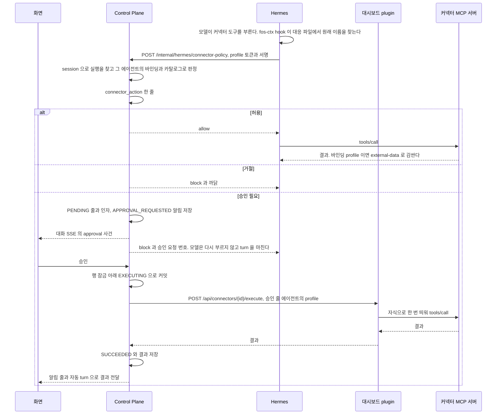

# 커넥터 도구 정책과 승인

커넥터 도구 호출을 위험도와 정책으로 판정하고, 승인이 필요한 호출을 사용자가 승인하는 기능이다.

covers: `backend/src/main/java/com/bifos/assistant/connector/`, `web/src/components/chat/approval-*`, `web/src/components/connector/connector-tools.tsx`, `web/src/lib/connector-action.ts`, `hermes/plugins/dashboard-profile-api/connector_policy.py`, `hermes/plugins/fos-ctx/connector_policy.py`

## 요구

- 연결을 붙인 에이전트의 커넥터 도구 호출은 그 profile 의 `fos-ctx` hook 이 Control Plane 에 묻고 판정을 받은 뒤에만 나간다([ADR-049](../../backend/docs/adr/ADR-049-커넥터-도구-호출은-profile-plugin-의-hook-이-control-plane-에-물어-판정한다.md)). 남아 있는 옛 커넥터 에이전트도 같다
- 위험도와 승인 방식은 plugin 이 도구마다 선언하고, 판정은 Control Plane 이 한다. 모델의 인자와 서버의 `readOnlyHint` 는 판정에 들어가지 않는다
- 승인이 필요한 호출은 막고 승인 줄로 저장한다. 사용자가 그 대화의 승인 카드에서 승인하면 Control Plane 이 저장한 인자로 한 번 실행하고 결과를 그 대화로 전한다([ADR-050](../../backend/docs/adr/ADR-050-커넥터-쓰기는-control-plane-이-승인-줄을-저장하고-승인한-인자로-한-번만-실행한다.md))
- 사용자는 승인 방식이 `required` 인 도구에 상시 허락을 줄 수 있다. 밖으로 나가는 도구는 상시 허락을 닫는다([ADR-065](../adr/ADR-065-외부로-나가는-도구는-상시-허락을-닫는-선언을-둔다.md))
- `DESTRUCTIVE` 와 `FINANCIAL` 은 선언할 수 있지만 호출은 늘 거절한다
- 커넥터에서 읽은 글이 어디로 갈 수 있는지는 아래 「커넥터 READ 데이터의 흐름」 이 정한다
- 위험도는 plugin 을 만든 사람의 판단이다. Control Plane 은 그 판단이 맞는지 확인하지 못하고, 운영자가 고른 plugin 만 목록에 오른다는 전제에 기댄다

### 화면

**승인 영역은 화면 높이의 40% 까지만 차지하고 안에서 스크롤한다.**
카드를 메시지 흐름 안에 넣지 않은 것은 승인 줄이 특정 답에 묶이지 않은 대화 전체의 기다리는 일이고, 메시지 번호가 없어 이력을 다시 읽을 때 자리를 정할 근거도 없기 때문이다.
메시지 목록을 위로 올려 읽는 동안에도 기다리는 승인이 입력창 위에 남아 있어야 놓치지 않는다. 대신 높이를 제한해 메시지 목록이 남은 자리에서 스크롤된다.
코드는 `components/chat/approval-list.tsx` 가 갖는다.

| 때 | 화면 |
| --- | --- |
| `approval` 사건을 받거나 대화를 연다 | 승인 줄을 다시 읽어 `PENDING` 인 줄마다 카드를 보인다. 상시 허락을 줄 수 있는 줄(`grantAllowed`)에는 「승인하고 묻지 않기」 가 더 있다 |
| 승인 줄이 하나도 없다 | 카드 자리를 그리지 않는다 |
| 같은 커넥터의 같은 도구로 기다리는 줄이 둘 이상이다 | 한 묶음으로 접어 보인다. 펼치면 건마다 단추가 있고, 한 건만 남으면 한 장의 카드가 된다 |
| 펼친 묶음의 모든 건을 한 번에 승인할 수 있다 | 「N건 모두 승인」. 조건은 [ADR-087](../../web/docs/adr/ADR-087-같은-도구의-승인-줄은-묶음으로-보이고-상시-허락을-줄-수-있는-줄만-한꺼번에-승인한다.md) 이 갖는다 |
| 실행 중이거나 실행했는지 모르는 줄, `toolName` 이 없는 줄 | 묶지 않는다. 이름이 없는 줄을 제목으로 묶으면 다른 도구가 섞일 수 있다 |
| 줄이 `EXECUTING` 이다 | 단추 없이 실행하는 중이라고 보인다 |
| `PENDING` 인 줄의 `hiddenArgs` 가 참이다 | 승인 단추 없이 가려진 내용 때문에 승인할 수 없다는 안내. 「거절」 은 남긴다 |
| 줄이 `UNKNOWN` 이다 | 단추 없이 실행했는지 모른다고 보인다. 「닫기」 는 그 화면에서만 숨기고 줄의 상태를 바꾸지 않는다 |
| 승인이나 거절의 응답이 끝난 줄이다 | 카드가 사라진다. 결과는 알림 줄과 이어지는 답으로 이미 대화에 있다 |
| 이미 처리된 줄을 누른다 | 이미 처리됐다고 보이고 승인 줄을 다시 읽는다 |

- 인자의 키는 원래 이름 그대로 보인다. 커넥터 선언에 인자의 표시 이름이나 중요도가 없기 때문이다. 값이 빈 인자는 「비어 있는 항목」 한 줄에 이름만 모은다
- 상시 허락을 줄 수 있는 줄은 짧은 인자 몇 개만 위에 보이고 나머지는 「자세히」 에 접는다. 그 규칙은 `web/src/lib/connector-action.ts` 의 `approvalArgs` 가 갖는다
- 상시 허락을 닫은 줄은 접지 않고 높이 제한 없이 모두 펼친다. 스크롤 영역 아래로 밀린 인자를 읽지 않고 승인하지 않게 한다
- 화면은 인자를 스스로 가리지 않는다. 가림은 Control Plane 이 응답에서 한 번만 한다. 두 곳의 규칙이 다르면 화면만 가린 값이 승인될 수 있다
- 화면은 `toolName`, `actionId`, `errorCode` 를 그리지 않는다. web 의 서버 라우트는 `resultText` 를 브라우저로 옮기지 않는다
- 연결 화면의 도구 목록은 도구마다 바로 실행하는지, 실행 전에 묻는지, 실행할 때마다 묻는지, 아직 쓸 수 없는지를 한 줄로 보인다

## 흐름

모델이 커넥터 도구를 부르고, 승인이 필요하면 사용자가 승인해 실행되기까지다.

## 커넥터 도구 정책

### 도구 정책

`schema: 2` 는 그 MCP 서버의 도구마다 위험도와 승인 방식을 `tools` 에 선언한다([ADR-049](../../backend/docs/adr/ADR-049-커넥터-도구-호출은-profile-plugin-의-hook-이-control-plane-에-물어-판정한다.md)).
도구를 고르는 방법과 예시는 [커넥터 만들기](../../hermes/connectors/README.md) 의 「도구 정책」 이, 칸의 모양 검사는 `hermes/plugins/dashboard-profile-api/connector_schema.py` 가 갖는다.

| 칸 | 뜻 |
| --- | --- |
| `tools.<이름>` | 키는 MCP 서버의 원래 도구 이름이다 |
| `tools.<이름>.risk` | 위험도. 필수 |
| `tools.<이름>.approval` | 승인 방식. 없으면 그 위험도의 기본값 |
| `tools.<이름>.title` | 승인 카드와 알림 줄에 보일 사람 말. 없으면 `이름 없는 동작` 으로 보인다 |
| `tools.<이름>.grant` | 거짓이면 상시 허락을 줄 수 없고 호출마다 승인을 받는다. 없으면 참이다. `approval` 이 `required` 인 도구에만 선언한다([ADR-065](../adr/ADR-065-외부로-나가는-도구는-상시-허락을-닫는-선언을-둔다.md)) |
| `tools.<이름>.outbound` | 참이면 데이터를 계정 밖의 사람에게 보낸다는 선언이다. 참인 도구는 `approval` 이 `required` 이고 `grant` 가 거짓이어야 한다 |
| `tools.<이름>.identifiers` | 승인 카드가 길이로 가리지 않을 맨 위 인자 이름. `approval` 이 `required` 인 도구에만 선언한다([ADR-089](../adr/ADR-089-커넥터는-식별자-인자를-선언하고-승인-카드는-그-값을-길이로-가리지-않는다.md)) |
| `default_tool_policy` | `tools` 에 없는 도구의 처리. `deny` 만 받는다 |

| 위험도 | 뜻 | 기본 `approval` | 하한 |
| --- | --- | --- | --- |
| `READ` | 외부 상태를 바꾸지 않는 조회 | `none` | 없다 |
| `SENSITIVE` | 상태는 바꾸지 않지만 결과가 민감하거나 데이터를 제3자에게 보이게 한다 | `required` | `required` |
| `WRITE` | 되돌릴 수 있는 쓰기 | `required` | `required` |
| `DESTRUCTIVE` | 되돌리기 어려운 쓰기 | `always` | `always` |
| `FINANCIAL` | 돈이 움직인다 | `always` | `always` |

| `approval` | 뜻 |
| --- | --- |
| `none` | 승인 없이 바로 실행한다. 판정 줄은 남긴다 |
| `required` | 호출마다 승인을 받는다. 사용자가 상시 허락을 주면 그 기간에는 바로 실행한다 |
| `always` | 호출마다 승인을 받는다. 상시 허락을 만들 수 없다. 설치가 서버 정의의 `tools.exclude` 에 넣어 모델에게 보이지 않는다 |

- 선언이 하한보다 느슨하거나 모양이 틀리면 그 커넥터를 카탈로그에 내지 않는다. Control Plane 도 카탈로그를 읽을 때 하한을 한 번 더 보고, 느슨한 커넥터는 없는 커넥터로 다룬다
- `verify.tool` 과 `options.tool` 은 `READ` 와 `none` 이어야 한다
- `"grant": false` 인 도구는 모델에게 보인다. 모델에게서 빼는 것은 `approval: always` 인 도구뿐이다
- 카탈로그 응답의 `grant` 와 `identifiers` 는 기본값을 채운 값이다. 이 칸을 내지 않는 옛 대시보드 plugin 이면 Control Plane 은 `grant` 를 `approval` 이 `required` 인 도구에서 참으로, `identifiers` 를 빈 목록으로 읽는다
- MCP 서버 이름을 등록 규칙으로 바꾸고 소문자로 맞춘 값이 Control Plane MCP 의 것과 같으면 카탈로그에 내지 않는다. 그 커넥터의 도구가 Control Plane 도구와 같은 이름으로 읽힐 수 있기 때문이다
- 등록 이름의 앞부분(`mcp__<서버>__`)이 너무 길면 카탈로그에 내지 않는다. 등록 이름을 줄일 때 Control Plane 의 접두사 검사가 그 서버의 긴 도구를 선언 없는 도구로 읽기 때문이다

**`schema: 1` 커넥터에서 확인 도구와 선택지 도구 밖의 도구는 모두 막히고 승인 줄이 된다.** 조회 도구도 마찬가지다.
`schema: 1` 은 `tools` 를 선언하지 않으므로 그 밖의 도구를 모두 `WRITE` 와 `required` 로 읽는다. 승인 없이 조회를 쓰려면 그 plugin 이 `schema: 2` 로 올려 조회 도구를 `READ` 로 선언해야 한다.

#### 이름 대응

Hermes 는 MCP 도구를 `mcp__<서버>__<도구>` 로 등록하면서 글자를 바꾸고 긴 이름을 줄인다([`hermes/docs/hermes-contract.md`](../../hermes/docs/hermes-contract.md) 의 「MCP 도구의 등록 이름」).
등록 이름에서 원래 이름을 되찾을 수 없으므로, 설치가 대응을 그 profile 의 `.fos-connector-tools.json` 에 적는다. 형식은 `hermes/plugins/dashboard-profile-api/connector_state.py` 가 갖는다.
hook 은 `prefix` 로 그 호출이 어느 커넥터 서버의 것인지만 알고, 원래 도구 이름은 `tools` 에서만 찾는다. 이 파일이 있는 profile 에서만 hook 이 커넥터 도구 호출을 묻는다.

`isolated` 칸이 그 profile 의 설치 방식을 적는다. 칸이 없으면 참으로 읽으므로 옛 파일은 바꾸지 않아도 된다. 칸이 있는데 boolean 이 아니면 hook 은 파일을 읽지 못한 것으로 본다.

| `isolated` | 쓰는 설치 | `servers` 에 싣는 것 |
| --- | --- | --- |
| 없음(`true` 와 같다) | 옛 설치. 커넥터마다 만든 전용 profile 이다 | 운영 목록에 있고 manifest 를 읽을 수 있는 커넥터의 서버 |
| `false` | 바인딩 설치. 일반 에이전트의 profile 에 커넥터를 붙인 것이다 | 소유 기록의 모든 서버와 뗀 서버 기록의 서버. manifest 를 읽지 못한 서버는 빈 `tools` 로 싣는다 |

hook 이 두 방식에서 대응에 없는 도구와 결과를 어떻게 다루는지는 [`hermes/plugins/fos-ctx/README.md`](../../hermes/plugins/fos-ctx/README.md) 의 「커넥터 도구 호출을 묻는다」 가 갖는다.

**바인딩 profile 에서 대응에 실리지 않은 커넥터 서버는 판정 없이 나간다.**
그래서 manifest 를 읽지 못했거나 소유 기록의 서버 이름이나 실행 정의가 지금 manifest 와 다른 서버도 소유 기록의 이름으로 빈 `tools` 와 함께 싣는다. Control Plane 은 그 서버의 도구를 선언 없는 도구로 막는다.

**떼기는 뗀 서버를 대응에서 빼지 않는다.**
떼기 전에 시작한 실행은 그 서버를 쥔 채 돌고, 대응에서 서버가 빠지면 그 실행의 호출이 판정 없이 나가기 때문이다.
떼기는 서버 이름을 뗀 서버 기록 `.fos-connector-detached.json` 에 남기고 대응에 그 서버를 빈 `tools` 로 싣는다. Control Plane 은 그 에이전트에 그 서버를 붙인 연결이 없어 막는다.

- 같은 커넥터를 같은 서버 이름으로 다시 붙이면 기록에서 지운다. 같은 서버 이름을 지금 붙은 커넥터가 쓰면 붙은 쪽의 도구를 싣는다
- 기록에는 만료가 없다. gateway 를 재시작한 뒤에는 떼기 전에 시작한 실행이 남지 않으므로 운영자가 지워도 된다
- 운영자가 뗀 서버와 같은 이름의 MCP 서버를 직접 등록하려면 먼저 기록에서 그 항목을 지운다. 남겨 두면 그 서버의 도구가 모두 판정에서 막힌다
- 뗀 서버 기록만 남은 profile 도 바인딩 profile 이라 옛 설치를 받지 않는다
- 실행 공간을 적용하지 않은 profile 에서는 터미널이나 파일 도구가 이 파일을 고칠 수 있다. 실행 공간을 적용한 profile 의 컨테이너에는 이 파일이 없다([ADR-086](../adr/ADR-086-셸과-파일-도구는-사용자별-docker-실행-공간에서만-돈다.md)). 이 위험은 ADR-083 의 「감당할 것」 에 있다

#### 도구 호출 판정

`POST /internal/hermes/connector-policy` 는 hook 과 Control Plane 사이의 약속이다.
인증은 그 profile 의 MCP 토큰이다. 요청 칸은 `ConnectorPolicyRequest` 가, 응답 칸은 `ConnectionDtos.ConnectorPolicyResponse` 가 갖는다.
`args_json` 은 hook 이 도구 인자를 키를 정렬하고 공백 없이 직렬화한 JSON 글이다.

서명은 `_fos_ctx` 와 같은 key 의 HMAC-SHA256 이다.
서명할 글은 `v1-connector-policy`, `hermes_tool`, `root_session_id`, `session_id`, `tool_call_id`, `args_json` 의 UTF-8 바이트를 SHA-256 한 소문자 16진수를 이 순서로 줄바꿈 하나로 이은 것이다.
인자를 글로 보내고 그 글을 서명하므로 Python 과 Java 의 JSON 직렬화가 달라도 검증이 맞는다.

| 갈리는 지점 | 처리 |
| --- | --- |
| 토큰이나 서명이 틀리다. `args_json` 이나 식별자 칸이 길이 상한을 넘거나 `args_json` 이 object 가 아니다. `tool` 이 도구 이름 형식이 아니다 | 403. 줄을 남기지 않고 hook 은 막는다. 상한은 `ConnectorPolicyController` 가 갖는다 |
| session 으로 origin 실행을 찾지 못한다. 중지한 실행과 등록 안 된 자식 session 이 그렇다 | 막고 줄을 남기지 않는다 |
| 실행의 에이전트에 붙은 바인딩 가운데 `hermes_tool` 이 그 서버의 접두사로 시작하는 것이 없거나 둘 이상이다 | 막고 줄을 남기지 않는다. 대시보드가 한 profile 에서 서버 이름이 겹치지 않게 막으므로 맞는 것은 하나다 |
| 연결의 주인이 실행의 사용자와 다르거나, 바인딩의 profile 이 토큰의 profile 과 다르다 | 막고 줄을 남기지 않는다 |
| manifest 를 읽지 못해 바인딩에 적어 둔 서버 이름으로 골랐다 | `POLICY_UNAVAILABLE` 로 거절한다 |
| 그 밖 | 연결과 바인딩이 모두 `READY` 일 때만 `READY` 로 넘겨 판정하고 `connector_action` 에 한 줄을 남긴다. 줄의 에이전트는 판정한 실행의 에이전트다 |

판정은 Hermes 와 DB 를 모르는 `ToolPolicyDecision.decide` 가 조건을 위에서부터 보고 처음 맞는 것으로 정한다. 조건과 순서, 거절 까닭은 그 함수와 `ActionDenyReason` 이 갖는다.
카탈로그와 그 읽기 실패는 잠시 메모리에 두며 시간은 `ConnectorPolicyProperties` 가 갖는다.
`allow` 로 답하는 것은 허용일 때뿐이고, 거절과 승인 필요는 `block` 이다.

- Control Plane 은 hook 이 보낸 `tool` 을 그대로 믿지 않는다. 카탈로그의 서버 이름과 `tool` 로 등록 이름을 다시 계산해 `hermes_tool` 과 다르면 `tool` 이 없는 호출로 읽는다
- `schema: 1` 에서 `tool` 이 없는 호출은 승인 필요로 막는다. 다른 서버의 등록 이름은 `schema: 1` 에서도 `UNDECLARED` 로 거절한다
- 상시 허락은 그 사용자가 그 커넥터의 그 도구에 준 것 가운데 거두지 않았고 기간이 남은 것이다. 선언이 `"grant": false` 인 도구는 남은 허락이 있어도 보지 않는다. 원래 도구 이름을 확인하지 못한 호출은 허락이 없는 것으로 판정한다
- 먼저 살펴보기 트리(`ProactiveCheckGuard.isCheckTree`)에서는 `READ` 이고 `none` 인 도구만 허용한다. 상시 허락이 있어도 나머지를 거절하고 승인 줄을 만들지 않는다. 사람이 보지 않는 실행에서 승인 요청이 쌓이지 않게 하기 위해서다([ADR-080](../adr/ADR-080-먼저-살펴보기는-점검-대화의-turn-하나로-돌고-읽기-경계를-control-plane-이-강제한다.md))
- 같은 호출이 다시 오면 처음 판정을 그대로 돌려준다. 같은 호출인지는 profile, 루트 session, session, `tool_call_id` 로 만든 `dedupe_key` 로 안다
- `dedupe_key` 가 같아도 `hermes_tool` 이나 인자의 해시가 처음 줄과 다르면 막고 새 줄을 남기지 않는다. 앞의 허용이 다른 도구나 다른 인자에 나가지 않게 한다
- 허용한 호출이 다시 왔을 때 그 연결과 바인딩이 이제 `READY` 가 아니면 막는다. 해제하거나 뗀 연결에 앞의 허용이 나가지 않게 한다

`NOT_READY` 로 막을 때 모델에게 주는 글은 바인딩마다 다르다.

| 바인딩 | 모델에게 주는 글 |
| --- | --- |
| 연결은 `READY` 이고 반영 예정이 남았다 | 대개 몇 분 안에 저절로 반영되니 잠시 뒤 다시 시도하라. 붙인 직후에는 공유 gateway 의 MCP 설정 맞추기와 Control Plane 의 반영 예정 확인을 기다려야 한다([ADR-20261007 / connector-live-reload](../adr/ADR-20261007-connector-live-reload.md)) |
| 재시작 대기다 | 저절로 풀리지 않으므로 관리자의 반영을 기다리라 |
| 둘 다 아니다 | 연결 화면에서 연결을 확인하라. 반영 예정 확인이 한 번 실패했거나 정책 hook 이 꺼진 경우라 저절로 풀리지 않는다 |

| 판정 밖에서 갈리는 지점 | 처리 |
| --- | --- |
| Control Plane 이 hook 의 기다리는 시간 안에 답하지 않는다 | hook 이 막는다. 요청이 뒤늦게 닿아도 `dedupe_key` 로 줄이 하나다 |
| 같은 `dedupe_key` 로 둘이 동시에 온다 | 유니크 제약에 걸린 쪽이 먼저 저장된 줄을 다시 읽어 돌려준다 |
| profile 의 `fos-ctx` 가 꺼졌거나 옛 버전이다 | 호출은 판정 없이 나간다. 연결 확인이 `policy_hook` 을 보고 그 바인딩을 `PENDING` 으로 둔다 |

#### hook 이 켜져 있는지

`GET /api/connectors` 는 `policy_hook` 을 함께 낸다. 그 조건은 `hermes/plugins/dashboard-profile-api/connector_status.py` 가 갖고, 대응 파일은 서버 목록과 `connector`, `prefix` 까지만 견주고 서버마다의 `tools` 는 보지 않는다.

- 설치는 그 profile 의 `fos-ctx` 를 묶음의 버전으로 바꾸고, 파일이 바뀌었으면 `plugin_updated: true` 로 답한다. 떠 있는 gateway 가 옛 코드를 쥐고 있을 수 있어 Control Plane 은 그 바인딩을 재시작 대기로 둔다
- 서버 정의의 `tools.exclude` 나 대응의 서버별 `tools` 가 어긋나면 그 커넥터 항목만 `configured` 가 거짓이고 `policy_hook` 은 그대로다([ADR-20261009 / connector-install-drift](../adr/ADR-20261009-connector-install-drift.md)). 그래서 커넥터 하나의 manifest 가 바뀌어도 같은 profile 의 다른 커넥터는 판정을 통과한다
- 어긋난 서버의 `approval: always` 도구는 공유 gateway 를 재시작하기 전까지 모델에 등록된 채일 수 있다. 그 호출도 hook 이 묻고, 그 바인딩은 `READY` 가 아니어서 Control Plane 이 막는다
- 대응에서 서버가 빠지면 판정 없이 나가므로 서버 목록과 접두사가 다르면 계속 `policy_hook` 이 거짓이다. 거짓이면 대시보드가 조건 이름만 경고 로그에 남긴다
- 연결 확인과 관리자 반영 완료는 설치를 다시 보낸 뒤에 `policy_hook` 을 읽는다. 옛 버전의 `fos-ctx` 를 가진 바인딩은 연결 확인 한 번으로 새 버전이 되고 재시작 대기가 된다
- Control Plane 은 `policy_hook` 이 참이 아니면 그 바인딩을 `READY` 로 두지 않는다. 옛 대시보드 plugin 은 이 칸을 내지 않고, 없는 칸은 거짓으로 읽는다
- 이 확인은 확인한 시점의 파일만 본다. 그 뒤 누가 설정을 바꾸면 다음 연결 확인 때 안다

#### 선언하지 않은 도구

연결 확인과 관리자 반영 완료는 MCP probe 가 낸 도구 가운데 `schema: 2` manifest 의 `tools` 에 없는 것을 세어 연결에 적고 연결 상태와 관리자 목록에 낸다.
선언하지 않은 도구가 있어도 바인딩은 `READY` 가 된다. 그 도구의 호출만 거절된다. `schema: 1` 은 세지 않는다.

### 사용자별 호출 제한

선택지 조회, 등록, 연결 확인은 MCP 서버를 자식 프로세스로 띄운다.
연결이 없는 사용자도 임의 값으로 부를 수 있어 사용자마다 동시 호출과 1분 동안의 호출 수를 제한한다. 값은 `application.yml` 의 `assistant.connector` 가, 코드는 `ConnectorCallLimiter` 가 갖는다.

- 넘으면 기다리지 않고 `CONNECTOR_RATE_LIMITED` 로 거절한다. 거절한 요청은 외부를 부르지 않고 횟수에 넣지 않는다
- 해제, 읽기, 카탈로그, 관리자 경로는 제한하지 않는다. 해제는 언제나 되어야 한다
- 상태는 JVM 메모리에 둔다. **Control Plane 이 한 대라는 전제다.** 여러 대로 늘리면 사용자마다 대수만큼 더 받는다. 재시작하면 횟수가 비워진다
- 일반 에이전트 실행의 한도와 별개다. 대시보드 plugin 의 전역 동시 한도도 그대로다

### 승인이 필요한 호출

판정이 「승인 필요」 인 호출이 실행되기까지 갈리는 지점이다. 근거는 [ADR-050](../../backend/docs/adr/ADR-050-커넥터-쓰기는-control-plane-이-승인-줄을-저장하고-승인한-인자로-한-번만-실행한다.md) 이다.
새 승인 줄이 생기면 `APPROVAL_REQUESTED` 알림이 함께 생겨, 사용자가 다른 화면에 있어도 그 대화로 올 수 있다([`docs/features/attention.md`](attention.md)).

| 상황 | 처리 |
| --- | --- |
| 같은 승인을 두 번 누른다 | 둘째는 `CONNECTOR_ACTION_NOT_PENDING` 이다. 실행은 한 번이다 |
| 실행 요청이 시간 안에 답하지 않거나 연결이 끊긴다 | `UNKNOWN`. 다시 실행하지 않는다 |
| 실행을 보낸 뒤 서버가 다시 뜬다 | 기동 정리(`ConnectorActionSweeper`)가 `EXECUTING` 을 `UNKNOWN` 으로 바꾸고 대화에 전한다 |
| 실행의 시간 제한보다 오래 `EXECUTING` 으로 남았다 | 주기 정리(`ConnectorActionExpirer`)가 결과를 적지 못한 것으로 보고 `UNKNOWN` 으로 바꾼다 |
| 사용자가 거절한다 | `REJECTED`. 알림 줄만 남긴다 |
| 승인 기한(`approval-ttl`) 안에 답이 없다 | `EXPIRED`. 알림 줄을 남기고 `APPROVAL_EXPIRED` 알림을 만든다 |
| 승인할 때 기한이 이미 지났다 | 실행하지 않고 `EXPIRED` 로 끝낸 줄을 200 으로 돌려준다 |
| 승인할 때 연결이나 그 줄의 에이전트에 붙은 바인딩이 `READY` 가 아니거나, 그 에이전트에서 연결을 뗐거나, 다시 읽은 정책에서 도구가 빠졌거나 열지 않은 위험도가 됐거나 카탈로그를 읽지 못했다 | 실행하지 않고 `REJECTED`(`not_executable`)로 끝낸 줄을 200 으로 돌려준다 |
| 승인한 호출이 실행되는 동안 그 연결을 해제하거나 값을 다시 등록하거나 그 에이전트에서 뗀다 | `CONNECTOR_ACTION_EXECUTING` 으로 거절한다. 실행은 트랜잭션 밖에서 그때의 계정 값으로 돌기 때문에, 그 사이 값을 바꾸면 앞선 계정에 한 승인이 새 계정으로 실행된다 |
| 승인을 기다리는 동안 연결을 해제하거나 값을 다시 등록한다 | 그 연결의 `PENDING` 을 모두 `REJECTED`(`connection_changed`)로 바꾸고 상시 허락을 거둔다. 다른 계정으로 바꾼 뒤 앞선 계정에 한 승인이 실행되지 않게 한다 |
| 승인을 기다리는 동안 그 에이전트에서 연결을 뗀다 | 그 에이전트가 판정한 `PENDING` 만 `REJECTED`(`connection_changed`)로 끝낸다. 같은 연결을 붙인 다른 에이전트의 줄과 상시 허락은 그대로다 |
| 그 대화의 turn 이 도는 중에 결과가 온다 | 결과를 쌓아 두고 turn 이 끝난 뒤 전한다. 위임 결과와 같다 |
| 사용자가 turn 을 중지한다 | `PENDING` 은 남는다. 카드에서 따로 거절한다 |
| 위임 자식이 승인 요청을 만들었다 | 자식 실행의 대화는 부모 대화라 승인 카드가 부모 대화에 뜬다 |
| 같은 실행이 같은 도구를 같은 인자로 다시 부른다 | 새 줄을 만들지 않고 앞선 `PENDING` 의 번호를 돌려준다 |
| 대화가 없는 실행이 만든 요청 | 승인 카드가 뜰 곳이 없어 만료된다. 모델에게도 실행되지 않는다고 말한다 |
| 끝난 요청의 알림 줄을 저장하는 순간 사용자가 그 대화에 보낸다 | 알림 줄을 저장하는 트랜잭션 동안 turn 잠금을 잡는다. 그 사이의 보내기는 `CONVERSATION_BUSY` 를 받고, 글만 보낸 것이면 화면이 대기 메시지로 다시 넣는다. 실행은 열리지 않으므로 도는 turn 표시에 실행 번호가 없다 |

## 커넥터 승인

결정은 [ADR-050](../../backend/docs/adr/ADR-050-커넥터-쓰기는-control-plane-이-승인-줄을-저장하고-승인한-인자로-한-번만-실행한다.md) 에 있다.
승인과 거절은 그 요청이 나온 대화의 승인 카드에서 한다. 실행 결과는 그 대화의 알림 줄과 자동 turn 으로 온다.
코드는 `ConnectorActionService`, `ConnectorActionApproval`, `ConnectorActionLifecycle` 이 갖는다.

### 승인의 불변식

- **승인은 처음 요청한 정확한 도구와 인자에만 적용된다.** 줄은 `dedupe_key` 로 호출 하나를 가리키고, `hermes_tool` 과 `args_sha256` 으로 무엇을 어떤 인자로 불렀는지 못 박는다
- **모델이 다시 만든 비슷한 호출은 그 승인으로 실행되지 않는다.** `tool_call_id` 가 다르면 `dedupe_key` 가 달라 새 판정을 받는다. `dedupe_key` 가 같아도 `hermes_tool` 이나 `args_sha256` 이 다르면 앞 줄의 판정과 승인 요청 번호를 돌려주지 않고 막는다
- **승인한 호출은 저장한 인자로 한 번만 실행한다.** 실행하는 쪽은 Control Plane 이고 `args_json` 에 저장한 글 그대로 보낸다. hook 은 승인된 줄이 있어도 모델의 호출을 통과시키지 않는다
- 승인 줄의 상태는 한 방향으로만 바뀐다. `PENDING` 을 떠난 줄은 다시 승인하거나 실행하지 못한다
- 승인 줄을 만든 호출이 같은 `dedupe_key` 로 다시 오면 줄의 상태와 연결 상태와 상관없이 같은 승인 요청 번호와 같은 글로 막는다

### 승인 줄과 경로

판정이 「승인 필요」 이면 Control Plane 은 인자를 `connector_action` 에 `PENDING` 으로 저장하고 `block` 을 돌려준다.
모델에게 주는 글은 승인 요청 번호를 담고, 대화의 승인 카드에서 승인을 받으라는 것과 같은 도구를 다시 부르지 말라는 것과 승인하면 결과가 그 대화로 온다는 것을 말한다.

| 상태 | 뜻 | 다음 |
| --- | --- | --- |
| `PENDING` | 사용자의 답을 기다린다 | `EXECUTING`, `REJECTED`, `EXPIRED` |
| `EXECUTING` | 승인했고 실행을 보냈다 | `SUCCEEDED`, `FAILED`, `UNKNOWN` |
| `SUCCEEDED`, `FAILED` | 실행 결과를 받았다 | |
| `UNKNOWN` | 실행을 보냈으나 결과를 모른다. 다시 실행하지 않는다 | |
| `REJECTED` | 사용자가 거절했거나 시스템이 실행하지 않고 끝냈다. 뒤의 것은 `errorCode` 가 `not_executable`, `connection_changed`, `hidden_args` 가운데 하나다 | |
| `EXPIRED` | 승인 기한 안에 답이 없었다 | |

경로와 응답 칸은 `ConnectorActionController` 와 `ConnectorActionDtos` 가 갖는다. 아래는 화면과 모델이 기대는 약속이다.

- 응답의 `argsJson` 은 비밀처럼 보이는 키의 값과 토큰 모양의 글을 `[가림]` 으로 바꿔 낸다([ADR-047](../../backend/docs/adr/ADR-047-도구-내용은-비밀값과-UUID를-가린-뒤-중계하고-저장한다.md) 의 비밀값 부분). 길이로 자르지 않고, 실행은 저장한 원문으로 한다
- UUID 는 가리지 않는다. 무엇을 고치는지 가리키는 값이라 가리면 서로 다른 대상의 요청이 같게 보이고, 이 응답은 주인만 읽는다
- 커넥터가 `identifiers` 로 선언한 맨 위 인자는 긴 덩어리를 가리는 규칙에서 빠진다. 알려진 비밀 접두사로 시작하는 값과 비밀 키 이름의 칸은 그래도 가린다([ADR-089](../adr/ADR-089-커넥터는-식별자-인자를-선언하고-승인-카드는-그-값을-길이로-가리지-않는다.md))
- **상시 허락을 닫은 도구의 승인 줄은 인자가 하나도 가려지지 않아야 승인된다**([ADR-065](../adr/ADR-065-외부로-나가는-도구는-상시-허락을-닫는-선언을-둔다.md)). 그 도구는 밖으로 나가는 호출이라 사람이 원문을 다 읽어야 한다. 가린 글이 원문과 다르면 `hiddenArgs` 가 참이고, 그 줄에 승인 요청이 오면 실행하지 않고 `REJECTED`(`hidden_args`)로 끝낸 줄을 200 으로 돌려준다
- `grantAllowed`, `hiddenArgs`, `identifiers` 의 선언은 줄을 읽을 때와 승인할 때의 카탈로그로 본다. 카탈로그를 읽지 못했으면 거짓이거나 선언이 없는 것으로 보고, 그 줄의 승인은 정책을 판정하지 못해 `not_executable` 로 끝난다
- `grant` 는 `required` 이고 선언이 상시 허락을 닫지 않은 도구에만 받는다. 그 밖의 도구나 원래 도구 이름을 모르는 줄이면 `VALIDATION_FAILED` 다. `TODAY` 는 서버의 시간대와 상관없이 `Asia/Seoul` 의 그날 끝까지다. 사용량 화면의 달 경계와 같은 고정 시간대다
- `title` 은 선언에 이름이 없거나 카탈로그를 읽지 못했으면 `이름 없는 동작` 이다. 도구의 원래 이름은 내부 값이라 `title` 과 알림 줄과 모델 입력에 싣지 않는다
- 상시 허락 목록은 지금 선언이 상시 허락을 닫은 도구의 줄을 내지 않는다. 판정이 그 줄을 보지 않아 효력이 없기 때문이다. 그런 줄은 주기 정리가 거두고, 거둔 줄은 선언이 다시 열려도 되살아나지 않는다. 카탈로그를 읽지 못한 커넥터의 줄은 두고 본다
- 다른 사용자의 줄은 `CONNECTOR_ACTION_NOT_FOUND` 다. 관리자도 같다
- 부른 쪽은 이미 처리된 요청(409 `CONNECTOR_ACTION_NOT_PENDING`)과 승인했지만 실행하지 않은 요청(200 과 끝난 줄의 `status`)을 구분한다
- 승인은 사용자 행을 먼저, 승인 줄을 다음에 잠그고 `EXECUTING` 으로 커밋한 뒤 트랜잭션 밖에서 실행 경로를 부른다. 연결을 다시 등록하거나 해제하는 쪽, 붙이고 떼는 쪽과 같은 순서라 승인이 본 바인딩은 커밋할 때까지 떼어지지 않는다
- 사건은 줄을 커밋한 뒤에 낸다. `approval` 사건은 승인 요청 번호만 싣고, 화면은 그 사건을 받으면 승인 줄을 다시 읽는다. 깨우기(`assistant.delegation-wake.enabled`)가 꺼져 있어도 이 사건과 거절, 만료의 알림 줄은 나간다

결과는 이렇게 전한다.

- `SUCCEEDED`, `FAILED`, `UNKNOWN` 이면 그 대화에 알림 줄을 남기고 자동 turn 을 열어 결과를 전한다. 위임 결과와 같은 잠금과 같은 연속 상한을 쓰고, 위임 결과가 함께 있으면 한 turn 에 모은다([ADR-040](../../backend/docs/adr/ADR-040-위임-결과는-control-plane-이-부모-대화의-다음-turn-을-열어-전한다.md)). 보낼 대기 메시지가 있으면 그것이 먼저 간다([대기열과 중지](chat.md) 의 「응답 중 대기열」)
- 알림 줄은 이름과 상태만 쓴다. 결과 본문은 모델 입력에만 넣고 `<external-data>` 로 감싼다. 입력의 형식은 [`docs/features/memory.md`](memory.md) 의 「Hermes 에 넘기는 형식」 이 갖는다. 요청 번호와 도구의 원래 이름은 모델이 답에 옮겨 화면에 나오지 않게 싣지 않는다
- `FAILED` 는 본문을 싣지 않고, 저장한 오류 계약이 있으면 오류 코드와 세부, 복구 안내를 더한다([커넥터 만들기](../../hermes/connectors/README.md) 의 「오류 복구 계약」). `UNKNOWN` 은 본문 대신 다시 실행하지 말고 사용자에게 확인을 부탁하라는 글을 넣는다
- 알림 줄 저장, 전했다는 표시, 자동 turn 수 증가는 한 트랜잭션이다. 연속 상한에 닿아 turn 을 열지 못한 결과는 남고, 사용자가 메시지를 보낸 뒤의 turn 이 닫힐 때 전해진다
- 거절과 만료는 알림 줄만 남기고 자동 turn 을 열지 않는다. 시스템이 실행하지 않고 끝낸 줄은 거절이 아니라 취소했다고 알린다
- 그 대화의 turn 이 도는 동안에는 알림 줄을 남기지 않고 turn 이 닫힐 때 남긴다. 잠금을 잡은 채 저장하고 못 잡으면 미룬다. 답보다 먼저 알림 줄이 끼면 그 답이 알림 줄에 이어진 자동 turn 의 답으로 읽히기 때문이다. 표시를 먼저 적으므로 같은 줄의 사건이 겹쳐도 알림 줄은 하나다

**`POST /api/connectors/{id}/execute`** 는 대시보드 plugin 의 실행 경로다. 자식의 env 와 응답 모양은 [`hermes/plugins/dashboard-profile-api/README.md`](../../hermes/plugins/dashboard-profile-api/README.md) 의 「커넥터」 가 갖는다.

- Control Plane 은 승인 줄의 에이전트에 붙은 바인딩의 profile 로 보낸다([ADR-083](../adr/ADR-083-커넥터는-사용자가-한-번-연결하고-자기-에이전트에-여럿-붙여-그-에이전트가-도구를-직접-부른다.md)). 대시보드는 승인 여부를 다시 확인하지 않는다
- 커넥터 MCP 서버를 자식으로 한 번 띄워 등록 이름이 `hermes_tool` 과 같은 도구가 정확히 하나일 때 부른다. 시간 제한은 `CONNECTOR_EXECUTE_TIMEOUT_SECONDS` 이고 동시 실행은 `call` 과 같은 한도를 함께 쓴다
- 도구가 `errors` 표에 있는 코드로 실패하면 그 코드와 복구 계약을 싣고, Control Plane 은 같은 규칙으로 다시 검증해 `FAILED` 줄에 저장한다. `outcome_unknown` 인 코드는 504 로 답해 `UNKNOWN` 이 된다
- 도구가 오류 없이 끝났는데 구조화 결과도 JSON 텍스트도 없으면 첫 텍스트 칸의 글로 성공을 답한다. 실행된 쓰기를 실패로 기록하지 않기 위해서다
- 커넥터의 도구 하나는 프로세스 안의 상태에 기대지 않아야 한다. 이 경로는 Hermes 가 쥔 MCP 연결이 아니라 새 프로세스에서 돈다

## 금융 실행 내용의 저장과 검증

금융 실행 원문과 승인 표시 값을 함께 검증하고 저장하는 모델이다.
현재 `FINANCIAL`과 `DESTRUCTIVE` 호출은 계속 `RISK_NOT_OPEN`으로 거절하며 상시 허락을 만들지 않는다.
범용 준비 API와 실행 전용 전달 소비자는 구현했으며 금융 승인 경로와 실제 주문 실행은 아직 구현하지 않았다.
일회성 ticket의 발급 함수와 claim 인증은 아래 계약으로 구현하며 운영 승인 경로에는 연결하지 않는다.
저장 컬럼과 수명은 [저장 모델](../../backend/docs/data-schema.md)의 「connector_action_execution」이,
결정의 근거는 [ADR-20261010 / financial-execution-guard](../adr/ADR-20261010-financial-execution-guard.md)가 갖는다.

### 원문과 scope

`ConnectorExecutionSnapshot`은 저장 전과 읽은 뒤 같은 strict 소비 함수를 사용한다.
누락·추가·중복 키, 타입 오류, 잘못된 JSON과 뒤에 붙은 JSON을 거절한다.
기본값을 보충하거나 숫자를 문자열로 바꾸지 않으며 원문을 재직렬화하지 않는다.

| 입력 | 상한 |
| --- | --- |
| 원래 args와 실행 args | 각각 UTF-8 16 KiB |
| summary | UTF-8 8 KiB |
| scope JSON | UTF-8 2 KiB |
| JSON 중첩 깊이 | 5 |

scope_fields는 1개 이상 8개 이하의 `{arg,field}` 배열이다.
각 항목에는 이 두 키만 있고 값은 `[A-Za-z][A-Za-z0-9_]{0,63}` 문자열이다.
arg와 field는 각각 중복될 수 없으며 field는 연결의 공개 칸이어야 한다.
arg는 주문과 내부 메타데이터의 예약 이름을 쓸 수 없다.
예약 이름은 `orderId,symbol,market,currency,side,quantity,orderAmount,price,orderType,timeInForce,status,filledQuantity,execution`과
`clientOrderId,expected_order,confirmHighValueOrder,userId,connectionId,tool`이다.
저장 전과 읽기 검증에서 같은 경계를 적용하며 공개 연결 칸의 field 이름에는 이 제한을 적용하지 않는다.
scope에는 선언한 arg만 있고 값은 비어 있지 않은 UTF-8 128바이트 이하 문자열이다.
각 값은 연결의 공개 칸 및 실행 args의 같은 arg 값과 문자열 그대로 같아야 한다.
실제 자식 env 대조와 서비스별 시장·통화 조합은 커넥터 구현이 맡는다.

### 표시 값과 실행 인자

summary에는 아래 키가 모두 있어야 하며 추가 키는 거절한다.
null은 표가 허용하는 곳에만 쓴다.
decimal 문법은 `[0-9]+(\.[0-9]+)?`이고 1자 이상 30자 이하 문자열이다.
수량·금액·가격은 양수만 허용하고 filledQuantity만 0 이상을 허용한다.
부호, 공백, 지수, 쉼표와 숫자 타입을 거절한다.

| 키 | 타입과 대조 |
| --- | --- |
| `account` | 계좌 조회의 끝 네 자리 표시 값, 숫자 문자열 4자 |
| `symbol` | `[A-Za-z0-9.-]{1,32}` 문자열, 실행 args 또는 expected_order와 일치 |
| `market`, `currency` | 각각 1자 이상 16자 이하 시장 문자열과 ISO 통화 문자열 3자, 실행 args와 일치 |
| `side` | BUY 또는 SELL |
| `quantity`, `orderAmount`, `price` | 양의 decimal 문자열 또는 미사용을 뜻하는 null |
| `orderType`, `timeInForce` | 각각 LIMIT/MARKET, DAY/CLS/OPG |
| `operation` | CREATE/MODIFY/CANCEL, 호출자가 검증한 대상 동작과 일치 |
| `orderId` | CREATE는 null, MODIFY/CANCEL은 제어 문자 없는 1자 이상 256자 이하 문자열 |
| `original` | CREATE는 null, MODIFY/CANCEL은 원래 주문 object |
| `normalization` | 0개 이상 8개 이하의 `{field,before,after}` 배열 |

original은 `orderId,symbol,market,currency,side,quantity,orderAmount,price,orderType,timeInForce,status,filledQuantity`만 갖는다.
공통 칸은 위 타입을 따르되 orderId와 quantity는 null을 허용하지 않는다.
status는 비어 있지 않은 32자 이하 문자열이며 filledQuantity는 0 이상의 decimal 문자열이다.
price는 LIMIT에만 값이 있고, orderAmount는 금액 주문에만 값이 있다.
expected_order는 original에서 market과 filledQuantity를 뺀 칸 및 `{filledQuantity}`만 있는 execution을 갖는다.
original은 이 execution을 펼치고 조회한 market을 더한 값이며 실행 args와 대조한다.
취소는 원래 주문의 표시 값을 유지하고 정정은 변경 후 값과 original을 함께 보존한다.

normalization.field는 symbol, quantity, orderAmount, price, timeInForce 중 하나이며 중복될 수 없다.
각 항목에는 field, before, after만 있고 전후 값은 1자 이상 32자 이하 문자열 또는 누락을 뜻하는 null이다.
기본값, 표기 변경과 가격 절삭의 모든 차이는 원래 args와 실행 args를 대조해 기록한다.
변경이 없으면 빈 배열이며 기록한 전후 값이 실제 인자와 다르면 거절한다.
정규화 계산과 조회 값의 출처 확인은 커넥터가 맡는다.

| 동작 | 실행 args의 정확한 키 |
| --- | --- |
| CREATE | symbol, side, orderType, timeInForce, quantity/orderAmount 중 정확히 하나, LIMIT의 price, UUID clientOrderId, scope arg, market, currency |
| MODIFY | orderId, orderType, 해당 quantity/price, scope arg, market, currency, expected_order |
| CANCEL | orderId, scope arg, market, currency, expected_order |

미사용 수량·금액·가격은 실행 args에서 키 자체가 없고 summary에서는 null이다.
정정에서 quantity가 없으면 원래 주문 수량을 표시한다.
저장 검증 함수는 기본값을 자동 보충하지 않는다.
준비 과정에서 보충한 값은 normalization에 기록해야 하며 미선언 키는 거절한다.
원래 입력의 confirmHighValueOrder는 CREATE/MODIFY에서 boolean false만 선택적으로 허용하며 실행 args에 남기지 않는다.

### 원문 해시와 중복 의도 키

원문 해시는 암호화 전 UTF-8 바이트의 소문자 SHA-256이며 복호화한 원문과 다시 대조한다.
request_key는 사용자, 연결, 도구와 실행 args의 정규화한 문자열 필드로 만든다.
scope arg, market, currency와 원래 orderId는 포함하고 clientOrderId와 expected_order는 제외한다.
decimal은 앞의 0과 불필요한 소수점 끝 0을 제거한 정확한 문자열로 맞춘다.
필드 이름을 ASCII 순으로 정렬하고 각 이름·값을 `UTF-8 바이트수:값`으로 붙인다.
도메인 `fos-financial-intent-v1`도 같은 길이 접두사로 앞에 붙인 뒤 전체 바이트를 SHA-256으로 해시한다.
request_key는 원래 인자 해시나 실행 원문 해시를 대신하지 않는다.
현재 저장 모델은 이 키의 조회 인덱스만 제공하며 중복 의도의 승인·실행 차단은 후속 경로가 맡는다.

공통 자료는 `test/fixtures/financial-approval-v1.json`이다.
정상·거절 사례와 원문·기대 해시·summary·scope를 Java, Python과 Bun에서 같은 값으로 읽을 수 있다.
현재 Java의 실제 소비 함수와 독립 Python 해시 계산을 대조하며 다른 언어의 실행 경로는 후속 구현에서 검증한다.

### 일회성 실행 권한

발급은 `EXECUTING`인 미만료 승인 줄을 받는 application 함수다.
카탈로그를 요청마다 한 번 읽고 현재 소유자, 활성 사용자, 현재 바인딩의 profile,
연결과 바인딩의 `READY`, `desiredEnabled`, 두 revision과 공개 scope를 검증한다.
원래 실행이 읽기 전용 살펴보기이면 거절한다.
snapshot의 세 원문을 실제 복호화하고 저장 원문 해시와 표시 값을 다시 대조한다.
발급 함수를 운영 승인이나 controller에서 호출하지 않으며 금융 위험도 판정을 바꾸지 않는다.

카탈로그의 nullable `execution_guard`는 누락되면 미지원이다.
정확한 키는 `protocol,prepare_tool,scope_fields,operations`이며 protocol은 `approval-claim-v1`이다.
prepare_tool은 실제 선언된 `READ/NONE`, operations의 1~8개 도구는 `FINANCIAL/ALWAYS`이어야 한다.
operations 값은 `CREATE/MODIFY/CANCEL`이며 저장 summary의 operation과 같다.
scope_fields는 위의 예약 이름과 공개 칸 검증을 그대로 사용한다.
카탈로그 원문에서 중복 키와 뒤따르는 JSON을 먼저 거절하고, 보호 선언의 타입이나 키를 보충하지 않는다.
이 읽기 계약은 plugin producer나 설치 지원 확인, 금융 노출의 근거가 아니다.

ticket은 padding 없는 canonical base64url payload와 32바이트 HMAC-SHA256 서명을 점으로 이은 문자열이다.
서명 key는 설정의 dashboardToken UTF-8 바이트를 key로,
`fos-approval-signing-key-v1` ASCII를 data로 한 HMAC-SHA256 결과다.
서명 입력은 `fos-approval-claim-v1` ASCII 다음에 payload의 base64url ASCII를 구분자 없이 붙인 바이트다.
서명은 상수 시간으로 비교한다. 비어 있는 서비스 토큰으로 발급하거나 인증하지 않는다.

| payload 칸 | 타입 |
| --- | --- |
| `v` | JSON 정수 1 |
| `ticketId`, `actionId` | canonical 소문자 UUID 문자열. actionId는 승인 줄의 공개 UUID다 |
| `userId`, `agentId`, `connectionId`, `bindingId` | 양의 JSON Long 정수 |
| `profile`, `connectorId`, `tool` | 비어 있지 않은 문자열, 각각 64·64·128자 이하 |
| `argsSha256`, `scopeSha256` | 저장 원문 UTF-8 바이트의 소문자 SHA-256 문자열 |
| `issuedAt`, `expiresAt` | UTC Instant.toString() canonical 문자열, MICROS 정밀도 |

정확히 이 14개 키만 허용하며 중복, 추가, 누락, null, coercion, 지수와 소수 표현, overflow를 거절한다.
발급 시각은 서명 전에 MICROS로 절삭하고 만료는 발급 후 60초와 승인 만료의 MICROS 절삭값 중 빠른 쪽이다.
`issuedAt <= now < expiresAt`이며 clock skew는 허용하지 않는다.
한 번 발급하거나 소비한 권한은 만료, 응답 유실과 서버 재시작 뒤에도 다시 사용할 수 없다.
ticket 원문과 서명, 복호화 본문을 DB, 로그, 오류, 화면과 모델에 남기지 않는다.

`POST /internal/connector-executions/claim`은 정확히 `{ticket,tool,argsSha256,scope}`를 받는다.
이 URI의 POST만 JWT 인증 예외다. 다른 HTTP 메서드는 기존 사용자 인증을 거친다.
이 POST 요청은 본문의 ticket으로 인증하며 JWT와 profile Bearer로 대신하지 않는다.
scope는 선언한 키와 문자열 값으로 대조하므로 JSON 키 순서나 공백은 해시에 영향을 주지 않는다.
성공 응답은 정확히 `{v:1,allowed:true,ticketId,expiresAt}`이며 소비 트랜잭션의 실제 커밋 뒤에 반환한다.

| 입력 | 독립 상한 |
| --- | --- |
| 전체 본문 | UTF-8 8 KiB, Content-Length 없는 chunked도 실제 바이트로 제한 |
| ticket | ASCII 4096자 |
| decoded payload | UTF-8 3 KiB |
| 수신 scope JSON | UTF-8 2 KiB, 1~8개 키, 값마다 UTF-8 128바이트 |
| JSON 깊이 | 5 |

원문과 strict 타입 오류는 400, ticket 부재나 서명 실패는 401이다.
서명은 맞지만 만료, 상태, 소유자, 정책, revision, 해시나 scope가 달라지면 409이며 내부 이유를 응답에 싣지 않는다.
인증은 DB와 HTTP 전에 끝낸다. 외부 트랜잭션이 있는 호출은 거절한다.
짧은 읽기 트랜잭션에서 불변 공개 맥락을 복사한 뒤 DB 연결과 잠금 없이 fresh HTTP를 읽는다.
새 쓰기 트랜잭션의 첫 DB 문장은 사용자 잠금이고 승인 줄, 실행 내용 순으로 잠근다.
같은 persistence context를 재사용하지 않고 최신 맥락을 모두 다시 대조한 뒤 발급하거나 소비한다.
소비와 커밋 직전에 만료를 다시 확인하고 커밋 실패에서 원문이나 허용 응답을 반환하지 않는다.

기존 `EXECUTING` 승인 줄의 연결 등록·해제·떼기 차단은 유지한다.
그 서비스가 HTTP 대기 중 정상 거절되는 것은 변경 불변성의 근거이며 최신 DB 재검증의 근거는 아니다.
반영 완료는 재검증 결과 `PENDING`과 revision을 커밋한 뒤 오류를 반환할 수 있다.
실제 반영 완료가 HTTP 대기 중 먼저 커밋한 변경도 마지막 권한 검증에서 거절한다.
후속 transport와 준비·지원 API는 이 보호 계약 소비 함수를 재사용한다.

### 준비와 실행 전용 전달 소비자

대시보드 plugin의 `POST /api/connectors/{id}/prepare`는 서비스 인증과 설치한 profile 검사 뒤
manifest가 선언한 READ/none 준비 도구만 호출한다. 일반 확인·선택지 호출은 계속 빈 인자를 사용한다.
대상 도구는 선언과 실제 MCP 목록에서 하나의 FINANCIAL/always 도구로 대조한다.
준비 결과의 키·타입·scope·표시 값·정규화와 크기를 검사하며 읽기 전용 결과는 실행 권한이 아니다.

`executeApproved`는 저장 원문과 해시 및 ticket을 실행 본문에 추가한다.
plugin은 원문 해시, ticket의 인자 해시, SDK 인자의 모든 키·값·타입과 현재 공개 scope를 대조한다.
실행 자식에만 원문과 ticket 및 고정 운영 설정의 claim 주소를 넣고 호출 종료 뒤 환경 값을 폐기한다.
일반 설치 정의·profile·vault·로그·모델 결과에는 ticket을 남기지 않는다.
기존 execute 본문은 유지하며 FINANCIAL과 DESTRUCTIVE를 실행하지 않는다.
실행 결과를 모르는 응답은 UNKNOWN으로 읽고 자동 재실행하지 않는다.

선택 `bind.guard`는 비밀이 아닌 바인딩·연결 번호와 revision·manifest 해시만 기록한다.
설치·상태·준비·실행은 고정 운영 주소의 지원 endpoint에 fresh nonce로 한 번 묻는다.
서비스 인증과 1초 제한을 쓰며 redirect·재시도·이전 성공 응답 재사용을 허용하지 않는다.
지원 상태는 `unsupported`, `pending`, `verified`로 나누고 옛 응답의 누락은 미지원으로 읽는다.
nonce와 성공 응답은 저장하지 않으므로 재시작 뒤 이전 verified를 되살릴 수 없다.
manifest 해시는 검증한 선언을 재귀 키 정렬·공백 없는 JSON·UTF-8·비ASCII 원문 보존으로 직렬화한 값이다.
카탈로그의 `execution_guard_manifest_sha256`이 그 값을 전달한다.

이 단계는 지원 확인의 소비자만 제공한다. 실제 backend 지원 endpoint와 바인딩 재반영,
금융 승인 hook과 주문 producer가 없으므로 FINANCIAL 도구의 exclude와 `RISK_NOT_OPEN`을 유지한다.
로컬 HTTP 대역의 성공 응답은 실제 backend 지원 완료의 증거가 아니다.

## 커넥터 READ 데이터의 흐름

연결을 붙인 에이전트가 커넥터에서 읽은 글이 모델, 셸, 웹, 다른 커넥터, Memory, 결과물, 기록으로 가는 길을 갖는다.
길마다 지금 무엇이 막고 무엇이 막지 않는지, 제품 정책상 허용인지 승인인지 거절인지를 흐름 판정 코드와 함께 적는다.
원칙과 기본값을 지금 바꾸지 않은 까닭은 [ADR-20261008 / read-data-flow](../adr/ADR-20261008-read-data-flow.md) 가 갖는다.
이 절은 실제 유출 사고를 다루지 않고, 지원하는 도구로 생길 수 있는 흐름의 범위를 정한다. 실행 공간은 [ADR-086](../adr/ADR-086-셸과-파일-도구는-사용자별-docker-실행-공간에서만-돈다.md) 과 [`hermes/docs/hermes-contract.md`](../../hermes/docs/hermes-contract.md) 가 갖는다.

### 원칙

**외부 서비스를 읽을 권한과 읽은 글을 다시 보내고, 오래 남기고, 밖으로 전할 권한은 다르다.**
연결과 바인딩은 앞의 것만 준다. 뒤의 것은 그 글이 가는 곳(sink)마다 따로 정한다.

- 읽은 글은 늘 신뢰하지 않는 글이다. 안에 든 문장이 모델을 속여 다음 도구 호출을 고를 수 있다고 본다
- 출처 표시(`<external-data>`)와 지침은 모델이 그 글을 지시로 읽을 가능성을 줄일 뿐이다. 경계로 세지 않는다
- 경계는 Control Plane 이나 실행 공간이 호출마다 결정적으로 판정하는 곳에만 있다

### 신뢰 경계

| 경계 | 넘을 때 판정하는 곳 | 판정하지 않는 것 |
| --- | --- | --- |
| 외부 서비스에서 모델로 | `fos-ctx` 의 `transform_tool_result` 가 감싼다. 판정은 아니다 | 글의 내용 |
| 모델에서 커넥터 도구로 | `fos-ctx` 의 `pre_tool_call` 이 묻고 Control Plane 이 판정한다 | 인자의 내용과 그 글이 어디서 왔는지 |
| 모델에서 Control Plane 도구로 | Control Plane 이 도구마다 판정한다 | 도구마다 다르다. 아래 「흐름 판정 표」 를 본다 |
| 모델에서 셸, 웹, 브라우저로 | 없다. 도구를 켤 수 있는 등급만 있다 | 명령, 주소, 보낼 글 |
| 셸에서 비밀값으로 | 실행 공간을 적용한 profile 에서는 비밀이 컨테이너에 없다 | 실행 공간을 적용하지 않은 profile |
| 실행 공간에서 인터넷으로 | 없다. 운영이 연결을 기록한다 | 보내는 내용 |

### 보호 수단이 보장하는 범위

| 수단 | 보장하는 것 | 보장하지 않는 것 |
| --- | --- | --- |
| `<external-data>` 감싸기 | 바인딩 profile 의 커넥터 도구 결과에 출처 안내와 닫는 표시 바꾸기를 붙인다. Hermes 의 `<untrusted_tool_result>` 가 그 바깥에 한 번 더 있다 | 모델이 그 글을 지시로 따르지 않는 것. hook 이 실패하면 감싸기 없이 원래 결과가 간다. 셸, 웹, 파일 도구의 결과와 커넥터 출력 파일은 감싸지 않는다 |
| 커넥터 도구 판정 | 바인딩한 커넥터 서버의 도구만 지나간다. 선언 없는 도구와 열지 않은 위험도는 거절하고, 쓰기는 승인이나 상시 허락이 있어야 나간다. Control Plane 이 답하지 않거나 틀린 답을 주면 막는다 | 인자에 무엇이 실렸는지, 그 글이 다른 커넥터에서 왔는지. `fos-ctx` 가 꺼지거나 옛 버전이면 판정 없이 나간다. 그때 연결 확인이 바인딩을 `PENDING` 으로 둔다 |
| 승인 카드 | 사람이 그 호출의 인자를 보고 정한다. 상시 허락을 닫은 도구는 가려지는 글이 있으면 승인하지 못한다 | 상시 허락이 있는 기간의 호출. 사람이 본문을 읽지 않고 누르는 것 |
| 실행 공간 | 등록한 profile 의 셸, 파일 도구, `execute_code` 가 profile `.env`, 연결 보관 파일, 대응 파일, 다른 사용자의 파일에 닿지 않는다 | 밖으로 나가는 요청. 실행 공간을 적용하지 않은 profile. 컨테이너 밖에서 도는 web, browser 도구 |
| 바인딩의 주인과 공개 범위 | 연결이 붙은 에이전트는 `PRIVATE` 이고 주인이 자기 연결만 붙인다. 남이 주인의 계정으로 외부 서비스를 부르지 못한다 | 주인 자신의 실행 안에서 글이 어디로 가는지 |
| `memory_remember` 의 바깥 도구 확인 | 그 대화의 도구가 모두 안쪽 목록(`McpMemoryRemember.INTERNAL_TOOLS`)에 들 때만 바로 저장할 수 있다. 커넥터 도구, 웹, 하위 에이전트, `agent_status` 가 하나라도 있으면 제안으로 둔다. 나머지 조건은 [`docs/features/memory.md`](memory.md) 의 「바로 저장 판정」 이 갖는다 | 사건 저장이 실패해 도구 시작 줄이 빠진 대화 |
| 도구 내용 가림 | 커넥터 도구의 입력과 결과는 실행 기록에 `[연결 도구 내용 가림]`만 남는다. 실행 트리에서 커넥터 호출 뒤에는 일반 도구 내용과 하위 에이전트 목표도 길이만 남긴다. 호출 전에는 비밀 모양을 가리고 길이를 자른다 | 이미 저장된 사건. 이전 turn에서 읽은 본문. Hermes가 보내기 전에 자른 원문 길이 |

### 흐름 판정 코드

코드는 이 문서의 표에서만 쓰는 이름이다. API 응답이나 DB 값이 아니다.
`RISK_NOT_OPEN` 과 `READ_ONLY_RUN` 은 커넥터 판정의 `deny_reason` 과 같은 뜻이다.

| 코드 | 판정 | 뜻 |
| --- | --- | --- |
| `WRAPPED_CONTEXT` | 허용 | 모델 문맥에 출처 표시와 함께 들어간다 |
| `SAME_OWNER_SINK` | 허용 | 그 사용자만 보는 곳에 남는다. 서버 관리자는 DB 에서 볼 수 있다 |
| `REDACTED_RECORD` | 허용 | 기록에는 가린 값만 남는다 |
| `STANDING_GRANT` | 허용 | 사용자가 그 도구에 미리 준 상시 허락으로 나간다. 글의 출처는 보지 않는다 |
| `PER_CALL_APPROVAL` | 사용자 승인 | 호출마다 사람이 인자를 보고 승인해야 나간다 |
| `PROPOSAL_ONLY` | 사용자 승인 | 제안으로만 남고 사람이 받아들여야 효력이 생긴다 |
| `RISK_NOT_OPEN` | 거절 | 위험도가 `DESTRUCTIVE` 나 `FINANCIAL` 이라 늘 거절한다 |
| `READ_ONLY_RUN` | 거절 | 사람이 보지 않는 먼저 살펴보기 트리라 승인 없는 READ 만 받는다 |
| `NO_SESSION` | 거절 | 실행 맥락이 없는 커넥터 호출이다. `execute_code` 안의 호출이 여기 온다 |
| `CREDENTIAL_ABSENT` | 거절 | 실행 공간에 비밀값이 없어 닿을 것이 없다 |
| `HIDDEN_ARGS` | 거절 | 상시 허락을 닫은 도구의 인자에 가려지는 글이 있어 승인해도 실행하지 않는다 |
| `UNMEDIATED_EGRESS` | 통제 없음 | 호출마다 판정하는 곳이 없다. 도구를 켜는 등급과 사후 기록만 있다. 결정으로 감수한다 |

### 흐름 판정 표

출처는 커넥터 READ 도구의 결과다. 예시는 Gmail 메일 본문이지만 가계부나 건강 기록처럼 민감한 READ 도 같다.
판정은 출처를 보지 않으므로 어느 커넥터에서 읽었는지에 따라 달라지지 않는다.
합성 테스트는 지어낸 메일 본문과 `example` 주소만 쓴다. 테스트 칸이 없다고 적힌 줄은 판정하는 곳이 이 저장소의 코드 밖에 있거나 운영 측정으로 확인한 줄이다.

| 번호 | 흐름 | 판정 | 코드 | 판정하는 곳 | 합성 시험 |
| --- | --- | --- | --- | --- | --- |
| RF-01 | READ 결과가 모델 문맥으로 | 허용 | `WRAPPED_CONTEXT` | `fos-ctx` `transform_tool_result` | `test_read_data_flow` `test_read_result_reaches_model_inside_external_data`, `test_fos_ctx` `TransformToolResultTest` |
| RF-02 | 최종 답과 대화 기록으로 | 허용 | `SAME_OWNER_SINK` | 대화 주인 확인 | 별도 시험 없음. 대화 읽기 권한 시험이 본다 |
| RF-03 | 같은 커넥터의 밖으로 나가는 쓰기로 (메일 보내기, 답장) | 사용자 승인 | `PER_CALL_APPROVAL` | Control Plane 판정. `outbound` 와 `"grant": false` | `ToolPolicyDecisionTest` 의 상시 허락을 닫은 도구 시험, `test_read_data_flow` `test_writes_carrying_read_body_are_left_to_control_plane` |
| RF-04 | 다른 커넥터의 쓰기로, 상시 허락이 있을 때 (블로그 임시저장, 메일 초안) | 허용 | `STANDING_GRANT` | Control Plane 판정 | `ToolPolicyDecisionTest` 의 상시 허락 허용 시험, `test_read_data_flow` `test_writes_carrying_read_body_are_left_to_control_plane` |
| RF-05 | 다른 커넥터의 쓰기로, 상시 허락이 없거나 닫혔을 때 | 사용자 승인 | `PER_CALL_APPROVAL` | Control Plane 판정 | `ToolPolicyDecisionTest` |
| RF-06 | `DESTRUCTIVE`, `FINANCIAL` 도구로 | 거절 | `RISK_NOT_OPEN` | Control Plane 판정. 설치가 모델에게서 뺀다 | `ToolPolicyDecisionTest` |
| RF-07 | 먼저 살펴보기 트리 안에서 쓰기로 | 거절. 쓰기를 허용한 살펴보기는 사용자 승인 | `READ_ONLY_RUN`, `PER_CALL_APPROVAL` | Control Plane 판정 | `ToolPolicyDecisionTest` 의 살펴보기 시험 |
| RF-08 | 셸과 `execute_code` 를 거쳐 인터넷으로 | 통제 없음 | `UNMEDIATED_EGRESS` | 없다. 셸 계열은 관리자 등급이다 | `test_read_data_flow` `test_shell_web_and_browser_calls_are_not_inspected` |
| RF-08a | `execute_code` 스크립트 안에서 커넥터 도구로 | 거절 | `NO_SESSION` | `fos-ctx` `pre_tool_call` | `test_read_data_flow` `test_connector_call_from_code_has_no_session_and_is_blocked` |
| RF-09 | `web` 도구의 검색어나 주소로 | 통제 없음 | `UNMEDIATED_EGRESS` | 없다. 연결이 붙은 에이전트에서도 `web`은 주인 등급으로 둔다. 숨은 지시로 본문이 검색어나 주소에 실려 나갈 수 있는 위험을 감당한다(2026-10-08 사용자 결정(#320)) | `test_read_data_flow` `test_shell_web_and_browser_calls_are_not_inspected` |
| RF-10 | 내장 `browser` 도구의 주소로 | 통제 없음 | `UNMEDIATED_EGRESS` | 없다. 관리자 등급이고 profile 틀은 꺼 둔다 | `test_read_data_flow` `test_shell_web_and_browser_calls_are_not_inspected` |
| RF-11 | 사용자 `/workspace` 의 파일로 | 허용 | `SAME_OWNER_SINK` | 실행 공간의 사용자 디렉터리 | 별도 시험 없음. 실행 공간 측정은 [`hermes/docs/hermes-contract.md`](../../hermes/docs/hermes-contract.md) 가 갖는다 |
| RF-12 | `artifact_write` 결과물로 | 허용 | `SAME_OWNER_SINK` | Control Plane. 대화 주인만 읽고 스크립트와 외부 이미지를 막는 머리글을 붙인다. 결과물 안의 링크는 사용자가 누르면 새 창으로 열린다 | `ArtifactTest` 의 머리글 시험과 남의 대화 시험, `test_read_data_flow` `test_control_plane_sinks_keep_body_and_get_signed_context` |
| RF-13 | `memory_remember` 로 | 사용자 승인 | `PROPOSAL_ONLY` | Control Plane. 대화에 바깥 도구가 있으면 제안이다 | `McpMemoryRememberToolTest` 의 커넥터 READ 시험과 바깥 도구 시험 |
| RF-14 | `follow_up_propose` 로 | 사용자 승인 | `PROPOSAL_ONLY` | Control Plane. 사람이 받아들여야 할 일이 된다 | `McpFollowUpToolTest` |
| RF-15 | `agent_delegate` 의 `task` 로 다른 에이전트에 | 허용. 연결이 붙은 에이전트의 결과는 돌아올 때 `ExternalData` 로 감싼다(`McpToolService`, `ChatDeliveryInput`) | `SAME_OWNER_SINK` | Control Plane. 대상은 요청자 소유이거나 그룹 공개 에이전트다. 자식 실행은 요청자 명의이고 대상 에이전트의 도구로 돈다. 그 도구로 가는 흐름은 이 표의 다른 줄이 정한다. 결과는 다음 turn 전달과 `agent_status` 두 길로 돌아온다 | `test_read_data_flow` `test_control_plane_sinks_keep_body_and_get_signed_context` |
| RF-16 | 실행 기록의 도구 내용으로 | 허용(가림). 트리에서 커넥터 호출 뒤에는 일반 도구도 이름과 받은 내용의 길이만 남긴다(#319) | `REDACTED_RECORD` | `ToolDetailRedactor`, `HermesRunEventStream`. 커넥터 정책 기록으로 루트와 자식, 형제를 함께 확인한다. 이력 조회 실패도 가린다 | `ToolDetailRedactorTest`의 다른 도구 인자 시험, `ToolDetailEventStreamTest`의 호출 전후와 트리 이력 시험, `ConnectorCallHistoryTest` |
| RF-17 | 승인 줄로 | 허용 | `SAME_OWNER_SINK` | 승인 줄에 인자 원문이 `ToolPolicyDecision.MAX_ARGS_BYTES` 까지, 결과 글이 남는다. 주인 화면은 가린 인자를 받는다 | `ConnectorActionServiceTest` |
| RF-18 | `fos-ctx` 와 backend 로그로 | 허용(가림) | `REDACTED_RECORD` | hook 은 인자와 결과 본문을 로그에 남기지 않는다. backend 는 도구 인자와 결과를 로그에 남기는 줄이 없다(코드 확인, 시험 없음). Hermes core 의 로그는 확인하지 않았다 | `test_fos_ctx` 의 `test_logs_hide_token_signature_and_args`, `test_unreadable_tool_map_returns_none_without_leaking` |
| RF-19 | 커넥터 출력 파일로 | 허용 | `SAME_OWNER_SINK` | 그 profile 의 실행 공간에만 읽기 전용으로 붙는다. 셸이 읽은 뒤는 RF-08 과 같다 | `test_dashboard_profile_api_connector_binding_output`, `test_dashboard_profile_api_sandbox_terminal` 의 출력 디렉터리 읽기 전용 시험 |
| RF-20 | 모델 공급자로 | 허용 | `WRAPPED_CONTEXT` | 없다. 대화에 쓰인 글은 요청의 일부다([`privacy.md`](../privacy.md)) | 해당 없음 |
| RF-21 | 그 밖의 주인 등급 도구로 (`vision`, `tts`) | 통제 없음 | `UNMEDIATED_EGRESS` | 없다. `vision_analyze`는 모델이 준 HTTP(S) 주소를 Hermes에서 내려받는다. 주소 안전성과 사이트 정책 검사는 READ 본문 반출을 판정하지 않으므로 RF-09와 같은 길이다 | Hermes v0.21.5 소스 확인(2026-10-08). 아래 근거를 본다 |
| RF-22 | 그 밖의 관리자 등급 도구로 (`image_gen`, `video_gen`, `discord`, `homeassistant`, `spotify`, `computer_use`, `cronjob`, `session_search`) | 통제 없음 | `UNMEDIATED_EGRESS` | 없다. 관리자가 켠다. `cronjob` 은 글을 Hermes 예약 작업에 오래 남기고 그 작업은 local 로 돈다(RC-02) | 해당 없음 |

RF-21의 근거는 Hermes v0.21.5(태그 `v2026.9.24`)의 소스다.
[`vision_tools.py`](https://github.com/NousResearch/hermes-agent/blob/v2026.9.24/tools/vision_tools.py)의 `_handle_vision_analyze`가 `image_url`을 넘기면 [`image_source.py`](https://github.com/NousResearch/hermes-agent/blob/v2026.9.24/tools/image_source.py)의 `resolve_image_source`가 HTTP(S) 입력을 주소 검사 뒤 HTTP GET으로 내려받는다.

비밀값(OAuth 토큰, MCP 토큰)의 흐름이다.

| 번호 | 흐름 | 판정 | 코드 | 판정하는 곳 | 합성 시험 |
| --- | --- | --- | --- | --- | --- |
| RC-01 | 실행 공간을 적용한 profile 의 셸이 `.env` 나 보관 파일로 | 거절 | `CREDENTIAL_ABSENT` | 실행 공간에 그 경로가 없다 | 운영과 같은 이미지의 측정. [`hermes/docs/hermes-contract.md`](../../hermes/docs/hermes-contract.md) 의 「측정 결과」 |
| RC-02 | 실행 공간을 적용하지 않은 profile 의 셸이 `.env` 나 보관 파일로 | 통제 없음 | `UNMEDIATED_EGRESS` | 없다. ADR-083 이 감수한다 | 해당 없음 |
| RC-03 | 스킬 앞머리가 값을 실행 공간에 넣게 하는 길 | 거절 | `CREDENTIAL_ABSENT` | Control Plane 의 스킬 저장과 도구 저장(`AGENT_SKILL_REQUESTS_SECRETS`), 대시보드 plugin 의 manifest 검증 | `SkillFrontmatterTest`, `AgentToolServiceTest`, `test_connectors_contract` |
| RC-04 | 실행 기록, 승인 카드, 응답으로 | 허용(가림) | `REDACTED_RECORD` | `ToolDetailRedactor`. 비밀 모양과 비밀 키 이름의 값을 가린다 | `ToolDetailRedactorTest` |
| RC-05 | 상시 허락을 닫은 쓰기의 인자로 | 거절 | `HIDDEN_ARGS` | 가려지는 글이 있는 승인 줄은 승인하지 못한다 | `ConnectorActionServiceTest` |

이 표의 테스트는 `hermes/tests/test_read_data_flow.py` 와 표가 가리키는 backend 테스트 클래스로 돌린다.

### 열린 틈과 남은 것

정한 계약과 달라 고칠 것이다.
이전 turn 의 본문은 판정 표의 줄로 두지 않는다. 한 실행 안의 흐름이 아니라 이전 turn 에 걸린 틈이기 때문이다.
커넥터 호출 뒤 일반 도구와 하위 에이전트 목표는 가리지만, 새 실행 트리는 이전 turn에서 읽은 본문까지 추적하지 않고 이미 저장된 사건도 다시 가리지 않는다. 대화 이력을 포함한 가림 범위는 별도 결정이 필요하다.

| 실행 공간이 해결한 것 | 남은 것 |
| --- | --- |
| 등록한 profile 의 셸, 파일 도구, `execute_code` 가 profile `.env`, 연결 보관 파일, 대응 파일, `fos-ctx` 설정에 닿지 않는다. 셸로 승인을 비켜 가는 세 길(토큰 직접 사용, 대응 파일 고치기, hook 끄기)이 막힌다 | 밖으로 나가는 요청을 막지 않는다. 승인 없이 부른 READ 결과를 셸이 인터넷으로 보낼 수 있다(RF-08) |
| 다른 사용자의 `/workspace` 와 첨부가 보이지 않는다 | 같은 사용자의 에이전트끼리는 `/workspace` 를 함께 쓴다. 웹 도구가 없는 에이전트가 쓴 파일을 셸이 있는 다른 에이전트가 읽어 보낼 수 있다 |
| `execute_code` 안에서 커넥터 도구를 부르지 못한다(RF-08a) | web 과 browser 도구는 컨테이너 밖 Hermes 프로세스에서 돈다. 실행 공간과 상관없이 RF-09, RF-10 이 남는다 |
| 스킬 앞머리로 값을 넣는 길을 저장 때 막는다(RC-03) | 정책에 등록하지 않은 profile 과 기존 Hermes 예약 작업은 local 로 돈다. 그곳에서는 RC-02 가 남는다 |
| | 운영자가 읽기 전용으로 붙인 token 파일은 그 실행 공간에서 셸이 읽는다 |

### 운영 기본값을 검토한 결과

민감한 연결이 붙은 에이전트에서 셸이나 임의 네트워크를 기본으로 막는 안을 검토했다.
**지금은 기본값을 바꾸지 않는다.** 까닭과 버린 대안은 [ADR-20261008 / read-data-flow](../adr/ADR-20261008-read-data-flow.md) 가 갖는다.

- `web`의 주인 등급 유지는 2026-10-08 사용자 결정(#320)으로 확정했다. RF-09의 반출 위험을 감당하고, RF-21의 `vision_analyze`도 주소를 내려받는 길로 확인했다
- 첫 로그인에 만든 기본 에이전트는 실행 공간이 있으면 셸, 파일, `execute_code` 를 켜고 시작한다([ADR-20261008 / default-toolsets](../adr/ADR-20261008-default-toolsets.md)). 그 에이전트에 연결을 붙이면 RF-08 이 관리자가 고르지 않아도 열린다. 실행 공간이 없으면 셸 계열을 빼므로 RC-02 는 기본값으로 열리지 않는다
- 실행 공간의 밖으로 나가는 요청을 허용 목록으로 거르는 것은 ADR-086이 실측 비용을 본 뒤 다시 정하기로 했다
- 사용자가 명시적으로 승인한 여러 출처의 작업은 막지 않는다. 메일을 읽고 그 내용으로 자기 블로그 임시저장을 만드는 것이 그 예다(RF-04)

## 이번에 연 원문

저장된 비서 답에 열람 도구 완료가 있거나 확인한 주소 또는 요청 주소가 있으면 답 아래에 「이번에 연 원문」 을 보인다. 코드는 `components/chat/source-read-list.tsx` 가, 요약 칸은 [`docs/features/execution.md`](execution.md) 가 갖는다.

- 완료가 0회이고 두 주소 목록이 모두 비면 구역을 숨긴다. 사건 관측이 불완전해도 열람 흔적이 없으면 숨긴다. 구역이 없다는 것이 원문을 열지 않았다는 확정 판정은 아니다
- 서버 요약은 답을 저장한 직후와 이력을 다시 열 때 같은 것을 쓴다. 주소는 새 탭으로 열고, 제목이나 열람 주장은 답 본문에서 가져오지 않는다
- 주소 수는 결과에서 확인한 URL만 센다. `urls` 는 원문 결과에서 확인한 주소, `requestedUrls` 는 열람 요청과 도구 호출 성공으로 나눠 보인다
- `requestedUrls` 에는 페이지별 성공을 확인하지 못했다는 문구를 붙인다. 시작 preview 에 남은 첫 요청 주소만 보이므로 전체 요청 목록이 아니다
- 완료는 있지만 두 목록이 모두 비면 기록에서 확인한 원문 주소가 없다고 보인다. 이 문구도 원문을 열지 않았다는 판정이 아니다
- 결과가 잘리거나 가려져 주소를 확인하지 못했거나 사건 관측이 불완전하면 그 사실을 함께 보인다
- 응답 중인 임시 답, 사용자 메시지, 알림 줄에는 붙이지 않는다
