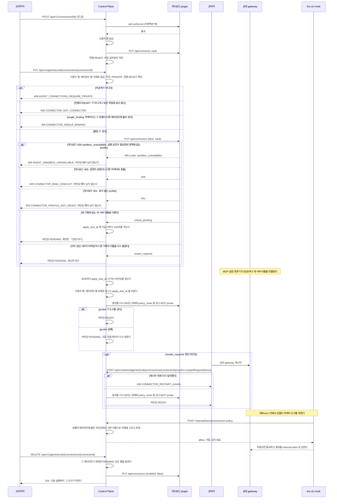
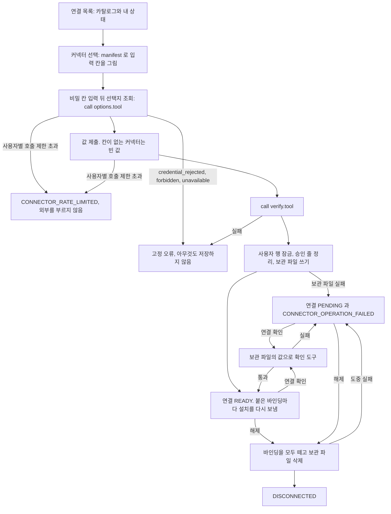
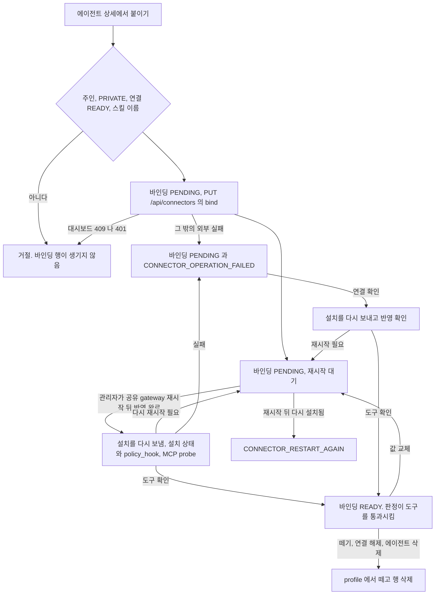

# 커넥터 연결

사용자가 커넥터에 계정을 연결하고 그 연결을 에이전트에 붙이는 기능이다.

## 커넥터

**커넥터는 에이전트에게 도구를 쥐어 주는 것이고, 에이전트의 역할을 넓혀 주는 것이다.**
커넥터는 따로 도는 실행 주체가 아니라 에이전트가 쓰는 외부 서비스의 MCP 도구 묶음이다([ADR-083](../adr/ADR-083-커넥터는-사용자가-한-번-연결하고-자기-에이전트에-여럿-붙여-그-에이전트가-도구를-직접-부른다.md)).

사용자는 「연결」 화면에서 커넥터마다 계정을 한 번 연결한다. 이것이 **연결**이고 사용자와 커넥터마다 하나다.
그 연결을 자기 에이전트의 상세에서 붙이고 뗀다. 이것이 **바인딩**이고 에이전트와 연결은 다대다다. 화면에서는 「붙이기」 와 「떼기」 라 쓴다.
붙인 에이전트는 그 커넥터의 도구를 같은 turn 에서 직접 부른다. 붙이고 반영하는 순서는 [커넥터 설치](connector.md) 가 갖는다.
어떤 커넥터가 있고 무엇을 입력받는지는 plugin 의 `connector.json` 이 선언하고, Control Plane 은 서비스 이름과 주소를 모른다([ADR-043](../../backend/docs/adr/ADR-043-커넥터는-plugin-의-connector-json-으로-선언하고-control-plane-은-범용-흐름만-갖는다.md)).
임의 plugin 을 설치하는 화면은 없다. 연결할 수 있는 커넥터는 운영자가 대시보드 plugin 에 준 목록뿐이다.
이 저장소가 갖는 범용 커넥터는 `hermes/connectors/` 에 있고([ADR-064](../../hermes/docs/adr/ADR-064-범용-커넥터는-이-저장소의-hermes-connectors-에-두고-저장소가-유지보수한다.md)), 만드는 방법은 [커넥터 만들기](../../hermes/connectors/README.md) 가 갖는다.

## 연결 절

`components/agent/agent-connections-section.tsx` 가 「이 에이전트가 쓰는 연결」 을 그린다. 도구 절 뒤, 스킬 절 앞에 둔다.
서버 컴포넌트가 주인일 때만 `GET /api/v1/agents/{code}/connections` 를 읽어 넘긴다. 읽지 못하면 절 안에 실패 문구만 그린다.
계정 연결은 이 절이 하지 않는다. 절 머리의 「외부 서비스 연결하기」 가 `/connections?agent=<번호>` 로 이 에이전트를 실어 연결 화면을 연다. 붙일 수 없는 에이전트(그룹 공개, 옛 커넥터 에이전트)에는 그 단추를 두지 않는다. 내 연결이 하나도 없으면 「아직 연결한 계정이 없어요. 서비스 계정을 연결하면 이 에이전트에 바로 붙일 수 있어요.」 를 보인다.

| 때 | 보이는 것 |
| --- | --- |
| 붙일 수 있다 | 연결마다 이름, 「도구 N개」, 상태 표시와 「붙이기」 나 「떼기」. 붙었고 바인딩이 `READY` 이며 재시작 대기가 아니면 「붙음」, 붙었지만 아니면 「반영 대기」 다 |
| 연결이 아직 준비되지 않았다 | 「붙이기」 가 없고 「서비스 연결에서 연결을 확인해 주세요.」 를 보인다 |
| 그룹에 공개된 에이전트다 | 「비공개 에이전트에만 붙일 수 있어요.」 를 보이고 「붙이기」 를 그리지 않는다. 이 화면에서 비공개로 되돌리면 다시 붙일 수 있다 |
| 「붙이기」 를 누른다 | 확인 창을 연다. 「이 에이전트가 이 연결의 도구를 직접 써요. 운영에서 격리를 적용하지 않은 에이전트는 터미널이나 파일 도구로 연결의 비밀값에 닿을 수 있어요.」 를 보이고, 셸, 파일, 코드 실행 도구가 켜져 있으면 「격리를 적용하지 않은 에이전트는 연결 도구의 승인 없이 그 서비스를 부를 수 있어요. 격리한 에이전트도 연결 도구로 읽은 내용을 인터넷으로 보낼 수 있어요.」 를 경고로 더한다. 실패하면 창이 남아 까닭을 보인다 |
| 커넥터에 스킬이 있는데 `skills` 도구가 꺼져 있다 | 「지침을 쓰려면 스킬 도구를 켜세요.」 를 보인다 |

도구 절과 이 절은 서로의 위험을 알린다. 연결이 붙은 에이전트에서 셸, 파일, 코드 실행 도구를 켜면 도구 절의 확인 창이 「격리를 적용하지 않은 에이전트는 붙은 연결의 비밀값을 이 도구로 읽고, 연결 도구의 승인 없이 그 서비스를 부를 수 있어요. 격리한 에이전트도 연결 도구로 읽은 내용을 인터넷으로 보낼 수 있어요.」 를 더한다.
화면은 그 에이전트의 profile 에 실행 공간 격리([ADR-086](../adr/ADR-086-셸과-파일-도구는-사용자별-docker-실행-공간에서만-돈다.md))가 적용됐는지 모른다. 그래서 두 경우를 함께 알린다.
「바인딩」 은 화면에 보이지 않는다. 「붙이기」, 「떼기」, 「이 에이전트가 쓰는 연결」, 「반영 대기」 라 쓴다.

**옛 커넥터 에이전트의 상세**는 성격 자리에 「예전 방식의 연결 에이전트예요. 쓰던 에이전트에 이 연결을 붙인 뒤 이 에이전트를 지워 주세요.」 를 보이고, 도구, 연결, 스킬, 먼저 살펴보기 절을 그리지 않는다. 공개와 삭제 절은 삭제만 남긴다.

**「외부 서비스 연결」 화면**은 계정 연결을 맡는다. 목록의 카드는 연결된 커넥터에 「붙인 에이전트 N개」 를 보이고, 지금 쓸 수 있는 커넥터가 연결됐는데 쓰는 에이전트가 없으면 「아직 쓰는 에이전트가 없어요. 눌러서 쓸 에이전트를 골라 주세요.」 를 보인다. 연결 하나의 화면은 「붙인 에이전트」 목록에 에이전트마다 상세로 가는 링크와 반영 대기 표시를 보인다. 떼기는 에이전트 화면에서 한다. 연결 확인이 `CONNECTOR_NOT_CONNECTED` 로 끝나면 「값을 다시 입력해 연결해 주세요.」 를 보이고, 서버가 연결을 준비 중으로 커밋하므로 연결을 다시 읽어 상태를 맞춘다.

목록은 「연결한 서비스」를 먼저, 「연결할 수 있는 서비스」를 다음에 보인다. 준비 중인 연결도 「연결한 서비스」에 둔다. 빈 구역은 그리지 않는다. 각 구역은 모바일 1열, 중간 폭(`md`) 2열, 넓은 폭(`xl`) 3열의 그리드다. 구역 안의 카드 높이를 맞추고 이름과 설명은 각각 한 줄에서 말줄임한다. 설명 전문은 상세 화면에서 읽는다. 아이콘과 이름, 설명, 상태 배지는 카드 위쪽에 두고, 「연결하기」 또는 「연결 확인」 주 단추는 아래쪽 같은 자리에 둔다. 연결한 카드에는 붙인 에이전트 수를 보인다. 도구 요약과 쓰는 에이전트가 없다는 안내는 각각 두 줄까지 보인다.

목록과 상세의 상태 배지는 「연결됨」에 `success`, 「준비 중」에 `warning`, 「연결 안 됨」에 중립 색을 쓴다. 색과 글자를 함께 표시한다. 상세의 「연결 다시 확인」 보조 단추는 쓸 수 있는 서비스의 준비 중인 연결과 연결된 계정 모두에 보인다. 확인에 실패하면 오류 안내를 보이고 연결 상태는 서버 응답을 따른다.

관리자 패널은 바인딩마다 사용자, 커넥터, 에이전트 번호, 상태를 보이고, 재시작 대기 바인딩과 `PENDING` 바인딩에 「반영 완료」 를 둔다.
재시작 대기 바인딩은 「공유 gateway 를 재시작한 뒤 눌러 주세요.」 를 안내한다.
재시작이 필요 없는 `PENDING` 바인딩은 「반영 중」 으로 보이고 「몇 분이 지나도 남아 있으면 눌러 다시 확인해요.」 를 안내한다. Control Plane 이 스스로 반영을 확인하지만, 그 확인이 한 번 실패하면 바인딩이 `PENDING` 으로 남기 때문이다. 재시작한 뒤 다시 설치된 바인딩이면 서버의 거절 문구를 보이고, 성공하든 거절되든 목록을 다시 읽는다.

## 연결 뒤 에이전트 고르기

`components/connector/connector-agent-chooser.tsx` 가 연결 하나의 화면 맨 위에 그린다.
연결한 뒤 무엇을 할지 모르는 일이 없게, 연결을 마친 같은 자리에서 그 연결을 쓸 에이전트를 고르고 바로 붙인다.

| 보이는 때 | 제목 |
| --- | --- |
| 등록이나 「연결 다시 확인」 으로 연결이 처음 `READY` 가 됐다. 제목에 초점을 옮긴다 | 「<서비스> 연결이 끝났어요」 |
| 연결됐고 쓰는 에이전트가 없다. 또는 `?agent=<번호>` 의 에이전트에 아직 붙지 않았다 | 「이 서비스를 쓸 에이전트」 |
| 「붙인 에이전트」 의 「쓸 에이전트 고르기」 나 「다른 에이전트에도 붙이기」 를 눌렀다 | 같다 |

후보는 내 에이전트 가운데 옛 커넥터 에이전트를 뺀 것이다. 순서는 `?agent=` 의 에이전트(「방금 보던 에이전트예요.」), 붙일 수 있는 것, 이미 붙은 것(「이미 쓰고 있어요」), 그룹 공개 순서다.
그룹 공개 에이전트는 단추 대신 「그룹에 공개한 에이전트라 붙일 수 없어요. 나만 쓰는 에이전트로 바꾸면 붙일 수 있어요.」 를 보인다.
붙일 수 있는 에이전트가 없으면 에이전트를 만들면 바로 붙일 수 있다고 알리고 「에이전트 만들기」(`/agents?new=1`)를 둔다.
「나중에」 는 영역을 닫는다.

「이 에이전트에서 쓰기」 를 누르면 그 에이전트의 도구를 읽는다. 도구를 읽는 동안 단추는 「확인하는 중」 이다. 셸, 파일, 코드 실행 도구가 켜졌거나 도구를 읽지 못했으면 에이전트 화면과 같은 붙이기 확인 창을 셸 위험 경고와 함께 거친다. 아니면 바로 붙인다. 붙이기가 실패해도 서버에 바인딩이 남았을 수 있어 붙인 에이전트 목록을 다시 읽는다.
붙이면 「「<에이전트>」에 붙였어요」 와 「이제 「<에이전트>」 대화에서 「<서비스>」 도구를 써요.」 에 언제 쓸 수 있는지를 붙여 보이고(「바로 쓸 수 있어요.」, 「몇 분 안에 쓸 수 있어요.」, 재시작 대기는 「관리자가 반영을 확인하면 쓸 수 있어요.」), 「<에이전트>와 대화하기」 가 `/?agent=<번호>` 로 그 에이전트를 고른 새 대화를 연다. 붙인 에이전트 목록도 다시 읽는다.

목록 화면이 `?agent=<번호>` 로 열리면 「보던 에이전트에서 쓸 서비스를 골라 연결해 주세요.」 를 보이고, 카드 링크가 그 번호를 연결 하나의 화면으로 넘긴다.

## 커넥터를 붙일 때

커넥터는 에이전트에게 쥐어 주는 도구 묶음이다. 계정은 「연결」 화면에서 한 번 연결하고, 그 연결을 에이전트 상세에서 붙인다.
순서와 실패 처리는 [`docs/features/connector.md`](connector.md) 의 「설치와 실패 처리」, 판정은 [`docs/features/connector-policy.md`](connector-policy.md) 의 「도구 호출 판정」 이 갖는다.

- 같은 사용자의 등록, 확인, 해제, 붙이기, 떼기, 승인은 사용자 행 잠금으로 줄을 선다. 붙이기, 떼기, 반영 완료, 반영 예정 확인, 지우기는 그다음 에이전트 행을 잠근다. 공개 범위 변경도 같은 에이전트 행을 기다려 잠그므로 붙이기와 동시에 와도 한쪽이 다른 쪽의 커밋을 보고 판정한다
- 대시보드의 그 밖의 실패는 바인딩을 `PENDING` 으로 남기고 502 `CONNECTOR_OPERATION_FAILED` 다. 다음 연결 확인이 설치를 다시 보낸다
- 뗀 기록에 없는 새 이름을 더한 붙이기는 공유 gateway 를 재시작하지 않는다. Control Plane 이 반영 예정 시각이 지나면 스스로 확인한다([ADR-20261007 / connector-live-reload](../adr/ADR-20261007-connector-live-reload.md)). 관리자 반영 완료는 `restart_required` 인 바인딩에만 남는다
- 바인딩이 `READY` 가 되기 전이나 연결이 확인되지 않은 동안의 호출은 판정이 `NOT_READY` 로 막는다. 그 에이전트의 다른 도구는 그대로 돈다

## 커넥터 설치

Control Plane 이 대시보드 plugin 의 커넥터 경로로 연결을 등록하고 확인하고 해제하는 순서, 연결을 에이전트에 붙이고 떼는 순서와 실패 처리를 갖는다.
남아 있는 옛 커넥터 에이전트의 규칙과 옮겨 가기, plugin 이 기대는 MCP SDK 계약도 이 파일이 갖는다.
사용자가 부르는 API 와 승인은 [커넥터 연결](connector.md) 의 「커넥터 연결 API」 가, 도구 호출의 판정은 [커넥터 도구 정책](connector-policy.md) 이 갖는다.

### 대시보드 plugin 계약

대시보드 plugin(`hermes/plugins/dashboard-profile-api`) 이 여는 커넥터 경로를 Control Plane 이 쓰는 방법이다.
경로마다의 요청과 응답은 [`hermes/plugins/dashboard-profile-api/README.md`](../../hermes/plugins/dashboard-profile-api/README.md) 의 「dashboard-profile-api 가 여는 것」 표가 갖는다.

설치는 두 가지다. 커넥터마다 만든 전용 profile 에 하는 **옛 설치**와, 일반 에이전트의 profile 에 연결을 붙이는 **바인딩 설치**다([ADR-083](../adr/ADR-083-커넥터는-사용자가-한-번-연결하고-자기-에이전트에-여럿-붙여-그-에이전트가-도구를-직접-부른다.md)).
소유 기록 `.fos-connectors.json` 의 항목이 `mode` 로 방식을 적는다. `bind` 가 바인딩 설치이고, 칸이 없거나 `isolated` 이면 옛 설치다.
`PUT /api/connectors` 는 본문에 `bind` 칸이 없으면 지금처럼 옛 설치를 한다. 그래서 새 칸을 모르는 옛 Control Plane 과 함께 돈다.

- `call` 은 `tool` 이 그 커넥터의 `options.tool` 이나 `verify.tool` 일 때만 받는다. 칸 값을 메모리에서 env 로 넘겨 MCP 서버를 한 번 띄우고, `initialize` 와 `tools/call` 한 번 뒤 닫는다. 디스크에 쓰지 않는다
- `call` 의 칸 값은 본문의 `values` 나 보관 파일(`vault`) 가운데 정확히 하나에서 온다. `vault` 면 그 보관 파일의 커넥터가 경로의 커넥터와 같아야 하고, 아니면 400 이다
- `call` 은 자식을 띄우기 전에 `mcp` SDK 가 지원 범위인지 본다. 범위 밖이면 부르지 않고 `unavailable` 이다. 아래 「MCP SDK 계약」 이 갖는다
- `call` 의 시간 제한은 10초, 동시 실행은 대시보드 프로세스 전체에서 4개다. 시간을 넘기면 자식 프로세스를 끝내고 `unavailable` 이다. 이미 4개가 돌고 있으면 기다리지 않고 `unavailable` 이다
- Control Plane 은 카탈로그의 `fields[].env` 로 `PUT /api/env` 의 key 를 정하고 `verify.tool` 로 확인 도구를 부른다. `env` 이름은 Control Plane 의 응답에 담지 않는다
- 카탈로그는 커넥터마다 `icon` 과 `link` 를 낸다. Control Plane 은 [커넥터 연결](../../hermes/connectors/README.md) 의 「아이콘과 링크」 규칙으로 다시 검사하고, 어긋난 칸만 null 로 읽는다
- 카탈로그는 커넥터마다 `single_binding` 을 boolean 으로 낸다. 선언이 없으면 거짓이다. Control Plane 은 칸이 없으면 거짓으로 읽고, boolean 이 아니면 `attachments` 와 같이 카탈로그 읽기를 실패로 다룬다([ADR-20261008 / connector-binding-guards](../adr/ADR-20261008-connector-binding-guards.md))
- 카탈로그는 커넥터마다 `skills`(바인딩 설치가 복사할 스킬 이름 목록)를 낸다. 입력 칸이 없는 커넥터(빈 `fields`)도 받는다. 그 커넥터의 보관 파일은 빈 `values` 다
- 운영 목록에서 빠진 커넥터도 그 profile 에 소유 기록이 남아 있으면 `PUT /api/connectors` 의 `enabled: false` 를 받는다. 이때 대시보드가 그 기록의 서버 env 가 참조하던 key 를 profile `.env` 에서 지운다. `GET /api/connectors` 는 그 기록을 `configured: false` 로 낸다
- 운영 목록에도 없고 소유 기록도 없는 plugin 의 `enabled: false` 는 끌 것이 없으므로 `changed: false` 로 성공한다. `enabled: true` 는 거절한다. `GET /api/connectors` 는 그런 plugin 을 목록에 넣지 않고, Control Plane 은 목록에 없는 것을 설치 안 됨(`enabled: false`, `configured: false`)으로 읽는다. 카탈로그에서 빠진 연결의 해제와 반영 완료가 끝까지 가게 하기 위해서다
- `GET /api/connectors` 는 커넥터마다 `mode`(`bind`, `isolated`)를 낸다. 설치하지 않은 커넥터는 `isolated` 로 답하므로 설치한 항목의 값만 읽는다
- 운영자는 대시보드 프로세스의 환경 변수로 커넥터 목록을 준다. 자세한 모양은 [`hermes/README.md`](../../hermes/README.md) 의 「운영 값」 과 「커넥터」 가 갖는다
- `call` 의 자식 프로세스가 받는 env 도 같은 문서의 「커넥터」 가 갖는다. 대시보드 프로세스의 다른 env 는 넘어가지 않는다

#### 표식

profile 이 어떤 요청을 받는지는 두 표식이 정한다. 판정은 요청의 칸이 아니라 대상의 방식으로 한다.

| 표식 | 누가 두는가 | 받는 것 |
| --- | --- | --- |
| 관리 표식 `.fos-assistant-managed` | 대시보드 plugin 이 토큰으로 만든 profile 에 쓴다 | 두 방식의 설치와 떼기, 상태 조회, probe, 실행 |
| 커넥터 표식 `.fos-connector-host` | 운영자가 사람이 만든 profile 에 둔다. plugin 은 쓰지 않는다 | 바인딩 설치와 그 떼기, 상태 조회, 바인딩 항목의 probe 와 실행 |

- `GET /api/connectors` 는 두 표식 가운데 하나가 있으면 받는다
- `PUT /api/connectors` 의 설치는 `bind` 칸이 있으면 두 표식 가운데 하나, 없으면 관리 표식만 받는다
- `PUT /api/connectors` 의 떼기는 소유 기록의 그 항목이 `bind` 면 두 표식 가운데 하나, 아니면 관리 표식만 받는다
- 커넥터 표식만 있는 profile 의 떼기는 소유 기록에 그 항목이 없어도 바인딩 떼기로 다룬다. 아무것도 바꾸지 않고 `changed: false` 로 답한다. 다시 보낸 떼기가 401 로 실패하면 Control Plane 의 바인딩 행이 지워지지 않기 때문이다
- `POST /api/mcp/servers/<서버>/test` 와 `POST /api/connectors/<id>/execute` 는 커넥터 표식만 있는 profile 에서 소유 기록의 그 항목이 `bind` 여야 한다
- 표식이 맞지 않으면 401 이다

#### 옛 설치

옛 설치가 profile 에서 바꾸는 것(칸 값, API 도구 목록, Control Plane MCP 등록, 지침, 대응 파일)은 [`hermes/plugins/dashboard-profile-api/README.md`](../../hermes/plugins/dashboard-profile-api/README.md) 의 두 설치 표가 갖는다.
운영자 env 이름의 쓰기를 받고 무시하는 것은 같은 문서와 [ADR-041](../adr/ADR-041-hermes-에-설치하는-plugin-과-profile-틀은-이-저장소가-소유한다.md) 이, 도구 목록을 제한하는 까닭은 [ADR-044](../../backend/docs/adr/ADR-044-커넥터-manifest-는-읽기-전용-이미지-도구만-열-수-있다.md) 와 [ADR-045](../../backend/docs/adr/ADR-045-커넥터-에이전트는-자기-mcp-서버만-받고-memory-와-control-plane-도구를-받지-않는다.md) 가 갖는다.
아래는 그 표에 없는 것이다.

- 선택 칸 key 의 `PUT /api/env` 가 성공하면 그 key 를 칸으로 가진 설치를 다시 써 서버 정의의 빈 값을 맞춘다. 바인딩 항목은 다시 설치하지 않는다. 바인딩의 `.env` 와 서버 정의는 바인딩 설치가 보관 파일의 값으로 쓴다
- `GET /api/connectors` 의 `configured` 는 서버 정의가 소유 기록과 같고 API 도구 목록이 설치가 쓰는 목록(설치한 커넥터의 서버 이름에 선언한 `toolsets` 를 더한 것)과 정확히 같고 Control Plane MCP 등록이 없을 때만 참이다. Control Plane MCP 나 선언하지 않은 내장 도구가 목록에 남은 옛 모양은 `configured: false` 다
- 설치와 제거는 쓰기 전에 `config.yaml`, 소유 기록, `SOUL.md` 를 `connector-backups/` 에 떠 둔다. profile `.env` 는 떠 두지 않는다. 쓸 때마다 그 디렉터리에 남아 있는 `.env` 사본을 지운다

#### 바인딩 설치

`PUT /api/connectors` 의 본문에 `bind: {vault}` 를 더하면 그 보관 파일의 값으로 그 profile 에 커넥터를 붙인다.
그 profile 의 Control Plane MCP 등록, 다른 도구 이름, `SOUL.md` 는 건드리지 않는다.

받는 profile 의 조건이다. 하나라도 어기면 설치는 409 이고 파일이 하나도 바뀌지 않는다.

- 관리 표식이나 커넥터 표식이 있다. 없으면 401 이다
- `platform_toolsets.api_server` 목록이 있고 그 안에 Control Plane MCP 가 있다. 목록이 없는 profile 에 이름 하나만 든 목록을 만들면 내장 도구와 Control Plane MCP 가 모두 닫히고, MCP 이름이 없던 목록에 이름을 더하면 운영자의 다른 MCP 서버가 막히기 때문이다
- `fos-ctx` 가 켜져 있다. `plugins.enabled` 에 있고 `plugins.disabled` 에 없으며 `plugins.entries.fos-ctx.allow_tool_override` 가 `false` 여야 한다. 설치는 plugin 파일만 맞추고 profile 의 plugin 설정은 쓰지 않으므로, 꺼진 profile 에 붙이면 도구 호출이 판정 없이 나간다. 이 조건은 새로 붙일 때만 본다. 이미 붙은 커넥터를 다시 설치하는 것(연결 확인, 반영 완료)은 받고, 그 바인딩은 hook 상태가 거짓이라 `PENDING` 에 남는다
- 소유 기록에 옛 설치 항목이 없다. 반대로 바인딩 항목이나 뗀 서버 기록이 있는 profile 은 옛 설치를 받지 않는다
- 커넥터의 env 이름이 그 커넥터의 소유 기록 없이 이미 `.env` 에 있지 않고, 기본 key 나 다른 바인딩 커넥터의 env 이름과 겹치지 않는다
- 서버 이름이 운영자가 등록한 서버와 겹치지 않는다
- 복사할 스킬 디렉터리가 그 커넥터의 소유 기록 없이 이미 있지 않다
- manifest 가 `sandbox_required` 를 선언했으면 운영 정책이 있고 그 profile 이 정책의 `profiles` 에 있다. 아니면 409 이고 본문의 `code` 는 `sandbox_unavailable` 이다. 이 조건은 다시 설치할 때(값 다시 등록, 연결 확인, 반영 완료)도 본다. 정책에서 빠진 profile 의 바인딩은 그때 `PENDING` 이 된다([ADR-20261008 / connector-binding-guards](../adr/ADR-20261008-connector-binding-guards.md))

보관 파일이 없거나 다른 커넥터의 것이면 400 이다. 보관 파일의 키 가운데 지금 칸 선언에 없는 것은 버린다. 칸을 뺀 커넥터의 옛 연결도 연결 확인으로 다시 설치되게 하려는 것이다. 남은 값이 지금 칸 선언과 맞지 않으면 400 이다. 보관 파일을 쓰는 `PUT /api/connector-vault` 는 모르는 칸을 그대로 거절한다.

Control Plane 은 바인딩 설치 요청에 그 에이전트의 `sandbox_owner` 를 늘 함께 보낸다. 연결 확인과 반영 완료가 다시 설치할 때도 같다.
보내기 전에 그 주인의 첨부 디렉터리를 최선 노력으로 만든다. 만들지 못해도 경고 로그만 남기고 요청을 보낸다. 선언하지 않은 커넥터의 붙이기가 첨부 루트 문제로 막히지 않게 하려는 것이다.
manifest 가 `owner_attachments_env` 를 선언했으면 plugin 은 운영 정책의 `attachment_agent_root` 아래 `users/<SHA-256(sandbox_owner)>` 를 그 env 의 값으로 서버 정의에 직접 넣는다([ADR-20261007 / connector-owner-attachments](../adr/ADR-20261007-connector-owner-attachments.md)). `sandbox_owner` 가 없으면 400, 운영 정책이 없거나 그 디렉터리를 중간 링크 없이 확인하지 못하면 409 다. Control Plane 이 디렉터리를 만들지 못한 경우도 이 409 가 된다. 409 의 본문 `code` 는 `sandbox_unavailable` 이고 붙이기는 `AGENT_SANDBOX_UNAVAILABLE` 로 끝난다. 선언하지 않은 커넥터는 `sandbox_owner` 를 쓰지 않는다.
manifest 가 `owner_output_env` 를 선언했으면 plugin 은 운영 정책의 `connector_output_root` 아래 `users/<SHA-256(sandbox_owner)>/<profile>/<커넥터 id>` 를 링크 없이 만들고 그 env 의 값으로 서버 정의에 직접 넣는다. 정책이나 그 키, `sandbox_owner` 가 없거나, profile 이 정책에 등록되지 않았거나, 디렉터리를 만들지 못하면 빈 값을 넣고 붙이기는 그대로 한다. 디렉터리는 보관 파일을 확인한 뒤에 만든다. 커넥터는 파일 출력만 거절한다. 떼면 설치한 그 디렉터리를 지운다([ADR-20261008 / connector-output-files](../../hermes/docs/adr/ADR-20261008-connector-output-files.md)).
manifest 가 `owner_browser_env` 를 선언했으면 Control Plane 은 요청에 `owner_browser` 로 그 바인딩의 표식을 실은 중계 주소를 싣는다. 선언하지 않은 커넥터의 요청에는 이 키가 없다. 중계가 꺼졌으면 빈 값을 싣고, 붙이기는 막지 않는다. plugin 은 그 값을 그 env 의 값으로 서버 정의에 직접 넣는다. 키가 없거나 빈 값이면 빈 값을 넣는다. 문자열이 아니거나 비지 않았는데 `http(s)://<호스트>[:<포트>]/<경로>` 모양이 아니면 400 이다. 같은 바인딩은 늘 같은 주소를 받으므로 연결 확인과 반영 완료가 다시 설치해도 서버 정의가 바뀌지 않아 `restart_required` 가 참이 되지 않는다([ADR-20261008 / browser-gateway-token](../../backend/docs/adr/ADR-20261008-browser-gateway-token.md)).

| 무엇 | 붙일 때 | 뗄 때(`enabled: false`) |
| --- | --- | --- |
| profile `.env` | manifest 의 `fields[].env` 마다 보관 값을 쓰고, 보관 파일에 없는 선택 칸의 key 는 지운다 | 소유 기록의 서버 정의가 `${이름}` 으로 참조하던 이름을 지운다. manifest 가 있고 기록의 실행 정의가 지금과 같으면 `fields[].env` 도 지운다. 기본 key 는 지우지 않는다 |
| `mcp_servers` | 그 커넥터의 서버 정의를 둔다. 값이 없는 선택 칸은 정의의 `env` 에 빈 글을 명시한다 | 그 서버 정의를 지운다 |
| `platform_toolsets.api_server` | 서버 이름을 더한다. 있던 이름은 그대로 두고 `no_mcp` 는 뺀다. manifest 의 `toolsets` 는 더하지 않는다 | 그 이름만 뺀다 |
| 스킬 | plugin 의 스킬 디렉터리를 그 profile 의 `skills/<앞머리 name>/` 로 복사한다. `SKILL.md` 와 `references/`, `templates/` 아래 정규 파일이다. 앞머리가 환경 값이나 자격 증명 파일을 요청하는 스킬이 있으면 그 커넥터를 카탈로그에 내지 않는다([ADR-086](../adr/ADR-086-셸과-파일-도구는-사용자별-docker-실행-공간에서만-돈다.md)). 칸 목록은 [커넥터 만들기](../../hermes/connectors/README.md) 의 「스킬」 이 갖는다 | 소유 기록의 `skills` 디렉터리를 지운다 |
| 소유 기록 | 항목에 `mode: bind`, `vault`, `skills` 를 적는다 | 그 항목을 지운다 |
| 이름 대응 파일 | `isolated: false` 를 싣고 소유 기록의 모든 서버를 싣는다. manifest 를 읽지 못했거나 소유 기록의 서버 이름이나 실행 정의가 지금 manifest 와 다른 서버는 소유 기록의 이름으로 빈 `tools` 다. 뗀 서버 기록의 서버도 빈 `tools` 로 싣는다 | 뗀 서버를 빈 `tools` 로 남긴다. 마지막 바인딩을 떼도 지우지 않는다 |
| 뗀 서버 기록 `.fos-connector-detached.json` | 그 커넥터의 항목을 지운다. 남은 항목이 없으면 파일을 지운다 | `{커넥터 id: 서버 이름}` 으로 그 서버 이름을 남긴다 |
| `fos-ctx` | 묶음에 든 판으로 맞춘다 | 건드리지 않는다 |

- 스킬 색인 표식과 답의 `restart_required`, `reload_pending` 이 언제 참인지는 [`hermes/plugins/dashboard-profile-api/README.md`](../../hermes/plugins/dashboard-profile-api/README.md) 의 두 설치 표가 갖는다
- 붙이기는 한 묶음으로 쓴다. 실패하면 이 요청이 쓴 파일만 되돌린다
- 떼기는 소유 기록을 지금 manifest 와 견주지 않는다. 그 항목이 객체이고 `mode` 가 `bind` 인지와 서버 이름과 스킬 이름이 경로 조각이 될 수 있는지만 본다. 운영자가 커넥터의 실행 정의를 바꾼 뒤에도 떼어야 `.env` 에 비밀이 남지 않는다
- 쓰기 전에 `config.yaml`, 소유 기록, 이름 대응 파일, 뗀 서버 기록을 `connector-backups/` 에 떠 둔다. `.env` 와 스킬 파일은 떠 두지 않는다
- `GET /api/connectors` 의 바인딩 항목 `configured` 는 서버 정의가 소유 기록과 같고, 서버 이름이 API 도구 목록에 있고, 소유 기록의 서버 이름과 실행 정의가 지금 manifest 와 같고, 소유 기록의 스킬 파일이 plugin 의 본문과 같을 때 참이다. Control Plane MCP 등록이 있어도 된다
- 바인딩 항목은 요청이 가리키는 커넥터의 것만 지금 manifest 와 견주고 나머지는 모양만 본다. 운영자가 커넥터 하나의 실행 정의를 바꿔도 같은 profile 에 붙은 다른 커넥터의 붙이기, probe, 실행은 그대로 된다. 상태 조회는 바뀐 항목만 `configured: false` 다

**도구 목록은 설치와 Control Plane 의 도구 저장이 나눠 쓴다.**
토큰으로 부른 `PUT /api/config` 가 `platform_toolsets` 를 보내면, 소유 기록의 바인딩 항목이 설치한 서버 이름이 요청의 `api_server` 목록에 모두 있어야 한다.
하나라도 빠지면 409 「연결된 커넥터의 도구 이름이 빠졌다」 로 거절한다. Hermes 처리기가 목록을 통째로 바꾸므로 조용히 지워지는 길을 남기지 않는다.
그래서 Control Plane 의 도구 저장과 스킬 게시는 붙은 커넥터 서버 이름을 함께 보낸다. 스킬 경로만 쓰는 요청과 옛 설치 profile 은 이 검사를 하지 않는다.

#### 보관 파일

연결의 칸 값의 원본은 대시보드 plugin 이 연결마다 하나씩 두는 보관 파일이다. 대시보드의 HERMES_HOME 아래 `connector-vault/` 에 있다.
Control Plane DB 에는 지금처럼 비밀이 아닌 칸 값과 비밀 칸의 앞부분만 둔다.

보관 파일의 경로와 형식, `vault` 이름 규칙, 세 경로(`PUT`, `DELETE`, `POST .../import`)의 검사와 오류는 [`hermes/plugins/dashboard-profile-api/README.md`](../../hermes/plugins/dashboard-profile-api/README.md) 의 경로 표와 「보관 파일은 연결의 칸 값을 연결마다 하나씩 둔다」 가 갖는다.
값과 경로는 응답, 로그, 예외 메시지, 설정 백업에 없다. 바인딩 설치도 같은 profile 쓰기 잠금 안에서 보관 파일을 읽으므로 그 사이에 값이 바뀌지 않는다.

### 설치와 실패 처리

연결은 에이전트를 만들지 않는다([ADR-083](../adr/ADR-083-커넥터는-사용자가-한-번-연결하고-자기-에이전트에-여럿-붙여-그-에이전트가-도구를-직접-부른다.md)).
연결의 등록, 확인, 해제는 값의 원본인 보관 파일을 다루고, 에이전트에 닿는 것은 붙이기와 떼기가 하는 바인딩 설치다.
연결 상태는 「값이 확인돼 쓸 수 있는가」 이고, 바인딩 상태는 「그 에이전트의 profile 에 설치되고 반영됐는가」 다. 재시작 대기는 profile 마다라 바인딩이 갖는다.

Control Plane 은 도구 목록을 직접 쓰지 않는다. 바인딩 설치가 서버 이름을 더하고 빼며, 도구 저장과 스킬 게시는 붙은 커넥터 서버 이름을 함께 보낸다(위 「바인딩 설치」).

#### 연결 등록

1. 로그인 사용자 확인과 `values` 검사. 입력 칸이 없는 커넥터는 빈 `values` 를 받는다
2. `call(verify.tool, values)` 가 통과해야 한다. 실패는 공통 어휘의 오류 코드로 끝나고 아무것도 저장하지 않는다. 이 호출은 DB 트랜잭션 밖에서 한다. 자식 프로세스를 띄워 오래 걸릴 수 있어 그동안 DB 연결을 쥐지 않기 위해서다
3. 사용자 행을 잠그고 연결 행을 읽는다. 없으면 `PENDING` 으로 만든다. 그 연결의 `PENDING` 승인 줄을 끝내고 상시 허락을 거둔다. `EXECUTING` 인 줄이 있으면 여기서 거절한다
4. `PUT /api/connector-vault` 로 보관 파일에 값을 쓴다. 실패하면 연결을 `PENDING` 으로 커밋하고 `CONNECTOR_OPERATION_FAILED` 로 끝낸다
5. 칸 값과 비밀 앞부분을 저장하고 `vault_stored` 를 참으로, 연결을 `READY` 로 둔다
6. 그 연결이 붙은 바인딩마다 설치를 다시 보낸다. 대시보드가 보관 파일에서 그 profile 의 `.env` 로 값을 다시 복사한다. 떠 있는 MCP 프로세스는 옛 값을 쥐고 있으므로 그 바인딩은 재시작 대기의 `PENDING` 이 된다. 바인딩 하나가 실패해도 연결은 저장하고 그 바인딩만 `PENDING` 으로 둔다

#### 연결 확인

트랜잭션을 셋으로 나눈다.

1. 사용자 행을 잠근다. 해제된 연결이면 아무것도 하지 않는다. 값이 아직 보관 파일에 없는 옛 연결이면 옛 커넥터 에이전트의 profile 에서 `POST /api/connector-vault/import` 로 값을 옮기고 `vault_stored` 를 참으로 둔다. 옮기지 못하면 확인 도구를 부르지 않고 연결 상태를 그대로 둔다.
2. 트랜잭션 밖에서 보관 파일의 값으로 확인 도구를 부른다(`call` 의 `vault`). 사용자 잠금과 DB 연결을 쥐지 않는다
3. 다시 잠근다. 그 사이 해제됐으면 아무것도 바꾸지 않는다. 카탈로그에 있는 커넥터인데 보관 파일에 값이 없고 옮겨 올 옛 커넥터 에이전트의 바인딩도 없으면 연결을 `PENDING` 으로 커밋하고 `CONNECTOR_NOT_CONNECTED` 로 끝낸다. 값을 다시 등록해야 쓸 수 있고 이때 바인딩은 건드리지 않는다. 카탈로그에서 빠진 커넥터는 다시 등록할 수 없어 오류 없이 `PENDING` 으로 둔다. 확인 도구가 실패했으면 연결을 `PENDING` 으로 커밋하고 공통 어휘의 오류로 끝낸다. 이때 바인딩은 건드리지 않는다. 통과했으면 연결을 `READY` 로, 카탈로그에서 빠진 커넥터는 `PENDING` 으로 둔다. 그 뒤 붙은 바인딩마다 아래 「바인딩의 반영 맞추기」 를 한다. 바인딩의 외부 호출이 실패하면 그 바인딩만 `PENDING` 으로 커밋하고 `CONNECTOR_OPERATION_FAILED` 로 끝낸다

#### 연결 해제

1. 사용자 행을 잠그고 그 연결의 `PENDING` 승인 줄을 끝내고 상시 허락을 거둔다
2. 붙은 바인딩마다 떼고 그 행을 지운다
3. `DELETE /api/connector-vault` 로 보관 파일을 지운다
4. 연결을 `DISCONNECTED` 로 두고 칸 값과 비밀 앞부분을 비운다. 연결 행은 이력을 위해 남긴다

중간에 실패하면 연결을 `PENDING` 으로 커밋하고 `CONNECTOR_OPERATION_FAILED` 로 끝낸다. 이미 뗀 바인딩의 행은 지워진 채이고, 남은 바인딩의 profile 과 보관 파일에는 값이 남는다.
다시 해제하면 남은 바인딩부터 이어서 뗀다. 화면은 그 실패 뒤 연결을 다시 읽어 `PENDING` 이면 다시 해제를 누르라고 안내한다.
카탈로그에서 빠진 커넥터는 Control Plane 이 env 이름을 알 수 없다. 옛 바인딩은 설치만 끄고 env 는 대시보드가 소유 기록으로 지운다.

#### 붙이기

1. 사용자 행을 잠그고, 에이전트 행을 잠근다. 에이전트 행 잠금은 기다린다. 공개 범위 변경이나 주인 변경이 잠금을 쥐고 있으면 그 커밋을 본 뒤 판정한다
2. 그 에이전트의 주인인지, 옛 커넥터 에이전트가 아닌지, `PRIVATE` 인지, 내 연결이 `READY` 이고 값이 보관 파일에 있는지 본다
3. 이미 붙어 있으면 지금 상태를 돌려준다
4. 카탈로그에서 manifest 를 읽는다. `single_binding` 이 참이고 그 연결의 바인딩이 다른 에이전트에 있으면 `CONNECTOR_SINGLE_BINDING` 으로 끝낸다. 사용자 행 잠금 안이라 같은 사용자의 다른 붙이기와 겹치지 않는다. 그다음 커넥터의 스킬 이름이 그 profile 의 스킬(올린 스킬과 Hermes 스킬)과 겹치지 않는지 본다
5. 바인딩 행을 `PENDING` 으로 만들고 manifest 의 MCP 서버 이름을 적는다
6. `PUT /api/connectors` 에 `bind: {vault}` 를 실어 보낸다. 대시보드가 보관 파일의 값을 그 profile 의 `.env` 로 복사하고 서버와 스킬을 설치한다
7. 답의 `restart_required` 나 `plugin_updated` 가 참이면 재시작 대기로 두고 그 시각을 `restart_required_since` 에 적는다. 둘 다 거짓이고 `reload_pending` 이 참이면 지금에서 `assistant.connector.binding.apply-delay` 뒤를 반영 예정 시각 `apply_due_at` 에 적는다

붙인 바인딩은 늘 `PENDING` 이다.
반영 예정이면 그 시각이 지난 뒤 아래 「반영 예정 확인」 이 `READY` 로 바꾼다. 기다리는 시간을 정한 까닭은 `application.yml` 의 그 키 주석과 [ADR-20261007 / connector-live-reload](../adr/ADR-20261007-connector-live-reload.md) 가 갖는다.
재시작 대기면 관리자가 공유 gateway 를 재시작하고 반영 완료를 누를 때 `READY` 가 된다.
대시보드가 409 나 401 로 거절하면 대시보드는 아무것도 바꾸지 않았고 트랜잭션이 되돌려져 바인딩 행도 남지 않는다. 409 본문의 `code` 가 `sandbox_unavailable` 이면 `AGENT_SANDBOX_UNAVAILABLE`, 그 밖의 409 는 `CONNECTOR_BIND_CONFLICT` 다. 오류는 이 파일 「붙이기와 떼기」 가 갖는다.
그 밖의 외부 실패는 바인딩을 `PENDING` 으로 남기고 `CONNECTOR_OPERATION_FAILED` 로 끝낸다. 대시보드가 반쯤 반영했을 수 있어 다음 연결 확인이 설치를 다시 보낸다.

#### 떼기

1. 사용자 행과 에이전트 행을 붙이기와 같은 차례로 잠근다
2. 옛 커넥터 에이전트면 거절한다. 그 에이전트는 지운다
3. 그 에이전트의 실행이 판정한 `PENDING` 승인 줄을 끝낸다. `EXECUTING` 인 줄이 있으면 거절한다. 상시 허락은 사용자와 커넥터에 묶여 다른 에이전트에도 걸리므로 둔다
4. `PUT /api/connectors` 의 `enabled: false` 로 그 profile 에서 서버, env, 스킬을 뗀다
5. 바인딩 행을 지운다

외부 호출이 실패하면 `CONNECTOR_OPERATION_FAILED` 로 끝나고 트랜잭션이 되돌려져 행이 남는다.
떼기는 도구 목록에서 서버 이름을 빼므로 재시작을 기다리지 않고 다음 실행부터 그 도구가 막힌다.
떼기 전에 시작한 실행은 그 서버를 쥔 채 돈다. 떼기가 그 서버를 이름 대응에 빈 `tools` 로 남기므로 그 실행의 호출도 판정이 막는다.

#### 바인딩의 반영 맞추기

연결 확인, 반영 예정 확인, 관리자 반영 완료가 바인딩마다 한다. 쓸 수 있으면 `READY`, 아니면 `PENDING` 이다.

다시 보내는 바인딩 설치는 소유 기록의 형식을 확인하되, 기록의 실행 정의가 지금 manifest 와 다르다는 이유로 거절하지 않는다.
설정의 서버 정의가 소유 기록과 같을 때만 그 커넥터를 새 manifest 의 command, args, env 로 다시 설치한다.
보관 파일과 연결 값, 같은 profile 의 다른 커넥터 기록, 다른 사용자의 profile 은 유지한다.
입력 칸의 env 이름이 바뀌면 이전 기록이 참조하던 옛 env 줄을 지우고 같은 칸 값을 새 이름에 쓴다.
새 env 이름이 이 바인딩이 소유하지 않은 기존 설정과 겹치면 409 로 거절한다. 다른 커넥터가 소유한 env 는 지우지 않는다.
운영자가 서버를 바꾸거나 지웠으면 기존처럼 409 로 거절한다. MCP 서버 이름을 바꾸는 것은 이 재설치로 옮기지 않는다.
조회와 실행, probe 는 계속 현재 manifest 와 맞는지 확인하므로, 재설치 전의 낡은 정의로 실행하지 않는다.
이미 있던 서버의 정의가 바뀌면 `restart_required` 가 참이다. 뗀 서버 기록(`.fos-connector-detached.json`)에 남은 이름을 다시 붙여도 참이다. 공유 gateway 가 같은 이름의 옛 연결을 아직 쥐고 있을 수 있고, 떼기 뒤에는 옛 정의와 비교할 수 없기 때문이다. 같은 커넥터를 같은 이름으로 다시 붙이면 뗀 기록은 지운다. 관리자가 gateway 를 재시작하고 반영 완료를 눌러야 `READY` 로 돌아간다.

`READY` 는 probe 가 새로 띄운 프로세스에서 도구를 확인했다는 뜻이다. gateway 가 쥔 연결의 정의까지 확인한 것은 아니다. 떼기와 다시 붙이기가 MCP 설정 맞추기 한 주기 안에 끝나면 gateway 는 이름이 계속 있다고 보고 옛 연결을 쓸 수 있다. 그래서 뗀 이름을 다시 붙일 때는 probe 가 통과하더라도 재시작을 기다린다.
재설치에서 어긋난 칸 이름과 요청 실패 단계, 커넥터 id, 예외 종류를 로그에 남긴다. env 값과 경로, 비밀값, 예외 본문은 남기지 않는다.

- 연결 확인과 반영 예정 확인은 재시작 대기인 바인딩과 반영 예정 시각이 아직 오지 않은 바인딩에 설치를 다시 보내지 않고 `PENDING` 으로 둔다. 관리자 반영 완료는 재시작이 끝났다고 보고 재시작 대기인 바인딩에도 다시 보낸다. 반영 예정 시각이 아직 오지 않았으면 관리자 반영 완료도 다시 보내지 않고 `PENDING` 으로 둔다. gateway 가 서버를 아직 연결하지 않았는데 probe 만 통과해 `READY` 가 되는 것을 막는다
- 카탈로그에서 빠진 커넥터는 서버를 확인할 수 없어 다시 보내지 않고 `PENDING` 이다
- 바인딩의 서버 이름이 비었으면 manifest 로 채운다. 마이그레이션이 만든 옛 바인딩이 그렇다
- 설치를 한 번 다시 보낸다. 다시 보낸 설치가 재시작을 요구하면 그 시각으로 대기를 새로 시작하고 여기서 멈춘다. 재시작은 필요 없고 `reload_pending` 이면 반영 예정 시각을 새로 적고 여기서 멈춘다
- 다시 읽은 설치가 켜져 있고 configured 이며 `policy_hook` 이 참이고 `mode` 가 `bind` 여야 한다
- `POST /api/mcp/servers/<서버>/test` 의 probe 가 도구를 내야 `READY` 다. 선언하지 않은 도구 수를 연결에 적는다. `READY` 가 되면 재시작 대기와 반영 예정 시각을 함께 비운다
- 켜진 내장 도구는 보지 않는다. 붙인 에이전트의 도구는 주인이 정한다
- 외부 호출이 실패하면 예외로 알리지 않고 그 바인딩만 `PENDING` 으로 둔다. 부른 쪽이 실패를 모아 `CONNECTOR_OPERATION_FAILED` 로 끝낸다

#### 반영 예정 확인

재시작 없이 반영될 바인딩 설치를 Control Plane 이 스스로 확인한다([ADR-20261007 / connector-live-reload](../adr/ADR-20261007-connector-live-reload.md)).
`ConnectorBindingApplier` 가 `assistant.connector.binding.apply-cron` 마다 돈다.

1. 트랜잭션 밖에서 `apply_due_at` 이 지금 이전이고 재시작 대기가 아닌 바인딩의 번호, 에이전트 번호, 연결 사용자 번호를 읽는다
2. 바인딩마다 트랜잭션을 연다. 연결 사용자 행, 에이전트 행 차례로 잠근 뒤 바인딩을 다시 읽는다. 첫 읽기가 잠금이어야 하는 까닭은 아래 「관리자 반영 완료」 와 같다
3. 바인딩이 지워졌거나, 그 사이 재시작 대기가 됐거나 예정 시각이 미뤄졌으면 건너뛴다
4. `apply_due_at` 을 비운다
5. 연결 사용자가 없거나, 에이전트가 지워졌거나, 에이전트 주인이 연결 사용자와 다르면 비운 예정만 저장하고 건너뛴다. 그대로 두면 매 주기 다시 집는다
6. 카탈로그를 읽지 못하면 바인딩을 `PENDING` 으로 두고 비운 예정과 함께 커밋한다. 예외로 끝내면 트랜잭션이 되돌려져 예정이 살아난다
7. 「바인딩의 반영 맞추기」 를 한다

확인은 한 번만 시도한다. 다시 보낸 설치가 또 `reload_pending` 이면 반영 맞추기가 새 시각을 적는다.
probe 가 실패해 `PENDING` 이 되면 다시 부르지 않는다. 사용자의 연결 확인이나 관리자 반영 완료가 다시 맞춘다.
한 바인딩의 실패는 경고 로그로 남기고 다음 바인딩으로 간다.
이 판정은 gateway 의 연결을 직접 보지 못한다. probe 가 성공해도 gateway 쪽 연결만 실패한 경우는 첫 실제 호출의 오류로 드러난다.

#### 관리자 반영 완료

재시작 대기인 바인딩에 필요하다. 값 교체처럼 이미 있던 서버가 바뀐 설치와 `fos-ctx` 갱신이 그렇다.
재시작이 필요 없는 `PENDING` 바인딩도 반영 예정 확인이 실패해 남으면 관리자가 눌러 다시 확인한다. 그 바인딩에는 재시작 시각이 없어 아래 3번이 요청을 보지 않는다.

1. 관리자인지 본다. 에이전트 번호와 주인은 트랜잭션 밖에서 읽는다. 트랜잭션의 첫 읽기가 잠금이어야 MySQL 의 REPEATABLE READ 에서 등록이 커밋한 재시작 시각을 보기 때문이다
2. 주인의 사용자 행, 에이전트 행을 붙이기와 같은 차례로 잠근다. 잠근 뒤 그 에이전트의 주인이 바뀌었으면 `AGENT_BUSY` 다. 그다음 지금 주인이 관리자와 같은 그룹인지 보고, 아니면 `AGENT_NOT_FOUND` 다. 403 과 404 가 갈리면 다른 그룹의 에이전트 코드가 있는지 드러나기 때문이다. 그 뒤 바인딩을 새로 읽는다
3. 바인딩의 `restart_required_since` 가 요청의 `restartRequiredSince` 보다 늦거나 요청이 비었으면 `CONNECTOR_RESTART_AGAIN` 으로 거절한다. 관리자가 재시작한 뒤에 다시 설치된 바인딩이다. 바인딩에 그 시각이 없으면 요청을 보지 않는다
4. 위 「바인딩의 반영 맞추기」 를 한다. 반영 예정 시각이 아직 오지 않은 바인딩은 설치를 다시 보내지 않는다. `READY` 가 되지 않으면 `CONNECTOR_OPERATION_FAILED` 로 끝낸다

#### 에이전트의 공개 범위, 주인, 삭제

| 경로 | 차례 | 바인딩이 있을 때 |
| --- | --- | --- |
| 주인이 공개 범위를 바꾼다 | 에이전트 행을 기다려 잠근 뒤 바인딩을 읽는다 | `GROUP` 이면 `AGENT_CONNECTIONS_REQUIRE_PRIVATE` |
| 관리자가 고친다 | 첫 읽기가 에이전트 행 잠금이다. 경합하면 기다리지 않고 `AGENT_BUSY` 다 | 주인이 바뀌면 `AGENT_HAS_CONNECTIONS`, `GROUP` 이면 `AGENT_CONNECTIONS_REQUIRE_PRIVATE` |
| 주인이나 관리자가 지운다 | 주인의 사용자 행, 에이전트 행 차례로 잠근다. 주인이 그 사이 바뀌었으면 `AGENT_BUSY` 다 | 바인딩을 모두 뗀 뒤 profile 을 거둔다. 떼거나 거두다 실패하면 지우지 않고 그 오류를 돌려준다 |

사람이 만든 profile 은 지워도 거두지 않는다. 그래서 지우기가 먼저 떼지 않으면 그 profile 에 커넥터 서버와 값이 남는다.
지우는 에이전트가 옛 커넥터 에이전트이고 그 연결의 값이 아직 보관 파일에 없으면, 떼기 전에 그 profile 에서 보관 파일로 값을 옮긴다. 옮기지 못하면 지우지 않는다. 그 에이전트가 값을 가진 유일한 곳이기 때문이다.

#### 동시 요청과 잠금

- 같은 사용자의 등록, 확인, 해제, 붙이기, 떼기, 승인은 사용자 행 잠금으로 순서대로 처리한다. 그래서 승인이 본 바인딩은 커밋할 때까지 떼어지지 않는다
- 붙이기, 떼기, 관리자 반영 완료, 반영 예정 확인, 지우기는 사용자 행을 먼저, 에이전트 행을 다음에 잠근다. 공개 범위 변경과 관리자 수정도 같은 에이전트 행을 잠그므로, 동시에 와도 한쪽이 다른 쪽의 커밋을 보고 판정한다
- 바인딩의 `desired_enabled` 는 이번 설치가 끝까지 성공해 활성화 후보가 되었는지를 뜻한다. 설치를 보내기 전에 거짓으로 두고 성공한 뒤에만 참으로 둔다
- 외부 호출이 실패하면 `PENDING` 을 커밋하고 `CONNECTOR_OPERATION_FAILED` 를 돌려준다. 이전 값으로 실행할 수 있는 상태로 되돌리지 않는다
- DB 커밋 자체가 실패하면 이미 반영한 보관 파일이나 설치는 되돌리지 못한다. 다시 등록하거나 연결 확인을 눌러 상태를 맞춘다
- 지우기가 profile 에서 뗀 뒤 행 삭제가 실패해 되돌려지면 행은 남고 profile 에서는 떼어진 상태다. 다음 연결 확인이 설치가 configured 가 아닌 것을 보고 그 바인딩을 `PENDING` 으로 둔다

#### 재시작

이미 떠 있는 MCP 프로세스는 env 파일이 바뀌어도 옛 값을 쓴다.
어느 설치가 `restart_required`, `plugin_updated`, `reload_pending` 을 돌려받는지는 [`hermes/plugins/dashboard-profile-api/README.md`](../../hermes/plugins/dashboard-profile-api/README.md) 의 두 설치 표가 갖는다.
`reload_pending` 이면 재시작 없이 「반영 예정 확인」 이 `READY` 로 두고, 재시작 대기면 관리자가 공유 gateway 를 재시작한 뒤 반영 완료를 누를 때까지 그 바인딩이 `PENDING` 으로 남는다.
profile 하나의 MCP 를 다시 붙이는 다른 경로를 쓰지 않는 까닭은 [ADR-20261007 / connector-live-reload](../adr/ADR-20261007-connector-live-reload.md) 의 「대안 기각」 이 갖는다.
공유 gateway 재시작은 사용자 요청에서 실행하지 않는다.
저장된 대기 값과 설치 응답의 `restart_required`, `plugin_updated` 는 논리 OR 로 누적한다. 도중 호출이 실패해도 앞선 참을 보존한다.
토큰 폐기는 사용자가 그 서비스에서 한다. 폐기하면 다음 요청부터 거절되므로 재시작을 기다리지 않고 외부 접근을 막을 수 있다.

배포한 뒤 확인할 것은 [도구 hook 과 승인](../../hermes/docs/hermes-contract.md) 의 「배포한 뒤 확인할 것」 에 모았다.

### 옛 커넥터 에이전트

바인딩이 생기기 전에는 연결을 처음 등록할 때 커넥터마다 전용 profile 과 비공개 에이전트를 만들었다([ADR-039](../../backend/docs/adr/ADR-039-외부-서비스-연결은-사용자별-전용-에이전트로-실행한다.md)). `agent.connector_managed` 가 참인 에이전트다.
이제 새로 만들지 않는다. 이미 있는 것은 사용자가 옮긴 뒤 지울 때까지 아래 규칙으로 지금처럼 돈다.
마이그레이션이 해제되지 않은 옛 연결마다 그 에이전트와의 바인딩을 만들었으므로, 옛 에이전트도 바인딩 하나로 읽힌다.

#### 남아 있는 동안의 규칙

- 일반 편집 경로로 공개 범위, 주인, 도구, 성격, 스킬을 바꾸지 못한다. 상세 화면은 지우기만 남긴다
- 다른 연결을 붙이지 못하고 자기 연결을 떼지 못한다. 그 에이전트를 지우면 바인딩이 함께 떨어지고 profile 이 거둬진다
- 사용자당 에이전트 상한 계산에서 빠진다
- 그 바인딩만 에이전트를 켜고 끈다. `READY` 가 되면 켜고, `PENDING` 이 되면 끄고 사진 받기를 내린다. 다른 에이전트의 바인딩은 에이전트를 건드리지 않는다
- 값을 바꾸면 보관 파일과 함께 그 profile 의 `.env` 에 칸마다 직접 쓴다(`PUT /api/env`, 비운 선택 칸은 `DELETE /api/env`). 설치는 `bind` 칸 없이 옛 설치로 보낸다
- 연결 확인과 관리자 반영 완료는 옛 판정 그대로다. 설치가 꺼져 있거나 `desired_enabled` 가 거짓이면 다시 보내지 않는다. 옛 설치는 설치된 커넥터에 늘 `restart_required: true` 로 답하므로 그 값은 쓰지 않고 `plugin_updated` 가 참일 때만 재시작 대기로 둔다. 설치가 configured 이고 `policy_hook` 이 참이며, probe 가 도구를 내고, 켜진 내장 도구가 manifest 의 `toolsets` 와 같아야 `READY` 다
- 해제는 칸마다 `DELETE /api/env` 뒤 설치를 끄고 그 에이전트를 끈다

#### 경계

옛 커넥터 에이전트가 닿는 범위(도구, Memory, Control Plane MCP 호출, 위임 결과)는 [ADR-045](../../backend/docs/adr/ADR-045-커넥터-에이전트는-자기-mcp-서버만-받고-memory-와-control-plane-도구를-받지-않는다.md) 가 갖는다. 연결을 붙인 일반 에이전트에는 이 경계가 걸리지 않고, 그 에이전트가 감당하는 것은 ADR-083 의 「감당할 것」 에 있다.
위임 결과를 `<external-data>` 로 감싸는 규칙은 [`docs/features/agent-skill.md`](agent-skill.md) 의 「위임 결과가 도착했을 때」 가 갖는다.
`mcp_servers` 의 Control Plane MCP 등록 제거는 이미 떠 있는 gateway 에 재시작 전까지 남을 수 있다. 그동안에도 도구 목록이 그 서버를 막고 Control Plane 이 옛 커넥터 에이전트의 호출을 거절한다.

#### 지침(커넥터 설치)

옛 설치(`PUT /api/connectors` 의 `enabled: true`, `bind` 칸 없음)는 plugin 의 스킬 디렉터리마다 `<스킬>/SKILL.md` 를 이름 순으로 읽어 앞머리(frontmatter)를 떼고 이어 붙인 본문을 그 profile 의 `SOUL.md` 에 쓴다.
`skills` toolset 은 열지 않는다. 그 toolset 은 스킬을 고치는 도구까지 열기 때문이다([ADR-039](../../backend/docs/adr/ADR-039-외부-서비스-연결은-사용자별-전용-에이전트로-실행한다.md)).

- `SKILL.md` 밖의 파일은 읽지 않는다. 스킬 디렉터리 바로 아래의 항목이 하나라도 심볼릭 링크이거나 `SKILL.md` 가 심볼릭 링크이면 그 커넥터를 카탈로그에 내지 않는다. 스킬과 관계없는 파일의 링크도 해당한다. 링크가 plugin 밖의 파일을 가리키면 그 내용이 지침으로 들어가기 때문이다
- 앞머리가 닫히지 않은 `SKILL.md` 가 있어도 그 커넥터를 카탈로그에 내지 않는다
- 합친 본문은 8,000자까지다. Control Plane 의 성격 본문 상한과 같다. 카탈로그를 읽을 때 모든 커넥터에 이 본문을 계산하므로, 넘으면 그 커넥터는 바인딩으로도 카탈로그에 나오지 않는다
- 스킬이 하나도 없으면 `SOUL.md` 를 바꾸지 않는다
- 대시보드는 옛 설치 profile 과 다른 관리 profile 을 구분하지 못한다. Control Plane 이 옛 커넥터 에이전트의 profile 에만 옛 설치를 보낸다
- 관리 표식이 있는 profile 에, 그 커넥터의 소유 기록과 한 묶음으로만 쓴다. 쓰다가 실패하면 설정, 소유 기록과 함께 되돌린다. 다른 profile 의 `SOUL.md` 는 건드리지 않는다
- 해제는 `SOUL.md` 를 지우지 않는다. 에이전트가 꺼지고, 다시 등록하면 다시 쓴다
- 본문은 카탈로그 응답과 로그에 싣지 않는다

연결을 붙인 에이전트는 `SOUL.md` 를 건드리지 않고 스킬로 받는다. 위 「바인딩 설치」 의 스킬 줄이 갖는다.

#### 사진과 이미지 도구

옛 커넥터 에이전트의 설치·재설치 요청에는 `sandbox_owner` 를 싣는다. Control Plane 이 DB 의 그 에이전트 주인에서 계산한다.
보내기 전에 그 주인의 첨부 사용자 디렉터리를 만든다. 만들 수 없거나 링크이면 보내지 않고 409 로 멈춘다.
사진 도구를 여는 커넥터는 실행 공간 정책에 등록된 profile 에서만 설치된다.
plugin 과 정책을 먼저 반영한 뒤 재등록·연결 확인·관리자 반영 완료를 실행한다.
정책이 없거나 profile 이 미등록이면 409, 주인 키가 없거나 틀리면 400 으로 설치를 거절한다.
실패는 `PENDING` 과 `CONNECTOR_OPERATION_FAILED` 로 남는다. 사용자별 mount 와 배포 확인은
[사진 첨부](attachment.md)와 [ADR-091](../adr/ADR-091-사진-첨부는-사용자별로-저장하고-실행-공간에는-그-사용자만-붙인다.md)이 갖는다.
바인딩 설치는 API 도구 목록의 내장 toolset 을 바꾸지 않는다. 바인딩 설치 요청의 `sandbox_owner` 는 실행 공간이 아니라 `owner_attachments_env` 와 `owner_output_env` 의 값을 정하는 데만 쓴다(위 「바인딩 설치」).

옛 커넥터 에이전트는 기본으로 사진을 받지 않는다. manifest 의 `attachments` 가 참이고 그 바인딩이 `READY` 로 확인됐을 때만 받는다.
Control Plane 은 연결 확인과 관리자 반영 완료에서 선언한 toolset 이 실제로 켜진 것을 본 뒤에만 `agent.connector_attachments` 를 참으로 두고, `Agent.acceptsAttachments()` 가 그 열을 본다.
선언한 toolset 이 켜지지 않았을 때, 확인 중 외부 호출이 실패했을 때, 바인딩이 `PENDING` 이 될 때는 거짓이다. 사진 단추는 있는데 이미지 도구가 없는 상태를 만들지 않기 위해서다.
화면의 사진 단추와 메시지 전송의 첨부 판정이 모두 그 메서드 하나를 부르므로 같은 값을 본다. 서비스 이름으로 나누는 곳은 없다.
`platform_toolsets.api_server` 는 다음 실행부터 적용되므로 toolset 을 맞출 때는 공유 gateway 를 재시작하지 않는다([`hermes/docs/hermes-contract.md`](../../hermes/docs/hermes-contract.md)).

연결을 붙인 에이전트의 사진 받기와 내장 도구는 그 에이전트의 설정이 정한다. manifest 의 `toolsets` 와 `attachments` 를 적용하지 않는다.

#### 옮겨 가기

사용자마다 연결마다 한다. 끊김이 없고, 옛 에이전트를 지우기 전까지 되돌릴 수 있다.

1. 「연결」 화면에서 연결 확인을 누른다. 옛 에이전트의 profile 에 있던 값이 보관 파일로 옮겨진다. 이 확인은 옛 profile 에 설치를 다시 보내므로, 그 profile 의 `fos-ctx` 가 묶음의 판과 다르면 그 바인딩이 재시작 대기가 되고 옛 에이전트가 꺼진다. 관리자가 공유 gateway 를 재시작하고 반영 완료를 누를 때까지 옛 에이전트를 쓸 수 없다. 3단계의 재시작과 함께 하면 한 번으로 끝난다
2. 원래 쓰던 에이전트의 상세에서 그 연결을 붙인다. 바인딩은 「반영 대기」 다
3. 관리자가 공유 gateway 를 재시작하고 반영 완료를 누른다
4. 그 에이전트로 커넥터 도구를 한 번 불러 본다. 쓰기 도구는 승인 카드가 뜨는지 본다
5. 옛 에이전트를 지운다. 지우기가 그 바인딩을 떼고 profile 을 거둔다

5 전에는 새 바인딩을 떼면 옛 에이전트로 그대로 쓴다. 5 뒤에는 다시 붙이면 된다. 값은 보관 파일에 남아 있다.
먼저 살펴보기를 쓰는 분야는 그 분야 패키지의 `proactive-check` 스킬을 「붙은 커넥터 도구가 있으면 직접 부르고, 없으면 옛 연결 에이전트에 맡긴다」 로 먼저 고친 뒤 옮긴다. Control Plane 의 살펴보기 지시도 붙은 연결이 없는 에이전트에는 옛 위임 줄을 남긴다([`docs/features/proactive.md`](proactive.md)).
모든 옛 에이전트가 지워지면 격리 경로의 코드와 `connector_connection` 의 쓰지 않는 칸을 지운다.

### MCP SDK 계약

대시보드 plugin 의 `call` 은 공식 `mcp` Python SDK 로 커넥터 서버를 부른다. plugin 은 SDK 를 스스로 설치하지 않고 Hermes 가 설치한 판을 쓴다.

- **지원 범위는 `mcp>=2.0,<3` 이다.** 검사는 `mcp==2.0.0` 으로 돈다
- plugin 이 기대는 이름은 `mcp.ClientSession`, `mcp.StdioServerParameters`, `mcp.client.stdio.stdio_client`, `ToolAnnotations.read_only_hint`, `CallToolResult.structured_content`, `CallToolResult.is_error`, `CallToolResult.content` 다
- 1.x 는 이 속성을 `readOnlyHint`, `structuredContent`, `isError` 로 둔다. 1.x 에서 `is_error` 를 기본값으로 읽으면 도구 오류가 성공으로 읽힌다. 그래서 plugin 은 속성을 직접 읽고, 이름이 없으면 실패한다
- plugin 은 올라올 때와 `call` 마다 SDK 판과 위 속성을 확인한다. 범위 밖이거나 속성이 없으면 자식을 띄우지 않고 `unavailable` 로 답하며, 판과 까닭을 운영 로그 한 줄로 남긴다
- `call` 이 예외로 실패하면 묶음 예외(`ExceptionGroup`)를 풀어 가장 안쪽 예외의 종류와 SDK 버전을 로그에 남긴다. 예외 본문과 칸 값은 남기지 않는다
- Hermes 는 `mcp` 를 정확한 판 하나로 고정하므로 판은 Hermes 이미지를 올릴 때만 바뀐다. 올릴 때 확인할 것은 [버전 변경과 실측](../../hermes/docs/hermes-contract.md) 에 있다

### 연결 상태의 흐름

순서와 실패 처리는 위 「설치와 실패 처리」 가 갖는다. 아래는 그 순서가 연결 상태와 바인딩 상태를 어떻게 옮기는지다.
연결 상태는 값이 확인됐는지만 보고, 에이전트에 반영됐는지는 바인딩 상태가 본다.

선택지 조회와 확인 도구 호출은 저장하지 않으므로 사용자 행을 잠그지 않는다.
선택지 조회, 등록, 연결 확인이 먼저 지나는 사용자별 호출 제한은 [커넥터 도구 정책](connector-policy.md) 의 「사용자별 호출 제한」 이 갖는다.
운영 목록에서 빠진 커넥터의 기존 연결은 목록에 「쓸 수 없음」 으로 보이고 해제만 된다.
API 와 저장 계약은 [커넥터 연결](connector.md) 의 「커넥터 연결 API」 가 갖는다.

연결 화면의 「묻지 않고 실행하는 동작」 은 상시 허락을 읽은 결과만 보인다.

| 때 | 화면 |
| --- | --- |
| 허락을 읽었고 이 연결의 허락이 있다 | 허락마다 이름, 기한, 「다시 묻기」 를 보인다 |
| 허락을 읽었고 이 연결의 허락이 없다 | 그 절을 그리지 않는다 |
| 허락을 읽지 못했다. 처음 읽을 때와 연결 해제나 다시 등록 뒤에 다시 읽을 때가 같다 | 앞서 보이던 허락을 지우고 「허락 상태를 확인하지 못했어요.」 와 「다시 확인」 을 보인다. 연결 해제가 서버에서 허락을 거뒀는데 화면에 옛 허락이 남지 않게 한다 |

읽지 못했다고 허락을 거두는 요청을 보내지 않는다. 화면이 보이는 것만 바꾼다.

## 커넥터 연결 API

| 경로 | 요청 | 결과 |
| --- | --- | --- |
| `GET /api/v1/connectors` | 없음 | `[{id, title, description, icon, link, fields[], tools[], myStatus, available, bindings[], ownerBrowserLoginUrl}]`. `icon` 은 `data:image/svg+xml;base64,...` 나 `data:image/png;base64,...` 의 data URL 이거나 null 이고, `link` 는 `https://` 주소이거나 null 이다. `fields[]` 는 `key, label, description, secret, required, pattern, hasOptions, autoSelectSingle` 만 담는다. `tools[]` 는 `name, title, risk, approval, grant` 이고 `schema: 1` 은 빈 목록이다. `risk` 와 `approval` 은 `READ`, `NONE` 같은 대문자 enum 이름이고 `grant` 는 그 도구에 상시 허락을 줄 수 있는지다. `bindings[]` 는 내 연결이 붙은 에이전트다. `ownerBrowserLoginUrl` 은 manifest 의 `owner_browser_login_url` 이거나 null 이다 |
| `GET /api/v1/connections/{id}` | 없음 | 자기 연결 상태 |
| `POST /api/v1/connections/{id}/options/{fieldKey}` | `{values}` | `[{value, label}]`. 아무것도 저장하지 않는다 |
| `POST /api/v1/connections/{id}` | `{values}` | 등록 또는 값 교체. 확인 도구가 통과해야 보관 파일에 쓰고, 붙은 바인딩마다 설치를 다시 보낸다. 입력 칸이 없는 커넥터는 빈 `values` 다 |
| `POST /api/v1/connections/{id}/check` | 없음 | 연결 확인. 보관 파일의 값으로 확인 도구를 부르고 붙은 바인딩마다 설치와 반영을 맞춘다 |
| `DELETE /api/v1/connections/{id}` | 없음 | 연결 해제. 붙은 바인딩을 모두 떼고 보관 파일을 지운다 |
| `GET /api/v1/agents/{code}/connections` | 없음 | `{connections[], blockedReason}`. 그 에이전트에서 본 내 연결이다. 그 에이전트의 주인만 읽는다 |
| `PUT /api/v1/agents/{code}/connections/{connectorId}` | 없음 | 붙인다. 이미 붙어 있으면 지금 상태를 돌려준다. 결과는 연결 한 줄이다 |
| `DELETE /api/v1/agents/{code}/connections/{connectorId}` | 없음 | 뗀다. 204. 붙어 있지 않으면 아무것도 하지 않는다 |
| `GET /api/v1/admin/connections` | 없음 | 같은 그룹 사용자의 바인딩 목록. ADMIN 전용 |
| `POST /api/v1/admin/agents/{code}/connections/{connectorId}/confirm` | `{restartRequiredSince}` | 바인딩 하나의 반영 완료. 본문은 관리자 목록에서 본 그 바인딩의 값이다. ADMIN 전용 |

- 상태 응답은 `connectorId`, `status`, `secretPrefixes{key: 앞 4자}`, `values{key: 값}`, `checkedAt`, `bindings[]`, `undeclaredTools` 를 갖는다. 등록 전에는 `DISCONNECTED` 이고 나머지는 비거나 null 이다
- `bindings[]` 의 항목은 `agentCode`, `agentName`, `status`, `restartRequired` 다. `status` 는 바인딩 상태다. 재시작 대기는 연결이 아니라 바인딩마다 있다
- 에이전트의 연결 목록 항목은 `connectorId`, `title`, `connectionStatus`, `bound`, `status`, `restartRequired`, `toolCount`, `skills` 다. `status` 는 붙어 있지 않으면 null 이다. `toolCount` 는 커넥터가 선언한 도구 수이고 `skills` 는 붙이면 그 profile 에 설치되는 스킬 이름이다. 해제한 연결은 목록에서 빠진다. env 이름, 보관 파일 이름, 서버 이름은 담지 않는다
- `blockedReason` 은 붙일 수 없는 까닭이다. 그룹에 공개된 에이전트는 `AGENT_NOT_PRIVATE`, 옛 커넥터 에이전트는 `LEGACY_AGENT` 이고, 붙일 수 있으면 null 이다
- 관리자 목록 항목은 `connectorId`, `userId`, `displayName`, `agentCode`, `status`, `restartRequired`, `restartRequiredSince`, `undeclaredTools` 만 담는다. `status` 는 바인딩 상태다. 다른 사용자의 칸 값과 비밀 앞부분은 넣지 않는다
- 모르는 `id` 는 `CONNECTOR_NOT_FOUND`(404) 다. 운영 목록에서 빠진 커넥터의 기존 연결은 읽기와 해제만 된다
- 목록의 `available` 은 그 커넥터가 지금 카탈로그에 있는지다. 카탈로그에서 빠졌지만 내 연결이 `DISCONNECTED` 가 아닌 커넥터는 `available: false`, 빈 `fields`, 빈 `description`, null `icon` 과 `link` 로 함께 낸다. 이때 `title` 은 커넥터 번호다. 화면이 해제하러 들어갈 길을 남기기 위해서다
- `values` 의 키는 그 커넥터의 `fields[].key` 만 받는다. 모르는 키, 필수 칸 누락, `pattern` 불일치는 `VALIDATION_FAILED` 다. 비밀이 아닌 칸의 값은 500자까지, 비밀 칸의 값은 4096자까지다. 저장할 칸 값 전체가 `fields` 열에 들어가지 않아도 같은 오류다. 외부에 반영하기 전에 검사한다
- 선택지와 확인은 후보 값을 저장하지 않고 응답에 되돌려 담지 않는다
- 외부 설치, 확인, 해제가 실패하면 `CONNECTOR_OPERATION_FAILED`(502) 다
- 카탈로그에 있는 커넥터의 연결 확인에서 보관 파일에 값이 없고 옮겨 올 옛 커넥터 에이전트의 바인딩도 없으면 연결을 `PENDING` 으로 두고 `CONNECTOR_NOT_CONNECTED`(409) 다. 값을 다시 등록해야 한다. 카탈로그에서 빠진 커넥터는 오류 없이 `PENDING` 이다
- 선택지 조회, 등록, 연결 확인은 사용자별 호출 제한을 먼저 지난다. 넘으면 외부를 부르지 않고 `CONNECTOR_RATE_LIMITED`(429) 다
- 연결의 `PENDING` 은 값을 확인하지 못한 상태, `READY` 는 등록이나 연결 확인에서 확인 도구가 통과한 상태다. 연결 상태는 「값이 확인돼 쓸 수 있는가」 만 뜻한다
- 바인딩의 `READY` 는 그 에이전트의 profile 에 바인딩 방식으로 설치가 켜져 있고, 설치가 configured 이며, 정책 hook 이 켜져 있고, MCP probe 에서 도구를 확인했고, 재시작 대기가 아니며, 반영 예정 시각을 기다리는 중이 아닌 상태다. 그 밖에는 `PENDING` 이다. probe 는 공유 gateway 의 실제 실행 확인을 대신하지 않는다
- 커넥터 도구는 연결과 바인딩이 모두 `READY` 일 때만 판정을 통과한다. 바인딩 상태는 에이전트를 켜거나 끄지 않는다. 그 에이전트의 다른 도구는 그대로 돈다

### 붙이기와 떼기

붙이고 떼는 사람은 그 에이전트의 주인이고 자기 연결만 붙인다. 관리자도 남의 에이전트에 붙이거나 떼지 못하고 반영 완료만 누른다. 반영 완료는 재시작 대기인 바인딩과, 반영 예정 확인이 실패해 `PENDING` 으로 남은 바인딩에 쓴다.
읽을 수 없는 에이전트는 `AGENT_NOT_FOUND`(404), 읽을 수 있어도 주인이 아니면 `FORBIDDEN`(403)이다.

| 붙일 때 거절하는 경우 | 오류 |
| --- | --- |
| 그 에이전트가 `PRIVATE` 가 아니다 | `AGENT_CONNECTIONS_REQUIRE_PRIVATE`(409) |
| 옛 커넥터 에이전트다 | `VALIDATION_FAILED`(400) |
| 내 연결이 `READY` 가 아니거나 값이 보관 파일에 없다 | `CONNECTOR_NOT_CONNECTED`(409) |
| 커넥터가 카탈로그에 없다 | `CONNECTOR_NOT_FOUND`(404) |
| 커넥터의 스킬 이름이 그 에이전트의 스킬과 겹친다 | `SKILL_NAME_TAKEN`(409) |
| 커넥터가 `single_binding` 을 선언했고 그 연결이 이미 다른 에이전트에 붙어 있다 | `CONNECTOR_SINGLE_BINDING`(409) |
| 대시보드가 실행 공간이 없다고 거절했다. `sandbox_required` 를 선언한 커넥터인데 그 profile 이 실행 공간 정책에 없는 것, `owner_attachments_env` 를 선언한 커넥터인데 실행 공간 정책이 없거나 주인의 첨부 디렉터리를 확인하지 못한 것이 여기 든다 | `AGENT_SANDBOX_UNAVAILABLE`(409) |
| 대시보드가 그 profile 의 설정이나 이미 붙은 다른 커넥터와 충돌한다고 거절했다. 그 profile 에서 `fos-ctx` 가 꺼져 있는 것도 여기 든다 | `CONNECTOR_BIND_CONFLICT`(409) |
| 그 profile 이 아직 커넥터를 받을 준비가 되지 않았다. 표식이 없다 | `CONNECTOR_PROFILE_NOT_READY`(409) |
| 그 밖의 외부 실패 | `CONNECTOR_OPERATION_FAILED`(502) |

- 대시보드가 거절한 세 경우(`CONNECTOR_BIND_CONFLICT`, `AGENT_SANDBOX_UNAVAILABLE`, `CONNECTOR_PROFILE_NOT_READY`)와 `CONNECTOR_SINGLE_BINDING` 은 대시보드가 아무것도 바꾸지 않았으므로 바인딩 행도 남지 않는다. 그 밖의 외부 실패는 바인딩을 `PENDING` 으로 남긴다. 대시보드가 반쯤 반영했을 수 있어 다음 연결 확인이 설치를 다시 보낸다
- 붙인 바인딩은 늘 `PENDING` 이다. 뗀 서버 기록에 없는 새 이름의 붙이기는 재시작을 기다리지 않는다. 공유 gateway 의 MCP 설정 맞추기 주기가 연결하고, Control Plane 이 150초 뒤 스스로 반영을 확인해 `READY` 로 둔다([ADR-20261007 / connector-live-reload](../adr/ADR-20261007-connector-live-reload.md)). 대개 몇 분 안에 쓸 수 있다
- 대시보드가 재시작이 필요하다고 답한 붙이기만 재시작 대기가 된다. 뗀 서버 기록에 남은 이름을 다시 붙이는 것도 여기 해당한다. 관리자가 공유 gateway 를 재시작하고 반영 완료를 누르면 `READY` 가 된다
- 붙이기는 `skills` toolset 을 켜지 않는다. 그 에이전트의 도구는 주인이 정한다([ADR-029](../../backend/docs/adr/ADR-029-에이전트-도구는-control-plane-이-등급으로-판정하고-hermes-설정-api-로-쓴다.md)). `skills` 가 꺼진 에이전트는 커넥터의 지침을 읽지 못하고, 화면이 그것을 안내한다
- 떼기는 그 에이전트의 실행이 판정한 `PENDING` 승인 줄을 `REJECTED`(`errorCode: connection_changed`)로 끝낸다. 상시 허락은 사용자와 커넥터에 묶여 같은 연결을 붙인 다른 에이전트에도 걸리므로 그대로 둔다. 그 에이전트의 승인 줄이 `EXECUTING` 이면 `CONNECTOR_ACTION_EXECUTING`(409)으로 거절한다
- 떼기는 도구 목록에서 서버 이름을 빼므로 재시작을 기다리지 않고 다음 실행부터 막힌다. 떼기 전에 시작한 실행이 그 도구를 불러도 판정이 막는다
- 옛 커넥터 에이전트에서는 떼지 않는다. `VALIDATION_FAILED` 로 거절하고, 그 에이전트를 지우면 바인딩이 함께 떨어진다

**연결이 붙은 에이전트는 비공개로 남는다.** 남이 주인의 계정으로 외부 서비스를 쓰지 못하게 하기 위해서다.

| 바인딩이 하나라도 있는 에이전트에 | 결과 |
| --- | --- |
| 주인이나 관리자가 그룹 공개로 바꾼다 | `AGENT_CONNECTIONS_REQUIRE_PRIVATE`(409) |
| 관리자가 주인을 바꾼다 | `AGENT_HAS_CONNECTIONS`(409) |
| 주인이나 관리자가 지운다 | 바인딩을 모두 뗀 뒤 지운다. 떼지 못하면 지우지 않고 그 오류를 돌려준다 |

붙이기, 떼기, 관리자 반영 완료, 공개 범위 변경, 관리자 수정, 지우기가 같은 에이전트에 동시에 와도 한쪽이 다른 쪽의 커밋을 보고 판정한다. 잠금의 차례는 [커넥터 설치](connector.md) 의 「설치와 실패 처리」 가 갖는다.

### 관리자 반영 완료(커넥터 연결 API)

재시작 대기인 바인딩에만 필요하다. 값 교체처럼 이미 있던 서버가 바뀐 설치와 `fos-ctx` 갱신이 그렇다. 재시작 없이 반영되는 붙이기는 Control Plane 이 스스로 확인한다. 그 확인이 실패해 `PENDING` 으로 남은 바인딩도 관리자가 반영 완료로 다시 확인할 수 있다.
관리자는 재시작 대기 바인딩이면 공유 gateway 를 재시작한 뒤, 그 밖의 `PENDING` 바인딩이면 바로 관리자 목록에서 반영 완료를 누른다.

- 잠근 뒤 그 에이전트의 주인이 바뀌었으면 `AGENT_BUSY`(409)다
- 그다음 지금 주인이 관리자와 같은 그룹이어야 한다. 아니면 `AGENT_NOT_FOUND`(404)다. 다른 그룹의 에이전트가 있는지 드러내지 않는다
- 바인딩의 재시작 대기 시각이 본문의 `restartRequiredSince` 보다 늦거나 본문이 비었으면 `CONNECTOR_RESTART_AGAIN`(409)으로 거절한다. 관리자가 목록을 본 뒤에 다시 설치된 바인딩이라 재시작한 gateway 가 아직 보지 못했을 수 있기 때문이다. 화면은 성공하든 거절되든 목록을 다시 읽어 바뀐 값을 받는다
- 바인딩에 재시작 대기 시각이 없으면 본문을 보지 않는다. 재시작이 필요 없던 바인딩의 다시 확인이 이 경우다
- 받으면 설치를 한 번 다시 보내 반영됐는지 본다. 그래도 `READY` 가 되지 않으면 `CONNECTOR_OPERATION_FAILED`(502)다
