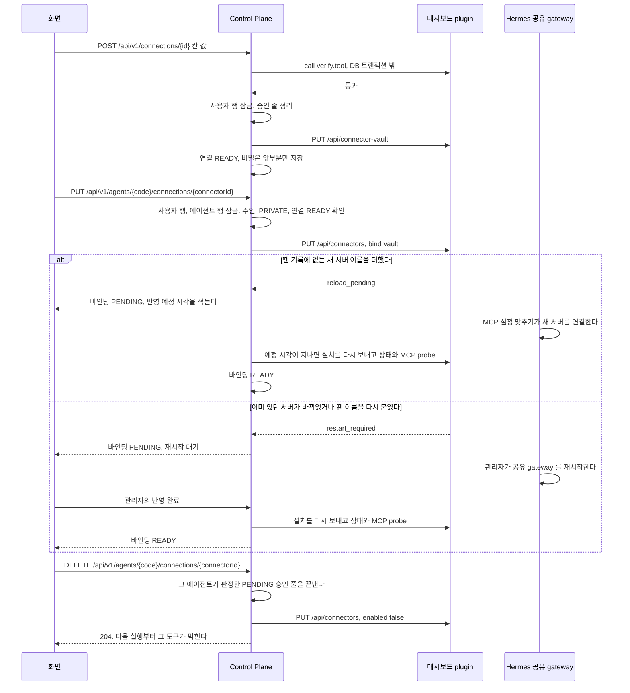

# 커넥터 연결

사용자가 커넥터에 계정을 연결하고 그 연결을 에이전트에 붙이는 기능이다.

## 요구

**커넥터는 에이전트에게 도구를 쥐어 주는 것이고, 에이전트의 역할을 넓혀 주는 것이다.**
커넥터는 따로 도는 실행 주체가 아니라 에이전트가 쓰는 외부 서비스의 MCP 도구 묶음이다([ADR-083](../adr/ADR-083-커넥터는-사용자가-한-번-연결하고-자기-에이전트에-여럿-붙여-그-에이전트가-도구를-직접-부른다.md)).

- 사용자는 「외부 서비스 연결」 화면에서 커넥터마다 계정을 한 번 연결한다. 이것이 **연결**이고 사용자와 커넥터마다 하나다
- 그 연결을 자기 에이전트의 상세에서 붙이고 뗀다. 이것이 **바인딩**이고 에이전트와 연결은 다대다다
- 붙인 에이전트는 그 커넥터의 도구를 같은 turn 에서 직접 부른다. 호출의 판정과 승인은 [커넥터 도구 정책](connector-policy.md) 이 갖는다
- 붙이고 떼는 사람은 그 에이전트의 주인이고 자기 연결만 붙인다. 관리자도 남의 에이전트에 붙이거나 떼지 못하고 반영 완료만 누른다
- 어떤 커넥터가 있고 무엇을 입력받는지는 plugin 의 `connector.json` 이 선언하고, Control Plane 은 서비스 이름과 주소를 모른다([ADR-043](../../backend/docs/adr/ADR-043-커넥터는-plugin-의-connector-json-으로-선언하고-control-plane-은-범용-흐름만-갖는다.md))
- 임의 plugin 을 설치하는 화면은 없다. 연결할 수 있는 커넥터는 운영자가 대시보드 plugin 에 준 목록뿐이다
- 이 저장소가 갖는 범용 커넥터는 `hermes/connectors/` 에 있다([ADR-064](../../hermes/docs/adr/ADR-064-범용-커넥터는-이-저장소의-hermes-connectors-에-두고-저장소가-유지보수한다.md)). 만드는 방법과 칸은 [커넥터 만들기](../../hermes/connectors/README.md) 가, 도구 목록은 커넥터마다의 `connector.json` 이 갖는다

충족은 두 상태로 관측한다.

| 상태 | `READY` 의 뜻 |
| --- | --- |
| 연결 | 등록이나 연결 확인에서 확인 도구가 통과했다. 값이 확인돼 쓸 수 있는가만 뜻한다 |
| 바인딩 | 그 에이전트의 profile 에 바인딩 방식으로 설치가 켜져 있고 configured 이며, `policy_hook` 이 참이고, MCP probe 가 도구를 냈고, 재시작 대기도 반영 예정도 아니다. probe 는 공유 gateway 의 실제 실행 확인을 대신하지 않는다 |

커넥터 도구는 연결과 바인딩이 모두 `READY` 일 때만 판정을 통과한다.
바인딩 상태는 에이전트를 켜거나 끄지 않으므로 그 에이전트의 다른 도구는 그대로 돈다. 예외는 「옛 커넥터 에이전트」 다.

### 화면

에이전트 상세의 「이 에이전트가 쓰는 연결」 절은 `components/agent/agent-connections-section.tsx` 가 그린다. 주인에게만 보인다.
계정 연결은 이 절이 하지 않는다. 절 머리의 「외부 서비스 연결하기」 가 `/connections?agent=<번호>` 로 이 에이전트를 실어 연결 화면을 연다.

| 때 | 보이는 것 |
| --- | --- |
| 연결 목록을 읽지 못했다 | 절 안에 실패 문구만 그린다 |
| 내 연결이 하나도 없다 | 서비스 계정을 연결하면 이 에이전트에 바로 붙일 수 있다는 안내 |
| 붙일 수 있다 | 연결마다 「붙이기」 나 「떼기」. 붙었고 바인딩이 `READY` 이며 재시작 대기가 아니면 「붙음」, 아니면 「반영 대기」 |
| 연결이 아직 준비되지 않았다 | 「붙이기」 없이 연결 화면에서 연결을 확인하라는 안내 |
| 그룹에 공개된 에이전트다 | 「붙이기」 와 「외부 서비스 연결하기」 없이 비공개 에이전트에만 붙일 수 있다는 안내. 비공개로 되돌리면 다시 붙일 수 있다 |
| 옛 커넥터 에이전트다 | 성격 자리에 쓰던 에이전트에 연결을 붙인 뒤 이 에이전트를 지우라는 안내. 도구, 연결, 스킬, 먼저 살펴보기 절을 그리지 않고 공개와 삭제 절은 삭제만 남긴다 |
| 커넥터에 스킬이 있는데 `skills` 도구가 꺼져 있다 | 지침을 쓰려면 스킬 도구를 켜라는 안내. 붙이기는 `skills` 를 켜지 않는다([ADR-029](../../backend/docs/adr/ADR-029-에이전트-도구는-control-plane-이-등급으로-판정하고-hermes-설정-api-로-쓴다.md)) |

「붙이기」 는 확인 창을 거친다. 실패하면 창이 남아 까닭을 보인다.
확인 창은 격리를 적용하지 않은 에이전트가 터미널이나 파일 도구로 연결의 비밀값에 닿을 수 있다고 늘 알린다.
셸, 파일, 코드 실행 도구가 켜져 있으면 승인 없이 그 서비스를 부를 수 있고, 격리한 에이전트도 연결 도구로 읽은 내용을 인터넷으로 보낼 수 있다는 경고를 더한다.
화면은 그 profile 에 실행 공간 격리([ADR-086](../adr/ADR-086-셸과-파일-도구는-사용자별-docker-실행-공간에서만-돈다.md))가 적용됐는지 모른다. 그래서 두 경우를 함께 알린다.
도구 절도 연결이 붙은 에이전트에서 그 도구를 켤 때 같은 경고를 더한다.
「바인딩」 은 화면에 보이지 않는다. 「붙이기」, 「떼기」, 「이 에이전트가 쓰는 연결」, 「반영 대기」 라 쓴다.

**「외부 서비스 연결」 화면**은 계정 연결을 맡는다. 떼기는 에이전트 화면에서 한다.

- 목록은 연결한 서비스를 먼저, 연결할 수 있는 서비스를 다음에 보인다. 준비 중인 연결도 연결한 서비스에 두고, 빈 구역은 그리지 않는다
- 연결한 카드에는 붙인 에이전트 수를 보인다. 지금 쓸 수 있는 커넥터가 연결됐는데 쓰는 에이전트가 없으면 눌러서 쓸 에이전트를 고르라고 안내한다
- 연결 하나의 화면은 붙인 에이전트마다 상세로 가는 링크와 반영 대기 표시를 보인다
- 「연결 다시 확인」 은 쓸 수 있는 서비스의 준비 중인 연결과 연결된 계정 모두에 보인다. 실패하면 오류를 보이고 상태는 서버 응답을 따른다
- 연결 확인이 `CONNECTOR_NOT_CONNECTED` 로 끝나면 값을 다시 입력하라고 안내하고 연결을 다시 읽는다. 서버가 연결을 `PENDING` 으로 커밋했기 때문이다
- 운영 목록에서 빠진 커넥터의 기존 연결은 「쓸 수 없음」 으로 보이고 해제만 된다
- 목록 화면이 `?agent=<번호>` 로 열리면 보던 에이전트에서 쓸 서비스를 고르라고 안내하고, 카드 링크가 그 번호를 연결 하나의 화면으로 넘긴다

연결 화면의 「묻지 않고 실행하는 동작」 은 상시 허락을 읽은 결과만 보인다. 이 연결의 허락이 없으면 그 절을 그리지 않는다.
허락을 읽지 못하면 앞서 보이던 허락을 지우고 「다시 확인」 을 보인다. 해제나 다시 등록 뒤에 다시 읽을 때도 같다. 해제가 서버에서 허락을 거뒀는데 화면에 옛 허락이 남지 않게 한다.
읽지 못했다고 허락을 거두는 요청을 보내지 않는다.

관리자 패널은 바인딩마다 사용자, 커넥터, 에이전트 번호, 상태를 보이고, 재시작 대기 바인딩과 `PENDING` 바인딩에 「반영 완료」 를 둔다.
재시작 대기면 공유 gateway 를 재시작한 뒤 누르라고, 아니면 몇 분이 지나도 남아 있을 때 눌러 다시 확인하라고 안내한다.
`PENDING` 에도 단추를 두는 것은 Control Plane 의 반영 예정 확인이 한 번 실패하면 바인딩이 `PENDING` 으로 남기 때문이다.
성공하든 거절되든 목록을 다시 읽는다.

### 연결 뒤 에이전트 고르기

`components/connector/connector-agent-chooser.tsx` 가 연결 하나의 화면 맨 위에 그린다.
연결한 뒤 무엇을 할지 모르는 일이 없게, 연결을 마친 같은 자리에서 그 연결을 쓸 에이전트를 고르고 바로 붙인다.

| 보이는 때 | 제목 |
| --- | --- |
| 등록이나 「연결 다시 확인」 으로 연결이 처음 `READY` 가 됐다. 제목에 초점을 옮긴다 | 연결이 끝났다는 제목 |
| 연결됐고 쓰는 에이전트가 없다. 또는 `?agent=<번호>` 의 에이전트에 아직 붙지 않았다 | 이 서비스를 쓸 에이전트 |
| 「붙인 에이전트」 의 「쓸 에이전트 고르기」 나 「다른 에이전트에도 붙이기」 를 눌렀다 | 같다 |

- 후보는 내 에이전트 가운데 옛 커넥터 에이전트를 뺀 것이다. 순서는 `?agent=` 의 에이전트, 붙일 수 있는 것, 이미 붙은 것, 그룹 공개 순서다
- 그룹 공개 에이전트는 단추 대신 나만 쓰는 에이전트로 바꾸면 붙일 수 있다고 안내한다
- 붙일 수 있는 에이전트가 없으면 「에이전트 만들기」(`/agents?new=1`)를 둔다. 「나중에」 는 영역을 닫는다
- 「이 에이전트에서 쓰기」 는 그 에이전트의 도구를 먼저 읽는다. 셸, 파일, 코드 실행 도구가 켜졌거나 도구를 읽지 못했으면 에이전트 화면과 같은 확인 창을 거치고, 아니면 바로 붙인다
- 붙이기가 실패해도 서버에 바인딩이 남았을 수 있어 붙인 에이전트 목록을 다시 읽는다
- 붙이면 언제 쓸 수 있는지(바로, 몇 분 안에, 관리자가 반영을 확인하면)를 함께 보이고, 「대화하기」 가 `/?agent=<번호>` 로 그 에이전트를 고른 새 대화를 연다

## 흐름

등록, 붙이기, 반영, 떼기의 정상 흐름이다. 대화 turn 안에서 붙은 도구를 부르는 흐름은 [커넥터 도구 정책](connector-policy.md) 의 「도구 호출 판정」 이 갖는다.

- 뗀 기록에 없는 새 이름을 더한 붙이기는 공유 gateway 를 재시작하지 않는다. Control Plane 이 반영 예정 시각이 지나면 스스로 확인한다([ADR-20261007 / connector-live-reload](../adr/ADR-20261007-connector-live-reload.md))
- 관리자 반영 완료는 재시작 대기인 바인딩과, 스스로 확인하다 `PENDING` 으로 남은 바인딩에 쓴다
- 바인딩이 `READY` 가 되기 전의 호출은 판정이 `NOT_READY` 로 막는다. 그 에이전트의 다른 도구는 그대로 돈다

## 설치와 실패 처리

연결은 에이전트를 만들지 않는다([ADR-083](../adr/ADR-083-커넥터는-사용자가-한-번-연결하고-자기-에이전트에-여럿-붙여-그-에이전트가-도구를-직접-부른다.md)).
연결의 등록, 확인, 해제는 값의 원본인 보관 파일을 다루고, 에이전트에 닿는 것은 붙이기와 떼기가 하는 바인딩 설치다.
재시작 대기는 profile 마다 생기므로 연결이 아니라 바인딩이 갖는다.
Control Plane 은 도구 목록을 직접 쓰지 않는다. 바인딩 설치가 서버 이름을 더하고 빼며, 도구 저장과 스킬 게시는 붙은 커넥터 서버 이름을 함께 보낸다(아래 「대시보드 plugin 계약」).
코드는 `ConnectorConnectionService`, `ConnectorBindingService`, `ConnectorBindingApplier` 가 갖는다.

### 연결의 등록, 확인, 해제

선택지 조회와 확인 도구 호출은 저장하지 않으므로 사용자 행을 잠그지 않는다.
확인 도구는 자식 프로세스를 띄워 오래 걸릴 수 있어 DB 트랜잭션 밖에서 부르고, 저장할 때 다시 잠가 본다.

| 단계 | 갈리는 지점 | 처리 |
| --- | --- | --- |
| 등록 | 확인 도구가 실패한다 | 공통 어휘의 오류로 끝나고 아무것도 저장하지 않는다 |
| 등록 | 그 연결에 `EXECUTING` 인 승인 줄이 있다 | 거절한다. 까닭은 [커넥터 도구 정책](connector-policy.md) 의 「커넥터 승인」 이 갖는다 |
| 등록 | 보관 파일 쓰기가 실패한다 | 연결을 `PENDING` 으로 커밋하고 `CONNECTOR_OPERATION_FAILED` |
| 등록 | 붙은 바인딩이 있다 | 바인딩마다 설치를 다시 보낸다. 떠 있는 MCP 프로세스는 옛 값을 쥐고 있으므로 재시작 대기가 된다. 하나가 실패해도 연결은 저장하고 그 바인딩만 `PENDING` 이다 |
| 확인 | 해제된 연결이다. 확인 도구를 부르는 사이 해제된 것도 같다 | 아무것도 바꾸지 않는다 |
| 확인 | 값이 아직 보관 파일에 없는 옛 연결이다 | 옛 커넥터 에이전트의 profile 에서 `POST /api/connector-vault/import` 로 값을 옮긴다. 옮기지 못하면 확인 도구를 부르지 않고 상태를 그대로 둔다 |
| 확인 | 보관 파일에 값이 없고 옮겨 올 옛 바인딩도 없다 | 연결을 `PENDING` 으로 커밋하고 `CONNECTOR_NOT_CONNECTED`. 값을 다시 등록해야 한다. 카탈로그에서 빠진 커넥터는 다시 등록할 수 없어 오류 없이 `PENDING` 이다 |
| 확인 | 확인 도구가 실패한다 | 연결을 `PENDING` 으로 커밋하고 공통 어휘의 오류로 끝낸다. 바인딩은 건드리지 않는다 |
| 확인 | 통과한다 | 연결을 `READY` 로(카탈로그에서 빠진 커넥터는 `PENDING`) 두고 붙은 바인딩마다 「바인딩의 반영 맞추기」 를 한다. 바인딩의 외부 호출이 실패하면 그 바인딩만 `PENDING` 으로 커밋하고 `CONNECTOR_OPERATION_FAILED` |
| 해제 | 정상 | 붙은 바인딩을 모두 떼고 보관 파일을 지운다. 연결은 `DISCONNECTED` 로 두고 칸 값을 비우며, 행은 이력을 위해 남긴다 |
| 해제 | 중간에 실패한다 | 연결을 `PENDING` 으로 커밋하고 `CONNECTOR_OPERATION_FAILED`. 이미 뗀 바인딩 행은 지워진 채이고 남은 바인딩과 보관 파일에는 값이 남는다. 다시 해제하면 남은 바인딩부터 잇는다. 화면은 연결을 다시 읽어 `PENDING` 이면 다시 해제를 누르라고 안내한다 |
| 해제 | 카탈로그에서 빠진 커넥터다 | Control Plane 이 env 이름을 몰라 설치만 끈다. env 는 대시보드가 소유 기록으로 지운다 |

등록과 해제는 그 연결의 `PENDING` 승인 줄을 끝내고 상시 허락을 거둔다. 그 규칙은 「커넥터 승인」 이 갖는다.

### 붙이기와 떼기

| 붙일 때 갈리는 지점 | 결과 |
| --- | --- |
| 이미 붙어 있다 | 지금 상태를 돌려준다 |
| 읽을 수 없는 에이전트다. 읽을 수 있어도 주인이 아니다 | `AGENT_NOT_FOUND`, `FORBIDDEN` |
| 옛 커넥터 에이전트다 | `VALIDATION_FAILED` |
| 에이전트가 `PRIVATE` 가 아니다 | `AGENT_CONNECTIONS_REQUIRE_PRIVATE` |
| 내 연결이 `READY` 가 아니거나 값이 보관 파일에 없다 | `CONNECTOR_NOT_CONNECTED` |
| 커넥터가 카탈로그에 없다 | `CONNECTOR_NOT_FOUND` |
| `single_binding` 커넥터이고 그 연결이 다른 에이전트에 붙어 있다 | `CONNECTOR_SINGLE_BINDING`. 사용자 행 잠금 안에서 보므로 같은 사용자의 다른 붙이기와 겹치지 않는다([ADR-20261008 / connector-binding-guards](../adr/ADR-20261008-connector-binding-guards.md)) |
| 커넥터의 스킬 이름이 그 profile 의 스킬과 겹친다 | `SKILL_NAME_TAKEN` |
| 대시보드가 409 `sandbox_unavailable` 로 거절한다 | `AGENT_SANDBOX_UNAVAILABLE`. 아래 「바인딩 설치」 의 실행 공간 조건이다 |
| 대시보드가 그 밖의 409 로 거절한다. `fos-ctx` 가 꺼진 profile 도 여기 든다 | `CONNECTOR_BIND_CONFLICT` |
| 대시보드가 401 로 거절한다. 표식이 없는 profile 이다 | `CONNECTOR_PROFILE_NOT_READY` |
| 그 밖의 외부 실패 | 바인딩을 `PENDING` 으로 남기고 `CONNECTOR_OPERATION_FAILED`. 대시보드가 반쯤 반영했을 수 있어 다음 연결 확인이 설치를 다시 보낸다 |

대시보드가 409 나 401 로 거절하면 대시보드는 아무것도 바꾸지 않았다. 트랜잭션이 되돌려져 바인딩 행도 남지 않는다.
붙인 바인딩은 늘 `PENDING` 이다. 답의 `restart_required` 나 `plugin_updated` 가 참이면 재시작 대기로 두고 그 시각을 적는다. 둘 다 거짓이고 `reload_pending` 이 참이면 `assistant.connector.binding.apply-delay` 뒤를 반영 예정 시각으로 적는다.
그 시간을 정한 까닭은 `ConnectorBindingProperties` 의 주석과 [ADR-20261007 / connector-live-reload](../adr/ADR-20261007-connector-live-reload.md) 가 갖는다.

떼기는 이렇게 갈린다.

- 옛 커넥터 에이전트에서는 떼지 않고 `VALIDATION_FAILED` 로 거절한다. 그 에이전트를 지우면 바인딩이 함께 떨어진다
- 붙어 있지 않으면 아무것도 하지 않는다
- 그 에이전트가 판정한 `PENDING` 승인 줄을 `REJECTED`(`connection_changed`)로 끝낸다. 그 줄이 `EXECUTING` 이면 `CONNECTOR_ACTION_EXECUTING` 으로 거절한다. 상시 허락은 사용자와 커넥터에 묶여 같은 연결을 붙인 다른 에이전트에도 걸리므로 둔다
- 외부 호출이 실패하면 `CONNECTOR_OPERATION_FAILED` 로 끝나고 트랜잭션이 되돌려져 행이 남는다
- 떼기는 도구 목록에서 서버 이름을 빼므로 재시작을 기다리지 않고 다음 실행부터 그 도구가 막힌다. 떼기 전에 시작한 실행의 호출도 판정이 막는다. 까닭은 [커넥터 도구 정책](connector-policy.md) 의 「이름 대응」 이 갖는다

**연결이 붙은 에이전트는 비공개로 남는다.** 남이 주인의 계정으로 외부 서비스를 쓰지 못하게 하기 위해서다.

| 바인딩이 있는 에이전트에 | 차례 | 결과 |
| --- | --- | --- |
| 주인이 공개 범위를 바꾼다 | 에이전트 행을 기다려 잠근 뒤 바인딩을 읽는다 | `GROUP` 이면 `AGENT_CONNECTIONS_REQUIRE_PRIVATE` |
| 관리자가 고친다 | 첫 읽기가 에이전트 행 잠금이다. 경합하면 기다리지 않고 `AGENT_BUSY` | 주인을 바꾸면 `AGENT_HAS_CONNECTIONS`, `GROUP` 이면 `AGENT_CONNECTIONS_REQUIRE_PRIVATE` |
| 주인이나 관리자가 지운다 | 주인의 사용자 행, 에이전트 행 차례로 잠근다. 주인이 그 사이 바뀌었으면 `AGENT_BUSY` | 바인딩을 모두 뗀 뒤 profile 을 거둔다. 떼거나 거두다 실패하면 지우지 않고 그 오류를 돌려준다 |

사람이 만든 profile 은 지워도 거두지 않는다. 그래서 지우기가 먼저 떼지 않으면 그 profile 에 커넥터 서버와 값이 남는다.
지우는 에이전트가 옛 커넥터 에이전트이고 그 연결의 값이 아직 보관 파일에 없으면, 떼기 전에 보관 파일로 값을 옮긴다. 옮기지 못하면 지우지 않는다. 그 에이전트가 값을 가진 유일한 곳이기 때문이다.

### 바인딩의 반영 맞추기

연결 확인, 반영 예정 확인, 정의 어긋남 점검, 관리자 반영 완료가 바인딩마다 한다. 결과는 `READY` 거나 `ResyncOutcome` 의 까닭 하나와 함께 `PENDING` 이다.

다시 보내는 설치는 소유 기록의 실행 정의가 지금 manifest 와 다르다는 이유로 거절하지 않는다.
설정의 서버 정의가 소유 기록과 같을 때만 그 커넥터를 새 manifest 의 command, args, env 로 다시 설치하고, 보관 파일과 연결 값, 같은 profile 의 다른 커넥터는 유지한다.
입력 칸의 env 이름이 바뀌면 옛 env 줄을 지우고 같은 값을 새 이름에 쓴다. 새 이름이 이 바인딩이 소유하지 않은 설정과 겹치면 409 다.
운영자가 서버를 바꾸거나 지웠으면 409 다. MCP 서버 이름을 바꾸는 것은 이 재설치로 옮기지 않는다.
조회와 실행, probe 는 늘 지금 manifest 와 맞는지 보므로 재설치 전의 낡은 정의로 실행하지 않는다.

**뗀 이름을 다시 붙이면 probe 가 통과해도 재시작을 기다린다.**
`READY` 는 probe 가 새로 띄운 프로세스에서 도구를 확인했다는 뜻이고, gateway 가 쥔 연결의 정의까지 확인한 것은 아니다.
떼기와 다시 붙이기가 MCP 설정 맞추기 한 주기 안에 끝나면 gateway 는 이름이 계속 있다고 보고 옛 연결을 쓸 수 있다. 떼기 뒤에는 옛 정의와 비교할 수도 없다.

| 갈리는 지점 | 처리 |
| --- | --- |
| 재시작 대기이거나 반영 예정 시각이 아직 오지 않았다 | 연결 확인과 반영 예정 확인은 설치를 다시 보내지 않고 `PENDING` 으로 둔다. 관리자 반영 완료는 재시작이 끝났다고 보고 재시작 대기에도 보내지만, 반영 예정 시각 전이면 보내지 않는다. gateway 가 서버를 연결하기 전에 probe 만 통과해 `READY` 가 되는 것을 막는다 |
| 카탈로그에서 빠진 커넥터다 | 서버를 확인할 수 없어 다시 보내지 않고 `PENDING` |
| 바인딩의 서버 이름이 비었다 | manifest 로 채운다. 마이그레이션이 만든 옛 바인딩이 그렇다 |
| 다시 보낸 설치가 재시작이나 `reload_pending` 을 요구한다 | 그 시각으로 대기나 반영 예정을 새로 적고 멈춘다 |
| 다시 읽은 설치가 켜져 있고 configured 이며 `policy_hook` 이 참이고 바인딩 방식이며, probe 가 도구를 냈다 | `READY`. 재시작 대기와 반영 예정을 함께 비우고 선언하지 않은 도구 수를 연결에 적는다. 켜진 내장 도구는 보지 않는다. 붙인 에이전트의 도구는 주인이 정한다 |
| 외부 호출이 실패한다 | 예외로 알리지 않고 그 바인딩만 `PENDING` 으로 둔다. 부른 쪽이 실패를 모아 `CONNECTOR_OPERATION_FAILED` 로 끝낸다 |

재설치에서 어긋난 칸 이름과 실패 단계, 커넥터 id, 예외 종류만 로그에 남긴다. env 값과 경로, 비밀값, 예외 본문은 남기지 않는다.

### 반영 예정 확인

재시작 없이 반영될 바인딩 설치를 Control Plane 이 스스로 확인한다([ADR-20261007 / connector-live-reload](../adr/ADR-20261007-connector-live-reload.md)).
`ConnectorBindingApplier.applyDue` 가 `assistant.connector.binding.apply-cron` 마다 예정 시각이 지난 바인딩을 읽고, 바인딩마다 연결 사용자 행, 에이전트 행 차례로 잠근 뒤 다시 읽는다.

| 갈리는 지점 | 처리 |
| --- | --- |
| 그 사이 지워졌거나 재시작 대기가 됐거나 예정이 미뤄졌다 | 건너뛴다 |
| 연결 사용자가 없거나 에이전트가 지워졌거나 주인이 연결 사용자와 다르다 | 비운 예정만 저장하고 건너뛴다. 그대로 두면 매 주기 다시 집는다 |
| 카탈로그를 읽지 못한다 | 바인딩을 `PENDING` 으로 두고 비운 예정과 함께 커밋한다. 예외로 끝내면 트랜잭션이 되돌려져 예정이 살아난다 |
| probe 가 실패해 `PENDING` 이 된다 | 다시 부르지 않는다. 사용자의 연결 확인이나 관리자 반영 완료가 다시 맞춘다 |
| 다시 보낸 설치가 또 `reload_pending` 이다 | 반영 맞추기가 새 시각을 적는다 |
| 한 바인딩이 실패한다 | 경고 로그를 남기고 다음 바인딩으로 간다 |

이 확인은 gateway 의 연결을 직접 보지 못한다. probe 가 성공해도 gateway 쪽 연결만 실패한 경우는 첫 실제 호출의 오류로 드러난다.

### 정의 어긋남 점검

manifest 가 바뀐 뒤 설치가 다시 보내지지 않은 바인딩을 Control Plane 이 찾아 다시 맞춘다([ADR-20261009 / connector-install-drift](../adr/ADR-20261009-connector-install-drift.md)).
`ConnectorBindingApplier` 가 `assistant.connector.binding.drift-cron` 마다 `READY` 바인딩을 앞 주기가 멈춘 번호 뒤부터 `assistant.connector.binding.drift-batch` 개씩 읽는다. 배포나 커넥터 동기화 뒤 운영자가 할 일은 없다.

| 갈리는 지점 | 처리 |
| --- | --- |
| 설치 상태를 읽지 못한다 | 경고 로그를 남기고 건너뛴다 |
| 「바인딩의 반영 맞추기」 의 설치 판정을 통과한다 | 어긋나지 않았다. 연속으로 센 값을 지운다 |
| 어긋났다 | 커넥터 id 와 어긋난 조건 이름을 로그에 남기고, 반영 예정 확인과 같은 차례로 잠근 뒤 다시 맞춘다. 서버 정의가 바뀌므로 대개 재시작 대기가 된다 |
| 잠근 뒤 다시 읽으니 지워졌거나 `READY` 가 아니다 | 건너뛴다 |
| 다시 맞춰 `READY` 가 된 뒤 또 어긋나기를 연속 상한만큼 되풀이했다 | 설치를 보내지 않고 `PENDING` 으로만 두고 알린다. 상한은 `ConnectorBindingApplier` 가 갖는다 |
| 다시 맞춘 바인딩이 재시작 대기나 `PENDING` 으로 남았다 | 연결 주인의 그룹 관리자마다 `CONNECTOR_REINSTALLED` 알림 한 건. 재시작 대기가 있으면 재시작 뒤 반영 완료를, 아니면 반영 완료로 다시 확인하라고 쓴다. 반영 예정 시각을 적은 바인딩은 반영 예정 확인이 맡으므로 세지 않는다 |

다시 맞춘 바인딩은 `READY` 가 아니어서 다음 주기의 대상이 아니다. 그래서 같은 어긋남에 설치를 되풀이해 보내지 않는다.
점검 위치와 연속 횟수는 JVM 메모리에 둔다. Control Plane 이 한 대라는 전제다.

### 관리자 반영 완료

재시작 대기인 바인딩에 필요하다. 값 교체처럼 이미 있던 서버가 바뀐 설치와 `fos-ctx` 갱신이 그렇다.
반영 예정 확인이 실패해 남았거나 정의 어긋남 점검이 `PENDING` 으로 둔 바인딩도 관리자가 눌러 다시 확인한다.

에이전트 번호와 주인은 트랜잭션 밖에서 읽는다. 트랜잭션의 첫 읽기가 잠금이어야 MySQL 의 REPEATABLE READ 에서 등록이 커밋한 재시작 시각을 보기 때문이다.
그 뒤 주인의 사용자 행, 에이전트 행을 붙이기와 같은 차례로 잠근다.

| 갈리는 지점 | 결과 |
| --- | --- |
| 잠근 뒤 그 에이전트의 주인이 바뀌었다 | `AGENT_BUSY` |
| 지금 주인이 관리자와 같은 그룹이 아니다 | `AGENT_NOT_FOUND`. 403 과 404 가 갈리면 다른 그룹의 에이전트 코드가 있는지 드러난다 |
| 바인딩의 재시작 시각이 본문의 `restartRequiredSince` 보다 늦거나 본문이 비었다 | `CONNECTOR_RESTART_AGAIN`. 관리자가 목록을 본 뒤에 다시 설치돼 재시작한 gateway 가 아직 보지 못했을 수 있다 |
| 바인딩에 재시작 시각이 없다 | 본문을 보지 않는다. 재시작이 필요 없던 바인딩의 다시 확인이다 |
| 반영 맞추기 뒤에도 `READY` 가 아니다 | 바인딩 상태를 커밋한 뒤 까닭별 오류로 끝낸다. 외부 호출 실패만 `CONNECTOR_OPERATION_FAILED` 이고, 대응은 `ConnectorErrors.notApplied` 가 갖는다 |

### 동시 요청과 잠금

- 같은 사용자의 등록, 확인, 해제, 붙이기, 떼기, 승인은 사용자 행 잠금으로 순서대로 처리한다. 그래서 승인이 본 바인딩은 커밋할 때까지 떼어지지 않는다
- 붙이기, 떼기, 관리자 반영 완료, 반영 예정 확인, 지우기는 사용자 행을 먼저, 에이전트 행을 다음에 잠근다. 공개 범위 변경과 관리자 수정도 같은 에이전트 행을 잠그므로, 동시에 와도 한쪽이 다른 쪽의 커밋을 보고 판정한다
- 바인딩의 `desired_enabled` 는 이번 설치가 끝까지 성공해 활성화 후보가 되었는지를 뜻한다. 설치를 보내기 전에 거짓으로 두고 성공한 뒤에만 참으로 둔다
- 외부 호출이 실패하면 `PENDING` 을 커밋한다. 이전 값으로 실행할 수 있는 상태로 되돌리지 않는다
- DB 커밋 자체가 실패하면 이미 반영한 보관 파일이나 설치는 되돌리지 못한다. 다시 등록하거나 연결 확인을 눌러 상태를 맞춘다
- 지우기가 profile 에서 뗀 뒤 행 삭제가 실패해 되돌려지면 행은 남고 profile 에서는 떼어진 상태다. 다음 연결 확인이 설치가 configured 가 아닌 것을 보고 그 바인딩을 `PENDING` 으로 둔다

### 재시작

이미 떠 있는 MCP 프로세스는 env 파일이 바뀌어도 옛 값을 쓴다.
어느 설치가 `restart_required`, `plugin_updated`, `reload_pending` 을 돌려받는지는 [`hermes/plugins/dashboard-profile-api/README.md`](../../hermes/plugins/dashboard-profile-api/README.md) 의 두 설치 표가 갖는다.
profile 하나의 MCP 를 다시 붙이는 다른 경로를 쓰지 않는 까닭은 [ADR-20261007 / connector-live-reload](../adr/ADR-20261007-connector-live-reload.md) 의 「대안 기각」 이 갖는다.

- 공유 gateway 재시작은 사용자 요청에서 실행하지 않는다
- 저장된 대기 값과 설치 응답의 `restart_required`, `plugin_updated` 는 논리 OR 로 누적한다. 도중 호출이 실패해도 앞선 참을 보존한다
- 토큰 폐기는 사용자가 그 서비스에서 한다. 폐기하면 다음 요청부터 거절되므로 재시작을 기다리지 않고 외부 접근을 막을 수 있다
- 배포한 뒤 확인할 것은 [도구 hook 과 승인](../../hermes/docs/hermes-contract.md) 의 「배포한 뒤 확인할 것」 에 모았다

## 대시보드 plugin 계약

Control Plane 이 대시보드 plugin(`hermes/plugins/dashboard-profile-api`)의 커넥터 경로에 기대는 약속이다.
경로마다의 요청과 응답, 두 설치 방식의 차이, 표식은 [`hermes/plugins/dashboard-profile-api/README.md`](../../hermes/plugins/dashboard-profile-api/README.md) 의 「dashboard-profile-api 가 여는 것」 과 그 아래 「커넥터」 가 갖는다. 카탈로그를 읽는 쪽은 `HttpHermesConnectorClient` 다.

설치는 두 가지다. 커넥터마다 만든 전용 profile 에 하는 **옛 설치**와, 일반 에이전트의 profile 에 연결을 붙이는 **바인딩 설치**다([ADR-083](../adr/ADR-083-커넥터는-사용자가-한-번-연결하고-자기-에이전트에-여럿-붙여-그-에이전트가-도구를-직접-부른다.md)).
`PUT /api/connectors` 는 본문에 `bind` 칸이 없으면 옛 설치를 한다. 그래서 새 칸을 모르는 옛 Control Plane 과 함께 돈다.

- `call` 은 `options.tool` 과 `verify.tool` 만 받고 디스크에 쓰지 않는다. 칸 값은 본문의 `values` 나 보관 파일 가운데 정확히 하나에서 온다
- `call` 의 시간 제한과 동시 한도는 `CONNECTOR_CALL_TIMEOUT_SECONDS`, `CONNECTOR_CALL_LIMIT` 이다. 넘거나 차 있으면 기다리지 않고 `unavailable` 이다
- Control Plane 은 카탈로그의 `fields[].env` 로 `PUT /api/env` 의 key 를 정한다. env 이름은 Control Plane 의 응답에 담지 않는다
- 카탈로그의 `icon` 과 `link` 는 Control Plane 이 [커넥터 만들기](../../hermes/connectors/README.md) 의 「아이콘과 링크」 규칙으로 다시 검사하고, 어긋난 칸만 null 로 읽는다
- 카탈로그의 `single_binding` 이 없으면 거짓으로 읽고, boolean 이 아니면 `attachments` 와 같이 카탈로그 읽기를 실패로 다룬다
- 운영 목록에서 빠진 커넥터도 그 profile 에 소유 기록이 남아 있으면 `enabled: false` 를 받고 그 기록이 참조하던 env 를 지운다. 소유 기록도 없으면 끌 것이 없어 `changed: false` 로 성공한다. 카탈로그에서 빠진 연결의 해제와 반영 완료가 끝까지 가게 하기 위해서다
- `GET /api/connectors` 는 설치하지 않은 커넥터를 `isolated` 로 답하므로 `mode` 는 설치한 항목의 값만 읽는다. 목록에 없는 커넥터는 설치 안 됨으로 읽는다
- 커넥터 표식만 있는 profile 의 떼기는 소유 기록에 그 항목이 없어도 `changed: false` 로 답한다. 다시 보낸 떼기가 401 로 실패하면 Control Plane 의 바인딩 행이 지워지지 않기 때문이다

**도구 목록은 설치와 Control Plane 의 도구 저장이 나눠 쓴다.**
토큰으로 부른 `PUT /api/config` 가 `platform_toolsets` 를 보내면, 소유 기록의 바인딩 항목이 설치한 서버 이름이 요청의 `api_server` 목록에 모두 있어야 한다. 하나라도 빠지면 409 다.
Hermes 처리기가 목록을 통째로 바꾸므로 조용히 지워지는 길을 남기지 않는다.
그래서 Control Plane 의 도구 저장과 스킬 게시는 붙은 커넥터 서버 이름을 함께 보낸다. 스킬 경로만 쓰는 요청과 옛 설치 profile 은 이 검사를 하지 않는다.

### 바인딩 설치

`PUT /api/connectors` 의 본문에 `bind: {vault}` 를 더하면 그 보관 파일의 값으로 그 profile 에 커넥터를 붙인다.
그 profile 의 Control Plane MCP 등록, 다른 도구 이름, `SOUL.md` 는 건드리지 않는다.

받는 profile 의 조건이다. 하나라도 어기면 409 이고 파일이 하나도 바뀌지 않는다. 표식이 없으면 401 이다.

- `platform_toolsets.api_server` 목록이 있고 그 안에 Control Plane MCP 가 있다. 목록이 없는 profile 에 이름 하나만 든 목록을 만들면 내장 도구와 Control Plane MCP 가 모두 닫히고, MCP 이름이 없던 목록에 이름을 더하면 운영자의 다른 MCP 서버가 막히기 때문이다
- `fos-ctx` 가 켜져 있다. 설치는 plugin 파일만 맞추고 profile 의 plugin 설정은 쓰지 않으므로, 꺼진 profile 에 붙이면 도구 호출이 판정 없이 나간다. 이 조건은 새로 붙일 때만 본다. 이미 붙은 커넥터의 재설치는 받고, 그 바인딩은 `policy_hook` 이 거짓이라 `PENDING` 에 남는다
- 옛 설치 항목이 없다. 반대로 바인딩 항목이나 뗀 서버 기록이 있는 profile 은 옛 설치를 받지 않는다
- 커넥터의 env 이름, 서버 이름, 스킬 디렉터리가 그 커넥터의 소유 기록 없이 이미 있거나 다른 것과 겹치지 않는다
- manifest 가 `sandbox_required` 를 선언했으면 그 profile 이 실행 공간 정책에 있다. 아니면 409 `sandbox_unavailable` 이다. 다시 설치할 때도 보므로 정책에서 빠진 profile 의 바인딩은 그때 `PENDING` 이 된다([ADR-20261008 / connector-binding-guards](../adr/ADR-20261008-connector-binding-guards.md))

보관 파일의 키 가운데 지금 칸 선언에 없는 것은 버린다. 칸을 뺀 커넥터의 옛 연결도 연결 확인으로 다시 설치되게 하려는 것이다. 남은 값이 칸 선언과 맞지 않으면 400 이다.

Control Plane 은 바인딩 설치 요청에 그 에이전트의 `sandbox_owner` 를 늘 싣는다. 재설치도 같다.
보내기 전에 그 주인의 첨부 디렉터리를 최선 노력으로 만들고, 만들지 못해도 요청을 보낸다. 첨부를 선언하지 않은 커넥터의 붙이기가 첨부 루트 문제로 막히지 않게 하려는 것이다.
manifest 가 선언한 주인 env 는 plugin 이 서버 정의에 직접 넣는다.

| 선언 | 넣는 값 | 갈리는 지점 |
| --- | --- | --- |
| `owner_attachments_env` | 그 주인의 첨부 디렉터리([ADR-20261007 / connector-owner-attachments](../adr/ADR-20261007-connector-owner-attachments.md)) | 정책이 없거나 디렉터리를 중간 링크 없이 확인하지 못하면 409 `sandbox_unavailable` 이고 붙이기는 `AGENT_SANDBOX_UNAVAILABLE` 이다 |
| `owner_output_env` | 그 profile 과 커넥터의 출력 디렉터리([ADR-20261008 / connector-output-files](../../hermes/docs/adr/ADR-20261008-connector-output-files.md)) | 만들 수 없으면 빈 값을 넣고 붙이기는 그대로 한다. 커넥터는 파일 출력만 거절한다. 떼면 그 디렉터리를 지운다 |
| `owner_browser_env` | 그 바인딩의 표식을 실은 중계 주소([ADR-20261008 / browser-gateway-token](../../backend/docs/adr/ADR-20261008-browser-gateway-token.md)) | 중계가 꺼졌으면 빈 값이다. 같은 바인딩은 늘 같은 주소를 받으므로 재설치가 서버 정의를 바꾸지 않아 `restart_required` 가 참이 되지 않는다 |

붙이고 뗄 때의 파일 변경에서 지켜야 하는 것이다.

- 붙이기는 한 묶음으로 쓰고 실패하면 이 요청이 쓴 파일만 되돌린다. 쓰기 전에 설정, 소유 기록, 이름 대응 파일, 뗀 서버 기록을 떠 두되 `.env` 와 스킬 파일은 떠 두지 않는다
- 스킬은 plugin 의 스킬 디렉터리를 그 profile 의 `skills/` 로 복사한다. 앞머리가 환경 값이나 자격 증명 파일을 요청하는 스킬이 있으면 그 커넥터를 카탈로그에 내지 않는다([ADR-086](../adr/ADR-086-셸과-파일-도구는-사용자별-docker-실행-공간에서만-돈다.md))
- 떼기는 소유 기록을 지금 manifest 와 견주지 않고 형식만 본다. 운영자가 실행 정의를 바꾼 뒤에도 떼어야 `.env` 에 비밀이 남지 않는다. 기본 key 는 지우지 않는다
- 떼기는 서버를 이름 대응에서 빼지 않고 뗀 서버 기록에 남긴다. 까닭은 [커넥터 도구 정책](connector-policy.md) 의 「이름 대응」 이 갖는다
- 서버 정의나 이름 대응이 지금 manifest 와 어긋난 바인딩 항목은 그 항목만 `configured: false` 이고 `policy_hook` 을 거짓으로 만들지 않는다. 같은 profile 의 다른 커넥터는 붙이기, probe, 실행이 그대로 된다([ADR-20261009 / connector-install-drift](../adr/ADR-20261009-connector-install-drift.md))

### 보관 파일

연결의 칸 값의 원본은 대시보드 plugin 이 연결마다 하나씩 두는 보관 파일이다.
Control Plane DB 에는 비밀이 아닌 칸 값과 비밀 칸의 앞부분만 둔다.
경로와 형식, 세 경로(`PUT`, `DELETE`, `POST .../import`)의 검사는 [`hermes/plugins/dashboard-profile-api/README.md`](../../hermes/plugins/dashboard-profile-api/README.md) 의 「커넥터」 가 갖는다.
바인딩 설치도 같은 profile 쓰기 잠금 안에서 보관 파일을 읽으므로 그 사이에 값이 바뀌지 않는다.

## 옛 커넥터 에이전트

바인딩이 생기기 전에는 연결을 처음 등록할 때 커넥터마다 전용 profile 과 비공개 에이전트를 만들었다([ADR-039](../../backend/docs/adr/ADR-039-외부-서비스-연결은-사용자별-전용-에이전트로-실행한다.md)). `agent.connector_managed` 가 참인 에이전트다.
이제 새로 만들지 않는다. 마이그레이션이 해제되지 않은 옛 연결마다 그 에이전트와의 바인딩을 만들었으므로, 옛 에이전트도 바인딩 하나로 읽힌다.
이미 있는 것은 사용자가 옮긴 뒤 지울 때까지 아래 규칙으로 돈다.

- 일반 편집 경로로 공개 범위, 주인, 도구, 성격, 스킬을 바꾸지 못한다. 다른 연결을 붙이지 못하고 자기 연결을 떼지 못한다
- 사용자당 에이전트 상한 계산에서 빠진다
- 그 바인딩만 에이전트를 켜고 끈다. `READY` 가 되면 켜고, `PENDING` 이 되면 끄고 사진 받기를 내린다
- 값을 바꾸면 보관 파일과 함께 그 profile 의 `.env` 에 칸마다 직접 쓴다. 해제는 칸마다 지운 뒤 설치를 끄고 에이전트를 끈다
- 연결 확인과 관리자 반영 완료는 설치가 꺼져 있거나 `desired_enabled` 가 거짓이면 다시 보내지 않는다. 옛 설치는 늘 `restart_required: true` 로 답하므로 `plugin_updated` 가 참일 때만 재시작 대기로 둔다. 켜진 내장 도구가 manifest 의 `toolsets` 와 같아야 `READY` 다
- 닿는 범위는 [ADR-045](../../backend/docs/adr/ADR-045-커넥터-에이전트는-자기-mcp-서버만-받고-memory-와-control-plane-도구를-받지-않는다.md) 가 갖는다. 연결을 붙인 일반 에이전트에는 이 경계가 걸리지 않고, 그 에이전트가 감당하는 것은 ADR-083 의 「감당할 것」 에 있다
- 위임 결과를 `<external-data>` 로 감싸는 규칙은 [`docs/features/agent-skill.md`](agent-skill.md) 의 「위임 결과가 도착했을 때」 가 갖는다
- `mcp_servers` 의 Control Plane MCP 등록 제거는 이미 떠 있는 gateway 에 재시작 전까지 남을 수 있다. 그동안에도 도구 목록이 그 서버를 막고 Control Plane 이 호출을 거절한다

옛 설치는 plugin 의 스킬 본문을 그 profile 의 `SOUL.md` 에 쓴다. `skills` toolset 은 스킬을 고치는 도구까지 열기 때문이다([ADR-039](../../backend/docs/adr/ADR-039-외부-서비스-연결은-사용자별-전용-에이전트로-실행한다.md)).

- 스킬 디렉터리 바로 아래 항목이나 `SKILL.md` 가 심볼릭 링크이거나, 앞머리가 닫히지 않았거나, 합친 본문이 Control Plane 의 성격 본문 상한을 넘으면 그 커넥터를 카탈로그에 내지 않는다. 링크가 plugin 밖을 가리키면 그 내용이 지침으로 들어가기 때문이다. 카탈로그를 읽을 때 모든 커넥터에 이 본문을 계산하므로 바인딩으로도 나오지 않는다
- 대시보드는 옛 설치 profile 과 다른 관리 profile 을 구분하지 못한다. Control Plane 이 옛 커넥터 에이전트의 profile 에만 옛 설치를 보낸다
- 해제는 `SOUL.md` 를 지우지 않는다. 본문은 카탈로그 응답과 로그에 싣지 않는다

**사진**은 manifest 의 `attachments` 가 참이고 그 바인딩이 `READY` 로 확인됐을 때만 받는다.
Control Plane 은 선언한 toolset 이 실제로 켜진 것을 본 뒤에만 `agent.connector_attachments` 를 참으로 두고, `Agent.acceptsAttachments` 가 그 열을 본다. 사진 단추는 있는데 이미지 도구가 없는 상태를 만들지 않기 위해서다.
옛 설치와 재설치 요청은 `sandbox_owner` 를 싣고, 그 주인의 첨부 디렉터리를 만들 수 없거나 링크이면 보내지 않고 409 로 멈춘다. 실패는 `PENDING` 과 `CONNECTOR_OPERATION_FAILED` 로 남는다.
사용자별 mount 는 [사진 첨부](attachment.md) 와 [ADR-091](../adr/ADR-091-사진-첨부는-사용자별로-저장하고-실행-공간에는-그-사용자만-붙인다.md) 이 갖는다.
연결을 붙인 에이전트의 사진 받기와 내장 도구는 그 에이전트의 설정이 정하고, manifest 의 `toolsets` 와 `attachments` 를 적용하지 않는다.

### 옮겨 가기

사용자마다 연결마다 한다. 끊김이 없고, 옛 에이전트를 지우기 전까지 되돌릴 수 있다.

1. 「외부 서비스 연결」 화면에서 연결 확인을 누른다. 옛 에이전트의 profile 에 있던 값이 보관 파일로 옮겨진다. 이 확인은 옛 profile 에 설치를 다시 보내므로, 그 profile 의 `fos-ctx` 가 묶음과 다르면 옛 에이전트가 재시작 대기로 꺼진다. 3단계의 재시작과 함께 하면 한 번으로 끝난다
2. 원래 쓰던 에이전트의 상세에서 그 연결을 붙인다
3. 바인딩이 재시작 대기면 관리자가 공유 gateway 를 재시작하고 반영 완료를 누른다
4. 그 에이전트로 커넥터 도구를 한 번 불러 본다. 쓰기 도구는 승인 카드가 뜨는지 본다
5. 옛 에이전트를 지운다. 지우기가 그 바인딩을 떼고 profile 을 거둔다

5 전에는 새 바인딩을 떼면 옛 에이전트로 그대로 쓴다. 5 뒤에는 다시 붙이면 된다. 값은 보관 파일에 남아 있다.
먼저 살펴보기를 쓰는 분야는 그 분야 패키지의 `proactive-check` 스킬을 붙은 커넥터 도구가 있으면 직접 부르고 없으면 옛 연결 에이전트에 맡기도록 먼저 고친 뒤 옮긴다([`docs/features/proactive.md`](proactive.md)).
모든 옛 에이전트가 지워지면 격리 경로의 코드와 `connector_connection` 의 쓰지 않는 칸을 지운다.

## MCP SDK 계약

대시보드 plugin 의 `call` 은 공식 `mcp` Python SDK 로 커넥터 서버를 부른다. plugin 은 SDK 를 스스로 설치하지 않고 Hermes 가 설치한 버전을 쓴다.

- **지원 범위는 `mcp>=2.0,<3` 이다.** 검사는 `mcp==2.0.0` 으로 돈다
- plugin 이 기대는 이름은 `mcp.ClientSession`, `mcp.StdioServerParameters`, `mcp.client.stdio.stdio_client`, `ToolAnnotations.read_only_hint`, `CallToolResult.structured_content`, `CallToolResult.is_error`, `CallToolResult.content` 다
- 1.x 는 이 속성을 `readOnlyHint`, `structuredContent`, `isError` 로 둔다. 1.x 에서 `is_error` 를 기본값으로 읽으면 도구 오류가 성공으로 읽힌다. 그래서 plugin 은 속성을 직접 읽고, 이름이 없으면 실패한다
- plugin 은 올라올 때와 `call` 마다 SDK 버전과 위 속성을 확인한다. 범위 밖이거나 속성이 없으면 자식을 띄우지 않고 `unavailable` 로 답하며, 버전과 까닭을 운영 로그 한 줄로 남긴다
- `call` 이 예외로 실패하면 묶음 예외(`ExceptionGroup`)를 풀어 가장 안쪽 예외의 종류와 SDK 버전을 로그에 남긴다. 예외 본문과 칸 값은 남기지 않는다
- Hermes 는 `mcp` 를 정확한 버전 하나로 고정하므로 이 값은 Hermes 이미지를 올릴 때만 바뀐다. 올릴 때 확인할 것은 [버전 변경과 실측](../../hermes/docs/hermes-contract.md) 에 있다

## 커넥터 연결 API

경로와 요청, 응답 칸은 `ConnectorConnectionController`, `AgentConnectionController`, `ConnectorConnectionAdminController`, `AdminAgentConnectionController` 와 `ConnectionDtos` 가 갖는다.
아래는 화면이 기대는 약속이다.

- 응답에는 env 이름, 보관 파일 이름, 서버 이름을 담지 않는다. 비밀 칸은 앞부분만 담는다. 관리자 목록에는 다른 사용자의 칸 값과 비밀 앞부분을 넣지 않는다
- 카탈로그에서 빠졌지만 내 연결이 `DISCONNECTED` 가 아닌 커넥터는 `available: false` 와 빈 칸으로 함께 낸다. 화면이 해제하러 들어갈 길을 남기기 위해서다. 모르는 `id` 는 `CONNECTOR_NOT_FOUND` 다
- `values` 의 키, 필수 칸, `pattern`, 길이는 외부에 반영하기 전에 검사하고 어기면 `VALIDATION_FAILED` 다
- 선택지 조회와 확인은 후보 값을 저장하지 않고 응답에 되돌려 담지 않는다
- 선택지 조회, 등록, 연결 확인은 사용자별 호출 제한을 먼저 지난다. [커넥터 도구 정책](connector-policy.md) 의 「사용자별 호출 제한」 이 갖는다
- 에이전트의 연결 목록은 그 에이전트의 주인만 읽는다. 해제한 연결은 빠지고, 붙일 수 없는 까닭은 `blockedReason` 이 `AgentConnectionsView` 의 값으로 준다
- 바인딩마다 재시작 대기가 있다. 연결 상태 응답의 `bindings[]` 와 관리자 목록이 바인딩 상태와 재시작 대기를 함께 낸다
