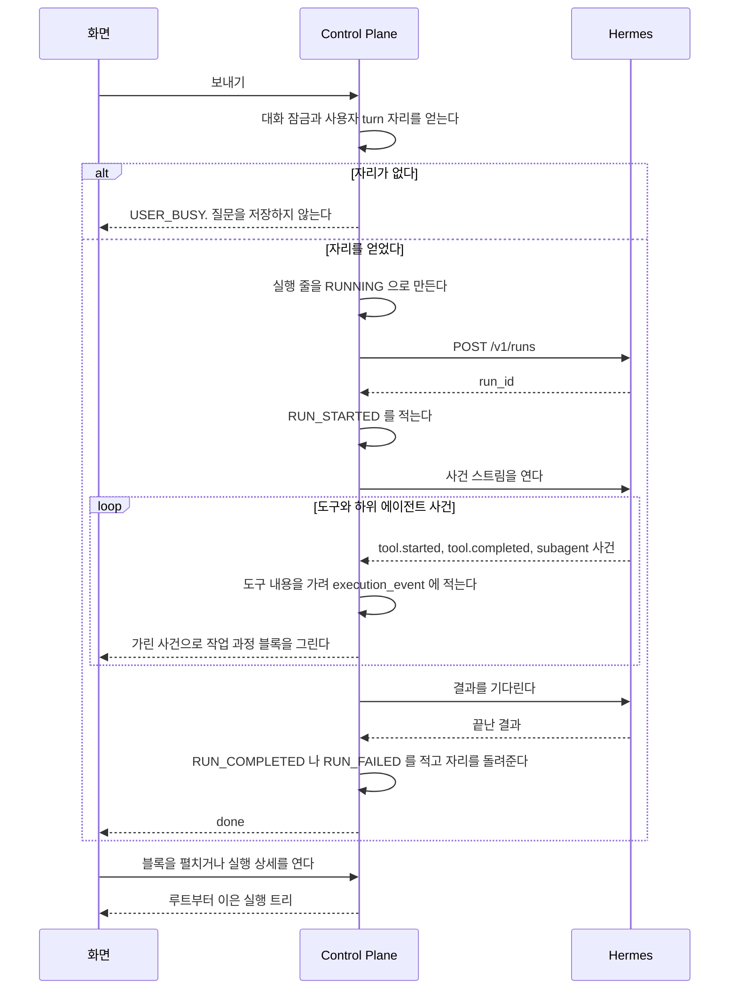

# 실행 기록과 한도

에이전트 실행의 사건과 실행 트리를 기록해 다시 보이고, 한 사용자가 동시에 맡길 수 있는 실행의 수를 한도로 막는 기능이다.

## 요구

- 답을 만드는 동안 에이전트가 무엇을 했는지를 답 위의 블록 하나로 보인다. 도구나 하위 에이전트를 쓴 답 위에 접힌 한 줄이 보이고, 모델 이름과 토큰은 대화에 보이지 않는다.
- 실패한 실행도 기록에 남는다. 실행 하나를 열면 자식 실행 번호로 들어와도 루트부터 트리 전체가 보이고, 남의 실행 번호는 없는 실행과 같은 오류다.
- 도구 내용은 비밀값과 UUID 를 가린 뒤 화면으로 중계하고 저장한다.
- 한 사용자가 Hermes 에 동시에 맡기는 실행의 수를 사용자 실행 한도로 막는다. 한도를 넘은 보내기는 기다리지 않고 409 `USER_BUSY` 로 거절되고, 거절과 완료 뒤에 자리가 새지 않는다.

## 흐름

대화 turn 하나가 자리를 얻고, 사건을 기록하며 중계하고, 끝난 뒤 트리로 다시 보이는 흐름이다.

결과를 기다리다 시간이 넘거나 조회가 실패하면 실행 줄은 `FAILED` 로 끝나도 자리는 남는다(「원격 종료 확인」).

## 작업 과정 블록

에이전트가 답을 만드는 동안 무엇을 했는지를 답 위의 블록 하나로 보인다.
블록은 진행 중과 끝난 뒤에 같은 자리에 있다. 비서 이름 아래, 답 본문 위다.
블록은 사건이 하나라도 온 답에만 생긴다. 도구도 하위 에이전트도 쓰지 않은 답에는 없다.

**접힌 블록은 사람 말 한 줄이다.** 도구 수, 하위 에이전트 수, 모델 이름, 토큰 수를 대화에 그리지 않는다.
대화는 일반 사용자가 읽는 자리이고, 그 값은 관리자 영역의 사용량 화면이 보인다.
화면은 하위 에이전트를 「도우미」 라고 부른다. 상태마다 보이는 문장은 `web/src/components/chat/activity/activity-state.ts` 가 갖는다.

| 하위 에이전트 상태 | 뜻 |
| --- | --- |
| 도는 중 | 답이 진행 중이고 자식 완료 사건을 아직 받지 않았다 |
| 끝남 / 실패 | 자식 완료 사건이나 자식 실행의 종료 기록을 받았다 |
| 결과를 받지 못함 | 답이 끝났지만 자식 완료 사건을 받지 못했다. 자식이 실제로 끝났는지는 알 수 없다 |
| 중지됨 | 사용자가 답을 중지했거나 자식 실행에 취소 기록이 있다. 이미 끝난 자식은 종료 상태를 유지한다 |

Hermes 최상위 위임은 부모보다 늦게 끝날 수 있어 부모 스트림이 닫힌 것만으로 중지를 판정하지 않는다.
provider 전환 사건은 대화의 작업 과정에 그리지 않는다. 예전 실행에만 있는 사건이고, 관리자 영역의 실행 상세가 트리의 한 줄로 보인다.

흐름의 단계는 도착한 순서로 그린다. 아직 오지 않은 단계는 그리지 않고, 이름과 차례를 화면에 박아 두지 않는다.
무엇을 나눌지는 Hermes 가 정하므로 단계가 바뀔 때마다 화면을 고치지 않게 한다([ADR-017](../adr/ADR-017-무엇을-할지는-hermes-가-정하고-control-plane-은-경계만-갖는다.md)).

**`started` 와 `completed` 는 한 줄로 합친다.** 도구는 도착한 순서로 짝짓고,
하위 에이전트는 `subagentId` 가 있으면 그것으로, 없으면 도착한 순서로 짝짓는다.

**오류로 끝난 turn 도 블록을 지우지 않는다.** 그 화면에서는 그때까지 온 줄과 실패한 줄을 남긴 채 접힌 요약으로 바뀌고, 그 아래에 오류가 보인다.
완료 사건이 없는 하위 에이전트는 「결과를 받지 못함」 으로, 나머지 끝나지 않은 줄은 「끝나지 않음」 으로 보인다.
새로 고치면 저장된 답이 없어 블록도 없다. 그 실행의 기록은 사용량 화면의 트리에서 본다.

### 도구를 보이는 말

도구 이름을 그대로 보이지 않고 사람 말로 옮긴다. 문구는 `web/src/lib/tool-label.ts` 가 갖는다.
그 표에 없는 MCP 도구는 연결된 서비스를 쓴다고만 알리고 도구 이름 원문을 보이지 않는다.

**`detail` 은 관리자만 모든 도구에서 받는다.** 사용자에게는 `web_search` 의 검색어와 `vision_analyze` 의 질문만 온다.
Control Plane 이 응답에서 빼고, 화면도 받은 것을 그대로 그리지 않는다.
명령과 도구 결과의 원본은 관리자 영역의 실행 상세에서 「원본 보기」 를 펼칠 때만 보인다. 근거는 [ADR-038](../adr/ADR-038-도구의-명령-원문은-관리자에게만-보내고-사용자에게는-사람-말로-보인다.md) 에 있다.

### 펼친 목록의 높이

펼친 블록의 목록은 높이 상한 안에서 스크롤한다. 도구를 수십 번 부른 답에서 목록이 대화를 밀어내지 않게 한다.
도는 중에는 사용자가 맨 아래를 보고 있을 때만 새 줄을 따라가고, 위로 올려 읽는 동안은 따라가지 않는다. 끝난 답은 맨 위부터 보인다.

### 끝난 답에서 다시 볼 때

메시지 조회가 답마다 작업 과정의 요약(도구 수, 하위 에이전트 수, 걸린 시간)을 함께 준다. 블록은 그 요약으로 접힌 채 그린다.
**펼칠 때 처음으로 실행 트리를 읽는다.** 답이 여럿인 대화를 열 때마다 트리를 모두 읽지 않기 위해서다.

| 상황 | 블록 |
| --- | --- |
| 사건이 없는 답 | 블록을 그리지 않는다 |
| 한 번에 받는 경로로 돈 답 | 스트리밍 경로와 같다([ADR-090](../../backend/docs/adr/ADR-090-한-번에-받는-경로도-hermes-사건-스트림을-열어-도구-사건을-남긴다.md)). 이 결정 전에 돈 실행은 도구 사건이 없어 블록이 없다 |
| 펼쳤는데 트리를 읽지 못했다 | 블록 안에 작업 과정을 읽지 못했다는 안내와 다시 읽기 단추 |
| 중지한 답 | 멈춘 자리까지의 줄. 끝나지 않은 줄은 「중지됨」 |

### 작업 과정 패널

블록의 「자세히 보기」 를 누르면 `/executions/{id}` 화면과 같은 실행 트리를 대화 옆 패널로 연다.
도는 중인 답은 흘러온 사건으로 만든 줄을 그대로 보이고 트리는 끝난 뒤에 읽는다. 다른 답의 블록을 누르면 패널이 그 답으로 바뀌고, 다른 대화로 가면 닫힌다.
답을 만드는 중에는 `Esc` 가 중지보다 패널 닫기를 먼저 한다.

## 실행이 실패할 때

오류 코드의 뜻은 `ErrorCode` 가, 화면 문구는 `web/src/components/error-message.ts` 가 갖는다.
아래는 화면이 안내 밖의 일을 하는 코드다.

| 오류 코드 | 화면이 하는 일 |
| --- | --- |
| `CONVERSATION_BUSY` | 글만 보낸 것이면 대기 메시지로 다시 넣는다. 사진이 붙었거나 다시 생성이거나 흐름이 붙은 에이전트면 끝난 뒤에 다시 보내게 하고 쓴 문장을 입력창에 되돌린다 |
| `USER_BUSY` | 쓴 문장을 입력창에 되돌리고 대기 메시지로 넣지 않는다. 대기 메시지 turn 이면 대기 줄이 멈춘 채 남는다 |
| `PROVIDER_BLOCKED`, `PENDING_QUEUE_FULL` | 쓴 문장을 입력창에 되돌린다. `PROVIDER_BLOCKED` 는 다른 모델을 고르게 한다 |
| `EXECUTION_NOT_RUNNING` | 알리지 않고 곧 올 끝 사건을 기다린다 |
| `MESSAGE_NOT_LATEST`, `DELIVERY_NOT_FOUND`, `DELIVERY_NOT_RETRYABLE` | 이력을 다시 읽는다 |
| `PENDING_MESSAGE_NOT_FOUND` | 입력창에 되돌리지 않고 대기 줄을 다시 읽는다 |
| `EXECUTION_NOT_FOUND` | 사용량 목록으로 되돌린다 |
| `AUTONOMY_DECISION_NOT_FOUND` | 서버 문구를 항목 아래에 보이고 지금 화면을 다시 읽는다([`docs/features/proactive.md`](proactive.md) 의 「사용자에게 보이는 것」) |
| `PROACTIVE_LOOP_UNAVAILABLE` | 켜기를 막고 설치에서 꺼져 있다고 보인다. 끄기와 쉬기는 된다([`docs/features/proactive.md`](proactive.md) 의 「사용자 설정」) |
| `PROACTIVE_CHECK_UNAVAILABLE` | 상태를 다시 읽어 까닭마다 할 일을 보인다. toolset 이 걸렸으면 끌 toolset 이름을 보인다([`docs/features/proactive.md`](proactive.md) 의 「시작 전 점검」) |

**사용자가 보낸 요청이 `HERMES_BUSY` 나 `USER_BUSY` 를 받으면 Control Plane 은 다시 보내지 않는다.**
한도에 닿은 상태에서 다시 보내면 한도를 더 밀어붙인다. 다시 보낼지는 사람이 정한다.
위임 결과 자동 turn 의 재시도만 예외이고 「한도에 닿을 때」 가 갖는다.

`EXECUTION_NOT_FOUND` 는 없는 실행과 남의 실행을 같은 응답으로 숨긴다. 남의 실행이 있는지조차 알려주지 않기 위해서다.
실행 트리의 실패 줄은 오류 코드를 안내 문구로 바꿔 보이고, 코드 원문은 관리자 영역의 실행 상세에서만 함께 보인다.

## 실행 하나를 다시 볼 때

사용량 목록의 한 줄을 누르면 `/executions/{id}` 로 간다.
그 화면은 여는 순간 한 번 읽고 실시간으로 갱신하지 않는다. 돌고 있는 실행은 대화 화면이 이미 흘려 보이고, 이 화면은 끝난 뒤에 다시 보는 자리다.
브라우저가 Control Plane 토큰을 갖지 않으므로 web 서버 라우트가 토큰을 만들어 트리를 읽는다.

어느 실행 번호로 물어도 그 실행이 속한 트리의 루트부터 온다. 자식에서 들어와도 전체를 보게 하기 위해서다.

`TOOL_STARTED` 와 그 뒤의 `TOOL_COMPLETED` 는 한 줄로 합친다. 짝이 없으면 「끝나지 않음」 으로 보인다. 그 실행이 도중에 끊긴 것이다.
`RUN_STARTED` 와 `RUN_COMPLETED` 는 줄로 그리지 않는다. 머리의 상태와 걸린 시간이 이미 그것을 말한다. `RUN_FAILED` 만 오류로 그린다.

**`SUBAGENT_STARTED` 는 자식 노드가 있든 없든 언제나 한 줄로 그린다.**
자식 실행에 어느 사건에서 났는지가 적혀 있지 않아 둘을 짝지을 방법이 없다.
하위 에이전트가 자식 실행 줄을 남기는 경로가 생기면 같은 하위 에이전트가 줄과 자식 노드로 한 번 겹쳐 보인다.
겹쳐 보이는 쪽이 사건이 통째로 사라지는 쪽보다 낫다고 보았다.

| 상황 | 화면 |
| --- | --- |
| 사건이 하나도 없다 | 기록된 작업이 없다는 한 줄. 요약은 그대로 보인다 |
| 남의 실행 번호다 | `EXECUTION_NOT_FOUND`. 없는 것과 같은 오류다 |
| 자식 쪽이 잘렸다 | 잘린 노드의 자식 자리에 여기부터 보이지 않는다는 한 줄 |
| 루트 쪽이 잘렸다 | 루트 위에 위쪽 기록이 없어 여기가 첫 실행이 아닐 수 있다는 한 줄 |

사건이 없는 것은 정상이다.
도구를 부르지 않은 실행과, Hermes 의 사건 스트림을 읽지 못한 실행, 흐름(`Flow`)의 단계로 돈 실행에는 도구 사건이 없다.

**잘린 곳이 둘이라 알리는 자리도 둘이다.**
자식 쪽이 잘리면 그 노드가 어디서 끊겼는지 알 수 있어 그 자리에 적는다.
루트 쪽이 잘리면 끊긴 자리가 화면 밖이라, 지금 보이는 루트가 진짜 루트가 아닐 수 있다는 것을 위에 적는다.

## 실행 기록

### 실행 사건

#### 답에서 확인할 수 있는 원문 열람

메시지 이력의 비서 답은 `sourceReads` 를 받는다. Control Plane 이 답에 연결된 실행과 그 아래의 같은 사용자 자손 실행에 저장된 사건으로 만든다.
조상 실행, 형제 실행과 다른 사용자의 실행은 포함하지 않는다.
답 본문에 있는 링크나 모델의 설명은 근거로 쓰지 않는다. 기존 답도 같은 사건으로 계산하며 새로운 저장 모델은 만들지 않는다.
화면이 기대는 칸은 아래와 같고, 코드는 `SourceReadSummaries` 가 갖는다.

| 칸 | 뜻 |
| --- | --- |
| `completedCount` | 이름이 정확히 `web_extract` 이고 `TOOL_COMPLETED`, `failed=false` 인 사건 수. 페이지 수가 아니라 도구 호출 수다 |
| `urls` | 위 완료 사건의 완결된 결과 JSON 에서 내용이 있고 오류가 없는 항목의 HTTP(S) 주소. 같은 주소는 한 번만 싣는다 |
| `requestedUrls` | 결과를 확인할 수 없는 성공 완료 호출에서, 같은 실행의 시작 사건과 명확히 짝지어진 첫 요청 주소. 페이지별 성공을 뜻하지 않는다 |
| `unresolvedCount` | 성공 완료 사건 가운데 결과 형식이나 가림, 절단 때문에 결과 주소를 확인하지 못한 사건 수. 요청 주소를 남긴 호출도 포함한다 |
| `observationComplete` | 답에 연결된 실행과 그 아래의 같은 사용자 자손 실행이 모두 `OBSERVED` 인지. 아니면 기록에 없는 열람을 판정할 수 없다 |

검색, 시작 사건, 실패하거나 성공 여부가 없는 완료 사건, 이름이 비슷한 MCP 도구는 열람으로 세지 않는다.
Hermes v0.21.5 의 결과는 `results` 배열이며 항목의 `url`, `content`, `error` 로 판정한다. 완료 사건의 실패 값만으로 각 페이지의 성공을 판정하지 않는다.
근거는 [upstream 결과 정리](https://github.com/NousResearch/hermes-agent/blob/v2026.9.24/tools/web_tools_truncate.py#L153-L193)와 [완료 사건](https://github.com/NousResearch/hermes-agent/blob/v2026.9.24/gateway/platforms/api_server_runs.py#L91-L108)이다.
URL 의 인증 정보, query 와 fragment 는 공개하지 않는다. 가려지거나 잘린 주소, 내부 주소(한 단어 host, localhost, IP 리터럴 등)는 싣지 않는다. DNS 는 조회하지 않는다.
요약은 도구 내용 가리기와 요청자의 대화 소유자 확인을 거친 뒤 만들어 사용자 역할과 관계없이 같은 값이다.
사용자 메시지와 알림 줄은 `sourceReads` 가 null 이다. 실행 번호가 없거나 그 실행을 찾지 못한 비서 답은 빈 주소와 0건, `observationComplete=false` 를 받는다.

**요청 주소는 결과를 판정할 수 없을 때만 쓴다.** 긴 원문 결과는 preview 에서 잘리고, JSON 을 읽지 못하면 가리기 과정에서 통째로 가려질 수 있다.
그때도 관측 상태가 `OBSERVED` 인 실행의 시작과 성공 완료 사건이 하나씩 명확히 짝일 때만 시작 preview 의 첫 URL 로 `requestedUrls` 를 만든다.
같은 도구의 시작이 겹쳤거나 시작이 없으면 짝을 추측하지 않는다. SSE 에는 호출을 짝지을 ID 가 없다([시작 preview](https://github.com/NousResearch/hermes-agent/blob/v2026.9.24/agent/display.py#L429-L435), [Runs SSE](https://github.com/NousResearch/hermes-agent/blob/v2026.9.24/gateway/platforms/api_server_runs.py#L83-L118)).
판정 가능한 결과와 미확인 항목이 섞이면 결과를 우선하고, 같은 주소가 `urls` 에도 있으면 `requestedUrls` 에서 뺀다.

#### 사건 옮겨 적기

Hermes 가 스트림으로 보내는 사건을 우리 이름으로 옮겨 `execution_event` 에 적는다. 필요한 칸만 고르고 모르는 사건은 버리는 규칙은 [ADR-013](../../backend/docs/adr/ADR-013-실행-사건은-우리-모델로-정규화해-저장한다.md) 이 갖는다.
한 번에 받는 경로도 같은 스트림을 열어 도구와 하위 에이전트 사건을 저장한다([ADR-090](../../backend/docs/adr/ADR-090-한-번에-받는-경로도-hermes-사건-스트림을-열어-도구-사건을-남긴다.md)).
그 경로는 스트림을 기다리는 시간에도 `hermes.run-timeout` 상한을 둔다. 넘으면 스트림을 닫고 결과 조회로 넘어간다.
흐름(`Flow`)의 단계 실행은 이 스트림을 열지 않아 도구 사건이 남지 않는다.

#### 실행의 시작과 끝은 Hermes 사건을 기다리지 않는다

`RUN_STARTED` 와 `RUN_COMPLETED` 와 `RUN_FAILED` 는 Control Plane 이 직접 적는다. Hermes 의 `run.completed` 는 옮겨 적지 않는다.
그 까닭과 사건 저장이 실패해도 대화가 이어지는 규칙은 [`docs/features/chat.md`](chat.md) 의 「대화 한 번」 이 갖는다.
옮기지 못한 사건과 저장에 실패한 사건은 순서를 소비하지 않아, 번호가 1부터 빈틈없이 이어진다.

#### 트리는 메모리에서 잇는다

실행 하나를 그 사건과 자식 실행까지 묶어 낼 때 데이터베이스에서 재귀로 만들지 않는다.
`root_execution_id` 로 한 번에 읽어 메모리에서 잇는다. 한 실행의 자식 수가 많아질 일이 없고, 재귀 질의는 읽기 어렵다.

**순환이 생길 수 있는 자리가 둘이고 대응이 다르다.**
잘못 적힌 `parent_execution_id` 하나로 응답이 끝나지 않을 수 있다.

| 어디 | 무엇을 하나 | 어디에 알리나 |
| --- | --- | --- |
| 루트를 찾아 올라가는 길 | 상한(`ExecutionTreeService.MAX_DEPTH`)에서 멈추고 마지막으로 닿은 실행을 루트로 삼는다 | 트리의 `truncated` |
| 자식을 붙여 내려가는 길 | 이미 붙인 실행을 다시 붙이지 않고 같은 상한의 깊이에서 멈춘다 | 그 노드의 `truncated` |

**`truncated` 가 두 곳에 있고 뜻이 다르다.**
트리의 것은 「이 트리 어딘가를 잘랐다」 이고 노드의 것은 「이 노드 아래를 잘랐다」 이다.
화면이 줄을 그리는 근거는 노드의 값이다. 트리의 값은 잘린 자리를 가리키지 않는다.

루트에서 닿지 않는 실행은 트리에 넣지 않고 로그로 남긴다. 데이터가 어긋난 것이다.
상한에서 일부러 자른 가지는 그 로그에서 뺀다. 원인이 달라서다.
남의 실행은 없는 것과 같은 오류로 응답한다. 루트를 찾아 올라간 뒤에도 주인을 다시 확인한다.

### 도구 내용 가리기

`HermesRunEventStream` 은 도구 설명을 가린 뒤 `RunEvent.detail` 에 넣는다.
SSE 와 실행 기록은 같은 가린 값을 쓰며, 대화의 작업 과정도 이 실행 기록을 조회한다.
근거는 [ADR-047](../../backend/docs/adr/ADR-047-도구-내용은-비밀값과-UUID를-가린-뒤-중계하고-저장한다.md) 에 있다.
비밀 키 이름, 토큰 접두, 글자 상한은 `ToolDetailRedactor` 가 갖는다.

| 대상 | 처리 |
| --- | --- |
| JSON 비밀 키 | 중첩 객체와 배열에서도 값 전체를 가린다. 키의 대소문자, `_`, `-` 차이는 무시한다 |
| 일반 문장의 비밀 할당 | `key=value` 와 `key: value` 에서 위 비밀 키의 값을 가린다. 따옴표 안의 공백도 값에 포함한다 |
| 인증 헤더 | 일반 문장의 `Authorization` 과 `Cookie` 는 인증 방식과 세미콜론으로 나뉜 값도 포함해 줄 끝까지 가린다 |
| 토큰 모양 | `Bearer` 인증값, JWT, 알려진 토큰 접두로 시작하는 값을 가린다 |
| 긴 인코딩 모양 | 긴 hex 와 base64/base64url 덩어리를 가린다 |
| UUID | 표준 형태를 `[항목 N]` 으로 바꾼다. 같은 실행 스트림 안에서 같은 UUID 는 대소문자를 통일해 시작과 완료 사건에 같은 번호를 쓴다. 번호표는 스트림이 끝나면 버린다 |
| 커넥터 도구 | 옛 커넥터 에이전트(`connectorManaged` 가 참)의 실행은 모든 도구의 내용 전체를 가린다. 다른 에이전트의 실행은 그 에이전트에 붙은 커넥터 서버의 도구(등록 이름이 `mcp__<서버>__` 로 시작하는 것)만 가린다([ADR-083](../adr/ADR-083-커넥터는-사용자가-한-번-연결하고-자기-에이전트에-여럿-붙여-그-에이전트가-도구를-직접-부른다.md)). 외부 서비스의 글과 짧은 manifest 비밀값을 노출하지 않는다 |
| 커넥터 호출 뒤 일반 도구 | 실행 트리에서 커넥터 도구를 한 번이라도 호출한 뒤에는 내용의 길이만 남긴다. 본문 앞부분도 남기지 않는다. 도구 이름은 별도 칸에 남는다(#319) |
| 길이와 손상 | 가린 뒤 상한을 넘으면 잘라 말줄임표를 붙인다. 입력이 입력 상한을 넘거나, JSON 으로 시작하지만 파싱할 수 없으면 전체를 가린다 |

원문을 저장하거나 파싱 오류의 원문과 예외를 로그에 남기지 않는다.
커넥터 호출 전 일반 도구와 커넥터 호출이 없는 트리는 금액, 날짜, 짧은 식별자와 일반 문장도 위 규칙에 걸리지 않으면 유지한다.

**커넥터 호출 여부는 루트, 자식, 형제를 포함한 실행 트리 전체에서 확인한다.**
연결 없는 에이전트도 같은 트리에서 커넥터를 부른 실행의 본문을 위임받을 수 있기 때문이다.
허용 응답 전에 저장하는 커넥터 정책 기록의 `created_at` 과 Hermes 사건의 `timestamp` 를 비교하고, 같은 스트림에서 관측한 커넥터 도구 사건도 호출로 센다.
시각이 없는 사건은 받은 시각으로 확인한다. 정책 기록에는 거절과 승인 대기 호출도 포함한다.
호출 이력 조회가 실패하면 내용을 가린다. 가림이 시작되면 그 스트림이 끝날 때까지 유지한다.
이미 저장된 사건은 다시 가리지 않는다. 대화의 이전 turn 에서 읽은 본문까지 추적하는 규칙은 아니다.

하위 에이전트 사건(`subagent.start`, `subagent.complete`)의 목표와 그 자리를 채우는 `preview` 도 같은 규칙으로 가린다.
대화 SSE 의 `subagent` 사건, 실행 기록의 `detail`, 목표로 만든 하위 에이전트 이름이 모두 가린 값을 받는다. 커넥터 호출 뒤에는 목표도 길이만 남긴다.

`skill_view` 도구의 `tool.started` 사건에서 가리기 전에 스킬 이름을 꺼내는 규칙은 ADR-047 의 결과 항목이 갖는다([도구와 스킬](../../hermes/docs/hermes-contract.md)).
옛 커넥터 에이전트의 실행과 커넥터 호출 뒤에는 꺼내지 않는다. 그 밖의 실행에서는 꺼낸다.

## 사용자 실행 한도

한 사용자가 Hermes 에 동시에 맡길 수 있는 실행의 수를 정한다.
결정과 버린 대안은 [ADR-069](../adr/ADR-069-사용자-전체-실행-한도는-turn-자리와-실행-줄을-사용자-잠금-하나에서-센다.md) 에 있다.

### 세는 실행

**Control Plane 이 Hermes 에 실행을 맡기는 길은 `HermesRunsClient.submit`(`POST /v1/runs`) 하나다.** 새 진입점도 이 길을 지나므로 아래 자리 가운데 하나로 센다.

| 자리의 종류 | 진입점 |
| --- | --- |
| turn 자리 | 보내기, 다시 생성, 결과 다시 전달, 스킬 커맨드, 대기 메시지 turn, 위임 결과와 커넥터 결과의 자동 turn, 흐름의 Chief, 먼저 살펴보기, 행동 정책의 자동 실행 |
| turn 자리, 한도를 보지 않는다 | 기동 정리(`RestartReconciler`)가 다시 잡은 대화 turn 과 흐름 turn |
| 실행 줄 | 흐름의 Researcher, Engineer, Synthesizer, `agent_delegate` 로 맡긴 자식 |
| 실행 줄, 백그라운드 | Memory 제안, 추천 질문, 문제 후보의 가치 평가와 replay |

Hermes 를 부르지만 실행을 시작하지 않는 것은 세지 않는다. 커넥터 도구 호출, 실행 조회, 중지, 사용량 재조회가 그렇다.
Control Plane 이 제출하지 않는 실행(Hermes native 하위 에이전트, Hermes cron, 대시보드나 CLI 에서 직접 연 실행)은 세지 못한다.
이 한도가 OS 격리나 CPU, 메모리, 비용의 상한이 아니라는 점과 함께 ADR-069 의 결과가 감당할 것으로 적는다.

### 한도끼리의 관계

| 한도 | 단위 | 값 | 닿으면 | 세는 곳 |
| --- | --- | --- | --- | --- |
| 대화 잠금 | 대화 하나 | turn 1개 | `CONVERSATION_BUSY`. 화면은 글만 보낸 경우 대기 메시지로 넣는다 | `TurnCancellation` 메모리 |
| 루트당 위임 | 실행 트리 하나 | `assistant.delegation.max-concurrent-children` | `TOO_MANY_CHILDREN` | `RUNNING` 이고 `delegation_key` 가 있는 실행 줄 |
| 서버 전체 위임 | Control Plane 프로세스 | `assistant.delegation.max-active` | `BUSY` | `AgentDelegationService` 의 semaphore |
| **사용자 실행** | 사용자 한 명 | `assistant.user-execution.max-running` | turn 은 `USER_BUSY`, 위임은 `BUSY`, 백그라운드는 건너뛴다 | `UserExecutionLimiter` 가 「세는 방법」 으로 |
| Hermes listener | 공유 listener 하나 | `gateway.api_server.max_concurrent_runs` | Hermes 가 429. Control Plane 은 `HERMES_BUSY` 로 적는다 | Hermes |

**사용자 한도는 그 아래 한도들보다 작게 둔다.**
한 사용자가 서버 전체 위임 자리나 Hermes listener 자리를 모두 가져가지 못하게 하기 위해서다.
사용자 한도는 자리를 더 주지 않는다. 다른 한도가 먼저 닿으면 그 한도의 응답이 나간다.

| 경로 | 판정 순서 |
| --- | --- |
| 대화 turn | 대화 잠금, 사용자 한도 |
| `agent_delegate` | 깊이, 에이전트, 같은 호출, 루트당 위임, 서버 전체 위임, 사용자 한도 |
| 흐름 단계 | 사용자 한도 |
| 백그라운드 | 기능이 켜졌는지, 사용자 한도(예비 자리 포함) |

### 세는 방법

`usage.application.UserExecutionLimiter` 가 센다.
세는 세 자리(turn 자리, 실행 줄, 원격 종료 확인 자리)와, 사용자 잠금 하나 안에서 판정하고 실행 줄을 커밋까지 끝내는 규칙은 [ADR-069](../adr/ADR-069-사용자-전체-실행-한도는-turn-자리와-실행-줄을-사용자-잠금-하나에서-센다.md) 의 결정이 갖는다.

실행 줄은 `RUNNING` 이고 대화 turn 의 루트 줄이 아닌 것만 센다. 그 turn 은 turn 자리로 이미 세었다.
흐름의 Chief 도 대화 turn 의 루트 줄이다. 그래서 Chief 가 끝난 뒤 자식이 시작하기 전에도 그 turn 은 자리 하나를 쥔다.
추천 질문과 시스템 판단 줄은 대화가 없어 루트 줄이어도 센다.

**부르는 쪽은 트랜잭션을 열지 않는다.**
트랜잭션 안에서 부르면 잠금을 푼 뒤에 커밋되어 다른 스레드가 그 줄을 세지 못한다. `UserExecutionLimiter` 는 그 경우 예외를 던진다.

**대화 turn 의 루트 줄은 사용자 한도를 다시 보지 않는다.** 나머지 실행 줄은 줄을 만들기 전에 판정한다.

| 실행 줄 | 통과 조건 |
| --- | --- |
| 흐름 단계, 위임 자식 | 쥔 자리가 `max-running` 보다 작다 |
| 추천 질문, Memory 제안 | 줄을 만든 뒤에도 `background-reserve` 만큼 자리가 남는다 |
| 매일 깨우기와 그 위임 자식 | 자리를 얻은 뒤에도 `max(1, background-reserve)` 만큼 자리가 남는다 |

매일 깨우기는 사용자 대화 한 자리를 반드시 남기므로 `max-running = 1` 일 때 자리를 얻지 못한다.
자리가 없으면 예약 발화는 `QUEUED` 로 남겨 다음 tick 에 다시 본다.

#### 원격 종료 확인

아래 경우에는 실행 줄을 끝낸 뒤에도 Hermes 에서 그 run 이 돌 수 있다.

- 결과를 기다리다 시간 초과(`HERMES_RUN_TIMEOUT`)나 조회 실패로 끝났다
- 제출은 됐는데 run 번호나 시작 사건을 적지 못해 실패로 끝냈다. 이미 중지를 보냈다
- 기동 정리가 상한을 넘겨 중지를 보내고 `FAILED` 로 적었다. 이미 중지를 보냈다

**실행 줄의 상태 계약은 바꾸지 않는다.** 줄은 `FAILED` 로 적고, 그 run 의 자리를 원격 종료 확인 자리로 쥔다.
`UserExecutionLimiter.holdUntilRemoteEnds` 가 가상 스레드 하나에서, 아직 중지를 보내지 않은 run 이면 중지를 한 번 보내고 끝났는지 묻는다.
중지를 이미 보낸 경우에는 다시 보내지 않아 중지는 한 번만 간다.

| 실행 조회의 답 | 하는 일 |
| --- | --- |
| 끝났다, 404(그 run 을 모른다) | 자리를 돌려준다. 실행 줄은 다시 적지 않는다 |
| 아직 돈다, 닿지 못했다 | 다시 묻는다. 닿지 못하면 간격을 늘린다 |
| `assistant.user-execution.remote-end-max-wait` 를 넘었다 | 실행 번호와 run 번호를 담아 경고 로그를 남기고 자리를 돌려준다 |
| 확인할 스레드를 띄우지 못했다 | 경고 로그를 남기고 곧바로 돌려준다 |

기동 정리가 상한을 넘겨 `FAILED` 로 적은 줄도 같다. Hermes 가 그 run 이 끝났거나 모른다고 답할 때까지 사용자 자리가 남는다.
제출 응답을 받지 못해 run 번호가 없는 실행은 물을 수 없어 이 자리로 세지 않는다. Hermes 가 그 제출을 받아 돌리고 있어도 Control Plane 은 알 수 없다.
대화 turn 에서 제출은 됐는데 run 번호를 적다 `ApiException` 이 아닌 예외가 나면 그 run 도 세지 못한다. 드문 경로라 한계로 둔다.

**Control Plane 이 다시 뜨면 이 자리는 사라진다.** 그 실행 줄은 이미 끝나 있어 기동 정리도 다시 보지 않는다.
그 run 이 Hermes 에서 끝날 때까지 그 사용자의 한도가 그만큼 덜 센다.

#### 기동 정리와의 관계

기동 정리([`docs/features/chat.md`](chat.md) 의 「기동할 때 남은 실행 정리」)가 다시 붙는 실행도 한도에 든다.

| 기동 정리가 다루는 실행 | 세는 방법 |
| --- | --- |
| 대화 turn 과 흐름 turn | 대화 잠금을 잡을 때 turn 자리를 한도와 무관하게 얻는다. 이미 Hermes 에서 돌고 있어 거절할 수 없다 |
| 위임 자식, 흐름 단계, 백그라운드 | `RUNNING` 실행 줄로 센다 |

그래서 다시 뜬 직후에는 사용자가 한도를 넘은 채일 수 있다. 그동안 새 turn 과 새 자식은 거절된다.

**실패를 적지 못해 `RUNNING` 으로 남은 줄은 다시 뜰 때까지 자리를 쥔다.**
실행 줄을 끝내는 기록 자체가 예외로 끝나면, 프로세스가 살아 있는 동안 그 줄을 다시 정하는 경로가 없다. 기동 정리가 그 줄을 정할 때 자리도 돌아온다.
자리를 덜 세는 쪽보다 더 세는 쪽을 골랐다. 오래된 `RUNNING` 줄을 세지 않는 상한은 두지 않는다.

### 한도에 닿을 때

| 경로 | 한도에 닿으면 | 사용자가 보는 것 |
| --- | --- | --- |
| 보내기 | 질문을 저장하기 전에 409 `USER_BUSY`. 스트림이면 `started` 전에 `error` 사건이다. 새 대화로 보낸 것이면 대화도 남기지 않는다. 새 대화를 저장한 뒤 잠금을 열 때 거절되면 방금 만든 빈 대화를 지우고, 지우다 실패하면 경고 로그만 남고 빈 대화가 목록에 남는다 | 쓴 글이 입력창에 돌아오고, 진행 중인 작업이 끝난 뒤 다시 보내라는 안내가 보인다 |
| 다시 생성 | `started` 전에 `USER_BUSY` | 같은 안내가 보인다 |
| 먼저 살펴보기 | 202 를 돌려주기 전에 409 `USER_BUSY`. 이번 요청이 만든 점검 대화는 지운다 | 단추 옆에 다시 누르라는 안내가 보인다 |
| 대기 메시지 turn | 대기 행을 지우지 않고 그 대화의 대기 줄을 멈춘 뒤 대화 단위 SSE 로 `USER_BUSY` 를 보낸다 | 멈춘 대기 줄과 안내가 보인다. 사용자가 「보내기」 로 다시 보낸다 |
| 위임 결과 자동 turn | 결과를 전했다고 적지 않는다. `DelegationWakeService.FAILURE_BACKOFF` 뒤 다시 시도하고, 연속 거절이 `MAX_BUSY_RETRIES` 를 넘으면 `LONG_BUSY_RETRY` 간격으로 늦춘다. 한 대화에 걸린 예약은 하나뿐이다 | 결과는 자리가 난 뒤의 turn 에 전해진다 |
| 결과 다시 전달 | `started` 전에 `USER_BUSY`. 전달 묶음은 `FAILED` 나 `STOPPED` 그대로 남고 다시 시도를 예약하지 않는다 | 같은 안내가 보이고 「결과 다시 전달」 이 그대로 남는다 |
| 흐름 단계 | 그 단계의 실행 줄을 만들지 않는다. 루트 줄을 `USER_BUSY` 로 실패로 적고 turn 은 `USER_BUSY` 로 끝난다 | 같은 안내가 보인다 |
| `agent_delegate` | 실행 줄을 만들지 않고 `BUSY` 도구 결과를 돌려준다 | 모델이 직접 하거나, 앞의 작업이 끝난 뒤 다시 맡기거나, 실패를 알린다 |
| 추천 질문 | 실행 줄을 만들지 않는다. 실패 시각도 적지 않아 다음 읽기에서 다시 시도한다 | 추천이 이번에는 바뀌지 않는다 |
| Memory 제안 | 실행 줄을 만들지 않는다 | 제안이 생기지 않는다 |

**한도로 미룬 자동 turn 은 전달 실패가 아니다.** 미룬 자동 turn 은 대화 잠금을 잡기 전에 거절돼 알림 줄도 전달 묶음도 남기지 않는다. 결과는 전하지 않은 채 남아 위의 재시도가 전한다.
전달 묶음의 `FAILED` 는 잠금을 잡고 알림 줄을 저장한 뒤의 실패다. 그 묶음은 자동으로 다시 시도하지 않고 사용자가 다시 전달한다([`docs/features/agent-skill.md`](agent-skill.md) 의 「결과 전달이 끝나지 않았을 때」).

**부모는 자식 자리를 기다리지 않는다.**
위임 자식과 흐름 단계는 자리가 없으면 곧바로 거절된다. 부모가 자리를 쥔 채 자식을 기다리는 교착이 없다.

**한도는 사용자마다 따로다.** 한 사용자가 한도에 닿아도 다른 사용자의 판정은 바뀌지 않는다.
여러 사용자가 함께 붐벼 Hermes listener 한도에 먼저 닿으면 그때는 `HERMES_BUSY` 다. 사용자 한도가 그 자리를 사용자마다 나눠 갖게 한다.

### 설정과 기본값의 근거

설정 키와 기본값, 검사는 `application.yml` 과 `UserExecutionProperties` 가 갖는다.

`max-running` 이 1 이고 `background-reserve` 가 0 이면 백그라운드 실행이 사용자 turn 과 같은 자리를 다툰다.
`background-reserve` 를 `max-running` 보다 1 작게 두면 백그라운드 실행은 그 사용자가 쥔 자리가 없을 때만 돈다.
Memory 제안은 turn 자리를 쥔 채 돌므로 그때는 돌지 않는다.

기본값은 아래를 근거로 정했다.

- 한 turn 이 동시에 쓰는 자리는 보통 1개이고, 흐름 turn 은 나란히 도는 두 단계를 더해 3개다. 기본값이면 흐름 turn 하나와 추천 질문이 함께 돌거나, 대화 셋을 돌리며 자식 하나를 맡길 수 있다.
- 사용자 넷이 동시에 한도까지 써도 서버 전체 위임 한도를 넘지 않는다. Hermes listener 기본값에는 사용자 셋이 한도까지 쓰면 닿고, 그때는 Hermes 의 429 가 나간다.
- 가짜 Hermes 로 한도 2, 4, 6 을 측정했을 때 한도를 넘친 요청은 기다리지 않고 409 `USER_BUSY` 로 거절됐다(최대 77 ms). 거절과 완료 뒤에 자리가 새지 않았다. 받아들여진 응답 시간은 한도와 관계없이 2.2초 안팎이었다. 가짜 Hermes 는 느려지지 않으므로 실제 Hermes 의 응답 시간과 메모리는 이 측정이 보이지 않는다.

측정은 `test/e2e/scenarios/user-execution-limit.ts` 가 돌린다.

### 서버 한 대 전제

turn 자리, 원격 종료 확인 자리, 사용자 잠금이 모두 프로세스 메모리에 있다.
Control Plane 이 한 대라서 그것으로 된다. 대화 잠금([`docs/features/chat.md`](chat.md))과 위임의 루트 잠금([`docs/features/agent-skill.md`](agent-skill.md))도 같은 전제다.
여러 대로 늘리면 셋을 데이터베이스 잠금이나 공유 저장소로 옮겨야 한다. 실행 줄의 수는 지금도 데이터베이스에서 세지만, 세고 만드는 것을 묶는 잠금이 프로세스 안에 있다.
