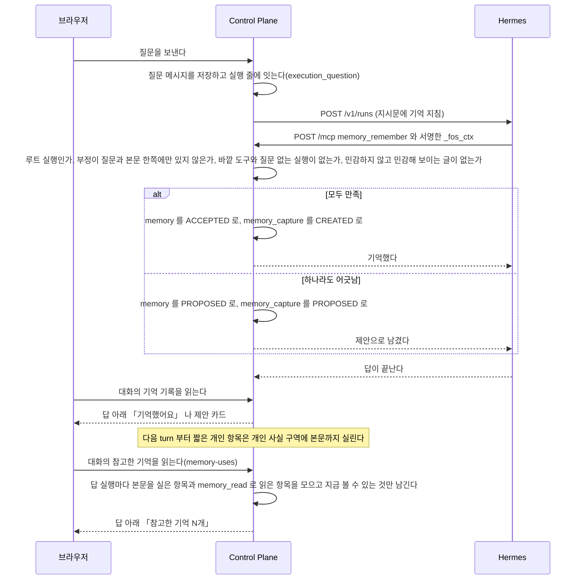
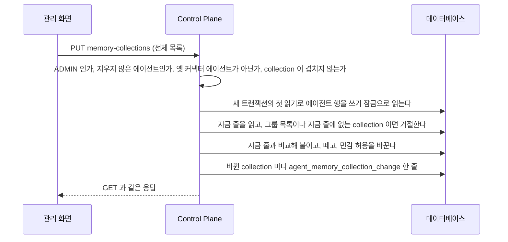
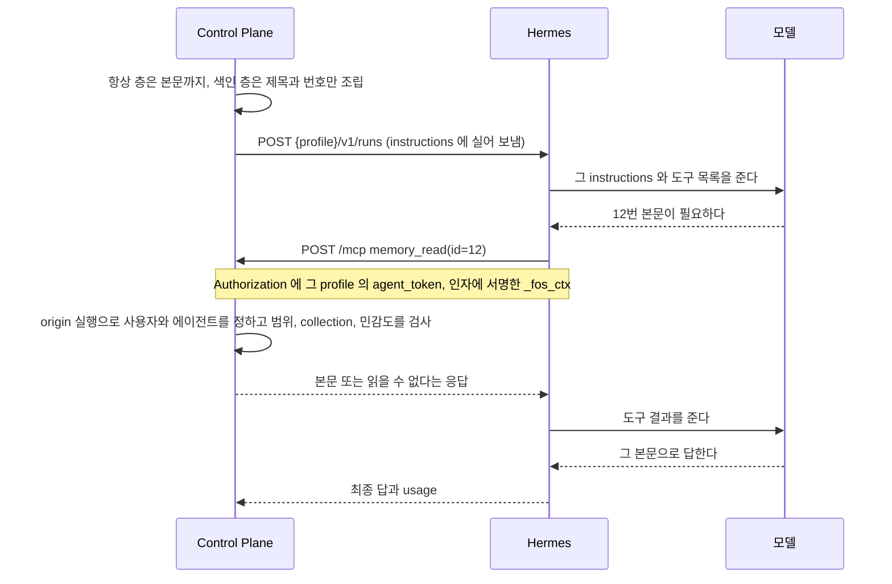
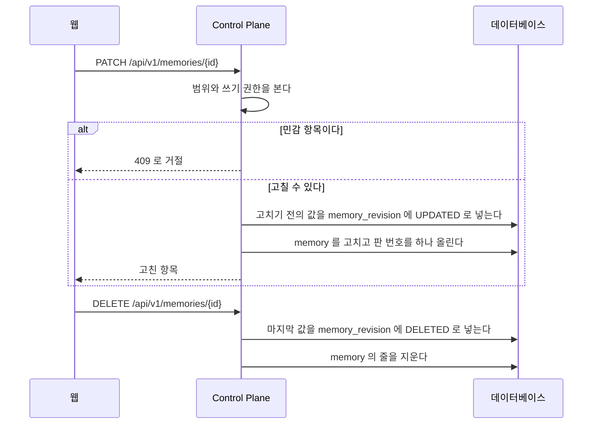
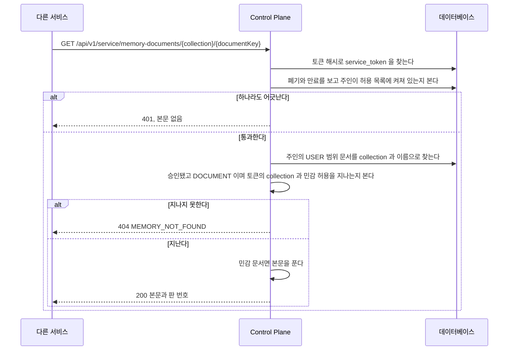

# 기억

에이전트가 실행할 때 받는 사용자의 기억을 남기고 고르고 보이는 기능이다.

## Memory 에서 아직 만들지 않은 것

아래는 아직 만들지 않았다. 스키마와 판정은 이미 받을 수 있게 되어 있다.

- collection 탭, 문서의 판 이력 화면, 출처 표시
- 신원 항목의 들이기. 암호화와 문서 읽기 경계와 `identity` 권한을 운영에서 확인한 뒤에 연다. 조건은 [ADR-058](../adr/archive/ADR-058-기존-개인-지식-저장소는-주인이-검토한-묶음을-화면에서-올려-들여온다.md) 이 정했다
- 민감 항목 본문의 완전 삭제
- `always_inject` 칸 제거

Memory 의 기본 근거는 [`backend/docs/adr/ADR-003-memory-권한은-주입으로-강제한다.md`](../../backend/docs/adr/ADR-003-memory-권한은-주입으로-강제한다.md) 와
[`backend/docs/adr/ADR-012-memory-는-사람이-승인한-것만-남는다.md`](../../backend/docs/adr/ADR-012-memory-는-사람이-승인한-것만-남는다.md) 에 있다.
층을 나누는 근거는
[`backend/docs/adr/ADR-015-memory-는-층을-나눠-싣는다.md`](../../backend/docs/adr/ADR-015-memory-는-층을-나눠-싣는다.md) 에 있다.

## 기억 영역 절

`components/agent/agent-memory-section.tsx` 가 관리자 영역 상세의 「기억 영역」 을 그린다. 「모델」 절 뒤, 「관리」 절 앞에 둔다.
화면이 뜬 뒤 `GET /api/admin/agents/{code}/memory-collections` 를 읽는다. 읽지 못해도 다른 절은 그대로 쓴다.
API 와 수를 세는 규칙은 [`docs/features/memory.md`](memory.md) 의 「관리자가 에이전트의 collection 을 바꿀 때」 가 갖는다.

| 때 | 보이는 것 |
| --- | --- |
| 읽었다 | 영역마다 이름, 「받음」 과 「민감 항목까지」 체크박스, 「항목 N개」. 「민감 항목까지」 는 받는 영역에서만 고른다. 받음을 끄면 함께 꺼진다 |
| 받지 않는 영역에 항목이 있다 | 그 줄에 「항목 N개가 있지만 받지 않아요.」 를 경고 색으로 보인다 |
| 받지만 민감 항목을 허용하지 않은 영역에 민감 항목이 있다 | 그 줄에 「민감 항목 N개는 받지 않아요.」 를 경고 색으로 보인다 |
| 그룹 목록에 없는 영역을 받고 있다 | 이름 자리에 key 를 보이고 「목록에 없는 영역」 배지를 단다 |
| 고른 영역이 하나도 없다 | 「받는 영역이 없으면 이 에이전트는 기억을 쓰지 않아요.」 를 경고로 보인다. 저장은 막지 않는다 |
| 수를 센 대상 | 주인이 있으면 「주인(<이름>)의 기억과 그룹 기억을 셌어요.」, 없으면 「주인이 없어 그룹 기억만 셌어요.」 |
| 「기억 영역 저장」 을 누른다 | 고른 전체를 보낸다. 바뀐 것이 없으면 단추가 꺼져 있다. 성공하면 응답으로 다시 그리고 「저장했어요.」 를 보인다. 실패하면 고른 값을 그대로 두고 오류를 보인다 |
| 최근 변경 | 시각, 바꾼 사람, 「<영역> 붙임」, 「<영역> 뗌」, 「<영역> 민감 항목 허용」, 「<영역> 민감 항목 허용 끔」. 민감 허용과 함께 붙였으면 「<영역> 붙임(민감 항목 허용)」. 없으면 「아직 바꾼 기록이 없어요.」 |

## 기억 화면

`/memory` 는 에이전트가 대화하며 남긴 기억을 사람이 검토하고 고치고 지우는 화면이다.
사람이 손으로 기억을 만드는 자리는 지금 두지 않는다.
기억이 어떻게 저장되고 실행에 실리는지는 [`docs/features/memory.md`](memory.md) 가 갖는다.

### 화면 구성

| 자리 | 무엇 |
| --- | --- |
| 「기억」 탭 | 맨 위 「검토할 기억」, 그 아래 「알고 있는 것」 목록 |
| 「문서」 탭 | 문서 목록. 문서를 읽지 못하면 탭이 없고 기억 목록만 보인다 |
| 맨 아래 접힌 절 | 「문서 읽기 토큰」. 펼치면 서비스 토큰을 관리한다 |

**목록의 줄은 제목과 짧은 표시만 보인다.** 본문은 줄을 눌러 펼쳤을 때만 보인다.
펼침은 그 자리에서 열리고 한 번에 한 줄만 열린다. 휴대폰과 데스크톱이 같은 동작을 하도록 옆 패널이나 주소 이동을 쓰지 않는다.

| 줄 | 제목 아래 표시 | 펼치면 |
| --- | --- | --- |
| 검토할 기억(`PROPOSED`) | 범위, 남긴 쪽, 바뀐 시각 | 본문, 「받아들이기」, 「거절」 |
| 알고 있는 것(`ACCEPTED`) | 범위, 남긴 쪽, 바뀐 시각, 「민감」, 「길어서 답에 포함되지 않음」 | 본문, 넣는 방식, 「고치기」, 「지우기」 |
| 문서 | 영역, 바뀐 시각, 「민감」 | 문서 이름과 판, 본문, 「고치기」, 「지우기」 |

- 범위는 「나에 대해」 와 「그룹」 으로 보인다.
- 「알고 있는 것」 은 바뀐 시각이 최근인 것부터 둔다. 「전체」, 「나에 대해」, 「그룹」, 「에이전트가 남김」 으로 거른다.
- 「고치기」 와 「지우기」 는 고칠 수 있는 사람에게만 보인다. 개인 기억은 주인, 그룹 기억은 `ADMIN` 이다.
- 민감한 기억은 목록이 본문을 싣지 않으므로 펼쳐도 본문 대신 안내만 보이고 「고치기」 가 없다. 서버도 그 수정을 거절한다.
- 「지우기」 는 확인 창을 한 번 거친다.
- 문서는 펼칠 때 본문을 받고, 접거나 다른 줄을 펼치면 받은 본문을 버린다.

### 남긴 쪽

에이전트가 남긴 기억(`proposedByExecutionId` 가 있는 줄)은 남긴 에이전트를 보인다.
대화의 「기억했어요」 로 바로 저장된 것과 제안을 받아들인 것이 모두 여기 든다.

| 응답 | 표시 |
| --- | --- |
| `proposedByExecutionId` 가 없다 | 직접 남김 |
| `sourceAgentDeleted` 가 참이다 | 지운 에이전트가 남김 |
| `sourceAgentName` 이 있다 | `<이름>이 남김` 또는 `<이름>가 남김`. 조사는 이름의 끝 글자로 고른다 |
| 그 밖 | 에이전트가 남김 |

이름을 보일지는 서버가 정한다. 읽는 사용자가 볼 수 없는 에이전트면 이름을 싣지 않는다.

### 숨긴 것과 되살리는 방법

| 숨긴 것 | 방법 | 되살리기 |
| --- | --- | --- |
| 「새 기억」 양식 | `web/src/lib/memory-features.ts` 의 `MEMORY_MANUAL_CREATE` 가 거짓이다 | 값을 `true` 로 바꾼다 |
| 「새 문서」 양식 | 같은 상수 | 같은 방법 |
| 「문서 읽기 토큰」 | 맨 아래 `<details>` 안에 접어 둔다 | 펼치면 그대로 쓴다 |

양식 컴포넌트와 API(`POST /api/v1/memories`, `POST /api/v1/memory-documents`)는 지우지 않았다.


## 참고한 기억

답을 만든 실행이 본문을 받은 기억을 그 답 아래에 접어 둔다. 무엇을 모으는지는 [`docs/features/memory.md`](memory.md) 의 「답마다 참고한 기억」 이 갖는다.

대화를 열면 `GET /api/v1/chat/conversations/{id}/memory-uses` 를 읽어, 답의 실행 번호가 같은 줄을 그 답 아래에 둔다.
「기억했어요」 줄과 같은 때에 다시 읽는다. turn 이 끝나거나 답이 새로 저장될 때와, 「기억했어요」 줄에서 되돌리거나 고치거나 받아들였을 때다. 읽지 못하면 앞 목록을 그대로 두고 대화를 막지 않는다.
새로 나타난 접힌 줄은 맨 아래 따라가기가 보는 글의 변화에 든다. 펼치고 접는 것은 사용자가 한 일이라 따라가기를 바꾸지 않는다.

| 때 | 그리는 것 |
| --- | --- |
| 그 답에 줄이 없다 | 아무것도 그리지 않는다 |
| 접힘(처음) | 「참고한 기억 N개」 단추 하나. `aria-expanded` 가 거짓이다 |
| 펼침 | 항목마다 제목과 출처 표시. 출처는 `ALWAYS` 면 「항상」, `FACTS` 면 「기억한 사실」, `READ` 면 「찾아 읽음」. 그룹 항목은 「그룹」 을 덧붙인다. 목록 끝에 「기억 화면에서 고치기」 링크(`/memory`) |

제목은 평문으로만 그린다(ADR-009).
「쓴」 이 아니라 「참고한」 이다. 실렸어도 답에 쓰지 않은 항목이 섞인다([ADR-20261008 / memory-facts](../adr/ADR-20261008-memory-facts.md)).

## 기억을 남길 때

계약은 [`docs/features/memory.md`](memory.md) 의 「에이전트가 기억을 남기는 길」 이 갖는다.



## Memory

Memory 는 에이전트가 실행할 때 `instructions` 로 받는 사실이다.
단일 소스는 Control Plane 데이터베이스이고, Hermes 의 내장 memory 는 쓰지 않는다.
이 파일은 Memory 의 범위와 승인, 실행에 실을 항목을 고르고 조립하는 규칙, 색인의 본문을 `memory_read` 로 읽는 길, 에이전트가 `memory_remember` 로 기억을 남기는 길, 답마다 참고한 기억을 보이는 길을 갖는다.

### 범위와 조립

- 범위는 `USER` 와 `GROUP` 둘뿐이고 등록할 때 반드시 명시한다.
- 에이전트가 제안하면 `PROPOSED` 로 들어오고, 사람이 받아들여야 `ACCEPTED` 가 된다.
  예외는 사람이 보낸 대화 turn 에서 사용자가 직접 말한 사실이다. 그 말을 승인으로 보고 바로 `ACCEPTED` 로 저장한다(아래 「에이전트가 기억을 남기는 길」).
  주입되는 것은 `ACCEPTED` 뿐이다.
- 항목은 collection 하나에 속한다. 지금 있는 화면과 대화 뒤 자동 제안이 만드는 항목은 모두 `core` 다. `memory_remember` 는 그 에이전트가 받는 collection 을 고를 수 있고 기본값은 `core` 다.
- `ContextAssembler.assemble(user, agentId)` 가 요청자의 `USER` 항목과 요청자가 속한 그룹의 `GROUP` 항목 가운데 그 에이전트가 받는 collection 의 항목만 골라 조립한다.
  다른 사용자의 개인 항목과 받지 않는 collection 의 항목은 고르는 단계에서 빠진다.
- 본문까지 싣는 항상 층과 제목만 싣는 색인 층으로 나눈다. `retrieval` 이 `ALWAYS` 면 항상 층에 본문을 싣고, `SEARCH` 면 제목과 번호만 색인에 싣는다. `ARCHIVE` 와 종류가 `SOURCE` 인 항목은 어느 층에도 싣지 않는다.
  예외로 `SEARCH` 가운데 짧은 개인 항목은 두 층 사이의 개인 사실 구역에 본문까지 싣는다(아래 「개인 사실 구역」).
- `SENSITIVE` 항목은 `ALWAYS` 로 저장하지 못한다. `MemoryService` 가 거절한다.
- 색인의 본문은 `memory_read` MCP 도구로 읽는다. 본문을 내 주면 그 실행의 `execution_context_source` 에 `MEMORY_READ` 줄을 덧붙인다(아래 「본문을 읽으면 남는 기록」).
  요청자는 장기 토큰이 아니라 서명한 `_fos_ctx` 로 찾은 origin 실행의 사용자다([`docs/features/mcp.md`](mcp.md)). 요청 본문은 사용자를 바꾸지 못한다.
  collection 과 민감도는 그 origin 실행의 에이전트로 판정한다.
  Control Plane 은 접근할 수 없는 항목과 없는 항목을 같은 응답으로 숨긴다. 받지 않는 collection 의 항목과 허용받지 않은 민감 항목도 같은 응답이다.
- 민감 항목의 본문은 `memory.content` 와 `memory_revision.content` 에 암호문으로 저장한다. `content_key_id` 가 key 를 적는다.
- 본문을 밖으로 내는 자리는 `MemoryService.contentOf` 를 거친다. Memory 목록은 민감 본문을 싣지 않는다.
  `ContextAssembler` 는 본문을 풀지 않으므로 암호문인 줄을 항상 층에서 건너뛴다. 민감 항목은 `ALWAYS` 가 되지 못하므로 정상 경로에서는 그런 줄이 없다.
- Memory 목록(`GET /api/v1/memories`)은 에이전트가 남긴 줄에 남긴 에이전트를 함께 낸다. `proposedByExecutionId` 의 실행에서 에이전트를 찾는다.
  `sourceAgentName` 은 요청자가 그 에이전트를 읽을 수 있을 때만 싣고, 지운 에이전트는 이름 없이 `sourceAgentDeleted` 를 참으로 낸다.
  볼 수 없는 비공개 에이전트의 이름이 목록으로 새지 않게 하려는 것이다. 판정은 `MemorySources` 가 갖고, 한 항목만 돌려주는 응답은 두 칸을 비운다.
- 민감 항목은 `PATCH /api/v1/memories/{id}` 로 고치지 못한다. 목록이 본문을 싣지 않아 그 요청이 본문을 읽지 않은 채 덮어쓰기 때문이다.
- 일반 항목을 민감 항목으로 바꾸면 물러나는 판과 그 항목에 평문으로 남은 앞선 판을 같은 트랜잭션에서 함께 암호화한다.
- key 가 없으면 민감 항목의 저장과 수정, 암호화한 줄의 읽기를 거절한다. 평문으로 내려 저장하지 않는다.
- 기동할 때 `MemoryContentBackfill` 이 평문으로 남은 민감 줄을 암호화한다. 줄마다 쓰기 잠금으로 다시 읽어 그 줄의 트랜잭션에서 고친다. 실패해도 기동은 잇고 예외 클래스 이름만 로그에 남긴다.
- 문서(`DOCUMENT`)는 사용자가 직접 쓰고 고친다. 곧 `ACCEPTED` 이고 꺼내는 방식은 `SEARCH` 다.
  Memory 목록(`GET /api/v1/memories`)은 종류가 `MEMORY` 인 줄만 내고, `PATCH /api/v1/memories/{id}` 와 승인과 거절은 문서를 없는 항목과 같은 응답으로 답한다.
  문서는 `/api/v1/memory-documents` 가 따로 다룬다. 고칠 때 화면이 읽은 판 번호를 함께 보내고, 지금 판과 다르면 거절한다([ADR-057](../adr/ADR-057-문서는-사람이-화면에서-직접-쓰고-고친다.md)).
- 기존 개인 지식에서 들인 항목의 `source_type=brain`, `source_ref`, `source_date` 는 출처 기록으로 보존한다. 퇴역과 이관 도구 제거의 결정은 [ADR-058](../adr/archive/ADR-058-기존-개인-지식-저장소는-주인이-검토한-묶음을-화면에서-올려-들여온다.md) 이 갖는다.
- 서비스 토큰은 만료가 필수이고, 주인이 허용 목록에 켜져 있을 때만 통한다.
  인증마다 `shared.auth.UserAccessPolicy` 로 묻고 `people.application.AllowedUserAccessPolicy` 가 로그인 판정과 같은 답을 낸다.
  발급도 같은 질문을 먼저 한다. 꺼진 사용자는 살아 있는 웹 세션으로도 새 토큰을 받지 못한다. 그 요청은 발급에 닿기 전에 필터에서 401 로 막힌다(ADR-059). 허용 목록에 줄이 없는 사용자는 발급에서 403 이다.
  관리자가 사용자를 끄면 `people.application.PersonAccessService` 가 끄는 저장과 같은 트랜잭션 안에서 `shared.auth.UserAccessRevoked` 를 내고, `ServiceTokenService` 가 그 사용자의 토큰을 모두 폐기한다.
  폐기가 실패하면 끄기도 롤백된다. 사용자는 정규화한 메일 주소로 찾는다.
  `memory` 가 `people` 을 import 하지 않게 하려고 두 타입을 `shared.auth` 에 둔다.
- 다른 서비스는 서비스 토큰으로 `GET /api/v1/service/memory-documents/{collection}/{documentKey}` 를 부른다.
  요청자는 토큰이 묶인 사용자이고, 판정은 「에이전트의 실행에 보이는 항목」 의 세 조건과 같다. collection 과 민감 허용은 `service_token_collection` 이 정한다.
  이 경로의 인증은 `memory.presentation.ServiceTokenInterceptor` 가 한다. `SecurityConfig` 는 그 경로를 `permitAll` 로 열고 `ControlPlaneJwtFilter` 는 건너뛴다. `shared` 가 `memory` 를 쓰지 않게 하기 위해서다.
- 본문이나 `retrieval` 이나 `sensitivity` 를 고치면 고치기 전의 값을 `memory_revision` 에 남기고 판 번호를 올린다. 지울 때도 마지막 값을 남긴다.
- 공통 답변 지침과 Memory를 합친 글자 수를 실행의 `context_chars`에 남긴다.
  `instructions_hash`도 이 문자열을 대상으로 하며, turn 전용 지시는 제외한다.
  Memory가 없어도 공통 지침의 길이와 지문이 남으므로 Memory 주입 여부는 지문만으로 판단하지 않는다.
- 조립한 Memory 문맥은 `assistant.context.max-chars` 로 제한한다. 개인 사실 구역도 이 안에 든다. 항목 하나가 남은 자리에 들어가지 않으면 그 항목만 빼고 다음 항목과 색인을 계속 담는다.
  넘친 항목을 잘라서 싣지는 않는다. 잘린 사실은 틀린 사실이 될 수 있다.
  그래서 한 항목의 본문을 상한 가까이 키우지 않고 큰 본문은 색인 층에 둔다.
- 색인 층에 쓸 자리를 먼저 떼어 두고 항상 층을 담는다. 긴 본문이 색인을 밀어내지 못한다.
  몫은 `assistant.context.index-budget-ratio` 가 정한다. 나누는 방식과 기본값은 `ContextProperties` 가 갖는다.
  색인이 빠지면 `memory_read` 로 읽을 번호도 사라져 에이전트가 나머지 Memory 에 닿을 길이 없어진다.
- 빠진 항목 수를 실행의 `context_omitted_items` 에 남기고, `/memory` 목록의 그 항목에 표시를 단다.
  대화 화면에는 끼우지 않는다.
  개인 사실 구역에 자리가 없어 색인으로 내려간 항목은 빠진 항목이 아니다. 색인에서도 빠졌을 때만 센다.

#### 개인 사실 구역

짧은 개인 사실을 본문까지 매 실행에 싣는 구역이다. 모델이 `memory_read` 를 부르지 않아도 이름과 관계와 선호를 안다.
근거는 [ADR-20261008 / memory-facts](../adr/ADR-20261008-memory-facts.md) 에 있다.

| 무엇 | 규칙 |
| --- | --- |
| 후보 | 색인 층에 오를 항목(`MemoryService.indexedFor`) 가운데 범위 `USER`, 종류 `MEMORY`, 민감도 `NORMAL`, 본문이 `assistant.context.facts-item-max-chars` 이하. 암호문인 줄은 넣지 않는다 |
| 예산 | `assistant.context.facts-max-chars`. 머리 줄과 구분 줄까지 센다. 기본값과 0 의 뜻은 `ContextProperties` 가 갖는다 |
| 담는 순서 | 색인 몫은 개인 사실 후보를 빼기 전의 색인 대상 전체로 계산해 먼저 떼어 둔다. 그 뒤 항상 층을 담고, 개인 사실 구역은 항상 층과 같은 자리(상한에서 색인 몫을 뺀 자리)의 남은 부분과 예산 가운데 작은 쪽 안에서 고른다. 마지막으로 색인 층을 담는다 |
| 넘칠 때 | `updated_at` 이 최근인 것부터, 같으면 번호가 큰 것부터 고른다. 들어가지 않는 항목은 건너뛰고 다음 항목을 본다. 고르기는 한 번만 한다 |
| 글로 옮길 때 | 고른 항목을 번호 순으로 늘어놓는다. 고른 집합이 같으면 글이 같아 지시문 지문이 바뀌지 않는다 |
| 줄의 모양 | `- [번호] 제목: 본문`. 제목과 본문의 줄바꿈은 공백 하나로 바꿔 한 줄로 싣는다. 색인 줄의 제목도 같다. 모델이 정한 제목이 지시문에 머리 줄을 끼우지 못하게 하려는 것이다. 자르지 않는다. 바뀐 사실을 번호로 고치라는 안내는 `memory_remember` 를 받는 실행의 「# 기억」 지침이 갖는다 |
| 색인 몫과의 관계 | 고른 항목은 색인에서 빠지므로 색인은 떼어 둔 몫보다 짧아질 뿐 길어지지 않는다. 그래서 색인 전체가 몫 안에 들면 개인 사실 구역이 색인을 밀어내지 못한다. 색인이 몫보다 길면 항상 층이 남긴 빈자리를 개인 사실 구역이 먼저 쓰고, 넘친 색인 줄은 그 뒤에 남은 자리를 쓴다. 항상 층이 자리를 다 쓰면 구역이 비고 후보는 모두 색인에 남는다 |
| 색인과의 관계 | 개인 사실 구역에 실린 항목은 색인에서 뺀다. 고르지 못한 후보는 색인에 제목으로 남고 `OMITTED` 가 아니다 |
| `memory_read` | 실린 항목도 `retrieval` 이 `SEARCH` 라 읽힌다 |
| 문맥 묶음 | 실린 항목은 `source=MEMORY_FACTS`, `bodyMode=INLINE` 이다. 색인으로 내려간 후보는 `MEMORY_INDEX` 다 |

구역의 머리 줄과 안내 글은 `ContextAssembler` 가 만든다.

`assembleForOwner` 도 같은 규칙으로 조립한다. 그래서 `/memory` 목록의 빠짐 표시는 개인 사실 구역과 색인에서 모두 빠진 항목에만 붙는다.

#### 에이전트의 실행에 보이는 항목

판정은 세 조건이다. 하나라도 지나지 못한 항목은 그 실행에 없는 항목이다.

| 조건 | 무엇을 본다 | 어디서 정한다 |
| --- | --- | --- |
| 범위 | `USER` 는 주인, `GROUP` 은 같은 그룹 | `memory.scope`, `owner_user_id`, `group_id` |
| collection | 그 에이전트가 받는 collection 인가 | `agent_memory_collection` 의 줄 |
| 민감도 | `SENSITIVE` 면 그 collection 의 `allow_sensitive` 가 참인가 | `agent_memory_collection.allow_sensitive` |

- 줄이 하나도 없는 에이전트, 찾지 못한 에이전트, 에이전트가 없는 실행, 옛 커넥터 에이전트는 아무것도 받지 않는다. 옛 커넥터 에이전트의 실행은 Memory 문맥을 조립하지 않는다([ADR-045](../../backend/docs/adr/ADR-045-커넥터-에이전트는-자기-mcp-서버만-받고-memory-와-control-plane-도구를-받지-않는다.md)). 연결을 붙인 일반 에이전트는 이 규칙대로 자기 collection 을 받는다.
- 에이전트를 처음 저장하면 `AgentRepository` 의 저장이 `AgentCreated` 사건을 내고, `AgentMemoryCollectionService` 가 그것을 받아 `core` 한 줄을 넣는다.
  에이전트를 만드는 경로가 셋(첫 로그인, 사용자가 만들기, 관리자 등록)이라 경로마다 넣지 않고 이 사건 하나로 넣는다. 옛 커넥터 에이전트에는 넣지 않는다.
- 위임받은 에이전트는 자기 허용으로 판정한다. 부르는 쪽의 허용을 물려받지 않는다.
- `ContextAssembler` 는 에이전트를 번호로 받는다. `context` 패키지가 `agent` 를 쓰면 패키지 순환이 하나 늘기 때문이다. 번호로 에이전트를 읽는 것은 이미 `agent` 를 쓰는 `memory` 가 한다.
- `/memory` 목록의 빠짐 표시는 에이전트를 모르는 채 판정한다. `MemoryController` 는 `memory.application.OmittedMemories` port 로 실리지 않는 Memory 의 번호를 받는다.
  `ContextAssembler` 가 그 port 를 구현하고, `assembleForOwner` 로 collection 을 거르지 않고 조립한 결과를 돌려준다. `memory` 는 `context` 를 import 하지 않는다.

| 클래스 | 하는 일 |
| --- | --- |
| `memory.application.MemoryService` | 읽기와 쓰기, 판 기록, 세 조건의 판정. `accessOf(agentId)` 가 그 에이전트의 `MemoryAccess` 를 낸다 |
| `memory.application.MemoryContentCipher` | 민감 본문 하나를 AES-256-GCM 으로 암호화하고 푼다. key 가 없으면 암호화를 거절한다 |
| `memory.application.MemoryContentBackfill` | 기동할 때 평문으로 남은 민감 줄을 찾는다. 실패해도 기동을 막지 않는다 |
| `memory.application.MemoryContentSealer` | 줄 하나를 쓰기 잠금으로 다시 읽어 암호화한다. 줄마다 트랜잭션 하나다 |
| `memory.application.model.MemoryAccess` | 한 실행이 받는 collection 과 민감 허용 |
| `memory.infra.MemoryQueries` | 볼 수 있는 항목과 실행에 실을 항목을 고르는 조건. 모두 읽어 온 뒤 거르지 않고 데이터베이스가 고른다. 검색을 붙일 때도 이 조건 뒤에 붙인다 |
| `memory.application.MemoryCollectionService` | 그룹의 collection 목록. 줄이 없는 그룹이면 기본 일곱 개를 넣는다 |
| `memory.application.ServiceTokenService` | 서비스 토큰의 발급과 폐기, 원문으로 요청자 증명, 사용자를 끈 사건을 받아 토큰 폐기 |
| `memory.presentation.ServiceTokenInterceptor` | `/api/v1/service/**` 의 인증. 증명한 요청자를 요청 속성에 둔다 |
| `memory.presentation.MemoryDocumentController` | 사용자가 문서를 만들고 읽고 고치는 API 와 collection 목록 |
| `memory.presentation.MemoryDocumentServiceController` | 서비스 토큰으로 문서 하나를 읽는 API |
| `agent.application.AgentMemoryCollectionService` | 에이전트가 받는 collection 읽기, 새 에이전트에 `core` 넣기, 관리자가 고른 목록으로 바꾸고 변경 기록 남기기 |
| `memory.application.AgentMemorySettingService` | 관리 화면이 보는 collection 목록과 빠진 항목 수, 최근 변경을 모으고 고른 collection 을 검사한다 |
| `memory.presentation.AgentMemorySettingController` | `/api/v1/admin/agents/{code}/memory-collections` |

#### 관리자가 에이전트의 collection 을 바꿀 때

`ADMIN` 이 관리자 영역의 에이전트 상세에서 받는 collection 과 민감 허용을 바꾼다. 화면은 아래 관리자 API 를 부른다. 자동으로 붙이지 않는다.
화면의 상태와 문구는 [`docs/features/memory.md`](memory.md) 의 「기억 영역 절」 이 갖는다.
근거는 [ADR-20261008 / agent-memory-grants-admin](../adr/ADR-20261008-agent-memory-grants-admin.md) 에 있다.

경로와 요청, 응답 모양은 `AgentMemorySettingController` 와 `MemoryDtos` 가 갖는다. `PUT` 의 본문은 받을 collection 전체이고, 빈 목록이면 모두 뗀다.
응답 칸 가운데 이름만으로 알기 어려운 것은 아래다.

- `countedFor` 는 수를 센 대상이다. `OWNER` 는 주인의 `USER` 항목과 주인 그룹의 `GROUP` 항목이고, `GROUP` 은 주인이 없어 관리자 그룹의 `GROUP` 항목만 센다
- `collections` 는 그룹의 collection 목록 순서로 낸다. 받는 줄이 있지만 목록에 없는 collection 은 key 순서로 뒤에 붙이고 `listed` 가 거짓, `displayName` 이 key 다
- `entryCount` 는 그 collection 에서 실릴 수 있는 항목 수다. `ACCEPTED` 이고 `SOURCE` 와 `ARCHIVE` 가 아니다. 민감 항목도 센다
- `changes` 는 `agent_memory_collection_change` 의 최근 줄을 새것부터 낸다. 줄 수는 `AgentMemoryCollectionService` 가 정한다



| 갈리는 지점 | 응답 |
| --- | --- |
| `ADMIN` 이 아니다 | `FORBIDDEN` |
| 없거나 지운 에이전트다 | `AGENT_NOT_FOUND` |
| 옛 커넥터 에이전트다 | `FORBIDDEN`. 줄이 있어도 받지 않으므로 바꾸지 않는다 |
| 그룹 목록에도 지금 받는 줄에도 없는 collection, 같은 collection 이 둘, 상한을 넘는 목록 | `VALIDATION_FAILED` |
| 바뀐 것이 없다 | 아무것도 쓰지 않고 지금 값을 낸다 |
| 두 관리자가 동시에 저장한다 | 잠금을 기다려 하나씩 돈다. 나중 저장이 이기고 기록은 둘 다 남는다. 잠금 읽기가 트랜잭션의 첫 읽기라 나중 저장은 앞 저장이 커밋한 줄을 보고 비교한다 |

바꾼 값은 다음 실행의 조립과 `memory_read` 판정부터 쓰인다. 저장하는 쪽이 따로 비울 캐시가 없다.

### Memory 본문을 읽는 길

대화 한 번에 Memory 를 전부 싣지 않는다. 층을 나누는 규칙은 위 「범위와 조립」 이 갖는다.

색인에 실린 항목의 본문이 필요해지면 에이전트가 도구로 읽는다.
**그때 요청이 Hermes 에서 Control Plane 으로 거꾸로 온다.**



**요청 본문에는 항목 번호만 있고 사용자가 없다.**
사용자는 [`docs/features/mcp.md`](mcp.md#mcp-호출의-요청자를-정할-때) 의 「MCP 호출의 요청자를 정할 때」 의 길로 origin 실행에서 정한다.
모델이 만든 JSON 에 사용자를 넣게 하면 모델이 남의 Memory 를 읽을 수 있다.

볼 수 없는 항목과 없는 항목은 **같은 응답**으로 답한다.
다르게 답하면 그 항목이 있다는 사실 자체가 새어 나간다.

#### 본문을 읽으면 남는 기록

`memory_read` 가 본문을 내 주면 Control Plane 이 그 호출의 origin 실행의 `execution_context_source` 마지막 줄 뒤에 `source=MEMORY_READ`, `source_ref=memory:<번호>`, `body_mode=INLINE`, `freshness=UNKNOWN` 줄을 하나 덧붙인다.
읽지 못한 호출은 남기지 않는다. 답마다 참고한 기억이 이 줄을 읽는다.

- 실행 사건(`execution_event`)에서 번호를 읽지 않는 까닭은 Hermes 의 `tool.started` 사건이 이 도구의 인자를 싣지 않기 때문이다. 그 사건의 `preview` 는 주요 인자 하나뿐이고 `id` 는 그 목록에 없다([`hermes/docs/hermes-contract.md`](../../hermes/docs/hermes-contract.md) 의 「붙은 커넥터 서버의 도구 사건」).
- 저장은 새 트랜잭션에서 하고 실패해도 도구 결과를 바꾸지 않는다. 같은 실행의 읽기가 겹쳐 순서 번호가 부딪치면 한 번 다시 읽어 시도하고, 그래도 실패하면 실행 번호만 경고 로그로 남긴다. 관측용 기록이기 때문이다.
- 이 줄은 조립 결과가 아니라 실행 뒤의 기록이다. `context_chars` 와 `instructions_hash`, `context_omitted_items` 에 들지 않는다.

#### 본문 읽기가 갈리는 지점

| 무엇이 | 어떻게 되는가 |
| --- | --- |
| 남의 개인 항목, 다른 그룹의 항목, 없는 번호 | 읽을 수 없다는 같은 응답이다 |
| origin 실행의 에이전트가 받지 않는 collection 의 항목 | 같은 응답이다. 색인에도 없던 번호다 |
| `SENSITIVE` 항목이고 그 collection 에서 민감 항목을 허용받지 않았다 | 같은 응답이다 |
| 승인 전인 항목, 항상 층에 이미 실린 항목, 보관한 항목, 출처 원문 | 같은 응답이다 |
| origin 실행에 에이전트가 없거나 그 에이전트를 찾지 못한다 | 같은 응답이다. 받는 collection 이 없다 |
| origin 실행의 에이전트가 옛 커넥터 에이전트다 | 요청자 판정에서 먼저 거절한다. 호출 맥락을 확인할 수 없다는 응답이다([ADR-045](../../backend/docs/adr/ADR-045-커넥터-에이전트는-자기-mcp-서버만-받고-memory-와-control-plane-도구를-받지-않는다.md)) |
| 위임받아 도는 에이전트가 읽는다 | 그 에이전트의 허용으로 판정한다. 부르는 쪽의 허용을 물려받지 않는다 |

근거는 [ADR-053](../../backend/docs/adr/ADR-053-에이전트는-허용된-collection-의-memory-만-받는다.md) 에 있다.

#### Memory 를 고치고 지울 때



판을 남기는 것과 항목을 고치는 것은 한 트랜잭션이다. 한쪽만 남지 않는다.
거절한 수정은 판을 남기지 않는다.
민감 항목은 이 경로로 고치지 못한다. 목록이 민감 본문을 싣지 않아 화면이 본문을 읽지 않은 채 덮어쓰게 되기 때문이다([ADR-055](../../backend/docs/adr/ADR-055-민감-memory-본문은-저장할-때-암호화하고-key-는-환경-변수로-받는다.md)).
민감도를 일반에서 민감으로 바꾸는 수정은 물러나는 판과 앞선 평문 판을 같은 트랜잭션에서 암호화한다. key 가 없으면 아무것도 바뀌지 않는다.
지금 있는 화면의 수정이 항상 싣는 설정을 끄면 색인으로 간다. 이미 보관한 항목은 보관한 채로 둔다.

#### 다른 서비스가 문서를 읽을 때



토큰이 없거나 `Origin` 머리말이 있는 요청은 데이터베이스를 읽기 전에 거절한다.

##### 서비스 읽기가 갈리는 지점

| 응답 | 언제 |
| --- | --- |
| 200 `{collection, documentKey, title, content, revision, updatedAt}` | 읽을 수 있다. `content` 는 평문이고 `revision` 은 지금 값의 판 번호다. `Cache-Control: no-store` 를 붙이고 `X-Service-Token-Expires-At` 머리말에 만료 시각을 적는다 |
| 401, 본문 없음 | 토큰이 없다, 틀렸다, 폐기됐다, 만료됐다, 주인이 허용 목록에서 꺼졌다. 다섯을 구분하지 않는다 |
| 403, 본문 없음 | `Origin` 머리말이 있다. 브라우저에서 부르는 길이 아니다 |
| 404 `MEMORY_NOT_FOUND` | 그 이름의 문서가 없다, 토큰이 그 collection 을 받지 않는다, 민감 문서인데 그 collection 의 민감 허용이 없다, 승인 전이다, `DOCUMENT` 가 아니다. 모두 같은 응답이다 |
| 409 `MEMORY_ENCRYPTION_UNAVAILABLE` | 읽을 수 있는 민감 문서인데 그 key 가 없다([ADR-055](../../backend/docs/adr/ADR-055-민감-memory-본문은-저장할-때-암호화하고-key-는-환경-변수로-받는다.md)) |

관리자가 허용 목록에서 사용자를 끄면 그 사람의 서비스 토큰을 모두 폐기한다. 다시 켜도 되살아나지 않는다([ADR-056](../../backend/docs/adr/ADR-056-다른-서비스는-사용자에-묶인-서비스-토큰으로-문서를-읽기만-한다.md)).
이 경로는 서비스 토큰으로 쓰지 못한다. 다른 사용자의 문서와 `GROUP` 문서도 읽지 못한다.
토큰의 원문과 해시, 문서의 본문은 로그에 남기지 않는다. 로그에는 사용자 번호, 토큰 번호, collection, 문서 이름, 판 번호만 적는다.

### 에이전트가 기억을 남기는 길

에이전트는 Control Plane MCP 도구 `memory_remember` 로 사람에 관한 오래 쓰일 사실을 남긴다.
바로 저장(`ACCEPTED`)할지 제안(`PROPOSED`)으로 둘지는 Control Plane 이 실행의 출처로 정한다.
결정과 프롬프트 주입을 막는 근거는 [ADR-20261007 / memory-remember](../adr/ADR-20261007-memory-remember.md) 에 있다.
`evidence` 를 판정에서 빼고 부정이 뒤집힌 글과 민감해 보이는 글과 오래된 대화를 제안으로 내리는 근거는 [ADR-20261008 / memory-remember-guard](../adr/ADR-20261008-memory-remember-guard.md) 에 있다.

#### 도구 계약(Memory)

도구 정의와 입력 스키마, 값 검사, 결과 글과 `isError` 는 `McpMemoryRemember` 가 갖는다.

- 사용자와 범위를 인자로 받지 않는다. 주인은 origin 실행의 사용자이고 범위는 늘 `USER` 다
- 「사용자가 요청했다」 같은 인자는 없다. 바로 저장 판정은 아래 조건으로만 한다
- `evidence` 는 판정에 쓰지 않는다. 앞선 도구 정의로 부르는 모델이 인자 오류를 받지 않게 받기만 한다
- `memory_id` 는 같은 사실을 고칠 기존 항목 번호이고, 지시문의 개인 사실 구역이나 색인에 있는 번호다. `collection` 을 주지 않으면 `core` 다
- `sensitive` 가 참이면 늘 제안이고 본문은 암호문으로 저장한다
- 꺼내는 방식은 `SEARCH` 로 고정한다. 항상 싣기는 사람이 `/memory` 에서 켠다. 본문이 짧으면 다음 실행부터 개인 사실 구역에 본문까지 실린다([ADR-20261008 / memory-facts](../adr/ADR-20261008-memory-facts.md))
- 먼저 살펴보기 트리에서는 받지 않는다. 옛 커넥터 에이전트의 실행은 요청자 판정에서 먼저 거절한다([ADR-045](../../backend/docs/adr/ADR-045-커넥터-에이전트는-자기-mcp-서버만-받고-memory-와-control-plane-도구를-받지-않는다.md))
- **fos-ctx 가 이 도구를 서명 필수로 안다.**
- **실행 사건에 이 도구의 인자와 결과를 남기지 않는다.** `HermesRunEventStream` 이 시작 사건과 끝 사건의 `detail` 을 비운다. 인자에 사람에 관한 사실이 실린다

#### 바로 저장 판정

일곱 조건을 모두 만족하면 바로 저장하고, 하나라도 어긋나면 제안으로 내린다. 거절하지 않는다.
모델이 준 `evidence` 와 `sensitive=false` 는 바로 저장의 근거가 되지 못한다. 본문이 질문 원문과 글자 그대로 같을 필요는 없다.
4 와 5 는 지금 실행 하나가 아니라 대화 전체를 본다. Hermes session 이 앞 turn 의 도구 결과와 맡긴 일의 결과를 이력으로 이어 가므로, 앞 turn 에서 읽은 바깥 글이 뒤 turn 의 짧은 대답(「응 그래」)을 근거로 저장을 시킬 수 있다.

| 순서 | 조건 | 어디서 본다 |
| --- | --- | --- |
| 1 | origin 실행이 루트 실행이다(`parent_execution_id` 가 없다) | `agent_execution` |
| 2 | 그 실행이 사람이 보낸 turn 이다. 새 질문과 다시 생성만 해당한다 | `execution_question` 의 줄과 그 줄이 가리키는 그 사용자의 `USER` 메시지 |
| 3 | 부정 표지가 질문 원문과 본문에 함께 있거나 함께 없다 | `chat_message.content`, 인자 `content` |
| 4 | 그 대화의 어느 실행에도 아래 「안쪽 도구」 밖의 `TOOL_STARTED` 사건이나 `SUBAGENT_STARTED` 사건이 없다 | `execution_event` 와 `agent_execution.conversation_id` |
| 5 | 그 대화에 사람의 질문 없이 Hermes 로 보낸 루트 실행이 없다. 맡긴 일의 결과를 전하는 turn 과 예약 작업 turn, `execution_question` 이 생기기 전의 실행, 질문 줄을 남기지 못한 실행이 여기 걸린다 | `agent_execution` 과 `execution_question` |
| 6 | 민감하지 않다 | 인자 `sensitive` |
| 7 | 제목과 본문에 아래 「민감해 보이는 글」 이 없다 | 인자 `title`, `content` |

1 부터 5 는 `McpMemoryRemember` 가, 6 과 7 은 `MemoryCaptureService` 가 본다.

안쪽 도구는 바깥 글을 읽지 않는다고 보는 도구다. 목록과 넣지 않는 도구의 까닭은 `McpMemoryRemember.INTERNAL_TOOLS` 의 Javadoc 이 갖는다.
부정 표지의 모양은 `mcp.application.NegationMarkers` 가 갖는다. 한쪽에만 있으면 뜻이 뒤집혔을 수 있어 제안으로 내린다. 문장을 나누지 않고 글 전체를 보므로 질문의 다른 문장에 있는 부정도 센다.

##### 민감해 보이는 글

제목과 본문에 민감해 보이는 낱말이나 숫자열이 하나라도 있으면 모델이 `sensitive` 를 거짓으로 주었어도 제안으로 내린다.
낱말과 숫자열의 모양은 `memory.application.MemorySensitiveHints` 가 갖는다. 잘못 걸려도 제안 카드가 될 뿐이다.
민감도는 모델이 준 값 그대로 저장해 사람이 제안 카드에서 본문을 읽고 정한다.

한 실행의 상한과 같은 글의 중복 확인은 잠그지 않는다. 한 실행이 도구를 나란히 부르면 상한을 넘거나 도구 오류가 날 수 있다. 할 일 제안과 같은 수준으로 둔다.

이 판정 뒤에 공통으로 본다.

- 한 실행이 남긴 기록이 이미 상한(`MemoryCaptureService`)에 닿았으면 저장하지 않는다
- `collection` 이 그 에이전트가 받는 collection 이 아니면 저장하지 않는다
- 같은 사용자의 같은 제목과 본문(`proposal_dedup_key`)이 있으면 새 줄을 만들지 않는다. 그 줄이 제안이고 지금이 바로 저장 조건(7 까지)이면 받아들인다
- `memory_id` 를 주면 바로 저장 조건(7 까지)일 때만 그 항목의 본문을 고친다. 요청자의 `USER` 범위 `MEMORY` 항목이고 `ACCEPTED` 이고 민감하지 않고 그 에이전트가 받는 collection 이어야 한다. 제목과 꺼내는 방식은 그대로다

#### 지침(Memory)

Control Plane MCP 도구를 받는 실행의 공통 답변 지침 뒤에 「# 기억」 절을 싣는다. 글은 `ContextAssembler.MEMORY_INSTRUCTIONS` 가 갖는다.
옛 커넥터 에이전트와 먼저 살펴보기 turn 은 싣지 않는다.

#### 대화에 보이는 것

기록 한 줄이 `memory_capture` 에 남는다. 대화는 그 기록을 만든 실행의 답 아래에 그린다.
맡겨서 도는 실행이 남긴 제안은 그 대화에 그 실행의 답 줄이 없어 `/memory` 의 제안 목록에서만 보인다.

| 기록 | 화면 | 누르면 |
| --- | --- | --- |
| `CREATED`, 항목이 `ACCEPTED` | 「기억했어요: 제목」 과 그 아래 본문 전문(민감 항목은 본문 대신 안내), [고치기] [되돌리기] | 고치기는 `PATCH /api/v1/memories/{id}`, 되돌리기는 새 항목을 지우고 기존 제안을 받아들였으면 제안 상태로 돌린다. 그 뒤에 고쳤으면 409 `MEMORY_REVISION_CONFLICT` 다 |
| `UPDATED`, 항목이 `ACCEPTED` | 「기억을 고쳤어요: 제목」 과 그 아래 본문 전문(민감 항목은 본문 대신 안내), [고치기] [되돌리기] | 되돌리기는 고치기 전의 판으로 돌린다. 그 뒤에 다시 바뀌었으면 409 `MEMORY_REVISION_CONFLICT` 다 |
| `PROPOSED`, 항목이 `PROPOSED` | 제안 카드 [받아들이기] [고쳐서 받아들이기] [거절] | `/accept`, `PATCH` 뒤 `/accept`, `/reject`. `/memory` 의 제안 목록에도 보인다 |

경로와 응답 칸은 `MemoryCaptureController` 가 갖는다.
대화의 기록 목록은 되돌린 기록과 항목이 없어진 기록을 빼고, 민감 항목은 본문을 싣지 않는다. 남의 대화는 다른 대화 경로와 같은 404 다.
되돌리기는 남의 기록과 없는 기록을 같은 404 로 답하고, 제안 기록이나 그 뒤에 고친 항목이면 409 다. 이미 되돌린 기록은 그대로 둔다.
제목과 본문은 모델이 쓴 글이다. 화면은 평문으로만 그린다(ADR-009). 로그에는 사용자, 항목, 실행, 기록 번호와 결과만 남긴다.

| 클래스 | 하는 일 |
| --- | --- |
| `mcp.application.McpMemoryRemember` | 도구 정의, 인자 값 검사, 바로 저장 판정의 1부터 5 |
| `mcp.application.NegationMarkers` | 글에 부정 표지가 있는지 판정 |
| `memory.application.MemorySensitiveHints` | 제목과 본문에 민감해 보이는 낱말과 숫자열이 있는지 판정 |
| `memory.application.MemoryCaptureService` | 민감도, collection, 상한, 중복, 고치기 대상 판정과 저장, 대화의 기록 목록, 되돌리기 |
| `chat.application.TurnQuestions` | 실행에 이어 둔 질문 원문 읽기, 질문 없이 보낸 루트 실행이 있는지 보기 |
| `chat.presentation.MemoryCaptureController` | 대화의 기록 목록과 되돌리기 API |

### 답마다 참고한 기억

대화의 답 아래에 그 답을 만든 실행이 본문을 받은 기억을 「참고한 기억 N개」 로 접어 보인다.
근거는 [ADR-20261008 / memory-facts](../adr/ADR-20261008-memory-facts.md) 에 있고, 화면은 [`docs/features/memory.md`](memory.md) 의 「참고한 기억」 이 갖는다.

| 재료 | 어디서 | 넣는 것 |
| --- | --- | --- |
| 실행에 실은 항목 | `execution_context_source` | `source` 가 `MEMORY_ALWAYS` 나 `MEMORY_FACTS` 이고 `body_mode` 가 `INLINE` 인 줄. 데이터베이스가 `source` 와 `body_mode` 로 고른다. 제목만 실은 `MEMORY_INDEX` 와 빠진 `OMITTED` 는 넣지 않는다 |
| 실행이 읽은 항목 | `execution_context_source` | `source` 가 `MEMORY_READ` 인 줄. `memory_read` 가 본문을 내 준 때에만 Control Plane 이 그 실행의 마지막 줄 뒤에 덧붙인다(아래 「본문을 읽으면 남는 기록」). 읽지 못한 호출은 남지 않는다. 지금 권한으로 다시 판정해, 그 실행의 에이전트가 지금도 `memory_read` 로 읽을 수 있는 항목(`SEARCH` 이고 출처 원문이 아니며 받는 collection 과 민감 허용을 지나는 것)만 넣는다 |

경로와 응답 칸은 `MemoryUseController` 가, `via` 의 뜻은 `MemoryUseVia` 가 갖는다.
그 대화의 답 메시지(`chat_message.execution_id` 가 있는 `ASSISTANT` 줄)의 실행마다 위 재료를 모은다. 실행 번호만 읽고 메시지 본문은 읽지 않는다. 남의 대화는 다른 대화 경로와 같은 404 다.

- 실행 번호 오름차순으로 내고, 한 실행 안에서는 `execution_context_source` 의 `position` 순서로 둔다. 읽은 항목은 덧붙인 줄이라 실은 항목 뒤에 온다. 같은 항목이 둘 다 있으면 앞의 것 하나만 남긴다.
- 지금 요청자가 읽을 수 있고(`Memory.isReadableBy`) `ACCEPTED` 인 항목만 낸다. 지운 항목, 남의 항목, 되돌려 제안으로 돌아간 항목은 뺀다. 제목은 지금 제목이다.
- 본문은 싣지 않는다. 민감 항목도 제목만 낸다. 제목은 `/memory` 목록에도 평문으로 보이는 값이다.
- Control Plane 이 맡겨서 도는 하위 실행이 읽은 항목은 넣지 않는다. 그 실행의 답 메시지가 대화에 없다. Hermes 안의 하위 에이전트는 부모의 origin 실행을 물려받으므로, 그 하위 에이전트가 읽은 항목은 origin 실행의 답에 「찾아 읽음」 으로 붙는다.
- 항목이 없으면 빈 배열이다.

| 클래스 | 하는 일 |
| --- | --- |
| `chat.application.MemoryUseService` | 대화의 답 실행 번호를 모으고, 실행 기록에서 참조를 받아, 지금 볼 수 있는 항목만 제목과 함께 낸다 |
| `usage.application.ExecutionMemoryRefs` | 실행 번호들의 `execution_context_source` 에서 `MEMORY_ALWAYS`, `MEMORY_FACTS`, `MEMORY_READ` 줄을 골라 Memory 번호와 출처(`MemoryUseVia`), 그 실행의 에이전트 번호를 순서대로 낸다 |
| `usage.application.ExecutionContextSourceWriter.append` | 실행 하나의 마지막 줄 뒤에 한 줄을 덧붙인다. `memory_read` 가 부른다 |
| `memory.application.AcceptedMemoryLookup.acceptedReadableAmong` | 번호들 가운데 요청자가 읽을 수 있는 `ACCEPTED` 항목 |
| `memory.application.MemoryService.readableByTool` | 한 항목이 그 `MemoryAccess` 의 `memory_read` 로 읽히는 항목인지. `bodyFor` 와 같은 조건이다 |
| `chat.presentation.MemoryUseController` | `GET .../memory-uses` |

## 문맥 묶음

Control Plane 이 여러 기록에서 모은 문맥의 항목 모델, source 마다의 판정, Hermes 에 넘기는 형식, 로그와 저장 규칙을 갖는다.
결정은 [ADR-071](../../backend/docs/adr/ADR-071-여러-출처의-문맥은-항목마다-출처와-권한과-신선도를-지닌-묶음으로-조립한다.md) 에 있다.

Memory 의 층과 예산과 `memory_read` 는 [`docs/features/memory.md`](memory.md) 가 그대로 갖는다. 이 문서는 그 위에 얹는 항목 모델만 갖는다.

### 항목의 칸

칸 이름은 `ContextItem` 이, 값과 그 뜻은 각 enum(`ContextSource`, `ContextTrust`, `ContextFreshness`, `ContextBodyMode`)이 갖는다. 칸마다의 결정은 ADR-071 의 결정 표가 갖는다.
코드만 읽어서는 알기 어려운 것은 아래다.

- `ref` 는 원래 기록의 참조이고 `<표 이름>:<번호나 공개 식별자>` 형식이다. 예: `memory:<번호>`, `execution:<번호>`, `connector_action:<공개 식별자>`, `follow_up:<공개 식별자>`, `conversation:<공개 식별자>`
- `scope` 는 원래 기록의 범위다. 범위가 없는 기록은 `USER` 다
- `sensitivity` 는 원래 기록의 값이다. 칸이 없는 기록은 아래 「참여하는 source」 표의 값이다
- `conflictsWith` 는 대부분 비어 있다. 아래 「충돌 표시」 의 경우에만 찬다

**항목 타입의 `toString` 은 `source` 와 `ref` 만 낸다.** Java record 의 기본 `toString` 은 모든 칸을 내므로, 항목이나 묶음을 로그에 넘기면 본문이 그대로 남는다.
`AssembledContext` 도 같은 이유로 `toString` 이 `instructions` 를 내지 않고 글자 수와 항목 수만 낸다.

### 참여하는 source

| `source` | 원래 기록 | 판정 | `sensitivity` | `trust` | `bodyMode` | 쓰는 곳 |
| --- | --- | --- | --- | --- | --- | --- |
| `MEMORY_ALWAYS` | `memory` 의 `ALWAYS` | ADR-053 의 세 조건 | 원래 값. `SENSITIVE` 는 이 층에 오지 못한다 | `USER_APPROVED` | `INLINE` | 대화 turn 의 `instructions` |
| `MEMORY_FACTS` | `memory` 의 `SEARCH` 가운데 짧은 개인 항목 | ADR-053 의 세 조건과 [`docs/features/memory.md`](memory.md) 의 「개인 사실 구역」 후보 조건 | `NORMAL` 만 | `USER_APPROVED` | `INLINE` | 대화 turn 의 `instructions` |
| `MEMORY_INDEX` | `memory` 의 `SEARCH` | ADR-053 의 세 조건 | 원래 값 | `USER_APPROVED` | `TITLE_ONLY` | 대화 turn 의 `instructions` |
| `MEMORY_READ` | `memory_read` 가 본문을 내 준 항목 | `memory_read` 의 판정([`docs/features/memory.md`](memory.md) 의 「본문 읽기가 갈리는 지점」) | 묶음 항목이 아니다 | 묶음 항목이 아니다 | `INLINE` | 조립이 아니라 도구 처리가 `execution_context_source` 에만 덧붙인다(「본문을 읽으면 남는 기록」) |
| `DELEGATION_RESULT` | 끝난 위임 실행의 `output_text` | 그 대화의 주인. `AgentExecutionRepository.findUndeliveredResults` 의 조건대로 `SUCCEEDED` 나 `FAILED` 이고 아직 전하지 않았으며 부모가 루트 turn 인 위임만 | `SENSITIVE` | 옛 커넥터 에이전트의 답이면 `EXTERNAL`, 아니면 `AGENT` | `INLINE` | 자동 turn 의 `input` |
| `CONNECTOR_RESULT` | `connector_action` 의 `result_text` | 그 대화의 주인 | `SENSITIVE` | `EXTERNAL` | `INLINE`. `UNKNOWN` 이면 `OMITTED` | 자동 turn 의 `input` |
| `EXECUTION_STATE` | `agent_execution` 의 상태와 시각 | 실행 줄의 `user_id` | `NORMAL` | `CONTROL_PLANE` | 본문이 없다 | 지금 화면과 먼저 알리기 |
| `FOLLOW_UP` | `follow_up` | 주인 | `SENSITIVE` | 사람이 받아들였으면 `USER_APPROVED`, 제안이면 `AGENT` | `TITLE_ONLY` | 지금 화면과 먼저 알리기 |

**`EXECUTION_STATE` 와 `FOLLOW_UP` 은 대화 turn 에 싣지 않는다.** 지금 화면과 먼저 알리기가 「왜 보였는가」 의 `sources` 에 이 `source` 이름과 `ref` 형식을 쓴다. 판정은 `attention` 이 요청자의 기록만 읽는 조회로 하고, 이 문서의 항목 타입을 import 하지 않아도 된다. 대화마다 실으면 할 일이 지식처럼 쓰여 새 Memory 층이 된다([ADR-073](../adr/ADR-073-할-일은-에이전트가-제안하고-사람이-받아들인-것만-챙긴다.md)).

**커넥터의 실시간 데이터는 source 가 아니다.** Control Plane 은 커넥터를 직접 부르지 않는다.
일정 같은 커넥터 데이터는 연결을 붙인 에이전트가 turn 안에서 직접 부른 도구의 결과로 들어온다. 그 결과는 묶음을 거치지 않고 Hermes 의 도구 결과 자리에 놓이며 `fos-ctx` 가 `<external-data>` 로 감싼다([`hermes/plugins/fos-ctx/README.md`](../../hermes/plugins/fos-ctx/README.md)).
묶음에 드는 것은 승인한 호출의 결과(`CONNECTOR_RESULT`)와 남아 있는 옛 커넥터 에이전트의 위임 결과(`DELEGATION_RESULT`)뿐이다.
일정 커넥터가 생기면 그 결과를 읽는 source 를 이 표에 더한다.

**옛 커넥터 에이전트의 실행에는 묶음을 주지 않는다.** `ChatService` 와 `AgentRunner` 가 지금처럼 빈 문맥으로 돌린다([ADR-045](../../backend/docs/adr/ADR-045-커넥터-에이전트는-자기-mcp-서버만-받고-memory-와-control-plane-도구를-받지-않는다.md)). 연결을 붙인 일반 에이전트는 보통 에이전트와 같은 묶음을 받는다.

### 권한과 민감도를 지키는 규칙

ADR-071 의 다섯 규칙을 코드에서 지키는 자리다.

| 규칙 | 지키는 자리 |
| --- | --- |
| source 의 기존 판정을 통과한 것만 든다 | source 마다 기존 조회(`MemoryService.injectableFor`, `AgentExecutionRepository.findUndeliveredResults`, `ConnectorActionService.undeliveredResults`)가 항목을 만든다. 묶음은 판정을 다시 하지 않고 넓히지도 않는다 |
| `SENSITIVE` 본문은 `instructions` 에 싣지 않는다 | `MEMORY_ALWAYS` 와 `MEMORY_FACTS` 은 민감 항목을 받지 못하고, `MEMORY_INDEX` 는 제목만 싣는다. 결과 항목은 `input` 에만 싣는다 |
| `EXTERNAL` 은 감싼다 | `ExternalData.wrap` 하나로 감싼다 |
| `USER` 와 `GROUP` 을 합치지 않는다 | 항목 하나는 원래 기록 하나다. 묶음은 항목을 합치거나 요약하지 않는다 |
| 옛 커넥터 에이전트는 받지 않는다 | `Agent.connectorManaged()` 를 보는 지금의 분기 |

### Hermes 에 넘기는 형식

Runs API 는 `instructions` 와 `input` 두 글을 받는다([`hermes/docs/hermes-contract.md`](../../hermes/docs/hermes-contract.md)).

#### 공통 실행 지침

`ContextAssembler.withResponseInstructions` 는 Memory 예산 밖에 답변 형식과 도구 호출 지침을 더한다.
대화, Control Plane 이 시작한 자식 실행, 먼저 살펴보기에 같은 도구 호출 지침을 보낸다.
새 profile 과 기존 profile 모두 다음 실행부터 받는다.

로컬 MCP 도구는 같은 서버의 읽기 도구라도 각각 호출하도록 안내한다.
Hermes 의 단건 제한과 원격 도구 구분은 [도구 hook 과 승인](../../hermes/docs/hermes-contract.md#tool_call-의-단건-제한)이 갖는다.

이 안내는 묶음 실행 기능이나 서버의 권한 검사를 바꾸지 않는다.
모델이 안내를 따르는지는 배포 뒤 실제 실행의 호출과 거절 기록으로 확인한다.
Hermes 의 네이티브 `delegate_task` 자식은 부모의 실행 지침을 자동 상속하지 않아 이 안내의 적용을 보장하지 않는다.
Control Plane 의 자식 실행과 구분한다. 근거는 [자식 agent 생성](https://github.com/NousResearch/hermes-agent/blob/v2026.9.24/tools/delegate_tool.py#L202-L249)이다.

#### 항목의 형식

**Memory 항목의 글은 바꾸지 않는다.** 머리말이 이미 출처(그룹과 묻는 사람)를 말하고, 색인의 `[번호]` 가 `memory_read` 의 입력이자 참조다.
그래서 Memory 를 묶음으로 옮겨도, 아래 「충돌 표시」 가 붙는 경우를 빼면 `instructions_hash` 가 바뀌지 않는다.

**결과 항목에는 출처 머리줄을 붙인다.** 자동 turn 과 다시 전달이 같은 형식을 쓴다.
머리줄의 칸과 시각 형식, `FAILED` 일 때 붙는 오류 칸과 복구 안내, 신선도 안내 줄은 `ResultHeader` 가 갖는다.
도구의 원래 이름과 승인 줄의 공개 식별자는 머리줄에 싣지 않는다.
사용자가 결과를 다시 전달하는 turn(`ChatService.retryDelivery`)도 같은 형식의 머리줄을 쓰고, 신선도는 다시 전하는 시각으로 판정한다.

결과를 전하는 두 지시가 끝에 함께 붙이는 지시 글은 `TurnIntent.RESULT_HANDLING_RULES` 가 갖는다.
출처가 다른 내용이 어긋나면 하나를 고르지 않고 두 출처와 시각을 함께 말하게 한다. 어느 쪽을 믿는지의 차례는 `ContextTrust` 의 값 순서이고, 그 결정은 ADR-071 의 결정 마지막 문단이 갖는다.

### 신선도

| `source` | `asOf` | `FRESH` | `STALE` |
| --- | --- | --- | --- |
| `MEMORY_ALWAYS`, `MEMORY_FACTS`, `MEMORY_INDEX` | `updated_at` | 묶음을 만든 시각과의 차이가 collection의 기준 기간 안 | 기준 기간보다 오래됨 |
| `DELEGATION_RESULT` | `finished_at` | 묶음을 만든 시각과의 차이가 `assistant.context.result-stale-after` 안 | 그보다 오래됨 |
| `CONNECTOR_RESULT` | `executed_at` | 위와 같다 | 위와 같다 |
| `EXECUTION_STATE` | 읽은 시각 | 늘 | 없다 |
| `FOLLOW_UP` | `updated_at` | 늘 | 없다. 기한이 지난 것은 먼저 알리기가 따로 본다 |

Memory 의 기준 기간은 `assistant.context.memory-stale-after` 이고, `assistant.context.memory-collection-stale-after` 에 collection 별 기준을 적으면 그것을 먼저 쓴다.
기본값과 경계 값의 처리는 `ContextProperties` 가 갖는다. 기준이 0 이하이거나 `updated_at` 이 없으면 `UNKNOWN` 이다.

Memory는 실행 조립 시각 하나로 항상 층, 색인 층, 예산 때문에 생략한 항목을 모두 판정한다.
신선도는 내용이 여전히 참이라는 보증이 아니며, 사용자 승인(`trust`)과 별개다.
낡았다는 이유로 항목을 빼거나 Memory를 고치지 않는다. 주입 글과 그 지문도 바꾸지 않는다.
판정 값은 문맥 묶음과 `execution_context_source.freshness`에 남는다. 이미 저장한 실행 기록은 다시 판정하지 않는다.

`asOf` 가 비어 있으면 `UNKNOWN` 이다. 결과 머리줄에 「끝난 시각: 모름」 을 적는다.
결과는 보통 몇 초 안에 전해져 `STALE` 이 되지 않는다. 결과 전달을 다시 하는 경로가 몇 시간 뒤에 전할 때 `STALE` 이 붙는다.

### 충돌 표시

Control Plane 이 구조로 알 수 있는 충돌만 `conflictsWith` 에 적는다.

같은 `collection` 과 `document_key` 의 `USER` 문서와 `GROUP` 문서가 둘 다 색인에 오르면, 두 색인 줄 끝에 서로를 가리키는 표시를 붙인다.
한 자동 turn 에 같은 위임 실행이나 같은 승인 줄은 두 번 들어오지 않는다. 결과마다 전했다는 표시가 한 번만 붙는다.

충돌 표시는 색인 줄의 길이에 든다. 색인 몫과 Memory 목록 화면이 「길어서 답에 포함되지 않음」 을 다는 판정도 실제로 보내는 글과 같은 길이로 센다.

뜻이 어긋나는 것(기억은 「회의는 화요일」 인데 결과는 「수요일로 옮겼다」)은 Control Plane 이 찾지 않는다. 그 까닭은 ADR-071 의 대안 기각이 갖는다.

### 로그와 저장

- **로그에는 사용자 번호, 실행 번호, 항목의 `source` 와 `ref`, 개수, 글자 수만 낸다.** 제목과 본문은 내지 않는다
- **묶음의 원문은 저장하지 않는다.** 실행 기록에는 지금처럼 `context_chars`, `context_omitted_items`, `instructions_hash` 를 남긴다
- **실행마다 실은 항목의 참조를 남긴다.** `execution_context_source` 표다([`backend/docs/data-schema.md`](../../backend/docs/data-schema.md) 의 「execution_context_source」). 제목과 본문은 남기지 않는다
- **도구 사건에 Memory 본문을 남기지 않는다.** Hermes 의 `tool.completed` 사건은 결과를 싣지 않는다([`hermes/docs/hermes-contract.md`](../../hermes/docs/hermes-contract.md) 의 「실행 이벤트가 실제로 오는 형태」). Hermes 가 뒤에 `result` 를 싣기 시작해도, `memory_read` 사건의 `detail` 은 `tool.started` 의 `preview`(인자)만 쓴다

### 합성 시나리오

모든 값은 지어낸 것이다.

#### 1. 기억과 맡긴 일의 결과가 어긋난다

| 항목 | `source` | `trust` | `asOf` |
| --- | --- | --- | --- |
| 「주간 회의는 화요일 10시」 | `MEMORY_ALWAYS`, `USER` | `USER_APPROVED` | 2026-09-01 |
| 일정 도우미의 답 「이번 주 회의는 수요일 10시로 옮겨졌다」 | `DELEGATION_RESULT` | `EXTERNAL`(옛 커넥터 에이전트) | 2026-10-03 09:00 |

기대: 자동 turn 의 `input` 에 출처 머리줄과 `<external-data>` 가 붙는다. Memory 는 그대로다.
답은 두 출처를 함께 말하고 기억을 바꿀지 묻는다. Memory 제안 설정이 켜져 있으면 제안이 `PROPOSED` 로만 남는다.

#### 2. 다시 전한 결과가 오래됐다

| 항목 | `source` | `asOf` | 묶음을 만든 시각 |
| --- | --- | --- | --- |
| 승인한 「초안 만들기」 의 결과 | `CONNECTOR_RESULT` | 2026-10-03 08:07 | 2026-10-03 17:30 |

기대: 차이가 6시간을 넘어 `STALE` 이다. 머리줄에 `신선도: 오래됨` 과 안내 한 줄이 붙는다.
같은 승인 줄은 다시 실행되지 않는다(ADR-050). 묶음은 결과 글만 다시 싣는다.

#### 3. 민감 문서와 그룹 문서가 함께 있다

| 항목 | `source` | `scope` | `sensitivity` | 에이전트의 허용 |
| --- | --- | --- | --- | --- |
| 「건강 기록 요약」 | `MEMORY_INDEX` | `USER` | `SENSITIVE` | `health` collection 을 민감 허용과 함께 받는다 |
| 「집 관리 규칙」 개인 문서 | `MEMORY_INDEX` | `USER` | `NORMAL` | `home` 을 받는다 |
| 「집 관리 규칙」 그룹 문서 | `MEMORY_INDEX` | `GROUP` | `NORMAL` | `home` 을 받는다 |

기대: 민감 문서는 제목만 색인에 오르고 본문은 `memory_read` 로만 읽힌다.
두 「집 관리 규칙」 은 따로 색인에 오르고 서로를 가리키는 충돌 표시가 붙는다.
`home` 을 받지 않는 에이전트의 실행에는 두 「집 관리 규칙」 이 오르지 않는다. 「건강 기록 요약」 은 `health` 를 민감 허용과 함께 받는 에이전트에만 오른다. 빠진 수는 로그에 개수로만 남는다.

#### 4. 옛 커넥터 에이전트로 시작한 대화

옮겨 가기 전에 만든 옛 커넥터 에이전트와 직접 대화를 시작한다.
기대: Memory 항목이 하나도 실리지 않는다. 지금과 같다.
연결을 붙인 일반 에이전트로 시작한 대화는 그 에이전트의 collection 에 따라 Memory 항목이 실린다.

## Memory 회수 측정

Memory 를 바꿀 때마다 「다음 대화에서 알고 있는가」 와 「틀리거나 남의 사실을 싣지 않는가」 를 숫자로 보는 측정이다.
새 기능이 아니라 측정 도구다. 합성 측정과 운영 집계 둘로 나눈다.

| 측정 | 무엇으로 | 무엇을 알 수 있나 | 무엇을 알 수 없나 |
| --- | --- | --- | --- |
| 합성 측정 | 가상 가족 시험 세트를 `ContextAssembler` 로 조립한 결과 | 기대한 사실이 본문으로 실리는가, 옛 값과 권한 밖 항목이 실리는가, 실행마다 몇 글자가 실리는가 | 모델이 그 글을 읽고 실제로 맞게 답하는가 |
| 운영 집계 | 운영 데이터베이스의 기록 칸. 원문을 읽지 않는다 | 되돌리기 비율, 바로 저장 대 제안, `memory_read` 호출률, 실행당 문맥 글자 수 | 답이 맞았는가 |

**합성 측정의 숫자는 모델 답의 오기억률이 아니다.** 모델 없이 조립한 글만 본다. 보고서 첫 줄과 이 문서가 그렇게 밝힌다.
실린 글에 틀린 사실이 있으면 모델이 그것을 쓸 수 있다는 「노출」 을 센다.

### 합성 측정

#### 실행

```bash
# cwd: 저장소 root
cd backend && ./gradlew test --tests '*MemoryRecallEvalTest'
```

CI 의 backend 검사(`./gradlew test`)에 함께 돈다.
결과는 `backend/build/reports/memory-eval/report.md` 와 `report.json` 에 남고 표준 출력에도 나온다.

#### 구조

시험 세트는 `backend/src/test/resources/memory-eval/family-cases.json` 이고 가상 이름만 쓴다. 읽기와 판정, 보고서는 `context/eval` 의 시험 클래스가 한다.

사례 하나는 이렇게 돈다.

1. 측정 모드마다 앞의 Memory 를 모두 지우고 사례의 Memory 를 표에 직접 넣는다. 시각은 시험 시계 기준 `updatedDaysAgo` 일 전이다. 사용자는 표에 넣지 않고 요청자 값으로만 만든다.
2. 묻는 사람과 시험 시작에 만든 에이전트로 그 모드의 `ContextAssembler.assemble` 을 부른다.
3. 조립 결과의 문맥 묶음에서 항목마다 상태를 읽는다. 본문으로 실렸으면 `INLINE`, 제목만이면 `TITLE_ONLY`, 자리가 없어 빠졌으면 `OMITTED`, 묶음에 없으면 `ABSENT` 다.

Hermes 대역도 모델도 부르지 않는다. 그래서 빠르고 결과가 늘 같다.

#### 측정 모드

| 모드 | 뜻 |
| --- | --- |
| `factsOff` | 개인 사실 구역을 끈 조립. 개인 사실 구역이 생기기 전의 동작과 같다 |
| `factsOn` | 운영 기본값의 조립. 기본값은 `ContextProperties` 가 갖는다 |

모드는 `ContextProperties` 만 바꾼 `ContextAssembler` 를 시험 안에서 따로 만들어 고른다. Spring 컨텍스트를 바꾸지 않는다.

#### 시험 세트

범주는 LongMemEval(arXiv 2410.10813)의 다섯 능력에 권한 경계와 부하를 더했다.
질문을 판정에 쓰지 않으므로 이 측정은 그 능력 자체(여러 사실을 엮어 답하기, 모르면 모른다고 하기)를 재지 못한다. 범주는 「그 능력에 필요한 사실이 글에 실리는가」 를 사례로 나누는 이름이다.

| 범주 | 뜻 | 예 |
| --- | --- | --- |
| `INFORMATION_EXTRACTION` | 한 번 말한 사실을 다음 대화에서 안다 | 딸 이름, 좋아하는 음식 |
| `MULTI_SESSION` | 여러 대화에서 나눠 말한 사실을 함께 안다 | 아이 둘의 학교와 학년 |
| `KNOWLEDGE_UPDATE` | 바뀐 사실의 새 값을 안다 | 이직 뒤의 회사. 옛 값이 같이 남은 경우와 고친 경우 |
| `TEMPORAL` | 최근에 바뀐 사실이 예산 안에 든다 | 오래된 항목이 많을 때 지난주에 남긴 사실 |
| `ABSTENTION` | 말한 적 없는 것에 엉뚱한 사실이 붙지 않는다 | 아들 학교를 물었는데 딸 학교만 있다 |
| `BOUNDARY` | 남의 항목과 권한 밖 항목이 실리지 않는다 | 다른 사용자의 개인 항목, 받지 않는 collection, 민감 허용 없는 민감 항목, 제안, 거절, 보관 |
| `LOAD` | 항목이 많을 때 실리는 글자와 빠지는 항목 | 짧은 사실 120개 |

칸의 모양을 보여 주는 예는 `family-cases.json` 자체다.

| 칸 | 뜻 |
| --- | --- |
| `users[].key`, `role`, `group` | 사례에서 부르는 이름과 역할, 그룹 이름. 그룹 이름이 같으면 같은 그룹이다. 다른 그룹의 `GROUP` 항목을 시험하려고 그룹을 둘 둔다 |
| `agents[].collections` | 그 에이전트가 받는 collection 과 민감 허용 |
| `cases[].question` | 사람이 읽으라고 둔 질문. 판정에 쓰지 않는다 |
| `memories[]` | `key`, `scope`, `title`, `content`. `USER` 면 `owner`, `GROUP` 이면 `group` 을 준다. 선택 칸은 `collection`(기본 `core`), `retrieval`(기본 `SEARCH`), `status`(기본 `ACCEPTED`, 그 밖에 `PROPOSED`, `REJECTED`), `sensitivity`(기본 `NORMAL`), `entryType`(기본 `MEMORY`, 그 밖에 `DOCUMENT`), `documentKey`(`DOCUMENT` 일 때 필수), `updatedDaysAgo`(기본 0) |
| `filler` | 선택. `{ "owner", "count", "contentChars", "updatedDaysAgo" }`. 제목이 「보조 사실 {n}」(n 은 1부터)이고 본문이 `contentChars` 글자인 `USER` 의 `ACCEPTED`, `SEARCH` 항목을 그 수만큼 지어 넣는다. `updatedDaysAgo` 의 기본값은 0 이다. 항목이 많은 상황을 만들 때(`LOAD`, `TEMPORAL`, 일부 `BOUNDARY`) 쓴다. 판정 대상이 아니다 |
| `expect` | 답에 필요한 항목의 `key` |
| `forbidden[]` | `{ "memory", "kind" }`. 실리면 안 되는 항목. `kind` 는 아래 표 |

| `forbidden.kind` | 뜻 | 실리면 |
| --- | --- | --- |
| `BOUNDARY` | 남의 항목, 다른 그룹의 항목, 권한 밖 collection, 민감 허용 없는 민감 항목, 제안, 거절, 보관 | 실패. 묶음에 그 항목이 있으면 `OMITTED` 여도 실패다. 고르는 단계를 지났다는 뜻이기 때문이다 |
| `SUPERSEDED` | 새 값이 따로 있는 옛 값 | 오기억 노출로 센다 |
| `DISTRACTOR` | 질문과 비슷하지만 다른 사람이나 다른 것의 사실 | 오기억 노출로 센다 |

시험 세트를 읽을 때 `key` 가 겹치거나 없는 이름을 가리키면 시험이 실패한다.
시험 세트에는 실제 사람 이름, 메일, 계정, 금액을 쓰지 않는다. 이 저장소는 공개 저장소다.

#### 지표(Memory 회수 측정)

모드마다, 범주마다 낸다.

| 지표 | 계산 |
| --- | --- |
| 회수율(본문) | `expect` 항목 가운데 `INLINE` 인 수 / `expect` 항목 수 |
| 회수율(제목 이상) | `INLINE` 이나 `TITLE_ONLY` 인 수 / `expect` 항목 수 |
| 오기억 노출률 | `SUPERSEDED` 와 `DISTRACTOR` 항목 가운데 `INLINE` 인 수 / 그 항목 수 |
| 권한 경계 노출 | `BOUNDARY` 항목 가운데 `ABSENT` 가 아닌 수. `OMITTED` 도 센다 |
| 실행당 Memory 글자 수 | 조립 결과의 `chars`. 공통 답변 지침은 빼고 센다. 평균, 중앙값, 최댓값 |
| 빠진 항목 | 조립 결과의 `omittedItems` 합 |

분모가 0 인 지표는 숫자 대신 「해당 없음」 으로 낸다. `ABSTENTION` 은 `expect` 가 없어 회수율이 늘 해당 없음이다.

**실패 조건은 권한 경계 노출 하나다.** 어느 모드에서든 0 이 아니면 시험이 실패한다.
나머지 지표는 보고서에만 남긴다. 기준선이 아직 없고, 개인 사실 구역이 오기억 노출을 늘리는 것은 알고 고른 비용이기 때문이다([ADR-20261008 / memory-facts](../adr/ADR-20261008-memory-facts.md)).

### 운영 집계

운영 데이터베이스에서 읽기만 한다. 본문과 제목 칸을 읽지 않는다.
접속과 실행 방법은 운영 저장소가 갖는다. 여기에는 SELECT 문만 둔다. 기간은 바꿔 쓴다.

**되돌리기 비율.** 바로 저장한 기록 가운데 사람이 되돌린 비율이다. 뒤처리 추출(#310 의 4단계)을 켤지 정하는 근거다.

```sql
SELECT kind,
       COUNT(*) AS captures,
       SUM(undone_at IS NOT NULL) AS undone,
       ROUND(SUM(undone_at IS NOT NULL) / COUNT(*), 3) AS undo_ratio
FROM memory_capture
WHERE created_at >= NOW() - INTERVAL 30 DAY
  AND kind IN ('CREATED', 'UPDATED')
GROUP BY kind;
```

**바로 저장 대 제안, 제안의 결말.** 제안은 `memory.status` 로 결말을 본다. 지운 항목은 `memory` 에 줄이 없어 `GONE` 이다.

```sql
SELECT c.kind,
       COALESCE(m.status, 'GONE') AS memory_status,
       COUNT(*) AS captures
FROM memory_capture c
LEFT JOIN memory m ON m.id = c.memory_id
WHERE c.created_at >= NOW() - INTERVAL 30 DAY
GROUP BY c.kind, COALESCE(m.status, 'GONE')
ORDER BY c.kind, memory_status;
```

**실행당 문맥 글자 수와 빠진 항목.** 대화의 루트 실행만 본다. `context_chars` 는 공통 답변 지침을 함께 센다.

```sql
SELECT COUNT(*) AS executions,
       ROUND(AVG(context_chars)) AS avg_context_chars,
       MAX(context_chars) AS max_context_chars,
       SUM(context_omitted_items > 0) AS executions_with_omitted
FROM agent_execution
WHERE parent_execution_id IS NULL
  AND conversation_id IS NOT NULL
  AND context_chars IS NOT NULL
  AND started_at >= NOW() - INTERVAL 30 DAY;
```

**실행마다 실린 층별 항목 수.** `MEMORY_FACTS` 은 개인 사실 구역이 생긴 뒤부터 나온다. `MEMORY_READ` 는 실린 층이 아니라 `memory_read` 로 본문을 읽은 기록이라 읽기 성공 수로 읽는다.

```sql
SELECT s.source,
       s.body_mode,
       COUNT(*) AS items,
       COUNT(DISTINCT s.execution_id) AS executions
FROM execution_context_source s
JOIN agent_execution e ON e.id = s.execution_id
WHERE s.source LIKE 'MEMORY\_%'
  AND e.started_at >= NOW() - INTERVAL 30 DAY
GROUP BY s.source, s.body_mode;
```

**`memory_read` 호출률.** 대화의 루트 실행 가운데 `memory_read` 를 한 번이라도 부른 비율이다. 개인 사실 구역이 이 값을 줄이는지 본다.

```sql
SELECT COUNT(*) AS executions,
       SUM(EXISTS (
           SELECT 1 FROM execution_event ev
           WHERE ev.execution_id = e.id
             AND ev.event_type = 'TOOL_STARTED'
             AND ev.tool_name LIKE '%memory\_read'
       )) AS executions_with_read
FROM agent_execution e
WHERE e.parent_execution_id IS NULL
  AND e.conversation_id IS NOT NULL
  AND e.started_at >= NOW() - INTERVAL 30 DAY;
```
