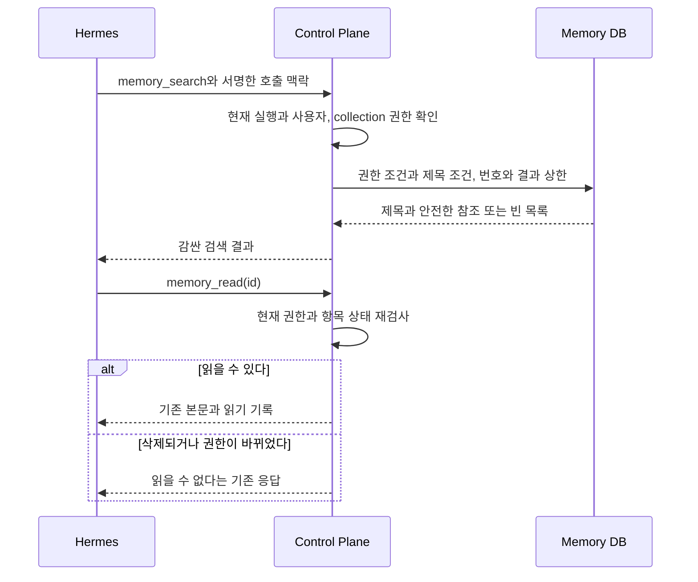
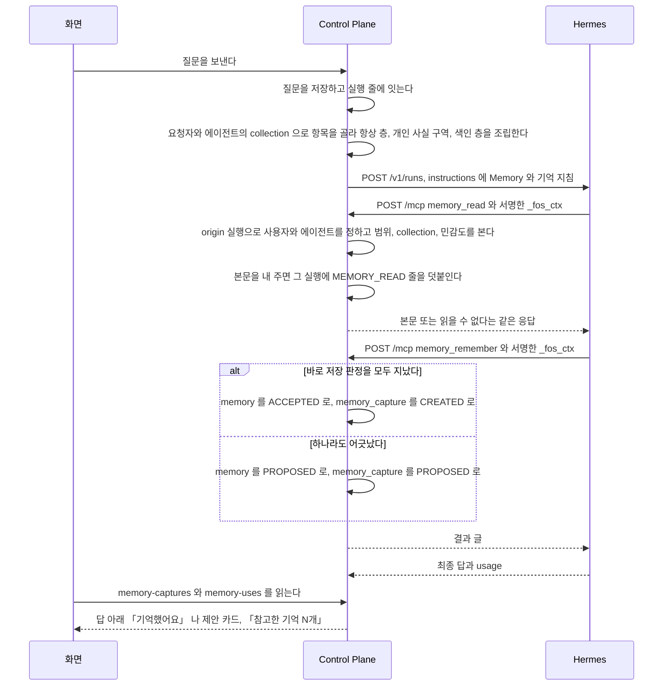

# 기억

에이전트가 실행할 때 받는 사용자의 기억을 남기고 고르고 보이는 기능이다.

covers: `backend/src/main/java/com/bifos/assistant/memory/`, `web/src/components/memory/`, `web/src/app/memory/`, `web/src/components/chat/memory-*`, `web/src/components/chat/use-memory-*`, `web/src/lib/memory-api.ts`, `web/src/lib/memory-capture-api.ts`, `web/src/lib/memory-use-api.ts`, `hermes/plugins/fos-ctx/`

## 제목 검색의 구현 계약

`memory_search`는 색인 예산에서 빠진 항목도 현재 실행의 권한으로 제목에서 찾는다. 결과 번호로 기존 `memory_read`를 불러 본문을 읽는다. #285의 첫 범위이며 본문 검색과 운영 acceptance는 아직 끝나지 않았다.

- 기존 MCP 서버가 읽기 전용 `memory_search(query, limit?, after_id?)`를 받는다. `query`는 앞뒤 공백을 뺀 1자부터 200자까지, `limit`는 기본 10, 1부터 50까지이고 `after_id`는 양의 정수다. 모르는 인자와 잘못된 타입, 선택 인자의 null은 기존 MCP의 `-32602`로 거절한다.
- 첫 범위는 제목의 대소문자를 구별하지 않는 부분 일치다. `%`, `_`, 역슬래시는 검색 문법이 아니라 글자로 다룬다. 본문과 암호문은 검색하지 않는다. 결과는 번호 오름차순이며 `limit + 1`건만 읽어 다음 페이지가 있는지 정한다.
- 결과는 `{items: [{id, title, revision, updatedAt}], nextAfterId}`다. 다음 페이지가 없으면 `nextAfterId`는 null이다. 총건수와 본문, 소유자, 비밀값, 출처 원문의 식별자를 내지 않는다. 빈 결과는 성공이다.
- 검색 SQL은 번호·제목·revision·updatedAt만 조회하며 전체 count와 본문·암호문을 읽지 않는다. 기존 권한 조건의 fluent DTO 투영과 `limit + 1`을 사용한다. 검색에만 독립된 읽기 전용 트랜잭션과 2초 제한을 적용한다. 지연·SQL 실패는 호출 실패로 전파되며 HTTP 경계는 내부 원문 없이 500으로 답한다. 빈 검색 결과와 구별된다.
- 서명한 호출의 origin 실행에서 사용자와 에이전트를 정한다. 매 호출마다 현재 collection 허용을 읽고, DB 질의에 사용자·그룹 범위, `ACCEPTED`, `SEARCH`, `SOURCE` 제외, collection과 민감도 조건을 먼저 건다. 인자나 페이지 번호가 권한을 정하지 못한다.
- 검색 후 `memory_read(id)`는 현재 권한을 다시 검사한다. 그 사이 삭제·거절·권한 철회가 있으면 기존의 읽을 수 없다는 응답을 준다. 검색은 본문을 읽지 않았으므로 「참고한 기억」에 본문을 읽은 것으로 기록하지 않는다. 본문을 낸 기존 `MEMORY_READ` 기록은 유지한다.
- 검색 결과와 제목은 `<external-data>`로 감싼다. 일반 이름과 MCP 접두사가 붙은 이름 모두 시작·완료·실패 사건의 detail과 text를 가린다. 로그에는 실행 번호와 결과 개수만 남긴다. 기존 컨텍스트 예산과 기본 조립 결과는 바꾸지 않는다. 도구 설명이 검색 호출 방법을 안내한다.
- 페이지 사이에 항목이 바뀌면 최신 권한과 제목으로 다시 질의한다. 이미 지난 번호의 새 일치는 처음부터 다시 검색해야 한다. 고정된 자료는 끝까지 누락·중복 없이 탐색한다. 별도 snapshot이나 검색 캐시는 만들지 않는다.

`MemorySearchTest`와 `MemorySearchMysqlTest`는 제목이 모두 일치하는 50/500/5,000건을 만들어 번호 페이지를 끝까지 읽는다. 모든 페이지를 합친 누락과 중복은 0건이다. 타 사용자·다른 그룹·미허용 collection·민감 허용 없음·승인 전·거절·SOURCE·ARCHIVE의 제목 노출도 0건이다. 실제 조립 예산의 `OMITTED` 항목을 검색한 뒤 본문을 읽어야 `MEMORY_READ`가 생기는 것은 `McpMemorySearchToolTest`가 검사한다.

제목이 모두 일치하므로 첫 5건의 Recall@5는 각각 0.1/0.01/0.001, 첫 10건의 Recall@10은 0.2/0.02/0.002다. 이는 결과 상한에 따른 회수율이며 관련도 순위의 평가가 아니다. 본문에만 있고 제목에는 없는 질의의 회수율은 0이다. 본문 검색과 실제 opt-in 파일럿은 별도 미완료 항목이다. 새 벡터·Graph 저장소와 대화 검색, 개인 사실의 값 대체는 이 범위에 넣지 않는다.

2026-10-11 로컬 합성 검사에서 첫 10건을 30회 조회한 값이다. 지연은 트랜잭션과 질의를 포함한 서비스 호출 시간이고, 결과 글자 수는 JSON과 외부 데이터 표시까지 센다. 힙은 결과 직렬화를 포함한 검사 프로세스의 전후 차이여서 GC와 다른 검사에 따라 달라진다. 운영 부하나 한 호출의 최대 메모리를 뜻하지 않는다.

| DB | 자료 수 | p50(ms) | p95(ms) | 결과 글자 수 | 힙 증감(MiB) |
| --- | ---: | ---: | ---: | ---: | ---: |
| H2 | 50 | 0.561 | 0.958 | 910 | +7.5 |
| H2 | 500 | 0.422 | 0.758 | 910 | +7.0 |
| H2 | 5,000 | 0.375 | 1.944 | 910 | +7.0 |
| MySQL | 50 | 7.713 | 9.638 | 879 | +9.5 |
| MySQL | 500 | 4.895 | 8.364 | 888 | +7.5 |
| MySQL | 5,000 | 2.700 | 3.468 | 899 | +7.5 |

번호 자릿수와 DB 시각 표현 때문에 결과 길이는 DB마다 다르다. 별도 MySQL 지연 회귀는 바깥 트랜잭션에 30초 제한을 둬도 검색 JDBC statement의 제한이 2초임을 확인했고, 5초 지연을 넣은 검색은 2,070ms에 실패했다. 네 칸 SELECT와 count·본문 미조회, 다른 조회의 timeout 미변경도 같은 도우미로 검사한다.

## 요구

- Memory 는 에이전트가 실행할 때 `instructions` 로 받는 사실이다. 단일 소스는 Control Plane 데이터베이스이고 Hermes 의 내장 memory 는 쓰지 않는다. 권한은 주입으로 강제한다([ADR-003](../../backend/docs/adr/ADR-003-memory-권한은-주입으로-강제한다.md))
- 범위는 `USER` 와 `GROUP` 둘뿐이고, 실리는 것은 사람이 받아들인 항목뿐이다([ADR-012](../../backend/docs/adr/ADR-012-memory-는-사람이-승인한-것만-남는다.md)). 예외는 사용자가 직접 말한 사실이다(아래 「에이전트가 기억을 남기는 길」)
- 실행에는 층을 나눠 싣는다([ADR-015](../../backend/docs/adr/ADR-015-memory-는-층을-나눠-싣는다.md)). 색인 층의 본문은 에이전트가 `memory_read` 로 읽는다
- 에이전트는 허용된 collection 의 Memory 만 받는다([ADR-053](../../backend/docs/adr/ADR-053-에이전트는-허용된-collection-의-memory-만-받는다.md))
- 민감 본문은 저장할 때 암호화한다([ADR-055](../../backend/docs/adr/ADR-055-민감-memory-본문은-저장할-때-암호화하고-key-는-환경-변수로-받는다.md)). 다른 서비스는 사용자에 묶인 서비스 토큰으로 문서만 읽는다([ADR-056](../../backend/docs/adr/ADR-056-다른-서비스는-사용자에-묶인-서비스-토큰으로-문서를-읽기만-한다.md))
- 사람이 `/memory` 에서 기억을 검토하고 고치고 지우며, 문서는 화면에서 직접 쓴다([ADR-057](../adr/ADR-057-문서는-사람이-화면에서-직접-쓰고-고친다.md))
- 답마다 그 답을 만든 실행이 본문을 받은 기억을 보인다
- 충족은 아래 「Memory 회수 측정」 으로 관측한다

### Memory 에서 아직 만들지 않은 것

아래는 아직 만들지 않았다. 스키마와 판정은 이미 받을 수 있게 되어 있다.

- collection 탭, 문서의 판 이력 화면, 출처 표시
- 신원 항목의 들이기. 암호화와 문서 읽기 경계와 `identity` 권한을 운영에서 확인한 뒤에 연다. 조건은 [ADR-058](../adr/archive/ADR-058-기존-개인-지식-저장소는-주인이-검토한-묶음을-화면에서-올려-들여온다.md) 이 정했다
- 민감 항목 본문의 완전 삭제
- `always_inject` 칸 제거

### 기억 화면

`/memory` 의 「기억」 탭은 「검토할 기억」(`PROPOSED`)과 「알고 있는 것」(`ACCEPTED`)을, 「문서」 탭은 문서를 보인다. 문서를 읽지 못하면 탭 없이 기억 목록만 보인다. 맨 아래 접힌 절에서 서비스 토큰을 관리한다.

- **목록의 줄은 제목과 짧은 표시만 보인다.** 본문은 줄을 눌러 그 자리에서 펼칠 때만 보이고 한 번에 한 줄만 열린다. 휴대폰과 데스크톱이 같은 동작을 하도록 옆 패널이나 주소 이동을 쓰지 않는다
- 「고치기」 와 「지우기」 는 고칠 수 있는 사람(개인 기억은 주인, 그룹 기억은 `ADMIN`)에게만 보인다
- 민감한 기억은 목록이 본문을 싣지 않으므로 펼쳐도 안내만 보이고 「고치기」 가 없다
- 에이전트가 남긴 줄은 남긴 에이전트를 보인다. 이름을 보일지는 서버가 정한다(아래 「범위와 조립」)
- 사람이 손으로 기억과 문서를 만드는 양식은 `web/src/lib/memory-features.ts` 의 `MEMORY_MANUAL_CREATE` 로 숨겨 두었다. 양식과 API 는 지우지 않았다

관리자 에이전트 상세의 「기억 영역」 절(`components/agent/agent-memory-section.tsx`)은 collection 마다 「받음」 과 「민감 항목까지」, 실릴 수 있는 항목 수, 최근 변경을 보인다.
읽지 못해도 상세의 다른 절은 그대로 쓴다. 받는 영역이 하나도 없거나 받지 않는 항목이 있으면 경고만 보이고 저장은 막지 않는다.

### 참고한 기억

답을 만든 실행이 본문을 받은 기억을 그 답 아래에 「참고한 기억 N개」 로 접어 둔다. 무엇을 모으는지는 아래 「답마다 참고한 기억」 이 갖는다.

- 「기억했어요」 줄과 같은 때에 다시 읽는다. 읽지 못하면 앞 목록을 그대로 두고 대화를 막지 않는다
- 펼치면 항목마다 제목과 받은 길(`MemoryUseVia`)을 보이고, 끝에 「기억 화면에서 고치기」 링크를 둔다. 제목은 평문으로만 그린다(ADR-009)
- 새로 나타난 접힌 줄은 맨 아래 따라가기가 보는 글의 변화에 든다. 펼치고 접는 것은 사용자가 한 일이라 따라가기를 바꾸지 않는다

「쓴」 이 아니라 「참고한」 이다. 실렸어도 답에 쓰지 않은 항목이 섞인다([ADR-20261008 / memory-facts](../adr/ADR-20261008-memory-facts.md)).

## 흐름

요청 본문에는 항목 번호만 있고 사용자가 없다. 사용자는 서명한 `_fos_ctx` 로 찾은 origin 실행에서 정한다([`docs/features/mcp.md`](mcp.md) 의 「요구」).
모델이 만든 JSON 에 사용자를 넣게 하면 모델이 남의 Memory 를 읽을 수 있기 때문이다.

## Memory

### 범위와 조립

조립은 `ContextAssembler.assemble` 이 하고, 층을 담는 순서와 그 까닭은 그 Javadoc 이 갖는다.

- 요청자의 `USER` 항목과 요청자 그룹의 `GROUP` 항목 가운데 그 에이전트가 받는 collection 의 `ACCEPTED` 항목만 고른다. 고르는 조건은 `MemoryQueries` 가 데이터베이스에서 건다
- `retrieval` 이 `ALWAYS` 면 항상 층에 본문을, `SEARCH` 면 색인 층에 제목과 번호만 싣는다. `ARCHIVE` 와 종류가 `SOURCE` 인 항목은 싣지 않는다. 짧은 개인 항목은 아래 「개인 사실 구역」 에 본문까지 싣는다
- `SENSITIVE` 항목은 `ALWAYS` 로 저장하지 못한다. 그래서 민감 본문은 `instructions` 에 실리지 않는다
- 조립한 Memory 문맥은 `assistant.context.max-chars` 로 제한한다. 들어가지 않는 항목은 그 항목만 빼고 다음 항목을 계속 담는다. **넘친 항목을 잘라서 싣지 않는다.** 잘린 사실은 틀린 사실이 될 수 있다
- **색인 층에 쓸 자리를 먼저 떼어 둔다.** 몫은 `assistant.context.index-budget-ratio` 다. 색인에서 빠진 허용 항목도 `memory_search` 로 제목과 번호를 찾고 `memory_read` 로 읽을 수 있다
- 빠진 항목 수는 실행의 `context_omitted_items` 에 남기고 `/memory` 목록의 그 항목에 표시를 단다. 대화 화면에는 끼우지 않는다. 목록의 표시는 `assembleForOwner` 가 collection 을 거르지 않고 조립한 결과로 정한다
- 공통 답변 지침과 Memory 를 합친 글자 수와 지문을 실행의 `context_chars` 와 `instructions_hash` 에 남긴다. turn 전용 지시는 뺀다. Memory 가 없어도 공통 지침의 길이와 지문이 남으므로 Memory 주입 여부는 지문만으로 판단하지 않는다
- 본문이나 `retrieval` 이나 `sensitivity` 를 고치면 고치기 전의 값을 `memory_revision` 에 남기고 판 번호를 올린다. 지울 때도 마지막 값을 남긴다
- Memory 목록은 에이전트가 남긴 줄에 남긴 에이전트를 함께 낸다. 이름은 요청자가 그 에이전트를 읽을 수 있을 때만 싣고, 지운 에이전트는 `sourceAgentDeleted` 만 낸다. 볼 수 없는 비공개 에이전트의 이름이 목록으로 새지 않게 하려는 것이다. 판정은 `MemorySources` 가 갖는다
- 기존 개인 지식에서 들인 항목의 출처 칸(`source_type=brain`, `source_ref`, `source_date`)은 출처 기록으로 보존한다

**민감 본문**은 `memory.content` 와 `memory_revision.content` 에 암호문으로 저장하고, 밖으로 내는 자리는 모두 `MemoryService.contentOf` 를 거친다.

- key 가 없으면 민감 항목의 저장과 수정, 암호화한 줄의 읽기를 거절한다. 평문으로 내려 저장하지 않는다
- 일반 항목을 민감 항목으로 바꾸면 물러나는 판과 앞선 평문 판을 같은 트랜잭션에서 함께 암호화한다
- 기동할 때 `MemoryContentBackfill` 이 평문으로 남은 민감 줄을 줄마다 쓰기 잠금으로 다시 읽어 암호화한다. 실패해도 기동은 잇고 예외 클래스 이름만 로그에 남긴다

#### 개인 사실 구역

짧은 개인 사실을 본문까지 매 실행에 싣는 구역이다. 모델이 `memory_read` 를 부르지 않아도 이름과 관계와 선호를 안다.
근거는 [ADR-20261008 / memory-facts](../adr/ADR-20261008-memory-facts.md) 에 있다.

- 후보는 색인 층에 오를 항목(`MemoryService.indexedFor`) 가운데 범위 `USER`, 종류 `MEMORY`, 민감도 `NORMAL` 이고 본문이 `assistant.context.facts-item-max-chars` 이하인 것이다. 예산은 `assistant.context.facts-max-chars` 다
- 넘치면 최근에 고친 것부터 고르고 들어가지 않는 항목은 건너뛴다. 고르지 못한 후보는 색인에 제목으로 남고 빠진 항목으로 세지 않는다
- 고른 항목은 번호 순으로 늘어놓는다. 고른 집합이 같으면 글이 같아 지시문 지문이 바뀌지 않는다
- 제목과 본문의 줄바꿈은 공백 하나로 바꿔 한 줄로 싣는다. 색인 줄도 같다. 모델이 정한 제목이 지시문에 머리 줄을 끼우지 못하게 하려는 것이다
- 구역은 색인 몫을 쓰지 않는다. 그래서 색인 전체가 몫 안에 들면 이 구역이 색인을 밀어내지 못한다
- 실린 항목도 `retrieval` 이 `SEARCH` 라 `memory_read` 로 읽힌다

#### 에이전트의 실행에 보이는 항목

판정은 세 조건이다. 하나라도 지나지 못한 항목은 그 실행에 없는 항목이다.

| 조건 | 무엇을 본다 |
| --- | --- |
| 범위 | `USER` 는 주인, `GROUP` 은 같은 그룹 |
| collection | 그 에이전트가 받는 collection 인가(`agent_memory_collection` 의 줄) |
| 민감도 | `SENSITIVE` 면 그 collection 의 `allow_sensitive` 가 참인가 |

- 줄이 하나도 없는 에이전트, 찾지 못한 에이전트, 에이전트가 없는 실행, 옛 커넥터 에이전트는 아무것도 받지 않는다. 옛 커넥터 에이전트의 실행은 Memory 문맥을 조립하지 않는다([ADR-045](../../backend/docs/adr/ADR-045-커넥터-에이전트는-자기-mcp-서버만-받고-memory-와-control-plane-도구를-받지-않는다.md))
- 새 에이전트에는 `AgentCreated` 사건으로 `core` 한 줄을 넣는다. 에이전트를 만드는 경로가 셋이라 경로마다 넣지 않고 이 사건 하나로 넣는다. 옛 커넥터 에이전트에는 넣지 않는다
- 위임받은 에이전트는 자기 허용으로 판정한다. 부르는 쪽의 허용을 물려받지 않는다
- `ContextAssembler` 는 에이전트를 번호로 받는다. `context` 패키지가 `agent` 를 쓰면 패키지 순환이 하나 늘기 때문이다. `memory` 는 `OmittedMemories` port 로 빠진 항목을 받아 `context` 를 import 하지 않는다

#### 관리자가 에이전트의 collection 을 바꿀 때

`ADMIN` 이 관리자 영역의 에이전트 상세에서 받는 collection 과 민감 허용을 바꾼다. 자동으로 붙이지 않는다. 근거는 [ADR-20261008 / agent-memory-grants-admin](../adr/ADR-20261008-agent-memory-grants-admin.md) 에 있다.
경로와 응답 칸은 `AgentMemorySettingController` 와 `MemoryDtos` 가 갖는다. `PUT` 의 본문은 받을 collection 전체이고, 빈 목록이면 모두 뗀다.
수는 주인이 있으면 주인의 `USER` 항목과 그룹의 `GROUP` 항목을, 없으면 그룹 항목만 센다(`countedFor`). 민감 항목도 센다.

| 갈리는 지점 | 응답 |
| --- | --- |
| `ADMIN` 이 아니다 | `FORBIDDEN` |
| 없거나 지운 에이전트다 | `AGENT_NOT_FOUND` |
| 옛 커넥터 에이전트다 | `FORBIDDEN`. 줄이 있어도 받지 않으므로 바꾸지 않는다 |
| 그룹 목록에도 지금 받는 줄에도 없는 collection, 같은 collection 이 둘, 상한을 넘는 목록 | `VALIDATION_FAILED` |
| 바뀐 것이 없다 | 아무것도 쓰지 않고 지금 값을 낸다 |
| 두 관리자가 동시에 저장한다 | 에이전트 행 잠금을 기다려 하나씩 돈다. 나중 저장이 이기고 기록은 둘 다 남는다. 잠금 읽기가 트랜잭션의 첫 읽기라 나중 저장은 앞 저장이 커밋한 줄을 보고 비교한다 |

바꾼 값은 다음 실행의 조립과 `memory_read` 판정부터 쓰인다. 저장하는 쪽이 따로 비울 캐시가 없다.

### Memory 본문을 읽는 길

색인에 실린 항목의 본문이 필요해지면 에이전트가 `memory_read` 로 읽는다. 위 「흐름」 처럼 요청이 Hermes 에서 Control Plane 으로 거꾸로 온다.
볼 수 없는 항목과 없는 항목은 **같은 응답**으로 답한다. 다르게 답하면 그 항목이 있다는 사실 자체가 새어 나간다.

#### 본문을 읽으면 남는 기록

`memory_read` 가 본문을 내 주면 그 호출의 origin 실행의 `execution_context_source` 마지막 줄 뒤에 `source=MEMORY_READ` 줄을 하나 덧붙인다(`ExecutionContextSourceWriter.append`). 읽지 못한 호출은 남기지 않는다. 답마다 참고한 기억이 이 줄을 읽는다.

- 실행 사건에서 번호를 읽지 않는 까닭은 Hermes 의 `tool.started` 사건이 이 도구의 `id` 인자를 싣지 않기 때문이다([`hermes/docs/hermes-contract.md`](../../hermes/docs/hermes-contract.md) 의 「붙은 커넥터 서버의 도구 사건」)
- 저장은 새 트랜잭션에서 하고 실패해도 도구 결과를 바꾸지 않는다. 순서 번호가 부딪치면 한 번 다시 시도하고, 그래도 실패하면 실행 번호만 경고 로그로 남긴다. 관측용 기록이기 때문이다
- 이 줄은 조립 결과가 아니라 실행 뒤의 기록이다. `context_chars` 와 `instructions_hash`, `context_omitted_items` 에 들지 않는다

#### 본문 읽기가 갈리는 지점

| 무엇이 | 어떻게 되는가 |
| --- | --- |
| 남의 개인 항목, 다른 그룹의 항목, 없는 번호 | 읽을 수 없다는 같은 응답이다 |
| 받지 않는 collection 의 항목, 허용받지 않은 민감 항목 | 같은 응답이다 |
| 승인 전인 항목, 항상 층에 이미 실린 항목, 보관한 항목, 출처 원문 | 같은 응답이다 |
| origin 실행에 에이전트가 없거나 그 에이전트를 찾지 못한다 | 같은 응답이다. 받는 collection 이 없다 |
| origin 실행의 에이전트가 옛 커넥터 에이전트다 | 요청자 판정에서 먼저 거절한다. 호출 맥락을 확인할 수 없다는 응답이다 |
| 위임받아 도는 에이전트가 읽는다 | 그 에이전트의 허용으로 판정한다 |

#### Memory 를 고치고 지울 때

판을 남기는 것과 항목을 고치는 것은 한 트랜잭션이다. 거절한 수정은 판을 남기지 않는다.
**민감 항목은 `PATCH /api/v1/memories/{id}` 로 고치지 못한다.** 목록이 민감 본문을 싣지 않아 화면이 본문을 읽지 않은 채 덮어쓰게 되기 때문이다.
항상 싣는 설정을 끄면 색인으로 간다. 이미 보관한 항목은 보관한 채로 둔다.
문서(`DOCUMENT`)는 `/api/v1/memory-documents` 가 따로 다루고, Memory 목록과 수정, 승인 경로는 문서를 없는 항목과 같은 응답으로 답한다. 문서를 고칠 때 화면이 읽은 판 번호가 지금 판과 다르면 거절한다.

#### 다른 서비스가 문서를 읽을 때

다른 서비스는 `GET /api/v1/service/memory-documents/{collection}/{documentKey}` 로 토큰이 묶인 사용자의 `USER` 문서 하나를 읽는다. 판정은 위 세 조건과 같고, collection 과 민감 허용은 `service_token_collection` 이 정한다.
인증은 `ServiceTokenInterceptor` 가 하고, 그 경로는 웹 JWT 필터를 건너뛴다. `shared` 가 `memory` 를 쓰지 않게 하기 위해서다.

| 응답 | 언제 |
| --- | --- |
| 200 | 읽을 수 있다. `Cache-Control: no-store` 와 만료 시각 머리말을 붙인다 |
| 401, 본문 없음 | 토큰이 없다, 틀렸다, 폐기됐다, 만료됐다, 주인이 허용 목록에서 꺼졌다. 다섯을 구분하지 않는다 |
| 403, 본문 없음 | `Origin` 머리말이 있다. 브라우저에서 부르는 길이 아니다 |
| 404 `MEMORY_NOT_FOUND` | 없는 문서, 받지 않는 collection, 허용 없는 민감 문서, 승인 전, `DOCUMENT` 가 아님. 모두 같은 응답이다 |
| 409 `MEMORY_ENCRYPTION_UNAVAILABLE` | 읽을 수 있는 민감 문서인데 그 key 가 없다 |

서비스 토큰은 만료가 필수이고, 인증과 발급마다 주인이 허용 목록에 켜져 있는지 묻는다(ADR-059). 관리자가 사용자를 끄면 같은 트랜잭션에서 그 사람의 토큰을 모두 폐기하고, 폐기가 실패하면 끄기도 롤백된다. 다시 켜도 되살아나지 않는다.
`memory` 가 `people` 을 import 하지 않게 하려고 그 사건과 질문의 타입을 `shared.auth` 에 둔다. 토큰과 본문은 로그에 남기지 않는다.

### 에이전트가 기억을 남기는 길

에이전트는 Control Plane MCP 도구 `memory_remember` 로 사람에 관한 오래 쓰일 사실을 남긴다.
바로 저장(`ACCEPTED`)할지 제안(`PROPOSED`)으로 둘지는 Control Plane 이 실행의 출처로 정한다.
결정과 프롬프트 주입을 막는 근거는 [ADR-20261007 / memory-remember](../adr/ADR-20261007-memory-remember.md) 에, `evidence` 를 판정에서 빼고 부정이 뒤집힌 글과 민감해 보이는 글과 오래된 대화를 제안으로 내리는 근거는 [ADR-20261008 / memory-remember-guard](../adr/ADR-20261008-memory-remember-guard.md) 에 있다.

#### 도구 계약(Memory)

도구 정의와 입력 스키마, 값 검사, 결과 글과 `isError` 는 `McpMemoryRemember` 가 갖는다.

- 사용자와 범위를 인자로 받지 않는다. 주인은 origin 실행의 사용자이고 범위는 늘 `USER` 다. 「사용자가 요청했다」 같은 인자도 없다
- `evidence` 는 판정에 쓰지 않는다. 앞선 도구 정의로 부르는 모델이 인자 오류를 받지 않게 받기만 한다
- `memory_id` 는 같은 사실을 고칠 기존 항목 번호이고, 지시문의 개인 사실 구역이나 색인에 있는 번호다
- `sensitive` 가 참이면 늘 제안이고 본문은 암호문으로 저장한다
- 꺼내는 방식은 `SEARCH` 로 고정한다. 항상 싣기는 사람이 `/memory` 에서 켠다
- 먼저 살펴보기 트리에서는 받지 않는다. 옛 커넥터 에이전트의 실행은 요청자 판정에서 먼저 거절한다
- **fos-ctx 가 이 도구를 서명 필수로 안다.**
- **실행 사건에 이 도구의 인자와 결과를 남기지 않는다.** `HermesRunEventStream` 이 시작 사건과 끝 사건의 `detail` 을 비운다. 인자에 사람에 관한 사실이 실린다

이 도구를 받는 실행의 공통 답변 지침 뒤에는 「# 기억」 절(`ContextAssembler.MEMORY_INSTRUCTIONS`)을 싣는다. 옛 커넥터 에이전트와 먼저 살펴보기 turn 은 싣지 않는다.

#### 바로 저장 판정

일곱 조건을 모두 만족하면 바로 저장하고, 하나라도 어긋나면 제안으로 내린다. 거절하지 않는다.
모델이 준 `evidence` 와 `sensitive=false` 는 바로 저장의 근거가 되지 못한다. 본문이 질문 원문과 글자 그대로 같을 필요는 없다.
4 와 5 는 지금 실행 하나가 아니라 대화 전체를 본다. Hermes session 이 앞 turn 의 도구 결과와 맡긴 일의 결과를 이력으로 이어 가므로, 앞 turn 에서 읽은 바깥 글이 뒤 turn 의 짧은 대답(「응 그래」)을 근거로 저장을 시킬 수 있다.

| 순서 | 조건 | 어디서 본다 |
| --- | --- | --- |
| 1 | origin 실행이 루트 실행이다 | `agent_execution` |
| 2 | 그 실행이 사람이 보낸 turn 이다. 새 질문과 다시 생성만 해당한다 | `execution_question` 과 그 사용자의 `USER` 메시지 |
| 3 | 부정 표지가 질문 원문과 본문에 함께 있거나 함께 없다 | `chat_message.content`, 인자 `content` |
| 4 | 그 대화의 어느 실행에도 안쪽 도구 밖의 `TOOL_STARTED` 사건이나 `SUBAGENT_STARTED` 사건이 없다 | `execution_event` |
| 5 | 그 대화에 사람의 질문 없이 Hermes 로 보낸 루트 실행이 없다. 맡긴 일의 결과를 전하는 turn 과 예약 작업 turn, 질문 줄이 없는 실행이 여기 걸린다 | `agent_execution` 과 `execution_question` |
| 6 | 민감하지 않다 | 인자 `sensitive` |
| 7 | 제목과 본문에 민감해 보이는 글이 없다 | 인자 `title`, `content` |

1 부터 5 는 `McpMemoryRemember` 가, 6 과 7 은 `MemoryCaptureService` 가 본다.
안쪽 도구는 바깥 글을 읽지 않는다고 보는 도구이고, 목록과 넣지 않는 도구의 까닭은 `McpMemoryRemember.INTERNAL_TOOLS` 의 Javadoc 이 갖는다.
부정 표지의 모양은 `NegationMarkers` 가 갖는다. 한쪽에만 있으면 뜻이 뒤집혔을 수 있어 제안으로 내린다. 글 전체를 보므로 질문의 다른 문장에 있는 부정도 센다.
민감해 보이는 낱말과 숫자열의 모양은 `MemorySensitiveHints` 가 갖는다. 잘못 걸려도 제안 카드가 될 뿐이고, 민감도는 모델이 준 값 그대로 저장해 사람이 제안 카드에서 정한다.

이 판정 뒤에 공통으로 본다.

- 한 실행이 남긴 기록이 `MemoryCaptureService.PER_EXECUTION_MAX` 에 닿았거나, `collection` 이 그 에이전트가 받는 collection 이 아니면 저장하지 않는다
- 같은 사용자의 같은 제목과 본문이 있으면 새 줄을 만들지 않는다. 그 줄이 제안이고 지금이 바로 저장 조건이면 받아들인다
- `memory_id` 는 바로 저장 조건일 때만 그 항목의 본문을 고친다. 요청자의 `USER` 범위 `MEMORY` 항목이고 `ACCEPTED` 이고 민감하지 않고 받는 collection 이어야 한다. 제목과 꺼내는 방식은 그대로다
- 상한과 중복 확인은 잠그지 않는다. 한 실행이 도구를 나란히 부르면 상한을 넘거나 도구 오류가 날 수 있다. 할 일 제안과 같은 수준으로 둔다

#### 대화에 보이는 것

기록 한 줄이 `memory_capture` 에 남고, 대화는 그 기록을 만든 실행의 답 아래에 그린다. 경로와 응답 칸은 `MemoryCaptureController` 가 갖는다.
맡겨서 도는 실행이 남긴 제안은 그 대화에 답 줄이 없어 `/memory` 의 제안 목록에서만 보인다.

| 기록 | 화면 | 되돌리기 |
| --- | --- | --- |
| `CREATED` | 「기억했어요」 와 본문, [고치기] [되돌리기] | 새 항목을 지우고, 기존 제안을 받아들였으면 제안 상태로 돌린다 |
| `UPDATED` | 「기억을 고쳤어요」 와 본문, [고치기] [되돌리기] | 고치기 전의 판으로 돌린다 |
| `PROPOSED` | 제안 카드 [받아들이기] [고쳐서 받아들이기] [거절] | 없다 |

- 되돌리기는 그 뒤에 항목이 다시 바뀌었으면 409 `MEMORY_REVISION_CONFLICT` 다. 남의 기록과 없는 기록은 같은 404, 제안 기록은 409 이고, 이미 되돌린 기록은 그대로 둔다
- 대화의 기록 목록은 되돌린 기록과 항목이 없어진 기록을 빼고, 민감 항목은 본문을 싣지 않는다
- 제목과 본문은 모델이 쓴 글이라 평문으로만 그린다(ADR-009). 로그에는 사용자, 항목, 실행, 기록 번호와 결과만 남긴다

### 답마다 참고한 기억

대화의 답 아래에 그 답을 만든 실행이 본문을 받은 기억을 모은다. 근거는 [ADR-20261008 / memory-facts](../adr/ADR-20261008-memory-facts.md) 에 있고, 화면은 위 「참고한 기억」 이 갖는다.
경로와 응답 칸은 `MemoryUseController` 가, 받은 길의 뜻은 `MemoryUseVia` 가 갖는다.

- 재료는 답 실행의 `execution_context_source` 가운데 본문을 실은 `MEMORY_ALWAYS` 와 `MEMORY_FACTS` 줄, 그리고 `MEMORY_READ` 줄이다. 제목만 실은 `MEMORY_INDEX` 와 빠진 `OMITTED` 는 넣지 않는다
- 읽은 항목은 지금 권한으로 다시 판정해, 그 실행의 에이전트가 지금도 `memory_read` 로 읽을 수 있는 항목(`MemoryService.readableByTool`)만 넣는다
- 지금 요청자가 읽을 수 있고 `ACCEPTED` 인 항목만 지금 제목으로 낸다. 지운 항목, 남의 항목, 되돌려 제안으로 돌아간 항목은 뺀다
- 본문은 싣지 않는다. 민감 항목도 제목만 낸다. 제목은 `/memory` 목록에도 평문으로 보이는 값이다
- 같은 항목이 실은 것과 읽은 것에 둘 다 있으면 앞의 것 하나만 남긴다
- Control Plane 이 맡겨서 도는 하위 실행이 읽은 항목은 넣지 않는다. 그 실행의 답 메시지가 대화에 없다. Hermes 안의 하위 에이전트는 부모의 origin 실행을 물려받으므로, 그 하위 에이전트가 읽은 항목은 origin 실행의 답에 붙는다

## 문맥 묶음

Control Plane 이 여러 기록에서 모은 문맥의 항목 모델, source 마다의 판정, Hermes 에 넘기는 형식, 로그와 저장 규칙을 갖는다.
결정은 [ADR-071](../../backend/docs/adr/ADR-071-여러-출처의-문맥은-항목마다-출처와-권한과-신선도를-지닌-묶음으로-조립한다.md) 에 있다. Memory 의 층과 예산과 `memory_read` 는 위 「Memory」 가 갖고, 이 절은 그 위에 얹는 항목 모델만 갖는다.

### 항목의 칸

칸 이름은 `ContextItem` 이, 값과 그 뜻은 각 enum(`ContextSource`, `ContextTrust`, `ContextFreshness`, `ContextBodyMode`)이 갖는다.

- `ref` 는 원래 기록의 참조이고 `<표 이름>:<번호나 공개 식별자>` 형식이다. 예: `memory:<번호>`, `execution:<번호>`, `connector_action:<공개 식별자>`, `follow_up:<공개 식별자>`, `conversation:<공개 식별자>`
- `scope` 는 원래 기록의 범위다. 범위가 없는 기록은 `USER` 다
- `conflictsWith` 는 아래 「충돌 표시」 의 경우에만 찬다

**항목 타입의 `toString` 은 `source` 와 `ref` 만 낸다.** Java record 의 기본 `toString` 은 모든 칸을 내므로, 항목이나 묶음을 로그에 넘기면 본문이 그대로 남는다.
`AssembledContext` 도 같은 이유로 `toString` 이 `instructions` 를 내지 않는다.

### 참여하는 source

| `source` | 원래 기록 | `sensitivity` | `trust` | `bodyMode` | 쓰는 곳 |
| --- | --- | --- | --- | --- | --- |
| `MEMORY_ALWAYS` | `memory` 의 `ALWAYS` | 원래 값. `SENSITIVE` 는 이 층에 오지 못한다 | `USER_APPROVED` | `INLINE` | 대화 turn 의 `instructions` |
| `MEMORY_FACTS` | 「개인 사실 구역」 에 실린 항목 | `NORMAL` 만 | `USER_APPROVED` | `INLINE` | 대화 turn 의 `instructions` |
| `MEMORY_INDEX` | `memory` 의 `SEARCH` | 원래 값 | `USER_APPROVED` | `TITLE_ONLY` | 대화 turn 의 `instructions` |
| `MEMORY_READ` | `memory_read` 가 본문을 내 준 항목 | 묶음 항목이 아니다 | 묶음 항목이 아니다 | `INLINE` | 도구 처리가 `execution_context_source` 에만 덧붙인다 |
| `DELEGATION_RESULT` | 아직 전하지 않은 위임 실행의 `output_text`(`AgentExecutionRepository.findUndeliveredResults`) | `SENSITIVE` | 옛 커넥터 에이전트의 답이면 `EXTERNAL`, 아니면 `AGENT` | `INLINE` | 자동 turn 의 `input` |
| `CONNECTOR_RESULT` | `connector_action` 의 `result_text` | `SENSITIVE` | `EXTERNAL` | `INLINE`. `UNKNOWN` 이면 `OMITTED` | 자동 turn 의 `input` |
| `EXECUTION_STATE` | `agent_execution` 의 상태와 시각 | `NORMAL` | `CONTROL_PLANE` | 본문이 없다 | 지금 화면과 먼저 알리기 |
| `FOLLOW_UP` | `follow_up` | `SENSITIVE` | 사람이 받아들였으면 `USER_APPROVED`, 제안이면 `AGENT` | `TITLE_ONLY` | 지금 화면과 먼저 알리기 |

**묶음은 source 의 기존 판정을 통과한 것만 받는다.** 판정을 다시 하거나 넓히지 않고, 항목을 합치거나 요약하지 않는다. 그래서 `USER` 와 `GROUP` 이 한 항목으로 섞이지 않는다.
**`SENSITIVE` 본문은 `instructions` 에 싣지 않는다.** 결과 항목은 `input` 에만 싣고, `EXTERNAL` 은 `ExternalData.wrap` 하나로 감싼다.

**`EXECUTION_STATE` 와 `FOLLOW_UP` 은 대화 turn 에 싣지 않는다.** 지금 화면이 「왜 보였는가」 의 `sources` 에 이 `source` 이름과 `ref` 형식을 쓸 뿐이다. 대화마다 실으면 할 일이 지식처럼 쓰여 새 Memory 층이 된다([ADR-073](../adr/ADR-073-할-일은-에이전트가-제안하고-사람이-받아들인-것만-챙긴다.md)).

**커넥터의 실시간 데이터는 source 가 아니다.** Control Plane 은 커넥터를 직접 부르지 않는다.
일정 같은 커넥터 데이터는 연결을 붙인 에이전트가 turn 안에서 직접 부른 도구의 결과로 들어오고, 묶음을 거치지 않고 `fos-ctx` 가 `<external-data>` 로 감싼다([`hermes/plugins/fos-ctx/README.md`](../../hermes/plugins/fos-ctx/README.md)).
일정 커넥터가 생기면 그 결과를 읽는 source 를 이 표에 더한다.

**옛 커넥터 에이전트의 실행에는 묶음을 주지 않는다.** 연결을 붙인 일반 에이전트는 보통 에이전트와 같은 묶음을 받는다.

### Hermes 에 넘기는 형식

Runs API 는 `instructions` 와 `input` 두 글을 받는다([`hermes/docs/hermes-contract.md`](../../hermes/docs/hermes-contract.md)).

**Memory 항목의 글은 바꾸지 않는다.** 머리말이 이미 출처를 말하고, 색인의 `[번호]` 가 `memory_read` 의 입력이자 참조다. 그래서 Memory 를 묶음으로 옮겨도 충돌 표시가 붙는 경우를 빼면 `instructions_hash` 가 바뀌지 않는다.
**결과 항목에는 출처 머리줄을 붙인다.** 자동 turn 과 사용자가 다시 전달하는 turn(`ChatService.retryDelivery`)이 같은 형식을 쓰고, 머리줄의 칸과 안내는 `ResultHeader` 가 갖는다. 도구의 원래 이름과 승인 줄의 공개 식별자는 싣지 않는다.
결과를 전하는 지시 끝에 붙이는 글은 `TurnIntent.RESULT_HANDLING_RULES` 가 갖는다. 출처가 다른 내용이 어긋나면 하나를 고르지 않고 두 출처와 시각을 함께 말하게 한다. 어느 쪽을 믿는지의 차례는 `ContextTrust` 의 값 순서이고 그 결정은 ADR-071 이 갖는다.

#### 공통 실행 지침

`ContextAssembler.withResponseInstructions` 는 Memory 예산 밖에 답변 형식과 도구 호출 지침을 더한다.
대화, Control Plane 이 시작한 자식 실행, 먼저 살펴보기에 같은 도구 호출 지침을 보내고, 새 profile 과 기존 profile 모두 다음 실행부터 받는다.
로컬 MCP 도구는 같은 서버의 읽기 도구라도 각각 호출하도록 안내한다. Hermes 의 단건 제한과 원격 도구 구분은 [도구 hook 과 승인](../../hermes/docs/hermes-contract.md#tool_call-의-단건-제한)이 갖는다.

이 안내는 서버의 권한 검사를 바꾸지 않는다. Hermes 의 네이티브 `delegate_task` 자식은 부모의 실행 지침을 자동 상속하지 않아 이 안내의 적용을 보장하지 않는다. 근거는 [자식 agent 생성](https://github.com/NousResearch/hermes-agent/blob/v2026.9.24/tools/delegate_tool.py#L202-L249)이다.

### 신선도

Memory 는 `updated_at` 이 `assistant.context.memory-stale-after` 안이면 `FRESH` 다. `assistant.context.memory-collection-stale-after` 에 collection 별 기준을 적으면 그것을 먼저 쓴다.
결과는 끝난 시각이 `assistant.context.result-stale-after` 안이면 `FRESH` 다. 실행 상태와 할 일은 늘 `FRESH` 다. 기준이 0 이하이거나 시각이 없으면 `UNKNOWN` 이다.

- 신선도는 내용이 여전히 참이라는 보증이 아니며 사용자 승인(`trust`)과 별개다
- 낡았다는 이유로 항목을 빼거나 Memory 를 고치지 않는다. 주입 글과 그 지문도 바꾸지 않는다
- 판정 값은 문맥 묶음과 `execution_context_source.freshness` 에 남고, 이미 저장한 실행 기록은 다시 판정하지 않는다
- 결과는 보통 몇 초 안에 전해져 `STALE` 이 되지 않는다. 결과 다시 전달이 몇 시간 뒤에 전할 때 `STALE` 이 붙는다

### 충돌 표시

Control Plane 이 구조로 알 수 있는 충돌만 `conflictsWith` 에 적는다.
같은 `collection` 과 `document_key` 의 `USER` 문서와 `GROUP` 문서가 둘 다 색인에 오르면 두 색인 줄 끝에 서로를 가리키는 표시를 붙인다.
충돌 표시는 색인 줄의 길이에 든다. 색인 몫과 「길어서 답에 포함되지 않음」 판정도 실제로 보내는 글과 같은 길이로 센다.
뜻이 어긋나는 것(기억은 「회의는 화요일」 인데 결과는 「수요일로 옮겼다」)은 Control Plane 이 찾지 않는다. 그 까닭은 ADR-071 의 대안 기각이 갖는다.

### 로그와 저장

- **로그에는 사용자 번호, 실행 번호, 항목의 `source` 와 `ref`, 개수, 글자 수만 낸다.** 제목과 본문은 내지 않는다
- **묶음의 원문은 저장하지 않는다.** 실행 기록에는 `context_chars`, `context_omitted_items`, `instructions_hash` 를 남긴다
- **실행마다 실은 항목의 참조를 남긴다.** `execution_context_source` 표다([`backend/docs/data-schema.md`](../../backend/docs/data-schema.md) 의 「execution_context_source」). 제목과 본문은 남기지 않는다
- **도구 사건에 Memory 본문을 남기지 않는다.** Hermes 의 `tool.completed` 사건은 결과를 싣지 않는다([`hermes/docs/hermes-contract.md`](../../hermes/docs/hermes-contract.md) 의 「실행 이벤트가 실제로 오는 형태」). Hermes 가 뒤에 `result` 를 싣기 시작해도 `memory_read` 사건의 `detail` 은 `tool.started` 의 `preview` 만 쓴다

### 합성 시나리오

모든 값은 지어낸 것이다.

| 상황 | 기대 |
| --- | --- |
| 기억 「주간 회의는 화요일 10시」(`MEMORY_ALWAYS`)와 옛 커넥터 에이전트의 위임 결과 「수요일로 옮겨졌다」(`DELEGATION_RESULT`, `EXTERNAL`)가 어긋난다 | 결과에 출처 머리줄과 `<external-data>` 가 붙고 Memory 는 그대로다. 답은 두 출처를 함께 말하고 기억을 바꿀지 묻는다 |
| 승인한 호출의 결과(`CONNECTOR_RESULT`)를 몇 시간 뒤 다시 전한다 | 머리줄에 오래됨이 붙는다. 같은 승인 줄은 다시 실행되지 않고(ADR-050) 결과 글만 다시 싣는다 |
| 민감 문서 하나와 같은 이름의 개인 문서, 그룹 문서가 있다 | 민감 문서는 민감 허용을 받는 에이전트에만 제목으로 오른다. 두 문서는 따로 오르고 서로를 가리키는 충돌 표시가 붙는다. 받지 않는 에이전트에는 오르지 않고, 빠진 수는 로그에 개수로만 남는다 |
| 옛 커넥터 에이전트와 대화를 시작한다 | Memory 항목이 하나도 실리지 않는다. 연결을 붙인 일반 에이전트는 자기 collection 에 따라 실린다 |

## Memory 회수 측정

Memory 를 바꿀 때마다 「다음 대화에서 알고 있는가」 와 「틀리거나 남의 사실을 싣지 않는가」 를 숫자로 보는 측정 도구다. 합성 측정과 운영 집계 둘로 나눈다.

**합성 측정의 숫자는 모델 답의 오기억률이 아니다.** 모델 없이 조립한 글만 보고, 실린 글에 틀린 사실이 있으면 모델이 그것을 쓸 수 있다는 「노출」 을 센다. 보고서 첫 줄과 이 문서가 그렇게 밝힌다.
운영 집계는 기록 칸만 읽으므로 답이 맞았는지는 알 수 없다.

### 합성 측정

`MemoryRecallEvalTest` 가 CI 의 backend 검사(`./gradlew test`)에 함께 돈다. 결과는 `backend/build/reports/memory-eval/` 의 `report.md` 와 `report.json` 에 남고 표준 출력에도 나온다.
사례마다 Memory 를 표에 직접 넣고 `ContextAssembler.assemble` 로 조립한 묶음에서 항목마다 상태(`MemoryEvalScoreboard.ItemState`)를 읽는다. Hermes 대역도 모델도 부르지 않아 빠르고 결과가 늘 같다.
측정 모드는 개인 사실 구역을 끈 `factsOff` 와 운영 기본값의 `factsOn` 둘이고, `ContextProperties` 만 바꾼 `ContextAssembler` 를 테스트 안에서 따로 만들어 고른다.

#### 시험 세트

사례 묶음은 `backend/src/test/resources/memory-eval/family-cases.json` 이고 칸의 모양은 `MemoryEvalDataset` 이 갖는다. 실제 사람 이름, 메일, 계정, 금액을 쓰지 않는다. 이 저장소는 공개 저장소다.
범주는 LongMemEval(arXiv 2410.10813)의 다섯 능력에 권한 경계와 부하를 더했다. 질문을 판정에 쓰지 않으므로 범주는 「그 능력에 필요한 사실이 글에 실리는가」 를 사례로 나누는 이름이다.

| 범주 | 뜻 |
| --- | --- |
| `INFORMATION_EXTRACTION` | 한 번 말한 사실을 다음 대화에서 안다 |
| `MULTI_SESSION` | 여러 대화에서 나눠 말한 사실을 함께 안다 |
| `KNOWLEDGE_UPDATE` | 바뀐 사실의 새 값을 안다 |
| `TEMPORAL` | 최근에 바뀐 사실이 예산 안에 든다 |
| `ABSTENTION` | 말한 적 없는 것에 엉뚱한 사실이 붙지 않는다 |
| `BOUNDARY` | 남의 항목과 권한 밖 항목이 실리지 않는다 |
| `LOAD` | 항목이 많을 때 실리는 글자와 빠지는 항목 |

`forbidden` 의 `BOUNDARY` 항목은 묶음에 있으면 `OMITTED` 여도 실패다. 고르는 단계를 지났다는 뜻이기 때문이다.

#### 지표(Memory 회수 측정)

지표는 모드마다, 범주마다 낸다. 계산은 `MemoryEvalScoreboard` 가 갖는다.

| 지표 | 계산 |
| --- | --- |
| 회수율(본문), 회수율(제목 이상) | `expect` 항목 가운데 `INLINE` 인 수, `INLINE` 이나 `TITLE_ONLY` 인 수 / `expect` 항목 수 |
| 오기억 노출률 | `SUPERSEDED` 와 `DISTRACTOR` 항목 가운데 `INLINE` 인 수 / 그 항목 수 |
| 권한 경계 노출 | `BOUNDARY` 항목 가운데 `ABSENT` 가 아닌 수 |
| 실행당 Memory 글자 수, 빠진 항목 | 조립 결과의 글자 수(공통 답변 지침은 뺀다)와 빠진 항목 수 |

**실패 조건은 권한 경계 노출 하나다.** 어느 모드에서든 0 이 아니면 테스트가 실패한다.
나머지 지표는 보고서에만 남긴다. 기준선이 아직 없고, 개인 사실 구역이 오기억 노출을 늘리는 것은 알고 고른 비용이기 때문이다([ADR-20261008 / memory-facts](../adr/ADR-20261008-memory-facts.md)).

### 운영 집계

운영 데이터베이스에서 읽기만 하고 본문과 제목 칸을 읽지 않는다. 접속과 실행 방법은 운영 저장소가 갖는다.

| 지표 | 읽는 칸 | 무엇을 정하는 근거인가 |
| --- | --- | --- |
| 되돌리기 비율 | `memory_capture` 의 `CREATED`, `UPDATED` 가운데 `undone_at` 이 있는 비율 | 뒤처리 추출(#310 의 4단계)을 켤지 |
| 바로 저장 대 제안과 제안의 결말 | `memory_capture.kind` 와 그 항목의 `memory.status`. 지운 항목은 줄이 없어 따로 센다 | 바로 저장 판정이 너무 좁거나 넓은지 |
| 실행당 문맥 글자 수와 빠진 항목 | 대화 루트 실행의 `context_chars`, `context_omitted_items`. `context_chars` 는 공통 답변 지침을 함께 센다 | 예산과 길이 상한 |
| 층별 항목 수 | `execution_context_source` 의 `MEMORY_` 로 시작하는 `source` 와 `body_mode`. `MEMORY_READ` 는 읽기 성공 수로 읽는다 | 개인 사실 구역의 효과 |
| `memory_read` 호출률 | 대화 루트 실행 가운데 `memory_read` 의 `TOOL_STARTED` 사건이 있는 비율 | 개인 사실 구역이 이 값을 줄이는지 |
