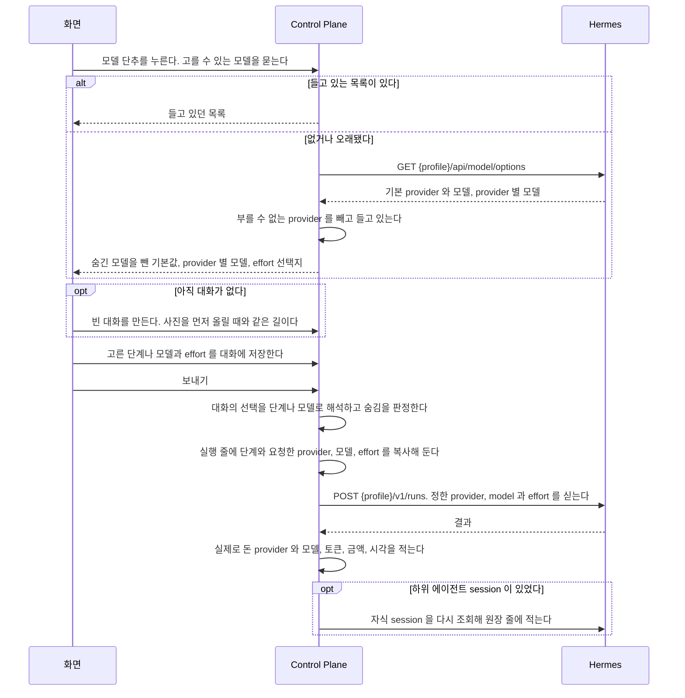

# 모델과 사용량

대화마다 모델과 단계를 고르고, 실행이 쓴 토큰과 사용량을 기록해 보이는 기능이다.

covers: `backend/src/main/java/com/bifos/assistant/model/`, `backend/src/main/java/com/bifos/assistant/usage/`, `backend/src/main/java/com/bifos/assistant/chat/**/Model*`, `web/src/components/usage/`, `web/src/app/usage/`, `web/src/app/admin/usage/`, `web/src/lib/usage-api.ts`, `web/src/lib/provider-label.ts`, `web/src/components/chat/model-picker.tsx`, `web/src/components/chat/use-composer-model.ts`, `web/src/lib/chat-api.ts`

## 요구

- 대화마다 빠르게, 균형, 깊게 가운데 하나를 고르거나, 고급에서 provider 와 모델, reasoning effort 를 직접 고른다. 에이전트는 모델을 갖지 않는다([ADR-030](../../backend/docs/adr/ADR-030-모델과-effort-는-대화가-고르고-기본값은-hermes-profile-이-갖는다.md)).
- 고르지 않은 대화는 「모델 선택」 의 순서로 정한다. 에이전트 기본 모델과 그룹의 모델 숨김은 Control Plane DB 가 갖는다([ADR-054](../../backend/docs/adr/ADR-054-에이전트-기본-모델과-모델-숨김은-control-plane-db-가-갖는다.md)).
- 실행 줄마다 고른 단계, 요청한 effort, 실제로 돈 provider 와 모델, 토큰, 금액, 네 시각을 남긴다. native 하위 에이전트의 사용량도 합계에 더한다.
- 관리자는 첫 반응 시간을 제품 지표로 본다.

**금액과 모델과 토큰은 관리자 영역에만 그린다.**
`/usage` 는 역할과 상관없이 실행 건수와, 에이전트 이름, 시각, 걸린 시간, 상태, 쓴 스킬 이름, 다시 보낸 실행 표시만 보인다.
**화면만 가리지 않는다. Control Plane 이 `MEMBER` 역할에게는 그 값을 응답에서 뺀다.**
빼는 값의 표는 [`docs/features/chat.md`](chat.md) 의 「역할에 따라 응답에서 빼는 값」 절이 갖는다.
`ADMIN` 은 일반 화면에서도 응답으로는 그 값을 받는다. 일반 화면이 그리지 않을 뿐이다([ADR-063](../adr/ADR-063-관리자-전용-표시와-동작은-관리자-영역에만-두고-일반-경로의-응답은-서버가-역할에-따라-줄인다.md)).

## 흐름

대화에서 모델을 고르고 보낸 turn 이 그 값으로 돌아 실행 줄에 남는 흐름이다.

## 사용량 화면

`/usage` 와 `/admin/usage` 는 같은 부품을 쓰고 탭으로 나눈다. 고른 탭은 주소 `?tab=` 에 남아 새로 고쳐도 같은 탭이 열린다.
탭과 절은 `web/src/components/usage/` 가 갖는다. 「설정별 사용량」 탭과 「사용량 내역」, 「첫 반응 시간」, 「먼저 알리기」 절은 `/admin/usage` 에만 있다.
두 화면 모두 자기 실행만 읽는다. 여러 사용자의 실행을 모아 보는 별도 화면은 없다.
실행 상세(`/executions/{id}`)의 머리 요약도 같은 규칙을 따르고, 도구 줄의 원본은 `/admin/executions/{id}` 에서만 보인다.

| 절 | 그리지 않는 때 |
| --- | --- |
| 제목 없는 합계 칸 | 합계를 불러오지 못했을 때 |
| 사용량 내역 | 첫 조회가 실패했을 때. 그 자리에 실패 문구만 그린다 |
| 설정 차이 | 견줄 지문이 둘 미만일 때 |
| 첫 반응 시간, 먼저 알리기 | 조회가 실패했을 때. 그 자리에 실패 문구만 그린다 |
| 실행 기록 | 없다. 기록이 없으면 빈 상태를 그린다 |

위 표는 절 하나씩의 조건이다.
**실행 목록 조회가 실패하면 페이지 전체가 실패 문구 한 줄이 되고 위 절이 모두 함께 사라진다.**
실행 기록의 「더 보기」 가 실패하면 이미 읽은 기록을 유지하고 안내와 재시도 단추를 보인다.

**「사용량 내역」 은 그 달에 실행이 없어도 절과 축 고르는 단추를 그린다.**
표 자리에만 기록이 없다는 안내가 뜬다. 절이 통째로 사라지는 것은 첫 조회가 실패했을 때뿐이다.
그 둘을 같은 모양으로 그리면 읽는 사람이 쓴 것이 없는 것과 못 불러온 것을 구분하지 못한다.

**「설정 차이」 는 지금 한 번도 그려지지 않는다.**
`runtime_fingerprint` 를 채우는 경로가 없어 지문 축이 늘 빈 목록이기 때문이다.
값이 들어오기 시작할 때 고칠 곳이 없도록 먼저 만들어 둔 것이다. 그 칸을 비워 두는 까닭은 [`backend/docs/data-schema.md`](../../backend/docs/data-schema.md) 의 「agent_execution」 절이 갖는다.

두 금액은 금액을 확인한 실행과 하위 에이전트만 합친 값이다. 화면은 하위 에이전트를 「도우미」 라고 부른다.
「금액을 확인하지 못한 도우미」 칸은 `ADMIN` 에게만 그리고, 세는 규칙은 「합계와 완전성」 에 있다.
「먼저 알리기」 절의 세는 규칙은 [`docs/features/attention.md`](attention.md) 의 「지표(먼저 알리기와 지금 화면의 판정)」 에 있다.

## 모델을 고를 때

화면은 provider id 원문을 그리지 않는다. Hermes 목록이 준 표시 이름을 쓰고, 목록이 없는 화면은 `web/src/lib/provider-label.ts` 의 `providerLabel()` 이 준 이름을 쓴다.
관리자가 단계별 모델과 숨김을 편집하는 칸만 id 를 그대로 받는다. 저장 형식과 API 는 id 를 그대로 쓴다.

모델 목록은 저장하지 않는다. Hermes 가 답한 것을 Control Plane 메모리에 profile 마다 `assistant.chat.model-options-ttl` 동안 들고 있고, Control Plane 이 다시 뜨면 비어서 시작한다.
다시 읽기가 실패하면 옛 목록을 쓰고 잠시 뒤 다시 읽는다(`ModelOptionsService`).

### 모델 선택이 갈리는 지점

| 무엇 | 어떻게 되나 |
| --- | --- |
| Hermes 가 목록을 주지 못하고 들고 있던 목록이 있다 | 들고 있던 옛 목록을 보인다 |
| Hermes 가 목록을 주지 못하고 그 profile 의 목록을 한 번도 읽지 못했다 | `HERMES_UNAVAILABLE` 이다. 대화는 기본값으로 계속 보낼 수 있다. 다만 그룹에 숨김이 있고 에이전트 기본 모델이 없는 에이전트는 판정할 수 없어 실행도 `HERMES_UNAVAILABLE` 로 거절한다 |
| 목록에 `authenticated` 가 거짓인 provider 가 있다 | 뺀다. 부를 수 없는 provider 다 |
| 고른 모델이 나중에 목록에서 빠졌다 | 대화에 적힌 값을 그대로 보낸다. 모델을 찾지 못하면 Hermes 가 그 실행을 실패로 끝낸다 |
| provider 와 모델 중 하나만 온다, 칸 길이를 넘는다, effort 가 선택지에 없다 | 거절한다. provider 와 모델은 함께 채우거나 함께 비운다 |
| 모델이 받지 않는 effort 를 골랐다 | 그대로 보낸다. Hermes 가 그 provider 의 값으로 맞춘다. 실행 줄의 값은 요청한 값이지 적용한 값이 아니다 |
| `none`(reasoning 끄기)을 지원하지 않는 모델에 저장한다 | `VALIDATION_FAILED` 로 거절한다. 「기본」 은 effort 를 보내지 않는 것이라 `none` 과 다르다 |
| 도는 turn 이 있는데 바꾼다 | 받는다. 도는 turn 은 시작할 때의 값으로 끝난다. 그 turn 의 Memory 제안과 흐름의 남은 하위 실행도 같다 |
| 남의 대화다 | 없는 대화와 같은 응답이다 |
| 고른 모델의 provider 가 막혔다 | 그 실행은 `PROVIDER_BLOCKED` 로 실패한다. Control Plane 은 다른 모델로 넘기지 않는다 |
| 다시 생성, Memory 제안, 흐름의 하위 실행 | 그 대화에 적힌 값을 쓴다 |

고르는 창의 분기는 `test/browser/model-choice.spec.ts` 가 확인한다. 그 가운데 까닭이 있는 것은 아래와 같다.

- reasoning 지원이 `UNKNOWN` 인 모델은 effort 를 고르게 두고 고급 창에서만 알린다. `UNSUPPORTED` 인 모델은 effort 를 막는다([ADR-060](../adr/ADR-060-reasoning-effort-의-지원은-확인한-것만-보이고-모르면-미확인으로-둔다.md))
- 목록에 없거나 목록을 읽지 못해도 대화에 적힌 모델을 선택지에 남긴다. effort 만 바꿔도 모델이 「기본」 으로 돌아가지 않게 한다
- 저장하는 동안 보내기와 추천 질문을 막는다. 저장이 끝나기 전에 보낸 메시지가 이전 값으로 돌지 않게 한다
- 고를 에이전트가 아직 없으면 단추를 막는다. 빈 대화를 만들 에이전트가 정해지지 않았다
- 기존 대화의 목록 줄이 아직 오지 않았으면 단추를 막는다. 대화에 적힌 모델을 모르는 채 고르게 하면 「기본」 으로 저장해 적힌 모델을 지우게 된다

## 모델 단계와 실행 기록

관리자 영역의 「그룹 모델 설정」(`/admin/models`)은 두 가지를 정한다.
「그룹 기본 단계」 는 이 그룹 사용자가 따로 고르지 않았을 때 도는 단계다. 사용자가 「내 기본값」 을 정하면 그것이 먼저다.
「단계별 모델」 은 빠르게, 균형, 깊게를 골랐을 때 실제로 도는 모델과 강도다. 비워 둔 단계는 에이전트 기본 모델로 돈다.
그룹 관리자만 그룹 단계 정의와 그룹 기본값을 저장하고, 사용자는 자기 기본 단계만 바꿀 수 있다.

### 모델 선택

대화 선택은 `DEFAULT`, `TIER`, `CUSTOM` 세 모드다. 해석은 `ModelTierService` 가 한다.

| 대화의 선택 | 도는 값 |
| --- | --- |
| 없음(새 대화) | 사용자 기본 단계, 그룹 기본 단계, 에이전트 기본 모델 순서. 에이전트 기본 모델도 없으면 요청에 모델을 싣지 않아 Hermes profile 의 값으로 돈다 |
| `DEFAULT` | 사용자와 그룹 설정을 건너뛰고 에이전트 기본 모델. 화면은 「에이전트 기본값」 으로 보인다 |
| `TIER` | 대화가 고른 단계 |
| `CUSTOM` | 대화에 적힌 provider, 모델, effort. 모델을 비웠으면 에이전트 기본 모델로 돌고 effort 는 대화가 고른 값이 먼저다 |

선택 없는 대화의 단계 단추는 지금 적용되는 기본 단계에 「기본」 을 붙여 보인다.
기본 단계는 대화에 적지 않고 실행할 때마다 읽으므로, 표시가 없으면 저장되지 않은 것처럼 보인다.

**단계 정의는 DB 의 행만 읽으며 제품 코드와 마이그레이션에 모델 이름을 넣지 않는다.**
정의 행이 없는 그룹은 세 단계의 mapping 이 모두 비어 있고, 단계를 골라도 에이전트 기본 모델로 실행하되 고른 단계는 실행 기록에 남긴다.
관리자는 관리자 영역의 「모델」 화면에서 아직 정하지 않았다는 안내를 본다. 대화 화면의 설정에는 이 안내를 두지 않는다.
정의의 provider 가 비면 요청한 에이전트의 기본 provider 로 해석한다. 에이전트 기본 모델이 있으면 그 provider 이고 없으면 profile 의 provider 다.
그룹 정의 저장은 형식과 숨김만 검사하고, 선택과 실행 시작 때 요청 에이전트의 목록으로 provider 와 모델을 검사한다.
지원하지 않는 정의는 Hermes 제출 전에 거절하며 다른 모델로 임의로 바꾸지 않는다.
선택한 단계 검증에 필요한 목록 조회가 실패하면 제출하지 않고 `FAILED` 실행 기록과 오류 코드를 남긴다. mapping 이 빈 단계는 목록을 조회하지 않는다.

**단계 정의를 바꾸면 다음 실행부터 적용한다.**
이미 시작한 실행은 단계와 provider, 모델, effort 를 복사해 두므로 바뀌지 않는다.
Hermes 가 실제로 쓴 provider 와 모델은 실행 완료 시 결과로 갱신한다. 단계 이름은 사용자가 고른 값이라 그대로 남는다.
직접 대화, Flow 의 루트와 자식, Control Plane 위임 실행은 같은 단계 해석을 쓴다.
예약 작업에 단계를 정하면 발화가 그 대화를 `TIER` 로 만든다. 규칙은 [예약 작업](schedule.md) 의 「모델 단계」 가 갖는다.

예전 배포가 환경 변수(`assistant.model-tiers.*`)로 준 단계 초기값은 실행할 때 읽지 않는다.
`ModelTierSeedImporter` 가 기동할 때 정의 행이 하나도 없는 그룹에만 한 번 저장한다. 관리자가 저장한 정의가 있는 그룹은 건드리지 않으므로 여러 번 기동해도 결과가 같다.
그 속성과 `ModelTierSeedImporter` 는 운영 설정에서 이 값을 지운 뒤에 없앤다.

### 에이전트 기본 모델

`agent` 표가 기본 provider, 모델, effort 를 갖는다. 세 값이 모두 비면 profile 의 값으로 돈다. 모델 없이 effort 만 둘 수 있다.
관리자가 에이전트 상세 화면의 「모델」 절에서 정한다. 코드는 `AgentModelDefaultService` 가 갖는다.

- **저장할 때 그 에이전트의 목록에 있고 숨기지 않은 모델인지 검사하고, 실행할 때는 목록을 읽지 않고 저장된 값을 그대로 보낸다.** 목록 조회가 실패한 날에도 그 대화가 돈다. 이미 저장된 모델을 두고 effort 만 바꾸는 저장은 목록과 견주지 않는다
- effort 의 `none` 은 그 모델(비웠으면 profile 의 기본 모델)의 `disable` 이 `SUPPORTED` 이고 `support` 가 `UNSUPPORTED` 가 아닐 때만 저장한다. 그 판정에는 목록이 필요해 Hermes 가 답하지 못하면 `HERMES_UNAVAILABLE` 이다. 그룹의 단계 정의는 모델을 가리키는 profile 이 하나가 아니라 `none` 을 받지 않는다([ADR-060](../adr/ADR-060-reasoning-effort-의-지원은-확인한-것만-보이고-모르면-미확인으로-둔다.md))
- Hermes 가 목록을 답하지 못해도 관리 화면은 저장된 기본값과 숨김 목록을 보인다. 그때는 기본 모델을 비우거나 숨김을 푸는 것만 할 수 있다
- 대화가 모델을 직접 고르고 effort 를 비웠으면 에이전트 기본 effort 를 얹지 않는다. 그 effort 는 에이전트 기본 모델에 맞춘 값이다
- 대화 없이 도는 추천 질문 실행도 에이전트 기본 모델을 싣고 숨김 판정을 지난다
- Memory 제안 실행은 원래 실행이 해석한 값과 단계, effort 출처를 그대로 이어받는다. 대화에 적힌 값을 다시 읽으면 단계와 에이전트 기본 모델이 빠진다
- 저장한 뒤 목록에서 빠진 모델은 바꾸지 않는다. Hermes 가 그 실행을 거절하고 관리 화면이 목록에 없다고 알린다
- 모델 선택 창의 「기본 (모델명)」 은 에이전트 기본값이 있으면 그 값이라, 실제로 도는 모델과 같다

기본 profile 의 값을 DB 로 자동으로 복사하지 않는다. 관리자가 화면에서 정하기 전까지 그 에이전트는 profile 의 값으로 돈다.

### 모델 숨김

그룹이 숨긴 provider 와 모델은 `model_hidden` 표에 있다. 숨긴 것만 적고, provider 전체나 provider 의 모델 하나를 숨긴다.
적히지 않은 provider 와 모델은 새로 생긴 것까지 모두 보인다. 판정 규칙은 `HiddenModels` 와 `ModelVisibilityService` 가 갖는다.

같은 규칙이 고를 수 있는 모델 목록, 대화의 직접 선택과 단계 선택 저장, 그룹 단계 정의 저장, 에이전트 기본 모델 저장, 실행 직전에 걸린다.
목록에서는 숨긴 것을 빼고, 저장에서는 `MODEL_HIDDEN` 으로 거절하고, 실행 직전에는 Hermes 에 제출하지 않고 `FAILED` 실행 기록과 `MODEL_HIDDEN` 을 남긴다.
mapping 이 빈 단계를 고를 때도 profile 의 기본 모델로 판정한다.

**이미 숨긴 모델을 가리키는 대화와 정의를 다른 모델로 바꾸지 않는다.**
사용자는 그 모델을 지금 쓸 수 없다는 안내를 받고 다른 모델을 고른다.

#### 요청에 모델을 싣지 않는 실행

**숨김은 실제로 도는 모델까지 강제한다.**
에이전트 기본값을 정하지 않은 에이전트는 요청에 모델을 싣지 않고, Hermes 가 profile 의 기본 모델로 돌린다.
그룹에 숨김이 하나라도 있으면 실행 직전에 그 profile 의 기본 provider 와 모델을 숨김과 견준다.

| 경우 | 결과 |
| --- | --- |
| 그룹에 숨김이 없다 | 판정하지 않는다. 목록을 읽지 않는다 |
| 요청에 모델을 싣는다 | DB 의 숨김 목록만으로 판정한다. 목록을 읽지 않는다 |
| profile 의 기본 모델이 숨긴 모델이다 | Hermes 에 제출하지 않고 `FAILED` 실행 기록과 `MODEL_HIDDEN` 을 남긴다 |
| 그 profile 의 목록을 한 번도 읽지 못했고 Hermes 가 목록을 답하지 않는다 | 판정할 수 없어 `FAILED` 실행 기록과 `HERMES_UNAVAILABLE` 을 남긴다 |
| Hermes 가 목록에 기본 모델을 주지 않는다 | 판정할 값이 없어 통과시킨다 |
| Hermes 가 기본 provider 만 주지 않는다 | 모델 이름이 같은 숨김 항목으로 판정한다. provider 전체를 숨긴 항목은 견주지 못한다 |

profile 의 기본값은 `ModelOptionsService` 가 들고 있는 목록에서 읽는다. 실행마다 Hermes 를 부르지 않는다.
그래서 홈서버에서 profile 의 기본 모델을 바꾸면 목록을 들고 있는 시간 동안 옛 값으로 판정한다.
Memory 제안 실행은 방금 판정을 지난 원래 실행의 값을 그대로 써 다시 판정하지 않는다.
고를 수 있는 모델 목록의 `defaultAvailable` 이 거짓이면 모델 선택 창이 기본 모델을 쓸 수 없다고 미리 알린다.

숨김 저장은 이 경우에도 거절하지 않는다.
관리 화면의 「모델」 절은 연 에이전트가 기본 모델을 정하지 않았고 profile 의 기본 모델이 숨긴 모델이면 경고를 보인다.
관리자가 그 에이전트의 기본 모델을 정하거나 숨김을 풀면 해소된다.

### API 계약

경로는 `ChatController` 와 `ModelAdminController` 가 갖는다.
모든 경로는 로그인한 요청자의 그룹과 사용자에서 범위를 정하고, 요청 본문에서 group 이나 profile 을 받지 않는다.
없는 대화와 남의 대화는 기존 대화 접근 검사로 같은 오류를 돌려준다.
`MEMBER` 역할에게는 단계 목록의 `provider`, `model`, `reasoningEffort` 가 `null` 이다.

### profile 기본 강도

대시보드 plugin 의 Control Plane 토큰 전용 `GET /api/profiles/{name}/model-defaults` 는 `provider`, `model`, `reasoningEffort` 세 값만 반환한다.
설정 전체와 비밀값, 파일 경로는 돌려주지 않는다. profile 은 서버가 확인한 바인딩에서 고른다.
기본 profile 도 이 읽기 전용 경로에서 조회할 수 있다. 쓰기 경로의 기존 제한은 유지한다.

실행 기록의 요청 강도가 비면 완료 후 이 값으로 보완하고, effort 의 출처를 따로 적는다.
대화도 단계도 effort 를 정하지 않아 에이전트 기본 effort 를 보낸 실행이 `AGENT_DEFAULT` 다.
단계를 거친 실행은 그 단계의 mapping 이 비어 에이전트 기본값으로 돌았어도 `REQUESTED` 로 적는다.
profile 에도 강도 설정이 없으면 실제 강도를 모르므로 출처를 `UNKNOWN` 으로 둔다.
정상 조회에서 기본 강도가 없어도 확인 시각을 남겨 그 실행을 다시 조회하지 않는다. 조회 실패만 재시도하며, 이후 새 설정을 이미 확인한 과거 실행에 붙이지 않는다.
이 값은 설정값이며 provider 가 실제로 강도를 조정했는지 확인하는 값은 아니다.

### 비동기 자식 사용량

부모 실행이 끝나면 `SUBAGENT_STARTED` 가 남은 child session 마다 재조회 작업 줄을 하나 만들고 session 을 조회한다.
완료 사건이 부모 스트림으로 이미 왔어도 조회한다. 사건에는 cache 구분과 provider 가 없기 때문이다.
이 줄이 native 자식 한 명의 사용량 원장이다. 근거는 [ADR-062](../../backend/docs/adr/ADR-062-native-하위-에이전트-사용량은-재조회-작업-줄을-원장으로-넓혀-합계에-더한다.md) 에 있다.
사건의 토큰은 자식 표시용이다. 합계에는 작업 줄의 값만 더한다.

재조회 작업은 DB 에 저장해 서버 재기동 뒤에도 이어 간다. 간격과 기한, 동시 조회 수는 `SubagentUsageJob` 과 `SubagentUsageReconciler` 가 갖는다.
기한이 지나면 멈추고 그 자식은 사용량 미확인으로 표시한다.
매 주기에는 기본 강도 조회 한 건을 먼저 제출해 자식 작업이 밀려 있어도 조회할 기회를 준다.

| 경우 | 작업 줄 |
| --- | --- |
| 에이전트가 없어졌거나 profile 이 바뀌었다 | 조회하지 않고 `EXPIRED` 로 남긴다 |
| 처리하지 못하는 사건이다 | 작업으로 소비해 다음 자식 발견을 막지 않는다 |
| 자식이 아직 끝나지 않았거나 읽지 못했다 | 토큰을 0 으로 채우지 않는다 |
| 같은 profile 의 같은 child session 줄이 다른 실행 아래 이미 있다 | 새 줄을 만들지 않는다. 줄은 `(execution_id, child_session_id)` 가 유일하다 |
| 같은 작업을 겹쳐 부를 수 있다 | 서버 한 대가 작업 번호별로 도는 조회를 추적해 겹쳐 부르지 않는다 |
| SSE 완료 기록이 먼저 생겼다 | 새 사건을 만들지 않고 작업 줄에만 사용량을 적는다 |

`GET /api/sessions/{id}` 의 중첩 session 에서 `ended_at` 이 있는 경우에만 최종 사용량을 기록한다.
`source=subagent` 와 부모 session 관계를 확인하고 같은 자식을 중복 기록하지 않는다.
`ended_at` 과 `agent_close` 는 성공의 증명이 아니므로 실패 여부는 확인되지 않은 값으로 둔다.
시간은 `ended_at` 과 `started_at` 의 차이다.

#### 원장 줄에 적는 것

종료를 확인한 자식은 작업 줄에 provider, 모델, 일반 입력, cache read, cache write, 출력 토큰을 따로 적고 `DONE` 으로 바꾼다.
provider 는 session 응답의 `provider`, 없으면 `billing_provider` 에서 읽는다.
둘 다 없으면 대시보드 plugin 의 `GET /api/profiles/<이름>/sessions/<session id>/provider` 를 부른다([ADR-067](../../backend/docs/adr/ADR-067-native-하위-에이전트의-provider-는-대시보드-plugin-이-session-저장소에서-읽어-준다.md)).
경로의 계약은 [`hermes/plugins/dashboard-profile-api/README.md`](../../hermes/plugins/dashboard-profile-api/README.md) 의 「자식 session 의 provider」 가 갖는다.

| 대시보드의 답 | 원장 줄 |
| --- | --- |
| 200 이고 `provider` 가 있고, `model` 이 `null` 이거나 session 응답의 모델과 같다 | 그 provider 로 환산한다 |
| 200 이고 `provider` 가 `null` 이다 | provider 를 비운다 |
| 200 이고 `model` 이 session 응답의 모델과 다르다 | provider 를 비운다. 두 조회 사이에 줄이 바뀐 것이다 |
| 404 | provider 를 비운다 |
| 400, 401 같은 그 밖의 4xx | provider 를 비우고 경고 로그를 남긴다. 옛 plugin 은 이 경로를 401 로 답한다 |
| 5xx 이거나 닿지 못했거나 200 의 본문이 JSON 객체가 아니다 | 자식이 끝난 뒤 짧은 기간(`SubagentUsageReconciler` 의 `PROVIDER_RETRY_WINDOW`) 안이면 줄을 `WAITING` 으로 두고 다음 조회 때 다시 부른다. 지났으면 provider 를 비운다 |

**부모 실행의 provider 나 자식 모델 이름으로 provider 를 추정하지 않는다.** session 응답에 provider 가 있으면 대시보드를 부르지 않는다.
v0.21.5 의 session 응답은 provider 를 주지 않는다([`hermes/docs/hermes-contract.md`](../../hermes/docs/hermes-contract.md)). 그래서 지금 native 자식의 provider 는 모두 대시보드에서 온다.

금액은 그 provider 와 모델을 가격표에서 찾아 환산하고 가격표 버전을 함께 적는다.
입력은 일반 입력, cache read, cache write 를 합친 값으로 부모 실행의 입력 정의와 맞춘다. cache read 는 cache 단가로, cache write 는 입력 단가로 센다.
실제 청구액은 부모 실행의 `cost_mode` 가 `API` 일 때만 환산액과 같은 값으로 적는다.
금액을 내지 못한 `DONE` 줄은 `unconfirmed_reason` 에 provider, 토큰, 가격 가운데 무엇을 몰랐는지 적는다. 한 번 provider 를 모른다고 적힌 줄은 다시 조회하지 않는다.

#### 합계와 완전성

월 합계와 축별 합계는 `agent_execution` 의 합에 금액이 있는 `DONE` 줄을 더한다.
부모 실행이 `RUNNING` 이면 그 자식도 뺀다. 작업 줄은 부모가 끝난 뒤에만 생긴다.
자식은 부모 실행의 사용자, 에이전트, 시작 시각, 지문에 붙고, 모델 축에서는 자식의 provider 와 모델에 붙는다.
자식은 실행 건수에 세지 않고 `subagents` 로 따로 센다. `agent_delegate` 로 만든 자식은 자기 실행 줄이 있어 이 줄을 만들지 않는다.

금액을 확인하지 못한 자식은 셋으로 나눠 센다. 화면은 이 칸을 그대로 그린다.

| 응답 칸 | 세는 것 |
| --- | --- |
| `pendingSubagents` | `WAITING` 줄. session 이 있는 시작 사건인데 아직 작업 줄이 없고 부모가 끝난 지 발견 기한 안인 자식도 여기 센다 |
| `unconfirmedSubagents` | `EXPIRED` 줄과 session 없이 온 시작 사건. 작업 줄 없이 부모가 끝난 지 발견 기한이 지난 자식도 여기 센다. 재조회가 그 자식을 더는 찾지 않기 때문이다 |
| `unpricedSubagents` | 금액이 없는 `DONE` 줄 |

`pricedSubagents` 는 금액이 있는 `DONE` 줄의 수다.
실행 트리는 시작 사건에 `subagentUsageStatus` 를 합쳐 반환한다. 완료 사건이 있으면 `RECORDED`, 만료 작업이면 `UNCONFIRMED`, 그 밖의 작업이면 `WAITING` 이다.
종료된 session 을 다시 조회해도 값이 같다는 실측은 [`hermes/docs/hermes-contract.md`](../../hermes/docs/hermes-contract.md#자식-session-으로-결과와-토큰을-보완한다) 에 있다.

### 표시와 검증

실행 줄에 요청 수신(`request_received_at`), Hermes 제출(`submitted_at`), 첫 assistant delta 수신(`first_delta_at`), 완료(`finished_at`) 시각을 남긴다.
첫 delta 시각은 한 번만 적고 본문은 추가로 저장하지 않는다.

| 시각 | 갈리는 지점 |
| --- | --- |
| 요청 수신 | 보내기, 스트림, 다시 생성 진입점에서 측정한다. 자동 깨우기는 요청 대신 내부 trigger 시각을 쓴다. Flow 루트는 원래 대화 요청 수신 시각을, 자식은 실행기 진입 시각을 쓴다 |
| 제출 | Hermes 제출 직전이다. 제출 전 실패나 취소이면 비운다 |
| 첫 delta | relay 에서 첫 `message.delta` 를 받을 때다. SSE 를 읽지 않는 Flow 와 위임 실행, 한 번에 받는 경로는 비운다 |

실행 상세는 네 시각으로 구간을 보이되 없는 시각을 추정하지 않는다. 네 시각과 구간표는 관리자 영역에만 보인다.
대화 안 작업 과정에는 역할과 관계없이 모델 이름과 토큰을 넣지 않는다.
하위 에이전트 이름이 비면 `subagent_id`, `goal` 순서로 채우되 preview 에서 이름을 추정하지 않는다.

#### 첫 반응 시간

생각하고 묻고 고치는 반복이 빠를수록 비서를 더 자주 쓰므로 첫 반응 시간을 제품 지표로 본다(#158).
위 네 시각으로 아래 셋을 센다. 코드는 `FirstResponseLatencyService` 가 갖는다.

| 지표 | 계산 | 무엇이 늘리는가 |
| --- | --- | --- |
| 첫 반응 시간 | `first_delta_at` − `request_received_at` | 아래 둘의 합 |
| 제출까지 | `submitted_at` − `request_received_at` | Control Plane 이 문맥을 조립하고 실행 줄을 만드는 시간. 문맥 묶음([`docs/features/memory.md`](memory.md))이 여기에 든다 |
| 첫 조각까지 | `first_delta_at` − `submitted_at` | Hermes 와 모델이 첫 조각을 내는 시간 |

- **세는 실행은 사용자가 보낸 대화 turn 의 루트 실행이다.** `conversation_id` 가 있고 `parent_execution_id` 가 비어 있으며, 그 답 메시지보다 앞선 메시지 가운데 `ASSISTANT` 가 아닌 가장 최근 메시지의 `role` 이 `USER` 인 실행이다. 다시 생성도 든다. 자동 turn 은 그 메시지가 `SYSTEM` 이라 빠진다. 자동 turn 은 요청 대신 내부 trigger 시각을 쓰기 때문이다
- 예약 작업 turn 은 지시가 `USER` 메시지로 남지만 사람이 기다리지 않아 뺀다. `task_run.execution_id` 로 가린다
- 한계가 하나 있다. 사용자 turn 이 도는 중에 승인 거절이나 만료 알림 줄이 저장되면 그 답은 자동 turn 으로 판정돼 빠진다
- 집계는 사용량 분해와 같이 요청한 관리자 자신의 실행만 센다
- 시각이 비어 있는 실행은 세지 않는다. 0 으로 채우지 않는다. 한 번에 받는 경로는 첫 반응 시간과 첫 조각까지에 들지 않는다
- 날짜(`Asia/Seoul`)와 모델 단계별로 건수, 중앙값, 90번째 백분위를 낸다
- 관리자 사용량 화면 `/admin/usage` 의 「첫 반응 시간」 절에만 보인다. 경로는 `LatencyAdminController` 가 갖는다. 네 시각처럼 관리자 영역의 값이다([ADR-063](../adr/ADR-063-관리자-전용-표시와-동작은-관리자-영역에만-두고-일반-경로의-응답은-서버가-역할에-따라-줄인다.md))
- 브라우저가 그리는 시간은 측정하지 않는다. 화면의 체감과 위 값의 차이는 네트워크와 그리기 시간이다
