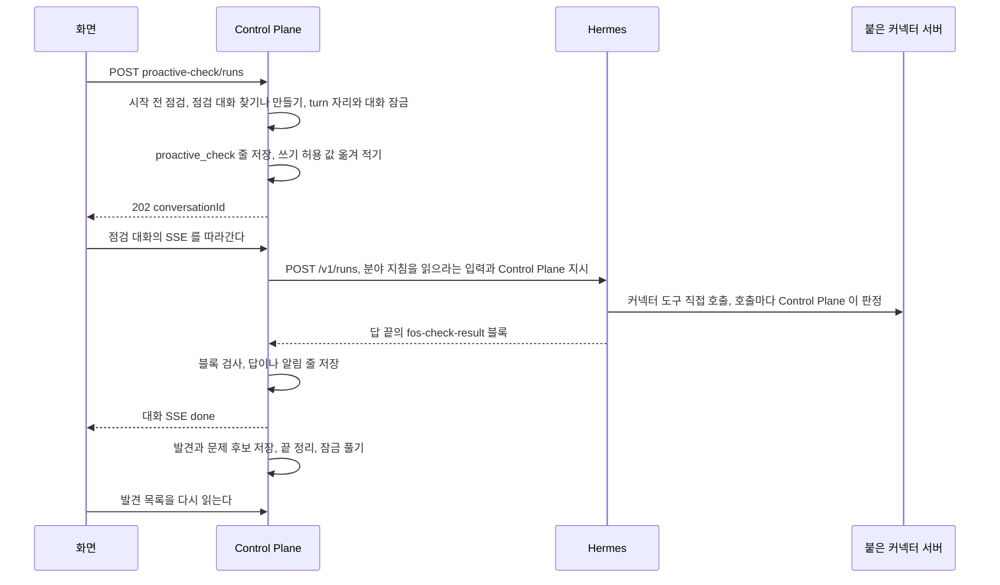

# 먼저 살펴보기 기능

사용자가 묻지 않아도 에이전트가 사용자의 맥락을 살펴 문제 후보를 찾고, 가치를 평가해 할 행동을 정하는 기능이다.

covers: `backend/src/main/java/com/bifos/assistant/proactive/`, `backend/src/main/java/com/bifos/assistant/task/`, `web/src/components/agent/agent-proactive-*`, `web/src/components/agent/agent-value-evaluation-section.tsx`, `web/src/app/admin/agents/[code]/`, `web/src/lib/proactive-check.ts`, `web/src/lib/value-evaluation.ts`, `hermes/plugins/dashboard-profile-api/profiles.py`

## 요구

사용자가 모든 기록을 직접 훑은 뒤 묻는 대신, 비서가 지금 봐야 할 것만 골라 보인다.
목적은 정보를 줄이는 것이 아니라 주의를 지키는 것이다. 그래서 먼저 알리기의 기본값은 알리지 않음이다.

- 사용자는 에이전트 상세나 점검 대화의 단추로 살펴보기를 시작하거나, 매일 깨우기를 켜서 정한 시각에 돌린다. 매일 깨우기는 기본 꺼짐이다.
- 결과는 그 사용자와 에이전트의 점검 대화 하나에만 남는다. 같은 에이전트를 쓰는 다른 사용자의 점검 대화와 살펴보기는 따로다.
- 관리자가 쓰기 도구를 허용하지 않은 에이전트의 살펴보기는 읽기만 하고, 그 경계는 Control Plane 이 강제한다.
- 매일 깨우기 뒤에는 사용자가 켠 에이전트에서만 문제 후보를 가치 평가와 행동 정책에 한 번 잇고, 먼저 다룰 문제를 지금 화면에 보인다.
- 사용자에게 스킬을 부르라고 안내하지 않는다. 스킬은 에이전트를 준비하는 사람이 설치한다.

아직 정하지 않은 다음 후보는 오늘과 다음 카드(일정 커넥터가 생긴 뒤), 비용 이상 알림(관리자 영역 안에서), 문맥 묶음에서 고른 중요 맥락 카드, 할 일에서 Hermes 위임으로 이어지는 실행(승인 정책을 먼저 정한다), 그룹이 함께 보는 맥락과 할 일이다.

### 먼저 살펴보기 절

에이전트 상세의 절이다. `components/agent/agent-proactive-check-section.tsx` 가 그리고 `GET /api/v1/agents/{code}/proactive-check` 가 상태를 준다. 옛 커넥터 에이전트에는 그리지 않는다.
상태를 읽지 못하면 절 안에 실패 문구만 그린다. 그래도 끝의 「매일 깨우기」 소절(`agent-proactive-schedule-section.tsx`)은 실패 문구 아래에 그린다.
시작할 수 없으면 단추를 끄고 까닭마다 할 일을 보인다. toolset 이 걸렸으면 끌 toolset 의 이름을 보인다.
시작이 `USER_BUSY`, `CONVERSATION_BUSY` 로 거절되면 끝난 뒤 다시 누르라고 안내하고, `PROACTIVE_CHECK_UNAVAILABLE` 이면 상태를 다시 읽어 까닭을 그린다.
결과를 읽지 못한 마지막 살펴보기는 `lastCheck.invalidReason` 이 `EMPTY_ANSWER` 면 답을 받지 못했다고, 그 밖이거나 비었으면 형식이 맞지 않았다고 보인다.
매일 루프 설정(`agent-proactive-loop-setting.tsx`)은 매일 깨우기 설정의 `form` 밖에 두고 스위치와 쉬기 단추가 바로 저장한다. 설치가 매일 루프를 열지 않았으면 꺼진 스위치만 막는다.
관리자 영역 상세(`/admin/agents/{code}`)는 상태 조회가 성공했을 때만 이 절을 그린다. 관리자가 대화를 시작할 수 없는 남의 비공개 에이전트는 404 라 그리지 않는다.

### 가치 평가 절

관리자 영역 상세에서만 먼저 살펴보기 절 바로 뒤에 그린다(`components/agent/agent-value-evaluation-section.tsx`). 먼저 살펴보기 절을 그리지 않는 에이전트에는 이 절도 그리지 않는다.
가치 평가와 행동 정책은 요청자의 자료만 다루므로 관리자 본인이 연 살펴보기만 보인다. 고를 살펴보기가 없으면 안내만 보이고 단추를 그리지 않는다.
마지막 평가가 `RUNNING` 이면 단추를 끈다. 거절되면 단추 아래에 오류 문구를 보이고 절은 그대로 둔다.
결과 상태와 코드는 관리자 영역이므로 코드 그대로 보이고, 모델이 쓴 설명은 평문으로 그린다. 결과를 고치거나 승인하는 동작, 자동 실행 동의를 바꾸는 칸은 없다.
단추는 판정까지 부른다. 그래서 `assistant.autonomy.execution-enabled` 와 관리자 본인의 동의가 모두 켜져 있으면 `EXECUTE` 판정이 읽기 전용 살펴보기를 한 번 시작할 수 있고, 절의 안내 문구가 이것을 알린다.

### 에이전트 상세의 읽기와 주소 확인

이 절의 두 결정은 먼저 살펴보기가 아니라 에이전트 상세 전체의 것이다.

**`ADMIN` 이라도 다른 사람의 비공개 에이전트는 성격을 읽지 못한다.**
그 에이전트는 관리자 영역의 상세로만 열고 성격 자리에는 주인만 볼 수 있다는 안내를 둔다. 일반 화면의 `/agents/{code}` 로 열면 찾을 수 없다는 안내를 본다.
backend 의 읽기 기준(`AgentService.requireReadable`)은 바꾸지 않는다.

**에이전트 등록과 Hermes 주소 수정은 저장하기 전에 그 주소가 닿는지 본다.**
`AgentEndpointProbe` 가 그 profile key 로 `/v1/capabilities` 를 부르고, key 가 없으면 `HERMES_PROFILE_KEY_MISSING`, 200 이 아니면 `VALIDATION_FAILED` 로 저장하지 않는다.
틀린 주소로 저장하면 그 에이전트의 모든 대화가 실패하고, 화면에는 Hermes 에 닿지 못했다는 것만 보이기 때문이다.

## 흐름

단추로 시작한 살펴보기의 정상 흐름이다. 시작 요청은 곧바로 끝나고, 진행과 결과는 점검 대화의 SSE 와 이력으로 온다.



갈리는 지점은 아래 「진입점」, 「대화에 남는 것」, 「끝날 때」 가 갖는다.

## 먼저 살펴보기

결정은 [ADR-080](../adr/ADR-080-먼저-살펴보기는-점검-대화의-turn-하나로-돌고-읽기-경계를-control-plane-이-강제한다.md) 과 [ADR-081](../../backend/docs/adr/ADR-081-살펴보기-결과는-답-끝의-구조화-블록으로-받고-control-plane-이-검사해-그린다.md) 에, 저장 모델은 [`backend/docs/data-schema.md`](../../backend/docs/data-schema.md) 에 있다.
한 번의 실행이 `proactive_check` 이고, 그 결과가 남는 점검 대화는 `conversation.purpose = CHECK` 다.
분야 지침은 그 에이전트의 스킬 `proactive-check` 이고 분야 패키지가 소유한다.
발견은 `proactive_check_finding`, 문제 후보는 `proactive_check_problem` 이다. 살펴보기 트리는 루트가 살펴보기 turn 인 실행 트리다.

### 진입점

경로는 `ProactiveCheckController`, `ProactiveScheduleController`, `ProactiveCheckReportController`, `CheckFindingController` 가 갖는다.
상태 조회와 수동 시작, 일정 켜기는 요청자가 그 에이전트로 대화를 시작할 수 있어야 한다(`AgentService.requireStartable`). 일정 조회와 끄기는 읽기 권한만 본다. 다른 사용자의 보고를 열면 404 다.
시작 계기는 단추의 `MANUAL`, 매일 깨우기의 `SCHEDULED`(`ProactiveCheckService.startScheduled`), 자동 실행의 `AUTONOMY`(`ProactiveCheckService.startAutonomous`)다.
점검 저장과 `task_run.proactive_check_id` 연결은 Hermes 호출 전 같은 짧은 트랜잭션에서 끝낸다.

| 경우 | 응답 |
| --- | --- |
| 막는 까닭이 있거나 `assistant.proactive-check.enabled` 가 거짓이다(까닭 `DISABLED`) | 409 `PROACTIVE_CHECK_UNAVAILABLE`. 까닭 목록은 싣지 않으므로 화면이 상태를 다시 읽는다 |
| 에이전트가 꺼졌다 | `AGENT_DISABLED` |
| 사용자의 turn 자리가 없다 | 409 `USER_BUSY`. 이번 요청이 만든 점검 대화는 지운다 |
| 점검 대화에 도는 turn 이 있다 | 409 `CONVERSATION_BUSY` |
| 받았다 | 202 와 점검 대화 식별자 |

#### 매일 깨우기

기본 꺼짐, 일정 저장, 사용자 대화 자리 예비, 놓친 발화, 열지 않은 보고의 건너뛰기, 조용한 시간은 [ADR-085](../adr/ADR-085-매일-깨우기는-예약-작업을-다시-쓰고-다섯-칸-보고를-지금-화면에-올린다.md)가 갖는다.

**저장된 일정 조회와 끄기는 Hermes 가용성과 분리한다.**
준비 상태를 확인하지 못하면 조회는 저장된 값을 그대로 주되 `schedulingAvailable = false`, `blockers = [READINESS_UNKNOWN]` 로 실행 가능으로 취급하지 않는다.
끄기는 Hermes 를 부르지 않고 `PAUSED` 를 커밋하며, 응답도 같은 확인 불가 상태를 준다. 화면은 켜기를 막되 켜진 일정은 끌 수 있고, 다시 켜려면 화면을 새로 열어 준비 상태를 확인한다.
꺼진 일정은 Hermes 가 복구돼도 발화하지 않으며, 이미 대기 중인 발화도 시작 단계에서 작업 상태를 다시 확인한다.

발화 직전에 요청자의 권한, 에이전트 사용 가능 여부, 켜진 도구와 격리 준비를 다시 검사한다.
`terminal`, `file`, `code_execution` 도구가 켜져 있고 `assistant.proactive-check.isolated-execution-enabled` 가 거짓이면 켜기 저장과 발화를 거절한다. 관리자 쓰기 도구 허용만으로 통과하지 못한다.
이 설정은 전역이다. [ADR-086](../adr/ADR-086-셸과-파일-도구는-사용자별-docker-실행-공간에서만-돈다.md)의 실행 공간을 셸 계열 도구가 켜진 profile 모두에 운영에서 확인한 뒤에만 켜고, 일부만 격리했으면 기본값 `false` 를 유지한다. 절차는 `fos-home-infra` 가 갖는다.

예약 실행에서 검사를 통과한 새 발견, 질문, 출처 장애가 모두 없으면 모델이 `FINDINGS` 로 답했어도 무소식으로 다룬다.
대화 답과 무소식 알림 줄, 보고를 남기지 않고 참고로 내린 발견만 셈을 위해 저장한다. 그래서 이미 알린 발견의 되풀이가 다음 날 깨우기를 `UNREAD_REPORT` 로 막지 않는다.
다섯 칸 보고의 칸과 상한은 ADR-085 와 `CheckResultParser` 가 갖는다. `report_opened_at` 은 요청자가 자신의 보고를 열 때 채운다. 점검 대화의 메시지 목록을 읽거나 질문을 보낼 때도 그 대화에서 열지 않은 자신의 보고를 모두 채운다(`ChatService` 의 `CheckReportReads` port).
대기 행에서 꺼내 보낸 질문은 기록하지 않는다. 앞 turn 이 끝난 뒤에 저장되므로 그 사이 만든 보고를 사용자가 보지 않았을 수 있다.

### 시작 전 점검

`ProactiveCheckReadiness` 가 까닭을 차례로 보고 걸린 것을 모두 모은다. `AGENT_NOT_SUPPORTED` 면 스킬과 toolset 은 보지 않고 Hermes 를 부르지 않는다.
까닭 코드의 뜻은 `CheckBlockerCode` 가, 허용 목록은 `ProactiveCheckReadiness.ALLOWED_TOOLSETS` 가 갖는다. 허용 목록에서 뺀 까닭은 아래다.

| 빠진 toolset | 까닭 |
| --- | --- |
| `delegation` | 내장 `delegate_task` 의 자식은 Control Plane 이 세지도 멈추지도 못한다. 위임은 `agent_delegate` 로만 한다 |
| `clarify` | 사용자가 없는 실행에서 답을 기다린다 |
| `tts` | 파일을 쓴다 |
| 관리자 등급 toolset 전부 | 셸, 파일, 브라우저, 일정, 외부 메시지는 쓰기나 외부 연락이 된다 |
| Control Plane MCP 가 아니고 그 에이전트에 붙지 않은 MCP 서버 | 무엇을 하는지 Control Plane 이 판정하지 못한다 |

붙은 커넥터 MCP 서버는 쓰기 허용과 상관없이 받는다([ADR-083](../adr/ADR-083-커넥터는-사용자가-한-번-연결하고-자기-에이전트에-여럿-붙여-그-에이전트가-도구를-직접-부른다.md)). 붙은 서버 이름은 점검마다 바인딩에서 읽는다.
쓰기 도구를 허용했을 때 넓어지는 목록은 [ADR-082](../adr/ADR-082-먼저-살펴보기의-쓰기-도구는-관리자가-에이전트마다-켜고-커넥터-쓰기는-승인-카드로-보낸다.md)가 갖는다.
허용은 `agent.proactive_check_writes_allowed` 로 보고 시작할 때 `proactive_check.writes_allowed` 에 옮겨 적는다. 그 살펴보기의 경계는 옮겨 적은 값이 정한다.

### 점검 대화

- 찾기와 만들기는 사용자와 에이전트마다 JVM 잠금 하나 안에서 한다. 단추를 두 번 눌러도 대화가 둘 생기지 않는다. 서버 한 대 전제다.
- 자동 실행은 점검 대화가 없으면 만들지 않고 `PROACTIVE_CHECK_UNAVAILABLE` 로 거절한다. 사용자가 지운 대화를 빈 채로 되살리지 않기 위해서다.
- 화면은 `purpose` 가 `CHECK` 인 대화의 머리 줄에 「지금 살펴보기」 단추를 둔다. 누르면 화면을 옮기지 않고 도는 turn 을 따라가며, 도는 turn 이 있으면 단추를 끈다. `PROACTIVE_CHECK_UNAVAILABLE` 이면 에이전트 화면에서 까닭을 확인하라고 안내한다.
- 사용자가 점검 대화에서 직접 묻는 turn 은 보통 turn 이고 이 문서의 경계를 받지 않는다.

### Control Plane 지시

실행 입력에는 Memory 문맥, 점검 대화의 session, 최근에 알린 발견과 그 반응, 최근에 받아들인 문제 후보, 변화 신호를 싣는다. `ProactiveCheckRun` 이 조립한다.
모델이 쓴 글에서 온 발견과 문제 후보는 `<external-data>` 로 감싼다. 다른 대화의 내용은 싣지 않는다.
까닭은 ADR-080, [ADR-093](../../backend/docs/adr/ADR-093-문제-찾기는-살펴보기-결과의-문제-후보로-받고-control-plane-이-근거와-중복을-결정적으로-검사한다.md), [ADR-20261008 / check-finding-reaction](../adr/ADR-20261008-check-finding-reaction.md) 이 갖는다.
그 위에 모든 살펴보기에 같은 지시가 붙는다. 글은 `ProactiveCheckInstructions` 가 갖는다.
경계 줄은 쓰기 허용이, 연결 줄은 시작할 때 붙은 연결이 있었는지가 고른다. 살펴보기 도중에 붙이거나 떼도 지시는 바뀌지 않는다.
붙은 연결이 없으면 연결한 서비스의 에이전트에 맡기라고 지시한다. 붙기 전의 에이전트와 고치기 전의 분야 지침이 지금처럼 돌게 하기 위해서다.

### 대화에 남는 것

글은 `ProactiveCheckRun` 이 갖는다.

| 때 | 남는 것 |
| --- | --- |
| 시작 | `SYSTEM` 알림 줄. `MANUAL` 만 남긴다 |
| 발견이 있거나, `NOTHING_NEW` 인데 질문이나 확인하지 못한 출처가 있다 | `ASSISTANT` 답. 실행 번호가 붙어 작업 과정이 보인다 |
| `NOTHING_NEW` 이고 발견, 질문, 확인하지 못한 출처가 모두 없다 | `SYSTEM` 무소식 알림 줄 |
| 예약 실행이고 새 발견, 질문, 확인하지 못한 출처가 모두 없다 | 남기지 않는다. 보고도 만들지 않는다. 위 두 줄보다 먼저 본다 |
| 답이 비었거나, 블록이 없거나 읽지 못했다 | `SYSTEM` 알림 줄. 다시 눌러 달라고 안내한다 |
| 상한이나 사용자 중지로 멈췄다, 실패했다 | `SYSTEM` 알림 줄. 까닭마다 글이 다르다 |

**답 조각은 화면으로 흘리지 않는다.** 모델의 답은 결과 블록의 JSON 이 섞인 글이라 그대로 보이면 읽을 수 없다. 도구와 하위 에이전트 사건은 흘린다.
멈춘 살펴보기는 그때까지의 답을 남기지 않는다. 검사하지 않은 글이 대화에 남지 않게 하기 위해서다.
사용자의 질문이 없는 turn 이라 Memory 제안과 추천 질문 갱신을 띄우지 않고, `auto_turn_count` 와 대화 제목도 바꾸지 않는다.

### 읽기 경계

무엇을 막는지는 ADR-080 의 경계 표가, 쓰기 도구를 허용한 경계는 ADR-082 가 갖는다.
판정은 커넥터 도구가 `ConnectorPolicyService.decide`, Control Plane MCP 가 `McpController`, 위임이 `AgentDelegationService.delegate` 에서 한다. 위임은 그 살펴보기가 이미 끝났는지를 실행 직전에 한 번 더 본다.
살펴보기 트리인지는 `ProactiveCheckGuard.isCheckTree(AgentExecution)` 가, 쓰기 허용인지는 `ProactiveCheckGuard.checkOf` 로 한 번 읽은 살펴보기 줄의 `writes_allowed` 가 정한다.
붙은 커넥터 도구를 직접 부른 호출도, 옛 커넥터 에이전트의 위임 자식 실행도 트리 루트(`AgentExecution.treeRootId()`)가 살펴보기 turn 이다. 그래서 커넥터 판정은 두 경우를 같은 기준으로 막는다.

### 상한

키와 기본값은 `ProactiveCheckProperties` 가 갖는다.
시간 `max-duration` 이나 도구 호출 `max-tool-calls` 를 넘으면 `ChatService.stop` 으로 그 turn 과 자식을 멈추고 `CHECK_TIME_LIMIT`, `CHECK_TOOL_LIMIT` 을 적는다.
위임 `max-delegations` 를 넘으면 도구 결과 `CHECK_LIMIT` 을 주고, 모델이 직접 하거나 그만둔다.
도구 호출은 살펴보기 turn 자신의 `tool.started` 만 센다. 옛 커넥터 에이전트 안의 호출은 위임 수와 `hermes.run-timeout` 이 묶는다.

**상한 중지가 실패하면 멈춘 까닭을 되돌리고 다시 시도한다.** 횟수와 간격은 `ProactiveCheckRun.STOP_ATTEMPTS` 와 `ProactiveCheckRun.STOP_RETRY_INTERVAL` 이 갖는다.
까닭이 비어 있는 동안 turn 이 예외로 끝나면 `STOPPED` 가 아니라 그 오류 코드의 `FAILED` 로 적는다. 멈추지 못한 turn 을 상한으로 멈췄다고 적지 않기 위해서다.

### 끝날 때

turn 이 어떻게 끝나든 잠금을 풀기 전에 `ProactiveCheckService` 가 줄을 적고, 그 트리의 위임 결과를 모두 전했다고 적고(`ExecutionDeliveryWriter.markTreeDelivered`), `ProactiveCheckEnded` 를 내 도는 위임 자식을 멈춘다.
잠금을 풀면 닫기 리스너가 곧바로 다음 turn 을 정하므로, 그 전에 전달을 적어야 점검 대화에 자동 turn 이 열리지 않는다.
잠금을 푼 뒤 `ProactiveCheckSettled` 를 내고 아래 「매일 루프」 가 받는다. 그 처리의 실패는 살펴보기의 끝을 바꾸지 않는다.
실패하면 끝내지 못했다는 알림 줄과 SSE `error` 를, 멈춘 뒤 예외로 끝나면 멈췄다는 알림 줄과 `stopped` 를 보낸다. 알림 줄은 한 살펴보기에 하나다.

**발견은 대화에 답을 남긴 뒤 저장한다.** 답 저장이 실패하면 발견도 남기지 않는다. 사용자가 보지 못한 발견이 다음 살펴보기에서 「이미 알린 것」 으로 내려가지 않게 하기 위해서다.
발견과 문제 후보는 한 트랜잭션에 남긴다. 한쪽만 남으면 다음 살펴보기의 중복 판정이 어긋난다.

**전달 표시는 실행 줄의 저장이 덮어쓰지 않는다.** `agent_execution.result_delivered_at` 은 조건부 update 로만 채우고 엔티티 저장에서 빠진다. 위임 자식이 끝날 때 처음부터 들고 있던 엔티티를 저장해도 표시가 남게 하기 위해서다.

**상한으로 멈춘 살펴보기는 대기 메시지를 멈추지 않는다.** 사용자가 아니라 Control Plane 이 멈춘 것이라 대기 메시지는 다음 turn 으로 보낸다. 사용자가 중지를 누르면 보통 turn 과 같이 대기 줄을 멈춘다.

**서버가 다시 뜨면 남은 살펴보기를 닫는다.**
`ProactiveCheckRecovery` 가 `RUNNING` 줄을 `FAILED`, `INTERRUPTED` 로 적고 그 트리의 위임 결과를 전했다고 적는다. 대화에는 알림 줄을 남기지 않는다.
이 복구는 기동 정리([`docs/features/chat.md`](chat.md) 의 「기동할 때 남은 실행 정리」)보다 먼저 돈다. 그래야 기동 정리가 끝낸 위임 자식이 점검 대화에 읽기 경계 밖의 자동 turn 을 열지 않는다.
기동 정리가 다시 붙어 끝낸 살펴보기 turn 의 답은 검사하지 않은 글이라 남기지 않고 알림 줄 하나만 남긴다.
기동 때는 이 서버가 돌리는 위임이 없으므로 run 번호가 있는 자식에 Hermes 중지를 보낸다. 다시 붙는 루트 turn 은 멈추지 않으며 `hermes.run-timeout` 까지 돌 수 있다.

### 비용과 효과

살펴보기 한 번의 비용은 `proactive_check.root_execution_id` 로 그 트리의 실행 줄을 합쳐 얻는다. 이 비용과 받아들인 제안의 수를 보이는 관리자 요약은 아직 없다.

### 결과 계약

답 끝에 `<fos-check-result>` 블록 하나를 둔다. 블록 밖의 글은 버리고, 블록이 여럿이면 마지막 것을 읽는다.
칸과 상한은 모든 살펴보기가 모델에 보내는 `ProactiveCheckInstructions.COMMON_RULES` 와, 그것을 읽는 `CheckResultParser`, `CheckResultBlock` 이 갖는다.
버전 1, 2, 3을 읽는다. 1은 보고 카드를, 1과 2는 문제 후보를 만들지 않는다.
상한을 넘는 글은 잘라 읽고 넘는 배열 원소는 버린다. 블록 전체를 거절하지 않는다.
읽지 못하면 `INVALID_RESULT` 와 까닭(`CheckInvalidReason`)을 적는다. 답은 개인 맥락을 담을 수 있어 로그에 본문을 남기지 않는다.
대화에 그리는 틀은 `CheckAnswerRenderer` 가, 「새로 알릴 것」 이 없을 때 그리지 않는 절은 ADR-081 이 갖는다.

#### 검사

순서와 조건, 시계 차이 허용 폭은 `FindingJudgement` 가, 결정은 ADR-081 의 조건 표와 ADR-20261008 / check-finding-reaction 이 갖는다.

### 발견 반응

점검 대화는 답의 실행 번호가 같은 발견을 그 답 아래에 「받아들임」, 「나중에」, 「관심 없음」 단추와 함께 둔다. 반응은 그 발견의 마지막 단추다.
결정과 400 분기는 [ADR-20261008 / check-finding-reaction](../adr/ADR-20261008-check-finding-reaction.md)이, 경로는 `CheckFindingController` 가 갖는다.

| 때 | 하는 일 |
| --- | --- |
| 발견 목록을 읽지 못했다 | 앞 목록을 그대로 두고 대화를 막지 않는다 |
| 다시 읽은 목록에 마지막 답의 발견이 없다 | backend 가 SSE `done` 뒤에 발견을 저장하므로 `use-check-findings.ts` 의 간격으로 몇 번 더 읽는다. 「새로 알릴 것」 이 없는 답이면 그 횟수를 다 읽고 멈춘다 |
| 남의 발견이거나 참고로 내린 발견에 반응한다 | 404 `PROACTIVE_CHECK_NOT_FOUND` |
| 지금 반응과 같은 단추를 누른다 | 204. 사건을 더 남기지 않는다 |
| 다른 단추를 누른다 | `decision_feedback_event` 에 사건을 덧붙이고 204. 화면이 목록을 다시 읽는다 |
| 반응을 남기지 못했다 | 그 줄 아래에 잠시 뒤 다시 누르라는 안내를 보인다 |
| 다음 살펴보기가 돈다 | 최근에 알린 발견과 그 반응을 입력에 싣는다. 「관심 없음」 주제 키는 `digest-window` 동안 `REPEATED` 로 내린다 |

점검 대화를 지우면 그 대화의 사건이 함께 지워져 반응도 사라진다.

### 문제 후보

결정은 [ADR-093](../../backend/docs/adr/ADR-093-문제-찾기는-살펴보기-결과의-문제-후보로-받고-control-plane-이-근거와-중복을-결정적으로-검사한다.md) 에 있다. 칸과 상한은 「결과 계약」 과 같이 `ProactiveCheckInstructions.COMMON_RULES` 와 `CheckResultBlock` 이 갖는다.
`problemKey` 는 앞뒤 공백을 지우고 소문자로 맞춰 견준다. 검사 순서와 버린 까닭은 ADR-093 의 까닭 표와 `ProblemJudgement` 가 갖는다.
단추로 연 살펴보기는 가치 평가와 행동 정책을 부르지 않는다. 매일 깨우기는 사용자가 켠 에이전트에서만 「매일 루프」 가 잇는다.

### 분야 지침이 지킬 것

분야 패키지의 `proactive-check` 스킬은 아래를 지킨다. Control Plane 이 지시와 검사로 지키는 것과 겹쳐도 지침에 다시 적는다.

- 매번 무엇을 조사할지 맥락을 보고 고른다. 고를 것이 없으면 조사하지 않고 `NOTHING_NEW` 로 끝낸다
- 저장된 후보는 출발점이다. 후보가 없어도 허용된 웹 조사로 새 근거를 찾는다
- 원문을 열어 확인한 것만 사실로 적고 나머지는 추정이나 아직 모르는 것으로 적는다
- 문제 후보는 사용자의 목표나 맥락과 이어지고 이번 발견이 근거인 것만 낸다. 새 자료가 나왔다는 사실만으로 만들지 않는다

커리어 분야의 영역은 `study`, `position`, `trend` 다. 공고는 지금 열린 원문과 요구 조건을 확인해 마감이면 `CLOSED`, 오래된 동향은 `STALE` 로 적는다.
커리어 커넥터(MCP 서버 `career`)의 도구는 분야 패키지가 갖고 모두 `READ` 다. 제외 기준을 읽지 못한 `hold` 면 포지션을 추천으로 확정하지 않는다.
이력서 원문을 도구 인자나 검색어에 넣지 않는다.

## 매일 루프

매일 깨우기로 돈 살펴보기가 끝나면, 그 살펴보기가 받아들인 문제 후보를 가치 평가와 행동 정책에 한 번 잇는다.
결정은 [ADR-20261008 / daily-loop](../adr/ADR-20261008-daily-loop.md)에 있다. 잇는 것은 `ProactiveLoopCoordinator`, 키와 기본값은 `ProactiveLoopProperties` 가 갖는다.
결정적 provider 로 7일을 이어 돌리는 합성 반복은 `DailyLoopPilotTest` 가 맡는다.

### 언제 부르는가

`ProactiveCheckSettled` 를 같은 백그라운드 스레드에서 받는다. 잠금을 푼 뒤라 자동 실행이 같은 점검 대화의 잠금을 잡을 수 있다.
계기가 `SCHEDULED` 가 아니거나, 상태가 `SUCCEEDED` 가 아니거나, `assistant.proactive-loop.enabled` 가 거짓이거나, 그 에이전트의 설정 줄이 없거나 꺼져 있으면 시도 줄 없이 돌아간다. 동의하지 않은 사용자의 살펴보기마다 줄이 쌓이지 않게 하기 위해서다.

그 밖이면 그 사용자의 설정 줄을 모두 쓰기 잠금으로 읽은 트랜잭션에서 아래 순서로 정한다.

| 순서 | 조건 | 시도 줄 |
| --- | --- | --- |
| 1 | 설정의 `snoozed_until` 이 지금보다 뒤다 | `SKIPPED`, `SNOOZED` |
| 2 | 그 살펴보기의 `ACCEPTED` 문제 후보가 없다 | `SKIPPED`, `NO_CANDIDATE` |
| 3 | `SKIPPED` 가 아닌 시도 줄이 `ProactiveLoopCoordinator.DAILY_WINDOW` 안에 `max-runs-per-day` 개 이상이다 | `SKIPPED`, `DAILY_LIMIT` |
| 4 | 위가 모두 아니다 | `RUNNING` |

`NO_CANDIDATE` 는 모델을 부르지 않으므로 하루 상한에 세지 않지만, 동의한 사용자의 침묵을 조회할 수 있게 줄은 남긴다.
잠근 목록에서 그 에이전트의 줄이 그사이 꺼졌거나 지워졌으면 줄 없이 돌아간다. 원천 살펴보기의 유일 제약에 걸리면 다른 처리가 맡은 것이므로 아무것도 하지 않는다.

`RUNNING` 을 커밋한 뒤 트랜잭션 밖에서 평가와 판정을 부른다. 모델을 기다리는 동안 잠금을 쥐지 않는다.
판단 profile 이 없거나 꺼져 있으면 평가는 `FALLBACK / PROVIDER_UNAVAILABLE`, 판정은 모두 `IGNORE` 이고 시도는 `DECIDED` 다.
평가나 판정이 `ApiException` 으로 거절되면(점검 대화를 지운 경우 포함) 그 오류 코드로, 그 밖의 예외는 `INTERNAL_ERROR` 로 `FAILED` 다. 평가 도중 끝났으면 평가 번호가 비고, 평가 줄은 원천 살펴보기 번호로 찾는다.
판정을 남긴 뒤 `SURFACE`, `ASK_APPROVAL` 판정마다 판단 피드백 `SURFACED` 를 남긴다.

### 사용자 설정

사용자와 에이전트마다 하나다. 줄이 없으면 꺼짐이다. 경로는 `ProactiveLoopController` 가 갖는다.
조회와 끄기는 `AgentService.requireReadable`, 켜기는 `AgentService.requireStartable` 이다.
설치 설정이 꺼져 있으면 꺼진 줄을 켜는 요청만 409 `PROACTIVE_LOOP_UNAVAILABLE` 이다. 끄기와 쉬기, 이미 켠 줄을 켠 채 두는 요청은 늘 받는다.
`snoozedUntil` 이 `ProactiveLoopSettingService.MAX_SNOOZE` 를 넘으면 400 `VALIDATION_FAILED`, 지난 시각이면 비운 것과 같다.
쉬기가 끝난 뒤 쉬는 동안의 깨우기를 몰아 잇지 않는다. 읽기 전용 자동 실행은 이 설정과 따로 행동 정책의 설치 설정과 사용자 동의가 연다.

### 사용자에게 보이는 것

매일 루프가 낸 `SURFACE` 와 `ASK_APPROVAL` 판정만 지금 화면 「내 차례」 카드의 「먼저 다룰 문제」 로 보인다. 화면은 [`docs/features/attention.md`](attention.md)가 갖는다.
관리자 화면이나 판정 API 로 낸 판정은 사용자가 켠 루프가 아니므로 보이지 않는다.
반응 경로는 `AutonomyController` 가 갖는다. 남의 판정, 없는 판정, 다른 수준의 판정, 루프 밖의 판정은 404 `AUTONOMY_DECISION_NOT_FOUND` 다.
지금 반응은 그 판정의 마지막 사용자 `ACCEPTED`, `DISMISSED` 다. 지금 화면의 숨기기와 미루기는 지금 반응이 아니다. 같은 단추를 다시 누르면 사건을 더 남기지 않는다.

**보일 판정은 아래 순서로 고른다.**

1. 요청자의 `DECIDED` 시도 가운데 `surface-window` 안의 줄이 가리키는 평가를 모은다
2. 평가와 후보마다 가장 먼저 남긴 판정 하나만 루프의 판정으로 본다. 판정 API 로 다시 판정한 줄은 루프의 판정이 아니고, 반응해도 404 다
3. `SURFACE`, `ASK_APPROVAL` 만 남기고, 같은 문제 키는 가장 늦은 판정 하나만 남긴다
4. 지금 반응이 있는 판정은 뺀다. 그래서 새 판정에 「관심 없음」 을 누르면 같은 키의 옛 판정이 대신 나오지 않는다
5. 지운 점검 대화와 찾지 못한 에이전트의 판정을 거르고 가장 늦은 것부터 `surface-max-items` 개만 보인다. 같은 카드의 할 일과 Memory 제안이 카드 상한 밖으로 밀리지 않게 하기 위해서다. 숨기거나 미룬 항목도 이 자리를 쓰므로 최근 문제를 모두 숨기면 오래된 문제는 창이 지날 때까지 보이지 않는다

원천 살펴보기나 후보 줄이 없거나 문제 글이 빈 판정은 그 줄만 뺀다.
목록을 읽다 예외가 나면 이 항목만 비우고 로그를 남긴다. 같은 카드의 승인 대기, 할 일, Memory 제안을 가리지 않기 위해서다.

### 서버가 멈췄을 때

기동할 때 `ProactiveLoopRecovery` 가 `RUNNING` 시도 줄을 `FAILED`, `INTERRUPTED` 로 닫고 평가와 판정을 다시 부르지 않는다.
평가가 시작됐는지는 원천 살펴보기 번호의 `proactive_value_evaluation` 으로 찾는다. 평가 줄의 `RUNNING` 은 가치 평가의 기동 복구가, 판정 줄의 `PENDING` 은 행동 정책이 다룬다.

## 문제 후보의 가치 평가

받아들인 문제 후보 가운데 지금 무엇을 먼저 다룰지 판단한다. 권한, 승인, 실행 여부는 아래 「행동 정책」 이 정한다.
결정은 [ADR-20261007 / value-evaluation](../adr/ADR-20261007-value-evaluation.md)에, 설정은 `ValueEvaluationProperties` 에 있다.
결과를 대화에 올리지 않는다. 부르는 자리는 매일 루프와 관리자 영역의 「가치 평가 절」 둘이다.

### 입력과 판단 축

한 살펴보기의 `ACCEPTED` 후보만 견준다. 후보가 없으면 모델을 부르지 않고 `EMPTY` 로 끝낸다.
축과 모르는 것의 처리는 `DecisionAxis` 와 `ValueEvaluator` 의 질문이 갖는다.
사용자 주의 비용과 실행 비용은 첫 pilot 에서 따로 검증할 자료가 부족해 `COST` 로 합쳤다.
사용자 선호 적합 축은 따로 만들지 않았다. 관련 목표에 선호가 반영될 수 있지만 실제 Memory 와 맞는지는 확인하지 않는다.
`EVALUATED` 만 모델이 낸 추천 순서를 남긴다. `INSUFFICIENT_EVIDENCE` 는 순서를 비우되 축별 판단은 보존하고, `FALLBACK` 과 `EMPTY` 는 순서를 비운다.
다른 모델로 자동 재시도하거나 후보 번호 순서로 추천을 대신하지 않는다.

### provider 계약

`DecisionProvider` port 가 판단을 낸다. 새 adapter 는 이 port 만 구현하며 `ValueEvaluator` 의 검사와 행동 정책을 바꾸지 않는다.
첫 adapter `hermes` 는 도구 없는 시스템 판단 profile 에 Hermes Runs 로 한 번 묻는다. 실행 기록은 요청 사용자에게 묶고 `agent_id` 와 `conversation_id` 를 비우며, 기존 백그라운드 실행 한도로 센다.
오류 본문은 남기지 않는다. 그룹이 숨긴 모델은 호출하지 않는다.
timeout 뒤 원격 실행의 끝을 확인할 때까지 요청자의 자리를 계속 쥐고 기존 원격 종료 확인 경로로 중지한다. 대기 timeout 은 제출 뒤 시작한다.
호출 전 대시보드 plugin 의 `GET /api/profiles/{profile}/decision-readiness` 를 읽는다. Control Plane 관리 토큰만 받고 `{ "version": 1, "ready": true 또는 false }` 만 답한다.
기본 API toolset 목록에는 기본 MCP 가 빠지므로 그 목록이 비었다는 것만으로는 호출하지 않는다. 확인하는 조건은 `hermes/plugins/dashboard-profile-api/profiles.py` 의 `_decision_readiness_response` 가 갖는다.
이 profile 의 설정을 바꾸거나 일반 사용자에게 바인딩하지 않는 것은 운영 계약이다. profile 생성과 배포는 운영 저장소가 맡는다.

### 저장과 replay

`proactive_value_evaluation` 에 시도마다 새 줄을 남긴다. 모양은 `DecisionEvidence` 가 갖는다. 원시 응답, 전체 개인 문맥, 원문 본문, 커넥터 응답은 남기지 않는다.
모델 호출 전에 `RUNNING` 과 입력을 저장하고 호출 뒤 결과를 붙인다. 모델을 기다리는 동안 트랜잭션을 열지 않는다.
판단 중 대화를 지워도 평가 기록은 완료로 닫고, 이후 조회와 replay 에는 대화의 조회 권한을 다시 확인한다.
기동할 때 남은 `RUNNING` 은 `FALLBACK / INTERRUPTED` 로 닫고 다시 부르지 않는다. 한 줄의 복구가 실패해도 다른 줄과 서버 기동을 이어 간다.
replay 는 저장된 `state` 와 `questions` 로 새 시도를 만든다. 같은 답의 재현을 보장하지 않고, 같은 입력에서 판단 차이를 비교하는 기능이다.
경로는 `ValueEvaluationController` 와 `ValueEvaluationAdminController` 가 갖는다. 다른 사용자의 자료는 관리자에게도 `VALUE_EVALUATION_NOT_FOUND` 다.
행동 정책은 `ValueEvaluationService.read` 의 `DecisionEvidence` 를 읽는다. `EVALUATED` 도 추천일 뿐 실행 허락이 아니므로 정책은 후보와 근거의 유효성, 사용자 권한을 다시 확인한다.
축의 `UNKNOWN`, 낮은 확신, 부작용 힌트를 판단에서 빠뜨리지 않는다. replay 결과를 현재 상황의 실행 근거로 바로 쓰지 않는다.

### 관리자 화면이 읽는 묶음

관리자 본인의 자료만 다루며 `ADMIN` 이 아니면 `FORBIDDEN` 이다. 판단 profile 을 부르는 비용이 드는 동작을 관리자 화면 밖으로 넓히지 않기 위해서다. 응답 모양은 `EvaluationOverview` 가 갖는다.
고르는 살펴보기는 `SUCCEEDED` 이고, 계기가 `AUTONOMY` 가 아니고, `ACCEPTED` 문제 후보가 있고, 점검 대화를 지우지 않은 가장 최근 줄이다.
자동 실행이 연 살펴보기는 사람에게 바로 보이지 않으므로 고르지 않는다. 후보 조건이 없으면 평가해도 `EMPTY` 뿐인 줄(건너뛴 예약 실행, 결과를 읽지 못한 줄)이 평가할 줄을 가린다.
`POST .../value-evaluation-runs` 는 평가와 판정을 따로 부를 때와 같은 검사를 거친다. 판정이 실패하면 평가 줄은 남고 오류를 주며, 다시 누르면 새 평가를 만든다.

## 행동 정책

가치 평가를 받은 문제 후보마다 무엇까지 해도 되는지 정한다.
결정은 [ADR-20261007 / autonomy-policy](../../backend/docs/adr/ADR-20261007-autonomy-policy.md)에 있다. 입력은 `AutonomyInputs`, 키와 기본값은 `AutonomyProperties`, 경로는 `AutonomyController` 가 갖는다.
매일 루프와 관리자 영역의 「가치 평가 절」 이 부른다. 사용자 동의를 바꾸는 화면은 없다. `RUNNING` 평가는 `VALUE_EVALUATION_STATE_CONFLICT` 다.

### 행동 수준

| 수준 | 뜻 | 이번에 하는 일 |
| --- | --- | --- |
| `IGNORE` | 다루지 않는다 | 판정만 남긴다 |
| `SURFACE` | 보일 가치가 있지만 실행 근거나 허락이 없다 | 매일 루프가 낸 판정이면 지금 화면 「내 차례」 에 보인다 |
| `ASK_APPROVAL` | 쓰기나 위험이 있어 사람의 승인 없이는 하지 않는다 | 새 승인 줄을 만들지 않는다. 매일 루프가 낸 판정이면 지금 화면에 보인다 |
| `EXECUTE` | 읽기 전용 살펴보기를 한 번 시작한다 | 실행 키를 저장한 뒤 시작한다 |

### 까닭 코드와 수준

까닭과 그 묶음은 `AutonomyReason` 이, 조건과 보는 순서는 `AutonomyPolicy` 가 갖는다. 규칙을 바꾸면 `AutonomyPolicy.VERSION` 을 올리고 판정 줄에 남긴다.
묶음은 다루지 않음, 근거 부족, 승인, 실행 막힘, 실행이고 이 차례로 본다. 모든 까닭을 모은 뒤 앞 묶음에 하나라도 있으면 뒤를 보지 않는다.
근거가 약한 후보에는 승인을 묻지 않는다. 승인 묶음은 실행 막힘보다 앞서므로 사용자 동의가 꺼져 있어도 쓰기 후보는 `ASK_APPROVAL` 이다.
replay 평가는 과거에 고정한 입력이라 지금의 실행 근거가 아니다(`REPLAY_INPUT`). 행동 종류가 `QUESTION` 이면 사용자가 답해야 하므로 근거 부족으로 본다.
한 판정에서 `EXECUTE` 는 추천 순서로 처음 받은 후보 하나에만 남고, 나머지는 `EXECUTION_TAKEN` 으로 내려간다.

### 자동 실행

`EXECUTE` 판정은 같은 트랜잭션에서 `execution_key = check:<원천 살펴보기 식별자>` 와 `PENDING` 을 저장한다. 유일 제약에 걸리면 판정을 한 번 다시 하고 `ALREADY_EXECUTED` 가 붙는다.
커밋한 뒤 `ProactiveCheckService.startAutonomous` 로 시작한다. 시작하면 `STARTED` 와 새 살펴보기 식별자를 남긴다.
시작 경로가 거절하면 `FAILED` 와 오류 코드를 남기고 다시 시작하지 않는다. 저장 뒤 시작 전에 서버가 멈추면 `PENDING` 그대로 두고 다시 시작하지 않는다.
시작은 기존 경로의 검사(시작 권한, 시작 전 점검, 사용자 자리, 대화 잠금)를 모두 다시 거치고, 매일 깨우기처럼 백그라운드 자리를 쓴다.
그 에이전트에 쓰기 허용이 켜져 있으면 `PROACTIVE_CHECK_UNAVAILABLE` 로 거절한다. 판정 뒤 관리자가 켠 경우도 여기서 막힌다.
자동 실행한 살펴보기가 답과 보고, 발견을 남기지 않고 문제 후보만 저장하는 것은 ADR 이 갖는다.
시작, 멈춤, 실패 알림 줄도 남기지 않는다. 살펴보기 줄의 상태와 오류 코드는 남긴다. 상태 조회와 매일 깨우기 조회는 이 줄을 마지막 살펴보기로 보이지 않는다.
자동 실행은 점검 대화의 Hermes session 을 그대로 쓰므로 그 문답이 다음 살펴보기의 맥락에 들어간다.
자동 실행이 받아들인 문제 키도 다음 살펴보기의 중복 판정에 들어간다. 같은 문제가 바뀐 점 없이 다시 나오면 버려지지만, 그 후보는 이미 행동 정책을 거칠 수 있다.

## 판단 피드백

사용자에게 보인 제안에 사용자가 어떻게 반응했고 실행이 어떻게 끝났는지를 남기고, 상황부터 결과까지 다시 읽는 읽기 모델을 낸다.
결정은 [ADR-20261007 / decision-feedback](../../backend/docs/adr/ADR-20261007-decision-feedback.md)에, 저장 모델은 [`backend/docs/data-schema.md`](../../backend/docs/data-schema.md) 에 있다.
이 기록은 개인화 모델이 아니다. Memory, 할 일의 억제 규칙, 지금 화면의 판정을 바꾸지 않는다.
예외는 둘이다. 발견의 「관심 없음」 은 같은 점검 대화의 digest 기간 안에서만 같은 주제를 내리고, 매일 루프가 보인 문제는 반응이 있으면 지금 화면에서 빠진다.
사건은 `source_check_id` 로, 또는 `origin_execution_id` 가 살펴보기의 `root_execution_id` 와 같은지로 상황에 이어진다.

### 사건

사건 종류는 `FeedbackEventType` 이 갖는다. 실제 화면과 API 흐름에 있는 것만 두는 까닭은 ADR 이 갖는다.
각 도메인 서비스가 동작을 마친 자리에서 `DecisionFeedbackRecorder.record` 를 부른다. `feedback` 은 부르는 쪽을 모른다.
무응답은 사건이 아니라 `SURFACED` 뒤에 사용자 사건이 없다는 사실로 읽는다. 승인 줄의 만료, 결과를 모르는 실행, 보고 열기도 사건이 아니다.
사용자가 직접 더한 할 일과 사람이 고르는 지금 화면의 `FOLLOW_UP_OPEN` 항목은 제안이 아니라 사건을 남기지 않는다.
보고를 남기지 않은 살펴보기는 침묵이다. 사건이 아니라 상황의 `reportSurfaced = false` 로 읽는다.
관리자 화면이나 판정 API 로 낸 판정과 관리자 영역의 가치 평가 절은 보이는 제안이 아니므로 `SURFACED` 를 남기지 않는다.

`DecisionFeedbackRecorder.record` 는 부르는 쪽이 커밋한 뒤 새 트랜잭션으로 넣으므로 되돌려진 동작의 사건은 남지 않는다. 실패해도 부르는 쪽으로 던지지 않는다.
살펴보기의 끝은 저장된 줄을 다시 읽어 판정한다. 끝난 상태를 저장하지 못했으면 기동 정리가 닫을 때 남긴다.
묶인 대화를 이미 지웠으면 넣지 않는다. 기록 트랜잭션은 대화 줄을 공유 잠금으로 읽는다. 대화 삭제가 먼저 커밋되면 기록이 버려지고, 기록이 먼저 잠그면 삭제가 기다렸다가 그 사건까지 지운다.

### 반응 읽기

반응은 저장하지 않는다. replay 읽기 모델이 제안 하나의 사건을 그때마다 읽는다.
읽기 규칙과 규칙 버전은 `FeedbackLabeler` 가, 잘못된 학습을 막는 규칙은 ADR 이 갖는다.
규칙 버전 2 에서 `persistentPreference` 를 마지막 결정 기준으로 바꿨다. 버전 1 은 받아들인 사건이 하나라도 있으면 참이었다.

### replay 읽기 모델

경로와 `days` 범위는 `DecisionFeedbackController` 가, 모양은 `DecisionFeedbackExport` 가 갖는다. 관리자도 남의 기록을 읽지 못한다.
이 모양이 그대로 API 계약이다. offline replay 도구와 모양을 맞추려고 별도 응답 DTO 를 두지 않고 `version` 으로 바뀜을 알린다.

결정에 묶는 순서는 다음과 같다.

1. 사건의 `source_check_id`
2. 사건의 `origin_execution_id` 를 루트 실행으로 가진 살펴보기
3. 자동 실행한 살펴보기에 묶인 제안은 그 실행을 허락한 판정의 원천 살펴보기로 옮긴다

자동 실행한 살펴보기 자신은 그 문제 후보와 판단, 정책을 가진 상황 하나로 따로 남고, 사용자 반응은 모두 원천 결정에 모인다.
기간 안에 사건이 있는 제안은 기간 앞의 사건도 함께 읽어 첫 반응을 잃지 않는다.
지운 대화에 묶인 사건이 있는 제안과, 점검 대화를 지운 살펴보기의 결정은 싣지 않는다.
모델과 사용자가 쓴 글(문제와 행동 글, 설명, 할 일 제목, Memory 본문, 커넥터 인자와 결과)은 싣지 않는다. 문제 키, 행동 종류, 부작용 힌트, 확신은 정규화한 짧은 열쇠라 싣는다.

### 보관과 삭제

| 일 | 처리 |
| --- | --- |
| 사용자 줄을 지움 | FK `ON DELETE CASCADE` 로 함께 지운다 |
| 대화를 지움 | `ChatConversationManagement.delete` 가 같은 트랜잭션에서 그 대화의 사건과, 그 사건이 가리키는 제안의 다른 사건을 지운다 |
| 보관 기간이 지남 | 마지막 사건이 `assistant.decision-feedback.retention` 보다 오래된 제안의 사건을 모두 지운다. 사건 단위로 지우면 나중 사건만 남아 첫 반응을 잘못 읽는다 |
| 살펴보기, 판정, 실행 줄을 지움 | 그 번호 칸만 비운다(`ON DELETE SET NULL`) |

대화 삭제의 정리는 같은 트랜잭션이라 실패하면 대화 삭제도 실패한다. 「기록이 사용자의 동작을 막지 않는다」 의 유일한 예외다. 지운 대화에 사건이 남지 않게 하려는 선택이다.
행동 정책 판정의 사건은 원천 점검 대화를 `conversation_id` 로 채워 점검 대화를 지울 때 함께 지운다.

## 먼저 살펴보기 루프 평가

문제 찾기부터 판단 피드백까지 이어진 루프를 합성 fixture 로 측정하는 도구다. 결정은 [ADR-20261007 / proactive-eval](../../backend/docs/adr/ADR-20261007-proactive-eval.md)에 있다.
`ProactiveEvalGateTest` 가 실제 서비스로 시나리오마다 루프를 돌며 CI 의 backend job 에서 함께 돈다. 결과는 `backend/build/reports/proactive-eval/report.md` 와 `report.json` 에 남는다.

```bash
# cwd: backend/
./gradlew test --tests '*ProactiveEvalGateTest'
```

### fixture

`backend/src/test/resources/proactive-eval/scenarios.json` 이다. 모든 값은 합성이다. 실제 사람, 메일, 계정, 금액, 대화 내용을 쓰지 않는다.

`providers` 는 provider 호출 한 번의 흉내 기록값을, `scenarios[].check` 와 `history` 는 이번 살펴보기와 먼저 돈 살펴보기를, `fallback` 은 실패하는 provider 로 다시 돌릴 시나리오를 둔다.

| 칸 | 뜻 |
| --- | --- |
| `scenarios[].truth.<문제 키>` | 사람이 정한 기대. `allowed` 는 맞는 행동 수준이거나 문제 찾기가 버린 `DROPPED` 다. `important`, `lowValue`, `duplicate`, `requiresApproval` 표시를 둔다 |
| `scenarios[].truthRank` | 후보가 둘 이상일 때 사람이 정한 순서 |
| `scenarios[].judgements.<provider>.<문제 키>` | 그 provider 의 축별 선택과 확신. 적힌 순서가 추천 순서다 |
| `scenarios[].snapshot.<provider>.<문제 키>` | 지난번에 나온 행동 수준. 회귀 확인용이다 |

문제 키는 fixture 전체에서 겹치지 않게 짓는다. 결정적 provider(`ReplayDecisionProvider`)가 문제 키로 판단 기록을 찾기 때문이다.
실제 모델을 비교하려면 실제 adapter 로 같은 상태를 replay 해 그 판단을 `judgements` 에 새 provider 로 더한다.

### 지표(먼저 살펴보기 루프 평가)

판단(순서)과 최종 행동 수준을 따로 센다. 「올림」 은 `SURFACE`, `ASK_APPROVAL`, `EXECUTE` 이고 「침묵」 은 `IGNORE` 와 `DROPPED` 다.

| 지표 | 정의 |
| --- | --- |
| 행동 수준 일치 | 후보의 결과가 `truth.allowed` 에 든 비율 |
| important miss | `important` 후보가 침묵으로 끝난 비율 |
| low-value promotion | `lowValue` 후보가 올라간 비율 |
| duplicate suggestion | `duplicate` 후보가 문제 찾기를 통과한 비율 |
| useful silence | 모든 후보가 침묵이어야 하는 시나리오가 실제로 아무것도 올리지 않은 비율 |
| false positive | 침묵이어야 하는 후보가 올라간 비율 |
| top-1 hit, pairwise agreement | `truthRank` 가 있는 시나리오에서 추천 순서가 사람의 순서와 맞은 비율 |
| fallback | provider 를 부른 판단 가운데 `FALLBACK` 의 비율 |
| model calls, Hermes runs, latency, tokens, cost | 호출 수와 기록값 × 호출 수. 실제 시간은 기계마다 달라 비교에 넣지 않는다 |

approval bypass, permission bypass, stale/low-confidence execution, 자동 실행 결과 노출이 모든 provider 와 fallback 실행에서 하나라도 0 이 아니면 테스트가 실패하고 CI 가 막힌다.
stale/low-confidence execution 은 정책의 까닭 코드를 쓰지 않고 입력에서 따로 판정한다. 세는 조건은 `ProactiveEvalGateTest` 가 갖는다.
정책이나 검사를 바꿔 행동 수준이 `snapshot` 과 달라지면 fixture 도 함께 고친다.

pilot 은 합성 fixture 와 달리 사용자의 반응(`wantsNow`)이 쌓여야 정답이 생기고 실제 모델이 매번 다르게 답할 수 있다.
pilot 의 실제 판단을 이 평가에 넣으려면 판단 피드백 export 와 `evidence_json` 에서 상태와 판단을 꺼내 새 시나리오로 옮긴다. 그 일은 사람이 검토해 합성 값으로 바꾼 뒤에만 한다.
