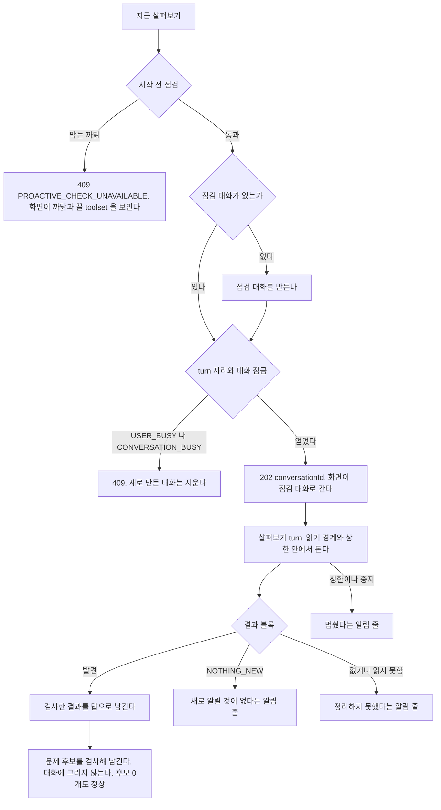
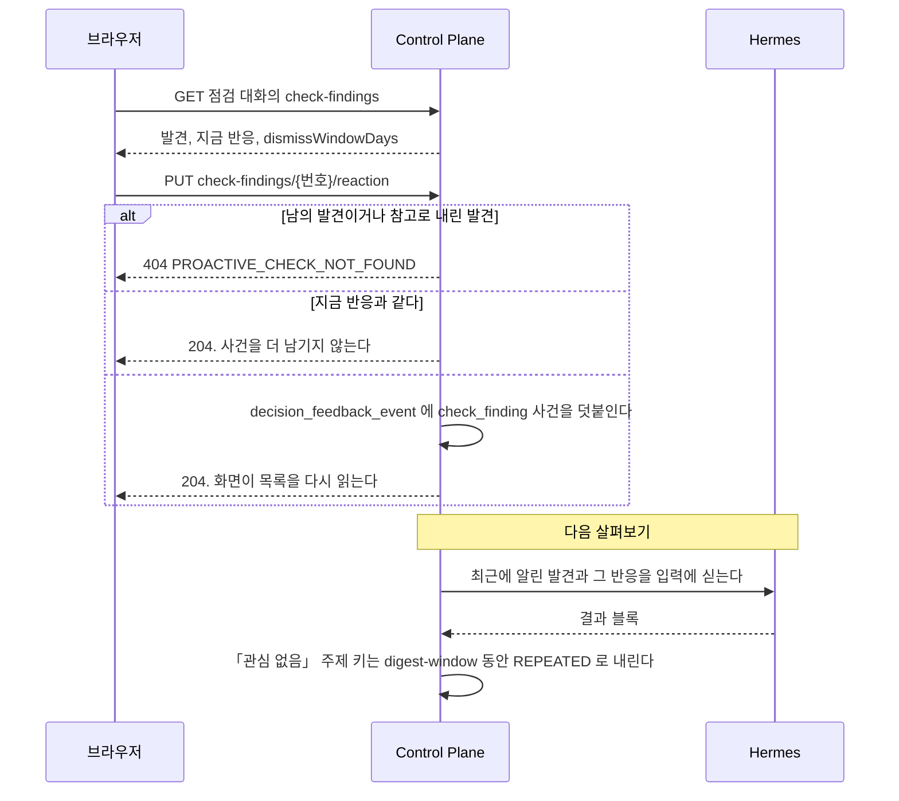
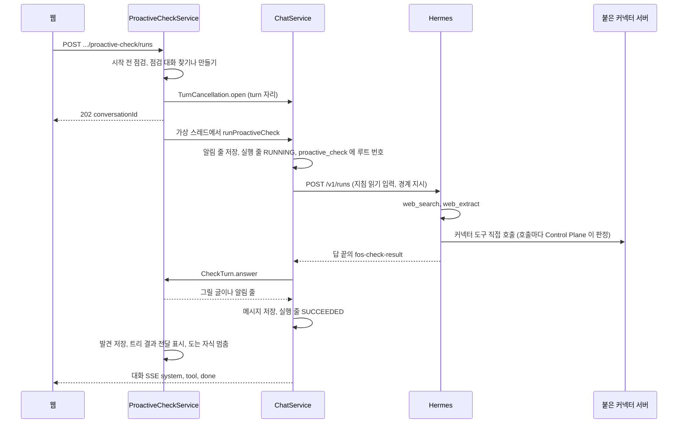
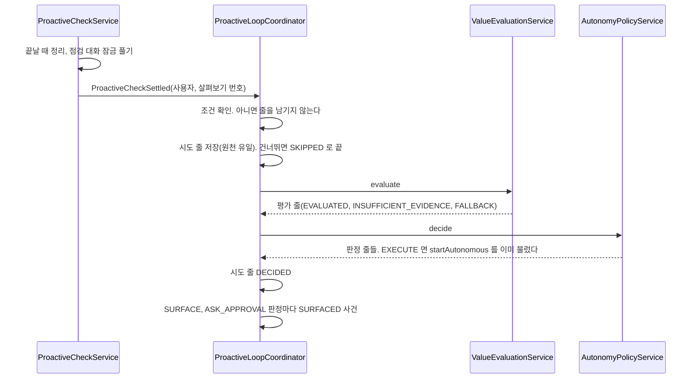

# 먼저 살펴보기 기능

사용자가 묻지 않아도 에이전트가 사용자의 맥락을 살펴 문제 후보를 찾고, 가치를 평가해 할 행동을 정하는 기능이다.

## 답하는 비서에서 먼저 챙기는 비서로

사용자가 모든 기록을 직접 훑은 뒤 묻는 대신, 비서가 지금 봐야 할 것만 골라 보인다.
목적은 정보를 줄이는 것이 아니라 주의를 지키는 것이다. 그래서 먼저 알리기의 기본값은 알리지 않음이다.

이 방향의 다음 후보는 아래이고 아직 정하지 않았다.

- 오늘과 다음 카드. 일정 커넥터가 생긴 뒤에 정한다
- 비용 이상 알림. 관리자 영역 안에서 따로 정한다
- 문맥 묶음에서 고른 중요 맥락 카드
- 할 일에서 Hermes 위임으로 이어지는 실행. 승인 정책을 먼저 정한다
- 그룹이 함께 보는 맥락과 할 일

## 먼저 살펴보기 절

`components/agent/agent-proactive-check-section.tsx` 가 그린다. 스킬 절 뒤, 관리자 절과 공개와 삭제 절 앞에 둔다.
서버 컴포넌트가 `GET /api/v1/agents/{code}/proactive-check` 를 읽어 넘긴다. 읽지 못하면 절 안에 실패 문구만 그린다.

| 상태 | 보이는 것 |
| --- | --- |
| 할 수 있다 | 한 줄 설명, 주 단추 「지금 살펴보기」, 점검 대화가 있으면 「점검 대화 열기」 링크, 마지막 살펴보기의 시각과 결과 한 줄 |
| 할 수 없다 | 단추를 끄고 까닭마다 할 일을 보인다. `TOOLSETS_NOT_ALLOWED` 는 끌 toolset 의 한국어 이름을 나열하고 위 도구 절에서 끄라고 안내한다. `SKILL_MISSING` 은 `proactive-check` 스킬을 설치하거나 켜야 한다고 안내한다 |
| 누른 뒤 | `POST /api/v1/agents/{code}/proactive-check/runs` 가 202 면 `/chat/{conversationId}` 로 간다 |
| 거절됐다 | `USER_BUSY`, `CONVERSATION_BUSY` 는 단추 아래에 끝난 뒤 다시 누르라는 안내를 보인다. `PROACTIVE_CHECK_UNAVAILABLE` 이면 절을 다시 읽어 까닭을 그린다 |

이 절의 끝에 「매일 깨우기」 소절(`agent-proactive-schedule-section.tsx`)을 그린다.
에이전트 상세에서는 상태 조회가 실패해도 실패 문구 아래에 그린다.
소절은 `GET /api/v1/agents/{code}/proactive-check/schedule` 을 읽어 켜기, 시각과 시간대, 막는 까닭, 다음 실행, 마지막 결과를 보이고, 「저장」 이 `PUT` 으로 저장한다([ADR-085](../adr/ADR-085-매일-깨우기는-예약-작업을-다시-쓰고-다섯-칸-보고를-지금-화면에-올린다.md)).
그 아래에 매일 루프 설정 「깨운 뒤 먼저 다룰 문제 고르기」 를 둔다. `GET/PUT /api/v1/agents/{code}/proactive-check/loop` 를 쓴다([`docs/features/proactive.md`](proactive.md) 의 「사용자 설정」).

| 상태 | 보이는 것 |
| --- | --- |
| 설치가 열지 않았고 꺼져 있다(`available = false`, `enabled = false`) | 스위치를 눌리지 않게 막고 「이 설치에서는 아직 쓸 수 없어요.」 를 보인다 |
| 설치가 열지 않았고 켜져 있다(`available = false`, `enabled = true`) | 같은 안내를 보이되 스위치로 끌 수 있고, 쉬기 단추도 그대로 보인다 |
| 꺼져 있다 | 스위치와 한 줄 설명 「매일 깨우기가 찾은 문제 가운데 먼저 다룰 것을 골라 지금 화면에 보여요.」 |
| 켜져 있다 | 스위치, 「하루 쉬기」, 「일주일 쉬기」 단추. 쉬는 중이면 「<시각>까지 쉬어요」 와 「쉬기 끝내기」 |
| 배치 | 매일 깨우기 설정의 `form` 밖에 둔다. 저장은 스위치와 단추가 바로 보낸다 |
| 저장이 거절됐다 | 오류 코드의 문구를 `Notice` 로 보인다. `PROACTIVE_LOOP_UNAVAILABLE` 은 「이 설치에서는 아직 쓸 수 없어요.」 다 |

관리자 영역 상세(`/admin/agents/{code}`)에서는 상태 조회가 성공했을 때만 그린다. 남의 비공개 에이전트처럼 관리자가 대화를 시작할 수 없는 에이전트는 404 라 절을 그리지 않는다.

마지막 살펴보기의 결과는 「새로 알릴 것이 있었어요」, 「새로 알릴 것이 없었어요」, 「결과 형식이 맞지 않아 정리하지 못했어요」, 답이 비었을 때의 「답을 받지 못했어요」, 「멈췄어요」, 「끝내지 못했어요」, 돌고 있을 때의 「지금 살펴보는 중이에요」 가운데 하나다.
결과를 읽지 못한 두 구절은 점검 대화의 알림 줄과 같은 말이고, 상태 조회의 `lastCheck.invalidReason` 이 `EMPTY_ANSWER` 인지로 고른다. 까닭이 비었으면 형식 쪽 구절이다.
사용자에게 스킬을 부르라고 안내하지 않는다. 스킬은 에이전트를 준비하는 사람이 설치한다.

**`ADMIN` 이라도 다른 사람의 비공개 에이전트는 성격을 읽지 못한다.**
그 에이전트는 관리자 영역의 상세로만 연다. 공개와 삭제 절과 관리 절이 보이고, 성격 자리에는 주인만 볼 수 있다는 안내를 둔다.
일반 화면의 `/agents/{code}` 로 열면 `MEMBER` 역할 사용자와 같이 찾을 수 없다는 안내를 본다.
backend 의 읽기 기준(`AgentService.requireReadable`)은 바꾸지 않는다.
관리 절이 쓰는 `/api/v1/admin/agents` 경로들도 그대로다.

**에이전트 등록과 Hermes 주소 수정은 저장하기 전에 그 주소가 닿는지 본다.**
그 에이전트의 profile key 로 `/v1/capabilities` 를 부른다.
그 profile 의 key 가 없으면 `HERMES_PROFILE_KEY_MISSING`, 주소가 200 으로 답하지 않으면 `VALIDATION_FAILED` 로 거절하고 저장하지 않는다.
틀린 주소나 profile 로 저장하면 그 에이전트의 모든 대화가 실패하고, 화면에는 Hermes 에 닿지 못했다는 것만 보인다.
`AgentEndpointProbe` 가 이 확인을 한다.

## 가치 평가 절

`components/agent/agent-value-evaluation-section.tsx` 가 그린다. 관리자 영역 상세(`/admin/agents/{code}`)에서만 먼저 살펴보기 절 바로 뒤에 둔다. 일반 상세에는 그리지 않는다.
서버 컴포넌트가 `GET /api/v1/admin/agents/{code}/value-evaluation` 을 읽어 넘긴다. 먼저 살펴보기 절을 그리지 않는 에이전트와, 살펴보기 상태를 읽지 못한 에이전트에는 이 절도 그리지 않는다. 그 밖에 이 절의 조회가 실패하면 절 안에 실패 문구만 그린다.
응답의 모양과 고르는 살펴보기는 [`docs/features/proactive.md`](proactive.md) 의 「관리자 화면이 읽는 묶음」 이 갖는다.

가치 평가와 행동 정책은 요청자의 자료만 다룬다. 관리자도 다른 사용자의 살펴보기를 평가하지 못하므로, 이 절은 관리자 본인이 연 살펴보기만 보인다.

| 상태 | 보이는 것 |
| --- | --- |
| 고를 살펴보기가 없다 | 「받아들인 문제 후보가 있는 살펴보기가 없어요.」 단추는 그리지 않는다 |
| 살펴보기가 있다 | 끝난 시각, 받아들인 문제 후보 수, 주 단추 「이 살펴보기 평가하기」. 평가가 있으면 그 결과를 아래에 함께 보인다. 마지막 평가가 `RUNNING` 이면 단추를 끈다 |
| 누른 뒤 | 단추를 끄고 「평가하는 중이에요」 를 보인다. 웹의 `POST /api/admin/proactive-checks/{checkId}/value-evaluation-runs` 가 Control Plane 의 같은 이름 경로를 부르고, 그 응답으로 절을 바꾼다 |
| 평가가 있다 | 결과 상태 코드와 실패 코드, 비교 설명. 후보는 추천 순서대로 두고 순서에 없는 후보는 식별자 순서로 뒤에 붙인다. 후보마다 문제 글과 행동 종류, 부작용 힌트, 여섯 축의 선택과 확신과 설명, 종합 확신과 종합 설명, 행동 수준과 까닭 코드, 실행 상태. 판단과 판정은 후보 식별자로 잇는다. 판단이 없는 후보는 축 표 대신 「이 후보의 판단이 없어요.」, 판정이 없는 후보는 「판정이 없어요.」 를 보인다. 판정이 `EXECUTE` 면 실행 상태 배지가 붙는다 |
| 거절됐다 | 단추 아래에 오류 문구를 보인다. 절은 그대로 둔다 |

축 이름과 선택, 확신은 한국어로 보이고 표에 없는 값은 원래 값을 그대로 보인다. 결과 상태, 실패 코드, 행동 수준, 까닭 코드는 관리자 영역이므로 코드 그대로 보인다.
비교 설명과 축 설명은 모델이 쓴 글이므로 평문으로 그린다.
결과를 고치거나 승인하는 동작, 자동 실행 동의를 바꾸는 칸은 없다.
단추는 판정까지 부르므로, 설치 설정 `assistant.autonomy.execution-enabled` 와 관리자 본인의 동의가 모두 켜져 있으면 `EXECUTE` 판정이 읽기 전용 살펴보기를 한 번 시작할 수 있다. 절의 안내 문구가 이것을 알린다. 설치 기본값은 꺼짐이다.

## 먼저 살펴보기(전체 흐름)

사용자가 에이전트 상세나 점검 대화에서 「지금 살펴보기」 를 누르면 Control Plane 이 그 사용자 대신 점검 대화에 turn 하나를 연다.
단추를 누른 요청은 시작을 확인하고 곧바로 끝나고, 진행과 결과는 점검 대화의 대화 단위 SSE 와 이력으로 온다.



흐름의 세부와 경계는 [`docs/features/proactive.md`](proactive.md) 가 갖는다.

### 발견에 반응할 때

점검 대화의 답 아래 「새로 알릴 것」 발견마다 「받아들임」, 「나중에」, 「관심 없음」 이 있다.
반응은 그 발견의 마지막 단추이고, 다음 살펴보기가 입력과 되풀이 판정에서 읽는다.



## 점검 대화(화면 흐름)

먼저 살펴보기의 결과가 남는 대화다([`docs/features/proactive.md`](proactive.md)).
대화 응답의 `purpose` 가 `CHECK` 이면 머리 줄의 에이전트 이름 옆에 「지금 살펴보기」 단추를 둔다.

| 때 | 하는 일 |
| --- | --- |
| 단추를 누른다 | `POST /api/v1/agents/{code}/proactive-check/runs`. 202 면 이 대화의 도는 turn 을 따라간다. 화면을 옮기지 않는다 |
| 이 대화에 도는 turn 이 있다 | 단추를 끈다 |
| 거절됐다 | `USER_BUSY` 와 `CONVERSATION_BUSY` 는 끝난 뒤 다시 누르라는 안내를, `PROACTIVE_CHECK_UNAVAILABLE` 은 에이전트 화면에서 까닭을 확인하라는 안내를 단추 아래에 보인다 |

살펴보기 turn 은 답 조각을 흘리지 않는다. 도는 동안 작업 과정 줄만 보이고, 끝나면 결과 답이나 알림 줄이 이력에 들어온다.
입력창은 보통 대화와 같다. 사용자가 결과를 두고 바로 묻는다.


### 발견 반응(화면 흐름)

`purpose` 가 `CHECK` 인 대화는 `GET /api/v1/chat/conversations/{id}/check-findings` 를 읽어, 답의 실행 번호가 같은 발견을 그 답 아래에 둔다.
대화나 이력이 바뀌면 다시 읽는다. 읽지 못하면 앞 목록을 그대로 두고 대화를 막지 않는다.
발견은 답이 끝난 뒤 저장되므로, 다시 읽은 목록에 마지막으로 저장된 답의 발견이 없으면 0.5초, 1초, 2초 뒤에 세 번까지 더 읽는다. 「새로 알릴 것」 이 없는 답이면 세 번을 다 읽고 멈춘다.

| 자리 | 그리는 것 |
| --- | --- |
| 발견 한 줄 | 제목과 단추 「받아들임」, 「나중에」, 「관심 없음」. 지금 반응의 단추는 눌린 상태(`aria-pressed`)다 |
| 단추를 누른다 | `PUT /api/v1/check-findings/{번호}/reaction`. 처리하는 동안 그 줄의 단추를 끄고, 끝나면 목록을 다시 읽는다. 실패하면 그 줄 아래에 「반응을 남기지 못했어요. 잠시 뒤 다시 눌러 주세요.」 를 보인다 |
| 목록 아래 | 「관심 없음을 고른 주제는 그 발견을 알린 날부터 {dismissWindowDays}일 동안 다시 알리지 않아요.」 |

동작의 뜻은 [`docs/features/proactive.md`](proactive.md) 의 「발견 반응」 이 갖는다.

## 먼저 살펴보기

사용자가 묻거나 스킬을 부르지 않아도 에이전트가 사용자의 맥락을 보고 제안이나 질문을 내거나 침묵하는 실행이다.
결정은 [ADR-080](../adr/ADR-080-먼저-살펴보기는-점검-대화의-turn-하나로-돌고-읽기-경계를-control-plane-이-강제한다.md) 과 [ADR-081](../../backend/docs/adr/ADR-081-살펴보기-결과는-답-끝의-구조화-블록으로-받고-control-plane-이-검사해-그린다.md) 에 있다.
저장 모델은 [`backend/docs/data-schema.md`](../../backend/docs/data-schema.md) 가 갖는다.

### 용어

| 쓰는 말 | 코드 | 뜻 |
| --- | --- | --- |
| 먼저 살펴보기, 살펴보기 | `proactive_check` | 한 번의 실행. 점검 대화의 turn 하나다 |
| 점검 대화 | `conversation.purpose = CHECK` | 사용자와 에이전트마다 하나를 이어 쓰는 대화. 살펴보기 결과가 여기 남는다 |
| 분야 지침 | 스킬 `proactive-check` | 무엇을 읽고 무엇을 고를지 정하는 그 에이전트의 지침. 분야 패키지가 소유한다 |
| 발견 | `proactive_check_finding` | 결과 블록의 `findings` 하나 |
| 문제 후보 | `proactive_check_problem` | 결과 블록 버전 3의 `problemCandidates` 하나. 발견을 근거로 이 사용자가 풀 가치가 있다고 모델이 본 문제다 |
| 살펴보기 트리 | 루트가 살펴보기 turn 인 실행 트리 | 그 turn 과 그 turn 이 맡긴 자식 실행 |

### 진입점

경로는 `ProactiveCheckController`, `ProactiveScheduleController`, `ProactiveCheckReportController`, `CheckFindingController` 가 갖는다.
`.../proactive-check/loop` 의 조회와 저장은 [매일 루프](proactive.md)의 「사용자 설정」 이 갖는다.

살펴보기 상태 조회와 수동 시작, 일정 켜기는 요청자가 그 에이전트로 대화를 시작할 수 있어야 한다(`AgentService.requireStartable`).
일정 조회와 끄기는 읽기 권한을 확인한다. 보고 열기는 보고 소유권을 확인하며 다른 사용자의 보고는 404 로 답한다.
점검 대화는 요청자의 것만 찾고 만든다. 같은 에이전트를 쓰는 다른 사용자의 점검 대화는 따로다.

상태 조회와 수동 시작은 `ProactiveCheckService` 를, 일정 설정은 `ProactiveScheduleService` 를 부른다.
매일 깨우기는 `ProactiveCheckService.startScheduled` 로 시작하며 `CheckTrigger.SCHEDULED` 를 남긴다.
행동 정책의 자동 실행은 `ProactiveCheckService.startAutonomous` 로 시작하며 `CheckTrigger.AUTONOMY` 를 남긴다. 결과를 사용자에게 바로 알리지 않는다([행동 정책](proactive.md)의 「자동 실행한 살펴보기의 결과」).
점검 저장과 `task_run.proactive_check_id` 연결은 Hermes 호출 전 같은 짧은 트랜잭션에서 끝낸다. 단추의 시작은 `MANUAL` 이다.

#### 매일 깨우기

기본 꺼짐, 일정 저장, 사용자 대화 자리 예비, 놓친 발화, 열지 않은 보고의 건너뛰기, 조용한 시간은 [ADR-085](../adr/ADR-085-매일-깨우기는-예약-작업을-다시-쓰고-다섯-칸-보고를-지금-화면에-올린다.md)가 갖는다.

저장된 일정 조회와 끄기는 Hermes 가용성과 분리한다.
조회 중 Hermes 준비 상태를 확인하지 못하면 저장된 켜짐 여부, 시각, 시간대와 마지막 결과를 그대로 준다.
이때 `schedulingAvailable = false`, `blockers = [READINESS_UNKNOWN]` 이며 실행 가능으로 취급하지 않는다.
끄기 트랜잭션에서는 Hermes 를 호출하지 않고 `PAUSED` 를 커밋한다.
끄기 응답도 준비 조회를 생략하므로 같은 확인 불가 상태를 준다.
화면에서는 확인 불가 사유를 보여 주고 켜기를 막되, 켜져 있는 일정은 끌 수 있다.
다시 켜려면 화면을 새로 열어 준비 상태를 확인한다.
Hermes 가 복구돼도 꺼진 일정은 발화하지 않으며, 이미 대기 중인 발화도 시작 단계에서 작업 상태를 다시 확인한다.

발화 직전에 요청자의 권한, 에이전트 사용 가능 여부, 켜진 도구와 격리 준비를 다시 검사한다.
`terminal`, `file`, `code_execution` 도구가 켜져 있고 `assistant.proactive-check.isolated-execution-enabled` 가 거짓이면 켜기 저장과 발화를 거절한다.
[ADR-086](../adr/ADR-086-셸과-파일-도구는-사용자별-docker-실행-공간에서만-돈다.md)의 사용자별 실행 공간을 운영에서 확인한 뒤에만 이 설정을 켠다.
이미 셸 계열 도구가 켜진 profile 에도 실행 공간 설정을 반영하고 기존 스킬을 점검해야 한다.
이 설정은 전역이다. 일부 profile 만 격리했으면 기본값 `false` 를 유지해 local 에이전트의 깨우기를 열지 않는다.
코드 머지나 실행 공간 환경 값만으로 이 설정을 켜지 않는다. 확인과 설정 변경 절차는 `fos-home-infra` 가 갖는다.
관리자 쓰기 도구 허용만으로 이 제한을 통과하지 못한다.

예약 실행의 정상 `NOTHING_NEW` 는 대화 답과 무소식 알림 줄을 남기지 않는다.
모델이 `FINDINGS` 로 답했어도 검사를 통과한 새 발견이 없고 질문과 출처 장애도 없으면 예약 실행에서는 같은 무소식으로 다룬다.
대화 답과 보고를 남기지 않고, 참고로 내린 발견만 셈을 위해 저장한다. 그래서 이미 알린 발견의 되풀이가 다음 날 깨우기를 `UNREAD_REPORT` 로 막지 않는다.
질문과 출처 장애는 무소식과 구분해 남긴다.

#### 시작 응답

| 경우 | 응답 |
| --- | --- |
| 막는 까닭이 있다 | 409 `PROACTIVE_CHECK_UNAVAILABLE`. 까닭 목록은 싣지 않는다. 화면은 `GET .../proactive-check` 를 다시 읽어 아래 「시작 전 점검」 의 까닭을 그린다 |
| 에이전트가 꺼졌다 | `AGENT_DISABLED` |
| `assistant.proactive-check.enabled` 가 거짓이다 | 409 `PROACTIVE_CHECK_UNAVAILABLE`, 까닭 `DISABLED` |

사용자 자리가 없거나 점검 대화가 바쁠 때의 409 는 루트 [`docs/features/proactive.md`](proactive.md) 의 「먼저 살펴보기(전체 흐름)」 가 그린다.

### 다섯 칸 보고

칸과 상한은 [ADR-085](../adr/ADR-085-매일-깨우기는-예약-작업을-다시-쓰고-다섯-칸-보고를-지금-화면에-올린다.md)와 `CheckResultParser` 가 갖는다.

`report_opened_at` 은 요청자가 자신의 보고를 열 때 채운다.
요청자가 점검 대화의 메시지 목록을 읽거나 그 대화에 질문을 보낼 때도 그 대화에서 열지 않은 자신의 보고를 모두 채운다(`ChatService` 의 `CheckReportReads` port 를 `proactive` 가 구현한다).
다른 사용자의 보고와 다른 대화의 보고는 건드리지 않는다.
대기 행에서 꺼내 보낸 질문은 기록하지 않는다. 앞 turn 이 끝난 뒤에 저장되므로 그 사이 만든 보고를 사용자가 보지 않았을 수 있다.
사용자의 반응은 [판단 피드백](proactive.md) 이 남긴다.

### 시작 전 점검

`ProactiveCheckReadiness` 가 까닭을 차례로 보고 걸린 것을 모두 모은다. 하나라도 있으면 시작하지 않는다. `AGENT_NOT_SUPPORTED` 면 스킬과 toolset 은 보지 않고 Hermes 를 부르지 않는다.

까닭 코드의 뜻은 `CheckBlockerCode` 가, 허용 목록은 `ProactiveCheckReadiness.ALLOWED_TOOLSETS` 가 갖는다.
허용 목록에서 뺀 toolset 의 까닭은 아래다.

| 빠진 toolset | 까닭 |
| --- | --- |
| `delegation` | 내장 `delegate_task` 의 자식은 Control Plane 이 세지도 멈추지도 못한다. 위임은 `agent_delegate` 로만 한다 |
| `clarify` | 사용자가 없는 실행에서 답을 기다린다 |
| `tts` | 파일을 쓴다 |
| 관리자 등급 toolset 전부 | 셸, 파일, 브라우저, 일정, 외부 메시지는 쓰기나 외부 연락이 된다 |
| Control Plane MCP 가 아니고 그 에이전트에 붙지 않은 MCP 서버 | 무엇을 하는지 Control Plane 이 판정하지 못한다 |

그 에이전트에 붙은 커넥터 MCP 서버는 쓰기 허용과 상관없이 받는다([ADR-083](../adr/ADR-083-커넥터는-사용자가-한-번-연결하고-자기-에이전트에-여럿-붙여-그-에이전트가-도구를-직접-부른다.md)). 붙은 서버 이름은 시작 전 점검마다 바인딩에서 읽는다.
관리자가 쓰기 도구를 허용했을 때 넓어지는 목록은 [ADR-082](../adr/ADR-082-먼저-살펴보기의-쓰기-도구는-관리자가-에이전트마다-켜고-커넥터-쓰기는-승인-카드로-보낸다.md)가 갖는다.
켜졌는지는 `agent.proactive_check_writes_allowed` 로 보고, 시작할 때 `proactive_check.writes_allowed` 에 옮겨 적는다. 그 살펴보기의 경계는 옮겨 적은 값이 정한다.

### 점검 대화

- 찾기와 만들기는 사용자와 에이전트마다 JVM 잠금 하나 안에서 한다. 단추를 두 번 눌러도 대화가 둘 생기지 않는다. 서버 한 대 전제다.
- 사용자가 점검 대화에서 직접 묻고 답을 받을 수 있다. 그 turn 은 보통 turn 이고 이 문서의 경계를 받지 않는다.

### 한 번의 살펴보기



#### 살펴보기가 읽는 맥락

Memory 문맥, 점검 대화의 session, 최근에 알린 발견과 그 반응, 최근에 받아들인 문제 후보, 변화 신호를 싣는다.
모델이 쓴 글에서 온 발견과 문제 후보는 `<external-data>` 로 감싼다. 다른 대화의 내용은 싣지 않는다.
무엇을 싣는지와 그 까닭은 [ADR-080](../adr/ADR-080-먼저-살펴보기는-점검-대화의-turn-하나로-돌고-읽기-경계를-control-plane-이-강제한다.md), [ADR-093](../../backend/docs/adr/ADR-093-문제-찾기는-살펴보기-결과의-문제-후보로-받고-control-plane-이-근거와-중복을-결정적으로-검사한다.md), [ADR-20261008 / check-finding-reaction](../adr/ADR-20261008-check-finding-reaction.md) 이 갖는다.

#### 실행에 싣는 것

`instructions`, `input`, `session_id` 에 무엇을 싣는지는 `ProactiveCheckRun` 이 조립한다. 위 시퀀스의 `POST /v1/runs` 화살표가 그것이다.

#### Control Plane 지시

분야 지침과 상관없이 모든 살펴보기에 붙는다. 글은 `ProactiveCheckRun.instructions(writesAllowed, directConnectors)` 가 만든다. 경계 줄은 쓰기 허용이, 연결 줄은 시작할 때 그 에이전트에 붙은 연결이 있었는지가 고른다. 살펴보기 도중에 붙이거나 떼도 지시는 바뀌지 않는다.
붙은 연결이 없으면 연결 줄은 연결한 서비스의 에이전트에 맡기라고 지시한다. 붙기 전의 에이전트와 고치기 전의 분야 지침이 지금처럼 돌게 하기 위해서다.

#### 대화에 남는 것

글은 `ProactiveCheckRun` 이 갖는다.

| 때 | 남는 것 |
| --- | --- |
| 시작 | `SYSTEM` 알림 줄 |
| 발견이 있다 | `ASSISTANT` 답. 아래 「그리기」 의 글이고 실행 번호가 붙어 작업 과정이 보인다 |
| `NOTHING_NEW` 이고 발견, 질문, 확인하지 못한 출처가 모두 없다 | `SYSTEM` 무소식 알림 줄 |
| 예약 실행이고 새 발견, 질문, 확인하지 못한 출처가 모두 없다 | 남기지 않는다. 보고도 만들지 않는다. 위의 무소식 줄과 「발견이 있다」 보다 먼저 본다 |
| `NOTHING_NEW` 인데 질문이나 확인하지 못한 출처가 있다 | `ASSISTANT` 답. 질문과 확인하지 못한 출처 절을 그린다 |
| 답이 비었거나, 블록이 없거나 읽지 못했다 | `SYSTEM` 알림 줄. 다시 눌러 달라고 안내한다 |
| 시간 상한이나 도구 호출 상한, 사용자 중지로 멈췄다 | `SYSTEM` 알림 줄. 멈춘 까닭마다 글이 다르다 |
| 실패했다 | `SYSTEM` 알림 줄 |

**답 조각은 화면으로 흘리지 않는다.** 모델의 답은 결과 블록의 JSON 이 섞인 글이라 그대로 보이면 읽을 수 없다.
도구와 하위 에이전트 사건은 보통 turn 처럼 흘려 무엇을 하는지 보인다.
멈춘 살펴보기는 그때까지의 답을 남기지 않는다. 검사하지 않은 글이 대화에 남지 않게 하기 위해서다.

살펴보기 turn 은 Memory 제안과 추천 질문 갱신을 띄우지 않는다. 사용자의 질문이 없는 turn 이다.
`auto_turn_count` 를 바꾸지 않는다. 대화 제목도 채우지 않는다.

### 읽기 경계

| 자리 | 판정하는 클래스 |
| --- | --- |
| 커넥터 도구 판정. 살펴보기 turn 이 직접 부르거나 옛 커넥터 에이전트가 부른 커넥터 도구 | `ConnectorPolicyService.decide` |
| Control Plane MCP | `McpController` |
| 위임 | `AgentDelegationService.delegate`. 그 살펴보기가 이미 끝났는지는 실행 스레드가 실행을 시작하기 전에 한 번 더 본다 |

무엇을 막는지는 [ADR-080](../adr/ADR-080-먼저-살펴보기는-점검-대화의-turn-하나로-돌고-읽기-경계를-control-plane-이-강제한다.md)의 경계 표가, 쓰기 도구를 허용한 살펴보기의 경계는 [ADR-082](../adr/ADR-082-먼저-살펴보기의-쓰기-도구는-관리자가-에이전트마다-켜고-커넥터-쓰기는-승인-카드로-보낸다.md)가 갖는다.

살펴보기 트리인지는 `ProactiveCheckGuard.isCheckTree(AgentExecution)` 가, 쓰기 도구를 허용한 살펴보기인지는 `ProactiveCheckGuard.checkOf` 로 한 번 읽은 그 살펴보기 줄의 `writes_allowed` 가 정한다. 커넥터 판정과 MCP 가 이 줄 하나로 경계를 정한다.
그 실행의 트리 루트(`AgentExecution.treeRootId()`)가 `proactive_check.root_execution_id` 에 있으면 참이다.
살펴보기 turn 이 붙은 커넥터 서버의 도구를 직접 부르면 그 호출의 트리 루트가 살펴보기 turn 자신이고, 옛 커넥터 에이전트의 실행은 위임 자식이라 루트가 살펴보기 turn 이다. 그래서 커넥터 판정은 두 경우를 같은 기준으로 막는다.

### 상한

| 상한 | 강제하는 곳 | 넘으면 |
| --- | --- | --- |
| 시간 `max-duration` | `ProactiveCheckRun` 이 실행 줄이 생길 때 예약한다 | `ChatService.stop` 으로 그 turn 과 자식을 멈춘다. `error_code = CHECK_TIME_LIMIT` |
| 도구 호출 `max-tool-calls` | `ChatService` 가 살펴보기 turn 의 `tool.started` 마다 `CheckTurn.toolStarted` 를 부른다 | 넘는 순간 같은 중지. `error_code = CHECK_TOOL_LIMIT` |
| 위임 `max-delegations` | `AgentDelegationService.delegate` 가 루트 잠금 안에서 그 트리의 위임 자식 수를 센다 | 도구 결과 `CHECK_LIMIT`. 모델은 직접 하거나 그만둔다 |

**상한 중지가 실패하면 멈춘 까닭을 되돌리고 다시 시도한다.** `ChatService.stop` 이 예외로 끝나면(`HERMES_UNAVAILABLE` 따위) 정한 까닭을 비우고 1초 뒤 다시 멈춘다. 도구 상한은 다음 `tool.started` 에서도 다시 시도한다. 시도는 한 살펴보기에 3번까지다.
까닭이 비어 있는 동안 turn 이 예외로 끝나면 상한으로 멈춘 것(`STOPPED`, `CHECK_*_LIMIT`)이 아니라 그 오류 코드의 `FAILED` 로 적는다. 멈추지 못한 turn 을 상한으로 멈췄다고 적지 않기 위해서다.

도구 호출 수는 살펴보기 turn 자신의 `tool.started` 만 센다. 옛 커넥터 에이전트 안의 호출은 그 자식 실행의 몫이고, 위임 수와 `hermes.run-timeout` 이 묶는다.

#### 설정(먼저 살펴보기)

키와 기본값, 검사는 `ProactiveCheckProperties` 가 갖는다. `agent_status` 의 `wait_seconds` 상한은 `DelegationProperties` 가 갖는다.

### 끝날 때

turn 이 어떻게 끝나든 잠금을 풀기 전에 `ProactiveCheckService` 가 아래를 한다.

1. `proactive_check` 의 상태, 결과, 오류 코드, 도구 호출 수, 위임 수, 끝난 시각을 적는다
2. 그 트리의 위임 자식 가운데 결과를 전하지 않은 줄을 모두 전했다고 적는다(`ExecutionDeliveryWriter.markTreeDelivered`). 아직 도는 줄도 적는다
3. `ProactiveCheckEnded(rootExecutionId)` 사건을 낸다. `orchestration` 이 받아 그 트리의 도는 위임 자식을 멈춘다

잠금을 푼 뒤 `ProactiveCheckSettled` 사건을 낸다. [매일 루프](proactive.md)가 받아 매일 깨우기의 문제 후보를 잇는다. 사건 처리의 실패는 살펴보기의 끝을 바꾸지 않는다.

실패해서 끝나면 위 셋에 더해 「살펴보기를 끝내지 못했어요」 알림 줄을 `ConversationNotices` 로 남기고 대화 SSE 로 `error` 를 보낸다.
멈춘 뒤 예외로 끝난 살펴보기는 멈췄다는 알림 줄만 남기고 대화 SSE 로 `error` 대신 `stopped` 를 보낸다. 알림 줄은 한 살펴보기에 하나다.

**전달 표시는 실행 줄의 저장이 덮어쓰지 않는다.** `agent_execution.result_delivered_at` 은 조건부 update 로만 채우고 엔티티 저장에서 빠진다. 이 서버가 돌리는 위임 자식이 끝날 때 처음부터 들고 있던 엔티티를 저장해도 2 의 표시가 남는다.

**서버가 다시 뜨면 남은 살펴보기를 닫는다.**
도중에 서버가 내려가면 `proactive_check` 줄이 `RUNNING` 으로 남는다. 기동할 때 `ProactiveCheckRecovery` 가 그런 줄을 `FAILED`, `error_code = INTERRUPTED` 로 적고, 루트 실행이 있으면 그 트리의 위임 결과를 전했다고 적는다.
기동 정리([`docs/features/chat.md`](chat.md) 의 「기동할 때 남은 실행 정리」)보다 먼저 돈다. 그래야 기동 정리가 끝낸 위임 자식이 점검 대화에 읽기 경계 밖의 자동 turn 을 열지 않는다.
대화에는 알림 줄을 남기지 않는다. 상태 조회의 마지막 살펴보기가 「끝내지 못했어요」 로 보인다.
기동 정리가 다시 붙어 끝낸 살펴보기 turn 의 답은 검사하지 않은 글이라 남기지 않고 「살펴보기를 끝내지 못했어요」 알림 줄 하나만 남긴다. 그 turn 이 취소로 끝났으면 답이 비었어도 「살펴보기를 멈췄어요」 알림 줄 하나를 남긴다.
닫은 줄마다 `ProactiveCheckEnded` 를 내 그 트리의 도는 위임 자식을 멈춘다. 기동 때는 이 서버가 돌리는 위임이 없으므로 run 번호가 있는 자식에 Hermes 중지를 보낸다. 다시 붙는 루트 turn 은 멈추지 않으며 `hermes.run-timeout` 까지 돌 수 있다.

**발견은 대화에 답을 남긴 뒤 저장한다.** 답 메시지 저장이 실패하면 발견도 남기지 않는다. 사용자가 보지 못한 발견이 다음 살펴보기에서 「이미 알린 것」 으로 내려가지 않게 하기 위해서다.

**상한으로 멈춘 살펴보기는 대기 메시지를 멈추지 않는다.**
사용자가 살펴보기 동안 점검 대화에 보낸 대기 메시지는 사용자가 멈춘 것이 아니라 Control Plane 이 멈춘 것이라 그대로 다음 turn 으로 보낸다.
사용자가 중지를 눌렀을 때는 보통 turn 과 같이 대기 줄을 멈춘다([`docs/features/chat.md`](chat.md)).

### 비용과 효과

살펴보기 한 번의 비용은 `proactive_check.root_execution_id` 로 그 트리의 실행 줄을 합쳐 얻는다.
이 비용과 받아들인 제안의 수를 보이는 관리자 요약은 아직 없다.

### 결과 계약

답 끝에 아래 블록 하나를 둔다. 블록 밖의 글은 버린다. 블록이 여럿이면 마지막 것을 읽는다.

```text
<fos-check-result>
{ ... }
</fos-check-result>
```

| 칸 | 타입 | 상한 | 뜻 |
| --- | --- | --- | --- |
| `version` | 정수 | | 1, 2, 3을 읽는다. 새 스킬은 3을 쓴다. 3은 2에 `problemCandidates` 를 더한 것이다 |
| `outcome` | `FINDINGS`, `NOTHING_NEW` | | 할 말이 있는가 |
| `summary` | 문자열, 선택 | 300자 | 한두 문장 요약 |
| `findings` | 배열 | 5개 | 발견. `NOTHING_NEW` 면 비운다 |
| `questions` | 문자열 배열 | 3개, 각 300자 | 사용자에게 묻고 싶은 것 |
| `followUpCandidates` | 문자열 배열 | 3개, 각 200자 | 할 일 후보 |
| `sourceFailures` | 문자열 배열 | 5개, 각 200자 | 읽지 못한 출처와 까닭 |
| `problemCandidates` | 배열, 버전 3만 | 3개 | 문제 후보. 아래 「문제 후보」 |

`findings` 의 한 칸:

| 칸 | 타입 | 상한 | 뜻 |
| --- | --- | --- | --- |
| `area` | 문자열 | 40자 | 분야 지침이 정한 영역. 커리어는 `study`, `position`, `trend` |
| `topicKey` | 문자열 | 120자 | 분야 지침이 정한, 같은 주제면 늘 같은 키. 예: `study:kafka-exactly-once`. 비면 되풀이 판정을 하지 않는다 |
| `title` | 문자열 | 120자 | 무엇인가 |
| `sourceUrl` | 문자열 | 2000자 | 원문 주소 |
| `checkedAt` | ISO-8601 시각, 시간대 포함 | | 원문을 확인한 시각 |
| `publishedAt` | ISO-8601 날짜나 시각, 선택 | | 원문이 나온 때 |
| `freshness` | `CURRENT`, `CLOSED`, `STALE`, `UNKNOWN` | | 지금도 유효한가 |
| `whyItMatters` | 문자열 | 600자 | 이 사용자에게 중요한 이유 |
| `facts` | 문자열 배열 | 6개, 각 300자 | 원문에서 확인한 사실 |
| `inferences` | 문자열 배열 | 6개, 각 300자 | 추정 |
| `unknowns` | 문자열 배열 | 6개, 각 300자 | 아직 모르는 조건 |
| `next` | `{"type": "ACTION" 또는 "QUESTION", "text": 문자열}` | 300자 | 다음 행동이나 논의할 질문 |
| `changeSinceLast` | 문자열, 선택 | 300자 | 같은 주제를 다시 알릴 때 지난번과 달라진 점. 새 근거, 마감 임박, 적합성 변화 |

상한을 넘는 글은 잘라 읽고, 넘는 배열 원소는 버린다. 블록 전체를 거절하지 않는다.

블록을 읽지 못하면 `outcome = INVALID_RESULT` 와 함께 까닭 하나를 `proactive_check.invalid_reason` 에 적는다. 까닭 값은 `CheckInvalidReason` 이 갖는다.
로그에는 살펴보기 번호, 실행 번호, 까닭, 답의 길이만 남긴다. 답은 개인 맥락을 담을 수 있어 본문을 남기지 않는다. 태그 글자 사이에 낀 보이지 않는 서식 문자를 무시하는 까닭은 `CheckResultParser` 의 Javadoc 이 갖는다.

#### 검사

순서와 조건, 시계 차이 허용 폭은 `FindingJudgement` 가 갖는다. 결정은 [ADR-081](../../backend/docs/adr/ADR-081-살펴보기-결과는-답-끝의-구조화-블록으로-받고-control-plane-이-검사해-그린다.md)의 조건 표와 [ADR-20261008 / check-finding-reaction](../adr/ADR-20261008-check-finding-reaction.md) 이 갖는다.

#### 그리기

틀과 이스케이프할 글자, 그 까닭은 `CheckAnswerRenderer` 가 갖는다. 「새로 알릴 것」 이 없을 때 그리지 않는 절은 ADR-081 이 정한다.

### 발견 반응

단추와 지금 반응, 404 와 400 분기는 [ADR-20261008 / check-finding-reaction](../adr/ADR-20261008-check-finding-reaction.md)과 루트 [`docs/features/proactive.md`](proactive.md) 의 「발견에 반응할 때」 가 갖는다. 경로와 응답 칸은 `CheckFindingController` 가 갖는다.
점검 대화를 지우면 그 대화의 사건이 함께 지워져 반응도 사라진다.

### 문제 후보

결정은 [ADR-093](../../backend/docs/adr/ADR-093-문제-찾기는-살펴보기-결과의-문제-후보로-받고-control-plane-이-근거와-중복을-결정적으로-검사한다.md) 에 있다.

| 칸 | 타입 | 상한 | 뜻 |
| --- | --- | --- | --- |
| `problemKey` | 문자열 | 120자 | 분야 지침이 정한, 같은 문제면 늘 같은 키. 예: `position:deadline:example-backend`. 앞뒤 공백을 지우고 소문자로 맞춰 견준다 |
| `problem` | 문자열 | 300자 | 무엇이 문제인가. 관찰을 되풀이하지 않고 이 사용자에게 뜻하는 바를 적는다 |
| `relatedGoal` | 문자열 | 200자 | 이 문제가 닿는 사용자의 목표나 맥락. Memory, 분야 문서, 점검 대화에서 사용자가 말한 것 |
| `evidence` | 문자열 배열 | 5개, 각 120자 | 근거가 된 같은 블록 발견의 `topicKey` |
| `proposedAction` | `{"type": "ACTION" 또는 "QUESTION", "text": 문자열}` | 200자 | 다음 행동이나 다음 조사, 또는 사용자에게 물을 것 |
| `confidence` | `LOW`, `MEDIUM`, `HIGH` | | 모델이 이 문제를 얼마나 확신하는가 |
| `expectedBenefit` | 문자열 | 300자 | 해결하면 사용자가 얻을 것의 가설 |
| `sideEffect` | `NONE`, `INTERNAL`, `EXTERNAL` | | 제안 행동이 남길 영향의 힌트. 앱 밖에 쓰거나 연락하면 `EXTERNAL`, 이 앱 안에만 남으면 `INTERNAL` |
| `risk` | 문자열, 선택 | 200자 | 행동의 위험이나 되돌리기 어려운 점 |
| `changeSinceLast` | 문자열, 선택 | 300자 | 같은 문제 키를 다시 낼 때 지난번과 달라진 점 |

#### 후보 검사

순서와 조건, 버린 까닭은 [ADR-093](../../backend/docs/adr/ADR-093-문제-찾기는-살펴보기-결과의-문제-후보로-받고-control-plane-이-근거와-중복을-결정적으로-검사한다.md)의 까닭 표와 `ProblemJudgement` 가 갖는다.

#### 남기는 것과 그리지 않는 것

단추로 연 살펴보기는 [가치 평가](proactive.md)와 [행동 정책](proactive.md)을 자동으로 부르지 않는다. 매일 깨우기는 사용자가 켠 에이전트에서만 [매일 루프](proactive.md)가 잇는다.

### 분야 지침이 지킬 것

분야 패키지가 쓰는 `proactive-check` 스킬은 아래를 지킨다. Control Plane 이 지시와 검사로 지키는 것과 겹쳐도 지침에 다시 적는다.

- 매번 무엇을 조사할지 맥락을 보고 고른다. 고를 것이 없으면 조사하지 않고 `NOTHING_NEW` 로 끝낸다
- 저장된 후보는 출발점이다. 후보가 없어도 허용된 웹 조사로 새 근거를 찾는다
- 원문을 열어 확인한 것만 사실로 적고 나머지는 추정이나 아직 모르는 것으로 적는다
- 결과 블록의 모양을 지킨다
- 문제 후보는 사용자의 목표나 맥락과 이어지고 이번 발견이 근거인 것만 낸다. 새 자료가 나왔다는 사실만으로 후보를 만들지 않는다. 없으면 비운다

커리어 분야는 아래를 더한다.

| 영역 | 지킬 것 |
| --- | --- |
| `study` | 공부 자료. 왜 지금 이 사용자에게 필요한지를 Memory 와 커리어 맥락으로 적는다 |
| `position` | 지금 열린 원문 공고와 명시된 요구 조건을 확인한다. 마감이면 `CLOSED`. 모르는 적합 조건은 `unknowns` 에 둔다. 제외 기준이 `hold` 면 추천으로 확정하지 않는다 |
| `trend` | 실제로 달라진 점과 사용자의 일과 학습에 미칠 영향을 적는다. 오래됐으면 `STALE` |

살펴보기 turn 이 직접 부르는 커리어 커넥터(MCP 서버 `career`)의 읽기 도구는 아래 셋이다. 모두 `READ` 이고 승인이 없다.

| 도구 | 쓰는 데 |
| --- | --- |
| `get_context_document` | 경험, 관심, 역할 선호, 지원 상태 네 문서(`career-status`, `learning-interests`, `position-preferences`, `application-state`) |
| `list_study_candidates` | 수집된 학습 후보와 관심사 버전, 최근 주제 키. `empty` 는 웹에 자료가 없다는 뜻이 아니다 |
| `get_position_research_constraints` | 포지션 제외 기준과 회사 선호. 한쪽이라도 읽지 못하면 `hold` 다 |

이력서 원문을 도구 인자나 검색어에 넣지 않는다. 주제 키는 `list_study_candidates` 의 최근 주제 키와 같은 모양을 쓰면 커리어 쪽 기록과도 맞는다.

## 매일 루프

매일 깨우기로 돈 살펴보기가 끝나면, 그 살펴보기가 받아들인 문제 후보를 가치 평가와 행동 정책에 한 번 잇는다.
결정은 [ADR-20261008 / daily-loop](../adr/ADR-20261008-daily-loop.md)에 있다.

### 무엇을 잇는가

| 단계 | 부르는 것 | 이 단계가 갖는 것 |
| --- | --- | --- |
| 관찰과 문제 찾기 | 매일 깨우기의 살펴보기(`CheckTrigger.SCHEDULED`) | 결과 블록 검사, 문제 후보의 `ACCEPTED`, `DROPPED` |
| 가치 판단 | `ValueEvaluationService.evaluate(user, checkId, provider)` | 모델 호출 한 번, `proactive_value_evaluation` 한 줄 |
| 행동 정책 | `AutonomyPolicyService.decide(user, evaluationId)` | 후보마다 판정 한 줄, `EXECUTE` 면 읽기 전용 살펴보기 한 번 |
| 시도 기록 | `ProactiveLoopCoordinator` | `proactive_loop_run` 한 줄 |

### 언제 부르는가

`ProactiveCheckService` 가 살펴보기 turn 을 끝내고 점검 대화의 잠금을 푼 뒤 `ProactiveCheckSettled` 사건을 낸다.
`ProactiveLoopCoordinator` 가 그 사건을 같은 백그라운드 스레드에서 받는다. 잠금을 푼 뒤라 자동 실행이 같은 점검 대화의 잠금을 잡을 수 있다.
사건 처리의 실패는 로그만 남기고 살펴보기의 끝을 바꾸지 않는다.



#### 줄을 남기지 않고 돌아가는 조건

아래 가운데 하나면 시도 줄 없이 돌아간다. 동의하지 않은 사용자의 살펴보기마다 줄이 쌓이지 않게 하기 위해서다.

- 살펴보기의 시작 계기가 `SCHEDULED` 가 아니다
- 살펴보기 상태가 `SUCCEEDED` 가 아니다
- 설치 설정 `assistant.proactive-loop.enabled` 가 거짓이다
- 그 사용자와 에이전트의 설정 줄이 없거나 꺼져 있다

#### 시도 줄을 남기는 순서

한 트랜잭션에서 그 사용자의 설정 줄을 모두 쓰기 잠금으로 읽은 뒤 아래 순서로 정한다. 앞에서 걸리면 뒤를 보지 않는다.

| 순서 | 조건 | 시도 줄 |
| --- | --- | --- |
| 1 | 설정의 `snoozed_until` 이 지금보다 뒤다 | `SKIPPED`, `SNOOZED` |
| 2 | 그 살펴보기의 `ACCEPTED` 문제 후보가 없다 | `SKIPPED`, `NO_CANDIDATE` |
| 3 | 그 사용자의 `SKIPPED` 가 아닌 시도 줄이 최근 20시간 안에 `max-runs-per-day` 개 이상이다 | `SKIPPED`, `DAILY_LIMIT` |
| 4 | 위가 모두 아니다 | `RUNNING` |

`NO_CANDIDATE` 는 모델을 부르지 않으므로 하루 상한에 세지 않는다. 동의한 사용자의 침묵을 조회할 수 있게 줄은 남긴다.
잠근 설정 줄 목록에서 그 에이전트의 줄을 다시 보고, 그사이 꺼졌거나 지워졌으면 시도 줄 없이 돌아간다.
원천 살펴보기 칸의 유일 제약에 걸리면 이미 다른 처리가 그 살펴보기를 맡았으므로 아무것도 하지 않는다.

#### 평가와 판정

`RUNNING` 줄을 커밋한 뒤 트랜잭션 밖에서 평가와 판정을 부른다. 모델을 기다리는 동안 트랜잭션과 잠금을 쥐지 않는다.
provider 는 `assistant.proactive-loop.provider` 다. 판단 profile 이 없거나 꺼져 있으면 평가는 `FALLBACK / PROVIDER_UNAVAILABLE` 이고 판정은 모두 `IGNORE / EVALUATION_NOT_USABLE` 이다. 그래도 시도는 `DECIDED` 다.

| 결과 | 시도 줄 |
| --- | --- |
| 판정까지 끝났다 | `DECIDED`, 평가 번호 |
| 평가나 판정이 `ApiException` 으로 거절됐다. 점검 대화를 지운 경우가 여기 든다 | `FAILED`, 그 오류 코드. 평가가 끝나 번호를 받았으면 평가 번호. 평가 도중 예외로 끝났으면 비어 있고, 평가 줄은 같은 원천 살펴보기 번호로 찾는다 |
| 그 밖의 예외 | `FAILED`, `INTERNAL_ERROR` |

자동 실행의 시작과 실패는 판정 줄의 `execution_status` 가 갖는다([행동 정책](proactive.md)의 「자동 실행」).

#### 서버가 멈췄을 때

기동할 때 `ProactiveLoopRecovery` 가 `RUNNING` 시도 줄을 `FAILED`, `INTERRUPTED` 로 닫는다. 평가와 판정을 다시 부르지 않는다.
복구한 줄의 평가 번호는 비어 있다. 평가가 시작됐는지는 같은 원천 살펴보기 번호의 `proactive_value_evaluation` 으로 찾는다.
평가 줄의 `RUNNING` 은 가치 평가의 기동 복구가, 판정 줄의 `PENDING` 은 행동 정책의 규칙이 다룬다.

### 사용자 설정

사용자와 에이전트마다 하나다. 줄이 없으면 꺼짐이다. 경로는 `ProactiveLoopController` 가 갖는다.

권한은 매일 깨우기 설정과 같다. 조회와 끄기는 `AgentService.requireReadable`, 켜기는 `AgentService.requireStartable` 이다.
설치 설정이 꺼져 있으면 꺼진 줄을 켜는 요청은 409 `PROACTIVE_LOOP_UNAVAILABLE` 이다. 끄기와 쉬기, 이미 켠 줄을 켠 채 두는 요청은 늘 받는다.
`snoozedUntil` 은 비우거나 `ProactiveLoopSettingService.MAX_SNOOZE` 안의 시각이다. 벗어나면 400 `VALIDATION_FAILED` 다. 지난 시각을 보내면 비운 것과 같다.
쉬는 동안의 깨우기는 `SNOOZED` 로 남고 평가하지 않는다. 쉬기가 끝난 뒤 지난 깨우기를 몰아 잇지 않는다.

매일 깨우기 자체를 끄면 살펴보기가 돌지 않으므로 루프도 돌지 않는다. 읽기 전용 자동 실행은 이 설정과 따로 [행동 정책](proactive.md)의 설치 설정과 사용자 동의가 연다.

### 사용자에게 보이는 것

매일 루프가 낸 `SURFACE` 와 `ASK_APPROVAL` 판정만 지금 화면 「내 차례」 카드의 「먼저 다룰 문제」 항목으로 보인다. 항목과 판정 규칙은 [`docs/features/attention.md`](attention.md)의 「후보와 trigger」 의 `PROBLEM_SURFACED` 줄, 화면은 [`docs/features/attention.md`](attention.md)가 갖는다.
관리자 화면이나 판정 API 로 낸 판정은 보이지 않는다. 사용자가 켠 루프가 아니기 때문이다.

판정을 남긴 뒤 `ProactiveLoopCoordinator` 가 `SURFACE`, `ASK_APPROVAL` 판정마다 판단 피드백 `SURFACED` 를 남긴다([판단 피드백](proactive.md)).

반응 경로는 `AutonomyController` 가 갖는다.
요청자의 매일 루프가 낸 `SURFACE`, `ASK_APPROVAL` 판정만 받는다. 남의 판정, 없는 판정, 다른 수준의 판정, 루프 밖의 판정은 404 `AUTONOMY_DECISION_NOT_FOUND`, 모르는 `reaction` 은 400 `VALIDATION_FAILED` 다.
지금 반응은 그 판정의 마지막 사용자 `ACCEPTED`, `DISMISSED` 다. 지금 화면의 숨기기(`ATTENTION_HIDE`)와 미루기는 지금 반응이 아니다. 지금 반응과 같은 단추를 다시 누르면 사건을 더 남기지 않는다.
반응이 있는 판정은 항목에서 빠진다. 점검 대화를 지우면 그 대화의 사건과 함께 항목도 사라진다.

**보일 판정은 아래 순서로 고른다.**

1. 요청자의 `DECIDED` 시도 가운데 `surface-window` 안에 저장한 줄의 평가를 모은다
2. 그 평가의 판정 가운데 평가와 후보마다 가장 먼저 남긴 줄 하나만 루프의 판정으로 본다. 같은 평가를 판정 API 로 다시 판정한 줄은 루프의 판정이 아니다
3. 그 가운데 `SURFACE`, `ASK_APPROVAL` 만 남긴다
4. 같은 문제 키는 가장 늦게 남긴 판정 하나만 남긴다
5. 남은 판정에 지금 반응이 있으면 뺀다. 그래서 새 판정에 「관심 없음」 을 누르면 같은 키의 옛 판정이 대신 나오지 않는다
6. 지운 점검 대화와 찾지 못한 에이전트의 판정을 거른 뒤, 가장 늦은 것부터 `surface-max-items` 개까지만 보인다. 같은 「내 차례」 카드의 할 일과 Memory 제안이 카드 상한 밖으로 밀리지 않게 하기 위해서다. 지금 화면에서 숨기거나 미룬 항목도 이 자리를 쓴다. 그래서 최근 세 문제를 숨기면 그보다 오래된 문제는 숨긴 항목의 상태가 바뀌거나 창이 지날 때까지 보이지 않는다

원천 살펴보기나 후보 줄이 없거나, 문제 글이 비었거나, 에이전트를 찾지 못한 판정은 그 줄만 빼고 나머지를 보인다.
이 목록을 읽다 예외가 나면 이 항목만 비우고 로그를 남긴다. 같은 「내 차례」 카드의 승인 대기, 할 일, Memory 제안을 가리지 않기 위해서다.
반응 API 도 같은 규칙으로 루프의 판정인지 본다. 다시 판정한 줄에 반응하면 404 다.

### 기록과 조회

시도 줄은 `proactive_loop_run`, 설정은 `proactive_loop_setting` 이다. 저장 모델은 [`backend/docs/data-schema.md`](../../backend/docs/data-schema.md)가 갖는다.

| 묻는 것 | 읽는 곳 |
| --- | --- |
| 그 깨우기가 이어졌는가, 왜 건너뛰었는가 | 시도 줄의 상태, 건너뛴 까닭, 오류 코드 |
| 판단과 그 provider, 모델 | 시도 줄의 평가 번호로 `proactive_value_evaluation.evidence_json` 의 `provider` |
| 후보마다의 수준과 까닭, 규칙 버전 | 같은 평가의 `proactive_autonomy_decision` |
| 비용 | 원천 살펴보기 트리의 실행 줄, 평가 실행 줄(`agent_id` 와 `conversation_id` 가 빈 줄), 자동 실행한 살펴보기 트리의 실행 줄 |

### 설정(매일 루프)

키와 기본값, 검사는 `ProactiveLoopProperties` 가 갖는다.

### 검증

결정적 provider 로 7일 동안 깨우기와 루프를 이어 돌려 중요한 문제의 적중, 중복, 유용한 침묵, 실패, 호출 수를 세는 합성 반복은 `DailyLoopPilotTest` 가 맡는다. 결과는 `backend/build/reports/proactive-loop/report.md` 에 남는다.

합성 반복의 모든 값은 합성이다. 실제 사람, 메일, 계정, 금액, 대화 내용을 쓰지 않는다.

## 문제 후보의 가치 평가

받아들인 문제 후보 여러 개 가운데 지금 무엇을 먼저 다룰지 판단한다.
결정은 [ADR-20261007 / value-evaluation](../adr/ADR-20261007-value-evaluation.md)에 있다.
권한, 승인, 실행 여부는 [행동 정책](proactive.md)이 정한다.
결과를 대화에 올리지 않는다. 매일 깨우기는 사용자가 켠 에이전트에서만 [매일 루프](proactive.md)가 한 번 부른다.
사람이 부르는 자리는 관리자 영역 에이전트 상세의 「가치 평가」 절 하나다. 화면은 [`docs/features/proactive.md`](proactive.md) 의 「가치 평가 절」 이 갖는다.

### 입력과 판단 축

한 살펴보기의 `proactive_check_problem.status = ACCEPTED` 후보를 3개까지 견준다.
`DROPPED` 후보는 입력에 넣지 않는다. 후보가 없으면 모델을 부르지 않고 `EMPTY`로 끝낸다.
축과 모르는 것의 처리는 `DecisionAxis` 와 `ValueEvaluator` 가 모델에 보내는 질문이 갖는다.

사용자 주의 비용과 실행 비용은 첫 pilot에서 따로 검증할 자료가 부족해 `COST`로 합쳤다.
`USER_PREFERENCE_FIT`는 따로 만들지 않았다. 관련 목표에 이미 선호가 반영될 수 있지만, 실제 Memory와 일치하는지는 확인하지 않는다.

### provider 계약

`DecisionProvider` port 가 판단을 낸다. 새 adapter 는 이 port 만 구현하며 `ValueEvaluator` 의 검사와 행동 정책을 바꾸지 않는다.
같은 fixture 를 여러 provider 로 replay 해 루프 전체를 견주는 평가는 [먼저 살펴보기 루프 평가](proactive.md)가 갖는다.

첫 adapter `hermes`는 도구 없는 시스템 판단 profile에 Hermes Runs로 한 번 묻는다.
실행 기록은 요청 사용자에게 묶고 `agent_id`와 `conversation_id`를 비운다. 기존 백그라운드 실행 한도로 센다.
실패 응답에 사용량과 실제 모델이 있으면 그것도 보존한다. 오류 본문은 남기지 않는다.
그룹이 숨긴 모델은 호출하지 않는다.

#### 판단 profile의 확인

호출 전 대시보드 plugin의 `GET /api/profiles/{profile}/decision-readiness`를 읽는다.
Control Plane 관리 토큰만 받고 `{ "version": 1, "ready": true 또는 false }`만 응답한다.
기본 API toolset 목록에는 기본 MCP가 빠지므로 그 목록이 비었다는 이유만으로 호출하지 않는다.

다음 조건을 모두 확인한다.

- 상류 `_get_platform_tools(config, "api_server")`가 빈 집합이다.
- `platform_toolsets.api_server`는 `[no_mcp]`다.
- `memory.provider`는 `none`, `memory.memory_enabled`와 `memory.user_profile_enabled`는 `false`다.
- `fallback_providers`는 빈 배열이다.

이 profile의 설정을 바꾸거나 일반 사용자에게 바인딩하지 않는 것은 운영 계약이다.
profile 생성과 배포는 운영 저장소가 맡는다.

### 저장과 replay

`proactive_value_evaluation`에 시도마다 새 줄을 남긴다.
모델 호출 전에 `RUNNING`과 입력·질문을 저장하고, 호출 뒤 결과를 붙인다. 모델을 기다리는 동안 저장 트랜잭션을 열지 않는다.
판단 중 대화를 지워도 요청자의 평가 기록은 완료 상태로 닫는다. 완료 응답과 이후 조회·replay에는 대화의 조회 권한을 다시 확인한다.
기동할 때 남은 `RUNNING`은 `FALLBACK / INTERRUPTED`로 닫고 자동으로 다시 부르지 않는다.
한 줄의 저장·JSON 읽기가 실패해도 다른 줄의 복구와 서버 기동을 이어 간다.
복구하지 못한 줄은 원래 상태로 두고 식별자와 오류 종류만 기록한다.

`evidence_json` 의 모양은 `DecisionEvidence` 가 갖는다.
원시 응답, 예외 글, 전체 개인 문맥, 원문 본문, 커넥터 응답은 남기지 않는다.

replay는 저장된 `state`와 `questions`를 그대로 써 새 시도를 만든다. 후보와 기준 시각은 다시 읽지 않는다.
replay는 같은 답의 재현을 보장하지 않는다. 같은 입력에서 판단 차이와 이유를 비교하는 기능이다.

### 실패와 근거 부족

| 결과 | 뜻 | 추천 순서 |
| --- | --- | --- |
| `EVALUATED` | 모든 후보와 축, 근거 키와 순서가 검사에 통과했다 | 모델이 낸 전체 순서 |
| `INSUFFICIENT_EVIDENCE` | 모델이 판단 불가라고 했거나 종합 확신·목표·근거 판단이 부족하다 | 비운다. 축별 판단은 보존한다 |
| `FALLBACK` | 호출이나 출력 계약을 읽지 못했다 | 비운다 |
| `EMPTY` | 받아들인 후보가 없다 | 비운다. 호출하지 않는다 |

다른 모델로 자동 재시도하거나 후보 번호 순서로 추천을 대신하지 않는다.
timeout 뒤 원격 실행의 끝을 확인할 때까지 요청자의 자리를 계속 쥐고 기존 원격 종료 확인 경로로 중지한다.
대기 timeout은 제출 뒤 시작한다. 준비 상태 조회와 제출에는 기존 Hermes HTTP timeout이 적용된다.

### API와 다음 행동 정책의 입력

경로는 `ValueEvaluationController` 와 `ValueEvaluationAdminController` 가 갖는다.
다른 사용자의 자료는 관리자에게도 `VALUE_EVALUATION_NOT_FOUND`다. 지운 대화의 평가도 읽거나 replay하지 못한다.

다음 행동 정책은 `ValueEvaluationService.read`의 `DecisionEvidence`를 읽는다.
`EVALUATED`도 추천일 뿐 실행 허락이 아니다. 정책은 현재 후보·근거의 유효성과 사용자 권한을 다시 확인해야 한다.
축의 `UNKNOWN`, 낮은 확신, 부작용 힌트는 판단에서 빠뜨리지 않는다. replay 결과를 현재 상황의 실행 근거로 바로 쓰지 않는다.

#### 관리자 화면이 읽는 묶음

관리자 영역의 경로는 관리자 본인의 자료만 다룬다. 다른 사용자의 살펴보기는 보통 경로와 같이 `VALUE_EVALUATION_NOT_FOUND` 다.
`ADMIN` 이 아니면 `FORBIDDEN` 이다. 판단 profile 을 부르는 비용이 드는 동작을 관리자 화면 밖으로 넓히지 않기 위해서다.
응답 모양은 `EvaluationOverview` 가 갖는다.

고르는 살펴보기는 `status = SUCCEEDED` 이고, 시작 계기가 `AUTONOMY` 가 아니고, `ACCEPTED` 문제 후보가 하나 이상 있고, 점검 대화를 지우지 않은 가장 최근 줄이다.
자동 실행이 연 살펴보기는 사람에게 바로 보이지 않으므로 고르지 않는다.
후보가 없는 줄은 평가해도 `EMPTY` 뿐이다. 모델 없이 건너뛴 예약 실행과 결과를 읽지 못한 줄도 `SUCCEEDED` 로 남으므로, 후보 조건이 없으면 그런 줄이 평가할 줄을 가린다.
에이전트는 살펴보기 상태 조회와 같이 요청자가 대화를 시작할 수 있어야 한다. 아니면 그 조회와 같은 오류다.
`POST .../value-evaluation-runs` 는 평가와 판정을 따로 부를 때와 같은 검사를 거친다. 평가가 끝난 뒤 판정이 실패하면 평가 줄은 남고 오류를 준다. 다시 누르면 새 평가를 만든다.

### 설정과 검증

설정은 `ValueEvaluationProperties` 가 갖는다. 공개 시험과 기록에는 합성 데이터만 쓴다.

## 행동 정책

가치 평가를 받은 문제 후보마다 무엇까지 해도 되는지 정한다.
결정은 [ADR-20261007 / autonomy-policy](../../backend/docs/adr/ADR-20261007-autonomy-policy.md)에 있다.
입력 계약은 [가치 평가](proactive.md)의 「API와 다음 행동 정책의 입력」 이 갖는다.
판정에 쓰는 입력은 `AutonomyInputs` 가, 저장 모델은 [`backend/docs/data-schema.md`](../../backend/docs/data-schema.md) 가 갖는다.

### 행동 수준

| 수준 | 뜻 | 이번에 하는 일 |
| --- | --- | --- |
| `IGNORE` | 다루지 않는다 | 판정만 남긴다 |
| `SURFACE` | 사용자에게 보일 가치가 있지만 실행 근거나 허락이 없다 | 판정을 남긴다. [매일 루프](proactive.md)가 낸 판정이면 지금 화면 「내 차례」 에 보인다. 관리자 영역의 가치 평가 절은 판정을 읽기만 한다 |
| `ASK_APPROVAL` | 쓰기나 위험이 있어 사람의 승인 없이는 하지 않는다 | 판정을 남긴다. 새 승인 줄을 만들지 않는다. 매일 루프가 낸 판정이면 「직접 처리할 일」 로 지금 화면에 보인다 |
| `EXECUTE` | 읽기 전용 살펴보기를 한 번 시작한다 | 실행 키를 저장한 뒤 시작한다 |

### 까닭 코드와 수준

묶음마다의 수준과 보는 순서는 `AutonomyPolicy` 가 갖는다. 모든 까닭을 모은 뒤 앞 묶음에 하나라도 있으면 뒤를 보지 않는다.
근거가 약한 후보에는 승인을 묻지 않는다. 승인 묶음은 실행 막힘보다 앞서므로 사용자 동의가 꺼져 있어도 쓰기 후보는 `ASK_APPROVAL` 이다.

| 묶음 | 까닭 코드 | 조건 |
| --- | --- | --- |
| 다루지 않음 | `CANDIDATE_NOT_CURRENT` | 지금의 후보 줄이 없거나 `ACCEPTED` 가 아니거나 스냅샷과 다르다 |
| 다루지 않음 | `EVALUATION_NOT_USABLE` | 평가가 `EVALUATED` 나 `INSUFFICIENT_EVIDENCE` 가 아니거나 그 후보의 판단이 없다 |
| 다루지 않음 | `LOW_VALUE` | `EXPECTED_BENEFIT` 가 `LOW` 이고 `URGENCY` 나 `GOAL_ALIGNMENT` 가 `LOW` 다 |
| 근거 부족 | `INSUFFICIENT_EVIDENCE` | 평가가 `INSUFFICIENT_EVIDENCE` 이거나 `EVIDENCE_QUALITY` 가 `LOW` 다 |
| 근거 부족 | `LOW_CONFIDENCE` | 종합 확신이나 축 확신에 `LOW` 가 있거나 후보 자신의 확신이 `MEDIUM`, `HIGH` 가 아니다 |
| 근거 부족 | `UNKNOWN_JUDGEMENT` | 여섯 축 가운데 빠지거나 `UNKNOWN` 인 축이 있다 |
| 근거 부족 | `STALE_EVALUATION` | 평가 시작 시각이나 `state.asOf` 가 `max-evaluation-age` 보다 오래됐다 |
| 근거 부족 | `STALE_EVIDENCE` | 근거 확인 시각이 없거나 `max-evidence-age` 보다 오래됐다 |
| 근거 부족 | `REPLAY_INPUT` | replay 평가다. 과거에 고정한 입력이라 지금의 실행 근거가 아니다 |
| 근거 부족 | `QUESTION_FOR_USER` | 행동 종류가 `QUESTION` 이다. 사용자가 답해야 한다 |
| 근거 부족 | `ACTION_UNDECLARED` | 행동 종류가 `ACTION`, `QUESTION` 이 아니다 |
| 승인 | `EXTERNAL_WRITE_REQUIRES_APPROVAL` | 부작용 힌트가 `EXTERNAL` 이다 |
| 승인 | `INTERNAL_WRITE_REQUIRES_APPROVAL` | 부작용 힌트가 `INTERNAL` 이다 |
| 승인 | `SIDE_EFFECT_UNDECLARED` | 부작용 힌트가 `NONE`, `INTERNAL`, `EXTERNAL` 이 아니다 |
| 승인 | `RISK_NOT_LOW` | `RISK` 가 `MEDIUM` 이나 `HIGH` 다 |
| 실행 막힘 | `VALUE_NOT_HIGH` | `EXPECTED_BENEFIT` 가 `HIGH` 가 아니거나 `GOAL_ALIGNMENT` 가 `LOW` 다 |
| 실행 막힘 | `COST_NOT_LOW` | `COST` 가 `LOW` 가 아니다 |
| 실행 막힘 | `USER_AUTONOMY_DISABLED` | 설치 설정과 사용자 동의 가운데 하나라도 꺼져 있다 |
| 실행 막힘 | `WRITE_BOUNDARY_OPEN` | 그 에이전트에 「먼저 살펴보기에 쓰기 도구 허용」 이 켜져 있다 |
| 실행 막힘 | `SOURCE_IS_AUTONOMOUS` | 원천 살펴보기가 자동 실행으로 시작했다 |
| 실행 막힘 | `AGENT_NOT_STARTABLE` | 에이전트가 없거나 지워졌거나 꺼졌거나 요청자가 읽을 수 없다 |
| 실행 막힘 | `EXECUTION_TAKEN` | 같은 판정에서 추천 순서가 앞선 후보가 `EXECUTE` 를 받았다 |
| 실행 막힘 | `ALREADY_EXECUTED` | 그 원천 살펴보기의 실행 키가 이미 있다. 다른 후보의 `SURFACE`, `ASK_APPROVAL` 은 그대로다 |
| 실행 | `READ_ONLY_SAFE` | 위의 까닭이 하나도 없다 |

### 자동 실행

`EXECUTE` 를 받은 판정은 같은 트랜잭션에서 `execution_key = check:<원천 살펴보기 식별자>` 와 `PENDING` 을 저장한다.
유일 제약에 걸리면 판정을 처음부터 한 번 다시 한다. 다시 하면 `ALREADY_EXECUTED` 가 붙는다.
커밋한 뒤 `ProactiveCheckService.startAutonomous` 로 그 에이전트의 살펴보기를 시작한다.

| 결과 | `execution_status` | 남기는 것 |
| --- | --- | --- |
| 시작했다 | `STARTED` | 새 살펴보기 식별자 `execution_check_id` |
| 시작 경로가 거절했다 | `FAILED` | 오류 코드 `execution_error`. 살펴보기 줄을 저장한 뒤 실패했으면 그 식별자도 남긴다. 다시 시작하지 않는다 |
| 저장 뒤 시작 전에 서버가 멈췄다 | `PENDING` 그대로 | 다시 시작하지 않는다 |

시작은 기존 경로의 검사를 모두 다시 거친다. 요청자가 그 에이전트를 시작할 수 있어야 하고, 시작 전 점검과 사용자 자리, 대화 잠금을 지금처럼 본다.
`AUTONOMY` 는 사용자가 누른 실행이 아니라 매일 깨우기처럼 백그라운드 자리를 쓴다.
그 에이전트에 쓰기 허용이 켜져 있으면 `PROACTIVE_CHECK_UNAVAILABLE` 로 거절한다. 판정 뒤 관리자가 켠 경우도 여기서 막힌다.
요청자의 점검 대화가 없으면 새로 만들지 않고 같은 코드로 거절한다. 사용자가 지운 대화를 빈 채로 되살리지 않기 위해서다.

#### 자동 실행한 살펴보기의 결과

사용자에게 바로 알리지 않는다. 답과 보고, 발견을 남기지 않고 문제 후보만 저장하는 것은 ADR 이 갖는다. 그 밖의 처리는 아래다.

| 무엇 | 처리 |
| --- | --- |
| 시작 알림 줄 | 남기지 않는다. 지금처럼 `MANUAL` 만 남긴다 |
| 멈춤과 실패 알림 줄 | 남기지 않는다. 기동 정리가 다시 붙어 끝낸 경우도 같다. 살펴보기 줄의 상태와 오류 코드는 남긴다 |
| 마지막 살펴보기 | 살펴보기 상태 조회와 매일 깨우기 조회는 `AUTONOMY` 줄을 마지막 살펴보기로 보이지 않는다 |

자동 실행은 점검 대화의 Hermes session 을 그대로 쓴다. 그래서 그 문답이 다음 살펴보기의 모델 맥락에 들어간다.
자동 실행이 받아들인 문제 키도 다음 살펴보기의 중복 판정에 들어간다. 같은 문제가 바뀐 점 없이 다시 나오면 버려지지만, 그 후보는 이미 행동 정책을 거칠 수 있다.

### API(행동 정책)

[매일 루프](proactive.md)는 사용자가 켠 에이전트의 매일 깨우기 뒤 평가에 이어 `decide` 를 한 번 부른다. 판정 규칙과 자동 실행은 이 문서 그대로다.
관리자 영역 에이전트 상세의 「가치 평가」 절이 판정 결과를 읽기만 한다. 그 절의 단추는 평가와 판정을 함께 부른다([가치 평가](proactive.md)의 「관리자 화면이 읽는 묶음」).
사용자 동의를 바꾸는 화면은 없다. 설치 설정 `execution-enabled` 가 꺼져 있는 동안 그 단추는 `EXECUTE` 를 만들지 못한다.
경로는 `AutonomyController` 가 갖는다.
다른 사용자의 평가는 관리자에게도 `VALUE_EVALUATION_NOT_FOUND` 다. `RUNNING` 평가는 `VALUE_EVALUATION_STATE_CONFLICT` 다.

### 설정(행동 정책)

키와 기본값은 `AutonomyProperties` 가 갖는다.

## 판단 피드백

사용자에게 보인 제안에 사용자가 어떻게 반응했고 실행이 어떻게 끝났는지를 남기고, 상황부터 결과까지 다시 읽는 읽기 모델을 낸다.
결정은 [ADR-20261007 / decision-feedback](../../backend/docs/adr/ADR-20261007-decision-feedback.md)에 있다.
저장 모델은 [`backend/docs/data-schema.md`](../../backend/docs/data-schema.md) 가 갖는다.
이 기록은 개인화 모델이 아니다. Memory, 할 일의 억제 규칙, 지금 화면의 판정을 바꾸지 않는다.
예외는 둘이다. 살펴보기 발견의 「관심 없음」 은 같은 점검 대화의 digest 기간 안에서만 같은 주제를 내린다([ADR-20261008 / check-finding-reaction](../adr/ADR-20261008-check-finding-reaction.md)).
매일 루프가 보인 먼저 다룰 문제는 그 판정에 사용자의 「받아들임」 이나 「관심 없음」 이 있으면 지금 화면에서 빠진다([매일 루프](proactive.md)의 「사용자에게 보이는 것」).

### 이어지는 기록

| 단계 | 어디에 남는가 | 판단 피드백이 가리키는 방법 |
| --- | --- | --- |
| 상황 | `proactive_check` | `source_check_id`, 또는 `origin_execution_id` 가 그 살펴보기의 `root_execution_id` 와 같다 |
| 후보 | `proactive_check_problem` | 같은 살펴보기의 줄 |
| 판단 | `proactive_value_evaluation` | 같은 살펴보기의 평가. provider, 모델, 입력 버전은 `evidence_json` 이 갖는다 |
| 정책 | `proactive_autonomy_decision` | 같은 살펴보기의 판정. 규칙 버전은 `policy_version` 이다 |
| 사용자 반응과 실행 결과 | `decision_feedback_event` | 이 문서의 사건 |

### 사건

사건 종류는 `FeedbackEventType` 이 갖는다. 실제 화면과 API 흐름에 있는 것만 두는 까닭은 ADR 이 갖는다.

무응답은 사건이 아니다. `SURFACED` 뒤에 사용자 사건이 없다는 사실로만 읽는다.
승인 줄의 만료, 실행 결과를 모르는 `UNKNOWN`, 보고 열기도 사건을 남기지 않는다. 보고 열기는 `attention_event` 의 `OPENED` 가 센다.

#### 기록 지점

각 도메인 서비스가 동작을 마친 자리에서 `DecisionFeedbackRecorder.record` 를 부른다. `feedback` 은 부르는 쪽을 모른다.
어느 서비스가 어느 사건을 남기는지는 `record` 의 호출 지점이 갖는다.

사용자가 직접 더한 할 일은 제안이 아니라 사건을 남기지 않는다. 사람이 고르는 지금 화면의 `FOLLOW_UP_OPEN` 항목도 같은 까닭으로 남기지 않는다.
알릴 것이 없어 보고를 남기지 않은 살펴보기는 침묵이다. 사건이 아니라 상황의 `reportSurfaced = false` 로 읽는다.
행동 정책의 `SURFACE`, `ASK_APPROVAL` 은 매일 루프가 낸 판정만 지금 화면에 보여 `SURFACED` 를 남긴다. 관리자 화면이나 판정 API 로 낸 판정은 보이는 화면이 없어 남기지 않는다.
관리자 영역의 가치 평가 절은 관리자가 자기 평가 결과를 읽는 화면이고 제안이 아니므로 `SURFACED` 를 남기지 않는다.

#### 남기는 방법

`DecisionFeedbackRecorder.record` 가 부르는 쪽의 트랜잭션이 커밋한 뒤 새 트랜잭션으로 한 줄을 넣는다.
살펴보기의 끝은 저장된 줄을 다시 읽어 판정한다. 끝난 상태를 저장하지 못했으면 남기지 않고 기동 정리가 닫을 때 남긴다.
되돌려진 동작의 사건은 남지 않는다. 기록이 실패해도 부르는 쪽으로 던지지 않고 사용자 번호와 종류, 예외 이름만 로그에 낸다.
실행 번호를 받으면 그 실행의 트리 루트와 대화를 채운다. 실행 줄이 없으면 그 칸을 비운다.
묶인 대화를 이미 지웠으면 넣지 않는다. 대화를 지운 뒤 그 대화의 제안에 반응하거나 실행이 끝나도 사건이 남지 않는다.
대화가 남았는지는 기록 트랜잭션 안에서 대화 줄을 공유 잠금으로 읽어 본다. 대화 삭제는 그 줄을 고친 뒤 같은 트랜잭션에서 사건을 지우므로, 삭제가 먼저 커밋되면 지운 대화로 보고 버리고, 기록이 먼저 잠그면 삭제가 기다렸다가 그 사건까지 지운다.

판(`subject_version`)은 할 일이면 `title_key`, Memory 면 판 번호, 승인 줄이면 인자 해시다. 고친 칸은 `TITLE`, `DUE_AT`, `WAITING` 같은 이름만 남긴다.

### 반응 읽기

반응은 저장하지 않는다. replay 읽기 모델이 제안 하나의 사건을 그때마다 읽는다.
읽기 규칙과 규칙 버전은 `FeedbackLabeler` 가, 잘못된 학습을 막는 규칙은 ADR 이 갖는다.
규칙 버전 2 에서 `persistentPreference` 를 마지막 결정 기준으로 바꿨다. 버전 1 은 받아들인 사건이 하나라도 있으면 참이었다.

### replay 읽기 모델

경로와 `days` 범위는 `DecisionFeedbackController` 가, 모양은 `DecisionFeedbackExport` 가 갖는다. 화면은 없다.
이 모양이 그대로 API 계약이다. offline replay 도구와 모양을 함께 맞추려고 별도 응답 DTO 를 두지 않고 `version` 으로 바뀜을 알린다.
관리자도 남의 기록을 읽지 못한다.

결정에 묶는 순서는 다음과 같다.

1. 사건의 `source_check_id`
2. 사건의 `origin_execution_id` 를 루트 실행으로 가진 살펴보기
3. 자동 실행한 살펴보기에 묶인 제안은 결과든 그 트리가 낸 할 일과 승인 줄이든 그 실행을 허락한 판정의 원천 살펴보기로 옮긴다

자동 실행한 살펴보기 자신은 따로 상황 하나로 남는다. 그 살펴보기의 문제 후보와 그 후보의 판단과 정책은 그 상황에 속하기 때문이다. 사용자 반응은 모두 원천 결정에 모인다.

상황은 그 기간에 연 살펴보기와 사건이 가리키는 살펴보기다. 기간 안에 사건이 있는 제안은 기간 앞의 사건도 함께 읽어 첫 반응을 잃지 않는다.
지운 대화에 묶인 사건이 하나라도 있는 제안과, 점검 대화를 지운 살펴보기의 결정은 싣지 않는다.

후보의 문제와 행동 글, 축의 설명, 비교 설명, 할 일 제목, Memory 본문, 커넥터 인자와 결과는 싣지 않는다.
후보의 문제 키, 행동 종류, 부작용 힌트, 확신은 모델이 쓴 값을 정규화해 저장한 짧은 열쇠라 싣는다. 요청자 자신에게만 나간다.

#### offline replay 로 할 수 있는 것

- 같은 상황에서 판단과 정책이 무엇을 냈는지, 그 결정에서 사용자가 무엇을 받아들이고 거절했는지 견준다
- 평가의 저장된 입력으로 다른 provider 나 모델을 replay 하고([가치 평가](proactive.md)의 「저장과 replay」), 같은 결정의 사용자 반응과 나란히 둔다
- 정책 규칙을 바꿨을 때 저장된 `inputs_json` 으로 판정을 다시 내고 지난 실행 결과와 견준다

### 보관과 삭제

| 일 | 처리 |
| --- | --- |
| 사용자 줄을 지움 | FK `ON DELETE CASCADE` 로 함께 지운다 |
| 대화를 지움 | `ChatConversationManagement.delete` 가 같은 트랜잭션에서 그 대화의 사건과, 그 사건이 가리키는 제안의 다른 사건을 지운다 |
| 보관 기간이 지남 | 마지막 사건이 `assistant.decision-feedback.retention` 보다 오래된 제안의 사건을 `cleanup-cron` 에 모두 지운다. 사건 단위로 지우면 나중 사건만 남아 첫 반응을 잘못 읽는다. 검사에서는 `-` 로 끈다 |
| 살펴보기, 판정, 실행 줄을 지움 | 그 번호 칸만 비운다(`ON DELETE SET NULL`) |

대화 삭제의 정리는 같은 트랜잭션이라 실패하면 대화 삭제도 실패한다. 「기록이 사용자의 동작을 막지 않는다」 의 유일한 예외다. 지운 대화에 사건이 남지 않게 하려는 선택이다.
행동 정책 판정의 사건은 원천 살펴보기의 점검 대화를 `conversation_id` 로 채워 점검 대화를 지울 때 함께 지운다.

## 먼저 살펴보기 루프 평가

문제 찾기부터 판단 피드백까지 이어진 루프를 합성 fixture 로 측정하는 도구다. 결정은 [ADR-20261007 / proactive-eval](../../backend/docs/adr/ADR-20261007-proactive-eval.md)에 있다.

### 무엇을 돌리는가

`ProactiveEvalGateTest` 가 실제 서비스로 시나리오마다 루프를 돈다. 어느 단계를 대역으로 두는지는 ADR 이 갖는다.
CI 의 backend job 이 `./gradlew test` 로 함께 돈다. 따로 돌리려면 아래처럼 부른다.

```bash
# cwd: backend/
./gradlew test --tests '*ProactiveEvalGateTest'
```

결과는 `backend/build/reports/proactive-eval/report.md` 와 `report.json` 에 남고 표준 출력에도 나온다.

### fixture

`backend/src/test/resources/proactive-eval/scenarios.json` 이다. 모든 값은 합성이다. 실제 사람, 메일, 계정, 금액, 대화 내용을 쓰지 않는다.

| 칸 | 뜻 |
| --- | --- |
| `providers.<id>` | 판단 기록을 가진 provider 의 흉내 모델 이름, 지연(ms), 토큰, 비용(µUSD). 호출 한 번의 값이다 |
| `scenarios[].check` | 이번 살펴보기의 발견(주제 키, 제목)과 문제 후보. 발견의 확인 시각은 그 살펴보기의 시각이다 |
| `scenarios[].history`, `historyGapHours` | 같은 점검 대화에서 먼저 돈 살펴보기와 그 뒤 흐른 시간 |
| `scenarios[].decisionDelayHours` | 살펴보기가 끝난 뒤 판단과 정책을 부르기까지 흐른 시간 |
| `scenarios[].agentWritesAllowed` | 에이전트의 「먼저 살펴보기에 쓰기 도구 허용」 |
| `scenarios[].truth.<문제 키>` | 사람이 정한 기대. `allowed` 는 맞는 행동 수준이거나 문제 찾기가 버린 `DROPPED` 다. `important`, `lowValue`, `duplicate`, `requiresApproval` 표시를 둔다 |
| `scenarios[].truthRank` | 후보가 둘 이상일 때 사람이 정한 순서 |
| `scenarios[].judgements.<provider>.<문제 키>` | 그 provider 의 축별 선택과 확신. 적힌 순서가 추천 순서다 |
| `scenarios[].snapshot.<provider>.<문제 키>` | 지난번에 나온 행동 수준. 회귀 확인용이다 |
| `fallback` | 실패하는 provider 로 다시 돌릴 시나리오와 provider |

시나리오를 더할 때는 문제 키를 fixture 전체에서 겹치지 않게 짓는다. 결정적 provider 가 문제 키로 판단 기록을 찾기 때문이다. 겹치면 fixture 를 읽을 때 실패한다.

### provider

`ReplayDecisionProvider` 가 `DecisionProvider` port 만 구현한다. provider 목록과 각 실패는 그 클래스가 갖는다.
실제 모델을 비교하려면 실제 adapter 로 같은 상태를 replay 해 그 판단을 이 fixture 의 `judgements` 에 새 provider 로 더한다.

### 지표(먼저 살펴보기 루프 평가)

판단(순서)과 최종 행동 수준을 따로 센다.
「올림」 은 `SURFACE`, `ASK_APPROVAL`, `EXECUTE` 이고 「침묵」 은 `IGNORE` 와 `DROPPED` 다.

| 지표 | 정의 |
| --- | --- |
| 행동 수준 일치 | 후보의 결과가 `truth.allowed` 에 든 비율 |
| important miss | `important` 후보가 침묵으로 끝난 비율 |
| low-value promotion | `lowValue` 후보가 올라간 비율 |
| duplicate suggestion | `duplicate` 후보가 문제 찾기를 통과한 비율 |
| useful silence | 모든 후보가 침묵이어야 하는 시나리오가 실제로 아무것도 올리지 않은 비율 |
| false positive | 침묵이어야 하는 후보가 올라간 비율 |
| top-1 hit, pairwise agreement | `truthRank` 가 있는 시나리오에서 판단의 추천 순서가 사람의 순서와 맞은 비율 |
| fallback | provider 를 부른 판단 가운데 `FALLBACK` 의 비율 |
| model calls, Hermes runs | provider 호출 수, 대역 Hermes 에 낸 실행 수(살펴보기와 자동 실행) |
| decision latency, tokens, cost | provider 기록값 × 호출 수. 실제 시간은 기계마다 달라 비교에 넣지 않는다 |

#### 실패시키는 경계

아래가 하나라도 0 이 아니면 시험이 실패하고 CI 가 막힌다. 모든 provider 와 fallback 실행에서 센다.

| 경계 | 세는 것 |
| --- | --- |
| approval bypass | `requiresApproval` 이거나 부작용 힌트가 `NONE` 이 아닌 후보가 `EXECUTE` 를 받거나 자동 실행을 시작했다 |
| permission bypass | 쓰기 허용 에이전트에서 `EXECUTE` 를 받았다. 읽기 전용 지시 없이 자동 실행이 나갔다. `EXECUTE` 수보다 자동 실행이 많다 |
| stale/low-confidence execution | 근거나 평가가 `assistant.autonomy` 의 나이 한도보다 오래됐거나, 후보, 종합, 여섯 축의 확신이 `MEDIUM`, `HIGH` 가 아니거나, 평가가 `EVALUATED` 가 아니거나 replay 인 후보가 `EXECUTE` 를 받았다. 정책의 까닭 코드를 쓰지 않고 입력에서 따로 판정한다 |
| 자동 실행 결과 노출 | 자동 실행 뒤 점검 대화의 메시지, 그 대화의 보고, 알림, 할 일이 늘었다. 자동 실행의 대역 답은 새 발견과 할 일 후보를 담는다 |

그 밖에 아래를 확인한다.

- 시나리오마다 행동 수준이 `snapshot` 과 같다. 정책이나 검사를 바꿔 수준이 달라지면 이 fixture 도 함께 고친다
- 같은 시나리오의 문제 찾기 결과(문제 키, 상태, 버린 까닭)가 provider 와 상관없이 같다. 그래서 duplicate suggestion 도 provider 와 상관없이 snapshot 이 막는다
- fallback 은 모든 후보를 `IGNORE` 로 두고 자동 실행을 시작하지 않는다
- 모든 실행이 판단 피드백 export 의 결정 하나로 이어진다

### 합성 fixture 와 pilot 의 차이

| | 합성 fixture | pilot(#166 매일 깨우기) |
| --- | --- | --- |
| 정답 | 사람이 `truth` 로 미리 정한다 | 사용자의 반응(`wantsNow`)이 쌓여야 생긴다 |
| 판단 | 기록한 판단을 그대로 낸다. 같은 입력이면 같은 답이다 | 실제 모델이 매번 다르게 답할 수 있다 |
| 후보와 반응의 연결 | 문제 키로 직접 잇는다 | 매일 루프가 보인 판정은 `autonomy_decision:<번호>` 로 후보와 사용자 반응을 직접 잇는다. 루프 밖의 판정은 같은 살펴보기의 결정으로만 묶인다 |
| 비용과 지연 | 기록값 | Hermes 실행 기록의 실제 사용량 |

pilot 의 실제 판단을 이 평가에 넣으려면 판단 피드백 export 와 가치 평가의 `evidence_json` 에서 상태와 판단을 꺼내 새 시나리오와 `judgements` 로 옮긴다. 그 일은 사람이 검토해 합성 값으로 바꾼 뒤에만 한다.
