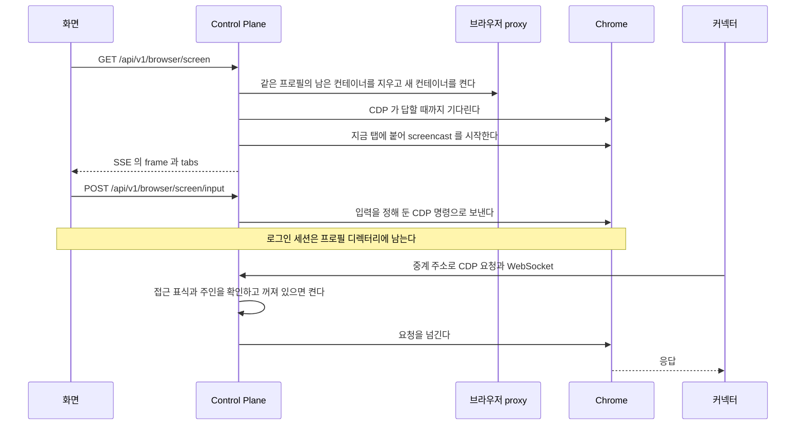

# 사용자 브라우저 기능

사용자마다 하나씩 두는 브라우저를 띄우고 로그인 화면과 중계를 제공하는 기능이다.

## 요구

- 사용자는 웹의 「내 브라우저」(`/browser`)에서 자기 브라우저를 만들고 켜고 끄고 지운다. 그 화면에서 서비스에 직접 로그인한다.
- 로그인 세션은 그 사용자의 프로필 디렉터리에만 남는다. 데이터베이스와 응답, 로그에는 남기지 않는다.
- 커넥터는 브라우저 주소를 받지 않는다. 바인딩이 준 중계 주소로만 그 바인딩 주인의 브라우저에 닿는다.
- 관리자는 관리자 영역의 「브라우저」(`/admin/browsers`)에서 모든 사용자 브라우저의 상태와 오류 코드를 보고 끄거나 지운다. `/browser` 는 내 브라우저만 보이고 오류 코드를 그리지 않는다.
- 기능이 꺼져 있으면 상태 읽기만 되고 쓰기는 503 이다.

결정과 근거는 [ADR-20261007 / user-browser](../adr/ADR-20261007-user-browser.md) 가 갖는다.

## 흐름

## 사용자 브라우저

표의 칸과 제약은 [`backend/docs/data-schema.md`](../../backend/docs/data-schema.md) 가 갖는다.
proxy 의 정책과 이미지, 망, 프로필 디렉터리의 위치는 운영 값이라 `fos-home-infra` 가 갖는다.

### 상태 전이

| 요청 | 시작 상태 | 끝 상태와 갈리는 지점 |
| --- | --- | --- |
| 만들기 | 줄 없음 | `STOPPED`. 지우다 만 프로필 디렉터리가 남아 있으면 비운 뒤 만든다 |
| 켜기 | `STOPPED`, `FAILED` | `RUNNING`. 실패하면 컨테이너를 지우고 `FAILED`. `FAILED` 줄에 번호가 남은 컨테이너를 지우지 못하면 `BROWSER_STOP_FAILED` 로 거절하고 `FAILED` 그대로다 |
| 끄기 | `RUNNING`, `FAILED` | `STOPPED`. proxy 호출이 실패하면 `FAILED` 와 `stop_failed` |
| 지우기 | `STOPPED`, `RUNNING`, `FAILED` | 줄 없음. 끈 줄을 그 버전으로 지운 뒤 프로필을 지운다. 그 사이 다른 전이가 줄을 바꿨으면 `BROWSER_BUSY` 이고 줄과 프로필이 남는다 |
| 자동 중지 | `RUNNING` | `STOPPED`. 유휴 시간이 지났고 쓰는 중인 핸들(`BrowserUsage`)이 없을 때다. 멈추기 직전에 줄을 다시 읽어 아직 유휴인지 본다 |
| 사용자 끄기 | `RUNNING`, `FAILED` | `STOPPED`. 관리자가 허용 목록에서 사용자를 끈 것이 커밋된 뒤 돈다. 프로필과 줄은 남긴다 |

- 동시 수는 `STARTING`, `RUNNING` 과 끄다 실패해 `container_id` 가 남은 `FAILED` 를 센다. 남은 컨테이너도 돌고 있을 수 있기 때문이다. 셀 때 켜기를 한 번에 하나만 하도록 잠근다.
- 이미 `RUNNING` 인 것을 켜거나 `STOPPED` 인 것을 끄면 지금 상태를 그대로 돌려준다.
- `STARTING` 이나 `STOPPING` 인 줄에 온 다른 전이는 `BROWSER_BUSY` 다. 지우기와 사용자 끄기도 같다.
- 사용자 끄기가 `BUSY` 이거나 proxy 호출이 실패하면 로그만 남기고, 다음 점검이 꺼진 사용자의 `RUNNING` 과 `FAILED` 를 다시 끈다.
- 켜기 실패 코드는 `start_failed`, `start_timeout`, `start_exited` 다. `start_exited` 는 CDP 를 기다리는 동안 컨테이너가 끝난 것이다. 끝난 컨테이너는 망 주소가 없어 끝까지 기다려도 답하지 않으므로, 주소가 없으면 컨테이너 상태를 보고 바로 실패로 둔다.
- 종료 코드는 경고 로그에만 남긴다. 화면과 응답에는 싣지 않는다.

#### 한 프로필에 한 컨테이너

이미지는 시작할 때 Chrome 의 프로필 잠금(`SingletonLock`, `SingletonSocket`, `SingletonCookie`)을 지운다.
Chrome 은 정상 종료에서도 잠금을 남기고, 잠금에 앞 컨테이너의 호스트 이름이 적혀 있어 지우지 않으면 다음 Chrome 이 종료 코드 21 로 끝나기 때문이다.
그래서 두 컨테이너가 한 프로필을 함께 쓰지 않게 하는 쪽은 Control Plane 이다.
켜기는 컨테이너를 만들기 전에 같은 프로필 키 라벨의 컨테이너를 모두 지운다. 목록을 읽거나 지우지 못하면 새로 만들지 않고 `start_failed` 다.
이미지도 잠금을 지우기 전에 프로필에 파일 잠금을 잡고, 다른 컨테이너가 쥐고 있으면 끝난다. 이때 켜기는 `start_exited` 다.

#### 점검과 재시작

자동 중지, 꺼진 사용자의 브라우저 끄기, 상태 맞추기는 `assistant.browser.sweep-interval` 마다 돌고 기동할 때 한 번 돈다. 기능이 꺼져 있으면 돌지 않는다.
점검은 끄다 실패해 컨테이너가 남은 `FAILED` 를 다시 끈다. DB 예외는 경고 로그만 남기고 기동을 멈추지 않는다.
상태 맞추기는 proxy 의 컨테이너 목록과 표를 견준다.

| 표와 실제 | 맞추는 것 |
| --- | --- |
| `RUNNING` 인데 컨테이너가 없거나 꺼져 있다 | 남은 컨테이너를 지우고 `STOPPED`. 열린 로그인 화면도 `closed`(`stopped`)로 닫는다 |
| `STARTING` 이나 `STOPPING` 이 오래 그대로다 | 그 키의 컨테이너를 지우고 `STOPPED`. 재기동으로 끊긴 전이가 여기서 정해진다 |
| 라벨의 키에 해당하는 줄이 없거나 그 줄이 `STOPPED` 다 | 컨테이너를 지운다 |
| `RUNNING` 이나 `FAILED` 인 줄이 가리키지 않는 같은 키의 컨테이너 | 컨테이너를 지운다 |

### 설정(사용자 브라우저)

키와 env, 기본값은 `application.yml` 의 `assistant.browser` 와 그 주석이 갖는다.
이미지, 망, 자원, 프로필 루트는 proxy 정책이 강제한다. Control Plane 은 같은 값을 운영 설정으로 받아 생성 요청에 싣는다.
켜져 있는데 기본값이 없는 값이 비어 있으면 기동을 멈춘다. 중계의 두 값만 예외라서, 둘 중 하나라도 비면 중계만 꺼지고 기동한다.
중계 주소와 비밀값의 형식 검사는 `BrowserProperties` 가 갖는다.

Docker proxy 는 chunked 요청을 거절한다. 그래서 Control Plane 은 작은 제어 요청의 본문을 버퍼링해 실제 바이트 수를 `Content-Length` 로 보낸다.

### API(사용자 브라우저)

모두 웹의 서버 라우트를 거치고 요청자는 토큰의 사용자다.
경로는 `UserBrowserController` 와 `UserBrowserAdminController` 가, 응답 칸은 `UserBrowserDtos` 가, 오류 코드는 `ErrorCode` 의 `BROWSER_*` 가 갖는다.
응답에는 컨테이너 번호와 프로필 키를 싣지 않는다.

### 로그인 유지

끌 때 컨테이너를 지우므로 로그인은 프로필 디렉터리에 남은 것만 다음 기동으로 이어진다.
프로필을 만들거나 켤 때 `Default/Preferences` 가 없으면 「이전 세션 이어서 열기」 설정을 주인만 읽는 권한으로 써 둔다. 정상 종료한 뒤 다음 기동에서 세션 쿠키도 돌아오게 하려는 것이다. 끄기는 SIGTERM 뒤 기다리므로 정상 종료다.
이미 있는 설정 파일은 Chrome 이 고쳐 쓰는 것이라 건드리지 않고, 그 자리의 링크도 따라가지 않는다.

QR 로그인은 세션 쿠키만 준다(2026-10-08 실측). 그래서 QR 로그인의 유지는 이 설정에 기댄다.
운영에서 QR 로그인, 끄기, 켜기를 한 번 왕복해 로그인이 남는지 확인한다. 남지 않으면 아이디와 비밀번호, 「로그인 상태 유지」 로 안내를 바꾼다.
같은 실측에서 headless 는 QR 로그인 주소로 바로 가면 막히고 일반 로그인 화면에서 QR 로 바꾸면 통과했다. 그래서 화면의 시작 주소는 호출자가 고른다.

### 로그인 화면

`GET /api/v1/browser/screen` 의 `url` 은 `http`, `https` 만 받는다. 켜기 실패, 기능 꺼짐, 틀린 주소는 SSE 를 열기 전에 JSON 오류다. 탭에 붙지 못하면 `BROWSER_START_FAILED` 다.
사건(`frame`, `tabs`, `closed`)의 본문은 `BrowserScreenSession` 이, 입력의 칸과 범위, 크기 상한은 `UserBrowserDtos` 가, 입력마다 부르는 CDP 명령은 `BrowserScreenSession` 이 갖는다.
그 밖의 CDP 명령은 어느 경로로도 보낼 수 없다. `scroll` 은 `Runtime.evaluate` 로 고정 식만 실행하고 요청자가 식을 정하지 못한다.
입력 본문(글자, 좌표, 주소)과 시작 주소는 로그와 오류 응답에 싣지 않는다.

| 경우 | 결과 |
| --- | --- |
| 같은 브라우저에 화면을 새로 연다 | 앞의 화면에 `closed`(`replaced`)를 보내고 닫는다. 한 브라우저에 화면은 하나다 |
| 화면이 열려 있다 | 자동 중지하지 않고(`BrowserUsage`), 입력마다 활동을 기록한다 |
| 받는 쪽이 프레임을 읽지 않는다 | SSE 에 쓴 뒤에 ack 하므로 Chrome 이 프레임을 더 보내지 않는다 |
| 새 탭이 생긴다(로그인 팝업), 붙은 탭이 사라진다 | screencast 를 새 탭이나 남은 탭으로 옮기고 마지막 `resize` 값을 다시 보낸다 |
| 붙은 탭의 연결이 끊긴다 | 다시 잇는다. 프레임 없이 연이어 끊기면 `closed`(`stopped`)로 닫는다 |
| SSE 쓰기가 실패하거나 주석 `ping` 을 쓰지 못한다 | `closed` 없이 닫는다. 말없이 끊긴 화면이 `screen-timeout` 까지 자동 중지를 막지 않는다 |
| 끄기, 지우기, 사용자 끄기 | 브라우저를 멈추기 전에 화면을 닫는다. `closed` 는 막힌 쓰기를 잠깐만 기다리고 건너뛰어, 읽지 않는 받는 쪽에 붙잡히지 않는다 |
| 입력이 왔는데 화면이 없다 | `BROWSER_SCREEN_CLOSED` |
| 프레임이 아직 없다 | 좌표 입력을 버린다. 좌표는 프레임 그림 안의 비율이고 서버가 마지막 프레임 크기로 CSS 픽셀로 바꾼다 |
| Control Plane 이 다시 뜬다 | 화면 등록부는 JVM 메모리에 있어 SSE 도 끊긴다. 웹이 다시 연다 |

화면마다 도는 탭 확인과 시간 초과, `ping` 은 스케줄러 하나로 돈다. 한 브라우저가 느리면 다른 화면이 늦어지지만, 동시에 켜는 브라우저가 몇 개뿐이라 받아들인다.

웹(`web/src/components/browser/`)이 지키는 약속이다. 변환은 `screen-input.ts` 의 순수 함수가 갖는다.

- 좁은 폭에서도 `mobile` false 를 유지한다. 기기 에뮬레이션으로 로그인 사이트의 동작을 바꾸지 않는다.
- 휴대폰의 탭과 끌기는 `mouse` 와 `wheel` 로 바꿔 보낸다. 그래서 서버는 `touch` 를 받지 않는다.
- 한글은 입력기가 조합을 끝낸 글자를 `text` 로 보내고, 입력은 순서가 바뀌지 않게 한 줄로 보낸다.
- 시작 주소(`/browser?url=`)는 그 페이지에서 처음 연 화면에만 쓴다. 「다시 열기」 는 지금 탭을 그대로 본다.
- 입력의 서버 라우트는 세션을 먼저 보고, 본문이 상한을 넘으면 더 읽지 않고 400 이다.

입력 변환은 `test/unit/browser-screen-input.test.ts` 가, 말없이 끊긴 SSE 를 다시 여는 것은 `test/browser/user-browser-screen.spec.ts` 가 확인한다.

### CDP 연결

Control Plane 은 브라우저의 CDP 에 컨테이너 IP 로 닿고 `Origin` 은 보내지 않는다.
탭에 붙을 때 Chrome 이 알려 주는 WebSocket 주소의 host 는 쓰지 않고 CDP 주소의 host 를 쓴다.
명령의 시간과 메시지 상한은 `WebSocketCdpConnector` 가 갖는다. 연결이 끊기면 기다리던 명령을 모두 실패로 끝낸다.

### 중계

결정은 [ADR-20261007 / user-browser](../adr/ADR-20261007-user-browser.md) 의 「중계」 와 [ADR-20261008 / browser-gateway-token](../../backend/docs/adr/ADR-20261008-browser-gateway-token.md) 이 갖는다.
바인딩 설치와 확인 도구 호출이 `<gateway-base-url>/<접근 표식>` 을 커넥터의 env 에 넣고, 커넥터는 그 주소를 Chrome 의 CDP 주소처럼 부른다.

#### 접근 표식

표식의 모양, 서명할 글, 만료는 [ADR-20261008 / browser-gateway-token](../../backend/docs/adr/ADR-20261008-browser-gateway-token.md) 의 「결정」 이, 형식 검사와 비교는 `BrowserGatewayTokens` 가 갖는다.
같은 바인딩은 늘 같은 표식을 받는다. 그래서 다시 설치해도 서버 정의가 바뀌지 않는다.

#### 받는 것

경로는 `/internal/browser-gateway/<접근 표식>/` 아래다. 웹의 서버 라우트는 이 경로를 넘기지 않는다.
넘기는 경로와 응답을 바꾸는 규칙은 `BrowserGatewayController` 와 `GatewayRewriter` 가 갖는다. 정한 `json/` 경로와 `devtools/` 아래 WebSocket 만 넘기고, 응답 속 WebSocket 주소를 중계 주소로 바꾼다.
커넥터는 중계 주소의 경로만 꺼내 자기가 받은 주소의 호스트에 붙이므로 `gateway-base-url` 과 호스트가 달라도 된다.

요청마다 이 순서로 판정한다.

1. `Origin`, `Sec-Fetch-Site`, `Sec-Fetch-Mode` 가운데 하나라도 있으면 403 이다. 브라우저의 페이지가 보낸 요청이다. 브라우저는 no-cors `GET` 에 `Origin` 을 싣지 않으므로 `Sec-Fetch-*` 로도 막는다. WebSocket handshake 는 `Origin` 만 본다. 주소 검사(400)와 대상 번호 모양(404)은 이 다음에 본다
2. 중계가 꺼졌거나 기능이 꺼졌으면 503 이다
3. 표식의 모양, 서명, 바인딩, 호출 표식의 만료 가운데 하나라도 틀리면 404 다. 어느 까닭인지 응답으로 구분하지 않는다
4. 주인이 허용 목록에서 꺼져 있으면 404 다
5. 주인의 브라우저가 없으면 만들고 꺼져 있으면 켠다. 다른 전이가 진행 중이면 `start-timeout` 까지 다시 본다
6. 동시 수가 찼으면 503, 켜지 못했으면 502, 기다려도 `RUNNING` 이 되지 않으면 503 이다
7. 활동을 기록하고 Chrome 에 넘긴다. Chrome 이 닿지 않거나 200 이 아닌 답을 주면 502 다

오류 응답의 본문은 비운다. 커넥터는 상태 코드만 본다.
Chrome 에는 `BrowserRuntime#cdpAddress` 가 준 IP 주소로 `Origin` 없이 보낸다. `Host` 가 IP 라 Chrome 의 `Host` 검사를 지난다.

#### WebSocket

- 받은 연결 하나에 Chrome 쪽 연결 하나를 열고, 한쪽이 닫히면 다른 쪽도 닫는다
- handshake 는 브라우저를 켜기 전에 형식을 보고, 틀리면 빈 400 이다
- 연결이 열려 있는 동안 `BrowserUsage` 핸들을 쥐어 자동 중지하지 않는다. 받은 세션은 `idle-timeout` 동안 오가는 것이 없으면 닫혀, 반쯤 끊긴 연결이 핸들을 계속 쥐지 않는다
- 글 메시지는 조각째 그대로 넘긴다. 모으지 않으므로 사진 바이트가 든 큰 CDP 메시지도 세션마다 큰 버퍼를 잡지 않는다. 메시지 크기 상한은 `BrowserGatewaySocket` 이 갖고, 넘거나 바이너리 메시지가 오면 양쪽을 닫는다
- Chrome 쪽 보내기가 시간 안에 끝나지 않으면 양쪽을 닫는다. 멈춘 Chrome 이 요청 스레드를 붙잡지 않게 한다
- 브라우저가 멈추면(끄기, 지우기, 사용자 끄기, 상태 맞추기) Chrome 쪽 연결이 끊기고 받은 연결도 닫힌다
- 표식은 열 때만 확인한다. 열린 뒤 바인딩을 떼도 그 연결은 닫힐 때까지 간다. 떼기는 도구 목록에서 서버를 빼므로 새 호출은 오지 않는다
- `org.springframework.web.socket` 로그를 DEBUG 로 올리지 않는다. 표식이 든 주소가 로그에 남는다

#### 커넥터에 건네기

`connector.json` 이 `owner_browser_env` 를 선언한 커넥터에만 중계 주소를 싣는다.

| 호출 | 싣는 주소 |
| --- | --- |
| 바인딩 설치(붙이기, 값 교체, 연결 확인, 반영 완료의 다시 설치) | 그 바인딩의 표식 주소(`BrowserGatewayTokens#bindingAddress`) |
| 확인 도구와 선택지 호출 | 요청자의 호출 표식 주소(`BrowserGatewayTokens#callAddress`) |
| 승인한 실행 | 싣지 않는다. 대시보드가 설치한 서버 정의의 값을 쓴다 |

중계가 꺼졌으면 빈 값을 싣는다. 설치는 막지 않고, 커넥터가 브라우저에 닿지 못한다고 답해 연결 확인이 실패로 보인다.
요청 본문의 칸과 대시보드가 값을 넣는 규칙은 [커넥터 설치](connector.md) 의 「바인딩 설치」 와 [`hermes/README.md`](../../hermes/README.md) 의 커넥터 경로가 갖는다.
