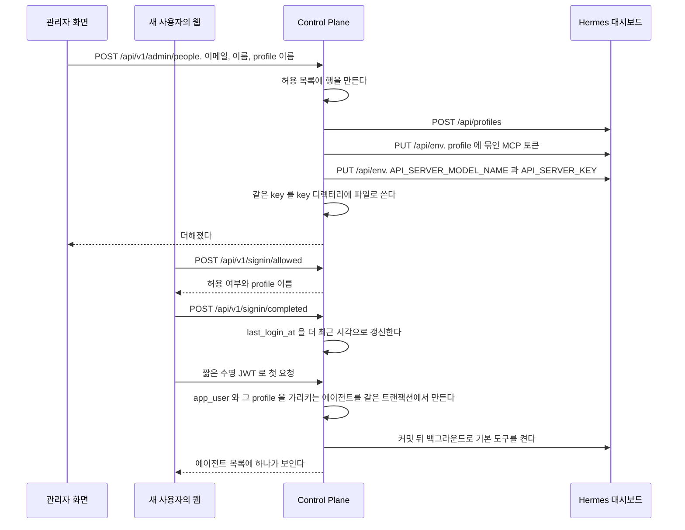

# 사용자와 로그인

관리자가 사용자를 더하고 끄며, 사용자가 로그인하고 그 활동이 기록되는 기능이다.

## 요구

- **관리자가 화면에서 한 번 더하면 끝난다.** 홈서버에 들어가지 않는다. Control Plane 이 허용 목록에 넣고 Hermes profile 과 key, 그 profile 에 묶인 MCP 토큰을 만든다.
- Google 동의 화면의 테스트 사용자에 주소를 더하는 것만 사람이 따로 한다. 그 화면은 Google 계정 소유자만 고칠 수 있다.
- 허용 목록에 있는 사람만 로그인한다. 첫 로그인 때 `app_user` 와 그 사람의 에이전트가 생긴다.
- 관리자가 사용자를 끄면 그 사용자의 다음 요청부터 막히고, 다시 켜면 다음 요청부터 통과한다.
- 관리자의 사용자 목록은 마지막 로그인과 마지막 대화 시각을 보인다. 값이 없으면 「기록 없음」 이다.
- 사람을 더하는 화면과 API 는 `ADMIN` 만 연다. `MEMBER` 역할 사용자는 둘 다 보지 못한다.

profile 을 사람마다 나누는 근거는 [ADR-002](../../backend/docs/adr/ADR-002-profile은-나누고-ai-계정은-가족이-함께-쓴다.md), Control Plane 이 Hermes 를 고치는 호출을 하게 된 근거는 [ADR-018](../../backend/docs/adr/ADR-018-사람을-더하는-것을-control-plane-이-끝낸다.md) 에 있다.

## 흐름

## 관리자 영역

**관리자도 일반 화면에서는 `MEMBER` 역할 사용자와 같은 것을 본다.** 관리자 전용 표시와 관리 동작은 `/admin` 아래에만 있다.
근거는 [ADR-063](../adr/ADR-063-관리자-전용-표시와-동작은-관리자-영역에만-두고-일반-경로의-응답은-서버가-역할에-따라-줄인다.md) 이 갖는다.
틀과 입구, 돌아가는 길은 [`web/docs/code-architecture.md`](../../web/docs/code-architecture.md) 의 「관리자 입구」 와 「관리자 영역의 틀」 절이 갖는다.

| 메뉴 | 경로 | 담는 것 | 일반 화면에서 옮겨 온 것 |
| --- | --- | --- | --- |
| 사용자 | `/admin/people` | 사용자 추가, 사용 중지와 다시 허용, 마지막 로그인과 마지막 대화 시각 | 사이드바 메뉴의 「사용자 관리」 링크 |
| 에이전트 | `/admin/agents`, `/admin/agents/{code}` | 다른 사람의 비공개와 꺼진 에이전트까지 든 목록, 운영 profile 등록, 에이전트의 기본 모델과 받는 기억 영역과 사용 여부와 연결 주소, 내 살펴보기의 가치 평가 | `/agents` 의 관리자 목록과 등록 양식, `/agents/{code}` 의 「모델」 과 「관리」 절 |
| 모델 | `/admin/models` | 그룹 모델 설정(단계별 모델, 그룹 기본 단계), 모델 숨김 | 대화 입력창 모델 선택기 안의 「그룹 모델 설정」 |
| 도구 | `/admin/tools` | 그룹의 화면에 보일 도구, 켜진 에이전트 수와 관리 화면 링크 | 없음 |
| 사용량과 비용 | `/admin/usage`, `/admin/executions/{id}` | 금액과 모델과 토큰, 「사용량 내역」, 「설정별 사용량」 탭, 실행 상세의 내부 값 | `/usage` 와 `/executions/{id}` 가 `ADMIN` 에게 더 그리던 것 |
| 커넥터 | `/admin/connections` | 반영을 기다리는 바인딩의 「반영 완료」. 재시작 대기 바인딩은 공유 gateway 를 재시작한 뒤 누른다 | `/connections` 아래의 관리자 패널 |
| 브라우저 | `/admin/browsers` | 모든 사용자 브라우저의 상태와 오류 코드, 끄기와 지우기 | 없음. `/browser` 는 내 브라우저만 보이고 오류 코드를 그리지 않는다 |
| 파일 공간 | `/admin/workspaces` | 실행 공간마다 용량과 항목 수 | 없음. `/files` 는 내 공간만 보이고 관리자도 남의 공간을 열지 못한다 |

대화 화면도 같다. 작업 과정의 「원본 보기」, 모델이 바뀌었다는 표시, 오류 코드는 일반 화면에 그리지 않는다.
실패한 실행의 원인은 `/admin/usage` 의 실행 기록에서 그 실행을 열어 본다.

**일반 화면에 남긴 것.** 관리 작업이 아니라 쓰면서 하는 일이다.

| 남긴 것 | 까닭 |
| --- | --- |
| 내 기본 단계와 대화별 모델 선택 | 사용자 본인의 설정이다 |
| 내 에이전트 만들기, 성격과 도구와 스킬, 공개와 삭제 | 주인이 하는 일이다. `ADMIN` 이 그룹에 공개된 에이전트를 고칠 수 있는 것도 서버 권한 그대로 남는다 |
| 기억 화면의 그룹 공용 기억 고치기와 지우기 | 대화하다 생긴 것을 검토하는 자리다. 옮기면 기억 화면이 둘로 나뉜다. 서버가 `ADMIN` 에게만 허용한다 |

**화면이 관리자 표시를 그릴지는 `useAdminView()` 가 정한다.** 역할이 `ADMIN` 이고 지금 경로가 `/admin` 아래일 때만 참이다.
역할만 보고 그리면 일반 화면에 관리자 표시가 다시 생긴다.

**그룹 모델 설정은 에이전트 없이 읽는다(`GET /api/v1/admin/model-tiers`).** 단계 정의는 그룹의 설정이고 특정 에이전트에 매이지 않는다.
에이전트로 읽는 `GET /api/v1/chat/model-tiers` 는 요청자가 대화를 시작할 수 있는 에이전트만 받는다. 그래서 관리자 목록의 첫 에이전트가 남의 비공개 에이전트면 관리자가 그룹 단계를 고칠 곳이 없어진다.
에이전트로 읽으면 provider 를 비운 단계가 그 에이전트의 기본 provider 로 채워져 보이고, 그대로 저장하면 그 값으로 굳는 문제도 있었다.
모델이 그 에이전트의 목록에 있는지는 실행할 때 본다.

`/admin/models` 는 에이전트를 고르는 칸을 둔다. 숨길 모델의 목록을 Hermes profile 에 물어 읽고, 그 목록이 에이전트마다 다르기 때문이다.
그룹 모델 설정과 숨김은 어느 에이전트를 골라도 그룹 전체에 걸린다.

## 로그인 활동 기록

| 경우 | 결과 |
| --- | --- |
| 허용된 로그인의 `events.signIn` | `POST /api/v1/signin/completed` 가 켜진 허용 목록의 `last_login_at` 을 서버 시계로 갱신하고 204 다. 사용자는 만들지 않는다 |
| 서명이 틀렸거나 허용 목록 줄이 꺼졌거나 없다 | 401 이고 기록하지 않는다 |
| 기록 요청이 실패한다 | 웹이 오류 로그를 남기고 로그인은 계속한다 |
| 로그인이 거절됐다 | 세션과 활동 기록을 만들지 않는다 |
| 일반 요청과 세션 갱신 | 로그인 활동을 기록하지 않는다 |

두 로그인 경로는 `SignInController` 가 전용 서명 토큰을 직접 검사한다.
관리자 목록이 보이는 값은 아래 「관리자에게 보이는 최근 활동」 이 갖는다.

## 꺼진 사용자의 세션

관리자가 끈 사용자가 세션을 가진 채 요청하면 Control Plane 이 401 과 `ACCESS_REVOKED` 로 답한다.
`web/src/lib/control-plane.ts` 가 Control Plane 응답을 받는 한곳에서 그 코드를 보고 세션을 끊는다. 화면마다 따로 처리하지 않는다.

| 어디서 불렀나 | 어떻게 되나 |
| --- | --- |
| API 라우트 | 그 자리에서 세션 쿠키를 지우고 401 `ACCESS_REVOKED` 를 그대로 돌려준다. 화면은 「사용이 중지된 계정이에요」 문구를 보인다. 그다음 화면 이동은 세션이 없어 `/signin` 으로 간다 |
| 서버 컴포넌트 | 그리는 중에는 쿠키를 지울 수 없어 `/signout/revoked` 로 넘긴다. 그 경로가 쿠키를 지우고 `/signin` 으로 보낸다 |

`/signout/revoked` 는 화면이 아니라 라우트다.
스스로 Control Plane 에 다시 물어 `ACCESS_REVOKED` 일 때만 세션을 지운다.
그래서 다른 사이트가 이 주소로 보내도 켜져 있는 사용자는 로그아웃되지 않는다.

이미 열린 대화 스트림은 끝날 때까지 이어진다.
서버 쪽 판정은 아래 「사용자를 껐을 때」, 근거는 [ADR-059](../adr/ADR-059-꺼진-사용자는-control-plane-이-요청마다-막고-웹이-세션을-끊는다.md) 에 있다.

## 사용자를 더할 때

**`people` 이 순서를 안다.** 허용 목록에 넣고 profile 을 만들고 key 를 넣는 차례와, 중간에 실패했을 때 되돌리는 역순이 그 패키지 하나에 있다.
`hermes` 는 부르는 방법만 알고 순서를 모른다.
검사: `ArchitectureRules.HERMES_DOES_NOT_DEPEND_ON_PEOPLE`

`clone_from` 을 쓰지 않는다. 까닭은 [ADR-018](../../backend/docs/adr/ADR-018-사람을-더하는-것을-control-plane-이-끝낸다.md) 의 「`clone_from` 을 쓰지 않는다」 가 갖는다.
profile 을 만드는 경로가 에이전트 만들기와 같아 MCP 등록과 서명 plugin 도 함께 붙는다.

### 첫 에이전트의 과금 설정

첫 로그인에 만드는 에이전트의 `cost_mode` 와 `credential_scope` 를 설정에서 읽는다. 키와 기본값은 `PeopleProperties` 가 갖는다.
두 값이 사람마다 다르지 않은 근거는 [ADR-002](../../backend/docs/adr/ADR-002-profile은-나누고-ai-계정은-가족이-함께-쓴다.md) 에 있다.
설정 이름은 `assistant.people.*` 그대로이고 `PeopleProperties` 는 `agent.application` 이 갖는다. `agent` 가 `people` 을 import 하지 않게 하려는 것이다(ADR-068).
에이전트는 실행에 쓸 모델을 갖지 않으므로, 첫 로그인에 에이전트를 만들 때도 Hermes 에서 모델을 읽지 않는다.

### 첫 에이전트의 기본 도구

첫 로그인에 만든 에이전트에 `assistant.people.default-toolsets` 의 도구를 켠다.
주인 등급이거나 실행 공간에서만 도는 도구가 아니면 기동하지 않는다.
결정과 감당할 것은 [ADR-20261008 / default-toolsets](../adr/ADR-20261008-default-toolsets.md) 가 갖는다.

`FirstAgentCreator` 가 첫 로그인의 트랜잭션이 커밋된 뒤 백그라운드 작업으로 `AgentDefaultToolsets` 를 부른다. 첫 요청은 Hermes 호출을 기다리지 않는다.
실행 공간 주인 키 `u<사용자 번호>` 가 이때 처음 생기므로 profile 을 만들 때 켜지 않는다. 로그인이 되돌려지면 부르지 않는다.
켤 때는 그룹 공개면 셸·파일·사진 계열을, 비밀 요청 스킬이 있으면 셸·파일·사진 도구를 빼고, 남은 셸·파일·사진 도구가 있으면 대시보드 plugin 에 `require_sandbox: true` 로 쓴다.
쓴 뒤 공유 listener 로 다시 읽어 켜지지 않은 것이 있으면 경고 로그를 남긴다.

| 무엇 | 어떻게 되나 |
| --- | --- |
| 설정이 빈 목록이다 | Hermes 를 부르지 않는다 |
| 기본 도구가 이미 다 켜져 있다 | 쓰지 않는다 |
| profile 이 실행 공간 정책에 없다 | plugin 이 409 `sandbox_unavailable` 로 거절하면 셸·파일·사진 도구를 빼고 다시 쓴다. 경고 로그를 남긴다. 운영이 정책에 등록한 뒤 관리자가 에이전트 도구 화면에서 켠다 |
| 정책에 없는데 셸 계열이 이미 켜져 있다 | 쓰지 않는다. 그 쓰기가 셸을 local 로 확정하기 때문이다. 경고 로그를 남긴다 |
| Hermes 가 답하지 않거나 다른 오류로 거절한다 | 경고 로그만 남긴다. 로그인은 그대로 끝난다 |
| 옛 plugin 이 `require_sandbox` 를 몰라 400 으로 거절한다 | 같다. 아무 도구도 켜지 않는다. plugin 을 먼저 배포한다 |

켠 도구는 관리자 등급 그대로다. 주인은 셸 계열을 끄지 못하고 관리자가 끈다.

### key 를 두 곳에 같이 쓴다

같은 값을 Hermes 의 `.env` 와 우리 key 디렉터리에 각각 쓴다. 한쪽만 들어가면 실행할 때 401 이 난다.
`HermesProfileKeyStore` 가 key 파일의 읽기, 쓰기, 지우기를 모두 갖는다.
**읽는 규칙과 쓰는 규칙이 같은 파일에 있어야 파일 이름 규칙이 갈리지 않는다.**

### 사람을 더할 때

두 시점에 나뉘어 일어난다.
**관리자가 더할 때 Hermes 쪽이 끝나고, 그 사람이 처음 로그인할 때 우리 쪽이 끝난다.**
자기 profile 만 쓰는 에이전트는 주인이 있어야 하고, 주인은 그 사람이 로그인하기 전에는 존재하지 않기 때문이다.
순서는 위 「흐름」 이다. 에이전트는 자기만 보는 것으로 만들고 주인을 그 사람으로 둔다.

#### 어긋나는 지점

| 무엇 | 어떻게 되나 |
| --- | --- |
| 이미 있는 이메일 | 거절한다. 허용 목록의 이메일은 하나뿐이다 |
| 이미 있는 profile 이름 | 거절한다. 우리 표에서도 Hermes 에서도 본다 |
| profile 은 만들었는데 토큰이나 key 주입이 실패 | **발급한 토큰을 폐기하고 만든 profile 을 지운다.** 아무것도 남기지 않는다 |
| key 파일 쓰기가 실패 | 같다. profile 을 지우고 허용 목록 행도 되돌린다 |
| Hermes 가 응답하지 않는다 | 허용 목록 행을 만든 뒤에 Hermes 를 부르므로 만든 행을 되돌린다. 되돌리기가 실패하면 행이 남고, 원래 오류를 올린 뒤 되돌리기 실패를 로그에 남긴다 |
| 같은 요청이 두 번 온다 | 뒤의 것이 이메일 유니크 제약에 걸려 거절된다 |
| 허용 목록에 없는 사람이 로그인 | 로그인을 거절하고 토큰을 만들지 않는다 |
| 허용 목록에는 있는데 profile 이 없어졌다 | 실행할 때 key 를 찾지 못해 실패한다. 관리자가 다시 더한다 |
| 첫 로그인에 Hermes 가 답하지 않는다 | 첫 로그인은 모델을 읽지 않고 에이전트를 만든다. 기본 도구는 커밋 뒤에 켜고 실패해도 로그만 남기므로 로그인도 에이전트 생성도 막히지 않는다 |

에이전트를 만드는 것은 `app_user` 를 새로 저장하는 그 순간뿐이다.
허용 목록에서 그 사람을 찾지 못해 에이전트 없이 들어온 사람은 관리자가 기존 에이전트 등록 화면에서 만든다. 그 사람의 `app_user` 가 이미 있어 주인을 지정할 수 있다.
**다시 시도하는 것을 요청 경로에 두지 않는다.** 로그인 판정이 매 요청 도는 자리라, 거기서 에이전트가 있는지 다시 보지 않는다.

**되돌리는 순서가 만드는 순서의 역순이다.**
Hermes 쪽을 먼저 지우고 우리 표를 나중에 지운다. 반대로 하면 우리 표에 없는 profile 이 Hermes 에 남는다.

#### 관리자에게 보이는 최근 활동

관리자의 사용자 목록과 사용자 추가·변경 응답은 마지막 로그인과 마지막 대화 시각을 함께 준다. 칸은 `PeopleDtos` 가 갖는다.
일반 사용자 API 에는 넣지 않는다. 기존 `joined` 는 `app_user` 의 존재 여부이며 첫 로그인 시각이 아니다.

- 마지막 로그인은 위 「로그인 활동 기록」 이 적는다. 동시에 로그인해도 더 오래된 시각으로 되돌아가지 않고, 관리자가 사용자를 켜거나 끌 때도 유지한다
- 지난 로그인은 복원하지 않으므로 기존 사용자의 값도 다음 로그인 전까지 비어 있다
- 화면은 기존 사용자이거나 마지막 로그인 기록이 있으면 로그인 이력이 있다고 보인다. 로그인 완료 직후에는 사용자가 아직 만들어지지 않았을 수 있기 때문이다
- 마지막 대화는 `chat_message` 에서 그 사용자가 보낸 `USER` 메시지의 `created_at` 최댓값이다. 대화 소유자가 아닌 `sender_user_id` 가 기준이고 답변, 알림 줄, 자동 실행은 세지 않는다. 지운 대화에 남은 사용자 메시지도 센다
- 사용자마다 질의하지 않고 한 번의 집계 질의로 묶는다. 메시지 본문은 관리자 응답에 넣지 않는다
- 화면은 상대 시각과 서울의 정확한 시각을 함께 보이고, 행의 「상세」 는 목록 응답을 다시 쓰므로 사용자별 추가 요청이 없다

#### 사용자를 껐을 때

로그인 판정은 로그인할 때 한 번만 돌고 웹 세션은 그 뒤에도 남는다. 그래서 Control Plane 이 웹 토큰을 받는 요청마다 다시 확인한다.
웹 쪽 처리는 위 「꺼진 사용자의 세션」 이 갖는다.

| 무엇 | 어떻게 되나 |
| --- | --- |
| 줄이 꺼져 있다 | `ControlPlaneJwtFilter` 가 401 과 `ACCESS_REVOKED` 로 답하고 요청을 컨트롤러로 넘기지 않는다. `app_user` 를 찾지도 만들지도 않는다 |
| 줄이 켜져 있다 | 지금과 같다 |
| 줄이 없다 | 막지 않는다. 화면은 줄을 지우지 않고 끄기만 한다. 줄 없이 생긴 사용자는 첫 관리자와 검사용 사용자다 |
| 서명이 틀렸거나 토큰이 없다 | 지금과 같다. 인증 없이 지나가 Spring Security 가 403 으로 답한다 |
| 이미 열린 SSE 응답과 오래 걸리는 요청 | 끝날 때까지 이어진다. 판정은 요청이 시작될 때 한 번만 한다. 이미 시작한 실행도 멈추지 않는다 |
| 다시 켠다 | 다음 요청부터 통과한다. 세션이 지워진 사용자는 다시 로그인한다 |

`ACCESS_REVOKED` 는 이 판정만 내는 코드다. 세션이 없을 때 웹이 만드는 `UNAUTHENTICATED` 와 달라, 웹이 세션을 지울지 이 코드로 판단한다.

`/mcp` 와 `/internal/hermes/` 아래 경로, `/internal/browser-gateway/` 아래 경로, 서비스 토큰 경로, 두 로그인 경로는 이 필터를 지나지 않는다.
브라우저 중계의 허용 목록 확인은 중계가 직접 한다([`docs/features/user-browser.md`](user-browser.md) 의 「중계」).
서비스 토큰은 주인이 켜져 있는지 따로 확인한다([`docs/features/memory.md`](memory.md)).

#### 아무도 없을 때

허용 목록이 비면 아무도 로그인하지 못한다.
**마이그레이션은 표만 만들고 어떤 주소도 넣지 않는다.** 이 저장소는 공개다.
배포할 때 지금 쓰는 주소를 한 번 넣어야 하고, 그 절차는 비공개 저장소가 소유한다.
데이터베이스를 새로 만들거나 그 표를 비우면 들어갈 길이 사라지고, 그때는 데이터베이스에 직접 행을 넣어야 한다.
