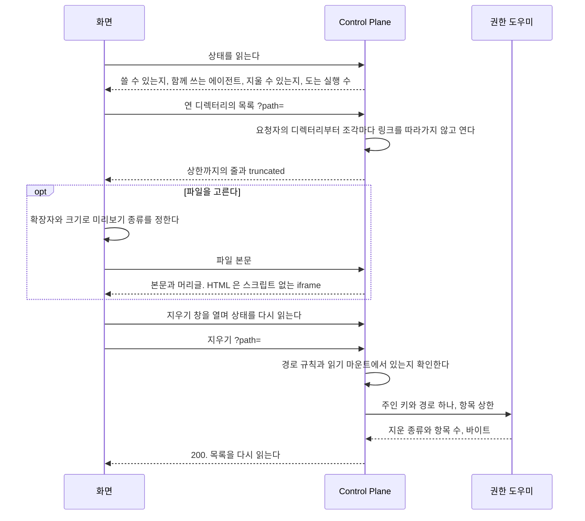

# 파일 공간 기능

사용자가 에이전트의 실행 공간에 있는 파일을 화면에서 열어 보는 기능이다.

covers: `backend/src/main/java/com/bifos/assistant/workspace/`, `web/src/components/workspace/`, `web/src/app/admin/workspaces/`

## 요구

- 사용자는 `/files` 에서 자기 에이전트들이 함께 쓰는 실행 공간을 보고, 미리 보고, 내려받고, 지운다. 다른 사용자의 공간은 보이지 않는다.
- HTML 미리보기는 결과물과 같은 격리로 스크립트 없이 뜬다.
- 지우기는 확인 창을 거치고, 운영의 권한 도우미가 할 수 있을 때만 단추가 보인다.

결정은 [ADR-20261009 / workspace-explorer](../adr/ADR-20261009-workspace-explorer.md), API 와 경로 규칙은 [`backend/docs/code-architecture.md`](../../backend/docs/code-architecture.md) 의 「실행 공간 파일」 이 갖는다.

## 흐름

목록을 열고 항목 하나를 지우는 흐름이다. 목록과 미리보기는 Control Plane 이 읽기 전용으로 붙인 실행 공간에서 읽고, 지우기만 권한 도우미가 한다.

## 파일 공간

| 자리 | 무엇 |
| --- | --- |
| 머리 | 「파일 공간」 제목과 함께 쓰는 에이전트 이름들. 그룹에 공개한 에이전트에는 「그룹 공개」 표시를 붙이고, 다른 사람이 그 에이전트를 쓰면 그 파일도 여기 생긴다고 한 줄 더한다 |
| 경로 줄 | 「파일 공간」 부터 연 디렉터리까지의 조각. 누르면 그 디렉터리로 간다 |
| 목록 | 디렉터리를 먼저, 이름 순서. 디렉터리를 누르면 열고 파일을 누르면 미리보기를 연다 |
| 줄의 동작 | 「내려받기」, 「지우기」. 지우기는 상태의 `deletable` 일 때만 그린다 |
| 미리보기 | 넓은 화면은 목록 옆 패널, 좁은 화면은 전체 폭 시트. 결과물 패널과 같은 자리 규칙이다 |

| 목록의 줄 | 보이는 것 |
| --- | --- |
| `readable` 이 거짓 | 「읽을 수 없음」 을 붙이고 누르지 못한다. 주인만 읽는 파일이다 |
| `LINK` | 「링크」 를 붙이고 누르지 못한다. 링크를 따라가지 않는다 |
| `openable` 이 거짓 | 주소로 열 수 없는 이름이라 미리보기와 내려받기를 열지 않는다. 연 디렉터리의 경로가 그런 이름을 지나면 그 안의 파일도 같다 |
| `truncated` | 목록 끝에 상한까지만 보인다고 알린다 |

미리보기 종류는 화면이 확장자와 목록의 `size` 로 정하고, 상한과 형식은 [`backend/docs/code-architecture.md`](../../backend/docs/code-architecture.md) 의 「본문 머리글」 표와 같다.
글은 고정폭 글꼴로, CSV 와 TSV 는 표로, 사진은 `` 로, HTML 은 결과물 패널과 같은 `sandbox` 의 iframe 으로 그린다. 그 밖과 상한을 넘는 것은 「미리보기가 없어요」 와 내려받기다.
받은 글에 NUL 이 있으면 글 파일이 아니라고 보이고, 본문을 받지 못하면 내려받아 열라고 안내한다.
CSV 와 TSV 의 줄 상한과 따옴표 처리는 `web/src/components/workspace/csv-table.tsx` 가 갖는다. 미리보기와 지우기의 분기는 `test/browser/workspace-files.spec.ts` 가 확인한다.

| 상태 | 보이는 것 |
| --- | --- |
| `available` 이 거짓 | 「파일 공간을 쓸 수 없어요. 관리자에게 알려 주세요.」 |
| `exists` 가 거짓, 빈 디렉터리 | 「아직 에이전트가 만든 파일이 없어요」 |
| 400 | 「경로가 올바르지 않아요.」 와 맨 위로 가기 |
| 404 | 「찾을 수 없어요. 지워졌을 수 있어요.」 와 맨 위로 가기 |
| 그 밖의 실패 | 「불러오지 못했어요」 와 다시 읽기 |

**지우기는 확인 창을 거친다.** 창은 이름과 종류(파일, 폴더, 링크, 특수 파일)를 보이고, 디렉터리면 안의 파일까지 모두 지운다고 더한다.
창을 열 때 상태를 다시 읽어 `runningExecutions` 가 0 보다 크면 「에이전트가 지금 일하고 있어요. 쓰는 중인 파일이면 다시 생길 수 있어요.」 를 더한다.
**지운 경로는 목록에서 누른 줄의 경로 하나다.** 주소의 `file` 이나 미리보기의 경로를 지우기에 쓰지 않는다.
지운 뒤 목록을 다시 읽고, 미리 보던 파일이나 그 파일이 든 폴더를 지웠으면 미리보기를 닫는다.

| 지우기의 답 | 화면 |
| --- | --- |
| 409, 도우미가 항목 상한을 넘었다고 답했다 | 「항목이 너무 많아 지우지 않았어요. 안쪽 폴더부터 지워 주세요.」. 아무것도 지우지 않았다 |
| 502, 도우미가 실패했거나 답하지 않았다 | 「지우지 못했어요. 일부만 지워졌을 수 있어요.」. 목록을 다시 읽어 남은 것을 보인다 |
| 404 | 「찾을 수 없어요. 지워졌을 수 있어요.」. 목록을 다시 읽는다 |
| 그 밖의 실패(403, 500, 503, 400, 연결 끊김) | 「지우지 못했어요.」. 목록을 다시 읽는다 |

## 파일 공간을 열 때

상태와 목록은 브라우저가 읽고, 실패는 그 자리의 다시 읽기로 다룬다. `/files` 페이지를 받을 때 서버에서 읽는 것은 없다.

| 무엇 | 어떻게 되나 |
| --- | --- |
| 루트가 설정되지 않았거나 디렉터리가 아니다 | 상태가 `available` 거짓이다 |
| 사용자 디렉터리가 없다 | 상태가 `exists` 거짓이다. 아직 에이전트가 파일을 만들지 않은 것이다 |
| 경로가 규칙에 어긋난다 | 400. 목록 대신 오류 안내와 맨 위로 가기 |
| 경로가 없거나 링크를 지난다 | 404 |
| 두 탭에서 같은 것을 지운다 | 늦은 쪽은 404 를 받고 목록을 다시 읽는다 |
| 목록을 연 사이 에이전트가 파일을 바꾼다 | 다음 읽기에 보인다. 화면은 스스로 다시 읽지 않는다 |

지우면 Control Plane 은 INFO 로그 한 줄을 남기고, 도우미는 지운 경로만 감사 기록에 남긴다.
