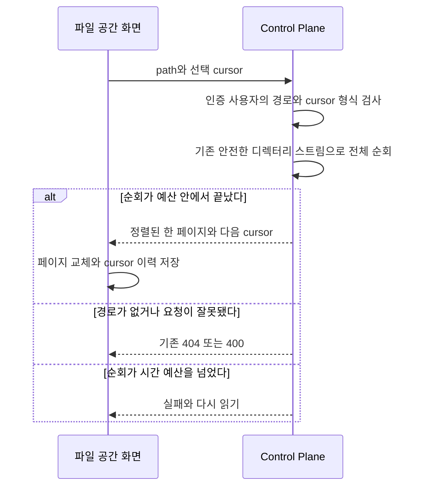
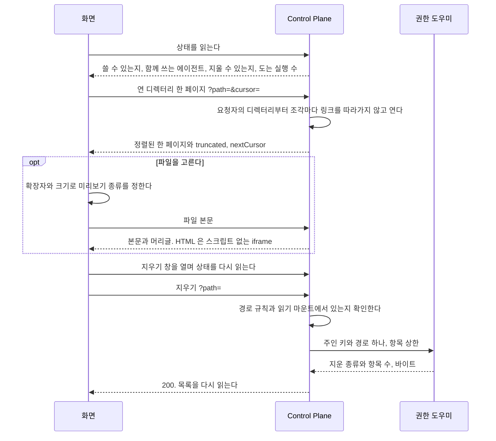

# 파일 공간 기능

사용자가 에이전트의 실행 공간에 있는 파일을 화면에서 열어 보는 기능이다.

## 목록 페이지

디렉터리 전체에서 정렬 키 뒤의 항목을 골라 한 페이지씩 보여 준다. 고정된 목록은 끝까지 누락과 중복 없이 탐색할 수 있다.

- 목록 API는 선택 인자 `cursor`를 받고 `{path, entries, truncated, nextCursor}`를 돌려준다. 한 페이지는 1,000건이고, `truncated`는 다음 페이지가 있다는 뜻이다. 끝이면 `nextCursor`는 null이다.
- 정렬 키는 `(디렉터리인가, 이름)`이다. 디렉터리가 먼저이며 이름은 Java `String.compareTo`의 순서를 쓴다. 대소문자를 접거나 Unicode를 정규화하지 않아 서로 다른 실제 파일 이름을 합치지 않는다. 링크와 특수 파일의 기존 표시·열기 금지를 유지한다.
- 디렉터리 전체를 같은 안전한 스트림으로 훑고 cursor 뒤의 가장 작은 1,001건만 최대 힙에 유지한다. 열거 순서로 먼저 자르지 않는다. 요청당 메모리는 페이지 크기에 비례하고, 시간은 항목 수에 비례한다. 전체 목록 캐시와 별도 색인은 만들지 않는다.
- cursor는 버전, 상대 경로 원문 UTF-8의 SHA-256 지문, 표시한 마지막 항목의 정렬 키를 담은 base64url 값이다. 경로 원문을 담지 않아 기존 최대4,096바이트 경로와255바이트 이름도4,096자 상한 안에서 왕복한다. canonical base64url·strict UTF-8·정확한 키·타입·버전·지문과 요청 경로의 일치를 검사하고 실패하면400이다. 이름은 파일을 여는 경로로 쓰지 않으며 Linux의 정상 목록 이름을 본문 경로 규칙으로 배제하지 않는다. 지문은 권한이 아니며 주인 디렉터리는 매 요청의 인증 사용자로만 정한다. 다른 사용자의 cursor도 그 사용자의 자료를 읽을 권한을 주지 않는다.
- 고정된 디렉터리는 생성 순서에 관계없이 끝까지 누락·중복 없이 탐색한다. 페이지 사이 생성·삭제·이름 변경은 snapshot으로 고정하지 않는다. 지난 키 앞에 생긴 항목은 다시 읽기에 보이고, 이미 본 항목이 이름이나 종류를 바꾸면 다시 보일 수 있다. 화면은 이 한계를 안내한다.
- 스트림 순회 중 2초가 지나면 성공한 일부 목록으로 속이지 않고 기존 500 오류로 끝낸다. 파일 시스템 호출 자체가 멈춘 경우까지 이 제한이 끊어 주지는 못한다. 10,000건 합성 자료의 지연·힙 사용을 측정해 그 한계를 공개한다.
- `/files`는 「다음 목록」과 「이전 목록」으로 페이지를 교체한다. cursor 이력만 보관하고 앞 페이지의 항목을 계속 쌓지 않는다. 이동·다시 읽기·삭제 후에는 첫 페이지부터 읽으며 늦게 끝난 이전 요청의 결과로 현재 목록을 바꾸지 않는다. 빈 다음 페이지도 이전 목록이나 다시 읽기로 돌아갈 수 있다.
- 기존 미리보기의 `file` 주소와 선택한 파일 메타데이터 한 건은 페이지 상태와 분리해 유지한다. 다음·이전·빈 페이지에서도 주소와 미리보기를 함께 보존하며 목록 전체를 누적하지 않는다. 파일 접근은 기존 본문 API가 현재 권한으로 판정한다. 삭제 대상은 계속 실제 목록에서 누른 줄 하나다.

`WorkspaceTreeTest`는 0/1/999/1,000/1,001/1,002/10,000건의 역순·무작위 생성 목록을 끝까지 기준 정렬과 대조한다. 기존 `SecureDirectoryStream`과 대체 경로의 사후 검사를 모두 유지한다. 이름을 정규화하는 로컬 파일 시스템에서는 같은 이름의 대소문자·Unicode 차이 검사를 건너뛰며, Linux에서 실행한다. 최대 4,096바이트 경로는 codec으로, 실제 긴 경로는 파일 시스템에서 따로 확인한다. #359의 Alpine 유지와 링크 경쟁 위험 수용은 바꾸지 않으며 glibc 전환을 이 기능의 선행 조건으로 넣지 않는다.

로컬 합성 10,000건을 10번 조회한 마지막 측정은 p50 136ms, p95 152ms였다. 조회 전후 JVM 사용 힙은 2,747,720바이트 감소했다. 이 차이는 GC 시점과 임시 할당을 포함하므로 유지 메모리의 상한을 뜻하지 않는다. 후보 최대 힙은 시험에서 1,001건을 넘지 않음을 별도로 확인한다. 운영 파일 시스템의 성능은 아직 측정하지 않았다.

`workspace-pages.spec.ts`는 합성 사용자와 임시 실행 공간을 나눠 실제 Next → Control Plane → WorkspaceTree 왕복을 두 화면 폭에서 확인한다. 모바일 시트가 목록을 덮는 동안 선택 상태 검사는 페이지 단추의 클릭 핸들러로 요청을 보내며, 미리보기와 주소의 유지 여부를 확인한다. 삭제 후 페이지 초기화와 409의 재조회 생략은 기존 응답 대역 검사에서 확인한다. 실제 삭제 도우미의 운영 검증은 #370이 갖는다.

covers: `backend/src/main/java/com/bifos/assistant/workspace/`, `web/src/components/workspace/`, `web/src/app/admin/workspaces/`, `web/src/app/files/`, `web/src/lib/workspace-api.ts`, `web/src/lib/workspace-file.ts`

## 요구

- 사용자는 `/files` 에서 자기 에이전트들이 함께 쓰는 실행 공간을 보고, 미리 보고, 내려받고, 지운다. 다른 사용자의 공간은 보이지 않는다.
- HTML 미리보기는 결과물과 같은 격리로 스크립트 없이 뜬다.
- 지우기는 확인 창을 거치고, 운영의 권한 도우미가 할 수 있을 때만 단추가 보인다.

결정은 [ADR-20261009 / workspace-explorer](../adr/ADR-20261009-workspace-explorer.md), API 와 경로 규칙은 [`backend/docs/code-architecture.md`](../../backend/docs/code-architecture.md) 의 「실행 공간 파일」 이 갖는다.

## 흐름

목록을 열고 항목 하나를 지우는 흐름이다. 목록과 미리보기는 Control Plane 이 읽기 전용으로 붙인 실행 공간에서 읽고, 지우기만 권한 도우미가 한다.

## 파일 공간

| 자리 | 무엇 |
| --- | --- |
| 머리 | 「파일 공간」 제목과 함께 쓰는 에이전트 이름들. 그룹에 공개한 에이전트에는 「그룹 공개」 표시를 붙이고, 다른 사람이 그 에이전트를 쓰면 그 파일도 여기 생긴다고 한 줄 더한다 |
| 경로 줄 | 「파일 공간」 부터 연 디렉터리까지의 조각. 누르면 그 디렉터리로 간다 |
| 목록 | 디렉터리를 먼저, 이름 순서. 「다음 목록」과 「이전 목록」으로 교체한다. 디렉터리를 누르면 열고 파일을 누르면 미리보기를 연다 |
| 줄의 동작 | 「내려받기」, 「지우기」. 지우기는 상태의 `deletable` 일 때만 그린다 |
| 미리보기 | 넓은 화면은 목록 옆 패널, 좁은 화면은 전체 폭 시트. 결과물 패널과 같은 자리 규칙이다 |

| 목록의 줄 | 보이는 것 |
| --- | --- |
| `readable` 이 거짓 | 「읽을 수 없음」 을 붙이고 누르지 못한다. 주인만 읽는 파일이다 |
| `LINK` | 「링크」 를 붙이고 누르지 못한다. 링크를 따라가지 않는다 |
| `openable` 이 거짓 | 주소로 열 수 없는 이름이라 미리보기와 내려받기를 열지 않는다. 연 디렉터리의 경로가 그런 이름을 지나면 그 안의 파일도 같다 |
| `truncated` | 다음 페이지가 있어 「다음 목록」을 누를 수 있다 |

미리보기 종류는 화면이 확장자와 목록의 `size` 로 정하고, 상한과 형식은 [`backend/docs/code-architecture.md`](../../backend/docs/code-architecture.md) 의 「본문 머리글」 표와 같다.
글은 고정폭 글꼴로, CSV 와 TSV 는 표로, 사진은 `` 로, HTML 은 결과물 패널과 같은 `sandbox` 의 iframe 으로 그린다. 그 밖과 상한을 넘는 것은 「미리보기가 없어요」 와 내려받기다.
받은 글에 NUL 이 있으면 글 파일이 아니라고 보이고, 본문을 받지 못하면 내려받아 열라고 안내한다.
CSV 와 TSV 의 줄 상한과 따옴표 처리는 `web/src/components/workspace/csv-table.tsx` 가 갖는다. 미리보기와 지우기의 분기는 `test/browser/workspace-files.spec.ts` 가 확인한다.

| 상태 | 보이는 것 |
| --- | --- |
| `available` 이 거짓 | 「파일 공간을 쓸 수 없어요. 관리자에게 알려 주세요.」 |
| `exists` 가 거짓, 빈 디렉터리 | 「아직 에이전트가 만든 파일이 없어요」 |
| 400 | 「경로가 올바르지 않아요.」 와 맨 위로 가기 |
| 404 | 「찾을 수 없어요. 지워졌을 수 있어요.」 와 맨 위로 가기 |
| 그 밖의 실패 | 「불러오지 못했어요」 와 다시 읽기 |

**지우기는 확인 창을 거친다.** 창은 이름과 종류(파일, 폴더, 링크, 특수 파일)를 보이고, 디렉터리면 안의 파일까지 모두 지운다고 더한다.
창을 열 때 상태를 다시 읽어 `runningExecutions` 가 0 보다 크면 「에이전트가 지금 일하고 있어요. 쓰는 중인 파일이면 다시 생길 수 있어요.」 를 더한다.
**지운 경로는 목록에서 누른 줄의 경로 하나다.** 주소의 `file` 이나 미리보기의 경로를 지우기에 쓰지 않는다.
지운 뒤 목록을 다시 읽고, 미리 보던 파일이나 그 파일이 든 폴더를 지웠으면 미리보기를 닫는다.

| 지우기의 답 | 화면 |
| --- | --- |
| 409, 도우미가 항목 상한을 넘었다고 답했다 | 「항목이 너무 많아 지우지 않았어요. 안쪽 폴더부터 지워 주세요.」. 아무것도 지우지 않았다 |
| 502, 도우미가 실패했거나 답하지 않았다 | 「지우지 못했어요. 일부만 지워졌을 수 있어요.」. 목록을 다시 읽어 남은 것을 보인다 |
| 404 | 「찾을 수 없어요. 지워졌을 수 있어요.」. 목록을 다시 읽는다 |
| 그 밖의 실패(403, 500, 503, 400, 연결 끊김) | 「지우지 못했어요.」. 목록을 다시 읽는다 |

## 파일 공간을 열 때

상태와 목록은 브라우저가 읽고, 실패는 그 자리의 다시 읽기로 다룬다. `/files` 페이지를 받을 때 서버에서 읽는 것은 없다.

| 무엇 | 어떻게 되나 |
| --- | --- |
| 루트가 설정되지 않았거나 디렉터리가 아니다 | 상태가 `available` 거짓이다 |
| 사용자 디렉터리가 없다 | 상태가 `exists` 거짓이다. 아직 에이전트가 파일을 만들지 않은 것이다 |
| 경로가 규칙에 어긋난다 | 400. 목록 대신 오류 안내와 맨 위로 가기 |
| 경로가 없거나 링크를 지난다 | 404 |
| 두 탭에서 같은 것을 지운다 | 늦은 쪽은 404 를 받고 목록을 다시 읽는다 |
| 목록을 연 사이 에이전트가 파일을 바꾼다 | 페이지는 snapshot이 아니다. 지난 정렬 키 앞에 생긴 항목은 다시 읽기로 보이며 이름이나 종류가 바뀐 항목은 다시 보일 수 있다. 화면은 스스로 다시 읽지 않는다 |

지우면 Control Plane 은 INFO 로그 한 줄을 남기고, 도우미는 지운 경로만 감사 기록에 남긴다.
