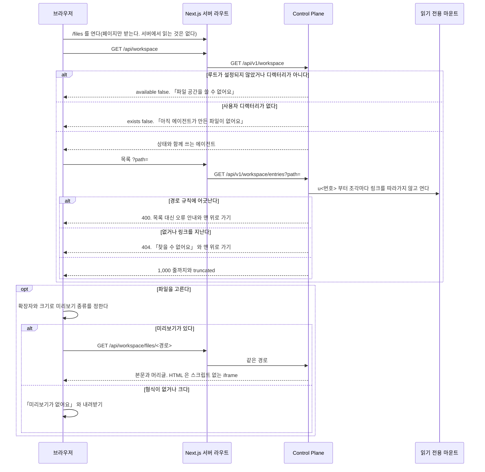
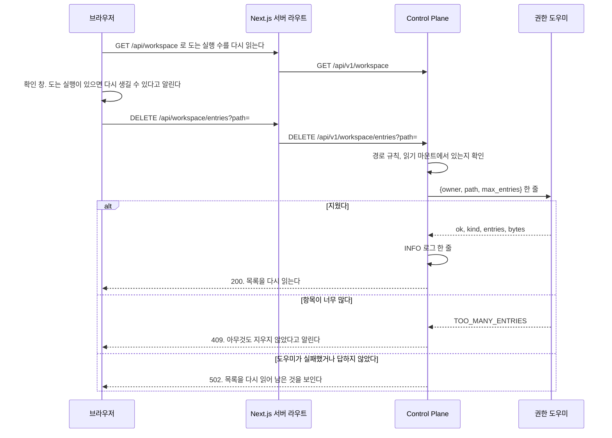

# 파일 공간 기능

사용자가 에이전트의 실행 공간에 있는 파일을 화면에서 열어 보는 기능이다.

## 파일 공간

결정은 [ADR-20261009 / workspace-explorer](../adr/ADR-20261009-workspace-explorer.md), API 와 경로 규칙은 [`backend/docs/code-architecture.md`](../../backend/docs/code-architecture.md) 의 「실행 공간 파일」, 흐름은 [`docs/features/workspace.md`](workspace.md) 의 「파일 공간을 열 때」 가 갖는다.

| 자리 | 무엇 |
| --- | --- |
| 머리 | 「파일 공간」 제목, 「내 에이전트들이 함께 쓰는 공간이에요」 와 그 에이전트 이름들. 그룹에 공개한 에이전트에는 「그룹 공개」 표시를 붙이고 「다른 사람이 이 에이전트를 쓰면 그 파일도 여기 생겨요」 를 한 줄 더한다 |
| 경로 줄 | 「파일 공간」 부터 연 디렉터리까지의 조각. 누르면 그 디렉터리로 간다 |
| 목록 | 디렉터리를 먼저, 이름 순서. 줄마다 종류 아이콘, 이름, 크기, 바뀐 시각. 디렉터리를 누르면 연다. 파일을 누르면 미리보기를 연다. `readable` 이 거짓이면 「읽을 수 없음」, `LINK` 는 「링크」 표시를 붙이고 누르지 못한다. `openable` 이 거짓이면 「주소로 열 수 없는 이름」 을 붙이고 미리보기와 내려받기를 열지 않는다. 연 디렉터리의 경로가 주소로 쓸 수 없는 이름을 지나면 그 안의 파일도 같다. `truncated` 면 목록 끝에 「1,000개까지만 보여요」. 좁은 폭에서는 바뀐 시각 칸을 숨긴다 |
| 줄의 동작 | 「내려받기」(`FILE` 이고 `readable` 이고 `openable` 일 때), 「지우기」(상태의 `deletable` 일 때만 그린다) |
| 미리보기 | 넓은 화면은 목록 옆 패널, 좁은 화면은 전체 폭 시트. 결과물 패널과 같은 자리 규칙이다. 머리에 이름, 「내려받기」, 「닫기」 |

미리보기 종류는 화면이 확장자와 목록의 `size` 로 정하고, 상한과 형식은 Control Plane 의 「본문 머리글」 표와 같다.

| 종류 | 그리는 법 |
| --- | --- |
| 글 | 고정폭 글꼴로 줄바꿈해 보인다. 받은 글에 NUL 이 있으면 「글 파일이 아니에요」 와 내려받기. 본문을 받지 못하면 「미리보기를 불러오지 못했어요. 내려받아 열어 주세요.」 와 내려받기 |
| CSV, TSV | 표로 그린다. 첫 줄을 머리로 쓰고 1,000줄까지 그린다. 따옴표 안의 쉼표와 줄바꿈을 지킨다. 더 있으면 「1,000줄까지만 보여요」. 줄이 없으면 「빈 파일이에요.」 |
| 사진 | `` 로 띄운다 |
| HTML | 결과물 패널과 같은 `sandbox` 의 iframe. 흰 바탕 |
| 그 밖, 상한을 넘는 것 | 「미리보기가 없어요」 와 내려받기 |

| 상태 | 보이는 것 |
| --- | --- |
| `available` 이 거짓 | 「파일 공간을 쓸 수 없어요. 관리자에게 알려 주세요.」 |
| `exists` 가 거짓, 빈 디렉터리 | 「아직 에이전트가 만든 파일이 없어요」 |
| 400 | 「경로가 올바르지 않아요.」 와 맨 위로 가기 |
| 404 | 「찾을 수 없어요. 지워졌을 수 있어요.」 와 맨 위로 가기 |
| 그 밖의 실패 | 「불러오지 못했어요」 와 다시 읽기 |

**지우기는 확인 창을 거친다.** 창은 이름과 종류(파일, 폴더, 링크, 특수 파일)를 보이고, 디렉터리면 「안의 파일까지 모두 지워요」 를 더한다.
창을 열 때 상태를 다시 읽어 `runningExecutions` 가 0 보다 크면 「에이전트가 지금 일하고 있어요. 쓰는 중인 파일이면 다시 생길 수 있어요.」 를 더한다.
지운 뒤 목록을 다시 읽고, 미리 보던 파일이나 그 파일이 든 폴더를 지웠으면 미리보기를 닫는다. 409 밖의 실패도 목록을 다시 읽는다. 409 는 「항목이 너무 많아 지우지 않았어요. 안쪽 폴더부터 지워 주세요.」, 502 는 「지우지 못했어요. 일부만 지워졌을 수 있어요.」 다. 404 는 「찾을 수 없어요. 지워졌을 수 있어요.」 이고 그 밖의 실패(403, 500, 503, 400, 연결 끊김)는 「지우지 못했어요.」 다.
지운 경로는 목록에서 누른 줄의 경로 하나다. 주소의 `file` 이나 미리보기의 경로를 지우기에 쓰지 않는다.

## 파일 공간을 열 때

경로 규칙과 API 는 [`backend/docs/code-architecture.md`](../../backend/docs/code-architecture.md) 의 「실행 공간 파일」, 결정은 [ADR-20261009 / workspace-explorer](../adr/ADR-20261009-workspace-explorer.md) 가 갖는다.

상태와 목록은 브라우저가 읽고, 실패는 그 자리의 다시 읽기로 다룬다.
두 탭에서 같은 것을 지우면 늦은 쪽은 404 를 받고 목록을 다시 읽는다.
목록을 연 사이 에이전트가 파일을 바꾸면 다음 읽기에 보인다. 화면은 스스로 다시 읽지 않는다.
