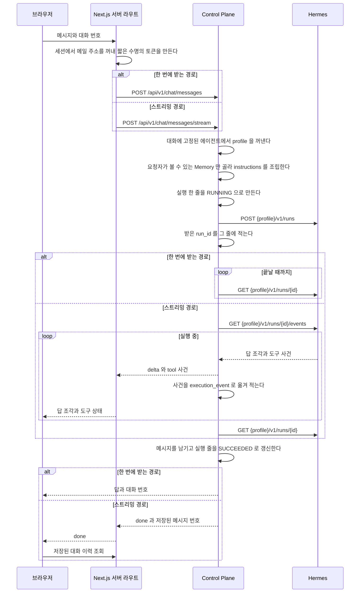
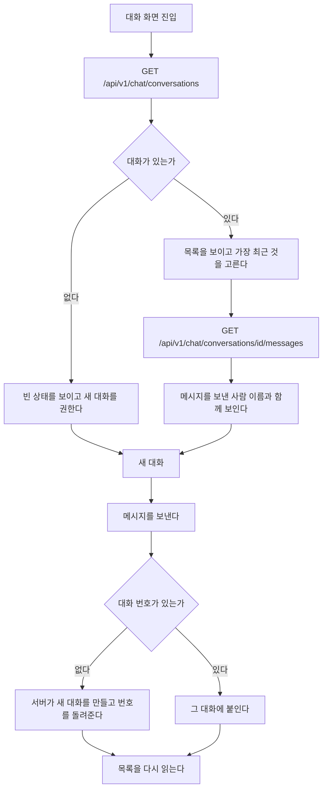

# 흐름

화면 전환과 호출 순서를 담는다.
모듈 배치는 [`code-architecture.md`](code-architecture.md), 저장 모델은 [`data-schema.md`](data-schema.md)가 가진다.

## 대화 한 번



대화가 없으면 새로 만들고 첫 메시지가 에이전트를 정한다.
이어지는 요청이 에이전트를 다시 주더라도 대화에 적힌 값을 쓴다.
`hermes_session_id` 가 특정 profile 안의 session 이라, 중간에 에이전트가 바뀌면 그 session 이 가리키는 것이 없어진다.

실행 줄은 Hermes 를 부르기 전에 `RUNNING` 으로 먼저 만들어진다.
그래서 오래 도는 실행도 사용량 화면에서 보이고, 서버가 중간에 죽어도 그 실행이 기록에 남는다.

두 경로 모두 Hermes 실행 상태 조회가 돌려준 최종 `output` 과 `usage` 를 저장한다.
스트리밍 경로의 답 조각은 화면에만 쓰며, 이벤트 연결이 중간에 끝나도 최종 상태를 조회해 메시지와 실행 기록을 남긴다.
브라우저는 `done` 을 받으면 대화 이력을 다시 읽고 화면의 답 조각을 저장된 답으로 바꾼다.

## 대화 이력

브라우저를 새로 고쳐도 이어서 말할 수 있어야 한다.
대화와 메시지는 데이터베이스에 남아 있으므로 화면이 그것을 읽는다.



### 갈리는 지점

| 상황 | 화면 |
| --- | --- |
| 대화가 하나도 없다 | 목록 자리에 빈 상태를 보이고 입력창은 그대로 쓴다 |
| 메시지를 읽지 못했다 | 그 대화만 오류를 보이고 목록은 남긴다 |
| 남의 대화 번호를 주소로 넣었다 | 없는 것과 같은 오류다. 목록으로 되돌린다 |
| 보내는 중이다 | 입력창을 잠그고 진행을 알린다 |
| 보내다 실패했다 | 쓴 문장을 입력창에 되돌려 다시 보낼 수 있게 한다 |
| 같은 대화에 두 번 눌렀다 | 앞의 요청이 끝나기 전에는 두 번째를 보내지 않는다 |

실패한 요청의 문장을 되돌리는 것이 중요하다.
지금은 보내는 순간 입력창을 비우므로, 실패하면 사용자가 쓴 문장이 사라진다.

## 화면 배치

대화 화면은 문서처럼 아래로 길어지지 않는다.
화면 높이를 채우고 그 안에서 메시지 영역만 스크롤한다. 입력창은 늘 아래에 붙어 있다.

```
┌─ 머리 ────────────────────────────────┐
│ 우리집 비서   사용량  관리      ☾ 밝기  │
├──────────┬────────────────────────────┤
│ 대화 목록 │ 에이전트                    │
│          ├────────────────────────────┤
│  · 대화1  │ 메시지                      │  ← 여기만 스크롤한다
│  · 대화2  │                            │
│          ├────────────────────────────┤
│ + 새 대화 │ 입력창                 보내기│
└──────────┴────────────────────────────┘
```

너비가 좁아지면 대화 목록이 서랍으로 접힌다.
머리의 버튼으로 열고, 대화를 고르면 닫힌다.

| 너비 | 대화 목록 |
| --- | --- |
| `md` 이상 | 왼쪽에 늘 보인다 |
| `md` 미만 | 서랍. 버튼으로 열고 고르면 닫힌다 |

목록이 화면을 밀어내지 않는 것이 중요하다.
지금은 좁은 화면에서 목록이 대화 위에 쌓여, 대화가 여럿이면 입력창이 화면 밖으로 나간다.

### 새 메시지를 따라간다

메시지가 늘면 아래로 따라 내려간다.
다만 사용자가 위로 올려 지난 대화를 읽고 있으면 따라가지 않는다.
읽던 자리가 밀려나기 때문이다. 대신 `새 메시지` 단추를 띄워 누르면 내려간다.

## 기다리는 동안 보이는 것

기다림의 종류마다 다른 것을 보인다. 같은 회전 표시를 돌리지 않는다.

| 기다리는 것 | 보이는 것 |
| --- | --- |
| 대화 목록을 처음 읽는다 | 목록 자리에 뼈대 세 줄 |
| 고른 대화의 메시지를 읽는다 | 메시지 자리에 뼈대 두 줄 |
| 답을 기다린다 | 비서 줄에 점 세 개가 차례로 밝아진다 |
| 답이 흘러나온다 | 글자가 그대로 쌓인다. 따로 표시하지 않는다 |
| 도구를 부르는 중이다 | 답 위에 그 도구 이름을 한 줄로 |

뼈대는 실제 내용과 같은 높이로 둔다.
높이가 다르면 내용이 도착할 때 화면이 튄다.

답이 흘러나오는 동안에는 진행 표시를 따로 두지 않는다.
글자가 늘어나는 것 자체가 진행이고, 그 옆에 회전 표시를 함께 두면 둘 중 무엇을 봐야 할지 모른다.

## 밝기 모드

밝음과 어두움과 시스템 셋 중에서 고른다. 고른 값은 그 브라우저에 남는다.
아무것도 고르지 않았으면 시스템 설정을 따른다.

첫 화면이 밝게 그려졌다가 어둡게 바뀌는 일이 없어야 한다.
`next-themes` 가 그리기 전에 저장된 값을 읽어 `html` 에 붙인다.

## 실행이 실패할 때

| 오류 코드 | 원인 | 화면이 하는 일 |
| --- | --- | --- |
| `HERMES_BINDING_MISSING` | 이 사용자에게 연결된 AI 계정이 없다 | 관리자에게 연결을 요청하도록 안내한다 |
| `HERMES_PROFILE_KEY_MISSING` | profile 의 key 가 준비되지 않았다 | 서버 설정 문제로 안내한다 |
| `HERMES_RUN_TIMEOUT` | 제한 시간 안에 끝나지 않았다 | 다시 보내도록 안내한다 |

실패한 실행도 기록에 남는다.
사용량 화면에서 무엇이 실패했는지 볼 수 있다.
