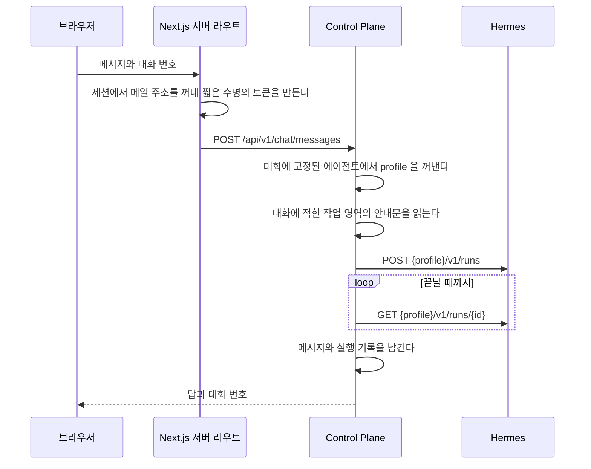
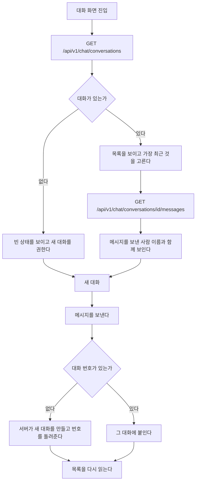

# 흐름

화면 전환과 호출 순서를 담는다.
모듈 배치는 [`code-architecture.md`](code-architecture.md), 저장 모델은 [`data-schema.md`](data-schema.md)가 가진다.

## 대화 한 번

대화가 없으면 새로 만들고 첫 메시지가 에이전트와 작업 영역을 정한다.
이어지는 요청이 에이전트나 영역을 다시 주더라도 대화에 적힌 값을 쓴다.
`hermes_session_id` 가 특정 profile 안의 session 이라, 중간에 영역이나 에이전트가 바뀌면 그 session 이 가리키는 것이 없어진다.

## 대화 이력

브라우저를 새로 고쳐도 이어서 말할 수 있어야 한다.
대화와 메시지는 데이터베이스에 남아 있으므로 화면이 그것을 읽는다.

### 갈리는 지점

| 상황 | 화면 |
| --- | --- |
| 대화가 하나도 없다 | 목록 자리에 빈 상태를 보이고 입력창은 그대로 쓴다 |
| 메시지를 읽지 못했다 | 그 대화만 오류를 보이고 목록은 남긴다 |
| 남의 대화 번호를 주소로 넣었다 | 없는 것과 같은 오류다. 목록으로 되돌린다 |
| 보내는 중이다 | 입력창을 잠그고 진행을 알린다 |
| 보내다 실패했다 | 쓴 문장을 입력창에 되돌려 다시 보낼 수 있게 한다 |
| 같은 대화에 두 번 눌렀다 | 앞의 요청이 끝나기 전에는 두 번째를 보내지 않는다 |

실패한 요청의 문장을 되돌리는 것이 중요하다.
지금은 보내는 순간 입력창을 비우므로, 실패하면 사용자가 쓴 문장이 사라진다.

## 실행이 실패할 때

| 오류 코드 | 원인 | 화면이 하는 일 |
| --- | --- | --- |
| `HERMES_BINDING_MISSING` | 이 사용자에게 연결된 AI 계정이 없다 | 관리자에게 연결을 요청하도록 안내한다 |
| `HERMES_PROFILE_KEY_MISSING` | profile 의 key 가 준비되지 않았다 | 서버 설정 문제로 안내한다 |
| `HERMES_RUN_TIMEOUT` | 제한 시간 안에 끝나지 않았다 | 다시 보내도록 안내한다 |
| `WORKSPACE_NOT_FOUND` | 없는 영역이거나 남의 개인 영역이다 | 영역 선택을 비우고 목록을 다시 읽는다 |

실패한 실행도 기록에 남는다.
사용량 화면에서 무엇이 실패했는지 볼 수 있다.
