# 흐름

화면 전환과 호출 순서를 담는다.
모듈 배치는 [`code-architecture.md`](code-architecture.md), 저장 모델은 [`data-schema.md`](data-schema.md)가 가진다.

## 두 방향과 두 토큰

요청이 한 방향으로만 흐르지 않는다.
Control Plane 이 Hermes 를 부르고, Hermes 가 다시 Control Plane 을 부른다.
**그 둘이 쓰는 토큰이 다르다.**

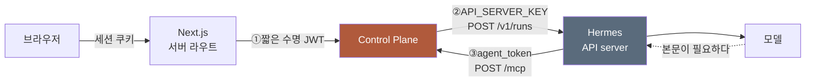

| 번호 | 누가 누구를 | 토큰 | 그 토큰이 말하는 것 |
| --- | --- | --- | --- |
| ① | 웹 → Control Plane | 짧은 수명 JWT | 이 사람이 로그인했다 |
| ② | Control Plane → Hermes | `API_SERVER_KEY` | 이 profile 을 쓸 자격이 있다 |
| ③ | Hermes → Control Plane | `agent_token` | 이 요청이 누구의 것이다 |

**①과 ③이 둘 다 사용자를 정하지만 성질이 다르다.**

| 축 | ① 웹 토큰 | ③ agent_token |
| --- | --- | --- |
| 만드는 때 | 요청마다 새로 | 한 번 발급하고 계속 씀 |
| 수명 | 짧다 | 폐기할 때까지 |
| 저장 | 저장하지 않는다 | 해시만 저장한다 |
| 두는 곳 | 만들어 바로 쓰고 버린다 | 홈서버 파일과 profile 의 `.env` |

②는 사용자를 정하지 않는다. profile 을 정할 뿐이다.
어느 사용자의 실행인지는 Control Plane 이 이미 알고 있고, 그것을 Hermes 에게 알리지 않는다.

③이 필요한 이유가 여기 있다.
Hermes 가 Control Plane 을 부를 때는 Control Plane 이 그 요청의 주인을 모른다.
**요청 본문에 사용자를 적게 하면 모델이 그것을 바꿀 수 있다.**
그래서 토큰만이 사용자를 정한다.

## 사람을 더할 때

두 시점에 나뉘어 일어난다.
**관리자가 더할 때 Hermes 쪽이 끝나고, 그 사람이 처음 로그인할 때 우리 쪽이 끝난다.**

한 시점에 몰지 않는 이유는 하나다.
자기 profile 만 쓰는 에이전트는 주인이 있어야 하고,
주인은 그 사람이 로그인하기 전에는 존재하지 않는다.

### 관리자가 더할 때

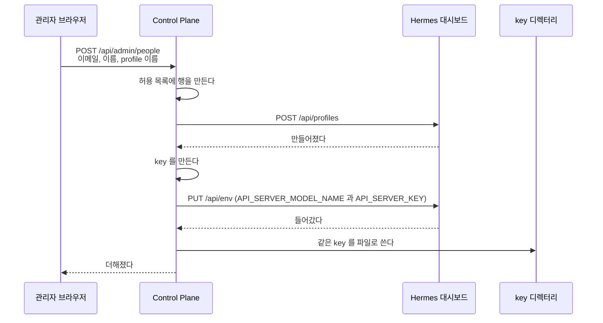

`clone_from` 을 쓰지 않는다.
그 값을 주면 본뜬 profile 의 `API_SERVER_KEY` 까지 복사되어
key 하나로 두 profile 이 열린다. 실측으로 확인했다.

### 그 사람이 처음 로그인할 때

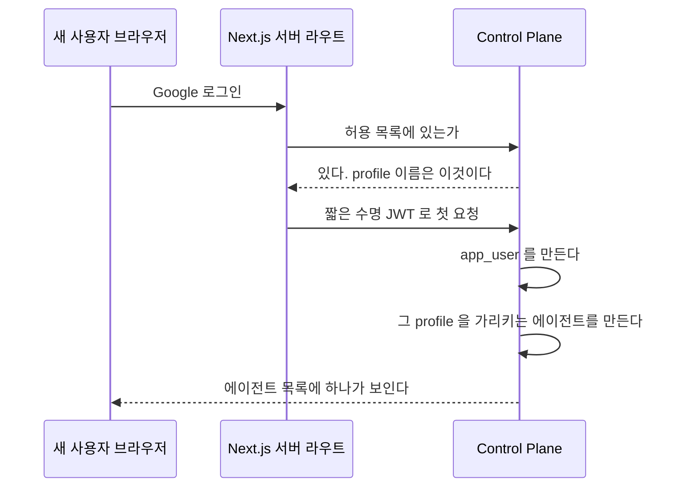

에이전트는 자기만 보는 것으로 만들고 주인을 그 사람으로 둔다.
`API_SERVER_KEY` 를 파일에서 찾는 규칙은 바뀌지 않는다. profile 이름으로 찾는다.

### 어긋나는 지점

| 무엇 | 어떻게 되나 |
| --- | --- |
| 이미 있는 이메일 | 거절한다. 허용 목록의 이메일은 하나뿐이다 |
| 이미 있는 profile 이름 | 거절한다. 우리 표에서도 Hermes 에서도 본다 |
| profile 은 만들었는데 key 주입이 실패 | **만든 profile 을 지운다.** 아무것도 남기지 않는다 |
| key 파일 쓰기가 실패 | 같다. profile 을 지우고 허용 목록 행도 되돌린다 |
| Hermes 가 응답하지 않는다 | 허용 목록 행을 만들기 전이므로 아무것도 남지 않는다 |
| 같은 요청이 두 번 온다 | 뒤의 것이 이메일 유니크 제약에 걸려 거절된다 |
| 허용 목록에 없는 사람이 로그인 | 지금과 같다. 토큰을 만들지 않는다 |
| 허용 목록에는 있는데 profile 이 없어졌다 | 실행할 때 key 를 찾지 못해 실패한다. 관리자가 다시 더한다 |
| 첫 로그인에 Hermes 가 모델을 주지 않는다 | **사용자만 만들고 에이전트는 만들지 않는다.** 로그인은 막지 않는다 |
| 첫 로그인에 Hermes 가 provider 를 비워서 준다 | 같다. 틀린 값으로 메우면 실행할 때마다 실패한다 |

에이전트 없이 들어온 사람은 관리자가 기존 에이전트 등록 화면에서 만든다.
그 사람의 `app_user` 가 이미 있어 주인을 지정할 수 있다.
**다시 시도하는 것을 요청 경로에 두지 않는다.**
로그인 판정이 매 요청 도는 자리라, 거기서 Hermes 를 부르면 모든 요청이 그 응답을 기다린다.

**되돌리는 순서가 만드는 순서의 역순이다.**
Hermes 쪽을 먼저 지우고 우리 표를 나중에 지운다.
반대로 하면 우리 표에 없는 profile 이 Hermes 에 남는다.

### 관리자가 아닌 사람

사람을 더하는 화면은 `ADMIN` 만 연다.
`MEMBER` 는 그 화면도 그 API 도 보지 못한다.

### 아무도 없을 때

허용 목록이 비면 아무도 로그인하지 못한다.
**마이그레이션은 표만 만들고 어떤 주소도 넣지 않는다.** 이 저장소는 공개다.
배포할 때 지금 쓰는 주소를 한 번 넣어야 하고, 그 절차는 비공개 저장소가 소유한다.
데이터베이스를 새로 만들거나 그 표를 비우면 들어갈 길이 사라진다.
그때는 데이터베이스에 직접 행을 넣어야 한다.

## 페르소나를 고칠 때

에이전트의 성격은 그 profile 의 `SOUL.md` 가 갖고 이 저장소는 화면만 준다.
근거는 [ADR-019](adr/ADR-019-페르소나는-hermes-가-갖고-control-plane-은-화면만-준다.md) 에 있다.

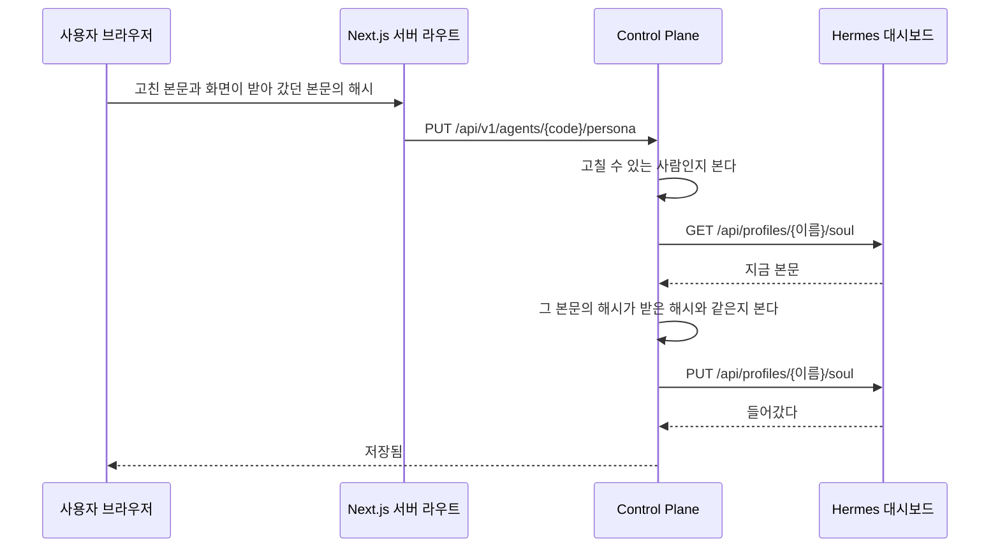

**저장한 것이 곧 다음 실행에 쓰인다.** Hermes 가 실행할 때 그 파일을 읽는다.
데이터베이스에 사본이 없어 어긋날 것이 없고, 반영 상태를 보일 일도 없다.

### 갈리는 지점

| 무엇 | 어떻게 되나 |
| --- | --- |
| 고칠 권한이 없다 | 본문을 읽기만 한다. 저장 단추가 없고 경로도 거절한다 |
| 볼 권한이 없다 | 그 에이전트가 목록에 없다. 본문 경로도 없는 에이전트와 같은 응답을 준다 |
| 앞뒤에 공백이 붙어 있다 | 떼고 저장한다. 쓴 것과 저장된 것이 다를 수 있다 |
| 본문이 비어 있다 | 거절한다. 빈 `SOUL.md` 를 쓰면 성격이 지워진다 |
| 본문이 상한을 넘는다 | 거절한다. 화면이 저장 전에 남은 글자 수를 보인다 |
| 그 사이 다른 사람이 고쳤다 | 거절한다. 화면이 새 본문을 다시 읽어 보인다 |
| 읽는 데 실패했다 | 화면이 열리지 않는다. 그 까닭을 보인다 |
| 다시 읽기는 됐는데 쓰기에 실패했다 | 앞 본문이 그대로 남는다. 화면이 실패를 보이고 다시 누를 수 있게 둔다 |
| 대시보드가 멈춰 있다 | 성격 화면만 열리지 않는다. 대화는 그대로 돈다 |

## 사진을 올려 보낼 때

사진은 파일로 두고 에이전트가 도구로 읽는다. 대화 본문에 싣지 않는다.
근거는 [ADR-020](adr/ADR-020-사진은-공유-디렉터리에-두고-에이전트가-파일로-읽는다.md) 에 있다.

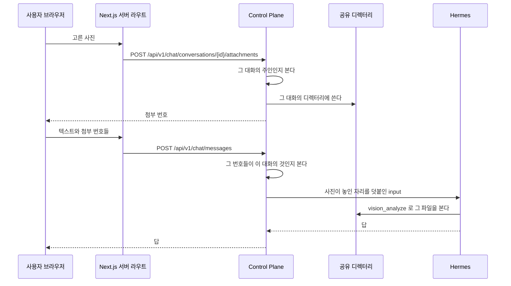

**사진을 고르면 그 자리에서 올라간다.** 보내기를 누를 때 한꺼번에 올리지 않는다.
열 장을 보내는 순간에 올리면 그동안 화면이 멈춘다.

실행 입력에는 사진이 놓인 디렉터리와 디스크 이름을 사용자가 쓴 글 앞에 붙이고,
`read_file` 대신 `vision_analyze` 로 보라는 안내 문장을 함께 적는다.

**올리는 것만으로 실행이 돌지 않는다.** 보내기를 눌러야 에이전트가 움직인다.
사진만 올라가면 무엇을 하라는지 알 길이 없다.

### 갈리는 지점

| 무엇 | 어떻게 되나 |
| --- | --- |
| 남의 대화에 올린다 | 거절한다. 없는 대화와 같은 응답을 준다 |
| 받지 않는 형식 | 거절한다. jpeg, png, gif, webp 넷만 받는다. HEIC 도 거절된다. 무엇을 받는지 화면이 미리 알린다 |
| 한 장이 상한을 넘는다 | 그 장만 거절한다. 나머지는 올라간다 |
| 장수가 상한을 넘는다 | 넘는 것을 고르지 못하게 화면이 막는다. 서버도 아직 보내지 않은 첨부가 10장이면 다음 것을 거절한다 |
| 아직 대화가 없다 | 첫 사진을 올리기 전에 제목이 빈 대화를 만든다. 제목은 첫 메시지가 정한다 |
| 흐름이 붙은 에이전트 | 대화를 만들 때와 보낼 때 거절한다. 흐름의 입력에는 사진 자리를 덧붙이지 않는다. 화면은 사진 단추를 두지 않는다 |
| 올렸는데 보내지 않았다 | 그 첨부는 메시지에 묶이지 않은 채 남고 보관 기간이 지나면 지워진다 |
| 남의 첨부 번호를 보낸다 | 거절한다. 그 대화의 것이 아니면 메시지가 나가지 않는다 |
| 보관 기간이 지났다 | 파일이 지워지고 화면이 「보관 기간이 지나 볼 수 없습니다」를 보인다 |
| 사용자가 먼저 지운다 | 같은 상태가 된다. 지난 대화에 자리는 남는다 |
| 디렉터리에 쓰지 못한다 | 올리기가 실패한다. 화면이 까닭을 보이고 다시 고를 수 있게 둔다 |

## 대화 한 번

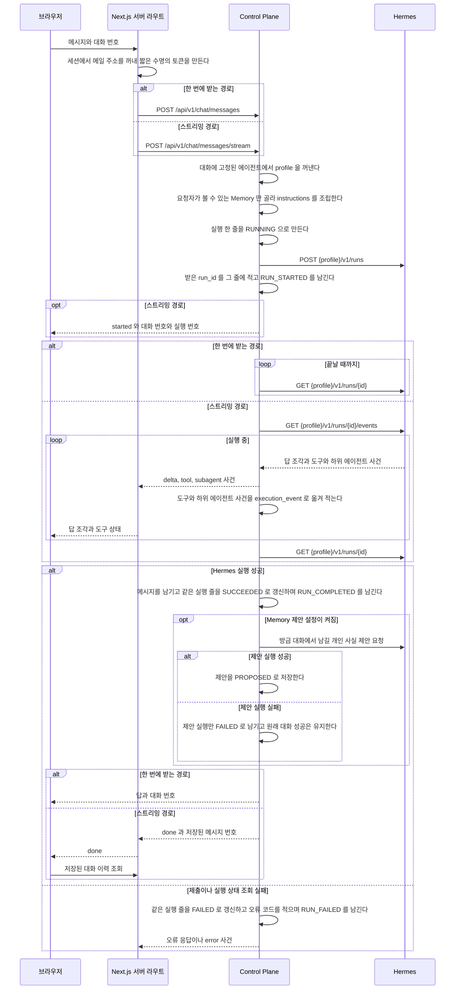

대화가 없으면 새로 만들고 첫 메시지가 에이전트를 정한다.
이어지는 요청이 에이전트를 다시 주더라도 대화에 적힌 값을 쓴다.
`hermes_session_id` 가 특정 profile 안의 session 이라, 중간에 에이전트가 바뀌면 그 session 이 가리키는 것이 없어진다.

실행 줄은 Hermes 를 부르기 전에 `RUNNING` 으로 먼저 만들어진다.
그래서 오래 도는 실행도 사용량 화면에서 보이고, 서버가 중간에 죽어도 그 실행이 기록에 남는다.

두 경로 모두 Hermes 실행 상태 조회가 돌려준 최종 `output` 과 `usage` 를 저장한다.
스트리밍 경로의 답 조각은 화면에만 쓰며, 이벤트 연결이 중간에 끝나도 최종 상태를 조회해 메시지와 실행 기록을 남긴다.
브라우저는 `done` 을 받으면 대화 이력을 다시 읽고 화면의 답 조각을 저장된 답으로 바꾼다.

**실행의 시작과 끝은 두 경로 모두 남는다.**
`RUN_STARTED` 와 `RUN_COMPLETED` 와 `RUN_FAILED` 는 Hermes 사건을 옮겨 적은 것이 아니라
Control Plane 이 직접 적는 것이다.
그래서 스트림을 열지 않는 경로에도 실행의 시작과 끝이 남는다.
도구와 하위 에이전트 사건은 스트리밍 경로에만 온다. 그것이 맞다.

**사건 저장이 실패해도 대화는 성공으로 끝난다.**
사건은 관측용이고 그것 때문에 답이 사라지면 안 된다.
기동할 때 남은 실행을 정리하는 경로로 끝난 실행에는 `RUN_FAILED` 가 남지 않는다.

## Memory 본문을 읽는 길

대화 한 번에 Memory 가 실리는데 전부 싣지 않는다.
본문까지 싣는 항상 층과 제목만 싣는 색인 층으로 나눈다.

색인에 실린 항목의 본문이 필요해지면 에이전트가 도구로 읽는다.
**그때 요청이 Hermes 에서 Control Plane 으로 거꾸로 온다.**

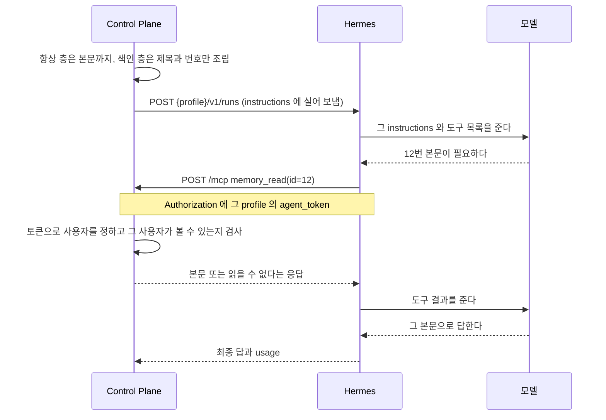

**요청 본문에는 항목 번호만 있고 사용자가 없다.**
토큰만이 사용자를 정한다.
모델이 만든 JSON 에 사용자를 넣게 하면 모델이 남의 Memory 를 읽을 수 있다.

볼 수 없는 항목과 없는 항목은 **같은 응답**으로 답한다.
다르게 답하면 그 항목이 있다는 사실 자체가 새어 나간다.

### 이 왕복은 비싸다

Hermes 는 도구를 부른 턴의 API 콜을 한 번에서 두 번이나 세 번으로 늘린다.
추가 API 콜 하나는 그 시점의 전체 프롬프트 하나만큼 들기 때문에 긴 대화일수록 도구 호출이 비싸다.
한 턴에서 항목을 한 개 읽든 세 개를 읽든 API 콜 수는 같고, 색인 한 줄은 약 12 토큰이다.
자세한 Hermes 동작은 [`hermes-integration.md`](hermes-integration.md#입력-비용은-api-콜-수가-정한다)에 둔다.

### 도구와 `always_inject` 를 고르는 기준

항목이 필요한 실행 하나만 비교하면 `always_inject` 가 도구보다 싸다.
`always_inject` 본문은 한 글자당 약 0.49 토큰이고 API 콜을 늘리지 않지만,
도구는 현재 문맥 전체를 담은 API 콜을 한 번이나 두 번 더 만들기 때문이다.

항목이 필요 없는 실행에도 본문을 싣는 비용까지 포함하면 사용 빈도가 손익분기를 정한다.
아래 값보다 본문이 길면 도구가 유리하다.

| 항목이 필요한 비율 | 새 대화 | 이어진 대화 |
| --- | --- | --- |
| 2회에 1회 | 8,000자 한도 안에서는 해당하지 않음 | 8,000자 한도 안에서는 해당하지 않음 |
| 4회에 1회 | 약 7,600자 | 8,000자 한도 안에서는 해당하지 않음 |
| 10회에 1회 | 약 3,000자 | 약 4,100자 |
| 50회에 1회 | 약 600자 | 약 800자 |

이 값은 측정한 프롬프트 크기와 API 콜 수를 기준으로 한 판단값이다.
profile 의 도구 구성이나 대화 길이가 달라지면 손익분기도 달라진다.

### `always_inject` 항목이 문맥 한도를 넘을 때

Control Plane 은 조립한 Memory 문맥을 8,000자로 제한한다.
항상 층을 담기 전에 색인 층의 자리를 떼어 두므로 긴 본문이 색인을 밀어내지 못한다.
항목 하나가 남은 자리에 들어가지 않으면 그 항목만 빼고 다음 항목과 색인을 계속 담는다.
넘친 본문은 일부만 잘라 싣지 않는다.

Control Plane 은 빠진 항목 수를 실행 기록에 남기고 Memory 목록에서 해당 항목에 표시한다.
대화 화면에는 이 표시를 넣지 않는다.
한 항목의 본문을 8,000자 가까이 키우지 않고 큰 본문은 색인 층에 둔다.

## 기동할 때 남은 실행 정리

애플리케이션 준비가 끝나면 이전 프로세스가 남긴 `RUNNING` 실행을 한 번 정리한다.
Flyway가 끝난 뒤 실행해야 하므로 `ApplicationReadyEvent`에서 시작한다.

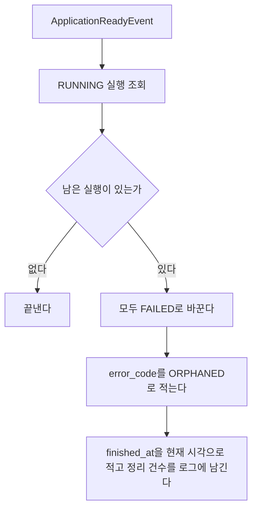

이 방식은 Control Plane이 한 대만 돈다는 전제를 쓴다.
여러 대로 늘리면 다른 인스턴스가 처리 중인 실행을 실패로 바꾸지 않도록 정리 방식을 다시 정해야 한다.

## 대화 이력

브라우저를 새로 고쳐도 이어서 말할 수 있어야 한다.
대화와 메시지는 데이터베이스에 남아 있으므로 화면이 그것을 읽는다.

**대화마다 주소가 있다.** `/c/{대화 번호}` 다.
`/` 는 새 대화를 시작하는 화면이고 지난 대화를 저절로 열지 않는다.
주소를 즐겨찾기하거나 다른 탭에 열 수 있게 하기 위해서다.

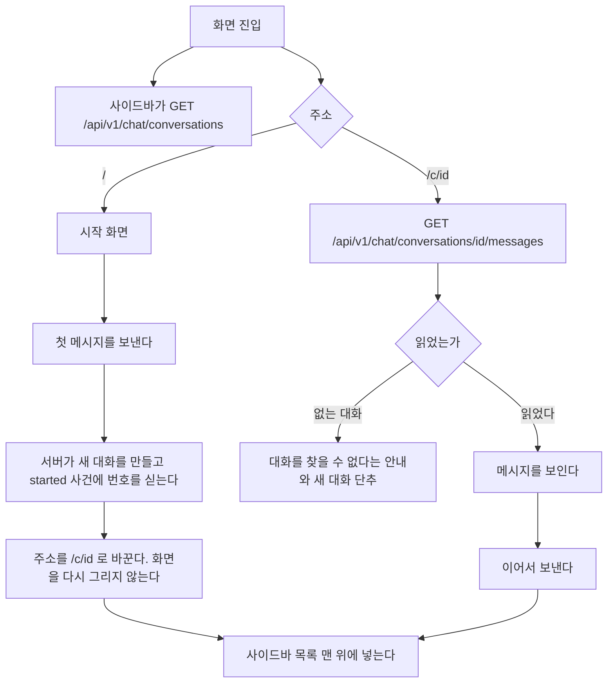

첫 메시지를 보내고 주소를 바꿀 때 화면을 다시 그리지 않는다.
경로를 옮기면 대화 화면이 새로 만들어져 흘러오던 답을 잃는다.
`window.history.replaceState` 로 주소만 바꾼다.

**주소만 바꿨으므로 그 뒤 「새 대화」 를 눌러도 화면이 새로 만들어지지 않을 수 있다.**
그래서 대화 화면은 주소가 `/` 인데 대화 번호를 들고 있으면 스스로 상태를 비운다.
`started` 가 오기 전에 다른 대화로 옮겼으면 늦게 온 `started` 로 주소를 바꾸지 않는다.

**대화 번호는 두 자리에서 생긴다.** 첫 메시지의 `started` 와, 새 대화에서 첫 사진을 올리기 전에 만드는 빈 대화다.
빈 대화의 규칙은 「사진을 올려 보낼 때」 절이 갖는다.
두 자리 모두 번호를 받는 즉시 주소를 `/c/{id}` 로 바꾼다.
그래서 상태를 비우는 것은 주소가 `/` 로 **바뀌었을 때**나 「새 대화」 를 눌렀을 때뿐이다.
주소가 `/` 인 채 번호를 들고 있는 것만 보고 비우면, 사진을 올리는 순간 방금 만든 대화가 지워진다.

### 갈리는 지점

| 상황 | 화면 |
| --- | --- |
| 대화가 하나도 없다 | 사이드바 목록 자리에 「아직 대화가 없다」 한 줄. 시작 화면은 그대로 쓴다 |
| 메시지를 읽지 못했다 | 그 대화만 오류를 보이고 목록은 남긴다 |
| 남의 대화나 지운 대화의 주소다 | 없는 것과 같은 오류다. 「대화를 찾을 수 없다」와 새 대화 단추를 보인다 |
| 보내는 중이다 | 보내기 단추가 중지 단추로 바뀐다 |
| `started` 전에 실패했다 | 쓴 문장을 입력창에 되돌려 다시 보낼 수 있게 한다. 서버에 아무것도 남지 않았다 |
| `started` 뒤에 실패했다 | 사용자 메시지는 서버에 남았다. 입력창에 되돌리지 않고 그 메시지 아래에 오류와 「다시 시도」 를 보인다 |
| 같은 대화에 두 번 눌렀다 | 앞의 요청이 끝나기 전에는 두 번째를 보내지 않는다. 다른 탭에서 보내도 서버가 `CONVERSATION_BUSY` 로 거절한다 |
| 보내는 중에 다른 대화를 고른다 | 고를 수 있다. 앞 실행은 서버에서 계속 돌고 끝나면 저장된다 |

실패한 요청의 문장을 되돌리는 것이 중요하다.
보내는 순간 입력창을 비우므로, 되돌리지 않으면 사용자가 쓴 문장이 사라진다.
**다만 `started` 가 온 뒤라면 되돌리지 않는다.** 서버에 이미 저장된 질문이라, 되돌려 다시 보내면 같은 질문이 둘 남는다.
「다시 시도」 는 다시 생성과 같은 경로다. 「다시 생성과 수정」 절이 갖는다.

## 대화 목록

사이드바의 목록은 최근에 고친 순서이고 날짜로 묶는다.

| 묶음 | 기준 |
| --- | --- |
| 오늘 | `updatedAt` 이 브라우저 시간으로 오늘 |
| 어제 | 어제 |
| 지난 7일 | 그보다 앞이고 7일 안 |
| 지난 30일 | 그보다 앞이고 30일 안 |
| 그 이전 | 나머지 |

제목이 빈 대화는 「새 대화」 로 보인다. 사진만 올리고 아직 보내지 않은 대화가 그렇다.

검색은 목록에 이미 받은 제목을 브라우저에서 거른다. 서버에 묻지 않는다. 빈 제목은 「새 대화」 로 보고 거른다.
메시지 본문은 찾지 않는다.

한 줄에 마우스를 올리면 메뉴 단추가 보인다. 좁은 화면에서는 늘 보인다. 메뉴는 이름 바꾸기와 지우기다.

```mermaid
flowchart TD
    A[이름 바꾸기] --> B[그 줄이 입력칸이 된다]
    B --> C{Enter 또는 바깥을 누름}
    C -- 빈 이름 --> D[원래 이름으로 되돌린다]
    C -- 이름 있음 --> E[PATCH /api/v1/chat/conversations/id]
    E -- 실패 --> D2[원래 이름으로 되돌리고 오류를 알린다]
    B -- Esc --> D
    F[지우기] --> G[확인 창]
    G -- 취소 --> H[아무것도 하지 않는다]
    G -- 지운다 --> I[DELETE /api/v1/chat/conversations/id]
    I -- 성공 --> J{지금 열린 대화인가}
    J -- 그렇다 --> K[/ 로 간다]
    J -- 아니다 --> L[목록에서 뺀다]
    I -- 실패 --> M[목록을 그대로 두고 오류를 알린다]
```

돌고 있는 대화도 지울 수 있다. 실행은 서버에서 끝까지 돌고 기록된다.
지운 대화에는 더 보낼 수 없다. 보내면 없는 대화와 같은 오류다.

## 화면 틀

ChatGPT 의 배치를 따른다. 위쪽 가로 메뉴를 두지 않고 왼쪽 사이드바 하나에 모은다.
화면 높이를 채우고 그 안에서 메시지 영역만 스크롤한다. 입력창은 늘 아래에 붙어 있다.

```
┌─ 사이드바 ─┬─ 대화 ─────────────────────┬─ 작업 과정 패널 ─┐
│ ◧  ✎ 새 대화│ 에이전트 이름               │ (열었을 때만)     │
│ 🔍 검색     ├────────────────────────────┤                  │
│ 오늘        │ 메시지                      │ 실행 나무         │
│  대화 A     │                            │                  │
│ 지난 7일    │                            │                  │
│  대화 B     ├────────────────────────────┤                  │
│─────────── │ 입력창                 ■ / ↑│                  │
│ 에이전트    │                            │                  │
│ 기억 (2)    │                            │                  │
│ 사용량      │                            │                  │
│ 관리 ▸      │                            │                  │
│ 이름    ☾  │                            │                  │
└────────────┴────────────────────────────┴──────────────────┘
```

사이드바는 대화 화면만이 아니라 모든 화면에 있다. 로그인 화면에만 없다.

| 너비 | 사이드바 | 작업 과정 패널 |
| --- | --- | --- |
| `lg` 이상 | 왼쪽에 늘 보인다. 접을 수 있다 | 대화 오른쪽에 붙는다 |
| `md` 이상 `lg` 미만 | 왼쪽에 늘 보인다. 접을 수 있다 | 대화 위에 겹친다 |
| `md` 미만 | 서랍. 위쪽 막대의 단추로 열고 대화를 고르면 닫힌다 | 화면 전체를 덮는다 |

접은 상태는 그 브라우저에 남긴다.
좁은 화면의 위쪽 막대에는 서랍 단추와 에이전트 이름과 새 대화 단추만 둔다.

| 단축키 | 하는 일 |
| --- | --- |
| `Ctrl` 또는 `⌘` + `Shift` + `O` | 새 대화 |
| `Ctrl` 또는 `⌘` + `Shift` + `S` | 사이드바 접기와 펴기 |
| `Ctrl` 또는 `⌘` + `K` | 대화 검색칸으로 간다 |
| `Esc` | 아래 차례로 하나만 한다 |

**`Esc` 는 한 곳에서만 해석한다.** 대화 화면의 처리기 하나가 아래 차례로 보고 처음 맞는 하나만 한다.

1. 한글을 조합하는 중이면 아무것도 하지 않는다
2. 이름 입력칸, 확인 창, 서랍, `@` 목록처럼 더 안쪽의 것이 이미 처리했으면 아무것도 하지 않는다.
   그것들은 `Esc` 를 처리하면 전파를 막는다
3. 작업 과정 패널이 열려 있으면 닫는다
4. 답을 만드는 중이면 중지한다

이름 바꾸기를 `Esc` 로 취소했는데 돌던 답까지 멈추면 안 된다.

### 새 메시지를 따라간다

메시지가 늘면 아래로 따라 내려간다.
다만 사용자가 위로 올려 지난 대화를 읽고 있으면 따라가지 않는다.
읽던 자리가 밀려나기 때문이다. 대신 `새 메시지` 단추를 띄워 누르면 내려간다.

## 실행 하나를 다시 볼 때

사용량 목록의 한 줄을 누르면 `/executions/{id}` 로 간다.
자식 실행을 가진 줄에는 목록에서 그것을 표시해, 나무로 들어갈 곳을 고를 수 있게 한다.

그 화면이 여는 순간 한 번 읽는다. 실시간으로 갱신하지 않는다.
돌고 있는 실행은 대화 화면이 이미 흘려 보이고, 이 화면은 끝난 뒤에 다시 보는 자리다.

| 무엇 | 어디서 |
| --- | --- |
| 브라우저가 부르는 것 | `GET /api/usage/executions/{id}/tree` |
| 서버 라우트가 부르는 것 | `GET /api/v1/usage/executions/{id}/tree` |

브라우저가 Control Plane 토큰을 갖지 않으므로 서버 라우트가 토큰을 만들어 부른다.

어느 실행 번호로 물어도 그 실행이 속한 나무의 뿌리부터 온다.
자식에서 들어와도 전체를 보게 하기 위해서다.

머리에 실행 요약을 두고 그 아래에 사건을 들여쓴 목록으로 그린다.
`TOOL_STARTED` 와 그 뒤의 `TOOL_COMPLETED` 는 한 줄로 합친다.
둘을 따로 보이면 줄 수가 두 배가 되고 읽을 것이 늘지 않는다.
짝이 없으면 「끝나지 않음」 으로 보인다. 그 실행이 도중에 끊긴 것이다.

`SUBAGENT_STARTED` 는 자식 노드가 있든 없든 언제나 한 줄로 그린다.
자식 실행에 어느 사건에서 났는지가 적혀 있지 않아 둘을 짝지을 방법이 없다.
하위 에이전트가 자식 실행 줄을 남기는 경로가 생기면
같은 하위 에이전트가 줄과 자식 노드로 한 번 겹쳐 보인다.
그 겹침은 결함이 아니라 여기서 고른 대가다.
겹쳐 보이는 쪽이 사건이 통째로 사라지는 쪽보다 낫다고 보았다.

`RUN_STARTED` 와 `RUN_COMPLETED` 는 줄로 그리지 않는다.
머리의 상태와 걸린 시간이 이미 그것을 말한다. `RUN_FAILED` 만 그 자리에 오류로 그린다.

| 상황 | 화면 |
| --- | --- |
| 사건이 하나도 없다 | 「기록된 사건이 없다」 한 줄. 요약은 그대로 보인다 |
| 남의 실행 번호다 | `EXECUTION_NOT_FOUND`. 없는 것과 같은 오류다 |
| 자식 쪽이 잘렸다 | 잘린 노드의 자식 자리에 「여기부터 보이지 않는다」 한 줄 |
| 뿌리 쪽이 잘렸다 | 뿌리 위에 「위쪽이 잘려 여기가 뿌리가 아닐 수 있다」 한 줄 |

사건이 없는 것은 정상이다.
스트림을 열지 않는 경로로 돈 실행에는 도구 사건이 오지 않는다.

**잘린 곳이 둘이라 알리는 자리도 둘이다.**
자식 쪽이 잘리면 그 노드가 어디서 끊겼는지 알 수 있어 그 자리에 적는다.
뿌리 쪽이 잘리면 끊긴 자리가 화면 밖이라 노드에 적을 수 없다.
그래서 지금 보이는 뿌리가 진짜 뿌리가 아닐 수 있다는 것을 위에 적는다.
둘을 함께 적어 두 번 말하지 않는다.

## 기다리는 동안 보이는 것

기다림의 종류마다 다른 것을 보인다. 같은 회전 표시를 돌리지 않는다.

| 기다리는 것 | 보이는 것 |
| --- | --- |
| 대화 목록을 처음 읽는다 | 목록 자리에 뼈대 세 줄 |
| 고른 대화의 메시지를 읽는다 | 메시지 자리에 뼈대 두 줄 |
| 첫 사건을 기다린다 | 비서 줄에 점 세 개가 차례로 밝아진다 |
| 도구나 하위 에이전트가 돈다 | 비서 줄 위의 작업 과정 블록이 지금 도는 것 한 줄과 흐른 시간을 보인다 |
| 답이 흘러나온다 | 글자가 그대로 쌓인다. 작업 과정 블록은 접힌 채 위에 남는다 |

뼈대는 실제 내용과 같은 높이로 둔다.
높이가 다르면 내용이 도착할 때 화면이 튄다.

답이 흘러나오는 동안에는 회전 표시를 따로 두지 않는다.
글자가 늘어나는 것 자체가 진행이고, 그 옆에 회전 표시를 함께 두면 둘 중 무엇을 봐야 할지 모른다.

흐름이 2분을 넘기면 한 번만 알린다.
이 화면을 떠나도 실행은 계속 돌고, 다시 열면 저장된 답이 보인다는 것이다.

## 작업 과정

에이전트가 답을 만드는 동안 무엇을 했는지를 답 위의 블록 하나로 보인다.
ChatGPT 가 생각하는 과정을 접어 두는 것과 같은 자리다.

```
비서
┌ ▸ 작업 과정 · 도구 5 · 하위 에이전트 2 · 1분 12초 ────────┐
│  ✓ web_search      제주 3월 날씨                 2.1초   │
│  ⟳ 하위 에이전트    숙소 후보를 조사한다                   │
│      z-ai/glm-5.2 · 입력 12,300 · 출력 410              │
└──────────────────────────────────── 나무로 보기 → ───┘
(답 본문)
```

블록은 사건이 하나라도 온 답에만 생긴다. 도구도 하위 에이전트도 쓰지 않은 답에는 없다.

| 무엇 | 한 줄 |
| --- | --- |
| 도구 | 도구 이름, `detail`, 끝났으면 걸린 시간. 실패면 실패 표시 |
| 하위 에이전트 | 목표, 모델, 끝났으면 토큰과 걸린 시간 |
| 흐름의 단계 | 단계 이름. 알려진 이름은 한국어로, 모르는 이름은 받은 그대로 |
| provider 전환 | 「여기부터 {provider} {모델} 로 돈다」 |

단계는 도착한 순서로 그린다. 아직 오지 않은 단계는 그리지 않는다. 이름과 차례를 화면에 박아 두지 않는다.
무엇을 나눌지는 Hermes 가 정하므로 단계가 바뀔 때마다 화면을 고치지 않게 한다.
근거는 [ADR-017](adr/ADR-017-무엇을-할지는-hermes-가-정하고-control-plane-은-경계만-갖는다.md) 에 있다.

**`started` 와 `completed` 는 한 줄로 합친다.** 도구는 도착한 순서로 짝짓고,
하위 에이전트는 `subagentId` 가 있으면 그것으로, 없으면 도착한 순서로 짝짓는다.

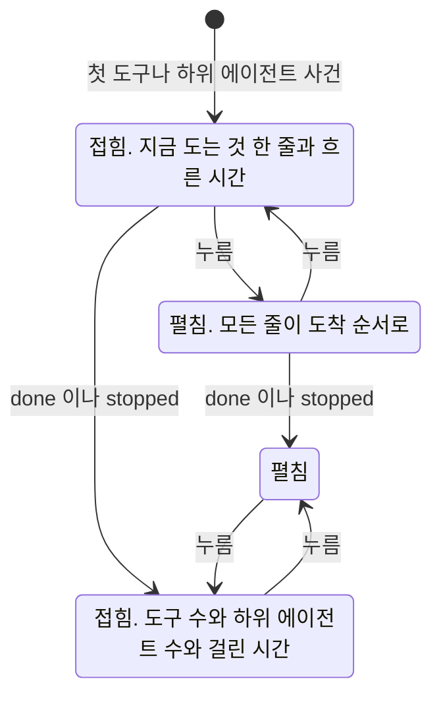

### 끝난 답에서 다시 볼 때

메시지 조회가 답마다 작업 과정의 요약을 함께 준다. 도구 수, 하위 에이전트 수, 걸린 시간이다.
블록은 그 요약으로 접힌 채 그린다.
**펼칠 때 처음으로 실행 나무를 읽는다.** 답이 여럿인 대화를 열 때마다 나무를 모두 읽지 않기 위해서다.

| 상황 | 블록 |
| --- | --- |
| 사건이 없는 답 | 블록을 그리지 않는다 |
| 한 번에 받는 경로로 돈 답 | 도구 사건이 오지 않는 경로라 블록이 없다. 그것이 맞다 |
| 펼쳤는데 나무를 읽지 못했다 | 블록 안에 「작업 과정을 읽지 못했다」와 다시 읽기 단추 |
| 중지한 답 | 멈춘 자리까지의 줄. 끝나지 않은 줄은 「중지됨」 |

### 작업 과정 패널

블록의 「나무로 보기」를 누르면 오른쪽 패널이 열린다.
`/executions/{id}` 화면과 같은 실행 나무를 대화를 떠나지 않고 본다.

| 무엇 | 패널 |
| --- | --- |
| 도는 중인 답 | 흘러온 사건으로 만든 줄을 그대로 보인다. 나무는 끝난 뒤에 읽는다 |
| 끝난 답 | `GET /api/usage/executions/{id}/tree` 로 한 번 읽는다 |
| 다른 답의 블록을 누른다 | 패널이 그 답으로 바뀐다 |
| 닫기 단추나 `Esc` | 닫힌다. 답을 만드는 중에는 `Esc` 가 중지보다 패널 닫기를 먼저 한다 |
| 다른 대화로 간다 | 닫힌다 |

## 중지할 때

답을 만드는 동안 보내기 단추가 중지 단추 `■` 로 바뀐다.

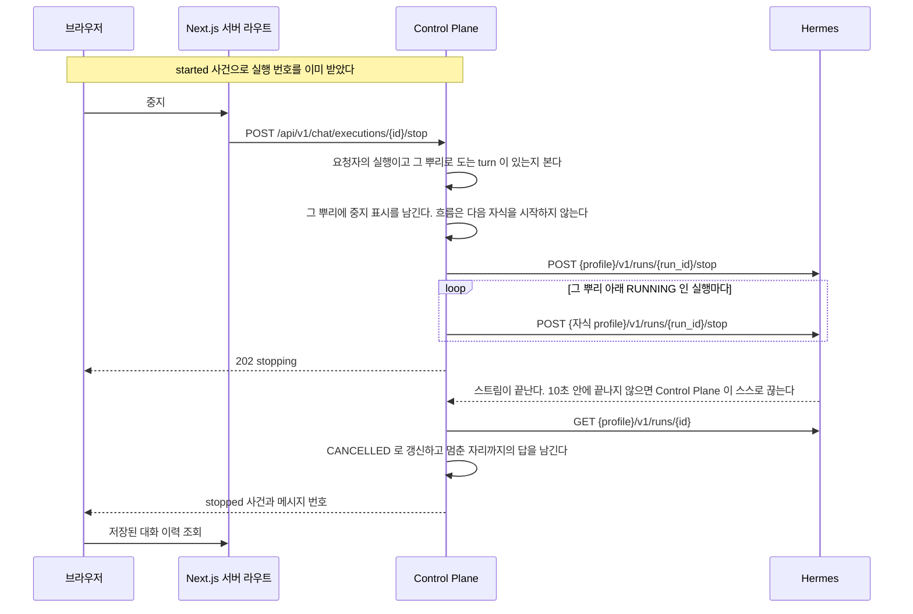

멈춘 자리까지의 답을 남기는 근거는
[ADR-021](adr/ADR-021-중지한-답은-멈춘-자리까지-남긴다.md) 에 있다.

| 상황 | 화면 |
| --- | --- |
| `started` 가 오기 전에 누른다 | 단추가 눌리지 않는다. 실행 번호가 아직 없다 |
| 그 번호로 도는 turn 이 없다 | `EXECUTION_NOT_RUNNING`. 이미 끝났거나 provider 를 넘어가기 전의 번호다. 알리지 않고 곧 올 끝 사건을 기다린다 |
| 남의 실행 번호다 | `EXECUTION_NOT_FOUND`. 없는 것과 같은 오류다 |
| Hermes 에 중지를 보내지 못했다 | 중지 단추를 다시 누를 수 있게 되돌리고 오류를 알린다 |
| 멈춘 자리까지 나온 답이 없다 | 답 메시지를 만들지 않는다. 사용자 메시지 아래에 「답을 받지 못했다」 와 「다시 시도」 |
| 중지한 답 | 답 아래에 「중지됨」 표시. 다시 생성할 수 있다 |

중지 단추를 누른 뒤 `stopped` 가 올 때까지 단추는 잠긴다.
Hermes 에 보내지 못해 오류를 받았을 때만 다시 풀린다.

**중지할 수 있는지를 실행 줄의 상태로 판정하지 않는다.**
흐름으로 도는 turn 은 Chief 가 끝나면 뿌리 줄이 `SUCCEEDED` 가 되고 그 뒤에 자식이 돈다.
줄 상태로 보면 자식이 도는 동안 중지를 거절하게 된다.
그래서 이 프로세스에 등록된 도는 turn 이 그 번호를 뿌리로 갖는지로 본다.
멈춘 turn 의 뿌리 줄은 이미 `SUCCEEDED` 였어도 `CANCELLED` 로 덮어쓴다. 토큰과 비용은 그대로 둔다.

## 다시 생성과 수정

마지막 답 아래에 다시 생성 단추가, 마지막 사용자 메시지에 수정 단추가 있다.
그보다 앞의 메시지에는 두 단추가 없다.

**마지막 메시지가 답 없는 사용자 메시지일 때도 다시 생성을 연다.** 화면은 이것을 「다시 시도」 로 보인다.
실패했거나 남긴 답 없이 중지된 turn 이 그렇다.
그때 새 답은 가리킬 이전 답이 없어 `replaces_message_id` 가 비어 있다.
근거는 [ADR-022](adr/ADR-022-다시-생성과-수정은-같은-session-에-판으로-쌓는다.md) 에 있다.

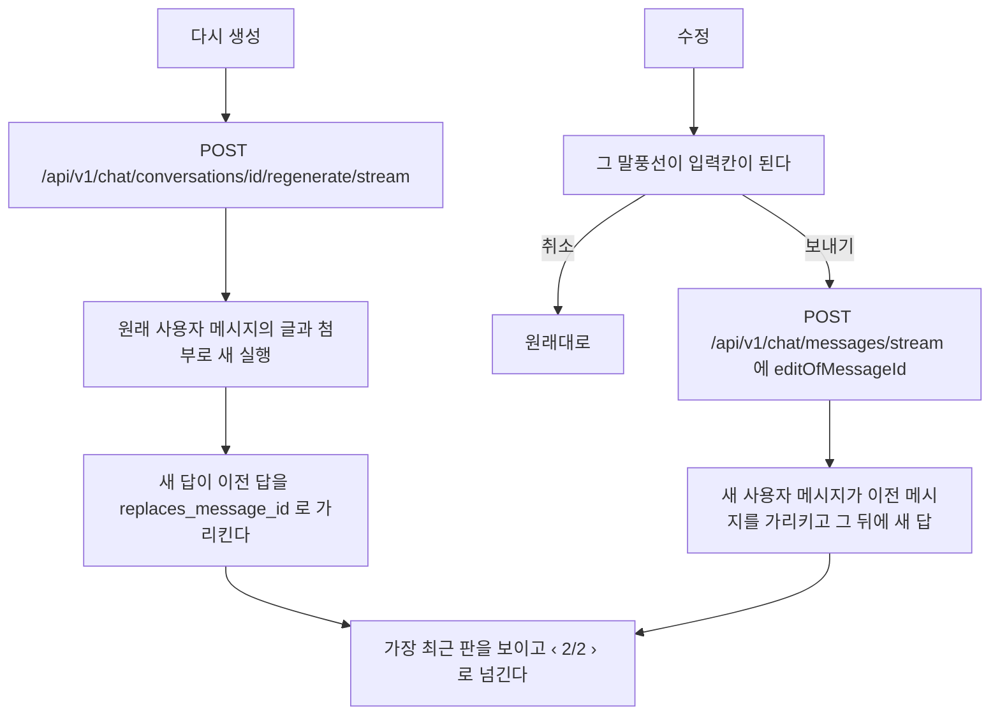

실행 입력의 `instructions` 끝에 한 줄을 덧붙인다.
다시 생성이면 앞의 답을 되풀이하지 말라는 것이고, 수정이면 바로 앞 질문 대신 고친 질문에 답하라는 것이다.
**사용자 메시지의 글은 고치지 않는다.**

| 상황 | 응답 |
| --- | --- |
| 대상이 마지막 메시지가 아니다 | `MESSAGE_NOT_LATEST`. 화면이 이력을 다시 읽는다 |
| 그 대화에서 도는 실행이 있다 | `CONVERSATION_BUSY`. 끝난 뒤에 다시 누르게 한다 |
| 첨부가 달린 메시지를 고치려 한다 | 수정 단추를 그리지 않는다. 서버도 `VALIDATION_FAILED` 로 거절한다 |
| 다시 생성이 실패했다 | 이전 판이 그대로 남는다. 새 판은 생기지 않는다 |

**판을 넘기는 단위가 둘이다.**
다시 생성은 답 한 줄의 판이고, 수정은 사용자 메시지와 그 뒤의 답을 묶은 turn 의 판이다.
고치기 전 turn 으로 넘기면 그 turn 의 질문과 답이 함께 보인다.

## 메시지 동작

| 어디 | 동작 |
| --- | --- |
| 모든 답 | 복사. 마크다운 원문을 복사한다 |
| 마지막 답 | 위에 더해 다시 생성 |
| 마지막 사용자 메시지 | 수정. 첨부가 없을 때만 |
| 코드 블록 | 오른쪽 위의 복사 |

넓은 화면에서는 마지막 답의 동작을 늘 보이고 나머지는 마우스를 올리거나 초점이 갈 때 보인다.
좁은 화면에서는 늘 보인다. 마우스를 올릴 수 없기 때문이다.
복사하면 단추가 잠깐 「복사됨」 으로 바뀐다. 복사하지 못하면 「복사하지 못했다」 로 바뀐다.

## 새 대화 화면

`/` 에서 보이는 것이다. 입력창이 화면 가운데에 있고 첫 메시지를 보내면 아래로 내려간다.

```
            {이름}님, 무엇을 도와줄까요

   ┌ 가계부 비서 ┐ ┌ 여행 비서 ┐ ┌ 코딩 비서 ┐
   │ 한 줄 소개   │ │ 한 줄 소개 │ │ 한 줄 소개 │
   └────────────┘ └──────────┘ └──────────┘

   ┌───────────────────────────────────┐
   │ @ 로 에이전트를 부른다            ↑ │
   └───────────────────────────────────┘
      [이번 달 지출 정리해 줘] [다음 주 식단 짜 줘]
```

| 무엇 | 동작 |
| --- | --- |
| 에이전트 카드 | 누르면 그 에이전트를 고른다. 처음에는 목록의 첫 에이전트가 골라져 있다 |
| 추천 질문 | 고른 에이전트의 것. 누르면 그 글로 바로 보낸다 |
| 입력창의 `@` | 에이전트 목록이 뜨고 이름으로 거른다. 고르면 그 에이전트를 고르고 `@이름` 은 입력창에서 빠진다 |
| 첫 메시지 | 보내면 그 에이전트로 대화가 시작되고 에이전트는 그 대화에서 바뀌지 않는다 |

**사진을 먼저 올려 빈 대화가 생기면 에이전트 카드와 `@` 가 잠긴다.** 그 대화의 에이전트가 이미 정해졌다.
화면은 메시지가 없는 동안 새 대화 화면 모양을 그대로 쓴다.
흐름이 붙은 에이전트는 사진을 받지 않는다. 그 에이전트를 고르면 사진 단추가 없다.

**`@` 는 새 대화 화면에서만 뜬다.**
대화의 에이전트는 첫 메시지가 정하고 바뀌지 않는다. 중간에 다른 에이전트를 부르는 것은 에이전트가 정한다.

| 상황 | 화면 |
| --- | --- |
| 쓸 수 있는 에이전트가 없다 | 카드 자리에 「쓸 수 있는 에이전트가 없다. 관리자에게 등록을 요청한다」. 입력창을 잠근다 |
| 에이전트가 하나다 | 카드를 그리지 않는다. 그 에이전트의 소개와 추천 질문만 |
| 소개나 추천 질문이 없다 | 그 자리를 비운다. 이름만 보인다 |
| `@` 뒤 글자에 맞는 에이전트가 없다 | 목록에 「맞는 에이전트가 없다」 |

소개와 추천 질문은 `/agents/{code}` 의 성격 아래에서 고친다.
고칠 수 있는 사람은 성격과 같다.

## 밝기 모드

밝음과 어두움과 시스템 셋 중에서 고른다. 고른 값은 그 브라우저에 남는다.
아무것도 고르지 않았으면 시스템 설정을 따른다.

첫 화면이 밝게 그려졌다가 어둡게 바뀌는 일이 없어야 한다.
`next-themes` 가 그리기 전에 저장된 값을 읽어 `html` 에 붙인다.

## 실행이 실패할 때

| 오류 코드 | 원인 | 화면이 하는 일 |
| --- | --- | --- |
| `HERMES_BINDING_MISSING` | 이 사용자에게 연결된 AI 계정이 없다 | 관리자에게 연결을 요청하도록 안내한다 |
| `HERMES_PROFILE_KEY_MISSING` | profile 의 key 가 준비되지 않았다 | 서버 설정 문제로 안내한다 |
| `HERMES_RUN_TIMEOUT` | 제한 시간 안에 끝나지 않았다 | 다시 보내도록 안내한다 |
| `HERMES_BUSY` | Hermes 가 동시 실행 한도에 닿아 429 로 거절했다 | 붐빈다고 알리고 잠시 뒤에 다시 보내도록 안내한다 |
| `HERMES_UNAVAILABLE` | Hermes 에 닿지 못했다 | 연결 실패로 안내한다 |
| `EXECUTION_NOT_RUNNING` | 중지하려는 실행이 이미 끝났다 | 알리지 않고 곧 올 끝 사건을 기다린다 |
| `MESSAGE_NOT_LATEST` | 다시 생성하거나 고치려는 메시지가 마지막이 아니다 | 이력을 다시 읽는다 |
| `CONVERSATION_BUSY` | 그 대화에서 도는 turn 이 있다. 보내기, 다시 생성, 수정 모두 받는다 | 끝난 뒤에 다시 보내게 한다. 쓴 문장은 입력창에 되돌린다 |
| `EXECUTION_NOT_FOUND` | 없는 실행이거나 남의 실행이다 | 사용량 목록으로 되돌린다 |

`HERMES_BUSY` 를 받아도 Control Plane 은 다시 보내지 않는다.
한도에 닿은 상태에서 다시 보내면 한도를 더 밀어붙인다. 다시 보낼지는 사람이 정한다.

`EXECUTION_NOT_FOUND` 는 두 원인을 같은 응답으로 숨긴다.
남의 실행이 있는지조차 알려주지 않기 위해서다.

실패한 실행도 기록에 남는다.
사용량 화면에서 무엇이 실패했는지 볼 수 있다.
