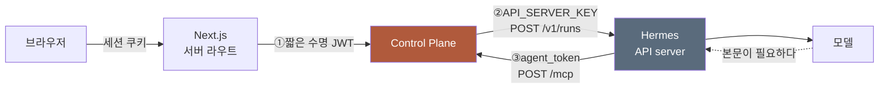
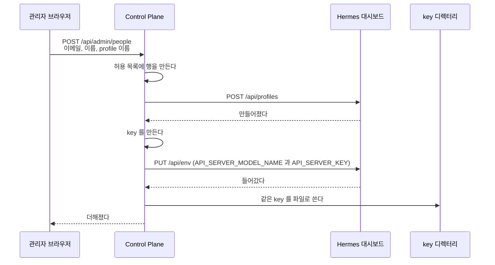
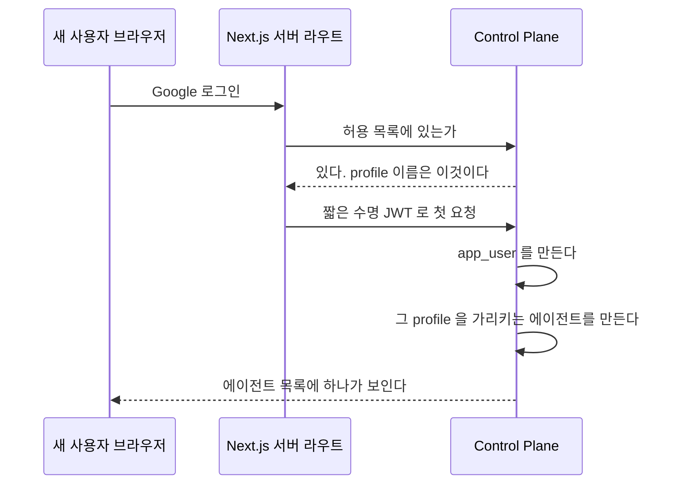
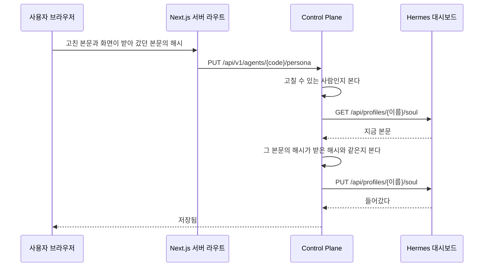
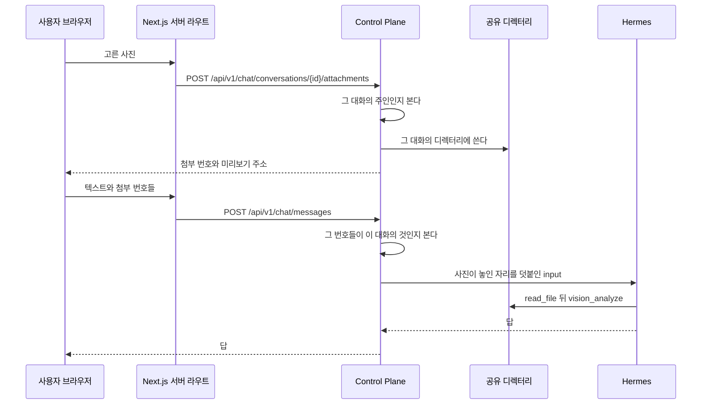
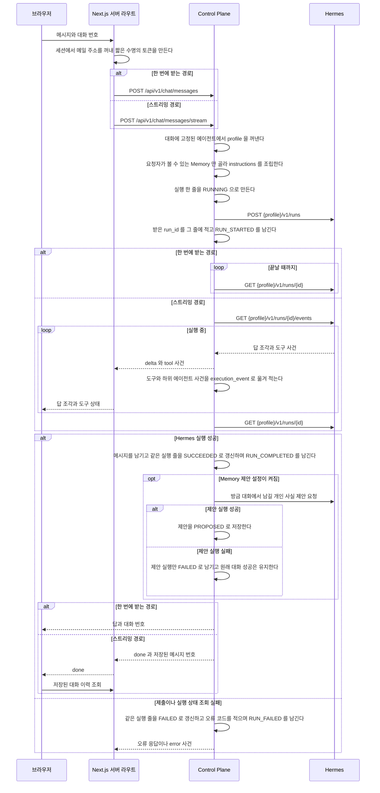
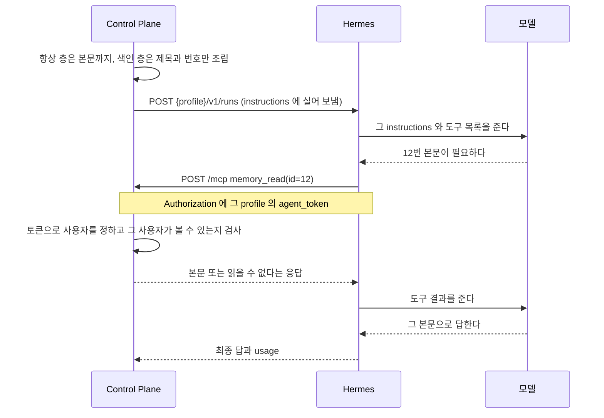
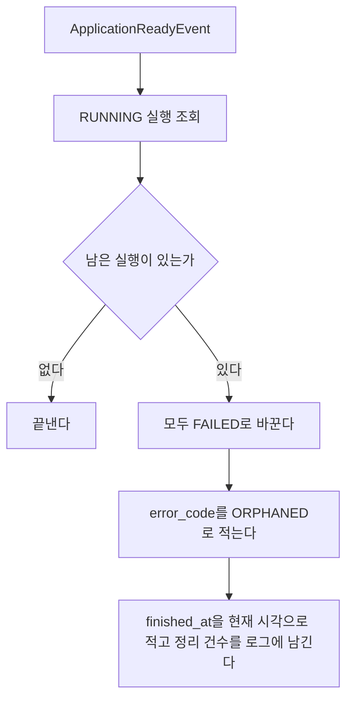
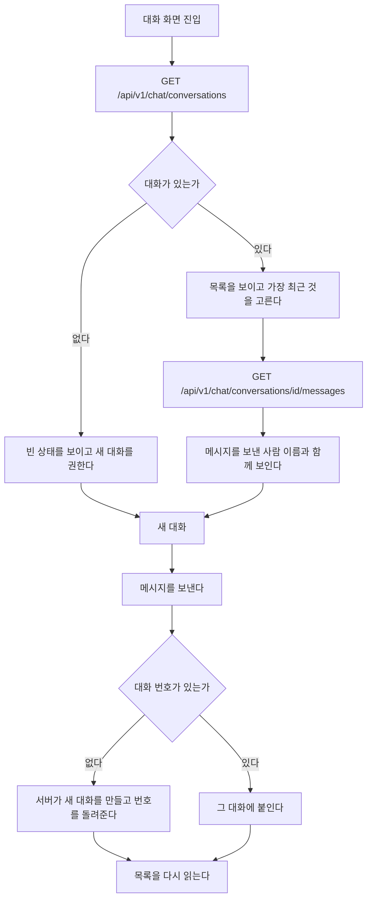

# 흐름

화면 전환과 호출 순서를 담는다.
모듈 배치는 [`code-architecture.md`](code-architecture.md), 저장 모델은 [`data-schema.md`](data-schema.md)가 가진다.

## 두 방향과 두 토큰

요청이 한 방향으로만 흐르지 않는다.
Control Plane 이 Hermes 를 부르고, Hermes 가 다시 Control Plane 을 부른다.
**그 둘이 쓰는 토큰이 다르다.**



| 번호 | 누가 누구를 | 토큰 | 그 토큰이 말하는 것 |
| --- | --- | --- | --- |
| ① | 웹 → Control Plane | 짧은 수명 JWT | 이 사람이 로그인했다 |
| ② | Control Plane → Hermes | `API_SERVER_KEY` | 이 profile 을 쓸 자격이 있다 |
| ③ | Hermes → Control Plane | `agent_token` | 이 요청이 누구의 것이다 |

**①과 ③이 둘 다 사용자를 정하지만 성질이 다르다.**

| 축 | ① 웹 토큰 | ③ agent_token |
| --- | --- | --- |
| 만드는 때 | 요청마다 새로 | 한 번 발급하고 계속 씀 |
| 수명 | 짧다 | 폐기할 때까지 |
| 저장 | 저장하지 않는다 | 해시만 저장한다 |
| 두는 곳 | 만들어 바로 쓰고 버린다 | 홈서버 파일과 profile 의 `.env` |

②는 사용자를 정하지 않는다. profile 을 정할 뿐이다.
어느 사용자의 실행인지는 Control Plane 이 이미 알고 있고, 그것을 Hermes 에게 알리지 않는다.

③이 필요한 이유가 여기 있다.
Hermes 가 Control Plane 을 부를 때는 Control Plane 이 그 요청의 주인을 모른다.
**요청 본문에 사용자를 적게 하면 모델이 그것을 바꿀 수 있다.**
그래서 토큰만이 사용자를 정한다.

## 사람을 더할 때

두 시점에 나뉘어 일어난다.
**관리자가 더할 때 Hermes 쪽이 끝나고, 그 사람이 처음 로그인할 때 우리 쪽이 끝난다.**

한 시점에 몰지 않는 이유는 하나다.
자기 profile 만 쓰는 에이전트는 주인이 있어야 하고,
주인은 그 사람이 로그인하기 전에는 존재하지 않는다.

### 관리자가 더할 때



`clone_from` 을 쓰지 않는다.
그 값을 주면 본뜬 profile 의 `API_SERVER_KEY` 까지 복사되어
key 하나로 두 profile 이 열린다. 실측으로 확인했다.

### 그 사람이 처음 로그인할 때



에이전트는 자기만 보는 것으로 만들고 주인을 그 사람으로 둔다.
`API_SERVER_KEY` 를 파일에서 찾는 규칙은 바뀌지 않는다. profile 이름으로 찾는다.

### 어긋나는 지점

| 무엇 | 어떻게 되나 |
| --- | --- |
| 이미 있는 이메일 | 거절한다. 허용 목록의 이메일은 하나뿐이다 |
| 이미 있는 profile 이름 | 거절한다. 우리 표에서도 Hermes 에서도 본다 |
| profile 은 만들었는데 key 주입이 실패 | **만든 profile 을 지운다.** 아무것도 남기지 않는다 |
| key 파일 쓰기가 실패 | 같다. profile 을 지우고 허용 목록 행도 되돌린다 |
| Hermes 가 응답하지 않는다 | 허용 목록 행을 만들기 전이므로 아무것도 남지 않는다 |
| 같은 요청이 두 번 온다 | 뒤의 것이 이메일 유니크 제약에 걸려 거절된다 |
| 허용 목록에 없는 사람이 로그인 | 지금과 같다. 토큰을 만들지 않는다 |
| 허용 목록에는 있는데 profile 이 없어졌다 | 실행할 때 key 를 찾지 못해 실패한다. 관리자가 다시 더한다 |
| 첫 로그인에 Hermes 가 모델을 주지 않는다 | **사용자만 만들고 에이전트는 만들지 않는다.** 로그인은 막지 않는다 |
| 첫 로그인에 Hermes 가 provider 를 비워서 준다 | 같다. 틀린 값으로 메우면 실행할 때마다 실패한다 |

에이전트 없이 들어온 사람은 관리자가 기존 에이전트 등록 화면에서 만든다.
그 사람의 `app_user` 가 이미 있어 주인을 지정할 수 있다.
**다시 시도하는 것을 요청 경로에 두지 않는다.**
로그인 판정이 매 요청 도는 자리라, 거기서 Hermes 를 부르면 모든 요청이 그 응답을 기다린다.

**되돌리는 순서가 만드는 순서의 역순이다.**
Hermes 쪽을 먼저 지우고 우리 표를 나중에 지운다.
반대로 하면 우리 표에 없는 profile 이 Hermes 에 남는다.

### 관리자가 아닌 사람

사람을 더하는 화면은 `ADMIN` 만 연다.
`MEMBER` 는 그 화면도 그 API 도 보지 못한다.

### 아무도 없을 때

허용 목록이 비면 아무도 로그인하지 못한다.
**마이그레이션은 표만 만들고 어떤 주소도 넣지 않는다.** 이 저장소는 공개다.
배포할 때 지금 쓰는 주소를 한 번 넣어야 하고, 그 절차는 비공개 저장소가 소유한다.
데이터베이스를 새로 만들거나 그 표를 비우면 들어갈 길이 사라진다.
그때는 데이터베이스에 직접 행을 넣어야 한다.

## 페르소나를 고칠 때

에이전트의 성격은 그 profile 의 `SOUL.md` 가 갖고 이 저장소는 화면만 준다.
근거는 [ADR-019](adr/ADR-019-페르소나는-hermes-가-갖고-control-plane-은-화면만-준다.md) 에 있다.



**저장한 것이 곧 다음 실행에 쓰인다.** Hermes 가 실행할 때 그 파일을 읽는다.
데이터베이스에 사본이 없어 어긋날 것이 없고, 반영 상태를 보일 일도 없다.

### 갈리는 지점

| 무엇 | 어떻게 되나 |
| --- | --- |
| 고칠 권한이 없다 | 본문을 읽기만 한다. 저장 단추가 없고 경로도 거절한다 |
| 볼 권한이 없다 | 그 에이전트가 목록에 없다. 본문 경로도 없는 에이전트와 같은 응답을 준다 |
| 앞뒤에 공백이 붙어 있다 | 떼고 저장한다. 쓴 것과 저장된 것이 다를 수 있다 |
| 본문이 비어 있다 | 거절한다. 빈 `SOUL.md` 를 쓰면 성격이 지워진다 |
| 본문이 상한을 넘는다 | 거절한다. 화면이 저장 전에 남은 글자 수를 보인다 |
| 그 사이 다른 사람이 고쳤다 | 거절한다. 화면이 새 본문을 다시 읽어 보인다 |
| 읽는 데 실패했다 | 화면이 열리지 않는다. 그 까닭을 보인다 |
| 다시 읽기는 됐는데 쓰기에 실패했다 | 앞 본문이 그대로 남는다. 화면이 실패를 보이고 다시 누를 수 있게 둔다 |
| 대시보드가 멈춰 있다 | 성격 화면만 열리지 않는다. 대화는 그대로 돈다 |

## 사진을 올려 보낼 때

사진은 파일로 두고 에이전트가 도구로 읽는다. 대화 본문에 싣지 않는다.
근거는 [ADR-020](adr/ADR-020-사진은-공유-디렉터리에-두고-에이전트가-파일로-읽는다.md) 에 있다.



**사진을 고르면 그 자리에서 올라간다.** 보내기를 누를 때 한꺼번에 올리지 않는다.
열 장을 보내는 순간에 올리면 그동안 화면이 멈춘다.

**올리는 것만으로 실행이 돌지 않는다.** 보내기를 눌러야 에이전트가 움직인다.
사진만 올라가면 무엇을 하라는지 알 길이 없다.

### 갈리는 지점

| 무엇 | 어떻게 되나 |
| --- | --- |
| 남의 대화에 올린다 | 거절한다. 없는 대화와 같은 응답을 준다 |
| 이미지가 아닌 파일 | 거절한다. 무엇을 받는지 화면이 미리 알린다 |
| 한 장이 상한을 넘는다 | 그 장만 거절한다. 나머지는 올라간다 |
| 장수가 상한을 넘는다 | 넘는 것을 고르지 못하게 화면이 막는다 |
| 올렸는데 보내지 않았다 | 그 첨부는 메시지에 묶이지 않은 채 남고 보관 기간이 지나면 지워진다 |
| 남의 첨부 번호를 보낸다 | 거절한다. 그 대화의 것이 아니면 메시지가 나가지 않는다 |
| 보관 기간이 지났다 | 파일이 지워지고 화면이 「보관 기간이 지나 볼 수 없습니다」를 보인다 |
| 사용자가 먼저 지운다 | 같은 상태가 된다. 지난 대화에 자리는 남는다 |
| 디렉터리에 쓰지 못한다 | 올리기가 실패한다. 화면이 까닭을 보이고 다시 고를 수 있게 둔다 |

## 대화 한 번



대화가 없으면 새로 만들고 첫 메시지가 에이전트를 정한다.
이어지는 요청이 에이전트를 다시 주더라도 대화에 적힌 값을 쓴다.
`hermes_session_id` 가 특정 profile 안의 session 이라, 중간에 에이전트가 바뀌면 그 session 이 가리키는 것이 없어진다.

실행 줄은 Hermes 를 부르기 전에 `RUNNING` 으로 먼저 만들어진다.
그래서 오래 도는 실행도 사용량 화면에서 보이고, 서버가 중간에 죽어도 그 실행이 기록에 남는다.

두 경로 모두 Hermes 실행 상태 조회가 돌려준 최종 `output` 과 `usage` 를 저장한다.
스트리밍 경로의 답 조각은 화면에만 쓰며, 이벤트 연결이 중간에 끝나도 최종 상태를 조회해 메시지와 실행 기록을 남긴다.
브라우저는 `done` 을 받으면 대화 이력을 다시 읽고 화면의 답 조각을 저장된 답으로 바꾼다.

**실행의 시작과 끝은 두 경로 모두 남는다.**
`RUN_STARTED` 와 `RUN_COMPLETED` 와 `RUN_FAILED` 는 Hermes 사건을 옮겨 적은 것이 아니라
Control Plane 이 직접 적는 것이다.
그래서 스트림을 열지 않는 경로에도 실행의 시작과 끝이 남는다.
도구와 하위 에이전트 사건은 스트리밍 경로에만 온다. 그것이 맞다.

**사건 저장이 실패해도 대화는 성공으로 끝난다.**
사건은 관측용이고 그것 때문에 답이 사라지면 안 된다.
기동할 때 남은 실행을 정리하는 경로로 끝난 실행에는 `RUN_FAILED` 가 남지 않는다.

## Memory 본문을 읽는 길

대화 한 번에 Memory 가 실리는데 전부 싣지 않는다.
본문까지 싣는 항상 층과 제목만 싣는 색인 층으로 나눈다.

색인에 실린 항목의 본문이 필요해지면 에이전트가 도구로 읽는다.
**그때 요청이 Hermes 에서 Control Plane 으로 거꾸로 온다.**



**요청 본문에는 항목 번호만 있고 사용자가 없다.**
토큰만이 사용자를 정한다.
모델이 만든 JSON 에 사용자를 넣게 하면 모델이 남의 Memory 를 읽을 수 있다.

볼 수 없는 항목과 없는 항목은 **같은 응답**으로 답한다.
다르게 답하면 그 항목이 있다는 사실 자체가 새어 나간다.

### 이 왕복은 비싸다

실측한 것이다. 도구를 한 번 부르면 입력 토큰이 그 시점 프롬프트의 배수로 는다.

| 조건 | 입력 토큰 |
| --- | --- |
| 도구를 부르지 않음 | 7,381 |
| 도구를 한 번 부름 | 22,609 부터 22,644 |

**추가 호출 하나가 그 시점 프롬프트 하나만큼 든다.**
도구를 부르겠다고 판단하는 호출과 결과를 받아 답하는 호출이 더해져 세 번이 된다.

그러므로 **문맥이 클수록 도구 호출이 비싸진다.**
긴 대화에서 부르면 그만큼 더 든다.
항목이 적을 때는 `always_inject` 를 켜서 항상 싣는 쪽이 싸다.

## 기동할 때 남은 실행 정리

애플리케이션 준비가 끝나면 이전 프로세스가 남긴 `RUNNING` 실행을 한 번 정리한다.
Flyway가 끝난 뒤 실행해야 하므로 `ApplicationReadyEvent`에서 시작한다.



이 방식은 Control Plane이 한 대만 돈다는 전제를 쓴다.
여러 대로 늘리면 다른 인스턴스가 처리 중인 실행을 실패로 바꾸지 않도록 정리 방식을 다시 정해야 한다.

## 대화 이력

브라우저를 새로 고쳐도 이어서 말할 수 있어야 한다.
대화와 메시지는 데이터베이스에 남아 있으므로 화면이 그것을 읽는다.



### 갈리는 지점

| 상황 | 화면 |
| --- | --- |
| 대화가 하나도 없다 | 목록 자리에 빈 상태를 보이고 입력창은 그대로 쓴다 |
| 메시지를 읽지 못했다 | 그 대화만 오류를 보이고 목록은 남긴다 |
| 남의 대화 번호를 주소로 넣었다 | 없는 것과 같은 오류다. 목록으로 되돌린다 |
| 보내는 중이다 | 입력창을 잠그고 진행을 알린다 |
| 보내다 실패했다 | 쓴 문장을 입력창에 되돌려 다시 보낼 수 있게 한다 |
| 같은 대화에 두 번 눌렀다 | 앞의 요청이 끝나기 전에는 두 번째를 보내지 않는다 |

실패한 요청의 문장을 되돌리는 것이 중요하다.
지금은 보내는 순간 입력창을 비우므로, 실패하면 사용자가 쓴 문장이 사라진다.

## 화면 배치

대화 화면은 문서처럼 아래로 길어지지 않는다.
화면 높이를 채우고 그 안에서 메시지 영역만 스크롤한다. 입력창은 늘 아래에 붙어 있다.

```
┌─ 머리 ────────────────────────────────┐
│ 우리집 비서   사용량  관리      ☾ 밝기  │
├──────────┬────────────────────────────┤
│ 대화 목록 │ 에이전트                    │
│          ├────────────────────────────┤
│  · 대화1  │ 메시지                      │  ← 여기만 스크롤한다
│  · 대화2  │                            │
│          ├────────────────────────────┤
│ + 새 대화 │ 입력창                 보내기│
└──────────┴────────────────────────────┘
```

너비가 좁아지면 대화 목록이 서랍으로 접힌다.
머리의 버튼으로 열고, 대화를 고르면 닫힌다.

| 너비 | 대화 목록 |
| --- | --- |
| `md` 이상 | 왼쪽에 늘 보인다 |
| `md` 미만 | 서랍. 버튼으로 열고 고르면 닫힌다 |

목록이 화면을 밀어내지 않는 것이 중요하다.
지금은 좁은 화면에서 목록이 대화 위에 쌓여, 대화가 여럿이면 입력창이 화면 밖으로 나간다.

### 새 메시지를 따라간다

메시지가 늘면 아래로 따라 내려간다.
다만 사용자가 위로 올려 지난 대화를 읽고 있으면 따라가지 않는다.
읽던 자리가 밀려나기 때문이다. 대신 `새 메시지` 단추를 띄워 누르면 내려간다.

## 실행 하나를 다시 볼 때

사용량 목록의 한 줄을 누르면 `/executions/{id}` 로 간다.
자식 실행을 가진 줄에는 목록에서 그것을 표시해, 나무로 들어갈 곳을 고를 수 있게 한다.

그 화면이 여는 순간 한 번 읽는다. 실시간으로 갱신하지 않는다.
돌고 있는 실행은 대화 화면이 이미 흘려 보이고, 이 화면은 끝난 뒤에 다시 보는 자리다.

| 무엇 | 어디서 |
| --- | --- |
| 브라우저가 부르는 것 | `GET /api/usage/executions/{id}/tree` |
| 서버 라우트가 부르는 것 | `GET /api/v1/usage/executions/{id}/tree` |

브라우저가 Control Plane 토큰을 갖지 않으므로 서버 라우트가 토큰을 만들어 부른다.

어느 실행 번호로 물어도 그 실행이 속한 나무의 뿌리부터 온다.
자식에서 들어와도 전체를 보게 하기 위해서다.

머리에 실행 요약을 두고 그 아래에 사건을 들여쓴 목록으로 그린다.
`TOOL_STARTED` 와 그 뒤의 `TOOL_COMPLETED` 는 한 줄로 합친다.
둘을 따로 보이면 줄 수가 두 배가 되고 읽을 것이 늘지 않는다.
짝이 없으면 「끝나지 않음」 으로 보인다. 그 실행이 도중에 끊긴 것이다.

`SUBAGENT_STARTED` 는 자식 노드가 있든 없든 언제나 한 줄로 그린다.
자식 실행에 어느 사건에서 났는지가 적혀 있지 않아 둘을 짝지을 방법이 없다.
하위 에이전트가 자식 실행 줄을 남기는 경로가 생기면
같은 하위 에이전트가 줄과 자식 노드로 한 번 겹쳐 보인다.
그 겹침은 결함이 아니라 여기서 고른 대가다.
겹쳐 보이는 쪽이 사건이 통째로 사라지는 쪽보다 낫다고 보았다.

`RUN_STARTED` 와 `RUN_COMPLETED` 는 줄로 그리지 않는다.
머리의 상태와 걸린 시간이 이미 그것을 말한다. `RUN_FAILED` 만 그 자리에 오류로 그린다.

| 상황 | 화면 |
| --- | --- |
| 사건이 하나도 없다 | 「기록된 사건이 없다」 한 줄. 요약은 그대로 보인다 |
| 남의 실행 번호다 | `EXECUTION_NOT_FOUND`. 없는 것과 같은 오류다 |
| 자식 쪽이 잘렸다 | 잘린 노드의 자식 자리에 「여기부터 보이지 않는다」 한 줄 |
| 뿌리 쪽이 잘렸다 | 뿌리 위에 「위쪽이 잘려 여기가 뿌리가 아닐 수 있다」 한 줄 |

사건이 없는 것은 정상이다.
스트림을 열지 않는 경로로 돈 실행에는 도구 사건이 오지 않는다.

**잘린 곳이 둘이라 알리는 자리도 둘이다.**
자식 쪽이 잘리면 그 노드가 어디서 끊겼는지 알 수 있어 그 자리에 적는다.
뿌리 쪽이 잘리면 끊긴 자리가 화면 밖이라 노드에 적을 수 없다.
그래서 지금 보이는 뿌리가 진짜 뿌리가 아닐 수 있다는 것을 위에 적는다.
둘을 함께 적어 두 번 말하지 않는다.

## 기다리는 동안 보이는 것

기다림의 종류마다 다른 것을 보인다. 같은 회전 표시를 돌리지 않는다.

| 기다리는 것 | 보이는 것 |
| --- | --- |
| 대화 목록을 처음 읽는다 | 목록 자리에 뼈대 세 줄 |
| 고른 대화의 메시지를 읽는다 | 메시지 자리에 뼈대 두 줄 |
| 답을 기다린다 | 비서 줄에 점 세 개가 차례로 밝아진다 |
| 답이 흘러나온다 | 글자가 그대로 쌓인다. 따로 표시하지 않는다 |
| 도구를 부르는 중이다 | 답 위에 그 도구 이름을 한 줄로 |

뼈대는 실제 내용과 같은 높이로 둔다.
높이가 다르면 내용이 도착할 때 화면이 튄다.

답이 흘러나오는 동안에는 진행 표시를 따로 두지 않는다.
글자가 늘어나는 것 자체가 진행이고, 그 옆에 회전 표시를 함께 두면 둘 중 무엇을 봐야 할지 모른다.

## 밝기 모드

밝음과 어두움과 시스템 셋 중에서 고른다. 고른 값은 그 브라우저에 남는다.
아무것도 고르지 않았으면 시스템 설정을 따른다.

첫 화면이 밝게 그려졌다가 어둡게 바뀌는 일이 없어야 한다.
`next-themes` 가 그리기 전에 저장된 값을 읽어 `html` 에 붙인다.

## 실행이 실패할 때

| 오류 코드 | 원인 | 화면이 하는 일 |
| --- | --- | --- |
| `HERMES_BINDING_MISSING` | 이 사용자에게 연결된 AI 계정이 없다 | 관리자에게 연결을 요청하도록 안내한다 |
| `HERMES_PROFILE_KEY_MISSING` | profile 의 key 가 준비되지 않았다 | 서버 설정 문제로 안내한다 |
| `HERMES_RUN_TIMEOUT` | 제한 시간 안에 끝나지 않았다 | 다시 보내도록 안내한다 |
| `HERMES_BUSY` | Hermes 가 동시 실행 한도에 닿아 429 로 거절했다 | 붐빈다고 알리고 잠시 뒤에 다시 보내도록 안내한다 |
| `HERMES_UNAVAILABLE` | Hermes 에 닿지 못했다 | 연결 실패로 안내한다 |
| `EXECUTION_NOT_FOUND` | 없는 실행이거나 남의 실행이다 | 사용량 목록으로 되돌린다 |

`HERMES_BUSY` 를 받아도 Control Plane 은 다시 보내지 않는다.
한도에 닿은 상태에서 다시 보내면 한도를 더 밀어붙인다. 다시 보낼지는 사람이 정한다.

`EXECUTION_NOT_FOUND` 는 두 원인을 같은 응답으로 숨긴다.
남의 실행이 있는지조차 알려주지 않기 위해서다.

실패한 실행도 기록에 남는다.
사용량 화면에서 무엇이 실패했는지 볼 수 있다.
