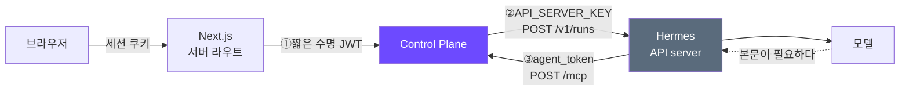
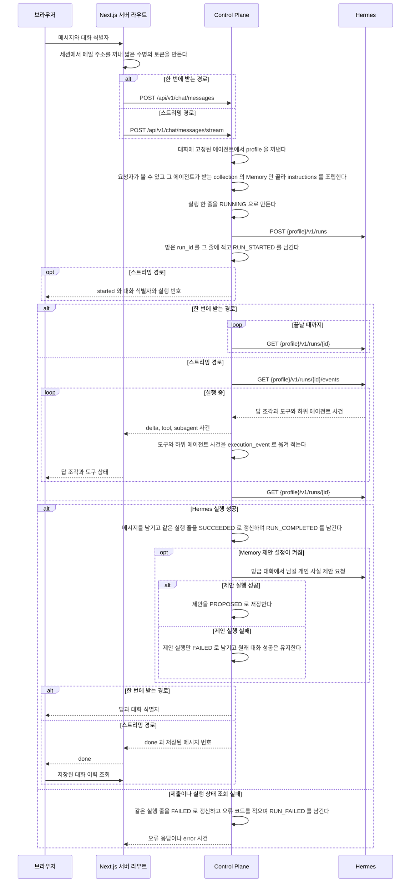

# 흐름

화면 전환과 호출 순서를 담는다.
모듈 배치는 [`code-architecture.md`](code-architecture.md), 저장 모델은 [`backend/schema/README.md`](backend/schema/README.md)가 가진다.

## 두 방향과 두 토큰

요청이 한 방향으로만 흐르지 않는다.
Control Plane 이 Hermes 를 부르고, Hermes 가 다시 Control Plane 을 부른다.
**그 둘이 쓰는 토큰이 다르다.**

```mermaid
flowchart LR
    B["브라우저"]
    W["Next.js<br/>서버 라우트"]
    C["Control Plane"]
    H["Hermes<br/>API server"]
    M["모델"]

    B -->|"세션 쿠키"| W
    W -->|"①짧은 수명 JWT"| C
    C -->|"②API_SERVER_KEY<br/>POST /v1/runs"| H
    H --> M
    M -.->|"본문이 필요하다"| H
    H -->|"③agent_token<br/>POST /mcp"| C

    style C fill:#6D4AFF,color:#fff
    style H fill:#5A6B7C,color:#fff
```

| 번호 | 누가 누구를 | 토큰 | 그 토큰이 말하는 것 |
| --- | --- | --- | --- |
| ① | 웹 → Control Plane | 짧은 수명 JWT | 이 사람이 로그인했다 |
| ② | Control Plane → Hermes | `API_SERVER_KEY` | 이 profile 을 쓸 자격이 있다 |
| ③ | Hermes → Control Plane | `agent_token` | 이 요청이 어느 profile 에서 왔다 |
| ④ | 다른 서비스 → Control Plane | 서비스 토큰 | 이 요청이 어느 사용자의 문서를 읽을 수 있다 |

**①은 사용자를 정하고 ③은 profile 만 정한다.** 둘은 성질도 다르다.
①을 받을 때마다 Control Plane 이 그 사용자가 허용 목록에서 꺼졌는지 확인한다. 꺼졌으면 401 `ACCESS_REVOKED` 로 답하고 웹이 세션을 끊는다. 흐름은 [`backend/people.md`](backend/people.md#사용자를-껐을-때) 의 「사용자를 껐을 때」 가 갖는다.
④는 사용자 한 사람과 받는 collection 을 정한다. 실행 없이 읽는 유일한 길이다. 그 사용자가 허용 목록에서 꺼지면 통하지 않는다.

| 축 | ① 웹 토큰 | ③ agent_token |
| --- | --- | --- |
| 만드는 때 | 요청마다 새로 | 한 번 발급하고 계속 씀 |
| 수명 | 짧다 | 폐기할 때까지 |
| 저장 | 저장하지 않는다 | 해시만 저장한다 |
| 두는 곳 | 만들어 바로 쓰고 버린다 | 홈서버 파일과 profile 의 `.env` |

②는 사용자를 정하지 않는다. profile 을 정할 뿐이다.
어느 사용자의 실행인지는 Control Plane 이 이미 알고 있고, 그것을 Hermes 에게 알리지 않는다.

Hermes 가 Control Plane 을 부를 때는 Control Plane 이 그 요청의 주인을 모른다.
**요청 본문에 사용자를 적게 하면 모델이 그것을 바꿀 수 있다.**
③도 사용자를 정하지 못한다. GROUP 에이전트는 여러 사용자가 같은 profile 을 쓰고, MCP 연결과 그 토큰은 profile 에 하나다.

그래서 사용자는 Control Plane 이 이미 기록한 실행에서 꺼낸다.
profile 플러그인이 도구 인자에 서명해 넣은 `_fos_ctx` 로 origin 실행 하나를 찾고, 그 실행의 `user_id` 가 요청자다. 하위 에이전트 session 은 만들 때 등록한 실행이, 최상위 session 은 지금 도는 실행이 origin 이다.
[`backend/mcp-caller.md`](backend/mcp-caller.md#mcp-호출의-요청자를-정할-때) 의 「MCP 호출의 요청자를 정할 때」 가 그 흐름이다. 결정은 [ADR-032](adr/ADR-032-mcp-토큰은-profile-을-증명하고-실제-사용자는-부모-실행에서-정한다.md) 와 [ADR-037](adr/ADR-037-hermes-하위-에이전트-session-의-주인은-만들-때-등록한-줄로-정한다.md) 에 있다.

## 대화 한 번

```mermaid
sequenceDiagram
    participant B as 브라우저
    participant W as Next.js 서버 라우트
    participant C as Control Plane
    participant H as Hermes

    B->>W: 메시지와 대화 식별자
    W->>W: 세션에서 메일 주소를 꺼내 짧은 수명의 토큰을 만든다
    alt 한 번에 받는 경로
        W->>C: POST /api/v1/chat/messages
    else 스트리밍 경로
        W->>C: POST /api/v1/chat/messages/stream
    end
    C->>C: 대화에 고정된 에이전트에서 profile 을 꺼낸다
    C->>C: 요청자가 볼 수 있고 그 에이전트가 받는 collection 의 Memory 만 골라 instructions 를 조립한다
    C->>C: 실행 한 줄을 RUNNING 으로 만든다
    C->>H: POST {profile}/v1/runs
    C->>C: 받은 run_id 를 그 줄에 적고 RUN_STARTED 를 남긴다
    opt 스트리밍 경로
        C-->>B: started 와 대화 식별자와 실행 번호
    end
    alt 한 번에 받는 경로
        loop 끝날 때까지
            C->>H: GET {profile}/v1/runs/{id}
        end
    else 스트리밍 경로
        C->>H: GET {profile}/v1/runs/{id}/events
        loop 실행 중
            H-->>C: 답 조각과 도구와 하위 에이전트 사건
            C-->>W: delta, tool, subagent 사건
            C->>C: 도구와 하위 에이전트 사건을 execution_event 로 옮겨 적는다
            W-->>B: 답 조각과 도구 상태
        end
        C->>H: GET {profile}/v1/runs/{id}
    end
    alt Hermes 실행 성공
        C->>C: 메시지를 남기고 같은 실행 줄을 SUCCEEDED 로 갱신하며 RUN_COMPLETED 를 남긴다
        opt Memory 제안 설정이 켜짐
            C->>H: 방금 대화에서 남길 개인 사실 제안 요청
            alt 제안 실행 성공
                C->>C: 제안을 PROPOSED 로 저장한다
            else 제안 실행 실패
                C->>C: 제안 실행만 FAILED 로 남기고 원래 대화 성공은 유지한다
            end
        end
        alt 한 번에 받는 경로
            C-->>B: 답과 대화 식별자
        else 스트리밍 경로
            C-->>W: done 과 저장된 메시지 번호
            W-->>B: done
            B->>W: 저장된 대화 이력 조회
        end
    else 제출이나 실행 상태 조회 실패
        C->>C: 같은 실행 줄을 FAILED 로 갱신하고 오류 코드를 적으며 RUN_FAILED 를 남긴다
        C-->>W: 오류 응답이나 error 사건
    end
```

대화가 없으면 새로 만들고 첫 메시지가 에이전트를 정한다.
이어지는 요청이 에이전트를 다시 주더라도 대화에 적힌 값을 쓴다.
`hermes_session_id` 가 특정 profile 안의 session 이라, 중간에 에이전트가 바뀌면 그 session 이 가리키는 것이 없어진다.

실행 줄은 Hermes 를 부르기 전에 `RUNNING` 으로 먼저 만들어진다.
그래서 오래 도는 실행도 사용량 화면에서 보이고, 서버가 중간에 죽어도 그 실행이 기록에 남는다.

두 경로 모두 Hermes 실행 상태 조회가 돌려준 최종 `output` 과 `usage` 를 저장한다.
스트리밍 경로의 답 조각은 화면에만 쓰며, 이벤트 연결이 중간에 끝나도 최종 상태를 조회해 메시지와 실행 기록을 남긴다.
브라우저는 `done` 을 받으면 대화 이력을 다시 읽고 화면의 답 조각을 저장된 답으로 바꾼다.

**사건이 없는 동안에도 스트림에 바이트를 흘린다.**
모델이 도구 없이 생각만 하는 동안에는 보낼 사건이 없다.
실제 실행에서 사건 사이가 229초 벌어졌고, 앞단 프록시가 약 100초 만에 연결을 끊어 화면이 끊김을 알렸다.
Control Plane 은 실행이 도는 동안 `assistant.chat.stream-heartbeat`(기본 20초)마다 SSE 주석 줄 `:ping` 을 보낸다.
주석 줄은 사건이 아니라 web 의 파서가 건너뛰므로 화면에는 아무것도 바뀌지 않는다.

**실행의 시작과 끝은 두 경로 모두 남는다.**
`RUN_STARTED` 와 `RUN_COMPLETED` 와 `RUN_FAILED` 는 Hermes 사건을 옮겨 적은 것이 아니라
Control Plane 이 직접 적는 것이다.
그래서 스트림을 열지 않는 경로에도 실행의 시작과 끝이 남는다.
도구와 하위 에이전트 사건은 스트리밍 경로에만 온다. 그것이 맞다.

**사건 저장이 실패해도 대화는 성공으로 끝난다.**
사건은 관측용이고 그것 때문에 답이 사라지면 안 된다.
기동할 때 남은 실행을 정리하는 경로도 끝 사건을 남긴다. 실패로 적은 실행에는 그 오류 코드를 담은 `RUN_FAILED` 가 남는다.

## 실행이 실패할 때

| 오류 코드 | 원인 | 화면이 하는 일 |
| --- | --- | --- |
| `HERMES_PROFILE_KEY_MISSING` | profile 의 key 가 준비되지 않았다 | 서버 설정 문제로 안내한다 |
| `HERMES_RUN_TIMEOUT` | 제한 시간 안에 끝나지 않았다 | 다시 보내도록 안내한다 |
| `HERMES_BUSY` | Hermes 가 동시 실행 한도에 닿아 429 로 거절했다 | 붐빈다고 알리고 잠시 뒤에 다시 보내도록 안내한다 |
| `HERMES_UNAVAILABLE` | Hermes 에 닿지 못했다 | 연결 실패로 안내한다 |
| `PROVIDER_BLOCKED` | 고른 모델의 provider 계정이 모두 막혔다. Hermes 가 계정을 돌려 쓰고도 실패한 것이다 | 다른 모델을 골라 다시 보내도록 안내한다. 쓴 문장은 입력창에 되돌린다 |
| `MODEL_HIDDEN` | 이 실행이 돌 모델을 그룹이 숨겼다. 대화가 고른 모델, 단계의 모델, 에이전트 기본 모델, profile 의 기본 모델이 모두 대상이다 | 입력창의 설정에서 다른 모델을 고르도록 안내한다 |
| `EXECUTION_NOT_RUNNING` | 중지하려는 실행이 이미 끝났다 | 알리지 않고 곧 올 끝 사건을 기다린다 |
| `MESSAGE_NOT_LATEST` | 다시 생성하려는 답이 마지막이 아니다 | 이력을 다시 읽는다 |
| `CONVERSATION_BUSY` | 그 대화에서 도는 turn 이 있다. 보내기와 다시 생성과 결과 다시 전달이 받는다 | 글만 보낸 것이면 대기 메시지로 다시 넣는다. 사진이 붙었거나 다시 생성이거나 흐름이 붙은 에이전트면 끝난 뒤에 다시 보내게 하고 쓴 문장을 입력창에 되돌린다 |
| `USER_BUSY` | 그 사용자가 다른 대화와 위임으로 동시 실행 한도를 모두 쓰고 있다([`backend/execution-limit.md`](backend/execution-limit.md)). 보내기, 다시 생성, 결과 다시 전달, 대기 메시지 turn, 흐름 단계가 받는다 | 진행 중인 작업이 끝난 뒤 다시 보내도록 안내한다. 쓴 문장은 입력창에 되돌리고 대기 메시지로 넣지 않는다. 대기 메시지 turn 이면 대기 줄이 멈춘 채 남는다 |
| `PENDING_QUEUE_FULL` | 대기 메시지가 5개이거나, 더하면 합친 길이가 8000자를 넘는다 | 답이 끝난 뒤 보내도록 안내한다. 쓴 문장은 입력창에 되돌린다 |
| `PENDING_MESSAGE_NOT_FOUND` | 취소하려는 대기 메시지가 이미 보내졌거나 없다 | 입력창에 되돌리지 않고 대기 줄을 다시 읽는다 |
| `EXECUTION_NOT_FOUND` | 없는 실행이거나 남의 실행이다 | 사용량 목록으로 되돌린다 |
| `DELIVERY_NOT_FOUND` | 다시 전달하려는 결과 묶음이 그 대화에 없다 | 안내를 보이고 이력을 다시 읽는다 |
| `DELIVERY_NOT_RETRYABLE` | 다시 전달하려는 묶음이 이미 전하는 중이거나 끝났다. 묶음의 결과가 남지 않았거나 대화에 흐름이 붙은 때도 같다 | 안내를 보이고 이력을 다시 읽는다 |

사용자가 보낸 요청이 `HERMES_BUSY` 나 `USER_BUSY` 를 받으면 Control Plane 은 다시 보내지 않는다. 위임 결과 자동 turn 의 재시도는 [`backend/execution-limit.md`](backend/execution-limit.md) 의 「한도에 닿을 때」 가 갖는다.
한도에 닿은 상태에서 다시 보내면 한도를 더 밀어붙인다. 다시 보낼지는 사람이 정한다.

`EXECUTION_NOT_FOUND` 는 두 원인을 같은 응답으로 숨긴다.
남의 실행이 있는지조차 알려주지 않기 위해서다.

실패한 실행도 기록에 남는다.
사용량 화면에서 무엇이 실패했는지 볼 수 있다.
실행 트리의 실패 줄은 오류 코드를 위 표의 안내 문구로 바꿔 보이고, 코드 원문은 관리자 영역의 실행 상세(`/admin/executions/{id}`)에서만 함께 보인다.
