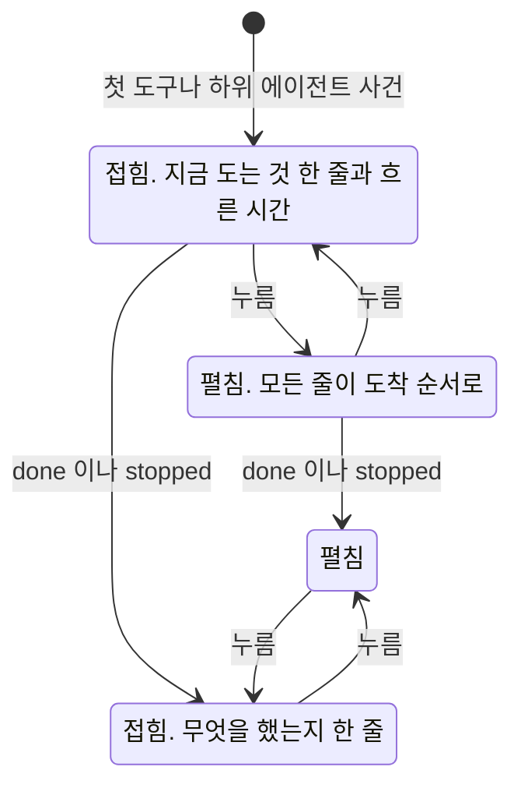

# 작업 과정

에이전트가 답을 만드는 동안 한 일을 화면이 보이는 방법을 갖는다.
끝난 실행을 트리로 다시 보는 화면과, 대화의 답 위에 접혀 있는 작업 과정 블록과 그 패널이 여기 있다.

## 실행 하나를 다시 볼 때

사용량 목록의 한 줄을 누르면 `/executions/{id}` 로 간다.
자식 실행을 가진 줄에는 목록에서 그것을 표시해, 트리로 들어갈 곳을 고를 수 있게 한다.

그 화면이 여는 순간 한 번 읽는다. 실시간으로 갱신하지 않는다.
돌고 있는 실행은 대화 화면이 이미 흘려 보이고, 이 화면은 끝난 뒤에 다시 보는 자리다.

| 무엇 | 어디서 |
| --- | --- |
| 브라우저가 부르는 것 | `GET /api/usage/executions/{id}/tree` |
| 서버 라우트가 부르는 것 | `GET /api/v1/usage/executions/{id}/tree` |

브라우저가 Control Plane 토큰을 갖지 않으므로 서버 라우트가 토큰을 만들어 부른다.

어느 실행 번호로 물어도 그 실행이 속한 트리의 루트부터 온다.
자식에서 들어와도 전체를 보게 하기 위해서다.

머리에 실행 요약을 두고 그 아래에 사건을 들여쓴 목록으로 그린다.
`TOOL_STARTED` 와 그 뒤의 `TOOL_COMPLETED` 는 한 줄로 합친다.
둘을 따로 보이면 줄 수가 두 배가 되고 읽을 것이 늘지 않는다.
짝이 없으면 「끝나지 않음」 으로 보인다. 그 실행이 도중에 끊긴 것이다.

`SUBAGENT_STARTED` 는 자식 노드가 있든 없든 언제나 한 줄로 그린다.
자식 실행에 어느 사건에서 났는지가 적혀 있지 않아 둘을 짝지을 방법이 없다.
하위 에이전트가 자식 실행 줄을 남기는 경로가 생기면
같은 하위 에이전트가 줄과 자식 노드로 한 번 겹쳐 보인다.
그 겹침은 결함이 아니라 여기서 고른 대가다.
겹쳐 보이는 쪽이 사건이 통째로 사라지는 쪽보다 낫다고 보았다.

`RUN_STARTED` 와 `RUN_COMPLETED` 는 줄로 그리지 않는다.
머리의 상태와 걸린 시간이 이미 그것을 말한다. `RUN_FAILED` 만 그 자리에 오류로 그린다.

| 상황 | 화면 |
| --- | --- |
| 사건이 하나도 없다 | 기록된 작업이 없다는 한 줄. 요약은 그대로 보인다 |
| 남의 실행 번호다 | `EXECUTION_NOT_FOUND`. 없는 것과 같은 오류다 |
| 자식 쪽이 잘렸다 | 잘린 노드의 자식 자리에 여기부터 보이지 않는다는 한 줄 |
| 루트 쪽이 잘렸다 | 루트 위에 위쪽 기록이 없어 여기가 첫 실행이 아닐 수 있다는 한 줄 |

사건이 없는 것은 정상이다.
스트림을 열지 않는 경로로 돈 실행에는 도구 사건이 오지 않는다.

**잘린 곳이 둘이라 알리는 자리도 둘이다.**
자식 쪽이 잘리면 그 노드가 어디서 끊겼는지 알 수 있어 그 자리에 적는다.
루트 쪽이 잘리면 끊긴 자리가 화면 밖이라 노드에 적을 수 없다.
그래서 지금 보이는 루트가 진짜 루트가 아닐 수 있다는 것을 위에 적는다.
둘을 함께 적어 두 번 말하지 않는다.

## 작업 과정 블록

에이전트가 답을 만드는 동안 무엇을 했는지를 답 위의 블록 하나로 보인다.
ChatGPT 가 생각하는 과정을 접어 두는 것과 같은 자리다.

```
비서
┌ ✓ 찾아보고 도우미와 함께 정리했어요 ▾ ──────────────────┐
│  ✓ 검색했어요         제주 3월 날씨               2초    │
│  ⟳ 도우미             숙소 후보를 조사한다                │
│                              걸린 시간 1분 12초 · 자세히 보기 │
└────────────────────────────────────────────────────────┘
(답 본문)
```

**접힌 블록은 사람 말 한 줄이다.** 도구 수, 하위 에이전트 수, 모델 이름, 토큰 수를 대화에 그리지 않는다.
대화는 일반 사용자가 읽는 자리이고, 그 값은 관리자 영역의 사용량 화면이 보인다.
화면은 하위 에이전트를 「도우미」 라고 부른다.

| 접힌 블록의 상태 | 한 줄 |
| --- | --- |
| 도는 중 | 일하는 중 점, 지금 도는 줄의 말, 흐른 시간 |
| 끝남, 도구와 하위 에이전트를 모두 썼다 | 찾아보고 도우미와 함께 정리했어요 |
| 끝남, 하위 에이전트만 썼다 | 도우미와 함께 정리했어요 |
| 끝남, 도구만 썼다 | 필요한 것을 확인하고 답했어요 |
| 끝남, 흐름의 단계만 있다 | 차례로 정리했어요 |
| 사용자가 중지했다 | 하다가 멈췄어요 |
| 오류로 끝났다 | 끝까지 하지 못했어요 |

블록은 진행 중과 끝난 뒤에 같은 자리에 있다. 비서 이름 아래, 답 본문 위다.

블록은 사건이 하나라도 온 답에만 생긴다. 도구도 하위 에이전트도 쓰지 않은 답에는 없다.

| 무엇 | 한 줄 |
| --- | --- |
| 도구 | 아래 「도구를 보이는 말」 의 규칙으로 옮긴 문장, 끝났으면 걸린 시간. 실패면 오류 색 아이콘과 「실패」. `detail` 은 검색어와 사진 질문만 줄에 보인다. 그 밖의 `detail` 과 도구 이름 원문은 관리자 영역의 실행 상세에서 「원본 보기」 를 펼칠 때만 보인다 |
| 하위 에이전트 | 「도우미」 와 목표, 끝났으면 걸린 시간. 모델과 토큰은 그리지 않는다 |
| 흐름의 단계 | 단계 이름. 알려진 이름은 한국어로, 모르는 이름은 받은 그대로 |
| provider 전환 | 대화의 작업 과정에는 그리지 않는다. 예전 실행에만 있는 사건이고, 관리자 영역의 실행 상세(`/admin/executions/{id}`)가 실행 트리의 한 줄로 보인다 |

| 하위 에이전트 상태 | 뜻 |
| --- | --- |
| 도는 중 | 답이 진행 중이고 자식 완료 사건을 아직 받지 않았다 |
| 끝남 / 실패 | 자식 완료 사건이나 자식 실행의 종료 기록을 받았다 |
| 결과를 받지 못함 | 답이 끝났지만 자식 완료 사건을 받지 못했다. 자식이 실제로 끝났는지는 알 수 없다 |
| 중지됨 | 사용자가 답을 중지했거나 자식 실행에 취소 기록이 있다. 이미 끝난 자식은 종료 상태를 유지한다 |

걸린 시간은 초 단위로 보인다. 1초가 안 되는 시간은 그리지 않는다.
Hermes 최상위 위임은 부모보다 늦게 끝날 수 있어 부모 스트림이 닫힌 것만으로 중지를 판정하지 않는다.
하위 에이전트 이름이 없으면 목표를, 목표도 없으면 `preview` 를 80자 이내로 줄여 보인다.
둘 다 없으면 「도우미」 로 보인다. 실행 트리도 같은 이름 표시를 쓴다.

단계는 도착한 순서로 그린다. 아직 오지 않은 단계는 그리지 않는다. 이름과 차례를 화면에 박아 두지 않는다.
무엇을 나눌지는 Hermes 가 정하므로 단계가 바뀔 때마다 화면을 고치지 않게 한다.
근거는 [ADR-017](../adr/ADR-017-무엇을-할지는-hermes-가-정하고-control-plane-은-경계만-갖는다.md) 에 있다.

**`started` 와 `completed` 는 한 줄로 합친다.** 도구는 도착한 순서로 짝짓고,
하위 에이전트는 `subagentId` 가 있으면 그것으로, 없으면 도착한 순서로 짝짓는다.



**오류로 끝난 turn 도 블록을 지우지 않는다.** 그 화면에서는 그때까지 온 줄과 실패한 줄을 남긴 채 접힌 요약으로 바뀌고, 그 아래에 오류가 보인다.
완료 사건이 없는 하위 에이전트는 「결과를 받지 못함」 으로, 나머지 끝나지 않은 줄은 네모 아이콘으로 보이고 낭독기에는 「끝나지 않음」 으로 읽힌다.
새로 고치면 저장된 답이 없어 블록도 없다. 그 실행의 기록은 사용량 화면의 트리에서 본다.

### 도구를 보이는 말

도구 이름을 그대로 보이지 않고 사람 말로 옮긴다. 도는 줄과 끝난 줄의 말이 다르다.
도는 중인 접힌 블록의 한 줄에도 도는 줄의 말을 쓴다. 실행 트리의 도구 줄은 끝난 줄의 말을 쓴다.

문구는 `web/src/lib/tool-label.ts` 가 갖는다. 그 파일의 표에 없는 도구는 아래처럼 보인다.

- 표에 없는 MCP 도구(`mcp__` 로 시작한다)는 연결된 서비스를 쓴다고만 알린다. 도구 이름 원문을 보이지 않는다
- 그 밖의 표에 없는 도구와 이름이 없는 도구는 도구를 쓴다고만 알린다

MCP 도구는 `mcp__{서버}__{도구}` 로 오므로 마지막 `__` 뒤의 이름으로 표를 찾는다.

**`detail` 은 관리자만 모든 도구에서 받는다.** 사용자에게는 `web_search` 의 검색어와 `vision_analyze` 의 질문만 온다.
Control Plane 이 응답에서 뺀다. 화면도 받은 것을 그대로 그리지 않는다. 명령과 도구 결과의 원본은 JSON 이나 내부 경로라, 관리자 영역의 실행 상세(`/admin/executions/{id}`)에서만 접어 두고 펼칠 때 보인다. 대화 화면의 작업 과정에는 관리자에게도 그리지 않는다. 근거는 [ADR-038](../adr/ADR-038-도구의-명령-원문은-관리자에게만-보내고-사용자에게는-사람-말로-보인다.md) 에 있다.
사용량 화면의 실행 트리도 같은 응답을 쓴다.

### 펼친 목록의 높이

펼친 블록의 목록은 높이 상한 안에서 스크롤한다. 도구를 수십 번 부른 답에서 목록이 대화를 밀어내지 않게 한다.
상한은 `16rem` 이다. 좁은 폭과 넓은 폭이 같다.

| 상황 | 목록 |
| --- | --- |
| 도는 중이고 사용자가 맨 아래를 보고 있다 | 새 줄이 오면 맨 아래로 따라간다 |
| 도는 중이고 사용자가 위로 올려 읽고 있다 | 따라가지 않는다. 사용자가 맨 아래로 다시 내리면 그때부터 따라간다 |
| 끝난 답을 펼친다 | 맨 위부터 보인다. 따라가지 않는다 |

맨 아래에서 `16px` 안이면 맨 아래를 보고 있는 것으로 본다.
작업 과정 패널은 이미 제 높이 안에서 스크롤하므로 바꾸지 않는다.

### 끝난 답에서 다시 볼 때

메시지 조회가 답마다 작업 과정의 요약을 함께 준다. 도구 수, 하위 에이전트 수, 걸린 시간이다.
블록은 그 요약으로 접힌 채 그린다. 수는 접힌 한 줄의 문장을 고르는 데만 쓰고 그리지 않는다. 걸린 시간은 펼친 블록 아래에 보인다. 1초가 안 되면 그리지 않는다.
**펼칠 때 처음으로 실행 트리를 읽는다.** 답이 여럿인 대화를 열 때마다 트리를 모두 읽지 않기 위해서다.

| 상황 | 블록 |
| --- | --- |
| 사건이 없는 답 | 블록을 그리지 않는다 |
| 한 번에 받는 경로로 돈 답 | 도구 사건이 오지 않는 경로라 블록이 없다. 그것이 맞다 |
| 펼쳤는데 트리를 읽지 못했다 | 블록 안에 작업 과정을 읽지 못했다는 안내와 다시 읽기 단추 |
| 중지한 답 | 멈춘 자리까지의 줄. 끝나지 않은 줄은 「중지됨」 |

### 작업 과정 패널

블록의 「자세히 보기」를 누르면 오른쪽 패널이 열린다.
`/executions/{id}` 화면과 같은 실행 트리를 대화를 떠나지 않고 본다.

| 무엇 | 패널 |
| --- | --- |
| 도는 중인 답 | 흘러온 사건으로 만든 줄을 그대로 보인다. 트리는 끝난 뒤에 읽는다 |
| 끝난 답 | `GET /api/usage/executions/{id}/tree` 로 한 번 읽는다 |
| 다른 답의 블록을 누른다 | 패널이 그 답으로 바뀐다 |
| 닫기 단추나 `Esc` | 닫힌다. 답을 만드는 중에는 `Esc` 가 중지보다 패널 닫기를 먼저 한다 |
| 다른 대화로 간다 | 닫힌다 |
