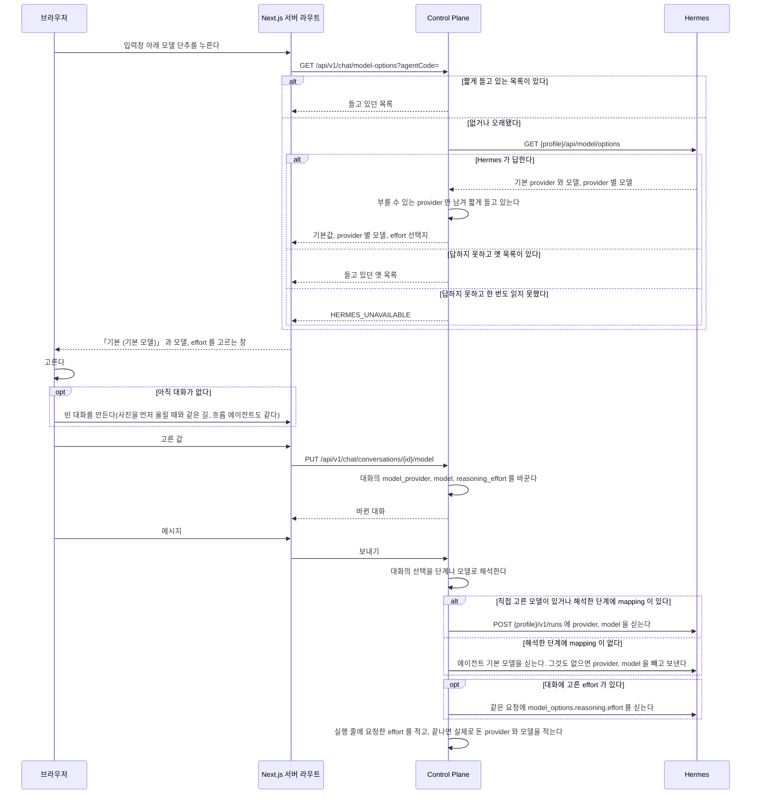
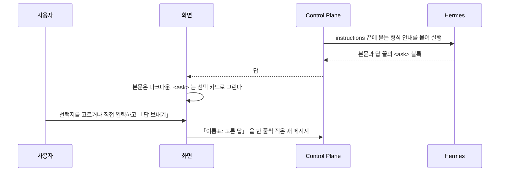
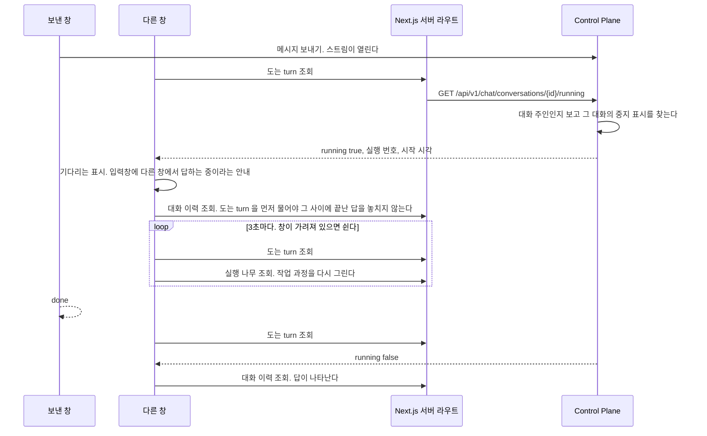
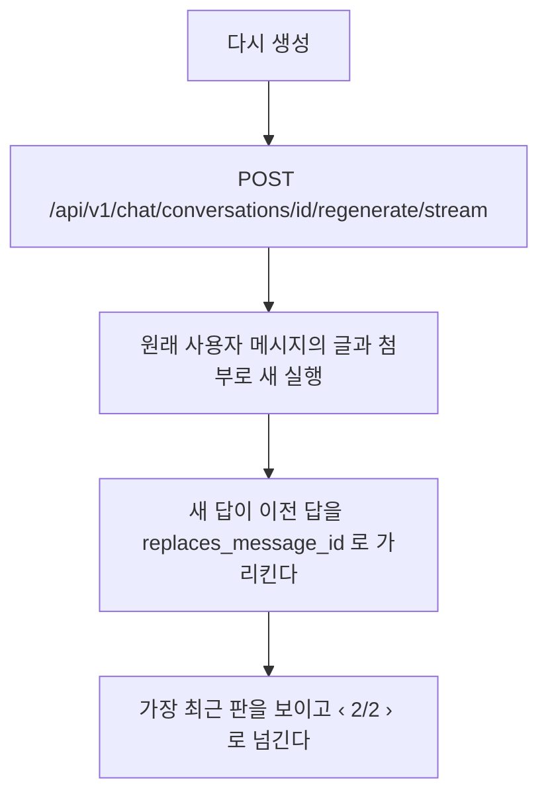
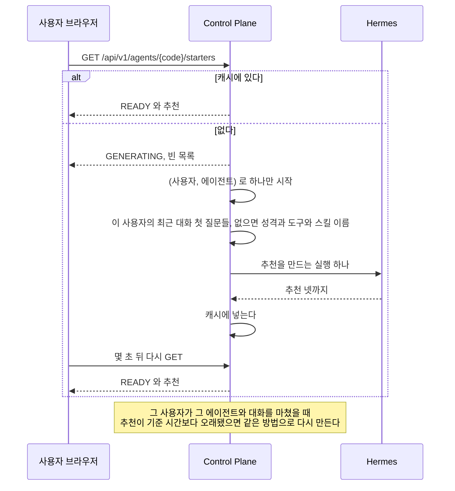

# 대화 화면

## 모델을 고를 때

에이전트는 모델을 갖지 않는다. 사용자가 대화에서 모델과 reasoning effort 를 고른다.
선택은 `DEFAULT`, `TIER`, `CUSTOM` 세 모드다. 고르지 않은 대화가 어느 모델로 도는지는 [모델 단계](../model-tiers.md) 의 「모델 선택」 이 정한다.
근거는 [ADR-030](../adr/ADR-030-모델과-effort-는-대화가-고르고-기본값은-hermes-profile-이-갖는다.md) 에 있다.



### 갈리는 지점

| 무엇 | 어떻게 되나 |
| --- | --- |
| Hermes 가 목록을 주지 못하고 들고 있던 목록이 있다 | 들고 있던 옛 목록을 보인다 |
| Hermes 가 목록을 주지 못하고 그 profile 의 목록을 한 번도 읽지 못했다 | `HERMES_UNAVAILABLE` 이다. 목록 창에 불러오지 못했다고 보인다. 대화는 기본값으로 계속 보낼 수 있다 |
| 목록에 `authenticated` 가 거짓인 provider 가 있다 | 뺀다. 부를 수 없는 provider 다 |
| 고른 모델이 나중에 목록에서 빠졌다 | 대화에 적힌 값을 그대로 보낸다. 모델을 찾지 못하면 Hermes 가 그 실행을 실패로 끝내고, 사용자가 다른 모델을 고른다. 고르는 창은 목록에 없거나 목록을 읽지 못해도 대화에 적힌 모델을 선택지에 남긴다. effort 만 바꿔도 모델이 「기본」 으로 돌아가지 않게 한다 |
| provider 와 모델 중 하나만 온다 | 거절한다. 둘은 함께 채우거나 함께 비운다 |
| provider 가 64자, 모델이 128자를 넘는다 | 거절한다. 대화 표의 칸 길이다 |
| effort 가 선택지에 없는 값이다 | 거절한다 |
| 모델이 받지 않는 effort 를 골랐다 | 그대로 보낸다. Hermes 가 그 provider 의 값으로 맞춘다 |
| 도는 turn 이 있는데 바꾼다 | 받는다. 도는 turn 은 시작할 때의 값으로 끝난다. 그 turn 의 Memory 제안과 흐름의 남은 하위 실행도 같다. 바꾼 값은 다음 보내기부터 쓴다. 화면도 답을 만드는 동안 단추를 막지 않는다 |
| 저장하는 중이다 | 단추는 고른 값을 먼저 보이고, 보내기와 추천 질문을 막는다. 저장이 끝나기 전에 보낸 메시지가 이전 값으로 돌지 않게 한다 |
| 저장하지 못했다 | 단추가 이전 값으로 돌아가고 「모델을 바꾸지 못했어요. 잠시 뒤 다시 시도해 주세요.」 를 보인다. 빈 대화를 만들지 못했으면 입력창이 알린 오류만 보인다 |
| 고를 에이전트가 아직 없다 | 단추를 막는다. 빈 대화를 만들 에이전트가 정해지지 않았다 |
| 기존 대화의 목록 줄이 아직 오지 않았다 | 단추를 막는다. 대화에 적힌 모델을 모르는 채 고르게 하면 「기본」 으로 저장해 적힌 모델을 지우게 된다. 목록 읽기가 실패하면 다음에 목록을 읽어 올 때까지 막혀 있다 |
| 남의 대화다 | 없는 대화와 같은 응답이다 |
| 고른 모델의 provider 가 막혔다 | 그 실행은 `PROVIDER_BLOCKED` 로 실패한다. Control Plane 은 다른 모델로 넘기지 않는다 |
| 다시 생성, Memory 제안, 흐름의 하위 실행 | 그 대화에 적힌 값을 쓴다 |

모델 목록은 저장하지 않는다. Hermes 가 답한 것을 Control Plane 메모리에 10분 들고 있는다.
profile 마다 따로 들고 있고, Control Plane 이 다시 뜨면 비어서 시작한다.

## 에이전트가 물을 때

에이전트가 이어 가려면 사용자가 정하거나 알려 줘야 하는 것이 있으면, 답 끝에 `<ask>` 블록을 둔다.
화면이 그 블록을 선택 카드로 그리고, 고른 답이 평범한 다음 메시지로 나간다.
근거는 [ADR-026](../adr/ADR-026-에이전트가-물을-것은-답-끝의-태그로-두고-화면이-카드로-그린다.md) 에 있다.



형식은 한 줄에 태그 하나다.

```
<ask>
<question header="식당 이름">어느 식당에 다녀왔어?</question>
<option>행복담</option>
<option description="사진의 간판 글자">행복한 담벼락</option>
</ask>
```

**실행은 답을 기다리지 않는다.** 답을 보내는 순간 끝나 있고, 답은 다음 turn 으로 온다.
그래서 기다리는 상태와 시간 제한이 없다. 카드를 무시하고 입력창에 다른 글을 보내도 된다.

형식 안내는 사용자가 직접 답하는 대화 실행에만 붙는다. 흐름의 Chief 와 자식에게는 붙이지 않는다.
실행 기록의 `context_chars`와 `instructions_hash`는 공통 답변 지침과 Memory 문맥을 대상으로 한다.
Memory가 없어도 공통 표 지침의 길이와 지문을 기록하며, 이 묻는 형식 안내는 제외한다.

### 갈리는 지점

| 상황 | 화면 |
| --- | --- |
| 마지막 답의 카드 | 누를 수 있다. 모든 질문에 답해야 「답 보내기」 가 켜진다 |
| 지난 답의 카드 바로 다음 메시지가 카드 답 형식일 때 | 고른 선택지와 직접 입력한 답을 보인다. 새로 고침 뒤에도 대화 기록에서 되찾는다. 누를 수 없다 |
| 지난 답의 카드 바로 다음 메시지가 다른 글일 때 | 무엇을 물었는지만 보인다. 누를 수 없다 |
| 돌고 있는 turn 이 있을 때, 이전 버전을 보고 있을 때 | 누를 수 없다 |
| 보낸 답이 전송에 실패했을 때 | 그 답이 다시 마지막이 되어 카드를 다시 누를 수 있다 |
| 직접 입력을 골라 놓고 비워 둠 | 그 질문은 답하지 않은 것으로 본다 |
| 선택지가 없는 질문 | 직접 입력 칸만 보인다 |
| `multiple="true"` | 여럿을 고를 수 있다. 고른 것을 쉼표로 이어 보낸다 |
| 스트리밍 중에 아직 닫히지 않은 블록 | 그 자리부터 그리지 않는다. 반쯤 온 태그가 글자로 보이지 않게 한다 |
| 모양이 어긋난 블록, 끝까지 닫히지 않은 블록 | 카드 대신 원문을 코드 블록으로 보인다 |
| 코드 블록 안의 `<ask>` | 예시로 보고 카드로 그리지 않는다 |
| 한 답에 블록이 여럿 | 마지막 카드만 누를 수 있다 |

질문은 넷까지, 질문마다 선택지는 여섯까지다. 같은 이름의 선택지가 둘이면 어긋난 블록으로 본다.
길이는 이름표 40자, 질문 400자, 선택지 120자, 설명 240자까지이고, 넘으면 어긋난 블록으로 본다.
형식 안내도 같은 상한을 에이전트에게 알린다.

## 다른 창에서 답하는 중일 때

한 사람이 같은 대화를 두 창에서 연다. 한 창에서 보낸 질문의 답이 아직 오는 중이다.
다른 창은 그 답이 오는 중이라는 것을 보여 주고, 답이 끝나면 저장된 이력을 다시 읽는다.

**답 조각은 다른 창으로 보내지 않는다.** 스트리밍은 보낸 창에만 간다.
다른 창은 기다리는 표시와 작업 과정만 보이고, 답 본문은 끝난 뒤 이력으로 받는다.



| 상황 | 다른 창 |
| --- | --- |
| 도는 turn 이 없다 | 여느 때처럼 연다. 조회를 되풀이하지 않는다 |
| 실행 번호가 아직 없다 | 기다리는 표시만 보인다. 중지 단추는 눌리지 않는다. 다음 조회에서 번호를 받는다 |
| 다른 창에서 중지를 누른다 | 보낸 창과 같은 중지 경로다. 끝나면 두 창 모두 이력에서 「중지됨」 을 본다 |
| 끝났다 | 조회를 멈추고 이력을 다시 읽는다 |
| 조회가 실패한다 | 다음 주기에 다시 묻는다. 세 번 이어 실패하면 기다리는 표시를 거두고 이력을 다시 읽는다 |
| 조회하는 동안 대화가 지워졌다 | 조회를 멈추고 대화를 찾을 수 없다는 화면을 보인다 |
| 다른 대화로 옮기거나 창을 닫는다 | 조회를 멈춘다 |

보낸 창은 스트림이 이어지는 동안 이 조회를 하지 않는다. 자기 스트림으로 끝을 안다.

**보낸 창도 스트림이 끊기면 보는 창이 된다.**
`done` 이나 `stopped` 나 `error` 없이 스트림이 끝나면 오류로 끝내지 않고 도는 turn 을 묻는다.
보내기와 다시 생성이 같다.
실제로 끊긴 뒤에도 실행은 13분을 더 돌아 성공했는데 화면은 그동안 실패로 보였다.

| 상황 | 스트림이 끊긴 보낸 창 |
| --- | --- |
| turn 이 돌고 있다 | 이력을 다시 읽고 보는 창과 같은 상태로 바뀐다. 입력창 위에 응답 연결이 끊겨 답을 기다리는 중이라는 안내를 보인다 |
| turn 이 끝났고 답이 이력에 있다 | 이력을 다시 읽어 답을 보인다. 오류 문구를 띄우지 않는다 |
| turn 이 돌지 않고 답도 없다 | 응답 연결이 끊겼다는 안내와 답을 받지 못했다는 안내를 보인다. 끊기기 전과 같다 |
| `started` 전에 끊겼고 turn 이 돌지 않는다 | 이력에 새 질문이 저장돼 있으면 응답 연결이 끊겼다는 안내와 답을 받지 못했다는 안내를 보이고 글을 되돌리지 않는다. 저장된 질문과 되돌린 글이 함께 있으면 다시 보낼 때 질문이 두 번 저장되기 때문이다. 새 질문이 없을 때만 보낸 글을 입력창에 되돌린다 |
| 묻는 사이 대화가 지워졌다 | 대화를 찾을 수 없다는 화면을 보인다. 대화를 열 때와 보는 중과 같다 |
| 새 대화가 대화 번호를 받기 전에 끊겼다 | 물을 대화가 없다. 보낸 글을 입력창에 되돌리고 응답 연결이 끊겼다는 안내를 보인다 |

넘어갈 때 받던 답 조각은 치운다. 저장된 답이 아니고, 남기면 기다리는 표시 대신 멈춘 답처럼 보인다.
보내며 붙인 임시 질문은 이력을 다시 읽을 때 저장된 질문으로 바뀐다.
이미 받은 작업 과정은 그대로 두고 다음 실행 나무 조회 결과로 바꾼다.
끝나면 이력을 다시 읽으므로 화면에는 저장된 것만 남는다.

같은 창을 새로 고친 것도 보는 창이다. 새로 고친 창에는 보낸 스트림이 없다.
그 창은 자기가 보낸 turn 인지 알 수 없어 다른 창에서 답하는 중이라는 안내를 보인다.

다른 창에서도 입력창은 잠기지 않는다. 보낸 글은 대기 메시지로 쌓이고, 대기 줄은 `pending` 사건으로 모든 창이 같이 본다.
사진 첨부와 다시 생성은 답이 끝날 때까지 잠긴다.

## 다시 생성

마지막 답 아래에 다시 생성 아이콘 단추가 있다. 그보다 앞의 답에는 없다.
접근성 이름과 마우스를 올리거나 초점을 줬을 때의 풀이는 「다시 생성」 이다.

**사용자 메시지는 고치지 않는다.** 질문을 바꾸고 싶으면 돌고 있는 답을 중지하고 새 메시지로 보낸다.
근거는 [ADR-024](../adr/ADR-024-메시지-수정을-없애고-중지한-뒤-다시-보낸다.md) 에 있다.

**마지막 메시지가 답 없는 사용자 메시지일 때도 다시 생성을 연다.** 화면은 이것을 「다시 시도」 로 보인다.
실패했거나 남긴 답 없이 중지된 turn 이 그렇다.
그때 새 답은 가리킬 이전 답이 없어 `replaces_message_id` 가 비어 있다.
근거는 [ADR-022](../adr/ADR-022-다시-생성과-수정은-같은-session-에-판으로-쌓는다.md) 에 있다.



실행 입력의 `instructions` 끝에 한 줄을 덧붙인다.
앞의 답을 되풀이하지 말라는 것이다.
**사용자 메시지의 글은 고치지 않는다.**

| 상황 | 응답 |
| --- | --- |
| 대상이 마지막 메시지가 아니다 | `MESSAGE_NOT_LATEST`. 화면이 이력을 다시 읽는다 |
| 그 대화에서 도는 실행이 있다 | `CONVERSATION_BUSY`. 끝난 뒤에 다시 누르게 한다 |
| 다시 생성이 실패했다 | 이전 판이 그대로 남는다. 새 판은 생기지 않는다 |

**판은 답 한 줄 단위다.**
예전에 수정으로 생긴 사용자 메시지의 판은 데이터베이스에 남아 있어, 화면이 그 turn 의 판도 넘겨 볼 수 있게 둔다.
새로 만드는 경로는 없다.

## 메시지 동작

| 어디 | 동작 |
| --- | --- |
| 모든 답 | 복사. 마크다운 원문을 복사한다 |
| 마지막 답 | 위에 더해 다시 생성 |
| 코드 블록 | 오른쪽 위의 복사 |

넓은 화면에서는 마지막 답의 동작을 늘 보이고 나머지는 마우스를 올리거나 초점이 갈 때 보인다.
좁은 화면에서는 늘 보인다. 마우스를 올릴 수 없기 때문이다.
복사하면 단추가 잠깐 「복사됨」 으로 바뀐다. 복사하지 못하면 복사하지 못했다는 문구로 바뀐다.

## 새 대화 화면

`/` 에서 보이는 것이다. 입력창이 화면 가운데에 있고 첫 메시지를 보내면 아래로 내려간다.

```
            {이름}님, 무엇을 도와줄까요

   ┌ 가계부 비서 ┐ ┌ 여행 비서 ┐ ┌ 코딩 비서 ┐
   └────────────┘ └──────────┘ └──────────┘

   ┌───────────────────────────────────┐
   │ @ 로 에이전트를 부른다            ↑ │
   └───────────────────────────────────┘
   [기본 ⌄]
      [이번 달 지출 정리해 줘] [다음 주 식단 짜 줘]
```

| 무엇 | 동작 |
| --- | --- |
| 에이전트 카드 | 누르면 그 에이전트를 고른다. 처음에는 목록의 첫 에이전트가 골라져 있다 |
| 추천 질문 | 고른 에이전트에서 이 사용자가 자주 하는 일. 모델이 만든다. 누르면 그 글로 바로 보낸다 |
| 입력창의 `/` | 맨 앞에 치면 고른 에이전트의 스킬 목록이 뜬다. 아래 「스킬 커맨드로 보낼 때」 |
| 입력창의 `@` | 에이전트 목록이 뜨고 이름으로 거른다. 고르면 그 에이전트를 고르고 `@이름` 은 입력창에서 빠진다 |
| 첫 메시지 | 보내면 그 에이전트로 대화가 시작되고 에이전트는 그 대화에서 바뀌지 않는다 |
| 입력창 아래 모델 단추 | 누르면 모델과 effort 를 고르는 창이 뜬다. 처음에는 「기본」 이고, 고르면 빈 대화를 먼저 만들어 거기에 저장한다 |

**사진을 먼저 올려 빈 대화가 생기면 에이전트 카드와 `@` 가 잠긴다.** 그 대화의 에이전트가 이미 정해졌다.
모델을 먼저 고를 때도 같다. 고른 값을 저장할 대화가 있어야 해서 빈 대화를 먼저 만든다.
화면은 메시지가 없는 동안 새 대화 화면 모양을 그대로 쓴다.
흐름이 붙은 에이전트는 사진을 받지 않는다. 그 에이전트를 고르면 사진 단추가 없다.
연결용 에이전트는 그 커넥터의 `connector.json` 이 `attachments` 를 참으로 선언했을 때만 받는다([`connectors.md`](../connectors.md)).

**`@` 는 새 대화 화면에서만 뜬다.**
대화의 에이전트는 첫 메시지가 정하고 바뀌지 않는다. 중간에 다른 에이전트를 부르는 것은 에이전트가 정한다.

| 상황 | 화면 |
| --- | --- |
| 쓸 수 있는 에이전트가 없다 | 카드 자리에 쓸 수 있는 에이전트가 없으니 관리자에게 등록을 요청하라는 안내를 보인다. 입력창을 잠근다 |
| 에이전트가 하나다 | 카드를 그리지 않는다. 그 에이전트의 추천 질문만 |
| 추천을 만드는 중이다 | 그 자리를 비워 두고 2초 간격으로 세 번까지 다시 읽는다. 그래도 만드는 중이면 비워 둔다 |
| 추천을 만들지 못했다 | 그 자리를 비운다 |
| `@` 뒤 글자에 맞는 에이전트가 없다 | 목록에 맞는 에이전트가 없다는 한 줄 |

추천 질문은 사람이 고치지 않는다. 만드는 때와 규칙은 [`backend/agent.md`](../backend/agent.md#추천-질문) 가 갖는다.

### 추천을 만들 때



| 무엇 | 어떻게 되나 |
| --- | --- |
| 같은 키로 두 요청이 거의 함께 온다 | 만들기는 하나만 돈다. 둘 다 `GENERATING` 을 받는다 |
| 만들기가 실패하거나 Hermes 가 멈춰 있다 | 이전 추천을 그대로 둔다. 없으면 `NONE` 이고 화면은 자리를 비운다 |
| 재시작했다 | 캐시가 비어 첫 화면이 다시 만든다 |
| 그룹 공개 에이전트다 | 그 사용자의 대화만 읽는다 |
